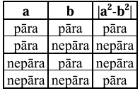
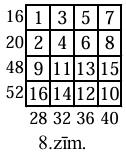
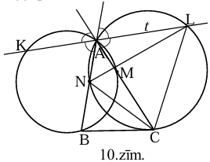

# <lo-sample/> LV.AMO.2003.5.1

Sauksim naturālu skaitli par interesantu, ja tas nesatur ciparu $0$ un tā 
pirmais cipars par $1$ mazāks nekā visu citu ciparu summa.

**(A)** kāds ir mazākais interesantais četrciparu skaitlis?

**(B)** kāds ir lielākais interesantais skaitlis?

<small>

* questionType:
* domain:

</small>

## Atrisinājums

**(A)** $\mathbf{2111}$. Trīs pēdējo ciparu summa nevar būt mazāka par $3$, 
tātad pirmais cipars nevar būt mazāks par $2$. Skaitlim $2111$ ir gan mazākais 
iespējamais pirmais cipars, gan mazākie iespējamie sekojošie cipari.

**(B)** $\mathbf{91111111111}$ (desmit cipari " $1$ "). Naturāls skaitlis ir jo
lielāks, jo tam vairāk ciparu. Tā kā pirmais cipars nepārsniedz $9$, tad citu 
ciparu summa nepārsniedz $10$; to iznāk visvairāk, ja tie ir $10$ vieninieki.

# <lo-sample/> LV.AMO.2003.5.2

Uz galda atrodas $7$ pēc ārējā izskata vienādas monētas. Ir zināms, ka $6$ no 
tām masas ir vienādas, bet septītajai masa **varbūt** ir citāda. Kā ar $2$ 
svēršanām uz sviras svariem bez atsvariem noskaidrot, vai atšķirīgā monēta ir 
un, ja tā ir, tad vai tā vieglāka vai smagāka par citām?

<small>

* questionType:
* domain:

</small>

## Atrisinājums

Ar pirmo svēršanu salīdzinām $A$, $B$ pret $C$, $D$. Ja svari **nav** līdzsvarā,
tad pašreiz uz tiem ir atšķirīgā monēta. Ar otro svēršanu salīdzinām $A,\ B$ 
pret $E,\ F$ ($E,\ F$ ir "īstās"). Ja ir līdzsvars, tad atškirīgās monētas 
attiecības ar īstajām noskaidro no $1.$ svēršanas rezultātiem (atšķirīgā ir 
viena no $C,\ D$). Ja nav līdzsvars, tad atšķirīgā ir viena no $A,\ B$; gan 
$1.$, gan $2.$ svēršana rāda, vai tā ir smagāka vai vieglāka par īsto.

Ja pirmajā svēršanā ir līdzsvars, tad otrajā svēršanā salīdzinām $A,\ B,\ C$ 
(tās visas ir "īstās") ar $E,\ F,\ G$. Ja atkal ir līdzsvars, tad atšķirīgās 
monētas nav. Ja nav līdzsvara, tad vajadzīgo uzzinām no otrās svēršanas 
(atšķirīgā monēta ir $E,\ F$ vai $G$).

# <lo-sample/> LV.AMO.2003.5.3

No $10 \times 10$ rūtiņu liela kvadrāta izgriezts centrālais $8 \times 8$ 
rūtiņu kvadrāts. Sagrieziet atlikušo "rāmi" iespējami mazā skaitā gabalu, lai 
no tiem varētu salikt vienu kvadrātu bez caurumiem un pārklāšanās. (Griezumiem 
jāiet pa rūtiņu robežām; **nav jāpierāda**, ka Jūsu iegūtais gabalu skaits ir 
mazākais iespējamais).

<small>

* questionType:
* domain:

</small>

## Atrisinājums

Kvadrātu var izveidot no $6$ gabaliem (skat. 1.zīm.).

Varat pamēģināt patstāvīgi pierādīt, ka $6$ ir mazākais iespējamais gabalu 
skaits.

# <lo-sample/> LV.AMO.2003.5.4

Vai kvadrātā, kas sastāv no $4 \times 4$ rūtiņām, var katrā rūtiņā ierakstīt 
naturālu skaitli no $1$ līdz $16$ (tiem visiem jābūt dažādiem) tā, lai nekādi 
divi skaitļi, kas ierakstīti rūtiņās ar kopīgu malu, abi vienlaicīgi nedalītos 
ne ar vienu citu naturālu skaitli kā $1$?

<small>

* questionType:
* domain:

</small>

## Atrisinājums

Jā. Skat., piem., 2.zīm.

Ievērojiet: ja rūtiņas izkrāsotu šaha galdiņa kārtībā, tad pāra skaitļi atrodas
melnajās rūtiņās, bet nepāra - baltajās rūtiņās.

# <lo-sample/> LV.AMO.2003.5.5

Kastē atrodas $10$ baltas, $12$ sarkanas un $16$ zaļas lodītes. Ar vienu 
gājienu no kastes var izņemt divas dažādu krāsu lodītes un ielikt kastē vienu 
trešās krāsas lodīti. Vai var panākt, lai kastē paliek tikai viena lodīte? Vai 
to var panākt, ja sākotnējie lodīšu daudzumi ir $10,\ 12$ un $15$?

<small>

* questionType:
* domain:

</small>

## Atrisinājums

**(A)** nē, nevar. Ar katru gājienu visu krāsu lodīšu skaita paritāte mainās 
(no pāra uz nepāra un atpakaļ). Tāpēc nevar būt, ka divi daudzumi ir $0$ (pāra 
skaitlis), bet viens - $1$ (nepāra skaitlis).

**(B)** jā, var. Ar $3$ pēc kārtas sekojošiem gājieniem ņemot $bs,\ bz,\ sz$, 
visi daudzumi samazinās par $1$. Izveidojam situāciju $1b,\ 3s,\ 6z$. Tālāk ar 
gājieniem $sz,\ sz,\ bz$ izveidojam situāciju $2b,\ 2s,\ 3z$. To ar gājieniem 
$bs,\ sz,\ bz,\ sz,\ bz,\ bs$ pārveidojam par $0b,\ 0s,\ 1z$.

# <lo-sample/> LV.AMO.2003.6.1

Šodien pulkst. $12^{00}$ divi pulksteņi ar parastu ciparnīcu rādīja pareizu 
laiku. Pirmais pulkstenis katru dienu steidzas par $4$ minūtēm, otrais 
pulkstenis katru dienu atpaliek par $6$ minūtēm. Pēc cik dienām pirmo reizi 
pulkst. $12^{00}$ abi pulksteņi atkal rādīs pareizu laiku?

<small>

* questionType:
* domain:

</small>

## Atrisinājums

Lai 1.pulkstenis $12^{00}$ rādītu pareizu laiku, tam jāpasteidzas par 
$12,\ 24,\ 36,\ \ldots$ stundām. Tas notiek ik pēc $180$ dienām. Pēc $180$ 
dienām otrais pulkstenis ir atpalicis par $\frac{180 \cdot 6}{60}=18$ stundām, 
pēc $360$ dienām - par $36$ stundām. Tātad uzdevuma atbilde ir $\mathbf{360}$ 
**dienas**.

# <lo-sample/> LV.AMO.2003.6.2

Kvadrāts sastāv no $n \times n$ rūtiņām; viena stūra rūtiņa izgriezta. Rūtiņas 
malas garums ir $1$. Atlikušo daļu jāsadala taisnstūros ar izmēriem 
$1 \times 2$ tā, lai pusei no tiem garākā mala ietu vienā virzienā, bet pusei -
otrā. Vai to var izdarīt, ja **(A)** $n=5$, **(B)** $n=7$?

<small>

* questionType:
* domain:

</small>

## Atrisinājums

**(A)** Jā, var. Skat. 3.zīm.

**(B)** nē, nevar. Skat. 4.zīm. Būtu jābūt $24$ "horizontāliem" taisnstūriem. 
Katrs horizontālais tainstūris satur $0$ vai $2$ baltas rūtiņas. Savukārt katrs
no $24$ "vertikāliem" taisnstūriem satur tieši $1$ baltu rūtiņu. Tātad visi 
taisnstūri kopā satur pāra skaitu balto rūtiņu. Bet balto rūtiņu pavisam ir 
$21$ - pretruna.

# <lo-sample/> LV.AMO.2003.6.3

Vai var rindā izrakstīt divus ciparus $1$, divus ciparus $2,\ \ldots$, divus 
ciparus $5$ tā, lai katrs izrakstītais viencipara skaitlis, izņemot pirmo un 
pēdējo, būtu vienāds ar savu abu kaimiņu summu vai starpību?

<small>

* questionType:
* domain:

</small>

## Atrisinājums

Jā, var, piemēram:

$$4,\ 5,\ 1,\ 4,\ 3,\ 1,\ 2,\ 3,\ 5,\ 2$$

# <lo-sample/> LV.AMO.2003.6.4

Šaha turnīrā katrs spēlētājs ar katru citu spēlēja vienu reizi. Par uzvaru 
iegūst $1$ punktu, par neizšķirtu $\frac{1}{2}$ punkta, par zaudējumu - $0$ 
punktus. Jānis, Pēteris, Andris un Juris ieguva attiecīgi 
$4 \frac{1}{2},\ 3 \frac{1}{2},\ 3$ un $1 \frac{1}{2}$ punktus; neviens no 
citiem spēlētājiem neieguva vairāk punktu nekā Juris. Cik bija citu spēlētāju 
un cik punktus viņi ieguva?

<small>

* questionType:
* domain:

</small>

## Atrisinājums

Turnīrā ar $n$ spēlētājiem ir $\frac{1}{2} n \cdot (n-1)$ spēles (katrs no $n$ 
spēlē ar katru no $(n-1)$ citiem, bet reizinājumā $n \cdot(n-1)$ katra spēle 
ieskaitīta divas reizes). Iegūstam tabulu:

| **Spēlētāju skaits** | **Spēļu skaits = kopējais punktu skaits** |
| :---: | :---: |
| $4$ | $6$ |
| $5$ | $10$ |
| $6$ | $15$ |
| $7$ | $21$ |
| $8$ | $28$ |
| $>8$ | $>28$ |

Jānis, Pēteris, Andris un Juris kopā ieguva $12 \frac{1}{2}$ punktus. Tātad 
spēlētāju skaits ir vismaz $6$. Ja tas būtu $7$, tad $3$ pārējie spēlētāji 
ieguvuši $21-12 \frac{1}{2}=8 \frac{1}{2}$ punktus, tātad kāds no tiem vismaz 
$3$ punktus - pretruna. Ja spēlētāju skaits būtu $8$, tad $4$ pārējie spēlētāji
kopā ieguvuši $28-12 \frac{1}{2}=15 \frac{1}{2}$ punktus, tātad kāds no tiem 
vismaz $4$ - pretruna. Ja spēlētāju skaits būtu $>8$, tad pārējo spēlētāju būtu
$\geq 5$, tie **savā starpā** katrs spēlētu $\geq 4$ spēles, tātad kāds no tiem
**jau savstarpējās spēlēs** iegūtu vismaz $2$ punktus (nevar būt, ka **katrs** 
iegūst mazāk nekā zaudē), bet $2>1 \frac{1}{2}$ - pretruna.

Tātad spēlētāju skaits varbūt **varētu** būt $6$. Abi pārējie spēlētāji $X$ un 
$Y$ kopā ieguvuši $15-12 \frac{1}{2}=2 \frac{1}{2}$ punktus. Lai izpildītos 
uzdevuma nosacījumi, vienam no tiem jāiegūst $1 \frac{1}{2}$ punkti, otram - 
$1$ punkts.

**!!!** Jānoskaidro, vai turnīrs ar šādiem rezultātiem iespējams. To parāda 
5.zīm. tabula.

# <lo-sample/> LV.AMO.2003.6.5

Doti $4$ atsvari. Katram no tiem masa ir $10~\mathrm{g}$ vai $11~\mathrm{g}$. 
Doti arī svari, kas rāda uz tiem uzlikto atsvaru kopējo masu. Vai ar $3$ 
svēršanām var noteikt katra atsvara masu?

<small>

* questionType:
* domain:

</small>

## Atrisinājums

Sveram $A+B$. Ja $A+B=20$ vai $A+B=22$, $A$ un $B$ masas jau zināmas. Tālāk ar 
$2$ svēršanām atrodam atsevišķi $C$ un $D$.

Ja $A+B=21$, sveram $A+C$. Gadījumus $A+C=20$ un $A+C=22$ analizē kā iepriekš.

Ja $A+C=21$, tad no $A+B=A+C$ seko $\mathbf{B=C}$. Trešajā reizē sveram 
$B+C+D$. Ievērosim, ka $B+C$ - pāra skaitlis ($20$ vai $22$). Iegūstam tabulu:

| $\mathbf{B}+\mathbf{C}+\mathbf{D}$ | $\mathbf{B}+\mathbf{C}$ | $\mathbf{D}$ | $\mathbf{B}$ | $\mathbf{C}$ | $\mathbf{A}$ |
| :---: | :---: | :---: | :---: | :---: | :---: |
| $30$ | $20$ | $10$ | $10$ | $10$ | $11$ |
| $31$ | $20$ | $11$ | $10$ | $10$ | $11$ |
| $32$ | $22$ | $10$ | $11$ | $11$ | $10$ |
| $33$ | $22$ | $11$ | $11$ | $11$ | $10$ |

# <lo-sample/> LV.AMO.2003.7.1

Dots, ka $|x+y|+|x-y|=10$. Kāda ir lielākā iespējamā $x$ vērtība?

<small>

* questionType:
* domain:

</small>

## Atrisinājums

Iespējams, ka $\mathbf{x=5},\ y=0$.

Pierādīsim, ka nevar būt $x>5$. Ja $x>5$ un $y \geq 5$, tad $|x+y|>10$ - 
pretruna. Ja $x>5$ un $-5 \leq y \leq 5$, tad $|x+y|+|x-y|=x+y+x-y=2x>10$ - 
pretruna. Ja $x>5$ un $y<-5$, tad $|x-y|>10$ - pretruna.

# <lo-sample/> LV.AMO.2003.7.2

Trijstūri krusto $4$ taisnes. Vai var gadīties, ka trijstūris sadalās $5$ 
trijstūros, $3$ četrstūros, $2$ piecstūros un $1$ sešstūrī?

Vai var gadīties, ka sadalījumā iegūto trijstūru ir par vienu mazāk, 
četrstūru - par vienu vairāk, bet piecstūru un sešstūru daudzumi ir tādi paši, 
kā minēts iepriekš?

<small>

* questionType:
* domain:

</small>

## Atrisinājums

**(A)** jā, var. Skat. 7.zīm.

**(B)** nē, nevar. Katra taisne krusto trijstūra malas augstākais $2$ punktos. 
Kopā ar trijstūra virsotnēm kontūrs tiek sadalīts augstākais $11$ nogriežņos 
$(4 \cdot 2+3=11)$. Uz katras taisnes ir augstākais $3+2=5$ krustpunkti ar 
citām taisnēm un trijstūra malām; tāpēc trijstūra iekšpusē uz katras taisnes 
atrodas augstākais $5-1=4$ nogriežņi.

Katrs kontūra nogrieznis ir mala vienam sadalījuma daudzstūrim; katrs iekšējs 
nogrieznis diviem. Tāpēc sadalījuma daudzstūriem kopā nevar būt vairāk par 
$11+(4 \cdot 4) \cdot 2=43$ malām. Bet 
$4 \cdot 3+4 \cdot 4+2 \cdot 5+1 \cdot 6=44>43$.

# <lo-sample/> LV.AMO.2003.7.3

Divi spēlētāji pamīšus raksta uz tāfeles pa vienam naturālam skaitlim no $1$ 
līdz $9$ ieskaitot. Nedrīkst rakstīt skaitļus, ar kuriem dalās kaut viens jau 
uzrakstīts skaitlis. Kas nevar izdarīt gājienu, zaudē.

Parādiet, kā tas, kas izdara pirmo gājienu, var uzvarēt.

<small>

* questionType:
* domain:

</small>

## Atrisinājums

Pirmais spēlētājs ar $1.$ gājienu uzraksta $2$. Uz otrā spēlētāja 1.gājienu 
viņš atbild pēc shēmas:

| **2.spēlētājs** | $5$ | $7$ | $3$ | $8$ | $9$ | $6$ | $4$ |
| :--- | :--- | :--- | :--- | :--- | :--- | :--- | :--- |
| **1.spēlētājs** | $7$ | $5$ | $8$ | $3$ | $4$ | $4$ | $6$ |

Tāpat viņš atbild uz otrā spēlētāja $2.$ gājienu, ja $1.$ ir bijis $5$ vai $7$.
Tālāk pirmais spēlētājs uzvar automātiski.

# <lo-sample/> LV.AMO.2003.7.4

Izliektā piecstūrī $ABCDE$ punkti $A_{1},\ B_{1},\ C_{1},\ D_{1},\ E_{1}$ ir 
attiecīgi malu $CD,\ DE,\ EA,\ AB,\ BC$ viduspunkti. Dots, ka 
$AA_{1} \perp CD,\ BB_{1} \perp DE,\ CC_{1} \perp EA$ un $DD_{1} \perp AB$. 
Pierādiet, ka $EE_{1} \perp BC$.

<small>

* questionType:
* domain:

</small>

## Atrisinājums

No dotā seko, ka 
$\triangle CAD,\ \triangle DBE,\ \triangle ECA,\ \triangle ADB$ - vienādsānu 
(mediāna ir arī augstums). Tātad $AC=AD,\ BD=BE,\ EC=AC,\ AD=BD$. No šejienes 
seko, ka $\mathbf{BE}=BD=AD=AC=\mathbf{CE}$. Tāpēc $BE=CE,\ \triangle BEC$ - 
vienādsānu, tāpēc tajā mediāna ir arī augstums un $EE_{1} \perp BC$, k.b.j.

# <lo-sample/> LV.AMO.2003.7.5

Uz tāfeles pa reizei uzrakstīti visi naturālie skaitļi no $1$ līdz $n$ 
ieskaitot. Ar vienu gājienu var izvēlēties divus uz tāfeles uzrakstītus 
skaitļus (apzīmēsim tos ar $a$ un $b$), nodzēst tos un to vietā uzrakstīt 
$|a^{2}-b^{2}|$. Pēc $n-1$ gājiena uz tāfeles paliek viens skaitlis. Vai tas 
var būt $0$, ja **(A)** $n=8$, **(B)** $n=9$?

<small>

* questionType:
* domain:

</small>

## Atrisinājums

**(A)** jā var:

$$5,\ 4 \rightarrow 9;\ 9,\ 7 \rightarrow 32;\ 6,\ 2 \rightarrow 32;\ 32,\ 32 \rightarrow 0;\ 3,\ 1 \rightarrow 8;\ 8,\ 8 \rightarrow 0;\ 0,\ 0 \rightarrow 0$$

**(B)** nē, nevar. Aplūkosim sekojošu tabulu:

No šejienes redzam, ka nepāra skaitļu daudzums uz tāfeles viena gājiena 
rezultātā vai nu nemainīsies, vai samazināsies par $2$. Tā kā sākumā ir $5$ 
nepāra skaitļi, tad tie nevar pazust, k.b.j.

Variet mēģināt pierādīt patstāvīgi, ka mazākais naturālais skaitlis, kas 
iegūstams no $1;\ 2;\ 3;\ \ldots;\ 9$ ir $3$.

# <lo-sample/> LV.AMO.2003.8.1

Vienādojumiem $x^{2}+p_{1}x+q_{1}=0, \quad x^{2}+p_{2}x+q_{2}=0$ un 
$x^{2}+p_{3}x+q_{3}=0$ ir attiecīgi saknes $x_{0}$ un $x_{1},\ x_{0}$ un 
$x_{2},\ x_{0}$ un $x_{3}$. Izteikt vienādojuma 
$x^{2}+\frac{p_{1}+p_{2}+p_{3}}{3} x+\frac{q_{1}+q_{2}+q_{3}}{3}=0$ saknes ar 
$x_{0},\ x_{1},\ x_{2}$ un $x_{3}$, nelietojot kvadrātsaknes zīmi.

<small>

* questionType:
* domain:

</small>

## Atrisinājums

Doto vienādojumu var pārveidot par

$$(*) \left(x^{2}+p_{1}x+q_{1}\right)+\left(x^{2}+p_{2}x+q_{2}\right)+\left(x^{2}+p_{3}x+q_{3}\right)=0$$

Tā kā pie $x=x_{0}$ katra no $3$ iekavām ir $0$, tad $x_{0}$ ir (*) sakne. 
Tāpēc (*) ir arī otra sakne $w$ (varbūt $w=x_{0}$), un pēc Vjeta teorēmas 
$x_{0}+w=-\frac{p_{1}+p_{2}+p_{3}}{3}$. Tāpēc

$$w=-\frac{3x_{0}+p_{1}+p_{2}+p_{3}}{3}=\frac{-\left(x_{0}+p_{1}\right)-\left(x_{0}+p_{2}\right)-\left(x_{0}+p_{3}\right)}{3}=\frac{x_{1}+x_{2}+x_{3}}{3}$$

# <lo-sample/> LV.AMO.2003.8.2

Andrim vajadzēja sareizināt divus dažādus pozitīvus trīsciparu skaitļus. 
Izklaidības pēc viņš tos vienkārši uzrakstīja vienu otram galā. Iegūtais 
sešciparu skaitlis izrādījās $3$ reizes lielāks par reizinājumu, kuru Andrim 
vajadzēja iegūt. Kādu sešciparu skaitli Andris uzrakstīja?

<small>

* questionType:
* domain:

</small>

## Atrisinājums

Apzīmējam trīsciparu skaitļus ar $x$ un $y$. Tad Andra uzrakstītais skaitlis ir
$1000x+y$. Iegūstam $3xy=1000x+y$, tātad $y$ dalās ar $x$. Ja $y=kx$, tad 
$k \leq 9$ (jo $x$ un $y$ ciparu daudzumi sakrīt). Ievietojot $y=kx$, iegūstam,
$3kx^{2}=1000x+kx$ un $3kx=1000+k$. Tātad $1000$ dalās ar $k$, un $1000+k$ 
dalās ar $3$ un $x$. Tā kā $1 \leq k \leq 9$, tad $k=2;\ 5;\ 8$.

Skaitlis $x$ iznāk trīsciparu tikai pie $k=2$; tad $x=167$ un $y=334$. Pārbaude
parāda, ka atbilde $\mathbf{167334}$ der.

# <lo-sample/> LV.AMO.2003.8.3

Kādā lielākajā daudzumā dažādu naturālu saskaitāmo, kas visi lielāki par $1$, 
var sadalīt skaitli $56$ tā, lai katru divu saskaitāmo lielākais kopīgais 
dalītājs būtu $1$?

<small>

* questionType:
* domain:

</small>

## Atrisinājums

Var iegūt $6$ saskaitāmos: $56=3+5+7+11+13+17$. Parādīsim, ka vairāk saskaitāmo
iegūt nevar.

Aizstāsim katru saskaitāmo ar mazāko pirmskaitli, ar kuru tas dalās; summa 
nepalielināsies. Visiem šiem pirmskaitļiem jābūt dažādiem. Bet pat $7$ mazāko 
pirmskaitļu summa ir $2+3+5+7+11+13+17=58>56$.

# <lo-sample/> LV.AMO.2003.8.4

Andrim un Jurim iedots pa papīra kvadrātam ar izmēriem 
$1 \mathrm{~m} \times 1 \mathrm{~m}$. Katrs no viniem savā kvadrātā novilka 
vairākas līnijas, sadalot to daļās; katra daļa ir taisnstūris ar izmēriem 
$4 \mathrm{~cm} \times 4 \mathrm{~cm}$ vai 
$3 \mathrm{~cm} \times 6 \mathrm{~cm}$.

Pierādiet, ka Andra novilkto līniju kopgarums vienāds ar Jura novilkto līniju 
kopgarumu. (Tika novilktas **tikai** līnijas, kas dala kvadrātus taisnstūros.)

<small>

* questionType:
* domain:

</small>

## Atrisinājums

Ievērosim, ka $4 \times 4$ un $3 \times 6$ daļām laukums kvadrātcentimetros 
skaitliski vienāds ar perimetru centimetros. Tā kā Andrim un Jurim jāsadala 
vienādi laukumi, tad viņu iegūtajām daļām ir vienādas perimetru summas. Bet 
katra zēna daļu perimetru summa vienāda ar $400 \mathrm{~cm}+$ divkāršota 
dalījuma līniju garumu summa.

# <lo-sample/> LV.AMO.2003.8.5

Uz katras no divām lapām jāuzraksta pa $n$ veseliem pozitīviem skaitļiem. 
Visiem $2n$ uzrakstītajiem skaitļiem jābūt dažādiem. Pie tam uz lapām 
uzrakstīto skaitļu summām jābūt vienādām savā starpā, un uzrakstīto skaitļu 
kvadrātu summām arī jābūt vienādām savā starpā.

Vai tas iespējams, ja **(A)** $n=3$, **(B)** $n=4$, **(C)** $n=2003$?

<small>

* questionType:
* domain:

</small>

## Atrisinājums

**(A)** jā; piemēram $(1;\ 5;\ 6)$ un $(2;\ 3;\ 7)$

**(B)** jā; piemēram, $(1;\ 4;\ 6;\ 7)$ un $(2;\ 3;\ 5;\ 8)$

**(C)** jā. Punkta (B) piemērs ir speciāls gadījums sadalījumam 
$(x+1;\ x+4;\ x+6;\ x+7)$ un $(x+2;\ x+3;\ x+5;\ x+8)$ (pārbaudiet patstāvīgi, 
ka tas apmierina uzdevuma prasības). Tātad katrus $8$ pēc kārtas ņemtus veselus
skaitļus var sadalīt grupās pa $4$ tā, lai vienādas būtu gan skaitļu summas, 
gan to kvadrātu summas. Tā kā $2003=3+4 \cdot 500$, tad, pievienojot (A) 
sadalījumam $500$ dažādu "astotnieku" sadalījumus, iegūstam vajadzīgo.

# <lo-sample/> LV.AMO.2003.9.1

Dots, ka $q_{1}q_{2}q_{3}<0$. Pierādiet, ka vismaz vienam no vienādojumiem 
$x^{2}+p_{1}x+q_{1}=0,\ x^{2}+p_{2}x+q_{2}=0$ un $x^{2}+p_{3}x+q_{3}=0$ ir 
divas dažādas saknes.

<small>

* questionType:
* domain:

</small>

## Atrisinājums

Viens (vismaz) no $q_{1},\ q_{2},\ q_{3}$ ir negatīvs. Atbilstošā vienādoja 
diskriminants ir pozitīvs, tāpēc tam ir divas dažādas saknes.

# <lo-sample/> LV.AMO.2003.9.2

Kvadrāts sastāv no $4 \times 4$ rūtiņām. Vai var tajās ierakstīt naturālus 
skaitļus no $1$ līdz $16$ (katrā rūtiņā - citu skaitli) tā, lai skaitļu summas 
visās rindās un kolonnās būtu dažādas un visas dalītos ar **(A)** $4$, **(B)** 
$8$?

<small>

* questionType:
* domain:

</small>

## Atrisinājums

**(A)** jā, var. Skat., piem., 8.zīm.

**(B)** nē, nevar. Naturālo skaitļu no $1$ līdz $16$ summa ir

$$(1+16)+(2+15)+\ldots+(8+9)=17 \cdot 8=136$$

Visu rindiņu un kolonnu summu summa tātad ir $2 \cdot 136=272$. Bet mazākā tādu
$8$ skaitļu summa, kas katrs dalās ar $8$, ir 
$8(1+2+3+4+5+6+7+8)=8 \cdot 36=288>272$.

# <lo-sample/> LV.AMO.2003.9.3

Noskaidrot, kādiem dažādiem pirmskaitļiem $p_{1},\ p_{2},\ \ldots,\ p_{n}$ 
pastāv īpašība: $p_{1}p_{2}p_{3} \ldots p_{n}$ dalās ar 
$\left(p_{1}-1\right)\left(p_{2}-1\right) \ldots \left(p_{n}-1\right)$.

<small>

* questionType:
* domain:

</small>

## Atrisinājums

Ne vairāk kā viens no $p_{1},\ p_{2}\ \ldots,\ p_{n}$ ir pāra pirmskaitlis. 
Tāpēc $n \leq 2$. Ja $n3$, tad $p_{1}p_{2}p_{n}$ nedalās ar $4$, bet 
$\left(p_{1}-1\right)\left(p_{2}-1\right) \ldots\left(p_{n}-1\right)$ dalās ar 
$4$.

Ja $n=1$, acīmredzot der tikai $p_{1}=2$, jo pie $p>2$ pastāv nevienādība 
$1<\frac{p}{p-1}<2$.

Ja $n=2$, tad vienam no pirmskaitļiem $p_{1},\ p_{2}$ jābūt $2$ (nepāra 
skaitlis $p_{1}p_{2}$ nedalītos ar pāra skaitli $(p_{1}-1)(p_{2}-1)$). Tātad 
jānoskaidro, kādiem $p$ skaitlis $2p$ dalās ar $p-1$. Ievērojam, ka 
$\frac{2p}{p-1}=2+\frac{2}{p-1}$. Tātad $2$ jādalās ar $p-1$. Tā kā $p \neq 2$,
tad $p=3$ (skaitlis $2$ dalās ar tikai ar $1$ un ar $2$).

Tātad vai nu $p_{1}=2$, vai $p_{1}=2$ un $p_{2}=3$.

# <lo-sample/> LV.AMO.2003.9.4

Trijstūra $ABC$ ievilktā riņķa centrs ir $I$. Dots, ka $CA+AI=CB$. Pierādīt, ka
$\sphericalangle BAC=2 \sphericalangle CBA$.

<small>

* questionType:
* domain:

</small>

## Atrisinājums

Atliksim uz $CA$ pagarinājuma $AM=AI$ (skat. 9.zīm.).

Tad $CM=CA+AM=CA+AI=CB$, tātad $\triangle MCB$ - vienādsānu. Tā kā 
$\sphericalangle CAI=\frac{1}{2} \sphericalangle A$, tad no $\Delta MAI$ ārējā 
leņķa īpašības 
$\sphericalangle AMI=\frac{1}{2} \sphericalangle CAI=\frac{1}{4} \sphericalangle A$.
Tā kā $I$ atrodas uz vienādsānu trijstūra $MCB$ bisektrises, tad 
$\triangle MCI=\triangle BCI\ (m \ell m)$; tāpēc 
$\frac{1}{2} \sphericalangle B=\sphericalangle IBC=\sphericalangle IMC=\sphericalangle IMA=\frac{1}{4} \sphericalangle A$
un $\sphericalangle A=2 \sphericalangle B$, k.b.j.

# <lo-sample/> LV.AMO.2003.9.5

Uz galda atrodas $k$ konfektes. Andris un Juris pamīšus izdara gājienus: 
Andris - pirmo, trešo, piekto, $\ldots$, Juris - otro, ceturto, sesto, 
$\ldots$ . Ar $n$-to gājienu $(n=1,\ 2,\ 3,\ \ldots)$ jāapēd vismaz viena, bet 
ne vairāk par $n$ konfektēm. Kas apēd pēdējo konfekti, uzvar.

Kurš uzvar, pareizi spēlējot, ja **(A)** $k=8$, **(B)** $k=64$?

<small>

* questionType:
* domain:

</small>

## Atrisinājums

**(A)** uzvar Juris. Viņš ar otro gājienu ēd $2$ konfektes. Kopā tagad apēsta 
$3$ konfektes. Andris var ēst $1,\ 2$ vai $3$ konfektes. Andris ēd attiecīgi 
$4,\ 3$ vai $2$ konfektes un uzvar.

**(B)** uzvar Andris. Viņš spēlē tā, lai pēc viņa gājieniem būtu apēstas 
$1^{2},\ 2^{2},\ 3^{2},\ 4^{2},\ \ldots$ konfektes. Skaidrs, ka ar $1.$ gājienu
viņš panācis, ka apēsta $1$ konfekte. Ja ar $(2n-1)$-o gājienu 
$(n=1;\ 2;\ 3;\ \ldots)$ viņš panācis, ka apēstas $n^{2}$ konfektes, tad Juris 
var ēst $1 \div 2n$ konfektes; Andris attiecīgi ēd $2n \div 1$ konfektes un 
panāk kopējo apēsto konfekšu skaitu $n^{2}+(2n+1)=(n+1)^{2}$, t.i., nākošo 
kvadrātu. Tā kā starp $n^{2}$ un $(n+1)^{2}$ citu kvadrātu nav, tad Andris savu
mērķi var realizēt. Tātad viņš apēdīs arī $64$-o konfekti.

# <lo-sample/> LV.AMO.2003.10.1

Vai noteikti $x+\frac{4}{x}>y+\frac{4}{y}$, ja

**(A)** $x>y>0$, **(B)** $x>y>2$?

<small>

* questionType:
* domain:

</small>

## Atrisinājums

**(A)** nē; piemēram $x=1$ un $y=0,0001$.

**(B)** jā, jo 
$\left(x+\frac{4}{x}\right)-\left(y+\frac{4}{y}\right)=(x-y)\left(1-\frac{4}{xy}\right)>0$.

# <lo-sample/> LV.AMO.2003.10.2

Uz trijstūra $ABC$ malām $AC$ un $AB$ ņemti attiecīgi punkti $M$ un $N$. Taisne
$t$ dala uz pusēm trijstūra ārējos leņķus pie virsotnes $A$. Riņķa līnijas, kas
apvilktas ap $\triangle ABM$ un $\triangle ACN$, krusto taisni $t$ attiecīgi 
punktos $K$ un $L$. Pierādiet, ka trijstūri $KBM$ un $LCN$ ir vienādsānu un 
līdzīgi savā starpā.

<small>

* questionType:
* domain:

</small>

## Atrisinājums

Apzīmēsim $\triangle ABC$ ārējo leņķi pie virsotnes $A$ ar $2 \alpha$ (skat. 
10.zīm.).

Tad $\sphericalangle LAC=\alpha$; tāpēc arī $\sphericalangle LNC=\alpha$ 
(ievilkti leņķi, kas balstās uz to pašu loku). Savukārt 
$\sphericalangle CAB=180^{\circ}-2 \alpha$, tāpēc 
$\sphericalangle LAN=180^{\circ}-2 \alpha+\alpha=180^{\circ}-\alpha$. No riņķī 
ievilktā četrstūra $LANC$ seko, ka 
$\sphericalangle LCN=180^{\circ}-\left(180^{\circ}-\alpha\right)=\alpha$. Tātad
$\sphericalangle LCN=\sphericalangle LNC=\alpha$. Līdzīgi spriež par 
$\triangle KBM$. Vienādsānu trijstūri ar vienādiem leņķiem pie pamata ir 
līdzīgi.

# <lo-sample/> LV.AMO.2003.10.3

Dots, ka $n$ - vesels pozitīvs skaitlis un skaitļi $2n+1$ un $3n+1$ ir veselu 
skaitļu kvadrāti.

**(A)** atrodiet kaut vienu tādu $n$,

**(B)** vai $5n+3$ var būt pirmskaitlis?

<small>

* questionType:
* domain:

</small>

## Atrisinājums

**(A)** piemēram, $n=40$.

**(B)** nē, nevar. Tiešām, apzīmēsim $2n+1=x^{2},\ 3n+1=y^{2}$. Tad $x>1,\ y>1$
un $5n+3=4(2n+1)-(3n+1)=4x^{2}-y^{2}=(2x-y)(2x+y)$. Tā kā $x$ un $y$ ir 
naturāli skaitļi, $x,\ y>1$ un $5n+3$ - pirmskaitlis, tad jābūt 
$2x-y=1, \quad 2x+y=5n+3$. No šejienes $2y=5n+2$. Tāpēc 
$4y^{2}=25n^{2}+20n+4>12n+4=4(3n+1)=4y^{2}$ - pretruna.

# <lo-sample/> LV.AMO.2003.10.4

Rindā ir $12$ krēslu; uz katra no tiem sēž pa skolēnam. Skolēniem vienu reizi 
atļauts piecelties un apsēsties citā kārtībā, pie tam katrs drīkst apsēsties 
vai nu iepriekšējā vietā, vai tieši blakus iepriekšējai vietai.

Cik dažādi skolēnu izvietojumi iespējami pēc pārkārtošanās?

<small>

* questionType:
* domain:

</small>

## Atrisinājums

Apzīmēsim atbilstošu pārkārtojumu skaitu $n$ skolēnu gadījumā ar $a_{n}$. 
Acīmredzami, $a_{1}=1$ un $a_{2}=2$.

Apskatīsim $n+2$ skolēnus $(n \geq 1)$. Visi pārvietojumi iedalās divās daļās:

**(A)** pirmais skolēns paliek uz vietas. Tad pārkārtojas tikai nākošie $n+1$ 
skolēni. Šādu pārkārtojumu pēc definīcijas ir $a_{n+1}$.

**(B)** pirmais skolnieks pāriet uz otro krēslu. Tad uz pirmo krēslu pāriet 
skolēns no otrā krēsla. Pārējie $n$ skolēni pārkārtojas "savā starpā". Tādu 
pārkārtojumu pēc definīcijas ir $a_{n}$.

Tātad $a_{n}+2=a_{n+1}+a_{n}$. Iegūstam 
$a_{3}=1+2=3,\ a_{4}=5,\ a_{5}=8,\ a_{6}=13,\ a_{7}=21,\ a_{8}=34,\ a_{9}=55,\ a_{10}=89$,
$a_{11}=144, \mathbf{a_{12}=233}$.

# <lo-sample/> LV.AMO.2003.10.5

Ap apaļu galdu kaut kādā kārtībā apsēžas $m$ votivapas un $n$ šillišallas (gan 
vieni, gan otri ir rūķīši). Kādām $m$ un $n$ vērtībām noteikti var atrast 
rūķīti, kam gan pa labi, gan pa kreisi blakus sēž šillišalla? (Pieņemam, ka 
$m+n \geq 3$).

<small>

* questionType:
* domain:

</small>

## Atrisinājums

Ar $x$ apzīmēsim to rūķīšu skaitu, kam abi kaimiņi ir šillišallas; ar $y$ - to 
rūķīšu skaitu, kam abi kaimiņi ir votivapas; ar $z$ - to rūķīšu skaitu, kam 
viens kaimiņš ir votivapa, bet otrs šillišalla.

Tā kā katrs rūķītis ir kaimiņš $2$ citiem, tad $2x+z=2n$ un $2y+z=2m$.

Ja rūķīšu ar abiem kaimiņiem šillišallām nebūtu, tad $x=0$; tad $z=2n$ un 
$y=m-n$. Tā kā $y \geq 0$, tad $m \geq n$. Secinām: ja $m<n$, tad noteikti ir 
rūķītis, kam abi kaimiņi ir šillišallas.

Ja $m>n$, tāda rūķīša varbūt nav:

$v\ v\ š\ š\ v\ v\ š\ š\ v\ v\ \ldots \ š\ š\ v\ v\ \ldots \ v$ *vai*

$v\ v\ š\ š\ v\ v\ š\ š\ v\ v\ \ldots \ š\ š\ v\ v\ š\ (v\ v\ v\ \ldots \ v).$

Ja $m=n$ un abi ir pāra skaitļi, tāda rūķīša varbūt nav:

$v\ v\ š\ š\ v\ v\ š\ š\ \ldots \ v\ v\ š\ š.$

Ja $m=n$ un abi ir nepāra skaitļi, tāds rūķītis noteikti ir. Nokrāsosim krēslus
pamīšus baltus un sarkanus. Varam uzskatīt, ka uz baltajiem krēsliem ir vairāk 
šillišallu nekā votivapu. Tad eksistē $2$ "blakus" balti krēsli, uz kuriem sēž 
šillišallas. Starp tiem sēdošais rūķītis meklētais.

# <lo-sample/> LV.AMO.2003.11.1

Dots, ka $x,\ y,\ z$ - reāli skaitļi un

$$|x+y-z|+|x-y+z|+|-x+y+z|=2003$$

Kāda ir lielākā iespējamā $z$ vērtība?

<small>

* questionType:
* domain:

</small>

## Atrisinājums

Var būt $z=1001,5,\ x=z$ un $y=0$. Tā kā 
$|z+x-y|+|z-x+y| \geq|z+x-y+z-x+y|=2|z|$ un $|x+y-z| \geq 0$, tad nevar būt, ka
$z>\frac{1}{2} \cdot 2003$.

# <lo-sample/> LV.AMO.2003.11.2

No punkta $A$ riņķa līnijai $w$ novilktas pieskares $AX$ un $AY$ ($X$ un $Y$ - 
pieskāršanās punkti). Punktam $Y$ diametrāli pretējais punkts ir $Z$. Punkts 
$B$ pieder nogrieznim $YZ$ un $XB \perp YZ$.

Pierādiet, ka taisne $AZ$ dala nogriezni $XB$ uz pusēm.

<small>

* questionType:
* domain:

</small>

## Atrisinājums

Pagarinām $ZX$ līdz krustpunktam $C$ ar taisni $YA$ (skat. 11.zīm.). Tad 
$ZYC$ - taisnleņķa trijstūris ar augstumu $YX$ pret hipotenūzu $ZC$. Tāpēc 
$\sphericalangle ZYX=\sphericalangle YCZ$. Bez tam 
$\sphericalangle ZYX=\sphericalangle ZXW$ (ievilkts leņķis un hordas-pieskares 
leņķis). No tā seko, ka $\sphericalangle CXA=\sphericalangle XCA$, tāpēc 
$AX=AC$. Bez tam $AX=AY$ kā pieskares. Tāpēc $A$ ir $YC$ viduspunkts. Tā kā 
$XB \parallel CY$, tad taisne $ZA$ dala uz pusēm arī nogriezni $BX$ (jo 
$BK:YA=ZB:ZY=KX:AC$).

# <lo-sample/> LV.AMO.2003.11.3

Vai eksistē tāds naturāls skaitlis $n$, ka $6^{n}-1$ dalās ar $4^{n}-1$?

<small>

* questionType:
* domain:

</small>

## Atrisinājums

Pieņemsim, ka $6^{n}-14^{n}-1$. Tad arī 
$\left(6^{n}-1\right)-\left(4^{n}-1\right)=\left(6^{n}-4^{n}\right)=2^{n}\left(3^{n}-2^{n}\right) 4^{n}-1$.
No tā seko, ka $3^{n}-2^{n}4^{n}-1$ (jo reizinātājs $2^{n}$ neiespaido 
dalīšanos ar nepāra skaitli $4^{n}-1$). Bet $3^{n}-2^{n}<3^{n}-1<4^{n}-1$, 
tāpēc $3^{n}-2^{n}$ nevar dalīties ar $4^{n}-1$. Iegūta pretruna.

# <lo-sample/> LV.AMO.2003.11.4

Kādā klubā ir $8$ biedri. Vai var nodibināt vairākas komisijas tā, lai 
vienlaicīgi izpildītos divas prasības:

**(A)** katrā komisijā ir tieši $4$ biedri,

**(B)** katri $3$ no astoņiem kluba biedriem ir kopā tieši vienā komisijā?

<small>

* questionType:
* domain:

</small>

## Atrisinājums

Attēlosim kluba biedrus ar kuba virsotnēm. Izvēlēsimies šādas $4$ virsotņu 
kopas:

**(A)** visas $6$ skaldnes,

**(B)** visus $6$ diagonālšķēlumus,

**(C)** divu kubā "ievilkto" regulāro tetraedru virsotņu kopas (skat. 12.zīm.).

Skaidrs, ka nekādas divas no šīm kopām "nešķeļas" pa triju virsotņu sistēmu. 
Tātad visi virsotņu trijnieki, kurus tās satur, ir dažādi. Kopā tās satur 
$14 \cdot C^{3}_{4}=14 \cdot 4=56$ trijniekus. Tā kā trijnieku pavisam arī ir 
$C_{8}^{3}=\frac{8 \cdot 7 \cdot 6}{1 \cdot 2 \cdot 3}=56$, risinājuma 
pareizība pamatota.

# <lo-sample/> LV.AMO.2003.11.5

Volejbola turnīrā piedalās $(n+2) \cdot 2^{n-1}-2$ komandas ($n$ - naturāls 
skaitlis), katra ar katru citu spēlē tieši vienu reizi (neizšķirtu nav). 
Pierādīt: pēc turnīra beigām var izvēlēties $n$ no šīm komandām tā, ka katra no
pārējām zaudējusi vismaz vienai no izvēlētajām $n$.

<small>

* questionType:
* domain:

</small>

## Atrisinājums

Vismaz vienam turnīra dalībniekam noslēgumā būs vismaz $(n+2) \cdot 2^{n-2}-1$ 
uzvara un tātad ne vairāk kā $(n+2) \cdot 2^{n-2}-2$ zaudējumi (pretējā 
gadījumā katram dalībniekam uzvaru būtu mazāk nekā zaudējumu, bet tā nevar 
būt). Atrodam šādu $A_{1}$ un apskatām tos $\leq(n+2) \cdot 2^{n-2}-2$ 
spēlētājus, kam viņš ir zaudējis. Šo spēlētāju "iekšējā turnīrā" var atrast 
spēlētāju, kam nav vairāk par $(n+2) \cdot 2^{n-3}-2$ zaudējumiem, utt. Līdzīgi
turpinot, pēc $n-1$ gājieniem būs atrasti spēlētāji 
$A_{1},\ A_{2}, \ldots A_{n-1}$ ar īpašību:

$A_{n-1}$ cietusi $\leq n$ zaudējumus pēdējā apskatītajā "apakšturnīrā", un 
katra komanda, izņemot $A_{1},\ A_{2},\ \ldots,\ A_{n-1}$ un tās $\leq n$ 
komandas, kam $A_{n-1}$ zaudējusi pēdējā "apakšturnīrā", zaudējusi vismaz pret 
vienu no $A_{1},\ A_{2},\ \ldots,\ A_{n-1}$. Šķirojam divas iespējas:

**(A)** Eksistē tāda komanda, kam zaudējušas visas minētās $\leq n$ 
"apakšturnīra" komandas, kurām zaudējusi $A_{n-1}$. Pievienojot to grupai 
$A_{1},\ A_{2},\ \ldots,\ A_{n-1}$, iegūstam vajadzīgo.

**(B)** Tādas komandas nav. Tādā gadījumā pašas šīs $\leq n$ komandas veido 
vajadzīgo grupu (papildinot to līdz skaitam $n$ ar patvaļīgām komandām).

# <lo-sample/> LV.AMO.2003.12.1

Pierādīt: $\triangle ABC$ visu leņķu kosinusi ir racionāli skaitļi tad un tikai
tad, ja $\triangle ABC$ līdzīgs tādam trijstūrim, kura visu malu garumi izsakās
ar veselu skaitu centimetru.

<small>

* questionType:
* domain:

</small>

## Atrisinājums

Ja $\triangle ABC$ līdzīgs $\triangle A_{1}B_{1}C_{1}$ ar veseliem malu 
garumiem, vajadzīgais seko no kosinusu teorēmas.

Pieņemsim, ka $\cos A, \cos B, \cos C$ - racionāli skaitļi. Tad

$$\cos C=-\cos \left(180^{\circ}-C\right)=-\cos (A+B)=-\cos A \cos B+\sin A \sin B$$

Iegūstam, ka $\sin A \sin B$ - racionāls skaitlis. Līdzīgi pierāda, ka 
$\sin A \sin C$ un $\sin B \sin C$ racionāli skaitli. Tā kā 
$\sin A \neq 0,\ \sin B \neq 0,\ \sin C \neq 0$, šos reizinājumus var dalīt 
vienu ar otru: iegūstam, ka $\frac{\sin A}{\sin B},\ \frac{\sin B}{\sin C}$ un 
$\frac{\sin C}{\sin A}$ ir racionāli skaitļi. Tātad katru divu leņķu sinusi 
attiecas kā naturāli skaitļi. Atliek pielietot sinusu teorēmu.

# <lo-sample/> LV.AMO.2003.12.2

Vai eksistē tāds vesels pozitīvs skaitlis $n$, ka skaitlim $n^{2}$ ir tikpat 
daudz naturālu dalītāju, kas dod atlikumu $1$, dalot ar $3$, cik naturālu 
dalītāju, kas dod atlikumu $2$, dalot ar $3$?

<small>

* questionType:
* domain:

</small>

## Atrisinājums

Varam apzīmēt $n=3^{k} \cdot a$, kur $a$ nedalās ar $3$. Tad 
$n^{2}=3^{2k} \cdot a^{2}$. Dalītāji, par kuriem runā uzdevumā, ir precīzi 
skaitļa $a^{2}$ dalītāji (citi skaitļa $n^{2}$ dalītāji dalās ar $3$).

Tā kā $a^{2}$ ir nepāra skaits dalītāju (visi dalītāji, izņemot $a$, apvienojas
pa pāriem tā, ka vienā pārī ieejošo dalītāju reizinājums ir $a^{2}$), tad 
uzdevumā prasītais skaitlis neeksistē.

# <lo-sample/> LV.AMO.2003.12.3

Uz trijstūra $ABC$ malām $AB$ un $BC$ kā uz pamatiem ārpus $\triangle ABC$ 
konstruēti vienādsānu trijstūri $AMB$ un $BNC$ ($AM=MB$ un $BN=NC$). Zināms, ka
$\sphericalangle AMB+\sphericalangle BNC=180^{\circ}$ un $K$ ir malas $AC$ 
viduspunkts. Pierādīt, ka $\sphericalangle MKN=90^{\circ}$.

<small>

* questionType:
* domain:

</small>

## Atrisinājums

Papildināsim zīmējumu līdz simetriskam (skat. 13.zīm.). Tad $MNM_{1}N_{1}$ ir 
paralelograms ar simetrijas centru (tātad diagonāļu krustpunktu) $K$. Ja 
pierādīsim, ka tas ir rombs, uzdevums būs atrisināts.

Skaidrs, ka mums pietiek pierādīt, ka 
$\sphericalangle MBN=\sphericalangle NCM_{1}$; tad 
$\triangle MBN=\triangle M_{1}CN$ $(m \ell m)$ un tāpēc $MN=M_{1}N$.

Ievērojam, ka $\sphericalangle MBN=360^{\circ}-\alpha \quad-\beta-\gamma$ un 
$\sphericalangle NCM_{1}=\alpha+\beta+180^{\circ}-\gamma$. Mums jāpierāda, ka 
$360^{\circ}-\alpha-\beta-\gamma=\alpha+\beta+180^{\circ}-\gamma$ jeb 
$\alpha+\beta=90^{\circ}$, jeb 
$\left(180^{\circ}-2 \alpha\right)+\left(180^{\circ}-2 \beta\right)=180^{\circ}$.
Bet tā ir tieši uzdevumā dotā sakarība.

# <lo-sample/> LV.AMO.2003.12.4

Atrisināt vienādojumu sistēmu ar $5$ mainīgajiem $x+y=z^{2}$, 
$y+z=u^{2},\ z+u=v^{2},\ u+v=x^{2},\ v+x=y^{2}$ pozitīvos skaitļos.

<small>

* questionType:
* domain:

</small>

## Atrisinājums

Pieņemsim, ka $x$ - lielākā (vai viena no lielākajām) mainīgo vērtībām 
atrisinājumā. Tad $x^{2}=u+v \leq x+x$, tātad $x^{2} \leq 2x$. Tāpēc 
$0<x \leq 2$. Līdzīgi, ja $y$ - mazākā mainīgā vērtība, tad 
$y^{2}=v+x \geq y+y=2y$. Tāpēc $y^{2} \geq 2y$ un $y \leq 0$ vai $y \geq 2$. Tā
kā $x,\ y>0$, tad $x \leq 2$ un $y \geq 2$. Bet $x$ ir lielākā un $y$ - mazākā 
vērtība, tāpēc $x=y=2$. Tāpēc $x=y=z=u=v=2$. Pārbaude parāda, ka atrisinājums 
der.

Ja lielākā (mazākā) vērtība ir citam mainīgajam, atbilde, acīmredzami iznāk 
tāda pati.

# <lo-sample/> LV.AMO.2003.12.5

Kvadrāts sastāv no $5 \times 5$ rūtiņām. Spēlētāji $A$ un $B$ pamīšus raksta 
tukšajās rūtiņās skaitļus (sāk $A$): $A$ - vieninieku, $B$ nulli. $A$ mērķis ir
panākt, lai pēc tam, kad visas rūtiņas aizpildītas, varētu atrast $3 \times 3$ 
rūtiņu kvadrātu ar iespējami lielu tajā ierakstīto skaitļu summu $S;\ B$ cenšas
viņam traucēt.

Kādu lielāko summu $S$ var sasniegt spēlētājs $A$?

<small>

* questionType:
* domain:

</small>

## Atrisinājums

**Atbilde:** $S$ lielākā iespējamā vērtība ir $6$.

**1.** Parādīsim, ka $A$ var panākt, vismaz vienā $3 \times 3$ rūtiņu kvadrātā 
summu $6$.

Apzīmēsim kvadrāta rindas un kolonnas, kā parādīts 14.zīm. Mēs lietosim 
izteicienus " $A$ raksta rūtiņā " $c4$ " utml. Ar $K(c4)$ sapratīsim 
$3 \times 3$ rūtiņu kvadrātu, kura centrālē rūtiņa ir $c4$, utml.

Pirmo gājienu $A$ izdara rūtiņā $c3$. Simetrijas pēc varam uzskatīt, ka $B$ 
atbild ar gājienu $4.$ vai $5.$ rindiņā. Otro gājienu $A$ izdara rūtiņā $c2$ 
(skat. 15.zīm.). Ja tagad $B$ neizdarīs gājienu rūtiņā $c1$, tad vismaz vienā 
no kvadrātiem $K(b2)$ un $K(d2)$ paliks $2$ vieninieki un neviena nulle. Tad 
$A$ savu trešo gājienu izdarīs rūtiņā $c1$. Tagad vai nu $K(b2)$, vai $K(d2)$ 
satur $3$ vieniniekus un nevienu nulli. Turpinot spēlēt tikai šajā kvadrātā, 
$A$ sasniegs savu mērķi.

Tāpēc pieņemam, ka $B$ otrais gājiens ir rūtiņā $c1$ (skat. 16.zīm.). Savus $2$
nākamos gājienus $A$ izdara rūtiņās $b3$ un $d3$. Viegli saprast, ka $B$ 
jāatbild ar gājieniem attiecīgi kvadrātos $K(b2)$ un $K(d2)$, citādi vienā vai 
otrā no tiem $A$ sasniegs savu mērķi. Tagad kvadrātā $K(c4)$ ir $3$ vieninieki 
un **varbūt** viena nulle (jo $B$ to tur ierakstīja savā pirmajā gājienā. Šajā 
kvadrātā ir vismaz $5$ tukšas rūtiņas, tāpēc $A$ var sasniegt savu mērķi.

**2.** Parādīsim, kā $B$ var nepieļaut, ka $S>6$.

Ievērosim, ka katrs $3 \times 3$ rūtiņu kvadrāts satur $3$ pilnus 17.zīm. 
redzamos rūtiņu pārus. Tāpēc $B$ spēlē, katrā no šiem pāriem ierakstot vismaz 
vienu nulli. Viņš to spēj izdarīt: ja $A$ ieraksta $1$ līdz tam tukša pāra 
vienā rūtiņā, $B$ atbild ar nulli otrā šī pāra rūtiņā. Pretējā gadījumā $B$ 
izdara patvaļīgu gājienu.

