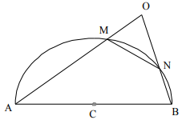
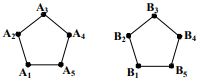

# <lo-sample/> LV.AMO.2004.5.1

Sauksim naturālu skaitli par interesantu, ja tas nesatur ciparu $0$ un tā 
pirmais cipars par $2$ mazāks nekā visu citu ciparu summa.

**(A)** kāds ir mazākais interesantais piecciparu skaitlis?

**(B)** kāds ir lielākais interesantais skaitlis?

<small>

* questionType:
* domain:

</small>

## Atrisinājums

**(A)** $\mathbf{21111}$. Šim skaitlim ir gan mazākais iespējamais pirmais 
cipars, gan mazākie iespējamie pārējie cipari.

**(B)** Lielākais ciparu skaits tiks sasniegts, ja cipari, sākot no otrā, būs 
vieninieki. Tāpēc meklējamais skaitlis ir $\mathbf{911111111111}$ ($11$ 
vieninieki).

# <lo-sample/> LV.AMO.2004.5.2

Kvadrāts sastāv no $4 \times 4$ vienādām kvadrātiskām rūtiņām. Katrā rūtiņā 
ierakstīts naturāls skaitlis no $1$ līdz $16$ (visi skaitļi dažādi). Skaitļu 
summas rindiņās, kolonnās un abās diagonālēs ir $10$ pēc kārtas sekojoši 
naturāli skaitļi.

Daļa ierakstīto skaitļu parādīti 1.zīm. Kāds skaitlis ierakstīts rūtiņā, kurā 
ir jautājuma zīme?

<small>

* questionType:
* domain:

</small>

## Atrisinājums

Augšējā rindiņā summa ir $30$, aizpildītajā diagonālē tā ir $39$. Tātad 
apskatāmās summas ir no $30$ līdz $39$. Vēl jāieraksta skaitļi 
$1;\ 2;\ 8;\ 15;\ 16$. Skaidrs, ka $t$ un $y$ var būt tikai $15$ vai $16$; tad 
$z=8$. Tad nevar būt $y=15$. Tāpēc $y=16,\ t=15$ un tabulu var aizpildīt arī 
tālāk: $u=1,\ x=2$.

# <lo-sample/> LV.AMO.2004.5.3

Kvadrātā, kas sastāv no $4 \times 4$ vienādām kvadrātiskām rūtiņām, katrā 
rūtiņā dzīvo pa vienam votivapam; taisnstūrī, kas sastāv no $2 \times 8$ 
vienādām kvadrātiskām rūtiņām, katrā rūtiņā dzīvo pa vienam šillišallam. Rūķīši
grib mainīt dzīves vietas: votivapas grib pārcelties uz taisnstūri, bet 
šillišallas - uz kvadrātu.

**(A)** vai to var izdarīt tā, lai katri divi votivapas, kas kvadrātā dzīvoja 
blakus rūtiņās, arī taisnstūrī dzīvotu blakus rūtiņās?

**(B)** vai to var izdarīt tā, lai katri divi šillišallas, kas taisnstūrī 
dzīvoja blakus rūtiņās, arī kvadrātā dzīvotu blakus rūtiņās?

*Piezīme:* divas rūtiņas sauc par blakus rūtiņām, ja tām ir kopīga mala.

<small>

* questionType:
* domain:

</small>

## Atrisinājums

**(A)** nē. Kvadrātā ir $24$ kaimiņu pāri, bet taisnstūrī tikai $22$,

**(B)** nē. Taisnstūrī un kvadrātā katrā ir $14$ rūtiņas ar $\geq 3$ kaimiņiem.
Tāpēc no stūra rūtiņām taisnstūrī jāpārceļas uz stūra rūtiņām kvadrātā, bet tas
izšķir divus pārus.

# <lo-sample/> LV.AMO.2004.5.4

Vai eksistē taisnstūris, kura malas iet pa rūtiņu līnijām un kuru var sagriezt 
tādās daļās, kādas attēlotas 2.zīm.? Jābūt vismaz vienai katra veida daļai.

<small>

* questionType:
* domain:

</small>

## Atrisinājums

Nē, neeksistē. Pieņemsim pretējo un apskatīsim "krustu", kura centrālā rūtiņa 
atrodas visaugstāk (vai vienu no tādiem, ja tādu ir vairāki). Tad rūtiņas 
$\alpha$ un $\gamma$ (tādas eksistē, jo sagriežamā figūra ir taisnstūris) var 
aizpildīt tikai kvadrāti. Bet tad eksistē arī rūtiņa $\beta$, un to nevar 
aizpildīt kvadrāts; tātad to aizpilda krusts, kas atrodas augstāk par 
apskatāmo - pretruna.

# <lo-sample/> LV.AMO.2004.5.5

Vai naturālos skaitļus no $1$ līdz $10$ ieskaitot var izrakstīt rindā katru 
vienu reizi tā, lai pirmais skaitlis dalītos ar otro, pirmo divu skaitļu 
summa - ar trešo, pirmo trīs skaitļu summa - ar ceturto utt., pirmo deviņu 
skaitļu summa - ar desmito?

Vai līdzīgā veidā var uzrakstīt naturālos skaitļus no $1$ līdz $13$ ieskaitot?

<small>

* questionType:
* domain:

</small>

## Atrisinājums

**(A)** jā, piemēram: $6,\ 1,\ 7,\ 2,\ 8,\ 3,\ 9,\ 4,\ 10,\ 5$.

**(B)** jā, piemēram: $7,\ 1,\ 8,\ 2,\ 9,\ 3,\ 10,\ 4,\ 11,\ 5,\ 12,\ 6,\ 13$.

# <lo-sample/> LV.AMO.2004.6.1

Dots, ka $19$ vienādas grāmatas kopā maksā $24$ latus ar santīmiem, bet $18$ 
tādas pašas grāmatas $22$ latus ar santīmiem. Cik maksā $1$ grāmata?

<small>

* questionType:
* domain:

</small>

## Atrisinājums

Ja vienas grāmatas cena ir $x$ santīmi, tad $2400 \leq 19 x \leq 2499$ un 
$2200 \leq 18 x \leq 2299$. Tāpēc $x>126$ un $x<128$ (tiešām, 
$126 \cdot 19=2394$ un $128 \cdot 18=2304$). Tāpēc grāmata maksā Ls $1,27$.

# <lo-sample/> LV.AMO.2004.6.2

Kādu lielāko daudzumu taisnstūru, kas sastāv no vismaz $2$ rūtiņām katrs, var 
izgriezt no 3.zīm. attēlotās figūras?

<small>

* questionType:
* domain:

</small>

## Atrisinājums

Tā kā katrs taisnstūris satur vismaz $1$ melnu rūtiņu, tad to nav vairāk par 
$9$ (skat.zīm.). Izgriezt $9$ taisnstūrus var ļoti daudzos veidos.

# <lo-sample/> LV.AMO.2004.6.3

Vairākās kaudzītēs kopā ir $58$ sērkociņi; nevienā kaudzītē nav ne mazāk par 
$1$, ne vairāk par $12$ sērkociņiem.

Pierādīt: ir vai nu divas kaudzītes, kurās ir vienāds sērkociņu skaits, vai arī
divas kaudzītes, kurās kopā ir tieši $13$ sērkociņu.

<small>

* questionType:
* domain:

</small>

## Atrisinājums

Pieņemam pretējo tam, kas jāpierāda. Tad no katra skaitļu pāra 
$(1;\ 12),\ (2;\ 11),\ (3;\ 10),\ (4;\ 9),\ (5;\ 8),\ (6;\ 7)$ augstākais viens
var būt sērkociņu skaits kādā kaudzītē. Tāpēc sērkociņu nav vairāk par 
$7+8+9+10+11+12=57$ - pretruna.

# <lo-sample/> LV.AMO.2004.6.4

Kvadrāts sastāv no $8 \times 8$ rūtiņām. Kreisajā apakšējā rūtiņā atrodas 
figūriņa. Divi spēlētāji pēc kārtas bīda figūriņu. Ar vienu gājienu figūriņu 
var pabīdīt vai nu $1$ rūtiņu pa labi, vai $1 $rūtiņu uz augšu, vai $1$ rūtiņu 
pa diagonāli "uz augšu un pa labi". Zaudē tas, kas nevar izdarīt gājienu.

Kas uzvar, pareizi spēlējot - pirmais vai otrais spēlētājs?

<small>

* questionType:
* domain:

</small>

## Atrisinājums

Pirmais spēlētājs var uzvarēt, ar katru savu gājienu iebīdot figūriņu 
iesvītrotā rūtiņā (sk.zīm.). Tad otrais ir spiests to iebīdīt baltā rūtiņā, un 
pirmais var atkal to iebīdīt iesvītrotā, u.t.t. Tātad otrais spēlētājs 
**vienmēr** iebīda figūriņu baltā rūtiņā, tāpēc viņš nevar uzvarēt. Tā kā kāds 
noteikti uzvar, tad tas ir pirmais.

# <lo-sample/> LV.AMO.2004.6.5

No sākuma uz tāfeles uzrakstīti skaitļi $2;\ 3;\ 4;\ 5;\ 6$ (katrs vienu 
reizi). Ar vienu gājienu var izvēlēties divus uzrakstītus skaitļus (apzīmēsim 
tos ar $a$ un $b$), nodzēst tos un vietā uzrakstīt skaitļus $a+b$ un 
$a \cdot b$. Vai, atkārtojot šādus gājienus, var panākt, ka uz tāfeles 
vienlaicīgi atrodas skaitļi $21;\ 27;\ 64;\ 180;\ 225$?

<small>

* questionType:
* domain:

</small>

## Atrisinājums

Viegli izsekot, ka pieļauto gājienu rezultātā uz tāfeles esošo pāra skaitļu 
daudzums nevar samazināties. Tāpēc prasītais nav sasniedzams.

# <lo-sample/> LV.AMO.2004.7.1

Ja skaitļi $a$ un $b$ ir dažādi, tad ar $\max (a, b)$ apzīmējam lielāko no 
tiem.

Dots, ka skaitļi $x;\ y;\ z;\ t;\ x+z;\ y+t$ visi ir dažādi un

$$\max (x, y)+\max (z, t)=\max (x+z;\ y+t)$$

Pierādīt, ka $(x-y)(z-t)>0$.

<small>

* questionType:
* domain:

</small>

## Atrisinājums

Pienemsim, ka $x>y$ un $z<t$. Tad $\max (x,\ y)=x$ un $\max (z,\ t)=t$.

Tad $\max (x,\ y)+\max (z,\ t)=x+t$. Ja $x+t=x+z$, tad $z=t$ - pretruna.

Ja $x+t=y+t$, tad $x=y$ - pretruna. Līdzīgi iegūst pretrunu, ja $x<y$ un $z>t$.
Tāpēc vai nu $x>y$ un $z>t$, vai arī $x<y$ un $z<t$.

# <lo-sample/> LV.AMO.2004.7.2

Taisnleņķa trijstūrī $ABC$ novilkts augstums $CH$ pret hipotenūzu $AB$. Punkts 
$M$ atrodas uz hipotenūzas un $BM=BC$; punkts $N$ atrodas uz katetes $AC$ un 
$CN=CH$. Pierādīt, ka $MN \perp AC$. 

(*Piezīme:* drīkst izmantot to, ka katra trijstūra iekšējo leņķu lielumu summa 
ir $180^{\circ}$.)

<small>

* questionType:
* domain:

</small>

## Atrisinājums

Apzīmējam $\sphericalangle ABC=\beta$. No vienādsānu trijstūra $CBM$ seko

$$\sphericalangle MCB=\frac{1}{2}\left(180^{\circ}-\beta\right)=90^{\circ}-\frac{\beta}{2}.$$

No taisnleņķa trijstūra $CHB$ seko $\sphericalangle HCB=90^{\circ}-\beta$, 
tāpēc

$$\sphericalangle MCH=\left(90^{\circ}-\frac{\beta}{2}\right)-\left(90^{\circ}-\beta\right)=\frac{\beta}{2}.$$

Tā kā $\sphericalangle ACH=90^{\circ}-\left(90^{\circ}-\beta\right)=\beta$, tad
$\sphericalangle ACM=\beta-\frac{\beta}{2}=\beta$. Tāpēc 
$\Delta NCM=\Delta HCM\ (m \ell m)$, un 
$\sphericalangle MNC=\sphericalangle MHC=90^{\circ}$, k.b.j.

# <lo-sample/> LV.AMO.2004.7.3

Kādam mazākajam naturālajamam $n$ visas daļas 
$\frac{5}{n+7}, \frac{6}{n+8}, \frac{7}{n+9}, \ldots, \frac{35}{n+37}, \frac{36}{n+38}$
ir nesaīsināmas?

<small>

* questionType:
* domain:

</small>

## Atrisinājums

Uzrakstām daļas kā 
$\frac{5}{(n+2)+5},\ \frac{6}{(n+2)+6},\ \ldots,\ \frac{36}{(n+2)+36}$. Daļas 
visas būs nesaīsināmas tad un tikai tad, ja $n+2$ nevarēs saīsināt ne ar vienu 
no skaitļiem $5;\ 6;\ \ldots;\ 36$. Acīmredzot mazākais tāds $n+2$ ir $37$, 
tāpēc $n=35$.

# <lo-sample/> LV.AMO.2004.7.4

Izliektā $7$-stūrī $ABCDEFG$ punkti 
$A_{1}, B_{1}, C_{1}, D_{1}, E_{1}, F_{1}, G_{1}$ ir attiecīgi malu 
$DE,\ EF,\ FG,\ GA,\ AB,\ BC,\ CD$ viduspunkti. Dots, ka 
$AA_{1} \perp DE,\ BB_{1} \perp EF,\ CC_{1} \perp FG,\ DD_{1} \perp GA,\ EE_{1} \perp AB$
un $FF_{1} \perp BC$. Pierādīt, ka $GG_{1} \perp CD$.

<small>

* questionType:
* domain:

</small>

## Atrisinājums

Trijstūrī $DAE$ augstums sakrīt ar mediānu, tāpēc tas ir vienādsānu un $AD=AE$.
Līdzīgi $BE=BF,\ CF=CG,\ DG=DA,\ EA=EB,\ FB=FC$. No šīm vienādībām seko, ka arī
$GC=GD$. Tātad $\Delta CGD$ ir vienādsānu; tāpēc tā mediāna pret pamatu ir arī 
augstums, k.b.j.

# <lo-sample/> LV.AMO.2004.7.5

Kādā komisijā strādā $7$ diplomāti. Katri divi savā starpā sarunājas angļu, 
vācu vai franču valodā (tikai vienā). Katrs diplomāts ar $2$ kolēgiem sarunājas
angliski, ar $2$ - vāciski, ar $2$ - franciski. Pierādiet: var atrast $3$ 
diplomātus, kas savā starpā sazinoties lieto visas $3$ valodas.

<small>

* questionType:
* domain:

</small>

## Atrisinājums

Attēlosim diplomātus ar $7$ punktiem. Izvēlēsimies vienu punktu. Starp 
atlikušajiem $6$ punktiem var novilkt $\frac{6 \cdot 5}{2}=15$ nogriežņus (no 
katra no $6$ punktiem iziet $5$ nogriežņu gali, un katram nogrieznim ir $2$ 
gali). Tātad katrs no $7$ punktiem ietilpst kā virsotne $15$ trijstūros. Tāpēc 
trijstūru ar virsotnēm šajos $7$ punktos ir $\frac{1}{3} \cdot 7 \cdot 15=35$ 
(katrs trijstūris summā $\underbrace{15+15+\ldots+15}_{7\ saskaitāmie}$ 
ieskaitīts $3$ reizes). Nokrāsosim nogriežņus atbilstoši valodām, kādas sarunā 
lieto attiecīgie diplomāti, krāsās $a,\ v,\ f$. Padomāsim, cik ir trijstūru, 
kuru malas nokrāsotas tikai divās vai vienā krāsā. Acīmredzot, jebkuram punktam
$A$ ir trīs šādi trijstūri ar virsotni $A$, kam vienā krāsā nokrāsotas no $A$ 
izejošās malas. Tātad šādu trijstūru nav vairāk par $3 \cdot 7=21$ (atceramies,
ka trijstūri, kam visas malas nokrāsotas vienādi - ja tādi ir - šādi tiek 
uzskaitīti $3$ reizes katrs). Tā kā $35>21$, tad ir vismaz $14$ trijstūri, kam 
visas malas nokrāsotas dažādi. Katra šāda trijstūra virsotnes dod mums 
vajadzīgo diplomātu trijnieku.

# <lo-sample/> LV.AMO.2004.8.1

Dots, ka kvadrātvienādojuma $x^{2}+px+q=0$ saknes ir $x_{1}$ un $x_{2}$, bet 
kvadrātvienādojuma $x^{2}+ax+b=0$ saknes ir $x_{1}^{2}$ un $x_{2}^{2}$. Izsacīt
$a$ un $b$ ar $p$ un $q$ palīdzību.

<small>

* questionType:
* domain:

</small>

## Atrisinājums

No Vjeta teorēmas 
$b=x_{1}^{2} \cdot x_{2}^{2}=\left(x_{1}x_{2}\right)^{2}=q^{2}$,

bet 
$a=-\left(x_{1}^{2}+x_{2}^{2}\right)=2x_{1}x_{2}-\left(x_{1}+x_{2}\right)^{2}=2q-p^{2}$.

# <lo-sample/> LV.AMO.2004.8.2

Dots, ka $\triangle ABC$ pastāv sakarības $AB=AC$ un 
$\sphericalangle ABC=60^{\circ}$; $w$ ir riņķa līnijas loks, kura centrs ir 
$A$, bet galapunkti $B$ un $C$ (skat. 4.zīm.). Uz loka $w$ izvēlēts punkts $D$,
kas atšķiras gan no $B$, gan no $C$. Dots, ka $X,\ Y,\ Z,\ T$ ir attiecīgi 
nogriežņu $AB,\ BD,\ DC,\ CA$ viduspunkti. Pierādīt, ka $XZ \perp YT$.

<small>

* questionType:
* domain:

</small>

## Atrisinājums

No dotā seko, ka $ABC$ ir regulārs un $AB=BC=AC=AD$. No šejienes un trijstūru 
viduslīniju īpašībām seko $XY=YZ=ZT=TX$. Tāpēc $XYZT$ - rombs; tāpēc 
$XZ \perp YT$.

# <lo-sample/> LV.AMO.2004.8.3

Dots, ka $A$ un $B$ - naturāli divciparu skaitļi. Skaitli $X$ iegūst, 
pierakstot skaitlim $A$ galā skaitli $B$; skaitli $Y$ iegūst, pierakstot 
skaitlim $B$ galā skaitli $A$. Dots, ka $X-Y$ dalās ar $91$. Pierādīt, ka 
$A=B$.

<small>

* questionType:
* domain:

</small>

## Atrisinājums

Acīmredzot $X=\overline{AB}=100A+B,\ Y=100B+A$. Tāpēc $X-Y=99(A-B)$, un 
$99(A-B)$ dalās ar $91$. Skaitļu $99$ un $91\ LKD$ ir $1$, tāpēc $A-B$ dalās ar
$91$. Bet $|A-B| \leq 89$. Tāpēc $|A-B|=0$ un $A=B$, k.b.j.

# <lo-sample/> LV.AMO.2004.8.4

Kvadrāta malas garums ir $1~\mathrm{m}$. Tajā novilktas līnijas, kas to sadala 
vairākās daļās; katra daļa vienāda ar kādu no figūrām, kas redzamas 5.zīm. 
(rūtiņas malas garums ir $1~\mathrm{cm}$). Aprēķināt novilkto līniju kopējo 
garumu.

<small>

* questionType:
* domain:

</small>

## Atrisinājums

Ievērosim, ka katras daļas perimetrs centimetros vienāds ar divkāršotu tās 
laukumu kvadrātcentimetros. Tāpēc visu daļu perimetru summa ir 
$20000~\mathrm{cm}$ jeb $200~\mathrm{m}$. Šī summa sastāv no kvadrāta perimetra
$4~\mathrm{m}$ un divkāršota visu novilkto līniju kopējā garuma $2L$. Tāpēc 
$2L=200~\mathrm{m}-4~\mathrm{m}=196~\mathrm{m}$ un $L=98~\mathrm{m}$.

# <lo-sample/> LV.AMO.2004.8.5

Virknē augošā kārtībā izrakstīti naturālie skaitļi no $1$ līdz $2004$ 
ieskaitot, katrs vienu reizi. Izsvītrojam no tās skaitļus, kas atrodas 
$1.,\ 4.,\ 7.,\ 10.,\ \ldots$ vietās. No palikušās virknes atkal izsvītrojam 
skaitļus, kas tajā atrodas $1.,\ 4.,\ 7.,\ \ldots$ vietās. Ar iegūto virkni 
rīkojamies tāpat, utt., kamēr paliek neizsvītrots viens skaitlis. Kurš tas ir?

<small>

* questionType:
* domain:

</small>

## Atrisinājums

Apzīmēsim skaitli, kas ir pirmais neizsvītrotais pēc $n$ svītrošanas sērijām, 
ar $x_{n}(n=0;\ 1;\ 2;\ \ldots$. Viegli pārbaudīt, ka 
$x_{0}=1;\ x_{1}=2;\ x_{2}=3;\ x_{3}=5;\ x_{4}=8$.

Pretēji domai par Fibonači skaitļiem pierādīsim, ka

$$(*) x_{n+1}=\left\{\begin{array}{l}
\frac{3}{2} x_{n}, \text { ja } x_{n}-\text { pāra skaitlis, } \\
\frac{3}{2} x_{n}, \text { ja } x_{n}-\text { nepāra skaitlis }
\end{array}\right.$$

Tiešām, pieņemsim, ka $x_{n}=2m,\ m \in N$. Apskatām skaitli $3m$. Ir $m$ 
skaitļi, kas mazāki par $3m$ un dod atlikumu $1$, dalot ar $3$. Tāpēc pēc 
pirmās svītrošanu sērijas $3m$ atradīsies $2m$-jā vietā; tātad vēl pēc $n$ 
sērijām tas būs pirmajā vietā. Tagad pieņemam, ka 
$x_{n}=2m+1,\ m=0;\ 1;\ \ldots$. Apskatām skaitli 
$\frac{3}{2}(2m+1)+\frac{1}{2}=3m+2$. Pēc pirmās svītrošanu sērijas, kurā 
izsvītros $m+1$ par to mazākus skaitļus, šis skaitlis atradīsies $2m+1$-ā 
vietā; tātad vēl pēc $n$ sērijām tas būs pirmajā vietā. Sakarība (*) pierādīta.

Tagad pakāpeniski iegūstam $x_{i}$ vērtības 
$1;\ 2;\ 3;\ 5;\ 8;\ 12;\ 18;\ 27;\ 41;\ 62;\ 93;\ 140;\ 210$; 
$315;\ 473;\ 710;\ 1065;\ 1598$. Nākošais loceklis jau būtu lielāks par $2004$,
tāpēc uzdevuma atbilde ir $1598$.

# <lo-sample/> LV.AMO.2004.9.1

Dots, ka vienādojumam 
$2x^{2}+\left(p_{1}+p_{2}\right) x+\left(q_{1}+q_{2}\right)=0$ eksistē 
atrisinājums. Pierādīt, ka vismaz vienam no vienādojumiem 
$x^{2}+p_{1}x+q_{1}=0$ un $x^{2}+p_{2}x+q_{2}=0$ arī eksistē atrisinājums.

<small>

* questionType:
* domain:

</small>

## Atrisinājums

Pretējā gadījumā **katram** $x$ pastāv nevienādības $x^{2}+p_{1}x+q_{1}>0$ un 
$^{2}+p_{2}x+q_{2}>0$, bet tad arī katram 
$x \quad 2x^{2}+\left(p_{1}+p_{2}\right) x+\left(q_{1}+q_{2}\right)>0$ - 
pretruna.

# <lo-sample/> LV.AMO.2004.9.2

Dots, ka $a$ un $b$ - naturāli skait\li un $a+b$ ir nepāra skaitlis. Zināms, ka
katrā skaitļu ass punktā ar veselu koordināti dzīvo pa rūķīitim: dažos 
punktos - votivapas, pārējos - šillišallas. Pierādīt, ka eksistē tādi divi 
vienas cilts rūķīši, attālums starp kuriem ir vai nu $a$, vai $b$.

<small>

* questionType:
* domain:

</small>

## Atrisinājums

Pieņemsim pretējo. Viens no skaitļiem $a$ un $b$ ir pāra, otrs - nepāra; 
pieņemsim, ka a - pāra, b - nepāra.

Ja punktā $0$ dzīvo votivapa, punktā $1 \cdot a$ dzīvo šillišalla, punktā 
$2 \cdot a$ - votivapa, punktā $3 \cdot a$ - šillišalla, $\ldots$, **punktā** 
$\mathbf{b} \cdot \mathbf{a}$ - **šillišalla**. No otras puses, punktā 
$1 \cdot b$ dzīvo šillišalla, punktā $2 \cdot b$ - votivapa, $\ldots$, 
**punktā** $\mathbf{a} \cdot \mathbf{b}$ - **votivapa**. Iegūta pretruna. 
Līdzīgi iegūst pretrunu, ja punktā $0$ dzīvo šillišalla.

# <lo-sample/> LV.AMO.2004.9.3

Dots, ka $ABCD$ - kvadrāts, bet $w$ - riņķa līnija, kas iet caur $A$ un $B$; 
punkti $C$ un $D$ atrodas $w$ iekšpusē. Stari $BD$ un $BC$ krusto $w$ attiecīgi
punktos $E$ un $F$. Apzīmējam $CF$ viduspunktu ar $M$. Pierādīt, ka 
$EM \perp BC$.

<small>

* questionType:
* domain:

</small>

## Atrisinājums

No teorēmas par vienādiem ievilktiem leņķiem un tiem atbilstošām hordām, seko 
$EA=EF$. No $\triangle EDA=\triangle EDC\ (m \ell m)$ seko $EA=EC$. Tāpēc 
$EF=EC$ un $\triangle CEF$ ir vienādsānu; tāpēc mediāna $EM$ tajā ir arī 
augstums.

# <lo-sample/> LV.AMO.2004.9.4

Dots, ka $n$ - naturāls skaitlis. Katrs no $2n+1$ rūķīšiem Lieldienās vienu 
reizi ieradās pie Sniegbaltītes un kādu laiku tur uzturējās. Ja divi rūķīši 
vienlaikus bija pie Sniegbaltītes, tad viņi tur satikās. Zināms, ka katrs 
rūķītis pie Sniegbaltītes satika vismaz $n$ citus rūķīšus.

Pierādīt: ir tāds rūķītis, kas pie Sniegbaltītes satika visus $2n$ citus 
rūķīšus.

<small>

* questionType:
* domain:

</small>

## Atrisinājums

Apzīmēsim rūķīti, kurš atnāca pēdējais, ar $A$, un rūķīti, kurš aizgāja 
pirmais, ar $B$. Ar $K_{A}$ apzīmēsim kompāniju, kas sastāv no paša $A$ un viņa
satiktajiem rūķīšiem; līdzīgi ieviešam $K_{B}$. Gan $K_{A}$, gan $K_{B}$ katrā 
ir vismaz $n+1$ rūķītis. Tā kā $(n+1)+(n+1)>2n+1$, tad eksistē tāds rūķītis, 
kas pieder gan $K_{A}$, gan $K_{B}$; apzīmēsim to ar $R$. Ja kāds rūķītis $X$ 
aizietu agrāk, nekā atnāca $R$, tad arī $B$ būtu aizgājis agrāk, nekā atnāca 
$R$; bet tad $B$ nebūtu saticis $R$ - pretruna. Ja kāds rūķītis $Y$ atnāktu 
vēlāk, nekā aizgāja $R$, tad arī $A$ atnāktu vēlāk, nekā aizgāja $R$, un $A$ 
nebūtu saticis $R$ - pretruna.

No minētā seko, ka $R$ satika visus rūķīšus.

# <lo-sample/> LV.AMO.2004.9.5

Kvadrāts sastāv no $n \times n$ rūtiņām. Katrā rūtiņā jāieraksta viens no 
skaitļiem $-1;\ 0;\ 1$ tā, lai $n$ rindās un $n$ kolonnās ierakstīto skaitļu 
summas visas būtu dažādas.

Vai to var izdarīt, ja **(A)** $n=4$; **(B)** $n=5$?

<small>

* questionType:
* domain:

</small>

## Atrisinājums

**(A)** jā; skat.zīm. $\alpha$

**(B)** nē. Desmit summām iespējamas vērtības 
$0, \mp 1, \mp 2, \mp 3, \mp 4, \mp 5$ (kopā $11$). Ja rindiņu summas ir 
$r_{1},\ \ldots,\ r_{5}$ un kolonu summas ir $k_{1},\ \ldots,\ k_{5}$, tad 
$\left(r_{1}+\ldots+r_{5}\right)+\left(k_{1}+\ldots+k_{5}\right)$ ir pāra 
skaitlis. Tāpēc starp $r_{1},\ \ldots,\ r_{5},\ k_{1},\ \ldots,\ k_{5}$ ir pāra
skaits nepāra skaitļu. Tāpēc visas nepāra summas $\mp 1, \mp 3, \mp 5$ ir 
sastopamas. Varam pieņemt, ka $k_{1}=5$. Tad nevar būt $r_{i}=-5$; tāpēc varam 
uzskatīt, ka $k_{2}=-5$ (ievērojam, ka kolonas savā starpā un rindas savā 
starpā var patvaļīgi mainīt). No summām " $4$ " un, " $4$ " vismaz vienai ir 
jābūt; varam pieņemt, ka ir summa $4$ (zīmes visiem skaitļiem tabulā var mainīt
uz pretējām). Varam pieņemt, ka $k_{3}=4$ un vienīgā nulle ir rindā $r_{5}$ 
(zīm. $\beta$). Nevar būt $r_{i}=-3$; tāpēc kādā kolonā summa ir " $-3$ ", un 
uzskatīsim, ka $k_{4}=-3$. Tātad $4.$ kolonā ir vismaz trīs " $-1$ ".

**I** Tie visi sastopami pirmajās $4$ rindās; tad varam uzskatīt, ka tie ir 
pirmajās $3$ rindās (zīm. $\gamma$). Tad pirmajās $3$ rindās summām jābūt 
$-1;\ 0;\ 1$. Tāpēc $5.$ kolonā pirmajās $3$ rindās ir skaitļi $-1;\ 0;\ 1$, un
$k_{5} \neq 3$. Arī $r_{5} \neq 3$. Vērtība $3$ var būt tikai $r_{4}$, tāpēc 
$4.$ rindā abi pēdējie skaitļi ir $1$. Tā kā $k_{4}=-3$, tad $4.$ kolonas un 
$5.$ rindas krustpunktā ir " $-1$ ". Lai kā izvēlētos skaitli $x$, iegūst 
pretrunu (tieša pārbaude).

**II** Ceturtajā kolonā pirmajās $4$ rindās ir tikai divi " $-1$ ". Varam 
uzskatīt, ka situāciju attēlo zīm. $\delta$. Nevienā rindā summa nevar būt $3$,
tāpēc $k_{5}=3$. Tas iespējams vai nu kā $1+1+1+0+0$, vai kā $1+1+1+1+(-1)$. 
Jābūt $x \neq y$ un $z \neq t$. Pārbaudot visas iespējas, katrā no tām iegūst 
pretrunu.

# <lo-sample/> LV.AMO.2004.10.1

Atrast mazāko pozitīvo skaitli $a$, kam piemīt īpašība: ja $x>y>a$, tad 
$x^{2}-2x>y^{2}-2y$.

<small>

* questionType:
* domain:

</small>

## Atrisinājums

**Atbilde:** $a=1$.

1) ja $x>y>1$, tad $x-1>y-1>0$, tāpēc $(x-1)^{2}>(y-1)^{2}$, no kā seko 
   $x^{2}-2x>y^{2}-2y$.
2) ja $0<a<1$, tad eksistē tādi $x_{1}$ un $x_{2}$, ka $0<a<x_{1}<1<x_{2}$ un 
$\left(x_{1}-1\right)^{2}>\left(x_{2}-1\right)^{2}$, skat. zīm.

# <lo-sample/> LV.AMO.2004.10.2

Pusriņķa līnijas diametrs ir $AB$. Uz pusriņķa līnijas ņemti divi punkti $M$ un
$N$, kas nesakrīt ne ar $A$, ne ar $B$. Stari $AM$ un $BN$ krustojas punktā 
$O$.

Pierādīt: ap $\triangle MNO$ apvilktās riņķa līnijas garums atkarīgs tikai no 
hordas $MN$ garuma, nevis no tās novietojuma.

<small>

* questionType:
* domain:

</small>

## Atrisinājums

Apzīmēsim hordas $MN$ garumu ar $a$, bet tās savilktā loka leņķisko lielumu ar 
$\omega$. Iespējami divi gadījumi:

$\sphericalangle MON=\frac{1}{2}\left(180^{\circ}-\omega\right)=90^{\circ}-\frac{\omega}{2}$

$\sphericalangle MON=\frac{1}{2}\left(180^{\circ}+\omega\right)=90^{\circ}+\frac{\omega}{2}$

Atliek ievērot, ka 
$\sin \left(90^{\circ}-\frac{\omega}{2}\right)=\sin \left(90^{\circ}+\frac{\omega}{2}\right)$,
un izmantot sinusu teorēmu $MN=2R \cdot \sin \sphericalangle MON$.

# <lo-sample/> LV.AMO.2004.10.3

Dots, ka $n$ - naturāls skaitlis.

**(A)** pierādīt, ka $\sqrt{n^{2}+11n+30}$ nav naturāls skaitlis,

**(B)** atrast šī skaitļa pirmo ciparu aiz komata atkarībā no $n$.

<small>

* questionType:
* domain:

</small>

## Atrisinājums

**(A)** katram naturālam $n \quad(n+5)^{2}<n^{2}+11n+30<(n+6)^{2}$; tātad 
$n^{2}+11n+30$ atrodas starp blakus esošu naturālu skaitļu kvadrātiem un nav 
kvadrāts,

**(B)** apzīmējam $n+5=x$; pētāmais skaitlis ir $\sqrt{x^{2}+x}$. Viegli 
pārbaudīt, ka naturāliem $x$ pastāv nevienādības $x+0,4<\sqrt{x^{2}+x}<x+0,5$. 
Tāpēc meklējamais cipars ir $4$.

# <lo-sample/> LV.AMO.2004.10.4

Tenisa turnīrā piedalījās profesionāļi un amatieri; katrs ar katru citu spēlēja
tieši vienu reizi. Profesionāļu bija par $9$ vairāk nekā amatieru, un viņi visi
kopā izcīnīja $9$ reizes vairāk uzvaru nekā visi amatieri kopā. Kāds ir 
lielākais iespējamais uzvaru skaits, ko šādā turnīrā varēja izcīnīt kāds 
amatieris? Tenisā neizšķirtu nav.

<small>

* questionType:
* domain:

</small>

## Atrisinājums

Pieņemsim, ka ir $x$ amatieri un $x+9$ profesionāli, un amatieri $n$ reizes 
uzvarējuši profesionāļus. Tad amatieriem kopā ir $\frac{x(x-1)}{2}+n$ uzvaras, 
profesionāļiem kopā ir $\frac{(x+9)(x+8)}{2}+x(x+9)-n$ uzvaras, un iegūstam 
vienādojumu $9\left(\frac{x(x-1)}{2}+n\right)=\frac{(x+9)(x+8)}{2}+x(x+9)-n$, 
kas pārveidojas par $3x^{2}-22x+10n-36=0$.

Tā atrisinājums ir naturāls skaitlis, tāpēc diskriminantam $121-3(10n-36)$ 
jābūt nenegatīvam; no šejienes seko $n \leq 7$. Pārbaude parāda, ka 
atrisinājums ir naturāls skaitlis pie $n=2$ un pie $n=6$. Pie $n=2$ iznāk 
$x=8$; tad labākajam amatierim nav vairāk par $9$ uzvarām. Pie $n=6$ iznāk 
$x=6$. Tad labākajam amatierim nav vairāk par $5+6=11$ uzvarām. Tāds skaits ir 
sasniedzams, ja viens amatieris uzvar visus citus amatierus un ir vienīgais no 
amatieriem, kas uzvar profesionāļus (citu spēļu rezultātam nav nozīmes).

# <lo-sample/> LV.AMO.2004.10.5

Vai, izmantojot tikai $3$ dažādus ciparus, var uzrakstīt $16$ trīsciparu 
skaitļus, kas visi dod dažādus atlikumus, dalot ar $16$?

<small>

* questionType:
* domain:

</small>

## Atrisinājums

Nē, nevar. No šiem $16$ skaitļiem $8$ jābūt pāra un $8$ - nepāra. Tāpēc starp 
tiem cipariem jābūt gan pāra, gan nepāra ciparam. Apskatām $2$ pāra un $1$ 
nepāra ciparu; apzīmējam tos ar $p_{1}$, $p_{2}$ un $n$. Iegūstamie nepāra 
skaitļi ir 
$p_{1}p_{1}n,\ p_{1}p_{2}n,\ p_{1}nn,\ p_{2}p_{1}n,\ p_{2}p_{2}n,\ p_{2}nn,\ np_{1}n,\ np_{2}n,\ nnn$.
Apskatām pirmo $2$ ciparu veidotos skaitļus; ja divu šādu skaitļu starpība 
dalās ar $8$, tad atbilstošo trīsciparu skaitļu starpība dalās ar $16$, un tā 
ir pretruna. Apskatāmie divciparu skaitļi ir 
$p_{1}p_{1},\ p_{1}p_{2},\ p_{1}n,\ p_{2}p_{1},\ p_{2}p_{2},\ p_{2}n,\ np_{1},\ np_{2},\ nn$;
tikai trīs no tiem ir nepāra. Tāpēc, izvēloties $8$ skaitļus, nevarēs iegūt $8$
dažādus atlikumus šiem divciparu skaitļiem, dalot tos ar $8$, un divi no tiem 
dos vienādus atlikumus; tad to starpība dalīsies ar $8$.

# <lo-sample/> LV.AMO.2004.11.1

Vai eksistē tāds naturāls skaitlis $n$, ka $2004^{n}-1$ dalās ar $1500^{n}-1$?

<small>

* questionType:
* domain:

</small>

## Atrisinājums

Nē, neeksistē. Ja $2004^{n}-1:1500^{n}-1$, tad arī

$$\left(2004^{n}-1\right)-\left(1500^{n}-1\right)=2004^{n}-1500^{n}=2^{n}\left(1002^{n}-750^{n}\right):1500^{n}-1$$

Tā kā $LKD\left(2^{n}, 1500^{n}-1\right)=1$, tad $1002^{n}-750^{n}:1500^{n}-1$.

Bet tas nav iespējams, jo $0<1002^{n}-750^{n}<1500^{n}-1$.

# <lo-sample/> LV.AMO.2004.11.2

Kvadrāts $ABCD$ sastāv no $4 \times 4$ vienādām kvadrātiskām rūtiņām. Katrā 
rūtiņā novelk vienu diagonāli un vienu no iegūtajiem trijstūriem nokrāso baltu,
otru - melnu. Nekādiem diviem vienādi nokrāsotiem trijstūriem nedrīkst būt 
kopīga mala. Cik dažādi kvadrāta krāsojumi iespējami?

<small>

* questionType:
* domain:

</small>

## Atrisinājums

**Atbilde:** $4^{4}=256$. Viegli redzēt, ka rūtiņas uz vienas diagonāles var 
nokrāsot patvaļīgi un ka šis krāsojums viennozīmīgi nosaka citu rūtiņu 
krāsojumu.

# <lo-sample/> LV.AMO.2004.11.3

Vienādsānu trapecē $ABCD$ zināms, ka $AB=BC=CD$ un $BC<AD$; diagonāļu 
krustpunkts ir $O$. Pierādīt, ka nogriežņu $AO$ un $BC$ viduspunkti, kā arī 
virsotnes $C$ un $D$ atrodas uz vienas riņķa līnijas.

<small>

* questionType:
* domain:

</small>

## Atrisinājums

Atzīmējam arī $BO$ viduspunktu (skat. zīm.). No viduslīniju īpašībām seko, ka 
$MNKC$ vienādsānu trapece, tāpēc punkti $\mathbf{M,\ N,\ K,\ C}$ **atrodas uz 
vienas riņķa līnijas.** Tā kā $\triangle BOC$ vienādsānu, tad arī 
$\triangle BNK$ - vienādsānu. Tāpēc (atceramies, ka arī $\triangle BCD$ - 
vienādsānu) 
$\sphericalangle ODC+\sphericalangle NKC=\sphericalangle OBC+\sphericalangle NKC=\sphericalangle BKN+\sphericalangle NKC=180^{\circ}$,
tātad $\mathbf{N},\ \mathbf{K},\ \mathbf{C},\ \mathbf{D}$ atrodas uz vienas 
riņķa līnijas. No abiem pasvītrotajiem apgalvojumiem seko vajadzīgais.

# <lo-sample/> LV.AMO.2004.11.4

Dots, ka $a$ un $b$ - pozitīvi skaitļi. Pierādīt, ka

$$a^{a} \cdot b^{b} \geq a^{b}b^{a}$$

<small>

* questionType:
* domain:

</small>

## Atrisinājums

Logaritmējot iegūstam ekvivalentu nevienādību 
$a \lg a+b \lg b \geq b \lg a+a \lg b$

$$(a-b)(\lg a-\lg b) \geq 0$$

Vajadzīgais seko no tā, ka $y=\lg x$ - augoša funkcija pie $x>0$.

# <lo-sample/> LV.AMO.2004.11.5

Komisijā darbojas $25 $deputāti, daži no tiem draudzējas (ja $A$ draudzējas ar 
$B$, tad arī $B$ draudzējas ar $A$). Katram deputātam ir tieši $n$ draugi. Ja 
kādi divi deputāti (apzīmēsim tos ar $X$ un $Y$) nedraudzējas savā starpā, tad 
noteikti eksistē tāds deputāts, kas draudzējas gan ar $X$, gan ar $Y$.

Kāda ir mazākā iespējamā $n$ vērtība?

<small>

* questionType:
* domain:

</small>

## Atrisinājums

**Atbilde:** $n=6$.

Apskatām deputātu $A$, visus viņa draugus un visus šo draugu draugus. Saskaņā 
ar uzdevuma nosacījumiem citu deputātu nav. Tāpēc $1+n+n(n-1) \geq 25$, no 
kurienes $n \geq 5$. Parādīsim, ka $n=5$ nav iespējams. Augstāk minētajā 
uzskaitījumā " $A,\ A$ draugi un $A$ draugu draugi" **tieši viens deputāts** 
būtu uzskaitīts divas reizes. Skaidrs, ka tas var būt tikai " $A$ drauga 
draugs", kurš kā tāds uzskaitīts divas reizes. Tāpēc $A$ pieder **tieši 
vienam** ciklam ar garumu $4$. Tas attiecas uz patvaļīgu $A$. Bet $25$ deputāti
nevar sadalīties ciklos ar garumu $4$.

Parādīsim, ka $n=6$ ir iespējams. Apskatām $5$ ciklus, katrā pa $5$ virsotnēm. 
Apzīmējam patvaļīgus $2$ ciklus ar

un "nodefinējam" starp tiem draudzības 
$A_{1}B_{1},\ A_{2}B_{3},\ A_{3}B_{5},\ A_{4}B_{2},\ A_{5}B_{4}$ (t.i., ja 
$A_{i}$ un $A_{j}$ savā starpā draudzējas, tad viņu draugi ciklā $B$ savā 
starpā nedraudzējas un otrādi).

Viegli pārbaudīt, ka uzdevuma nosacījumi ir izpildīti.

# <lo-sample/> LV.AMO.2004.12.1

Dots, ka $n$ - naturāls skaitlis, $n>1$. Vai izteiksmi

$$\left(x^{n}+x^{n-1}+\ldots+x+1\right)^{2}-x^{n}$$

noteikti var izsacīt kā divu polinomu reizinājumu tā, lai neviens no šiem 
polinomiem nebūtu konstante un visi abu polinomu koeficienti būtu veseli 
skaitļi?

<small>

* questionType:
* domain:

</small>

## Atrisinājums

Viegli pārbaudīt, ka apskatāmā izteiksme vienāda ar

$$\left(x^{n+1}+x^{n}+x^{n-1}+\ldots+x+1\right)\left(x^{n-1}+x^{n-2}+\ldots+x+1\right)$$

# <lo-sample/> LV.AMO.2004.12.2

Kvadrāti $ABCD$ un $A_{1}B_{1}C_{1}D_{1}$ atrodas paralēlās plaknēs; abiem 
virsotnes uzrādītas pulksteņa rādītāja kustības virzienā. Pierādīt, ka 
$AA_{1}^{2}+CC_{1}^{2}=BB_{1}^{2}+DD_{1}^{2}$.

<small>

* questionType:
* domain:

</small>

## Atrisinājums

Apzīmējam $ABCD$ centru un malas garumu attiecīgi ar $X$ un 
$x,\ A_{1}B_{1}C_{1}D_{1}$ centru un malas garumu attiecīgi ar $Y$ un $y$, bet 
$\overrightarrow{XY}=\vec{\omega}$. Tad

$$\begin{gathered}
AA_{1}^{2}+CC_{1}^{2}=\left(\overrightarrow{AX}+\vec{\omega}+\overrightarrow{YA_{1}}\right)^{2}+\left(\overrightarrow{CX}+\vec{\omega}+\overrightarrow{YC_{1}}\right)^{2}= \\
=AX^{2}+YA_{1}^{2}+CX^{2}+YC_{1}^{2}+2 \omega^{2}+2 \dot{\omega}(\underbrace{AX+CX}_{\overrightarrow{0}}+\underbrace{YA_{1}+YC_{1}}_{\overrightarrow{0}})+2 \dot{AX} \cdot YA_{1}+2 \overrightarrow{CX} \cdot YC_{1}= \\
=x^{2}+y^{2}+2 \omega^{2}+2\left(\overrightarrow{AX} \cdot \overrightarrow{YA_{1}}+\overrightarrow{CX} \cdot \overrightarrow{YC_{1}}\right)
\end{gathered}$$

Līdzīgi izsakot $BB_{1}^{2}+DD_{1}^{2}$, iegūstam, ka jāpierāda vienādība

$$\overrightarrow{AX} \cdot \overrightarrow{YA_{1}}+\overrightarrow{CX} \cdot \overrightarrow{YC_{1}}=\overrightarrow{BX} \cdot \overrightarrow{YB_{1}}+\overrightarrow{DX} \cdot \overrightarrow{YD_{1}}$$

Šī vienādības pareizība seko no tā, ka 
$|\overrightarrow{AX}|=|\overrightarrow{CX}|=|\overrightarrow{BX}|=|\overrightarrow{DX}|$,
$\left|\overrightarrow{YA_{1}}\right|=\left|\overrightarrow{YC_{1}}\right|=\left|\overrightarrow{YB_{1}}\right|=\left|\overrightarrow{YD_{1}}\right|$
un 
$\sphericalangle\left(\overrightarrow{AX}, \overrightarrow{YA_{1}}\right)=\sphericalangle\left(\overrightarrow{CX}, \overrightarrow{YC_{1}}\right)=\sphericalangle\left(\overrightarrow{BX}, \overrightarrow{YB_{1}}\right)=\sphericalangle\left(\overrightarrow{DX}, \overrightarrow{YD_{1}}\right)$.

# <lo-sample/> LV.AMO.2004.12.3

Funkcijai $f(n)$ gan argumenti, gan vērtības ir naturāli skaitļi, un katriem 
diviem naturāliem skaitļiem $x$ un $y$ pastāv vienādība

$$xf(y)+yf(x)=(x+y) f\left(x^{2}+y^{2}\right)$$

Atrast visas šādas funkcijas $f$ un pierādīt, ka citu bez jūsu atrastajām nav.

<small>

* questionType:
* domain:

</small>

## Atrisinājums

Skaidrs, ka der visas konstantās funkcijas. Pierādīsim, ka citu atrisinājumu 
nav. Pieņemsim pretējo; tad eksistē tādi $x$ un $y$, ka $f(x)<f(y)$. 
Izvēlēsimies tādus $x$ un $y$, ka **pozitīvā starpība** $d=f(y)-f(x)$ ir 
minimālā starp visām šādām starpībām. Tad

$$f(x)=\frac{xf(x)+yf(x)}{x+y}<\frac{xf(y)+yf(x)}{x+y}<\frac{xf(y)+yf(y)}{x+y}=f(y)$$

Esam ieguvuši, ka $f(x)<f\left(x^{2}+y^{2}\right)<f(y)$ - pretruna ar $x$ un 
$y$ izvēli.

# <lo-sample/> LV.AMO.2004.12.4

Ar $n$ apzīmējam patvaļīgu nepāra naturālu skaitli, kas lielāks par $1$. 
Pierādīt: abi skaitli $n$ un $n+2$ vienlaicīgi ir pirmskaitļi tad un tikai tad,
ja $(n-1)!$ nedalās ne ar $n$, ne ar $n+2$.

<small>

* questionType:
* domain:

</small>

## Atrisinājums

**(A)** ievērosim, ka katrs pirmskaitlis, ar kuru dalās $(n-1)!$, nepārsniedz 
$n-1$. Tāpēc, ja $(n-1)!$ dalās ar $n$ resp. ar $n+2$, tad $n$ resp. $n+2$ nav 
pirmskaitlis.

**(B)** pieņemsim, ka $(n-1)!$ nedalās ne ar $n$, ne ar $n+2$. Tas ir spēkā pie
$n=3$ un $n=5$, un abos gadījumos gan $n$, gan $n+2$ ir pirmskaitlis. Aplūkosim
gadījumu $n \geq 7$ un pieņemsim, ka $n$ - salikts skaitlis, 
$n=a \cdot b,\ 1<a \leq n-1$ un $1<b \leq n-1$. Tad gan $a$, gan $b$ sastopami 
reizinājumā $1 \cdot 2 \cdot 3 \cdot \ldots \cdot(n-1)$. Pie $a \neq b$ no tā 
seko, ka $(n-1)!$ dalās ar $n$ - pretruna. Pie $a=b$ iegūstam $n=a^{2}$; tā kā
$a \geq 3$, tad $n>2a$ un $2a \leq n-1$. Tāpēc reizinājumā 
$1 \cdot 2 \cdot 3 \cdot \ldots \cdot(n-1)$ sastopami gan $a$, gan $2a$; tātad 
$(n-1)!$ dalās ar $a^{2}$ jeb ar $n$ - pretruna.

Esam pierādījuši, ka $n$ - pirmskaitlis.

Pieņemsim, ka $n+2$ - salikts skaitlis, $n+2=a \cdot b,\ 1<a \leq n+1$ un 
$1<b \leq n+1$. Tā kā $n$ ir nepāra un $n \geq 7$, tad 
$3 \leq a,\ b \leq \frac{n+2}{3}$, no kurienes seko $2a \leq n-1$ un 
$2b \leq n-1$.

Tālāk pretrunu iegūst tāpat kā pierādot, ka $n$ ir pirmskaitlis.

Esam pierādījuši, ka $n+2$ - pirmskaitlis.

# <lo-sample/> LV.AMO.2004.12.5

Konkursā uz direktora vietu pieteicās $n$ kandidāti. Tos vērtēja $8$ eksperti. 
Katrs eksperts katru kandidātu novērtēja ar "derīgs" vai "nederīgs". Izrādījās,
ka katriem diviem kandidātiem $A$ un $B$ izpildās sekojošais:

" $A$ derīgs, $B$ derīgs" nolēmuši $2$ eksperti,

" $A$ derīgs, $B$ nederīgs" nolēmuši $2$ eksperti,

" $A$ nederīgs, $B$ derīgs" nolēmuši $2$ eksperti, " $A$ nederīgs, $B$ 
nederīgs" nolēmuši $2$ eksperti.

Kāda ir lielākā iespējamā $n$ vērtība?

<small>

* questionType:
* domain:

</small>

## Atrisinājums

Sekojošā tabula parāda, ka var būt $n=7$:

Parādīsim, ka nevar būt $n=8$. Pieņemsim pretējo.

Ievērosim: mainot kolonā $d$ par $n$ un $n$ par $d$, uzdevuma nosacījumi 
saglabājas. Tāpēc varam uzskatīt, ka $1.$ tiesnesis nevienu kandidātu nav 
atzinis par derīgu ($1.$ rinda sastāv no $n$). Pieņemsim, ka $i$-jā rindā ir 
$x_{i}$ vērtējumi " $n$ ". Skaidrs, ka $x_{1}+x_{2}+\ldots+x_{8}=32$, tāpēc 
$x_{2}+x_{3}+\ldots+x_{8}=24$. $i$-jā rindā esošu " $n$ " pāru ir 
$C_{x_{i}}^{2}=\frac{1}{2} x_{i}\left(x_{i}-1\right)$. Tāpēc 
$2.,\ 3.,\ 4.,\ \ldots,\ 8.$ rindā pavisam ir 
$\frac{1}{2}\left(x_{2}^{2}+x_{3}^{2}+\ldots+x_{8}^{2}\right)-\frac{1}{2}\left(x_{2}+\ldots+x_{8}\right)$
šādu pāru; pirmajā rindā šādu pāru ir $C_{8}^{2}=28$. Tāpēc šo pāru pavisam 
ir $\frac{1}{2}\left(x_{2}^{2}+x_{3}^{2}+\ldots+x_{8}^{2}\right)-12+18$. No 
otras puses, tādu pāru pavisam ir $C_{8}^{2} \cdot 2=56$ (uz katrām divām 
kolonām divi pāri). Iegūstam (*) 
$\left\{\begin{array}{l}x_{2}^{2}+x_{3}^{2}+\ldots+x_{8}^{2}=80 \\ x_{2}+x_{3}+\ldots+x_{8}=24\end{array}\right.$.
Bet tā ir pretruna ar nevienādību starp vidējo kvadrātisko un vidējo 
aritmētisko, saskaņā ar kuru jābūt 
$\frac{x_{2}^{2}+\ldotsx_{8}^{2}}{7} \geq\left(\frac{x_{2}+\ldots+x_{8}}{7}\right)^{2}$:
pēc (*) tā neiznāk.

