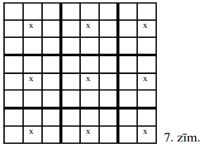
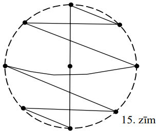
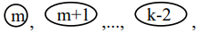

# <lo-sample/> LV.AMO.2007.5.1

Desmit kastēs kopā atrodas $5$ āboli (nevienā kastē nav vairāk par vienu 
ābolu). Kastes atver pa vienai. Cik kastu var būt atvērts brīdī, kad pirmoreiz 
kļūst skaidrs, kurās kastēs ir āboli?

<small>

* questionType:
* domain:

</small>

## Atrisinājums

**Atbilde:** $5;\ 6;\ 7;\ 8;\ 9$.

**Risinājums.** Ja atvērtas mazāk par $5$ kastēm, tad noskaidrotas augstākais 
$4$ ābolu atrašanās vietas, un nav skaidrs, kur ir pārējie āboli, kuri vēl nav 
atrasti. Var gadīties, ka visi āboli atrasti pēc $5;\ 6;\ 7;\ 8$ kastu 
atvēršanas; visos šajos gadījumos pirms pēdējā ābola atrašanas pilnīgas 
skaidrības vēl nebija. Ja pēc astoņu kastu atvēršanas atrasti $4$ āboli, tad 
vēl nav skaidrs, kurā kastē ir piektais ābols; savukārt pēc deviņu kastu 
atvēršanas viss ir skaidrs (neatkarīgi no tā, vai atrasti $4$ vai $5$ āboli), 
un desmitā kaste nemaz nav jāatver.

# <lo-sample/> LV.AMO.2007.5.2

Pa apli stāv Andris, Dzintars, Gunārs, Juliata, Maija un Skaidrīte. Visi 
attālumi starp bērniem ir dažādi. Katrs bērns nosauc sev vistuvāk stāvošā bērna
vārdu. Cik vārdi var tikt nosaukti divreiz? (Attālumus starp bērniem mēra "pa 
apli".)

<small>

* questionType:
* domain:

</small>

## Atrisinājums

**Atbilde:** $0,\ 1$ vai $2$.

**Risinājums.** Piemērus skat. 1.zīm.

Tā kā $4$ vai vairāk vārdus divas reizes nosaukt nevar, atliek pamatot, kāpēc 
$2$ reizes nevar nosaukt $3$ vārdus. Pieņemam, ka tas noticis. Tad trīs citi 
vārdi vispār nav nosaukti. Pieņemsim, ka vārds $X$ nosaukts $2$ reizes; tad to 
nosaukuši abi $X$ kaimiņi $Y$ un $Z$. Bērns $X$ nosauks vai nu $Y$, vai $Z$; 
varam pieņemt, ka $X$ nosauks $Y$. Tad vārdu $Y$ nosaucis vēl kāds bērns. Tāpēc
blakus stāvošie $X$ un $Y$ nosaukti divas reizes, pie tam abi nosaukuši viens 
otru. Līdzīgi spriežot, trešajam divreiz nosauktajam bērnam $E$ jābūt kaimiņam 
$F$, kas arī nosaukts divas reizes, pie tam $E$ un $F$ nosaukuši viens otru - 
pretruna.

# <lo-sample/> LV.AMO.2007.5.3

Uz kādas planētas tiek lietotas $2007$ dažādas valodas. Kāds mazākais daudzums 
vārdnīcu pietiekams, lai no katras valodas varētu tulkot uz katru citu? 
(Pieļaujamas vairākpakāpju tulkošanas; ar katru vārdnīcu tulko tikai vienā 
virzienā, piemēram, no latviešu valodas uz lietuviešu valodu, bet ne otrādi.)

<small>

* questionType:
* domain:

</small>

## Atrisinājums

**Atbilde:** $2007$.

**Risinājums.** **A.** Tā kā jāvar tulkot uz katru no $2007$ valodām, tad ar 
mazāk kā $2007$ vārdnīcām noteikti nepietiek.

**B.** Ja vārdnīcas ļauj tulkot "pa apli", kā redzams 2.zīm., tad ar $2007$ 
vārdnīcām pietiek.

# <lo-sample/> LV.AMO.2007.5.4

Dotas $4$ pēc ārēja izskata vienādas lodītes. Uz tām uzrakstīts attiecīgi " $1$
grams", " $3$ grami", " $4$ grami", " $7$ grami". Zināms, ka tieši vienas 
lodītes masa ir citāda, nekā norāda uzraksts uz tās. Kā ar divām svēršanām uz 
sviras svariem bez atsvariem atrast šo lodīti?

<small>

* questionType:
* domain:

</small>

## Atrisinājums

Izdarām svēršanas, kā parādīts 3.zīm.

Ja svari nav līdzsvarā tikai pirmajā svēršanā, īpašā lodīte ir 
.

Ja svari nav līdzsvarā tikai otrajā svēršanā, īpašā lodīte ir 
.

Ja abās svēršanās uz leju nosveras kreisais kauss, īpašā lodīte ir 
. Tāpat ir, ja abās svēršanās uz leju nosveras labais 
kauss.

Ja svēršanās uz leju nosveras dažādi kausi (vienā svēršanā viens, otrā - otrs),
tad īpašā lodīte ir .

# <lo-sample/> LV.AMO.2007.5.5

Kādā vislielākajā daudzumā dažādu gabalu var sagriezt kvadrātu ar izmēriem 
$6 \times 6$ rūtiņas? Griezumiem jāiet pa rūtiņu līnijām. Gabalus uzskata par 
dažādiem, ja tos nevar novietot tā, lai tie pilnīgi sakristu viens ar otru.

<small>

* questionType:
* domain:

</small>

## Atrisinājums

**Atbilde:** $10$.

**Risinājums.** Dažādo gabalu skaits, kas sastāv no $1;\ 2;\ 3;\ 4$ rūtiņām, ir
attiecīgi $1;1;2;5$ (skat. 4.zīm.)

Pat $11$ vismazākie gabali kopā saturētu 
$1 \cdot 1+1 \cdot 2+2 \cdot 3+5 \cdot 4+2 \cdot 5=39>36$ rūtiņas. Tātad $11$ 
gabalu nevar būt. Tas, ka $10$ gabali var būt, redzams 5.zīm.

# <lo-sample/> LV.AMO.2007.6.1

Trīsciparu skaitla $x$ simtu cipars ir $a$, desmitu cipars ir $b$ un vienu 
cipars ir $c$. Pierādīt: ar $7$ dalās visi tie un tikai tie skaitļi $x$, kuriem
izteiksme $2a+3b+c$ dalās ar $7$.

<small>

* questionType:
* domain:

</small>

## Atrisinājums

Ievērojam, ka 
$\overline{abc}=100a+10b+c=(98a+7b)+(2a+3b+c)=7(14a+b)+(2a+3b+c)$.

# <lo-sample/> LV.AMO.2007.6.2

Uz tāfeles uzrakstīti vairāki skaitļi. Katrs no tiem vienāds ar vienu desmito 
daļu no pārējo skaitļu summas. Cik skaitļu uzrakstīts? Atrisināt šo uzdevumu 
divos gadījumos:

**(A)** ir zināms, ka visi uzrakstītie skaitļi ir pozitīvi,

**(B)** par skaitļiem nav zināms, vai tie ir pozitīvi, negatīvi vai nulle.

<small>

* questionType:
* domain:

</small>

## Atrisinājums

**Atbilde:** **(A)** $11$, **(B)** var būt jebkurš skaits, kas lielāks par $1$.

**Risinājums.** **(A)** No dotā seko: katrs skaitlis vienāds ar vienpadsmito 
daļu no visu skaitļu summas. Tātad tie visi ir vienādi; tātad to ir $11$

**(B)** skaitļu sistēmas $(0; 0),\ (0; 0; 0),\ (0; 0; 0; 0)$ utt. apmierina 
uzdevuma prasības.

# <lo-sample/> LV.AMO.2007.6.3

Kvadrāts sastāv no $4 \times 4$ rūtiņām. Katrā no tām ierakstīts vesels 
pozitīvs skaitlis. Ar vienu gājienu drīkst pieskaitīt vieninieku skaitļiem 
divās rūtiņās, kurām ir kopīga mala. Vai var panākt, lai visi skaitļi rūtiņās 
būtu vienādi, ja sākotnējais izvietojums ir tāds, kāds parādīts 1.zīm. **(A)**,
**(B)** un **(C)**?

<small>

* questionType:
* domain:

</small>

## Atrisinājums

**Atbilde:** **(A)** jā, **(B)** nē, **(C)** nē.

**Risinājums.** **(A)** piemēram, izdarot šādus gājienus (sk. 6.zīm.).

visi skaitļi kļūs vienādi ar $6$:

$a4a3,\ a3a2,\ b3c3,\ d4d3,\ d4d3\ b1b2\ b1b2\ c1c2\ c2d2\ c2d2.$

**(B)** Sākumā visu ierakstīto skaitļu summa ir nepāra skaitlis (nepāra skaitā 
rūtiņu ierakstīti nepāra skaitļi). Ar katru gājienu šī summa palielinās par 
$2$, tātad paliek nepāra skaitlis. Bet, ja visi skaitļi kļūtu vienādi ar $n$, 
tad to summa $16n$ būtu pāra skaitlis.

**(C)** Iepriekšējā pierādījuma metode neder - visu ierakstīto skaitļu summa ir
pāra skaitlis, bet lietosim citu. Izkrāsosim rūtiņas šaha galdina kārtībā. Tad 
melnajās un baltajās rūtiņās ierakstīto skaitļu summas nav vienādas. Ar katru 
gājienu par $1$ palielinās gan viena, gan otra summa, tātad tās paliek dažādas.
Bet, ja visi skaitļi kļūtu vienādi, tad abām šīm summām arī būtu jākļūst 
vienādām.

# <lo-sample/> LV.AMO.2007.6.4

Kvadrāts sastāv no $8 \times 8$ rūtiņām. Kādu mazāko daudzumu rūtiņu var 
atzīmēt, lai nekādām divām atzīmētām rūtiņām nebūtu ne kopīgas malas, ne kopīga
stūra, bet katrai neatzīmētai rūtiņai būtu vai nu kopīga mala, vai kopīgs 
stūris ar kādu atzīmēto?

<small>

* questionType:
* domain:

</small>

## Atrisinājums

**Atbilde:** $9$ rūtiņas.

**Risinājums.** To, ka ar $9$ rūtiņām pietiek, skat. 7.zīm.

No otras puses, ja kādā no $9$ apgabaliem, kas redzami 7.zīm., nebūtu nevienas 
atzīmētas rūtiņas, tad **neatzīmētajai** rūtiņai, kurā patlaban redzams 
krustiņš, nebūtu ne kopīgas malas, ne kopīga stūra ne ar vienu atzīmēto.

Tātad vismaz $9$ rūtiņas (pa vienai katrā apgabalā) jāatzīmē.

# <lo-sample/> LV.AMO.2007.6.5

Seši rūķīši brīvdienās apciemo cits citu. Katru dienu daži rūķīši sēž mājās un 
neiet nekur, bet citi viņus apciemo (katrs rūķītis vienā dienā var veikt 
vairākus apciemojumus). Kāds ir mazākais dienu skaits, ar ko pietiek, lai katrs
rūķītis varētu apciemot katru citu?

<small>

* questionType:
* domain:

</small>

## Atrisinājums

**Atbilde:** $4$ dienas.

**Risinājums.** To, ka ar $4$ dienām pietiek, skat. 8.zīm., kur parādīts, kurās
dienās katrs no $6$ rūķīšiem sēž mājās.

Tagad pamatosim, kāpēc ar mazāku dienu daudzumu nepietiek. Pavisam jāizdara 
$6 \cdot 5=30$ apciemojumi. Noskaidrosim, kāds ir maksimālais apciemojumu 
skaits dienā, atkarībā no tā, cik rūķišu sēž mājās un cik - iet ciemos.

| Mājās sēž | Iet viesos | Iespējamo apciemojumu skaits |
| :---: | :---: | :---: |
| $0$ | $6$ | $0 \cdot 6=0$ |
| $1$ | $5$ | $1 \cdot 5=5$ |
| $2$ | $4$ | $2 \cdot 4=8$ |
| $3$ | $3$ | $3 \cdot 3=9$ |
| $4$ | $2$ | $4 \cdot 2=8$ |
| $5$ | $1$ | $5 \cdot 1=5$ |
| $6$ | $0$ | $6 \cdot 0=0$ |

Redzam, ka vienā dienā nevar notikt vairāk par $9$ apciemojumiem, bet 
$9 \cdot 3=27<30$, tātad ar $3$ dienām nepietiek.

# <lo-sample/> LV.AMO.2007.7.1

Kādu lielāko daudzumu dažādu ciparu var izrakstīt pa apli tā, lai katri divi 
blakus uzrakstīti cipari, lasot tos vienalga kādā virzienā, veidotu pirmskaitļa
pierakstu?

<small>

* questionType:
* domain:

</small>

## Atrisinājums

Acīmredzot, nedrīkst rakstīt ne pāra ciparus, ne $5$. Atliek cipari 
$1;\ 3;\ 7;\ 9$. Ja tos uzrakstītu visus, tad devītniekam vismaz vienā pusē 
būtu vai nu $3$, vai $1$; bet $93$ dalās ar $3$ un $91$ dalās ar $7$, tātad nav
pirmskaitļi. Tātad nedrīkst rakstīt arī $9$. Ciparus $1;\ 3;\ 7$ var izrakstīt 
jebkurā secībā.

**Atbilde:** $3$ ciparus.

# <lo-sample/> LV.AMO.2007.7.2

Katram no trijstūriem $ABC$ un $ADE$ visi leņķi ir $60^{\circ}$ lieli (skat. 
2.zīm.). Pierādīt, ka $BD=CE$.

<small>

* questionType:
* domain:

</small>

## Atrisinājums

Tā kā trijstūrī pret vienādiem leņķiem atrodas vienādas malas, tad $AE=AD$ un 
$AC=AB$. Bez tam 
$\sphericalangle EAC=60^{\circ}-\sphericalangle CAD=\sphericalangle DAB$. Tāpēc
$\triangle EAC=\triangle DAB$ pēc pazīmes $\mathbf{m \ell m}$, un no tā seko, 
ka $EC=DB$.

# <lo-sample/> LV.AMO.2007.7.3

Uz tāfeles sākumā uzrakstīti $6$ divciparu naturāli skaitļi. Andris ar savu 
gājienu var pieskaitīt dažiem skaitļiem $1$, bet pārējiem skaitļiem $2$. (Var 
arī pieskaitīt visiem skaitļiem $1$ vai visiem skaitļiem $2$.) Pēc tam Maija ar
savu gājienu var nodzēst jebkuru skaitli, kas dalās ar $7$ vai kam ciparu summa
dalās ar $7$. Pēc tam gājienu izdara Andris, pēc tam - Maija, utt. Pierādīt, ka
Maija var panākt, lai skaitļu uz tāfeles vairs nebūtu (pieņemsim, ka tiek 
spēlēts pietiekoši ilgi).

<small>

* questionType:
* domain:

</small>

## Atrisinājums

Katrā no sekojošiem **blakus esošu** skaitļu pāriem katrs skaitlis ir tāds, 
kuru Maija var nodzēst:

$105$ un $106;\ 160$ un $161;\ 167$ un $168;\ 175$ un $176;\ 223$ un 
$224;\ 231$ un $232$.

Neviens Andra skaitlis augšanas procesā nevar "pārlekt pāri" nevienai no šīm 
barjerām. Tāpēc Maija tos visus pakāpeniski varēs nodzēst (ja tas nebūs noticis
jau agrāk).

# <lo-sample/> LV.AMO.2007.7.4

Divpadsmit cilvēku grupā katrs pazīst tieši $7$ citus (ja $A$ pazīst $B$, tad 
$B$ pazīst $A$). Pierādīt: var atrast tādus $3$ cilvēkus, kas visi pazīst cits 
citu.

<small>

* questionType:
* domain:

</small>

## Atrisinājums

Izvēlēsimies divus pazīstamus cilvēkus $A$ un $B$. Katrs no tiem pazīst vēl 
sešus citus. Tā kā $6+6>10$, tad starp pārējiem $10$ cilvēkiem atradīsies tāds,
kas ietilpst gan $A$ "pārējo $6$ paziņu" grupā, gan $B$ "pārējo $6$ paziņu" 
grupā. Šo cilvēku varam ņemt par $C$.

# <lo-sample/> LV.AMO.2007.7.5

Pa apli izrakstīti $16$ skaitļi. Nekādu triju pēc kārtas uzrakstītu skaitļu 
summa nav mazāka par $2$; nekādu piecu pēc kārtas uzrakstītu skaitļu summa nav 
lielāka par $4$. Kāda ir lielākā iespējamā divu blakus uzrakstītu skaitļu 
starpība?

<small>

* questionType:
* domain:

</small>

## Atrisinājums

**Atbilde:** $2$.

**Risinājums.** Tas, ka starpība var būt $2$, redzams 10.zīm.

Pierādīsim, ka tā nevar būt lielāka par $2$. Apzīmēsim skaitļus rakstišanas 
kārtībā ar $x_{1}; x_{2}; x_{3}; \ldots ; x_{16}$; to summu apzīmēsim ar $S$.

Tā kā 
$S=x_{1}+\left(x_{2}+x_{3}+x_{4}\right)+\left(x_{5}+x_{6}+x_{7}\right)+\ldots+\left(x_{14}+x_{15}+x_{16}\right)$,
tad $S \geq x_{1}+5 \cdot 2$ jeb $\mathbf{S} \geq \mathbf{x_{1}+10}$.

Tā kā 
$S=x_{2}+\left(x_{3}+x_{4}+x_{5}+x_{6}+x_{7}\right)+\ldots+\left(x_{13}+x_{14}+x_{15}+x_{16}+x_{1}\right)$,
tad $\mathbf{S} \leq \mathbf{x_{2}}+\mathbf{12}$. No izceltajām nevienādībām 
seko $x_{1}+10 \leq x_{2}+12$ un tālāk $x_{1}-x_{2} \leq 2$, k.b.j.

# <lo-sample/> LV.AMO.2007.8.1

Kvadrātvienādojuma $x^{2}+px+q=0$ saknes ir $x_{1}$ un $x_{2}$, bet 
kvadrātvienādojuma $x^{2}+ax+b=0$ saknes ir $x_{3}$ un $x_{4}$. Nav tādas $x$ 
vērtības, ar kuru abu vienādojumu kreisās puses būtu vienādas savā starpā. 
Pierādīt, ka $x_{1}+x_{2}=x_{3}+x_{4}$.

<small>

* questionType:
* domain:

</small>

## Atrisinājums

No dotā seko, ka vienādojumam $x^{2}+px+q=x^{2}+ax+b$ jeb $(p-a)x=b-q$ nav 
atrisinājuma. Tātad $p=a$ (un $b \neq q$, bet mums tas nav svarīgi). No $p=a$ 
un Vjeta teorēmas seko vajadzīgais.

# <lo-sample/> LV.AMO.2007.8.2

Trijstūrī $ABC$ pastāv sakarības $AC=BC$ un $\sphericalangle ACB=20^{\circ}$. 
Leņķa $CAB$ bisektrise un malas $AC$ vidusperpendikuls krustojas punktā $M$. 
Aprēķināt **(A)** $\sphericalangle MCB$, **(B)** $\sphericalangle MBC$.

<small>

* questionType:
* domain:

</small>

## Atrisinājums

Skaidrs, ka $\sphericalangle CAB=\sphericalangle CBA=80^{\circ}$ un 
$\sphericalangle CAM=\sphericalangle BAM=40^{\circ}$. Tā kā $AM=CM$ ($M$ uz 
$AC$ vidusperpendikula), tad $\triangle AMC$ - vienādsānu. Tāpēc 
$\sphericalangle ACM=\sphericalangle CAM=40^{\circ}$; no šejienes 
$\sphericalangle \mathbf{MCB}=\mathbf{40}^{\circ}-\mathbf{20}^{\circ}=\mathbf{20}^{\circ}$.

Novelkam $BY \perp AD$. Tā kā $\Delta YAB$ bisektrise ir arī augstums, tad 
$\Delta YAB$ - vienādsānu, $AY=AB$. Tāpēc 
$\triangle AYD=\triangle ABD\ (m \ell m)$. Tā kā 
$\sphericalangle ADB=180^{\circ}-40^{\circ}-80^{\circ}=60^{\circ}$, tad arī 
$\sphericalangle YDA=60^{\circ}$ un 
$\sphericalangle YDC=180^{\circ}-60^{\circ}-60^{\circ}=60^{\circ}$; arī 
$\sphericalangle MDC=60^{\circ}$, jo $\sphericalangle MDC=\sphericalangle ADB$.

Tātad $\triangle MDC=\Delta YDC\ (\ell m \ell)$, tāpēc $YD=MD$. Tā kā 
$YD=BD$, tad $MD=BD$, t.i., $\Delta MDB$ - vienādsānu. Tā kā 
$\sphericalangle MDB=180^{\circ}-60^{\circ}=120^{\circ}$, tad 
$\sphericalangle \mathbf{MBC}=\frac{\mathbf{1}}{\mathbf{2}}\left(\mathbf{180^{\circ}}-\mathbf{120^{\circ}}\right)=\mathbf{30^{\circ}}$.

# <lo-sample/> LV.AMO.2007.8.3

Juliata iedomājās naturālu skaitli, sareizināja visus tā ciparus un iegūto 
rezultātu pareizināja ar iedomāto skaitli. Gala rezultātā Juliata ieguva 
$1716$. Kādu skaitli viņa iedomājās sākumā?

<small>

* questionType:
* domain:

</small>

## Atrisinājums

**Atbilde:** $143$.

**Risinājums.** Ievērosim, ka $1716=11 \cdot 12 \cdot 13$. Tā kā $11$ un $13$ 
ir pirmskaitļi un nevar būt cipari, tad Juliatas iedomātais skaitlis dalās ar 
$11 \cdot 13=143$. Tad tas ir $143 \cdot x$, kur $x$ - skaitļa $12$ naturāls 
dalītājs. Pārbaude parāda, ka der tikai $x=1$.

# <lo-sample/> LV.AMO.2007.8.4

Dzintars un Gunārs svētkos rāda burvju triku. Viņiem ir $20$ kartītes; uz 
katras no tām uzrakstīts naturāls skaitlis no $1$ līdz $20$. Visi skaitļi ir 
dažādi. Vispirms Gunārs iedod visas kartītes kādam no skatītājiem. Skatitājs 
izvēlas no tām $9$ kartītes un patur sev, bet pārējās $11$ atdod Gunāram. 
Gunārs patur sev $9$ kartītes, bet pārējās $2$ atdod skatītājam. Skatītājs 
pievieno šīm divām kartītēm vienu no sākotnēji paturētajām deviņām un nodod šīs
trīs kartītes Dzintaram Dzintars pareizi norāda, kuru no trim kartītēm 
skatītājs pievienoja pēdējā posmā.

Izdomājiet, kā šādu triku var organizēt. (Trika izpildes laikā Gunārs un 
Dzintars savā starpā nesazinās un nespiego, ko dara skatītās.)

<small>

* questionType:
* domain:

</small>

## Atrisinājums

Triku var organizēt dažādi. Apskatīsim vienu iespēju.

Ievērosim, ka uz kartītēm ir tieši divi skaitļi, kas beidzas ar $0$; tieši divi
skaitļi, kas beidzas ar $1; \ldots$; tieši divi skaitļi, kas beidzas ar $9$. 
Starp $11$ kartītēm, ko skatītājs atdod Gunāram, noteikti atradīsies divas, uz 
kurām esošie skaitļi beidzas ar vienu un to pašu ciparu (teiksim, ar $a$). 
Tieši šādas divas kartītes Gunārs atdod skatītājam. Skaitlis, ko skatītājs 
pievieno šīm divām, noteikti nebeidzas ar ciparu $a$ (jo trešās tādas kartītes 
vispār nav). Tāpēc Dzintars, saņemot $3$ kartītes no skatītāja, redz, ka uz 
divām no tām skaitļiem pēdējie cipari ir vienādi savā starpā, bet uz trešās 
pēdējais cipars ir citāds. Šo kartīti Dzintars arī norāda.

# <lo-sample/> LV.AMO.2007.8.5

Kvadrāts sastāv no $9 \times 9$ rūtiņām, kas izkrāsotas šaha galdiņa kārtībā; 
stūra rūtiņas ir melnas. Figūriņu novieto melnajā rūtiņā. Ja figūriņa ir kādā 
rūtiņā $A$, tad ar vienu gājienu to var pārvietot uz jebkuru rūtiņu, kam ar $A$
ir kopīgs stūris, bet ne kopīga mala. Kāds ir mazākais iespējamais gājienu 
skaits, ar kuru var apstaigāt visas melnās rūtiņas, dažās no tām varbūt ieejot 
vairākas reizes? Sākuma rūtiņa automātiski skaitās apstaigāta. Ar pēdējo 
gājienu nav obligāti jāatgriežas sākuma rūtiņā. Spēlētājs var izvēlēties 
figūriņas sākuma pozīciju.

<small>

* questionType:
* domain:

</small>

## Atrisinājums

**Atbilde:** $48$ gājieni.

**Risinājums.** Tas, ka ar $48$ gājieniem pietiek, redzams 12.zīm.

Pierādīsim, ka ar mazāk gājieniem nepietiek. Kopā jāieiet $40$ melnās rūtiņās 
(pavisam to ir $41$). Melnajās rūtiņās, kas 13.zīm. attēlotas ar krustiņu, var 
ieiet tikai no tām rūtiņām, kas apzīmētas ar aplīšiem; krustiņu ir $25$, 
aplīšu - $16$. Šķirojam divas iespējas:

**(A)** maršruts sākas "krustiņā". Tad jāieiet $24$ krustiņos. Tāpēc vismaz 
$24-16=8$ reizes jāieiet aplītī, kurā jau ir būts (lai būtu, no kurienes ieiet 
visos krustiņos). Tāpēc pavisam jāveic vismaz $40+8=48$ gājieni.

**(B)** maršruts sākas aplītī. Tad jāieiet $25$ krustiņos. Vienā no tiem ieiet 
no sākuma pozīcijas; lai realizētu atlikušās $24$ ieiešanas, atkal vajag vismaz
$24-16=8$ "liekus" gājienus, un kopējais gājienu skaits ir vismaz $40+8=48$.

# <lo-sample/> LV.AMO.2007.9.1

Kvadrātveida tabula sastāv no $10 \times 10$ rūtiņām. Katrā rūtiņā ierakstīts 
nenulles cipars. No katras rindiņas un katras kolonnas cipariem, ņemot tos 
patvaļīgā secībā, izveidots viens desmitciparu naturāls skaitlis. Vai var 
gadīties, ka tieši $19$ no šiem skaitļiem (ne vairāk un ne mazāk) dalās ar $3$?

<small>

* questionType:
* domain:

</small>

## Atrisinājums

**Atbilde:** nē.

**Risinājums.** Pieņemsim, ka tā noticis, un vienīgais skaitlis, kas nedalās ar
$3$, izveidots no kādas kolonnas cipariem (otrs gadījums analoģisks). Tad katrā
rindiņā ciparu summa dalās ar $3$. Tāpēc arī visu ierakstīto ciparu summa dalās
ar $3$. Savukārt deviņās kolonnās ciparu summas dalās ar $3$, bet vienā - nē; 
tāpēc arī visu ciparu summa nedalās ar $3$. Iegūta pretruna.

# <lo-sample/> LV.AMO.2007.9.2

Dots, ka $\triangle ABC$ ir regulārs. Punkts $P$ atrodas uz $ABC$ apvilktās 
riņķa līnijas (skat. 1.zīm.) Taisnes, kas caur $P$ vilktas paralēli 
$AB,\ BC$ un $CA$, krusto atbilstoši taisnes $BC,\ AC$ un $AB$ attiecīgi 
punktos $M,\ K$ un $N$. Pierādīt, ka $\sphericalangle BMN=\sphericalangle BMK$

<small>

* questionType:
* domain:

</small>

## Atrisinājums

No konstrukcijas seko, ka $PMBN$ ir trapece, pie tam vienādsānu (leņķi pie 
pamata $PM$ abi ir $60^{\circ}$ ). Tāpēc 
$\sphericalangle \mathbf{BMN}=\sphericalangle \mathbf{BPN}$.

Līdzīgi $PMCK$ ir vienādsānu trapece, tāpēc 
$\sphericalangle BMK=\sphericalangle BCP$, un mums pietiek pierādīt, ka 
$\sphericalangle BPN=\sphericalangle BCP$. Tā kā tie abi ir ievilkti leņķi, tad
pietiek pierādīt, ka $B$ ir loka $PBL$ viduspunkts. Bet tas seko no vienādībām 
$\cup APB=\cup CLB=120^{\circ}$ un $\cup AmP=\cup CnL$ (loki starp paralēlām 
hordām), atņemot tās vienu no otras.

**Piezīme.** No pierādītā seko, ka $M,\ N,\ K$ atrodas uz vienas taisnes.

# <lo-sample/> LV.AMO.2007.9.3

**(A)** katrs no naturāliem skaitļiem $a$ un $b$ ir izsakāms kā divu veselu 
skaitļu kvadrātu summa. Pierādiet, ka arī reizinājums $a \cdot b$ ir izsakāms 
šādā veidā.

**(B)** atrodiet divus tādus polinomus ar veseliem koeficientiem $f(x)$ un 
$g(x)$, ka visiem $x$ pastāv vienādība

$$(f(x))^{2}+(g(x))^{2}=\left(x^{2}+1\right)\left(x^{2}+4\right)\left(x^{2}+2x+2\right)\left(x^{2}-2x+2\right)$$

<small>

* questionType:
* domain:

</small>

## Atrisinājums

**(A)** 
$\left(x^{2}+y^{2}\right)\left(z^{2}+t^{2}\right)=(xz+yt)^{2}+(xt-yz)^{2}$

**(B)** izmantojot (A) punkta identitāti, pakāpeniski iegūstam 
$\left.\left(x^{2}+1^{2}\right)\left(x^{2}+2^{2}\right)\left((x+1)^{2}+1^{2}\right)\left((x-1)^{2}+1^{2}\right)=\left(\left(x^{2}+2\right)^{2}+(x)^{2}\right)\left(x^{2}-1+1\right)^{2}+(2)^{2}\right)=\left(x^{4}+2x^{2}+2x\right)^{2}+\left(x^{3}-2x^{2}-4\right)^{2}$

# <lo-sample/> LV.AMO.2007.9.4

Regulārā $n$-stūrī jāuzzīmē vairākas slēgtas lauztas līnijas tā, lai katra no 
tām sastāvētu tieši no $n$ dažādiem posmiem, lai katras līnijas katrs posms 
būtu vai nu $n$-stūra mala, vai diagonāle un lai gan katra nstūra mala, gan 
katra tā diagonāle būtu posms tieši vienā no šīm līnijām. Vai to var izdarīt, 
ja **(A)** $n=8$, **(B)** $n=9$?

<small>

* questionType:
* domain:

</small>

## Atrisinājums

**Atbilde:** **(A)** nē, **(B)** jā.

**Risinājums.** **(A)** katrai no slēgtajām lauztajām līnijām katrā virsotnē ir
pāra skaits posmu. Bet no katras astoņstūra virsotnes kopā iziet nepāra skaits 
nogriežņu - $2$ malas un $5$ diagonāles.

**(B)** piemēram, skat. 15.zīm.

Tur $9$-stūra virsotnes attēlotas kā astoņstūra virsotnes un centrs, un līdz ar
uzzīmēto līniju jāiedomājas arī tās attēli pagriezienos ap $8$-stūra centru.

# <lo-sample/> LV.AMO.2007.9.5

Pa apli novietotas $10$ viena lata monētas, visas ar "lasi" uz augšu. Ar vienu 
gājienu atļauts apgriezt otrādi vai nu četras pēc kārtas novietotas monētas, 
vai arī divas pirmās un divas pēdējās monētas piecu pēc kārtas esošu monētu 
virknē (skat. 2.zīm.) Šādus gājienus drīkst atkārtot vairākkārt. Kāds lielākais
monētu daudzums var vienlaicīgi atrasties ar gerboni uz augšu?

<small>

* questionType:
* domain:

</small>

## Atrisinājums

**Atbilde:** $8$ monētas.

**Risinājums.** **(A)** Apgriežot divus monētu pieciniekus bez kopējiem 
elementiem, uz augšu ir $8$ ģerboņi.

**(B)** izvēlamies $5$ monētas, no kurām nekādas divas neatrodas blakus. Katrs 
gājiens aizskar tieši divas no tām. Tāpēc šādā monētu pieciniekā katrā gājienā 
"lašu" skaits vai nu nemainās, vai mainās par $2$, tātad paliek nepāra 
skaitlis. Tātad katrā no abiem šādiem monētu pieciniekiem vienmēr uz augšu ir 
vismaz viens "lasis".

# <lo-sample/> LV.AMO.2007.10.1

Desmitciparu naturāls skaitlis dalās ar $999\ 999$. Vai tas var dalīties arī ar
$1\ 000\ 001$?

<small>

* questionType:
* domain:

</small>

## Atrisinājums

Pieņemsim, ka $n$ dalās gan ar $999\ 999$, gan ar $1\ 000\ 001$. Tā kā
$LKD(999\ 999,\ 1\ 000\ 001)1$, tad $n$ dalās arī ar 
$999\ 999 \cdot 1\ 000\ 001=10^{12}-1$. Bet tā nevar būt, jo desmitciparu 
skaitlis ir mazāks par $10^{12}-1$.

# <lo-sample/> LV.AMO.2007.10.2

Dots, ka $x, y, z$ un $t$ ir pozitīvi skaitli.

**(A)** Pieņemsim, ka zināms: $x+y+z+t \leq 4$. Vai noteikti 
$\frac{1}{x}+\frac{1}{y}+\frac{1}{z}+\frac{1}{t} \geq 4$?

**(B)** Pienemsim, ka zināms: $x+y+z+t \geq 4$. Vai noteikti 
$\frac{1}{x}+\frac{1}{y}+\frac{1}{z}+\frac{1}{t} \leq 4$?

<small>

* questionType:
* domain:

</small>

## Atrisinājums

**Atbilde:** **(A)** jā, **(B)** nē.

**Risinājums.** **(A)** ievērosim, ka 
$(x+y+z+t)\left(\frac{1}{x}+\frac{1}{y}+\frac{1}{z}+\frac{1}{t}\right)=$  
$=4+\left(\frac{x}{y}+\frac{y}{x}\right)+\left(\frac{x}{z}+\frac{z}{x}\right)+\left(\frac{x}{t}+\frac{t}{x}\right)+\left(\frac{y}{z}+\frac{z}{y}\right)+\left(\frac{y}{t}+\frac{t}{y}\right)+\left(\frac{z}{t}+\frac{t}{z}\right)$.

Tā kā pozitīviem $\alpha$ ir spēkā 
$\alpha+\frac{1}{\alpha} \geq 2 \sqrt{\alpha \cdot \frac{1}{\alpha}}=2$, tad 
apskatāmā reizinājuma vērtība ir vismaz $4+6 \cdot 2=16$. No tā seko uzdevuma 
apgalvojums.

**(B)** apskatām piemēru $x=y=z=0,1;\ t=1000$.

# <lo-sample/> LV.AMO.2007.10.3

Doti $7$ dažādi siera gabali. Pierādīt: vienu no tiem iespējams sagriezt divos 
gabalos tā, ka iegūtos $8$ gabalus var sadalīt divās daļās (pa $4$ gabaliem 
katrā) ar vienādām kopējām masām.

<small>

* questionType:
* domain:

</small>

## Atrisinājums

Pieņemsim, ka siera gabalu masas ir 
$m_{1} \leq m_{2} \leq m_{3} \leq m_{4} \leq m_{5} \leq m_{6} \leq m_{7}$.

Tad $m_{1}+m_{3}+m_{5}+m_{7}>m_{2}+m_{4}+m_{6}$ un 
$m_{1}+m_{3}+m_{5}<m_{2}+m_{4}+m_{6}+m_{7}$.

No šejienes redzam: ja no sākuma vienā kaudzē novietojam 
$m_{1};\ m_{3};\ m_{5}$, bet otrā - $m_{2};\ m_{4};\ m_{6}$, tad pievienojam 
pirmajai kaudzei $m_{7}$ un sākam $m_{7}$ pakāpeniski "pārsūknēt" uz otro 
kaudzi, tad sākumā smagākā ir pirmā kaudze, bet beigās - otrā. Tāpēc būs tāds 
brīdis, kad abās kaudzēs būs vienādas masas. Šai brīdī redzams, kādos gabalos 
jāsagriež $m_{7}$.

# <lo-sample/> LV.AMO.2007.10.4

Plakne sadalīta vienādos kvadrātinos kā rūtiņu lapa. Uzzīmēts izliekts 
daudzstūris, kura visas virsotnes atrodas rūtiņu virsotnēs, bet neviena mala 
neiet pa rūtiņu līnijām. Pierādīt: daudzstūra iekšpusē esošo vertikālo rūtiņu 
līniju garumu summa vienāda ar daudzstūra iekšpusē esošo horizontālo rūtiņu 
līniju garumu summu.

<small>

* questionType:
* domain:

</small>

## Atrisinājums

Pieņemsim, ka rūtiņas malas garums ir $1$. Apskatīsim vertikālās rūtiņu 
līnijas; tās sadala daudzstūri $2$ trijstūros un kaut kādā daudzumā trapeču/ 
paralelogramu.

Daudzstūra kopējais laukums ir 
$\frac{1}{2} a_{1} \cdot 1+\frac{1}{2}\left(a_{1}+a_{2}\right) \cdot 1+\frac{1}{2}\left(a_{2}+a_{3}\right) \cdot 1+\ldots+$  
$+\frac{1}{2}\left(a_{n-1}+a_{n}\right) \cdot 1+\frac{1}{2} a_{n} \cdot 1=a_{1}+\ldots+a_{n}$.
Tātad vertikālo līniju garuma summa ir vienāda ar daudzstūra laukumu. Tas pats 
attiecas uz horizontālo rūtiņu līniju garumu summu.

# <lo-sample/> LV.AMO.2007.10.5

Plaknē doti $n$ punkti, $n \geq 3$. Nekādi $3$ no tiem neatrodas uz vienas 
taisnes. Apskatām visas iespējamās taisnes, kas katra iet caur diviem no šiem 
punktiem. Pierādiet, ka

**(A)** starp tām noteikti var atrast $n-1$ taisnes, no kurām nekādas divas nav
paralēlas savā starpā,

**(B)** starp tām noteikti var atrast $n$ taisnes, no kurām nekādas divas nav 
paralēlas savā starpā,

**(C)** iespējams, ka starp tām nevar atrast $n+1$ taisnes, no kurām nekādas 
divas nav paralēlas savā starpā.

<small>

* questionType:
* domain:

</small>

## Atrisinājums

**(A)** apskatām dotās punktu sistēmas izliekto apvalku. Ņemam vienu tā 
virsotni. Tās $n-1$ taisnes, kas iet caur šo virsotni un citiem $n-1$ punktiem,
savā starpā nav paralēlas (skat 17.zīm.)

**(B)** ja iepriekšējā risinājumā "malējās" taisnes ir $AB$ un $AC$, tad taisne
$BC$ nav paralēla nevienai no pārējām $n-1$ taisnei; tāpēc to var ņemt par 
$n$-to taisni

**(C)** ja dotie $n$ punkti ir regulāra $n$-stūra virsotnēs, tad taisnēm, kas 
vilktas caur diviem no tiem, ir pavisam $n$ dažādi virzieni. Tāpēc no tām nevar
izvēlēties vairāk par $n$ pa pāriem neparalēlām taisnēm.

# <lo-sample/> LV.AMO.2007.11.1

Punkts $P$ atrodas regulāra trijstūra $ABC$ iekšpusē. Pierādīt, ka:

**(A)** $PA+PB+PC<3 \cdot AB$,

**(B)** $PA+PB+PC<2 \cdot AB$.

<small>

* questionType:
* domain:

</small>

## Atrisinājums

**Lemma.** $PA<AB$.

Tiešām, pagarinām $AP$ līdz krustpunktam $A_{1}$ ar malu $BC$. Vai nu 
$\sphericalangle AA_{1}B \geqslant 90^{\circ}$, vai arī 
$\sphericalangle AA_{1}C \geqslant 90^{\circ}$; varam pieņemt, ka 
$\sphericalangle AA_{1}B \geqslant 90^{\circ}$. Tad trijstūrī $A_{1}B$ leņķis 
$A_{1}B$ ir lielākais leņķis, tātad pret to atrodas lielākā mala; tāpēc 
$AB>AA_{1}>AP$. Otrā gadījumā $AB=AC>AA_{1}>AP$.

Tagad atrisināsim uzdevumu.

**(A)** no lemmas $PA<a,\ PB<a,\ PC<a$, kur $a$ - regulārā trijstūra malas 
garums. Saskaitot šīs nevienādības, iegūstam vajadzīgo.

**(B)** novelkam $MN \parallel BC$; tad $\triangle MAN$ ir regulārs. No 
trijstūra nevienādības seko $BP+CP<(BM+MP)+(CN+NP)$, tātad 

$$BP+CP<BM+CN+MN \tag(1)$$

No lemmas seko

$$AP<AM \tag(2)$$

Saskaitot (1) un (2) un ievērojot, ka $MN=AN$, iegūstam

$BP+CP+AP<BM+CN+MN+AM==(BM+AM)+(CN+AN)=BA+AC=2 \cdot AB$, k.b.j.

# <lo-sample/> LV.AMO.2007.11.2

Pierādīt, ka

$$\frac{1}{1^{4}+1^{2}+1}+\frac{2}{2^{4}+2^{2}+1}+\frac{3}{3^{4}+3^{2}+1}+\ldots+\frac{2007}{2007^{4}+2007^{2}+1}<\frac{1}{2}$$

<small>

* questionType:
* domain:

</small>

## Atrisinājums

Ievērosim, ka katram $n>0$ pastā vienādība

$$\begin{aligned}
& \frac{n}{n^{4}+n^{2}+1}=\frac{n}{n^{4}+2n^{2}+1-n^{2}}=\frac{n}{\left(n^{2}+1\right)^{2}-n^{2}}=\frac{n}{\left(n^{2}-n+1\right)\left(n^{2}+n+1\right)}= \\
& =\frac{1}{2}\left[\frac{1}{n^{2}-n+1}-\frac{1}{n^{2}+n+1}\right]=\frac{1}{2}\left[\frac{1}{n^{2}-n+1}-\frac{1}{(n+1)^{2}-(n+1)+1}\right]
\end{aligned}$$

Saskaitot šīs vienādības pie $n=1;\ 2;\ 3;\ \ldots;\ 2007$, iegūstam, ka 
novērtējamās summas vērtība ir 
$\frac{1}{2}\left[\frac{1}{1^{4}-1^{2}+1}-\frac{1}{2008^{4}-2008^{2}+1}\right]<\frac{1}{2} \cdot \frac{1}{1^{4}-1^{2}+1}=\frac{1}{2}$,
k.b.j.

# <lo-sample/> LV.AMO.2007.11.3

Dots, ka $ABCD$ - trapece. Uzzīmētas divas riņķa līnijas, kuru diametri ir 
trapeces sānu malas $AB$ un $CD$. Diagonāļu krustpunkts $S$ atrodas ārpus šīm 
riņķa līnijām. Pierādīt: pieskares, kas no $S$ novilktas abām riņķa līnijām, 
vienādas savā starpā.

<small>

* questionType:
* domain:

</small>

## Atrisinājums

Apzīmējam $\sphericalangle ASB=\alpha$. Saskaņā ar teorēmu par pieskares garuma
kvadrātu mums pietiek pierādīt, ka $SM \cdot SA=SN \cdot SD$.

Tā kā $SM=SB \cdot \cos \alpha$ un $SN=SC \cdot \cos \alpha$, pietiek pierādīt,
ka $SB \cdot SA \cdot \cos \alpha=SC \cdot SD \cdot \cos \alpha$. Ja būtu 
$\cos \alpha=0$, tad $\alpha=90^{\circ}$ un $S$ atrodas uz abām riņķa līnijām -
pretruna. Tātad pietiek pierādīt, ka $SB \cdot SA=\mathrm{SC} \cdot SD$ jeb, ka
$\frac{SB}{SC}=\frac{SD}{SA}$. Tas seko no trijstūru $\triangle BSC$ un 
$\triangle DSA$ līdzības.

# <lo-sample/> LV.AMO.2007.11.4

Kādā firmā daži darbinieki vienmēr melo, bet pārējie vienmēr runā patiesību (ir
gan tādi, gan tādi). Nekādi divi darbinieki nestrādā firmā vienādi ilgi; 
nekādiem diviem darbiniekiem nav vienādas algas. Kādu rītu katrs darbinieks 
sniedza divus paziņojumus:

**(A)** nav pat ne $10$ darbinieku, kas strādātu firmā ilgāk par mani;

**(B)** vismaz $90$ darbinieki saņem lielāku algu nekā es.

Cik darbinieku strādā firmā?

<small>

* questionType:
* domain:

</small>

## Atrisinājums

Apskatīsim to no patiesajiem darbiniekiem $(P)$, kas saņem vislielāko algu. Ir 
vismaz $90$ meļu $(M)$, kas saņem lielāku algu, nekā viņš. Apskatīsim to no 
$M$, kas saņem vismazāko algu. Saskaņā ar iepriekšējo ir pats lielākais $89$ 
citu meļi. No tā visa seko, ka meļu ir tieši $90$.

Apskatīsim to no $M$, kas strādā visilgāk. Tātad ir vismaz $10P$ (kuri strādā 
ilgāk par šo meli). Apskatīsim to no $P$, kurš strādājis vismazāko laiku; ir ne
vairāk kā $9$ citi $P$. Tātad patieso darbinieku ir tieši $10$.

Tātad firmā strādā tieši $100$ darbinieki.

# <lo-sample/> LV.AMO.2007.11.5

Kvadrāts sastāv no $n \times n$ vienādām kvadrātiskām rūtiņām. Divas rūtiņas 
sauc par blakus rūtiņām, ja tām ir kopīga mala. Sākumā visas rūtiņas ir baltas.
Ar vienu gājienu atļauts nokrāsot melnā krāsā

**(A)** vienu baltu rūtiņu, ja visas tās blakus rūtiņas ir baltas,

**(B)** no divām baltām rūtiņām sastāvošu taisnstūri, ja tieši divas no tam 
blakus esošām rūtiņām jau ir melnas,

**(C)** no četrām baltām rūtiņām sastāvošu kvadrātu, ja visas $8$ tam blakus 
esošās rūtiņas jau ir melnas.

Vai var nokrāsot melnu visu kvadrātu, ja

**(A)** $n=8$

**(B)** $n=13$?

<small>

* questionType:
* domain:

</small>

## Atrisinājums

**Atbilde:** **(A)** nevar, **(B)** var.

**Risinājums.** Pie $n=13$ vispirms nokrāsojam ar krustiņiem atzīmētās rūtiņas 
(skat. 21.zīm.)

Pēc tam nokrāsojam $1 \times 2$ rūtiņas lielos taisnstūrus, kas tās "savieno"; 
pēc tam nokrāsojam baltos $2 \times 2$ rūtiņu kvadrātus.

Pie $n=8$ apskatīsim to kvadrātā iekšā esošo rūtiņu malu skaitu, kam abās pusēs
ir melnas rūtiņas. Sākumā tas ir $0$; beigās tam jābūt $2 \cdot 7 \cdot 8$, 
t.i., nav jādalās ar $3$. Bet viegli pārliecināties, ka ar katru gājienu šis 
skaits mainās par $0$, par $3$ vai par $12$, tātad vienmēr dalās ar $3$. Tātad 
prasītā nokrāsošana nav iespējama.

# <lo-sample/> LV.AMO.2007.12.1

Pierādīt, ka $\sphericalangle AMB=\sphericalangle ANB=\sphericalangle AKB$, kur
$A,\ B,\ M,\ N,\ K$ - punkti, kas atrodas kvadrātiska režģa virsotnēs (skat. 
3.zīm.)

<small>

* questionType:
* domain:

</small>

## Atrisinājums

Viegli pārliecināties, ka punkti $A,\ B,\ K,\ N,\ M$ atrodas vienādos attālumos
no iekrāsotās rūtiņas centra, tātad atrodas uz vienas riņķa līnijas. Tātad 
apskatāmie leņķi ir ievilkti leņķi, kas balstās uz vienu un to pašu loku.

Iespējami ļoti daudzi citi risinājumi.

# <lo-sample/> LV.AMO.2007.12.2

Apskatām vienādojumu $x^{3}-6x^{2}+7x-1=0$. 

**(A)** pierādiet, ka tam ir tieši $3$ dažādas pozitīvas saknes,

**(B)** taisnstūra paralēlskaldņa augstums, garums un platums ir vienādi ar šīm
saknēm (katrs izmērs - ar citu sakni). Atrast paralēlskaldņa tilpumu un virsmas
laukumu.

<small>

* questionType:
* domain:

</small>

## Atrisinājums

Apzīmējam $f(x)=x^{3}-6x^{2}+7x-1$. Tā kā 
$f(0)<0,\ f(1)>0,\ f(2)<0,\ f(1000)>0$, tad pa vienai saknei ir intervālos 
$(0; 1),\ (1; 2),\ (2; 1000)$. Vairāk sakņu $3.$ pakāpes vienādojumam nevar 
būt. Apzīmējam saknes ar $x_{1}; x_{2}; x_{3}$. Tad 
$\left(x-x_{1}\right)\left(x-x_{2}\right)\left(x-x_{3}\right)=x^{3}-6x^{2}+7x-1$.
Tāpēc $x_{1}x_{2}x_{3}=1$ un $x_{1}x_{2}+x_{1}x_{3}+x_{2}x_{3}=7$. Tātad 
tilpums ir $1$ un virsmas laukums ir $14$.

# <lo-sample/> LV.AMO.2007.12.3

Uz taisnes $t$ atrodas divas figūriņas: pa kreisi - balta, pa labi sarkana. Ar 
vienu gājienu atļauts vai nu novietot uz taisnes vienu otrai blakus vēl divas 
vienas krāsas figūriņas, vai arī noņemt no taisnes divas vienas krāsas 
figūriņas, ja tās atrodas viena otrai blakus. Vai, atkārtojot šādus gājienus, 
var panākt, lai uz taisnes atrastos tieši divas figūriņas: pa kreisi - sarkana,
pa labi - balta?

<small>

* questionType:
* domain:

</small>

## Atrisinājums

**Atbilde:** nē, nevar.

**Risinājums.** Ja sarkana figūriņa stāv pa kreisi no baltas (ne noteikti 
blakus), teiksim, ka šis figūriņu pāris ir vēlams. Sākumā vēlamo pāru ir $0$, 
beigās jābūt $1$ vēlamam pārim. Viegli pārbaudīt, ka ar katru gājienu vēlamo 
pāru skaits mainās par pāra skaitli. (Ja, piemēram, pievieno $2$ baltas 
figūriņas vietā, no kuras pa kreisi ir $n$ sarkanas, tad vēlamo pāru skaits aug
par $2n$; līdzīgi analizē trīs pārējos gadījumus.)

Tātad vēlamo pāru vienmēr ir pāra skaits, un uzdevumā prasītais nav sasniedzams.

# <lo-sample/> LV.AMO.2007.12.4

Riņķis ar centru $O$ jāsagriež $n$ vienādos gabalos ar līnijām, kas sastāv no 
galīga skaita taišņu nogriežņu un riņķa līniju loku. Pie tam $O$ nedrīkst 
vienlaicīgi piederēt visu gabalu robežām. Vai tas ir iespējams, ja

**(A)** $n=2$,

**(B)** $n>2$ ? (Pozitīvas atbildes gadījumā pietiek to parādīt vienai $n$ 
vērtībai.)

<small>

* questionType:
* domain:

</small>

## Atrisinājums

**Atbilde:** **(A)** nevar, **(B)** var.

**Risinājums.** Piemēram, pie $n=12$ skat. 23.zīm.

Pierādīsim, ka pie $n=2$ prasītais nav izdarāms. Pieņemsim no pretējā, ka tas 
izdevies. Tad novilkta tikai viena dalījuma līnija; pieņemsim, ka $A$ un $B$ ir
tās kopīgie punkti ar dotā riņķa robežu.

Ja $A$ un $B$ nav diametrāli pretēji punkti, tad vienā daļā ir divi punkti, 
starp kuriem attālums ir riņķa diametrs, bet otrā daļā tādu punktu nav, tāpēc 
daļas nav vienādas. Tāpēc $A$ un $B$ jābūt diametrāli pretējiem punktiem. Tad 
katrā daļā ir tieši viens punktu pāris ($A, B$), starp kuriem attālums vienāds 
ar riņķa diametru; tāpēc savietojot daļas tā, lai tās sakristu, vai nu $A$ 
sakrīt ar $A$ un $B$ ar $B$, vai arī $A$ ar $B$ un $B$ ar $A$. Bet tad daļas 
kopumā nesakrīt, jo viena no tām satur centru $O$, bet otra - nē. Tātad mūsu 
pieņēmums ir nepareizs.

# <lo-sample/> LV.AMO.2007.12.5

Plauktā vienā rindā kaut kādā secībā atrodas profesora Cipariņa kopoto rakstu 
$n$ sējumi. Zināms, ka sākumā neviens sējums neatrodas savā vietā. Ar vienu 
gājienu atļauts mainīt vietām divus blakus esošus sējumus, ja neviens no tiem 
nav savā vietā. Pierādiet ka var panākt, lai vienlaicīgi visi sējumi būtu savās
vietās.

<small>

* questionType:
* domain:

</small>

## Atrisinājums

Izmantosim matemātisko indukciju. Pie $n=1$ un $n=2$ apgalvojums acīmredzami 
pareizs. Pieņemsim, ka tas pareizs pie $n<k$, un apskatīsim gadījumu, kad 
$n=k$. Pieņemsim, ka kreisajā rindas galā jābūt 1.sējumam utt.; labajā galā 
jābūt $n$-tajam sējumam.

Attēlosim situācijas tā, kā parādīts 25.zīm.: zem svītras norādītas sējumu 
atrašanās vietas, virs svītras - to sējumu numuri, kas kādā brīdī atrodas 
atbilstošajās vietās (sējumu numuri apvilkti ar aplīšiem):

Sāksim "bīdīt" $k$-to sējumu pa labi, mainot to ar kārtējiem kaimiņiem, kamēr 
kārtējās maiņas rezultātā kārtējais kaimiņš "nedraud" nostāties savā vietā. Ja 
šāda iespēja parādās, šķirojam gadījumus:

**A.** Šīs maiņas rezultātā arī $k$-tais sējums nostātos savā vietā. Tad šo 
mainu izdarām. Rezultātā $(k-1)$-ais un $k$-tais sējumi ir savās vietās, bet 
citi sējumi - joprojām nē. Esam ieguvuši situāciju ar $n=k-2$ un varam 
atsaukties uz induktīvo hipotēzi.

**B.** Radusies situācija, kas attēlota 26.zīmējumā: visi tālākie sējumi līdz 
rindas galam atrodas vienu vietu pa labi no savas īstās vietas (patiesībā $A$ 
gadījums ir $B$ gadījuma speciālgadījums):

Tad mainām $k$-to sējumu tālāk līdz galam. Rezultātā sējumi 
  nonāk savās vietās rindas
labajā galā, bet pirmie $m-1$ sējumi joprojām nav savās vietās. Atkal varam 
izmantot induktīvo hipotēzi.

**C.** Radusies situācija, kad $t$ sējumi, kas ir pa labi no $k$-tā sējuma 
pašreizējās pozīcijas, atrodas vienu vietu pa labi no savas īstās vietas, bet 
$(t+1)$-ais sējums - nē (27.zīm.):

Skaidrs, ka $j \neq m+t;\ m+t-1;\ m+t-2;\ \ldots;\ m+1;\ m$. Tāpēc varam sējumu
 "nosūtīt" pa kreisi, kamēr tas samainās ar 
. Rezultātā neviens sējums nav no jauna nonācis 
īstajā vietā, bet  pabīdījies vienu vietu pa labi. 
Līdzīgi turpinām, kamēr iestājas $A$ vai $B$ gadījums. Induktīvā pāreja 
izdarīta.

