# <lo-sample/> LV.AMO.2008.5.1

Uz kādas planētas tiek lietotas $2008$ dažādas valodas. Kāds mazākais daudzums 
vārdnīcu pietiekams, lai no katras valodas varētu tulkot uz katru citu? 
(Pieļaujamas vairākpakāpju tulkošanas; ar katru vārdnīcu tulko tikai vienā 
virzienā, piemēram, no latviešu valodas uz lietuviešu valodu, bet ne otrādi.)

<small>

* questionType:
* domain:

</small>

## Atrisinājums

**Atbilde:** $2008$

**Risinājums.** **A.** Tā kā jāvar tulkot uz katru no $2008$ valodām, tad ar 
mazāk kā $2008$ vārdnīcām noteikti nepietiek.

**B.** Ja vārdnīcas ļauj tulkot "pa apli", kā redzams 2.zīm., tad ar $2008$ 
vārdnīcām pietiek.

# <lo-sample/> LV.AMO.2008.5.2

Skaitļi tabulā ierakstīti tā, kā parādīts 1.zīm. Ar vienu gājienu var vai nu 
pieskaitīt $1$ visiem vienas (jebkuras) rindiņas skaitļiem, vai arī atņemt $1$ 
no visiem vienas (jebkuras) kolonnas skaitļiem. Parādīt, ka var panākt, lai 
skaitļi būtu ierakstīti tabulā tā, kā parādīts 2.zīm.

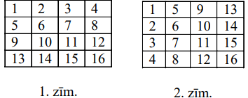

<small>

* questionType:
* domain:

</small>

## Atrisinājums

Piemēram, tā: pieskaitām pirmajai rindiņai $12$, otrajai $9$, trešajai $6$, 
ceturtajai $3$ un pēc tam atņemam no pirmās kolonnas $12$, no otrās $9$, no 
trešās $6$ un no ceturtās $3$.

# <lo-sample/> LV.AMO.2008.5.3

Kvadrāts sastāv no $5 \times 5$ vienādām kvadrātiskām rūtiņām. Parādiet, ka 
visas rūtiņas var pārsvītrot ar četrām taisnēm, kuras neiet caur rūtiņu 
stūriem.

<small>

* questionType:
* domain:

</small>

## Atrisinājums

Skat., piem., 2.zīm.

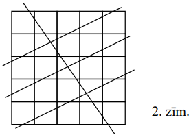

# <lo-sample/> LV.AMO.2008.5.4

Vai eksistē tāds naturāls skaitlis $n$, ka $n$ ciparu summa ir $9$, bet 
reizinājuma $n \times n$ ciparu summa ir $81$?

Vai eksistē tāds naturāls skaitlis $k$, ka $k$ ciparu summa ir $6$, bet 
reizinājuma $k \times k$ ciparu summa ir $24$?

<small>

* questionType:
* domain:

</small>

## Atrisinājums

**(A)** jā, piemēram, $n=111111111$

**(B)** nē. Šāds $k$ dalītos ar $3$ (jo $6$ dalās ar $3$); tātad $k \times k$ 
dalītos ar $9$; tātad $k \times k$ ciparu summai jādalās ar $9$. Bet $24$ ar 
$9$ nedalās.

# <lo-sample/> LV.AMO.2008.5.5

Šaha turnīrā piedalās $7$ dalībnieki. Katrs ar katru citu spēlē tieši vienu 
reizi. Par uzvaru spēlētājs saņem $1$ punktu, par neizšķirtu $\frac{1}{2}$ 
punkta, par zaudējumu $0$ punktus. Spēles tiek organizētas šādi: katru dienu 
kaut kādi $6$ spēlētāji sadalās $3$ pāros, un katrs pāris spēlē savā starpā.

**Pierādiet:** gan pēc pirmās, gan pēc otrās, gan pēc trešās dienas var atrast 
divus spēlētājus ar vienādiem iegūto punktu daudzumiem.

<small>

* questionType:
* domain:

</small>

## Atrisinājums

Pēc $1.$, $2.$ un $3.$ dienas spēlētājs var būt ieguvis attiecīgi 
$0;\ \frac{1}{2};\ 1$ punktus ($3$ iespējas), 
$0;\ \frac{1}{2};\ 1;\ 1 \frac{1}{2};\ 2$ punktus ($5$ iespējas), 
$0;\ \frac{1}{2};\ 1;\ 1 \frac{1}{2};\ 2;\ 2 \frac{1}{2};\ 3$ punktus ($7$ 
iespējas). Tā kā $7>3$ un $7>5$, vienai un divām dienām uzdevuma apgalvojumi 
izpildās. Triju dienu gadījumā visi iegūtie punktu daudzumi var būt dažādi 
tikai tad, ja realizējas visas minētās $7$ iespējas. Bet tā nevar būt, jo tad 
kopējais iegūto punktu skaits nav vesels skaitlis.

# <lo-sample/> LV.AMO.2008.6.1

Uz tāfeles uzrakstīti vairāki skaitļi. Katrs no tiem vienāds ar vienu desmito 
daļu no pārējo skaitļu summas. Cik skaitļu uzrakstīts? Atrisināt šo uzdevumu 
divos gadījumos:

**(A)** ir zināms, ka visi uzrakstītie skaitļi ir pozitīvi,

**(B)** par skaitļiem nav zināms, vai tie ir pozitīvi, negatīvi vai nulle

<small>

* questionType:
* domain:

</small>

## Atrisinājums

**Atbilde:** **(A)** $11$, **(B)** var būt jebkurš skaits, kas lielāks par $1$.

**Risinājums.** **(A)** No dotā seko: katrs skaitlis vienāds ar vienpadsmito 
daļu no visu skaitļu summas. Tātad tie visi ir vienādi; tātad to ir $11$

**(B)** skaitļu sistēmas $(0; 0),\ (0; 0; 0),\ (0; 0; 0; 0)$ utt. apmierina 
uzdevuma prasības.

# <lo-sample/> LV.AMO.2008.6.2

Taisnstūris sastāv no $7 \times 13$ vienādām kvadrātiskām rūtiņām. Vai to var 
sagriezt daļās tā, lai $15$ daļas būtu taisnstūri ar izmēriem $2 \times 3$ 
rūtiņas? Griezumiem jāiet pa rūtiņu līnijām.

<small>

* questionType:
* domain:

</small>

## Atrisinājums

Jā, var. Skat., piem., 3.zīm.

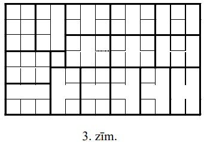

# <lo-sample/> LV.AMO.2008.6.3

Andris nosauc Maijai trīs dažādus ciparus. Pierādiet: Maija, neizmantojot citus
ciparus kā Andra nosauktos, var uzrakstīt veselu skaitli (viencipara, divciparu
vai trīsciparu), kurā nav vienādu ciparu un kas dalās ar $3$.

<small>

* questionType:
* domain:

</small>

## Atrisinājums

Ja kāds no cipariem ir $0;\ 3;\ 6$ vai $9$, Maija raksta atbilstošo viencipara 
skaitli. Ja Andra nosauktie skaitļi ir $1;\ 4;\ 7$ vai $2;\ 5;\ 8$, Maija 
raksta trīsciparu skaitli. Ja ir kāds cipars no kopas $\{1; 4; 7\}$ un kāds - 
no kopas $\{2; 5; 8\}$, Maija raksta atbilstošo divciparu skaitli.

# <lo-sample/> LV.AMO.2008.6.4

Visi dažādie viencipara skaitļi, kas nav $0$, sadalīti trīs grupās pa trim 
skaitļiem katrā un katrai grupai aprēķināts tajā ietilpstošo skaitļu 
reizinājums. Apzīmēsim lielāko (vai vienu no lielākajiem, ja tādu ir vairāki) 
no šiem reizinājumiem ar $A$. Kāda ir mazākā iespējamā $A$ vērtība?

<small>

* questionType:
* domain:

</small>

## Atrisinājums

**Atbilde:** $72$.

**Piemērs:** 
$1 \cdot 8 \cdot 9=72,\ 3 \cdot 4 \cdot 6=72,\ 2 \cdot 5 \cdot 7=70$.

**Minimalitātes pierādījums.** Pieņemsim, ka $A<72$. Skaidrs, ka $A \neq 71$, 
jo $71$ ir pirmskaitlis; tātad $A \leq 70$. Tad visu triju reizinājumu 
reizinājums nepārsniedz $70 \cdot 70 \cdot 70=343000$. Bet 
$1 \cdot 2 \cdot 3 \cdot 4 \cdot 5 \cdot 6 \cdot 7 \cdot 8 \cdot 9=362880>343000$ - 
pretruna.

# <lo-sample/> LV.AMO.2008.6.5

Katrīna iedomājusies divciparu naturālu skaitli, bet Profesors Cipariņš cenšas 
to uzminēt. Ar vienu jautājumu viņš nosauc Katrīnai kaut kādu **savu iedomātu**
divciparu skaitli, bet Katrīna pasaka, cik šķirās (nevienā, vienā vai divās) 
profesora nosauktais skaitlis sakrīt ar viņas iedomāto. Pierādiet, ka profesors
var noskaidrot Katrīnas iedomāto skaitli, uzdodot ne vairāk kā $10$ jautājumus.

**Piezīme.** Ja Jūs nevarat izdomāt stratēgiju ar $10$ jautājumiem, bet varat 
ar $11,\ 12$ utt., uzrakstiet labāko no savām atrastajām.

<small>

* questionType:
* domain:

</small>

## Atrisinājums

Vispirms Cipariņš nosauc Katrīnai skaitļus 
$12,\ 23,\ 34,\ 45,\ 56,\ 67,\ 78,\ 89,\ 91$. Ja Katrīna par kādu skaitli 
atzīst divas sakrišanas, tad tas ir viņas iedomātais. Ja Katrīna atzīst 
**vienu** sakrišanu skaitlī $\overline{ab}$, tad iedomātais skaitlis ir 
$\overline{a0}$. Ja Katrīna atzīst pa vienai sakrišanai divos skaitļos 
$\overline{ab}$ un $\overline{cd}$, tad iedomātais skaitlis ir vai nu 
$\overline{ad}$, vai $\overline{cb}$. Nosaucot vienu no tiem, profesors 
sasniedz savu mērķi.

# <lo-sample/> LV.AMO.2008.7.1

Kādu lielāko daudzumu dažādu ciparu var izrakstīt pa apli tā, lai katri divi 
blakus uzrakstīti cipari, lasot tos vienalga kādā virzienā, veidotu pirmskaitļa
pierakstu?

<small>

* questionType:
* domain:

</small>

## Atrisinājums

Acīmredzot, nedrīkst rakstīt ne pāra ciparus, ne $5$. Atliek cipari 
$1;\ 3;\ 7;\ 9$. Ja tos uzrakstītu visus, tad devītniekam vismaz vienā pusē 
būtu vai nu $3$, vai $1$; bet $93$ dalās ar $3$ un $91$ dalās ar $7$, tātad nav
pirmskaitļi. Tātad nedrīkst rakstīt arī $9$. Ciparus $1;\ 3;\ 7$ var izrakstīt 
jebkurā secībā.

# <lo-sample/> LV.AMO.2008.7.2

Dots, ka $x$ un $y$ - tādi naturāli skaitļi, ka $x \cdot y=10^{12}$. Vai var 
būt, ka ne $x$, ne $y$ nesatur savā pierakstā nevienu ciparu $0$?

<small>

* questionType:
* domain:

</small>

## Atrisinājums

**Atbilde:** nē.

**Pierādījums.** Ievērosim, ka $x \cdot y=2^{12} \cdot 5^{12}$. Ja vai nu $x$, 
vai $y$ dalās gan ar $2$, gan ar $5$, tad tas beidzas ar ciparu $0$. Atliek 
vienīgā iespēja, kad viens no skaitļiem $x$ un $y$ ir $2^{12}$, bet otrs ir 
$5^{12}$. Bet $2^{12}=4096$.

# <lo-sample/> LV.AMO.2008.7.3

Traukā sākumā atradās $1$ baktērija. Kādā brīdī tā sadalījās divās baktērijās. 
Katra no jaunajām baktērijām atkal kādā brīdī sadalījās divās baktērijās, utt. 
Vakar plkst. $12^{00}$ traukā bija tieši $2008$ baktērijas. Pierādiet: kādā 
brīdī traukā bija tāda baktērija, kuras pēcteču skaits starp minētajām $2008$ 
baktērijām - apzīmēsim šo skaitu ar $n$ -apmierina nosacījumus 
$670 \leq n \leq 1339$.

<small>

* questionType:
* domain:

</small>

## Atrisinājums

Pirmajai baktērijai ir $2008$ pēcteči; apzīmējam $x_{1}=2008$. Vienai no tās 
"meitām" pēcteču nav mazāk kā $\frac{1}{2} x_{1}=x_{2}$. Vienai no šīs 
baktērijas meitām pēcteču nav mazāk kā $\frac{1}{2} x_{2}=x_{3}$, utt. 
Pieņemsim, ka $n$ ir pirmais indekss, pie kura $x_{n} \leq 1399$. Ja būtu 
$x_{n}<670$, tad $x_{n} \leq 669$; tad $x_{n-1} \leq 2x_{n} \leq 1338$ - 
pretruna saskaņā ar $n$ izvēli. Tāpēc $x_{n} \geq 670$.

# <lo-sample/> LV.AMO.2008.7.4

Dots, ka $\sphericalangle ABD=\sphericalangle CBD=60^{\circ}, B, D$ un $E$ 
atrodas uz vienas taisnes, $BD=BA, DE=BC$ (skat. 3.zīm.). Pierādīt, ka 
trijstūrī $ACE$ visas malas vienādas savā starpā.

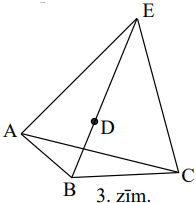

<small>

* questionType:
* domain:

</small>

## Atrisinājums

Saskaņā ar doto $\triangle ABD$ ir vienādsānu ar virsotnes leņķi $60^{\circ}$, 
tātad regulārs. Tāpēc 
$\sphericalangle ADE=180^{\circ}-60^{\circ}=120^{\circ}=\sphericalangle ABC$. 
Tāpēc $\triangle ABC=\triangle ADE\ (m \ell m)$. Tātad 
$\sphericalangle EAC=\sphericalangle EAD+\sphericalangle DAC=\sphericalangle CAB+\sphericalangle DAC=\sphericalangle DAB=60^{\circ}$.

No minētās trijstūru vienādības seko $AE=AC$. Tātad $\triangle EAC$ ir 
vienādsānu ar virsotnes leņķi $60^{\circ}$, tātad regulārs.

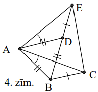

# <lo-sample/> LV.AMO.2008.7.5

Plaknē atzīmēti $17$ punkti. Pierādīt, ka $5$ no tiem var nokrāsot sarkanus tā,
lai nevienam trijstūrim ar trim sarkanām virsotnēm visas malas nebūtu vienādas.

<small>

* questionType:
* domain:

</small>

## Atrisinājums

Ņemam divus patvaļīgus dotos punktus $A$ un $B$ un nokrāsojam sarkanus; tos 
abus punktus (dotos vai nē), kas ar $A$ un $B$ veido regulāru trijstūri, 
nokrāsojam melnus. Ir vēl vismaz $13$ doti nenokrāsoti punkti. Vienu no 
tiem - $C$ - nokrāsojam sarkanu. Tos $\leq 4$ punktus, kas ar $A$ un $C$ vai 
$B$ un $C$ veido regulāru trijstūri, nokrāsojam melnus. Ir vēl vismaz $8$ doti 
nenokrāsoti punkti. Vienu no tiem - $D$ - nokrāsojam sarkanu; tos $\leq 6$ 
punktus, kas ar $D$ un $A,\ D$ un $B,\ D$ un $C$ veido regulāru trijstūri, 
nokrāsojam melnus. Ir vēl vismaz viens dots nenokrāsots punkts; krāsojam to 
sarkanu.

# <lo-sample/> LV.AMO.2008.8.1

Kvadrātvienādojuma $x^{2}+px+q=0$ saknes ir $x_{1}$ un $x_{2}$, bet 
kvadrātvienādojuma $x^{2}+ax+b=0$ saknes ir $x_{3}$ un $x_{4}$. Nav tādas $x$ 
vērtības, ar kuru abu vienādojumu kreisās puses būtu vienādas savā starpā. 
Pierādīt, ka $x_{1}+x_{2}=x_{3}+x_{4}$.

<small>

* questionType:
* domain:

</small>

## Atrisinājums

No dotā seko, ka vienādojumam $x^{2}+px+q=x^{2}+ax+b$ jeb $(p-a)x=b-q$ nav 
atrisinājuma. Tātad $p=a$ (un $b \neq q$, bet mums tas nav svarīgi). No $p=a$ 
un Vjeta teorēmas seko vajadzīgais.

# <lo-sample/> LV.AMO.2008.8.2

Dots, ka $\frac{a}{b}=\frac{b}{c}=\frac{c}{a}$. Pierādīt, ka $a=b=c$.

<small>

* questionType:
* domain:

</small>

## Atrisinājums

No dotā seko, ka ne $a$, ne $b$, ne $c$ nav $0$. Izmantojot proporcijas 
pamatīpašību, iegūstam, $a^{2}=bc,\ b^{2}=ac,\ c^{2}=ab$. Dalot pirmo vienādību
ar otro, iegūstam 
$\frac{a^{2}}{b^{2}}=\frac{b}{a} \Rightarrow a^{3}=b^{3} \Rightarrow a=b$. 
Līdzīgi pierāda $b=c$.

# <lo-sample/> LV.AMO.2008.8.3

Dots, ka $n>1$ - naturāls skaitlis, kas nav pirmskaitlis. Pierādīt, ka var 
atrast vismaz trīs dažādus naturālus skaitļus $a_{1}, a_{2}, \ldots, a_{k}$, 
kas apmierina sakarību 
$a_{1}+a_{2}+\ldots+a_{k}=n \cdot\left(\frac{1}{a_{1}}+\frac{1}{a_{2}}+\ldots+\frac{1}{a_{k}}\right)$.

<small>

* questionType:
* domain:

</small>

## Atrisinājums

Saskaņā ar doto skaitlim $n$ ir vismaz $3$ naturāli dalītāji. Apzīmēsim visus 
$n$ naturālos dalītājus augošā secībā ar $a_{1}<a_{2}<\ldots<a_{k}$. Tad 
$\frac{n}{a_{1}}, \frac{n}{a_{2}}, \ldots, \frac{n}{a_{k}}$ ir visi $n$ 
naturāli dalītāji dilstošā secībā. No šejienes seko vajadzīgais, jo summa 
nemainās, mainot saskaitāmo kārtību.

# <lo-sample/> LV.AMO.2008.8.4

Piecstūra zvaigznē $ABCDE$ (skat. 4.zīm.) pastāv sakarības 
$\sphericalangle A=\sphericalangle B,\ \sphericalangle E=\sphericalangle C,\ AC=BE$.
Pierādīt, ka $AD=BD$.

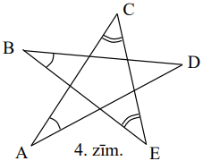

<small>

* questionType:
* domain:

</small>

## Atrisinājums

No dotā $\triangle ACG=\triangle BEF$ $(\ell m \ell)$. Tāpēc 
$\sphericalangle AGC=\sphericalangle BFE$ un $\mathbf{AG}=\mathbf{BF}$. No šīs 
leņķu vienādības seko $\sphericalangle FGD=\sphericalangle GFD$. Tāpēc 
$\triangle FDG$ ir vienādsānu un $\mathbf{DG}=\mathbf{DF}$. Saskaitot abas 
izceltās vienādības, iegūstam vajadzīgo.

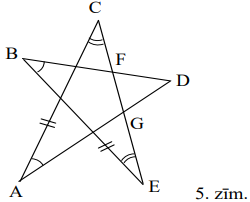

# <lo-sample/> LV.AMO.2008.8.5

Šaha turnīrā piedalās $8$ spēlētāji; katrs ar katru citu spēlē tieši $1$ reizi.
Par uzvaru spēlētājs saņem $1$ punktu, par neizšķirtu $\frac{1}{2}$ punkta, par
zaudējumu $0$ punktus. Turnīru beidzot, izrādījās, ka nekādiem diviem 
spēlētājiem nav vienāds punktu daudzums. Kāds ir mazākais iespējamais 
uzvarētāja iegūtais punktu daudzums? (Par uzvarētāju uzskata to spēlētāju, kam 
turnīra noslēgumā ir visvairāk punktu.)

<small>

* questionType:
* domain:

</small>

## Atrisinājums

Ja uzvarētājs ieguvis $n$ punktus, tad kopējais iegūto punktu daudzums nav 
lielāks par 
$n+\left(n-\frac{1}{2}\right)+(n-1)+\left(n-1 \frac{1}{2}\right)+(n-2)+\left(n-2 \frac{1}{2}\right)+(n-3)+\left(n-3 \frac{1}{2}\right)=8n-14$.
Pavisam izspēlēja $28$ spēles, tāpēc $28 \leq 8n-14$ un $8n \geq 42$, no 
kurienes $n \geq 5 \frac{1}{4}$; tātad $n \geq 5 \frac{1}{2}$. Piemēru, kur 
$n=5 \frac{1}{2}$, skat. 6.zīm.

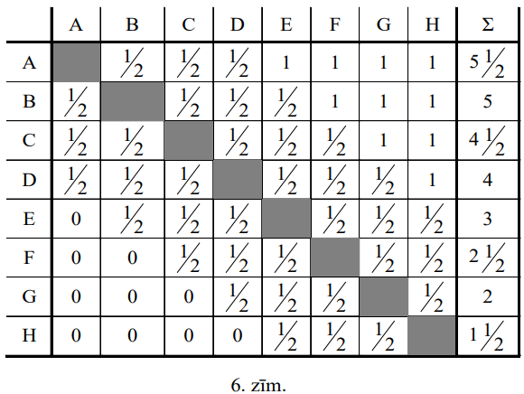

# <lo-sample/> LV.AMO.2008.9.1

Kvadrātveida tabula sastāv no $12 \times 12$ rūtiņām. Katrā rūtiņā ierakstīts 
nenulles cipars. No katras rindiņas un katras kolonnas cipariem, ņemot tos 
patvaļīgā secībā, izveidots viens divpadsmitciparu naturāls skaitlis. Vai var 
gadīties, ka tieši $23$ no šiem skaitļiem (ne vairāk un ne mazāk) dalās ar $3$?

<small>

* questionType:
* domain:

</small>

## Atrisinājums

**Atbilde:** nē.

**Risinājums.** Pieņemsim, ka tā noticis, un vienīgais skaitlis, kas nedalās ar
$3$, izveidots no kādas kolonnas cipariem (otrs gadījums analoģisks). Tad katrā
rindiņā ciparu summa dalās ar $3$. Tāpēc arī visu ierakstīto ciparu summa dalās
ar $3$. Savukārt vienpadsmit kolonnās ciparu summas dalās ar $3$, bet vienā - 
nē; tāpēc arī visu ciparu summa nedalās ar $3$. Iegūta pretruna.

# <lo-sample/> LV.AMO.2008.9.2

Pieņemsim, ka 5.zīm. attēlotās līknes ir kvadrātfunkciju grafiki.

Vai tie var būt funkciju $y=ax^{2}+bx+c$, $y=bx^{2}+cx+a$ un $y=cx^{2}+ax+b$ 
grafiki?

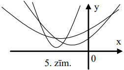

<small>

* questionType:
* domain:

</small>

## Atrisinājums

Nē. Visu minēto funkciju vērtības pie $x=1$ sakrīt, bet dotie $3$ grafiki neiet
caur vienu punktu (visi $6$ iespējamie krustpunkti zīmējumā redzami, tātad citu
nav).

# <lo-sample/> LV.AMO.2008.9.3

Šaurleņku trijstūrī $ABC$ dots, ka $\sphericalangle ABC=30^{\circ},\ AX$ un 
$CY$ ir augstumi, $M$ un $N$ - attiecīgi malu $AB$ un $BC$ viduspunkti. 
Pierādīt, ka $MX \perp NY$.

<small>

* questionType:
* domain:

</small>

## Atrisinājums

No dotā (mediāna pret hipotenūzu vienāda ar pusi no hipotenūzas) seko, ka 
$\Delta AXM$ un $\triangle CYN$ ir regulāri. 

Tāpēc $\sphericalangle BMX=\sphericalangle BNY=120^{\circ}$.

Tāpēc 
$\sphericalangle MON=360^{\circ}-120^{\circ}-120^{\circ}-30^{\circ}=90^{\circ}$,
k. b. j.

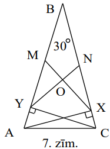

# <lo-sample/> LV.AMO.2008.9.4

Naturālie skaitļi no $1$ līdz $2008$ ieskaitot jāsadala grupās tā, lai 
izpildītos sakarība: ja $a$ dalās ar $b$ un $b$ dalās ar $c$ ($a,\ b,\ c$ - 
dažādi naturāli skaitļi), tad $a,\ b$ un $c$ visi nepieder vienai un tai pašai 
grupai. Kāds ir mazākais iespējamais grupu skaits?

<small>

* questionType:
* domain:

</small>

## Atrisinājums

**Atbilde:** $6$ grupas.

**Minimalitātes pierādījums.** Apskatīsim $11$ skaitļus 
$1; 2; 4; 8; \ldots; 1024=2^{10}$. Ja grupu skaits nepārsniedz $5$, tad ir 
grupa, kas satur $3$ no šiem skaitļiem (jo $11>5 \cdot 2$) $a<b<c$. Bet $c$ 
dalās ar $b$ un $b$ dalās ar $a$, kā nedrīkst būt.

**Piemērs.** Nosauksim par naturāla skaitļa $n$ augstumu $h(n)$ to kāpinātāju 
summu, ar kuriem $n$ satur dažādus pirmreizinātājus (piemēram, 
$h(8)=h\left(2^{3}\right)=3;\ h(10)=h\left(2^{1} \cdot 5^{1}\right)=2$; 
$h(1)=0$). Acīmredzot, ja $x$ dalās ar $y$ un $x>y$, tad $h(x)-h(y) \geq 1$. 
Mūsu apskatāmajiem skaitļiem $n, 1 \leq n \leq 2008, h(n)<11$ (jo tie visi 
mazāki par $2^{11}=2048$). Iekļaujam $1.$ grupā skaitļus ar $h=0$ un $h=1$; 
otrajā - ar $h=2$ un $h=3; \ldots$; sestajā - ar $h=10$. Ja $a \vdots b$ un 
$b \vdots c$, tad $h(a)-h(c) \geq 2$, tātad $a$ un $c$ nav vienā grupā.

# <lo-sample/> LV.AMO.2008.9.5

Kvadrāts sadalīts rūtiņās ar malu garumu $1$. Pa dalījuma līnijām (kvadrāta 
iekšpusē un uz tā ārējās robežas) uzzīmētas vairākas slēgtas līnijas; katra no 
tām ierobežo kaut kādu taisnstūri. Vai var gadīties, ka katras rūtiņas katra 
mala pieder

**(A)** pāra skaitam līniju,

**(B)** nepāra skaitam līniju?

<small>

* questionType:
* domain:

</small>

## Atrisinājums

**(A)** jā. Novelkam katras rūtiņas kontūru un visa kvadrāta kontūru.
**(B)** nē. Pieņemsim, ka $X,\ Y,\ Z,\ T$ - rūtiņu virsotnes, pie tam 
$X,\ Y,\ Z$ atrodas uz kvadrāta malas (skat. 8.zīm.) Katrs kontūrs vai nu satur
tieši divas no malām $YX,\ YZ,\ YT$, vai nesatur nevienu no tām. Apzīmēsim 
kontūru skaitus, kas satur atbilstošās malas, attiecīgi ar 
$n(XY),\ n(YZ),\ n(YT)$. Ja tie visi būtu nepāra skaitļi, tad 
$\tilde{N}=n(XY)+n(TZ)+n(YT)$ būtu nepāra skaitlis. Bet $\tilde{N}$ ir pāra 
skaitlis, jo katrs kontūrs "dod pienesumu" vai nu diviem saskaitāmajiem, vai 
nevienam. Tā ir pretruna.

# <lo-sample/> LV.AMO.2008.10.1

Desmitciparu naturāls skaitlis dalās ar $9\ 999\ 999$. Vai tas var dalīties arī
ar $10\ 000\ 001$?

<small>

* questionType:
* domain:

</small>

## Atrisinājums

Pieņemsim, ka $n$ dalās gan ar $9\ 999\ 999$, gan ar $10\ 000\ 001$. Tā kā 
$LKD(9\ 999\ 999,\ 10\ 000\ 001)=1$, tad $n$ dalās arī ar 
$9\ 999\ 999 \cdot 10\ 000\ 001=10^{14}-1$. Bet tā nevar būt, jo desmitciparu 
skaitlis ir mazāks par $10^{14}-1$.

# <lo-sample/> LV.AMO.2008.10.2

Pieņemsim, ka 6.zīm. attēlotās līknes ir kvadrātfunkciju grafiki.
Vai tie var būt funkciju

$y=ax^{2}+2bx+c$, $y=bx^{2}+2cx+a$ un $y=cx^{2}+2ax+b$ grafiki?

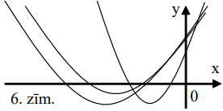

<small>

* questionType:
* domain:

</small>

## Atrisinājums

Nē, nevar. Tā kā parabolām zari vērsti uz augšu, tad būtu $a>0,\ b>0,\ c>0$. Tā
kā katra parabola krusto abscisu asi divos punktos, tad visu trinomu 
diskriminanti būtu pozitīvi, t. i., $b^{2}>ac,\ c^{2}>ab,\ a^{2}>cb$. 
Sareizinot šīs nevienādības, mēs iegūtu $a^{2}b^{2}c^{2}>a^{2}b^{2}c^{2}$ - 
pretruna.

# <lo-sample/> LV.AMO.2008.10.3

Riņķa līnijas $\omega_{1}$ un $\omega_{2}$ ārēji pieskaras viena otrai punktā 
$M$. Taisne $t_{1}$ pieskaras $\omega_{1}$ un $\omega_{2}$ attiecīgi punktos 
$A$ un $B$. Taisne $t_{2}$, kas ir paralēla $t_{1}$, pieskaras $\omega_{2}$ 
punktā $C$ un krusto $\omega_{1}$ divos punktos. Pierādīt, ka $A, M$ un $C$ 
atrodas uz vienas taisnes.

<small>

* questionType:
* domain:

</small>

## Atrisinājums

Acīmredzot $BC$ ir $\omega_{2}$ diametrs un tāpēc 
$\sphericalangle BMC=90^{\circ}$. Novelkam $\omega_{1}$ un $\omega_{2}$ kopīgo 
pieskari punktā $M$. Tad $SA=SM=SB$.

Tāpēc 
$\sphericalangle AMS=\frac{1}{2}\left(180^{\circ}-\sphericalangle ASM\right)$, 
$\sphericalangle SMB=\frac{1}{2}\left(180^{\circ}-\sphericalangle MSB\right)$ un
$\sphericalangle AMB=\sphericalangle AMS+\sphericalangle SMB=180^{\circ}-\frac{1}{2}(\sphericalangle ASM+\sphericalangle MSB)=180^{\circ}-90^{\circ}=90^{\circ}$.
Tāpēc $\sphericalangle AMB+\sphericalangle BMC=180^{\circ}$, no kā seko 
vajadzīgais.

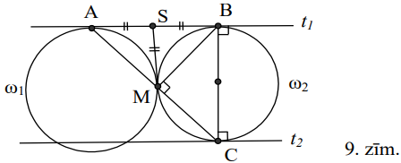

# <lo-sample/> LV.AMO.2008.10.4

Uz $50$ kartiņām uzrakstīti naturāli skaitļi no $1$ līdz $50$ ieskaitot (katrs 
skaitlis uz citas kartiņas). Rindā viena aiz otras atrodas $2008$ rūtiņas. 
Kartiņas kaut kā uzliktas uz $50$ rūtiņām (uz katras rūtiņas - ne vairāk kā 
viena kartiņa). Ja kādam $n,\ 1 \leq n<50$, kartiņai $\fbox{n}$ tieši pa labi 
esošā rūtiņa ir brīva, tad kartiņu $\fbox{n+1}$ atļauts pārcelt uz šo brīvo 
rūtiņu; to sauc par vienu gājienu. Pierādīt, ka nevar izdarīt vairāk par $1250$
gājieniem.

<small>

* questionType:
* domain:

</small>

## Atrisinājums

Saskaņā ar uzdevuma nosacījumiem $1$ vispār nekustas, tāpēc $2$ var kustēties 
tikai vienreiz. Tāpēc $3$ var kustēties tikai divreiz (pirms $2$ kustības un 
pēc tās), $4$ - tikai trīsreiz utt. Tāpēc gājienu kopskaits nevar pārsniegt 
$1+2+\ldots+49=\frac{1}{2} 49 \cdot 50<25 \cdot 50=1250$, k. b. j.

# <lo-sample/> LV.AMO.2008.10.5

Kvadrāts sastāv no $20 \times 20$ vienādām kvadrātiskām rūtiņām. Katra rūtiņa 
nokrāsota balta, melna, sarkana vai zaļa tā, ka nekādām divām vienādi 
nokrāsotām rūtiņām nav kopīgu robežas punktu.

**(A)** cik ir sarkanu rūtiņu?

**(B)** pierādiet: stūra rūtiņas nokrāsotas dažādās krāsās.

<small>

* questionType:
* domain:

</small>

## Atrisinājums

**(A)** sadalām kvadrātu $100$ daļās ar izmēriem $2 \times 2$ rūtiņas. Katrā 
daļā sastopamas visas četras krāsas. Tāpēc sarkano rūtiņu ir $100$. 
(Nepieciešams parādīt piemēru; tas ir triviāli.)

**(B)** baltās, melnās, sarkanās un zaļās rūtiņās ierakstām attiecīgi 
$1;\ 10;\ 100;\ 1000$. Katrā 2x2 rūtiņu kvadrātā skaitļu summa ir $1111$. Ar 
$\Sigma_{1}$ apzīmējam visu kvadrāta skaitļu summu, ar $\Sigma_{2}$ - visu 
iekšējā $18 \times 18$ rūtiņu kvadrāta skaitļu summu. Tad 
$\Sigma_{1}+\Sigma_{2}=(100+81) \cdot 1111$. No otras puses, 
$\Sigma_{1}+\Sigma_{2}$ iegūstama, četru stūra rūtiņu skaitļu summai pieskaitot
divos taisnstūros $18 \times 20$ ierakstīto skaitļu summas. Tāpēc stūra rūtiņās
ierakstīto skaitļu summa ir 
$(100+81) \cdot 1111-2 \cdot 9 \cdot 10 \cdot 1111=1111$. Summa $1111$ no mūsu 
saskaitāmajiem iegūstama **tikai** kā $1+10+100+1000$, no kā arī seko 
vajadzīgais.

# <lo-sample/> LV.AMO.2008.11.1

Pierādīt, ka

$\frac{1}{1^{4}+1^{2}+1}+\frac{2}{2^{4}+2^{2}+1}+\frac{3}{3^{4}+3^{2}+1}+\ldots+\frac{2008}{2008^{4}+2008^{2}+1}<\frac{1}{2}$.

<small>

* questionType:
* domain:

</small>

## Atrisinājums

Ievērosim, ka katram $n>0$ pastāv vienādība

$$\begin{aligned}
& \frac{n}{n^{4}+n^{2}+1}=\frac{n}{n^{4}+2n^{2}+1-n^{2}}=\frac{n}{\left(n^{2}+1\right)^{2}-n^{2}}=\frac{n}{\left(n^{2}-n+1\right)\left(n^{2}+n+1\right)}= \\
& =\frac{1}{2}\left[\frac{1}{n^{2}-n+1}-\frac{1}{n^{2}+n+1}\right]=\frac{1}{2}\left[\frac{1}{n^{2}-n+1}-\frac{1}{(n+1)^{2}-(n+1)+1}\right]
\end{aligned}$$

Saskaitot šīs vienādības pie $n=1;\ 2;\ 3;\ \ldots;\ 2008$, iegūstam, ka 
novērtējamās summas vērtība ir 
$\frac{1}{2}\left[\frac{1}{1^{2}-1+1}-\frac{1}{2009^{2}-2009+1}\right]<\frac{1}{2} \cdot \frac{1}{1^{2}-1+1}=\frac{1}{2}$,
k.b.j.

# <lo-sample/> LV.AMO.2008.11.2

Funkcija $f(n)$ definēta visiem veseliem $n$ un pieņem veselas vērtības. Visiem
veseliem $x$ un $y$ pastāv vienādība

$$f(f(x)+y)=x+f(y+2008)$$

Atrast visas tādas funkcijas $f$ un pierādīt, ka citu bez Jūsu atrastajām nav.

<small>

* questionType:
* domain:

</small>

## Atrisinājums

**Atbilde:** $f_{1}(x)=x+2008$ un $f_{2}(x)=-x+2008$

To, ka šīs funkcijas der, pārbauda tieši. Pierādīsim, ka citu nav.

Liekot $y=0$ un $y=1$, mēs iegūstam

$(*)\ \ \quad f(f(x))=x+f(2008)$

$\ \ \ \ \ \ \quad f(f(x)+1)=x+f(2009)$, no kurienes seko

$(**)\ \quad f(f(x)+1)-f(f(x))=f(2009)-f(2008)$

No (*) seko, ka $f$ vērtību apgabals ir visa kopa $Z$. Tāpēc no (**) seko, ka 
**katram** $x \in Z$ 

$(***) \quad f(z+1)-f(z)=f(2009)-f(2008)=const.$

No (***) standartceļā seko, ka $f$ ir "uz abiem galiem bezgalīga" aritmētiska 
progresija: $f(x)=ax+b,\ a$ un $b$ - konstantes. No dotās vienādības iegūstam, 
ka pastāv **identitāte** attiecībā uz $x$ un $y$:

$a(ax+b+y)+b \equiv x+a(y+2008)+b$

$\left(a^{2}-1\right) x+ab \equiv 2008a$

Tāpēc $a^{2}-1=0$ un $ab=2008a$. No šejienes iegūstam abas augšminētās 
iespējas.

# <lo-sample/> LV.AMO.2008.11.3

Dots, ka $n$ - naturāls skaitlis. Noskaidrojiet:

**(A)** vai var gadīties, ka skaitlim $n^{2}-1$ ir tieši $10$ dažādi naturāli 
dalītāji?

**(B)** vai var gadīties, ka skaitlim $n^{2}-4$ ir tieši $10$ dažādi naturāli 
dalītāji, ja $n$ - pāra skaitlis?

<small>

* questionType:
* domain:

</small>

## Atrisinājums

**(A)** jā, var; piemēram, $n=7$, jo skaitļa $7^{2}-1=48$ naturālie dalītāji ir
$1;\ 2;\ 3;\ 4;\ 6;\ 8;\ 12;\ 16;\ 24;\ 48$.

Tālāk vispirms atcerēsimies, ka skaitlim 
$p_{1}^{\alpha_{1}} p_{2}^{\alpha_{2}} \ldots p_{k}^{\alpha_{k}}$ ir 
$\left(\alpha_{1}+1\right)\left(\alpha_{2}+1\right) \ldots\left(\alpha_{k}+1\right)$
dažādi naturāli dalītāji, ja $p_{1}, \ldots, p_{k}$ - dažādi pirmskaitļi, 
$\alpha_{1}, \ldots, \alpha_{k}$ - naturāli kāpinātāji. Skaidrs, ka 
$\left(\alpha_{1}+1\right) \ldots\left(\alpha_{k}+1\right)=10$ iespējams tikai 
skaitļiem $p_{1}^{9}$ un $p_{1} \cdot p_{2}^{4}$. Skaidrs arī, ka mūsu 
$n \neq 1$. 

**(B)** nē, nevar. Ja $n=2m$, tad $n^{2}-4=4(m-1)(m+1)$. Ja $n^{2}-4=p^{9}$, 
$p^{9}$ ir pāra skaitlis, tātad $p=2$ un $n^{2}=2^{9}+4=516$; tad 
$n=\sqrt{516} \notin N$.

Ja $n^{2}-4=p_{1} \cdot p_{2}^{4}$, tad $4(m-1)(m+1)=p_{1}p_{2}^{4}$ dalās ar 
$4$; tāpēc $p_{2}=2$ un $(m-1)(m+1)=4p_{1}$. Tāpēc $m$ - nepāra skaitlis; tad 
$(m-1)$ un $(m+1)$ ir viens otram sekojoši pāra skaitļi, $(m-1)(m+1)$ dalās ar 
$8$ un $p_{1}$ dalās ar $2$ - pretruna.

# <lo-sample/> LV.AMO.2008.11.4

Trijstūra $ABC$ leņķa $A$ bisektrise krusto malu $BC$ punktā $D$ un apvilkto 
riņķa līniju punktā $M$. Caur $D$ novilkta taisne, kas neiet caur $A$; tā 
krusto riņķa līniju ar centru $M$ un rādiusu $MB$ punktos $X$ un $Y$. Pierādīt,
ka stars $AD$ ir $\sphericalangle XAY$ bisektrise.

<small>

* questionType:
* domain:

</small>

## Atrisinājums

Tā kā $BXCY$ ievilkts riņķa līnijā, tad $BD \cdot DC=XD \cdot DY \cdot$ Tā kā 
$ABMC$ ievilkts riņķa līnijā, tad $BD \cdot DC=AD \cdot DM \cdot$ Tāpēc 
$XD \cdot DY=AD \cdot DM$, tātad $AXMY$ ir ievilkts riņķa līnijā 
$\tilde{\omega}$, kas nav parādīta zīmējumā. Bet $MX$ un $MY$ ir 
$\tilde{\omega}$ vienādas hordas, kas tātad savelk vienādus lokus, un uz šiem 
vienādajiem lokiem balstās vienādi ievilkti leņķi, k. b. j.

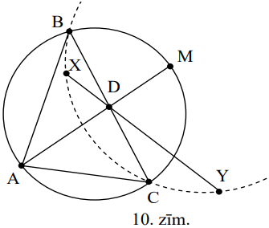

# <lo-sample/> LV.AMO.2008.11.5

Doti sviras svari un $9$ pēc ārējā izskata vienādas monētas; zināms, ka to 
masas ir 
$1 \mathrm{~g}, 3 \mathrm{~g}, 3^{2} \mathrm{~g}, 3^{3} \mathrm{~g}, \ldots, 3^{8} \mathrm{~g}$.

Ar kādu mazāko svēršanu skaitu var noskaidrot katras monētas masu? Uz katra no 
kausiem var vienlaicīgi likt arī vairākas monētas. Svari parāda uz kausiem 
uzlikto masu starpību.

<small>

* questionType:
* domain:

</small>

## Atrisinājums

**Atbilde:** ar $2$ svēršanām.

**Minimalitātes pierādījums.** Pieņemsim, ka izdarīta tikai viena svēršana. 
Vismaz vienā no grupām "kreisais kauss", "labais kauss", "nesvērtās monētas" 
var atrast $2$ monētas. Balstoties uz vienīgās svēršanas rezultātu, tās nav 
atšķiramas viena no otras.

**Stratēģija.** Pierādīsim vispirms, ka katras svēršanas rezultāts ļauj 
noskaidrot, kuras monētas atrodas uz viena kausa un kuras - uz otra. Pieņemsim,
ka tā nav, un ka 
$\left(3^{a_{1}}+3^{a_{2}}+\ldots+3^{a_{n}}\right)-\left(3^{b_{1}}+3^{b_{2}}+\ldots+3^{b_{m}}\right)=\left(3^{c_{1}}+3^{c_{2}}+\ldots+3^{c_{k}}\right)-\left(3^{d_{1}}+3^{d_{2}}+\ldots+3^{d_{2}}\right)$
jeb $3^{a_{1}}+3^{a_{2}}+\ldots+3^{a_{n}}+3^{d_{1}}+3^{d_{2}}+\ldots+3^{d_{2}}=3^{c_{1}}+3^{c_{2}}+\ldots+3^{c_{k}}+3^{b_{1}}+3^{b_{2}}+\ldots+3^{b_{m}}$, 
$a_{i} \neq b_{j}$, $d_{r} \neq C_{s}$.

Varam uzskatīt, ka vienādie saskaitāmie jau saīsināti; visi saskaitāmie nav 
saīsināti, citādi abās svēršanās monētas uz kausiem būtu novietotas vienādi.

Maksimālā trijnieka pakāpe, ar kuru dalās kreisā puse, kreisajā pusē sastopama 
ne vairāk kā $2$ reizes. Tas pats attiecas uz labo pusi. Tāpēc šai maksimālajai
pakāpei jābūt sastopamai gan kreisajā pusē, gan labajā pusē, un tā ir pretruna 
pieņēmumam par jau izdarīto saīsināšanu.

Tagad izvietojam monētas kvadrātiskas tabulas veidā:

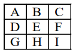

un organizējam šādas divas svēršanas

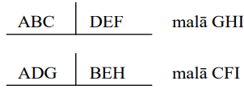

Tā kā katram " $1.$ svēršanas trijniekam" ir tieši viena kopīga monēta ar katru
" $2.$ svēršanas trijnieku" un katras svēršanas rezultātā mēs noskaidrojam, 
kādas tieši masas ir katrā atbilstošajā trijniekā, tad rezultāti ļauj uzzināt 
visu monētu masas.

# <lo-sample/> LV.AMO.2008.12.1

Pierādīt, ka $\sphericalangle AMB=\sphericalangle ANB=\sphericalangle AKB$, kur
$A,\ B,\ M,\ N,\ K$ - punkti, kas atrodas kvadrātiska režģa virsotnēs (skat. 
7.zīm.)

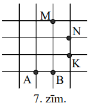

<small>

* questionType:
* domain:

</small>

## Atrisinājums

Viegli pārliecināties, ka punkti $A,\ B,\ K,\ N,\ M$ atrodas vienādos attālumos
no iekrāsotās rūtiņas centra, tātad atrodas uz vienas riņķa līnijas. Tātad 
apskatāmie leņķi ir ievilkti leņķi, kas balstās uz vienu un to pašu loku.

Iespējami ļoti daudzi citi risinājumi.

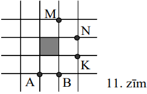

# <lo-sample/> LV.AMO.2008.12.2

Kādiem naturāliem $n$ skaitļu kopu $\{1; 2; 3; \ldots; n\}$ var sadalīt divās 
daļās tā, lai vienlaicīgi izpildītos šādi nosacījumi:

**(A)** katrs skaitlis nonāktu tieši vienā daļā,

**(B)** abās daļās būtu vienāds daudzums skaitļu,

**(C)** katras daļas visu skaitļu vidējais aritmētiskais arī piederētu šai 
daļai?

<small>

* questionType:
* domain:

</small>

## Atrisinājums

Skaidrs, ka $n$ jābūt pāra skaitlim. Pie $n=2$ der $A=\{1\}, B=\{2\}$. Pie 
$n=4$ prasītais sadalījums neeksistē (viegla visu gadījumu pārbaude). Pie 
$n=2k,\ k$ - nepāra skaitlis, der sadalījums 
$A=\{1; 2; \ldots; k\}, B=\{k+1; \ldots; 2k\}$. Tiešām, vidējie aritmētiskie ir
$\frac{k+1}{2}$ un $k+\frac{k+1}{2}$, tātad naturāli skaitļi; viegli 
pārliecināties, ka $1 \leq \frac{k+1}{2} \leq k$, no kurienes seko, ka tie 
pieder vajadzīgajām kopām. Ja $n=8$, der sadalījums 
$A=\{2; 3; 4; 7\}, B=\{1; 5; 6; 8\}$. Ja $n=2k,\ k$ - pāra skaitlis, 
$k \geq 6$, der sadalījums 
$A=\left\{1; 2; 3; \ldots; k-2; k; \frac{3k-2}{2}\right\},\ B$ - pārējie 
skaitļi no $\{1; 2; \ldots; 2k-1; 2k\}$.

Parādīsim, ka kopa $A$ apmierina uzdevuma prasības

1) pie $k \geq 6$ pastāv nevienādība $k<\frac{3 k-2}{2} \Leftrightarrow k>2$, 
   tātad $A$ satur $k$ skaitļus,

2) $A$ elementu summa ir 
   $\frac{(k-2)(k-1)}{2}+k+\frac{3k-2}{2}=\frac{k^{2}-3k+2+2k+3k-2}{2}=\frac{k^{2}+2k}{2}$,
   tāpēc to vidējais aritmētiskais ir $\frac{\mathrm{k}+2}{2} \in N$

3) tā kā 
   $\frac{k+2}{2} \leq k-2 \Leftrightarrow k+2 \leq 2k-4 \Leftrightarrow k \geq 6$,
   tad šis v. a. pieder kopai $A$.

Līdzīgi pārbauda, ka uzdevuma prasības apmierina arī kopa $B$.

# <lo-sample/> LV.AMO.2008.12.3

Dots, ka $x, y, z$ - pozitīvi skaitļi un $xy+yz+zx>x+y+z$. Pierādīt, ka 
$x+y+z>3$.

<small>

* questionType:
* domain:

</small>

## Atrisinājums

Ievērosim, ka

$(x+y+z)^{2}=x^{2}+y^{2}+z^{2}+2xy+2xz+2yz=$

$=\frac{1}{2}\left[(x-y)^{2}+(x-z)^{2}+(y-z)^{2}\right]+3(xy+xz+yz) \geq 3(xy+xz+yz)>3(x+y+z)$.

No $(x+y+z)^{2}>3(x+y+z)$ seko $x+y+z>3$, k. b. j.

# <lo-sample/> LV.AMO.2008.12.4

Vai eksistē tādi trīs naturāli skaitļi, kas visi lielāki par $1$ un kam piemīt 
īpašība: katra skaitļa kvadrāts, pamazināts par $1$, dalās ar katru no abiem 
pārējiem skaitļiem?

<small>

* questionType:
* domain:

</small>

## Atrisinājums

**Atbilde:** nē, neeksistē.

**Pierādījums.** Pieņemsim, ka $a \geq b \geq c>1$ ir tādi skaitļi, par kādiem 
runāts uzdevumā. Tā kā $a^{2}-1$ dalās ar $b$, tad $LKD(a, b)=1$. Tā kā 
$c^{2}-1$ dalās gan ar $a$, gan ar $b$, tad no pierādītā seko: $c^{2}-1$ dalās 
ar $ab$. Bet tas nav iespējams, jo $0<c^{2}-1<ab$.

# <lo-sample/> LV.AMO.2008.12.5

Plakne sadalīta vienādos kvadrātiņos ar izmēriem $1 \times 1$ kā rūtiņu lapa. 
Simts rūtiņās, kas veido kvadrātu $10 \times 10$, bija novietots pa vienai 
figūriņai. Šīs figūriņas savāca un novietoja citā vietā (ne vairāk kā vienu 
figūriņu vienā rūtiņā) tā, ka katras divas figūriņas, kas sākumā atradās 
rūtiņās ar kopīgu malu, pēc pārvietošanas atkal atradās rūtiņās ar kopīgu malu.
Pierādīt, ka pēc pārvietošanas figūriņas atkal aizpilda $10 \times 10$ rūtiņu 
kvadrātu.

<small>

* questionType:
* domain:

</small>

## Atrisinājums

Saskaņā ar uzdevuma nosacījumiem aizpildīto rūtiņu veidotās figūras robežas 
garums nepieaug. Ja mēs pratīsim pierādīt, ka $10 \times 10$ rūtiņu kvadrāts ir
figūra ar vismazāko perimetru starp $100$ rūtiņu figūrām, turklāt vienīgā tāda 
figūra, tad uzdevums būs atrisināts. Aplūkosim kaut kādu $100$ rūtiņu figūru. 
Vispirms aizstāsim to ar mazāko iekļaujošo rūtiņu taisnstūri. No tā figūras 
rūtiņu skaits var tikai augt, bet perimetrs $P$ - tikai samazināties (abi var 
arī palikt nemainīgi).

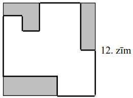

Pieņemsim, ka šim taisnstūrim ir izmēri $x \times y$; tad $x \cdot y \geq 100$.
Tā perimetrs $2x+2y=4 \cdot \frac{x+y}{2} \geq 4 \cdot \sqrt{xy} \geq 40$. 
Tāpēc arī sākotnējās figūras perimetrs $P \geq 40$. Turklāt tas var būt $P$ 
tikai tad, ja $x \cdot y=100$ (t. i., taisnstūris sakrīt ar sākotnējo figūru) 
un $x=y$ (t. i., taisnstūris ir kvadrāts). Tātad mūsu "izoperimetrisko 
nevienādību" esam pierādījuši. 

