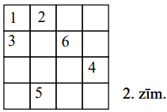
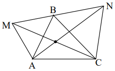

# <lo-sample/> LV.AMO.2009.5.1

Uz kādas planētas tiek lietotas $2009$ dažādas valodas. Kāds mazākais daudzums 
vārdnīcu pietiekams, lai no katras valodas varētu tulkot uz katru citu? 
(Pieļaujamas vairākpakāpju tulkošanas; ar katru vārdnīcu tulko tikai vienā 
virzienā, piemēram, no latviešu valodas uz lietuviešu valodu, bet ne otrādi.)

<small>

* questionType:
* domain:

</small>

## Atrisinājums

**Atbilde:** $2009$

**Risinājums.** $\mathbf{A}$. Tā kā jāvar tulkot uz katru no $2009$ valodām, 
tad ar mazāk kā $2009$ vārdnīcām noteikti nepietiek.

$\mathbf{B}$. Ja vārdnīcas ļauj tulkot "pa apli", kā redzams 1.zīm., tad ar 
$2009$ vārdnīcām pietiek.

# <lo-sample/> LV.AMO.2009.5.2

Andris grib izrakstīt rindā naturālos skaitļus no $1$ līdz $10$ katru tieši 
vienu reizi tā, lai pirmais skaitlis nedalītos ar otro, pirmo divu skaitļu 
summa nedalītos ar trešo, pirmo triju skaitļu summa nedalītos ar ceturto, 
$\ldots$ , pirmo deviņu skaitļu summa nedalītos ar desmito. Vai to var 
izdarīt?

<small>

* questionType:
* domain:

</small>

## Atrisinājums

Piemēram, tā: $1;\ 2;\ 4;\ 3;\ 6;\ 7;\ 5;\ 9;\ 8;\ 10$.

# <lo-sample/> LV.AMO.2009.5.3

Kvadrāts sastāv no $4 \times 4$ rūtiņām Divas rūtiņas sauc par kaimiņu rūtiņām,
ja tām ir kopēja mala vai kopējs stūris. Tieši $6$ rūtiņas nokrāsotas melnas; 
pārējās ir baltas.

Vai var gadīties, ka vienai melnai rūtiņai ir tieši $1$ balts kaimiņš, vienai 
melnai rūtiņai - tieši $2$ balti kaimiņi, $\ldots$ , vienai melnai rūtiņai - 
tieši $6$ balti kaimiņi?

<small>

* questionType:
* domain:

</small>

## Atrisinājums

Skat., piem., 2.zīm.

# <lo-sample/> LV.AMO.2009.5.4

Kvadrātisks režģis sastāv no $3 \times 3$ rūtiņām (skat. 1.zīm.)

**(A)** vai to var uzzīmēt, novelkot $8$ tādas līnijas, kāda attēlota 2.zīm.? 
Līnija var būt novietota arī citādi.

**(B)** vai to var uzzīmēt, novelkot $3$ līnijas, katru ar garumu 8? (Rūtiņas 
malas garums ir $1$.)

<small>

* questionType:
* domain:

</small>

## Atrisinājums

**(A)** jā; skat., piem., 3.zīm.

**(B)** nē. Katrā no $8$ punktiem $A;\ B;\ \ldots;\ H$ saiet kopā $3$ (nepāra 
skaits) nogriežņu, tāpēc katrā no tiem jābūt vismaz vienas līnijas galam. Bet 
$3$ līnijām kopā ir tikai $6$ gali.

# <lo-sample/> LV.AMO.2009.5.5

Kādā valstī prezidenta vēlēšanās piedalās $3$ kandidāti $A,\ B$ un $C$. Katrs 
valsts iedzīvotājs atbalsta tieši vienu no viņiem. Bez tam katrs iedzīvotājs vai
nu vienmēr runā patiesību, vai vienmēr melo. Katram iedzīvotājam aptaujā uzdeva
$3$ jautājumus:  
1) vai Jūs atbalstāt $A$?  
2) vai Jūs atbalstāt $B$?  
3) vai Jūs atbalstāt $C$?

Uz šiem jautājumiem attiecīgi $60 \%$, $50 \%$ un $40 \%$ atbilžu bija "jā".

Kāda daļa no $B$ atbalstītājiem ir meļi?

<small>

* questionType:
* domain:

</small>

## Atrisinājums

Ja ir $n$ iedzīvotāju, tad ir uzdoti $3n$ jautājumi; $1,5n$ atbilžu bija "jā". 
Katrs patiesais cilvēks atbildēja "jā" vienreiz, katrs melis - divreiz. Tātad 
meļu pavisam ir tieši $50 \%$. Ja patieso $B$ atbalstītāju ir $x \%$ no visiem 
iedzīvotājiem, tad meļu, kas neatbalsta $B$, ir ($50-x) \%$; tātad meļu, kas 
atbalsta $B$, ir $50 \% -(50-x) \% =x \%$ no visiem iedzīvotājiem. Tātad starp 
$B$ atbalstītājiem tieši puse ir meļi.

# <lo-sample/> LV.AMO.2009.6.1

Andris nosauc Maijai trīs dažādus ciparus. Pierādiet: Maija, neizmantojot citus
ciparus kā Andra nosauktos, var uzrakstīt veselu skaitli (viencipara, divciparu
vai trīsciparu), kurā nav vienādu ciparu un kas dalās ar $3$.

<small>

* questionType:
* domain:

</small>

## Atrisinājums

Ja kāds no cipariem ir $0;\ 3;\ 6$ vai $9$, Maija raksta atbilstošo viencipara 
skaitli. Ja Andra nosauktie skaitļi ir $1;\ 4;\ 7$ vai $2;\ 5;\ 8$, Maija 
raksta trīsciparu skaitli. Ja ir kāds cipars no kopas $\{1; 4; 7\}$ un kāds - 
no kopas $\{2; 5; 8\}$, Maija raksta atbilstošo divciparu skaitli.

# <lo-sample/> LV.AMO.2009.6.2

Punkti apzīmē reizināšanas zīmes, vienādi burti - vienādus ciparus, bet dažādi 
burti - dažādus ciparus (izņemot $I$ un $Ī$, kas apzīmē vienu un to pašu 
ciparu).

Katrīna aprēķināja izteiksmes 
$\frac{K \cdot R \cdot Ī \cdot Z \cdot E}{L \cdot A \cdot T \cdot V \cdot I \cdot J \cdot A}$
skaitlisko vērtību. Kādu rezultātu viņa ieguva?

<small>

* questionType:
* domain:

</small>

## Atrisinājums

Pavisam izteiksmē ir $10$ dažādi burti, tātad tie šifrē $10$ dažādus ciparus. 
Tātad viens no tiem ir $0$. Tā kā $0$ nevar būt saucējā, tad tā ir skaitītājā. 
Tāpēc izteiksmes vērtība ir $0$.

# <lo-sample/> LV.AMO.2009.6.3

Uz tāfeles bija uzrakstīti $4$ naturāli skaitļi (starp tiem var būt arī 
vienādi). Zane pieskaitīja katram no tiem vieninieku.

Vai Zanes iegūto skaitļu reizinājuma dalījums ar sākumā uzrakstīto skaitļu 
reizinājumu var būt **(A)** $12$, **(B)** $18$?

<small>

* questionType:
* domain:

</small>

## Atrisinājums

**(A)** jā; piemēram, ja sākumā bija uzrakstīti skaitļi $1;\ 1;\ 1;\ 2$.

**(B)** nē. Ievērosim, ka $\frac{n+1}{n}=1+\frac{1}{n} \leq 2$. Tāpēc 
reizinājuma vērtība var pieaugt augstākais $2 \cdot 2 \cdot 2 \cdot 2=16$ 
reizes

# <lo-sample/> LV.AMO.2009.6.4

Katram no diviem kubiņiem uz katras no sešām skaldnēm uzrakstīts pa ciparam. 
Teiksim, ka divciparu skaitli $n$ var attēlot ar kubiņu palīdzību, ja vienam 
kubiņam uz kādas skaldnes ir skaitļa $n$ pirmais cipars, bet otram kubiņam uz 
kādas skaldnes ir skaitļa $n$ otrais cipars. Piemēram, ja vienam kubiņam uz 
kādas skaldnes ir $5$, bet otram kubiņam - $7$, tad var attēlot gan $57$, gan 
$75$.

Pieņemsim, ka ar kubiņu palīdzību var attēlot katru divciparu skaitli no $10$ 
līdz $x$ ieskaitot. Kāda ir lielākā iespējamā $x$ vērtība? (**Piezīme:** ciparu
$6$ nedrīkst izmantot, lai attēlotu ciparu $9$, un otrādi.)

<small>

* questionType:
* domain:

</small>

## Atrisinājums

**Atbilde:** $32$.

**Risinājums.** Viegli pārbaudīt, ka skaitļus no $10$ līdz $32$ ieskaitot var 
attēlot, ja uzrakstīto ciparu sistēmas ir $\{1; 2; 3; 4; 5; 6\}$ un 
$\{0; 1; 2; 7; 8; 9\}$.

Lai izsacītu skaitļus līdz $33$ ieskaitot (tātad arī $11$ un $22$), uz diviem 
kauliņiem jābūt gan $1$, gan $2$, gan $3$. Septiņiem pārējiem cipariem vairs 
nepaliek vietas.

# <lo-sample/> LV.AMO.2009.6.5

**(A)** Dots, ka taisnstūri ar izmēriem $m \times n$ rūtiņas var sagriezt tādās
figūrās, kāda redzama 3.zīm. Pierādīt: šo taisnstūri var sagriezt arī tādās 
figūrās, kāda redzama 4.zīm.

**(B)** Vai taisnība, ka jebkuru taisnstūri, kam gan garums, gan platums ir 
vismaz $4$ rūtiņas un kuru var sagriezt 5.zīm. redzamās figūrās, var sagriezt 
arī 6.zīm. redzamās figūrās?

Figūras var būt arī pagrieztas vai apgrieztas "uz mutes".

<small>

* questionType:
* domain:

</small>

## Atrisinājums

**(A)** no dotā seko, ka $m \cdot n$ dalās ar $3$. Tātad vai nu $m$, vai $n$ 
dalās ar $3$. Varam pieņemt, ka $n$ dalās ar $3$. Tad sagriežam taisnstūri 
strēmelēs $1 \times n$ un pēc tam šīs strēmeles - gabalos $1 \times 3$.

**(B)** nē. Kvadrātu $6 \times 6$ var sagriezt kvadrātos $2 \times 2$. 
Pierādīsim, ka to nevar sagriezt $L$ - tetramino.

Iekrāsosim kvadrāta rūtiņas, kā parādīts 4.zīm. Katrs $L$ - tetramino satur vai
nu $3$, vai $1$ melnu rūtiņu. Tāpēc $9\ L$ - tetramino kopā satur nepāra skaitu
melnu rūtiņu. Bet melno rūtiņu pavisam ir $18$.

# <lo-sample/> LV.AMO.2009.7.1

Dots, ka $x$ un $y$ - tādi naturāli skaitļi, ka $x \cdot y=10^{20}$. Vai var 
būt, ka ne $x$, ne $y$ nesatur savā pierakstā nevienu ciparu $0$?

<small>

* questionType:
* domain:

</small>

## Atrisinājums

**Atbilde:** nē.

**Pierādījums.** Ievērosim, ka $x \cdot y=2^{20} \cdot 5^{20}$. Ja vai nu $x$, 
vai $y$ dalās gan ar $2$, gan ar $5$, tad tas beidzas ar ciparu $0$. Atliek 
vienīgā iespēja, kad viens no skaitļiem $x$ un $y$ ir $2^{20}$, bet otrs ir 
$5^{20}$. Bet $2^{20}=1048576$.

# <lo-sample/> LV.AMO.2009.7.2

Trijstūrim $T$ visas malas ir dažāda garuma. Par punktiem $M$ un $N$ zināms 
tikai tas, ka tie atrodas trijstūra $T$ iekšpusē.  
**(A)** vai var gadīties, ka nogrieznis $MN$ garāks par divām $T$ malām?  
**(B)** vai var gadīties, ka nogrieznis $MN$ garāks par visām $T$ malām?

<small>

* concepts:triangle
* questionType:ProveDisprove,ProveDisprove
* domain:Geom

</small>

## Atrisinājums

**(A)** jā, skat., piem, 5.zīm.

**(B)** nē. Novelkam taisni $MN$; pieņemsim, ka tā krusto trijstūra kontūru 
punktos $X$ un $Y$ (6.zīm.) Vispirms pieņemam, ka ne $X$, ne $Y$ nav $T$ 
virsotne. Tā kā $\sphericalangle YXA+\sphericalangle YXB=180^{\circ}$, tad 
viens no šiem leņķiem nav šaurs; varam pieņemt, ka 
$\sphericalangle AXY \geq 90^{\circ}$. Tad $\sphericalangle AXY$ ir lielākais 
leņķis trijstūrī $AXY$, tāpēc $AY$ ir tur garākā mala; tāpēc $AY>XY>MN$. Tā kā 
$\sphericalangle AYB+\sphericalangle AYC=180^{\circ}$, tad viens no šiem 
leņķiem nav šaurs; ja tas ir, piemēram, $\sphericalangle AYC$, tad kā iepriekš 
iegūstam, ka $AC>AY>XY>MN$. Ja kāds no punktiem ir $T$ virsotne, uzreiz nonākam
pie augšminētā sprieduma otrās daļas.

**Piezīme:** vērtējumā būs ļoti būtiski, cik pilnīgi skolēna izklāsts aptver 
visas situācijas.

# <lo-sample/> LV.AMO.2009.7.3

Tabula sastāv no $3 \times 3$ rūtiņām. Rūtiņās ierakstīti naturāli skaitļi no 
$1$ līdz $9$ (katrā rūtiņā cits skaitlis). Skaitļu summas rindās un kolonnās 
visas ir dažādas.

Kāds lielākais daudzums šo summu var būt pirmskaitļi?

<small>

* topic:ModularParity
* topic:PrimesDistribution
* topic:SeriesMembersSumsClosedFormulas
* topic:ExhaustionMethod
* concepts:primes,sum,table,row,column,natural-numbers
* genre:fill-in-table
* questionType:FindOptimal
* domain:NT
* isHard:true

</small>

## Atrisinājums

**Atbilde:** četras summas.

**Risinājums:** Piemēru ar $4$ summām skat. 8.zīm.

Pierādīsim, ka tas ir maksimums. Vienīgie iespējamie pirmskaitļi - summu 
vērtības - ir $7;\ 11;\ 13;\ 17;\ 19;\ 23$. Lai visas $6$ summas būtu 
pirmskaitļi, tām jābūt tieši šādām. Bet tādas tās nevar būt, jo $7$ iegūstams 
tikai kā $1+2+4$ un $23$ - tikai kā $6+8+9$; tad trešajā rindā/kolonnā summa 
būtu $(1+2+\ldots+9)-7-23=15$, kas nav pirmskaitlis.

Ievērosim, ka visu $6$ apskatāmo summu summa noteikti ir $2(1+2+\ldots+9)=90$. 
Tāpēc, ja $5$ summas būtu pirmskaitļi no jau minētajām, tad tāda būtu arī sestā
summa. Kā jau redzējām, tas nevar būt. Tāpēc arī $5$ summas nevar būt 
pirmskaitļi.

*Piezīme:* Ir arī citas tabulas, kas apmierina nosacījumu (arī citos piemēros 
visi nepāra cipari novietoti vienā rindā un vienā kolonnā). Piemēram, 

| 5   | 6   | 4   |
| --- | --- | --- |
| 9   | 8   | 2   |
| 7   | 3   | 1   |

# <lo-sample/> LV.AMO.2009.7.4

Trijstūris $ABC$ ir šaurleņķu. Trijstūri $AMB$ un $BNC$ abi ir vienādmalu un 
atrodas ārpus $\triangle ABC$. Pierādīt, ka $AN=CM$.

<small>

* concepts:triangle
* questionType:Prove
* domain:Geom

</small>

## Atrisinājums

Tā kā $AB=MB$, $BN=BC$ un 
$\sphericalangle ABN= \sphericalangle ABC +60^{\circ}=\sphericalangle MBC < 150^{\circ}$,
tad $\triangle ABN=\triangle MBC\ (m \ell m)$. Tāpēc $AN=MC$.

# <lo-sample/> LV.AMO.2009.7.5

Vairākiem rūķīšiem ir vienādi naudas daudzumi. Brīdi pa brīdim kāds no rūķīšiem
paņem daļu savas naudas un sadala to pārējiem vienādās daļās. Pēc kāda laika 
izrādījās, ka vienam no rūķīšiem ir $8$ dālderi, bet citam - $25$ dālderi. Cik 
pavisam ir rūķīšu? (Dālderis ir vienīgā rūķīšiem pieejamā naudas vienība.)

<small>

* topic:InvariantRemainder
* concepts:divisibility
* genre:making-moves
* questionType:FindAll
* domain:NT

</small>

## Atrisinājums

Pieņemsim, ka rūķīšu ir $n$. Viegli izsekot, ka katras naudas dalīšanas 
rezultātā starpības starp jebkuru divu rūķīšu naudas daudzumiem mainās par 
skaitļa $n$ daudzkārtni. (Ja rūķu ir $a$, pārdalot $k$ dālderus, 
starpība starp devēja un saņēmēja naudas daudzumiem 
mainās par $(a-1)k+k = ak$.)

Tā kā sākumā šīs starpības visas ir $0$, tad tās 
vienmēr ir skaitļa $n$ daudzkārtņi, tāpēc $17$ dalās ar $n$.
Tā kā $17$ ir pirmskaitlis un rūķīšu ir vairāk nekā viens, tad $n=17$. Piemērs:
sākumā ir $17$ rūķīšu, katram $24$ dālderi. Viens rūķītis iedod katram no $16$ 
citiem pa vienam dālderim.

# <lo-sample/> LV.AMO.2009.8.1

Vienādojumam $x^{2}+px+q=0$ ir divas dažādas saknes $x_{1}$ un $x_{2}$. Vai var
gadīties, ka

**(A)** $0<p<q<x_{1}<x_{2}$?  
**(B)** $x_{1}<q<p<x_{2}$?

<small>

* questionType:
* domain:

</small>

## Atrisinājums

**(A)** nē; saskaņā ar Vjeta teorēmu jābūt $p+x_{1}+x_{2}=0$.

**(B)** jā, skat, piem., vienādojumu $x^{2}-0,3x-0,54=0$, kam ir saknes 
$x_{1}=-0,6$ un $x_{2}=0,9$.

# <lo-sample/> LV.AMO.2009.8.2

Šaha turnīrā piedalās $8$ spēlētāji; katrs ar katru citu spēlē tieši $1$ 
reizi. Par uzvaru spēlētājs saņem $1$ punktu, par neizšķirtu $\frac{1}{2}$ 
punkta, par zaudējumu $0$ punktus. Tunīru beidzot, izrādījās, ka nekādiem 
diviem spēlētājiem nav vienāds punktu daudzums. Kāds ir mazākais iespējamais 
uzvarētāja iegūtais punktu daudzums? (Par uzvarētāju uzskata to spēlētāju, kam 
turnīra noslēgumā ir visvairāk punktu.)

<small>

* questionType:
* domain:

</small>

## Atrisinājums

Ja uzvarētājs ieguvis $n$ punktus, tad kopējais iegūto punktu daudzums nav 
lielāks par 
$n+\left(n-\frac{1}{2}\right)+(n-1)+\left(n-1 \frac{1}{2}\right)+(n-2)+\left(n-2 \frac{1}{2}\right)+(n-3)+\left(n-3 \frac{1}{2}\right)=8n-14$.
Pavisam izspēlēja $28$ spēles, tāpēc $28 \leq 8n-14$ un $8n \geq 42$, no 
kurienes $n \geq 5 \frac{1}{4}$; tātad $n \geq 5 \frac{1}{2}$. Piemēru, kur 
$n=5 \frac{1}{2}$, skat. 9.zīm.

# <lo-sample/> LV.AMO.2009.8.3

Uz kvadrāta $ABCD$ malas $BC$ ņemts tāds punkts $M$, ka leņķa $AMC$ bisektrise 
krusto malu $CD$ tās viduspunktā $K$. Pierādīt, ka $AK$ ir leņķa $MAD$ 
bisektrise.

<small>

* questionType:
* domain:

</small>

## Atrisinājums

Pagarinām $MK$ līdz krustpunktam $E$ ar $AD$. Tad 
$\sphericalangle DEK=\sphericalangle CMK$, tāpēc 
$\triangle MCK=\triangle EDK\ (\ell m \ell)$, tad $MK=KE$. Tāpēc $AK$ ir 
vienādsānu trijstūra $MAE$ mediāna pret pamatu, tāpēc arī bisektrise.

# <lo-sample/> LV.AMO.2009.8.4

Profesors Cipariņš ar savu ārzemju kolēģi ieradās Ziemassvētku eglītes 
pasākumā, kurā piedalījās universitātes darbinieki, viņu draugi, ģimenes 
locekļi, paziņas utt. Norādot uz trim viesiem, Cipariņš piezīmēja: "Šo cilvēku 
vecumu reizinājums ir $2450$, bet summa - divas reizes lielāka nekā Jūsu 
vecums." Kolēģis atteica: "Es nezinu un nevaru noskaidrot, cik veci ir šie 
ļaudis." Tad Cipariņš piebilda: "Es esmu vecāks par jebkuru citu šai eglītē." 
Tagad kolēģis uzreiz pateica minēto $3$ viesu vecumus. Cik gadu tai laikā bija 
Cipariņam un cik - viņa kolēgim? (Visus vecumus izsaka veselos gados.)

<small>

* topic:CanonicalFactorization
* topic:ExhaustionMethod
* genre:word-problem
* isHard:true
* isUnverified:true
* questionType:FindAll
* domain:Comb

</small>

## Atrisinājums

Ja trīs viesu vecumi ir $x, y, z$, iegūstam sakarības $x \cdot y \cdot z=2450$ 
un $x+y+z=2v$, kur $v$ kolēģa vecums. Kolēģis savu vecumu, protams, zina. Ja 
viņš nevarēja noteikt $x;\ y;\ z$, tad tikai tāpēc, ka abu vienādojumu sistēmai
attiecībā uz $x;\ y;\ z$, eksistē vairāk nekā viens atrisinājums. Sadalot 
$2450$ triju naturālu skaitļu reizinājumā, redzam: tikai sadalījumiem 
$(50; 7; 7)$ un $(49; 10; 5)$ reizinātāju summas ir vienādas. Kolēģim tātad 
bija $32$ gadi. Pieņemsim, ka Cipariņam bija $t$ gadu. Ja $t>50$, kolēģis 
nevarētu atrast viesu vecumus arī pēc Cipariņa otrās piezīmes. Situācija $t<50$
nav iespējama. Tāpēc $t=50$.

## Atrisinājums

Kolēģa 1.atbildei atbilst $(5,10,49)$ vai $(7,7,50)$. 
Otrā Profesora Cipariņa piebilde neļauj tos atšķirt.

# <lo-sample/> LV.AMO.2009.8.5

Uz riņķa līnijas atzīmēti vairāki punkti. Katram punktam jāpieraksta viens no 
burtiem $A;\ B;\ C;\ D;\ E;\ F$ tā, lai katri divi dažādi burti kaut vienā 
vietā uz riņķa līnijas atrastos blakus (vienalga kādā secībā).

**(A)** pierādīt, ka vajag vismaz $15$ punktus,

**(B)** pierādīt, ka vajag vismaz $18$ punktus,

**(C)** vai ar $18$ punktiem pietiek?

<small>

* questionType:
* domain:

</small>

## Atrisinājums

**(A)** no $6$ burtiem var izveidot $15$ dažādu burtu pārus, tāpēc diviem 
punktiem jābūt blakus vismaz $15$ vietās. Tāpēc arī punktu ir vismaz $15$.

**(B)** katram burtam jābūt blakus ar $5$ citiem. Tāpēc katram burtam jābūt 
vismaz $3$ eksemplāros; tāpēc vajag vismaz $6 \cdot 3=18$ punktus.

**(C)** skat, piem., 11.zīm.

# <lo-sample/> LV.AMO.2009.9.1

Pieņemsim, ka 7.zīm. attēlotās līknes ir kvadrātfunkciju grafiki.

Vai tie var būt funkciju $y=ax^{2}+bx+c$, $y=bx^{2}+cx+a$ un $y=cx^{2}+ax+b$ 
grafiki?

<small>

* questionType:
* domain:

</small>

## Atrisinājums

Nē. Visu minēto funkciju vērtības pie $x=1$ sakrīt, bet dotie $3$ grafiki neiet
caur vienu punktu (visi $6$ iespējamie krustpunkti zīmējumā redzami, tātad citu
nav).

# <lo-sample/> LV.AMO.2009.9.2

Dots, ka $|a| \geq |b+d|$, $|b| \geq |c+a|$ un $|d| \geq |a+b|$. Pierādīt, ka 
$a+b+c=0$.

<small>

* questionType:
* domain:

</small>

## Atrisinājums

Ceļot dotās nevienādības kvadrātā, iegūstam

$$\begin{aligned}
& a^{2} \geq b^{2}+2bc+c^{2} \\
& b^{2} \geq a^{2}+2ac+c^{2} \\
& c^{2} \geq a^{2}+2ab+b^{2}
\end{aligned}$$

Saskaitot, pārnesot visus locekļus uz labo pusi un savelkot līdzīgos locekļus, 
iegūstam $(a+b+c)^{2} \leq 0 \Rightarrow a+b+c=0$.

# <lo-sample/> LV.AMO.2009.9.3

Uz taisnes $t$ novietots stienītis ar garumu $1$. Sākumā tā gali atrodas 
punktos $A$ un $B$. Stienīti bīda pa plakni tā, ka tas visu laiku paliek 
paralēls taisnei $t$ un beigās atkal nonāk uz $t$; šai brīdī tā gali atrodas 
punktos $C$ un $D$. Turklāt ceļiem, pa kuriem kustas stienīša gali, nav kopīgu 
punktu. Vai var gadities, ka $AC>2009$? (**Piezīme:** uzskatām, ka stienītis ir
paralēls $t$ arī tad, ja tas atrodas uz $t$)

<small>

* questionType:
* domain:

</small>

## Atrisinājums

Jā, var. Skat, piem., 12.zīm., kur $h$ var tikt padarīts patvaļīgi mazs.

# <lo-sample/> LV.AMO.2009.9.4

Naturāla skaitļa $n$ pozitīvo dalītāju skaitu apzīmējam ar $d(n)$. Piemēram, 
$d(1)=1;\ d(6)=4$ utt. Sauksim skaitli $n$ par apaļīgu, ja tas dalās 
ar $d(n)$.

**(A)** atrodiet piecus apaļīgus skaitļus,

**(B)** pierādiet, ka apaļīgu skaitļu ir bezgalīgi daudz.

<small>

* concepts:divisors
* questionType:FindExample,Prove
* domain:NT

</small>

## Atrisinājums

Ja $p$ ir pirmskaitlis, tad skaitlim $p^{n-1}$ ir tieši $n$ dalītāji 
$1;\ p;\ p^{2};\ \ldots;\ p^{n-1}$. Pieņemsim, ka $p$ - pirmskaitlis, $n$ - 
naturāls skaitlis. Apskatīsim $A=p^{p^{n}-1}$. Tam ir $p^{n}$ dalītāju. Lai 
pierādītu, ka $A$ ir apaļīgs, pietiek pierādīt, ka $p^{n}-1 \geq n$ jeb 
$p^{n} \geq n+1$. To iegūst, sareizinot $n$ acīmredzamas nevienādības 
$p \geq 2, \quad p \geq \frac{3}{2}, \quad p \geq \frac{4}{3}, \quad \ldots, \quad p \geq \frac{n+1}{n}$.

# <lo-sample/> LV.AMO.2009.9.5

Kvadrāts sastāv no $8 \times 8$ vienādām kvadrātiskām rūtiņām. Katra no tām 
izkrāsota vai nu balta, vai melna. Ar vienu gājienu atļauts izvēlēties jebkuras
$3$ rūtiņas, kas veido 8.zīm. parādīto figūru (tā var būt novietota arī 
citādi), un mainīt krāsu uz pretējo visās šīs figūras rūtiņās. Vai, atkārtojot 
šādus gājienus, var panākt, lai viss kvadrāts kļūtu balts, ja

**(A)** sākotnējais krāsojums ir šaha galdiņa izskatā,

**(B)** sākotnējais krāsojums ir patvaļīgs?

<small>

* questionType:
* domain:

</small>

## Atrisinājums

Mainot krāsas stūrīšos $ABC,\ ADC,\ BAD$, rezultātā krāsa mainījusies tikai 
rūtiņā $A$. Tātad varam mainīt krāsu vienā (patvaļīgā) rūtiņā. Tātad no jebkura
krāsojuma varam iegūt jebkuru.

# <lo-sample/> LV.AMO.2009.10.1

Pieņemsim, ka 9.zīm. attēlotās līknes ir kvadrātfunkciju grafiki. Vai tie var 
būt funkciju

$y=ax^{2}+2bx+c$,

$y=bx^{2}+2cx+a$ un

$y=cx^{2}+2ax+b$ grafiki?

<small>

* questionType:
* domain:

</small>

## Atrisinājums

Nē, nevar. Tā kā parabolām zari vērsti uz augšu, tad būtu $a>0,\ b>0,\ c>0$. Tā
kā katra parabola krusto abscisu asi divos punktos, tad visu trinomu 
diskriminanti būtu pozitīvi, t. i.,

$b^{2}>ac,\ c^{2}>ab,\ a^{2}>cb$. Sareizinot šīs nevienādības, mēs iegūtu 
$a^{2}b^{2}c^{2}>a^{2}b^{2}c^{2}$ - pretruna.

# <lo-sample/> LV.AMO.2009.10.2

Dots, ka $p$ un $q$ ir divi viens otram sekojoši nepāra pirmskaitļi (piemēram, 
$13$ un $17$). Pierādīt: skaitli $p+q$ var sadalīt triju tādu naturālu skaitļu 
reizinājumā, kas visi lielāki par $1$ (starp šiem trim skaitļiem var būt arī 
vienādi).

<small>

* concepts:primes
* questionType:Prove
* domain:NT

</small>

## Atrisinājums

Apzīmējam $p=2k+1,\ q=2n+1,\ k,\ n$ - naturāli skaitļi. Tad $p+q=2(k+n+1)$. 
Varam pieņemt, ka $k<n$; tad $2k+1<k+n+1<2n+1$. Tā kā $2k+1$ un $2n+1$ ir divi 
viens otram sekojoši pirmskaitļi, tad $k+n+1$ nav pirmskaitlis. Tāpēc $k+n+1$ 
sadalās vismaz divos reizinātājos.

# <lo-sample/> LV.AMO.2009.10.3

Dots, ka $ABC$ ir šaurleņķu trijstūris un $I$ ir tajā ievilktās riņķa līnijas 
centrs. Riņķa līnija $\omega_{1}$ iet caur $B$ un $I$ un pieskaras 
$\sphericalangle ACB$ bisektrisei. Riņķa līnija $\omega_{2}$ iet caur $C$ un 
$I$ un pieskaras $\sphericalangle ABC$ bisektrisei. Pierādīt, ka viens no 
$\omega_{1}$ un $\omega_{2}$ krustpunktiem atrodas uz $\triangle ABC$ apvilktās
riņķa līnijas.

<small>

* questionType:
* domain:

</small>

## Atrisinājums

Apzīmējam $\sphericalangle ABC=2 \beta$ un $\sphericalangle ACB=2 \gamma$; tad 
$\sphericalangle A=180^{\circ}-(2 \beta+2 \gamma)$ un 
$\sphericalangle CIB=180^{\circ}-(\gamma+\beta)$. No ievilkto leņķu un hordas -
pieskares leņķu īpašībām seko 14.zīmējumā parādītās leņķu vienādības, tāpēc 
$\sphericalangle CSB=\sphericalangle 1+\sphericalangle 2=360^{\circ}-2 \sphericalangle CIB=2(\beta+\gamma)$.

Tāpēc $\sphericalangle A+\sphericalangle CSB=180^{\circ}$, no kā seko 
vajadzīgais.

# <lo-sample/> LV.AMO.2009.10.4

Dots, ka $a,\ b,\ c,\ d$ - pozitīvi skaitļi. Pierādīt, ka 
$\frac{a+c}{a+b}+\frac{b+d}{b+c}+\frac{c+a}{c+d}+\frac{d+b}{d+a} \geq 4$.

<small>

* questionType:
* domain:

</small>

## Atrisinājums

Viegli pierādīt nevienādību $x+y \geq \frac{4}{\frac{1}{x}+\frac{1}{y}}$ 
pozitīviem $x$ un $y$.

No tās seko

$\frac{a+c}{a+b}+\frac{c+a}{c+d} \geq 4 \cdot \frac{a+c}{a+b+c+d}$ un

$\frac{b+d}{b+c}+\frac{d+b}{d+a} \geq 4 \cdot \frac{b+d}{a+b+c+d}$.

Saskaitot šīs nevienādības, iegūstam vajadzīgo.

# <lo-sample/> LV.AMO.2009.10.5

Dots daudzstūris ar $2n+1$ virsotnēm, $n$ - naturāls skaitlis. Tā virsotnēs un 
malu viduspunktos jāieraksta naturāli skaitļi no $1$ līdz $4n+2$ (katrā 
punktā - cits skaitlis) tā, lai to trīs skaitļu summas, kas uzrakstīti uz 
vienas malas, visas būtu savā starpā vienādas. Vai to var izdarīt, ja

**(A)** $n=2$,

**(B)** patvaļīgam naturālam $n$?

<small>

* questionType:
* domain:

</small>

## Atrisinājums

**(A)** skat. 15.zīm.

**(B)** pulksteņa rādītāja kustības virzienā sanumurējam malu viduspunktus pēc 
kārtas ar $1;\ 2;\ 3;\ \ldots;\ 2n+1$. Tad, sākot ar virsotni starp $1$ un $2$,
sanumurējam virsotnes, ik pa vienai izlaižot, ar skaitļiem 
$4n+2;\ 4n+1;\ \ldots;\ 2n+2$ arī pulksteņa rādītāja kustības virzienā (skat. 
16.zīm.)

# <lo-sample/> LV.AMO.2009.11.1

Pierādīt, ka

$\frac{1}{1^{4}+1^{2}+1}+\frac{2}{2^{4}+2^{2}+1}+\frac{3}{3^{4}+3^{2}+1}+\ldots+\frac{2009}{2009^{4}+2009^{2}+1}<\frac{1}{2}$.

<small>

* questionType:
* domain:

</small>

## Atrisinājums

Ievērosim, ka katram $n>0$ pastāv vienādība

$$\begin{aligned}
& \frac{n}{n^{4}+n^{2}+1}=\frac{n}{n^{4}+2n^{2}+1-n^{2}}=\frac{n}{\left(n^{2}+1\right)^{2}-n^{2}}=\frac{n}{\left(n^{2}-n+1\right)\left(n^{2}+n+1\right)}= \\
& =\frac{1}{2}\left[\frac{1}{n^{2}-n+1}-\frac{1}{n^{2}+n+1}\right]=\frac{1}{2}\left[\frac{1}{n^{2}-n+1}-\frac{1}{(n+1)^{2}-(n+1)+1}\right]
\end{aligned}$$

Saskaitot šīs vienādības pie $n=1;\ 2;\ 3;\ \ldots;\ 2009$, iegūstam, ka 
novērtējamās summas vērtība ir 
$\frac{1}{2}\left[\frac{1}{1^{2}-1+1}-\frac{1}{2010^{2}-2010+1}\right]<\frac{1}{2} \cdot \frac{1}{1^{2}-1+1}=\frac{1}{2}$,
k.b.j.

# <lo-sample/> LV.AMO.2009.11.2

Spēlē OP! piedalās $n$ spēlētāji ($n \geq 2$). Spēle notiek vairākas dienas. 
Katru dienu viens spēlētājs uzvar, bet pārējie zaudē. Sakaņā ar noteikumiem 
$i$-tajā dienā ($i=1,2, \ldots$) uzvarētājs saņem $i(n-1)$ punktus, bet katrs 
zaudētājs zaudē pa $i$ punktiem. Spēles sākumā visiem ir pa $0$ punktiem. Pēc 
kāda mazākā dienu skaita var gadīties, ka visiem atkal ir pa $0$ punktiem?

<small>

* questionType:FindOptimal
* domain:Comb

</small>

## Atrisinājums

**Atbilde:** pēc $2n-1$ dienām.

**Risinājums.** Ja dienu skaits nepārsniedz $2n-2$, tad vai nu kāds spēlētājs 
nav ne reizi uzvarējis (un tad viņa punktu summa ir negatīva), vai arī ir 
vismaz divi spēlētāji, kas katrs uzvarējis tikai vienreiz; tad tas noticis 
dažādās dienās, un viņu punktu summas nevar būt vienādas. Tāpēc ar $2n-2$ vai 
mazāk dienām nepietiek.

Viegli pārbaudīt: ja  
   viens spēlētājs uzvar $1.$ un $(2n-2)$-ā dienā;   
   viens spēlētājs uzvar $2.$ un ($2n-3)$-ā dienā;  
   .  
   .  
   .  
   viens spēlētājs uzvar $n$-ā un $(n-1)$-ā dienā;   
   viens spēlētājs uzvar $(2n-1)$-ā dienā,  

uzdevuma prasības ir izpildītas.

# <lo-sample/> LV.AMO.2009.11.3

Dots, ka $a$ un $b$ - naturāli skaitļi un skaitļa $S=a^{2}+ab+b^{2}$ pēdējais 
cipars ir $0$. Kāds ir skaitļa $S$ priekšpēdējais cipars?

<small>

* questionType:FindAll
* domain:NT

</small>

## Atrisinājums

Viegli redzēt, ka $a$ un $b$ ir pāra skaitļi, tātad $S$ dalās ar $4$. Tā kā 
$a^{3}-b^{3}=(a-b)\left(a^{2}+ab+b^{2}\right)$, tad 
$a^{3}-b^{3} \equiv 0(\bmod 5)$. Tāpēc $a^{3} \equiv b^{3}(\bmod 5)$; tāpēc 
$a \equiv b(\bmod 5)$. Tāpēc $3a^{2} \equiv a^{2}+ab+b^{2} \equiv 0(\bmod 5)$. 
Tāpēc $a \equiv 0(\bmod 5)$. Tāpēc $S$ dalās ar $25$. Tā kā $LKD(4,25)=1$, tad 
$S$ dalās ar $100$ un $S$ priekšpēdējais cipars ir $0$.

# <lo-sample/> LV.AMO.2009.11.4

Dots, ka sešstūris $ABCDEF$ ir izliekts un tā pretējās malas ir pa pāriem 
vienādas. Nekādas divas tā malas un diagonāles nav paralēlas viena otrai. Ar 
$A_{1}, B_{1}, C_{1}, D_{1}, E_{1}, F_{1}$ apzīmējam attiecīgi diagonāļu 
$AC, BD, CE, DF, EA, FB$ viduspunktus. Pierādīt, ka taisnes 
$A_{1}D_{1},\ B_{1}E_{1}$ un $C_{1}F_{1}$ krustojas vienā punktā.

<small>

* questionType:
* domain:

</small>

## Atrisinājums

No trijstūru viduslīniju īpašībām viegli seko vispārzināms fakts: izliektā 
četrstūrī $XYZT$, kam nav paralēlu malu, nogriežņu $XZ,\ YZ,\ YT$ un $XT$ 
viduspunkti ir paralelograma virsotnes. Turklāt, ja $XY=ZT$, tad šis 
paralelograms ir rombs.

Apzīmēsim ar $P,\ Q,\ R$ diagonāļu $AD,\ BE,\ CF$ viduspunktus. Tad 
$PB_{1}QE_{1}$ ir rombs. Tāpēc $B_{1}E_{1}$ iet caur $PQ$ viduspunktu un 
$B_{1}E_{1} \perp PQ$. Līdzīgi iegūstam, ka $A_{1}D_{1}$ iet caur $PR$ 
viduspunktu un $A_{1}D_{1} \perp PR$, kā arī $C_{1}F_{1}$ iet caur $QR$ 
viduspunktu un $C_{1}F_{1} \perp QR$. Tāpēc taisnes $A_{1}D_{1},\ B_{1}E_{1}$ 
un $C_{1}F_{1}$ krustojas $\triangle PQR$ apvilktās riņķa līnijas centrā.

# <lo-sample/> LV.AMO.2009.11.5

Atrisināt nevienādību sistēmu

$$\left\{\begin{array}{l}
x^{3}y+3 \leq 4z \\
y^{3}z+3 \leq 4x \\
z^{3}x+3 \leq 4y
\end{array}\right.$$

pozitīvos skaitļos.

<small>

* questionType:
* domain:

</small>

## Atrisinājums

Skaidrs, ka $4x-3 \geq 0,\ 4y-3 \geq 0,\ 4z-3 \geq 0$. Sareizinot visas 
nevienādības, iegūstam 

$$\begin{equation}
x^{4}y^{4}z^{4} \leq(4x-3)(4y-3)(4z-3) \tag{1}
\end{equation}$$

Katram $a$ ir spēkā $a^{4}+3=\left(a^{4}+1\right)+2 \geq 2a^{2}+2 \geq 4a$, 
tāpēc $a^{4} \geq 4a-3$ un vienādība pastāv $ttt\ a=1$.

Tāpēc

$$\begin{equation}
x^{4}y^{4}z^{4} \geq(4x-3)(4y-3)(4z-3) \tag{2}
\end{equation}$$

No (1) un (2) seko $x^{4}y^{4}z^{4}=(4x-3)(4y-3)(4z-3) \Rightarrow x=y=z=1$.

# <lo-sample/> LV.AMO.2009.12.1

Dots, ka $a_{1}, a_{2}, \ldots, a_{2009}$ un $b_{1}, b_{2}, \ldots, b_{2009}$ 
ir attiecīgi aritmētiska progresija un ģeometriska progresija, kas abas sastāv 
no pozitīviem skaitļiem. Dots arī, ka $a_{1}=b_{1} \neq a_{2009}=b_{2009}$. Kas
lielāks: visu aritmētiskās vai visu ģeometriskās progresijas locekļu summa?

<small>

* questionType:
* domain:

</small>

## Atrisinājums

Attēlosim abas progresijas kā naturāla argumenta funkcijas. Aritmētiskās 
progresijas locekļi izvietojas uz taisnes, bet ģeometriskās progresijas 
locekļi - uz eksponentfunkcijas grafika. No eksponentfunkcijas grafika īpašībām
zinām, ka ir spēkā viena no 18.zīm. parādītajām situācijām:

Redzam, ka abos gadījumos a.p. locekļu summa ir lielāka.

# <lo-sample/> LV.AMO.2009.12.2

Dots, ka $x, y, z$ - pozitīvi skaitļi un $xy+yz+zx>x+y+z$. Pierādīt, ka 
$x+y+z>3$

<small>

* questionType:
* domain:

</small>

## Atrisinājums

Ievērosim, ka

$(x+y+z)^{2}=x^{2}+y^{2}+z^{2}+2xy+2xz+2yz=$

$=\frac{1}{2}\left[(x-y)^{2}+(x-z)^{2}+(y-z)^{2}\right]+3(xy+xz+yz) \geq 3(xy+xz+yz)>3(x+y+z)$.
No $(x+y+z)^{2}>3(x+y+z)$ seko $x+y+z>3$, k. b.j.

# <lo-sample/> LV.AMO.2009.12.3

Dots, ka $n-$ naturāls pāra skaitlis. Apskatām reizinājumu 

$$R=n(n+1)(n+2)(n+3).$$

**(A)** Vai var būt, ka $R$ ir kāda naturāla skaitļa kvadrāts?  
**(B)** Vai var būt, ka $R$ ir kāda naturāla skaitļa kubs?

<small>

* questionType:ProveDisprove,ProveDisprove
* domain:NT

</small>

## Atrisinājums

**(A)** ievērojam, ka **katram** naturālam 
$n \quad R=n^{4}+6n^{3}+11n^{2}+6n=\left(n^{2}+3n+1\right)^{2}-1$. Nav divu naturālu
skaitļu kvadrātu, kas atšķirtos viens no otra par $1$.

**(B)** apskatām $R=n(n+1)(n+2)(n+3)$. Skaitļiem $n+1$ un $n+2$, kā arī $n+1$ 
un $n$, nav kopīgu dalītāju, izņemot $1$. Skaitļiem $n+1$ un $n+3$ kopīgs 
dalītājs var būt tikai $1$ vai $2$ (jo $(n+3)-(n+1)=2)$; tā kā $n$ - pāra 
skaitlis, tad tas nav $2$.

Tātad $n+1$ nav kopīgu dalītāju ar $n(n+2)(n+3)$ un, ja $R$ ir kubs, tad kubs 
ir gan atsevišķi $n+1$, gan $n(n+2)(n+3)$. Bet viegli pārbaudīt, ka 
$(n+1)^{3}<n(n+2)(n+3)<(n+2)^{3}$, un skaitlis, kas atrodas starp divu viens 
otram sekojošu naturālu skaitļu kubiem, nav naturāla skaitļa kubs.

# <lo-sample/> LV.AMO.2009.12.4

Četrstūris $ABCD$ ir ievilkts riņķa līnijā. Zināms, ka 
$AB \cdot CD=AD \cdot BC$ Diagonāles $AC$ viduspunkts ir $M$. Pierādīt, ka 
$\sphericalangle ABM=\sphericalangle DBC$.

<small>

* questionType:
* domain:

</small>

## Atrisinājums

Izvēlamies $K$ uz stara $DC$ tā, ka 
$\sphericalangle BKC=\sphericalangle BDA$. Tā kā 
$\sphericalangle BCK=180^{\circ}-\sphericalangle BCD=\sphericalangle BAD$， tad 
$\triangle BCK \sim \triangle BAD$. Tāpēc $\frac{BC}{CK}=\frac{BA}{AD}$. No 
dotā $\frac{BA}{AD}=\frac{BC}{CD}$, tāpēc $\frac{BC}{CK}=\frac{BC}{CD}$ un 
$CD=CK$. No leņķu vienādībām viegli seko, ka 
$\triangle ABC \sim \triangle DBK$. Šajā līdzībā malas $AC$ viduspunkts $M$ 
atbilst malas $DK$ viduspunktam $C$. Tāpēc 
$\sphericalangle ABM=\sphericalangle DBC$, k.b.j.

# <lo-sample/> LV.AMO.2009.12.5

Uz galda atrodas $n$ konfektes, $n$ - naturāls skaitlis. Divi spēlētāji pamīšus
ēd pa $x^{2}$ konfektēm, kur $x$ - naturāls skaitlis ($x$ var mainīties no 
gājiena uz gājienu). Tas, kam nav ko ēst, zaudē. Pierādīt: ir bezgalīgi daudz 
tādu $n$, ka, pareizi spēlējot, otrais spēlētājs var uzvarēt.

<small>

* questionType:Prove
* domain:Comb

</small>

## Atrisinājums

Pieņemsim no pretējā, ka $n$ ir **lielākais** konfekšu skaits sākuma pozīcijā, 
pie kura otrajam spēlētājam eksistē uzvaroša stratēģija. (Tādi $n$ vispār 
eksistē, piem., $n=2$.) Pieņemsim, ka uz galda atrodas $n^{2}+n+1$ konfekte. 
Pierādīsim, ka otrais spēlētājs var uzvarēt. Tā būs pretruna ar pieņēmumu, un 
uzdevums būs atrisināts.

Pirmais spēlētājs ar savu pirmo gājienu nevar apēst vairāk par $n^{2}$ 
konfektēm, jo $(n+1)^{2}>n^{2}+n+1$. Tāpēc pēc šī gājiena uz galda paliek 
$\geq n+1$ konfekte. Saskaņā ar pieņēmumu šajā situācijā uzvar tas, kas sāk, 
t.i., otrais spēlētājs. Vajadzīgā pretruna iegūta.

