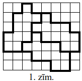
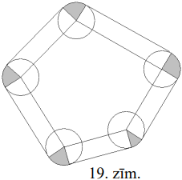

# <lo-sample/> LV.AMO.2010.5.1

Rindā pēc kārtas uzrakstīti visi naturālie skaitļi no $1$ līdz $20$, 
neievērojot atstarpes starp tiem. Pēc tam šajā rindā izsvītroja $26$ ciparus un
apskatīja atlikušo ciparu veidoto naturālo skaitli (ciparu secību mainīt 
nedrīkst!).

Kāds varēja būt **(A)** mazākais iegūtais skaitlis;

**(B)** lielākais iegūtais skaitlis?

(Naturāla skaitļa pieraksts nedrīkst sākties ar $0$.)

<small>

* questionType:
* domain:

</small>

## Atrisinājums

Dotā virkne, no kuras tiek izsvītroti $26$ cipari, ir:

$$1234567891011121314151617181920.$$

**(A)** Mazākajam piecciparu skaitlim jāsākas ar pēc iespējas mazāku 
divciparu skaitli. Šajā gadījumā tas ir $10$. Mazākais trīsciparu skaitlis, ko 
var izveidot no atlikušajiem cipariem ($11121314151617181920$), ir $110$, tāpēc
mazākais piecciparu skaitlis ir $10110$.

**(B)** Lielākajam piecciparu skaitlim jāsākas ar pēc iespējas lielāku 
divciparu skaitli. Lielākais divciparu skaitlis, ko var izveidot no dotajiem 
cipariem, ir $99$. Bet tad atliek vairs tikai divi cipari ($20$), no kuriem 
nevar izveidot trīsciparu skaitli. Otrs lielākais divciparu skaitlis ir $98$. 
Vislielākais trīsciparu skaitlis, ko var iegūt no atlikušajiem četriem cipariem
$1920$, ir $920$. Tātad vislielākais piecciparu skaitlis, ko var iegūt dotajā 
virknē izsvītrojot $26$ ciparus, ir $98920$.

# <lo-sample/> LV.AMO.2010.5.2

Sagriez 1.zīmējumā attēloto figūru trīs vienādās daļās! Griezuma līnijām jāiet 
pa rūtiņu malām.

<small>

* questionType:
* domain:

</small>

## Atrisinājums

Skat., piem., 1.zīm.

# <lo-sample/> LV.AMO.2010.5.3

Dotās $3 \times 3$ rūtiņu tabulas katrā rūtiņā jāieraksta pa vienam naturālam 
skaitlim tā, lai katrā rindā, katrā kolonnā un katrā diagonālē ierakstīto trīs 
skaitļu summas būtu vienādas. Ir zināmi trīs rūtiņās ierakstītie skaitļi (skat.
2.zīm.). Aizpildi pārējās tabulas rūtiņas!

<small>

* questionType:
* domain:

</small>

## Atrisinājums

Apzīmēsim skaitļus katrā no neaizpildītajām rūtiņām ar burtiem $a, b, c, d, e$ 
un $f$ kā parādīts 2.zīm.

Tā kā $17+f+25=b+19+f$, tad $b=23$.

Tā kā $17+19+c=c+e+25$, tad $e=11$.

Tā kā $a+d+17=a+19+25$, tad $d=27$,

Tātad katrā rindiņā, kolonnā un diagonālē ierakstīto skaitļu summa ir 
$27+19+11=57$. Tālāk viegli aizpildīt atlikušās tukšās rūtiņas. Aizpildītu 
tabulu skat. 3.zīm.

# <lo-sample/> LV.AMO.2010.5.4

Vairāki domino kauliņi ir salikti rindā viens aiz otra tā, ka katri divi viens 
otram sekojoši kauliņi saskaras ar pusēm, uz kurām attēlots vienāds punktu 
skaits

3.zīmējumā parādītā rūtiņu virkne attēlo iegūtās domino kauliņu rindas 
fragmentu: katra rūtiņa atbilst domino kauliņa vienai pusei, bet nav iezīmētas 
kauliņu robežas.

Nosaki, vai punktu skaits rūtiņā " $A$ " var būt vienāds ar punktu skaitu 
**(A)** rūtiņā " $B$ ", **(B)** rūtiņā " $C$ "!

(Domino kauliņu komplekts sastāv no $28$ kauliņiem. Katrs kauliņš sastāv no 
divām kvadrātveida pusēm, uz kurām attēloti punkti - uz katras puses attēloto 
punktu skaits ir no $0$ līdz $6$. Katram iespējamam punktu daudzumu pārim 
komplektā ir tieši viens kauliņš.)

<small>

* questionType:
* domain:

</small>

## Atrisinājums

**(A)** Pieņemsim, ka var gadīties, ka rūtiņās $A$ un $B$ ir vienāds punktu 
skaits, apzīmēsim to ar $a$. Tā kā dotajā kauliņu virknes fragmentā nav 
iezīmētas kauliņu robežas, tad iespējami divi gadījumi:

1)

Tā kā $B$ un $C$ ir dažādu kauliņu pusēs, kas saskaras, tad punktu skaitam 
šajās pusēs jāsakrīt, arī punktu skaitam kauliņa pusē, kas saskaras ar $A$, 
jābūt tādam pašam kā rūtiņā $A$, tātad arī $a$. Iegūstam 5.zīm. attēloto 
situāciju:

Rūtiņās $X$ un $Y$ punktu skaitam jābūt vienādam, tātad abiem vidējiem 
kauliņiem jābūt vienādiem, bet tā nevar būt. Iegūta pretruna, tāpēc pie šāda 
kauliņu robežu ievietojuma nevar gadīties, ka $A$ un $B$ rūtiņās ir vienāds 
punktu skaits.

2)

Rūtiņai $B$ blakusesošajā rūtiņā arī jābūt $a$ punktiem, skat. 7.zīm.

Līdzīgi kā 1) gadījumā iegūstam, ka arī šajā gadījumā jābūt diviem vienādiem 
kauliņiem, kas nav iespējams, tātad arī pie šāda kauliņu robežu ievietojuma 
rūtiņā $A$ nevar būt tāds pats punktu skaits kā rūtiņā $B$.

Ir apskatītas visas iespējas, kā varētu būt izvietotas kauliņu robežas, tātad 
nekad **nevar gadīties**, ka rūtiņās $A$ un $B$ ir vienāds punktu skaits.

**(B)** Punktu skaits rūtiņās $A$ un $C$ var būt vienāds, skat. piem., 8zīm.

# <lo-sample/> LV.AMO.2010.5.5

Taisnstūris sastāv no $3 \times 5$ rūtiņām. Divas rūtiņas sauc par 
kaimiņiem, ja tām ir kopēja mala vai kopējs stūris. Tieši $6$ rūtiņas 
nokrāsotas melnas; pārējās ir baltas.

Vai var gadīties, ka vienai melnai rūtiņai ir tieši $1$ balts kaimiņš, vienai 
melnai rūtiņai - tieši $2$ balti kaimiņi, $\ldots$ , vienai melnai rūtiņai - 
tieši $6$ balti kaimiņi?

<small>

* questionType:
* domain:

</small>

## Atrisinājums

Skat. 9.zīm.; katrā melnā rūtiņā ierakstīts tās balto kaimiņu skaits.

# <lo-sample/> LV.AMO.2010.6.1

Doti vairāki pēc kārtas sekojoši naturāli skaitļi. Zināms, ka pāra skaitļu 
starp tiem ir par $25 \%$ vairāk nekā nepāra un lielākais skaitlis ir $2$ 
reizes lielāks par mazāko. Atrodi šos skaitļus!

<small>

* questionType:
* domain:

</small>

## Atrisinājums

**Atbilde:** $8, 9, 10, 11, 12, 13, 14, 15, 16$.

Skaidrs, ka, ja pāra skaitļu ir vairāk, tad to ir tieši par vienu vairāk. Tātad
viens pāra skaitlis ir $25 \%$ jeb $\frac{1}{4}$ no visa nepāra skaitļu skaita.
Tātad ir tieši $4$ nepāra skaitļi un $5$ pāra skaitli, kopā $9$ skaitļi. 
Apzīmēsim lielāko no šiem skaitļiem ar $M$, bet mazāko - $m$. Tad 

$$\begin{equation*}
    M=m+8 \tag{*}
\end{equation*}$$

Tā kā $M$ ir $2$ reizes lielāks par $m$, tad 

$$\begin{equation*}
   M=m+m \tag{**}
\end{equation*}$$

No (*) un (**) seko, ka $m=8$ un $M=16$.

# <lo-sample/> LV.AMO.2010.6.2

Atrodi tādu naturālu sešciparu skaitli, kas sastāv no trīs dažādiem pāra 
cipariem un trīs dažādiem nepāra cipariem un kas dalās ar katru no saviem 
cipariem!

<small>

* questionType:
* domain:

</small>

## Atrisinājums

Piemēram, $\mathbf{167832}$.

# <lo-sample/> LV.AMO.2010.6.3

**(A)** Dots, ka taisnstūri ar izmēriem $m \times n$ rūtiņas var sagriezt tādās
figūrās, kāda redzama 4.zīm. Pierādīt: šo taisnstūri var sagriezt arī tādās 
figūrās, kāda redzama 5.zīm.

**(B)** Vai taisnība, ka jebkuru taisnstūri, kam gan garums, gan platums ir 
vismaz $4$ rūtiņas un kuru var sagriezt 6.zīm. redzamās figūrās, var sagriezt 
arī 7.zīm. redzamās figūrās?

Figūras var būt arī pagrieztas vai apgrieztas "uz mutes".

<small>

* questionType:
* domain:

</small>

## Atrisinājums

**(A)** no dotā seko, ka $m \cdot n$ dalās ar $5$. Tātad vai nu $m$, vai $n$ 
dalās ar $5$. Varam pieņemt, ka $n$ dalās ar $5$. Tad sagriežam taisnstūri 
strēmelēs $1 \times n$ un pēc tam šīs strēmeles - gabalos $1 \times 5$.

**(B)** nē. Kvadrātu $6 \times 6$ var sagriezt kvadrātos $2 \times 2$. 
Pierādīsim, ka to nevar sagriezt $L$ - tetramino. Iekrāsosim kvadrāta rūtiņas, 
kā parādīts 10.zīm. Katrs $L$ - tetramino satur vai nu $3$, vai $1$ melnu 
rūtiņu. Tāpēc $9\ L$ - tetramino kopā satur nepāra skaitu melnu rūtiņu. Bet 
melno rūtiņu pavisam ir $18$.

# <lo-sample/> LV.AMO.2010.6.4

8.zīmējumā dota $3 \times 3$ rūtiņu tabula, kurā ierakstīti veseli skaitļi. 
Vienā gājienā atļauts izvēlēties divas dažādas tabulas rūtiņas - apzīmēsim 
tajās ierakstītos skaitļus attiecīgi ar $x$ un $y$, nodzēst šos divus skaitļus 
un to vietā ierakstīt: $x$ vietā - skaitli $3 \cdot x-2 \cdot y$, bet $y$ 
vietā - skaitli $3 \cdot y-2 \cdot x$

Vai, vairākkārt veicot šādus gājienus, var iegūt tabulu, kāda attēlota 9.zīm.?

<small>

* questionType:
* domain:

</small>

## Atrisinājums

**Atbilde:** nē, nevar.

Ievērosim, ka izpildot atļautās darbības, kopējā tabulā ierakstīto skaitļu 
summa nemainās. Tā kā sākotnējā tabulā ierakstīto skaitļu summa ir $12$, bet 
beigās iegūstamajā tabulā tā ir $10$, uzdevuma prasības izpildīt nav iespējams.

# <lo-sample/> LV.AMO.2010.6.5

Puķu dobe sadalīta $n$ rindās pa $n$ stādiem katrā rindā. Šajā dobē ir 
jāiestāda trīs veidu puķes: narcises, hiacintes un tulpes tā, lai izpildītos 
sekojoši nosacījumi:
1) katrā rindā ir iestādīts nepāra skaits katra veida stādu;
2) nav iespējams atrast divas tādas rindas, kurās gan narcišu, gan hiacinšu, 
   gan tulpju daudzumi sakristu.

Nosaki, kāda ir mazākā iespējamā $n$ vērtība, pie kuras iespējams to izdarīt!

<small>

* questionType:
* domain:

</small>

## Atrisinājums

Lai izveidotu tādu puķu dobi kā minēts uzdevumā, nepieciešams, lai dažādo veidu
skaits kā $n$ var izteikt kā trīs nepāra saskaitāmo summu, būtu vismaz $n$. 
Katrs šāds sadalījums atbilst vienai derīgai rindai garumā $n$. Trīs nepāra 
skaitļu summa ir nepāra skaitlis. Tālāk apskatītajās summās pirmais 
saskaitāmais atbilst hiacinšu skaitam, otrais - narcišu skaitam, bet trešais - 
tulpju skaitam.

Ja $n$ ir $3$, tad to kā trīs nepāra saskaitāmo summu var izteikt tikai vienā 
veidā: $3=1+1+1$.

Ja $n$ ir $5$, tad iespējami tikai trīs veidi: $5=1+1+3=1+3+1=3+1+1$.

Ja $n$ ir $7$, tad iespējami tikai seši veidi: 
$7=1+1+5=1+5+1=5+1+1=1+3+3=3+1+3=3+3+1$.

Ja $n$ ir $9$, tad iespējami desmit dažādi veidi: 
$9=1+1+7=1+7+1=7+1+1=1+3+5=1+5+3=3+1+5=3+5+1=5+1+3=5+3+1=3+3+3$. Izvēloties
jebkurus deviņus no šiem veidiem, varēs izveidot uzdevumā prasīto puķu dobi. 
Tāpēc mazākā iespējamā $n$ vērtība ir $9$.

# <lo-sample/> LV.AMO.2010.7.1

Uz tāfeles uzrakstīti pieci dažādi pirmskaitļi, kas nepārsniedz $100$. Par tiem
zināms, ka

- pirmais ir $7$;
- trešais ir par $4$ lielāks nekā piektais;
- skaitlim, kuru iegūst, ceturto sareizinot ar piekto, visi cipari ir vienādi;
- pirmais un ceturtais summā dod pieckāršotu otro.

Atrodi visus šos skaitļus!

<small>

* topic:PrimesDistribution
* topic:PrimesDistribution
* topic:CanonicalFactorization
* concepts:primes
* genre:construction
* questionType:FindAll
* strategy:CaseAnalysis
* domain:NT

</small>

## Atrisinājums

**Atbilde:** $7,2,41,3,37$.

Apzīmēsim uz tāfeles uzrakstītos pirmskaitļus ar 
$p_{1}, p_{2}, p_{3}, p_{4}, p_{5}$.

No 4.nosacījuma var secināt, ka $p_{1}, p_{2}, p_{4}$ visi nevar būt nepāra 
skaitļi, jo tad $p_{1}+p_{4}$ būs pāra skaitlis, bet $5 p_{2}$ - nepāra. Tātad 
kāds no tiem ir pāra skaitlis, un vienīgais pāra pirmskaitlis ir $2$. Ja 
$p_{4}=2$, tad būtu $5 p_{2}=9$, kas nevar būt. Tātad $p_{2}=2$ un attiecīgi 
$p_{4}=5 \cdot 2-7=3$.

Iespējamie skaitļi, kam visi cipari ir vienādi un ko var iegūt $3$ reizinot ar 
kādu skaitli, kas nepārsniedz $100$, ir $33,\ 66,\ 99,\ 111,\ 222$. Taču tikai 
$33=3 \cdot 11$ un $111=3 \cdot 37$ izsakāms kā skaitļa $3$ reizinājums ar 
pirmskaitli. Tāpēc $p_{5}=11$ vai $p_{5}=37.\ p_{5}=11$ neder, jo tad 
$p_{3}=11+4=15$, kas nav pirmskaitlis. Tātad $p_{5}=37$ un $p_{3}=41$.

## Atrisinājums

Noskaidrojam skaitļus pa soļiem:

a. $p_1=7$, 
b. $p_5 \neq 11$, 
d. $p_4 \neq 11$, 
c. $p_4 p_5 = 3 \cdot 37$, 
d. $p_4 \neq 37$. Tātad $(7,2,41,3,37)$ ir vienīgā iespēja.

# <lo-sample/> LV.AMO.2010.7.2

Caur trijstūra $ABC$ virsotni $A$ novilktā taisne $t$ sadala trijstūri divos 
vienādos trijstūros.

Vai var gadīties, ka $AB>AC$ ?

<small>

* concepts:equal-triangles
* questionType:ProveDisprove
* domain:Geom

</small>

## Atrisinājums

Taisne $t$ krusto malu $BC$ kādā iekšējā punktā $D$ (ja tā nekrustotu pretējo 
malu, tad sākotnējais trijstūris netiktu sadalīts divos trijstūros). Pieņemsim,
ka var gadīties, ka $AB>AC$.

Tā kā trijstūri $ABD$ un $ADC$ ir vienādi, tad to attiecīgajām malām jābūt 
vienādām. Tā kā $AB>AC$, tad jābūt $AB=DC$ vai arī $AB=AD$.

Ja $AB=AD$, tad $\triangle ABD$ ir vienādsānu, tātad arī tam vienādais 
$\triangle ACD$ arī ir vienādsānu trijstūris un $AD=DC$ (nevar būt $AD=AC$, jo 
$AD=AB>AC$). Tātad $AC=DB$. Iegūstam, ka $BC=BD+DC=AC+AB$, kas ir pretrunā ar 
trijstūra nevienādību $BC<AB+AC$.

Ja $AB=DC$, tad $AC=BD$, vai arī $AC=AD$, otrajā gadījumā $\triangle ACD$ arī 
ir vienādsānu trijstūris, tātad jābūt $AC=AD=BD$. Atkal iegūstam, ka 
$BC=AC+AB$, kas ir pretrunā ar trijstūra nevienādību.

Esam apskatījuši visas iespējas, tātad nevar gadīties, ka $AB>AC$.

# <lo-sample/> LV.AMO.2010.7.3

Ieraksti tabulas ar izmēriem $4 \times 4$ rūtiņas katrā rūtiņā vienu naturālu 
skaitli tā, lai vienlaicīgi izpildītos šādas divas īpašības:

1. visi ierakstītie skaitļi ir dažādi;
2. jebkuru četru skaitļu, nekādi divi no kuriem neatrodas ne vienā rindā, nedz 
   vienā kolonnā, summa ir $2010$.

Pietiek parādīt vienu veidu, kā to var izdarīt.

<small>

* topic:LinearSystemsApplications
* topic:TreeTraversalBacktracking
* genre:construction
* questionType:FindExample
* domain:Comb
* genre:magic-construction

</small>

## Atrisinājums

Skat., piem., 12.zīm.

## Atrisinājums

Saskaita 2 tabulas: $((1,2,3,4),\ldots,(1,2,3,4))$ un
$(0,\ldots,0),(4,\ldots,4),(996,\ldots,996),(1000,\ldots,1000)$.

# <lo-sample/> LV.AMO.2010.7.4

Vairākiem bērniem visiem ir vienāds skaits konfekšu. Brīdi pa brīdim kāds no 
bērniem paņem daļu savu konfekšu un sadala to pārējiem vienādās daļās. Pēc kāda
laika izrādījās, ka vienam no bērniem ir $4$ konfektes, bet citam - $23$ 
konfektes. Cik pavisam ir bērnu? (Konfektes netiek dalītas daļās, apēstas vai 
izmestas.)

<small>

* seeAlso:LV.AMO.2009.7.5
* topic:InvariantRemainder
* questionType:FindAll
* domain:NT

</small>

## Atrisinājums

Pieņemsim, ka bērnu ir $n$. Viegli izsekot, ka katras konfekšu dalīšanas 
rezultātā starpības starp jebkuru divu bērnu konfekšu daudzumiem mainās par 
skaitļa $n$ daudzkārtni. Tā kā sākumā šīs starpības visas ir $0$, tad tās 
vienmēr ir skaitļa $n$ daudzkārtņi, tāpēc $19$ dalās ar $n$. Tā kā $19$ ir 
pirmskaitlis un bērnu ir vairāk nekā viens, tad $n=19$. Piemērs: sākumā ir $19$
bērni, katram $22$ konfektes. Viens bērns iedod katram no $18$ citiem pa vienai
konfektei.

## Atrisinājums

Ja bērnu ir $a$, pārdalot $k$ konfektes, starpība mainās par $(a-1)k+k = ak$. 
Ja starpība divu bērnu konfekšu skaitam pēc kāda laika ir $19$, tad $a=19$.

# <lo-sample/> LV.AMO.2010.7.5

Rindā stāv $2010$ rūķīši. Katrs no viņiem vai nu vienmēr saka patiesību (ir 
*patiesis*), vai arī vienmēr melo (ir *melis*). Uz jautājumu:

*"Vai pa labi no jums esošo patiešu skaits ir lielāks nekā pa kreisi no jums 
esošo patiešu skaits?"*

ar "jā" atbildēja tieši $100$ rūķīši.

Kāds lielākais un kāds - mazākais skaits *patiešu* var būt starp visiem 
rūķīšiem?

<small>

* questionType:
* domain:

</small>

## Atrisinājums

Ar $p_{\max}$ apzīmēsim lielāko iespējamo *patiešu* skaitu, ar $p_{min}$ - 
mazāko iespējamo *patiešu* skaitu.

Ja starp rūķīšiem ir $p$ *patieši*, kur $p \geq 202$, tad apskatām $101.$ 
*patiesi*, skaitot no kreisās puses. Tam kreisajā pusē ir $100$ *patieši*, bet 
labajā $p-101 \geq 101$ *patieši*. Tāpēc šis patiesis atbildēja *"jā"* un visi 
tam pa kreisi esošie $100$ patieši arī atbildēja ar *"jā"*. Tāpēc vismaz $101$ 
rūķītis atbildēja *"jā"*, kas ir pretrunā ar doto. Tāpēc $p \leq 201$. Patiešu 
skaits var būt vienāds ar $201$: $\underbrace{mm \ldots m}_{1809} \underbrace{pp \ldots p}_{201}$.
Tāpēc $p_{\max}=201$.

Ja visi rūķīši būtu meļi, tad visi teiktu *"jā"*, tāpēc nebūtu tieši $100$ 
atbilžu *"jā"*. Tāpēc visi nav meļi un $p_{\min} \geq 1$. Tieši viens patiesis 
var būt: $\underbrace{mm \ldots m}_{1909} p \underbrace{mm \ldots m}_{100}$. 
Tāpēc $p_{\min }=1$.

# <lo-sample/> LV.AMO.2010.8.1

Starp skaitļiem

$$6\ 1\ 3\ 4,$$

nemainot to secību, ievieto aritmētisko darbību zīmes ("+", "-", " $\cdot$ ", 
":") un iekavas tā, lai iegūtās izteiksmes vērtība būtu

**(A)** $25$,  
**(B)** $24$.

Vai to var izdarīt?

<small>

* questionType:
* domain:

</small>

## Atrisinājums

**Atbilde:** **(A)** $(6+1) \cdot 3+4=25$

**(B)** $6:(1-3:4)=6:\left(1-\frac{3}{4}\right)=6: \frac{1}{4}=6 \cdot 4=24$.

# <lo-sample/> LV.AMO.2010.8.2

Andris un Juris katrs izvēlas trīs secīgus naturālus skaitļus tā, ka visi seši 
skaitļi ir atšķirīgi. Katru Andra skaitli sareizināja ar katru Jura skaitli, 
ieguva deviņus reizinājumus. Pierādi, ka starp iegūtajiem deviņiem skaitļiem 
vismaz astoņi būs savā starpā atšķirīgi!

<small>

* topic:NumTheoryExprForConcepts
* topic:ExhaustionMethod
* questionType:Prove
* domain:Comb

</small>

## Atrisinājums

Pieņemsim, ka viens no puišiem izvēlējies skaitļus $\mathbf{a-1,\ a}$ un 
$\mathbf{a+1}$, bet otrs - $\mathbf{b-1,} \mathbf{b}$ un $\mathbf{b+1}$. Tā kā 
visi seši skaitļi ir atšķirīgi, tad varam pieņemt, ka 
$\mathrm{a}-1>\mathrm{b}+1$. Izveidosim tabulu, kurā ierakstīsim visus 
iespējamos skaitļu reizinājumus pa pāriem (skat. 13.zīm.).

Vilksim bultiņu no katras rūtiņas uz blakus rūtiņu, ja skaitlis pirmajā rūtiņā 
vienmēr ir mazāks par skaitli otrajā rūtiņā.

Viegli redzēt, ka ir vairāki maršruti, kas, ejot pa rūtiņām bultiņu norādītajos
virzienos, ļauj nonākt no kreisā augšējā stūra rūtiņas (reizinājuma vērtība 
vismazākā) labējā apakšējā stūra rūtiņā (reizinājuma vērtība vislielākā). Ja 
divas rūtiņas atrodas uz kāda no šādiem maršrutiem, tad tajās ierakstītie 
skaitļi atšķiras.

Katra no rūtiņām atrodas vienā no 14.zīm. attēlotajiem maršrutiem:

Tātad tabulā neviens skaitlis nevar būt ierakstīts vairāk kā divās dažādās 
rūtiņās. Noteiksim, kāds tabulā var būt lielākais vienādo skaitļu pāru skaits. 
Vienai no rūtiņām, kurā ierakstīti vienādi skaitļi, jābūt tādai, kas nepieder 
pirmajam maršrutam. Iespējami divi varianti:

**(A)** tā ir rūtiņa $(b-1)(a+1)$. Otra rūtiņa nedrīkst atrasties uz viena 
maršruta ar šo rūtiņu. Vienīgā šāda rūtiņa ir $b(a-1)$. Ja šie skaitļi ir 
vienādi, tad $ab-a+b-1=ab-b$ jeb $a=2b-1$.

**(B)** tā ir rūtiņa $(b+1)(a-1)$. Vienīgā rūtiņa, kas neatrodas uz viena 
maršruta ar to, ir rūtiņa $b(a+1)$. Ja šie skaitļi ir vienādi, tad 
$ab+a-b-1=ab+b$ jeb $a=2b+1$.

Abas sakarības $a=2b-1$ un $a=2b+1$ nevar izpildīties vienlaicīgi, tātad ne 
vairāk kā divās rūtiņās ierakstītie skaitļi var būt vienādi, tāpēc tabulā ir 
vismaz astoņi savā starpā atšķirīgi skaitļi.

## Atrisinājums

Ja iedomāti $(a-1,a,a+1)$ un $(b-1,b,b+1)$ tad 2 vienādi reizinājumi var rasties vien tad,  
ja $b \pm 1 = 2a$ vai $a \pm 1 = 2b$.

# <lo-sample/> LV.AMO.2010.8.3

Astoņstūrī $ABCDEFGH$ visi iekšējie leņķi ir vienādi. Zināms arī, ka $ACEG$ ir 
kvadrāts. Pierādi, ka $BDFH$ arī ir kvadrāts!

<small>

* questionType:
* domain:

</small>

## Atrisinājums

Lai pierādītu, ka $BDFH$ ir kvadrāts, jāpierāda, ka visas tā malas ir vienādas 
un visi leņķi taisni (skat. 15.zīm.).

Astoņstūra iekšējo leņķu summa ir $(8-2) \cdot 180^{\circ}=1080^{\circ}$, tātad
katrs leņķis ir $1080^{\circ}:8=135^{\circ}$.

Trijstūrī $ABC$ iekšējo leņķu summa ir $180^{\circ}$ un 
$\sphericalangle B=135^{\circ}$, tātad 
$\sphericalangle BAC+\sphericalangle BCA=45^{\circ}$.

$\sphericalangle BCA+90^{\circ}+\sphericalangle DCE=\sphericalangle C=135^{\circ}$,
tātad $\sphericalangle DCE+\sphericalangle BCA=45^{\circ}$.

Trijstūrī $CDE$ iekšējo leņķu summa ir $180^{\circ}$ un 
$\sphericalangle D=135^{\circ}$, tātad 
$\sphericalangle DCE+\sphericalangle DEC=45^{\circ}$

No pirmajām divām vienādībām var secināt, ka 
$\sphericalangle BAC=\sphericalangle DCE$, no pēdējām divām, ka 
$\sphericalangle BCA=\sphericalangle DEC$.

Tā kā $AC=CE$ (jo $ACEG$ kvadrāts), $\triangle ABC=\triangle CDE$ 
($\ell m \ell$).

No tā seko, ka $AB=CD$ un $BC=DE$ (vienādos trijstūros atbilstošie elementi ir 
vienādi).

Tātad $\triangle ABC=\triangle DCB\ (m \ell m):\ BC$ - kopīgā mala, $AB=DC$ un 
$\sphericalangle ABC=\sphericalangle BCD=135^{\circ}$. No tā seko, ka $AC=BD$ 
kā vienādu trijstūru atbilstošie elementi.

Līdzīgi pierāda, ka $CE=DF,\ EG=FH,\ GA=HB$, tātad $BD=DF=FH=HB$, jo 
$AC=CE=EG=GA$ kā kvadrāta $ACEG$ malas. Tātad četrstūris $BDFH$ ir rombs. Lai 
pierādītu, ka tas ir arī kvadrāts, pietiek pierādīt, ka viens no tā leņķiem ir 
taisns.

$\triangle BCD=\triangle DEF$ ($mmm$), jo $BC=DE,\ BD=DF$ (iepriekš pierādīts) 
un $CD=EF$ (pierāda līdzīgi, kā $AB=CD$). Tātad 
$\sphericalangle EDF=\sphericalangle CBD$ (kā atbilstošie leņķi vienādos 
trijstūros).

$\sphericalangle BDF=135^{\circ}-\sphericalangle CDB-\sphericalangle EDF=135^{\circ}-\sphericalangle CDB-\sphericalangle CBD=135^{\circ}-\left(180^{\circ}-135^{\circ}\right)=90^{\circ}$,
k.b.j.

# <lo-sample/> LV.AMO.2010.8.4

Namdarim Mārim ir nepieciešami $3~\mathrm{m},\ 4~\mathrm{m}$ un $5~\mathrm{m}$ 
gari baļķīši. Vai Māris var iegūt pa $13$ katra veida balķīšiem, ja viņam ir 
pieejami tikai:

**(A)** $16$ baļķi, kur katra baļķa garums ir $10~\mathrm{m}$;  
**(B)** $12$ baļķi, kur katra baļķa garums ir $13~\mathrm{m}$?

<small>

* questionType:
* domain:

</small>

## Atrisinājums

**(A)** Katru baļķi var sazāģēt vai nu bez, vai ar "atlikumu", "atlikumus" 
sauksim par "izniekotiem". Bez "atlikuma" $10~\mathrm{m}$ garu baļķi vajadzīgā 
izmēra baļķīšos var sadalīt tikai divos veidos - $\mathbf{A)}$ iegūstot divus 
$5~\mathrm{m}$ garus baļķīšus vai $\mathbf{B)}$ iegūstot divus $3~\mathrm{m}$ 
garus baļķīšus un vienu $4~\mathrm{m}$ garu baļķīti.

Visu $39$ iegūstamo baļķīšu kopējais garums ir $156~\mathrm{m}$. Pieejamo $16$ 
baļķu kopējais garums ir $160~\mathrm{m}$. Tas nozīmē, ka ne vairāk kā 
$4~\mathrm{m}$ drīkst palikt "atlikumos".

Tā kā mazākais "atlikums", kas var palikt pāri no viena baļķa, ir 
$1~\mathrm{m}$ (piem., nozāģējot vienu $4~\mathrm{m}$ garu baļķīti un vienu 
$5~\mathrm{m}$ garu baļķīti vai nozāģējot trīs $3~\mathrm{m}$ garus baļķīšus), 
tad ne vairāk kā četri baļķi drīkst būt izmantoti ar "atlikumu". Tātad vismaz 
$12$ baļķi jāsazāģē bez "atlikuma"

Savukārt ne vairāk kā $6$ baļķus drīkst sazāģēt $A)$ veidā, jo, sazāģējot 
vismaz $7$ balķus $A)$ veidā, tiktu iegūti vismaz $145~\mathrm{m}$ gari 
baļķīši. Ne vairāk kā $6$ baļķus drīkst sazāģēt arī $B)$ veidā (pretējā 
gadījumā tiktu iegūti vairāk nekā $133~\mathrm{m}$ gari balķīši. Tātad **tieši** 
$6$ baļķi jāsazāģē $A)$ veidā un **tieši** $6$ baļķi jāsazāģē $B)$ veidā. No 
šiem $12$ baļķiem tiks iegūti $125~\mathrm{m}$ gari baļķīši, $123~\mathrm{m}$ 
gari baļķīši un $64~\mathrm{m}$ gari baļķīši. No atlikušajiem četriem baļķiem 
jāiegūst vēl pa vienam baļķīitim garumā $3~\mathrm{m}$ un $5~\mathrm{m}$ un $7$
baļķīšus garumā $4~\mathrm{m}$.

Lai iegūtu vienu trūkstošo $3~\mathrm{m}$ baļķīti, tiks "izniekoti" vismaz 
$2~\mathrm{m}$. Tad atlikušajos trīs baļķos kopā drīkst "izniekot" ne vairāk kā
$2~\mathrm{m}$. Taču tā kā vairs nevienu baļķi nevar sazāģēt bez "atlikuma", 
tad kopumā tiks "izniekoti" vismaz $3~\mathrm{m}>2~\mathrm{m}$. Tātad, 
vajadzīgo baļķu komplektu no $1610~\mathrm{m}$ gariem baļkiem **iegūt nevar**.

**(B)** vajadzīgos baļķīšus var iegūt, ja $4$ baļķus sazāģē katru divos 
$5~\mathrm{m}$ garos baļķīšos un vienā $3~\mathrm{m}$ garā baļķītī, $5$ 
baļķus - katru divos $4~\mathrm{m}$ garos baļķīšos un vienā $5~\mathrm{m}$ garā
baļķītī un trīs baļķus - katru trijos $3~\mathrm{m}$ garos baļķīšos un vienā 
$4~\mathrm{m}$ garā baļķītī.

# <lo-sample/> LV.AMO.2010.8.5

Dambretes turnīrā piedalās $7$ spēlētāji; katrs ar katru citu spēlē tieši $1$ 
reizi. Par uzvaru spēlētājs saņem $1$ punktu, par neizšķirtu $\frac{1}{2}$ 
punkta, par zaudējumu $0$ punktus. Turnīru beidzot, izrādījās, ka nekādiem 
diviem spēlētājiem nav vienāds punktu daudzums. Kāds ir mazākais iespējamais 
uzvarētāja iegūtais punktu daudzums? (Par uzvarētāju uzskata to spēlētāju, kam 
turnīra noslēgumā ir visvairāk punktu.)

<small>

* questionType:
* domain:

</small>

## Atrisinājums

Ja uzvarētājs ieguvis $n$ punktus, tad kopējais iegūto punktu daudzums nav 
lielāks par 
$n+\left(n-\frac{1}{2}\right)+(n-1)+\left(n-1 \frac{1}{2}\right)+(n-2)+\left(n-2 \frac{1}{2}\right)+(n-3)=7n-10 \frac{1}{2}$.
Pavisam izspēlēja $21$ spēli, tāpēc $21 \leq 7n-10 \frac{1}{2}$ un 
$7n \geq 31 \frac{1}{2}$, no kurienes $n \geq 4 \frac{1}{2}$. Piemēru, kur 
$n=4 \frac{1}{2}$, skat. 16.zīm.

# <lo-sample/> LV.AMO.2010.9.1

Naturālus skaitļus no $1$ līdz $2N$ jāsadala $N$ pāros tā, lai katra pāra 
skaitļu summa būtu pirmskaitlis, pie tam šīm $N$ summām jābūt dažādām. Vai to 
iespējams izdarīt, ja

**(A)** $\mathrm{N}=5$;  
**(B)** $\mathrm{N}=10$?

<small>

* concepts:primes,sum
* questionType:ProveDisprove,ProveDisprove
* domain:NT

</small>

## Atrisinājums

**(A)** skaitļus no $1$ līdz $10$ ir iespējams sadalīt piecos pāros tā, ka 
katra pāra skaitļu summa ir atšķirīgs pirmskaitlis: 
$1+6=7,\ 2+3=5,\ 4+7=11,\ 5+8=13$ un $9+10=19$.

**(B)** aplūkosim, kādus pirmskaitļus varētu izveidot no dotajiem $20$ 
skaitļiem, summējot tos pa pāriem. Mazākais pirmskaitlis, ko iespējams 
izveidot, ir $3$, bet lielākais - $37$. Tātad var izveidot šādus $11$ 
pirmskaitļus: $3,\ 5,\ 7,\ 11,\ 13,\ 17,\ 19,\ 23,\ 29,\ 31,\ 37$. Tā kā katram
skaitļu pārim jāveido atšķirīgs pirmskaitlis, tad visu doto skaitļu summai 
jābūt mazākai nekā visu iespējamo pirmskaitļu summa. Skaitļu no $1$ līdz $20$ 
summa ir $210$, bet visu uzskaitīto pirmskaitļu summa ir $195<210$, tātad, 
skaitļus no $1$ līdz $20$ nav iespējams sadalīt pa pāriem uzdevumā prasītajā 
veidā.

# <lo-sample/> LV.AMO.2010.9.2

Četri atšķirīgi punkti $A,\ B,\ C$ un $D$ atrodas uz parabolas $y=x^{2}$. 
Nogriežņi $AB$ un $CD$ krustojas punktā $E$. Pierādi, ka $E$ nevar būt 
vienlaicīgi gan $AB$, gan $CD$ viduspunkts!

<small>

* questionType:
* domain:

</small>

## Atrisinājums

Pieņemsim, ka $E$ ir gan $AB$, gan $CD$ viduspunkts, tad četrstūris $ACBD$ ir 
paralelograms. Paralelograma pretējās malas pa pāriem ir paralēlas, tātad jābūt
$AC \parallel BD$ un $AD \parallel BC$.

Apzīmēsim doto punktu koordinātas: 
$A \left(x_{A};\ x_{A}^{2}\right),\ B\left(x_{B};\ x_{B}^{2}\right),\ C\left(x_{C};\ x_{C}^{2}\right)$
un $D \left(x_{D};\ x_{D}^{2}\right)$.

Ja taisnes, kas iet caur punktiem $A$ un $C$, vienādojums ir $y=k_{1}x+b_{1}$, 
tad

$$\left\{\begin{array}{l}
x_{A}^{2}=k_{1} \cdot x_{A}+b_{1} \\
x_{C}^{2}=k_{1} \cdot x_{C}+b_{1}
\end{array}\right.$$

Atņemot, vienu vienādojumu no otra, iegūstam

$$\left(x_{A}-x_{C}\right)\left(x_{A}+x_{C}\right)=k_{1}\left(x_{A}-x_{C}\right)$$

Tā kā punkti $A$ un $C$ ir dažādi, tad $x_{A} \neq x_{C}$, tāpēc 
$k_{1}=x_{A}+x_{C}$.

Līdzīgi iegūstam, ka taisnes, kas iet caur punktiem $B$ un $D$, virziena 
koeficients $k_{2}=x_{B}+x_{D}$. Tā kā paralēlām taisnēm virziena koeficienti 
ir vienādi, tad

$$\begin{equation*}
x_{A}+x_{C}=x_{B}+x_{D} \tag{1}
\end{equation*}$$

No tā, ka arī taisnes $AD$ un $BC$ ir paralēlas, līdzīgi iegūstam

$$\begin{equation*}
x_{A}+x_{D}=x_{B}+x_{C} \tag{2}
\end{equation*}$$

Atņemot vienādību (2) no (1), iegūstam

$x_{C}-x_{D}=x_{D}-x_{C}$ jeb $x_{C}=x_{D}$, kas ir pretrunā ar doto.

Tātad mūsu pieņēmums ir aplams, un nevar gadīties, ka $E$ ir gan $AB$, gan $CD$
viduspunkts.

# <lo-sample/> LV.AMO.2010.9.3

Naturāla skaitļa $n$ pozitīvo dalītāju skaitu apzīmējam ar $d(n)$. Piemēram, 
$d(1)=1; d(6)=4$ utt. Sauksim skaitli $n$ par *apaļīgu*, ja tas dalās ar 
$d(n)$.

**(A)** atrodi piecus *apaļīgus* pāra skaitļus,  
**(B)** pierādi, ka *apaļīgu* pāra skaitļu ir bezgalīgi daudz.

<small>

* concepts:divisors
* questionType:FindExample,Prove
* domain:NT

</small>

## Atrisinājums

Ja $p$ ir pirmskaitlis, tad skaitlim $p^{n-1}$ ir tieši $n$ dalītāji 
$1;\ p;\ p^{2};\ \ldots;\ p^{n-1}$. Pieņemsim, ka $p$ - pirmskaitlis, $n$ - 
naturāls skaitlis. Apskatīsim $A=p^{p^{n}-1}$. Tam ir $p^{n}$ dalītāju. Lai 
pierādītu, ka $A$ ir apaļīgs, pietiek pierādīt, ka $p^{n}-1 \geq n$ jeb 
$p^{n} \geq n+1$. To iegūst, sareizinot $n$ acīmredzamas nevienādības 
$p \geq 2, \quad p \geq \frac{3}{2}, \quad p \geq \frac{4}{3}, \ldots, \quad p \geq \frac{n+1}{n}$.
Ja $p=2,\ A$ ir pāra skaitlis.

# <lo-sample/> LV.AMO.2010.9.4

$2010 \times 2010$ rūtiņas lielā kvadrātā, sākot ar apakšējo kreiso rūtiņu, pēc
kārtas tiek ierakstīti naturālie skaitļi kā parādīts 10.zīmējumā (katrā rūtiņā 
ierakstīts viens skaitlis).

Piemēram, skaitlis $19$ ierakstīts ceturtajā rindā, trešajā kolonnā.

**(A)** Kurš skaitlis ierakstīts 20. rindā, 10. kolonnā?  
**(B)** Kurā rindā un kurā kolonnā atrodas rūtiņa, kurā ierakstīts skaitlis $2010$?

<small>

* questionType:FindAll,FindAll
* domain:Comb

</small>

## Atrisinājums

Ievērosim, ka skaitļi tabulā ir izvietoti pa diagonālēm. Ievērosim, ka uz 
vienas diagonāles esošām rūtiņām rindas un kolonnas numuru summa ir konstanta, 
sauksim to par diagonāles *invariantu*. Piemēram, pirmās diagonāles (kas satur 
tikai skaitli $1$) *invariants* ir $2$, otrās diagonāles (kur ierakstīti 
skaitļi $2$ un $3$) *invariants* ir $3$, utt. Diagonālēs, kam *invariants* ir 
nepāra skaitlis, skaitļu ierakstīšanas virziens ir rindu augšanas virzienā, bet
diagonālēs, kam *invariants* ir pāra skaitlis, skaitļu ierakstīšanas virziens 
ir kolonnu augšanas virzienā. Katrā nākošajā diagonālē gan rūtiņu kopskaits, 
gan *invariants* ir par $1$ lielāks nekā iepriekšējā diagonālē. Tātad rūtiņu 
skaits diagonālē ar *invariantu* $n$ ir $n-1$.

**(A)** 20. rindas 10. kolonnas rūtiņa atrodas uz diagonāles ar *invariantu* $30$. 
Kopējais skaitļu skaits, kāds ierakstīts diagonālēs ar mazāku *invariantu*, ir 
$1+2+\ldots+28=\frac{29 \cdot 28}{2}=406$.

Tātad skaitļi uz nākošās diagonāles ir ierakstīti kolonnu augšanas secībā un 
10. kolonnā būs ierakstīts skaitlis $\mathbf{416}$.

**(B)** Lai noteiktu, kurā rūtiņā ierakstīts skaitlis $2010$, nepieciešams 
noteikt, kurā diagonālē tas atrodas. Tātad, jāatrod tāds $k$, ka 
$1+2+\ldots +k-2<2010 \leq 1+2+\ldots +k-1$. Šāds $k=64$. Tātad $2010$ 
atrodas uz diagonāles, kuras *invariants* ir $64$. Uz iepriekšējām diagonālēm 
kopā atrodas $1+2+\ldots+62=1953$ skaitļi. Skaitļi ir ierakstīti kolonnu 
augšanas secībā, tāpēc $2010$ atrodas tabulas **7. rindas 57. kolonnā**.

# <lo-sample/> LV.AMO.2010.9.5

Dota tabula ar izmēriem $7 \times 8$ rūtiņas ($7$ rindinas, $8$ kolonnas), 
tabulas apakšējā labajā stūra rūtiņā atrodas figūriņa *sienāzis*. 11.zīmējumā 
attēloti *sienāža* iespējamie gājieni. No jebkuras rūtiņas, kurā sienāzis kādā 
brīdī atrodas, viņš var pārvietoties tādā pašā virzienā par tādu pašu attālumu 
kā no $A$ uz jebkuru rūtiņu $X$ pie nosacījuma, ka viņš paliek tabulas 
iekšpusē.

Kurās no pārējām trijām tabulas stūra rūtiņām *sienāzis* var nonākt un kurās - 
nevar, izpildot tikai atļautos gājienus?

<small>

* questionType:
* domain:

</small>

## Atrisinājums

Izkrāsosim dotajā taisnstūrī katru trešo diagonāli kā parādīts 17.zīmējumā.

Ievērosim, ka *sienāzis*, izpildot atļautos gājienus, no melnas rūtiņas var 
nonākt **tikai** melnā rūtiņā. Tātad no rūtiņas $\mathbf{A}$ viņš nekad 
nenonāks rūtiņās $\mathbf{C}$ un $\mathbf{D}$. Savukārt, kā nokļūt rūtiņā 
$\mathbf{B}$, parādīts, piem., 17.zīm.

# <lo-sample/> LV.AMO.2010.10.1

Dots, ka $x_{1}, x_{2}, x_{3}, x_{4}$ - pozitīvi skaitļi. Pierādi, ka

$$\frac{x_{1}+x_{3}}{x_{1}+x_{2}}+\frac{x_{2}+x_{4}}{x_{2}+x_{3}}+\frac{x_{3}+x_{1}}{x_{3}+x_{4}}+\frac{x_{4}+x_{2}}{x_{4}+x_{1}} \geq 4$$

<small>

* questionType:
* domain:

</small>

## Atrisinājums

Viegli pierādīt nevienādību $x+y \geq \frac{4}{\frac{1}{x}+\frac{1}{y}}$ 
pozitīviem $x$ un $y$.

No tās seko

$\frac{x_{1}+x_{3}}{x_{1}+x_{2}}+\frac{x_{3}+x_{1}}{x_{3}+x_{4}} \geq 4 \cdot \frac{x_{1}+x_{2}}{x_{1}+x_{2}+x_{3}+x_{4}}$
un

$\frac{x_{2}+x_{4}}{x_{2}+x_{3}}+\frac{x_{4}+x_{2}}{x_{4}+x_{1}} \geq 4 \cdot \frac{x_{2}+x_{4}}{x_{1}+x_{2}+x_{3}+x_{4}}$.

Saskaitot šīs nevienādības, iegūstam vajadzīgo.

# <lo-sample/> LV.AMO.2010.10.2

Kāds ir lielākais punktu skaits, ko var izvēlēties uz riņķa līnijas ar rādiusu 
$1$ tā, lai nebūtu trīs tādu izvēlētu punktu $A,\ B,\ C$, ka visi attālumi 
$AB,\ AC$ un $BC$ ir mazāki par $1$?

<small>

* questionType:
* domain:

</small>

## Atrisinājums

**Atbilde:** $12$; piemēram, varam ņemt regulāra $12$-stūra, kas ievilkts riņķa
līnijā, virsotnes $A_{1}, A_{2}, \ldots, A_{12}$. Tad starp katrām $2$ blakus 
virsotnēm $A_{i}$ un $A_{i+1}$ ir $30^{\circ}$ loks. Starp virsotnēm $A_{i}$ un
$A_{i+2}$ ir $60^{\circ}$ loks un attālums $A_{i}A_{i+2}=1$. Tas nozīmē, ka 
vienīgie virsotnu pāri, starp kurām attālums ir mazāks nekā $1$, ir 
$A_{1}A_{2},\ A_{2}A_{3},\ \ldots,\ A_{11}A_{12},\ A_{12}A_{1}$.

Tagad apskatīsim gadījumu, kad uz riņķa līnijas ir atlikti $13$ punkti 
$A_{1},\ A_{2},\ \ldots,\ A_{13}$. Sadalīsim riņķa līniju sešos $60^{\circ}$ 
lokos 
$B_{1}B_{2},\ B_{2}B_{3},\ B_{3}B_{4},\ B_{4}B_{5},\ B_{5}B_{6},\ B_{6}B_{1}$ 
tā, lai neviens no punktiem $B_{i}$ nesakristu ne ar vienu no $A_{j}$. Tā kā 
$13>6 \cdot 2$, tad uz kāda no lokiem būs vismaz $3$ punkti $A_{j}$. Apzīmēsim 
tos ar $X,\ Y,\ Z$. Tā kā $X,\ Y,\ Z$ atrodas uz $60^{\circ}$ loka un nesakrīt 
ar tā galapunktiem, tad katrs no lokiem $XY,\ YZ,\ XZ$ ir mazāks nekā 
$60^{\circ}$ un attālumi $XY,\ YZ$ un $XZ$ ir mazāki nekā 
$2 \cdot \sin \left(\frac{60^{\circ}}{2}\right)=2 \sin 30^{\circ}=1$.

# <lo-sample/> LV.AMO.2010.10.3

Paralelograma $ABCD$ leņķis $ABC$ ir plats. Ja no virsotnēm $B$ un $D$ velk 
perpendikulus pret paralelograma savstarpēji paralēlajām malām ($AD$ un $BC$ 
vai $CD$ un $AB$), tad, neatkarīgi no tā, kurš malu pāris izvēlēts, attālums 
starp šo perpendikulu krustpunktiem ar diagonāli $AC$ ir $2$ centimetri. 
Aprēķiniet $ABCD$ laukumu, ja zināms, ka diagonāļu $AC$ un $BD$ garumu 
attiecība in $7:4$

<small>

* questionType:
* domain:

</small>

## Atrisinājums

Neatkarīgi no tā, pret kuru malu pāri ($AD$ un $BC$, vai $CD$ un $AB$) 
perpendikuli tiek vilkti, to krustpunkti ar $AC$ ir simetriski attiecībā pret 
$ABCD$ diagonāļu krustpunktu $O$ (skat. 18.zīm.) Tā kā abos gadījumos attālums 
starp krustpunktiem uz $AC$ ir vienāds, tad tas nozīmē, ka abos gadījumos 
krustpunkti ir vieni un tie paši (atrodas uz $AC\ 1~\mathrm{cm}$ attālumā no 
$O$). Viens no šiem krustpunktiem ir $M$, kurā krustojas perpendikuli $DE$ un 
$BF$.

Aplūkosim trijstūri $ABD$. $DE$ un $BF$ ir šī trijstūra augstumi, kuri 
krustojas punktā $M$. Tātad arī $AO$, kas vilkts no trešās virsotnes un iet 
caur augstumu krustpunktu, ir augstums.

Tas nozīmē, ka paralelograma $ABCD$ diagonāles ir perpendikulāras un $ABCD$ ir 
rombs. Romba visas malas ir vienādas, līdz ar to $AB=AD$ un $ABD$ - vienādsānu 
trijstūris. Trijstūri $AOD$ un $DOM$ ir līdzīgi, jo abi ir taisnleņķa 
trijstūri, un šaurais leņķis $\sphericalangle FAO=\sphericalangle MAE$ (jo 
$DAB$ - vienādsānu) $=\sphericalangle ODE$ (kā leņķi ar savstarpēji 
perpendikulārām malām).

Malu garumus saista attiecība: 
$\frac{OD}{OM}=\frac{OA}{OD}.\ OM=1~\mathrm{cm}$, bet 
$\frac{OA}{OD}=\frac{7}{4}$. Tātad 
$OD=\frac{7}{4} ~\mathrm{cm},\ BD=\frac{7}{2} ~\mathrm{cm},\ OA=\frac{49}{16} ~\mathrm{cm}$
un $AC=\frac{49}{8} ~\mathrm{cm}$. Romba $ABCD$ laukums 
$L=\frac{AC \cdot BD}{2}=\frac{7 \cdot 49}{2 \cdot 2 \cdot 8}=\frac{343}{32} ~\mathrm{cm}^{2}$.

# <lo-sample/> LV.AMO.2010.10.4

Cik dažādos veidos skaitli $2010$ var izteikt kā vismaz divu pēc kārtas 
sekojošu naturālu skaitļu summu? Saskaitāmo secība nav svarīga.

<small>

* topic:SeriesMembersSumsClosedFormulas
* topic:CanonicalFactorization
* topic:ExhaustionMethod
* questionType:FindCount
* domain:NT
* concepts:sum,consecutive-numbers

</small>

## Atrisinājums

Pēc kārtas sekojoši naturāli skaitļi veido aritmētisku progresiju ar diferenci 
$1$. Tās $n$ pēc kārtas ņemtu locekļu $a,\ a+1,\ \ldots,\ a+n-1$ summa ir 
$\frac{(a+a+n-1) \cdot n}{2}=\frac{(2a+n-1) \cdot n}{2}$. Tātad nepieciešams 
atrast visas tādas $n$ vērtības, kurām $n>1$ un 
$\frac{(2a+n-1) \cdot n}{2}=2010$ jeb $(2a+n-1) \cdot n=4020$. Ievērosim, ka 
reizinātājs $2a+n+1$ vienmēr ir lielāks par otro reizinātāju $n$ un tiem ir 
atšķirīga paritāte.

Sadalīsim $4020$ pirmreizinātājos: $4020=2^{2} \cdot 3 \cdot 5 \cdot 67$. 
Izveidosim tabulu, kurā, ņemot vērā augstāk minētos secinājumus, attēlosim 
visas iespējamās reizinātāju $n$ un $2a+n-1$, kā arī virknes pirmā locekļa $a$ 
vērtības; pavisam skaitli $2010$ kā vairāku pēc kārtas sekojošu naturālu 
skaitļu summu var izteikt septiņos dažādos veidos.

| $\boldsymbol{n}$ | $\mathbf{2a}+\boldsymbol{n}-\mathbf{1}$ | $\boldsymbol{a}$ |
| :---: | :---: | :---: |
| $3$ | $1340$ | $669$ |
| $4$ | $1005$ | $501$ |
| $5$ | $804$ | $400$ |
| $12$ | $335$ | $162$ |
| $15$ | $268$ | $127$ |
| $20$ | $201$ | $91$ |
| $60$ | $67$ | $4$ |

# <lo-sample/> LV.AMO.2010.10.5

Sētnieka Bernharda pienākumos ietilpst notīrīt sniegu apkārt privātmājas žogam.
Žogs veido izliektu daudzstūri un tā kopgarums ir $2010$ metri Sniegam jābūt 
notīrītam visos tajos un tikai tajos punktos, kas atrodas ne tālāk kā $1$ metru
uz ārpusi no žoga.

**(A)** Pierādi, ka teritorijas, kas Bernhardam jānotīra, laukums nav atkarīgs 
no žoga formas!

**(B)** Cik $\mathrm{m}^{2}$ liela ir teritorija, kas sētniekam jānotīra?

<small>

* questionType:
* domain:

</small>

## Atrisinājums

Pieņemsim, ka privātmājas žogs veido patvaļīgu izliektu daudzstūri (skat. 
19.zīm.). Platība, kas sētniekam jānotīra, sastāv no taisnstūriem, kuru viena 
mala sakrīt ar daudzstūra malu, bet otra mala ir $1~\mathrm{m}$ gara, un riņķa 
sektoriem, kuru rādiuss ir $1~\mathrm{m}$. Izliektam daudzstūrim katras 
virsotnes iekšējā leņķa lielums nepārsniedz $180^{\circ}$, tāpēc ārējā leņķa 
lielums ir lielāks nekā $180^{\circ}$, tātad pie katras daudzstūra virsotnē 
šāds riņķa sektors būs.

Daudzstūra iekšējo leņķu summa ir $180^{\circ} \cdot(n-2)$, kur $n$ - 
daudzstūra virsotņu skaits. Pie katras no daudzstūra virsotnēm pilnais leņķis 
tiek sadalīts četros leņķos: daudzstūra iekšējā leņķī, divos taisnajos leņķos 
un riņķa sektora leņķī. Tātad visiem riņķa sektoriem piederošo leņķu summa ir 
$360^{\circ} \cdot n-2 \cdot 90^{\circ} \cdot n$ $180^{\circ} \cdot(n-2)=360^{\circ}$.
Tātad, neatkarīgi no daudzstūra malu skaita un iekšējo leņķu lielumiem, visu 
sektoru leņķu summa ir $360^{\circ}$, t.i., šie sektori kopā veido pilnu riņķi,
un to laukumu summa vienāda ar pilna riņķa laukumu $\pi R^{2}$. Tā kā šajā 
gadījumā $R=1~\mathrm{m}$, tad šis laukums ir $\pi \mathrm{m}^{2}$.

Visu taisnstūru laukumu summa ir 
$2010 ~\mathrm{m} \cdot 1 ~\mathrm{m}=2010 ~\mathrm{m}^{2}$. Tātad kopējais 
laukums, kāds sētniekam ir jānotīra, ir 
$\mathbf{2010}+\boldsymbol{\pi} ~\mathrm{m}^{2}$ liels.

# <lo-sample/> LV.AMO.2010.11.1

Dotas trīs aritmētiskas progresijas:

(1) $8,\ 19,\ 30,\ 41,\ 52,\ \ldots$

(2) $8,\ 21,\ 34,\ 47,\ 60,\ \ldots$

(3) $4,\ 21,\ 38,\ 55,\ 72,\ \ldots$

**(A)** Atrodi mazāko skaitli, kas pieder visām trim dotajām virknēm!  
**(B)** Pierādi, ka ir bezgalīgi daudz tādu skaitļu, kas pieder visām trim 
dotajām virknēm!

<small>

* concepts:arithmetic-progression,sequence
* questionType:FindOptimal,Prove
* domain:NT

</small>

## Atrisinājums

**(A)** Noskaidrosim, kādi skaitļi vienlaicīgi pieder pirmajām divām 
progresijām (1) un (2).

Tie ir skaitļi, kas vienlaicīgi izsakāmi gan formā $8+11k$, gan $8+13m$, ($k$, 
$m$ - veseli nenegatīvi skaitļi), tātad jābūt $11k=13m$. Tā kā $11$ un $13$ ir 
savstarpēji pirmskaitļi, tad $k=13p$ un $m=11p$ un virknēm (1) un (2) 
vienlaicīgi piederēs tie un tikai skaitļi, kas izsakāmi formā $8+143p$ 
($p-k$ vesels nenegatīvs skaitlis).

Atliek noskaidrot, kuri no šiem skaitļiem vienlaicīgi pieder arī virknei (3). 
Progresijas (3) vispārīgā locekļa formula ir $4+17r$. Ja skaitlis pieder visām 
trim dotajām virknēm, tad $8+143p$ dalot ar $17$, atlikums ir $4$. Atlikums, 
$8+143p$ dalot ar $17$, ir vienāds ar atlikumu, ko iegūst $(8+143p)-136p=8+7p$,
dalot ar $17$. Aplūkosim šos atlikumus atkarībā no tā, kādu atlikumu, dalot ar 
$17$, dod $p$.

| **atlikums,** $\mathbf{p}$, **dalot ar** $\mathbf{17}$ | **atlikums,** $\mathbf{8+7p}$, **dalot ar** $\mathbf{17}$ |
| ---- | ---- |
| $0$ | $1$ |
| $1$ | $15$ |
| $2$ | $5$ |
| $3$ | $12$ |
| $4$ | $2$ |
| $5$ | $9$ |
| $6$ | $16$ |
| $7$ | $6$ |
| $8$ | $13$ |
| $9$ | $3$ |
| $10$ | $10$ |
| $11$ | $0$ |
| $12$ | $7$ |
| $13$ | $14$ |
| $\mathbf{14}$ | $\mathbf{4}$ |
| $15$ | $11$ |
| $16$ | $1$ |

Redzam, ka vienīgā derīgā $p$ atlikuma, dalot ar $17$, vērtība ir $14$. Tātad 
mazākais skaitlis, kas pieder visām trim dotajām virknēm, ir 
$8+143 \cdot 14=\mathbf{2010}\ (2010=8+11 \cdot 182=8+13 \cdot 154=4+17 \cdot 118)$.

**(B)** Aplūkosim skaitļus, kas izsakāmi formā 
$2010+11 \cdot 13 \cdot 17s$ ($s$ - nenegatīvs vesels skaitlis). Šos skaitļus 
var izteikt gan kā $8+11(182+13 \cdot 17 s)$, gan $8+13(154+11 \cdot 17s)$, gan
$4+17(118+11 \cdot 13s)$, tātad visām veselām nenegatīvām $s$ vērtībām tie 
vienlaicīgi pieder visām trim dotajām virknēm. Tā kā $s$ var pieņemt bezgalīgi 
daudz dažādas vērtības, tādu skaitļu, kas pieder visām trim dotajām virknēm 
vienlaicīgi, ir bezgalīgi daudz.

# <lo-sample/> LV.AMO.2010.11.2

Atrisini nevienādību sistēmu

$$\left\{\begin{array}{l}
a^{2}b^{2}+3 \leq 4c \\
b^{2}c^{2}+3 \leq 4a \\
c^{2}a^{2}+3 \leq 4b
\end{array}\right.$$

reālos skaitļos.

<small>

* questionType:
* domain:

</small>

## Atrisinājums

Skaidrs, ka $4a-3 \geq 0,\ 4b-3 \geq 0,\ 4c-3 \geq 0$. Sareizinot visas 
nevienādības, iegūstam

$$\begin{equation*}
a^{4}b^{4}c^{4} \leq(4a-3)(4b-3)(4c-3) \tag{1}
\end{equation*}$$

Katram $x$ ir spēkā $x^{4}+3=\left(x^{4}+1\right)+2 \geq 2x^{2}+2 \geq 4x$, 
tāpēc $x^{4} \geq 4x-3$ un vienādība pastāv $ttt\ x=1$.

Tāpēc

$$\begin{equation*}
a^{4}b^{4}c^{4} \geq(4a-3)(4b-3)(4c-3) \tag{2}
\end{equation*}$$

No (1) un (2) seko $a^{4}b^{4}c^{4}=(4a-3)(4b-3)(4c-3) \Rightarrow a=b=c=1$.

# <lo-sample/> LV.AMO.2010.11.3

Četrstūris $ABCD$ ievilkts riņķa līnijā. Tā diagonāles $AC$ un $BD$ vienlaikus 
ir attiecīgi leņķu $BAD$ un $CDA$ bisektrises. $BC$ garums ir $a$, bet $AD$ 
garums ir $2a$. Nosaki $ABCD$ laukumu!

<small>

* questionType:
* domain:

</small>

## Atrisinājums

Tā kā $\sphericalangle BAC=\sphericalangle CAD$, tad $BC=CD$ kā hordas, kas 
savelk vienādus lokus (skat. 20.zīm.). Līdzīgi, no leņķu $\sphericalangle ADB$ 
un $\sphericalangle CDB$ vienādības seko, ka $AB=BC$, tātad $AB=BC=CD$. No tā, 
ka $\cup CD=\cup AB$, seko, ka $\sphericalangle CBD=\sphericalangle BDA$ Tie ir
šķērsleņķi pie taisnēm $BC$ un $AD$, kuras krusto taisne $BD$, tātad 
$BC \parallel AD$ un $ABCD$ ir vienādsānu trapece.

Novilksim augstumu $BE$. Tā kā $BC=a$ un $AD=2a$, tad 
$AE=\frac{2a-a}{2}=\frac{a}{2},\ BE=\sqrt{a^{2}-\frac{a^{2}}{4}}=\frac{\sqrt{3}}{2} a$.
Tātad trapeces $ABCD$ laukums 
$L=\frac{1}{2}(a+2a) \cdot \frac{\sqrt{3}}{2} a=\frac{3 \sqrt{3}}{4} a^{2}$.

# <lo-sample/> LV.AMO.2010.11.4

Uz tāfeles uzrakstīts skaitlis $2010$. Divi spēlētāji spēlē sekojošu spēli. 
Vienā gājienā jāizvēlas vienu no pašlaik uz tāfeles uzrakstītā skaitļa $N$ 
dalītājiem $d>1$, jāatņem to no $N$, jānodzēš no tāfeles $N$ un tā vietā 
jāraksta iegūtā starpība $N-d$. Gājienus izdara pēc kārtas. Zaudē tas, kurš 
iegūst $0$. Kurš no spēlētājiem, pareizi spēlējot, uzvarēs - tas, kurš sāk, vai
tas, kurš izdara otro gājienu?

<small>

* concepts:divisors
* questionType:ProveDisprove
* domain:NT

</small>

## Atrisinājums

Nosauksim skaitli $N$ par *sliktu*, ja $N$ ir nepāra skaitlis vai $N=2^{2i+1}$, 
kur $i$ - vesels nenegatīvs skaitlis. Nosauksim visus pārējos naturālos 
skaitļus par *labiem*.

Pierādīsim šādus $2$ apgalvojumus:

**(A)** Ja uz tāfeles uzrakstīts *labs* skaitlis $N$, tad var izvēlēties tādu 
$d>1$, ka $d<N$, $d$ ir $N$ dalītājs un $N-d$ ir *slikts* skaitlis.

**(B)** Ja uz tāfeles uzrakstīts *slikts* skaitlis $N$, tad izvēloties tādu 
$d>1$, ka $d$ ir $N$ dalītājs, vai nu $d=N$ vai arī $N-d$ ir *labs* skaitlis.

Lai pierādītu **(A)**, apskatīsim $2$ gadījumus.

1) Ja *labam* skaitlim $N$ (pāra skaitlis, kas nav izsakāms formā $2^{2i+1}$) 
   ir nepāra dalītājs $d>1$, tad $N-d$ ir nepāra skaitlis, tātad - *slikts* 
   skaitlis.

2) Ja skaitlim $N$ nav nepāra dalītāju $d>1$, tad $N=2^{2 k}$, (jo divnieka 
   nepāra pakāpes ir *slikti* skaitļi). Izvēloties $d=2^{2k-1}$, iegūstam 
   $N-d=2^{2k-1}$, kas ir *slikts* skaitlis.

**(B)** Ja $N$ ir nepāra skaitlis, tad visi $N$ dalītāji $d$ arī ir nepāra 
skaitļi un $N-d$ vienmēr būs pāra skaitlis. Vienīgie *sliktie* pāra skaitļi ir 
divnieka pakāpes $2^{2i+1}.\ N-d$ nevar būt divnieka pakāpe, jo 
$N-d=\left(\frac{N}{d}-1\right) d$, tāpēc $N-d$ dalās ar nepāra skaitli $d>1$; 
tātad $N-d$ ir *labs* skaitlis.

Ja $N=2^{2i+1}$, tad visi $N$ dalītāji $d>1$ ir pāra skaitļi un $N-d$ ir pāra 
skaitlis. Ja $d<N$, tad $d \leq 2^{2 i}$ un $N-d \geq 2^{2 i}$. Tādejādi, 
$2^{2i} \leq N-d<2^{2i+1}$, t.i., $N-d$ nevar būt *slikts* skaitlis.

No apgalvojumiem **(A)** un **(B)** seko, ka, ja uz tāfeles sākotnēji 
uzrakstīts *labs* skaitlis, tad pirmais spēlētājs vienmēr var izdarīt gājienu 
tā, lai pēc viņa gājiena uz tāfeles būtu *slikts* skaitlis, bet pēc otrā 
spēlētāja atbildes gājiena uz tāfeles noteikti būs *labs* skaitlis vai $0$. Tā 
kā *labiem* skaitļiem $N$ vienmēr ir tāds dalītājs $d$, ka $1<d<N$, tad $1$. 
spēlētājs vienmēr varēs izdarīt gājienu. Tātad, ja uz tāfeles sākumā uzrakstīts
labs skaitlis, pirmais spēlētājs vienmēr var uzvarēt.

Skaitlis $2010$ ir *labs* skaitlis, tātad, pareizi spēlējot, pirmais spēlētājs 
uzvarēs.

# <lo-sample/> LV.AMO.2010.11.5

Naturālu skaitli $n$ sauksim par *sakarīgu*, ja eksistē slēgta lauzta līnija ar
$n$ posmiem, kura katru savu posmu krusto tieši $2$ reizes. Tā piemēram, $5$ ir
*sakarīgs* skaitlis, skat. 12.zīm. Noskaidro, kādiem naturāliem $k$ skaitlis 
$2^{k}$ ir *sakarīgs*!

<small>

* questionType:
* domain:

</small>

## Atrisinājums

Acīmredzot skaitlis $2^{1}=2$ nav *sakarīgs*.

Tālāk pieņemsim, ka eksistē attiecīga lauzta līnija ar $2^{2}=4$ posmiem. 
Apskatīsim kādu tās posmu $P$. Tam ir kopīgi galapunkti ar diviem citiem 
posmiem $P_{1}$ un $P_{2}$, kas $P$ nekrusto; $P$ krustot var tikai vēl kāds 
cits posms $P_{3}$. Tātad posmu $P$ krusto ne vairāk kā viens cits šīs lauztās 
līnijas posms - pretruna. Tāpēc skaitlis $4$ nav *sakarīgs*.

Skaitlis $2^{3}$ ir *sakarīgs*, skat., piem., 21.zīm.

Ja skaitlis $a$ ir sakarīgs, tad arī $2a$ ir sakarīgs, jo uzzīmējot divas 
slēgtas lauztas līnijas ar $a$ posmiem un "sabīdot" tās kopā, kā parādīts 
22.zīm., veidosies lauzta līnija ar $2a$ posmiem, kas katru savu posmu krusto 
$2$ reizes.

Tādējādi, ja $k$ ir naturāls skaitlis, skaitlis $2^{k}$ ir sakarīgs tad un 
tikai tad, ja $k \geq 3$.

# <lo-sample/> LV.AMO.2010.12.1

Atrodi izteiksmes $\sin ^{2010} x+\cos ^{2010} x$ vislielāko un vismazāko 
vērtību!

<small>

* questionType:
* domain:

</small>

## Atrisinājums

1. Vislielākā dotās izteiksmes vērtība ir $1$, jo

$$\sin ^{2010} x+\cos ^{2010} x \leq \sin ^{2} x+\cos ^{2} x=1$$

Dotās izteiksmes vērtība ir $1$, piemēram, ja $x=0$.

2. Vismazākā dotās izteiksmes vērtība ir $2^{-1004}$, ko tā sasniedz, piemēram,
ja $x=\frac{\pi}{4}$.

Pamatosim nevienādību

$$\left(\frac{u+v}{2}\right)^{n} \leq \frac{1}{2}\left(u^{n}+v^{n}\right), n \in N, u, v \in[0,+\infty)$$

Apskatīsim funkcijas $y=x^{n}$ grafiku un hordu $PQ$, kas savieno divus grafika
punktus $P\left(u; u^{n}\right)$ un $Q\left(v; v^{n}\right)$ (pieņemsim, ka 
$u \leq v$ ) (skat. 23.zīm.). Tad $\left(\frac{u+v}{2}\right)^{n}$ izsaka 
ordinātu funkcijas $y=x^{n}$ grafika punktam, kura abscisa sakrīt ar hordas 
viduspunkta abscisu, savukārt $\frac{1}{2}\left(u^{n}+v^{n}\right)$ izsaka 
hordas $PQ$ viduspunkta ordinātu. Tā kā funkcija $y=x^{n}$ pie 
$x \in[0;+\infty)$ ir izliekta, visiem $x$, kur $u<x<v$, funkcijas grafiks 
atrodas zem hordas $PQ$, tātad 
$\left(\frac{u+v}{2}\right)^{n} \leq \frac{1}{2}\left(u^{n}+v^{n}\right)$, pie 
tam vienādība ir spēkā tad un tikai tad, ja $u=v$.

Ņemot $u=\sin ^{2} x, v=\cos ^{2} x, n=1005$, iegūstam

$$\left(\frac{1}{2}\right)^{1005} \leq \frac{1}{2}\left(\left(\sin ^{2} x\right)^{1005}+\left(\cos ^{2} x\right)^{1005}\right)=\frac{1}{2}\left(\sin ^{2010} x+\cos ^{2010} x\right)$$

# <lo-sample/> LV.AMO.2010.12.2

Trijstūrī $ABC$ uz malas $BC$ atlikts punkts $K$, uz malas $AC$ - punkts $M$. 
Caur šiem punktiem novilktas taisnes paralēli trijstūra malām: 
$KL \parallel AC$ un $ML \parallel BC$. $KL$ krusto malu $AB$ punktā $P$, $ML$ 
krusto malu $AB$ punktā $Q$. Zināms, ka 
$AQ^{2}+PB^{2}=PQ^{2}$ Pierādi, ka $AC \cdot BC=2MC \cdot KC$!

<small>

* questionType:
* domain:

</small>

## Atrisinājums

$\triangle AQM \sim \triangle PQL \sim \triangle PBK\ (ll)$ (skat. 24.zīm.).

Līdzīgu trijstūru laukumu attiecība ir vienāda ar atbilstošo malu garumu 
attiecības kvadrātu. $AQ,\ PQ$ un $PB$ ir atbilstošās malas šajos līdzīgajos 
trijstūros, tāpēc no dotās vienādības $AQ^{2}+PB^{2}=PQ^{2}$, seko, ka 
$L_{AQM}+L_{PBK}=L_{PQL}$.

$L_{ABC}=L_{MCKL}$, jo daļa $CKPQM$ tiem ir kopēja, un 
$L_{AQM}+L_{PBK}=L_{PQL}$.

$L_{ABC}=\frac{1}{2} AC \cdot BC \cdot \sin (\sphericalangle ACB),\ L_{MCKL}=MC \cdot KC \cdot \sin (\sphericalangle ACB)$.

Tā kā $\sphericalangle ACB \neq 0$, tad arī $\sin (\sphericalangle ACB) \neq 0$,
tātad jābūt $\frac{1}{2} AC \cdot BC=MC \cdot KC$ jeb 
$AC \cdot BC=2 MC \cdot KC$, k.b.j.

# <lo-sample/> LV.AMO.2010.12.3

Atrodi visus tādus naturālus skaitļus $n$, ka skaitļi $n$, $d(n)$ un $d(d(n))$ 
veido dilstošu aritmētisku progresiju. $(d(x)$ ir skaitļa $x$ naturālo dalītāju
skaits.)

<small>

* concepts:arithmetic-progression,divisors
* questionType:FindAll
* domain:NT

</small>

## Atrisinājums

Viegli pamatot, ka katram naturālam $n\ d(n) \leq 2 \sqrt{n}$. Tad, ja 
$n,\ d(n)$ un $d(d(n))$ veido aritmētisku progresiju, tad 
$d(n)=\frac{n+d(d(n))}{2}>\frac{n}{2}$ un $d(n) \leq 2 \sqrt{n}$. Tāpēc 
$2 \sqrt{n}>\frac{n}{2}$ un $\sqrt{n}<4$, jeb $n<16$. $n$ nevar būt 
pirmskaitlis vai $1$. Pārbaudot visus saliktos skaitļus, kas nepārsniedz $15$, 
atrodam, ka der tikai vērtība $\boldsymbol{n}=\mathbf{4}$, tad $d(n)=3$ un 
$d(d(n))=2$.

# <lo-sample/> LV.AMO.2010.12.4

$a,\ b,\ c$ ir trijstūra malu garumi; $h_{a}, h_{b}, h_{c}$ - augstumi 
atbilstoši pret malām $a,\ b,\ c$ šajā trijstūrī. Pierādi:

$$2\left(ah_{a}+bh_{b}+ch_{c}\right) \leq\left(ah_{b}+ah_{c}+bh_{a}+bh_{c}+ch_{a}+ch_{b}\right)!$$

<small>

* questionType:
* domain:

</small>

## Atrisinājums

$2\left(ah_{a}+bh_{b}+ch_{c}\right) \leq\left(ah_{b}+ah_{c}+bh_{a}+bh_{c}+ch_{a}+ch_{b}\right)$

$a\left(h_{a}-h_{b}\right)+a\left(h_{a}-h_{c}\right)+b\left(h_{b}-h_{a}\right)+b\left(h_{b}-h_{c}\right)+c\left(h_{c}-h_{a}\right)-c\left(h_{c}-h_{b}\right) \leq 0$

$(a-b)\left(h_{a}-h_{b}\right)+(a-c)\left(h_{a}-h_{c}\right)+(b-c)\left(h_{b}-h_{c}\right) \leq 0$

Tā kā trijstūrī pret garāku malu ir īsāks augstums (seko no trijstūra laukuma 
formulas $L=\frac{1}{2} ah_{a}$), tad katrs no saskaitāmajiem ir negatīvs 
skaitlis vai $0$, tāpēc iegūtā nevienādība ir patiesa. Vienādība ir spēkā tad 
un tikai tad, ja dotais trijstūris ir regulārs.

# <lo-sample/> LV.AMO.2010.12.5

Uz galda atrodas $n$ cepumi, kur $n$ - naturāls skaitlis. Divi spēlētāji 
pamīšus ēd pa $x^{3}$ cepumiem, kur $x$ - naturāls skaitlis (dažādiem gājieniem
$x$ var būt atšķirīgs). Tas, kam nav ko ēst, zaudē. Pierādi: ir bezgalīgi daudz
tādu $n$, ka, pareizi spēlējot, otrais spēlētājs uzvar!

<small>

* questionType:Prove
* domain:NT

</small>

## Atrisinājums

Pieņemsim no pretējā, ka $n$ ir **lielākais** cepumu skaits sākuma pozīcijā, 
pie kura otrajam spēlētājam eksistē uzvaroša stratēģija. (Tādi $n$ vispār 
eksistē, piem., $n=2$.) Pieņemsim, ka uz galda atrodas $n^{3}+n+1$ cepums. 
Pierādīsim, ka otrais spēlētājs var uzvarēt. Tā būs pretruna ar pieņēmumu, un 
uzdevums būs atrisināts.

Pirmais spēlētājs ar savu pirmo gājienu nevar apēst vairāk par $n^{3}$ 
cepumiem, jo $(n+1)^{3}>n^{3}+n+1$. Tāpēc pēc šī gājiena uz galda paliek 
$\geq n+1$ cepums. Saskaņā ar pieņēmumu šajā situācijā uzvar tas, kas sāk, 
t.i., otrais spēlētājs. Vajadzīgā pretruna iegūta.

