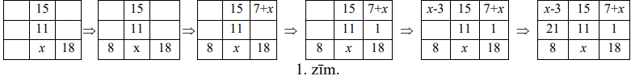
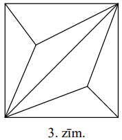
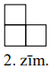

# <lo-sample/> LV.AMO.2011.5.1

Reizināšanas piemērā ciparus aizstāja ar burtiem un ieguva izteiksmi 
$AB \cdot CD=EEE$.

Atjauno sākotnējo reizināšanas piemēru, ja zināms, ka vienādi burti apzīmē 
vienādus ciparus, bet dažādi burti - dažādus ciparus, pie tam ne $A$, ne $C$ 
nav $0$. Atrodi visus iespējamos atrisinājumus!

<small>

* topic:IntegerFactorization
* method:ExhaustiveAlgorithms
* questionType:FindAll
* domain:NT
* subdomain:NumeralSystems
* genre:Cryptarithm

</small>

## Atrisinājums

Ievērosim, ka $EEE=E \cdot 111=E \cdot 3 \cdot 37$. Tātad $E>3$, lai pie tam 
viens no skaitļiem $AB$ vai $CD$ ir $37$ vai $74$. Apskatot visas iespējamās 
$E$ vērtības, iegūstam visus astoņus atrisinājumus:

**$\mathbf{E=4 \Rightarrow AB=12}$ un $\mathbf{CD=37}$ vai $\mathbf{AB=37}$ un 
$\mathbf{CD=12}$;**

$E=5 \Rightarrow B=5$ vai $D=5(=E)$ - neder;

**$\mathbf{E=6 \Rightarrow AB=18}$ un $\mathbf{CD=37}$ vai $\mathbf{AB=37}$ un 
$\mathbf{CD=18}$;**

$E=7 \Rightarrow AB=21$ un $CD=37(D=E)$ vai $AB=37$ un $CD=21(B=E)$ - neder;

**$\mathbf{E=8 \Rightarrow AB=24}$ un $\mathbf{CD=37}$ vai $\mathbf{AB=37}$ un 
$\mathbf{CD=24}$, vai $\mathbf{AB=12}$ un $\mathbf{CD=74}$, vai 
$\mathbf{AB=74}$ un $\mathbf{CD=12;}$**

$E=9 \Rightarrow AB=27$ un $CD=37$ vai $AB=37$ un $CD=27(B=D)$ - neder.

# <lo-sample/> LV.AMO.2011.5.2

Dotās $3 \times 3$ rūtiņu tabulas katrā rūtiņā jāieraksta pa vienam naturālam 
skaitlim tā, lai katrā rindā, katrā kolonnā un katrā diagonālē ierakstīto trīs 
skaitļu summas būtu vienādas. Ir zināmi trīs rūtiņās ierakstītie skaitļi (skat.
1.zīm.). Aizpildi pārējās tabulas rūtiņas!

<small>

* topic:NumTheoryExprVariables
* topic:AlgebraicTransformations
* questionType:FindAll
* domain:Alg
* subdomain:EquationSystems
* genre:MagicConfigurations
* concepts:sum

</small>

## Atrisinājums

Apzīmēsim skaitli, kas atrodas vidējās kolonnas apakšējā rūtiņā ar $x$ (skat. 
1.zīm.). Tad katras rindas, kolonnas un diagonāles skaitļu summas ir $26+x$. 
Tālāk 1.zīm. parādīts, kā pakāpeniski tiek izdarīti secinājumi par katru 
tabulas rūtiņu.

Iegūstam, ka otrajā rindā ierakstīto skaitļu summa ir $33$. Tātad $x=7$ un 
aizpildītā tabula parādīta 2.zīm.

# <lo-sample/> LV.AMO.2011.5.3

Parādi, kā kvadrātu var sadalīt vairākos platleņķa trijstūros!

<small>

* topic:ConstructionsTriangulate
* topic:ConstructionsSmallMovements
* topic:CircleInscribedAngles
* questionType:FindExample
* domain:Geom
* subdomain:CuttingCoversColoring
* concepts:square-Geo,triangle

</small>

## Atrisinājums

Jā, var; skat., piem., 3.zīm.

# <lo-sample/> LV.AMO.2011.5.4

Vai naturālos skaitļus no $1$ līdz $12$, katru izmantojot tieši vienu reizi, 
var uzrakstīt pa apli tādā secībā, ka jebkuru divu blakus esošu skaitļu 
starpība ir

**(A)** $2$ vai $3$;  
**(B)** $3$ vai $4$?

<small>

* topic:TreeTraversalBacktracking
* topic:GraphProblems
* questionType:ProveDisprove
* domain:Comb

</small>

## Atrisinājums

**(A)** Jā, var. Skat., piem., 4.zīm.

**(B)** Nē, nevar. Skaitlim $1$ var būt tikai divi kaimiņi: $4$ un $5$, 
skaitlim $2$ kaimiņi var būt tikai skaitļi $5$ un $6$, bet skaitlim $3$ - 
skaitļi $6$ un $7$. Ņemot vērā šos secinājumus, iegūstam ka 5.zīm. attēloto 
situāciju. Neizvietoti palikuši skaitļi $9,\ 10,\ 11,\ 12$, taču tos šajā aplī 
atbilstoši uzdevuma nosacījumiem izvietot nevar.

# <lo-sample/> LV.AMO.2011.5.5

Kvadrātā ar izmēriem $7 \times 7$ rūtiņas jāizvieto $n$ *"stūrīšus"* (2.zīm. 
attēlotās figūras) tā, lai tajā vairāk nevarētu ievietot nevienu citu šādu 
*"stūrīti"*. (*Stūrīšu* malām jāiet pa rūtiņu malām. *Stūrīši* var arī būt 
pagriezti citādāk.)

Parādi, kā to var izdarīt, ja  
**(A)** $n=9$;  
**(B)** $n=8$.

<small>

* topic:CountingUsingSymmetry
* topic:TreeTraversalBacktracking
* questionType:FindExample
* domain:Geom

</small>

## Atrisinājums

**(A)** skat. 6.zīm.; **(B)** skat. 7.zīm.

# <lo-sample/> LV.AMO.2011.6.1

Vai eksistē tādi naturāli skaitļi $a$ un $b$, kuriem izpildās vienādība

$$a \cdot b \cdot(a+b)=20102011?$$

<small>

* topic:IntegerFactorization
* questionType:ProveDisprove
* domain:NT
* concepts:equation

</small>

## Atrisinājums

**Atbilde:** nē.

Ja $a$ vai $b$ ir pāra skaitlis; ja gan $a$, gan $b$ ir nepāra skaitļi, tad to 
summa $a+b$ ir pāra skaitlis. tātad reizinājums $a \cdot b \cdot(a+b)$ vienmēr 
ir pāra skaitlis, bet $20102011$ nav pāra skaitlis.

# <lo-sample/> LV.AMO.2011.6.2

Sešdesmit pensionāri katru dienu *sociālajā tīklā* sarakstās savā starpā. Katrs
kungs sarakstās ar tieši $17$ dāmām, bet katra kundze sarakstās ar tieši $13$ 
kungiem. Cik starp šiem pensionāriem ir kungu un cik - kundžu?

<small>

* topic:BipartiteGraphs
* questionType:FindAll
* domain:Comb

</small>

## Atrisinājums

Aprēķināsim, cik "sarakstes" pavisam notiek. Ja kungu skaitu apzīmē ar $a$, bet
dāmu skaitu ar $b$, tad ir spēkā sakarības $a+b=60$ un $17a=13b$. Tātad $a$ 
dalās ar $13$. Pārbaudot vērtības $a=13$ (tad $b=17$, bet $a+b=30<60$), 
$a=26$ (tad $b=34$ un $a+b=60$ - der), $a>26$ (tad $b>34$ un $a+b>60$), redzam,
ka visus uzdevuma nosacījumus apmierina tikai $\boldsymbol{a}=26$ (kungi) un 
$\boldsymbol{b}=34$ (dāmas).

# <lo-sample/> LV.AMO.2011.6.3

Kvadrātā ar izmēriem $8 \times 8$ rūtiņas sākotnēji visas rūtiņas ir baltas. 
Kāds mazākais skaits rūtiņu šajā kvadrātā jānokrāso zaļas, lai tajā nevarētu 
atrast nevienu pilnībā baltu taisnstūri ar izmēriem $1 \times 3$ rūtiņas 
(novietotu horizontāli vai vertikāli)?

<small>

* topic:ExhaustionMethod
* questionType:FindOptimal
* domain:Geom

</small>

## Atrisinājums

Kvadrātā ar izmēriem $8 \times 8$ rūtiņas var izvietot $21$ taisnstūri ar 
izmēriem $1 \times 3$ rūtiņas tā, ka tie nepārklājas. (skat. 8.zīm.). Katrā no 
šiem taisnstūriem ir jābūt vismaz vienai zaļai rūtiņai. Tātad ir nepieciešams 
nokrāsot vismaz $21$ rūtiņu.

Parādīsim, ka ar $21$ rūtiņu pietiek. Katrā rūtiņā ierakstīsim skaitli $1,\ 2$ 
vai $3$ tā, ka katrā $1 \times 3$ rūtiņu grupā būtu ierakstīti visi skaitļi 
(skat. 9.zīm.). Nokrāsojot zaļas visas rūtiņas, kurās ierakstīts $1$ (tādu ir 
$21$), iegūsim situāciju, ka nebūs iespējams izvēlēties neaizkrāsotu 
$1 \times 3$ rūtiņu grupu.

# <lo-sample/> LV.AMO.2011.6.4

3.zīmējumā dota $3 \times 3$ rūtiņu tabula, kurā ierakstīti veseli skaitļi. 
Vienā gājienā atļauts izvēlēties divas dažādas tabulas rūtiņas apzīmēsim tajās 
ierakstītos skaitļus attiecīgi ar $a$ un $b$, nodzēst šos divus skaitļus un to 
vietā ierakstīt: $a$ vietā - skaitli $5 \cdot a-2 \cdot b$, bet $b$ vietā - 
skaitli $5 \cdot b-2 \cdot a$.

Vai, vairākkārt veicot šādus gājienus, var iegūt tabulu, kāda attēlota 4.zīm.?

<small>

* topic:InvariantRemainder
* questionType:ProveDisprove
* domain:Alg

</small>

## Atrisinājums

Aplūkosim, kā mainās tabulas skaitļu kopsumma pēc viena gājiena izpildes. Ja 
pirms gājiena visu skaitļu summa bija $S$, tad pēc gājiena tā ir 
$S-a-b+(5a-2b)+(5b-2a)=S+2(a+b)$. Tātad summa ir izmainījusies par pāra 
skaitli. Tā kā sākumā tabulā visu skaitļu kopsumma ir pāra skaitlis $4$, tad tā
pēc vairāku gājienu izpildes nevar kļūt vienāda ar nepāra skaitli $15$.

# <lo-sample/> LV.AMO.2011.6.5

Betai bija $50$ konfektes, bet Almai un Danai bija vienāds konfekšu skaits. 
Beta pazaudēja vienu konfekti un noskuma. Almai kļuva Betas žēl, un viņa atdeva
māsai pusi no savām konfektēm. Beta nomierinājās un nolēma, ka viņai tagad 
konfekšu ir par daudz un atdeva pusi no savām Danai. Arī Dana izlēma padalīties
ar Almu un atdeva pusi no savām konfektēm Almai. Tagad Almai un Betai ir 
vienāds konfekšu skaits. Cik konfekšu sākumā bija katrai no māsām?

<small>

* topic:AlgebraicTransformations
* questionType:FindAll
* domain:Alg

</small>

## Atrisinājums

**Atbilde:** Almai un Danai sākuma bija pa $14$ konfektēm, Betai $50$.

Pieņemsim, ka Almai un Danai sākumā bija $a$ konfektes. Tabulā apkoposim 
informāciju par konfekšu skaita izmaiņām.

|  | Almai | Betai | Danai |
| :--- | :--- | :--- | :--- |
| Beta pazaudēja $1$ konfekti | $a$ | $49$ | $a$ |
| Alma atdeva pusi Betai | $\frac{a}{2}$ | $49+\frac{a}{2}=\frac{98+a}{2}$ | $a$ |
| Beta atdeva pusi Danai | $\frac{a}{2}$ | $\frac{98+a}{4}$ | $a+\frac{98+a}{4}=\frac{5a+98}{4}$ |
| Dana atdeva pusi Almai | $\frac{a}{2}+\frac{5a+98}{8}=\frac{9a+98}{8}$ | $\frac{98+a}{4}$ | $\frac{5a+98}{8}$ |

Tātad 
$\frac{9 a+98}{8}=\frac{98+a}{4} \Rightarrow 9a+98=196+2a \Rightarrow 7a=98 \Rightarrow a=14$.

# <lo-sample/> LV.AMO.2011.7.1

Uz tāfeles augošā secībā uzrakstīti seši dažādi pirmskaitļi, kas nepārsniedz 
$100$. Par tiem zināms, ka

- visu skaitļu pēdējie cipari ir atšķirīgi;
- sestais skaitlis ir par $14$ lielāks nekā trešais;
- ceturtā skaitļa pirmais cipars ir vienāds ar otrā skaitļa pēdējo ciparu;
- piektā un sestā skaitļa pirmie cipari ir vienādi.

Atrodi visus šos skaitļus!

<small>

* topic:PrimesDistribution
* questionType:FindAll
* domain:NT
* concepts:primes

</small>

## Atrisinājums

Pirmskaitļi var beigties ar ciparu $1,\ 2$ (tikai skaitlis $2$), $3,\ 5$ (tikai
skaitlis $5$), $7$ un $9$. Tā kā ir uzrakstīti seši skaitļi, tad starp šiem 
skaitļiem ir jāparādās visiem pēdējiem cipariem. Tas nozīmē, ka virknē ir 
skaitļi $2$ un $5$.

Tā kā mazākie pirmskaitļi ir $2, 3$ un $5$, tad mazākie skaitļi, kas uzrakstīti
uz tāfeles ir vai nu **I)** $2,\ 3$ un $5$ vai **II**) $2$ un $5$.

**I)** sestais skaitlis ir $5+14=19$. Bet tad ceturtais skaitlis nevar sākties 
ar $3$.

**II)** ceturtais skaitlis sākas ar $5$. Pirmskaitļi, kas sākas ar $5$, ir $53$
un $59$. Ja ceturtais skaitlis ir $53$, tad virkne izskatās šādi: 
$2,\ 5,\ x,\ 53,\ y,\ x+14$. Vienīgā derīgā $x$ vērtība ir $47$. Bet tad 
$x+14=61$ un $y$ (piektais virknes loceklis) nevar sākties ar $6$.

Ja ceturtais skaitlis ir $59$, tad virkne izskatās šādi: 
$2,\ 5,\ x,\ 59,\ y,\ x+14.\ x=47$ neder iepriekšminētā iemesla dēļ. Atliek 
$x=53$. Iegūstam: $2,\ 5,\ 53,\ 59,\ y,\ 67$. Vienīgā iespējamā $y$ vērtība ir 
$61$ un visa virkne: $\mathbf{2,\ 5,\ 53,\ 59,\ 61,\ 67}$.

## Atrisinājums

No pirmās īpašības seko, ka jābūt $p_1=2$,$p_2=5$ (citādi nevar dabūt sešus dažādus 
pēdējos ciparus pirmskaitļiem). Vēl atsevišķi jāpamato, ka $p_2 \neq 3$, jo 
sestais skaitlis nevar būt $p_2 + 14 = 17$. 

No otrās un ceturtās īpašības seko, ka $p_3 = 53$, $p_6 = 67$. 

No trešās īpašības seko, ka $p_4=59$.

# <lo-sample/> LV.AMO.2011.7.2

No pilsētas $A$ uz pilsētu $B$ vienlaicīgi izbrauca zaļa un sarkana automašīna.
Sarkanā automašīna visu ceļu veica ar pastāvīgu ātrumu. Zaļā automašīna tieši 
pusi ceļa veica ar pastāvīgu ātrumu $30~\mathrm{km/h}$. Vai, otro ceļa pusi 
veicot ar lielāku ātrumu, zaļā automašīna var panākt sarkano automašīnu un 
pilsētā $B$ ierasties vienlaicīgi ar to, ja sarkanās automašīnas ātrums bija
**(A)** $40~\mathrm{km/h}$, **(B)** $60~\mathrm{km/h}$?

<small>

* questionType:ProveDisprove
* domain:Alg

</small>

## Atrisinājums

**(A)** Var. Ar $2s$ apzīmēsim attālumu starp pilsētām, ar $t_{1}$ - laiku, 
kādā zaļā automašīna veica ceļa pirmo pusi, ar $t_{2}$ - laiku, kādā zaļā 
automašīna veica ceļa otro pusi.

Tad $\frac{s}{t_{1}}=30~\mathrm{km/h}$ jeb 
$s=30t_{1}; \frac{2 s}{t_{1}+t_{2}}=40$ jeb $2s=40t_{1}+40t_{2}$, t.i., 
$s=20t_{1}+20t_{2}$.

Tātad $30t_{1}=20t_{1}+20t_{2}$ un $t_{2}=\frac{1}{2} t_{1}$, tāpēc 
$\frac{s}{t_{2}}=2 \cdot \frac{s}{t_{1}}=2 \cdot 30=60~\mathrm{km/h}$

**(B)** Nevar. Brīdī, kad zaļā automašīna ir veikusi pusi ceļa, sarkanā 
automašīna jau ir veikusi visu ceļu un atrodas pilsētā $B$. Tātad zaļajai 
automašīnai ceļa otrā puse būtu jāveic momentāni ($0$ stundās), kas nav 
iespējams.

# <lo-sample/> LV.AMO.2011.7.3

Atrodi naturālu skaitli, kuru, dalot ar $2010$, atlikumā iegūst $13$, bet, 
dalot ar $2011$, atlikumā iegūst $3$.

<small>

* topic:ArithmeticSeriesDivisibility
* topic:ChineseRemainderTheorem
* questionType:FindExample
* domain:NT
* concepts:remainder

</small>

## Atrisinājums

Tāds skaitlis ir $2010 \cdot 10+13=2011 \cdot 10+3=20113$.

# <lo-sample/> LV.AMO.2011.7.4

Kvadrāts sadalīts piecos taisnstūros tā, ka šo taisnstūru malu garumi 
centimetros ir visi naturālie skaitļi no $1$ līdz $10$. Parādi vienu piemēru, 
kā to var izdarīt!

<small>

* concepts:square-Geo,rectangle
* questionType:FindExample
* domain:Geom

</small>

## Atrisinājums

Kvadrāta malas garumam jābūt $11$ vai $13$. Piemērus skat. 10. un 11.zīm.

# <lo-sample/> LV.AMO.2011.7.5

Taisne nokrāsota $10$ dažādās krāsās. Pierādi, ka uz tās var atrast divus 
vienas krāsas punktus, starp kuriem attālums centimetros ir vesels skaitlis.

<small>

* concepts:line,point,distance,integer-numbers
* questionType:Prove
* method:PigeonholePrincipleBasic
* domain:Geom

</small>

## Atrisinājums

Izvēlamies $11$ punktus tā, lai attālumi starp katriem diviem no tiem būtu 
veseli skaitļi. Saskaņā ar Dirihlē principu vismaz $2$ no tiem ir vienā krāsā, 
tie ir meklētie punkti.

# <lo-sample/> LV.AMO.2011.8.1

Starp skaitļiem

$$8\ 3\ 5\ 2,$$

nemainot to secību, ievieto aritmētisko darbību zīmes ("+", "-", " $\cdot$ ", 
":") un iekavas tā, lai iegūtās izteiksmes vērtība būtu  
**(A)** $15$,  
**(B)** $16$.

<small>

* topic:AlgorithmsOnSyntaxTrees
* questionType:FindExample
* domain:Alg
* seeAlso:LV.AMO.2010.8.1

</small>

## Atrisinājums

**(A)** Piem., $8 - 3 + 5 \ast 2 = 8 - (3 - 5 \ast 2) = 15$

**(B)** Piem., $8:(3-5:2)=16$

# <lo-sample/> LV.AMO.2011.8.2

Kvadrāta iekšpusē izvēlēts patvaļīgs punkts $M$, bet $K,\ L,\ P,\ R$ ir 
kvadrāta malu viduspunkti. Pierādi, ka četrstūris, ko veido nogriežņu 
$MK,\ ML,\ MP$ un $MR$ viduspunkti, ir kvadrāts.

<small>

* questionType:Prove
* domain:Geom

</small>

## Atrisinājums

No viduslīniju īpašības trijstūros $MZY$ un $BCD$ seko 
$ZY=\frac{1}{2} PL=\frac{1}{2}\left(\frac{1}{2} BD\right)=\frac{1}{4} BD$ 
(skat. 12.zīm.), līdzīgi $TX=\frac{1}{4} BD=ZY$, pie tam $ZY \parallel TX$. 
Līdzīgi pierāda, ka $XY \parallel ZT$ un $TZ=XY=\frac{1}{4} AC$. Bet $AC=BD$, 
tātad $TZ=XY=ZY=TX$ un $TXYZ$ ir rombs. Tā kā $BD \perp AC$ un 
$TX \parallel BD,\ XY \parallel C$, tad $TX \perp XY$ un $TXYZ$ ir kvadrāts, 
k.b.j.

# <lo-sample/> LV.AMO.2011.8.3

Kuba šķautņu viduspunktos ierakstīti naturālie skaitļi no $1$ līdz $12$, katrs 
tieši vienu reizi, tā, ka katrā skaldnē ierakstīto četru skaitļu summas būtu 
vienādas. Nosaki visas iespējamās šo summu vērtības.

<small>

* questionType:FindAll
* domain:Alg

</small>

## Atrisinājums

Apzīmēsim ierakstos skaitļus kā parādīts $13$. a) zīm. Tad

$$\begin{aligned}
& S=a+b+c+d \\
& S=a+e+i+f \\
& S=b+g+j+f \\
& S=c+g+k+h \\
& S=d+h+l+e \\
& S=i+j+k+l
\end{aligned}
$$

Saskaitot šīs vienādības, iegūstam

$6S=2(a+b+c+d+e+f+g+h+i+j+k+l)=2 \cdot \frac{(1+12) \cdot 12}{2}=12 \cdot 13$
un $S=26$

13. b) zīm. parādīts piemērs, kā to realizēt.

# <lo-sample/> LV.AMO.2011.8.4

Leonards izvēlējās patvaļīgu trīsciparu skaitli, pareizināja to ar $2$ un tam 
galā pierakstīja sākotnējo skaitli. Vai viņa jauniegūtais skaitlis noteikti 
dalās ar **(A)** $17$; **(B)** $23$?

<small>

* topic:NotationShift
* topic:CanonicalFactorization
* questionType:ProveDisprove
* domain:NT
* concepts:divisibility

</small>

## Atrisinājums

**(A)** Nē, piemēram, ja Leonards izvēlējās skaitli $444$, tad viņš ieguva 
$888444$, bet tas nedalās ar $17$ ($888444:17=52261$ atlikumā $7$).

Vispār jebkurš trīsciparu skaitlis, kas nedalās ar $17$, der kā pretpiemērs.

**(B)** Jā. Apzīmēsim sākotnējo skaitli ar $x$. Skaitlim $2x$ pierakstīt galā 
$x$ ir tas pats, kas skaitlim $2x$ pierakstīt galā trīs nulles un tad tam 
pieskaitīt $x$. Bet trīs nulles pierakstīt ir tas pats, kas pareizināt ar 
$1000$. Tātad Leonarda veikto operāciju var uzrakstīt kā:

$$2x \cdot 1000+x$$

Tātad jauniegūtais skaitlis ir $2x \cdot 1000+x=2001x$. Skaitlis $2001$ dalās 
ar $23\ (2001:23=87)$, tātad arī jauniegūtais skaitlis $2001x$ noteikti dalās 
ar $23$.

## Atrisinājums

**(A)** Ja 3-ciparu skaitlis ir $\overline{abc}$, tad jaunais ir 
$2001\overline{abc}$ dalās ar $23$. Bet $17 \nmid 2001$. 

# <lo-sample/> LV.AMO.2011.8.5

Jānis un Anna spēlē šādu spēli. Uz tāfeles ir uzrakstīts naturāls skaitlis. 
Spēlētāji pēc kārtas veic gājienu: no uzrakstītā skaitļa atnem kādu šī skaitļa 
ciparu (izņemot $0$), nodzēš uz tāfeles esošo skaitli un tā vietā uzraksta 
iegūto starpību. Uzvar tas, kurš pēc sava gājiena iegūst nulli.

Sākumā ir uzrakstīts skaitlis $2011$, pirmo gājienu izdara Anna. Kurš no 
spēlētājiem, pareizi spēlējot, uzvarēs? Apraksti, kā uzvarētājam jārīkojas!

<small>

* topic:GameInvariant
* questionType:ProveDisprove,Algorithm
* domain:NT

</small>

## Ieteikums
 
Pēc katra Annas gājiena skaitlim jādalās ar $10$. 

## Atrisinājums

Uzvar pirmais spēlētājs, katrā gājienā atņemot no skaitļa tā pēdējo ciparu, 
tādējādi pēc sava gājiena iegūstot skaitli, kura pēdējais cipars ir $0$. Tā kā 
otrais spēlētājs nedrīkst atņemt $0$, tad pēc viņa gājiena noteikti paliek 
skaitlis, kura pēdējais cipars nav $0$. Tāpēc pirmais spēlētājs vienmēr varēs 
izdarīt gājienu. Tā kā tiek iegūti tikai naturāli skaitļi un spēles gaitā tie 
samazinās, kādreiz tiks iegūts arī skaitlis $0$. Tā kā tā pēdējais cipars ir 
$0$, tas tiks iegūts pēc pirmā spēlētāja gājiena.

# <lo-sample/> LV.AMO.2011.9.1

Atrodi visus naturālu skaitļu pārus $(x, y)$ tādus, ka $x \neq y$ un

$$\frac{1}{x^{2}+24}+\frac{1}{y^{2}+24}=\frac{2}{xy+24}$$

<small>

* concepts:natural-numbers,pair
* questionType:FindAll
* domain:NT

</small>

## Atrisinājums

Vienādojumu var pārveidot kā:

$$\frac{1}{x^{2}+24}-\frac{1}{xy+24}=\frac{1}{xy+24}-\frac{1}{y^{2}+24}$$

Abās pusēs vienādojot saucējus iegūst:

$\frac{xy+24-x^{2}-24}{\left(x^{2}+24\right)(xy+24)}=\frac{y^{2}+24-xy-24}{\left(y^{2}+24\right)(xy+24)}$ jeb  
$\frac{x(y-x)}{\left(x^{2}+24\right)(xy+24)}=\frac{y(y-x)}{\left(y^{2}+24\right)(xy+24)}$

Izdalot abas puses ar $(y-x)$ (to var darīt, jo $x \neq y$ ) un pareizinot ar 
$(xy+24)\left(x^{2}+24\right)\left(y^{2}+24\right)$ iegūst 
$x\left(y^{2}+24\right)=y\left(x^{2}+24\right)$

Pārnesot visu uz vienu pusi iegūst $xy^{2}-x^{2}y+24x-24y=0$

Sagrupējot iegūst

$xy(y-x)-24(y-x)=0$ jeb $(xy-24)(y-x)=0$

Tā kā $x \neq y$, tad $xy=24$. Šim vienādojumam naturālos skaitļos ir $8$ 
atrisinājumi: 
$x=1,\ y=24;\ x=2,\ y=12; x=3,\ y=8;\ x=4,\ y=6;\ x=6,\ y=4;\ x=8,\ y=3;\ x=12,\ y=2;\ x=24,\ y=1$.

Pārbaude (simetrijas pēc var pārbaudīt tikai pirmos četrus) liecina, ka visi 
der.

# <lo-sample/> LV.AMO.2011.9.2

Trijstūrī $ABC\ \sphericalangle ABC=90^{\circ}$, bet punkts $P$ atrodas uz 
malas $AB.\ M$ un $N$ ir attiecīgi $AC$ un $PC$ viduspunkti. Pierādi, ka 
$\sphericalangle BAC=\sphericalangle BMN$.

<small>

* questionType:Prove
* domain:Geom

</small>

## Atrisinājums

Tā kā $\triangle ABC$ un $\triangle PBC$ ir taisnleņķa, $AM=BM=CM$ un 
$PN=BN=CN$ (skat. 14.zīm.). Tāpēc $\Delta MBN=\triangle MCN$ (pazīme $mmm$) un 
$\sphericalangle BMN=\sphericalangle CMN$, jo vienādos trijstūros pret 
vienādām malām ir vienādi leņķi. $MN$ ir $\triangle APC$ viduslīnija, tāpēc 
$AP \parallel MN$ un $\sphericalangle CMN=\sphericalangle CAP$ kā kāpšļu leņķi.
Tātad, 
$\sphericalangle BMN=\sphericalangle CMN=\sphericalangle CAP=\sphericalangle BAC$,
k.b.j.

# <lo-sample/> LV.AMO.2011.9.3

Dots vienādojums $\# x^2 − \# x + \# = 0$. Divi rūķīši spēlē spēli - pirmais nosauc
trīs dažādus skaitļus, bet otrais tos kaut kādā secībā saliek "$\#$" vietās. Vai 
pirmais rūķītis vienmēr var panākt, lai vienādojumam būtu vismaz viena 
racionāla sakne?

<small>

* concepts:equation
* questionType:ProveDisprove
* domain:Alg

</small>

## Atrisinājums

**Atbilde:** Jā, var.

Aplūkosim vienādojumu $ax^{2}-bx+c=0$. Ievietojot $x=-1$ iegūst $a+b+c=0$. 
Tātad ja $a+b+c=0$, tad $x=-1$ ir šī vienādojuma sakne. Ja pirmais rūķītis 
izvēlas tādus $3$ skaitļus, kuru summa ir $0$, tad, lai kā otrais rūķītis tos 
saliktu "\#" vietās, vienādojumam noteikti būs vismaz viena racionāla sakne 
$x=-1$.

# <lo-sample/> LV.AMO.2011.9.4

Kāds lielākais skaits pēc kārtas sekojošu naturālu skaitļu var būt ar īpašību, 
ka katrs no tiem ir izsakāms kā divu naturālu skaitļu kvadrātu starpība?

<small>

* concepts:square-Geo,rectangle
* questionType:FindOptimal
* domain:NT

</small>

## Atrisinājums

$x^{2}-y^{2}=N$. Ja $N$-pāru, tad $(x-y)$ un $(x+y)$ ir vienāda paritāte un $N$
jādalās ar $4$. Tātad, lielākais pēc kārtas sekojošu šādu skaitļu skaits ir 
trīs: $4k-1,\ 4k,\ 4k+1$.

Piemēram, $11=6^{2}-5^{2},\ 12=4^{2}-2^{2}$ un $13=7^{2}-6^{2}$.

# <lo-sample/> LV.AMO.2011.9.5

Kvadrāta ar izmēriem $8 \times 8$ rūtiņas apakšējā labajā stūra rūtiņā atrodas 
figūriņa sienāzis. 5.zīmējumā attēloti sienāža iespējamie gājieni. No jebkuras 
rūtiņas, kurā sienāzis kādā brīdī atrodas, viņš var pārvietoties tādā pašā 
virzienā par tādu pašu attālumu kā no $A$ uz jebkuru rūtiņu $X$ pie nosacījuma,
ka viņš paliek kvadrāta iekšpusē

Kurās no pārējām trijām kvadrāta stūra rūtiņām sienāzis var nonākt un kurās - 
nevar, izpildot tikai atļautos gājienus?

<small>

* questionType:FindAll
* domain:Geom,Comb

</small>

## Atrisinājums

Izkrāsosim dotajā taisnstūrī katru trešo diagonāli kā parādīts 15.zīmējumā.

Ievērosim, ka sienāzis, izpildot atļautos gājienus, no melnas rūtiņas var 
nonākt **tikai** melnā rūtiņā. Tātad no rūtiņas $\mathbf{A}$ viņš nekad 
nenonāks rūtiņās $\mathbf{B}$ un $\mathbf{D}$. Savukārt rūtiņā $\mathbf{C}$ var
nokļūt, ejot uz augšu pa diagonāli $AC$.

# <lo-sample/> LV.AMO.2011.10.1

Cik dažādos veidos skaitli $2011$ var izteikt kā vismaz divu pēc kārtas 
sekojošu naturālu skaitļu summu? Saskaitāmo secība nav svarīga.

<small>

* seeAlso:LV.AMO.2010.10.4
* concepts:sum,consecutive-numbers
* questionType:FindCount
* domain:Alg

</small>

## Atrisinājums

Pēc kārtas sekojoši naturāli skaitļi veido aritmētisku progresiju ar diferenci 
$1$. Tās $n$ pēc kārtas ņemtu locekļu $a,\ a+1,\ \ldots,\ a+n-1$ summa ir 
$\frac{(a+a+n-1) \cdot n}{2}=\frac{(2 a+n-1) \cdot n}{2}$. Tātad nepieciešams 
atrast visas tādas $n$ vērtības, kurām $n>1$ un 
$\frac{(2a+n-1) \cdot n}{2}=2011$ jeb $(2a+n-1) \cdot n=4022$. Ievērosim, ka 
reizinātājs $2a+n+1$ vienmēr ir lielāks par otro reizinātāju $n$ un tiem ir 
atšķirīga paritāte.

Sadalīsim $4022$ pirmreizinātājos: $4022=2 \cdot 2011$. N̦emot vērā augstāk 
minētos secinājumus, iespējams tikai gadījums $n=2$ un $2a+n-1=2011$, tātad 
virknes pirmais loceklis $a=1005$. Tātad $2011$ kā vairāku pēc kārtas sekojošu 
naturālu skaitļu summu var izteikt vienā vienīgā veidā.

# <lo-sample/> LV.AMO.2011.10.2

Nogriežņa $AB$ garums ir $10~\mathrm{cm}$. Uz tā kā uz hipotenūzas konstruēti 
divi taisnleņķa trijstūri $ABC$ un $ABD$ tā, ka $C$ un $D$ atrodas dažādās 
pusēs no taisnes $AB$. $CD$ ir leņķa $ACB$ bisektrise. Aprēķini trijstūra $ABD$
laukumu!

<small>

* questionType:FindAll
* domain:Geom

</small>

## Atrisinājums

Tā kā $ABC$ un $ABD$ ir taisnleņķa trīsstūri, tad ap četrstūri $ACBD$ var 
apvilkt riņķa līniju (tās diametrs ir $AB$). Tā kā $CD$ ir $\sphericalangle ACB$
bisektrise, tad $\sphericalangle ACD$ un $\sphericalangle BCD$ ir divi vienādi 
ievilkti leņķi. Tātad $AD=BD$ un $\triangle ABD$ ir vienādsānu taisnleņķa 
trīsstūris, kura hipotenūzas garums ir $10~\mathrm{cm}^{2}$. $AB=AD=5 \sqrt{2}$
un $S_{ABD}=\frac{5 \sqrt{2} \cdot 5 \sqrt{2}}{2}=25~\mathrm{cm}^{2}$.

# <lo-sample/> LV.AMO.2011.10.3

Atrisini doto vienādojumu sistēmu reālos skaitļos!

$$\left\{\begin{array}{l}
(x-y)^{2}=(z-2)^{2} \\
(y-z)^{2}=(x-4)^{2} \\
(z-x)^{2}=(y-6)^{2}
\end{array}\right.$$

<small>

* questionType:FindAll
* domain:Alg

</small>

## Atrisinājums

Vienādojumam $a^{2}=b^{2}$ vispārīgā gadījumā iespējami divi atrisinājumi: 
$a=b$ un $a=-b$. Aplūko pirmo vienādojumu un iztirzā abus iespējamos variantus:

1)

$$\begin{equation}
x-y=z-2 \Rightarrow z-x=2-y \tag{*}
\end{equation}$$

Ievietojot (*) trešajā vienādojumā, iegūstam vienādojumu

$(2-y)^{2}=(y-6)^{2}$,

kura vienīgais atrisinājums ir $y=4$.

Tad no (*) iegūstam $z=x-2$ un $y-z=6-x$. Ievietojot to otrajā vienādojumā, 
iegūstam vienādojumu

$(6-x)^{2}=(x-4)^{2}$,

kura vienīgais atrisinājums ir $x=5$, tātad $z=3$.

2)

$$\begin{equation}
x-y=2-z \Rightarrow y-z=x-2 \tag{**}
\end{equation}$$

Ievietojot (**) otrajā vienādojumā, iegūstam vienādojumu

$(x-2)^{2}=(x-4)^{2}$,

kura vienīgais atrisinājums ir $x=3$.

Tad no (**) iegūstam $y=z+1$ un $y-6=z-5$. Ievietojot to trešajā vienādojumā, 
iegūstam vienādojumu

$(z-3)^{2}=(z-5)^{2}$,

kura vienīgais atrisinājums ir $z=4$, tātad $y=5$.

Tātad vienādojumam ir divi atrisinājumi:

$$\left\{\begin{array} {l} 
{x=5} \\
{y=4} \\
{z=3}
\end{array}\right. \text { un } \left\{\begin{array}{l}
x=3 \\
y=5 \\
z=4
\end{array}\right.$$

Pārbaude parāda, ka abi atrisinājumi der.

# <lo-sample/> LV.AMO.2011.10.4

Riņķī ievilkti regulārs $9$-stūris un regulārs $10$-stūris. To virsotnes sadala
riņķa līniju $19$ lokos. Pierādīt, ka ir loks, kurš nepārsniedz $2^{\circ}$.

<small>

* questionType:Prove
* domain:Geom

</small>

## Atrisinājums

Būs divas tādas desmitstūra virsotnes $B_{j}$ un $B_{j+1}$, kas pieder lokam 
$A_{i}A_{i+1}$, ko veido divas deviņstūra virsotnes (skat. 16.zīm.). 
Deviņstūra virsotnes sadala riņķa līniju $40^{\circ}$ lielos lokos, bet 
$10$-stūra virsotnes $36^{\circ}$ lielos lokos, pie tam visas deviņstūra un 
$10$-stūra virsotnes ir dažādas (jo riņķa līnija sadalīta $19$ lokos). Tātad 
$\cup A_{i}B_{j}+\cup B_{j+1}A_{i+1}=4^{\circ}$, no kurienes seko ka vismaz 
viens no šiem lokiem nepārsniedz $2^{\circ}$.

# <lo-sample/> LV.AMO.2011.10.5

Tornis ir salikts no vienādiem kubiņiem, kur katra kubiņa izmērs ir 
$1 \times 1 \times 1$: apakšējā slānī ir $16$ kubiņi, otrajā slānī ir $9$ 
kubiņi, trešajā slānī $4$ kubiņi un augšā - viens kubiņš (skat. 6.zīm.)

Vai šo *torni* var salikt no

**(A)** *klucīšiem* ar izmēru $1 \times 1 \times 2$ (skat. 7.zīm.)?  
**(B)** *stūrīšiem*, ko veido $3$ kubiņi (skat. 8.zīm.)?

<small>

* questionType:ProveDisprove,ProveDisprove
* domain:Geom

</small>

## Atrisinājums

**(A)** nē, nav iespējams. Izkrāsojot vienības kubiņus pamīšu melnā un baltā 
krāsā (tā, ka kubiņi, kam ir kopīga skaldne, nokrāsoti dažādās krāsās), 
augšējo kubiņu - melnu, iegūstam, ka melnie kubiņi ir $16$, bet baltie - $14$. 
Taču *klucītis* satur tieši vienu melnu un $1$ baltu kubiņu - pretruna.

**(B)** Skat., piem., 17.zīm. (zīmējumā pa slāņiem attēlots, kurš vienības 
kubiņš pieder kuram *stūrītim*.

# <lo-sample/> LV.AMO.2011.11.1

Dotas trīs aritmētiskas progresijas:

(1) $1,\ 15,\ 29,\ 43,\ 57,\ 71,\ \ldots$

(2) $2,\ 17,\ 32,\ 47,\ 62,\ 77,\ \ldots$

(3) $3,\ 19,\ 35,\ 51,\ 67,\ 83,\ \ldots$

**(A)** Atrodi mazāko skaitli, kas pieder visām trim dotajām virknēm!

**(B)** Pierādi, ka ir bezgalīgi daudz tādu skaitļu, kas pieder visām trim 
dotajām virknēm!

<small>

* seeAlso:LV.AMO.2010.11.1
* concepts:arithmetic-progression,sequence
* questionType:FindOptimal,Prove
* domain:NT

</small>

## Atrisinājums

Uzrakstīsim katrai virknei vispārīgā elementa formulu:

(1) $1+14k$,

(2) $2+15l$

(3) $3+16m$.

Atradīsim skaitļus, kas pieder virknēm (1) un (2):

$1+14k=2+15l$

$14k=1+(14l+l) \Rightarrow l+1$ jādalās ar $14$.

Mazākās derīgās vērtības ir $l=13,\ k=14$. Tātad pirmajām divām virknēm pieder 
skaitļi, kas izsakāmi formā

$197+210u\ (210=MKD(14,15))$.

Visām trim virknēm piederēs skaitļi, kuriem

$197+210u=3+16m$ jeb

$8m=97+105u=(8 \cdot 12+1)+(8 \cdot 13+1)u$.

Tātad $1+u$ jādalās ar $8$. Mazākā derīgā $u$ vērtība ir $7$.

Tātad mazākais skaitlis, kas pieder visām trim virknēm ir $1667$.

Vispārīgā formā visām virknēm kopīgie locekļi ir izsakāmi formā
$1667+1680p\ (1680=MKD(14,15,16))$. Šādu skaitļu ir bezgalīgi daudz.

*Piezīme.* Uzdevumu var risināt arī asprātīgāk, pamanot, ka "iepriekšējais" 
(jeb $0$-tais) loceklis visās virknēs būtu vienāds ar $-13$. Atliek atrast visu
virkņu diferenču mazāko kopīgo dalāmo un pirmo locekli.

# <lo-sample/> LV.AMO.2011.11.2

Ap kvadrātu $ABCD$ ir apvilkta riņķa līnija, uz kuras mazākā loka $AB$ ir 
izvēlēts patvaļīgs punkts $P$. $PC$ krusto $AB$ un $BD$ attiecīgi punktos $M$ 
un $X$; $PD$ krusto $AB$ un $AC$ attiecīgi punktos $N$ un $Y$. $MY$ un $NX$ 
krustojas punktā $Q;\ AC$ un $BD$ krustojas punktā $O$.

Pierādīt, ka $QXOY$ ir taisnstūris.

<small>

* questionType:Prove
* domain:Geom

</small>

## Atrisinājums

$\sphericalangle CPD=\sphericalangle CAD$, jo tie balstās uz viena loka (skat. 
18.zīm.). Savukārt $\sphericalangle CAD=\sphericalangle BAC=45^{\circ}$, tāpēc 
$\sphericalangle CPD=\sphericalangle BAC$ vai arī 
$\sphericalangle MPY=\sphericalangle MAY$. Tāpēc ap $A, P, M$ un $Y$ var 
apvilkt riņķa līniju (1). $90^{\circ}=\sphericalangle APC=\sphericalangle ABC$,
jo šie leņķi arī balstās uz viena loka. No (1) seko, ka 
$\sphericalangle AYM=180^{\circ}-\sphericalangle APM=180^{\circ}-\sphericalangle APC=90^{\circ}$.
Tā kā $\sphericalangle AOB=90^{\circ}$, tad $MY \parallel BO$. Līdzīgi pierāda,
ka $NX \parallel AO$. Tad $QXOY$ ir paralelograms ar vienu leņķi $90^{\circ}$, 
t.i., taisnstūris, k.b.j.

# <lo-sample/> LV.AMO.2011.11.3

Cik veidos taisnstūri ar izmēriem $3 \times 12$ rūtiņas var sadalīt 
taisnstūros ar izmēriem $1 \times 3$ rūtiņas? (Dalījuma līnijām jāiet pa 
rūtiņu malām, taisnstūri var būt novietoti gan horizontāli, gan vertikāli.)

<small>

* questionType:FindCount
* domain:Geom,Comb

</small>

## Atrisinājums

Ar $f_{n}$ apzīmēsim cik veidos taisnstūri $3 \times n$ var sadalīt taisnstūros
$1 \times 3$.

$f_{1}=1, \quad f_{2}=1, \quad f_{3}=2$.

Apskatām taisnstūri ar izmēriem $3 \times n$. Pirmo taisnstūrīti $1 \times 3$ 
varam novietot a) "vertikāli" (skat. 19. a) zīm.) vai b) "horizontāli" 
(skat. 19. b) zīm.). a) gadījumā neaizpildīts paliek taisnstūris 
$3 \times(n-1)$, ko var aizpildīt $f_{n-1}$ veidos. b) gadījumā vēl divi 
taisnstūriši $1 \times 3$ jānovieto "horizontāli" (nevienu "vertikāli" 
ievietot nav iespējams), tad neaizpildīts paliks taisnstūris $3 \times(n-3)$, 
ko var aizpildīt $f_{n-3}$ veidos.

Tātad $f_{n}=f_{n-1}+f_{n-3}$. Izmantojot šo rekursīvo sakarību viegli 
aprēķināt, ka $f_{12}=70$.

# <lo-sample/> LV.AMO.2011.11.4

Atrisināt vienādojumu:

$$\begin{aligned}
& \frac{1}{\sqrt{x-2011}+\sqrt{x-2009}}+\frac{1}{\sqrt{x-2009}+\sqrt{x-2007}}+\ldots \\
& +\frac{1}{\sqrt{x-1}+\sqrt{x+1}}+\ldots+\frac{1}{\sqrt{x+2009}+\sqrt{x+2011}}=\frac{1}{\sqrt{2}}
\end{aligned}$$

<small>

* questionType:FindAll
* domain:Alg

</small>

## Atrisinājums

Pārveidojam doto vienādojumu, pareizinot ar saucējam saistīto izteiksmi:

$$\begin{aligned}
& \frac{\sqrt{x-2011}-\sqrt{x-2009}}{-2}+\frac{\sqrt{x-2009}-\sqrt{x-2007}}{-2}+\ldots \\
& +\frac{\sqrt{x-1}-\sqrt{x+1}}{-2}+\ldots+\frac{\sqrt{x+209}-\sqrt{x+2011}}{-2}=\frac{1}{\sqrt{2}}
\end{aligned}$$

Pareizinot abas puses ar $2$ un saīsinot vienādos locekļus:

$$\begin{aligned}
& \sqrt{x+2011}-\sqrt{x-2011}=\sqrt{2} \\
& \sqrt{x+2011}=\sqrt{x-2011}+\sqrt{2} \\
& x+2011=x-2011+2 \sqrt{2(x-2011)}+2 \\
& 4020=2 \sqrt{2(x-2011)} \\
& 2010^{2}=2(x-2011) \\
& x=\frac{2010^{2}}{2}+2011=2010 \cdot 1005+2011=2022061
\end{aligned}$$

# <lo-sample/> LV.AMO.2011.11.5

Vai pa riņķa līniju var izvietot $2011$ dažādus naturālus skaitļus tā, ka 
jebkuriem diviem blakus esošiem skaitļiem lielākā skaitļa attiecība pret mazāko
ir pirmskaitlis?

<small>

* concepts:circumference,primes
* questionType:ProveDisprove
* domain:NT

</small>

## Atrisinājums

**Atbilde:** nē, nevar.

Pieņemsim, ka skaitļi pa apli uzrakstīti secībā 
$a_{1},\ a_{2},\ \ldots,\ a_{2011}$, pie tam $a_{1}$ kopējais pirmreizinātāju 
skaits ir pāra skaitlis. Tā kā blakusesošo skaitļu dalījums ir pirmskaitlis, 
tad to kopējais pirmreizinātāju skaits atšķiras tieši par $1$. Tātad skaitļiem 
$a_{1},\ a_{3},\ a_{5},\ \ldots,\ a_{2011}$ ir pāra skaits pirmreizinātāju, bet
skaitļiem $a_{2},\ a_{4},\ \ldots,\ a_{2010}$ - nepāra skaits pirmreizinātāju. 
Tā kā abiem skaitļiem $a_{1}$ un $a_{2011}$ pirmreizinātāju skaits ir pāra 
skaitlis, to dalījums būs vai nu $1$, vai salikts skaitlis, kas satur pāra 
skaitu (vismaz divus) pirmreizinātājus.

# <lo-sample/> LV.AMO.2011.12.1

Naturālie skaitļi no $1$ līdz $9$ sadalīti trīs grupās pa trim skaitļiem un 
katrā grupā aprēķināta tajā ietilpstošo skaitļu summa. Vai var būt, ka

**(A)** visas summas ir pirmskaitļi?

**(B)** visas summas ir atšķirīgi pirmskaitļi?

<small>

* concepts:sum,primes
* questionType:ProveDisprove,ProveDisprove
* domain:NT

</small>

## Atrisinājums

**(A)** **Atbilde:** var.

Piemēram, $17\ (1+7+9),\ 17\ (3+6+8)$ un $11\ (2+4+5)$ vai 
$11\ (1+3+7),\ 11\ (2+4+5)$ un $23\ (6+8+9),\ \ldots$.

**(B)** **Atbilde:** nevar.

Aplūkosim, kādas var būt grupu summas. Katrai summai jābūt lielākai par 
$6\ (1+2+3)$ un mazākai nekā $24\ (7+8+9)$. Šajā intervālā ietilpst pirmskaitļi
$7,\ 11,\ 13,\ 17,\ 19$ un $23$. Visu skaitļu summa ir vienāda ar skaitļu no 
$1$ līdz $9$ summu, t.i. $45$.

Ja vismazākā vienas grupas skaitļu summa ir $7$, tad atlikušo divu grupu 
skaitļu summai ir jābūt $38$. Vienīgais variants ir $19+19$, kas neatbilst 
prasībai, ka summām jābūt atšķirīgām. Tātad $7$ nevar būt nevienas grupas 
skaitļu summa.

Ja vismazākā vienas grupas skaitļu summa ir $11$, tad atlikušo divu grupu 
skaitļu summai ir jābūt $34$. Iespējamie varianti ir $11+23$ un $17+17$, kas 
neatbilst prasībai, ka summām jābūt atšķirībām. Tātad $11$ nevar būt nevienas 
grupas skaitļu summa.

Ja vismazākā vienas grupas skaitļu summa ir $13$, tad atlikušo divu grupu 
skaitļu summai ir jābūt $32$. Vienīgais variants ir $13+19$, kas neatbilst 
prasībai, ka summām jābūt atšķirīgām.

Tātad $13$ nevar būt nevienas grupas skaitļu summa.

Ja vismazākā vienas grupas skaitļu summa ir $17$, tad visu grupu summa 
pārsniedz $51$, kas ir vairāk nekā visu skaitļu summa.

# <lo-sample/> LV.AMO.2011.12.2

Atrodi izteiksmes $\sin ^{38} x+\cos ^{38} x$ vislielāko un vismazāko vērtību!

<small>

* questionType:FindOptimal
* domain:Alg

</small>

## Atrisinājums

**Atbilde:** vislielākā vērtība ir $1$ un vismazākā $2^{-18}$.

Pamatojums:

**(A)** Tā kā $0 \leq \sin ^{2} x \leq 1$, tad arī $0 \leq \sin ^{36} x \leq 1$
un analogi arī $0 \leq \cos ^{36} x \leq 1$, tāpēc

$\sin ^{38} x+\cos ^{38} x \leq \sin ^{2} x \sin ^{36} x+\cos ^{2} x \cos ^{36} x \leq \sin ^{2} x+\cos ^{2} x=1$

Ja $x=0$, tad $\sin ^{38} x+\cos ^{38} x=1$, tātad šī vērtība tiek sasniegta.

**(B)** Pierādīsim, ka visiem naturāliem skaitļiem $n$ izpildās nevienādība 
$\sin ^{2n} x+\cos ^{2n} x \geq 2^{1-n}$. To var izdarīt ar matemātisko 
indukciju.

Bāze: $n=1$, ievietojot iegūst $\sin ^{2} x+\cos ^{2} x \geq 2^{0}=1$, 
nevienādība ir pareiza.

Induktīvā pāreja: Pieņemsim, ka apgalvojums jau ir pierādīts pie $n=k$, un 
pierādīsim, ka tas ir spēkā arī pie $n=k+1$. Tātad, pieņemsim, ka 
$\sin ^{2k} x+\cos ^{2k} x \geq 2^{1-k}$, un pierādīsim, ka

$\sin ^{2k+2} x+\cos ^{2k+2} x \geq \frac{1}{2}\left(\sin ^{2k} x+\cos ^{2k} x\right)$,
no tā tad acīmredzami sekos prasītais.

Pareizinot kreiso pusi ar $2$, bet labo - ar 
$2(\left.\sin ^{2} x+\cos ^{2} x\right)$ iegūst:

$2 \sin ^{2k+2} x \sin ^{2} x+2 \cos ^{2k+2} x \cos ^{2} x \geq \sin ^{2k} x\left(\sin ^{2} x+\cos ^{2} x\right)+\cos ^{2k} x\left(\sin ^{2} x+\cos ^{2} x\right)$

Pārnesot visu uz kreiso pusi, iegūst:

$\sin ^{2k} x \sin ^{2} x-\sin ^{2k} x \cos ^{2} x-\cos ^{2k} x \sin ^{2} x+\cos ^{2k} x \cos ^{2} x \geq 0$

ko sagrupējot iegūst:

$\left(\sin ^{2k} x-\cos ^{2k} x\right)\left(\sin ^{2} x-\cos ^{2} x\right) \geq 0$,

kas ir pareiza nevienādība, jo abas iekavas ir vai nu pozitīvas, vai negatīvas.

Tātad $\sin ^{38} x+\cos ^{38} x \geq 2^{-18}$. Šī vērtība tiek sasniegta, 
piemēram, ja $x=y=\pi / 4$. Tad

$\sin ^{38} \frac{\pi}{4}+\cos ^{38} \frac{\pi}{4}=\frac{1}{2^{19}}+\frac{1}{2^{19}}=\frac{1}{2^{18}}$.

# <lo-sample/> LV.AMO.2011.12.3

Uz riņķa līnijas ir izvēlētas divas hordas $AC$ un $BD$, kas krustojas punktā 
$O$, $AO>BO$. $MO$ ir $\triangle AOB$ bisektrise, pie tam $AM=DO$. Pierādīt, ka 
$BM=CO$.

<small>

* questionType:Prove
* domain:Geom

</small>

## Atrisinājums

No bisektrises īpašībām seko, ka $\frac{AO}{BO}=\frac{AM}{BM}$. No hordu 
īpašības seko $AO \cdot OC=BO \cdot OD$ jeb $\frac{AO}{BO}=\frac{OD}{OC}$. Tas 
nozīmē, ka $\frac{AM}{BM}=\frac{OD}{OC}$. Tā kā $AM=OD$, tad

$BM=OC$, k.b.j.

## Atrisinājums

Apvilksim ap $M$, $B$ un $O$ riņķa līniju, kas krusto $AO$ punktā $N$ (skat. 
19.zīm.). $\sphericalangle ABD=\sphericalangle ACD$ kā ievilktie leņķi, kas 
balstās uz vienu loku.
$\sphericalangle ANM=180^{\circ}-\left(180^{\circ}-\sphericalangle ABO\right)=\sphericalangle ABO$.
Tātad

$$\begin{equation}
\sphericalangle ANM=\sphericalangle ACD \tag{1}
\end{equation}$$

Tāpat

$$\begin{equation*}
\sphericalangle \mathrm{BAC}=\sphericalangle \mathrm{BDC} \tag{2}
\end{equation*}$$

kā ievilktie leņķi, kas balstās uz vienu loku. No (1), (2) un no tā, ka 
$AM=OD$, seko, ka $\triangle AMN=\triangle DOC$ (pazīme $\ell m \ell$ ). Tas 
nozīmē, ka $MN=OC$. Bet tā kā $OM$ ir bisektrise, tad $MN=BM$. Tātad, 
$BM=MN=OC$, k.b.j.

# <lo-sample/> LV.AMO.2011.12.4

Vai telpā var izvietot $6$ punktus tā, lai jebkuri trīs no tiem būtu vienādsānu
trijstūra virsotnēs un nekādi pieci no tiem neatrastos vienā plaknē?

<small>

* questionType:ProveDisprove
* domain:Geom

</small>

## Atrisinājums

Jā; piemēram, der oktaedra virsotnes.

# <lo-sample/> LV.AMO.2011.12.5

Pierādīt, ka eksistē tādi pozitīvi skaitļi $x$ un $y$, ka

$$x^{y}+y^{x}+x+y<1+\frac{1}{2011}$$

<small>

* questionType:Prove
* domain:Alg

</small>

## Atrisinājums

Apskatām skaitļus $N=9000,\ x=\frac{1}{N}$ un $y=\frac{1}{N^{N}}$. Tad

$$x^{y}+y^{x}+x+y=\left(\frac{1}{N}\right)^{y}+\left(\frac{1}{N^{N}}\right)^{\frac{1}{N}}+\frac{1}{N}+\frac{1}{N^{N}}=\left(\frac{1}{N}\right)^{y}+\frac{1}{N}+\frac{1}{N}+\frac{1}{N^{N}}$$

Tā kā $\frac{1}{N} \in(0; 1)$, tad arī $\left(\frac{1}{N}\right)^{y} \in(0; 1)$.
Tāpēc

$$x^{y}+y^{x}+x+y<1+\frac{2}{N}+\frac{1}{N^{N}}<1+\frac{2}{9000}+\frac{1}{9000}=1+\frac{1}{3000}<1+\frac{1}{2011}.$$

