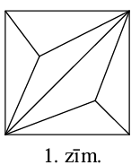

# <lo-sample/> LV.AMO.2012.5.1

Divu naturālu skaitļu pierakstā izmantoti tikai cipari $1, 4, 6$ un $9$. Vai var
gadīties, ka viens skaitlis ir tieši septiņas reizes lielāks nekā otrs skaitlis?

<small>

* questionType:
* domain:

</small>

## Atrisinājums

**Atbilde:** nē. Ja skaitļa pēdējais cipars ir $1, 4, 6$ vai $9$, tad septiņas reizes
lielāka skaitļa pēdējais cipars ir attiecīgi $7, 8, 2$ vai $3$.

# <lo-sample/> LV.AMO.2012.5.2

Parādi, kā kvadrātu var sadalīt vairākos platleņķa trijstūros. (Trijstūri sauc par
platleņķa trijstūri, ja tam ir viens plats leņķis un divi šauri leņķi.)

<small>

* questionType:
* domain:

</small>

## Atrisinājums

Skat., piem., 1.zīm.

# <lo-sample/> LV.AMO.2012.5.3

Maisā ir baltas, zaļas un sarkanas pogas (citu krāsu pogu maisā nav). Kādu mazāko
skaitu pogu uz labu laimi (tās neredzot) ir jāizņem, lai noteikti būtu paņemtas vai nu
$2$ baltas, vai $3$ zaļas, vai $4$ sarkanas pogas.

<small>

* questionType:
* domain:

</small>

## Atrisinājums

**Atbilde:** jāpaņem vismaz $7$ pogas. Ja paņems tikai $6$ pogas, var gadīties, ka starp
tām ir $1$ balta, $2$ zaļas un $3$ sarkanas- nevienas krāsas pogas nav vajadzīgajā
skaitā.

# <lo-sample/> LV.AMO.2012.5.4

$24$-stāvu mājā ir lifts, kuram ir divas pogas. Nospiežot vienu pogu, tas paceļas
(ja iespējams) $17$ stāvus uz augšu, nospiežot otru nolaižas $8$ stāvus uz leju (ja
iespējams). Noskaidro, no kura stāva ar šo liftu var nokļūt uz jebkuru citu stāvu šajā
mājā. (Lifts nevar uzbraukt augstāk par $24.$ stāvu un zemāk par $1.$ stāvu.)

<small>

* questionType:
* domain:

</small>

## Atrisinājums

**Atbilde:** no $17.$ stāva. Ievērosim, ka šajā mājā ar doto liftu ne no viena stāva
nav iespējams nokļūt uz $17.$ stāvu (zemākais stāvs, uz kuru var nokļūt, braucot uz
augšu, ir $1+17=18$. stāvs, bet augstākais stāvs, uz kuru var nokļūt, braucot uz leju
ir $24-8=16$. stāvs). No $17.$ stāva uz citiem stāviem var nokļūt, piem., sekojošā
veidā:

$$\text { 17. } \begin{aligned}
\rightarrow \text { 9. } \rightarrow \text { 1. } & \rightarrow \text { 18. } \rightarrow \text { 10. } \rightarrow \text { 2. } \rightarrow \text { 19. } \rightarrow \text { 11. } \rightarrow \text { 3. } \rightarrow \text { 20. } \rightarrow \text { 12. } \rightarrow \text { 4. } \rightarrow \text { 21. } \rightarrow 13 . \rightarrow \\
& \rightarrow \text { 5. } \rightarrow \text { 22. } \rightarrow \text { 14. } \rightarrow \text { 6. } \rightarrow \text { 23. } \rightarrow \text { 15. } \rightarrow \text { 7. } \rightarrow \text { 24. } \rightarrow \text { 16. } \rightarrow \text { 8. }
\end{aligned}$$

$17. \rightarrow 9. \rightarrow 1. \rightarrow 18. \rightarrow 10. \rightarrow 2. \rightarrow 19. \rightarrow 11. \rightarrow 3. \rightarrow 20. \rightarrow 12. \rightarrow 4. \rightarrow 21. \rightarrow 13. \rightarrow 5. \rightarrow 22. \rightarrow 14. \rightarrow 6. \rightarrow 23. \rightarrow 15. \rightarrow 7. \rightarrow 24. \rightarrow 16. \rightarrow 8.$

# <lo-sample/> LV.AMO.2012.5.5

Sadali 1. zīmējumā attēloto figūru trīs vienādās figūrās. (Figūru un tās spoguļattēlu saucam par vienādām figūrām.)

<small>

* questionType:
* domain:

</small>

## Atrisinājums

Skat., piem. 2.zīm.

1.zīm.

2.zīm.

# <lo-sample/> LV.AMO.2012.6.1

Uz tāfeles uzrakstīti desmit skaitļi

$$
\begin{array}{llllllllll}
1 & 2 & 3 & 4 & 5 & 6 & 7 & 8 & 9 & 10
\end{array}
$$

Alfons nodzēš jebkurus divus no tiem (apzīmēsim tos ar $a$ un b) un to vietā uzraksta skaitli, kas vienāds ar $a+b+2$. Šo operāciju vinš atkārto, kamēr uz tāfeles paliek viens skaitlis.

Pamato, ka neatkarīgi no secības, kādā Alfons izpilda darbības, beigās tiek iegūts viens un tas pats skaitlis. Kāds tas ir?

<small>

* questionType:
* domain:

</small>

## Atrisinājums

Pēc katras darbības visu uz tāfeles uzrakstīto skaitļu summa palielinās par 2 (divu nodzēsto skaitļu vietā tiek rakstīta tos summa, palielināta par 2, bet pārējie skaitļi netiek mainīti, tātad arī to summa nemainās). Tātad beigās palikušais vienīgais skaitlis ir vienāds ar $S+2 \cdot n$, kur $S$ ir visu sākumā uzrakstīto skaitļu summa, bet $n$ ir izpildīto darbību skaits. Tā kā sākumā uz tāfeles bija 10 skaitļi, bet pēc vienas darbības izpildes skaitļu skaits samazinās par viens, tad Alfons pavisam izpildīja 9 darbības (t.i. $n=9$ ). Beigās palikušais skaitlis ir

$S+2 \cdot n=(1+2+3+4+5+6+7+8+9+10)+2 \cdot 9=\frac{(1+10) \cdot 10}{2}+18=55+18=73$.

# <lo-sample/> LV.AMO.2012.6.2

Sadali kvadrātu divos vienādos a) sešstūros, b) septinstūros.

<small>

* questionType:
* domain:

</small>

## Atrisinājums

Skat., piem., 3. a) un b) zīmējumus.

a)

b)

3.zīm.

4. zīm

5.zīm.

# <lo-sample/> LV.AMO.2012.6.3

Kvadrātā ar izmēriem $8 \times 8$ rūtinas sākumā visas rūtinas ir baltas. Kāds mazākais skaits rūtiņu šajā kvadrātā jānokrāso zaļas, lai katrā taisnstūrī ar izmēriem $1 \times 3$ rūtinas, ko varētu iezīmēt dotajā kvadrātā (horizontāli vai vertikāli), būtu vismaz viena zaļa rūtina?

<small>

* questionType:
* domain:

</small>

## Atrisinājums

Kvadrātā ar izmēriem $8 \times 8$ rūtiņas var izvietot 21 taisnstūri ar izmēriem $1 \times 3$ rūtiņas tā, ka tie nepārklājas. (skat. 4.zīm.). Katrā no šiem taisnstūriem ir jābūt vismaz vienai zaļai rūtinaai. Tātad ir nepieciešams nokrāsot vismaz 21 rūtiņu.

Parādīsim, ka ar 21 rūtiņu pietiek. Katrā rūtiņā ierakstīsim skaitli 1, 2 vai 3 tā, ka katrā $1 \times 3$ rūtinu grupā būtu ierakstīti visi skaitļi (skat. 5 . zīm). Nokrāsojot zaļas visas rūtinas, kurās ierakstīts 1 (tādu ir 21), iegūsim situāciju, ka nebūs iespējams izvēlēties neaizkrāsotu $1 \times 3$ rūtiņu grupu.

# <lo-sample/> LV.AMO.2012.6.4

Vai pa apli var uzrakstīt a) sešus b) septiņus dažādus naturālus skaitļus tā, lai jebkuru divu blakusstāvošu skaitļu summa būtu pirmskaitlis un visi summās iegūtie pirmskaitlli būtu dažādi?

<small>

* questionType:
* domain:

</small>

## Atrisinājums

a) Jā, var, skat., piem., 6.zīm.

b) Nē, nevar. Divu dažādu naturālu skaitļu summa ir vismaz $1+2=3$. Visi pirmskaitļli, kas lielāki nekā 2, ir nepāra skaitļi. Tātad jebkuru divu blakus uzrakstītos skaitļu summai jābūt nepāra skaitlim, t.i., jebkuru divu blakusstāvošu skaitļu paritātēm jābūt dažādām. Taču, lai arī kā7 skaitļus izvietotu pa apli, vismaz vienā vietā blakus atradīsies divi vienas paritātes

<img class="imgSvg" id = "lzdyogdruhkp0ugaej7" src="data:image/svg+xml;base64,PHN2ZyBpZD0ic21pbGVzLWx6ZHlvZ2RydWhrcDB1Z2FlajciIHhtbG5zPSJodHRwOi8vd3d3LnczLm9yZy8yMDAwL3N2ZyIgdmlld0JveD0iMCAwIDE1MyAxMTIuNzc5ODU3NTE3MDcxNyIgc3R5bGU9IndpZHRoOiAxNTMuMDA1MjcyODUwOTUyODVweDsgaGVpZ2h0OiAxMTIuNzc5ODU3NTE3MDcxN3B4OyBvdmVyZmxvdzogdmlzaWJsZTsiPjxkZWZzPjxsaW5lYXJHcmFkaWVudCBpZD0ibGluZS1semR5b2dkcnVoa3AwdWdhZWo3LTEiIGdyYWRpZW50VW5pdHM9InVzZXJTcGFjZU9uVXNlIiB4MT0iOTcuMzM3OTA5NTk0MjA3OTkiIHkxPSI4NC43NzA0NzU2NjMxNjEzNSIgeDI9IjExMS4wMDUyNzI4NTA5NTI4NSIgeTI9IjU2LjM4OTk2ODU5MjE0MTk4Ij48c3RvcCBzdG9wLWNvbG9yPSJjdXJyZW50Q29sb3IiIG9mZnNldD0iMjAlIj48L3N0b3A+PHN0b3Agc3RvcC1jb2xvcj0iY3VycmVudENvbG9yIiBvZmZzZXQ9IjEwMCUiPjwvc3RvcD48L2xpbmVhckdyYWRpZW50PjxsaW5lYXJHcmFkaWVudCBpZD0ibGluZS1semR5b2dkcnVoa3AwdWdhZWo3LTMiIGdyYWRpZW50VW5pdHM9InVzZXJTcGFjZU9uVXNlIiB4MT0iOTcuMzM3OTYwNTQzMzAyNTMiIHkxPSIyOC4wMDk0MzY5ODUzMzE4MDMiIHgyPSIxMTEuMDA1MjcyODUwOTUyODUiIHkyPSI1Ni4zODk5Njg1OTIxNDE5OCI+PHN0b3Agc3RvcC1jb2xvcj0iY3VycmVudENvbG9yIiBvZmZzZXQ9IjIwJSI+PC9zdG9wPjxzdG9wIHN0b3AtY29sb3I9ImN1cnJlbnRDb2xvciIgb2Zmc2V0PSIxMDAlIj48L3N0b3A+PC9saW5lYXJHcmFkaWVudD48bGluZWFyR3JhZGllbnQgaWQ9ImxpbmUtbHpkeW9nZHJ1aGtwMHVnYWVqNy01IiBncmFkaWVudFVuaXRzPSJ1c2VyU3BhY2VPblVzZSIgeDE9IjY2LjYyNzY3NDA2ODc5OTM0IiB5MT0iOTEuNzc5ODU3NTE3MDcxNyIgeDI9Ijk3LjMzNzkwOTU5NDIwNzk5IiB5Mj0iODQuNzcwNDc1NjYzMTYxMzUiPjxzdG9wIHN0b3AtY29sb3I9ImN1cnJlbnRDb2xvciIgb2Zmc2V0PSIyMCUiPjwvc3RvcD48c3RvcCBzdG9wLWNvbG9yPSJjdXJyZW50Q29sb3IiIG9mZnNldD0iMTAwJSI+PC9zdG9wPjwvbGluZWFyR3JhZGllbnQ+PGxpbmVhckdyYWRpZW50IGlkPSJsaW5lLWx6ZHlvZ2RydWhrcDB1Z2FlajctNyIgZ3JhZGllbnRVbml0cz0idXNlclNwYWNlT25Vc2UiIHgxPSI2Ni42Mjc3Mzc2MDEyODEwNCIgeTE9IjIxIiB4Mj0iOTcuMzM3OTYwNTQzMzAyNTMiIHkyPSIyOC4wMDk0MzY5ODUzMzE4MDMiPjxzdG9wIHN0b3AtY29sb3I9ImN1cnJlbnRDb2xvciIgb2Zmc2V0PSIyMCUiPjwvc3RvcD48c3RvcCBzdG9wLWNvbG9yPSJjdXJyZW50Q29sb3IiIG9mZnNldD0iMTAwJSI+PC9zdG9wPjwvbGluZWFyR3JhZGllbnQ+PGxpbmVhckdyYWRpZW50IGlkPSJsaW5lLWx6ZHlvZ2RydWhrcDB1Z2FlajctOSIgZ3JhZGllbnRVbml0cz0idXNlclNwYWNlT25Vc2UiIHgxPSI0MiIgeTE9IjcyLjEzOTkwNjY1MjU0NTg2IiB4Mj0iNjYuNjI3Njc0MDY4Nzk5MzQiIHkyPSI5MS43Nzk4NTc1MTcwNzE3Ij48c3RvcCBzdG9wLWNvbG9yPSJjdXJyZW50Q29sb3IiIG9mZnNldD0iMjAlIj48L3N0b3A+PHN0b3Agc3RvcC1jb2xvcj0iY3VycmVudENvbG9yIiBvZmZzZXQ9IjEwMCUiPjwvc3RvcD48L2xpbmVhckdyYWRpZW50PjxsaW5lYXJHcmFkaWVudCBpZD0ibGluZS1semR5b2dkcnVoa3AwdWdhZWo3LTExIiBncmFkaWVudFVuaXRzPSJ1c2VyU3BhY2VPblVzZSIgeDE9IjQyLjAwMDAyODI3NDYxNDM0IiB5MT0iNDAuNjM5OTA2NjUyNTU4NTUiIHgyPSI2Ni42Mjc3Mzc2MDEyODEwNCIgeTI9IjIxIj48c3RvcCBzdG9wLWNvbG9yPSJjdXJyZW50Q29sb3IiIG9mZnNldD0iMjAlIj48L3N0b3A+PHN0b3Agc3RvcC1jb2xvcj0iY3VycmVudENvbG9yIiBvZmZzZXQ9IjEwMCUiPjwvc3RvcD48L2xpbmVhckdyYWRpZW50PjxsaW5lYXJHcmFkaWVudCBpZD0ibGluZS1semR5b2dkcnVoa3AwdWdhZWo3LTEzIiBncmFkaWVudFVuaXRzPSJ1c2VyU3BhY2VPblVzZSIgeDE9IjQyIiB5MT0iNzIuMTM5OTA2NjUyNTQ1ODYiIHgyPSI0Mi4wMDAwMjgyNzQ2MTQzNCIgeTI9IjQwLjYzOTkwNjY1MjU1ODU1Ij48c3RvcCBzdG9wLWNvbG9yPSJjdXJyZW50Q29sb3IiIG9mZnNldD0iMjAlIj48L3N0b3A+PHN0b3Agc3RvcC1jb2xvcj0iY3VycmVudENvbG9yIiBvZmZzZXQ9IjEwMCUiPjwvc3RvcD48L2xpbmVhckdyYWRpZW50PjwvZGVmcz48bWFzayBpZD0idGV4dC1tYXNrLWx6ZHlvZ2RydWhrcDB1Z2FlajciPjxyZWN0IHg9IjAiIHk9IjAiIHdpZHRoPSIxMDAlIiBoZWlnaHQ9IjEwMCUiIGZpbGw9IndoaXRlIj48L3JlY3Q+PGNpcmNsZSBjeD0iNDIuMDAwMDI4Mjc0NjE0MzQiIGN5PSI0MC42Mzk5MDY2NTI1NTg1NSIgcj0iNy44NzUiIGZpbGw9ImJsYWNrIj48L2NpcmNsZT48L21hc2s+PHN0eWxlPgogICAgICAgICAgICAgICAgLmVsZW1lbnQtbHpkeW9nZHJ1aGtwMHVnYWVqNyB7CiAgICAgICAgICAgICAgICAgICAgZm9udDogMTRweCBIZWx2ZXRpY2EsIEFyaWFsLCBzYW5zLXNlcmlmOwogICAgICAgICAgICAgICAgICAgIGFsaWdubWVudC1iYXNlbGluZTogJ21pZGRsZSc7CiAgICAgICAgICAgICAgICB9CiAgICAgICAgICAgICAgICAuc3ViLWx6ZHlvZ2RydWhrcDB1Z2FlajcgewogICAgICAgICAgICAgICAgICAgIGZvbnQ6IDguNHB4IEhlbHZldGljYSwgQXJpYWwsIHNhbnMtc2VyaWY7CiAgICAgICAgICAgICAgICB9CiAgICAgICAgICAgIDwvc3R5bGU+PGcgbWFzaz0idXJsKCN0ZXh0LW1hc2stbHpkeW9nZHJ1aGtwMHVnYWVqNykiPjxsaW5lIHgxPSI5Ny4zMzc5MDk1OTQyMDc5OSIgeTE9Ijg0Ljc3MDQ3NTY2MzE2MTM1IiB4Mj0iMTExLjAwNTI3Mjg1MDk1Mjg1IiB5Mj0iNTYuMzg5OTY4NTkyMTQxOTgiIHN0eWxlPSJzdHJva2UtbGluZWNhcDpyb3VuZDtzdHJva2UtZGFzaGFycmF5Om5vbmU7c3Ryb2tlLXdpZHRoOjEuMjYiIHN0cm9rZT0idXJsKCcjbGluZS1semR5b2dkcnVoa3AwdWdhZWo3LTEnKSI+PC9saW5lPjxsaW5lIHgxPSI5Ny4zMzc5NjA1NDMzMDI1MyIgeTE9IjI4LjAwOTQzNjk4NTMzMTgwMyIgeDI9IjExMS4wMDUyNzI4NTA5NTI4NSIgeTI9IjU2LjM4OTk2ODU5MjE0MTk4IiBzdHlsZT0ic3Ryb2tlLWxpbmVjYXA6cm91bmQ7c3Ryb2tlLWRhc2hhcnJheTpub25lO3N0cm9rZS13aWR0aDoxLjI2IiBzdHJva2U9InVybCgnI2xpbmUtbHpkeW9nZHJ1aGtwMHVnYWVqNy0zJykiPjwvbGluZT48bGluZSB4MT0iNjYuNjI3Njc0MDY4Nzk5MzQiIHkxPSI5MS43Nzk4NTc1MTcwNzE3IiB4Mj0iOTcuMzM3OTA5NTk0MjA3OTkiIHkyPSI4NC43NzA0NzU2NjMxNjEzNSIgc3R5bGU9InN0cm9rZS1saW5lY2FwOnJvdW5kO3N0cm9rZS1kYXNoYXJyYXk6bm9uZTtzdHJva2Utd2lkdGg6MS4yNiIgc3Ryb2tlPSJ1cmwoJyNsaW5lLWx6ZHlvZ2RydWhrcDB1Z2FlajctNScpIj48L2xpbmU+PGxpbmUgeDE9IjY2LjYyNzczNzYwMTI4MTA0IiB5MT0iMjEiIHgyPSI5Ny4zMzc5NjA1NDMzMDI1MyIgeTI9IjI4LjAwOTQzNjk4NTMzMTgwMyIgc3R5bGU9InN0cm9rZS1saW5lY2FwOnJvdW5kO3N0cm9rZS1kYXNoYXJyYXk6bm9uZTtzdHJva2Utd2lkdGg6MS4yNiIgc3Ryb2tlPSJ1cmwoJyNsaW5lLWx6ZHlvZ2RydWhrcDB1Z2FlajctNycpIj48L2xpbmU+PGxpbmUgeDE9IjQyIiB5MT0iNzIuMTM5OTA2NjUyNTQ1ODYiIHgyPSI2Ni42Mjc2NzQwNjg3OTkzNCIgeTI9IjkxLjc3OTg1NzUxNzA3MTciIHN0eWxlPSJzdHJva2UtbGluZWNhcDpyb3VuZDtzdHJva2UtZGFzaGFycmF5Om5vbmU7c3Ryb2tlLXdpZHRoOjEuMjYiIHN0cm9rZT0idXJsKCcjbGluZS1semR5b2dkcnVoa3AwdWdhZWo3LTknKSI+PC9saW5lPjxsaW5lIHgxPSI0Mi4wMDAwMjgyNzQ2MTQzNCIgeTE9IjQwLjYzOTkwNjY1MjU1ODU1IiB4Mj0iNjYuNjI3NzM3NjAxMjgxMDQiIHkyPSIyMSIgc3R5bGU9InN0cm9rZS1saW5lY2FwOnJvdW5kO3N0cm9rZS1kYXNoYXJyYXk6bm9uZTtzdHJva2Utd2lkdGg6MS4yNiIgc3Ryb2tlPSJ1cmwoJyNsaW5lLWx6ZHlvZ2RydWhrcDB1Z2FlajctMTEnKSI+PC9saW5lPjxsaW5lIHgxPSI0MiIgeTE9IjcyLjEzOTkwNjY1MjU0NTg2IiB4Mj0iNDIuMDAwMDI4Mjc0NjE0MzQiIHkyPSI0MC42Mzk5MDY2NTI1NTg1NSIgc3R5bGU9InN0cm9rZS1saW5lY2FwOnJvdW5kO3N0cm9rZS1kYXNoYXJyYXk6bm9uZTtzdHJva2Utd2lkdGg6MS4yNiIgc3Ryb2tlPSJ1cmwoJyNsaW5lLWx6ZHlvZ2RydWhrcDB1Z2FlajctMTMnKSI+PC9saW5lPjwvZz48Zz48dGV4dCB4PSIxMTEuMDA1MjcyODUwOTUyODUiIHk9IjU2LjM4OTk2ODU5MjE0MTk4IiBjbGFzcz0iZGVidWciIGZpbGw9IiNmZjAwMDAiIHN0eWxlPSIKICAgICAgICAgICAgICAgIGZvbnQ6IDVweCBEcm9pZCBTYW5zLCBzYW5zLXNlcmlmOwogICAgICAgICAgICAiPjwvdGV4dD48dGV4dCB4PSI5Ny4zMzc5MDk1OTQyMDc5OSIgeT0iODQuNzcwNDc1NjYzMTYxMzUiIGNsYXNzPSJkZWJ1ZyIgZmlsbD0iI2ZmMDAwMCIgc3R5bGU9IgogICAgICAgICAgICAgICAgZm9udDogNXB4IERyb2lkIFNhbnMsIHNhbnMtc2VyaWY7CiAgICAgICAgICAgICI+PC90ZXh0Pjx0ZXh0IHg9IjY2LjYyNzY3NDA2ODc5OTM0IiB5PSI5MS43Nzk4NTc1MTcwNzE3IiBjbGFzcz0iZGVidWciIGZpbGw9IiNmZjAwMDAiIHN0eWxlPSIKICAgICAgICAgICAgICAgIGZvbnQ6IDVweCBEcm9pZCBTYW5zLCBzYW5zLXNlcmlmOwogICAgICAgICAgICAiPjwvdGV4dD48dGV4dCB4PSI0MiIgeT0iNzIuMTM5OTA2NjUyNTQ1ODYiIGNsYXNzPSJkZWJ1ZyIgZmlsbD0iI2ZmMDAwMCIgc3R5bGU9IgogICAgICAgICAgICAgICAgZm9udDogNXB4IERyb2lkIFNhbnMsIHNhbnMtc2VyaWY7CiAgICAgICAgICAgICI+PC90ZXh0Pjx0ZXh0IHg9IjQ3LjI1MDAyODI3NDYxNDM0IiB5PSI0NS44ODk5MDY2NTI1NTg1NSIgY2xhc3M9ImVsZW1lbnQtbHpkeW9nZHJ1aGtwMHVnYWVqNyIgZmlsbD0iY3VycmVudENvbG9yIiBzdHlsZT0iCiAgICAgICAgICAgICAgICB0ZXh0LWFuY2hvcjogc3RhcnQ7CiAgICAgICAgICAgICAgICB3cml0aW5nLW1vZGU6IGhvcml6b250YWwtdGI7CiAgICAgICAgICAgICAgICB0ZXh0LW9yaWVudGF0aW9uOiBtaXhlZDsKICAgICAgICAgICAgICAgIGxldHRlci1zcGFjaW5nOiBub3JtYWw7CiAgICAgICAgICAgICAgICBkaXJlY3Rpb246IHJ0bDsgdW5pY29kZS1iaWRpOiBiaWRpLW92ZXJyaWRlOwogICAgICAgICAgICAiPjx0c3Bhbj5PPC90c3Bhbj48L3RleHQ+PHRleHQgeD0iNDIuMDAwMDI4Mjc0NjE0MzQiIHk9IjQwLjYzOTkwNjY1MjU1ODU1IiBjbGFzcz0iZGVidWciIGZpbGw9IiNmZjAwMDAiIHN0eWxlPSIKICAgICAgICAgICAgICAgIGZvbnQ6IDVweCBEcm9pZCBTYW5zLCBzYW5zLXNlcmlmOwogICAgICAgICAgICAiPjwvdGV4dD48dGV4dCB4PSI2Ni42Mjc3Mzc2MDEyODEwNCIgeT0iMjEiIGNsYXNzPSJkZWJ1ZyIgZmlsbD0iI2ZmMDAwMCIgc3R5bGU9IgogICAgICAgICAgICAgICAgZm9udDogNXB4IERyb2lkIFNhbnMsIHNhbnMtc2VyaWY7CiAgICAgICAgICAgICI+PC90ZXh0Pjx0ZXh0IHg9Ijk3LjMzNzk2MDU0MzMwMjUzIiB5PSIyOC4wMDk0MzY5ODUzMzE4MDMiIGNsYXNzPSJkZWJ1ZyIgZmlsbD0iI2ZmMDAwMCIgc3R5bGU9IgogICAgICAgICAgICAgICAgZm9udDogNXB4IERyb2lkIFNhbnMsIHNhbnMtc2VyaWY7CiAgICAgICAgICAgICI+PC90ZXh0PjwvZz48L3N2Zz4="/>
skaitļi, kas summā dod pāra skaitli, lielāku nekā 2 (tas nav pirmskaitlis).

# <lo-sample/> LV.AMO.2012.6.5

Zīmuļi tiek pakoti divu veidu kastītes: pa 7 zīmuļiem kastītē un pa 10 zīmuļiem kastītē. Kāds ir vislielākais zīmuļu skaits, ko nevar precīzi sapakot minēto veidu kastītēs (t.i., visām izmantotajām kastītēm jābūt pilnām un neviens zīmulis nedrīkst palikt pāri)?

<small>

* questionType:
* domain:

</small>

## Atrisinājums

**Atbilde:** 53.

Ja zīmuļu skaits ir pilni desmiti, tad tos var sapakot kastītēs pa 10 zīmuļiem. Ja zīmuļu skaits nav izsakāms veselos desmitos, tad zīmuļu pakošanai jāizmanto arī 7 zīmuļu kastītes. Mazākie skaitļi, kas izsakāmi kā skaitļa 7 daudzkārtņi, ir 7, 14, 21, 28, 35, 42, 49, 56, 63. Visus skaitļus, kas lielāki nekā 63, var izteikt kā atbilstošā 7 daudzkārtṇa (kura vienu cipars sakrīt ar izsakāmā skaitļa vienu ciparu) un pilnu desmitu summu. Savukārt nevienu skaitli, kas mazāks nekā 63 un kura pēdējais cipars ir 3, nevar izteikt kā 7 daudzkārtṇa un pilnu desmitu summu. Lielākais no tādiem skaitlliem ir 53 . Visus skaitļus no 54 līdz 62 var izteikt, piem., $54=7 \cdot 2+10 \cdot 4,55=7 \cdot 5+10 \cdot 2,56=7 \cdot 8,57=7 \cdot 1+10 \cdot 5,58=7 \cdot 4+10 \cdot 3$, $59=7 \cdot 7+10 \cdot 1,60=10 \cdot 6,61=7 \cdot 3+10 \cdot 4,62=7 \cdot 6+10 \cdot 2$.

# <lo-sample/> LV.AMO.2012.7.1

Vai var atrast tādus veselus skaitļus $a$ un $b$, kuriem izpildās vienādība

$$
a b(3 a+5 b)=1234567 ?
$$

<small>

* questionType:
* domain:

</small>

## Atrisinājums

Nē, nevar. Reizinājums $a b(3 a+5 b)$ ir pāra skaitlis: ja kāds no reizinātājiem $a$ vai $b$ ir pāra skaitlis, tad reizinājums ir pāra skaitlis, savukārt, ja $a$ un $b$ abi ir nepāra skaitļi, tad summa $3 a+5 b$ ir pāra skaitlis (divu nepāra skaitļu summa ir pāra skaitlis), tātad viss reizinājums ir pāra skaitli.

# <lo-sample/> LV.AMO.2012.7.2

Doti seši nogriežņi ar garumiem $1 \mathrm{~cm}, 3 \mathrm{~cm}, 5 \mathrm{~cm}, 7 \mathrm{~cm}, 9 \mathrm{~cm}$, 11 cm . Cik dažādos veidos no tiem var izvēlēties trīs nogriežņus tā, ka no tiem var izveidot trijstūri (katra trijstūra mala ir viens vesels nogrieznis)?

<small>

* questionType:
* domain:

</small>

## Atrisinājums

No trijstūra nevienādības (katru divu malu summa ir lielāka nekā trešā mala) seko, ka 1 cm garais nogrieznis nav izmantojams neviena trijstūra izveidošanai. No pārē̄iem nogriežniiem trijstūrus var izveidot 7 veidos: $(3 \mathrm{~cm}, 5 \mathrm{~cm}, 7 \mathrm{~cm}),(3 \mathrm{~cm}, 7 \mathrm{~cm}, 9 \mathrm{~cm}),(3 \mathrm{~cm}, 9 \mathrm{~cm}$, 11 cm ), ( $5 \mathrm{~cm}, 7 \mathrm{~cm}, 9 \mathrm{~cm}$ ), ( $5 \mathrm{~cm}, 7 \mathrm{~cm}, 11 \mathrm{~cm}$ ), ( $5 \mathrm{~cm}, 9 \mathrm{~cm}, 11 \mathrm{~cm}$ ), $(7 \mathrm{~cm}, 9 \mathrm{~cm}, 11 \mathrm{~cm}$ ).

# <lo-sample/> LV.AMO.2012.7.3

No pilsētas A uz pilsētu B vienlaicīgi izbrauca zaļa un sarkana automašīna. Sarkanā automašīna visu ceļu veica ar pastāvīgu ātrumu. Zaļā automašīna tieši pusi ceļa veica ar pastāvīgu ātrumu $30 \mathrm{~km} / \mathrm{h}$. Vai, otro ceļa pusi veicot ar lielāku ātrumu, zaļā automašīna var panākt sarkano automašīnu un pilsētā B ierasties vienlaicīgi ar to, ja sarkanās automašīnas ātrums bija
a) $40 \mathrm{~km} / \mathrm{h}$, b) $60 \mathrm{~km} / \mathrm{h}$ ?

<small>

* questionType:
* domain:

</small>

## Atrisinājums

a) Var. Ar $2 s$ apzīmēsim attālumu starp pilsētām, ar $t_{1}$ - laiku, kādā zaļā automašīna veica ceļa pirmo pusi, ar $t_{2}$ - laiku, kādā zaļāa automašīna veica ceļa otro pusi.

Tad $\frac{s}{t_{1}}=30 \mathrm{~km} / \mathrm{h}$ jeb $s=30 t_{1} ; \frac{2 s}{t_{1}+t_{2}}=40$ jeb $2 s=40 t_{1}+40 t_{2}$, t.i., $s=20 t_{1}+20 t_{2}$.

Tātad $30 t_{1}=20 t_{1}+20 t_{2}$ un $t_{2}=\frac{1}{2} t_{1}$, tāpēc $\frac{s}{t_{2}}=2 \cdot \frac{s}{t_{1}}=2 \cdot 30=60 \mathrm{~km} / \mathrm{h}$

b) Nevar. Brīdī, kad zaļā automašīna ir veikusi pusi ceļa, sarkanā automašīna jau ir veikusi visu ceļu un atrodas pilsētā B. Tātad zaļajai automašīnai ceļa otrā puse būtu jāveic momentāni ( 0 stundās), kas nav iespējams.

# <lo-sample/> LV.AMO.2012.7.4

Vai kubu var sagriezt 20 mazākos kubiņos (daži no tiem var būt vienādi, daži atšķirīgi)?

<small>

* questionType:
* domain:

</small>

## Atrisinājums

Jā to var izdarīt. No sākuma kubu ar izmēriem $3 \times 3 \times 3$ sagriezīsim 27 kubiņos ar izmēriem $1 \times 1 \times 1$. Pēc tam 8 mazos kubiņus, kas atrodas pie lielā kuba viena stūra, apvienosim vienā kubā ar izmēriem $2 \times 2 \times 2$. Kopējais kubu skaits samazināsies par 7 un kļūs vienāds ar 20 .

# <lo-sample/> LV.AMO.2012.7.5

Figūrina zilonis var pārvietoties vienu rūtiņu uz augšu, vienu rūtinu pa labi vai vienu rūtinu pa diagonāli (skat. 2.zīm.). Cik dažādos veidos zilonis no rūtinas A var nokļūt rūtinā B (skat. 3.zīm.)? Iekrāsotajā rūtiņā ir şķērslis, tajā zilonis nedrīkst iet.

<small>

* questionType:
* domain:

</small>

## Atrisinājums

Pakāpeniski aprēķināsim, cik veidos zilonis var nokļūt katrā rūtiņā. Ievērosim: ja rūtiñās C, D un E var nokļūt attiecīgi $c, d$ un $e$ veidos, tad rūtinā X var nokļūt $x=c+d+e$ veidos (skat. 7.zīm.). Tātad no rūtiņas A rūtiņā B var nokļūt 32 veidos (skat. 8.zīm.).

# <lo-sample/> LV.AMO.2012.8.1

Starp skaitliem

4157,

nemainot to secību, ievieto aritmētisko darbību zīmes (,,+", ,„", ,,", ,:") un iekavas tā, lai iegūtās izteiksmes vērtība būtu
a) 13 ,
b) 14 .

<small>

* questionType:
* domain:

</small>

## Atrisinājums

a) Piemēram, $4 \cdot 1 \cdot 5-7=13$

b) Piemēram, $4:(1-5: 7)=14$

# <lo-sample/> LV.AMO.2012.8.2

Dots trijstūris $A B C$ un punkts $P$ tā iekšpusē. Pierādi, ka attālumu summa no punkta $P$ līdz dotā trijstūra virsotnēm ir lielāka nekā puse no trijstūra perimetra.

<small>

* questionType:
* domain:

</small>

## Atrisinājums

No trijstūra nevienādības seko $P A+P B>A B, P A+P C>A C$ un $P B+P C>B C$ (skat. 9.zīm.). Saskaitot šīs nevienādības, iegūstam $2(P A+P B+P C)>A B+A C+B C=P_{A B C}$

jeb $P A+P B+P C>\frac{1}{2} P_{A B C}$.

9.zīm.

# <lo-sample/> LV.AMO.2012.8.3

Skolas matemātikas olimpiādē piedalījās ne vairāk kā 60 skolēnu. Vidējais punktu skaits, ko ieguva zēni, bija 21,6. Vidējais punktu skaits, ko ieguva meitenes, bija 15. Vidējais punktu skaits, ko ieguva visi skolēni, bija 20. Cik skolēnu piedalījās olimpiādē?

<small>

* questionType:
* domain:

</small>

## Atrisinājums

Apzīmēsim zēnu skaitu ar $z$, bet meiteņu skaitu - ar $m$. Tātad visi zēni kopā ieguva $21,6 \cdot z$ punktus, bet visas meitenes kopā ieguva $15 \cdot m$ punktus. Tad visu bērnu vidējais punktu skaits ir $\frac{21,6 z+15 m}{z+m}=20$. Pārveidojot iegūstam $21,6 z+15 m=20(z+m) \Rightarrow 1,6 z=5 m \Rightarrow$ $8 z=25 m \Rightarrow z=25 t, m=8 t$ un $z+m=33 t$. Tā kā kopējais skolnieku skaits nepārsniedz 60 , tad $t=1$ un kopējais skolēnu skaits ir 33.

# <lo-sample/> LV.AMO.2012.8.4

Pa apli uzrakstīti 11 veseli skaitļi. Jebkuru trīs pēc kārtas ņemtu skaitļu summa dalās ar 5. Pierādi, ka visi uzrakstītie skaitļi dalās ar 5 .

<small>

* questionType:
* domain:

</small>

## Atrisinājums

Apzīmēsim pa apli uzrakstītos skaitļus kā parādīts 10 . zīmējumā. Tā kā $a+b+c$ un $b+c+d$ dalās ar 5 , tad $a$ un $d$, dalot ar 5 , dod vienādu atlikumu (apzīmēsim to ar $r$, $0 \leq r<5)$.

10.zīm.

Līdzīgi no tā, ka $d+e+f$ un $e+f+g$ dalās ar 5, seko, ka arī $g$ dod atlikumu $r$, dalot ar 5 .

No tā, ka $g+h+k$ un $h+k+m$ dalās ar 5 , seko, ka arī $m$ dod atlikumu $r$, dalot ar 5 .

No tā, ka $m+n+a$ un $n+a+b$ dalās ar 5 , seko, ka arī $b$ dod atlikumu $r$, dalot ar 5 .

No tā, ka $b+c+d$ un $c+d+e$ dalās ar 5, seko, ka arī $e$ dod atlikumu $r$, dalot ar 5 .

No tā, ka $e+f+g$ un $f+g+h$ dalās ar 5, seko, ka arī $h$ dod atlikumu $r$, dalot ar 5 .

No tā, ka $h+k+m$ un $k+m+n$ dalās ar 5 , seko, ka arī $n$ dod atlikumu $r$, dalot ar 5 .

No tā, ka $n+a+b$ un $a+b+c$ dalās ar 5, seko, ka arī $c$ dod atlikumu $r$, dalot ar 5 .

No tā, ka $c+d+e$ un $d+e+f$ dalās ar 5, seko, ka arī $f$ dod atlikumu $r$, dalot ar 5 .

No tā, ka $f+g+h$ un $g+h+k$ dalās ar 5 , seko, ka arī $k$ dod atlikumu $r$, dalot ar 5 .

Tātad visi 11 uzrakstītie skaitļi, dalot ar 5, dod atlikumu $r$. Tā kā summa $a+b+c$ dalās ar 5, tad šo skaitļu atlikumu summa $r+r+r=3 r$ arī dalās ar 5 . Skaitlis 3 nedalās ar 5 , tātad $r$ dalās ar 5 . Tā kā $r<5$, tad $r=0$, kas nozīmē, ka visi uzrakstītie skaitļi dalās ar 5.

# <lo-sample/> LV.AMO.2012.8.5

Kvadrātveida tabula ar izmēriem $7 \times 7$ rūtinas aizpildīta ar skaitliem no 1 līdz 7 tā, ka katrā rindā ierakstīti visi skaitļi no 1 līdz 7. Tabula ir simetriska attiecībā pret vienu no diagonālēm. Pierādi, ka šajā diagonālē ierakstīti visi skaitļi no 1 līdz 7.

(Tabulu sauc par simetrisku attiecībā pret diagonāli, ja rūtiņās, kas ir simetriskas pret šo diagonāli ierakstīti vienādi skaitli.)

<small>

* questionType:
* domain:

</small>

## Atrisinājums

Izvēlamies jebkuru skaitli $k(k=1,2, \ldots .7$ ). Tā kā dotā tabula ir simetriska, diagonāles abās pusēs skaitlis $k$ ir ierakstīts vienādā skaitā rūtiņu, tātad ārpus diagonāles ir uzrakstīti pāra skaits skaitllu $k$. Tā kā tabulā pavisam ir septini (nepāra skaits) skaitļi $k$, tad vismaz viens no tiem ir uz diagonāles. Šis spriedums ir spēkā visām septinām iespējamām $k$ vērt̄̄̄̄̄̄, un diagonālē ir tieši 7 rūtiņas, tātad diagonālē ir ierakstīti visi skaitļi no 1 līdz 7, katrs tieši vienu reizi.

# <lo-sample/> LV.AMO.2012.9.1

Atrodi vienu skaitli, kuram ir tieši 12 veseli pozitīvi dalītāji.

<small>

* questionType:
* domain:

</small>

## Atrisinājums

Piemēram, skaitlis $2^{11}$. Tā dalītāji ir skaitļi $1=2^{0}, 2^{1}, 2^{2}, 2^{3}, 2^{4}, 2^{5}, 2^{6}, 2^{7}, 2^{8}, 2^{9}, 2^{10}, 2^{11}$.

# <lo-sample/> LV.AMO.2012.9.2

Trijstūr̄̄ $A B C \angle A B C=90^{\circ}$, bet punkts $P$ atrodas uz malas $A B$. Punkti $M$ un $N$ ir attiecīgi nogriežņu $A C$ un $P C$ viduspunkti. Pierādi, ka $\angle B A C=\angle B M N$

<small>

* questionType:
* domain:

</small>

## Atrisinājums

Tā kā $\triangle A B C$ un $\triangle P B C$ ir taisnleņka, $A M=B M=C M$ un $P N=B N=C N$ (skat. 11.zīm.). Tāpēc $\triangle M B N=\triangle M C N$ (pazīme mmm ) un $\angle B M N=\angle C M N$, jo vienādos trijstūros pret vienādām malām ir vienādi leņķi. $M N$ ir $\triangle A P C$ viduslīnija, tāpēc $A P \| M N$ un $\angle C M N=\angle C A P$ kā kāpšļu leņki. Tātad, $\angle B M N=\angle C M N=\angle C A P=\angle B A C$, k.b.j.

11.zīm.

# <lo-sample/> LV.AMO.2012.9.3

Kvadrātvienādojuma $x^{2}-507 x+a=0$ saknes ir $p^{2}$ un $q$, kur $p$ un $q$ ir pirmskaitļi. Aprēķini $a$ skaitlisko vērtību.

<small>

* questionType:
* domain:

</small>

## Atrisinājums

No Vjeta teorēmas seko $p^{2}+q=507$ - nepāra skaitlis, tātad viens no pirmskaitļiem $p$ vai $q$ ir 2. Ja $q=2$, tad $p^{2}=505$, bet tad $p$ nav vesels skaitlis. Tātad $p=2$ un $q=503$, no kurienes iegūstam $a=p^{2} q=2012$.

# <lo-sample/> LV.AMO.2012.9.4

Uz tāfeles uzrakstītas deviñas zvaigznītes * * * * * * * * *. Jānis ieraksta kādas zvaigznītes vietā jebkuru ciparu no 1 līdz 9. Pēc tam Pēteris jebkuru divu citu zvaigznīšu vietā ieraksta divus ciparus (tie var arī atkārtoties). Pēc tam vēl divas reizes vini atkārto šo darbību. Pēteris uzvar, ja iegūtais devinçiparu skaitlis dalās ar 37. Vai Pēteris vienmēr var uzvarēt?

<small>

* questionType:
* domain:

</small>

## Atrisinājums

Ievērosim, ka $\overline{a a a b b b c c c}=111 \cdot \overline{a 00 b 00 c}=37 \cdot 3 \cdot \overline{a 00 b 00 c}$. Tātad Pēeris var uzvarēt, panākot, ka izveidojas skaitlis $\overline{a a a b b b c c c}$. Lai to panāktu, Pēteris domās sadala zvaigznītes pēc kārtas grupās pa trim. Kad Jānis ieraksta kādu ciparu, Pēteris tās pašas grupas abu pārējo zvaigznǐšu vietā ieraksta tādus pašus ciparus, kā Jānis. Tātad pēc Pētera gājiena katrā grupā vai nu visas trīs zvaigznītes ir aizstātas ar cipariem, vai arī visas trīs ir neaizstātas. Tātad pēc kārtējā Jāņa gājiena Pēteris atkal varēs rīkoties tāpat un panākt savu uzvaru.

# <lo-sample/> LV.AMO.2012.9.5

Dota trapece, kuras pamatu malu garumi ir 3 un 13. Pierādi, ka to nevar sadalīt piecos vienlielos trijstūros.

(Figūras sauc par vienlielām, ja tām ir vienādi laukumi.)

<small>

* questionType:
* domain:

</small>

## Atrisinājums

Ja trapeces augstums ir $h$, tad tās laukumus ir $S=\frac{(3+13)}{2} \cdot h=8 h$. Sadalot trapeci piecos trijstūros, vismaz vienam no tiem mala atrodas uz trapeces īsākā pamata un augstums pret šo malu nepārsniedz trapeces augstumu. Tātad ir trijstūris, kura laukums $S_{1} \leq \frac{1}{2} \cdot 3 \cdot h=1,5 h$. Taču $1,5 h<\frac{8 h}{5}=1,6 h$, t.i., šī trijstūra laukums ir mazāks nekā piektā daļa no trapeces laukuma. Tātad doto trapeci nav iespējams sadalīt piecos vienlielos trijstūros.

# <lo-sample/> LV.AMO.2012.10.1

Pierādi: ja $p$ un $14 p^{2}+1$ ir pirmskaitļi, tad $14 p^{2}-1$ ir naturāla skaitļa kubs.

<small>

* questionType:
* domain:

</small>

## Atrisinājums

Ja $p \neq 3$, tad $p^{2}$, dalot ar 3 , dod atlikumu 1 , tāpēc $14 p^{2}+1$ dalās ar 3 , un nav pirmskaitlis. Ja $p=3$, $\operatorname{tad} 14 p^{2}-1=125=5^{3}$.

# <lo-sample/> LV.AMO.2012.10.2

Dots izliekts četrstūris $A B C D$, leņķi $D A B$ un $B C D$ ir plati. Pierādi, ka $B D>A C$.

<small>

* questionType:
* domain:

</small>

## Atrisinājums

Novilksim rinkki, kura diametrs ir $B D$. Tā kā leņķi $D A B$ un $B C D$ ir plati, tad punkti $A$ un $C$ atrodas riņ̧̧a iekšpusē. Tātad $A C<B D$, jo jebkurš nogrieznis rinkka iekšpusē ir īsāks nekā tā diametrs.

# <lo-sample/> LV.AMO.2012.10.3

Dots, ka $x_{1}$ ir vienādojuma $x^{2}+p x+q=0$ sakne, bet $x_{2}$ ir vienādojuma $-x^{2}+p x+q=0$ sakne. Pierādi, ka vienādojumam $\frac{1}{3} x^{2}+p x+q=0$ noteikti ir sakne $x_{3}$, kas atrodas starp $x_{1}$ un $x_{2}$ (t.i., $x_{1} \leq x_{3} \leq x_{2}$ vai $x_{2} \leq x_{3} \leq x_{1}$ ).

<small>

* questionType:
* domain:

</small>

## Atrisinājums

Aplūkosim kvadrātfunkcijas $\frac{1}{3} x^{2}+p x+q$ vērtības punktos $x_{1}$ un $x_{2}$.

$$
\begin{aligned}
& \frac{1}{3} x_{1}^{2}+p x_{1}+q=x_{1}^{2}+p x_{1}+q-\frac{2}{3} x_{1}^{2}=-\frac{2}{3} x_{1}^{2} \leq 0 \\
& \frac{1}{3} x_{2}^{2}+p x_{2}+q=-x_{2}^{2}+p x_{2}+q+\frac{4}{3} x_{2}^{2}=\frac{4}{3} x_{2}^{2} \geq 0
\end{aligned}
$$

Tā kā vienā no šiem punktiem polinoma vērtība ir negatīva, bet otrā - pozitīva, pie tam kvadrātfunktcija ir nepārtraukta, tad starp šiem punktiem ir arī kāds punkts, kurā funkcija $\frac{1}{3} x^{2}+p x+q$ pieņem vērtību 0 . Šis punkts ir vienādojuma $\frac{1}{3} x^{2}+p x+q=0$ sakne.

# <lo-sample/> LV.AMO.2012.10.4

Vienā un tajā pašā rinkka līnijā ievilkts regulārs 9-stūris un regulārs 10-stūris. To virsotnes sadala rinkka līniju 19 lokos. Pierādi, ka ir loks, kurš nepārsniedz $2^{\circ}$.

<small>

* questionType:
* domain:

</small>

## Atrisinājums

Būs divas tādas desmitstūra virsotnes $B_{j}$ un $B_{j+1}$, kas pieder lokam $A_{i} A_{i+1}$, ko veido divas deviņstūra virsotnes (skat. 12.zīm.). Deviņstūra virsotnes sadala riņka līniju $40^{\circ}$ lielos lokos, bet 10 -stūra virsotnes $36^{\circ}$ lielos lokos, pie tam visas devinstūra un 10 -stūra virsotnes

## Latvijas 39.atklātās matemātikas olimpiādes uzdevumu ĪSI atrisinājumi

ir dažādas (jo rinķa līnija sadalīta 19 lokos). Tātad $\cup A_{i} B_{j}+\cup B_{j+1} A_{i+1}=4^{\circ}$, no kurienes seko, ka vismaz viens no šiem lokiem nepārsniedz $2^{\circ}$.

16.zīm.

17.zīm.

# <lo-sample/> LV.AMO.2012.10.5

Dotas divas paralēlas taisnes. Uz vienas no tām atzīmēti 10 zaļi punkti, uz otras - 10 sarkani punkti. Kādu lielāko skaitu nogriežnu, kuriem viens galapunkts ir zaļš, bet otrs - sarkans, var novilkt tā, lai tie nekrustotos?

(Saka, ka nogriežņi krustojas, ja tiem ir kopīgs iekšējais punkts, t.i., ja tiem ir kopīgs tikai galapunkts, tie nekrustojas.)

<small>

* questionType:
* domain:

</small>

## Atrisinājums

Visus zaļos punktus sanumurējam no kreisās uz labo pusi ar skaitļiem no 1 līdz 10 (skat. 17.zīm.). Līdzīgi sanumurējam visus sarkanos punktus. Tā kā nogriežņi nekrustojas, tad tie sakārtoti virzienā no kreisās uz labo pusi. Aplūkojam katra nogriežņa galapunktos ierakstīto skaitļu summas. Tā ir stingri augoša virkne. Mazākā summa ir 2, lielākā-20. Pavisam iespējamas 19 vērtības. Kā uzzīmēt 19 nogriežņus skat., piem., 17.zīm.

# <lo-sample/> LV.AMO.2012.11.1

Pierādi, ka nav tāda naturāla skaitļa $n$, ka skaitlis $n^{2}-3 n-1$ dalās ar 169 .

<small>

* questionType:
* domain:

</small>

## Atrisinājums

Ja $n^{2}-3 n-1$ dalās ar 169 , tad $n^{2}-3 n-1=(n-8)(n+5)+39$ dalās ar 13. Tātad $(n-8)(n+5)$ dalās ar 13 . Tā kā skaitļi $n-8$ un $n+5$ abi vienlaicīgi dalās ar 13 , tad $(n-8)(n+5)$ dalās ar 169. Bet tādā gadījumā $(n-8)(n+5)+39$ nedalās ar 169 .

# <lo-sample/> LV.AMO.2012.11.2

Punkti $A, B, C$ atrodas uz vienas taisnes, bet $A_{1}, B_{1}, C_{1}-\mathrm{uz}$ citas taisnes. Pierādi: ja $A B_{1}$ paraēels $A_{1} B$ un $A C_{1}$ paralēls $A_{1} C$, tad $B C_{1}$ paralèls $B_{1} C$.

<small>

* questionType:
* domain:

</small>

## Atrisinājums

Sākumā apskatam gadījumu, kad taisnes ir paralēlas (skat. 18.zīm.). Ievērojam, ka $\Delta A B_{1} C_{1}$ ir vienāds ar $\Delta A_{1} B C$, pie tam viens ir iegūts ar otrā pagriezienu par $180^{\circ}$. Tas nozīmē, ka $C B=B_{1} C_{1}$, pie tam punktu pāri $B, C$ un $C_{1}, B_{1}$ uz taisnēm izvietoti tieši šajā secībā. Tāpēc $B C_{1}|| B_{1} C$.

18.zīm.

Par nogriežņa $X Y$ virzītu nogriezni $\overline{X Y}$ sauksim nogriezni, kur taisnei, kurai tas pieder, ir piekārtots virziens. Ja $\overline{X Y}$ virziens sakrīt ar taisnes virzienu, tā vērtība ir $X Y$; pretējā gadījumā tā ir $-X Y$.

Ja taisnes nav paralēlas, tās krustojas kādā punktā O. No Talesa teorēmas seko, ka izpildās vienādības $\overline{O A}: \overline{O B}=\overline{O B_{1}}: \overline{O A_{1}}$ un $\overline{O C}: \overline{O A}=\overline{O A_{1}}: \overline{O C_{1}}$. Sareizinot šīs vienādības, iegūstam $\overline{O C}: \overline{O B}=\overline{O B_{1}}: \overline{O C_{1}}$. Tad no Talesa apgrieztās teorēmas seko, ka $B C_{1} \| B_{1} C$, k.b.j.

Piezīme. Virzītie nogriežņi tiek lietoti, lai varētu pielietot Talesa apgriezto teorēmu. Iespējams arī līdzīgs pierādījums ar parastiem nogriežņu garumiem; šajā gadījumā būtu jāšķiro vairāki punktu izvietojuma gadījumi, atkarībā no tā, kurā pusē no O uz taisnes atrodas katrs punkts.

# <lo-sample/> LV.AMO.2012.11.3

Atrisini vienādojumu:

$$
\begin{aligned}
& \frac{1}{\sqrt{x-2012}+\sqrt{x-2010}}+\frac{1}{\sqrt{x-2010}+\sqrt{x-2008}}+\ldots+ \\
& +\frac{1}{\sqrt{x-2}+\sqrt{x}}+\frac{1}{\sqrt{x}+\sqrt{x+2}}+\ldots+\frac{1}{\sqrt{x+2010}+\sqrt{x+2012}}=\frac{1}{\sqrt{2}} .
\end{aligned}
$$

<small>

* questionType:
* domain:

</small>

## Atrisinājums

Pārveidojam doto vienādojumu, pareizinot ar saucējam saistīto izteiksmi:

$$
\begin{aligned}
& \frac{\sqrt{x-2012}-\sqrt{x-2010}}{-2}+\frac{\sqrt{x-2010}-\sqrt{x-2008}}{-2}+\ldots+ \\
& +\frac{\sqrt{x-2}-\sqrt{x}}{-2}+\frac{\sqrt{x}-\sqrt{x+2}}{-2}+\ldots+\frac{\sqrt{x+2010}-\sqrt{x+2012}}{-2}=\frac{1}{\sqrt{2}}
\end{aligned}
$$

Pareizinot abas puses ar 2 un saīsinot vienādos locekļus:

Latvijas 39.atklātās matemātikas olimpiādes uzdevumu ĪSI atrisinājumi

$$
\begin{aligned}
& \sqrt{x+2012}-\sqrt{x-2012}=\sqrt{2} \\
& \sqrt{x+2012}=\sqrt{x-2012}+\sqrt{2} \\
& x+2012=x-2012+2 \sqrt{2(x-2012)}+2 \\
& 4022=2 \sqrt{2(x-2012)} \\
& 2011^{2}=2(x-2012) \\
& x=\frac{2011^{2}}{2}+2012=2024072,5
\end{aligned}
$$

# <lo-sample/> LV.AMO.2012.11.4

Pierādi, ka izliektu 2012-stūri nevar sadalīt 200 izliektos 12-stūros.

<small>

* questionType:
* domain:

</small>

## Atrisinājums

Izliekta 2012-stūra iekšējo lenķu summa ir $2010 \cdot 2 \pi$. Tos ir jānoklāj ar 200 12-stūru leņiem, kuru kopējais lielums ir $200 \cdot 10 \cdot 2 \pi<2010 \cdot 2 \pi$. Tātad prasīto izdarīt nav iespējms.

# <lo-sample/> LV.AMO.2012.11.5

Plaknē doti 16 punkti, kas izvietoti kvadrātiska režġa veidā kā parādīts 4.zīm. Taisnstūri sauksim par labu, ja tā virsotnes atrodas režğa punktos, malas ir paralēlas režġa līnijām un nav tā, ka starp taisnstūra virsotnēm ir gan viens no četriem režğa stūriem (punkti A, B, C, D), gan viens no četriem režga punktiem, kas atrodas režğa iekšienē (punkti $\mathrm{M}, \mathrm{N}, \mathrm{O}, \mathrm{P}$ ).

4.zīm. Kāds ir lielākais režğa punktu skaits, ko var atzīmēt tā, lai nebūtu laba taisnstūra, kuram visas virsotnes ir atzīmētie punkti?

<small>

* questionType:
* domain:

</small>

## Atrisinājums

Tas, ka 10 punktus var nokrāsot redzams piem. 19. zīmējumā. Atliek pamatot, ka, ja nokrāsosim 11 punktus, tad noteikti atradīsies labs taisnstūris ar visām nokrāsotām virsotnēm. Ja ir nokrāsoti 11 punkti tad ir divas iespējas:

A) ir kāda rinda, kur ir nokrāsoti 4 punkti,

B) nav tādas rindas.

A) gadījumā noteikti vēl ir rinda, kurā ir nokrāsoti vismaz 3 punkti, tad no

19.zīm. šīm abām rindām noteikti var izvē̄ēties labu taisnstūri, kuram visas virsotnes ir nokrāsotas (ņemam vai nu divus vidējos, vai malējos punktus (tos, kuri abi ir nokrāsoti) no tās rindas, kur ir 3 nokrāsoti punkti un tos pašus no tās rindas, kur ir 4).

B) gadījumā, ja katrā rindā ir ne vairāk kā 3 nokrāsoti punkti, tad ir vismaz 3 rindas, kurās ir vismaz 3 nokrāsoti punkti. Tātad būs vai nu augšējā un apakšējā, vai divas vidējās rindas ar 3 nokrāsotiem punktiem. Tad no šīm divām rindām var izvēlēties labu taisnstūri, kuram visas virsotnes ir nokrāsotas - jāņem tās divas kolonas, kurās abām šīm rindām ir nokrāsoti punkti.

# <lo-sample/> LV.AMO.2012.12.1

Skaitlli $A$ un $B$ ir divi dažādi 7 -ciparu skaitļi, kuri katrs satur visus ciparus no 1 līdz 7. Pierādi, ka $A$ nedalās ar $B$.

<small>

* questionType:
* domain:

</small>

## Atrisinājums

Apzīmēsim vienu no dotajiem septiņiparu skaitļiem ar $A$, bet otru - ar $B$. Tā kā abu skaitļu decimālais pieraksts sastāv no vieniem un tiem pašiem cipariem, to ciparu summas ir vienādas ar 28, tad $A$ un $B$, dalot ar 9 , dod vienādu atlikumu 1, t.i. $A=9 N+1$ un $B=9 M+1, N$ un $M$ - naturāli skaitļi. Pieñemsim, ka $A=k B$, kur $k$ naturāls skaitlis un $2 \leq k \leq 7$ ( $k$ nepārsniedz 7 , jo skaitlli $A$ un $B$ abi ir septinciciparu skaitlli, un $A$ pirmais cipars nepārsniedz 7). Skaitlis $k B=k(9 M+1)=9 k M+k$, dalot ar 9 , dod atlikumu $k \neq 1$, tātad $k B \neq A$, k.b.j.

Piezīme. Atrisinājumu var pierakstīt īsāk, lietojot kongruences: $A \equiv B \equiv 1(\bmod 9)$, bet $k B \equiv k(\bmod 9)$. Ja $A=n B, \operatorname{tad} 1 \equiv k(\bmod 9)$. Tā kā $2 \leq k \leq 7$, iegūta pretruna.

# <lo-sample/> LV.AMO.2012.12.2

Caur trijstūra $A B C$ malas $A B$ iekšēju punktu $P$ novilkta taisne, kas ir paralēla $B C$ un krusto $\triangle A B C$ apvilkto rinķa līniju punktos $M$ un $N$ ( $A, M$ un $B$ atrodas uz rinka līnijas tieši šādā secībā). $M C$ krusto $A B$ punktā $Q$. Pierādi, ka $N Q$ iet caur trijstūriem $A M Q$ un $A P N$ apvilkto rinķa līniju krustpunktu.

<small>

* questionType:
* domain:

</small>

## Atrisinājums

Apzīmēsim $\triangle A M Q$ un $\triangle A P N$ apvilkto riņka līniju krustošanās punktu ar $X$ (skat. 20.zīm.). Lai pierādītu, ka $X$ atrodas uz nogriežņa $Q N$, pietiek parādīt, ka $\angle \mathrm{AXQ}+\angle \mathrm{AXN}=180^{\circ}$.

$\angle \mathrm{APN}=\angle \mathrm{ABC}$, jo $\mathrm{MN} \| \mathrm{BC}$. Savukārt $\angle \mathrm{AXN}=\angle \mathrm{APN}$ kā ievilktie leņķi, kas balstās uz vienu loku. Kā ievilktie leṇki ir vienādi arī $\angle \mathrm{AMC}=\angle \mathrm{ABC}$. Bet tā kā $\mathrm{A}, \mathrm{M}, \mathrm{Q}, \mathrm{X}$ atrodas uz rinķa līnijas, tad $\angle \mathrm{AXQ}=180^{\circ}-\angle \mathrm{AMC}$. Ieguvām, ka $\angle \mathrm{AXN}=\angle \mathrm{ABC}$ un $\angle \mathrm{AXQ}=180^{\circ}-\angle \mathrm{ABC}$. To summa ir vienāda ar $180^{\circ}$, k.b.j.

20.zīm.

# <lo-sample/> LV.AMO.2012.12.3

Atrisini vienādojumu $\lg x \cdot \lg (4-x)=\frac{1}{4}$.

<small>

* questionType:
* domain:

</small>

## Atrisinājums

Ja $x<1$ vai $x>3$, tad izteiksmes $\lg x \cdot \lg (4-x)$ vērt̄̄a ir vai nu negatīva vai vispār neeksistē, ja $1 \leq x \leq 3$, tad arī $1 \leq 4-x \leq 3$ un $\lg x \cdot \lg (4-x) \leq \lg (3) \cdot \lg (3)<\frac{1}{4}$, jo $3<\sqrt{10}$. Tātad dotajam vienādojumam atrisinājuma nav.

# <lo-sample/> LV.AMO.2012.12.4

Vai telpā var izvietot a) 6 punktus, b) 7 punktus tā, lai jebkuri trīs no tiem būtu vienādsānu trijstūra virsotnēs un nekādi pieci no tiem neatrastos vienā plaknē?

<small>

* questionType:
* domain:

</small>

## Atrisinājums

a) Jā; der, piemēram, oktaedra virsotnes.

b) Jā; der, piemēram, regulāras trijstūra prizmas, kuras sānu skaldnes ir kvadrāti, virsotnes un tai apvilktās sfēras centrs.

# <lo-sample/> LV.AMO.2012.12.5

Klasē ir 17 skolēni. Katru dienu daži no viniem (vismaz viens) tiek izsaukti pie tāfeles. Kāds ir mazākais dienu skaits, pēc kurām ir iespējams, ka katriem diviem klases skolniekiem ir bijusi diena, kad viens no viniem ir izsaukts pie tāfeles, bet otrs nē?

<small>

* questionType:
* domain:

</small>

## Atrisinājums

**Atbilde:** pietiek ar 5 dienām. Piemēram, 1. dienā pie tāfeles tika izsaukti 1., 2., 3., 4., 5., 6., 7. un 8. skolēni, 2. dienā-1., 2., 3., 4., 9., 10., 11. un 12. skolēni, 3. dienā-1., 2., 5., 6., 9., 10., 13. un 14. skolēni, 4. dienā-1., 3., 5., 7., 9., 11., 13. un 15. skolēni, $\underline{5}$. dienā- 17. skolēns.

Pamatosim, ka ar mazāk dienām nepietiek. Teiksim, ka vairāki skolēni ir vienādā pozīcijā, ja vienā dienā tie visi bija izsaukti pie tāfeles vai arī visi nebija pie tāfeles. Pēc 1. dienas būs vismaz 9 skolēni vienādā pozīcijā. (Izvēloties jebkurus divus no šiem skolēniem, tie neapmierina uzdevuma nosacījumus.). 2. dienā no šīs grupas skolēniem daži (vai neviens) tika izsaukti pie tāfeles, taču paliek vismaz 5 skolēni, kas abās dienas bija vienādā pozīcijā. Savukārt pēc trīs dienām noteikti būs vismaz 3 skolēni, kas visās dienās bija vienādā pozīcijā, bet pēc 4 . dienas joprojām varēs atrast vismaz 2 skolēnus, kas visas četras dienas bija vienādā pozīcija . Izvēloties šo skolēnu pāri, tam nevarēs atrast dienu, kad viens bija pie tā̄eles, bet otrs - nē. Tātad ar 4 dienām nepietiek.
