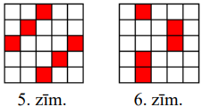
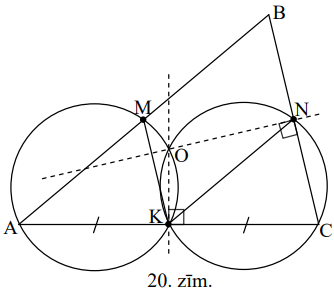

# <lo-sample/> LV.AMO.2013.5.1

Cik reizes diennaktī sakrīt pulksteņa stundu un minūšu rādītāji? (Plkst. 00:00 
un 24:00 ieskaitīt vienu reizi.) Atbildi pamatot!

<small>

* questionType:
* domain:

</small>

## Atrisinājums

**Atbilde:** $22$ reizes.

Laika posmos no plkst. 1:00 - 11:00 un no plkst. 13:00 - 23:00 pulksteņa 
rādītāji katrā stundā sakrīt tieši vienu reizi (minūšu rādītājs stundas laikā 
veic $1$ pilnu apgriezienu, kura laikā vienreiz "apdzen" stundu rādītāju, tātad
tieši vienu reizi ar to sakrīt). Savukārt laika posmos no plkst. 11:00 - 13:00 
un no plkst. 23:00 - 1:00 pulksteņa rādītāji sakrīt tikai vienu reizi katrā: 
plkst. 12:00 un plkst. 0:00. Tātad diennakts laikā pulksteņa rādītāji sakrīt 
$10+10+1+1=22$ reizes.

# <lo-sample/> LV.AMO.2013.5.2

$24$-stāvu mājā ir lifts, kuram ir divas pogas. Nospiežot vienu pogu, tas 
paceļas (ja iespējams) $17$ stāvus uz augšu, nospiežot otru nolaižas $8$ stāvus
uz leju (ja iespējams). Noskaidro, no kura stāva ar šo liftu var nokļūt uz 
jebkuru citu stāvu šajā mājā. (Lifts nevar uzbraukt augstāk par $24.$ stāvu un 
zemāk par $1.$ stāvu.)

<small>

* questionType:
* domain:

</small>

## Atrisinājums

**Atbilde:** no $17.$ stāva. Ievērosim, ka šajā mājā ar doto liftu ne no viena 
stāva nav iespējams nokļūt uz $17.$ stāvu (zemākais stāvs, uz kuru var nokļūt, 
braucot uz augšu, ir $1+17=18.$ stāvs, bet augstākais stāvs, uz kuru var 
nokļūt, braucot uz leju ir $24-8=16.$ stāvs). No $17.$ stāva uz citiem stāviem 
var nokļūt, piem., šādā veidā:

$$\begin{aligned}
\text { 17. } & \rightarrow \text { 9. } \rightarrow \text { 1. } \rightarrow \text { 18. } \rightarrow \text { 10. } \rightarrow \text { 2. } \rightarrow \text { 19. } \rightarrow \text { 11. } \rightarrow \text { 3. } \rightarrow \text { 20. } \rightarrow \text { 12. } \rightarrow 4 . \rightarrow 21 . \rightarrow 13 . \rightarrow \\
& \rightarrow \text { 5. } \rightarrow \text { 22. } \rightarrow \text { 14. } \rightarrow \text { 6. } \rightarrow \text { 23. } \rightarrow \text { 15. } \rightarrow \text { 7. } \rightarrow \text { 24. } \rightarrow \text { 16. } \rightarrow \text { 8. }
\end{aligned}$$

# <lo-sample/> LV.AMO.2013.5.3

1.zīmējumā katrā aplītī ierakstīt vienu ciparu, katrā aplītī - citu, tā, lai 
katros trīs aplīšos, kas atrodas uz vienas taisnes, ierakstīto skaitļu summa 
būtu viena un tā pati.

<small>

* questionType:
* domain:

</small>

## Atrisinājums

Skat., piem., 1.zīm.

Ievērosim, ka ciparu summām jābūt vienādām uz astoņām taisnēm, pie tam vidējais
aplītis atrodas uz $4$ no tām. Pārējie astoņi cipari sadalās pa pāriem, kas 
kopā ar vidējā aplītī ierakstīto ciparu veido vienādas summas, tātad tos 
astoņus ciparus, kas nav ierakstīti vidējā aplītī, ir jāsadala pāros ar 
vienādām summām. To var izdarīt, ja tiek izmantoti cipari 
$1,\ 2,\ 3,\ 4,\ 5,\ 6,\ 7,\ 8,\ 9$ (skat. 1.zīm.) vai arī cipari 
$0,\ 1,\ 2,\ 3,\ 4,\ 5,\ 6,\ 7,\ 8$.

# <lo-sample/> LV.AMO.2013.5.4

No 2.zīmējumā redzamajām figūrām salikt taisnstūri ar laukumu $40$ rūtiņas. 
Figūras nedrīkst pārklāties un katra veida figūra jāizmanto vismaz vienu reizi.
(Figūras var būt pagrieztas vai apgrieztas otrādi.)

<small>

* questionType:
* domain:

</small>

## Atrisinājums

Skat., piem., 2.zīm.

# <lo-sample/> LV.AMO.2013.5.5

Kuba katra skaldne sadalīta četros vienādos kvadrātos. Vai šos kvadrātus var 
nokrāsot **(A)** divās; **(B)** trīs krāsās tā, ka kvadrāti, kam ir kopīga 
mala, ir nokrāsoti dažādās krāsās? Katrs kvadrāts pilnībā ir jākrāso vienā 
krāsā. Atbildi pamatot!

<small>

* questionType:
* domain:

</small>

## Atrisinājums

**Atbilde:** **(A)** nevar; **(B)** var, skat., piem., 3.zīm.

**(A)** Pie kuba virsotnes "satiekas" trīs mazie kvadrātiņi, katram no tiem ir 
kopīga mala ar abiem pārējiem. Tāpēc šos kvadrātiņus nevar izkrāsot divās 
krāsās atbilstoši uzdevuma prasībām.

# <lo-sample/> LV.AMO.2013.6.1

Uz tāfeles uzrakstīti desmit skaitļi

$$\begin{array}{llllllllll}
1 & 2 & 3 & 4 & 5 & 6 & 7 & 8 & 9 & 10
\end{array}$$

Alfons nodzēš jebkurus divus no tiem (apzīmēsim tos ar $a$ un $b$) un to vietā 
uzraksta skaitli, kas vienāds ar $a+b+2$. Šo operāciju viņš atkārto, kamēr uz 
tāfeles paliek viens skaitlis.

Pamato, ka neatkarīgi no secības, kādā Alfons izpilda darbības, beigās tiek 
iegūts viens un tas pats skaitlis. Kāds tas ir?

<small>

* questionType:
* domain:

</small>

## Atrisinājums

Pēc katras darbības visu uz tāfeles uzrakstīto skaitļu summa palielinās par $2$
(divu nodzēsto skaitļu vietā tiek rakstīta to summa, kurai pieskaitīts skaitlis
$2$, bet pārējie skaitļi netiek mainīti, tātad arī to summa nemainās). Tad 
beigās uz tāfeles uzrakstītais vienīgais skaitlis ir vienāds ar $S+2 \cdot n$, 
kur $S$ ir visu sākumā uzrakstīto skaitļu summa, bet $n$ ir izpildīto darbību 
skaits. Tā kā sākumā uz tāfeles bija $10$ skaitļi, bet pēc vienas darbības 
izpildes skaitļu skaits samazinās par viens, tad Alfons pavisam izpildīja $9$ 
darbības (t.i. $n=9$). Beigās palikušais skaitlis ir

$$S+2 \cdot n=(1+2+3+4+5+6+7+8+9+10)+2 \cdot 9=\frac{(1+10) \cdot 10}{2}+18=55+18=73$$

# <lo-sample/> LV.AMO.2013.6.2

Vai var atrast tādus divus viens otram sekojošus naturālus skaitļus, viens no 
kuriem dalās ar $3$ un kuru

**(A)** ciparu summas atšķiras par $3$;

**(B)** ciparu reizinājumi atšķiras par $3$?

<small>

* questionType:
* domain:

</small>

## Atrisinājums

**(A)** Ja skaitlis dalās ar $3$, tad tā ciparu summa dalās ar $3$. Ja šī 
skaitļa un tam blakusesošā skaitļa ciparu summas atšķiras par $3$, tad arī 
blakusesošā skaitļa ciparu summa dalās ar $3$, tāpēc pats skaitlis dalās ar 
$3$. Taču no diviem pēc kārtas sekojošiem skaitļiem ne vairāk kā viens dalās ar
$3$. Tātad divu blakusesošu skaitļu ciparu summas nevar atšķirties tieši par 
$3$.

**(B)** Jā, tā var būt; der, piemēram, skaitļi $30$ un $31$.

# <lo-sample/> LV.AMO.2013.6.3

Sagriezt 3.zīmējumā attēloto figūru $20$ vienādās mazākās figūrās (figūras var
būt pagrieztas vai apgrieztas otrādi).

<small>

* questionType:
* domain:

</small>

## Atrisinājums

Skat., piem., 4.zīm.

# <lo-sample/> LV.AMO.2013.6.4

Vai skaitļus no $100$ līdz $200$ var sadalīt divās grupās tā, ka skaitļu 
reizinājumi abās grupās ir vienādi?

<small>

* questionType:
* domain:

</small>

## Atrisinājums

**Atbilde:** nē, nevar.

Lai abu grupu skaitļu reizinājumi būtu vienādi, abās grupās kā skaitļu 
pirmreizinātājiem jābūt pārstāvētiem vieniem un tiem pašiem pirmskaitļiem 
vienādā skaitā. Taču visi pirmskaitļi, kas lielāki nekā $100$ un mazāki nekā 
$200$ pavisam tiek pārstāvēti tikai vienu reizi katrs, tātad tos nevar sadalīt 
pa divām grupām tā, lai katrā grupā būtu vienāds skaits.

# <lo-sample/> LV.AMO.2013.6.5

Una un Ivo, gājienus izdarot pēc kārtas, kvadrāta ar izmēriem $5 \times 5$ 
rūtiņas trīs tukšās vienas rindas vai kolonnas blakus rūtiņās ieraksta savu 
vārdu, katru burtu rakstot citā rūtiņā. Uzvar tas spēlētājs, kurš pēdējais 
ieraksta savu vārdu. Una izdara pirmo gājienu. Kurš spēlētājs vienmēr var 
panākt savu uzvaru?

<small>

* questionType:
* domain:

</small>

## Atrisinājums

**Atbilde:** Una vienmēr var panākt savu uzvaru.

Savā pirmajā gājienā Una ieraksta savu vārdu tā, lai burts $N$ būtu ierakstīts 
kvadrāta centrālajā rūtiņā. Tad uz katru Ivo gājienu Una atbild ar centrāli 
simetrisku gājienu, t.i., Una rakstu savu vārdu rūtiņās, kas ir simetriskas 
rūtiņām, kurās pēdējā gājienā Ivo ierakstīja savu vārdu, attiecībā pret 
kvadrāta centru. Ja vēl bija brīvas rūtiņas, kur savu vārdu varēja ierakstīt 
Ivo, tad noteikti brīvas ir arī tām centrāli simetriskās rūtiņas.

# <lo-sample/> LV.AMO.2013.7.1

Naturālā divciparu skaitlī neviens no cipariem nav $0$. Pierādīt, ka, dalot šo 
skaitli ar tā ciparu reizinājumu, dalījums ir vismaz $\frac{11}{9}$.

<small>

* questionType:
* domain:

</small>

## Atrisinājums

Ja divciparu skaitļa desmitu cipars ir $a$, bet vienu cipars ir $b$, tad 
divciparu skaitlis ir $10a+b$, tā ciparu reizinājums ir $a \cdot b$ un 
meklētais dalījums ir 
$\frac{10a+b}{ab}=\frac{10a}{ab}+\frac{b}{ab}=\frac{10}{b}+\frac{1}{a}$. 
Dalījuma vērtība būs mazāka, ja dalītāji būs lielāki. Lielākā iespējamā $a$ un 
$b$ vērtība var būt $9$, tātad apskatāmā dalījuma vērtība ir 
$\frac{10}{b}+\frac{1}{a} \geq \frac{10}{9}+\frac{1}{9}=\frac{11}{9}$. Skaitļa 
$99$ dalījums ar tā ciparu reizinājumu ir $\frac{99}{9 \cdot 9}=\frac{11}{9}$.

# <lo-sample/> LV.AMO.2013.7.2

Doti seši nogriežņi ar garumiem 
$1~\mathrm{cm},\ 3~\mathrm{cm},\ 5~\mathrm{cm},\ 7~\mathrm{cm},\ 9~\mathrm{cm},\ 11~\mathrm{cm}$.
Cik dažādos veidos no tiem var izvēlēties trīs nogriežņus tā, ka no tiem var 
izveidot trijstūri (katra trijstūra mala ir viens vesels nogrieznis)?

<small>

* questionType:
* domain:

</small>

## Atrisinājums

No trijstūra nevienādības (katru divu malu summa ir lielāka nekā trešā mala) 
seko, ka $1~\mathrm{cm}$ garais nogrieznis nav izmantojams neviena trijstūra 
izveidošanai. No pārējiem nogriežņiem trijstūrus var izveidot $7$ veidos: 
$(3~\mathrm{cm},\ 5~\mathrm{cm},\ 7~\mathrm{cm}),\ (3~\mathrm{cm},\ 7~\mathrm{cm},\ 9~\mathrm{cm}),\ (3~\mathrm{cm},\ 9~\mathrm{cm},\ 11~\mathrm{cm})$,
$(5~\mathrm{cm},\ 7~\mathrm{cm},\ 9~\mathrm{cm})$, 
$(5~\mathrm{cm},\ 7~\mathrm{cm},\ 11~\mathrm{cm})$, 
$(5~\mathrm{cm},\ 9~\mathrm{cm},\ 11~\mathrm{cm})$, 
$(7~\mathrm{cm},\ 9~\mathrm{cm},\ 11~\mathrm{cm})$.

# <lo-sample/> LV.AMO.2013.7.3

Pierādīt, ka skaitlis $1234567891011\ldots175176$ (pēc kārtas uzrakstīti visi 
naturālie skaitļi no $1$ līdz $176$) nav naturāla skaitļa kvadrāts. (Skaitļa 
kvadrāts ir skaitļa reizinājums pašam ar sevi.)

<small>

* questionType:
* domain:

</small>

## Atrisinājums

Pēc dalāmības pazīmēm viegli pārbaudīt, ka dotais skaitlis dalās ar $8$, bet 
nedalās ar $16$. Skaitlis dalās ar $8$, ja ar $8$ dalās skaitļa pēdējo trīs 
ciparu veidotais skaitlis, šajā gadījumā $176$ dalās ar $8$.

Skaitlis dalās ar $16$, ja ar $16$ dalās skaitļa pēdējo četru ciparu veidotais 
skaitlis, šajā gadījumā $5176$ nedalās ar $16$.

Tātad dotā skaitļa sadalījumā pirmreizinātājos pirmskaitlis $2$ ietilpst ar 
nepāra pakāpi $3$. Taču, ja skaitlis ir naturāla skaitļa kvadrāts, tad katrs 
pirmskaitlis tā sadalījumā pirmreizinātājos ietilpst ar pāra pakāpi. Tātad 
dotais skaitlis nav naturāla skaitļa kvadrāts.

# <lo-sample/> LV.AMO.2013.7.4

Vai kvadrātā $5 \times 5$ rūtiņas var iekrāsot **(A)** $6$ rūtiņas; **(B)** $5$
rūtiņas tā, lai atlikušajā daļā nevarētu ievietot nevienu 4.zīmējumā redzamo 
figūru (tā var būt pagriezta vai apgāzta otrādi)?

<small>

* questionType:
* domain:

</small>

## Atrisinājums

**Atbilde:** **(A)** ir iespējams, skat., piem., 5.zīm.; **(B)** ir iespējams, 
skat., piem., 6.zīm.

# <lo-sample/> LV.AMO.2013.7.5

Una un Ivo, gājienus izdarot pēc kārtas, kvadrāta ar izmēriem $6 \times 6$ 
rūtiņas trīs **tukšās** vienas rindas vai kolonnas **blakus** rūtiņās ieraksta 
savu vārdu, katru burtu rakstot citā rūtiņā. Uzvar tas spēlētājs, kurš pēdējais
ieraksta savu vārdu. Una izdara pirmo gājienu. Kurš spēlētājs vienmēr var 
panākt savu uzvaru?

<small>

* questionType:
* domain:

</small>

## Atrisinājums

**Atbilde:** Ivo vienmēr var panākt savu uzvaru.

Uz katru Unas gājienu Ivo atbild ar centrāli simetrisku gājienu, t.i., Ivo 
rakstu savu vārdu rūtiņās, kas ir simetriskas rūtiņām, kurās pēdējā gājienā Una
ierakstīja savu vārdu, attiecībā pret kvadrāta centru. Ja vēl bija brīvas 
rūtiņas, kur savu vārdu varēja ierakstīt Una, tad noteikti brīvas ir arī tām 
centrāli simetriskās rūtiņas.

# <lo-sample/> LV.AMO.2013.8.1

Atrast visus naturālos skaitļus, kas nepārsniedz $1000000$ un kuri, nosvītrojot
to pirmo ciparu, samazinās $36$ reizes.

<small>

* questionType:
* domain:

</small>

## Atrisinājums

Apzīmēsim meklējamo skaitli ar $a \cdot 10^{k}+B$, kur $a$ ir pirmais cipars 
(kas tiek nosvītrots), bet $B$ ir $k$ ciparu skaitlis, kas paliek pēc $a$ 
nosvītrošanas ($1 \leq k \leq 5$).

Tad 
$a \cdot 10^{k}+B=36 \cdot B \Rightarrow a \cdot 10^{k}=35 \cdot B \Rightarrow a \cdot 2^{k} \cdot 5^{k}=5 \cdot 7 \cdot B$.

Tātad $a$ dalās $7$. Tā kā $a$ ir cipars, tad $a=7$ un 
$B=2^{k} \cdot 5^{k-1}=2 \cdot 10^{k-1}, 1 \leq k \leq 5$.

Pavisam ir pieci skaitļi, kas apmierina uzdevuma nosacījumus: 
$72,\ 720,\ 7200,\ 72000,\ 720000$.

# <lo-sample/> LV.AMO.2013.8.2

Dots trijstūris $ABC$ un punkts $P$ tā iekšpusē. Pierādi, ka attālumu summa no 
punkta $P$ līdz dotā trijstūra virsotnēm ir lielāka nekā puse no trijstūra 
perimetra.

<small>

* questionType:
* domain:

</small>

## Atrisinājums

No trijstūra nevienādības seko $PA+PB>AB,\ PA+PC>AC$ un $PB+PC>BC$ (skat. 
7.zīm.). Saskaitot šīs nevienādības, iegūstam $2(PA+PB+PC)>AB+AC+BC=P_{ABC}$

jeb $PA+PB+PC>\frac{1}{2} P_{ABC}$.

# <lo-sample/> LV.AMO.2013.8.3

Doti tādi reāli skaitļi $t$ un $a$, ka $t^{2}-t \cdot \sqrt{t}+a=0$. Pierādīt, 
ka $t \geq 4 a$.

<small>

* questionType:
* domain:

</small>

## Atrisinājums

Aplūkosim kvadrātvienādojumu $x^{2}-\sqrt{t} \cdot x+a=0$. No uzdevumā dotās 
vienādības seko, ka $t$ ir šī vienādojuma sakne. Tā kā kvadrātvienādojumam ir 
vismaz viena sakne, tā diskriminants ir nenegatīvs, t.i., 
$D=(\sqrt{t})^{2}-4 \cdot 1 \cdot a=t-4 a \geq 0$ jeb $t \geq 4 a$, k.b.j.

# <lo-sample/> LV.AMO.2013.8.4

Vai regulāru sešstūri var sadalīt **(A)** deviņos; **(B)** astoņos vienādos 
daudzstūros?

<small>

* questionType:
* domain:

</small>

## Atrisinājums

**(A)** skat., piem., 8.zīm.; **(B)** skat., piem., 9.zīm.

# <lo-sample/> LV.AMO.2013.8.5

Rūķītis ir iedomājies skaitļus $x_{1}, x_{2}, x_{3}$ un $x_{4}$, katrs no tiem 
ir vai nu $0$, vai $1$. Ja rūķītim pajautā: "Kāds ir $i$-tais skaitlis?" 
($i=1,2,3$ vai $4$ pēc izvēles), tad viņš pasaka $x_{i}$ vērtību.

Pierādīt, ka ar $3$ jautājumiem pietiek, lai uzzinātu, vai virkne 
$x_{1},\ x_{2},\ x_{3},\ x_{4}$ ir monotona.

Skaitļu virkne $x_{1},\ x_{2},\ x_{3},\ x_{4}$ ir monotona, ja tā ir nedilstoša
vai neaugoša (t. i., $x_{1} \leq x_{2} \leq x_{3} \leq x_{4}$ vai 
$x_{1} \geq x_{2} \geq x_{3} \geq x_{4}$ ).

<small>

* questionType:
* domain:

</small>

## Atrisinājums

Vispirms pajautāsim par $x_{1}$, tad par $x_{3}$. Ja $x_{1}=x_{3}$, jautāsim 
par $x_{2}$, ja $x_{1} \neq x_{3}$, jautāsim par $x_{4}$. Ja 
$x_{1}=x_{3}=x_{2}$, tad neatkarīgi no $x_{4}$ vērtības, virkne 
$x_{1},\ x_{2},\ x_{3},\ x_{4}$ ir monotona, savukārt, ja 
$x_{1}=x_{3} \neq x_{2}$ dotā virkne nav monotona.

Ja $x_{1} \neq x_{3}$, bet $x_{3}=x_{4}$, tad, neatkarīgi no $x_{2}$ vērtības, 
virkne $x_{1},\ x_{2},\ x_{3},\ x_{4}$ ir monotona, savukārt, ja 
$x_{1} \neq x_{3}$ un $x_{3} \neq x_{4}$ (t. i., $x_{1}=x_{4}$), virkne nav 
monotona.

# <lo-sample/> LV.AMO.2013.9.1

Dota trapece, kuras pamatu malu garumi ir $3$ un $13$. Pierādīt, ka to nevar 
sadalīt piecos vienlielos trijstūros.

(Figūras sauc par vienlielām, ja tām ir vienādi laukumi.)

<small>

* questionType:
* domain:

</small>

## Atrisinājums

Ja trapeces augstums ir $h$, tad tās laukumus ir 
$S=\frac{(3+13)}{2} \cdot h=8h$. Sadalot trapeci piecos trijstūros, vismaz 
vienam no tiem mala atrodas uz trapeces īsākā pamata un augstums pret šo malu 
nepārsniedz trapeces augstumu. Tātad ir trijstūris, kura laukums 
$S_{1} \leq \frac{1}{2} \cdot 3 \cdot h=1,5h$. Taču $1,5h<\frac{8h}{5}=1,6h$, 
t.i., šī trijstūra laukums ir mazāks nekā piektā daļa no trapeces laukuma. 
Tātad doto trapeci nav iespējams sadalīt piecos vienlielos trijstūros.

# <lo-sample/> LV.AMO.2013.9.2

Kvadrāta ar izmēriem $4 \times 4$ rūtiņas katra rūtiņu virsotne nokrāsota vienā
no divām krāsām. Pierādīt, ka noteikti var atrast trīs punktus, kas nokrāsoti 
vienā krāsā un atrodas vienādsānu taisnleņķa trijstūra virsotnēs.

<small>

* questionType:
* domain:

</small>

## Atrisinājums

Vispirms aplūkosim virsotnes $A,\ B,\ C,\ D$ un $E$ (skat. 10.zīm.). Vismaz 
trīs no tām ir nokrāsotas vienā krāsā. Ja vienā krāsā nokrāsotas trīs no 
virsotnēm $A,\ B,\ C$ un $D$, tās veido vienādsānu taisnleņķa trijstūri. Ja 
vienā krāsā nokrāsotas virsotnes $(E,\ A,\ B)$ vai $(E,\ B,\ C)$, vai 
$(E,\ C,\ D)$, vai $(E,\ A,\ D)$, arī veidojas vienādsānu taisnleņķa trijstūris
ar vienādas krāsas virsotnēm.

Gadījumā, ja virsotnes $A,\ E$ un $C$ nokrāsotas vienā krāsā, bet virsotnes $B$
un $D$ - otrā krāsā, aplūkosim vēl virsotnes $K$ un $M$. Ja vismaz viena no tām
ir nokrāsota tāpat kā $A$ un $E$, tad tā kopā ar $A$ un $E$ veido vienādsānu 
taisnleņķa trijstūri. Savukārt, ja $M$ un $K$ abas nokrāsotas tāpat kā virsotne
$D$, veidojas vienādsānu taisnleņķa trijstūris $MKD$.

# <lo-sample/> LV.AMO.2013.9.3

Doti četri dažādi cipari, neviens no kuriem nav $0$. Visu divciparu skaitļu, 
kurus var izveidot no šiem cipariem, summa ir $484$. Atrast dotos četrus 
ciparus.

<small>

* questionType:
* domain:

</small>

## Atrisinājums

**Atbilde:** $1,\ 2,\ 3$ un $5$.

Dotos ciparus apzīmēsim ar $a,\ b,\ c,\ d$. No tiem var izveidot $16$ dažādus 
divciparu skaitļus. Katrs no šiem cipariem četros skaitļos ir desmitu cipars un
četros skaitļos - vienu cipars. Visu šo divciparu skaitļu summa ir

$$4 \cdot 10 \cdot(a+b+c+d)+4 \cdot(a+b+c+d)=44(a+b+c+d)=484$$

tātad $a+b+c+d=484:44=11$. Vienīgā iespēja, ka četru dažādu nenulles ciparu 
summa ir $11$, ir tad, ja šie cipari ir $1,\ 2,\ 3$ un $5$.

# <lo-sample/> LV.AMO.2013.9.4

Dota skaitļu virkne $x_{0}, x_{1}, x_{2}, x_{3}, \ldots$, kurā $x_{0}>0$ un 
$x_{n+1}=x_{n}+\frac{2}{x_{n}}$ visiem $n \geq 0$. Pierādīt, ka $x_{100}>20$.

<small>

* questionType:
* domain:

</small>

## Atrisinājums

Tā kā $x_{0}>0$ un $x_{n+1}=x_{n}+\frac{2}{x_{n}}$ katram $n \geq 0$, tad 
$x_{n}>0$ visiem $n \geq 0$.

Aplūkosim skaitļu virkni $y_{n}=x^{2}_{n}$ katram $n \geq 0$.

Tad 
$y_{n+1}=x_{n+1}^{2}=\left(x_{n}+\frac{2}{x_{n}}\right)^{2}=x_{n}^{2}+4+\frac{4}{x^{2}_{n}}>x_{n}^{2}+4=y_{n}+4$.

Tātad $y_{100}>y_{0}+4 \cdot 100=y_{0}+400$ jeb 
$x_{100}^{2}>x_{0}^{2}+400>0+400=400$. Tā kā $x_{100}>0$ un $x_{100}^{2}>400$, 
tad $x_{100}>20$, k.b.j.

# <lo-sample/> LV.AMO.2013.9.5

Dots izliekts četrstūris. Uzzīmēti četri riņķi, kuru diametri ir četrstūra 
malas. Pierādīt, ka šie riņķi pilnībā pārklāj doto četrstūri.

<small>

* questionType:
* domain:

</small>

## Atrisinājums

Apzīmēsim doto četrstūri ar $ABCD$. Novilksim augstumus $BE$ un $DF$ pret 
diagonāli $AC$. Riņķis ar diametru $AB$ pilnībā satur sevī $\triangle ABE$, jo 
$\sphericalangle AEB$ ir taisns leņķis. Līdzīgi arī $\triangle BEC$ pilnībā 
atrodas riņķī ar diametru $BC$ (sk. 11.zīm.). Trijstūri $\triangle ABE$ un 
$\triangle BEC$ kopā veido trijstūri $\triangle ABC$, tāpēc tas arī tiek 
pārklāts ar dotajiem riņķiem. Līdzīgi pamato, ka arī $\triangle ADC$ tiek 
pārklāts ar dotajiem riņķiem, līdz ar to arī viss četrstūris $ABCD$ tiek 
pārklāts ar dotajiem četriem riņķiem.

# <lo-sample/> LV.AMO.2013.10.1

Dots, ka $x_{1}$ ir vienādojuma $x^{2}+px+q=0$ sakne, bet $x_{2}$ ir 
vienādojuma $-x^{2}+p x+q=0$ sakne. Pierādīt, ka vienādojumam 
$\frac{1}{3} x^{2}+px+q=0$ noteikti ir sakne $x_{3}$, kas atrodas starp $x_{1}$
un $x_{2}$ (t. i., $x_{1} \leq x_{3} \leq x_{2}$ vai 
$x_{2} \leq x_{3} \leq x_{1}$).

<small>

* questionType:
* domain:

</small>

## Atrisinājums

Aplūkosim kvadrātfunkcijas $\frac{1}{3} x^{2}+px+q$ vērtības punktos $x_{1}$ un
$x_{2}$.

$$\begin{aligned}
& \frac{1}{3} x_{1}^{2}+px_{1}+q=x_{1}^{2}+px_{1}+q-\frac{2}{3} x_{1}^{2}=-\frac{2}{3} x_{1}^{2} \leq 0 \\
& \frac{1}{3} x_{2}^{2}+px_{2}+q=-x_{2}^{2}+px_{2}+q+\frac{4}{3} x_{2}^{2}=\frac{4}{3} x_{2}^{2} \geq 0
\end{aligned}$$

Tā kā vienā no šiem punktiem polinoma vērtība ir negatīva, bet otrā - pozitīva,
pie tam kvadrātfunkcija ir nepārtraukta, tad starp šiem punktiem ir arī kāds 
punkts, kurā funkcija $\frac{1}{3} x^{2}+px+q$ pieņem vērtību $0$. Šis punkts 
ir vienādojuma $\frac{1}{3} x^{2}+px+q=0$ sakne.

# <lo-sample/> LV.AMO.2013.10.2

Trijstūrī $ABC$ nogrieznis $CD$ ir bisektrise. Caur punktu $C$ novilkta riņķa 
līnija, kas pieskaras malai $AB$ punktā $D$. Tā krusto malas $AC$ un $BC$ 
attiecīgi punktos $P$ un $Q$. Pierādīt, ka $AB \parallel PQ$.

<small>

* questionType:
* domain:

</small>

## Atrisinājums

Tā kā $AB$ ir riņķa līnijas pieskare, tad 
$\sphericalangle BDQ=\sphericalangle DCQ$ kā hordas-pieskares leņķis un ievilkts 
leņķis, kas balstās uz vienu loku (skat. 12.zīm.). Savukārt 
$\sphericalangle DQP=\sphericalangle DCP$ kā ievilktie leņķi. Tā kā $CD$ ir 
bisektrise, tad $\sphericalangle DCQ=\sphericalangle DCP$, tāpēc 
$\sphericalangle BDQ=\sphericalangle DQP$ - tie šķērsleņķi pie taisnēm $AB$ un 
$PQ$, kuras krusto taisne $DQ$, tātad $AB \parallel PQ$, k.b.j.

# <lo-sample/> LV.AMO.2013.10.3

Par $n$-heksu sauksim plaknes figūru, kas izveidota no $n$ regulāriem 
sešstūriem tā, ka katram sešstūrim ir kopīga mala ar vismaz vienu citu 
sešstūri.

Kādam mazākajam $n(n \geq 2)$ eksistē tāds $n$-hekss, ar kuriem nevar pārklāt 
5.zīm. attēloto figūru (tā sastāv no regulāriem sešstūriem ar caurumu 
centrā)?

<small>

* questionType:
* domain:

</small>

## Atrisinājums

**Atbilde:** $n=4$.

Ievērosim, ka doto figūru var sadalīt sešās 13.zīm. redzamajās figūrās, un 
savukārt šo figūru var sadalīt jebkuros $n$-heksos, ja $n=2,\ 3$, skat., piem.,
14., 15., 16. un 17.zīm.

Acīmredzami, ka doto figūru nevar sadalīt 18.zīm. redzamajos $4$-heksos, jo ar 
tiem nevar pārklāt jau dotās figūras 'malas' divus pirmos sešstūrus.

# <lo-sample/> LV.AMO.2013.10.4

No pirmajiem $100$ naturālajiem skaitļiem izvēlēts $51$ skaitlis. Pierādīt, ka 
no tiem var izvēlēties divus, no kuriem viens dalās ar otru.

<small>

* questionType:
* domain:

</small>

## Atrisinājums

Visus naturālos skaitļus no $1$ līdz $100$ sadalīsim $50$ grupās: katru nepāra 
skaitli ievietosim citā grupā (pavisam ir $50$ nepāra skaitļi), savukārt, tā kā
katru pāra skaitli $p$ var izteikt kā nepāra skaitļa $n$ un divnieka pakāpes 
reizinājumu, t. i., $p=n \cdot 2^{k}, k>0$, pāra skaitli $p$ ievietosim vienā 
grupā ar nepāra skaitli $n$.

Piemēram, pirmās grupas ir $\{1;\ 2;\ 4;\ 8;\ 16;\ 32;\ 64\}$, 
$\{3;\ 6;\ 12;\ 24;\ 48;\ 96\}$; $\{5;\ 10;\ 20;\ 40;\ 80\}$ utt.

Izvēloties jebkurus divus skaitļus no vienas grupas, lielākais skaitlis dalās 
ar mazāko (dalījums ir divnieka pakāpe).

Tā kā tika izvēlēts $51$ skaitlis, bet visi skaitļi ir sadalīti $50$ grupās, 
tad vismaz divi skaitļi būs no vienas grupas; tie arī ir meklētie divi skaitļi.

# <lo-sample/> LV.AMO.2013.10.5

Vai pa riņķi var uzrakstīt $2013$ naturālus skaitļus tā, lai jebkuru divu 
blakus esošu skaitļu attiecība būtu $2,\ 3,\ 12$ vai $18$?

<small>

* questionType:
* domain:

</small>

## Atrisinājums

Ievērosim, ka $2=2^{1},\ 3=3^{1},\ 12=2^{2} \cdot 3^{1},\ 18=2^{1} \cdot 3^{2}$.

Ja kāds no $2013$ uzrakstītajiem skaitļiem dalās ar kāda pirmskaitļa $p \geq 5$
pakāpi $p^{k}(k \geq 1)$, tad visi uzrakstītie skaitļi dalās ar $p^{k}$. Tāpēc,
visus uzrakstītos skaitļus izdalot ar $p^{k}$, uzdevumā aprakstītā īpašība 
saglabājas.

Pēc šādas vienkāršošanas visi pa riņķi uzrakstītie skaitļi izsakāmi formā 
$2^{a}3^{b}$. Var ievērot, ka jebkuriem diviem blakus uzrakstītiem skaitļiem 
summa $a+b$ vienam ir pāra skaitlis, bet otram - nepāra. Taču, tā kā pa apli 
jāuzraksta $2013$ - nepāra skaits skaitļu, to nevar izdarīt.

# <lo-sample/> LV.AMO.2013.11.1

Pierādīt, ka nav tāda naturāla skaitļa $n$, ka skaitlis $n^{2}-3n-1$ dalās ar 
$169$.

<small>

* questionType:
* domain:

</small>

## Atrisinājums

Ja $n^{2}-3n-1$ dalās ar $169$, tad $n^{2}-3n-1=(n-8)(n+5)+39$ dalās ar $13$. 
Tātad $(n-8)(n+5)$ dalās ar $13$. Tā kā skaitļi $n-8$ un $n+5$ abi vienlaicīgi 
dalās ar $13$, tad $(n-8)(n+5)$ dalās ar $169$. Bet tādā gadījumā 
$(n-8)(n+5)+39$ nedalās ar $169$.

# <lo-sample/> LV.AMO.2013.11.2

Vai eksistē regulārs daudzstūris, kuram vienas diagonāles garums ir vienāds ar 
divu citu diagonāļu garumu summu?

<small>

* questionType:
* domain:

</small>

## Atrisinājums

**Atbilde:** jā, piemēram, regulārs $12$-stūris.

Regulāram sešstūrim diagonāles $AB$ garums ir vienāds ar divu malu garumiem, 
piem., $AB=AC+CD$ (skat. 19.zīm.)

Apskatīsim regulāram sešstūrim apvilkto riņķa līniju, un katram tās lokam, ko 
atšķeļ sešstūra mala, atliksim viduspunktu. Savienojot šos viduspunktus un 
sešstūra virsotnes, iegūsim regulāru $12$-stūri. Sākotnējā sešstūra malas un 
diagonāles ir iegūtā $12$-stūra diagonāles, tātad regulāram $12$-stūrim ir 
diagonāle, kuras garums ir vienāds ar divu citu diagonāļu garumu summu.

# <lo-sample/> LV.AMO.2013.11.3

Doti dažādi nepāra naturāli skaitļi $a_{1}, a_{2}, \ldots, a_{n}$. Neviens no 
tiem nedalās ne ar vienu pirmskaitli, kas lielāks kā $5$. Pierādīt, ka

$$\frac{1}{a_{1}}+\frac{1}{a_{2}}+\frac{1}{a_{3}}+\cdots+\frac{1}{a_{n}}<2.$$

<small>

* questionType:
* domain:

</small>

## Atrisinājums

Visi skaitļi $a_{i}$ uzrakstāmi formā $a_{i}=3^{b} \cdot 5^{c}$, tāpēc 
apskatāmas summas katrs saskaitāmais izsakāms formā 
$\frac{1}{a_{i}}=\frac{1}{3^{b} \cdot 5^{c}}$. Apzīmēsim ar $k$ maksimālo no 
visiem kāpinātājiem $b$ un $c$ pa visiem $i$.

Pierādīsim, ka 
$\frac{1}{a_{1}}+\frac{1}{a_{2}}+\frac{1}{a_{3}}+\cdots+\frac{1}{a_{n}} \leq\left(1+\frac{1}{3}+\frac{1}{3^{2}}+\ldots+\frac{1}{3^{k}}\right)\left(1+\frac{1}{5}+\frac{1}{5^{2}}+\ldots+\frac{1}{5^{k}}\right)$.

Labajā pusē, atverot iekavas, iegūsim visus iespējamos reizinājumus 
$\frac{1}{3^{b} \cdot 5^{c}}$, visām $b$ un $c$ vērtībām no $0$ līdz $k$. 
Kreisajā pusē visi skaitļi arī ir izsakāmi šādā formā, un tie visi ir dažādi. 
Tātad labā puse satur visus tos pašus un varbūt vairāk saskaitāmos (tie visi ir
pozitīvi) nekā kreisā puse, tāpēc labās puses vērtība ir lielāka vai vienāda ar
kreisās puses vērtību.

Labajā pusē ir divu ģeometrisko progresiju summu reizinājums. Izmantojot 
ģeometriskās progresijas pirmo $k$ locekļu summu, iegūstam

$1+\frac{1}{3}+\frac{1}{3^{2}}+\ldots+\frac{1}{3^{k}}=\frac{1-\left(\frac{1}{3}\right)^{k+1}}{1-\frac{1}{3}}<\frac{1}{\frac{2}{3}}=\frac{3}{2}$
un
$1+\frac{1}{5}+\frac{1}{5^{2}}+\ldots+\frac{1}{5^{k}}=\frac{1-\left(\frac{1}{5}\right)^{k+1}}{1-\frac{1}{5}}<\frac{1}{\frac{4}{5}}=\frac{5}{4}$.

Tātad 
$\frac{1}{a_{1}}+\frac{1}{a_{2}}+\frac{1}{a_{3}}+\cdots+\frac{1}{a_{n}} \leq \frac{3}{2} \cdot \frac{5}{4}=\frac{15}{8}<2$,
k.b.j.

# <lo-sample/> LV.AMO.2013.11.4

Kādā valstī ir $2013$ pilsētas, no katras uz katru var aizlidot ar lidmašīnu. 
Dažus no šiem reisiem apkalpo aviokompānija $A$, pārējos - aviokompānija $B$ 
(ir iespējams, ka no pilsētas $X$ uz pilsētu $Y$ lido aviokompānijas $A$ 
lidmašīna, bet no $Y$ uz $X$ aviokompānijas $B$ lidmašīna).

Pierādīt, ka aviokompāniju atbildību par reisiem iespējams saplānot tā, ka 
ceļotājs, izlidojot no jebkuras pilsētas $Z$, pa ceļam apmeklējot vienu vai 
vairākas pilsētas un pēc tam atgriežoties pilsētā $Z$, noteikti būs lidojis ar 
abu aviokompāniju lidmašīnām, neatkarīgi no tā, kādu maršrutu viņš būs 
izvēlējies un kura ir sākotnējā pilsēta $Z$.

<small>

* questionType:
* domain:

</small>

## Atrisinājums

Maršrutus plānosim sekojošā viedā. Vispirms izvēlamies divas pilsētas $K$ un 
$L$, un reisu no $K$ uz $L$ dodam apkalpot aviokompānijai $A$, bet reisu no $L$
uz $K$ - kompānijai $B$. Pēc tam izvēlamies trešo pilsētu $M$, un saplānojam 
reisus, kas savieno $M$ ar $K$ un $L$: visus no $M$ izejošos reisus ($MK$ un 
$ML$) uzticam apkalpot kompānijai $A$, bet visus $M$ ienākošos reisus ($KM$ un 
$LM$) uzticam kompānijai $B$.

Tādā veidā turpinām: jau saplānoto reisu shēmai pievienojot jaunu pilsētu $W$, 
visus no $W$ izejošos reisus uzticam apkalpot vienai aviokompānijai, bet visus 
pilsētā $W$ ieejošos reisus - otrajai aviokompānijai.

Šādā veidā saplānojot visus reisus, noteikti neveidosies neviens ciklisks 
maršruts, ko nodrošina viena un tā pati kompānija. Lai veidotos ciklisks 
maršruts, nepieciešams, lai maršrutā ietilpstošajām pilsētām būtu vismaz viens 
ieejošais un vismaz viens izejošs reiss, ko nodrošina viena un tā pati 
kompānija, taču aprakstītā plānošanas shēma šādu iespēju izslēdz.

# <lo-sample/> LV.AMO.2013.11.5

Uz galda virsmas, kurai ir taisnstūra forma, izvietoti vairāki vienādi 
kvadrātveida papīra gabaliņi, kuru malas ir paralēlas galda malām (kvadrātiņi 
var arī pārklāties). Pierādīt, ka galdā var iedurt dažas adatas tā, ka katrs 
papīra gabaliņš būs piesprausts pie galda tieši ar vienu adatu.

<small>

* questionType:
* domain:

</small>

## Atrisinājums

Galda virsmu "pārklāsim" ar kvadrātisku rūtiņu režģi, kur rūtiņas malas garums 
vienāds ar kvadrātveida papīra gabalu malas garumu un režģa līnijas ir 
paralēlas galda malām.

Adatas iespraudīsim izveidotā režģa punktos (rūtiņu virsotnēs). Tā kā režģa 
rūtiņas malas garums vienāds ar papīra gabalu malas garumu un režģa līnijas 
paralēlas papīra gabalu malām, tad katrs kvadrāts tiks piesprausts ar ne vairāk
kā vienu adatu. Ja kāds papīra gabals netiek piesprausts ne ar vienu adatu 
(adatas atrodas uz šī kvadrāta malām), izvēlēto režģi nedaudz paralēli 
pārbīda, līdz katrs kvadrāts ir piesprausts pie galda.

# <lo-sample/> LV.AMO.2013.12.1

Atrisināt reālos skaitļos vienādojumu $\lg x \cdot \lg (4-x)=\frac{1}{4}$.

<small>

* questionType:
* domain:

</small>

## Atrisinājums

Ja $x<1$ vai $x>3$, tad izteiksmes $\lg x \cdot \lg (4-x)$ vērtība ir vai nu 
negatīva vai vispār neeksistē, ja $1 \leq x \leq 3$, tad arī 
$1 \leq 4-x \leq 3$ un 
$\lg x \cdot \lg (4-x) \leq \lg (3) \cdot \lg (3)<\frac{1}{4}$, jo 
$3<\sqrt{10}$. Tātad dotajam vienādojumam atrisinājuma nav.

# <lo-sample/> LV.AMO.2013.12.2

Trijstūrī $ABC$ punkti $M,\ N$ un $K$ ir attiecīgi malu $AB,\ BC$ un $CA$ 
viduspunkti. Ir novilktas trīs riņķa līnijas: caur punktiem $K,\ A,\ M$; caur 
punktiem $M,\ B,\ N$; caur punktiem $N,\ C,\ K$. Pierādīt, ka visas novilktās 
riņķa līnijas krustojas vienā punktā.

<small>

* questionType:
* domain:

</small>

## Atrisinājums

Aplūkosim divas no dotajām riņķa līnijām, skat. 20.zīm. $\Delta AMK$ un 
$\Delta KNC$ ir līdzīgi $\triangle ABC$ ar līdzības koeficientu $\frac{1}{2}$. 
Līdz ar to ap $\triangle AMK$ un ap $\Delta KNC$ apvilkto riņķa līniju rādiusi 
ir vienādi. Tāpēc tās abas krustojas punktos uz to simetrijas ass, kas ir $AC$ 
vidusperpendikuls. Apzīmēsim šo riņķa līniju otru krustpunktu ar $O$. Leņķu 
$\sphericalangle OKC$ un $\sphericalangle ONC$ summai jābūt $180^{\circ}$, 
tāpēc $\sphericalangle ONC$ arī ir taisns leņķis. Tātad $ON$ ir malas $BC$ 
vidusperpendikuls. Tāpēc abas apskatītas riņķa līnijas krustojas 
$\triangle ABC$ vidusperpendikulu krustpunktā, kas ir $\triangle ABC$ apvilktās
riņķa līnijas centrs. Līdzīgi pierāda, ka arī trešā riņķa līnija iet caur 
punktu $O$.

## Atrisinājums

Trijstūris $\triangle AMK$ ir homotētisks trijstūrim $\triangle ABC$ ar 
koeficientu $\frac{1}{2}$ un homotētijas centru punktā $A$. Tāpēc 
$\triangle AMK$ apvilktā riņķa līnija pieskaras $\triangle ABC$ apvilktajai 
riņķa līnijai punktā $A$. No homotētijas seko arī, ka $\Delta AMK$ apvilktās 
riņķa līnijas diametrs ir vienāds ar $\triangle ABC$ apvilktās riņķa līnijas 
rādiusu, tāpēc mazākā riņķa līnija iet caur lielākās centru. Līdzīgi pierāda, 
ka arī pārējās divas riņķa līnijas iet caur $\triangle ABC$ apvilktās riņķa 
līnijas centru. Tāpēc visas trīs dotās riņķa līnijas krustojas vienā punktā 
$O$ - $\triangle ABC$ apvilktās riņķa līnijas centru.

# <lo-sample/> LV.AMO.2013.12.3

Pierādīt, ka neeksistē tādi naturāli skaitļi $x, y, z$, ka izpildās vienādība 
$6^{x}+13^{y}=29^{z}$.

<small>

* questionType:
* domain:

</small>

## Atrisinājums

Apskatīsim doto vienādojumu pēc moduļa 
$7.6 \equiv-1; 13 \equiv-1; 29 \equiv 1(\bmod 7)$, tāpēc 
$(-1)^{x}+(-1)^{y}=1^{z}(\bmod 7)$ jeb $\pm 1+( \pm 1)=1$, taču pēdējā 
vienādība nav iespējama, tātad nav tādu naturālu skaitļu $x, y, z$, ar kurām 
dotā vienādība būtu patiesa.

# <lo-sample/> LV.AMO.2013.12.4

Kādas valodas alfabētā ir $i$ patskaņi ($i \geq 2$) un $j$ līdzskaņi 
($j \geq 2$). Šajā valodā par vārdu sauc jebkuru galīgu burtu (patskaņu un 
līdzskaņu) virkni, kas satur vismaz vienu burtu un kurā nekādi divi patskaņi 
neparādās pēc kārtas un pēc kārtas uzrakstīti līdzskaņi ir ne vairāk kā divi 
(piemēram, ja " $A$ " ir patskanis, bet " $B$ " līdzskanis, tad, piemēram, 
" $ABBA$ " ir vārds, turpretī " $BAAB$ " un " $ABBBA$ " nav vārdi).

Ar $S(n)$ apzīmēsim visu to vārdu skaitu, kuri sastāv no $n$ burtiem, 
$n \geq 1$.

Pierādīt, ka visiem naturāliem skaitļiem $n$ ir spēkā vienādība

$$S(n+3)=i \cdot j \cdot S(n+1)+i \cdot j^{2} \cdot S(n)$$

<small>

* questionType:
* domain:

</small>

## Atrisinājums

Ar $a(n)$ apzīmēsim $n$ burtus garo vārdu, kas sākas ar patskani, skaitu, bet 
ar $b(n)-n$ burtus garo vārdu, kas sākas ar līdzskani, skaitu. Tad 
$S(n)=a(n)+b(n)$.

Ja vārds sākas ar patskani, tad nākamais burts var būt tikai līdzskanis (jo 
divi patskaņi nevar būt blakus), tāpēc $a(n)=i \cdot b(n-1)$.

Ja vārds sākas ar līdzskani, tad nākamais burts var būt vai nu patskanis, vai 
arī vēl viens līdzskanis, bet tad trešais burts noteikti ir patskanis (jo 
blakus var būt ne vairāk kā divi līdzskaņi), tāpēc 
$b(n)=j \cdot a(n-1)+j^{2} \cdot a(n-2)$.

Tātad $S(n)=a(n)+b(n)=i \cdot b(n-1)+j \cdot a(n-1)+j^{2} \cdot a(n-2)=$

$=i \cdot\left(j \cdot a(n-2)+j^{2} \cdot a(n-3)\right)+j \cdot(i \cdot b(n-2))+j^{2} \cdot(i \cdot b(n-3))=$  
$=i \cdot j \cdot(a(n-2)+b(n-2))+i \cdot j^{2} \cdot\left.(a(n-3)+b(n-3)=i \cdot j \cdot S(n-2)+i \cdot j^{2} \cdot S(n-3) \quad\right.$
jeb  
$S(n+3)=i \cdot j \cdot S(n+1)+i \cdot j^{2} \cdot S(n)$, k.b.j.

# <lo-sample/> LV.AMO.2013.12.5

Dota kvadrātisku rūtiņu plakne, katras rūtiņas malas garums ir $1$. Pierādīt, 
ka eksistē trijstūris, kura virsotnes atrodas šīs plaknes rūtiņu virsotnēs un 
jebkuru divu tā malu garumi atšķiras ne vairāk kā par 
$\frac{1}{2013 \cdot \sqrt{P}}$, kur $P$ ir šī trijstūra perimetrs.

<small>

* questionType:
* domain:

</small>

## Atrisinājums

Izmantosim faktu, ka, ja $x \in(0; 1)$, tad arī $x^{2} \in(0; 1)$. Tad 
$2-\sqrt{3} \in(0; 1)$, 
$(2-\sqrt{3})^{2}=7-4 \sqrt{3} \in(0; 1),\ (7-4 \sqrt{3})^{2}=97-56 \sqrt{3} \in(0; 1)$
utt. Šādi iegūstam skaitļus $h_{1}-a_{1} \sqrt{3}, \quad h_{2}-a_{2} \sqrt{3}$ 
utt., kur $a_{n}$ un $h_{n}$ ir naturāli skaitļi, pie tam 
$\left(h_{n}-a_{n} \sqrt{3}\right)^{2}=h_{n}^{2}+3a_{n}^{2}-2h_{n}a_{n} \sqrt{3}=h_{n+1}-a_{n+1} \sqrt{3}$.
Tālāk, ja $h_{n}^{2}-3a_{n}^{2}=1$, tad 
$h_{n+1}^{2}-3a_{n+1}^{2}=(h_{n}^{2}+3a_{n}^{2})^{2}-3 \cdot (2h_{n}a_{n})^{2}=(h_{n}^{2}+3a_{n}^{2})^{2}-12h_{n}^{2}a_{n}^{2}=(h_{n}^{2}-3a_{n}^{2})^{2}=1$.
Tā kā $h_{1}^{2}-3a_{1}^{2}=2^{2}-3 \cdot 1^{2}=1$, tad visiem 
$nh_{n}^{2}-3a_{n}^{2}=1$.

Vēl ievērosim, ka $a_{n+1}=2h_{n}a_{n} \geq 2h_{1}a_{n} \geq 4 a_{n}$, tāpēc 
$a_{n} \geq 4^{n-1}$. Izvēlēsimies $n$ tik lielu, ka $a_{n}>2013^{2}$ un 
apskatīsim 21.zīm. redzamo vienādsānu trijstūri. Tā perimetram $P$ ir spēkā 
nevienādības $P>4a_{n}$ un $\sqrt{P}>2 \cdot 2013$. Lielākā atšķirība starp tā 
malām nav lielāka par

$\left|\sqrt{a_{n}^{2}+h_{n}^{2}}-2a_{n}\right|=\left|\frac{h_{n}^{2}-3a_{n}^{2}}{\sqrt{a_{n}^{2}+h_{n}^{2}}+2a_{n}}\right|=\frac{1}{\sqrt{a_{n}^{2}+h_{n}^{2}}+2a_{n}}<$

$<\frac{1}{\sqrt{a_{n}^{2}+h_{n}^{2}}+a_{n}}=\frac{2}{P}=\frac{1}{0,5 \sqrt{P}} \cdot \frac{1}{\sqrt{P}}<\frac{1}{2013 \cdot \sqrt{P}}$,
k.b.j.

