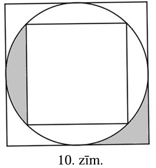
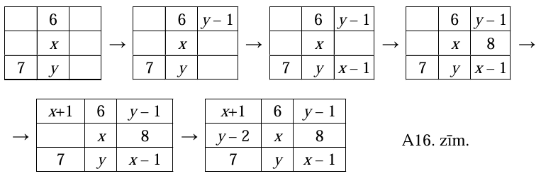

# <lo-sample/> LV.AMO.2014.5.1

Pūkainīšu ciemata bērniem Lieldienu zaķis atnesa olas. Katra no tām bija
nokrāsota tieši vienā no krāsām- sarkanā, dzeltenā, zilā. Zināms, ka
$20 \%$ jeb $40$ olas bija sarkanas, $\frac{3}{4}$ no atlikušajām bija
dzeltenas, bet pārējās- zilas. Aprēķini:

**(A)** Cik olas bija zilā krāsā?  
**(B)** Kāda daļa no visām olām bija zilas?  
**(C)** Cik procenti no visām olām bija dzeltenas?

<small>

* topic:AlgebraicEquations
* questionType:FindAll,FindAll,FindAll
* domain:Alg

</small>

## Atrisinājums

Tā kā $20 \%$ jeb $40$ olas bija sarkanas, tad Lieldienu zaķis bērniem atnesa
$200$ olas.

Dzeltenas olas bija $\frac{3}{4}$ no $160$ olām, tas ir, $120$ dzeltenas olas.
Tātad zilo olu skaits bija $200-120-40=40$. No visām olām
$\frac{40}{200}=\frac{1}{5}$ bija zilā krāsā. No visām olām
$\frac{120}{200}=\frac{60}{100}$ jeb $60 \%$ bija dzeltenā krāsā.

# <lo-sample/> LV.AMO.2014.5.2

Divu naturālu skaitļu pierakstā izmantoti tikai cipari $2, 3, 7$ un $8$. Vai var
gadīties, ka viens skaitlis ir tieši trīs reizes lielāks nekā otrs skaitlis?

<small>

* topic:IntegerCongruence
* questionType:ProveDisprove
* domain:NT

</small>

## Atrisinājums

Ja skaitļa pēdējais cipars ir $2, 3, 7$ vai $8$, tad trīs reizes lielāka
skaitļa pēdējais cipars ir attiecīgi $6, 9, 1$ vai $4$, bet pēc uzdevuma
nosacījumiem nevienu no šiem cipariem nevar izmantot skaitļu pierakstā. Tātad
uzdevumā prasītais nav iespējams.

# <lo-sample/> LV.AMO.2014.5.3

Taisnstūra $ABCD$ malu garumi izsakāmi veselos centimetros. Iekrāsotās daļas
laukums ir $6~ \mathrm{cm}^{2}$ (skat. 1.zīm.). Nogrieznis $AE$ ir
$\frac{1}{3}$ no taisnstūra malas $AD$. Aprēķini taisnstūra laukumu un
perimetru, ja zināms, ka viena taisnstūra mala ir par $5~ \mathrm{cm}$ garāka
nekā otra mala.

<small>

* topic:Rectangles
* questionType:FindAll
* domain:Geom
* concepts:rectangle,area,perimeter

</small>

## Atrisinājums

Ievērojam, ka trijstūra $BAE$ laukums ir puse no taisnstūra $BAEF$ laukuma
(skat. A1.zīm.). Tāpēc $BAEF$ laukums ir
$6 \cdot 2=12\left(\mathrm{~cm}^{2}\right)$. Tā kā $AE$ ir
$\frac{1}{3}$ no taisnstūra malas $AD$, tad taisnstūra $ABCD$ laukums ir trīs
reizes lielāks nekā $BAEF$ laukums, tas ir,
$3 \cdot 12=36\left(\mathrm{~cm}^{2}\right)$.

Pēc dotā taisnstūra $ABCD$ malu garumi ir veseli skaitļi, tāpēc taisnstūra
$ABCD$ laukums izsakāms kā divu veselu skaitļu reizinājums. Ievērojam, ka

$$36=36 \cdot 1=18 \cdot 2=12 \cdot 3=9 \cdot 4=6 \cdot 6$$

Uzdevuma nosacījumiem atbilst tikai reizinātāji $9$ un $4$. Līdz ar to
taisnstūra $ABCD$ perimetrs ir $2 \cdot(9+4)=26(\mathrm{~cm})$.

# <lo-sample/> LV.AMO.2014.5.4

Kvadrāts sastāv no $8 \times 8$ vienādām kvadrātiskām rūtiņām. Tas sagriezts
daļās tā, ka griezumi iet pa rūtiņu robežām.

Kāds lielākais skaits daļu var būt tādas kā 2.zīm. attēlotā figūra (figūras var
būt pagrieztas jebkurā stāvoklī)?

<small>

* topic:SquareGridCutting
* questionType:FindOptimal
* domain:Geom

</small>

## Atrisinājums

Tā kā $13 \cdot 5 = 65 > 64$, tad vairāk par $12$ norādītajām figūrām izgriezt
nevar. Izgriezt $12$ figūras var, piemēram, tā, kā parādīts A2.zīm.

# <lo-sample/> LV.AMO.2014.5.5

Kāds ir **(A)** mazākais, **(B)** lielākais skaitlis, kuru var izteikt gan kā
trīs, gan kā divu dažādu divciparu naturālu skaitļu reizinājumu?

<small>

* topic:NumTheoryInequalityLargeIntervals
* questionType:FindOptimal,FindOptimal
* domain:NT
* concepts:product

</small>

## Atrisinājums

**(A)** Trīs dažādu divciparu skaitļu mazākais iespējamais reizinājums ir
$10 \cdot 11 \cdot 12=1320$, tas iegūts sareizinot trīs mazākos divciparu
skaitļus. Skaitli $1320$ var izteikt arī kā divu dažādu divciparu skaitļu
reizinājumu. Piemēram, $1320=30 \cdot 44$. Tātad mazākais skaitlis, kas
apmierina uzdevuma nosacījumus, ir $1320$.

**(B)** Divu dažādu divciparu skaitļu lielākais iespējamais reizinājums ir
$99 \cdot 98=9702$, tas iegūts sareizinot divus lielākos divciparu skaitļus.
Skaitli $9702$ var sadalīt arī trīs divciparu skaitļu reizinājumā. Piemēram,
$9702=11 \cdot 18 \cdot 49$. Tātad skaitlis $9702$ ir lielākais meklētais
skaitlis.

# <lo-sample/> LV.AMO.2014.6.1

Klementīne ar trīs savām draudzenēm brīvdienās gāja makšķererēt. Tētis viņai
atļāva paņemt pusi no savas makšķerauklas. $60 \%$ no savas daļas viņa atdeva
vienai draudzenei, $50 \%$ no atlikušās daļas- otrai draudzenei un
$\frac{2}{3}$ no atlikušās auklas- trešajai draudzenei. Beigās Klementīnei
pašai palika $1$ metrs makšķerauklas. Cik gara bija makšķeraukla pašā sākumā?

<small>

* questionType:FindAll
* domain:Alg

</small>

## Atrisinājums

Pirms makšķerauklas atdošanas trešajai draudzenei Klementīnei bija palicis
$3 \cdot 1=3 \mathrm{~m}$. Pirms atdošanas otrai draudzenei bija palicis
$2 \cdot 3=6 \mathrm{~m}$. Pirms auklas atdošanas pirmajai draudzenei
Klementīnei bija $6 \cdot 5:2=15 \mathrm{~m}$ makšķerauklas. Tā kā tētis
Klementīnei atļāva paņemt pusi no savas makšķerauklas, tad makšķerauklas garums
pašā sākumā bija $2 \cdot 15=30$ $(m)$.

# <lo-sample/> LV.AMO.2014.6.2

Vai skaitļus no $1$ līdz $100$ var sadalīt divās grupās tā, ka skaitļu
reizinājumi abās grupās ir vienādi?

<small>

* questionType:ProveDisprove
* domain:NT

</small>

## Atrisinājums

Lai abu grupu skaitļu reizinājumi būtu vienādi, abās grupās kā skaitļu
pirmreizinātājiem jābūt pārstāvētiem vieniem un tiem pašiem pirmskaitļiem
vienādā skaitā. Taču visi pirmskaitļi, kas lielāki nekā $50$ un mazāki nekā
$100$ pavisam tiek pārstāvēti tikai vienu reizi katrs, tātad skaitļus no $1$
līdz $100$ nevar sadalīt pa divām grupām tā, lai katrā grupā būtu vienāds skaits.

# <lo-sample/> LV.AMO.2014.6.3

Ķērpjbārdis aizsūtīja Puszābaku uz veikalu pēc $3$ ksilofoniem, $20$
mikrofoniem un viena patafona. Puszābaks atgriezās, nopircis $20$ ksilofonus,
vienu mikrofonu un $3$ patafonus, pie tam viņš bija iztērējis tieši tik daudz
naudas, cik būtu arī, ja būtu nopircis to, ko Ķērpjbārdis viņam lūdza. Zināms,
ka patafons ir lētāks nekā ksilofons. Kas ir dārgāks - ksilofons vai mikrofons?
Atbildi pamatot!

<small>

* questionType:ProveDisprove
* domain:Alg

</small>

## Atrisinājums

Uzrakstām izteiksmi, kas izsaka kopējo pirkuma vērtību:

$3k+20m+1p=20k+1m+3p$ jeb $19m=17k+2p$

Tā kā patafons ir lētāks nekā ksilofons, tad iegūstam, ka $2$ ksilofoni ir
dārgāki nekā $2$ patafoni. Tāpēc $19$ ksilofoni maksā dārgāk nekā $19$
mikrofoni. No kā seko, ka ksilofons ir dārgāks nekā mikrofons.

# <lo-sample/> LV.AMO.2014.6.4

Kvadrāts, kura malas garums ir $4~\mathrm{m}$, sagriezts taisnstūros, kā
parādīts 3.zīm. Četru izcelto nogriežņu garumu summa ir $2~\mathrm{m}$.
Aprēķināt iekšējā taisnstūra perimetru!

<small>

* questionType:FindAll
* domain:Geom

</small>

## Atrisinājums

Katru izcelto nogriezni vēlreiz uzzīmējam uz katram nogrieznim pretējās kvadrāta
malas (skat. A3.zīm.). Tad visu astoņu izcelto nogriežņu kopējais garums būs
$2 \cdot 2=4~ \mathrm{m}$. Neizcelto nogriežņu kopējais garums ir
$4 \cdot 4-4=12$ $(m)$. Šo neizcelto nogriežņu garums sakrīt ar iekšējā
taisnstūra malu garumiem. Tātad iekšējā taisnstūra perimetrs ir $12~ \mathrm{m}$.

# <lo-sample/> LV.AMO.2014.6.5

Rūtiņu kvadrātā $5 \times 5$ iekrāsot iespējami maz rūtiņu tā, lai atlikušajā
daļā vairs nevarētu ievietot nevienu 4.zīm. redzamo figūru (tā var būt gan
pagriezta, gan apgāzta). Pamatot, ka iekrāsoto rūtiņu skaits ir mazākais
iespējamais!

<small>

* questionType:FindOptimal
* domain:Geom

</small>

## Atrisinājums

Ievērosim, ka taisnstūrī $2 \times 5$ jāiekrāso vismaz divas rūtiņas. Tas
nozīmē, ka kvadrātā $5 \times 5$ jāiekrāso vismaz četras rūtiņas. Tas, ka ar
četrām iekrāsotām rūtiņām pietiek, redzams A4.zīm.

# <lo-sample/> LV.AMO.2014.7.1

Trijstūrī $ABC$ novilkts augstums $BD$ un mediāna $BE$. Kāds var būt $AC$
garums, ja $ED=4 \mathrm{~cm}$ un $DC=5 \mathrm{~cm}$ ?

<small>

* concepts:triangle,height,median
* questionType:FindAll
* domain:Geom

</small>

## Atrisinājums

Ievērojam, ka trijstūra mediāna vienmēr atrodas trijstūra iekšpusē, bet
augstums var atrasties arī ārpus trijstūra. Iespējami vairāki gadījumi, kā var
būt novietots augstums $BD$ un mediāna $BE$ :

- Punkti $D, A, E, C$ ir tieši šādā secībā (skat. A5.zīm.). No nogriežņu garuma
  īpašībām seko, ka $EC=CD-ED=5-4=1 \mathrm{~cm}$. Tā kā $BE$ ir mediāna, tad
  $AC=2 \cdot EC=2 \cdot 1=2 \mathrm{~cm}$.

- Punktu secība $A, D, E, C$ nav iespējama, jo tad $EC=CD-DE=5-4=1$ $(cm)$ un
  $AC=2 \mathrm{~cm}$. No otras puses $AC=AD+DC=AD+5 > 5$. Iegūta pretruna.
- Punkti $A, E, D, C$ ir tieši šādā secībā (skat. A6.zīm.). No nogriežņu garuma
  īpašībām seko, ka $EC=ED+DC=5+4=9 \quad$ (cm). Tā kā $BE$ ir mediāna, tad
  $AC=2 \cdot EC=2 \cdot 9=18 \mathrm{~cm}$.

- Punktu secība $A, E, C, D$ nav iespējama, jo tad $ED=EC+CD=EC+5 > 4$.

Līdz ar to $AC$ garums ir $2~ \mathrm{cm}$ vai $18~ \mathrm{cm}$.

# <lo-sample/> LV.AMO.2014.7.2

Vai var atrast tādus veselus skaitļus $a$ un $b$, kuriem izpildās vienādība

$$a \cdot(3a+5b) \cdot 7b=7654321$$?

<small>

* topic:ModularParity
* questionType:ProveDisprove
* domain:Alg

</small>

## Atrisinājums

Reizinājums $a \cdot(3a+5b) \cdot 7b$ vienmēr ir pāra skaitlis:

- ja kāds no reizinātājiem $a$ vai $b$ ir pāra skaitlis, tad reizinājums ir pāra
 skaitlis;
- ja $a$ un $b$ abi ir nepāra skaitļi, tad summa $3a+5b$ ir pāra skaitlis (divu
  nepāra skaitļu summa ir pāra skaitlis), tātad viss reizinājums ir pāra
  skaitlis.

Līdz ar to esam ieguvuši, ka kreisās puses skaitlis ir pāra, bet labajā pusē ir
nepāra skaitlis. Iegūta pretruna, tāpēc nevar atrast skaitļus $a$ un $b$, lai
izpildītos dotā vienādība.

## Atrisinājums

Nepāra reizinājums $a \cdot(3a+5b) \cdot 7b$ nozīmē, ka $a,b$ ir nepāru. 
Bet tad $3a+5b$ ir pāru, kas ir pretruna. 

# <lo-sample/> LV.AMO.2014.7.3

Lelde apgalvo, ka sešas skrūves ir smagākas nekā septiņas naglas, bet Elīna
apgalvo, ka septiņas skrūves ir smagākas nekā astoņas naglas. Zināms, ka vienai
no meitenēm ir taisnība, bet otra kļūdās. Vai tiesa, ka $18$ skrūves ir
smagākas nekā **(A)** $20$ naglas, **(B)** $21$ nagla, **(C)** $22$ naglas? Visām
skrūvēm svars ir vienāds, visām naglām arī.

<small>

* questionType:ProveDisprove,ProveDisprove,ProveDisprove
* domain:Alg

</small>

## Atrisinājums

Aplūkosim, ko no meiteņu apgalvojumiem varētu secināt $42$ skrūvju gadījumā:

- ja patiess ir Leldes apgalvojums, tad $42$ skrūves ir smagākas nekā $49$
  naglas;
- ja patiess ir Elīnas apgalvojums, tad $42$ skrūves ir smagākas nekā $48$
  naglas.

No Leldes apgalvojuma patiesuma sekotu arī Elīnas apgalvojuma patiesums. Tā kā
ir zināms, ka tikai vienai no meitenēm ir taisnība, bet otrai- nē, tad taisnība
ir Elīnai, bet Leldes apgalvojums nav patiess.

Pārbaudīsim, kuri no dotajiem apgalvojumiem var būt patiesi:

**(A)** No Elīnas apgalvojuma $7s > 8n$ seko, ka patiess ir arī apgalvojums
$18 \cdot 7s > 18 \cdot 8n$ jeb $126s > 144n > 140n$. No $126s > 140n$
seko, ka $18s > 20n$ ir patiess. Tātad apgalvojums „ $18$ skrūves ir
smagākas nekā $20$ naglas” ir patiess.

**(B)** Tā kā Leldes apgalvojums $6s > 7n$ nav patiess, tad apgalvojums
$18s > 21n$ ($18$ skrūves ir smagākas nekā $21$ nagla) arī nav patiess.

**(C)** Ja $18s > 22n$ būtu patiess, tad arī $18s > 21n$ būtu patiess. Jau
(B) gadījumā pierādījām, ka otrais apgalvojums nav patiess. Tātad arī
apgalvojums $18s > 22n$ ($18$ skrūves ir smagākas nekā $22$ naglas) nav
patiess.

# <lo-sample/> LV.AMO.2014.7.4

Tabulas $3 \times 3$ rūtiņās katrā rūtiņā jāieraksta pa vienam naturālam
skaitlim tā, lai katrā rindā, katrā kolonnā un katrā diagonālē ierakstīto
skaitļu summas būtu vienādas. Ir zināmi divās rūtiņās ierakstītie skaitļi
(skat. 5.zīm.). Kādam skaitlim jābūt rūtiņā, kas apzīmēta ar jautājuma zīmi?
Atrodiet visas iespējamās vērtības un pamatojiet, ka citu nav!

<small>

* topic:NumTheoryExprVariables
* questionType:FindAll
* domain:Alg
* genre:magic-configuration

</small>

## Atrisinājums

Apzīmēsim skaitli, kas atrodas vidējās kolonnas vidējā rūtiņā ar $x$, bet
apakšējā- ar $y$. Tad visu rindu, kolonnu un diagonāļu summas ir $24+x+y$.
Tālāk tabulas rūtiņas var aizpildīt šādi (skat. A7.zīm.):

Tātad rūtiņā, kas bija apzīmēta ar jautājuma zīmi, ir ierakstīts skaitlis $2$.

## Atrisinājums

Ja $a_{22}=x$, tad summas ir $3x$. Un $a_{13}=2x-13$,
$a_{11}=x-11$, $a_{33}=x+11$, $a_{23}=2$.

# <lo-sample/> LV.AMO.2014.7.5

Kādu mazāko skaitu rūtiņu jāizgriež no kvadrāta $6 \times 6$, lai no atlikušās
daļas nevarētu izgriezt 6.zīm. parādīto figūru?(Figūru malās jāiet pa rūtiņu
līnijām.)

<small>

* questionType:FindOptimal
* domain:Geom

</small>

## Atrisinājums

Sadalām kvadrātu $6 \times 6$ četros kvadrātos $3 \times 3$ (skat. A8.zīm.) un
ievērojam, ka katrā šādā kvadrātā jāizgriež vismaz divas rūtiņas. Tātad kopā
jāizgriež vismaz $8$ rūtiņas. Tas, ka ar $8$ rūtiņām pietiek, redzams no
A9. zīmējuma.

# <lo-sample/> LV.AMO.2014.8.1

Skaitli $\frac{1}{13}$ pārveidoja par bezgalīgu decimāldaļu un tajā izsvītroja
$2014.$ ciparu aiz komata.

Kurš skaitlis lielāks- sākotnējais vai iegūtais?

<small>

* topic:PeriodicRemainders
* topic:NumericAlgorithms
* questionType:FindAll
* domain:NT
* concepts:decimal-fractions
* genre:digit-manipulation

</small>

## Atrisinājums

Pārveidojot skaitli $\frac{1}{13}$ decimāldaļā (t.i., dalot $1$ ar $13$),
iegūstam

Tā kā katrs nākamais cipars dalījumā atkarīgs tikai no tā atlikuma, kurš iegūts
iepriekšējā dalīšanas solī., tad, līdzko parādās kāds jau iepriekš sastapts
skaitlis (atlikums), izveidojas periods. Kā redzam, daļa
$\frac{1}{13}=0,(076923)$ ir bezgalīga periodiska decimāldaļa ar perioda garumu
$6$ cipari. Tātad $2014.$ vietā aiz komata atrodas tāds pats cipars kā $4.$
vietā aiz komata, jo $2014=335 \cdot 6+4$. Tas ir cipars $9$. Ja mēs šo ciparu
izsvītrojam, tad jauniegūtajā skaitlī 2014. cipars aiz komata būs cipars $2$
(nākamais, kas seko aiz $9$). Skaitlim $\frac{1}{13}$ un iegūtajam skaitlim ir
$0$ veseli un pirmie $2013$ cipari aiz komata sakrīt, tad lielāks būs tas
skaitlis, kuram ir lielāks $2014.$ cipars aiz komata. Tā kā $9=2$, tad
$\frac{1}{13}$ ir lielāka nekā iegūtais skaitlis.

## Atrisinājums

$1/13=0.(076923076923)$ (periods $12$ cipari). 
$2014$-tais cipars ir tāds pats kā $10$-tais cipars ir $9$, 
aiz kura seko cipars $2$. Izsvītrojot šo ciparu $9$, tas aizstājas
ar $2$, tāpēc skaitlis kļūst mazāks.

# <lo-sample/> LV.AMO.2014.8.2

Atrast visus naturālos skaitļus, kas nepārsniedz $1000000$ un kuri, nosvītrojot
to pirmo ciparu, samazinās $15$ reizes!

<small>

* topic:NumTheoryExpr
* topic:NotationFragments
* questionType:FindAll
* domain:NT

</small>

## Atrisinājums

Apzīmēsim meklējamo skaitli ar $a \cdot 10^{k}+B$, kur $a$ ir pirmais cipars
(kas tiek nosvītrots), bet $B$ ir $k$ ciparu skaitlis, kas paliek pēc $a$
nosvītrošanas ( $1 \leq k \leq 5$ ).

Tad $a \cdot 10^{k}+B=15 \cdot B \Rightarrow a \cdot 10^{k}=14 \cdot B \Rightarrow a \cdot 2^{k} \cdot 5^{k}=2 \cdot 7 \cdot B$.

Tātad $a$ dalās $7$. Tā kā $a$ ir cipars, tad $a=7$ un
$B=2^{k-1} \cdot 5^{k}=5 \cdot 10^{k-1}, 1 \leq k \leq 5$.

Pavisam ir pieci skaitļi, kas apmierina uzdevuma nosacījumus:
$75, 750, 7500, 75000, 750000$.

## Atrisinājums

$a$ - 1.cipars; $a \cdot 10^k + b = 15b$; $a \cdot 10^k = 14b$. 
Tad $a = 7$, $b=5\cdot 10^{k-1}$. 

# <lo-sample/> LV.AMO.2014.8.3

Astoņi punkti savienoti ar šķautnēm kā kuba karkass (skat. 7.zīm.). Pierādīt,
ka, izvēloties jebkurus $5$ punktus, tie būs savienoti ar vismaz $3$ šķautnēm!

<small>

* questionType:Prove
* domain:Comb

</small>

## Atrisinājums

Apskatām kuba augšējo un apakšējo skaldni. Izvēlēto punktu skaitu no augšējās
skaldnes apzīmēsim ar $a$, bet no apakšējās- ar $b$. Tad $a+b=5$ un
$a \neq b$. Varam pieņemt, ka $a > b$, tāpēc $a \geq 3$ un $a$ var būt $3$ vai
$4$.

Apskatām abus gadījumus:

- Ja $a=4$, tad augšējie $4$ punkti savā starpā jau ir savienoti ar $4$ šķautnēm.
- Ja $a=3$, tad šie augšējie trīs punkti ir savienoti ar $4-2=2$ šķautnēm.
  Savukārt kāds no apakšējiem diviem punktiem neatradīsies zem tās augšējās kuba
  virsotnes, kas netika izvēlēta. Tāpēc tas atradīsies zem kāda jau izvēlēta
  punkta un būs vertikāla kuba šķautne, kurai abi gali ir izvēlētie punkti.
  Tāpēc kopā būs vismaz $2+1=3$ šķautnes, kas tos savieno.

Līdz ar to esam pierādījuši prasīto.

# <lo-sample/> LV.AMO.2014.8.4

Rūtiņu lapā rūtiņu virsotnēs atzīmēti punkti $A, B, C, D, E$ un novilkti
nogriežņi $AB, BC, CD$ un $DE$ (skat. 8.zīm.). Kurš no leņķiem
$\sphericalangle ABC$ un $\sphericalangle CDE$ ir lielāks?

<small>

* questionType:ProveDisprove
* domain:Geom

</small>

## Atrisinājums

Ievērojam, ka trijstūris $BFC$ ir vienādsānu taisnleņķa trijstūris
(skat. A10.zīm.), tāpēc $\sphericalangle ABC=45^{\circ}$.

Trijstūri $DHC$ un $EGC$ ir vienādi pēc pazīmes „ $mm \ell$ ”, tāpēc $CD=CG$ un
$\sphericalangle CDH= \sphericalangle ECG$ kā atbilstošās malas un leņķi.
Iegūst, ka
$\sphericalangle DCE=\sphericalangle DCH+\sphericalangle HCE=\sphericalangle ECG+\sphericalangle HCE=90^{\circ}$.
Tātad arī trijstūris $DCE$ ir vienādsānu taisnleņķa trijstūris, tāpēc
$\sphericalangle CDE=45^{\circ}$. Līdz ar to esam parādījuši, ka
$\sphericalangle ABC=\sphericalangle CDE=45^{\circ}$.

# <lo-sample/> LV.AMO.2014.8.5

Tabulas $3 \times 3$ rūtiņās katrā rūtiņā jāieraksta pa vienam naturālam
skaitlim tā, lai katrā rindā, katrā kolonnā un katrā diagonālē ierakstīto
skaitļu summas būtu vienādas. Augšējās rindas vidējā rūtiņā ierakstīts skaitlis
$24$ (skat. 9.zīm.). Vai rūtiņā, kas apzīmēta ar jautājuma zīmi, var būt
ierakstīts skaitlis **(A)** $7$, **(B)** $17$?

<small>

* topic:NumTheoryExprVariables
* topic:TreeTraversalBacktracking
* questionType:ProveDisprove
* domain:Alg

</small>

## Atrisinājums

Apzīmēsim skaitli, kas atrodas vidējās kolonnas vidējā rūtiņā ar $x$, bet
apakšējā- ar $y$. Tad visu rindu, kolonnu un diagonāļu summas ir $24+x+y$.
Tālāk tabulas rūtiņas var aizpildīt šādi:

**(A)**

Esam ieguvuši pretrunu, ka vidējās rindas labajā rūtiņā jābūt negatīvam skaitlim.
Tātad rūtiņā, kas bija apzīmēta ar jautājuma zīmi, nevar būt ierakstīts skaitlis
$7$.

**(B)**

Vienas diagonāles skaitļu summa ir $3x$. Tātad $y=2x-24$. Ievietojot $x=13$,
iegūsim vienu derīgu tabulas aizpildījumu:

## Atrisinājums

Apzīmējam $a_{22}=x$, $a_{31}=b$.
Tad $a_{13}=2x-b$, $a_{11}=x+b-24$, $a_{33}=x-b+24$, $a_{23}=2b-24$. Pie $b=7$, $a_{23}<0$.

# <lo-sample/> LV.AMO.2014.9.1

Kvadrātā, kura malas garums ir $2$, ievilkts riņķis un šajā riņķī ievilkts
kvadrāts (skat. 10.zīm.). Aprēķināt iekrāsoto daļu laukumu summu!

<small>

* questionType:FindAll
* domain:Geom

</small>

## Atrisinājums

Ievilktā riņķa rādiusa garums ir puse no kvadrāta $ABCD$ malas garuma, t.i.,
$EO=FO=\frac{1}{2} AB=1$. Izmantojot Pitagora teorēmu trijstūrī $EOF$
(skat. A14.zīm.), iegūstam $EF=\sqrt{EO^{2}+FO^{2}}=\sqrt{2}$.

Aprēķinām katras iekrāsotās daļas laukumu:

- $S_{1}=\frac{1}{4}\left(S_{ABCD}-S_{O}\right)=\frac{1}{4}\left(AB^{2}-\pi \cdot EO^{2}\right)=\frac{1}{4}(4-\pi)$;
- $S_{2}=\frac{1}{4}\left(S_{\mathrm{O}}-S_{EFGH}\right)=\frac{1}{4}\left(\pi \cdot EO^{2}-EF^{2}\right)=\frac{1}{4}(\pi-2)$.

Līdz ar to
$S_{1}+S_{2}=\frac{1}{4}(4-\pi)+\frac{1}{4}(\pi-2)=\frac{4-\pi+\pi-2}{4}=\frac{1}{2}$.

# <lo-sample/> LV.AMO.2014.9.2

Doti četri dažādi cipari, neviens no tiem nav $0$. Visu divciparu skaitļu, kurus
var izveidot no šiem cipariem, summa ir $1276$. Atrast dotos četrus ciparus!

<small>

* concepts:sum
* questionType:FindAll
* domain:NT

</small>

## Atrisinājums

Dotos ciparus apzīmēsim ar $a, b, c, d$. No tiem var izveidot $16$ dažādus
divciparu skaitļus. Katrs no šiem cipariem četros skaitļos ir desmitu cipars un
četros skaitļos- vienu cipars. Visu šo divciparu skaitļu summa ir

$$4 \cdot 10 \cdot(a+b+c+d)+4 \cdot(a+b+c+d)=44(a+b+c+d)=1276$$

tātad $a+b+c+d=1276:44=29$. Vienīgā iespēja, ka četru dažādu nenulles ciparu
summa ir $29$, ir tad, ja šie cipari ir $5, 7, 8$ un $9$.

# <lo-sample/> LV.AMO.2014.9.3

Trijstūrī $ABC$ leņķis $\sphericalangle ABC=90^{\circ}$. Punkti $M$ un $N$ ir
attiecīgi nogriežņu $AC$ un $AM$ viduspunkti. Caur $B, M$ un $N$ vilktā riņķa
līnija krusto malas $AB$ un $BC$ attiecīgi to iekšējos punktos $P$ un $Q$.
Zināms, ka $AC || PQ$. Aprēķināt $\sphericalangle BAC$ vērtību!

<small>

* questionType:FindAll
* domain:Geom

</small>

## Atrisinājums

Apzīmēsim $\sphericalangle BAC=\alpha, \sphericalangle BCA=\beta$, tad
$\alpha+\beta=90^{\circ}$ (skat. A15.zīm.). No $AC || PQ$ seko, ka
$\sphericalangle BQP=\sphericalangle BCA=\beta$. Tā kā
$\sphericalangle ABC=90^{\circ}$ un $M$ ir hipotenūzas $AC$ viduspunkts, tad
$\sphericalangle ABM=\sphericalangle BAM=\alpha$. Tad
$\sphericalangle PQM=\sphericalangle PBM=\alpha$ kā ievilktie leņķi, kas balstās
uz vienu loku. Līdz ar to
$\sphericalangle BQM=\sphericalangle PQM+\sphericalangle BQP=\alpha+\beta=90^{\circ}$.

Tādā gadījumā
$\sphericalangle BNM=180^{\circ}-\sphericalangle BQM=90^{\circ}$ kā pretējie
leņķi. Bet no dotā $AN=NM$, tāpēc $BN$ ir mediāna un augstums
$\triangle ABM$, tāpēc $AB=BM$. Savukārt no
$\sphericalangle ABM=\sphericalangle BAM$ seko, ka $BM=AM$. Līdz ar to
$\triangle ABM$ ir regulārs un
$\sphericalangle BAC=\sphericalangle BAM=60^{\circ}$.

# <lo-sample/> LV.AMO.2014.9.4

Tabulas $3 \times 3$ rūtiņās katrā rūtiņā jāieraksta pa vienam naturālam
skaitlim tā, lai katrā rindā, katrā kolonnā un katrā diagonālē ierakstīto
skaitļu summas būtu vienādas, bet visi tabulā ierakstītie skaitļi ir savā starpā
atšķirīgi. Ir zināmi divās rūtiņās ierakstītie skaitļi (skat. 11.zīm.). Kāds ir
mazākais skaitlis, kas var būt ierakstīts tabulas centrālajā rūtiņā?

<small>

* questionType:FindOptimal
* domain:Alg

</small>

## Atrisinājums

Apzīmēsim skaitli, kas atrodas vidējās kolonnas vidējā rūtiņā ar $x$, bet
apakšējā- ar $y$. Tad visu rindu, kolonnu un diagonāļu summas ir $6+x+y$. Tālāk
tabulas rūtiņas var aizpildīt šādi:

Vienas diagonāles skaitļu summa ir $3x$. Tātad $y=2x-6$.

Atliek izvēlēties tādu mazāko $x$, lai visi tabulā ierakstītie skaitļi būtu
naturāli un savā starpā atšķirīgi. Jāizpildās nevienādībai $2x-8 > 0$ jeb
$x > 4$.

Apskatām iespējamās $x$ vērtības:

- $x=5$ neder, jo $x+1=6$, bet tabulā jau ir ierakstīts skaitlis $6$;
- $x=6, x=7$ un $x=8$ neder, jo tabulā jau ir ierakstīti skaitļi $6, 7, 8$;
- $x=9$ neder, jo $x-1=8$, bet tabulā jau ir ierakstīts skaitlis $8$;
- $x=10$ der un aizpildīta tabula parādīta A18.zīm.

Līdz ar to mazākais skaitlis, kas var būt ierakstīts tabulas centrālajā rūtiņā,
ir $10$.

# <lo-sample/> LV.AMO.2014.9.5

Katram marsietim ir trīs rokas un dažas antenas. Visi marsieši sadevās rokās
(katrs marsietis sadevās rokās ar $3$ citiem marsiešiem tā, ka visas rokas bija
aizņemtas). Izrādījās, ka katriem diviem marsiešiem, kas bija sadevuši rokās,
antenu skaits atšķīrās tieši $6$ reizes. Vai kopējais antenu skaits visiem
marsiešiem var būt $2014$?

<small>

* questionType:ProveDisprove
* domain:Comb

</small>

## Atrisinājums

Iedomāsimies, ka katram marsietim katrā rokā ir tik margrietiņu, cik viņam ir
antenu. Tādā gadījumā margrietiņu kopējais skaits būs trīs reizes lielāks nekā
kopējais antenu skaits, t.i., margrietiņu skaits būs $3 \cdot 2014$.

No otras puses pēc uzdevumā dotā ("antenu skaits atšķīrās tieši $6$ reizes")
katras divas savienotas rokas kopā tur margrietiņu skaitu, kas ir skaitļa
$7$ daudzkārtnis (ja vienam marsietim vienā rokā ir $x$ margrietiņas, bet otram-
$6x$ margrietiņas, tad abiem kopā ir $7x$ margrietiņas). Tātad margrietiņu
kopējam skaitam jādalās ar $7$, bet $3 \cdot 2014=3 \cdot 2 \cdot 19 \cdot 53$
nedalās ar $7$. Līdz ar to esam parādījuši, ka kopējais antenu skaits nevar būt
$2014$.

# <lo-sample/> LV.AMO.2014.10.1

Noteikt, vai virkne $a_{n}=\frac{3n+7}{n+2}$, $n$- naturāls skaitlis, ir augoša
vai dilstoša!

<small>

* questionType:ProveDisprove
* domain:Alg

</small>

## Atrisinājums

Virkni sauc par augošu (dilstošu), ja katrs nākamais virknes loceklis ir
lielāks (mazāks) nekā iepriekšējais.

Apskatām starpību $a_{n+1}-a_{n}$ :

$$\begin{aligned}
a_{n+1}-a_{n} & =\frac{3(n+1)+7}{(n+1)+2}-\frac{3n+7}{n+2}=\frac{3n+10}{n+3}-\frac{3n+7}{n+2}= \\
& =\frac{3n^{2}+6n+10n+20-\left(3n^{2}+7n+9n+21\right)}{(n+3)(n+2)}=\frac{-1}{(n+3)(n+2)} < 0
\end{aligned}
$$

Esam ieguvuši, ka $a_{n+1} < a_{n}$. Tātad virkne $a_{n}=\frac{3n+7}{n+2}$ ir
dilstoša.

# <lo-sample/> LV.AMO.2014.10.2

Dotas divas paralēlas taisnes. Uz vienas no tām atzīmēti $14$ zaļi punkti, uz
otras- $14$ sarkani punkti. Kādu lielāko skaitu nogriežņu, kuriem viens
galapunkts ir zaļš, bet otrs - sarkans, var novilkt tā, lai tie nekrustotos?

Saka, ka nogriežņi krustojas, ja tiem ir kopīgs iekšējais punkts, t.i., ja tiem
ir kopīgs tikai galapunkts, tie nekrustojas.

<small>

* questionType:FindOptimal
* domain:Geom,Comb

</small>

## Atrisinājums

Visus zaļos punktus sanumurējam no kreisās uz labo pusi ar skaitļiem no $1$
līdz $14$ (skat. A19.zīm.). Līdzīgi sanumurējam visus sarkanos punktus. Tā kā
nogriežņi nekrustojas, tad tie sakārtoti virzienā no kreisās uz labo pusi.
Aplūkojam katra nogriežņa galapunktos ierakstīto skaitļu summas. Tā ir stingri
augoša virkne. Mazākā summa ir $2$, lielākā- $28$. Pavisam iespējamas $27$
vērtības. Kā uzzīmēt $27$ nogriežņus skat., piem., 17.zīm.

# <lo-sample/> LV.AMO.2014.10.3

Aplūkosim funkcijas $y=x^{2}+ax+b$, kur $a+2b=2014$. Pierādīt, ka visu šādu
funkciju grafikiem ir kopīgs punkts!

<small>

* questionType:Prove
* domain:Alg

</small>

## Atrisinājums

Aplūkosim dotās funkcijas vērtību pie $x=\frac{1}{2}$ :

$$y=\frac{1}{4}+\frac{a}{2}+b=\frac{1}{2}(a+2b)+\frac{1}{4}=\frac{1}{2} \cdot 2014+\frac{1}{4}=1007 \frac{1}{4}$$

Tātad punkts $\left(\frac{1}{2}, 1007 \frac{1}{4}\right)$ ir kopīgs visu
funkciju grafikiem.

# <lo-sample/> LV.AMO.2014.10.4

Doti septiņi dažādi naturāli skaitļi; katriem diviem no dotajiem skaitļiem
aprēķināja to summu. Kāds lielākais skaits no šīm summām var būt pirmskaitļi?

<small>

* topic:ModularParity
* topic:BipartiteGraphs
* topic:ModularArithmetic
* topic:TreeTraversalBacktracking
* questionType:FindOptimal
* domain:NT
* concepts:sum,primes

</small>

## Atrisinājums

Ja starp dotajiem ir $k$ pāra skaitļi un $7-k$ nepāra skaitļi, tad starp summām
ir $k(7-k)$ nepāra skaitļi, bet pārējie ir pāra skaitļi un nav pirmskaitļi
(neviena no summām nav $2$, jo $2$ nav izsakāms kā divu dažādu naturālu skaitļu
summa). Izteiksme $k(7-k)$ savu lielāko vērtību, kad
$k \in\{0 ; 1 ; 2 ; \ldots ; 7\}$, pieņem pie $k=3$ un $k=4$, un šī lielākā
vērtība ir $12$.

$12$ pirmskaitļi ir iespējami, piemēram, ja doti skaitļi $2,4,8,14,3,9,15$, tad
nepāra summas ir $5, 11, 17, 7, 13, 19, 11, 17, 23, 17, 23, 29$, kas visas ir
pirmskaitļi.

## Atrisinājums

Ievērojam, ka vajadzīgs lielākais *skaits*, kas var būt 
pirmskaitļi. Nevis lielākais *dažādu pirmskaitļu* skaits, ko 
var šādi iegūt.

Dažādu naturālu skaitļu summa nevar būt $2$.
Tātad, lai divu skaitļu summa būtu (nepāru) pirmskaitlis, 
viens no tiem ir pāru, otrs ir nepāru. 
Cik no 7 ir pāru un cik nepāru skaitļu?

$$7=0+7=1+6=2+5=3+4=4+3=5+2=6+1=7+0$$

Lielākais teorētiski iespējamais $(n,p)$ pārīšu skaits ir tad, 
ja $4$ no septiņiem skaitļiem ir nepāru un $3$ ir pāru (vai otrādi):
$4\cdot{}3=12$.

Zīmējam grafu:

* Nepāru skaitļi veido kopu $A$ ar $4$ elementiem, 
  pāru skaitļi veido kopu $B$ ar $3$ elementiem. 
* Ir tikai $4\cdot{}3$ pāri, kam ir cerība būt pirmskaitļiem. 
  (Saskaitot $p+p$ vai $n+n$ pirmskaitli iegūt nevar.)

**Definīcija:** Ja grafā visas virsotnes var sadalīt divās nepārklājošās 
apakškopās $A$ un $B$ tā, ka jebkura grafa šķautne iet no virsotnes 
kopā $A$ uz virsotni kopā $B$, tad grafu sauc par *divdaļīgu*.  

**Apgalvojums:** Ja divdaļīgā grafā apakškopās $A$ un $B$ ir attiecīgi 
$a$ un $b$ virsotnes, tad tajā ir ne vairāk kā $a\cdot{}b$ šķautnes.

Aplūkojam atlikumus, dalot ar 3.

* Izvēloties vismazākos nepāru un pāru skaitļus, tikai $9$ no $12$ 
  teorētiski iespējamajiem ir pirmskaitļi (citas summas dalās ar $9$ - 
  apzīmētas ar raustītu līniju). 
* Ja papildus prasa, lai visi $7$ skaitļi dotu atlikumu $1$ 
  (vai, izņēmuma gadījumā, atlikumu $0$), 
  dalot ar $3$, var panākt, lai visas $12$ summas būtu pirmskaitļi.

# <lo-sample/> LV.AMO.2014.10.5

Uz taisnstūra $ABCD$ diagonāles $BD$ iespējams atrast iekšēju punktu $P$ tā, ka
$\sphericalangle PAB=\sphericalangle PCB$. Pierādīt, ka $ABCD$ ir kvadrāts!

<small>

* questionType:Prove
* domain:Geom

</small>

## Atrisinājums

Pieņemsim pretējo, ka $ABCD$ nav kvadrāts. Attēlosim punktu $C$ simetriski pret
taisni $BD$ punktā $C^{\prime}$ (skat. A20.zīm.). No pieņēmuma seko, ka $A$
nesakrīt ar $C^{\prime}$. Ievērojam, ka $\sphericalangle BAD=90^{\circ}$ un
simetrijas dēļ $\sphericalangle BC^{\prime} D=\sphericalangle BCD=90^{\circ}$.
Tāpēc $\sphericalangle BAD=\sphericalangle BC^{\prime} D$ un ap $C^{\prime} ABD$
var apvilkt riņka līniju. No dotā $\sphericalangle PAB=\sphericalangle PCB$, un
no simetrijas $\sphericalangle PAB=\sphericalangle PC^{\prime} B$. Tātad
$\sphericalangle PAB=\sphericalangle PC^{\prime} B$ un arī ap
$C^{\prime} ABP$ var apvilkt riņķa līniju. Bet caur trīs punktiem (šajā
gadījumā $C^{\prime}, A$ un $B$ ) var novilkt tikai vienu riņķa līniju, tāpēc
$P$ sakrīt ar $D$, kas ir pretrunā ar to, ka $P$ ir $BD$ iekšējais punkts.
Līdz ar to esam pierādījuši, ka $ABCD$ ir kvadrāts.

## Atrisinājums

Pieņemsim, ka šāds punkts $P$ tomēr eksistē arī taisnstūrim, kas nav kvadrāts
($AD < AB$ un $\sphericalangle PAB=\sphericalangle PCB=\alpha$ ). Viegli
pamanīt, ka $\alpha$ nevar būt $45^{\circ}$, jo tad attiecīgie stari no $A$ un
$C$ ir paralēli (skat. A21.zīm.).

Pieņemsim, ka $\alpha < 45^{\circ}$.

Atliksim uz malas $AB$ punktu $E$, bet uz malas $CD$ punktu $F$ tā, ka
$BEFC$- kvadrāts ($BE=CF=BC$).

Novilksim kvadrāta diagonāli $BF$. Tā krusto $CP$ punktā $Q$. Savienojot punktu
$Q$ ar $E$, iegūstam
divus vienādus trijstūrus $BCQ$ un $BEQ$ (pēc pazīmes " $m \ell m$ ", jo
$BC=BE$, $\sphericalangle CBQ=\sphericalangle EBQ=45^{\circ}$, $BQ$- kopīga).
Tātad $\sphericalangle BEQ=\sphericalangle BCQ=\alpha$. Tā kā
$\alpha < 45^{\circ}$, tad punkti $P$ un $A$ atrodas taisnes $EQ$ pretējās
pusēs- tātad $EQ$ krusto $AP$. Līdz ar to $AP$ un $EQ$ nevar būt paralēli un
vienlaikus veidot leņķi $\alpha$ ar $AB$.

Ja $\sphericalangle PAB=45^{\circ}$, tad par $\alpha$ izvēlas
$\sphericalangle PAD=90^{\circ}-\sphericalangle PAB$ un
$\sphericalangle PCD=90^{\circ}-\sphericalangle PCB$. Šajā gadījumā kvadrātu
būvē uz malas $AD$ un pierādījums ir identisks iepriekšējam. Tātad gadījumā, ja
taisnstūris nav kvadrāts, šāds punkts neeksistē. Līdz ar to $ABCD$ jābūt
kvadrātam, kas arī bija jāpierāda.

*Piezīme.* Prasīto iespējams pierādīt arī tehniski ar proporciju palīdzību.

# <lo-sample/> LV.AMO.2014.11.1

Uz riņķa līnijas atlikti **(A)** $6$; **(B)** $2014$ punkti. Viens no tiem
nokrāsots sarkans, bet pārējie balti. Apskatām visus daudzstūrus, kuriem visas
virsotnes ir kādi no nokrāsotajiem punktiem. Kādu daudzstūru ir vairāk- to, kam
viena virsotne ir sarkana, vai to, kam visas virsotnes ir baltas?

<small>

* questionType:ProveDisprove,ProveDisprove
* domain:Comb

</small>

## Atrisinājums

Aplūkosim visus daudzstūrus, kam visas virsotnes ir baltas. Pievienojot katram
no tiem sarkano virsotni, iegūsim daudzstūrus, kam viena virsotne ir sarkana,
pie tam tie visi būs dažādi. Bez tam vēl ir trijstūri, kam viena virsotne ir
sarkana un kurus nevar iegūt no daudzstūriem, kam visas virsotnes ir baltas.
Tātad abos gadījumos daudzstūru ar sarkano virsotni ir vairāk.

# <lo-sample/> LV.AMO.2014.11.2

Skaitļu virknei $\left(a_{i}\right)$ visiem $n > 1$ ir spēkā sakarība
$a_{1}+a_{2}+\ldots+a_{n}=n^{2} a_{n}$. Aprēķināt $a_{50}$, ja zināms, ka
$a_{1}=1000$.

<small>

* concepts:sequence
* questionType:FindAll
* domain:Alg

</small>

## Atrisinājums

Apzīmējam $S_{n}=a_{1}+a_{2}+\ldots+a_{n}$. Tad
$n^2 a_n=S_n$ , $(n+1)^{2}a_{n+1}=S_{n+1}$ un

$$\begin{gathered}
S_{n+1}-S_{n}=a_{n+1}=(n+1)^{2}a_{n+1}-n^{2}a_{n} \Rightarrow a_{n+1}\left(n^{2}+2n\right)=n^{2}a_{n} \Rightarrow \\
a_{n+1}=\frac{n}{n+2} \cdot a_{n}=\frac{n}{n+2} \cdot \frac{n-1}{n+1} a_{n-1}=\frac{n}{n+2} \cdot \frac{n-1}{n+1} \cdot \frac{n-2}{n} a_{n-2}=\ldots=\frac{1}{n+2} \cdot \frac{1}{n+1} \cdot 2 \cdot 1 \cdot a_{1}
\end{gathered}$$

Esam ieguvuši, ka $a_{n}=\frac{2 a_{1}}{(n+1) n}$ un varam aprēķināt prasīto
$a_{50}=\frac{2 \cdot 1000}{51 \cdot 50}=\frac{40}{51}$.

## Atrisinājums

Ievērojam, ka $a_{n}=\frac{a_{1}+a_{2}+\ldots+a_{n-1}}{n^{2}-1}$.

Aprēķināsim dažu pirmo virknes elementu vērtības atkarībā no $a_{1}$ vērtības:

$$\begin{aligned}
& a_{2}=a_{1} \frac{1}{2^{2}-1} \\
& a_{1}+a_{2}=a_{1}\left(1+\frac{1}{2^{2}-1}\right)=a_{3}\left(3^{2}-1\right) \\
& a_{3}=a_{1}\left(1+\frac{1}{2^{2}-1}\right) \frac{1}{3^{2}-1} \\
& a_{1}+a_{2}+a_{3}=a_{1}\left(1+\frac{1}{2^{2}-1}\right)\left(1+\frac{1}{3^{2}-1}\right)=a_{4}\left(4^{2}-1\right)
\end{aligned}$$

Vispārīgā veidā (pierādījums ar matemātiskās indukcijas metodi):

$$a_{n}\left(n^{2}-1\right)=a_{1}\left(1+\frac{1}{2^{2}-1}\right)\left(1+\frac{1}{3^{2}-1}\right) \cdots\left(1+\frac{1}{(n-1)^{2}-1}\right)=a_{1} \frac{2^{2} \cdot 3^{2} \cdot \ldots \cdot(n-1)^{2}}{\left(2^{2}-1\right)\left(3^{2}-1\right) \ldots\left((n-1)^{2}-1\right)}$$

Izmantojot formulu $x^{2}-y^{2}=(x-y)(x+y)$, vienkāršojam iegūto vienādību:

$$a_{n}=a_{1} \frac{2^{2} \cdot 3^{2} \cdot \ldots \cdot(n-1)^{2}}{(1 \cdot 2 \cdot \ldots \cdot(n-2) \cdot(n-1)) \cdot(3 \cdot 4 \cdot \ldots \cdot n \cdot(n+1))}=a_{1} \frac{2}{n(n+1)}$$

Ievietojot skaitliskās vērtības, aprēķinām prasīto:

$$a_{50}=1000 \cdot \frac{2}{50 \cdot 51}=\frac{40}{51}$$

# <lo-sample/> LV.AMO.2014.11.3

Ap šaurleņķu trijstūri $ABC$ apvilkta riņķa līnija. Loka $AB$ (kuram nepieder
punkts $C$) viduspunkts ir $N$, bet loka $AC$ (kuram nepieder punkts $B$)
viduspunkts ir $M$. Nogrieznis $NM$ krusto malu $AB$ punktā $K$. Trijstūrī $ABC$
ievilktās riņķa līnijas centrs ir punktā $O$. Pierādīt, ka $OK \| AC$ !

<small>

* questionType:Prove
* domain:Geom

</small>

## Atrisinājums

Tā kā $N$ un $M$ ir attiecīgo loku viduspunkti, tad leņķi, kas balstās uz
vienādiem lokiem, ir vienādi:
$\sphericalangle ABM=\sphericalangle CBM=\sphericalangle CNM=\alpha, \quad \sphericalangle ACN=\sphericalangle BCN=\sphericalangle ABN=\sphericalangle NMB=\beta \quad$
(skat. A22.zīm.). Tātad $CN$ un $BM$ krustojas trijstūra $ABC$ bisektrišu
krustpunktā. Ap četrstūri $BOKN$ var apvilkt riņķa līniju, jo
$\sphericalangle ONK=\sphericalangle OBK=\alpha$ un abi leņķi balstās uz loka
$OK$. Tātad $\sphericalangle KON=\sphericalangle NBK=\beta$ un nogriežņi $OK$
un $AC$ veido vienādus leņķus ar nogriezni $CN$. Tā kā tie ir kāpšļu leņķi, tad
nogriežņi $OK$ un $AC$ ir paralēli, kas arī bija jāpierāda.

# <lo-sample/> LV.AMO.2014.11.4

Doti $99$ naturāli skaitļi. Zināms, ka nav tāda skaitļa, ar ko dalītos visi
šie skaitļi, un ka jebkuru $50$ skaitļu reizinājums dalās ar atlikušo $49$
skaitļu reizinājumu. Pierādīt, ka visu $99$ skaitļu reizinājums ir naturāla
skaitļa kvadrāts!

<small>

* concepts:product,square-Alg
* questionType:Prove
* domain:NT

</small>

## Atrisinājums

Izvēlamies patvaļīgu pirmskaitli $p$, ar kuru dalās visu doto skaitļu
reizinājums. No dotā seko, ka visi skaitļi ir savstarpēji pirmskaitļi. Tāpēc
atradīsies tāds skaitlis $c$, kas nav $p$ daudzkārtnis. Sadalām atlikušos
skaitļus divās grupās katrā pa $49$ skaitļiem, grupu skaitļu reizinājumus
apzīmējam ar $a$ un $b$. No uzdevuma nosacījumiem seko, ka $ac \vdots b$ un
$bc \vdots a$. Tas nozīmē, ka reizinājumi $a$ un $b$ satur skaitli $p$ vienā un
tajā pašā pakāpē, jo skaitlis $c$ nesatur reizinātāju $p$. Tātad visu skaitļu
reizinājumā, kas ir vienāds ar $abc$, pirmskaitlim $p$ ir pāra pakāpe. Tā kā
iegūtais secinājums ir spēkā visiem pirmskaitļiem $p$, tad esam pierādījuši, ka
visu doto $99$ skaitļu reizinājums ir naturāla skaitļa kvadrāts.

# <lo-sample/> LV.AMO.2014.11.5

Pierādīt, ka izliektu $2014$-stūri nevar sadalīt $167$ izliektos $14$-stūros!

<small>

* questionType:Prove
* domain:Geom

</small>

## Atrisinājums

Izliekta $2014$-stūra iekšējo leņķu summa ir $2012 \cdot 180^{\circ}$. Tos ir
jānoklāj ar $167$ $14$-stūru leņķiem, kuru kopējais lielums ir
$167 \cdot 12 \cdot 180^{\circ}=2004 \cdot 180^{\circ} < 2012 \cdot 180^{\circ}$.
Tātad prasīto izdarīt nav iespējams.

# <lo-sample/> LV.AMO.2014.12.1

Atrisināt nevienādību $9^{x}-2 \cdot 3^{x}-3 \leq 0$.

<small>

* questionType:FindAll
* domain:Alg

</small>

## Atrisinājums

Pārveidojam nevienādību formā $3^{2 x}-2 \cdot 3^{x}-3 \leq 0$ un, apzīmējot
$3^{x}=t$, iegūstam kvadrātnevienādību $t^{2}-2t-3 \leq 0$. Kvadrāttrinoma
saknes ir $t_{1}=3$ un $t_{2}=-1$. Atrisinām iegūto kvadrātnevienādību
(skat. A23.zīm.).

Līdz ar to esam ieguvuši, ka
$\left\{\begin{array}{l}t \geq-1 \\ t \leq 3\end{array}\right.$ jeb
$\left\{\begin{array}{l}3^{x} \geq-1 \\ 3^{x} \leq 3\end{array}\right.$.

Sistēmas pirmā nevienādība ir patiesa visiem reāliem skaitļiem $x$, tāpēc
sistēmas un līdz ar to arī dotās nevienādības atrisinājums ir
$3^{x} \leq 3^{1}$ jeb $x \leq 1$.

# <lo-sample/> LV.AMO.2014.12.2

Caur trijstūra $ABC$ malas $AB$ iekšēju punktu $P$ novilkta taisne, kas ir
paralēla $BC$ un krusto $\triangle ABC$ apvilkto riņķa līniju punktos $M$ un
$N$ ($M$ atrodas uz īsākā loka $AB$, bet $N$- uz īsākā loka $AC$). $MC$ krusto
$AB$ punktā $Q$. Pierādīt, ka $NQ$ iet caur trijstūriem $AMQ$ un $APN$
apvilkto riņķka līiju krustpunktu!

<small>

* questionType:Prove
* domain:Geom

</small>

## Atrisinājums

Apzīmēsim $\triangle AMQ$ un $\triangle APN$ apvilkto riņķa līniju krustošanās
punktu ar $X$ (skat. A24.zīm.). Lai pierādītu, ka $X$ atrodas uz nogriežņa
$QN$, pietiek parādīt, ka $\sphericalangle AXQ+\sphericalangle AXN=180^{\circ}$.

$\sphericalangle APN=\sphericalangle ABC$, jo $MN || BC$. Savukārt
$\sphericalangle AXN=\sphericalangle APN$ kā ievilktie leņķi, kas balstās uz
vienu loku. Kā ievilktie leņķi ir vienādi arī
$\sphericalangle AMC=\sphericalangle ABC$. Bet tā kā $A, M, Q, X$ atrodas uz
riņka līnijas, tad $\sphericalangle AXQ=180^{\circ}-\sphericalangle AMC$.
Ieguvām, ka $\sphericalangle AXN=\sphericalangle ABC$ un
$\sphericalangle AXQ=180^{\circ}-\sphericalangle ABC$. To summa ir vienāda ar
$180^{\circ}$, kas arī bija jāpierāda.

# <lo-sample/> LV.AMO.2014.12.3

Atrast visus pirmskaiţuus $p$, kuriem $p^{4}-6$ arī ir pirmskaitlis!

<small>

* concepts:primes
* questionType:FindAll
* domain:NT

</small>

## Atrisinājums

Apskatām dažas $p$ vērtības:

- ja $p=2$, tad $p^{4}-6=16-6=10$- nav pirmskaitlis;
- ja $p=3$, tad $p^{4}-6=81-6=75$- nav pirmskaitlis;
- ja $p=5$, tad $p^{4}-6=625-6=619$- pirmskaitlis.

Ja $p > 5$, tad tas ir uzrakstāms formā $p=5k+a$, kur $k$- naturāls skaitlis un
$a \in\{1 ; 2 ; 3 ; 4\}$. Apskatām iespējamos gadījumus atkarībā no $a$
vērtības:

- ja $p=5k+1$, tad
  $p^{4}-6=(5k+1)^{4}-6=(5k)^{4}+4 \cdot(5k)^{3}+6 \cdot(5k)^{2}+4 \cdot 5k+1-6=$
  $=(5k)^{4}+4 \cdot(5k)^{3}+6 \cdot(5k)^{2}+4 \cdot 5k-5$. Tā kā katrs no
  saskaitāmajiem dalās ar $5$, tad skaitlis $p^{4}-6$ dalās ar $5$ un tas nav
  pirmskaitlis;
- ja $p=5k+2$, tad
  $(5k+2)^{4}-6=(5k)^{4}+4 \cdot(5k)^{3} \cdot 2+6 \cdot(5k)^{2} \cdot 2^{2}+4 \cdot 5k \cdot 2^{3}+2^{4}-6=(5k)^{4}+4 \cdot(5k)^{3} \cdot 2+6 \cdot(5k)^{2} \cdot 2^{2}+4 \cdot 5k \cdot 2^{3}+10$.
  Tā kā katrs no saskaitāmajiem dalās ar $5$, tad skaitlis $p^{4}-6$ dalās ar
  $5$ un tas nav pirmskaitlis;
- ja $p=5k+3$, tad
  $(5k+3)^{4}-6=(5k)^{4}+4 \cdot(5k)^{3} \cdot 3+6 \cdot(5k)^{2} \cdot 3^{2}+4 \cdot 5k \cdot 3^{3}+3^{4}-6=(5k)^{4}+4 \cdot(5k)^{3} \cdot 3+6 \cdot(5k)^{2} \cdot 3^{2}+4 \cdot 5k \cdot 3^{3}+75$.
  Tā kā katrs no saskaitāmajiem dalās ar $5$, tad skaitlis $p^{4}-6$ dalās ar
  $5$ un tas nav pirmskaitlis;
- ja $p=5k+4$, tad
  $(5k+4)^{4}-6=(5k)^{4}+4 \cdot(5k)^{3} \cdot 4+6 \cdot(5k)^{2} \cdot 4^{2}+4 \cdot 5k \cdot 4^{3}+4^{4}-6=$ $=(5k)^{4}+4 \cdot(5k)^{3} \cdot 4+6 \cdot(5k)^{2} \cdot 4^{2}+4 \cdot 5k \cdot 4^{3}+250$.
  Tā kā katrs no saskaitāmajiem dalās ar $5$, tad skaitlis $p^{4}-6$ dalās ar
  $5$ un tas nav pirmskaitlis

Esam ieguvuši, ka uzdevuma nosacījumus apmierina tikai viena $p$ vērtība $p=5$.

# <lo-sample/> LV.AMO.2014.12.4

Vai kvadrātu ar malas garumu $10$ var noklāt ar $25$ „krustiņiem”
(skat. 12.zīm.), kuri sastāv no $5$ kvadrātiem ar malas garumu $1$? „Krustiņi”
drīkst pārklāties, kā arī iziet ārpus dotā kvadrāta malām.

<small>

* questionType:ProveDisprove
* domain:Geom

</small>

## Atrisinājums

Ievērojam, ka mazā sarkanā trijstūra (skat. A25.zīm.) katešu garumi attiecas kā
$1:2$ un tie attiecīgi ir $\frac{1}{\sqrt{5}}$ un $\frac{2}{\sqrt{5}}$.
Kvadrāta malas garums ir vienāds ar
$4 \sqrt{5}+\frac{3}{\sqrt{5}}=\frac{23}{\sqrt{5}} > 10$. Tātad kvadrātu ar
malas garumu $10$ rūtiņas var pārklāt ar $25$ dotajām figūrām.

# <lo-sample/> LV.AMO.2014.12.5

Funkcija $f:\mathbb{R} \rightarrow \mathbb{R}$ definēta visiem reāliem skaitļiem un pieņem reālas
vērtības. Visiem reāliem skaitļiem $a$ un $b$ izpildās

$$2f(a) \leq f(b)+f(2a-b)$$

Vai tiesa, ka visiem reāliem $a, b$ un $c$ izpildās

$$3f(a) \leq f(b)+f(c)+f(3a-b-c)?$$

<small>

* questionType:ProveDisprove
* domain:Alg

</small>

## Atrisinājums

Dotajā nevienādībā ņemam $a=\frac{x_{1}+x_{2}+x_{3}+x_{4}}{4}$ un
$b=\frac{x_{1}+x_{2}}{2}$. Tad

$$\begin{aligned}
& 2 f\left(\frac{x_{1}+x_{2}+x_{3}+x_{4}}{4}\right) \leq f\left(\frac{x_{1}+x_{2}}{2}\right)+f\left(\frac{x_{3}+x_{4}}{2}\right) \Rightarrow \\
& 4 f\left(\frac{x_{1}+x_{2}+x_{3}+x_{4}}{4}\right) \leq f\left(x_{1}\right)+f\left(x_{2}\right)+f\left(x_{3}\right)+f\left(x_{4}\right)
\end{aligned}$$

Tagad pēdējā nevienādībā $x_{4}$ vietā ievietojot pirmo trīs skaitļu
aritmētisko vidējo, t. i., $x_{4}=A_{3}=\frac{x_{1}+x_{2}+x_{3}}{3}$, iegūstam
vajadzīgo nevienādību:

$$\begin{aligned}
& 4 f\left(\frac{3A_{3}+A_{3}}{4}\right)=4 f\left(A_{3}\right) \leq f\left(x_{1}\right)+f\left(x_{2}\right)+f\left(x_{3}\right)+f\left(A_{3}\right) \Rightarrow \\
& 3 f\left(A_{3}\right) \leq f\left(x_{1}\right)+f\left(x_{2}\right)+f\left(x_{3}\right) .
\end{aligned}$$

