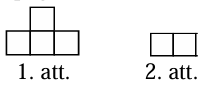
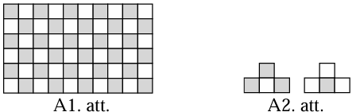
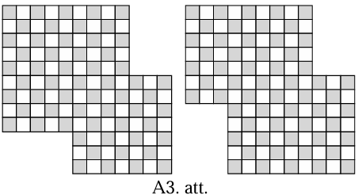
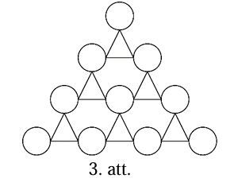
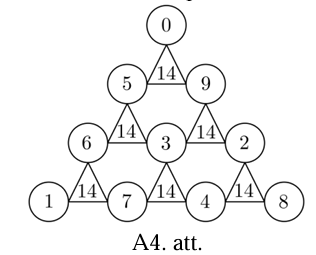
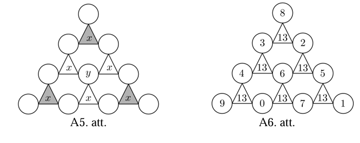
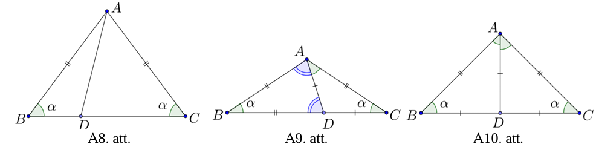
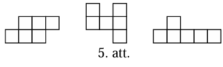
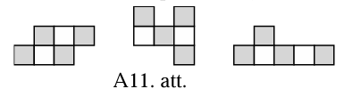
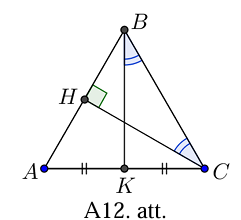

# <lo-sample/> LV.AMO.2015.5.1

Izsaki skaitli $1$ kā piecu atšķirīgu daļu summu, kuru saucēji ir vienādi!

<small>

* questionType:
* domain:

</small>


## Atrisinājums

Piemēram,
$\frac{1}{15}+\frac{2}{15}+\frac{3}{15}+\frac{4}{15}+\frac{5}{15}=\frac{15}{15}=1$.


# <lo-sample/> LV.AMO.2015.5.2

Vai taisnstūri ar izmēriem $6 \times 10$ rūtiņas var pārklāt ar vienu 1.att.
redzamo figūru un $28$ figūrām, kādas redzamas 2.att.? Figūras drīkst pagriezt.



<small>

* questionType:
* domain:

</small>


## Atrisinājums

Nē, prasīto izdarīt nevar. Iekrāsosim doto taisnstūri kā šaha galdiņu
(skat. A1.att.). Lai kur novietotu 2.att. figūru, tā vienmēr pārklās tieši vienu
melnu rūtiņu, tātad $28$ tādas figūras kopā pārklās $28$ melnas rūtiņas. Ar
vienu 1.att. figūru var pārklāt vai nu tieši $3$ melnas, vai tieši $1$ melnu
rūtiņu (skat. A2.att.), tātad kopā ar visām dotajām figūrām būs pārklātas $29$
vai $31$ melna rūtiņa, bet taisnstūrī ir $30$ melnas rūtiņas. Līdz ar to
taisnstūri ar dotajām figūrām pārklāt nav iespējams.




# <lo-sample/> LV.AMO.2015.5.3

Vai iespējams uzzīmēt tādu taisnstūri, kura malu garumi ir naturāli skaitļi,
bet **a)** laukums ir pirmskaitlis; **b)** perimetrs ir pirmskaitlis?

<small>

* questionType:
* domain:

</small>


## Atrisinājums

**a)** Jā, piemēram, der taisnstūris ar malu garumiem $1$ un $3$, tad laukums ir
$3$, kas ir pirmskaitlis.

**b)** Nē, nav iespējams. Ja taisnstūra malu garumi ir $a$ un $b$, tad
taisnstūra perimetrs ir $P=2 \cdot(a+b)$.

Perimetrs vienmēr ir pāra skaitlis. Vienīgais pāra pirmskaitlis ir $2$ , tāpēc
$a+b$ būtu jābūt vienādam ar $1$ , bet tas nav iespējams, jo $a$ un $b$ ir
naturāli skaitļi.


# <lo-sample/> LV.AMO.2015.5.4

Kādu naturālu skaitli, saskaitot ar savu ciparu summu, iegūst skaitli $328$?
Atrodi visus tādus skaitļus un pamato, ka citu nav!

<small>

* questionType:
* domain:

</small>


## Atrisinājums

Meklētajam skaitlim nevar būt mazāk kā trīs cipari, jo pat lielāko divciparu
skaitli saskaitot ar tā ciparu summu iegūst $99+9+9=117$, kas ir mazāk nekā $328$.
Meklētajam skaitlim nevar būt vairāk kā trīs cipari, jo tad, saskaitot šo
skaitli ar tā ciparu summu, iegūst vismaz četrciparu skaitli. Tātad meklētais
skaitlis ir trīsciparu, tā pirmo ciparu apzīmējam ar $a$, otro- ar $b$,
trešo- ar $c$. Tā kā meklētā skaitļa un tā ciparu summa ir $328$, tad $a$ nav
lielāks kā $3$ . Līdz ar to ciparu summa $a+b+c$ nevar būt lielāka kā
$3+9+9=21$, tāpēc meklētais skaitlis nav mazāks kā $328-21=307$. Tas nozīmē, ka
$a=3$. Ievērojam, ka skaitļa otrais cipars $b$ var būt tikai $0$, $1$ vai $2$.
Apskatām katru no gadījumiem.

1) Ja $b=0$, tad meklēto skaitli var uzrakstīt kā summu $300+c$ un tā ciparu
   summa ir $3+0+c=3+c$. Tātad $300+c+3+c=328$ jeb $2c=25$, kas ir pretrunā ar
   to, ka $c$ ir cipars.
2) Ja $b=1$, tad meklēto skaitli var uzrakstīt kā summu $310+c$ un tā ciparu
   summa ir $3+1+c=4+c$. Tātad $310+c+4+c=328$ jeb $2c=14$, no kā izriet, ka
   $c=7$ un meklētais skaitlis ir $317$ (tiešām $317+3+1+7=328$ ).
3) Ja $b=2$, tad meklēto skaitli var uzrakstīt kā summu $320+c$ un tā ciparu
   summa ir $3+2+c=5+c$. Tātad $320+c+5+c=328$ jeb $2c=3$, kas ir pretrunā ar
   to, ka $c$ ir cipars.

Tātad vienīgais skaitlis, kas atbilst uzdevuma nosacījumiem, ir $317$.


# <lo-sample/> LV.AMO.2015.5.5

Dotas $9$ pēc ārējā izskata vienādas monētas, no kurām $2$ ir viltotas. Visu
īsto monētu masas ir vienādas. Arī abām viltotajām monētām ir vienāda masa, bet
tā ir lielāka nekā īstās monētas masa. Kā ar $4$ svēršanām uz sviras svariem bez
atsvariem atrast abas viltotās monētas?

<small>

* questionType:
* domain:

</small>


## Atrisinājums

Sanumurēsim monētas ar skaitļiem no $1$ līdz $9$ un sadalīsim grupās pa trim:
$a=(1,2,3)$, $b=(4,5,6)$, $c=(7,8,9)$. Abas viltotās monētas var atrasties vienā
grupā vai arī divās dažādās grupās. Vispirms ar divām svēršanām noskaidrosim,
kurās grupās atrodas viltotās monētas. Salīdzinām $a$ ar $b$, tad smagāko no
tām (vai jebkuru, ja tās vienādas) salīdzinām ar $c$ :

- ja $a > b$ (tad grupā $b$ visas monētas ir īstas) un
   - $a > c$, tad abas viltotās monētas ir grupā $a$;
   - $a=c$, tad viena viltotā monēta ir grupā $a$, otra- $c$;
   
- ja $a=b$ (tad abās grupās ir vienāds skaits viltoto monētu) un
   - $a > c$, tad viena viltotā monēta ir grupā $a$, otra- $b$;
   - $a < c$, tad abas viltotās monētas ir grupā $c$.

Gadījums, kad $a < b$ ir identisks gadījumam, kad $a > b$.

Tā ar divām svēršanām esam noskaidrojuši viltoto monētu sadalījumu pa grupām.
Tālāk katrā grupā, kur ir kāda viltotā monēta, uz katra svaru kausa uzliekot pa
vienai monētai un vienu atstājot malā, ar vienu svēršanu var noskaidrot, kura ir
viltotā:

- ja grupā ir viena viltotā monēta un
   - svaru kausi nav līdzsvarā, tad smagākā ir viltotā;
   - svaru kausi ir līdzsvarā, tad šīs abas ir īstas un viltota ir tā trešā, kas
     stāv malā;

- ja grupā ir divas viltotas monētas un
   - svaru kausi ir līdzsvarā, tad tās abas ir viltotas;
   - svaru kausi nav līdzsvarā, tad vieglākā ir īstā, bet abas pārējās (smagākā
     un tā, kas stāv malā) ir viltotas.


# <lo-sample/> LV.AMO.2015.6.1

Profesors Cipariņš iedomājās četrus skaitļus, kuru summa ir vesels skaitlis.
Pēc tam viņš saskaitīja šos skaitļus visos iespējamos veidos pa pāriem un ieguva
sešas summas. Izrādījās, ka viena no šīm summām ir daļskaitlis. **a)** Pierādi,
ka vēl vismaz viena no iegūtajām summām ir daļskaitlis. **b)** Vai var būt tā,
ka tieši divas summas ir daļskaitļi, bet pārējās- veseli skaitļi?

<small>

* questionType:
* domain:

</small>


## Atrisinājums

**a)** Visu četru skaitļu $a, b, c, d$ summu apzīmēsim ar $S=a+b+c+d$ un to
summu, kas ir daļskaitlis, apzīmēsim ar $S_{1}=a+b$. Tā kā $S$ ir vesels
skaitlis, tad starpība $S-S_{1}=a+b+c+d-(a+b)=c+d$ arī ir daļskaitlis. Tātad vēl
vismaz viena no iegūtajām summām ir daļskaitlis.

**b)** Jā, tieši divas summas var būt daļskaitļi, ja profesors Cipariņš ir
iedomājies, piemēram, skaitļus
$\frac{1}{3}, \frac{1}{3}, \frac{2}{3}, \frac{2}{3}$.


# <lo-sample/> LV.AMO.2015.6.2

Vai kvadrātu ar izmēriem $12 \times 12$ rūtiņas, kuram no diviem pretējiem
stūriem izgriezti taisnstūri $3 \times 5$ rūtiņas, var pārklāt ar $57$
taisnstūriem, kuru izmēri ir $1 \times 2$ rūtiņas?

<small>

* questionType:
* domain:

</small>


## Atrisinājums

Nē, prasīto izdarīt nevar. Ir divi dažādi veidi, kā no kvadrāta pretējiem
stūriem var izgriezt $3 \times 5$ rūtiņu taisnstūrus: 1) viens novietots
horizontāli, otrs- vertikāli, 2) abi novietoti vienā virzienā. Iekrāsosim
atlikušo figūru kā šaha galdiņu. Neatkarīgi no tā, kā ir izgriezti taisnstūri,
figūrā ir $58$ melnas un $56$ baltas rūtiņas (skat. A3.att.). Lai kur novietotu
domino kauliņu, tas vienmēr pārklās tieši vienu melnu un tieši vienu baltu
rūtiņu. Līdz ar to $57$ domino kauliņi pārklās vienāda skaita melno un balto
rūtiņu. Iegūta pretruna, jo figūrā nav vienāds skaits melno un balto rūtiņu.




# <lo-sample/> LV.AMO.2015.6.3

Aldis aplīšos (skat. 3.att.) ierakstīja ciparus no $0$ līdz $9$ (katrā aplītī
citu) un katrā trijstūrī ierakstīja tā virsotnēs esošo skaitļu summu. Vai var
gadīties, ka visi seši trijstūros ierakstītie skaitļi ir vienādi?



<small>

* questionType:
* domain:

</small>


## Atrisinājums

Jā, trijstūros ierakstītie skaitļi var būt vienādi, skat., piemēram, A4.att.



*Piezīme.* Atrisinājumu var palīdzēt atrast šādi spriedumi. Ar $x$ apzīmējam
summu, kas ierakstīta katrā trijstūrī, ar $y$- skaitli, kas ierakstīts
centrālajā aplītī (skat. A5.att.). Ievērojam, ka pelēko trijstūru virsotnēs
ierakstīto skaitļu un centrālajā aplītī ierakstītā skaitļa summa ir
$0+1+2+\ldots+9=3x+y$ jeb $3x+y=45$. Tā kā pēdējās vienādības labā puse dalās
ar $3$, tad arī kreisajai pusei jādalās ar $3$. Tas iespējams tikai tad, ja
$y$ dalās ar $3$. Skaitlis $y$ nevar būt $0$ (jo tad $x=15$ un nevar atrast $3$
skaitļu pārus, ko ierakstīt tam apkārt, kuru summa ir $15$); tieši tāpat $y$
nevar būt $9$. Tātad $y$ var būt $3$ vai $6$, tad $x$ attiecīgi ir $14$ vai $13$
(skaitļu izkārtojumu skat. attiecīgi A4.att. un A6.att.).




# <lo-sample/> LV.AMO.2015.6.4

Pierādi, ka naturāla skaitļa kvadrāts nevar sastāvēt tikai no sešiniekiem un
nullēm! (Skaitļa kvadrāts ir skaitļa reizinājums pašam ar sevi).

<small>

* questionType:
* domain:

</small>


## Atrisinājums

Tā kā skaitļa kvadrāts ir skaitļa reizinājums pašam ar sevi, tad visi dažādie
pirmreizinātāji tam ir pāra skaitā. Ja skaitlis beidzas ar pāra skaita nullēm,
tad šīs nulles varam atmest, jo šādā gadījumā mēs atmetam reizinātāju
$10=2 \cdot 5$ pāra skaitā. Lai dotais skaitlis būtu kvadrāts, tad atlikušajam
skaitlim (bez pāra skaita nullēm beigās) visi dažādie pirmreizinātāji jāsatur
pāra skaitā. Ja atlikušā skaitļa pēdējie divi cipari ir

- $60$, tad tas dalās ar $5$, bet nedalās ar $25$, tātad tam ir tieši viens
  pirmreizinātājs $5$;
- $06$ vai $66$, tad šis skaitlis dalās ar $2$, bet nedalās ar $4$, tātad tam
  ir tieši viens pirmreizinātājs $2$.

Tātad esam pierādījuši, ka dotais skaitlis nav naturālā skaitļa kvadrāts.


# <lo-sample/> LV.AMO.2015.6.5

Vairāki bērni devās pārgājienā un mājupceļā katrs kā suvenīru paņēma vienu vai
vairākus akmentiņus. Zināms, ka visu akmentiņu masas ir dažādas. Atpūtas brīdī
katrs no bērniem izvēlējās vienu no saviem akmentiņiem un pēc vienas vai
vairākām maiņām beigās dabūja kāda cita bērna akmentiņu.

Vai var būt, ka pēc šīs maiņas **a)** katra bērna akmentiņu kopējā masa
samazinājās, **b)** tieši viena bērna akmentiņu kopējā masa palielinājās, bet
katram no pārējiem bērniem- samazinājās?

<small>

* questionType:
* domain:

</small>


## Atrisinājums

**a)** Tas nav iespējams. Ja katra bērna akmentiņu masa būtu samazinājusies,
tad arī visu akmeņu kopējai masai būtu jāsamazinās, bet maiņas rezultātā visu
akmeņu kopējā masa nevar samazināties.

**b)** Tas ir iespējams. Parādīsim piemēru, kurā tas izpildās. Visi bērni paņem
rokā to akmentiņu, ko plānojuši mainīt un sastājas rindā tā, ka pirmais stāv
bērns ar visvieglāko akmeni, otrais- ar otru vieglāko akmeni, ..., pēdējais- ar
vissmagāko akmeni. Ja pirmais bērns iedod savu akmeni otrajam, otrais- trešajam,
..., pēdējais- pirmajam, tad tikai pirmajam bērnam akmentiņu masa ir
palielinājusies, bet visiem pārējiem- samazinājusies.


# <lo-sample/> LV.AMO.2015.7.1

Deviņas vienādas cepures kopā maksā mazāk nekā $10$ eiro, bet desmit tādas pašas
vienādas cepures maksā vairāk nekā $11$ eiro. Cik maksā viena cepure?

<small>

* questionType:
* domain:

</small>


## Atrisinājums

Ar $c$ apzīmējam vienas cepures cenu. Tad no dotā izriet, ka $9c < 10$ un
$10c > 11$ jeb $c < 1 \frac{1}{9}$ un $c > 1 \frac{1}{10}$. Tātad
$c \in\left(1 \frac{1}{10} ; 1 \frac{1}{9}\right)$ un, ievērojot, ka
$1 \frac{1}{10}=1,10$ un $1 \frac{1}{9}=1,111 \ldots$, iegūstam, ka cepures cena
ir $1,11$ eiro.


# <lo-sample/> LV.AMO.2015.7.2

Vai taisnstūri ar izmēriem $7 \times 6$ rūtiņas var pārklāt ar 4.att. redzamajām
figūrām? Taisnstūrim jābūt pilnībā pārklātam. Figūras nedrīkst iziet ārpus
taisnstūra, figūras nedrīkst pārklāties, tās drīkst būt pagrieztas vai
apgrieztas spoguļattēlā.

<small>

* questionType:
* domain:

</small>


## Atrisinājums

Nē, nevar. Izkrāsosim taisnstūri šaha galdiņa veidā. Melnā krāsā ir nokrāsota
$21$ (nepāra skaits) rūtiņa. Lai kā arī šajā taisnstūrī tiktu novietotas dotās
figūras, katra no tām vienmēr noklās pāra skaita melnās rūtiņas (skat. A7.att.).
Tāpēc arī visas izmantotās figūras kopā var noklāt tikai pāra skaita melnas
rūtiņas. Tā kā nepāra skaitlis nevar būt vienāds ar pāra skaitli- melno rūtiņu
skaitu visā taisnstūrī, tad taisnstūri pilnībā pārklāt nevar.

*Piezīme.* Der arī krāsojums joslās.


# <lo-sample/> LV.AMO.2015.7.3

**a)** Atrast tādu naturālu skaitli, kura ciparu summa ir $13$, pēdējie divi
cipari ir $13$ un kurš dalās ar $13$.

**b)** Vai var atrast tādu naturālu skaitli, kura ciparu summa ir $11$, pēdējie
divi cipari ir $11$ un kurš dalās ar $11$?

<small>

* questionType:
* domain:

</small>


## Atrisinājums

**a)** Der, piemēram, skaitlis $11713$, jo $1+1+7+1+3=13$ un $11713:13=901$.

*Piezīme.* Atrisinājumu var palīdzēt atrast šādi spriedumi. Skaitļa pirmo ciparu
(bez pēdējiem diviem cipariem $1$ un $3$) veidotā skaitļa $x$ ciparu summai
jābūt $9$. Tas nozīmē, ka skaitlis $x$ dalās ar $9$. Bet tam ir jādalās arī ar
$13$, jo meklētajam skaitlim $100x+13$ jādalās ar $13$ un skaitļi $100$ un $13$
ir savstarpēji pirmskaitļi. Tātad $x$ jādalās ar $9 \cdot 13=117$. Pats skaitlis
$117$ arī ir mazākais iespējamais skaitlis $x$.

**b)** Nē, nevar. Izmantosim dalāmības pazīmi ar $11$: skaitlis dalās ar $11$,
ja tā ciparu, kas atrodas pāra pozīijiās, summas un ciparu, kas atrodas nepāra
pozīcijās, summas starpība dalās ar $11$.

Pieņemsim, ka var atrast skaitli formā
$\overline{m_{1}m_{2} \ldots m_{k}11}$, kas dalās ar $11$. Tad
$\left(m_{1}+m_{3}+\ldots\right)-\left(m_{2}+m_{4}+\ldots\right)$ jādalās ar $11$.
Tā kā $m_{1}+m_{2}+m_{3}+\ldots+m_{k}=9$, tad vienīgā iespēja, ka
$\left(m_{1}+m_{3}+\ldots\right)-\left(m_{2}+m_{4}+\ldots\right)=0$. Saskaitot
pēdējās divas vienādības, iegūstam, ka

$2 \cdot\left(m_{1}+m_{3}+m_{5}+\ldots\right)=9$ jeb $m_{1}+m_{3}+m_{5}+\ldots=4,5$,
kas nav iespējams nekādām ciparu $m_{i}$ vērtībām.


# <lo-sample/> LV.AMO.2015.7.4

Vienādsānu trijstūrī $ABC$ uz pamata malas $BC$ atzīmēts iekšējs punkts $D$ tā,
ka arī trijstūri $ABD$ un $ACD$ ir vienādsānu. Aprēķini trijstūra $ABC$ leņķus!
Atrodi visus gadījumus un pamato, ka citu nav!

<small>

* questionType:
* domain:

</small>


## Atrisinājums

Apzīmējam $\sphericalangle ABC=\sphericalangle ACB=\alpha$ (skat. A8.att.).



Apskatām vienādsānu trijstūri $ABD$. Iespējami trīs gadījumi, kuras ir šī
trijstūra vienādās malas.

1) Ja $AB=AD$, tad punkts $D$ nav $BC$ iekšējs punkts.
2) Ja $BD=AB$, apskatām vienādsānu trijstūri $ACD$. Iespējami trīs gadījumi,
   kuras ir šī trijstūra vienādās malas.

   2.1) Ja $AD=AC$, tad punkts $D$ nav $BC$ iekšējs punkts.

   2.2) Ja $AC=CD$, tad $AB+AC=BC$, kas ir pretrunā ar trijstūra nevienādību.

   2.3) Ja $AD=CD$ (skat. A9.att.), tad
        $\sphericalangle ADC=180^{\circ}-2 \alpha$ un $\sphericalangle BDA=\sphericalangle BAD=2\alpha$.
		Tad no $\triangle BAD$ iekšējo leņķu summas izriet, ka
		$\alpha+2 \alpha+2 \alpha=180^{\circ}$ jeb $\alpha=36^{\circ}$. Līdz ar
		to trijstūra $ABC$ leņķi ir
		$\sphericalangle ABC=\sphericalangle ACB=36^{\circ}$ un
		$\sphericalangle BAC=108^{\circ}$.

3) Ja $AD=BD$, apskatām vienādsānu trijstūri $ACD$. Iespējami trīs gadījumi,
   kuras ir šī trijstūra vienādās malas.

   3.1) Ja $AD=AC$, tad punkts $D$ nav $BC$ iekšējs punkts.

   3.2) Ja $AC=CD$, tad simetrijas dēļ šis gadījums ir analogs 2.3) gadījumam.

   3.3) Ja $AD=CD$, tad
      $\sphericalangle ABD=\sphericalangle ACB=\sphericalangle CAD=\sphericalangle BAD=\alpha$
	  (skat. A10.att.). No $\triangle ABC$ iekšējo leņķu summas izriet, ka
	  $4 \alpha=180^{\circ}$ jeb $\alpha=45^{\circ}$. Līdz ar to trijstūra
	  $ABC$ leņķi ir $\sphericalangle ABC=\sphericalangle ACB=45^{\circ}$ un
	  $\sphericalangle BAC=90^{\circ}$.


# <lo-sample/> LV.AMO.2015.7.5

Uz galda stāv četras pēc izskata vienādas bumbiņas, to masas attiecīgi ir
$10, 11, 12$ un $13$ grami. Vai ar dažām svēršanām uz sviru svariem bez
atsvariem, kur katrā kausā drīkst ielikt tieši divas bumbiņas, iespējams

**a)** atrast visvieglāko un vissmagāko bumbiņu;

**b)** noteikt katras bumbiņas masu?

<small>

* questionType:
* domain:

</small>


## Atrisinājums

Tā kā katrā svaru kausā drīkst ielikt tieši divas bumbiņas, tad ir iespējami
trīs dažādi varianti, kā bumbiņas var būt izvietotas uz svaru kausiem:

- $10+11 < 12+13$;
- $10+12 < 11+13$;
- $10+13=11+12$.

Veiksim visas trīs iespējamās svēršanas. Smagākā būs bumbiņa, kas abos
nevienādajos rādījumos bija uz smagākā kausa, bet vieglākā- kas abos
nevienādajos rādījumos bija uz vieglākā kausa. Atlikušās divas bumbiņas pēc visu
iespējamo svēršanu rezultātiem atšķirt nav iespējams. Tātad a) visvieglāko un
vissmagāko bumbiņu ir iespējams atrast, b) noteikt katras bumbiņas masu nav
iespējams.


# <lo-sample/> LV.AMO.2015.8.1

Nosaki, vai izteiksmes $\sqrt{6+2 \sqrt{5}}-\sqrt{6-2 \sqrt{5}}$ vērtība ir
racionāls skaitlis!

<small>

* questionType:
* domain:

</small>


## Atrisinājums

Pārveidojam doto izteiksmi:

$$\begin{gathered}
\sqrt{6+2\sqrt{5}}-\sqrt{6-2\sqrt{5}}=\sqrt{(\sqrt{5})^{2}+2\sqrt{5}+1}-\sqrt{(\sqrt{5})^{2}-2\sqrt{5}+1}=\sqrt{(\sqrt{5}+1)^{2}}-\sqrt{(\sqrt{5}-1)^{2}}= \\
=\left|\sqrt{5}+1\right|-\left|\sqrt{5}-1\right|=\sqrt{5}+1-\sqrt{5}+1=2
\end{gathered}$$

Izteiksmes vētība ir racionāls skaitlis, jo $2$ ir racionāls.


# <lo-sample/> LV.AMO.2015.8.2

Vai taisnstūri ar izmēriem $10 \times 9$ rūtiņas var pārklāt ar 5.att.
redzamajām figūrām? Taisnstūrim jābūt pilnībā pārklātam. Figūras nedrīkst iziet
ārpus taisnstūra, figūras nedrīkst pārklāties, tās drīkst būt pagrieztas vai
apgrieztas spoguļattēlā.



<small>

* questionType:
* domain:

</small>


## Atrisinājums

Nē, nevar. Izkrāsosim taisnstūri šaha galdiņa veidā. Taisnstūrī kopā ir $90$
rūtiņas, bet vienā figūrā ir $6$ rūtiņas. Lai kā arī šajā taisnstūrī tiktu
novietotas dotās figūras, katra no tām vienmēr pārklāj pāra skaita melnās rūtiņas
(skat. A11.att.). Tātad visas figūras kopā pārklās pāra skaita melnās rūtiņas.
Tā kā taisnstūrī melnā krāsā ir nokrāsotas $45$ (nepāra skaits) rūtiņas, tad
prasīto nevar izdarīt.



*Piezīme.* Der arī krāsojums joslās.


# <lo-sample/> LV.AMO.2015.8.3

Atrast vienu naturālu skaitli, kas lielāks nekā $2015$ un ko nevar izteikt kā
naturāla skaitļa kvadrāta un pirmskaitļa summu.

<small>

* questionType:
* domain:

</small>


## Atrisinājums

Der, piemēram, skaitlis $2500$. Parādīsim, ka to nevar izteikt kā naturāla
skaitļa kvadrāta un pirmskaitļa summu. Pieņemsim pretējo, ka $2500=k^{2}+p$,
kur $k$ ir naturāls skaitlis un $p$ ir pirmskaitlis. Tad
$p=2500-k^{2}=50^{2}-k^{2}=(50-k)(50+k)$. Lai $p$ būtu pirmskaitlis, mazākajam
reizinātājam jābūt vienādam ar $1$, tas ir, $50-k=1$ jeb $k=49$. Tādā gadījumā
$p=50+49=99$, kas nav pirmskaitlis. Tātad pieņēmums ir aplams un skaitli $2500$
nevar izteikt kā naturāla skaitļa kvadrāta un pirmskaitļa summu.

*Piezīme.* Der jebkurš naturāls skaitlis $n > 2015$ tāds, ka $n=m^{2}$ un
$2m-1$ ir salikts skaitlis.


# <lo-sample/> LV.AMO.2015.8.4

Divu taisnstūra paralēlskaldņu visu šķautņu garumi ir naturāli skaitļi. Pirmā
paralēlskaldņa trīs dažādo skaldņu perimetri ir $p_{1}, q_{1}, r_{1}$, bet otrā
$p_{2}, q_{2}, r_{2}$, turklāt $p_{1} < p_{2}, q_{1} < q_{2}$ un $r_{1} < r_{2}$.
Vai var apgalvot, ka pirmā paralēlskaldņa tilpums ir mazāks nekā otrā
paralēlskaldņa tilpums?

<small>

* questionType:
* domain:

</small>


## Atrisinājums

Dotais apgalvojums ne vienmēr ir patiess. Parādīsim pretpiemēru. Par pirmo
izvēlēsimies paralēlskaldni, kura šķautņu garumi ir $3, 10$ un $12$, bet par
otro- kura šķautṇu garumi $2, 12$ un $14$. Tad
$p_{1}=2 \cdot(3+10)=26, q_{1}=2 \cdot(3+12)=30$ un $r_{1}=2 \cdot(10+12)=44$,
bet $p_{2}=2 \cdot(2+12)=28$, $q_{2}=2 \cdot(2+14)=32$ un $r_{2}=2 \cdot(12+14)=52$.
Tātad ir spēkā uzdevumā dotās sakarības: $p_{1} < p_{2}$, $q_{1} < q_{2}$ un
$r_{1} < r_{2}$, bet paralēlskaldņu tilpumi ir
$V_{1}=3 \cdot 10 \cdot 12=360$ un $V_{2}=2 \cdot 12 \cdot 14=336$, kur pirmā
paralēlskaldņa tilpums ir lielāks nekā otrā paralēlskaldņa tilpums.


# <lo-sample/> LV.AMO.2015.8.5

Šaurleņķu trijstūrī $ABC$ novilkts augstums $CH$ un mediāna $BK$. Zināms, ka
$CH=BK$ un $\sphericalangle HCB=\sphericalangle KBC$. Pierādīt, ka trijstūris
$ABC$ ir vienādmalu!

<small>

* questionType:
* domain:

</small>


## Atrisinājums

Tā kā $BK=HC, \sphericalangle KBC=\sphericalangle HCB$ un $BC$- kopīga mala
(skat. A12.att.), tad $\triangle BCK=\triangle BCH$ pēc pazīmes " $m /ell m$ ".
Līdz ar to $\sphericalangle BKC=\sphericalangle CHB=90^{\circ}$ (kā atbilstošie
leņķi vienādos trijstūros). Tātad $BK$ ir gan augstums, gan mediāna, līdz ar to
$\triangle ABC$ ir vienādsānu trijstūris $(AB=BC)$. Izmantojot trijstūra laukuma
aprēķināšanas formulu, iegūstam
$S_{ABC}=\frac{1}{2} AB \cdot CH=\frac{1}{2} AC \cdot BK$. Tā kā $CH=BK$, tad
arī $AB=AC$. Tātad $AB=AC=BC$ un $\triangle ABC$ ir vienādmalu trijstūris.



## Atrisinājums
 
Tā kā $BK=HC, \sphericalangle KBC=\sphericalangle HCB$ un $BC$- kopīga mala
(skat. A12.att.), tad $\triangle BCK=\triangle BCH$ pēc pazīmes " $m \ell m$ ".
Līdz ar to $\sphericalangle BKC=\sphericalangle CHB=90^{\circ}$ (kā atbilstošie
leņķi vienādos trijstūros) un $BK$ ir augstums no virsotnes $B$ pret malu $AC$.
Tā kā $AK=KC$, $\sphericalangle AKB=\sphericalangle KBC=90^{\circ}$ un
$BK$- kopīga mala, tad $\triangle AKB=\triangle BCK$ pēc pazīmes
" $m /ell m$ ". No kā izriet, ka $\sphericalangle ABK=\sphericalangle KBC$.
Izmantojot trijstūra iekšējo leņķu summu, iegūstam

- no $\triangle HCB: \sphericalangle HBC+\sphericalangle BCH+\sphericalangle CHB=180^{\circ}$;
  $2 * \sphericalangle ABK+\sphericalangle ABK+90^{\circ}=180^{\circ}$
  $3 * \sphericalangle ABK=90^{\circ}$ jeb $\sphericalangle ABK=30^{\circ}$

- no $\triangle ABK: \sphericalangle BAC=180^{\circ}-\sphericalangle ABK-\sphericalangle AKB=180^{\circ}-30^{\circ}-90^{\circ}=60^{\circ}$;
- no $\triangle ABC: \sphericalangle BCA=180^{\circ}-\sphericalangle BAC-\sphericalangle ABC=180^{\circ}-60^{\circ}-2 \cdot 30^{\circ}=60^{\circ}$.

Esam ieguvuši, ka katrs trijstūra $ABC$ leņķis ir $60^{\circ}$, tātad
$\triangle ABC$ ir vienādmalu trijstūris.


# <lo-sample/> LV.AMO.2015.9.1

No visiem tādiem skaitļiem, kuru starpība ir 2015, noteikt tos divus, kuru reizinājums ir vismazākais!

<small>

* questionType:
* domain:

</small>


## Atrisinājums

Dotos skaitlus apzīmējam ar $x$ un $x+2015$. Šo skaitļu reizinājums ir $x \cdot(x+2015)$. Apskatām funkciju $f(x)=x \cdot(x+2015)=x^{2}+2015 x$. Funkcijas grafiks ir parabola ar zaru vērsumu uz augšu. Parabolas virsotnes abscisa $x_{0}=\frac{-2015}{2}=-1007,5$ ir punkts, kurā funkcija sasniedz vismazāko vērtību. Tātad meklētie divi skaitli ir $-1007,5$ un 1007,5.


# <lo-sample/> LV.AMO.2015.9.2

Tornis ir salikts no vienības kubiniem, kur katra kubiņa izmērs ir $1 \times 1 \times 1$. Apakšējā slānī ir $7 \times 7$ kubiņi. Otrs slānis ir novietots virs pirmā slāņa centrālās daļās, tajā ir $5 \times 5$ kubini. Trešajā slānī, kurš novietots apakšējās daļas centrā, ir $3 \times 3$ kubiņi un augšā centrā ir 1 vienības kubiņš (skat. 6.att.). Vai šo torni var salikt no blokiem ar izmēriem $1 \times 1 \times 3$ ?


<small>

* questionType:
* domain:

</small>


## Atrisinājums

Katru slāni izkrāsosim trīs krāsās diagonālveidā (skat. A13.att.). Katrs bloks ar izmēriem $1 \times 1 \times 3$ satur visas trīs krāsas, tāpēc visi bloki kopā satur vienāda skaita katras krāsas kubinu. Tā kā tornis satur 29 vienības kubinus krāsā 1, 28 - krāsā 2,27 - krāsā 3, tad torni nevar salikt no blokiem ar izmēriem $1 \times 1 \times 3$.

A13.att.


# <lo-sample/> LV.AMO.2015.9.3

Pierādi, ka $x^{5}-5 x^{3}+4 x$ dalās ar 120 , ja $x$ ir vesels skaitlis!

<small>

* questionType:
* domain:

</small>


## Atrisinājums

Sadalām doto izteiksmi reizinātājos:

$x^{5}-5 x^{3}+4 x=x \cdot\left(x^{4}-5 x^{2}+4\right)=x \cdot\left(x^{4}-x^{2}-4 x^{2}+4\right)=x \cdot\left(x^{2}\left(x^{2}-1\right)-4\left(x^{2}-1\right)\right)=$

$=x \cdot\left(x^{2}-1\right) \cdot\left(x^{2}-4\right)=x \cdot(x-1) \cdot(x+1) \cdot(x-2) \cdot(x+2)=(x-2) \cdot(x-1) \cdot x \cdot(x+1) \cdot(x+2)$.

Esam ieguvuši, ka dotā izteiksme ir piecu pēc kārtas esošu skaitļu reizinājums. Vismaz divi no šiem skaitļiem dalās ar 2 , no kuriem viens arī ar 4 , vismaz viens - ar 3 , un vismaz viens - ar 5 . Tātad šo skaitļu reizinājums dalās ar $2 \cdot 3 \cdot 4 \cdot 5=120$.


# <lo-sample/> LV.AMO.2015.9.4

Vienādsānu trapeces $A B C D$ sānu malas ir $A B$ un $C D$, bet diagonāles $A C$ un $B D$ krustojas punktā $E$. Ap trijstūri $C D E$ apvilktā rinķa līnija krusto garāko pamatu $A D$ iekšējā punktā $F$. Nogriežņu $C F$ un $B D$ krustpunkts ir $G$. Nosaki $\sphericalangle C G D$ lielumu, ja $\sphericalangle C A D=\alpha$ !

<small>

* questionType:
* domain:

</small>


## Atrisinājums

Tā kā trapece $A B C D$ ir vienādsānu, tad arī $\sphericalangle A D E=\alpha$ (skat. A14.att.). No trijstūra $A E D$ iegūstam, ka $\sphericalangle A E D=180^{\circ}-2 \alpha$. Izmantojot blakusleņķu īpašīu, iegūstam, ka $\sphericalangle C E D=2 \alpha$. Punkti $C, E, F$, $D$ atrodas uz vienas rinka līnijas, tāpēc $\sphericalangle C E D=\sphericalangle C F D=2 \alpha$ kā ievilktie leņķi, kas balstās uz viena loka $C D$. No trijstūra $F G D$ iegūstam, ka $\sphericalangle F G D=180^{\circ}-3 \alpha$ un šī lenķa blakusleņķis $\sphericalangle C G D=3 \alpha$.


A14.att.


# <lo-sample/> LV.AMO.2015.9.5

Parādi, kā naturālos skaitļus no 1 līdz $2 n-1$ uzrakstīt rindā tā, ka visas blakus esošo skaitļu starpības (no lielākā skaiṭla atṇem mazāko) ir dažādas un skaitlis 1 ir vidējais ( $n$-tais), ja a) $n=5$; b) $n=1008$.

<small>

* questionType:
* domain:

</small>


## Atrisinājums

a) Der, piemēram, virkne

$$
7 ; \quad 4 ; \quad 6 ; \quad 5 ; \quad 1 ; \quad 9 ; \quad 2 ; \quad 8 ; \quad 3
$$

b) Aplūkosim skaitļu virkni 1; 2015; 2; 2014; 3; 2013; 4; 2012; ...;1007;1009;1008 (šs̄ virkne sastāv no divām virknēm - vienas augošas $1 ; 2 ; 3 ; \ldots ; 1008$ un otras dilstošas 2015; 2014; ...; 1009). Šajā virknē ir visi skaitļi no 1 līdz 2015 un starpības starp katriem diviem blakus esošiem skaitliem dilst no 2014 līdz 1. Šī virkne pēc savām īpašībām ir ļoti līdzīga nepieciešamajai, tikai skaitlis 1 šajā virknē ir pirmais nevis 1008. loceklis. Virknes 1008. loceklis (jeb 504. loceklis dilstošajā virknē ir $\left.a_{504}=2015+(-1)(504-1)=1512\right)$ ir 1512, virknes 1009. loceklis (jeb 505. loceklis augošajā virknē) ir 505. Starpība starp virknes 1008. un 1009. locekli ir $1512-505=1007$. „Pārgriezīsim” izveidoto virkni starp 1008. un 1009. elementu, iegūstot divus virknes fragmentus, no kuriem pirmais satur 1008 locekļus, bet otrais satur 1007 locekļus. No sākotnējām blakus elementu starpībām ir pazaudēta tikai ,,pārgrieztā” starpība 1007. Tagad saliksim šos fragmentus pretējā secībā - tā, ka vispirms ir fragments, kurā ir 1007 skaitli un kurš beidzas ar skaitli 1008, un pēc tam fragments, kurā ir 1008 skaitļi un kurš sākas ar skaitli 1 . „Salīmēsim" šos fragmentus kopā, iegūstot trūkstošo starpību 1007. Vajadzīgā virkne ir izveidota, skaitlis 1 ir jaunās virknes 1008. loceklis un starp blakus elementu starpībām atrodami visi skaitli no 1 līdz 2014:

```
505; 1511; 506; 1510; ... 1010; 1007; 1009; 1008; 1; 2015; 2; 2014; 3; ... 504; 1512


# <lo-sample/> LV.AMO.2015.10.1

Nosaki funkcijas a) $y=x^{2}+2 x+2$, b) $y=\frac{1}{x^{2}+2 x+2}$ vērtību kopu!

<small>

* questionType:
* domain:

</small>


## Atrisinājums

a) Dotās funkcijas grafiks ir parabola, kuras zari ir vērsti uz augšu, tāpēc funkcijai ir vismazākā, bet nav vislielākās vērtības. Parabolas virsotnes abscisa $x_{0}=\frac{-2}{2}=-1$ ir punkts, kurā funkcija sasniedz vismazāko vērtību $y_{0}=1-2+2=1$. Tātad funkcijas vērtību kopa ir $[1 ;+\infty)$.

b) Pārrakstām doto funkciju formā $y=\frac{1}{(x+1)^{2}+1}$. Skaitīīja izteiksme nav vienāda ar 0 un saucējs ir pozitīvs, tāpēc $y>0$. Tā kā $(x+1)^{2}+1 \geq 1$, tad $y=\frac{1}{(x+1)^{2}+1} \leq \frac{1}{1}=1$. Tātad funkcijas vērtību kopa ir $(0 ; 1]$.


# <lo-sample/> LV.AMO.2015.10.2

Kādām naturālām $n$ vērtībām kvadrātu $n \times n$ rūtiņas var sagriezt taisnstūros ar izmēriem $1 \times 4$ rūtiņas? Griezuma līnijām jāiet pa rūtiņu malām.

<small>

* questionType:
* domain:

</small>


## Atrisinājums

Ja $n$ - nepāra skaitlis, tad kvadrāts $n \times n$ satur nepāra skaita rūtiņas, kas nedalās ar 4 - rūtiņu skaitu taisnstūrī. Tātad $n$ jābūt pāra skaitlim. Aplūkosim divus iespējamos gadījumus.
- Ja $n=4 k$ ( $k$ - naturāls skaitlis), tad kvadrātu ir iespējams sagriezt prasīajā veidā, piemēram, vispirms kvadrāu sagriež pa rindām (taisnstūros $1 \times 4 k$ ) un tad katru rindu $k$ taisnstūros, kuru izmēri ir $1 \times 4$.
- Ja $n=4 k+2$ ( $k$ - naturāls skaitlis), tad izkrāsosim kvadrātu četrās krāsās diagonālveidā (skat. A15.att.). Lai kā arī grieztu, taisnstūris $1 \times 4$ vienmēr saturēs visu četru krāsu rūtiņas. Tātad kvadrātā visu krāsu rūtinām ir jābūt vienādā skaitā. Noskaidrosim, cik katras krāsas rūtiņu ir kvadrātā. Tā kā kvadrātu $4 k \times 4 k$ var sagriezt taisnstūros $1 \times 4$, tad tajā visu krāsu
rūtiņas ir vienādā skaitā. Pēdējās divas kolonnas un rindas dalām taisnstūros $4 \times 2$, arī tajos visu krāsu rūtiņas ir vienādā skaitā, jo katru no tiem var sadalīt divos taisnstūros $1 \times 4$. Vēl paliek kvadrāts $2 \times 2$, kurā dzeltenās krāsas rūtiņa nav vispār un ir divas baltās rūtiņas. Iegūta pretruna ar to, ka kvadrātā visu krāsu rūtiņas ir vienādā skaitā. Līdz ar to kvadrātu, kura malas garums ir $n=4 k+2$, nav iespējams sagriezt taisnstūros ar izmēriem $1 \times 4$ rūtiņas.


A15.att.


A16.att.

Esam ieguvuši, ka vienīgais gadījums, kad kvadrātu $n \times n$ rūtiņas var sagriezt taisnstūros ar izmēriem $1 \times 4$, ja $n=4 k$, kur $k$ - naturāls skaitlis.

*Piezīme.* Gadījumā, kad $n=4 k+2$ ( $k$ - naturāls skaitlis), kvadrātu varēja izkrāsot četrās krāsās tā, kā parādīts A16.att. Tad, lai kā arī grieztu, taisnstūris $1 \times 4$ vienmēr saturēs tieši divas vienas krāsas un tieši divas citas krāsas rūtiņas. Tātad kvadrātā katras krāsas rūtiņām ir jābūt pāra skaitā, kas ir pretruna tam, ka katras krāsas rūtiņu skaits kvadrātā ir $\frac{(4 k+2)^{2}}{4}=(2 k+1)^{2}=4 k^{2}+4 k+1$, kas ir nepāra skaitlis.


# <lo-sample/> LV.AMO.2015.10.3

Atrast visus naturālos skaitlus, kas ir vienādi ar savu ciparu reizinājumu. (Par viencipara skaitla ciparu reizinājumu sauc tā vienīgo ciparu.)

<small>

* questionType:
* domain:

</small>


## Atrisinājums

Ievērojam, ka visi viencipara skaitļi atbilst uzdevuma nosacījumiem. Pierādīsim, ka citu šādu skaitļu nav. Pieņemsim, ka $n=\overline{c_{1} c_{2} \ldots c_{k}}$, kur $k \geq 2$ un $c_{1} \cdot c_{2} \cdot \ldots \cdot c_{k}=n$. Tā kā $c_{1}, c_{2}, \ldots, c_{k}$ ir cipari, tad $c_{1} \cdot c_{2} \cdot \ldots \cdot c_{k} \leq c_{1} \cdot 9^{k-1}$. No otras puses $\overline{c_{1} c_{2} \ldots c_{k}} \geq c_{1}^{0 \ldots 0}=c_{1} \cdot 10^{k-1}$. Esam ieguvuši, ka $n \leq c_{1} \cdot 9^{k-1}$ un $n \geq c_{1} \cdot 10^{k-1}$, kas vienlaicīgi nevar izpildīties. Tātad vienīgie skaitļi, kas apmierina uzdevuma prasības, ir visi viencipara skaitli.


# <lo-sample/> LV.AMO.2015.10.4

Uz vienādsānu trijstūra $A B C$ pamata $A C$ atlikts iekšējs punkts $D$, bet uz $A C$ pagarinājuma - punkts $E$ ( $C$ atrodas starp $D$ un $E$ ) tā, ka $A D=C E$. Pierādīt, ka $B D+B E>2 B C$.

<small>

* questionType:
* domain:

</small>


## Atrisinājums

Pagarinām malu $B C$ un uz tās atliekam punktu $F$ tā, ka $B C=C F$ (skat. A17.att.). Trijstūri $D A B$ un $E C F$ ir vienādi pēc pazīmes $m \ell m$, tāpēc $B D=E F$ kā atbilstošās malas. No trīsstūra nevienādības $\triangle B E F$ izriet, ka $B E+E F>B F=B C+C F=2 B C$ jeb $B D+B E>2 B C$.


# <lo-sample/> LV.AMO.2015.10.5

Jura dzimšanas dienas torte ir biezpiena kubs, kura četras sānu skaldnes un augšējā skaldne ir noklāta ar šokolādes glazūru (visur vienādi biezu). Kā šo torti sadalīt a) 4 daļās, b) 3 daļās tā, lai katras dalas forma ir taisna prizma un gan biezpiena, gan glazūras daudzums visās daļās ir vienāds?

<small>

* questionType:
* domain:

</small>


## Atrisinājums

Tortes augšējo skaldni sadalām $n$ vienlielās figūrās tā, lai augšējās skaldnes perimetrs būtu sadalīts $n$ vienādās dalā̄s. Skat., piemēram, A18.att., kur $n=4$, un A19.att., kur $n=3$.


A18.att.


A19.att.


A20.att.

Lai iegūtās daļas būtu taisnas prizmas, veicam vertikālus griezienus perpendikulāri tortes pamatam. Tā kā visu daļu pamata laukumi ir vienādi un vienāds ir arī visu daļu augstums, tad visu daļu tilpumi ir vienādi jeb biezpiena daudzums visās daļās ir vienāds. Arī ar šokolādi noklātās virsmas laukums (glazūras daudzums) visām daļām ir vienāds, jo katrai daļai ar šokolādi noklātās virsmas laukums ir $\frac{P}{n} \cdot H+\frac{S}{n}$, kur $P$ - kuba (tortes) augšējās skaldnes perimetrs, $S-$ augšējās skaldnes laukums, $H$ - kuba augstums.

*Piezīme.* a) Sadalīt tortes augšējo skaldni četrās vienlielās figūrās tā, lai augšējās skaldnes perimetrs būtu sadalīts četrās vienādās daļās, var veicot jebkādus divus perpendikulārus griezienus, kas iet caur augšējās skaldnes centru (skat., piemēram, A20.att.).


# <lo-sample/> LV.AMO.2015.11.1

Aplūkojam visus deviņciparu skaitļus, kas nesatur 0 un kam visi cipari ir dažādi. Pierādīt, ka starp tiem pāra skaitļu ir tieši divas reizes mazāk nekā tādu, kas dalās ar 3 , bet nedalās ar 5 .

<small>

* questionType:
* domain:

</small>


## Atrisinājums

Visi devinciparu skaitli, kas nesatur nulli un kuriem nav vienādu ciparu, dalās ar 3 , jo to ciparu summa ir $1+2+3+\ldots+9=45$, kas dalās ar 3 .

Atliek noskaidrot, cik starp tiem ir pāra skaitļu un cik tādu, kas nedalās ar 5 .

Pāra skaitļi ir tie, kas beidzas ar 2, 4, 6, 8, tātad devinciparu skaitļa pēdējo ciparu var izvēlēties 4 veidos un visus atlikušos 8 ciparus izvēēēties 8! veidos, līdz ar to kopējais pāra skaitļu skaits ir $4 \cdot 8$ !.

Lai skaitlis nedalītos ar 5 , tā pēdējais cipars nedrīkst būt 5 , tātad to var izvēlēties 8 veidos (tas var būt jebkurš no cipariem $\{1,2,3,4,6,7,8,9\}$ ), pārējos 8 ciparus var salikt 8 ! veidos, tātad kopējais šādu skaitļu skaits ir 8$\cdot$8!. Redzams, ka tas ir tieši divas reizes lielāks nekā pāra skaitļu skaits.


# <lo-sample/> LV.AMO.2015.11.2

Taisnstūri var pārklāt ar mazākiem taisnstūriem, kuru izmēri ir $1 \times 4$ un $2 \times 2$. Vienu mazo taisnstūri, kura izmēri ir $2 \times 2$, aizvietoja ar taisnstūri $1 \times 4$. Vai, izmantojot šos taisnstūrus, vēl joprojām var pārklāt doto taisnstūri?

<small>

* questionType:
* domain:

</small>


## Atrisinājums

Izkrāsosim taisnstūri četrās krāsās diagonālveidā (skat. A21.att.) Kvadrāts $2 \times 2$ vienmēr pārklāj tieši divas rūtiņas, kurām ir vienāda krāsa. Tātad figūrai, kas to aizvieto, arī jāpārklāj pāra skaita rūtiņas, kurām ir vienāda krāsa, bet katrs taisnstūris $1 \times 4$ pārklāj pa vienai rūtiņai no katras krāsas, tāpēc tas nav iespējams.


A21.att.


A22.att.

## Atrisinājums

Izkrāsosim taisnstūri četrās krāsās tā, kā parādīts A 22 .att. Kvadrāts $2 \times 2$ vienmēr pārklāj tieši vienu (nepāra skaitlis) baltu rūtiņuu. Tātad figūrai, kas to aizvieto, arī jāpārklāj nepāra skaita baltās rūtiņas, bet katrs taisnstūris $1 \times 4$ pārklāj vai nu tieši divas baltas rūtiņas, vai nevienu baltu rūtiņu, tas ir, pāra skaita baltās rūtiņas, tāpēc tas nav iespējams.


# <lo-sample/> LV.AMO.2015.11.3

Naturālam skaitlim $n$ ar $M(n)$ apzīmēsim mazāko naturālo skaitli, kas beidzas ar $n$ un kura ciparu summa ir $n$. Piemēram, $M(13)=913$. Pierādīt, ka ir bezgalīgi daudz tādu $n$, ka $M(n)$ dalās ar $n$.

<small>

* questionType:
* domain:

</small>


## Atrisinājums

Ja $n=10^{k}$, kur $k-$ naturāls skaitlis, tad $M(n)=M\left(10^{k}\right)=\underbrace{9 \ldots 9}_{\left(10^{k}-1\right): 9} 1 \underbrace{0 \ldots 0}_{k}$. Ievērojam, kas skaitlis

9...910...0 tiešām ir mazākais naturālais skaitlis, kas atbilst uzdevuma nosacījumiem, jo devītnieki skaitļa sākumā nodrošina mazāko iespējamo skaitļa garumu, tātad arī mazāko skaitļa vērtību. Tā kā skaitlis $M\left(10^{k}\right)=9 \ldots 91 \underbrace{0 \ldots 0}_{k}$ dalās ar $10^{k}$ un naturālo skaitļu $k$ ir bezgalīgi daudz, tad ir arı̄ bezgalīgi daudz tādu naturālu skaitļu $n$, ka $M(n)$ dalās ar $n$.


# <lo-sample/> LV.AMO.2015.11.4

Vienādsānu trapeces $A B C D$ sānu malas ir $A B$ un $C D$, garākais pamats ir $A D$. Diagonāles $A C$ un $B D$ krustojas punktā $E$. Ap trijstūri $A B E$ apvilkta riņka līnija $\omega_{1}$, bet ap $C D E$ - rinka līnija $\omega_{2}$. Pierādīt, ka trapecei $A B C D$ apvilktās riņka līnijas $\omega$ centrs atrodas $\omega_{1}$ un $\omega_{2}$ krustpunktā, kas atškirī̄gs no punkta $E$ !

<small>

* questionType:
* domain:

</small>


## Atrisinājums

Riņka līiju $\omega_{1}$ un $\omega_{2}$ otru krustpunktu apzīmējam ar $F$ (skat. A23.att.). Tad ir jāpierāda, ka $\omega$ centrs ir punktā $F$. Izmantosim, ka četrstūrim apvilktās riņka līnijas centrs ir četrstūra malu vidusperpendikulu krustpunktā.

Tā kā $A B C D$ ir vienādsānu trapece, tad simetrijas dēl $E F$ ir malu $A D$ un $B C$ vidusperpendikuls. Apzīmējam $\sphericalangle E A D=\sphericalangle E D A=\alpha$ un $\sphericalangle B A E=\beta$. Tad no trijstūra iekšējo leņ̧u summas izriet, ka $\sphericalangle A E D=180^{\circ}-\sphericalangle E A D-\sphericalangle A D E=180^{\circ}-2 \alpha$ un no blakusleņķu īpašības $\sphericalangle A E B=2 \alpha$. Punkti $E$ un $F$ atrodas uz rinka līnijas $\omega_{1}$, tāpēc $\sphericalangle A F B=\sphericalangle A E B=2 \alpha$ un $\sphericalangle B A E=\sphericalangle B F E=\beta$ kā ievilktie leņķi, kas balstās attiecīgi uz viena un tā paša loka. Simetrijas dēl $\sphericalangle F B C=\sphericalangle B C F=\left(180^{\circ}-2 \beta\right): 2=90^{\circ}-\beta$. No trijstūra $A B C$ iegūstam, ka $\sphericalangle A B C=180^{\circ}-\alpha-\beta$, tad $\sphericalangle A B F=180^{\circ}-\alpha-\beta-\left(90^{\circ}-\beta\right)=90^{\circ}-\alpha$. No $\triangle B A F$ iegūstam, ka $\sphericalangle B A F=180^{\circ}-\left(90^{\circ}-\alpha\right)-2 \alpha=90^{\circ}-\alpha$. Līdz ar to $\triangle B A F$ ir vienādsānu trijstūris un punkts $F$ atrodas uz trijstūra malas $A B$ vidusperpendikula. Tātad punkts $F$ ir četrstūrim $A B C D$ apvilktās rinka līnijas $\omega$ centrs.


A23.att.

## Atrisinājums

Ar $F$ apzīmējam rinķa līniju $\omega_{1}$ un $\omega_{2}$ otru krustpunktu (skat. A24.att.). Tā kā $A B C D$ ir vienādsānu trapece, tad simetrijas dēl $\sphericalangle E A D=\sphericalangle E D A=\alpha$. Tad $\sphericalangle C E D=\sphericalangle E D A+\sphericalangle E A D=2 \alpha$ (kā trijstūra $A E D$ trešā leņķa $A E D$ ārējais leņķis). Apskatām, kādi leņķi balstās uz loka $C D$, pieņemot, ka arī trapecei $A B C D$ ir apvilkta riņka līnija $\omega$. Riņka līnijā $\omega$ ievilktais leņķis $C A D$ balstās uz loka $C D$, tam atbilstošā centra leņķa lielums ir $2 \alpha$. Visi leņķik, kas balstās uz loka $C D$ un kuru lielums ir $2 \alpha$, atrodas uz $\omega_{2}$. Tātad arī $\omega$ centrs atrodas uz $\omega_{2}$.

Analogiski pierāda, ka $\omega$ centrs atrodas uz $\omega_{1}$. Tātad $\omega$ centrs atrodas rinka līniju $\omega_{1}$ un $\omega_{2}$ krustpunktā - vai nu punktā $E$, vai punktā $F$. Rinķa līnijas $\omega$ centrs nevar būt punkts $E$, jo $B E$ un $A E$ tad būtu rādiusi, bet $B E \neq A E$ (vienādsānu trapeces diagonāles krustpunktā nedalās uz pusēm). Līdz ar to punkts $F$ ir trapecei $A B C D$ apvilktās rinka līnijas $\omega$ centrs.


A24.att.


# <lo-sample/> LV.AMO.2015.11.5

Atrast funkcijas $f(x)=8 \sin x+8 \cos x-12 \sin x \cos x$ mazāko un lielāko vērtību!

<small>

* questionType:
* domain:

</small>


## Atrisinājums

Apzīmējam $t=\sin x+\cos x$. Tad

$$
t^{2}=(\sin x+\cos x)^{2}=\sin ^{2} x+2 \sin x \cos x+\cos ^{2} x=1+2 \sin x \cos x=1+\sin 2 x
$$

Tā kā $\sin 2 x \leq 1$, tad $t^{2}=1+\sin 2 x \leq 2$. Līdz ar to $t \in[-\sqrt{2}, \sqrt{2}]$.

Izmantojot apzīmējumus, pārrakstām doto funkciju: $F(t)=8 t-6\left(t^{2}-1\right)=-6 t^{2}+8 t+6$. Funkcijas $F(t)$ grafiks ir parabola, kuras zari ir vērsti uz leju, tāpēc tās vislielākā vērtība ir parabolas virsotnē: $t_{0}=\frac{-8}{2 \cdot(-6)}=\frac{2}{3} \in[-\sqrt{2}, \sqrt{2}]$ un $F\left(t_{0}\right)=-6 \cdot \frac{4}{9}+8 \cdot \frac{2}{3}+6=\frac{26}{3}$.

Minimālā vērtība ir vienā no intervāla $[-\sqrt{2}, \sqrt{2}]$ galapunktiem:

$F(-\sqrt{2})=-12-8 \sqrt{2}+6=-6-8 \sqrt{2}$ vai $F(\sqrt{2})=-12+8 \sqrt{2}+6=-6+8 \sqrt{2}$.

Tātad dotās funkcijas mazākā vērtība ir $(-6-8 \sqrt{2})$ un lielākā vērtība ir $\frac{26}{3}$.


# <lo-sample/> LV.AMO.2015.12.1

Uz funkcijas $y=|x-3|+2$ grafika atrast tādu punktu $P$, kura attālumu kvadrātu summa līdz koordinātu asīm būtu vismazākā!

<small>

* questionType:
* domain:

</small>


## Atrisinājums

Uzzīmējam funkcijas $y=|x-3|+2$ grafiku (skat. A25.att.).


A25.att.

Tā kā funkcijas grafiks ir simetrisks pret taisni $x=3$, tad punkta $P$ abscisa ir mazāka nekā 3 (t. i., punkts $P$ atradīsies uz tās grafika daļas, ko nosaka funkcija $y=-x+5$ ). Punkta $P$ koordinātas apzīmējam ar $(x ; y)$. Tātad jānosaka izteiksmes $x^{2}+y^{2}$ vismazākā vērtība:

$$
x^{2}+y^{2}=x^{2}+(-x+5)^{2}=2 x^{2}-10 x+25
$$

Funkcijas $f(x)=2 x^{2}-10 x+25$ grafiks ir parabola ar zaru vērsumu uz augšu. Parabolas virsotnes abscisa $x_{0}=\frac{10}{4}=2,5$ ir punkts, kurā funkcija sasniedz vismazāko vērtību. Tad $y_{0}=-x_{0}+5=2,5$ un punkta $P$ koordinātas ir $(2,5 ; 2,5)$.


# <lo-sample/> LV.AMO.2015.12.2

Taisnstūrim ar izmēriem $10 \times 10$ rūtiņas izgrieza visas četras stūra rūtiņas. Vai iegūto figūru var pārklāt ar vienu 7.att. redzamo figūru un 23 figūrām, kas redzamas 8.att.? Figūras drīkst būt pagrieztas vai apgrieztas spoguļattēlā.


<small>

* questionType:
* domain:

</small>


## Atrisinājums

Izkrāsosim iegūto figūru divās krāsās tā, kā parādīts A26.att. Lai kā arī tiktu novietota 8.att. figūra, tā vienmēr pārklāj pāra skaita melnās rūtiņas. Tātad 23 šādas figūras kopā pārklāj pāra skaita melnās rūtiņas. Tā kā 7.att. figūra pārklāj nepāra skaita melnās rūtiņas, tad visas 24 figūras kopā pārklāj nepāra skaita melnās rūtiņas, bet A26.att. figūra satur pāra skaita melnās rūtiņas, tātad prasīto nevar izdarīt.


A26.att.

## Atrisinājums

Izkrāsosim iegūto figūru četrās krāsās diagonālveidā (skat. A27.att.). Tā satur 24 katras krāsas rūtiņas. Lai kā novietotu 7.att. figūru, tā vienmēr pārklāj divas vienas krāsas rūtiņas un pa vienai rūtiņai no divām citām krāsām. Tad katrā krāsā nepārklātas paliek attiecīgi 22, 23, 23, 24 rūtiņas (divi pāra skaitļi, divi nepāra skaitļi). Iespējami divi gadījumi, kā novietot 8.att. figūru.
- Ja tā pārklāj pa vienai katras krāsas rūtiņai, tad nepārklāto rūtiņu skaits katrā krāsā samazinās par 1, tas ir, nepārklāto rūtiņu skaita paritāte katrā krāsā mainās uz pretējo. Tātad joprojām divām no četrām krāsām nepārklātas paliek nepāra skaita rūtiņas, divām - pāra skaita rūtiņas.
- Ja tā pārklāj divas rūtiņas no vienas krāsas, divas - no citas, tad katras krāsas nepārklāto rūtiņu skaits samazinās par pāra skaitli (vai nu par 2, vai 0 ) un nepārklāto rūtiņu skaita paritāte katrā krāsā saglabājas. Tātad joprojām divām no četrām krāsām nepārklātas paliek nepāra skaita rūtiņas, divām - pāra skaita rūtīnas.

Ja prasīto varē̄tu izdarīt, tad katrā krāsā nepārklātas paliktu attiecīgi $0,0,0,0$ rūtiņas, bet tie visi ir pāra skaitļi. Tātad tas nav iespējams.


# <lo-sample/> LV.AMO.2015.12.3

Pierādīt, ka $\frac{1}{a}+\frac{1}{b}+\frac{4}{c}+\frac{16}{d} \geq \frac{64}{a+b+c+d}$, ja $a, b, c, d$ ir pozitīvi skaitlli!

<small>

* questionType:
* domain:

</small>


## Atrisinājums

Lai pierādītu prasīto, pamatosim, ka pozitīviem skaitliem ir spēkā $\frac{1}{x}+\frac{1}{y} \geq \frac{4}{x+y}$. Veicam ekvivalentus pārveidojumus:

$\left.\frac{1}{x}+\frac{1}{y} \geq \frac{4}{x+y} \right\rvert\, \cdot x y(x+y)>0 \Rightarrow x y+y^{2}+x^{2}+x y \geq 4 x y \Rightarrow x^{2}-2 x y+y^{2} \geq 0 \Rightarrow(x-y)^{2} \geq 0$.

Tā kā iegūta patiesa nevienādība, tad arī $\frac{1}{x}+\frac{1}{y} \geq \frac{4}{x+y}$ ir patiesa. Izmantojot šo nevienādību trīs reizes, iegūst prasīto: $\frac{1}{a}+\frac{1}{b}+\frac{4}{c}+\frac{16}{d} \geq\left(\frac{4}{a+b}+\frac{4}{c}\right)+\frac{16}{d} \geq \frac{16}{a+b+c}+\frac{16}{d} \geq \frac{64}{a+b+c+d}$.


# <lo-sample/> LV.AMO.2015.12.4

Taisnleņķa trijstūrī $A B C$ uz katetes $A C$ atzīmēts punkts $P$, uz katetes $B C$ - punkts $S$, uz hipotenūzas $A B$ - punkti $R$ un $Q$ tā, ka $P S R Q$ ir kvadrāts. Pierādīt, ka $A B \geq 3 P S$. Kādā gadījumā $A B=3 P S$ ?

<small>

* questionType:
* domain:

</small>


## Atrisinājums

Tā kā $P S=Q R$ un $A B=A Q+Q R+R B$ (skat. A28.att.), tad pietiek pierādīt, ka $A Q+R B \geq 2 P S$. Uz nogriežņa $A B$ atliekam punktu $B^{\prime}$ tā, ka $P B^{\prime} \| B C$. Tad $\triangle S R B=\triangle P Q B$ pēc pazīmes $\ell$ lm .


A28.att.

Tātad paliek pierādīt, ka $A B^{\prime} \geq 2 P Q$. Nogrieznis $A B^{\prime}$ ir diametrs rinka līnijai, kas apvilkta ap $\triangle A P B^{\prime}$, jo $\sphericalangle A P B^{\prime}=\sphericalangle A C B=90^{\circ}$ kā kāpšlu leņķi pie paralēlām taisnēm. Nogrieznis $P Q$ nav garāks kā šīs rinka līnijas rādiuss, kas ir puse no diametra. Līdz ar to $A B^{\prime} \geq 2 P Q$ un arī $A B \geq 3 P S$. Vienādība iespējama tikai tad, kad $P Q$ ir vienāds ar riņka līnijas rādiusu. Tādā gadījumā $\triangle A P B^{\prime}$ ir vienādsānu trīsstūris, tāpēc arī $\triangle A C B$ ir vienādsānu, jo $\sphericalangle C A B=45^{\circ}$. Tātad vienādība iespējama tikai tad, ja $A C=C B$.

## Atrisinājums

Kvadrāta malas garumu pieņemsim par vienu vienību $P S=S R=R Q=P Q=1$, tad jāpierāda, ka $A B \geq 3$. Ievērojam, ka $A B=A Q+Q R+R B$ (skat. Axxx.att.). Apzīmējam $\sphericalangle C A B=\alpha$. No $\triangle A P Q$ iegūst, ka $A Q=\frac{1}{\operatorname{tg} \alpha}$ un no $\triangle R S B$ iegūst, ka $A Q=\operatorname{tg} \alpha$. Līdz ar to

$$
A B=\frac{1}{\operatorname{tg} \alpha}+1+\operatorname{tg} \alpha=\frac{\operatorname{tg}^{2} \alpha+\operatorname{tg} \alpha+1}{\operatorname{tg} \alpha}=\frac{\operatorname{tg}^{2} \alpha-2 \operatorname{tg} \alpha+1+3 \operatorname{tg} \alpha}{\operatorname{tg} \alpha}=\frac{(\operatorname{tg} \alpha-1)^{2}+3 \operatorname{tg} \alpha}{\operatorname{tg} \alpha} \geq \frac{3 \operatorname{tg} \alpha}{\operatorname{tg} \alpha}=3,
$$

jo $\operatorname{tg} \alpha \neq 0$ un $(\operatorname{tg} \alpha-1)^{2} \geq 0$.

Vienādība ir spēkā, ja $(\operatorname{tg} \alpha-1)^{2}=0$ jeb $\operatorname{tg} \alpha=1$. Tā kā $\alpha$ ir trijstūra leņķis, tad $\alpha=45^{\circ}$, kas nozīmē, ka $\triangle A C B$ ir vienādsānu. Tātad vienādība iespējama tikai tad, ja $A C=C B$.


# <lo-sample/> LV.AMO.2015.12.5

Atrast visus naturālu skaitlu trijniekus ( $a, b, c$ ) tādus, ka $a \geq b \geq c \geq 2$ un $a b-1$ dalās ar $c, b c-1$ dalās ar $a, a c-1$ dalās ar $b$.

<small>

* questionType:
* domain:

</small>


## Atrisinājums

No dotā izriet, ka $(a b-1)(b c-1)(a c-1)$ dalās ar abc. Atverot iekavas iegūst, ka $a^{2} b^{2} c^{2}-a^{2} b c-a b^{2} c-a b c^{2}+a b+b c+a c-1$ dalās ar $a b c$. Tā kā pirmie četri saskaitāmie katrs dalās ar $a b c$, tad

$$
\begin{equation*}
a b+b c+a c-1 \text { jādalās ar } a b c \tag{1}
\end{equation*}
$$

Tas nozīmē, ka

$$
\begin{equation*}
a b+b c+a c-1 \geq a b c \tag{2}
\end{equation*}
$$

No otras puses, tā kā $a \geq b \geq c$, tad

$$
\begin{equation*}
a b+b c+a c-1<a b+a b+a b=3 a b \tag{3}
\end{equation*}
$$

No nevienādībām (2) un (3) iegūst, ka $3 a b>a b c$, tātad $c<3$. Tā kā no dotā $c \geq 2$, tad vienīgā iespējamā vērtība ir $c=2$. Ievietojot to (1), iegūstam $a b+2(a+b)-1$ jādalās ar $2 a b$. No (3) izriet, ka $a b+2(a+b)-1<3 a b$, tātad vienīgā iespējamā izteiksmes $a b+2(a+b)-1$ vētība, lai tā dalītos ar $2 a b$, ir $2 a b$. Tātad $a b+2(a+b)-1=2 a b$, no kurienes $a b-2 a-2 b+4=3$ jeb $(a-2)(b-2)=3$. No dotā izriet, ka abi reizinātāji ir pozitīvi un $a-2 \geq b-2$, tātad $a-2=3$ un $b-2=1$, no kurienes $a=5$ un $b=3$. Pārbaude parāda, ka skaitlu trijnieks $(5,3,2)$ ir uzdevuma atrisinājums.```

