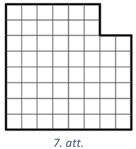

# <lo-sample/> LV.AMO.2016.5.1

Uzraksti dotos skaitļus augošā secībā! Atbildi pamato!

$DLV; MMXVI; CMXCIV; XXXVII$

<small>

* questionType:
* domain:

</small>

## Atrisinājums

Uzrakstām dotos skaitļus ar arābu cipariem: $\quad DLV=555 ; MMXVI=2016$;
$CMXCIV=994 ; XXXVII=37$. Tātad skaitļi augošā secībā ir
$XXXVII ; DLV ; CMXCIV ; MMXVI$.

# <lo-sample/> LV.AMO.2016.5.2

Vai var atrast tādus naturālus skaitļus $a$ un $b$, ka
$14 \cdot a+2 \cdot b+1=2016$ ?

<small>

* questionType:
* domain:

</small>

## Atrisinājums

Ievērojam, ka $14 \cdot a$ un $2 \cdot b$ ir pāra skaitļi. Tātad dotā
vienādojuma kreisās puses izteiksmes vērtība ir nepāra skaitlis, bet labajā pusē
ir pāra skaitlis. Tā kā pāra skaitlis nevar būt vienāds ar nepāra skaitli, tad
nevar atrast tādus naturālus skaitļus $a$ un $b$, lai dotā vienādība būtu
patiesa.

# <lo-sample/> LV.AMO.2016.5.3

Starp dotajiem skaitļiem vienādības kreisajā pusē saliec darbību zīmes un
iekavas tā, lai iegūtu patiesu vienādību!
**a)** $3 \quad 3 \quad 7 \quad 7=14$
**b)** $3 \quad 3 \quad 7 \quad 7=24$

<small>

* questionType:
* domain:

</small>

## Atrisinājums

**a)** $3-3+7+7=14$; **b)** $(3+3:7) \cdot 7=\frac{24}{7} \cdot 7=24$

# <lo-sample/> LV.AMO.2016.5.4

Sadali 1.att. redzamo figūru trīs daļās, no kurām var salikt kvadrātu! Saliekot
daļas nedrīkst pārklāties, daļas drīkst pagriezt, bet nedrīkst apgāzt otrādi.

<small>

* questionType:
* domain:

</small>

## Atrisinājums

Skat., piemēram, 2.att.

# <lo-sample/> LV.AMO.2016.5.5

Klasē ir $12$ skolēni, katrs no tiem nosūtīja īsziņu tieši sešiem citiem saviem
klasesbiedriem. Pierādi, ka noteikti ir tādi divi skolēni, kas nosūtījuši īsziņu
viens otram!

<small>

* questionType:
* domain:

</small>

## Atrisinājums

Pavisam tika nosūtītas $12 \cdot 6=72$ īsziņas. No $12$ skolēniem var izveidot
$\frac{12 \cdot 11}{2}=66$ dažādus pārus. Uzskatīsim, ka pāris saņem īsziņu, ja
viens no pāra dalībniekiem nosūtījis īsziņu otram dalībniekam. Tā kā $72 > 66$,
tad būs tāds pāris, kurš saņems divas īsziņas. Tātad šī pāra dalībnieki
nosūtījuši īsziņas viens otram.

# <lo-sample/> LV.AMO.2016.6.1

Aplīšos (skat. 3.att.) ieraksti trūkstošās darbību zīmes un
kvadrātiņos- trūkstošos skaitļus, lai iegūtu patiesas vienādības! Parādi arī
risinājumu!

<small>

* questionType:
* domain:

</small>

## Atrisinājums

Skat. 4.att., kur
1) $8,5+43=51,5 ; \quad 2) \quad 18 \frac{37}{48}:8,5=\frac{901}{48}: \frac{17}{2}=\frac{901 \cdot 2}{48 \cdot 17}=\frac{53}{24}=2 \frac{5}{24}$; 3) $\frac{9}{10}-\frac{7}{12}=\frac{54}{60}-\frac{35}{60}=\frac{19}{60}$; 4) $\frac{19}{60}: \frac{19}{130}=\frac{19 \cdot 130}{60 \cdot 19}=2 \frac{10}{60}=2 \frac{1}{6}$; 5) $18 \frac{37}{48}+2 \frac{1}{6}=20 \frac{37}{48}+\frac{8}{48}=20 \frac{45}{48}=20 \frac{15}{16}$

# <lo-sample/> LV.AMO.2016.6.2

Vai var atrast tādus naturālus skaitļus $a$ un $b$, ka
$14 \cdot a+15=2016-6 \cdot b$ ?

<small>

* questionType:
* domain:

</small>

## Atrisinājums

Ievērojam, ka $14 \cdot a$ ir pāra skaitlis, tātad dotā vienādojuma kreisās
puses izteiksmes vērtība ir nepāra skaitlis. Tā kā
$6 \cdot b$ ir pāra skaitlis, tad vienādojuma labajās puses izteiksmes vērtība
ir pāra skaitlis. Tā kā pāra skaitlis nevar būt vienāds ar nepāra skaitli, tad
nevar atrast tādus naturālus skaitļus $a$ un $b$, lai dotā vienādība būtu
patiesa.

# <lo-sample/> LV.AMO.2016.6.3

Vairākas tantītes piedalījās sēņošanas sacensībās. Kad sacensību beigās
saskaitīja atrastās baravikas, tad izrādījās, ka katrai no divām tantītēm, kurām
bija vislielākais baraviku skaits, bija tieši $\frac{1}{5}$ no visu baraviku
kopskaita. Savukārt, katrai no piecām tantītēm, kurām bija vismazākais baraviku
skaits, bija tieši $\frac{1}{13}$ no visu baraviku kopskaita. Cik pavisam
tantītes piedalījās sacensībās?

<small>

* questionType:
* domain:

</small>

## Atrisinājums

Tā kā katra no divām tantītēm, kurām bija visvairāk baraviku, salasīja
$\frac{1}{5}$ jeb $\frac{13}{65}$ no visu baraviku kopskaita un katra no piecām
tantītēm, kurām bija vismazāk baraviku, salasīja $\frac{1}{13}$ jeb
$\frac{5}{65}$ no visu baraviku kopskaita, tad šīs septiņas tantītes kopā
salasīja $2 \cdot \frac{13}{65}+5 \cdot \frac{5}{65}=\frac{51}{65}$ no visu
baraviku kopskaita. Tātad atliek vēl $\frac{14}{65}$ no visu baraviku kopskaita,
kuras salasīja citas tantītes. Tā kā katra no pārējām tantītēm salasīja vairāk
nekā $\frac{5}{65}$ un mazāk nekā $\frac{13}{65}$ no visu baraviku kopskaita,
tad noteikti ir vismaz vēl divas citas tantītes. Tā kā katrai no citām tantītēm
ir jāsalasa vairāk nekā $\frac{5}{65}$ no visu baraviku kopskaita, tad ja viņas
ir $3$ vai vairāk, tad viņas kopā būtu salasījušas vairāk nekā
$3 \cdot \frac{5}{65}=\frac{15}{65}$, kas ir par daudz. Tātad bija vēl tieši
divas citas tantītes, kuras varēja salasīt, piemēram,
$\frac{6}{65}$ un $\frac{8}{65}$ no visu baraviku kopskaita. Līdz ar to esam
ieguvuši, ka sacensībās piedalījās $7+2=9$ tantītes.

# <lo-sample/> LV.AMO.2016.6.4

Kvadrāts ar izmēriem $12 \times 12$ rūtiņas divos veidos ir sadalīts taisnstūros
ar izmēriem $3 \times 4$ rūtiņas (skat. 5.att.): trīs rindās pa četriem
taisnstūriem katrā (ar gaiši pelēkajām līnijām) un četrās rindās pa trim
taisnstūriem katrā (ar melnajām līnijām). Kāds ir mazākais rūtiņu skaits, kas
jāiekrāso $12 \times 12$ rūtiņu kvadrātā, lai katrā gaišpelēkajā un katrā melnajā
taisnstūrī būtu vismaz viena iekrāsota rūtiņa?

<small>

* questionType:
* domain:

</small>

## Atrisinājums

Tā kā katrā melnajā taisnstūrī ir jābūt vismaz vienai iekrāsotai rūtiņai, tad
kopā jābūt vismaz $12$ iekrāsotām rūtiņām. Ar $12$ iekrāsotām rūtiņām pietiek,
lai izpildītos uzdevuma nosacījumi, skat., piemēram, 6.att.

# <lo-sample/> LV.AMO.2016.6.5

Sadali 7.att. redzamo figūru trīs pilnīgi vienādās (gan pēc formas, gan pēc
laukuma) daļās! Gabali attiecībā viens pret otru drīkst būt gan pagriezti, gan
"apmesti otrādi".

<small>

* questionType:
* domain:

</small>

## Atrisinājums

Skat., piemēram, 8.att.

# <lo-sample/> LV.AMO.2016.7.1

Dota lineāra funkcija $y=2015x+2016$.

**a)** Nosaki dotās funkcijas krustpunktus ar koordinātu asīm!

**b)** Uzraksti vienādojumu lineārai funkcijai, kuras grafiks nekrusto dotās
funkcijas grafiku un iet caur punktu $(1; 43)$ !

<small>

* questionType:
* domain:

</small>

## Atrisinājums

**a)** Funkcijas grafiks krusto $y$ asi, ja $x=0$, tātad krustpunkts ar $y$ asi
ir $(0; 2016)$. Funkcijas grafiks krusto $x$ asi, ja $y=0$, tātad krustpunkts ar
$x$ asi ir $\left(-\frac{2016}{2015} ; 0\right)$.

**b)** Lai lineāru funkciju grafiki nekrustotos, tiem jābūt paralēliem, tātad
taišņu virziena koeficientiem jābūt vienādiem. Meklētās funkcijas vienādojums ir
formā $y=2015x+b$. Lai aprēķinātu $b$ vērtību, izmantojam, ka grafiks iet caur
punktu $(1; 43)$, tas ir, atrisinām vienādojumu $43=2015 \cdot 1+b$. Tātad
$b=-1972$.

# <lo-sample/> LV.AMO.2016.7.2

Karlsons sev pusdienām nopirka $8$ pīrādziņus un $15$ magoņmaizītes, bet
Brālītis- vienu pīrādziņu un vienu magoņmaizīti. Karlsons par savām pusdienām
samaksāja tieši divus eiro (katra maizīte un pīrādziņš maksā veselu skaitu
centu). Cik samaksāja Brālītis?

<small>

* questionType:
* domain:

</small>

## Atrisinājums

Apzīmējot pīrādziņu cenu centos ar $p$ un magoņmaizīšu cenu centos ar $m$,
iegūstam vienādojumu $8p+15m=200$ jeb $15m=200-8p$. Ievērojam, ka vienādojuma
labā puse dalās ar $8$ (jo katrs saskaitāmais dalās ar $8$), tātad arī
vienādojuma kreisajai pusei ir jādalās ar $8$. Tā kā skaitļi $15$ un $8$ ir
savstarpēji pirmskaitļi, tad $m$ ir jādalās ar $8$. Tā kā $m$ un $p$ ir
naturāli skaitļi, tad $15m < 200$. Līdz ar to vienīgā derīgā vērtība ir $m=8$.
Tādā gadījumā magoņmaizīte maksā $8$ centus un pīrādziņš maksā $10$ centus.
Tātad Brālītis samaksāja $18$ centus.

# <lo-sample/> LV.AMO.2016.7.3

Dots, ka $AB || CD$ un $AD || BC$ (skat. 9.att.). Nogriežņu $AC$ un $BD$
krustpunkts ir $M$. Uz taisnes $AB$ izvēlēts tāds punkts $N$, ka $AM=MN$.
Pierādīt, ka $\sphericalangle ANC=90^{\circ}$.

<small>

* questionType:
* domain:

</small>

## Atrisinājums

Ievērojam, ka $\triangle ABD=\triangle CDB$ pēc pazīmes $\ell m \ell$, jo
$\sphericalangle ABD=\sphericalangle CDB$ kā iekšējie šķērsleņķi pie paralēlām
taisnēm, $BD$- kopīga mala un $\sphericalangle ADB=\sphericalangle CBD$ kā
iekšējie šķērsleņķi pie paralēlām taisnēm (skat. 10.att.). Tātad $AD=BC$ kā
vienādu trijstūru atbilstošās malas. Līdzīgi $\triangle AMD=\triangle CMB$ pēc
pazīmes $\ell m \ell$, jo $\sphericalangle MAD=\sphericalangle MCB, AD=BC$ un
$\sphericalangle ADM=\sphericalangle CBM$, tātad $AM=MC$. Trijstūri $AMN$ un
$NMC$ ir vienādsānu, tāpēc $\sphericalangle MAN=\sphericalangle ANM$ un
$\sphericalangle MNC=\sphericalangle MCN$. Tā kā
$\sphericalangle MAN=\sphericalangle ACB$, tad
$\sphericalangle ANC=\sphericalangle NCD$. Esam ieguvuši, ka iekšējie
vienpusleņķi pie paralēlām taisnēm $AN$ un $CD$ ir vienādi, tātad
$\sphericalangle ANC=90^{\circ}$.

# <lo-sample/> LV.AMO.2016.7.4

Divi rūķi- Svirpulnieks un Pukstiņš- katru dienu tīra zobus. Katrs lieto savu
zobu birsti un katrs sava veida zobu pastas tūbiņas. Katram rūķim viena zobu
pastas tūbiņa pietiek veselam skaitam dienu. Ja vienā dienā rūḳim beidzas viena
zobu pastas tūbiņa, tad nākamajā dienā viņš iesāk tādu pašu jaunu tūbiņu.
Svirpulniekam viena zobu pastas tūbiņa pietiek divas dienas ilgāk nekā Pukstiņam.
Ja abi sāk jaunas zobu pastas tūbiņas vienā un tajā pašā dienā, tad dienā, kad
Pukstiņš pēdējo dienu izmanto trešo zobu pastas tūbiņu, Svirpulnieks pirmo dienu
ir iesācis jaunu tūbiņu. Cik dienas katram rūķim pietiek ar vienu zobu pastas
tūbiņu?

<small>

* questionType:
* domain:

</small>

## Atrisinājums

Ja Pukstiņam viena tūbiņa pietiek $n$ dienām, tad Svirpulniekam viena tūbiņa
pietiek $n+2$ dienām. No dotā izriet, ka $(3n-1)$-ajā dienā Svirpulnieks ir
pabeidzis kārtējo zobu pastas tūbiņu, tātad viņš ir izlietojis
$\frac{3n-1}{n+2}$ tūbiņas. Tā kā tūbiņu skaits ir naturāls skaitlis, tad
$3n-1$ ir jādalās ar $n+2$ jeb $3n-1=k \cdot(n+2)$, kur $k$ ir naturāls skaitlis.
Izsakot mainīgo $n$, iegūstam $n=\frac{2k+1}{3-k}$. Lai $n$ būtu naturāls, tad
$k$ varētu būt $1$ vai $2$. Pārbaudot iegūstam, ka der vienīgi $k=2$, un tādā
gadījumā $n=5$. Esam ieguvuši, ka Pukstiņam zobu pastas tūbiņa pietiek $5$
dienām, bet Svirpulniekam- $7$ dienām.

# <lo-sample/> LV.AMO.2016.7.5

Kvadrāts sadalīts $12 \times 12$ vienādās kvadrātiskās rūtiņās un izkrāsots kā
šaha galdiņš. Četrdesmit trijās baltajās rūtiņās sēž pa vienai mušai. Varde lēkā
pa kvadrātu, katrā lēcienā šķērsojot divu rūtiņu kopējo malu. Tā nelec caur
rūtiņu stūri un nelec rūtņā, kurā tā jau ir bijusi. Ielecot rūtiņā, kurā
sēž muša, varde to apēd. Zināms, ka varde ir bijusi vismaz $100$ rūtiņās.
Pierādīt, ka varde ir apēdusi vismaz $21$ mušu!

<small>

* questionType:
* domain:

</small>

## Atrisinājums

Ievērosim, ka varde ir pamīšus baltās un melnās rūtiņās, tāpēc viņa ir
apmeklējusi vismaz $100:2=50$ baltas rūtiņas. Kopējais balto rūtiņu skaits ir
$72$, tāpēc neapmeklētas paliek ne vairāk kā $72-50=22$ baltas rūtiņas. Pat ja
visās neapmeklētajās baltajās rūtiņās ir pa mušai, varde ir apēdusi vismaz
$43-22=21$ mušu.

# <lo-sample/> LV.AMO.2016.8.1

Aprēķini dotās izteiksmes vērtību!

$$\frac{2000016 \cdot 1999984}{5^{12} \cdot 2^{13}-128}$$

<small>

* questionType:
* domain:

</small>

## Atrisinājums

$\frac{2000016 \cdot 1999984}{5^{12} \cdot 2^{13}-128}=\frac{\left(2 \cdot 10^{6}+16\right)\left(2 \cdot 10^{6}-16\right)}{2 \cdot(5 \cdot 2)^{12}-128}=\frac{4 \cdot 10^{12}-256}{2 \cdot 10^{12}-128}=\frac{4 \cdot\left(10^{12}-64\right)}{2 \cdot\left(10^{12}-64\right)}=2$

# <lo-sample/> LV.AMO.2016.8.2

Vai var atrast tādus veselus skaitļus $a$ un $b$, ka $ab(a+43b)=434343$ ?

<small>

* questionType:
* domain:

</small>

## Atrisinājums

Ja $a$ vai $b$ ir pāra skaitlis, tad vienādojuma kreisās puses izteiksmes
vērtība ir pāra skaitlis, kas nevar būs vienāda ar nepāra skaitli $434343$. Ja
$a$ un $b$ abi ir nepāra skaitļi, tad $a+43b$ ir pāra skaitlis un vienādojuma
kreisās puses izteiksmes vērtība ir pāra skaitlis, kas nevar būt vienāda ar
nepāra skaitli $434343$.

Tātad nevar atrast tādus veselus skaitļus $a$ un $b$, lai dotā vienādība būtu
patiesa.

# <lo-sample/> LV.AMO.2016.8.3

Zināms, ka skaitlis dalās ar $2016$ un ka visi tā cipari ir dažādi. Kāds ir
lielākais ciparu skaits, kas var būt šajā skaitlī?

<small>

* questionType:
* domain:

</small>

## Atrisinājums

Tā kā pavisam ir desmit dažādi cipari, tad meklētajam skaitlim nav vairāk kā $10$
cipari. Der, piemēram, desmitciparu skaitlis $6401398752$.

*Piezīme.* Desmitciparu skaitli var palīdzēt atrast tālāk aprakstītie spriedumi.
Tā kā meklētajam skaitlim jādalās ar $2016$, tad tam jādalās ar visiem tā
pirmreizinātājiem $2016=2^{5} \cdot 3^{2} \cdot 7$. Visu desmit ciparu summa ir
$45$, tātad skaitlis dalās ar $3^{2}=9$. Lai skaitlis dalītos ar $2^{5}=32$, tā
pēdējo piecu ciparu veidotajam skaitlim jādalās ar $32$. Der, piemēram, $98752$.
Tad atlikušie cipari $0, 1, 3 ,4 , 6$ jāizkārto tā, lai iegūtais desmitciparu
skaitlis dalītos ar $7$.

# <lo-sample/> LV.AMO.2016.8.4

Dota taisnleņķa trapece $ABCD$, kuras īsākā sānu mala ir $BC$. Malu $AD$ un $CD$
viduspunkti attiecīgi ir $M$ un $K$, bet diagonāles $AC$ viduspunkts ir $N$.
Pierādīt, ka $\triangle MNB=\triangle CKM$.

<small>

* questionType:
* domain:

</small>

## Atrisinājums

Nogrieznis $MN$ ir trijstūra $CAD$ viduslīija (skat. 11.att.), tāpēc
$NM=\frac{1}{2} CD=CK$ un $NM || CD$. Tā kā $NM || CD$ un $AM=MD$, tad $NM$
atrodas uz malas $BC$ vidusperpendikula. No vidusperpendikula īpašības (katrs
vidusperpendikula punkts atrodas vienādā attālumā no nogriežņa galapunktiem)
iegūstam, ka $CN=BN$ un $CM=BM$. Nogrieznis $MK$ ir trijstūra $CAD$ viduslīiija,
tāpēc $MK=\frac{1}{2} AC=CN$. Līdz ar to esam ieguvuši, ka
$\triangle MNB=\triangle CKM$ pēc pazīmes $mmm$.

# <lo-sample/> LV.AMO.2016.8.5

Divi spēlētāji spēlē spēli uz $N \times N$ rūtiņas liela laukuma. Sākumā laukuma
kreisajā apakšējā rūtiņā atrodas spēļu kauliņš. Katrā gājienā spēļu kauliņu
drīkst pārvietot vai nu vienu lauciņu pa labi, vai vienu lauciņu uz augšu, vai
arī divus lauciņus pa diagonāli uz augšu pa labi (skat. 12.att., kur kauliņa
sākumpozīcija apzīmēta ar baltu, bet atļautie gājieni- ar pelēkiem aplīšiem).
Kauliņu nedrīkst pārvietot ārpus laukuma robežām. Spēlētāji gājienus izdara pēc
kārtas. Zaudē spēlētājs, kurš nevar izdarīt gājienu. Kurš no spēlētājiem,
pareizi spēlējot, uzvar, ja **a)** $N=7$, **b)** $N=8$ ?

<small>

* questionType:
* domain:

</small>

## Atrisinājums

Analizēsim spēli no beigām. Skaidrs, ka laukuma labā augšējā stūra rūtiņa ir
zaudējoša, jo no tās nevar izdarīt gājienu. Tālāk laukuma rūtiņas aizpildīsim
pēc šāda principa: ja kāds no iespējamajiem gājieniem pārvieto kauliņu uz
zaudējošu rūtiņu (apzīmējam ar $Z$), tad šī rūtiņa ir uzvaroša (apzīmējam ar $U$).
Pretējā gadījumā rūtiņa ir zaudējoša. Tādā veidā aizpildot rūtiņas, iegūstam, ka
gan a), gan b) gadījumā sākuma (kreisā apakšējā stūra rūtiņa) ir zaudējoša,
skat. attiecīgi 13.att. un 14.att.

Tātad, pareizi spēlējot, uzvarēs otrais spēlētājs, jo viņš vienmēr var panākt,
ka pirmajam spēlētājam gājiens jāizdara no zaudējošas rūtiņas.

# <lo-sample/> LV.AMO.2016.9.1

Atrisināt nevienādību $\frac{x-1}{x^{2}-4} \leq 0$.

<small>

* questionType:
* domain:

</small>

## Atrisinājums

Punkti, kuros skaitītājs un saucējs ir vienāds ar $0$, ir $x=1$ un
$x= \pm 2$. Izmantojot Intervālu metodi (skat. 15.att.), iegūstam, ka
$x \in(-\infty ;-2) \cup[1 ; 2)$.

# <lo-sample/> LV.AMO.2016.9.2

Vai var atrast tādus veselus skaitļus
$x, y$ un $z$, ka $x^{3}-2016xyz=10$ ?

<small>

* questionType:
* domain:

</small>

## Atrisinājums

Apskatām dotā vienādojuma kreisās puses izteiksmi pēc moduļa $4$.

| $\boldsymbol{x}(\bmod 4)$ | $\boldsymbol{x}^{3}-2016 x y z(\bmod 4)$ |
| :------------------------ | :--------------------------------------- |
| $0$                       | $0^{3}-0 \equiv 0(\bmod 4)$              |
| $1$                       | $1^{3}-0 \equiv 1(\bmod 4)$              |
| $2$                       | $2^{3}-0 \equiv 0(\bmod 4)$              |
| $3$                       | $3^{3}-0 \equiv 3(\bmod 4)$              |

Esam ieguvuši, ka $x^{3}-2016xyz$ pēc moduļa $4$ var pieņemt vērtības $0; 1$ vai
$3$ , bet $10 \equiv 2(\bmod 4)$. Tātad dotajam vienādojumam nav atrisinājuma
veselos skaitļos.

# <lo-sample/> LV.AMO.2016.9.3

Dots taisnstūris $ABCD$. Malas $AB$ viduspunkts ir $M$. Zināms, ka uz malas $BC$
var izvēlēties tādu punktu $N$, ka
$\sphericalangle BMN=\sphericalangle CDN=30^{\circ}$. Pierādīt, ka trijstūris
$CDM$ ir vienādmalu!

<small>

* questionType:
* domain:

</small>

## Atrisinājums

Tā kā $M$ ir $AB$ viduspunkts, tad simetrijas dēļ $CM=MD$ (skat. 16.att.). Tad
pietiek pierādīt, ka $MD=CD$. Trijstūri $BMN$ un $CDN$ ir līdzīgi pēc pazīmes
$\ell \ell$, jo $\sphericalangle MBN=\sphericalangle DCN=90^{\circ}$ un
$\sphericalangle BMN=\sphericalangle CDN$ pēc dotā. Trijstūru līdzības
koeficients ir $\frac{BM}{CD}=\frac{1}{2}$, tāpēc $CN=2BN$. Bet $MN=2BN$, jo
katete pret $30^{\circ}$ leņķi ir puse no hipotenūzas. Tāpēc $\quad MN=CN$. Tā kā
$\quad \sphericalangle BNM=\sphericalangle CND=90^{\circ}-30^{\circ}=60^{\circ}$,
tad
$\sphericalangle MND=180^{\circ}-\sphericalangle BNM-\sphericalangle CND=60^{\circ}$.
Ievērojot, ka $ND$ ir trijstūru $MND$ un $CND$ kopīga mala, iegūstam, ka
$\triangle MND=\triangle CND$ pēc pazīmes $m \ell m$. Tad $MD=CD$. Līdz ar to
esam pierādījuši, ka $MD=CD=CM$ jeb trijstūris $CDM$ ir vienādmalu.

*Piezīme.* Apzīmējot $BM=x, CD=2x$ un izmantojot trigonometriskās sakarības,
var izteikt, $BN=\frac{x \sqrt{3}}{3}$ un $CN=\frac{2x \sqrt{3}}{3}$. Lietojot
Pitagora teorēmu $\triangle MBC$, iegūstam, ka $CM=2x$.

# <lo-sample/> LV.AMO.2016.9.4

Naturālu skaitļu virknes $1 ; 2 ; 2 ; 4 ; 8 ; 32 ; 48 ; \ldots$ katrs loceklis,
sākot ar trešo, ir vienāds ar divu iepriekšējo locekļu nenulles ciparu
reizinājumu. Kāds ir šīs virknes $2016.$ loceklis?

<small>

* questionType:
* domain:

</small>

## Atrisinājums

Virknes locekļus apzīmējam ar $a_{i}$, kur $i$ ir naturāls skaitlis. Aprēķinām
nākamos virknes locekļus.

| $i$  | $a_{i}$ | $a_{i}$ nenulles   ciparu   reizinājums |
| :--- | :------ | :-------------------------------------------- |
| $1$  | $1$     | $1$                                           |
| $2$  | $2$     | $2$                                           |
| $3$  | $2$     | $2$                                           |
| $4$  | $4$     | $4$                                           |
| $5$  | $8$     | $8$                                           |
| $6$  | $32$    | $6$                                           |
| $7$  | $48$    | $32$                                          |
| $8$  | $192$   | $18$                                          |
| $9$  | $576$   | $210$                                         |
| $10$ | $3780$  | $168$                                         |
| $11$ | $35280$ | $240$                                         |
| $12$ | $40320$ | $24$                                          |
| $13$ | $5760$  | $210$                                         |
| $14$ | $5040$  | $20$                                          |
| $15$ | $4200$  | $8$                                           |
| $16$ | $160$   | $6$                                           |
| $17$ | $48$    | $32$                                          |
| $18$ | $192$   | $18$                                          |

Katrs virknes loceklis, sākot ar trešo, ir viennozīmīgi noteikts ar diviem
iepriekšējiem. Tā kā virknes septītais un astotais loceklis ir attiecīgi $48$
un $192$, un arī $17.$ un $18.$ loceklis ir attiecīgi $48$ un $192$, tad virkne,
sākot ar $7.$ locekli, ir periodiska ar perioda garumu $10.$ Tā kā
$2016=6+10 \cdot 201$, tad $a_{2016}=a_{16}=160$.

# <lo-sample/> LV.AMO.2016.9.5

Sivēnam ir $10$ podi ar medu, kas pēc kārtas sanumurēti ar skaitļiem no $1$
līdz $10$. Kādu dienu viņš uzzināja, ka Vinnijs Pūks slepeni ir izēdis četrus no
tiem, pie tam to numuri veido aritmētisko progresiju. Katra poda saturu Sivēns
var pārbaudīt. Pierādīt, ka viņš var noskaidrot, kuri tieši ir izēstie podi,
pārbaudot ne vairāk kā četrus podus!

<small>

* questionType:
* domain:

</small>

## Atrisinājums

Ir skaidrs, ka attiecīgās progresijas diference $d$ var būt tikai $1, 2$ vai $3$.
Pierādīsim, ka Sivēns var izdomāt atbildi, pārbaudot $4$, $5.$, $6.$
podu un vēl vienu podu.

- Ja $4.$, $5.$ un $6.$ pods ir pilns, tad izēstie podi ir $7.$, $8.$, $9.$ un
  $10.$
- Ja $4.$, $5.$ un $6.$ pods ir izēsts, tad $d=1$ un, pārbaudot $3.$ podu, var
  noskaidrot prasīto.
- Ja no $4.$, $5.$ un $6.$ poda izēsti ir divi blakus esoši podi, tad $d=1$ un
  ir zināms, kur sākas vai beidzas izēstie.
- Ja izēsts ir $4.$ un $6.$ pods, tad $d=2$ un, pārbaudot $2.$ podu, var
  noskaidrot prasīto.
- Atliek gadījums, kad no $4.$, $5.$ un $6.$ poda izēsts tieši viens pods.
   - Ja tas ir $5.$ pods, tad $d=2$ un, pārbaudot $1.$ podu, var noskaidrot
     prasīto.
   - Ja tas ir $4.$ pods, tad $d=1$ vai $d=3$ un, pārbaudot $3.$ podu, var
     noskaidrot prasīto.
   - Ja tas ir $6.$ pods, tad $d=1$ un izēsts ir $6.$ ,$7.$ ,$8.$ un $9.$ pods.

# <lo-sample/> LV.AMO.2016.10.1

Doti divi dažādi kabeļi. Pirmā kabeļa masa ir $65~ \mathrm{kg}$, otrā kabeļa
masa ir $120~\mathrm{kg}$. Otrais kabelis ir par $3~ \mathrm{m}$ garāks nekā
pirmais, un otrā kabeļa katra metra masa ir par $2~ \mathrm{kg}$ lielāka nekā
pirmā kabeļa katra metra masa. Kādi var būt kabeļu garumi?

<small>

* questionType:
* domain:

</small>

## Atrisinājums

Apzīmējot pirmā kabeļa garumu ar $x$, iegūstam, ka tā katra metra masa ir
$\frac{65}{x}$. Otrā kabeļa garums ir $x+3$ un tā katra metra masa ir
$\frac{120}{x+3}$. legūstam vienādojumu $\frac{120}{x+3}=\frac{65}{x}+2$.
Reizinot vienādojuma abas puses ar $x(x+3) > 0$, iegūstam vienādojumu
$120x=65x+195+2x^{2}+6x$ jeb $2x^{2}-49x+195=0$, kura saknes ir $x=5$ un
$x=19,5$. Tātad pirmā un otrā kabeļa garums attiecīgi var būt $5~ \mathrm{m}$ un
$8~ \mathrm{m}$ vai $19,5~ \mathrm{m}$ un $22,5~ \mathrm{m}$.

# <lo-sample/> LV.AMO.2016.10.2

Vai var atrast tādus veselus skaitļus $x, y$ un $z$, ka $x^{3}-2016xyz=120$ ?

<small>

* questionType:
* domain:

</small>

## Atrisinājums

Gan $2016$ gan $120$ dalās ar $3$, tātad arī $x^{3}$ jādalās ar $3$. Tas nozīmē,
ka arī $x$ jādalās ar $3$, bet tad $x^{3}$ noteikti dalās ar $9$. Tas nozīmē, ka
vienādojuma kreisā puse dalās ar $9$, jo arī $2016$ dalās ar $9$, bet vienādojuma
labā puse ar $9$ nedalās. Tātad šādus skaitļus atrast nav iespējams.

## Atrisinājums

Apskatām dotā vienādojuma kreisās puses izteiksmi pēc moduļa $9$.

| $\boldsymbol{x}(\bmod 9)$ | $x^{3}-\mathbf{2016xyz}(\bmod 9)$      |
| :-----------------------: | :------------------------------------- |
| $0$                       | $0^{3}-0 \equiv 0(\bmod 9)$            |
| $\pm 1$                   | $( \pm 1)^{3}-0 \equiv \pm 1(\bmod 9)$ |
| $\pm 2$                   | $( \pm 2)^{3}-0 \equiv \mp 1(\bmod 9)$ |
| $\pm 3$                   | $( \pm 3)^{3}-0 \equiv 0(\bmod 9)$     |
| $\pm 4$                   | $( \pm 4)^{3}-0 \equiv \pm 1(\bmod 9)$ |

Esam ieguvuši, ka $x^{3}-2016xyz$ pēc moduļa $9$ var pieņemt vērtības $0; 1$ vai
$-1, bet $120 \equiv 3(\bmod 9)$. Tātad dotajam vienādojumam nav atrisinājuma
veselos skaitļos.

# <lo-sample/> LV.AMO.2016.10.3

Aritmētiskās progresijas četri pēc kārtas ņemti locekļi ir veseli skaitļi
$A, B, C$ un $D$. Pierādīt, ka $A^{2}+2B^{2}+3C^{2}+4D^{2}$ var izteikt kā divu
veselu skaitļu kvadrātu summu!

<small>

* questionType:
* domain:

</small>

## Atrisinājums

Izmantojot aritmētiskās progresijas definīciju, izsakām
$B=A+d, C=A+2d, D=A+3d$, kur $d$- aritmētiskās progresijas diference.

Apskatām summu

$$\begin{gathered}
A^{2}+2B^{2}+3C^{2}+4D^{2}=A^{2}+2(A+d)^{2}+3(A+2d)^{2}+4(A+3d)^{2}= \\
=A^{2}+2\left(A^{2}+2Ad+d^{2}\right)+3\left(A^{2}+4Ad+4d^{2}\right)+4\left(A^{2}+6Ad+9d^{2}\right)= \\
=10A^{2}+40Ad+50d^{2}=\left(9A^{2}+42Ad+49d^{2}\right)+\left(A^{2}-2Ad+d^{2}\right)= \\
=(3A+7d)^{2}+(A-d)^{2}
\end{gathered}$$

Tā kā $A, B, C, D$ ir veseli skaitļi (tātad arī $d$ ir vesels skaitlis), tad
summa $A^{2}+2B^{2}+3C^{2}+4D^{2}$ ir izteikta kā divu veselu skaitļu kvadrātu
summa.

# <lo-sample/> LV.AMO.2016.10.4

Trijstūrī $ABC$ leņķa $\sphericalangle ABC$ bisektrise krusto malu $AC$ punktā
$D$. Caur punktu $C$ paralēli $BD$ novilkta taisne, kas krusto $AB$ pagarinājumu
punktā $P$ un ap trijstūri $BDC$ apvilkto riņķa līniju punktā $Q$. Taisne
$PD$ krusto nogriezni $BQ$ punktā $M$. Pierādit, ka $PM=MD$.

<small>

* questionType:
* domain:

</small>

## Atrisinājums

Nogrieznis $BD$ ir bisektrise, tāpēc
$\sphericalangle ABD=\sphericalangle DBC$ (skat. 17.att.). Tā kā
$BD || CQ$, tad $\sphericalangle BCQ=\sphericalangle DBC$ kā iekšējie
šķērsleņķi. Savukārt $\sphericalangle BDQ=\sphericalangle BCQ$ kā ievilktie
leņķi, kas balstās uz viena un tā paša loka $BQ$. Līdz ar to iekšējie šķērsleņķi
$\sphericalangle ABD=\sphericalangle BDQ$ un tāpēc $AB || DQ$. Četrstūris
$BDQP$ ir paralelograms, jo $BD || QP$ un $BP || DQ$. Paralelogramā diagonāles
krustpunktā dalās uz pusēm, tāpēc $PM=MD$.

# <lo-sample/> LV.AMO.2016.10.5

Laukumā, kura izmēri ir $9 \times 9$ rūtiņas, novietoti $16$ taisnstūri ar
izmēriem $1 \times 5$ rūtiņas tā, ka to malas iet pa rūtiņu līnijām un
taisnstūri nepārklājas. Pierādīt, ka nenoklāta paliek laukuma centrālā rūtiņa!

<small>

* questionType:
* domain:

</small>

## Atrisinājums

Ierakstām katrā laukuma rūtiņā pa skaitlim tā, kā parādīts 18.att.

Tad katra $1 \times 5$ rūtiņas lielā taisnstūra pārklāto rūtiņu skaitļu summa ir
$4$ un visu pārklāto rūtiņu skaitļu summa ir $16 \cdot 4=64$. Tā kā laukuma
rūtiņās visu ierakstīto skaitļu summa ir $68$ un nepārklāta paliek
$81-16 \cdot 5=1$ rūtiņa, tad nepārklāta paliek rūtiņa, kurā ierakstīts skaitlis
$4$. Tāda ir tikai laukuma centrālā rūtiņa. Taisnstūrus ar izmēriem
$1 \times 5$ rūtiņas var izvietot, piemēram, tā, kā parādīts 19.att.

# <lo-sample/> LV.AMO.2016.11.1

No visiem vienādsānu trijstūriem ar sānu malas garumu $10~ \mathrm{cm}$ atrast to,
kuram ir vislielākais laukums!

<small>

* questionType:
* domain:

</small>

## Atrisinājums

Vienādsānu trijstūra laukums ir
$S=\frac{1}{2} 10^{2} \sin \alpha=50 \sin \alpha$, kur
$\alpha-$ virsotnes leņķis. Tā kā $\sin \alpha \in[-1 ; 1]$, tad lielākais
iespējamais laukums būs gadījumā, ja $\sin \alpha=1$. Tā kā $\alpha$ ir
trijstūra leņķis, tad $\alpha=90^{\circ}$. Tātad no visiem vienādsānu
trijstūriem vislielākais laukums ir taisnleņķa trijstūrim.

# <lo-sample/> LV.AMO.2016.11.2

Vai var atrast tādus naturālus skaitļus $x, y$ un $z$, ka
$x^{2}+y^{2}+z^{2}=\underbrace{1111 \ldots 1}_{2016}$ ?

<small>

* questionType:
* domain:

</small>

## Atrisinājums

Apskatām doto vienādojumu pēc moduļa $8$. Viegli pārbaudīt, ka veselu skaitļu
kvadrāti, dalot ar $8$, var dot tikai atlikumus $0$, $1$ vai $4$.

| ${a}(\bmod 8)$ | ${a}^{2}(\bmod 8)$ |
| :------------: | :----------------- |
| $0$            | $0$                |
| $1$            | $1$                |
| $2$            | $4$                |
| $3$            | $1$                |
| $4$            | $0$                |
| $5$            | $1$                |
| $6$            | $4$                |
| $7$            | $1$                |

Tā kā vienādojuma labajā pusē ir nepāra skaitlis, tad vai nu vienam, vai trim no
kreisās puses saskaitāmajiem jādod nepāra atlikums. Līdz ar to iespējamās
vērtības ir
$0+0+1 \equiv 1(\bmod 8) ; 4+4+1 \equiv 1(\bmod 8)$; $0+4+1 \equiv 5(\bmod 8)$
vai $1+1+1 \equiv 3(\bmod 8)$.

Tā kā $\underbrace{1111 \ldots 1}_{2016} \equiv \underbrace{1111 \ldots 1}_{2013} 000+111 \equiv 0+7 \equiv 7(\bmod 8)$,
tad nevar atrast tādus naturālus skaitļus $x, y$ un $z$, lai dotā vienādība būtu
patiesa.

# <lo-sample/> LV.AMO.2016.11.3

Pierādīt nevienādību

$$\frac{1}{\sqrt{1}+\sqrt{3}}+\frac{1}{\sqrt{2}+\sqrt{4}}+\frac{1}{\sqrt{3}+\sqrt{5}}+\frac{1}{\sqrt{4}+\sqrt{6}}+\cdots+\frac{1}{\sqrt{48}+\sqrt{50}} < 6$$

<small>

* questionType:
* domain:

</small>

## Atrisinājums

Ievērojam, ka
$\frac{1}{\sqrt{n}+\sqrt{n+2}}=\frac{\sqrt{n+2}-\sqrt{n}}{(\sqrt{n+2}+\sqrt{n})(\sqrt{n+2}-\sqrt{n})}=\frac{\sqrt{n+2}-\sqrt{n}}{n+2-n}=\frac{\sqrt{n+2}-\sqrt{n}}{2}$.

Pārveidojot dotās nevienādības kreiso pusi, iegūstam

$$\begin{aligned}
& \frac{1}{\sqrt{1}+\sqrt{3}}+\frac{1}{\sqrt{2}+\sqrt{4}}+\frac{1}{\sqrt{3}+\sqrt{5}}+\frac{1}{\sqrt{4}+\sqrt{6}}+\cdots+\frac{1}{\sqrt{48}+\sqrt{50}}= \\
& =\frac{\sqrt{3}-\sqrt{1}+\sqrt{4}-\sqrt{2}+\sqrt{5}-\sqrt{3}+\sqrt{6}-\sqrt{4}+\cdots+\sqrt{49}-\sqrt{47}+\sqrt{50}-\sqrt{48}}{2}= \\
& =\frac{-\sqrt{1}-\sqrt{2}+\sqrt{49}+\sqrt{50}}{2}=3+2 \sqrt{2}<3+2 \cdot 1,5=6
\end{aligned}$$

# <lo-sample/> LV.AMO.2016.11.4

Kvadrāta $ABCD$ diagonāles krustojas punktā $K$. Nogriežņi $AE$ un $BF$, kas ir
attiecīgi trijstūru $BAC$ un $ABD$ bisektrises, krustojas punktā $H$. Nogriežņi
$BF$ un $AC$ krustojas punktā $G$, bet $AE$ un $BD$- punktā $J$. Pierādīt, ka
trijstūra $AFG$ laukums ir vienāds ar četrstūra $GHJK$ laukumu!

<small>

* questionType:
* domain:

</small>

## Atrisinājums

Novelkam nogriezni $HK$ (skat. 20.att.). Simetrijas dēļ $HK || AD$ un sadala
četrstūri $GHJK$ divās vienādās daļās, tas ir, $S_{HGK}=S_{HJK}$.

Trijstūri $AFG$ un $KHG$ ir līdzīgi pēc pazīmes $\ell \ell$, jo
$\sphericalangle AGF=\sphericalangle KGH$ kā krustleņķi un
$\sphericalangle FAG=\sphericalangle HKG$ kā iekšējie šķērsleņķi pie paralēlām
taisnēm $AF$ un $HK$.

Tā kā $BG$ ir $\triangle ABK$ bisektrise, tad, izmantojot bisektrises īpašību
(bisektrise sadala pretējo malu tādā proporcijā, kādu veido sānu malu garumi),
iegūstam
$\frac{AG}{GK}=\frac{AB}{BK}=\frac{AB}{\frac{\sqrt{2}}{2} AB}=\sqrt{2}$.

Līdzīgu trijstūru laukumu attiecība ir vienāda ar malu attiecības kvadrātu,
tāpēc $S_{AFG}=2S_{KHG}=S_{GHJK}$.

*Piezīme.* Trijstūru līdzības koeficientu var atrast arī pamatojot, ka
$AF=AG$, un apskatot attiecību
$\frac{AF}{GK}=\frac{1-\mbox{tg}\ \frac{\pi}{8}}{\mbox{tg}\ \frac{\pi}{8}}$
un, izmantojot formulu $\mbox{tg}\ 2 \alpha=\frac{\mbox{tg}\ \alpha}{1-\mbox{tg}\^{2} \alpha}$,
aprēķināt vērtību $\mbox{tg}\ \frac{\pi}{8}=\sqrt{2}-1$.

# <lo-sample/> LV.AMO.2016.11.5

Uz kādas salas dzīvo zaļi, zili un sarkani hameleoni. Ja divi atšķirīgas krāsas
hameleoni satiekas, tie abi maina savu krāsu uz trešo krāsu. Piemēram, ja
satiekas zilais hameleons ar sarkano, tie abi klūst par zaļiem hameleoniem. Vai
iespējams, ka pēc kāda laika uz salas visi hameleoni būs vienā krāsā, ja
sākumā ir **a)** $11$ zaļi, $15$ zili un $16$ sarkani hameleoni, **b)** $12$
zaļi, $15$ zili un $16$ sarkani hameleoni?

<small>

* questionType:
* domain:

</small>

## Atrisinājums

**a)** Pamatosim, ka prasītais nav iespējams. Ja aplūko hameleonu skaitu pēc
moduļa $3$, tad sākotnēji tas ir $(2,0,1)$. Pēc jebkuru divu dažādu krāsu
hameleonu satikšanās šis skaits pēc moduļa $3$ mainās uz (1, 2, 0). Tātad
panākt situāciju, ka divu krāsu hameleonu skaits būtu $0$, nav iespējams.

**b)** Jā, ir iespējams:
$(12,15,16) \rightarrow(14,14,15) \rightarrow(13,13,17) \rightarrow \ldots \rightarrow(1,1,41) \rightarrow(0,0,43)$.

# <lo-sample/> LV.AMO.2016.12.1

Atrisināt vienādojumu
$4 \cdot\left(\frac{2}{3}\right)^{\sin x}+9 \cdot\left(\frac{3}{2}\right)^{\sin x}-13=0$.

<small>

* questionType:
* domain:

</small>

## Atrisinājums

Apzīmējam $\left(\frac{2}{3}\right)^{\sin x}=a > 0$, tad
$4a+9 \cdot \frac{1}{a}-13=0$. Reizinot abas puses ar $a > 0$, iegūstam
vienādojumu $4a^{2}-13a+9=0$, kura saknes ir $a=1$ un $a=\frac{9}{4}$.
Apskatām abus gadījumus:

$\left(\frac{2}{3}\right)^{\sin x}=1 \quad \Rightarrow \quad \sin x=0 \quad \Rightarrow \quad x=\pi n, n \in \mathbb{Z}$;

$\left(\frac{2}{3}\right)^{\sin x}=\frac{9}{4} \quad \Rightarrow \sin x=-2 \quad \Rightarrow \quad x=\emptyset$.

Tātad dotā vienādojuma atrisinājums ir $x=\pi n, n \in \mathbb{Z}$.

# <lo-sample/> LV.AMO.2016.12.2

Pierādīt, ka vienādojumam $10^{x}+12^{y}=34^{z}$ nav atrisinājuma naturālos
skaitļos!

<small>

* questionType:
* domain:

</small>

## Atrisinājums

Apskatīsim doto vienādojumu pēc moduļa $11$. Tā kā
$10 \equiv-1(\bmod 11), 12 \equiv 1(\bmod 11)$ un $34 \equiv 1(\bmod 11)$,
tad iegūstam $(-1)^{x}+1^{y} \equiv 1^{z}(\bmod 11)$. Šī kongruence nav
patiesa, jo kreisās puses izteiksmes vērtība ir $0$ vai $2$, bet labās puses
izteiksmes vērtība ir $1$. Tātad dotajam vienādojumam nav atrisinājuma
naturālos skaitļos.

# <lo-sample/> LV.AMO.2016.12.3

Zināms, ka reāliem skaitļiem $x, y$ un $z$ izpildās nevienādība
$2x^{2}+xy+xz < 0$. Pierādīt, ka izpildās arī nevienādība $y^{2} > 8xz$.

<small>

* questionType:
* domain:

</small>

## Atrisinājums

Apzīmēsim $xz=t$. Tad $2x^{2}+xy+t < 0$. Tas nozīmē, ka kvadrātvienādojumam
$2x^{2}+xy+t=0$ ir divas dažādas saknes, jo kvadrātfunkcijas
$2x^{2}+xy+t$ zari ir vērsti uz augšu un vismaz viens punkts atrodas zem $x$
ass. Tātad $D=y^{2}-8t > 0$. levietojot $t=xz$ iegūstam $y^{2} > 8xz$.

## Atrisinājums

Reizinām doto nevienādību ar $2$ un izdalām no tās pilno kvadrātu:

$$\begin{gathered}
4x^{2}+2xy+\frac{y^{2}}{4}-\frac{y^{2}}{4}+2xz < 0 \\
\left(2x+\frac{y}{2}\right)^{2}-\left(\frac{y^{2}}{4}-2xz\right) < 0 \\
\frac{y^{2}}{4}-2xz > \left(2x+\frac{y}{2}\right)^{2} \geq 0
\end{gathered}$$

Tātad $\frac{y^{2}}{4} > 2xz$ jeb $y^{2} > 8xz$.

# <lo-sample/> LV.AMO.2016.12.4

Trijstūrī $ABC$ leņķa $\sphericalangle ABC$ bisektrise krusto tam apvilkto
riņķa līniju punktā $D$. Nogriežņi $DP$ un $DQ$ ir attiecīgi trijstūru $ABD$ un
$BCD$ augstumi. Pierādīt, ka nogrieznis $PQ$ krusto malu $AC$ tās viduspunktā!

<small>

* questionType:
* domain:

</small>

## Atrisinājums

Apzīmējam $\sphericalangle ABD=\sphericalangle DBC=\alpha$ un $PQ$ un $AC$
krustpunktu ar $M$ (skat 21.att.). Četrstūra $BPDQ$ pretējo leņķu summa ir
$\sphericalangle BPD+\sphericalangle BQD=90^{\circ}+90^{\circ}=180^{\circ}$,
tāpēc tam var apvilkt riņķa līniju. legūstam, ka
$\sphericalangle DPQ=\sphericalangle DBQ=\alpha$ kā ievilktie leņķi, kas
balstās uz vienu un to pašu loku $DQ$. Savukārt
$\sphericalangle DAC=\sphericalangle DBC=\alpha$ kā ievilktie leņķi, kas
balstās uz viena un tā paša loka $DC$ (riņķa, līnijā, kas apvilkta ap
$\triangle ABC)$. Tas nozīmē, ka ap četrstūri $APMD$ var apvilkt riņķa līniju,
jo $\sphericalangle DAM=\sphericalangle DPM=\alpha$. Līdz ar to
$\sphericalangle AMD=\sphericalangle APD=90^{\circ}$ kā ievilktie leņķi, kas
balstās uz diametra $AD$.

Ievērojam, ka $\sphericalangle ACD=\sphericalangle ABD=\alpha$ kā ievilktie
leņķi, kas balstās uz vienu un to pašu loku $AD$. Tāpēc trijstūris $ADC$ ir
vienādsānu ar pamatu $AC$ un $AD=DC$. Vienādsānu trijstūrī augstums pret pamatu
vienlaicīgi ir arī mediāna, tāpēc $AM=MC$.

# <lo-sample/> LV.AMO.2016.12.5

Dotas piecas pēc ārējā izskata vienādas monētas. Trīs no tām ir īstas (to
masas ir vienādas savā starpā), divas viltotas (to masas arī ir vienādas savā
starpā, bet atšķiras no īsto monētu masas). Nav zināms, vai viltotā monēta ir
vieglāka vai smagāka par īsto. Doti arī sviras svari, uz kuriem ir iespējams
nolasīt uz kausiem uzlikto masu starpību. Vai ar divām svēršanām var atrast
vienu īsto monētu?

<small>

* questionType:
* domain:

</small>

## Atrisinājums

Parādīsim, ka to var izdarīt ar divām svēršanām. Apzīmējam monētas ar
$A, B, C, D, E$. Pirmajā svēršanā vienā svaru kausā liekam $A$ un $B$, otrā-
$C$ un $D$; nenegatīvo starpību apzīmējam ar $x$. Otrajā svēršanā salīdzinām
$A$ un $C$; nenegatīvo starpību apzīmējam ar $y$.

Ja $x=0$, tad $E$ ir īsta monēta.

Ja $x \neq 0$ un $y=0$, tad $A$ un $C$ abas ir īstas.

Ja $x \neq 0$ un $x=y$, tad $B$ un $D$ abas ir īstas.

Ja $x \neq 0$ un $x=2 y$, tad $E$ ir īsta.

