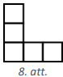

# <lo-sample/> LV.AMO.2017.5.1

Velosipēdists Juris plkst. 7:30 izbrauca no Cēsīm uz Madonu, bet velosipēdists 
Armands plkst. 8:00 izbrauca no Madonas uz Cēsīm. Juris brauca ar ātrumu 
$20~\mathrm{km/h}$, bet Armands - ar ātrumu $10~\mathrm{km/h}$. **(A)** Cikos 
katrs braucējs nokļūs galapunktā, ja attālums starp Cēsīm un Madonu ir 
$90~\mathrm{km}$? **(B)** Cikos attālums starp abiem velosipēdistiem būs 
$30~\mathrm{km}$?

<small>

* questionType:
* domain:

</small>

## Atrisinājums

**(A)** Juris galapunktā nokļūs pēc $90:20=4,5$ stundām jeb 
$4~\mathrm{h}\ 30~\mathrm{min}$. Tātad Juris galapunktā nokļūs plkst. 12:00. 
Armands galapunktā nokļūs pēc $90:10=9$ stundām. Tātad Armands galapunktā 
nokļūs plkst. 17:00.

**(B)** Ievērojam, ka plkst. 8:00 Juris jau būs veicis $10~\mathrm{km}$ un 
attālums starp abiem velosipēdistiem būs $80~\mathrm{km}$. lespējami divi 
gadījumi.

1) Apskatīsim gadījumu, kad abi velosipēdisti vēl nav satikušies un attālums 
starp tiem ir $30~\mathrm{km}$ (skat. 1.att.). Tad, sākot no plkst. 8:00, tie 
abi kopā ir veikuši $80-30=50~\mathrm{km}$. Tā kā abi velosipēdisti viens otram
tuvojas ar ātrumu $20+10=30~\mathrm{km/h}$, tad $50~\mathrm{km}$ tie abi kopā 
būs veikuši $50:30=1 \frac{2}{3} ~\mathrm{h}$ jeb 
$1~\mathrm{h}\ 40~\mathrm{min}$. Tātad abi velosipēdisti būs $30~\mathrm{km}$ 
attālumā viens no otra plkst. 9:40.

2) Apskatīsim gadījumu, kad abi velosipēdisti ir pabraukuši viens otram garām 
un attālums starp tiem ir $30~\mathrm{km}$ (skat. 2.att.). Tad, sākot no 
plkst. 8:00, tie abi kopā ir veikuši $80+30=110~\mathrm{km}$. Tā kā abi 
velosipēdisti viens otram tuvojas un attālinās ar ātrumu $30~\mathrm{km/h}$, 
tad $110~\mathrm{km}$ tie abi kopā būs veikuši $110:30=3 \frac{2}{3}~\mathrm{h}$ 
jeb $3~\mathrm{h}\ 40~\mathrm{min}$. Tātad abi velosipēdisti būs 
$30~\mathrm{km}$ attālumā viens no otra plkst. 11:40.

Līdz ar to esam ieguvuši, ka abi velosipēdisti būs $30~\mathrm{km}$ attālumā 
viens no otra plkst. 9:40 un 11:40.

# <lo-sample/> LV.AMO.2017.5.2

Katrā tukšajā aplītī (skat. 3.att.) ieraksti vienu naturālu skaitli tā, lai 
aplīšos būtu ierakstīti visi naturālie skaitļi no $1$ līdz $9$ un lai skaitļu 
summa uz katras trijstūra malas būtu viena un tā pati!

<small>

* questionType:
* domain:

</small>

## Atrisinājums

Der, piemēram, jebkurš no 4.att. dotajiem skaitļu izkārtojumiem, tiem 
atbilstošās summas ir $17;\ 19;\ 20;\ 21;\ 23$.

*Piezīme.* Lai atrastu skaitļu izvietojumu, var palīdzēt tālākie spriedumi. 
Aprēķināsim kopējo skaitļu summu $S$ visām trim trijstūra malām, ievērojot, ka 
virsotnēs ierakstītie skaitļi $a,\ b$ un $c$ tiek pieskaitīti divas reizes: 
$3 \cdot S=1+2+3+4+5+6+7+8+9+a+b+c$ jeb $3 \cdot S=45+a+b+c$. Tātad $a+b+c$ 
jādalās ar $3$.

# <lo-sample/> LV.AMO.2017.5.3

**(A)** Vai var uz lapas atlikt sešus punktus un savienot tos ar nogriežņiem 
tā, lai tie nekrustojas un katrs punkts ir savienots ar tieši četriem citiem 
punktiem? **(B)** Vai var uz lapas atlikt septiņus punktus un savienot tos ar 
nogriežņiem tā, lai tie nekrustojas un katrs punkts ir savienots ar tieši trim 
citiem punktiem?

<small>

* questionType:
* domain:

</small>

## Atrisinājums

**(A)** Jā, var, skat., piemēram, 5.att. **(B)** Nē, nevar. Saskaitīsim visu 
nogriežņu galapunktus. Katrā no $7$ punktiem atrodas triju nogriežņu 
galapunkti, tāpēc kopā būtu jābūt $3 \cdot 7=21$ galapunktam. Bet katram 
nogrieznim ir divi gali, tātad kopējam galapunktu skaitam jābūt pāra skaitlim -
pretruna.

# <lo-sample/> LV.AMO.2017.5.4

Pareizā reizināšanas piemērā $AH \cdot E=UHH$ vienādi cipari aizstāti ar 
vienādiem burtiem, dažādi cipari - ar dažādiem burtiem. Kāds cipars atbilst 
katram burtam, ja izmantoti tikai cipari $2,\ 4,\ 6$ un $8$? Atrodi visus 
variantus un pamato, ka citu nav!

<small>

* questionType:
* domain:

</small>

## Atrisinājums

Ievērojam, ka reizinot $H$ un $E$ iegūstam skaitli, kura pēdējais cipars ir 
$H$. Pārbaudot visus iespējamos gadījumus 
($2 \cdot 4=8;\ \mathbf{2} \cdot 6=1\mathbf{2};\ 2 \cdot 8=16;\ \mathbf{4} \cdot 6=2\mathbf{4};\ 4 \cdot 8=32;\ \mathbf{8} \cdot 6=4\mathbf{8}$),
iegūstam, ka vienīgā derīgā $E$ vērtība ir $6$. Tātad iegūstam 
$AH \cdot 6=UHH$. Cipars $A$ nevar būt $2$, jo pat $28 \cdot 6=168$, kas neder,
jo cipars $U$ ir vismaz divi. Atliek pārbaudīt četrus iespējamos gadījumus: 
$42 \cdot 6=252$ (neder); $48 \cdot 6=288$ (der); $82 \cdot 6=492$ (neder); 
$84 \cdot 6=504$ (neder). Tātad vienīgā iespēja, ka $A=4;\ H=8$;\ $E=6$ un 
$U=2$.

# <lo-sample/> LV.AMO.2017.5.5

Ja mēneša $13.$ datums ir piektdiena, tad saka, ka tā ir melnā piektdiena.

**(A)** Kāds lielākais skaits melno piektdienu var būt vienā gadā?

**(B)** Vai iespējams, ka gada laikā nav nevienas melnās piektdienas?

<small>

* questionType:
* domain:

</small>

## Atrisinājums

**(A)** Lielākais melno piektdienu skaits gada laikā ir $3$. Pamatosim, ka 
vairāk melno piektdienu gada laikā nevar būt. Aplūkosim, kurā nedēļas dienā ir 
katra mēneša $13.$ datums, ja $13.$ janvāris ir nedēļas diena $x$. Jāņem vērā, 
ka īsajā un garajā gadā šīs nedēļas dienas atšķiras. Tabulā ar $x+n$ apzīmēta 
nedēļas diena, kas no $x$ ir $n$ dienas uz priekšu ($n$ iespējamās vērtības ir 
$1;\ 2;\ 3;\ 4;\ 5;\ 6$).

| **Mēneša $13.$ datums**   **(dienu skaits mēnesī)** | **Nedēļas diena**   **īsajā gadā** | **Nedēļas diena**   **garajā gadā** |
| :--- | :---: | :---: |
| $13.$ janvāris $(31)$ | $x$ | $x$ |
| $13.$ februāris ($28$ vai $29$) | $x+3$ | $x+3$ |
| $13.$ marts ($31$) | $x+3$ | $x+4$ |
| $13.$ aprīlis ($30$) | $x+6$ | $x$ |
| $13.$ maijs ($31$) | $x+1$ | $x+2$ |
| $13.$ jūnijs ($30$) | $x+4$ | $x+5$ |
| $13.$ jūlijs ($31$) | $x+6$ | $x$ |
| $13.$ augusts ($31$) | $x+2$ | $x+3$ |
| $13.$ septembris ($30$) | $x+5$ | $x+6$ |
| $13.$ oktobris ($31$) | $x$ | $x+1$ |
| $13.$ novembris ($30$) | $x+3$ | $x+4$ |
| $13.$ decembris ($31$) | $x+5$ | $x+6$ |

Saskaitīsim, cik gadā būs melnās piektdienas, ja piektdiena ir nedēļas diena 
$x,\ x+1, \ldots,\ x+6$.

| **Piektdiena** | **Īsais gads** | **Garais gads** |
| :---: | :---: | :---: |
| $\boldsymbol{x}$ | $2$ | $3$ |
| $\boldsymbol{x}+\mathbf{1}$ | $1$ | $1$ |
| $\boldsymbol{x}+\mathbf{2}$ | $1$ | $1$ |
| $\boldsymbol{x}+\mathbf{3}$ | $3$ | $2$ |
| $\boldsymbol{x}+\mathbf{4}$ | $1$ | $2$ |
| $\boldsymbol{x}+\mathbf{5}$ | $2$ | $1$ |
| $\boldsymbol{x}+\mathbf{6}$ | $2$ | $2$ |

Tabulā redzams, ka lielākais melno piektdienu skaits gada laikā (neatkarīgi no 
tā, vai gads ir īsais vai garais) ir $3$.

**(B)** Nē, nevar būt - neatkarīgi no tā, kura nedēļas diena ir apzīmēta ar 
$x$, gada laikā ir vismaz viena melnā piektdiena.

# <lo-sample/> LV.AMO.2017.6.1

Vienmērīgi soļojot pie sava drauga, Agris nolēma noteikt attālumu no savas 
mājas līdz drauga mājai. Pusi ceļa Agris soļus skaitīja pa pāriem, bet otru 
pusi - pa trijniekiem, turklāt pāru iznāca par $250$ vairāk nekā trijnieku. Cik
soļu ir starp draugu mājām?

<small>

* questionType:
* domain:

</small>

## Atrisinājums

Pusi no attāluma starp draugu mājām apzīmēsim ar $x$. Tad soļu pāru skaits ir 
$\frac{x}{2}$, bet soļu trijnieku skaits ir $\frac{x}{3}$. No uzdevuma 
nosacījumiem izriet, ka $\frac{x}{2}-\frac{x}{3}=250$ jeb $\frac{x}{6}=250$ un 
$x=1500$ soļu. Tātad starp draugu mājām ir $2 \cdot x=3000$ soļu.

# <lo-sample/> LV.AMO.2017.6.2

Katrā tukšajā rūtiņā (skat. 6.att.) ieraksti vienu naturālu skaitli tā, lai 
tabulā būtu ierakstīti visi naturālie skaitļi no $1$ līdz $16$ un lai skaitļu 
summa visās rindās, visās kolonnās un abās diagonālēs būtu viena un tā pati!

<small>

* questionType:
* domain:

</small>

## Atrisinājums

Skat. 7.att., kur skaitļu summa katrā rindā, kolonnā un abās diagonāles ir 
$34$.

*Piezīme.* Visu skaitļu no $1$ līdz $16$ summa ir $136$. Tā kā visās četrās 
rindās ierakstīto skaitļu summām ir jābūt vienādām, tad skaitļu summai katrā 
rindā jābūt $136:4=34$. Tad tabulu aizpildīt sāk ar otro rindu.

# <lo-sample/> LV.AMO.2017.6.3

Kāds mazākais skaits stūrīšu (skat. 8.att.) jāizgriež no $6 \times 6$ rūtiņu 
laukuma, lai no tā vairs nevarētu izgriezt nevienu šādu stūrīti? Griezuma 
līnijām jāiet pa rūtiņu līnijām un stūrīši var būt pagriezti.

<small>

* questionType:
* domain:

</small>

## Atrisinājums

Mazākais skaits stūrīšu, kas jāizgriež, ir $3$, skat., piemēram, 9.att. 
Pamatosim, ka ar mazāk kā $3$ stūrīšiem nepietiek. Pieņemsim, ka pietiek ar $2$
stūrīšiem. Aplūkojam tās četras iespējamās stūrīšu izgriešanas vietas, kas 
parādītas 10.att. Ar vienu stūrīti vienlaikus var nosegt ne vairāk kā divas no 
šīm blakus esošajām stūrišu vietām, turklāt stūrīša malai jāiet pa laukuma 
malas rūtiņām (pretējā gadīumā stūrītis nevar vienlaikus ietekmēt divas 
iespējamās stūrīšu novietošanas vietas). Tātad vienam no diviem stūrīšiem 
jānosedz divas augšējās stūrīšu vietas, bet otram - divas apakšējās. Tas 
nozīmē, ka augšējā laukuma pusē esošais stūrītis neietekmē apakšējās laukuma 
puses rūtiņas un otrādi (skat., piemēram, 11.att.), bet, neatkarīgi no tā, kā 
laukuma augšējā un apakšējā pusē būs novietots katrs no abiem stūrīšem, no 
katras laukuma puses (augšējās un apakšējās) var izgriezt vēl pa vienam 
stūrītim. Tātad ar diviem stūrīšiem nepietiek.

# <lo-sample/> LV.AMO.2017.6.4

Ap apaļu galdu apsēdās $13$ bērni. Tie nolēma, ka zēni vienmēr melos meitenēm, 
bet teiks patiesību zēniem, un meitenes vienmēr melos zēniem, bet teiks 
patiesību meitenēm. Viens no bērniem savam blakussēdētājam, kas sēž no vina pa 
kreisi, teica: "Pie šī galda sēž vairāk zēnu nekā meiteņu." Tad šis 
blakussēdētājs savam kreisajam blakussēdētājam teica: "Pie šī galda sēž vairāk 
meiteņu nekā zēnu." Tā viņi pamišus turpināja - viens teica, ka zēnu ir vairāk 
nekā meiteņu, bet nākamais, ka meiteņu ir vairāk nekā zēnu, kamēr pēdējais 
(trīspadsmitais) bērns teica pirmajam: "Pie šī galda sēž vairāk zēnu nekā 
meiteņu." Cik zēnu sēž pie apaļā galda?

<small>

* questionType:
* domain:

</small>

## Atrisinājums

Pārbaudīsim abus iespējamos gadījumus: meiteņu ir vairāk nekā zēnu, zēnu ir 
vairāk nekā meiteņu.

1) Apskatīsim situāciju, ja meiteņu būtu vairāk nekā zēnu.

   - Ja pirmais bērns ir meitene, tad bērni ap galdu sēž šādā secībā: 
     $M, Z, Z, M, M, Z, Z, M, M, Z, Z, M, M$. Rodas pretruna, jo pēdējā 
	 meitene, sakot, ka zēnu ir vairāk nekā meiteņu, melo meitenei.
   - Ja pirmais bērns ir zēns, tad bērni ap galdu sēž šādā secībā: 
     $Z, M, M, Z, Z, M, M, Z, Z, M, M, Z, Z$. Rodas pretruna, jo pēdējais zēns,
	 sakot, ka zēnu ir vairāk nekā meiteņu, melo zēnam.

2) Apskatīsim situāciju, ja zēnu būtu vairāk nekā meiteņu.

   - Ja pirmais bērns ir meitene, tad bērni ap galdu sēž šādā secībā: 
     $M, M, Z, Z, M, M, Z, Z, M, M, Z, Z, M$. Rodas pretruna, jo šajā situācijā
	 pie galda sēdētu vairāk meiteņu nekā zēnu.
   - Ja pirmais bērns ir zēns, tad bērni ap galdu sēž šādā secībā: 
     $Z, Z, M, M, Z, Z, M, M, Z, Z, M, M, Z$. Šajā gadījumā pretrunas nerodas.

Tātad pie galda sēž septiņi zēni.

# <lo-sample/> LV.AMO.2017.6.5

Atrodi visus tādus naturālus četrciparu skaitļus, kuru cipari ir dažādi un kas 
dalās ar visiem skaitļiem no $1$ līdz $10$ bez atlikuma!

<small>

* questionType:
* domain:

</small>

## Atrisinājums

Skaitļu no $1$ līdz $10$ mazākais kopīgais dalāmais ir 
$2^{3} \cdot 3^{2} \cdot 5 \cdot 7=2520$. Skaitlis $2520$ neder, jo tam ir divi
vienādi cipari. Meklētajiem skaitļiem ir jādalās ar $2520$, tāpēc nākamie 
iespējamie skaitļi ir $2520 \cdot 2=5040-$ neder, jo ir divi vienādi cipari, un
$2520 \cdot 3=7560-$ der. Ja $2520$ reizina ar skaitli, kas ir lielāks nekā 
$3$, tad iegūst skaitli, kam ir vairāk nekā $4$ cipari $(2520 \cdot 4=10080)$, 
tātad pārējie skaitļi neder. Vienīgais derīgais skaitlis ir $7560$.

# <lo-sample/> LV.AMO.2017.7.1

Automašīna $2$ stundās nobrauca tikpat, cik velosipēdists $5$ stundās un $20$ 
minūtēs. Kāds ir katra transporta līdzekļa ātrums, ja velosipēdists brauc par 
$45~\mathrm{km/h}$ lēnāk nekā automašīna un abi transporta līdzekļi pārvietojas
ar nemainīgu ātrumu?

<small>

* questionType:
* domain:

</small>

## Atrisinājums

Velosipēdista ātrumu apzīmējam ar $v~\mathrm{km/h}$, tad automašīnas ātrums ir 
$v+45~\mathrm{km/h}$. Tā kā abi veica vienādu ceļa garumu, tad iegūstam 
vienādojumu

$$\begin{gathered}
2 \cdot(v+45)=5 \frac{1}{3} \cdot v \\
2v+90=5 \frac{1}{3} v \\
3 \frac{1}{3} v=90 \\
\frac{10}{3} v=90 \\
v=27
\end{gathered}$$

Tātad velosipēdista ātrums ir $27~\mathrm{km/h}$ un automašīnas ātrums ir 
$27+45=72~\mathrm{km/h}$.

# <lo-sample/> LV.AMO.2017.7.2

Katrā tukšajā lodziņā (skat. 12.att.) ieraksti vienu naturālu skaitli tā, lai 
figūrā būtu ierakstīti visi naturālie skaitļi no $1$ līdz $19$ un lai skaitļu 
summa visās joslās būtu viena un tā pati!

*Piezīme.* Visas iespējamās joslas skat. 13.att., tās var būt pagrieztas.

<small>

* questionType:
* domain:

</small>

## Atrisinājums

Skat. 14.att., skaitļu summa katrā joslā ir $38$.

*Piezīme.* Atrast skaitļu izvietojumu var palīdzēt tālāk dotie spriedumi. Visu 
skaitļu summa ir $1+\ldots+19=190$, bet tā ir piecu vertikālo joslu summa, 
tātad vienā joslā skaitļu summai jābūt $190:5=38$. Tālāk aizpildām joslas, 
kurās ir tikai viens tukšs lodziņš (piemēram, pirmo un otro vertikālo joslu no 
kreisās puses).

# <lo-sample/> LV.AMO.2017.7.3

Divus taisnstūra lapas stūrus nolocīja tā, kā parādīts 15.att. Izrādījās, ka 
lapas apakšējā mala tika sadalīta trīs vienāda garuma nogriežņos un augšējā 
mala - divos vienāda garuma nogriežņos. Pierādīt, ka iekrāsotais trijstūris ir 
vienādmalu!

<small>

* questionType:
* domain:

</small>

## Atrisinājums

Tā kā trijstūris $ABG$ sakrīt ar trijstūri $AEG$, tad leņķis 
$\sphericalangle BGA=\sphericalangle EGA$ (skat. 16.att.). Taisnstūra pretējās 
malas $BC$ un $AD$ ir paralēlas, tāpēc $\sphericalangle BGA=\sphericalangle GAH$
kā iekšējie škērsleņķi pie paralēlām taisnēm. Līdz ar to 
$\sphericalangle EGA=\sphericalangle GAH$ un trijstūris $AHG$ ir vienādsānu un 
$AH=GH$. Līdzīgi iegūstam, ka $DI=IG$. Tā kā $AH=HI=ID$, tad $GH=HI=IG$ un 
trijstūris $HGI$ ir vienādmalu.

# <lo-sample/> LV.AMO.2017.7.4

Uz galda stāv divas kastes $A$ un $B$. Sākumā kastē $A$ ir melnas un baltas 
bumbiņas, bet kastē $B$ ir tikai melnas bumbiņas. Bumbiņu skaits abās kastēs ir
vienāds. Anna no kastes $A$ uz labu laimi izņem divas bumbiņas:

- ja tās ir vienādā krāsā, tad tās abas ieliek kastē $B$, un vienu melnu 
  bumbiņu no kastes $B$ ieliek kastē $A$;
- ja tās ir dažādās krāsās, tad balto bumbiņu ieliek atpakaļ kastē $A$, bet 
  melno - kastē $B$.

Tā turpina, kamēr kastē $A$ paliek tieši viena bumbiņa. Kādā krāsā būs pēdējā 
bumbiņa, kas palikusi kastē $A$, ja sākumā kastē $A$ ir **(A)** $2017$ baltas 
un $2017$ melnas bumbiņas; **(B)** $2016$ baltas un $2018$ melnas bumbiņas?

<small>

* questionType:
* domain:

</small>

## Atrisinājums

Aplūkojam, kā atkarībā no paņemto bumbiņu krāsas mainās balto bumbiņu skaits 
kastē $A$.

| **Bumbiņas** | **Balto bumbiņu skaita izmaiņa traukā $A$** |
| :--- | :---: |
| balta + balta | $-2$ |
| melna + melna | $0$ |
| balta + melna | $0$ |

Kā redzams, balto bumbiņu skaits kastē $A$ vai nu nemainās, vai arī samazinās 
par divi. Tas nozīmē, ka skaitļa, kas apzīmē balto bumbiņu skaitu kastē $A$, 
paritāte nemainās.

Līdz ar to **(A)** gadījumā pēdējā bumbiņa kastē $A$ būs balta, bet **(B)** 
gadījumā - melna.

# <lo-sample/> LV.AMO.2017.7.5

Cik ir tādu naturālu divciparu skaitļu, kuriem ciparu reizinājums ir tieši 
divas reizes mazāks nekā pats skaitlis?

<small>

* questionType:
* domain:

</small>

## Atrisinājums

Uzdevuma nosacījumiem atbilst tikai skaitlis $36$. Pamatosim, ka citu skaitļu 
nav.

Apzīmēsim divciparu skaitli ar $\overline{ab}$, tad varam izteikt 
$\overline{ab}=10a+b$. No uzdevuma nosacījumiem iegūstam vienādojumu

$$\begin{aligned}
& 10a+b=2ab \\
& 2ab-10a=b \\
& 2a(b-5)=b
\end{aligned}$$

Tā kā vienādojuma kreisā puse ir pāra skaitlis, tad arī labā ir pāra, tātad $b$
ir pāra skaitlis. Ievērojam, ka $b$ jābūt lielākam nekā $5$, lai vienādojuma 
kreisā puse nebūtu negatīva (jo labajā pusē ir cipars $b$). Tātad vienīgās 
iespējamās cipara $b$ vērtības ir $6$ vai $8$.

Ja $b=6$, tad $a=\frac{b}{2(b-5)}=3$. Skaitlis $36$ tiešām ir divas reizes 
lielāks nekā tā ciparu reizinājums.

Ja $b=8$, tad $a=\frac{b}{2(b-5)}=\frac{4}{3}$, kas nav cipars, tātad $b=8$ 
neder.

Tātad der tikai skaitlis $36$.

# <lo-sample/> LV.AMO.2017.8.1

Vai uz taisnes $y=72-5x$ ir punkts, kura **(A)** abscisa un ordināta ir 
vienādas; **(B)** ordināta ir divas reizes lielāka nekā abscisa?

<small>

* questionType:
* domain:

</small>

## Atrisinājums

**(A)** Jā, uz taisnes ir šāds punkts. Ja punkta abscisa un ordināta ir 
vienādas, tad $y=x$ un iegūstam vienādojumu $x=72-5x$ jeb $6x=72$. Tātad $x=12$
un meklētā punkta koordinātas ir $(12; 12)$.

**(B)** Jā, uz taisnes ir šāds punkts. Ja punkta abscisa ir divas reizes 
lielāka nekā ordināta, tad $y=2x$ un iegūstam vienādojumu $2x=72-5x$ jeb 
$7x=72$. Tātad $x=\frac{72}{7}=10 \frac{2}{7}$ un $y=20 \frac{4}{7}$, līdz ar 
to meklētā punkta koordinātas ir $\left(10 \frac{2}{7}; 20 \frac{4}{7}\right)$.

# <lo-sample/> LV.AMO.2017.8.2

Vai katrā tukšajā aplītī (skat. 17.att.) var ierakstīt vienu naturālu skaitli 
tā, lai aplīšos būtu ierakstīti visi naturālie skaitļi no $1$ līdz $9$ un lai 
skaitļu summa uz katras trijstūra malas būtu **(A)** $22$; **(B)** $23$?

<small>

* questionType:
* domain:

</small>

## Atrisinājums

**(A)** Nav iespējams. Virsotnēs ierakstītos skaitļus apzīmēsim ar $a,\ b,\ c$ 
(skat. 18.att.), skaitļu summu uz katras trijstūra malas apzīmēsim ar $S$. 
Aprēķināsim kopējo skaitļu summu visām trim trijstūra malām, ievērojot, ka 
skaitļi $a,\ b$ un $c$ tiek pieskaitīti divas reizes:

$3 \cdot S=1+2+2+4+5+6+7+8+9+a+b+c$ jeb $3S=45+a+b+c$

Ja $S=22$, tad virsotņu aplīšos ierakstīto skaitļu summa ir $a+b+c=21$. 
Iegūstam, ka $c=21-a-b$. Neviena no $a,\ b$ un $c$ vērtībām nevar būt $1$, jo 
pat tad, ja abās pārējās virsotnēs būs ierakstīti abi lielākie atlikušie 
skaitļi, šo skaitļu summa nepārsniegs $1+9+8=18$. Tātad skaitlis $1$ būtu 
jāieraksta kādā no pārējiem aplīšiem, kas atrodas uz trijstūra malas. 
Pieņemsim, ka šīs malas virsotnes aplīšos ierakstīti $a$ un $b$. Tad otrajā šīs
malas aplītī būtu jāieraksta skaitlis $22-a-b-1=21-a-b$, bet šāda jau ir $c$ 
vērtība un šis skaitlis jau ir ierakstīts trešajā virsotnes aplītī. Esam 
ieguvuši pretrunu, tāpēc $S$ vērtība nevar būt $22$.

**(B)** Jā, prasītais ir iespējams, skat., piemēram, 19.att.

# <lo-sample/> LV.AMO.2017.8.3

Taisnstūrveida papīra lapu pārlocīja tā, ka pārlocītais lapas stūris atrodas uz
pretējās malas (skat. 20.att.). Trijstūri $AFE$ un $CBE$ ir vienādi un 
$CB=7~\mathrm{cm}$, bet $BD=3~\mathrm{cm}$. Kādi ir sākotnējās papīra lapas 
malu garumi?

<small>

* questionType:
* domain:

</small>

## Atrisinājums

Sākotnējās lapas vienas malas garums $CD=CB+BD=10~\mathrm{cm}$ (skat. 21.att.).
Ievērojam, ka $AB=CD=10~\mathrm{cm}$ kā pārlocītās taisnstūrveida lapas pretējā
mala.

Tā kā pēc dotā trijstūri $AFE$ un $CBE$ ir vienādi, tad to atbilstošie elementi
arī ir vienādi: $\sphericalangle AEF=\sphericalangle BEC$, 
$AF=CB=7~\mathrm{cm},\ AE=EC$ un $EF=BE$. Saskaitot vienādus lielumus, iegūstam
vienādas summas, tas ir, $CE+EF=AE+EB=AB=10~\mathrm{cm}$. Nogriežņa $KF$ garums
sakrīt ar $AF$ garumu. Tātad taisnstūra otras malas garums ir 
$10+7=17~\mathrm{cm}$. Līdz ar to sākotnējās papīra lapas malu garumi ir 
$10~\mathrm{cm}$ un $17~\mathrm{cm}$.

# <lo-sample/> LV.AMO.2017.8.4

Doti pieci pēc izskata vienādi atsvari. Katra atsvara masa izsakāma veselā 
skaitā gramu, turklāt šie skaitļi ir pēc kārtas esoši naturāli skaitļi. Atsvaru
masu salīdzināšanai atļauts izmantot sviru svarus, kur katrā svaru kausā drīkst
likt tieši divus atsvarus. Vai iespējams **(A)** noteikt visvieglāko un 
vissmagāko no atsvariem; **(B)** sarindot visus atsvarus pēc kārtas no smagākā 
līdz vieglākajam?

*Piezīme.* Ar sviru svariem nevar noteikt, tieši par cik gramiem viens svaru 
kauss ir smagāks nekā otrs.

<small>

* questionType:
* domain:

</small>

## Atrisinājums

Parādīsim, ka abos gadījumos prasītais ir iespējams. Apzīmējam atsvarus ar 
burtiem, iekavās norādot to masu:

$$A(x+2)>B(x+1)>C(x)>D(x-1)>E(x-2)$$

Svēršanu rezultātiem jābūt:

$\begin{array}{lllll}
A+B>C+D; & A+C>B+D; &  &  &  \\ 
 &  &  &  &  \\ 
 &  &  &  & 
\end{array}$

$A+B > C+D; \quad A+C > B+D; \quad A+D=B+C; \quad A+E=B+D; \quad B+C > D+E;$  
$A+B > C+E; \quad A+C > B+E; \quad A+D > B+E; \quad A+E < B+C; \quad B+D > C+E;$  
$A+B > D+E; \quad A+C > D+E; \quad A+D > C+E; \quad A+E > C+D; \quad B+E=C+D.$  

Tabulā attēlots, cik "uzvaru" (bija smagāks), "neizšķirtu" (bija vienāds) un 
"zaudējumu" (bija vieglāks) bija katram pārim.

| **Pāris** | **Uzvaras** | **Neizšķirti** | **Zaudējumi** |
| :---: | :---: | :---: | :---: |
| $A+B$ | $3$ | $0$ | $0$ |
| $A+C$ | $3$ | $0$ | $0$ |
| $A+D$ | $2$ | $1$ | $0$ |
| $A+E$ | $1$ | $1$ | $1$ |
| $B+C$ | $2$ | $1$ | $0$ |
| $B+D$ | $1$ | $1$ | $1$ |
| $B+E$ | $0$ | $1$ | $2$ |
| $C+D$ | $0$ | $1$ | $2$ |
| $C+E$ | $0$ | $0$ | $3$ |
| $D+E$ | $0$ | $0$ | $3$ |

Lai sarindotu atsvarus no smagākā līdz vieglākajam (tātad arī noteiktu 
visvieglāko un vissmagāko no atsvariem), veicam tālāk aprakstītās darbības.

Liekam vienu atsvaru pāri vienā kausā un salīdzinām to ar visām trim pārējo 
trīs atsvaru kombinācijām. Tā izdarām ar katru no $10$ iespējamajiem dažādajiem
pāriem. Katram no pāriem iegūsim kaut kādu rezultātu 
uzvaras/neizšķirti/zaudējumi.

1) Tiem diviem pāriem, kam rezultāts ir $3/0/0$, kopīgais atsvars ir $A$ - pats
   smagākais.
2) Tiem diviem pāriem, kam rezultāts ir $0/0/3$, kopīgais atsvars ir $E$ - pats
   vieglākais.
3) Tas atsvars, kas ir kopīgs 1) un 2) punktā apskatītajiem pāriem, ir atsvars 
   $C$ - vidējais.
4) No 1) punkta iegūstam, ka tas atsvars, kas ir pārī ar $A$, bet nav atsvars 
   $C$, ir atsvars $B$.
5) No 2) punkta iegūstam, ka tas atsvars, kas ir pārī ar $E$, bet nav atsvars 
   $C$, ir atsvars $D$.

*Piezīme.* Atsvarus var noteikt arī citos veidos, piemēram, atsvars, kas 
nepiedalās $1/1/1$, ir atsvars $C$.

# <lo-sample/> LV.AMO.2017.8.5

Vai var atrast tādu desmitciparu skaitli, kas ir vienāds ar visu savu ciparu 
reizināumu?

<small>

* questionType:
* domain:

</small>

## Atrisinājums

Nē, šāds skaitlis neeksistē. Desmitciparu skaitļa (un vispār jebkura skaitļa, 
kam ir vairāk nekā viens cipars) ciparu reizinājums vienmēr būs mazāks nekā 
pats skaitlis. Pierādīsim to. Apzīmējam skaitļa ciparus ar 
$a_{1}, a_{2}, \ldots, a_{10}$. Tad

$$\overline{a_{1}a_{2} \ldots a_{10}} \geq \overline{a_{1}0 \ldots 0}=a_{1} \cdot 10^{9}>a_{1} \cdot 9^{9} \geq a_{1} \cdot a_{2} \cdot \ldots \cdot a_{10}$$

Pēdējā nevienādībā tika izmantots, ka neviens skaitļa cipars nepārsniedz $9$.

# <lo-sample/> LV.AMO.2017.9.1

Vai uz parabolas $y=x^{2}+6x+6$ ir punkts, kura **(A)** abscisa un ordināta ir 
vienādas; **(B)** ordināta ir trīs reizes lielāka nekā abscisa?

<small>

* questionType:
* domain:

</small>

## Atrisinājums

**(A)** Jā, uz parabolas ir šāds punkts. Ja punkta abscisa un ordināta ir 
vienādas, tad $y=x$ un iegūstam vienādojumu $x=x^{2}+6x+6$ jeb $x^{2}+5x+6=0$, 
kura saknes ir $x_{1}=-2$ un $x_{2}=-3$ Tātad meklētā punkta koordinātas ir 
$(-2; -2)$ vai $(-3; -3)$.

**(B)** Pierādīsim, ka uz parabolas nav šāda punkta. Ja punkta ordināta ir trīs
reizes lielāka nekā abscisa, tad $y=3x$ un iegūstam vienādojumu $3x=x^{2}+6x+6$
jeb $x^{2}+3x+6=0$. Tā kā diskriminats $D=9-24=-15<0$, tad atbilstošajam 
vienādojumam nav reālu sakņu un nevar atrast tādu $x$ vērtību, ka $y=3x$ un 
punkts atrodas uz parabolas.

# <lo-sample/> LV.AMO.2017.9.2

Pierādīt, ka $x^{6}+y^{6}+\frac{2}{x^{3}y^{3}}-4 \geq 0$, ja $x>0,\ y>0$.

<small>

* questionType:
* domain:

</small>

## Atrisinājums

Pierādāmo nevienādību ekvivalenti pārveidojam formā

$$x^{6}+y^{6}+\frac{2}{x^{3}y^{3}} \geq 4$$

Nevienādības kreisās puses izteiksmes saskaitāmo $\frac{2}{x^{3}y^{3}}$ 
uzrakstām kā divu saskaitāmo summu un lietojam nevienādību starp vidējo 
aritmētisko un vidējo ģeometrisko

$$x^{6}+y^{6}+\frac{2}{x^{3}y^{3}}=x^{6}+y^{6}+\frac{1}{x^{3}y^{3}}+\frac{1}{x^{3}y^{3}} \geq 4 \cdot \sqrt[4]{x^{6} \cdot y^{6} \cdot \frac{1}{x^{3}y^{3}} \cdot \frac{1}{x^{3}y^{3}}}=4$$

kas arī bija jāpierāda.

# <lo-sample/> LV.AMO.2017.9.3

Dots trijstūris $ABC$, kuram $AB>AC>BC$. Virsotnes $A$ blakusleņķa bisektrise 
krusto malas $BC$ pagarinājumu punktā $D$, bet virsotnes $C$ blakusleņķa 
bisektrise krusto malas $AB$ pagarinājumu punktā $E$. Zināms, ka $AD=AC=CE$. 
Aprēķināt trijstūra $ABC$ leņķus!

<small>

* questionType:
* domain:

</small>

## Atrisinājums

Apzīmējam $\sphericalangle BCE=\alpha$ (skat. 22.att.). Tad no bisektrises 
definīcijas un blakusleņķu īpašības izriet, ka 
$\sphericalangle ACE=180^{\circ}-\alpha$. Izmantojot krustleņķu īpašību un 
vienādsānu trijstūra īpašību, iegūstam, ka 
$\sphericalangle ADC=\sphericalangle ACD=2 \sphericalangle BCE=2 \alpha$ un 
$\sphericalangle DAC=180^{\circ}-4 \alpha$.

Izsakām $\sphericalangle CAE=180^{\circ}-2 \sphericalangle DAC=180^{\circ}-\left(360^{\circ}-8 \alpha\right)=8 \alpha-180^{\circ}$.
Tā kā trijstūris $ACE$ ir vienādsānu, tad 
$\sphericalangle CAB=\sphericalangle AEC=8 \alpha-180^{\circ}$.

No trijstūra $ACE$ iegūstam, ka

$$\begin{gathered}
2 \sphericalangle CAE+\sphericalangle ACE=180^{\circ}; \\
2\left(8 \alpha-180^{\circ}\right)+180^{\circ}-\alpha=180^{\circ}; \\
15 \alpha=360^{\circ}.
\end{gathered}$$

Tātad $\alpha=24^{\circ}$, un varam aprēķināt trijstūra $ABC$ leņķus: 
$\sphericalangle BAC=8 \cdot 24^{\circ}-180^{\circ}=12^{\circ}; \sphericalangle ACB=180^{\circ}-2 \cdot 24^{\circ}=132^{\circ}$
un $\sphericalangle ABC=180^{\circ}-132^{\circ}-12^{\circ}=36^{\circ}$.

## Atrisinājums

Apzīmējam $\sphericalangle BCE=\alpha$ un $\sphericalangle CAD=\beta$ (skat. 
22.att.). Tad pēc bisektrises definīcijas un blakusleņķu īpašības 
$\sphericalangle ACE=180^{\circ}-\alpha$ un 
$\sphericalangle ACB=180^{\circ}-2 \alpha$.

No vienādsānu trijstūra $ACE$ iegūstam, ka 
$\sphericalangle BAC=\sphericalangle AEC=\frac{\alpha}{2}$. Līdz ar to 
$2 \sphericalangle CAD+\sphericalangle BAC=180^{\circ}$ jeb 
$2 \beta+\frac{\alpha}{2}=180^{\circ}$. No vienādsānu trijstūra $ACD$ iegūstam,
ka $\sphericalangle ADC=\sphericalangle ACD=2 \alpha$ un 
$4 \alpha+\beta=180^{\circ}$. Esam ieguvuši vienādojumu sistēmu: 
$\left\{\begin{array}{l}2 \beta+\frac{\alpha}{2}=180^{\circ} \\ 4 \alpha+\beta=180^{\circ}\end{array}\right.$.
Reizinot otro vienādojumu ar $(-2)$ un saskaitot abus vienādojumus iegūstam 
$\frac{\alpha}{2}-8 \alpha=180^{\circ}-360^{\circ}$ jeb $-15 \alpha=-360^{\circ}$.
Tātad $\alpha=24^{\circ}$, un varam aprēķināt trijstūra $ABC$ leņķus: 
$\sphericalangle BAC=24^{\circ}: 2=12^{\circ};\ \sphericalangle ACB=180^{\circ}-2 \cdot 24^{\circ}=132^{\circ}$
un $\sphericalangle ABC=180^{\circ}-132^{\circ}-12^{\circ}=36^{\circ}$.

# <lo-sample/> LV.AMO.2017.9.4

**(A)** Pierādi, ka dotajā $4 \times 4$ rūtiņu laukumā (skat. 23.att.) nevar 
ierakstīt $16$ dažādus naturālus skaitļus tā, lai katrā rūtiņā būtu ierakstīts 
viens skaitlis un katrā rindā un katrā kolonnā skaitļi pieaugtu bultiņas 
norādītajā virzienā.

**(B)** Kāds mazākais bultiņu skaits jāapvērš pretējā virzienā, lai skaitļus 
varētu izvietot saskaņā ar uzdevuma nosacījumiem?

<small>

* questionType:
* domain:

</small>

## Atrisinājums

**(A)** Apzīmējam rūtiņās ierakstītos skaitļus tā, kā parādīts 24.att. 
Ievērojam, ka

- $A_{1}<A_{2}$ (no $1.$ rindas);
- $A_{2}<A_{3}$ (no $3.$ kolonnas);
- $A_{3}<A_{4}$ (no $2.$ rindas);
- $A_{4}<A_{1}$ (no $2.$ kolonnas).

Līdz ar to esam ieguvuši, ka vienlaicīgi jāizpildās nevienādībām $A_{1}<A_{4}$ 
un $A_{4}<A_{1}$. Tas nav iespējams, tāpēc rūtiņās skaitļus ierakstīt nevar.

**(B)** Jāapvērš vismaz divas bultiņas. Šajā laukumā var atrast trīs četru 
rūtiņu ciklus, kas atzīmēti ar burtiem $A$, $B$ un $C$ (skat. 24.att.). Katrai 
ciklā iesaistītajai bultiņai ir pierakstīts tā cikla burts (vai burti), kurā tā
iesaistīta. Līdzīgi kā (A) gadījumā par ciklu $A$, iegūstam pretrunu arī par 
ciklu $B$ un $C$.

Lai skaitļus rūtiņās varētu ierakstīt, nepieciešams izjaukt visus trīs ciklus. 
To nav iespējams izdarīt apvēršot tikai vienu bultiņu (nav bultiņas, kas būtu 
iesaistīta visos trīs ciklos), tāpēc mazākais apvēršamo bultiņu skaits ir 
divas. Apvēršot divas bultiņas: otrajā rindā un trešajā kolonnā, skaitļus var 
ierakstīt, piemēram, tā, kā parādīts 25.att.

# <lo-sample/> LV.AMO.2017.9.5

Atrisināt naturālos skaitļos vienādojumu $x^{3}+(x+1)^{3}=(x+3)^{3}+1$.

<small>

* questionType:
* domain:

</small>

## Atrisinājums

Atverot iekavas un savelkot līdzīgos saskaitāmos, iegūstam 
$x^{3}-6x^{2}-24x=27$ jeb

$$x\left(x^{2}-6x-24\right)=27.$$

Tā kā $x$ ir naturāls skaitlis, tad tam jābūt skaitļa $27$ dalītājam. Apskatām 
visus iespējamos gadījumus.

1) Ja $x=1$, tad $1 \cdot\left(1^{2}-6 \cdot 1-24\right)=-29 \neq 27$ - neder.
2) Ja $x=3$, tad $3 \cdot\left(3^{2}-6 \cdot 3-24\right)=-99 \neq 27$ - neder.
3) Ja $x=9$, tad $9 \cdot\left(9^{2}-6 \cdot 9-24\right)=27$ - der.
4) Ja $x=27$, tad $27 \cdot\left(27^{2}-27 \cdot 3-24\right)=14661 \neq 27$ - 
   neder.

Esam ieguvuši, ka vienīgā derīgā vērtība ir $x=9$.

## Atrisinājums

Apzīmējam $y=x+2$. Tad doto vienādojumu var pārrakstīt kā

$$(y-2)^{3}+(y-1)^{3}=(y+1)^{3}+1$$

Atverot iekavas, iegūstam

$$\begin{gathered}
y^{3}-6y^{2}+12y-8+y^{3}-3y^{2}+3y-1=y^{3}+3y^{2}+3y+1+1 \\
y^{3}-12y^{2}+12y=11 \\
y\left(y^{2}-12y+12\right)=11
\end{gathered}$$

Tā kā $y$ ir naturāls skaitlis, tad tam jābūt skaitļa $11$ dalītājam. Skaitļa 
$11$ vienīgie dalītāji ir $1$ un $11$. Apskatām abus gadījumus.

1) Ja $y=1$, tad $1 \cdot\left(1^{2}-12 \cdot 1+12\right)=1 \neq 11$. Tātad šī 
   vērtība neder.
2) Ja $y=11$, tad 
   $11 \cdot\left(11^{2}-12 \cdot 11+12\right)=11 \cdot(121-132+12)=11$. Šī 
   vērtība der, tātad dotā vienādojuma atrisinājums ir $x=y-2=11-2=9$.

Esam ieguvuši, ka sākotnējā vienādojuma atrisinājums ir $x=9$.

# <lo-sample/> LV.AMO.2017.10.1

Noteikt tās parametra $a$ vērtības, ar kurām vienādojumam 
$(x-2a)\left(x^{2}-(a+1)x+a\right)=0$ ir trīs dažādas saknes, kuras ir 
aritmētiskās progresijas trīs pēc kārtas ņemti locekļi!

<small>

* questionType:
* domain:

</small>

## Atrisinājums

Dotā vienādojuma kreisajā pusē ir reizinājums, tāpēc $x-2a=0$ vai 
$x^{2}-(a+1)x+a=0$. Lineārā vienādojuma sakne ir $x=2a$. Izmantojot Vjeta 
teorēmu $\left(x_{1}+x_{2}=a+1\right.$ un $\left.x_{1} \cdot x_{2}=a\right)$, 
atrodam kvadrātvienādojuma saknes $x=1$ un $x=a$.

Apskatām visus iespējamos gadījumus, kā var būt sakārtotas dotā vienādojuma 
saknes. Lai noteiktu parametra $a$ vērtības, izmantosim aritmētiskās 
progresijas īpašību $d=a_{2}-a_{1}=a_{3}-a_{2}$.

1) Ja secība ir $1;\ a;\ 2a$ (vai $2a;\ a;\ 1$), tad jāizpildās vienādībai 
   $a-1=2a-a$ jeb $-1=0$. Tā nevar būt, tātad šajā gadīumā saknes nevar veidot 
   aritmētisko progresiju.
2) Ja secība ir $a;\ 1;\ 2a$ (vai $2a;\ 1;\ a$), tad jāizpildās vienādībai 
   $1-a=2a-1$ jeb $3a=2$. Tātad $a=\frac{2}{3}$ un atbilstošā aritmētiskā 
   progresija ir $\frac{2}{3};\ 1;\ \frac{4}{3}$.
3) Ja secība ir $a;\ $2a;\ 1$ (vai $1;\ 2a;\ a$), tad jāizpildās vienādībai 
   $2a-1=a-2a$ jeb $3a=1$. Tātad $a=\frac{1}{3}$ un atbilstošā aritmētiskā 
   progresija ir $\frac{1}{3};\ \frac{2}{3};\ 1$.

Tātad vienādojuma saknes ir aritmētiskās progresijas trīs pēc kārtas ņemti 
locekļi, ja $a=\frac{2}{3}$ vai $a=\frac{1}{3}$.

# <lo-sample/> LV.AMO.2017.10.2

Pierādīt, ka visiem pozitīviem skaitļiem $a$ un $b$ izpildās

$$\left(\frac{3a}{b}+1\right)\left(\frac{3b}{a}+1\right) \geq 16$$

<small>

* questionType:
* domain:

</small>

## Atrisinājums

Saskaitāmos $\frac{3a}{b}$ un $\frac{3b}{a}$ uzrakstām kā trīs saskaitāmo summu
un katram dotās nevienādības kreisās puses izteiksmes reizinātājam lietojam 
nevienādību starp vidējo aritmētisko un vidējo ģeometrisko:

$$\begin{gathered}
\left(\frac{3a}{b}+1\right)\left(\frac{3b}{a}+1\right)=\left(\frac{a}{b}+\frac{a}{b}+\frac{a}{b}+1\right)\left(\frac{b}{a}+\frac{b}{a}+\frac{b}{a}+1\right) \geq 4 \cdot \sqrt[4]{\frac{a}{b} \cdot \frac{a}{b} \cdot \frac{a}{b} \cdot 1} \cdot 4 \cdot \sqrt[4]{\frac{b}{a} \cdot \frac{b}{a} \cdot \frac{b}{a} \cdot 1}= \\
=16 \cdot \sqrt[4]{\frac{a^{3}}{b^{3}} \cdot \frac{b^{3}}{a^{3}}}=16
\end{gathered}$$

kas arī bija jāpierāda.

## Atrisinājums

Ekvivalenti pārveidojam pierādāmo nevienādību:

$$\begin{gathered}
\frac{3a}{b}+\frac{3b}{a}+1+9 \geq 16 \\
\left.\frac{3a}{b}+\frac{3b}{a} \geq 6 \quad \right\rvert\,:3 \\
\frac{a}{b}+\frac{b}{a} \geq 2
\end{gathered}$$

Pēdējā nevienādība ir patiesa kā nevienādība starp vidējo aritmētisko un vidējo
ģeometrisko

$$\frac{a}{b}+\frac{b}{a} \geq 2 \cdot \sqrt{\frac{a}{b} \cdot \frac{b}{a}}=2$$

## Atrisinājums

Apzīmējam $x=\frac{a}{b}>0$, un pēc iekavu atvēršanas lietojam nevienādību 
$x+\frac{1}{x} \geq 2$ :

$$(3x+1)\left(\frac{3}{x}+1\right)=3 x+\frac{3}{x}+9+1=3\left(x+\frac{1}{x}\right)+10 \geq 3 \cdot 2+10=16$$

# <lo-sample/> LV.AMO.2017.10.3

Taisnstūrī $ABCD$ caur virsotni $A$ novilkta riņķa līnija, kas nogriežņus 
$AB,\ AC$ un $AD$ krusto attiecīgi punktos $P,\ Q$ un $R$. Pierādīt, ka 
$AB \cdot AP+AD \cdot AR=AC \cdot AQ$ !

<small>

* questionType:
* domain:

</small>

## Atrisinājums

No Pitagora teorēmas $\triangle ABD$ izriet, ka

$$\begin{equation*}
AB^{2}+AD^{2}=BD^{2}=AC^{2} \tag{1}
\end{equation*}$$

Ja mēs pierādītu, ka

$$\begin{equation*}
BP \cdot AB+DR \cdot DA=CQ \cdot CA \tag{2}
\end{equation*}$$

Tad, no $(1)$ atņemot $(2)$, mēs iegūtu tieši prasīto vienādību:

$$\begin{gathered}
AB^{2}-BP \cdot AB+AD^{2}-AD \cdot DR=AC^{2}-AC \cdot CQ \\
AB(AB-BP)+AD(AD-DR)=AC(AC-CQ) \\
AB \cdot AP+AD \cdot AR=AC \cdot AQ
\end{gathered}$$

Tas nozīmē, ka atliek pierādīt $(2)$. Apzīmējam riņķa līnijas centru ar $O$ un 
rādiusu ar $r$. Ja no $B$ novelk riņķa līnijai pieskari, kas tai pieskaras 
punktā $M$ (skat. 26.att.), tad, izmantojot pieskares-sekantes īpašību un 
Pitagora teorēmu $\triangle OMB$, iegūstam

$$BP \cdot AB=BM^{2}=BO^{2}-OM^{2}=BO^{2}-r^{2}$$

Analogi, novelkot pieskares no punktiem $C$ un $D$, iegūstam, ka 
$CQ \cdot CA=CO^{2}-r^{2}$ un $DR \cdot DA=DO^{2}-r^{2}$.

Tātad mums jāpierāda, ka $DO^{2}-r^{2}+BO^{2}-r^{2}=CO^{2}-r^{2}$. vai, 
ievērojot, ka $AO=r$,

$$\begin{equation*}
DO^{2}+BO^{2}=AO^{2}+CO^{2} \tag{3}
\end{equation*}$$

Novelkam no punkta $O$ perpendikulus $OK$ un $OL$ attiecīgi pret malām $AB$ un 
$CD$ (skat. 27.att.). Ievērojam, ka $AK=DL$ un $BK=CL$ kā attālumi starp 
paralēlām taisnēm. Tad no Pitagora teorēmas izriet, ka

$$\begin{gathered}
AO^{2}=AK^{2}+KO^{2} \\
BO^{2}=BK^{2}+KO^{2} \\
CO^{2}=CL^{2}+LO^{2}=BK^{2}+LO^{2} \\
DO^{2}=DL^{2}+LO^{2}=AK^{2}+LO^{2}
\end{gathered}$$

Sasummējot redzam, ka vienādība $(3)$ izpildās. Līdz ar to esam pierādījuši 
vajadzīgo.

## Atrisinājums

Apzīmējam $\sphericalangle BAC=\alpha$, tad 
$\sphericalangle CAD=90^{\circ}-\alpha$ (skat. 28.att.). Izmantojot kosinusu 
teorēmu trijstūrī $APQ$ un $ARQ$, iegūstam

$$\begin{gather*}
PQ^{2}=AP^{2}+AQ^{2}-2 \cdot AP \cdot AQ \cdot \cos \alpha  \tag{1}\\
RQ^{2}=AR^{2}+AQ^{2}-2 \cdot AR \cdot AQ \cdot \cos \left(90^{\circ}-\alpha\right) \tag{2}
\end{gather*}$$

Tā kā $\sphericalangle PAR=90^{\circ}$, tad $PR$ ir riņķa līnijas diametrs un 
$\sphericalangle PQR=90^{\circ}$ kā ievilktais leņķis, kas balstās uz diametra 
$PR$.

Izmantojot Pitagora teorēmu trijstūrī $PAR$ un $PQR$, iegūstam 
$AP^{2}+AR^{2}=PQ^{2}+RQ^{2}$, jo $PR$ ir kopīga mala abiem trijstūriem. 
Iegūtajā vienādībā ievietojam $(1)$ un $(2)$

$$AP^{2}+AR^{2}=AP^{2}+AQ^{2}-2 \cdot AP \cdot AQ \cdot \cos \alpha+AR^{2}+AQ^{2}-2 \cdot AR \cdot AQ \cdot \cos \left(90^{\circ}-\alpha\right)$$

Vienkāršojot iegūstam

$$2AQ^{2}-2 \cdot AP \cdot AQ \cdot \cos \alpha-2 \cdot AR \cdot AQ \cdot \cos \left(90^{\circ}-\alpha\right)=0$$

Dalot abas vienādības puses ar $AQ \neq 0$, iegūstam

$$AQ=AP \cdot \cos \alpha+AR \cdot \cos \left(90^{\circ}-\alpha\right)$$

Reizinot abas vienādības puses ar $AC \neq 0$, iegūstam

$$\begin{equation*}
AQ \cdot AC=AP \cdot AC \cdot \cos \alpha+AR \cdot AC \cdot \cos \left(90^{\circ}-\alpha\right) \tag{3}
\end{equation*}$$

No trijstūra $ABC$ iegūstam, ka $\cos \alpha=\frac{AB}{AC}$ jeb 
$AB=AC \cdot \cos \alpha$, un no trijstūra $ADC$ izriet, ka 
$\cos \left(90^{\circ}-\alpha\right)=\frac{AD}{AC}$ jeb 
$AD=AC \cdot \cos \left(90^{\circ}-\alpha\right)$.

Ievietojot iegūtās sakarības vienādībā $(3)$, iegūstam vajadzīgo 
$AQ \cdot AC=AP \cdot AB+AR \cdot AD$.

# <lo-sample/> LV.AMO.2017.10.4

Dotajā $3 \times 3$ rūtiņu tabulā (skat. 29.att.) ierakstīti deviņi dažādi 
naturāli skaitļi tā, ka katrā rūtiņā ir ierakstīts viens skaitlis un katrā 
rindā un katrā kolonnā skaitļi vai nu pieaug, vai dilst. Bultiņas norāda 
skaitļu pieaugšanas virzienu atbilstošajā rindā vai kolonnā. Pierādīt, ka arī 
divām atlikušajām vertikālajām bultiņām, kas nav iezīmētas, jābūt vērstām uz 
augšu!

<small>

* questionType:
* domain:

</small>

## Atrisinājums

Pieņemsim pretējo, ka otrajā kolonnā skaitļi pieaug virzienā no augšas uz leju,
tas ir, bultiņa vērsta uz leju. Apzīmējam skaitļus, kas ierakstīti rūtiņās tā, 
kā parādīts 30.att.

Ņemot vērā bultiņu virzienu, skaitļiem jābūt sakārtotiem šādi: 
$B_{1}<B_{2}<B_{3}<B_{4}<B_{1}$. Iegūta pretruna, jo skaitlis $B_{1}$ nevar būt
mazāks pats par sevi. Līdz ar to šāds skaitļu izvietojums nav iespējams. Tātad 
otrajā kolonnā bultiņai jābūt vērstai uz augšu.

Analoģiski pierāda, ka arī trešajā kolonnā bultiņai jābūt vērstai uz augšu.

Šādā gadījumā laukuma rūtiņas ir iespējams aizpildīt aprakstītajā veidā, skat.,
piemēram, 31.att.

# <lo-sample/> LV.AMO.2017.10.5

Pierādīt, ja no trim naturāliem skaitļiem $n;\ n+11$ un $n+22$ divi ir 
pirmskaitļi, tad trešais skaitlis dalās ar $6$.

<small>

* questionType:
* domain:

</small>

## Atrisinājums

Ja $n=2$ (pirmskaitlis), tad $n+11=13$ (pirmskaitlis) un $n+22=24$ (dalās ar 
$6$).

Ja $n=3$, tad $n+11=14$ un $n+22=25$. Šis gadījums neder, jo starp šiem 
skaitļiem ir tikai viens pirmskaitlis.

Jebkuru naturālu skaitli var uzrakstīt kādā no formām 
$6k;\ 6k+1;\ 6k+2;\ 6k+3;\ 6k+4;\ 6k+5$, kur $k=0,1,2, \ldots$ Ievērojam, ja 
$k \in \mathbb{N}$, tad neviens no skaitļiem $6k;\ 6k+2;\ 6k+3;\ 6k+4$ nav 
pirmskaitlis, jo dalās attiecīgi ar $6;\ 2;\ 3;\ 2$. Tātad visi pirmskaitļi, 
kas lielāki nekā $3$, ir nepāra skaitļi, kas izsakāmi formā $6k+1$ vai $6k+5$.

Ievērojam, ka skaitļiem $n$ un $n+22$ ir vienāda paritāte, tāpēc tikai tie 
vienlaicīgi var būt pirmskaitļi.

Aplūkojam abus iespējamos gadījumus.

1) Ja $n=6k+1$, tad $n+22=6k+23$, un, ja $n$ un $n+22$ abi ir pirmskaitļi, tad 
   $n+11=6k+12=6(k+2)$ dalās ar $6$.
2) Ja $n=6k+5$, tad $n+22=6k+27=3(2k+9)$, kas nav pirmskaitlis.

Līdz ar esam pierādījuši prasīto.

# <lo-sample/> LV.AMO.2017.11.1

Atrisināt nevienādību $2 \sin ^{2} x-\sin x-1<0$.

<small>

* questionType:
* domain:

</small>

## Atrisinājums

Apzīmējot $\sin x=a$, iegūstam kvadrātnevienādību $2a^{2}-a-1<0$. 
Kvadrāttrinoma saknes ir $a_{1}=1$ un $a_{2}=-\frac{1}{2}$, līdz ar to 
atbilstošās nevienādības atrisinājums (skat. 32.att.) ir 
$a \in\left(-\frac{1}{2}; 1\right)$. Tātad 
$\sin x \in\left(-\frac{1}{2}; 1\right)$. Atbilstošās trigonometriskās 
nevienādības atrisinājums (skat. 33.att.) ir 
$x \in\left(-\frac{\pi}{6}+2 \pi n; \frac{\pi}{2}+2 \pi n\right) \cup\left(\frac{\pi}{2}+2 \pi n; \frac{7 \pi}{6}+2 \pi n\right), n \in \mathbb{Z}$.

# <lo-sample/> LV.AMO.2017.11.2

Doti tādi četri pozitīvi skaitļi $a_{1},\ a_{2},\ a_{3}$ un $a_{4}$, ka 
$a_{1}a_{3}=a_{2}a_{4}=2017$. Kāda ir mazākā iespējamā izteiksmes 
$\left(a_{1}+a_{2}\right)\left(a_{3}+a_{4}\right)$ vērtība?

<small>

* questionType:
* domain:

</small>

## Atrisinājums

Izmantojot nevienādību starp vidējo aritmētisko un vidējo ģeometrisko, iegūstam

$a_{1}+a_{2} \geq 2 \cdot \sqrt{a_{1}a_{2}}$ un $a_{3}+a_{4} \geq 2 \cdot \sqrt{a_{3}a_{4}}$$

Tātad

$\left(a_{1}+a_{2}\right)\left(a_{3}+a_{4}\right) \geq 2 \cdot \sqrt{a_{1}a_{2}} \cdot 2 \cdot \sqrt{a_{3}a_{4}}=4 \cdot \sqrt{\left(a_{1}a_{3}\right)\left(a_{2}a_{4}\right)}=4 \cdot \sqrt{2017 \cdot 2017}=4 \cdot 2017=8068$
Vienādība tiek sasniegta, piemēram, ja $a_{1}=a_{2}=2017$ un $a_{3}=a_{4}=1$. 
Tātad dotās izteiksmes mazākā iespējamā vērtība ir $8068$.

# <lo-sample/> LV.AMO.2017.11.3

Taisnleņķa trijstūrī $ABC$, kura taisnais leņķis ir $B$, uz hipotenūzas $AC$ 
izvēlēts patvaļīgs punkts $D$, kas nav tās viduspunkts. Leņķa $ADB$ bisektrise 
krusto malas $AB$ vidusperpendikulu punktā $P$, leņķa $BDC$ bisektrise krusto 
malas $BC$ vidusperpendikulu punktā $Q$. Pierādīt, ka punkti $P,\ B$ un $Q$ 
atrodas uz vienas taisnes!

<small>

* questionType:
* domain:

</small>

## Atrisinājums

Vispirms pierādīsim šādu lemmu: trijstūra leņķa bisektrises un pretējās malas 
vidusperpendikula krustpunkts atrodas uz trijstūrim apvilktās riņķa līnijas.

Lemmas pierādījums. Aplūkojam patvaļīgu trijstūri $XYZ$, tā leņķa $Y$ 
bisektrise, krusto loku $ZX$ tā viduspunktā, jo vienādi leņķi savelk vienādus 
lokus (skat. 34.att.). Bet tas nozīmē, ka $T$ atrodas vienādos attālumos no $Z$
un $X$, tātad tas atrodas uz nogriežņa $XZ$ vidusperpendikula. Lemma pierādīta.

Novelkam nogriežņus $PB$ un $BQ$. Apzīmējam 
$\sphericalangle ADP=\sphericalangle PDB=\alpha$ un 
$\sphericalangle BDQ=\sphericalangle QDC=\beta$, tad $\alpha+\beta=90^{\circ}$.
No lemmas izriet, ka ap četrstūriem $ADBP$ un $BDCQ$ var apvilkt riņķa līnijas 
(skat. 35.att.). Tad $\sphericalangle PBA=\sphericalangle PDA=\alpha$ un 
$\sphericalangle CBQ=\sphericalangle CDQ=\beta$ kā ievilktie leņķi, kas balstās
attiecīgi uz lokiem $PA$ un $CQ$. Tāpēc 
$\sphericalangle PBQ=\sphericalangle PBA+\sphericalangle ABC+\sphericalangle CBQ=\alpha+90^{\circ}+\beta=180^{\circ}$.
Līdz ar to punkti $P,\ B$ un $Q$ atrodas uz vienas taisnes.

# <lo-sample/> LV.AMO.2017.11.4

Doti pieci pēc izskata vienādi atsvari, bet ar dažādām masām. Doti arī tādi 
sviras svari, kuru katrā kausā drīkst likt tieši divus atsvarus. Vai ar 
patvaļīgi daudzām svēršanām vienmēr iespējams noteikt, kurš atsvars ir 
vissmagākais?

<small>

* questionType:
* domain:

</small>

## Atrisinājums

Nē, tas ne vienmēr ir iespējams.

Aplūkosim atsvarus ar masām $100,\ 99,\ 30,\ 20,\ 10$. Sauksim $100$ un $99$ 
par smagajiem atsvariem, pārējos - par vieglajiem. Uzskatīsim, ka katrā 
svēršanā piedalās visi pieci atsvari: četri atrodas uz svaru kausiem un viens 
stāv malā. Vispirms ievērosim, ka katrā svēršanā kausu masu starpība ir vismaz 
$9$. Ja uz svariem ir tikai viens smagais atsvars, tad, lai kā liktu pārējos, 
tā puse, kurā ir smagais atsvars, būs vismaz par $99+10-20-30=59$ smagāka. Ja 
tiek izmantoti abi smagie atsvari, tad, ja tie ir vienā kausā, tad tie ir 
vismaz par $100+99-30-20=149$ smagāki, bet, ja dažādos, tad to masu starpība ir
$1$, bet uz svariem uzlikto vieglo atsvaru starpība ir vismaz $10$, tātad 
kopējā kausu masu starpība ir vismaz $9$.

Tālāk pierādīsim, ja jebkurā svēršanā samaina vietām atsvarus ar masām $100$ un
$99$, tad svēršanas rezultāts nemainīsies. Šāda maina var izmainīt vienā svaru 
kausā esošo masu maksimums par viens, tātad kausu masu starpību - maksimums par
$2$. Bet jebkurā svēršanā kausu masu starpība ir vismaz $9$, tātad šāda maiņa 
nespēj pārsvērt kausus uz otru pusi.

Pieņemsim, ka ar kaut kādām svēršanām esam atraduši vissmagāko atsvaru $(100)$.
Atkārtosim visas šīs svēršanas, samainot vietām atsvarus, kuru masas ir $99$ un
$100$, pēc iepriekš pierādītā, tas neizmainīja nevienas svēršanas rezultātus, 
tāpēc tāpat varam secināt, ka vissmagākais atsvars ir $99$ - pretruna.

# <lo-sample/> LV.AMO.2017.11.5

Doti naturāli skaitļi $k$ un $n,\ k \leq n$.

**(A)** Vai noteikti $C_{n}^{k}$ dalās ar $n$, ja $k$ un $n$ ir savstarpēji 
pirmskaitļi?

**(B)** Vai $k$ un $n$ noteikti ir savstarpēji pirmskaitļi, ja $C_{n}^{k}$ 
dalās ar $n$ ?

*Piezīme.* Ar $C_{n}^{k}$ apzīmēts kombināciju skaits no $n$ elementiem pa $k$ 
elementiem.

<small>

* questionType:
* domain:

</small>

## Atrisinājums

**(A)** Jā, noteikti. Ievērojam, ka 
$C_{n}^{k}=\frac{n!}{k!(n-k)!}=\frac{n(n-1)!}{k(k-1)!(n-k)!}=n \cdot \frac{1}{k} \cdot C_{n-1}^{k-1}$,
tātad $C_{n-1}^{k-1}=C_{n}^{k} \cdot \frac{k}{n}$. Tā kā $C_{n-1}^{k-1}$ ir 
naturāls skaitlis, tad $C_{n}^{k} \cdot k$ dalās ar $n$, bet tā kā $k$ un $n$ 
ir savstarpēji pirmskaitļi, tad $C_{n}^{k}$ dalās ar $n$.

**(B)** Nē, piemēram, 
$C_{18}^{4}=\frac{18 \cdot 17 \cdot 16 \cdot 15}{4 \cdot 3 \cdot 2 \cdot 1}=18 \cdot 17 \cdot 2 \cdot 5$,
kas dalās ar $18$, un skaitļi $4$ un $18$ nav savstarpēji pirmskaitļi, jo abi 
dalās ar $2$.

# <lo-sample/> LV.AMO.2017.12.1

Vai eksistē tāda reāla parametra $a$ vērtība, ka vienādojumam $\cos x=ax^{2}$ 
ir tieši $2017$ dažādas reālas saknes?

<small>

* questionType:
* domain:

</small>

## Atrisinājums

Nē, tāda $a$ vērtība neeksistē. Ievērojam, ka $x=0$ nav šī vienādojuma sakne, 
jo $\cos 0=1$. Ja vienādojumam $\cos x=ax^{2}$ ir sakne $x_{1}$, tad tam ir arī
sakne $\left(-x_{1}\right)$, jo abas funkcijas $y=\cos x$ un $y=x^{2}$ ir pāra 
funkcijas. Tātad pie jebkuras $a$ vērtības šim vienādojumam ir pāra skaits 
sakņu, bet $2017$ ir nepāra skaitlis.

# <lo-sample/> LV.AMO.2017.12.2

Pierādīt, ka $\frac{1}{a}+\frac{4}{b}+\frac{16}{c} \geq \frac{49}{a+b+c}$, ja 
$a,\ b,\ c$ ir pozitīvi skaitļi!

<small>

* questionType:
* domain:

</small>

## Atrisinājums

Reizinot abas nevienādības puses ar $a+b+c>0$, iegūstam

$$(a+b+c)\left(\frac{1}{a}+\frac{4}{b}+\frac{16}{c}\right) \geq 49$$

Novērtēsim nevienādības kreisās puses izteiksmi:

$$\begin{gathered}
(a+b+c)\left(\frac{1}{a}+\frac{4}{b}+\frac{16}{c}\right)=1+4+16+\left(\frac{4a}{b}+\frac{b}{a}\right)+\left(\frac{16b}{c}+\frac{4c}{b}\right)+\left(\frac{16a}{c}+\frac{c}{a}\right) \geq \\
\geq 21+2 \sqrt{4}+2 \sqrt{16 \cdot 4}+2 \sqrt{16}=21+4+16+8=49
\end{gathered}$$

kas arī bija jāpierāda.

# <lo-sample/> LV.AMO.2017.12.3

Šaurleņķu trijstūrī $ABC$ taisne, kas vilkta paralēli malai $BC$ krusto malu 
$AB$ punktā $F$, bet malu $AC$ - punktā $E$. Pierādīt, ka riņķa līniju, kas 
konstruētas uz nogriežņiem $BE$ un $CF$ kā diametriem, krustpunkti atrodas uz 
trijstūra augstuma (vai tā pagarinājuma), kas no $A$ vilkts pret malu $BC$.

<small>

* questionType:
* domain:

</small>

## Atrisinājums

Riņķa līniju ar diametru $BE$ apzīmēsim ar $\omega_{1}$, tās centru apzīmēsim 
ar $O$, riņķa līniju ar diametru $CF$ apzīmēsim ar $\omega_{2}$ un tās 
centru - ar $P, \omega_{1}$ un $\omega_{2}$ krustpunktus apzīmēsim ar $M$ un 
$N$ (skat. 36.att.).

Ja no virsotnes $B$ novelk augstumu $BG$ pret malu $AC(G \in AC)$, tad punkts 
$G$ atrodas arī uz riņķa līnijas $\omega_{1}$, jo 
$\sphericalangle BGE=90^{\circ}$. Līdzīgi augstuma $CH$ pamats $H$ atrodas uz 
riņķa līnijas $\omega_{2}$ (skat. 37.att.).

Vispirms pierādīsim, ka $AG \cdot AE=AH \cdot AF$. Lai to pierādītu, ievērosim,
ka $\triangle ABC \sim \triangle AFE$ pēc pazīmes $\ell \ell$, jo 
$\sphericalangle A$ ir kopīgs un $\sphericalangle ABC=\sphericalangle AFE$ kā 
kāpšļu leņķi, tāpēc $\frac{AF}{AE}=\frac{AB}{AC}$.

No taisnleņķa trijstūriem $AGB$ un $AHC$ iegūstam, ka $AG=AB \cdot \cos A$ un 
$AH=AC \cdot \cos A$. Tāpēc $\frac{AG}{AH}=\frac{AB}{AC}=\frac{AF}{AE}$, no 
kurienes seko prasītais.

Tālāk pierādīsim, ka punkti $A,\ M$ un $N$ atrodas uz vienas taisnes. Pieņemsim
pretējo, ka šie punkti neatrodas uz vienas taisnes, tad novilksim taisni $AM$ 
un tās otrus krustpunktus ar $\omega_{1}$ un $\omega_{2}$ apzīmēsim attiecīgi 
ar $N_{1}$ un $\mathrm{N}_{2}$.

No sekanšu īpašības izriet, ka $AG \cdot AE=AM \cdot AN_{1}$ (sekantes no 
punkta $A$ pret $\omega_{1}$) un $AH \cdot AF=AM \cdot AN_{2}$ (sekantes no 
punkta $A$ pret $\omega_{2}$). Tā kā $AG \cdot AE=AH \cdot AF$, tad arī 
$AM \cdot AN_{1}=AM \cdot AN_{2}$, tātad $AN_{1}=AN_{2}$, tas nozīmē, ka punkti
$N_{1}$ un $N_{2}$ sakrīt.

Atliek pierādīt, ka taisne $MN$ ir perpendikulāra $BC$. Riņķa līnijas 
$\omega_{1}$ centrs $O$ atrodas vienādā attālumā no $M$ un $N$, tāpēc tas 
atrodas uz $MN$ vidusperpendikula. Līdzīgi iegūst, ka arī $P$ atrodas uz $MN$ 
vidusperpendikula. Tātad $MN \perp OP$. Bet nogrieznis $OP$ atrodas uz trapeces
$BFEC$ viduslīnijas, tāpēc tas ir paralēls $BC$. Tātad $MN \perp BC$ un esam 
pierādījuši, ka $M$ un $N$ atrodas uz taisnes, kas satur no virsotnes $A$ 
vilkto augstumu.

# <lo-sample/> LV.AMO.2017.12.4

Astoņi tenisisti piedalās turnīrā, kurā katram ar katru paredzēts izspēlēt 
vienu spēli. Turnīra laikā ir iestājies tāds brīdis, kad katrs tenisists ir 
nospēlējis tieši trīs spēles. Pierādīt, ka visus astoņus tenisistus var sadalīt
četros pāros tā, ka nevienā pārī tenisisti vēl nav savā starpā nospēlējuši 
turnīrā paredzēto spēli!

<small>

* questionType:
* domain:

</small>

## Atrisinājums

Izveidosim grafu, kur virsotnes (punkti) ir tenisisti, bet škautne (līnija) 
divas virsotnes saista tad un tikai tad, ja atbilstošie tenisisti turnīrā vēl 
savu spēli nav izspēlējuši. Tā kā katram tenisistam pavisam jāizspēlē septiņas 
spēles, bet izspēlētas ir trīs, tad katra virsotne ir tieši četru šķautņu 
galapunkts (skat. 38.att.).

Pierādīsim, ka šajā grafā eksistē Hamiltona cikls, tas ir, ceļš, kas iet pa tā 
šķautnēm, katrā virsotnē iegriežoties tieši vienu reizi, un beigās atgriežas 
sākotnējā virsotnē.

Atradīsim šajā grafā garāko ceļu, tas ir, garāko virsotņu virkni 
$v_{1}v_{2} \ldots v_{k}$, tādu, ka $v_{i}$ un $v_{i+1}$ ir saistītas. 
Parādīsim, ka šo ceļu var pārtaisīt par ciklu. Visas četras škautnes, kas iziet
no virsotnes $v_{1}$ iet uz kādu no virsotnēm $v_{2}, \ldots, v_{k}$, jo, ja 
tās ietu uz kādu virsotni, kas neietilpst garākajā ceļā, tad šo ceļu varētu 
pagarināt. Tā kā $k \leq 8$, tad no tā varam secināt, ka starp virsotnēm 
$v_{2}, \ldots, v_{k}$ ir ne vairāk kā $3$, kas nav saistītas ar $v_{1}$. Tas 
pats ir spēkā arī virsotnei $v_{k}$, visas četras šķautnes no tās iet uz kādu 
no virsotnēm $v_{1}, \ldots, v_{k-1}$. Apzīmēsim tās ar 
$v_{i_{1}},\ v_{i_{2}},\ v_{i_{3}}$ un $v_{i_{4}}$. Tad kāda no virsotnēm 
$v_{i_{1}+1},\ v_{i_{2}+1},\ v_{i_{3}+1},\ v_{i_{4}+1}$ noteikti ir saistīta ar
$v_{1}$, jo starp virsotnēm $v_{2}, \ldots, v_{k}$ ir ne vairāk kā $3$, kas nav
saistītas ar $v_{1}$.

Esam pierādījuši, ka ir tāda virsotne $v_{i}(1 \leq i<k)$, ka $v_{1}$ ir 
saistīta ar $v_{i+1}$, bet $v_{i}$ ir saistīta ar $v_{k}$. Tas nozīmē, ka 
sakārtojot mūsu garākā ceļa virsotnes secībā 
$v_{1} \ldots v_{i}v_{k}v_{k-1} \ldots v_{i+1} v_{1}$ tās veido ciklu.

Pierādīsim, ka šajā ciklā ietilpst visas $8$ virsotnes. Pieņemsim pretējo, ka 
ārpus šī cikla ir vēl kāda virsotne $v$. Tā noteikti ir saistīta ar kādu no šī 
cikla virsotnēm $v_{j}$ (jo ciklā ir vismaz $5$ virsotnes), bet, ja tā, tad 
pārgriežot ciklu pie virsotnes $v_{j}$ un pieliekot galā virsotni $v$, mēs 
iegūtu celu, kas ir garāks nekā sākotnējais - pretruna. Tātad mēs esam ieguvuši
Hamiltona ciklu - ceļu, kas iet cauri visām virsotnēm, katrā iegriežoties tieši
vienu reizi. Apzīmēsim virsotnes šajā ciklā ar $v_{1}v_{2} \ldots v_{8}$. Tad, 
atgriežoties pie tenisistiem, tos var salikt pa pāriem 
$v_{1}-v_{2};\ v_{3}-v_{4};\ v_{5}-v_{6};\ v_{7}-v_{8}$, kas vēl nav spēlējuši 
savā starpā.

*Piezīme.* Dīraka teorēma apgalvo, ka, ja grafā ar $n$ virsotnēm, no katras 
iziet vismaz $\frac{n}{2}$ šķautnes, tad šajā grafā eksistē Hamiltona cikls. 
Šajā uzdevumā pēc būtības tika pierādīts šīs teorēmas speciālgadījums pie 
$n=8$.

## Atrisinājums

Tāpat kā iepriekšējajā atrisinājumā izveidosim grafu, kura virsotnes ir 
spēlētāji un tās ir saistītas ar šķautni tad un tikai tad, ja šie spēlētāji vēl
nav spēlējuši spēli savā starpā.

Izvēlēsimies patvaļīgu spēlētāju $A$, pieņemsim, ka tas ir spēlējis ar 
spēlētājiem $B_{1},\ B_{2}$ un $B_{3}$ un nav spēlējis ar spēlētājiem 
$C_{1},\ C_{2},\ C_{3},\ C_{4}$ (skat. 39.att.). Sauksim jebkuru no 
$B_{1},\ B_{2},\ B_{3}$ par $B$ - virsotni, bet jebkuru no 
$C_{1},\ C_{2},\ C_{3},\ C_{4}$ - par $C$ - virsotni.

Katra no $B$ - virsotnēm ir saistīta ar vismaz divām $C$ - virsotnēm, jo tā ir 
saistīta ar četrām virsotnēm, nav saistīta ar $A$ un ir saistīta ar lielākais 
divām citām $B$ - virsotnēm.

Nav iespējams, ka visas $B$ - virsotnes ir saistītas ar vienām un tām pašām 
divām $C$ - virsotnēm un nav saistītas ar abām pārējām $C$ - virsotnēm (skat. 
40.att.). Šajā gadījumā virsotnes $C_{3}$ un $C_{4}$ jau ir saistītas ar $4$ 
citām virsotnēm, tātad tās nav saistītas ne ar $C_{1}$, ne $C_{2}$. Bet tādā 
gadījumā $C_{1}$, var būt saistīta vēl tikai ar $C_{2}$, kas dod tai lielākais 
$2$ šķautnes, kaut gan jābūt $4$.

Tātad katra no $B$ - virsotnēm ir saistīta ar vismaz divām $C$ - virsotnēm un 
tās nav visiem vienas un tās pašas divas. Izvēlēsimies divas $B$ - virsotnes, 
tā lai tās ir saistītas katra ar divām $C$ - virsotnēm, bet ne ar vienām un tām
pašām. Pieņemsim, ka tās ir $B_{1}$ un $B_{2}$, un pieņemsim, ka $B_{1}$ ir 
saistīta ar $C_{1}$ un $C_{2}$, bet $B_{2}$ ar $C_{2}$ un $C_{3}$ (skat. 
41.att.). (Gadījums, kad $B_{2}$ ir saistīta ar $C_{3}$ un $C_{4}$ ir analogs).

Tādā gadījumā virsotnei $B_{3}$ varam ņemt patvalīgu pāri no $C$ - virsotnēm, 
ar ko tā ir saistīta.

Ja šī virsotne ir $C_{2}$ (vai $C_{4}$), tad varam salikt pārus $B_{3}-C_{2}$ 
(vai $C_{4}$), $B_{1}-C_{1},\ B_{2}-C_{3}$.

Ja šī virsotne ir $C_{1}$ - tad varam salikt pārus 
$B_{3}-C_{1},\ B_{1}-C_{2},\ B_{2}-C_{3}$.

Ja šī virsotne ir $C_{3}$ - tad varam salikt pārus 
$B_{3}-C_{3},\ B_{1}-C_{1},\ B_{2}-C_{2}$.

Pēdējā $C$ - virsotne būs pārī ar virsotni $A$.

Tad, atgriežoties pie tenisistiem, tos var salikt pa pāriem, kas vēl nav 
spēlējuši savā starpā.

# <lo-sample/> LV.AMO.2017.12.5

**(A)** Doti naturāli skaitļi no $1$ līdz $11$. Izvēlieties deviņus no tiem un 
ierakstiet tos $3 \times 3$ rūtiņu tabulā tā, lai katrā rindā, katrā kolonā un 
abās galvenajās diagonālēs ierakstīto skaitļu summa dalās ar $7$. **(B)** Vai 
to pašu ir iespējams izdarīt, ja doti naturāli skaitļi no $1$ līdz $10$?

<small>

* questionType:
* domain:

</small>

## Atrisinājums

**(A)** Skaitļus var ierakstīt, piemēram, tā, kā parādīts 42.att.

**(B)** Pierādīsim, ka prasīto nevar izdarīt. Ja jāizvēlas tikai no desmit 
skaitļiem, tad vienīgais veids, kā panākt, lai visu tabulā ierakstīto skaitļu 
summa dalās ar $7$, ir neizmantot skaitli $6$, jo visu skaitļu no $1$ līdz $10$
summa ir $55$ un vienīgais skaitlis, kas dalās ar $7$ un ko var iegūt no $55$ 
atņemot vienu no dotajiem skaitļiem, ir $49$.

Apzīmējam tabulā ierakstītos skaitļus tā, kā parādīts 43.att.

Saskaitot abas diagonāles un vidējo kolonnu, tad atņemot augšējo un apakšēo 
rindu, iegūsim

$$(a+x+f)+(d+x+c)+(b+x+e)-(a+b+c)-(d+e+f)=3x$$

Tā kā vienādības kreisā puse dalās ar $7$, tad arī $3x$ dalās ar $7$. Tātad 
vienīgā iespēja, ka centrālajā rūtiņā ir ierakstīts skaitlis $7$. Kādā no 
atlikušajām rūtiņām ierakstām skaitli $1$ un šai rūtiņai centrāli simetriskajā 
rūtiņā ierakstīto skaitli apzīmējam ar $y$. Tad $(1+7+y)$ jādalās ar $7$, kas 
nevar būt, jo vienīgās iespējamās $y$ vērtības ir $2,\ 3,\ 4,\ 5,\ 8,\ 9,\ 10$.

*Piezīme.* Lai atrisinātu (A) gadījumu, varēja izmantot (B) gadījumā iegūto, ka
skaitlim $7$ ir jāatrodas tabulas centrā.

