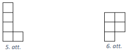
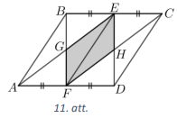
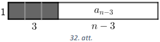

# <lo-sample/> LV.AMO.2018.5.1.

Artūrs no marinētu gurķīšu burkas ir apēdis $\frac{1}{3}$ no visiem gurķīšiem. 
Rezultātā burkā šķidruma līmenis samazinājās par $\frac{1}{5}$ no sākotnējā 
līmeņa. Cik reizes, salīdzinot ar jauno līmeni, samazināsies šķidruma līmenis 
burkā, ja Artūrs apēdīs visus atlikušos gurķīšus? (Artūrs ēda tikai gurķus, 
šķidrumu nē.)

<small>

* questionType:
* domain:

</small>

## Atrisinājums

Tā kā, apēdot $\frac{1}{3}$ no visiem gurķīšiem, šķidruma līmenis burkā 
samazinājās par $\frac{1}{5}$ (burkā palika $\frac{4}{5}$ šķidruma), tad, 
apēdot visus gurķīšus jeb $\frac{3}{3}$ gurķīšu, šķidruma līmenis burkā 
samazināsies par $3 \cdot \frac{1}{5}=\frac{3}{5}$, tas ir, burkā paliks 
$1-\frac{3}{5}=\frac{2}{5}$ šķidruma, kas ir divas reizes mazāk nekā pēc pirmās
gurķīšu ēšanas.

# <lo-sample/> LV.AMO.2018.5.2.

Raimonds veidoja virkni, visu laiku pēc kārtas rakstot skaitļa $2018$ ciparus:

$$2,\ 0,\ 1,\ 8,\ 2,\ 0,\ 1,\ 8,\ 2,\ 0,\ 1,\ 8,\ \ldots$$

Laine veidoja virkni pēc likuma: virknes pirmais loceklis $20$, bet katru 
nākamo iegūst, no iepriekšējā locekļa ciparu summas atņemot $1$ un rezultātu 
reizinot ar $8$.

Kāds ir $999.$ loceklis Raimonda virknē un kāds - Laines virknē?

<small>

* questionType:
* domain:

</small>

## Atrisinājums

Pamatosim, ka Raimonda virknē $999.$ loceklis ir skaitlis $1$. Tā kā skaitļu 
secība virknē atkārtojas ik pēc $4$ skaitļiem un $999=4 \cdot 249+3$, tad 
$999.$ loceklis ir tāds pats kā $3.$ loceklis, tas ir, $1$.

Pamatosim, ka Laines virknes $999.$ loceklis ir skaitlis $56$. Aprēķinām dažus 
nākamos virknes locekļus:

- virknes $2.$ loceklis ir $8$, jo $2+0-1=1$ un $1 \cdot 8=8$;  
- virknes $3.$ loceklis ir $56$, jo $8-1=7$ un $7 \cdot 8=56$;  
- virknes $4.$ loceklis ir $80$, jo $5+6-1=10$ un $10 \cdot 8=80$;  
- virknes $5.$ loceklis ir $56$, jo $8+0-1=7$ un $7 \cdot 8=56$.  

Līdz ar to virknes sākums ir 
$20;\ 8;\ \underline{\mathbf {56};\ 80}; \underline{\mathbf {56};\ 80}; \ldots$
Tā kā katrs nākamais virknes loceklis ir atkarīgs tikai no viena iepriekšējā, 
tad, līdzko parādās kāds šajā virknē jau iepriekš bijis skaitlis, izveidojas 
periods. Redzam, ka, sākot ar trešo locekli, virkne ir periodiska: pāra vietās 
visi locekļi ir $80$, bet nepāra - $56$. Tā kā $999$ ir pāra skaitlis, tad šajā
vietā virknē ir skaitlis $56$.

# <lo-sample/> LV.AMO.2018.5.3.

Vai kvadrātā ar izmēriem $8 \times 8$ rūtiņas var iekrāsot $12$ rūtiņas tā, lai
katrā taisnstūrī ar izmēriem $2 \times 3$ rūtiņas (tas var būt arī pagriezts 
vertikāli) būtu vismaz viena iekrāsota rūtiņa?

<small>

* questionType:
* domain:

</small>

## Atrisinājums

Jā, var, piemēram, skat. 1.att.

# <lo-sample/> LV.AMO.2018.5.4.

Naturālu pāra skaitli sauksim par raibu, ja tam vienlaikus ir spēkā šādas 
īpašības:

1) tajā neviens cipars nav nulle,
2) tam nav divu vienādu ciparu,
3) nekur blakus neatrodas divi pāra un divi nepāra cipari.

Vai ir iespējams, ka

**a)** saskaitot divus piecciparu raibus skaitļus, arī summa būs piecciparu 
raibs skaitlis;

**b)** saskaitot divus sešciparu raibus skaitļus, arī summa būs sešciparu raibs
skaitlis?

<small>

* questionType:
* domain:

</small>

## Atrisinājums

**a)** Jā, ir iespējams, piemēram, $23856+21836=45692$.

**b)** Pamatosim, ka prasītais nav iespējams. Ja tas būtu iespējams, tad divu 
raibo skaitļu summu varētu pierakstīt šādi ($p$ - pāra cipars; $n$ - nepāra 
cipars):

Lai iegūtu, ka iekrāsotajās vietās ir nepāra cipars, iepriekšējā šķirā, 
saskaitot divus pāra ciparus ($p+p$), ir jārodas pārnesumam. Tas nozīmē, ka 
ciparu $2$ nevar izmantot, jo tad vai nu neveidosies pārnesums 
$(2+2;\ 2+4;\ 2+6)$ vai arī, saskaitot divus pāra ciparus, summā iegūtu 
$10\ (2+8)$, taču cipars $0$ nevar tikt izmantots. Tātad abos saskaitāmajos kā 
pāra cipari būs izmantoti tikai pāra cipari $4,\ 6$ un $8$. Apskatām ciparu $4$
pirmajā skaitlī un ievērojam, ka vienīgā iespēja ir tam pieskaitīt $8$ (jo 
$4+4$ neveidojas pārnesums; $4+6$ pēdējais cipars ir $0$). Tas nozīmē, ka nav 
iespējams atrast atbilstošu ciparu, ko likt pārī ar ciparu $6$, jo cipars $8$ 
jau ir pārī ar $4$, bet ciparu $6$ nedrīkst izmantot, jo summā cipars $2$ jau 
ir izmantots no $4+8$. Tātad saskaitot divus sešciparu raibus skaitļus, summā 
nav iespējams iegūt sešciparu raibu skaitli.

# <lo-sample/> LV.AMO.2018.5.5.

Miķelis ir izgudrojis spēli, kurā nepieciešama spēļu nauda - miķelīši. No
$1,\ 2,\ 3,\ 5,\ 10$ un $15$ miķelīšu naudaszīmēm Miķelis grib izvēlēties četru
veidu naudaszīmes tā, lai jebkuru summu no $1$ līdz $30$ miķelīšiem varētu 
izveidot, izmantojot ne vairāk kā četras banknotes. Atrodi vienu šādu četru 
naudaszīmju komplektu!

<small>

* questionType:
* domain:

</small>

## Atrisinājums

Miķelim jāizvēlas naudaszīmes $1,\ 3,\ 10$ un $15$. Jebkuru summu līdz $15$, 
izņemot $8\ (8=1+1+3+3)$, var iegūt ar trīs banknotēm, tāpēc, katrai no šīm 
summām pieskaitot $15$, ar četrām banknotēm var iegūt jebkuru summu no $16$ 
līdz $30$ , izņemot $23\ (23=3+10+10)$:

$1=1$  
$2=1+1$  
$3=3$  
$4=1+3$  
$5=1+1+3$  
$6=3+3$  
$7=1+3+3$  
$\mathbf{8}=\mathbf{1}+\mathbf{1}+\mathbf{3}+\mathbf{3}$  
$9=3+3+3$  
$10=10$  
$11=1+10$  
$12=1+1+10$  
$13=3+10$  
$14=1+3+10$  
$15=15$  
$16=1+15$  
$17=(1+1)+15$  
$18=3+15$  
$19=(1+3)+15$  
$20=(1+1+3)+15$  
$21=(3+3)+15$  
$22=(1+3+3)+15$  
$\mathbf{23}=\mathbf{3}+\mathbf{10}+\mathbf{10}$  
$24=(3+3+3)+15$  
$25=10+15$  
$26=(1+10)+15$  
$27=(1+1+10)+15$  
$28=(3+10)+15$  
$29=(1+3+10)+15$  
$30=15+15$  

$\textit {Piezīme.}$ Ar naudaszīmēm $1,\ 3,\ 10$ un $15$ var izveidot jebkuru 
summu no $1$ līdz $36$. Nākamie labākie komplekti ir $1,\ 2,\ 5,\ 10$ un 
$1,\ 2,\ 5,\ 15$, bet ar tiem var izveidot summas no $1$ līdz $27$.

# <lo-sample/> LV.AMO.2018.6.1.

Sarkanā kvadrāta laukums ir $80 \%$ no zilā kvadrāta laukuma, bet zilā kvadrāta
laukums ir $125 \%$ no zaļā kvadrāta laukuma. Kura kvadrāta mala ir visīsākā? 
Aprēķināt zaļā kvadrāta malas garumu, ja sarkanā kvadrāta laukums ir 
$25~\mathrm{cm^{2}}$.

<small>

* questionType:
* domain:

</small>

## Atrisinājums

Zaļā kvadrāta laukumu apzīmējam ar $x$. Tad zilā kvadrāta laukums ir $125 \%$ 
no $x$ jeb $1,25x$. Sarkanā kvadrāta laukums ir $80 \%$ no $1,25x$ jeb 
$0,8 \cdot 1,25x=1 \cdot x=x$. Tātad zaļā un sarkanā kvadrāta laukums ir 
vienāds un vienādi ir to malu garumi (abiem šiem kvadrātiem ir visīsākā mala). 
Tā kā sarkanā kvadrāta laukums ir $25~\mathrm{cm^{2}}$, tad gan sarkanā, gan 
zaļā kvadrāta malas garums ir $5~\mathrm{cm}$, jo $5^{2}=25$.

# <lo-sample/> LV.AMO.2018.6.2.

Vilnis veidoja virkni, visu laiku pēc kārtas rakstot skaitļa $29042018$ ciparus:

$$2; 9; 0; 4; 2; 0; 1; 8; 2; 9; 0; 4; 2; 0; 1; 8; 2; 9; 0; 4; 2; 0; 1; 8; \ldots $$

Armands veidoja virkni pēc likuma: virknes pirmais loceklis $20$, bet katru 
nākamo iegūst, iepriekšējā locekļa ciparu summai pieskaitot $1$ un rezultātu 
reizinot ar $8$.

Kāds ir $1000.$ loceklis Viļņa virknē un kāds - Armanda virknē?

<small>

* questionType:
* domain:

</small>

## Atrisinājums

Pamatosim, ka Viļņa virknē $1000.$ loceklis ir skaitlis $8$. Tā kā skaitļu 
secība virknē atkārtojas ik pēc $8$ skaitļiem un $1000=8 \cdot 125$, tad 
$1000$. loceklis ir tāds pats kā $8$. loceklis, tas ir, $8$.

Pamatosim, ka Armanda virknes $1000.$ loceklis ir skaitlis $96$. Aprēķinām 
dažus nākamos virknes locekļus:

- virknes $2.$ loceklis ir $24$, jo $2+0+1=3$ un $3 \cdot 8=24$;  
- virknes $3.$ loceklis ir $56$, jo $2+4+1=7$ un $7 \cdot 8=56$;  
- virknes $4.$ loceklis ir $96$, jo $5+6+1=12$ un $12 \cdot 8=96$;  
- virknes $5.$ loceklis ir $128$, jo $9+6+1=16$ un $16 \cdot 8=128$;  
- virknes $6.$ loceklis ir $96$, jo $1+2+8+1=12$ un $12 \cdot 8=96$.  

Līdz ar to virknes sākums ir 
$20;\ 24;\ 56;\ \underline{\mathbf {96};\ 128};\ \underline{\mathbf {96};\ 128};\ \ldots $
Tā kā katrs nākamais virknes loceklis ir atkarīgs tikai no viena iepriekšējā, 
tad, līdzko parādās kāds šajā virknē jau iepriekš bijis skaitlis, izveidojas 
periods. Redzam, ka, sākot ar ceturto locekli, virkne ir periodiska: pāra 
vietās visi locekļi ir $96$, bet nepāra - $128$. Tā kā $1000$ ir pāra skaitlis,
tad šajā vietā virknē ir skaitlis $96$.

# <lo-sample/> LV.AMO.2018.6.3.

Kvadrātā ar izmēriem $7 \times 7$ rūtiņas sākotnēji visas rūtiņas ir baltas. 
Kāds ir mazākais rūtiņu skaits, kas jāiekrāso melnas, lai no dotā kvadrāta 
nevarētu izgriezt $2 \times 3$ rūtiņu taisnstūri, kam visas rūtiņas ir baltas?

<small>

* questionType:
* domain:

</small>

## Atrisinājums

Jāiekrāso $8$ rūtiņas, skat., piemēram, 2.att. Nepietiek iekrāsot mazāk kā $8$ 
rūtiņas, jo kvadrātā $7 \times 7$ rūtiņas var izvietot astoņus taisnstūrus ar 
izmēriem $2 \times 3$ rūtiņas (skat. 3.att.).

# <lo-sample/> LV.AMO.2018.6.4.

Parādi vienu piemēru, kādus ciparus var ierakstīt burtu vietā, lai vienādība 
$\overline{AC} \cdot C=\overline{AB} \cdot \overline{AB}$ būtu patiesa! Vienādi
burti apzīmē vienādus ciparus, dažādi - dažādus, turklāt $A$ nav $0$.

<small>

* questionType:
* domain:

</small>

## Atrisinājums

Der $A=1;\ B=2;\ C=8$, tad iegūstam $18 \cdot 8=12 \cdot 12$ jeb $144=144$.

# <lo-sample/> LV.AMO.2018.6.5.

**a)** Laine sāka pierakstīt, cik veidos var iegūt katru summu no $2$ līdz 
$12$, metot divus parastus metamos kauliņus: summu $2$ var iegūt $1$ veidā 
$(2=1+1)$, summu $3$ var iegūt $2$ dažādos veidos $(3=1+2=2+1)$, summu $4$ var 
iegūt $3$ dažādos veidos $(4=1+3=2+2=3+1)$. Kādos un cik dažādos veidos var 
iegūt visas atlikušās summas no $5$ līdz $12$?

**b)** Gunārs no diviem kubiem ir izveidojis divus neparastus metamos kauliņus.
Vienam no tiem uz skaldnēm ir uzrakstīti skaitļi $1,\ 3,\ 4,\ 5,\ 6$ un $8$. 
Kādi seši skaitļi ir uzrakstīti uz otra neparastā metamā kauliņa skaldnēm, ja 
zināms, ka, metot šos neparastos kauliņus, katru summu no $2$ līdz $12$ var 
iegūt tieši tikpat dažādos veidos, kā metot divus parastus metamos kauliņus! 
(Parādi vienu piemēru! Uzrakstītie skaitļi var atkārtoties.)

<small>

* questionType:
* domain:

</small>

## Atrisinājums

**a)** Diviem parastiem metamajiem kauliņiem katrai iespējamajai summai 
atbilstošo veidu skaits ir šāds: 
$2-1,\ 3-2,\ 4-3,\ 5-4,\ 6-5,\ 7-6,\ 8-5,\ 9-4,\ 10-3,\ 11-2,\ 12-1$ (skat. 
tabulā).

|  | $\mathbf{1}$ | $\mathbf{2}$ | $\mathbf{3}$ | $\mathbf{4}$ | $\mathbf{5}$ | $\mathbf{6}$ |
| :---: | :---: | :---: | :---: | :---: | :---: | :---: |
| $\mathbf{1}$ | $2$ | $3$ | $4$ | $5$ | $6$ | $7$ |
| $\mathbf{2}$ | $3$ | $4$ | $5$ | $6$ | $7$ | $8$ |
| $\mathbf{3}$ | $4$ | $5$ | $6$ | $7$ | $8$ | $9$ |
| $\mathbf{4}$ | $5$ | $6$ | $7$ | $8$ | $9$ | $10$ |
| $\mathbf{5}$ | $6$ | $7$ | $8$ | $9$ | $10$ | $11$ |
| $\mathbf{6}$ | $7$ | $8$ | $9$ | $10$ | $11$ | $12$ |

**b)** Uz otra neparastā kauliņa skaldnēm jāuzraksta skaitļi 
$1,\ 2,\ 2,\ 3,\ 3$ un $4$. Visas iespējamās summas skat. tabulā.

|  | $\mathbf{1}$ | $\mathbf{3}$ | $\mathbf{4}$ | $\mathbf{5}$ | $\mathbf{6}$ | $\mathbf{8}$ |
| :---: | :---: | :---: | :---: | :---: | :---: | :---: |
| $\mathbf{1}$ | $2$ | $4$ | $5$ | $6$ | $7$ | $9$ |
| $\mathbf{2}$ | $3$ | $5$ | $6$ | $7$ | $8$ | $10$ |
| $\mathbf{2}$ | $3$ | $5$ | $6$ | $7$ | $8$ | $10$ |
| $\mathbf{3}$ | $4$ | $6$ | $7$ | $8$ | $9$ | $11$ |
| $\mathbf{3}$ | $4$ | $6$ | $7$ | $8$ | $9$ | $11$ |
| $\mathbf{4}$ | $5$ | $7$ | $8$ | $9$ | $10$ | $12$ |

$\textit {Piezīme.}$ Noskaidrot, kādi skaitļi uzrakstīti uz neparastā metamā 
kauliņa skaldnēm, var palīdzēt tālāk dotie spriedumi. Ja uz viena neparastā 
kauliņa skaldnēm uzrakstīti skaitļi $1,\ 3,\ 4,\ 5,\ 6$ un $8$, tad, lai summā 
būtu iespējams iegūt $2$, uz otra neparastā kauliņa skaldnes noteikti jābūt 
skaitlim $1$. Tātad pa reizei būs iespējams iegūt summu $2,\ 4,\ 5,\ 6,\ 7$ un 
$9$. Vairāk skaitlis $1$ uz šī kauliņa nevar būt, jo citādi summā $2$ varētu 
iegūt vairāk nekā vienā veidā. Lai summā varētu iegūt $3$, uz kauliņa skaldnes 
jābūt skaitlim $2$. Tā kā summā $3$ jāiegūst divos veidos, tad $2$ jābūt 
rakstītam uz vēl vienas skaldnes. Līdz ar to summā var iegūt $2-1$ reizi, 
$3-2,\ 4-1,\ 5-3,\ 6-3,\ 7-3,\ 8-2,\ 9-1$ un $10-2$. Lai papildus summā $4$ 
iegūtu vēl divas reizes, uz divām skaldnēm jābūt uzrakstītam skaitlim $3$. Līdz
ar to summā var iegūt 
$2-1,\ 3-2,\ 4-3,\ 5-3,\ 6-5,\ 7-5,\ 8-4,\ 9-3,\ 10-2,\ 11-2$. Uz pēdējās 
skaldnes uzrakstot skaitli $4$, iegūsim atlikušās trūkstošās summas.

# <lo-sample/> LV.AMO.2018.7.1.

Cik dažādus naturālus skaitļus, kam visi cipari ir dažādi, var izveidot no 
cipariem $2,\ 0,\ 1,\ 8$ ?

<small>

* questionType:
* domain:

</small>

## Atrisinājums

Ievērojam, ka meklētie var būt viencipara, divciparu, trīsciparu un četrciparu 
skaitļi un skaitļa pirmais cipars nedrīkst būt $0$. Saskaitām katra veida 
skaitļus:

- ir trīs derīgi viencipara skaitļi;
- ir $3 \cdot 3=9$ divciparu skaitļi, jo divciparu skaitļa pirmo ciparu var 
  izvēlēties $3$ veidos un arī otro ciparu var izvēlēties $3$ veidos;
- ir $3 \cdot 3 \cdot 2=18$ trīsciparu skaitļi, jo skaitļa pirmo ciparu pirmo 
  ciparu var izvēlēties $3$ veidos, otro ciparu $-3$ veidos un trešo ciparu 
  $-2$ veidos;
- ir $3 \cdot 3 \cdot 2 \cdot 1=18$ četrciparu skaitļi, jo skaitļa pirmo ciparu
  var izvēlēties $3$ veidos, otro ciparu $-3$ veidos, trešo ciparu $-2$ veidos 
  un pēdējo ciparu - tikai vienā veidā.

Tātad pavisam ir $3+9+18+18=48$ šādi skaitļi.

# <lo-sample/> LV.AMO.2018.7.2.

Skaitļu virkne tiek veidota pēc šāda likuma: ja $x$ ir virknes loceklis, tad 
nākamo virknes locekli aprēķina pēc formulas $\frac{1}{1-x}$. Virknes pirmais 
loceklis ir $4$. Aprēķini iegūtās virknes $2018.$ locekli un pirmo $2018$ 
locekļu summu!

<small>

* questionType:
* domain:

</small>

## Atrisinājums

Pamatosim, ka virknes $2018.$ loceklis ir skaitlis $\left(-\frac{1}{3}\right)$.
Aprēķinām dažus nākamos virknes locekļus:

- virknes $2.$ loceklis ir $-\frac{1}{3}$, jo $\frac{1}{1-4}=\frac{1}{-3}$;
- virknes $3.$ loceklis ir $\frac{3}{4}$, jo 
  $\frac{1}{1-\left(-\frac{1}{3}\right)}=\frac{1}{\frac{4}{3}}=\frac{3}{4}$;
- virknes $4.$ loceklis ir $4$, jo 
  $\frac{1}{1-\frac{3}{4}}=\frac{1}{\frac{1}{4}}=4$.

Līdz ar to virknes sākums ir 
$4; -\frac{1}{3}; \frac{3}{4}; 4;-\frac{1}{3}; \frac{3}{4}; \ldots$ Tā kā katrs
nākamais virknes loceklis ir atkarīgs tikai no viena iepriekšējā, tad, līdzko 
parādās kāds šajā virknē jau iepriekš bijis skaitlis, izveidojas periods. Tā kā
virknes pirmais un arī ceturtais loceklis skaitlis $4$, tad virkne ir 
periodiska ar periodu $\left(4; -\frac{1}{3}; \frac{3}{4}\right)$. Tā kā 
$2018=3 \cdot 672+2$, tad $2018.$ loceklis ir periodā otrais, tātad tas ir 
$\left(-\frac{1}{3}\right)$.

Periodā esošo skaitļu summa ir 
$4-\frac{1}{3}+\frac{3}{4}=\frac{48-4+9}{12}=\frac{53}{12}$. Tā kā pirmajos 
$2018$ virknes locekļus veido $672$ šādas pilnas grupas un vēl $2$ locekļi, tad
virknes pirmo $2018$ locekļu summa ir

$$\frac{53}{12} \cdot 672+4-\frac{1}{3}=53 \cdot 56+4-\frac{1}{3}=2971 \frac{2}{3}$$

# <lo-sample/> LV.AMO.2018.7.3.

Uz trijstūra $ABC$ malas $AB$ izvēlēts patvaļīgs iekšējs punkts $D$. Pierādīt, 
ka $CD>\frac{1}{2}(CA+CB-AB)$.

<small>

* questionType:
* domain:

</small>

## Atrisinājums

Izmantojot trijstūra nevienādību trijstūros $ADC$ un $BDC$ (skat. 4.att.), 
iegūstam

$$\begin{gathered}
(CD+AD)+(CD+BD)>CA+CB \\
2CD+AB>CA+CB \\
2CD>CA+CB-AB \\
CD>\frac{1}{2}(CA+CB-AB)
\end{gathered}$$

# <lo-sample/> LV.AMO.2018.7.4.

Atrast tādu veselu skaitli $n$, lai vienādība 
$(n-2021)(n-2018)(n-2017)(n-2016)=2016$ būtu patiesa!

<small>

* questionType:
* domain:

</small>

## Atrisinājums

Der $n=2025$, tad $4 \cdot 7 \cdot 8 \cdot 9=2016$.

$\textit {Piezīme.}$ Uzdevumu palīdz atrisināt, ja ievērojam, ka starpības 
starp blakus esošiem reizinātājiem attiecīgi ir $3,\ 1,\ 1$ un ka skaitļi 
$2016$ var izteikt kā $2016=4 \cdot 7 \cdot 8 \cdot 9$.

# <lo-sample/> LV.AMO.2018.7.5.

Lauriņa no taisnstūra ar izmēriem $7 \times 2018$ rūtiņas izgriež 5.att. dotās 
figūras, bet Pēcītis no tāda paša taisnstūra izgriež 6.att. dotās figūras. Kurš
no viņiem var izgriezt vairāk figūru? Figūras var būt pagrieztas vai apgrieztas
spoguļattēlā.

<small>

* questionType:
* domain:

</small>

## Atrisinājums

Abi var izgriezt vienādu skaitu figūru. Taisnstūris ar izmēriem $7 \times 2018$
rūtiņas satur $7 \cdot 2018=14126$ rūtiņas, tāpēc maksimālais figūru skaits, ko
varētu izgriezt, ir $2825$, jo $5 \cdot 2825+1=14126$. Parādīsim, ka gan 
Lauriņa, gan Pēcītis var sagriezt doto taisnstūri tā, ka pāri paliek $1$ 
rūtiņa. Ievērojam, ka taisnstūri ar izmēriem $2 \times 5$ rūtiņas var sagriezt 
gan Lauriņa, gan Pēcītis (skat. 7.att.).

Taisnstūri $7 \times 2018$ sadalām $201$ taisnstūrī $7 \times 10$ un vienā 
taisnstūrī $7 \times 8$. Katru taisnstūri $7 \times 10$ sadalām taisnstūros 
$2 \times 5$ tā, kā parādīts 8.att. Lauriņa taisnstūri $7 \times 8$ var 
sagriezt tā, kā parādīts 9.att., bet Pēcītis tā, kā parādīts 10.att. Tātad abi 
var izgriezt vienādu skaitu figūru.

# <lo-sample/> LV.AMO.2018.8.1.

Vienkāršot izteiksmi 
$\left(x^{2}-2 x+1\right)\left(x^{4}+1\right)^{2}\left(x^{2}+2x+1\right)\left(x^{4}+2x^{2}+1\right)$.

<small>

* questionType:
* domain:

</small>

## Atrisinājums

Izmantojot saīsinātās reizināšanas formulas $(a-b)(a+b)=a^{2}-b^{2}$ un 
$a^{2} \pm 2ab+b^{2}=(a \pm b)^{2}$, iegūstam

$\left(x^{2}-2x+1\right)\left(x^{4}+1\right)^{2}\left(x^{2}+2x+1\right)\left(x^{4}+2x^{2}+1\right)=(x-1)^{2}\left(x^{4}+1\right)^{2}(x+1)^{2}\left(x^{2}+1\right)^{2}=$  
$=((x-1)(x+1))^{2}\left(x^{2}+1\right)^{2}\left(x^{4}+1\right)^{2}=\left(x^{2}-1\right)^{2}\left(x^{2}+1\right)^{2}\left(x^{4}+1\right)^{2}=$  
$=\left(x^{4}-1\right)^{2}\left(x^{4}+1\right)^{2}=\left(x^{8}-1\right)^{2}$

# <lo-sample/> LV.AMO.2018.8.2.

Naturālu skaitļu virknes $1; 8; 8; 64; 192; 432; \ldots$ katrs loceklis, sākot 
ar trešo, ir vienāds ar divu iepriekšējo locekļu nenulles ciparu reizinājumu. 
Kāds ir šīs virknes $2018.$ loceklis?

<small>

* questionType:
* domain:

</small>

## Atrisinājums

Turpinot virkni tālāk, iegūsim, ka tā ir (ar pelēkiem cipariem norādīts katra 
virknes locekļa nenulles ciparu reizinājums):

Tā kā katrs nākamais virknes loceklis ir atkarīgs no diviem iepriekšējiem 
virknes locekļiem, tad, līdzko parādās divi jau iepriekš bijuši skaitļi, 
izveidojas periods. Tā kā virknes devītais un desmitais loceklis ir $5040$ un 
$4200$, un $19.$ un $20.$ loceklis arī ir $5040$ un $4200$, tad virkne, sākot 
ar $9.$ locekli, ir periodiska un perioda garums ir $10$. Tāpēc pēdējais 
pilnais periods beidzas pie $2018.$ virknes locekļa, jo $2018=8+10 \cdot 201$, 
un $2018.$ loceklis ir periodā pēdējais, tātad tas ir $5760$.

# <lo-sample/> LV.AMO.2018.8.3.

Paralelograma $ABCD$ malu $BC$ un $AD$ viduspunkti ir attiecīgi $E$ un $F$. 
Aprēķināt četrstūra laukumu, ko ierobežo taisnes $AE,\ ED,\ BF$ un $FC$, ja 
zināms, ka $ABCD$ laukums ir $100$.

<small>

* questionType:
* domain:

</small>

## Atrisinājums

Novelkam nogriezni $EF$, tas sadala doto paralelogramu $ABCD$ divos vienādos 
paralelogramos $ABEF$ un $FECD$, jo to pretējās malas ir paralēlas un vienādas.
Nogriežņu $BF$ un $AE$ krustpunktu apzīmējam ar $G$, bet $ED$ un $CF$ 
krustpunktu - ar $H$, tad jāaprēķina četrstūra $FGEH$ laukums (skat. 11.att.).

Paralelograma diagonāle sadala paralelogramu divos vienādos trijstūros, tāpēc 
$S_{BEF}=\frac{1}{2} S_{ABEF}=\frac{1}{2} \cdot \frac{1}{2} S_{ABCD}=\frac{1}{4} \cdot 100=25$.
Tā kā trijstūriem $BEG$ un $GEF$ ir kopīgs augstums no virsotnes $E$ un malas, 
pret kurām novilkts šis augstums ($BG$ un $GF$), ir vienādas, tad šie trijstūri
ir vienlieli, tas ir, to laukumi ir vienādi. Tātad 
$S_{GEF}=\frac{1}{2} S_{BEF}=\frac{1}{2} \cdot 25=12,5$. Līdzīgi iegūstam, ka 
$S_{FEH}=12,5$. Līdz ar to $S_{FGEH}=12,5 \cdot 2=25$.

# <lo-sample/> LV.AMO.2018.8.4.

Par maģisko kvadrātu sauc $n \times n$ rūtiņu tabulu, kuras rūtiņās ierakstīti 
skaitļi no $1$ līdz $n^{2}$ tā, ka visās tabulas rindās, kolonnās un uz abām 
galvenajām diagonālēm rūtiņās ierakstīto skaitļu summas ir vienādas. (Katrs no 
skaitļiem ierakstīts tieši vienā rūtiņā.) Vai noteikti maģiskā kvadrāta 
centrālajā rūtiņā ir ierakstīts skaitlis $\frac{n^{2}+1}{2}$, ja **a)** $n=3$, 
**b)** $n=5$?

<small>

* questionType:
* domain:

</small>

## Atrisinājums

**a)** Jā, var apgalvot. Apzīmējam tabulā ierakstītos skaitļus ar 
$a, b, c, d, e, f, g, h$ un $i$ (skat. 12.att.).

No tā, ka katrā rindā ierakstīto skaitļu summa ir viena un tā pati, var 
secināt, ka tā ir $\frac{1+2+3+4+5+6+7+8+9}{3}=15$. Tā kā arī katrā kolonnā un 
katrā diagonālē ierakstīto skaitļu summa ir $15$, tad iegūstam, ka 
$a+b+c=d+e+f=g+h+i=a+d+g=b+e+h=c+f+i=a+e+i=c+e+g=15$. Ievērojam (skat. 
13.att.), ka

$$\begin{gathered}
(a+e+i)+(c+e+g)+(b+e+h)-(a+b+c)-(g+h+i)=3e \\
15 \cdot 3-15 \cdot 2=3e \\
15=3e \\
e=5
\end{gathered}$$

Tātad esam pierādījuši, ka centrālajā rūtiņā vienmēr ir ierakstīts skaitlis 
$5$.

**b)** Nē, nevar apgalvot. Centrālajā rūtiņā būtu jābūt $13$, bet ir iespējams 
izveidot maģisko kvadrātu, kura centrālajā rūtiņā nav skaitlis $13$, bet gan ir
skaitlis $12$, skat., piemēram, 14.att., kur atbilstošā summa ir $65$.

# <lo-sample/> LV.AMO.2018.8.5.

**a)** Kāds ir mazākais rūtiņu skaits, kas jāiekrāso $6 \times 6$ rūtiņu 
kvadrātā, lai katrā šī kvadrāta $2 \times 3$ rūtiņu taisnstūrī (tas var būt arī
pagriezts vertikāli) būtu vismaz viena iekrāsota rūtiņa? **b)** Vai noteikti 
tad, kad ir iekrāsots mazākais rūtiņu skaits, visas četras stūra rūtiņas paliks
neiekrāsotas?

<small>

* questionType:
* domain:

</small>

## Atrisinājums

**a)** Mazākais rūtiņu skaits, kas jāiekrāso, ir 6, skat., piemēram, 15.att.

Pierādīsim, ka nepietiek iekrāsot mazāk rūtiņu. Sadalām kvadrātu sešos 
taisnstūros $2 \times 3$ (skat. 16.att.), katrā šādā taisnstūrī jābūt 
iekrāsotai vismaz vienai rūtiņai, tātad kopā jābūt iekrāsotām vismaz $6$ 
rūtiņām.

**b)** Pierādīsim, ka visas stūra rūtiņas paliks neiekrāsotas. Pieņemsim, ka 
kāda stūra rūtiņa ir iekrāsota, piemēram, labā stūra augšējā rūtiņa, tad ar 
" $o$ " atzīmējam tās rūtiņas, ko nedrīkst iekrāsot (lai pietiktu ar $6$ 
iekrāsotām rūtiņām, katrā 16.att. taisnstūrī $2 \times 3$ jāiekrāso tieši viena
rūtiņa un tā kā stūra rūtiņa jau ir iekrāsota, tad pārējās piecas rūtiņas 
iekrāsot nedrīkst), bet noteikti jāiekrāso tieši viena rūtiņa, kas atzīmēta ar 
" $a$ " un tieši viena - kas atzīmēta ar " $b$ " (skat. 17.att.). Kopā ir 
iekrāsotas jau $3$ rūtiņas. Atlikušo kvadrāta daļu var sadalīt četros 
taisnstūros $2 \times 3$ (skat. 18.att.), bet katrā šādā taisnstūrī ir 
jāiekrāso vismaz viena rūtiņa, tātad kopā būs jāiekrāso vismaz $7$ rūtiņas. Tā 
kā mazākais rūtiņu skaits, kas jāiekrāso, ir $6$, tad stūra rūtiņas paliek 
neiekrāsotas.

# <lo-sample/> LV.AMO.2018.9.1.

Dots vienādojums $(a-3)x^{2}+5x-2=0$. **a)** Kādām $a$ vērtībām vienādojumam ir
tieši viena sakne? **b)** Kādām $a$ vērtībām vienādojumam ir divas dažādas 
reālas saknes?

<small>

* questionType:
* domain:

</small>

## Atrisinājums

**a)** Ja $a=3$, tad iegūstam lineāru vienādojumu $5x-2=0$, kuram ir viens 
atrisinājums $x=0,4$. Ja $a \neq 3$, tad dotais vienādojums ir 
kvadrātvienādojums un tam ir viena sakne, ja diskriminants $D=0$. Aprēķinām 
diskriminantu $D=5^{2}-4(a-3)(-2)=25+8a-24=8a+1$. Pielīdzinot iegūto izteiksmi 
$0$, iegūstam $8a+1=0$ jeb $a=-\frac{1}{8}$.

Tātad dotajam vienādojumam ir viena sakne, ja $a=3$ vai $a=-\frac{1}{8}$.

**b)** Lai iegūtu divas dažādas reālas saknes, dotajam vienādojumam ir jābūt 
kvadrātvienādojumam un tā diskriminantam jābūt pozitīvam. Līdz ar to iegūstam 
nosacījumus:

$\left\{ \begin{array} {1} 
{a-3 \neq 0} \\
{8a+1 > 0}
\end{array} \right.$

jeb

$\left\{ \begin{array}{1}
a \neq 3 \\
a>-\frac{1}{8}
\end{array} \right.$

Tātad dotajam vienādojumam ir divas dažādas reālas saknes, ja 
$a \in\left(-\frac{1}{8}; 3\right) \cup(3;+\infty)$.

# <lo-sample/> LV.AMO.2018.9.2.

Cik dažādos veidos basketbolā var gūt $18$ punktus, izmantojot tikai $1$ punkta
un $3$ punktu metienus? Veidi, kas atšķiras tikai ar $1$ punkta un $3$ punktu 
metienu secību, tiek uzskatīti par dažādiem. Piemēram, $4$ punktus var iegūt 
trīs dažādos veidos: $4=1+1+1+1=1+3=3+1$.

<small>

* questionType:
* domain:

</small>

## Atrisinājums

Ar $a_{n}$ apzīmējam, cik dažādos veidos var gūt $n$ punktus, izdarot $1$ 
punkta un $3$ punktu metienus. Pamatosim, ka virknes $\left(a_{n}\right)$ katrs
loceklis, sākot ar ceturto, ir to divu virknes locekļu summa, kas atrodas vienu
un trīs pozīcijas pirms tā, tas ir, to var uzrakstīt ar rekurences formulu 
$a_{n}=a_{n-1}+a_{n-3}$, kur $n \geq 4$. lespējami divi dažādi gadījumi.

- Ja pēdējais ir $1$ punkta metiens, tad pārējo punktu summa (bez pēdējā 
  metiena) ir $(n-1)$, un šādu punktu summu var iegūt $a_{n-1}$ veidā.
- Ja pēdējais ir $3$ punktu metiens, tad pārējo punktu summa (bez pēdējā 
  metiena) ir $(n-3)$, un šādu punktu summu var iegūt $a_{n-3}$ veidos.

Tā kā katra punktu summa atšķiras no katras citas punktu summas ar pēdējo 
saskaitāmo, tad formula $a_{n}=a_{n-1}+a_{n-3}$ ir patiesa. Tagad, izmantojot 
iegūto rekurences formulu, aizpildām tabulu:

| $n$ | $a_{n}$ |
| --- | ------- |
| $1$ | $1$ |
| $2$ | $1$ |
| $3$ | $2$ |
| $4$ | $3$ |
| $5$ | $4$ |
| $6$ | $6$ |
| $7$ | $9$ |
| $8$ | $13$ |
| $9$ | $19$ |
| $10$ | $28$ |
| $11$ | $41$ |
| $12$ | $60$ |
| $13$ | $88$ |
| $14$ | $129$ |
| $15$ | $189$ |
| $16$ | $277$ |
| $17$ | $406$ |
| $18$ | $595$ |
| $\ldots$ | $\ldots$ |

Tātad $18$ punktus, izmantojot tikai $1$ punkta un $3$ punktu metienus, var 
iegūt $595$ veidos.

# <lo-sample/> LV.AMO.2018.9.3.

Ap vienādsānu trijstūri $ABC\ (AB=AC)$ apvilkta riņķa līnijia. Caur virsotni 
$B$ un loka $AB$ (kas nesatur $C$ ) iekšēju punktu $D$ novilkta taisne, uz 
kuras atzīmēts punkts $E$ tā, ka $AD=AE$. Pierādīt, ka trijstūri $ABC$ un $ADE$
ir līdzīgi!

<small>

* questionType:
* domain:

</small>

## Atrisinājums

Apzīmējam $\sphericalangle ACB=\sphericalangle CBA=\alpha$ (skat. 19.att.). Tā 
kā četrstūris $ACBD$ ir ievilkts riņķa līnijā, tad tā pretējo leņķu summa ir 
$180^{\circ}$, tātad 
$\sphericalangle ADB=180^{\circ}-\sphericalangle ACB=180^{\circ}-\alpha$. 
Izmantojot blakusleņķu īpašību, iegūstam 
$\sphericalangle ADE=180^{\circ}-\sphericalangle ADB=180^{\circ}-\left(180^{\circ}-\alpha\right)=\alpha$.
Tā kā $AD=AE$, tad $\sphericalangle ADE=\sphericalangle DEA=\alpha$. Līdz ar to
$\triangle ABC \sim \triangle AED$ pēc pazīmes $\ell \ell$.

# <lo-sample/> LV.AMO.2018.9.4.

Atrast lielāko naturālo skaitli, kas dalās ar $7$, kura ciparu summa ir $100$ 
un kuram neviens cipars nav $0$.

<small>

* questionType:
* domain:

</small>

## Atrisinājums

Pamatosim, ka lielākais skaitlis, kas apmierina uzdevuma nosacījumus, ir 
$112 \underbrace{1111 \ldots 111}_{96\ vieninieki}$.

Skaidrs, ka skaitlī nevar būt vairāk kā $100$ cipari, jo tad tā ciparu summa 
būtu lielāka nekā $100$ (neviens cipars nav $0$). Vienīgais $100$ ciparu 
skaitlis, kura ciparu summa ir $100$ un neviens cipars nav $0$, sastāv no $100$
vieniniekiem, bet tas nedalās ar $7$, jo $111111$ dalās ar $7$, bet $1111$ 
(tas, kas paliek pāri no $100$ vieniniekiem, atdalot $16$ grupas pa $111111$) 
nedalās.

Ja skaitlim ir $99$ cipari, no kuriem neviens nav $0$, un tā ciparu summa ir 
$100$, tad tas sastāv no $98$ vieniniekiem un viena divnieka. Šo divnieku nevar
rakstīt skaitļa pirmajā vai otrajā pozīcijā, jo ne $211$, ne $121$ nedalās ar 
$7$, bet to var rakstīt trešajā pozicijā, jo $112$ dalās ar $7$ un atlikušais 
skaitlis no $96$ vieniniekiem arī dalās ar $7$.

# <lo-sample/> LV.AMO.2018.9.5.

Kāds ir mazākais rūtiņu skaits, kas jāiekrāso taisnstūrī ar izmēriem 
$5 \times 8$ rūtiņas, lai katrā šī taisnstūra $2 \times 3$ rūtiņu taisnstūrī 
(tas var būt arī pagriezts vertikāli) būtu vismaz viena iekrāsota rūtiņa?

<small>

* questionType:
* domain:

</small>

## Atrisinājums

Mazākais rūtiņu skaits, kas jāiekrāso, ir $7$, skat., piemēram, 20.att.

Pierādīsim, ka ar $6$ iekrāsotām rūtiņām nepietiek. Sadalām taisnstūri tā, kā 
parādīts 21.att. Katrā taisnstūrī $2 \times 3$ jāiekrāso tieši viena rūtiņa 
(kopā tad būs iekrāsotas $6$ rūtiņas), bet kvadrātā $2 \times 2$ nedrīkst 
iekrāsot nevienu rūtiņu, tāpēc jāiekrāso viena no rūtiņām " $a$ " un viena no 
rūtiņām " $b$ ".

Sadalām doto taisnstūri tā, kā parādīts 22.att. Kvadrātā $3 \times 3$ jau ir 
iekrāsotas $2$ rūtiņas un katrā no pieciem taisnstūriem $2 \times 3$ jāiekrāso 
vismaz viena rūtiņa. Tātad iekrāsotas ir vismaz $7$ rūtiņas.

## Atrisinājums

Mazākais rūtiņu skaits, kas jāiekrāso, ir $7$, skat., piemēram, 20.att.

Pierādīsim, ka ar $6$ iekrāsotām rūtiņām nepietiek. Sadalām taisnstūri sešos 
taisnstūros $2 \times 3$ un vienā kvadrātā $2 \times 2$ (skat. 23.att.). Katrā 
taisnstūrī $2 \times 3$ jāiekrāso tieši viena rūtiņa (kopā tad būs iekrāsotas 
$6$ rūtiņas), bet kvadrātā $2 \times 2$ nedrīkst iekrāsot nevienu rūtiņu.

Sadalām doto taisnstūri sešos taisnstūros $2 \times 3$ un vienā taisnstūrī 
$1 \times 4$ (skat. 24.att.). Katrā taisnstūrī $2 \times 3$ jāiekrāso tieši 
viena rūtiņa (kopā tad būs iekrāsotas $6$ rūtiņas), bet taisnstūrī $1 \times 4$
nedrīkst iekrāsot nevienu rūtiņu (skat. 24.att., kur ar " $o$ " atzīmētas 
neiekrāsotās rūtiņas). Redzams, ka ir taisnstūris $2 \times 3$, kurā nav 
iekrāsota neviena rūtiņa. Tātad ar $6$ iekrāsotām rūtiņām nepietiek.

# <lo-sample/> LV.AMO.2018.10.1.

Pierādīt, ka trijstūra, kura malu garumi ir $\sqrt{40}, \sqrt{53}, \sqrt{145}$,
laukums ir naturāls skaitlis!

<small>

* questionType:
* domain:

</small>

## Atrisinājums

Ievērojam, ka $40=2^{2}+6^{2},\ 53=2^{2}+7^{2}$ un $145=8^{2}+9^{2}$. Līdz ar 
to doto trijstūri varam iezīmēt taisnstūrī ar izmēriem $8 \times 9$ (skat. 
25.att.). Tad dotā trijstūra laukums ir

$$S_{\Delta}=\frac{1}{2} \cdot 8 \cdot 9-\frac{1}{2} \cdot 2 \cdot 7-\frac{1}{2} \cdot 2 \cdot 6-2 \cdot 2=36-7-6-4=19$$

kas ir naturāls skaitlis.

## Atrisinājums

Izmantosim Hērona formulu $S_{\Delta}=\sqrt{p(p-a)(p-b)(p-c)}$. Aprēķinām 
trijstūra laukuma kvadrātu, tas ir, $S_{\Delta}^{2}$:

$\frac{\sqrt{40}+\sqrt{53}+\sqrt{145}}{2} \cdot\left(\frac{\sqrt{40}+\sqrt{53}+\sqrt{145}}{2}-\sqrt{40}\right)\left(\frac{\sqrt{40}+\sqrt{53}+\sqrt{145}}{2}-\sqrt{53}\right)\left(\frac{\sqrt{40}+\sqrt{53}+\sqrt{145}}{2}-\sqrt{145}\right)=$
$=\frac{1}{16}(\sqrt{40}+\sqrt{53}+\sqrt{145})(-\sqrt{40}+\sqrt{53}+\sqrt{145})(\sqrt{40}-\sqrt{53}+\sqrt{145})(\sqrt{40}+\sqrt{53}-\sqrt{145})=$
$=\frac{1}{16}\left(-(\sqrt{40})^{2}+(\sqrt{53}+\sqrt{145})^{2}\right)\left((\sqrt{40})^{2}-(\sqrt{53}-\sqrt{145})^{2}\right)=$
$=\frac{1}{16}(-40+53+145+2 \sqrt{53 \cdot 145})(40-53-145+2 \sqrt{53 \cdot 145})=$
$=\frac{1}{16}(2 \sqrt{53 \cdot 145}+158)(2 \sqrt{53 \cdot 145}-158)=\frac{1}{16}\left(4 \cdot 53 \cdot 145-158^{2}\right)=$
$=\frac{1}{16} \cdot 4\left(53 \cdot 145-79^{2}\right)=\frac{1}{4}(7685-6241)=\frac{1}{4} \cdot 1444=\left(\frac{1}{2} \cdot 38\right)^{2}=19^{2}$

Tātad dotā trijstūra laukums $19$, kas ir naturāls skaitlis.

## Atrisinājums

Apskatām trijstūri $ABC$ ar malu garumiem $AB=\sqrt{40},\ BC=\sqrt{53}$ un 
$AC=\sqrt{145}$. Novelkam augstumu $BD$ un apzīmējam $AD=x$ un 
$CD=\sqrt{145}-x$ (skat. 26.att.). Izmantojot Pitagora teorēmu, iegūstam

- $BD^{2}=AB^{2}-AD^{2}=40-x^{2}$ (no $\triangle ADB$);  
- $BD^{2}=BC^{2}-CD^{2}=53-(\sqrt{145}-x)^{2}=2x \sqrt{145}-x^{2}-92$ (no $\triangle BDC$). 

Līdz ar to iegūstam $40-x^{2}=2x \sqrt{145}-x^{2}-92$ jeb 
$x=\frac{66}{\sqrt{145}}$.

Aprēķinām 
$BD=\sqrt{40-\left(\frac{66}{\sqrt{145}}\right)^{2}}=\sqrt{\frac{40 \cdot 145-66^{2}}{145}}=\sqrt{\frac{4\left(1450-33^{2}\right)}{145}}=\sqrt{\frac{4 \cdot 361}{145}}=\frac{38}{\sqrt{145}}$.

Tātad 
$S_{ABC}=\frac{1}{2} AC \cdot BD=\frac{1}{2} \sqrt{145} \cdot \frac{38}{\sqrt{145}}=19$,
kas ir naturāls skaitlis.

# <lo-sample/> LV.AMO.2018.10.2.

Uz koordinātu ass koordinātu sākumpunktā sēž blusa. Ar vienu lēcienu tā var 
aizlēkt vai nu $1$, vai $2$, vai $5$ vienības pa labi. Cik dažādos veidos blusa
var nokļūt punktā, kura koordināta ir $15$? (Veidus uzskata par atšķirīgiem, ja
atšķiras izdarīto lēcienu secība.)

<small>

* questionType:
* domain:

</small>

## Atrisinājums

Ar $a_{n}$ apzīmējam, cik dažādos veidos blusa var aizlēkt uz punktu, kura 
koordināta ir $n$. lespējami trīs atšķirīgi gadījumi:

- uz punktu, kura koordināta ir $n$, ar vienu lēcienu var nokļūt no punkta, 
  kura koordināta ir $(n-1)$ un kurā var nokļūt $a_{n-1}$ veidos;
- uz punktu, kura koordināta ir $n$, ar vienu lēcienu var nokļūt no punkta, 
  kura koordināta ir $(n-2)$ un kurā var nokļūt $a_{n-2}$ veidos;
- uz punktu, kura koordināta ir $n$, ar vienu lēcienu var nokļūt no punkta, 
  kura koordināta ir $(n-5)$ un kurā var nokļūt $a_{n-5}$ veidos.

Tātad punktā, kura koordināta ir $n$, pavisam var nokļūt 
$a_{n}=a_{n-1}+a_{n-2}+a_{n-5}$ atšķirīgos veidos. Atrodam sākuma vērtības:

- $a_{1}=1$,
- $a_{2}=2 \quad (2=1+1)$
- $a_{3}=3 \quad (1+1+1=1+2=2+1)$
- $a_{4}=5 \quad (1+1+1+1=1+1+2=1+2+1=2+1+1=2+2)$
- $a_{5}=9 \quad (1+1+1+1+1=1+1+1+2=1+1+2+1=1+2+1+1=2+1+1+1=2+2+1=2+1+2=1+2+2=5)$

Izmantojot iegūto formulu un sākuma vērtības, aprēķinām $a_{15}$.

| $n$  | $a_{n}$ |
| ---- | ------- |
| $1$  | $1$     |
| $2$  | $2$     |
| $3$  | $3$     |
| $4$  | $5$     |
| $5$  | $9$     |
| $6$  | $15$    |
| $7$  | $26$    |
| $8$  | $44$    |
| $9$  | $75$    |
| $10$ | $128$   |
| $11$ | $218$   |
| $12$ | $372$   |
| $13$ | $634$   |
| $14$ | $1081$  |
| $15$ | $1843$  |

# <lo-sample/> LV.AMO.2018.10.3.

Dots trijstūris $ABC$. No virsotnes $C$ novilkti perpendikuli $CM$ un $CN$ 
attiecīgi pret leņķa $A$ un leņķa $B$ ārējo leņķu bisektrisēm. Pierādīt, ka 
$MN$ garums ir vienāds ar pusi no trijstūra $ABC$ perimetra!

<small>

* questionType:
* domain:

</small>

## Atrisinājums

Taišņu $CM$ un $CN$ krustpunktus ar taisni $AB$ apzīmējam attiecīgi ar $M_{1}$ 
un $N_{1}$ (skat. 27.att.). Nogrieznis $AM$ vienlaicīgi ir trijstūra $M_{1}AC$ 
augstums un bisektrise, tāpēc trijstūris $M_{1}AC$ ir vienādsānu 
$(M_{1}A=AC)$ un $AM$ ir arī mediāna, tas ir, $MM_{1}=MC$.

Līdzīgi spriežot par nogriezni $BN$, iegūstam, ka $BC=BN_{1}$ un $NN_{1}=CN$.

Tātad $MN$ ir trijstūra $M_{1}CN_{1}$ viduslīnija un tās garums ir

$$MN=\frac{1}{2} M_{1}N_{1}=\frac{1}{2}\left(M_{1}A+AB+BN_{1}\right)=\frac{1}{2}(AC+AB+BC)=\frac{1}{2} P(ABC)$$

# <lo-sample/> LV.AMO.2018.10.4.

Pierādīt, ja $x$ - naturāls skaitlis, tad $x^{8}-x^{2}$ dalās ar $252$.

<small>

* questionType:
* domain:

</small>

## Atrisinājums

Ievērojam, ka $252=4 \cdot 7 \cdot 9$ un visi reizinātāji ir savstarpēji 
pirmskaitļi. Tātad pietiek pierādīt, ka $x^{8}-x^{2}$ dalās ar $4,\ 7$ un $9$. 
Sadalām izteiksmi $x^{8}-x^{2}$ reizinātājos:

$x^{8}-x^{2}=x^{2}\left(x^{3}-1\right)\left(x^{3}+1\right)=x^{2}(x-1)(x+1)(x(x+1)+1)(x(x-1)+1)=$  
$=x^{2}(x-1)(x+1)\left(x^{2}+x+1\right)\left(x^{2}-x+1\right)$

Apskatām reizinātājus pēc moduļa $3$.
 
| $x \bmod 3$ | $(x-1) \bmod 3$ | $(x+1) \bmod 3$ | $x^{2} \bmod 3$ | $\left(x^{2}+x+1\right) \bmod 3$ | $\left(x^{2}-x+1\right) \bmod 3$ |
| :---: | :---: | :---: | :---: | :---: | :---: |
| $0$ | $2$ | $1$ | $0$ | $1$ | $1$ |
| $1$ | $0$ | $2$ | $1$ | $0$ | $1$ |
| $2$ | $1$ | $0$ | $1$ | $1$ | $0$ |

Katrā rindā divi no reizinātājiem dalās ar $3$, tātad reizinājums dalās ar $9$.

Ievērojot, ka $x^{8}-x^{2}=x^{2}\left(x^{3}-1\right)\left(x^{3}+1\right)$, 
apskatām reizinātājus pēc moduļa $7$.

| $x \bmod 7$ | $x^{2} \bmod 7$ | $x^{3} \bmod 7$ | $\left(x^{3}-1\right) \bmod 7$ | $\left(x^{3}+1\right) \bmod 7$ |
| :---: | :---: | :---: | :---: | :---: |
| $0$ | $0$ | $0$ | $6$ | $1$ |
| $1$ | $1$ | $1$ | $0$ | $2$ |
| $2$ | $4$ | $1$ | $0$ | $2$ |
| $3$ | $2$ | $6$ | $5$ | $0$ |
| $4$ | $2$ | $1$ | $0$ | $2$ |
| $5$ | $4$ | $6$ | $5$ | $0$ |
| $6$ | $1$ | $6$ | $5$ | $0$ |

Katrā rindā viens reizinātājs dalās ar $7$, tātad arī reizinājums dalās ar $7$.

Ja $x$ ir pāra skaitlis, tad $x^{2}$ dalās ar $4$. Ja $x$ ir nepāra skaitlis, 
tad $x-1$ un $x+1$ ir pāra skaitļi un tad ar $4$ dalās to reizinājums.

Līdz ar to esam pierādījuši, ka $x^{8}-x^{2}$ dalās ar $252$.

## Atrisinājums

Ievērojam, ka $252=4 \cdot 7 \cdot 9$ un visi reizinātāji ir savstarpēji 
pirmskaitļi. Tātad pietiek pierādīt, ka $x^{8}-x^{2}$ dalās ar $4,\ 7$ un $9$. 
Sadalām izteiksmi $x^{8}-x^{2}$ reizinātājos:

$x^{8}-x^{2}=x^{2}\left(x^{3}-1\right)\left(x^{3}+1\right)=x^{2}(x-1)(x+1)(x(x+1)+1)(x(x-1)+1)=$  
$=x^{2}(x-1)(x+1)\left(x^{2}+x+1\right)\left(x^{2}-x+1\right)$

Pierādīsim, ka (*) dalās ar $4$. Ja $x$ ir pāra skaitlis, tad $x^{2}$ dalās ar 
$4$. Ja $x$ ir nepāra skaitlis, tad $x-1$ un $x+1$ ir pāra skaitļi un tad ar 
$4$ dalās to reizinājums.

Pierādīsim, ka (*) dalās ar $9=3 \cdot 3$. Skaitlis, dalot to ar $3$, var dot 
trīs dažādus atlikumus: $0,\ 1,\ 2$. Apskatām visus šos gadījumus.

- Ja $x=3k,\ k \in \mathbb{Z}$, tad $x^{2}=9k^{2}$ un (*) dalās ar $9$.
- Ja $x=3k+1,\ k \in \mathbb{Z}$, tad $x-1=3k$ (dalās ar $3$) un 
  $x^{2}+x+1=9k^{2}+9k+3$ (dalās ar $3$), tātad (*) dalās ar $9$.
- Ja $x=3k+2,\ k \in \mathbb{Z}$, tad $x+1=3k+3$ (dalās ar $3$) un 
  $x^{2}-x+1=9k^{2}+9k+3$ (dalās ar $3$), tātad (*) dalās ar $9$.

Pierādīsim, ka (*) dalās ar $7$. Skaitlis, dalot to ar $7$, var dot septiņus 
dažādus atlikumus: $0,\ 1,\ 2,\ 3,\ 4,\ 5,\ 6$. Apskatām visus šos gadījumus.

- Ja $x=7k,\ k \in \mathbb{Z}$, tad (*) dalās ar $7$.
- Ja $x=7k+1$ vai $x=7k+2$, vai $x=7k+4,\ k \in \mathbb{Z}$, tad $x^{3}-1$ 
  dalās ar $7$ un tātad (*) dalās ar $7$.
- Ja $x=7k+3$ vai $x=7k+5$, vai $x=7k+6,\ k \in \mathbb{Z}$, tad $x^{3}+1$ 
  dalās ar $7$ un tātad (*) dalās ar $7$.

Līdz ar to esam pierādījuši, ka $x^{8}-x^{2}$ dalās ar $252$.

$\textit {Piezīme.}$ Dalāmību ar $7$ var pierādīt, arī izmantojot Mazo Fermā 
teorēmu: "Ja $p$ ir pirmskaitlis un $a$ nedalās ar $p$, tad $a^{p-1}-1$ dalās 
ar $p$." Pārveidojam doto izteiksmi formā 
$x^{8}-x^{2}=x^{2}\left(x^{6}-1\right)$. Ja $x$ dalās ar $7$, tad dotā 
izteiksme dalās ar $7$. Ja $x$ nedalās ar $7$, tad $\left(x^{6}-1\right)$ dalās
ar $7$ pēc Mazās Fermā teorēmas.

# <lo-sample/> LV.AMO.2018.10.5.

Miķelis ir izgudrojis spēli, kurā nepieciešama spēļu nauda - miķelīši. No 
$1,\ 2,\ 3,\ 5,\ 10,\ 20,\ 25$ un $50$ miķelīšu naudaszīmēm Miķelis grib 
izvēlēties četru veidu naudaszīmes tā, lai jebkuru summu no $1$ līdz $70$ 
miķelīšem varētu izveidot, izmantojot ne vairāk kā sešas banknotes. Atrast 
vienu šādu četru naudaszīmju komplektu!

<small>

* questionType:
* domain:

</small>

## Atrisinājums

Miķelim jāizvēlas naudaszīmes $1,\ 3,\ 10$ un $25$. Ievērojam, ka visas summas 
līdz $4$ var iegūt ar ne vairāk kā divām banknotēm un visas summas no $5$ līdz 
$9$ - ar ne vairāk kā četrām banknotēm (pie tam četras banknotes vajadzīgas 
tikai summai $8$). Tātad visas summas no $10$ līdz $19$ var iegūt ar ne vairāk 
kā piecām banknotēm kā $x+10$, kur $0 \leq x \leq 9$, pie tam piecas banknotes 
vajadzīgas tikai, lai iegūtu summu $18$. Visas summas no $20$ līdz $24$ var 
iegūt ar ne vairāk kā četrām banknotēm kā $x+10+10$, kur $0 \leq x \leq 4$.

$1=1$  
$2=1+1$  
$3=3$  
$4=1+3$  
$5=1+1+3$  
$6=3+3$  
$7=1+3+3$  
$8=1+1+3+3=3+3+3$  
$9=18=1+1+3+3+10$  
$10=10$  
$11=1+10$  
$12=1+1+10$  
$13=3+10$  
$14=1+3+10$  
$15=1+1+3+10$  
$16=3+3+10$  
$17=1+3+3+10$  
$18=1+1+3+3+10$  
$19=3+3+3+10$  
$20=10+10$  
$21=1+10+10$  
$22=1+1+10+10$  
$23=3+10+10$  
$24=1+3+10+10$  

Tad visas pārējās summas ar ne vairāk kā sešām banknotēm var iegūt kā $x+25$ 
vai $x+25+25$, kur $0 \leq x<24$, izņemot summu $68$, ko var iegūt kā 
$68=25+10+10+10+10+3$.

$\textit {Piezīme.}$ Ar naudaszīmēm $1,\ 3,\ 10$ un $25$ var izveidot jebkuru 
summu no $1$ līdz $91$. Nākamais labākais komplekts ir $1,\ 2,\ 10,\ 25$, bet 
ar to var izveidot summas no $1$ līdz $67$.

# <lo-sample/> LV.AMO.2018.11.1.

Pierādīt, ka visām naturālām $n$ vērtībām izpildās 
$1^{3}+2^{3}+3^{3}+\cdots+n^{3}=(1+2+3+\cdots+n)^{2}$.

<small>

* questionType:
* domain:

</small>

## Atrisinājums

Izmantojot aritmētiskās progresijas pirmo $n$ locekļu summas formulu, iegūstam,
ka $1+2+\cdots+n=\frac{(n+1)n}{2}$. Tātad pietiek pierādīt, ka visām naturālām 
$n$ vērtībām izpildās

$$1^{3}+2^{3}+3^{3}+\cdots+n^{3}=\frac{n^{2}(n+1)^{2}}{4}$$

Izmantosim matemātiskās indukcijas metodi.

$\textit {Indukcijas bāze.}$ Ja $n=1$, tad $1^{3}=\frac{1^{2} \cdot 2^{2}}{4}$ 
jeb $1=1$.

$\textit {Induktīvais pieņēmums.}$ Pieņemsim, ka vienādība izpildās, ja $n=k$, 
tas ir,

$$1^{3}+2^{3}+3^{3}+\cdots+k^{3}=\frac{k^{2}(k+1)^{2}}{4}$$

$\textit {Induktīvā pāreja.}$ Pierādīsim, ka vienādība ir spēkā arī tad, ja 
$n=k+1$, tas ir,

$$1^{3}+2^{3}+3^{3}+\cdots+(k+1)^{3}=\frac{(k+1)^{2}(k+2)^{2}}{4}$$

Pārveidojam vienādības kreisās puses izteiksmi:

$$\begin{gathered}
\underbrace{1^{3}+2^{3}+3^{3}+\cdots+k^{3}}_{\text {induktivais pienēmums }}+(k+1)^{3}= \\
=\frac{k^{2}(k+1)^{2}}{4}+(k+1)^{3}=\frac{(k+1)^{2}}{4}\left(k^{2}+4(k+1)\right)=\frac{(k+1)^{2}(k+2)^{2}}{4}
\end{gathered}$$

$\textit {Secinājums.}$ Tā kā vienādība ir patiesa, ja $n=1$, un no tā, ka 
vienādība ir spēkā, ja $n=k$, izriet, ka vienādība ir spēkā arī $n=k+1$, 
secinām, ka vienādība ir spēkā visām naturālām $n$ vērtībām.

# <lo-sample/> LV.AMO.2018.11.2.

Cik dažādus taisnstūrus ar izmēriem $1 \times 12$ var izveidot no 28.att. 
dotajām figūriņām? Taisnstūri, kas atšķiras ar figūriņu secību vai krāsu, ir 
dažādi, piemēram, 29.att. izveidoti četri dažādi taisnstūri ar izmēriem 
$1 \times 4$.

<small>

* questionType:
* domain:

</small>

## Atrisinājums

Ar $a_{n}$ apzīmējam dažādo taisnstūru ar izmēriem $1 \times n$ skaitu. 
Apskatām, kādā veidā var likt pirmo no dotajām figūriņām:

- ja pirmo liek figūriņu ar izmēriem $1 \times 1$ (skat. 30.att.), tad paliek 
  taisnstūris ar izmēriem $1 \times(n-1)$ un šādu taisnstūru skaits ir 
  $a_{n-1}$;

- ja pirmo liek balto figūriņu ar izmēriem $1 \times 3$ (skat. 31.att.), tad 
  paliek taisnstūris ar izmēriem $1 \times(n-3)$ un šādu taisnstūru skaits ir 
  $a_{n-3}$;

- ja pirmo liek melno figūriņu ar izmēriem $1 \times 3$ (skat. 32.att.), tad 
  paliek taisnstūris ar izmēriem $1 \times(n-3)$ un šādu taisnstūru skaits ir 
  $a_{n-3}$;

Līdz ar to iegūstam, ka $a_{n}=a_{n-1}+2a_{n-3}$. Izmantojot šo sakarību un 
sākuma vērtības $a_{1}=1,\ a_{2}=2$ un $a_{3}=3$, aprēķinām $a_{18}$.

| $n$ | $a_{n}$ |
| --- | ------- |
| $1$ | $1$ |
| $2$ | $1$ |
| $3$ | $3$ |
| $4$ | $5$ |
| $5$ | $7$ |
| $6$ | $13$ |
| $7$ | $23$ |
| $8$ | $37$ |
| $9$ | $63$ |
| $10$ | $109$ |
| $11$ | $183$ |
| $12$ | $309$ |

Tātad taisnstūri $1 \times 12$ var salikt $309$ dažādos veidos.

# <lo-sample/> LV.AMO.2018.11.3.

Riņķa līnija $\omega_{1}$ iekšēji pieskaras riņķa līnijai $\omega_{2}$ punktā 
$A$. No punkta $P$, kas atrodas uz $\omega_{2}$, novilktas hordas $PQ$ un $PR$,
kas pieskaras $\omega_{1}$ attiecīgi punktos $X$ un $Y$. Pierādīt, ka 
$\sphericalangle QAR=2 \sphericalangle XAY$.

<small>

* questionType:
* domain:

</small>

## Atrisinājums

Ar $O$ apzīmējam riņķa līnijas $\omega_{1}$ centru (skat. 33.att.). Apzīmējam 
$\sphericalangle XOY=2 \alpha$.

Tā kā $\sphericalangle OYP=\sphericalangle OXP=90^{\circ}$, tad 
$\sphericalangle XPY=360^{\circ}-180^{\circ}-\sphericalangle XOY=180^{\circ}-2 \alpha$.
Ievērojam, ka 
$\sphericalangle XAY=\frac{1}{2} \sphericalangle XOY=\frac{1}{2} \cdot 2 \alpha=\alpha$
kā ievilktais un centra leņķis, kas balstās uz viena un tā paša loka $XY$.

Tā kā četrstūris $AQPR$ ir ievilkts četrstūris, tad 
$\sphericalangle QAR=180^{\circ}-\sphericalangle QPR=180^{\circ}-\left(180^{\circ}-2 \alpha\right)=2 \alpha$.

Līdz ar to esam pierādījuši, ka $\sphericalangle QAR=2 \sphericalangle XAY$.

# <lo-sample/> LV.AMO.2018.11.4.

Vai eksistē tādi naturāli skaitļi $m$ un $n$, ka $m^{2}-n^{2}=2mn$ ?

<small>

* questionType:
* domain:

</small>

## Atrisinājums

Nē, neeksistē. Pārveidojam doto vienādību:

$$\begin{gathered}
m^{2}-2mn+n^{2}=2n^{2} \\
(m-n)^{2}=2n^{2}
\end{gathered}$$

Kreisās puses izteiksme ir naturāla skaitļa kvadrāts, bet labās puses izteiksme
nav naturāla skaitļa kvadrāts, tāpēc neeksistē tādi naturāli skaitļi $m$ un 
$n$, lai izpildītos dotā vienādība.

## Atrisinājums

Nē, neeksistē. Ja $m$ un $n$ ir dažādas paritātes skaitļi, tad vienādības 
$m^{2}-n^{2}=2mn$ kreisajā pusē ir nepāra skaitlis, bet labajā - pāra skaitlis.
Tātad $m$ un $n$ ir jābūt ar vienādu paritāti (tas ir, abi pāra skaitļi vai abi
nepāra skaitļi).

Ja $m$ un $n$ ir nepāra skaitļi, tad vienādības kreisajā pusē ir skaitlis, kas 
dalās ar $4$ (jo $m^{2}-n^{2}=(m-n)(n-m)$ un gan $m-n$, gan $m+n$ dalās ar 
$2$), bet labajā - skaitlis, kas dalās ar $2$, bet nedalās ar $4$. Tātad $m$ un
$n$ var būt tikai pāra skaitļi.

Apzīmējam $m=2 m_{1}$ un $n=2 n_{1}$, tad iegūstam

$$\left(2m_{1}\right)^{2}-\left(2n_{1}\right)^{2}=2 \cdot 2m_{1} \cdot 2n_{1} \quad \Rightarrow \quad 4m_{1}^{2}-4n_{1}^{2}=8m_{1}n_{1}$$

Izdalot abas puses ar $4$, iegūstam $m_{1}^{2}-n_{1}^{2}=2m_{1}n_{1}$ jeb esam 
ieguvuši sākotnējo vienādojumu ar divas reizes mazākām $m$ un $n$ vērtībām. 
Šādu vērtību samazināšanas procesu varam atkārtot, līdz iegūsim, ka kāds no 
skaitļiem nav pāra skaitlis. Bet tad atrisinājuma nav, tātad arī gadījumam ar 
abiem pāru skaitļiem atrisinājuma nav. Līdz ar to esam pierādījuši, ka 
neeksistē tādi naturāli skaitļi $m$ un $n$, lai izpildītos dotā vienādība.

$\textit {Piezīme.}$ 2. atrisinājumā tika izmantota bezgalīgā kritiena metode.

# <lo-sample/> LV.AMO.2018.11.5.

Vienādojuma $x^{3}-44x^{2}+623x-2860=0$ saknes ir trijstūra malu garumi. 
Aprēķināt šī trijstūra laukumu!

<small>

* questionType:
* domain:

</small>

## Atrisinājums

Pēc Hērona formulas $S_{\Delta}=\sqrt{p(p-a)(p-b)(p-c)}$, kur $a,\ b$ un $c$ ir
trijstūra malu garumi, bet $p$ - pusperimetrs. Doto vienādojumu var pārrakstīt 
formā $(x-a)(x-b)(x-c)=0$ (jo vienādojuma saknes ir trijstūra malu garumi). 
Koeficients pie $x^{2}$ ir visu sakņu summa ar pretēju zīmi. Tātad $a+b+c=44$ 
un $p=22$. levietojot $x$ vietā $p$ un aprēķinot $p^{3}-44p^{2}+623p-2860$ 
vērtību, iegūstam izteiksmes $(p-a)(p-b)(p-c)$ vērtību. Tātad trijstūra laukums
ir

$$S_{\Delta}=\sqrt{22\left(22^{3}-44 \cdot 22^{2}+623 \cdot 22-2860\right)}=22 \sqrt{22^{2}-2 \cdot 22^{2}+623-130}=22 \sqrt{9}=66$$

## Atrisinājums

Dotā trijstūra malu garumus apzīmējam ar $a,\ b$ un $c$. Tā kā $a,\ b$ un $c$ 
ir vienādojuma saknes, tad

$$\begin{gathered}
(x-a)(x-b)(x-c)=0 \\
x^{3}-(a+b+c)x^{2}+(ab+ac+bc)x-abc=0
\end{gathered}$$

Pielīdzinot koeficientus pie vienādām $x$ pakāpēm, iegūstam vienādojumu sistēmu

$$\left\{\begin{array}{c}
a+b+c=44 \\
ab+ac+bc=623 \\
abc=2860
\end{array}\right.$$

Ievērojot, ka $2860=2 \cdot 5 \cdot 11 \cdot 13$, varam uzminēt, ka $a,\ b,\ c$
vērtības ir $10,\ 11,\ 13$ un pārbaudīt, ka tās tiešām apmierina šo vienādojumu
sistēmu. Tā kā trešās pakāpes vienādojumam ir ne vairāk kā trīs saknes, tad 
trijstūra malu garumi ir $10,\ 11,\ 13$. Izmantojot Hērona formulu, aprēķinām 
trijstūra laukumu

$$S_{\Delta}=\sqrt{p(p-a)(p-b)(p-c)}=\sqrt{22 \cdot 12 \cdot 11 \cdot 9}=22 \cdot 3=66$$

# <lo-sample/> LV.AMO.2018.12.1.

Pierādīt, ka

$$\log _{81} 96=\frac{14-\log _{48} 54}{16 \log _{48} 54-4}$$

<small>

* questionType:
* domain:

</small>

## Atrisinājums

Ievērojam, ka $48=2^{4} \cdot 3,54=2 \cdot 3^{3},\ 81=3^{4}$ un 
$96=2^{5} \cdot 3$.

Izmantosim formulu pārejai uz citu bāzi 
$\log _{a} b=\frac{\log _{c} b}{\log _{c} a}$. Ņemam $c=3$ un apzīmējam 
$\log _{3} 2=x$. Tad

$$\log _{48} 54=\frac{\log _{3} 54}{\log _{3} 48}=\frac{\log _{3}\left(2 \cdot 3^{3}\right)}{\log _{3}\left(2^{4} \cdot 3\right)}=\frac{\log _{3} 2+3 \log _{3} 3}{4 \log _{3} 2+\log _{3} 3}=\frac{x+3}{4x+1}$$

Izsakot $x$, iegūstam $4x \log _{48} 54+\log _{48} 54=x+3$ jeb 
$x=\frac{3-\log _{48} 54}{4 \log _{48} 54-1}$.

Līdz ar to

$$\begin{aligned}
\log _{81} 96 & =\frac{\log _{3} 96}{\log _{3} 81}=\frac{\log _{3}\left(2^{5} \cdot 3\right)}{\log _{3}\left(3^{4}\right)}=\frac{5 \log _{3} 2+\log _{3} 3}{4 \log _{3} 3}=\frac{5x+1}{4}=\frac{1}{4}\left(5 \cdot \frac{3-\log _{48} 54}{4 \log _{48} 54-1}+1\right)= \\
& =\frac{1}{4}\left(\frac{15-5 \log _{48} 54+4 \log _{48} 54-1}{4 \log _{48} 54-1}\right)=\frac{14-\log _{48} 54}{16 \log _{48} 54-4}
\end{aligned}$$

# <lo-sample/> LV.AMO.2018.12.2.

Cik veidos rindā var iestādīt septiņus kokus - liepas, ozolus, priedes un 
egles - tā, lai nekur blakus neatrastos divi skuju koki? (Nav obligāti 
jāizmanto visas koku sugas. Veidi, kas atšķiras ar koku secību rindā, ir 
dažādi.)

<small>

* questionType:
* domain:

</small>

## Atrisinājums

Ar $k_{n}$ apzīmējam dažādo veidu skaitu, kā rindā iestādīt $n$ kokus 
atbilstoši uzdevuma nosacījumiem. Ja pirmais ir lapu koks ($2$ veidi), tad 
pārējos $n-1$ kokus var iestādīt $k_{n-1}$ veidos.

Ja pirmais ir skuju koks ($2$ veidi), tad otrajam jābūt lapu kokam ($2$ veidi),
bet pārējos $n-2$ kokus var iestādīt $k_{n-2}$ veidos.

Tātad $n$ kokus rindā, atbilstoši uzdevuma nosacījumiem, var iestādīt

$$k_{n}=2 \cdot k_{n-1}+2 \cdot 2 \cdot k_{n-2}=2k_{n-1}+4k_{n-2}$$

Veidos. Tā kā $k_{1}=4$ (liepa, ozols, priede, egle) un 
$k_{2}=2 \cdot 4+2 \cdot 2=12$ (tas ir, ja pirmais ir lapu koks ($2$ veidi), 
tad otrais var būt jebkurš no pārējiem četriem kokiem, ja pirmais ir skuju koks
($2$ veidi), tad otrais var būt jebkurš no pārējiem diviem lapu kokiem).

Tālāk, izmantojot iegūto formulu $k_{n}=2k_{n-1}+4k_{n-2}$, iegūstam, ka 
pavisam ir $4352$ dažādi veidi, kā rindā iestādīt septiņus kokus, kas apmierina
uzdevuma nosacījumus.

| $n$ | $1$ | $2$ | $3$ | $4$ | $5$ | $6$ | $7$ |
| :---: | :---: | :---: | :---: | :---: | :---: | :---: | :---: |
| $k_{n}$ | $4$ | $12$ | $40$ | $128$ | $416$ | $1344$ | $4352$ |

# <lo-sample/> LV.AMO.2018.12.3.

Kvadrāta $ABCD$ mala $AD$ pārlocīta tā, ka pēc pārlocīšanas punkts $D$ sakrīt 
ar kādu $BC$ iekšēju punktu $D^{\prime}$, bet punkts $A$ nonāk punktā 
$A^{\prime}$. Nogrieznis $A^{\prime}D^{\prime}$ krusto $AB$ punktā $E$ (skat. 
34.att.). Pierādīt, ka $A^{\prime}E$ garums ir vienāds ar trijstūrī 
$EBD^{\prime}$ ievilktās riņķa līnijas rādiusu!

<small>

* questionType:
* domain:

</small>

## Atrisinājums

Ievērojam, ka $\triangle FA^{\prime}E \sim \triangle D^{\prime}BE$ (skat. 
35.att.) pēc pazīmes $\ell \ell$, jo 
$\sphericalangle FA^{\prime}E=\sphericalangle D^{\prime}BE=90^{\circ}$ un 
$\sphericalangle FEA^{\prime}=\sphericalangle D^{\prime}EB$ kā krustleņķi. Šo 
trijstūru līdzības koeficients ir $k$, tad, apzīmējot 
$FA^{\prime}=y,\ A^{\prime}E=x$ un $FE=z$, iegūstam, ka 
$EB=kx,\ BD^{\prime}=ky$ un $ED^{\prime}=kz$. Tātad mums jāpierāda, ka $r=x$. 
Trijstūrī $EBD^{\prime}$ ievilktās riņķa līnijas rādiusa garums ir 
$r=\frac{EB+BD^{\prime}-ED^{\prime}}{2}=\frac{kx+ky-kz}{2}=\frac{k(x+y-z)}{2}$.

Ievērojam, ka simetrijas dēļ $AF=FA^{\prime}=y$ un $AB=A^{\prime}D^{\prime}$ 
(kā kvadrāta malas) jeb $y+z+kx=x+kz$. Izsakām $k=\frac{y+z-x}{z-x}$. Līdz ar 
to iegūstam, ka 
$r=\frac{k(x+y-z)}{2}=\frac{(y+z-x)(y-z+x)}{2(z-x)}=\frac{2xz+y^{2}-z^{2}-x^{2}}{2(z-x)}$.

Izmantojot Pitagora teorēmu trijstūrī $FA^{\prime}E$, iegūstam 
$y^{2}-z^{2}=-x^{2}$. Tātad

$$r=\frac{2xz-2x^{2}}{2(z-x)}=\frac{2x(z-x)}{2(z-x)}=x$$

# <lo-sample/> LV.AMO.2018.12.4.

Naturāls skaitlis $B$ ir iegūts no naturāla skaitļa $A$, samainot vietām tā 
ciparus. Zināms, ka $A+B=10^{45}$. Pierādīt, ka gan $A$, gan $B$ dalās ar $5$.

<small>

* questionType:
* domain:

</small>

## Atrisinājums

Apzīmējam $A=\overline{a_{45}a_{44} \ldots a_{2}a_{1}}$ un 
$B=\overline{b_{45}b_{44} \ldots b_{2}b_{1}}$.

Desmitnieka pakāpes visi cipari, izņemot pirmo, ir $0$. Apskatām abus 
iespējamos gadījumus: $a_{1}+b_{1}=0$ vai $a_{1}+b_{1}=10$

Ja $a_{1}+b_{1}=0$, tad $a_{1}=b_{1}=0$. Līdz ar to $A$ un $B$ dalās ar $5$.

Ja $a_{1}+b_{1}=10$, tad derīgie ciparu komplekti (neņemot vērā $a_{1}$ un 
$b_{1}$ secību) ir $(1; 9),\ (2; 8),\ (3; 7),\ (4 ; 6),\ (5 ; 5)$ un veidojas 
pārnesums. Tas nozīmē, ka 
$\overline{a_{45}a_{44} \ldots a_{2}}+\overline{b_{45}b_{44} \ldots b_{2}}=\underbrace{9999 \ldots 9}_{45}$

Līdz ar to katram $i(2 \leq i \leq 45) i$-tajā pozīcijā $a_{i}+b_{i}=9$, jo 
divu viencipara skaitļu summa nevar būt $19$. Katrā pozīcijā zinot vienu no 
skaitļiem, viennozīmīgi ir noteikts arī otrs. Tātad pa visām šīm pozīcijām kopā
sakrīt ciparu $0$ un $9$ skaits, $1$ un $8$ skaits, $2$ un $7$ skaits, $3$ un 
$6$ skaits, $4$ un $5$ skaits. Līdz ar to pa visām šīm pozīcijām kopā ir $45$ 
pāra un $45$ nepāra cipari, bet pēdējā pozīcijā abi cipari ir vai nu pāra, vai 
nepāra.

- Ja pēdējā pozīcijā abi ir nepāra cipari, tad visi pāra cipari, kas ietilpst 
  $A$ un $B$ pierakstā, atrodas pozīcijās no pirmās līdz priekšpēdējai. Tā kā 
  $A$ un $B$ ir veidoti no viena ciparu komplekta, tad pāra ciparu komplekts 
  skaitlī $A$ sakrīt ar pāra ciparu komplektu skaitlī $B$. Tā kā katrs pāra 
  cipars vienā skaitlī viennozīmīgi nosaka nepāra ciparu otrā skaitlī, tad abu 
  skaitļu pierakstā, bez pēdējā cipara, izmantoti arī vieni un tie paši nepāra 
  cipari. Lai viss ciparu komplekts abiem skaitļiem būtu vienāds, nepieciešams,
  lai $a_{1}=b_{1}$. Bet tas ir iespējams tikai tad, ja $a_{1}=b_{1}=5$. Tas 
  nozīmē, ka $A$ un $B$ dalās ar $5$.
- Ja pēdējā pozīcijā abi ir pāra cipari, tad izmantojot līdzīgus spriedumus, 
  iegūstam, ka $a_{1}=b_{1}$, bet tas nav iespējams, jo skaitli $10$ nav 
  iespējams iegūt kā divu vienādu pāra ciparu summu.

Tātad esam pierādījuši, ka gan $A$, gan $B$ dalās ar $5$.

# <lo-sample/> LV.AMO.2018.12.5.

Katras divas regulāra sešstūra virsotnes savieno vai nu ar sarkanu, vai zilu 
nogriezni. Aplūkosim visus trijstūrus, kuru virsotnes ir dotā sešstūra 
virsotnes. **a)** Pierādīt, ka starp tiem ir vismaz viens vienkrāsas 
trijstūris! **b)** Vai var gadīties, ka starp tiem ir tieši viens vienkrāsas 
trijstūris?

Trijstūri sauc par vienkrāsas, ja tam visas malas ir nokrāsotas vienā krāsā.

<small>

* questionType:
* domain:

</small>

## Atrisinājums

Regulārā sešstūra virsotnes apzīmējam ar $A, B, C, D, E, F$.

**a)** Pierādīsim, ka vienmēr būs vismaz viens vienkrāsas trijstūris. 
Pieņemsim, ka nav neviena vienkrāsas trijstūra. Aplūkojam patvaļīgu sešstūra 
virsotni $A$. Tā kā no tās iziet $5$ nogriežņi, tad vismaz trīs no tiem ir 
vienā krāsā (Dirihlē princips). Nezaudējot vispārīgumu, uzskatīsim, ka 
nogriežņi $\textcolor{red}{AB}, \textcolor{red}{AC}, \textcolor{red}{AD}$ ir 
sarkanā krasā. Tad $\textcolor{blue}{BC}$ un $\textcolor{blue}{CD}$ jābūt zilā 
krāsā un viens no trijstūriem $ABD$ vai $BCD$ ir vienkrāsas trijstūris (skat. 
36.att.). legūta pretruna ar pieņēmumu.

 
**b)** Nē, nevar. Pierādīsim, ka vienmēr būs vismaz divi vienkrāsas trijstūri. 
Pieņemsim, ka ir tikai viens vienkrāsas trijstūris. Nezaudējot vispārīgumu, 
varam uzskatīt, ka tas ir sarkans trijstūris $\textcolor{red}{ACE}$ (skat. 
37.att.). Vismaz viena no trijstūra $FBD$ malām $FB,\ BD$ vai $DF$ ir zilā 
krāsā, pretējā gadījumā uzreiz būtu divi vienkrāsas trijstūri. Nezaudējot 
vispārīgumu, varam uzskatīt, ka $FB$ ir zila. Viens no nogriežņiem $AF$ vai 
$AB$ ir sarkans, jo pretējā gadījumā būtu divi vienkrāsas trijstūri. Simetrijas
dēļ varam uzskatīt, ka $\textcolor{red}{AF}$ ir sarkans. Tad 
$\textcolor{blue}{FE}$ un $\textcolor{blue}{FC}$ ir zilā krāsā, bet 
$\textcolor{red}{BC}$ ir sarkanā krāsā. Tagad vai nu $FEB$, vai $BEC$ ir 
vienkrāsas trijstūris. legūta pretruna ar pieņēmumu.

