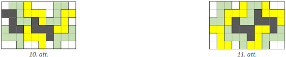

# <lo-sample/> LV.AMO.2019.5.1.

Doti trīs kvadrāti. Zilā kvadrāta malas garums ir $10~\mathrm{cm}$, sarkanā 
kvadrāta perimetrs ir par $80 \%$ lielāks nekā zilā kvadrāta perimetrs, bet 
zaļā kvadrāta laukums ir $4$ reizes mazāks nekā zilā kvadrāta laukums.

**a)** Par cik sarkanā kvadrāta laukums ir lielāks nekā zilā kvadrāta laukums?

**b)** Par cik procentiem zaļā kvadrāta perimetrs ir mazāks nekā zilā kvadrāta 
perimetrs?

<small>

* questionType:
* domain:

</small>

## Atrisinājums

Zilā kvadrāta perimetrs ir $4 \cdot 10=40$ centimetri, bet laukums 
$10 \cdot 10=100~\mathrm{cm}^{2}$.

**a)** Sarkanā kvadrāta perimetrs ir par $80 \%$ lielāks nekā zilā kvadrāta 
perimetrs, tas ir, $80 \%$ no $40=\frac{80}{100} \cdot 40=32$ centimetri. 
Tātad sarkanā kvadrāta perimetrs ir $40+32=72$ centimetri un tā malas garums ir
$72:4=18$ centimetri. Līdz ar to sarkanā kvadrāta laukums ir 
$18 \cdot 18=324~\mathrm{cm}^{2}$. Tātad sarkanā kvadrāta laukums ir par 
$324-100=224~\mathrm{cm}^{2}$ lielāks nekā zilā kvadrāta laukums.

**b)** Zaļā kvadrāta laukums ir $100:4=25~\mathrm{cm}^{2}$. Tāpēc tā malas 
garums ir $5~\mathrm{cm}$ un perimetrs ir $5 \cdot 4=20~\mathrm{cm}$. Tātad 
zaļā kvadrāta perimetrs ir par $40-20=20~\mathrm{cm}$ mazāks jeb par $50 \%$ 
mazāks nekā zilā kvadrāta perimetrs.

# <lo-sample/> LV.AMO.2019.5.2.

Uz galda ir divas vāzes ar tulpēm - vienā vāzē ir $46$ tulpes, bet otrā - $43$ 
tulpes. Divi spēlētāji pamīšus ņem no tām ārā tulpes. Vienā gājienā viens 
spēlētājs izvēlas kādu no šīm vāzēm un no tās izņem vai nu $1$ tulpi, vai arī 
$3$ tulpes. Zaudē tas spēlētājs, kuram vairs nav ko paņemt. Kurš spēlētājs - 
pirmais vai otrais - vienmēr var uzvarēt? 

<small>

* questionType:
* domain:

</small>

## Atrisinājums

Pamatosim, ka vienmēr var uzvarēt pirmais spēlētājs.

Savā pirmajā gājienā pirmajam spēlētājam no tās vāzes, kurā ir $46$ tulpes, 
jāizņem $3$ tulpes. Tad pēc pirmā spēlētāja pirmā gājiena tulpju skaits abās 
vāzēs ir vienāds. Katrā savā nākamajā gājienā pirmajam spēlētājam jāizņem 
tikpat daudz tulpju, cik tikko savā gājienā ir paņēmis otrais spēlētājs, tikai 
no otras vāzes, tas ir, tā, lai pēc viņa gājiena tulpju skaits vāzēs atkal būtu
vienāds. Ja otrais spēlētājs varēs izdarīt gājienu, tad arī pirmais spēlētājs 
to varēs izdarīt. Līdz ar to gājieni pietrūks otrajam spēlētājam un viņš 
zaudēs.

# <lo-sample/> LV.AMO.2019.5.3.

Vai var novietot plaknē $5$ taisnes tā, lai katras divas no tām krustotos un 
kopā būtu tieši $6$ krustpunkti?

<small>

* questionType:
* domain:

</small>

## Atrisinājums

Jā, var, skat., piemēram, 1.att.

# <lo-sample/> LV.AMO.2019.5.4.

Kāds mazākais skaits rūtiņu jāiekrāso kvadrātā $4 \times 4$, lai katrai no 
neiekrāsotajām rūtiņām būtu vismaz viena kopēja mala ar iekrāsoto rūtiņu? 
Pamato, ka tas ir mazākais iespējamais skaits!

<small>

* questionType:
* domain:

</small>

## Atrisinājums

Mazākais iespējamais iekrāsoto rūtiņu skaits ir $4$, skat, piemēram, 2.att.

Pamatosim, ka mazāk kā $4$ rūtiņas nav iespējams iekrāsot, lai izpildītos 
uzdevuma nosacījumi. Sadalām doto kvadrātu četros $2 \times 2$ rūtiņu 
kvadrātos, skat. 3.att. levērojam, ka vismaz vienai rūtiņai katrā no šiem 
četriem kvadrātiem noteikti ir jābūt iekrāsotai, pretējā gadījumā, ja nav 
iekrāsota neviena rūtiņa, tad stūra rūtiņai blakus visas rūtiņas ir 
neiekrāsotas. Tātad pavisam kopā jābūt iekrāsotām vismaz $4$ rūtiņām. Ar $4$ 
iekrāsotām rūtiņām pietiek, lai izpildītos uzdevuma nosacījumi (skat. 2.att.)

# <lo-sample/> LV.AMO.2019.5.5.

Atrodi visus tādus sešciparu skaitļus, kuriem visi seši cipari ir vienādi un 
kurus var izteikt kā sešu dažādu pirmskaitļu reizinājumu! Pamato, ka atrasti ir
visi tādi skaitļi un citu vairs nav!

<small>

* questionType:
* domain:

</small>

## Atrisinājums

Ir divi tādi skaitļi, kas atbilst uzdevuma prasībām: 
$222222=2 \cdot 3 \cdot 7 \cdot 11 \cdot 13 \cdot 37$ un 
$555555=3 \cdot 5 \cdot 7 \cdot 11 \cdot 13 \cdot 37$. Pamatosim, ka šie ir 
vienīgie skaitļi, kas atbilst uzdevuma prasībām.

Skaitļi, kas sastāv no sešiem vienādiem cipariem $a$, var izteikt kā 
$a \cdot 111111$. Sadalot šo skaitli reizinātājos, iegūstam 
$a \cdot 111111=a \cdot 3 \cdot 7 \cdot 11 \cdot 13 \cdot 37$. Šim skaitlim jau
ir $5$ dažādi pirmreizinātāji, tātad reizinātājam $a$ ir jābūt viencipara 
pirmskaitlim, kas atšķiras no pārējiem reizinātājiem. Vienīgie šādi skaitļi ir 
$2$ un $5$. Līdz ar to iegūstam divus derīgus sešciparu skaitļus: 
$222222=2 \cdot 3 \cdot 7 \cdot 11 \cdot 13 \cdot 37$ un 
$555555=3 \cdot 5 \cdot 7 \cdot 11 \cdot 13 \cdot 37$.

# <lo-sample/> LV.AMO.2019.6.1.

Uzraksti daļas augošā secībā! Pamato!

$$\frac{16}{17}; \frac{441}{439}; \frac{11}{12}; \frac{391}{389}; \frac{21}{23}$$

<small>

* questionType:
* domain:

</small>

## Atrisinājums

Izsakām dotās daļas kā decimāldaļas ar precizitāti līdz tūkstošdaļām vai 
desmittūkstošdalām: 
$\frac{16}{17} \approx 0,941; \frac{441}{439} \approx 1,0046; \frac{11}{12} \approx 0,917; \frac{391}{389} \approx 1,0051; \frac{21}{23} \approx 0,913$.

Tad $\frac{21}{23}<\frac{11}{12}<\frac{16}{17}<\frac{441}{439}<\frac{391}{389}$.

## Atrisinājums

Pamatosim, ka daļas, sakārtotas augošā secībā, ir

$$\frac{21}{23}<\frac{11}{12}<\frac{16}{17}<\frac{441}{439}<\frac{391}{389}$$

Ievērojam, ka daļas $\frac{21}{23}; \frac{11}{12}; \frac{16}{17}$ ir mazākas 
nekā $1$, bet daļas $\frac{391}{389}; \frac{442}{439}$ ir lielākas nekā $1$.

Noteiksim, par cik daļas $\frac{391}{389}; \frac{442}{439}$ ir lielākas nekā 
$1$, tas ir, $\frac{391}{389}-1=\frac{2}{389}; \frac{441}{439}-1=\frac{2}{439}$.
levērojam, ka $\frac{2}{439}<\frac{2}{389}$ Jo lielāks skaitlis tiek 
pieskaitīts pie skaitļa $1$, jo lielāka ir summa. Tātad 
$1+\frac{2}{439}<1+\frac{2}{389}$ jeb $\frac{441}{439}<\frac{391}{389}$

Noteiksim, par cik daļas $\frac{21}{23}; \frac{11}{12}; \frac{16}{17}$ ir 
mazākas nekā $1$, tas ir, 
$1-\frac{21}{23}=\frac{2}{23}; 1-\frac{11}{12}=\frac{1}{12}=\frac{2}{24}$; $1-\frac{16}{17}=\frac{1}{17}$.
levērojam, ka $\frac{1}{17}<\frac{1}{12}=\frac{2}{24}<\frac{2}{23}$. Jo lielāks
skaitlis tiek atņemts no skaitļa $1$, jo mazāku skaitli iegūstam. Tātad 
$1-\frac{2}{23}<1-\frac{1}{12}<1-\frac{1}{17}$ jeb 
$\frac{21}{23}<\frac{11}{12}<\frac{16}{17}$.

# <lo-sample/> LV.AMO.2019.6.2.

Riņķis sadalīts $16$ vienādās daļās (skat. 4.att.). Divi spēlētāji pamīšus tās 
aizkrāso. Vienā gājienā drīkst aizkrāsot vai nu vienu no šīm daļām, vai divas 
blakus esošas daļas. Spēlētājs, kurš nevar izdarīt gājienu, zaudē. Kurš 
spēlētājs - pirmais vai otrais - vienmēr var uzvarēt?

<small>

* questionType:
* domain:

</small>

## Atrisinājums

Pamatosim, ka vienmēr var uzvarēt otrais spēlētājs.

Otrajam spēlētājam savā pirmajā gājienā jāaizkrāso lauciņi tā, lai abās pusēs 
starp aizkrāsotajiem lauciņiem paliktu vienāds skaits neaizkrāsoto lauciņu, tas
ir, ja pirmais spēlētājs savā pirmajā gājienā aizkrāso vienu lauciņu, tad 
otrais spēlētājs arī aizkrāso vienu lauciņu (skat. 5.att.), bet, ja pirmais 
spēlētājs savā pirmajā gājienā aizkrāso divus lauciņus, tad otrais spēlētājs 
arī aizkrāso divus lauciņus (skat. 6.att.). Katrā savā nākamajā gājienā otrajam
spēlētājam jākrāso simetriski pirmā spēlētāja tikko izdarītajam gājienam 
attiecībā pret 5.att. vai 6.att. novilkto taisni (atkarībā no pirmā spēlētāja 
pirmā gājiena). Ja pirmais spēlētājs varēs izdarīt gājienu, tad arī otrais 
spēlētājs to varēs izdarīt. Līdz ar to gājieni pietrūks pirmajam spēlētājam un 
viņš zaudēs.

# <lo-sample/> LV.AMO.2019.6.3.

Cik lielu leņķi (šaurāko) veido pulksteņa stundu un minūšu rādītājs **a)** 
plkst. $14:00$; **b)** plkst. $13:40$?

<small>

* questionType:
* domain:

</small>

## Atrisinājums

**a)** levērojam, ka plkst. $15:00$ pulksteņa rādītāji veidotu $90^{\circ}$ 
lielu leņķi, tātad plkst. $14:00$ pulksteņa rādītāji veido $\frac{2}{3}$ no 
$90^{\circ}$ leņķa, tas ir, $\frac{2}{3} \cdot 90^{\circ}=60^{\circ}$ (skat. 
7.att.).

**b)** Plkst. $13:40$ minūšu rādītājs būs uz $8$, bet stundu rādītājs būs starp
$1$ un $2$ (skat. 7.att.). Leņķis starp $1$ un $2$ (skat. 8.att.) ir 
$360^{\circ}:12=30^{\circ}$ liels. Tātad $1$ stundas laikā stundu rādītājs 
pavirzītos par $30^{\circ}$. Tā kā $40$ minūtes ir $\frac{2}{3}$ no $1$ 
stundas, tad stundu rādītājs pavirzās par 
$\frac{2}{3} \cdot 30^{\circ}=20^{\circ}$. Šaurākais leņķis starp abiem 
pulksteņa rādītājiem ir $180^{\circ}-10^{\circ}=170^{\circ}$

# <lo-sample/> LV.AMO.2019.6.4.

Parādi, kā no taisnstūra ar izmēriem $6 \times 10$ rūtiņas var izgriezt **a)** 
$9$, **b)** $10$ figūras, kādas redzamas 9.att.! Figūras var būt pagrieztas vai
apgāztas otrādi.

<small>

* questionType:
* domain:

</small>

## Atrisinājums

**a)** Skat., piemēram, 10.att. **b)** Skat., piemēram, 11.att.

$Piezīme.$ b) daļas atrisinājums der arī a) daļai.

# <lo-sample/> LV.AMO.2019.6.5.

Vai skaitlis $1234\ldots9899$ (pēc kārtas bez atstarpēm uzrakstīti visi 
naturālie skaitļi no $1$ līdz $99$) dalās ar $9$?

<small>

* questionType:
* domain:

</small>

## Atrisinājums

Jā, dotais skaitlis dalās ar $9$.

Lai skaitlis dalītos ar $9$, tā ciparu summai jādalās ar $9$. Aprēķinām dotā 
skaitļa ciparu summu. Lai to vieglāk izdarītu, deviņiem viencipara skaitļiem 
sākumā pierakstām ciparu $0$ un dotā skaitļa sākumā pievienojam vēl divas 
nulles, kas nemaina dotā skaitļa ciparu summu. levērojam, ka skaitļu virknē 
$00, 01, \ldots, 98, 99$ ir izmantoti $200$ cipari. Katrs cipars $10$ reizes 
parādās kā desmitu cipars 
($\overline{x0}, \overline{x1}, \overline{x2}, \overline{x3}, \overline{x4}, \overline{x5}, \overline{x6}, \overline{x7}, \overline{x8}, \overline{x9}$)
un $10$ reizes - kā vienu cipars 
($\overline{0x}, \overline{1x}, \overline{2x}, \overline{3x}, \overline{4x}, \overline{5x}, \overline{6x}, \overline{7x}, \overline{8x}, \overline{9x}$)

Tātad visu ciparu summa $20 \cdot(0+1+2+3+4+5+6+7+8+9)=20 \cdot 45=900$ dalās 
ar $9$. Tātad arī dotais skaitlis dalās ar $9$.

# <lo-sample/> LV.AMO.2019.7.1.

Dotas divas funkcijas $f(x)=ax+b$ un $g(x)=cx+d$. Zināms, ka katrai $x$ 
vērtībai pastāv nevienādība $f(x)>g(x)$. Noskaidrot, vai $(a-c)$ var būt 
pozitīvs, negatīvs skaitlis vai nulle!

<small>

* questionType:
* domain:

</small>

## Atrisinājums

No dotā izriet, ka šo funkciju grafiki ir taisnes bez kopīgiem punktiem, tas 
ir, tās ir paralēlas taisnes. Šo taišņu virzienu koeficienti $a$ un $c$ ir 
vienādi, tātad $a-c=0$.

# <lo-sample/> LV.AMO.2019.7.2.

Riņķis sadalīts $15$ vienādās daļās (skat. 12.att.). Divi spēlētāji pamīšus tās
aizkrāso. Vienā gājienā drīkst aizkrāsot vai nu vienu no šīm daļām, vai divas 
blakus esošas daļas. Spēlētājs, kurš nevar izdarīt gājienu, zaudē. Kurš 
spēlētājs - pirmais vai otrais - vienmēr var uzvarēt?

<small>

* questionType:
* domain:

</small>

## Atrisinājums

Pamatosim, ka vienmēr var uzvarēt otrais spēlētājs.

Otrajam spēlētājam savā pirmajā gājienā jāaizkrāso lauciņi tā, lai abās pusēs 
starp aizkrāsotajiem lauciņiem paliktu vienāds skaits neaizkrāsoto lauciņu 
(skat. 13.att.), tas ir, ja pirmais spēlētājs savā pirmajā gājienā aizkrāso 
vienu lauciņu, tad otrais spēlētājs aizkrāso divus blakus esošus lauciņus un 
otrādi. Katrā savā nākamajā gājienā otrajam spēlētājam jākrāso simetriski pirmā
spēlētāja tikko izdarītajam gājienam attiecībā pret 14.att. novilkto taisni 
(vai arī simetriski attiecībā pret riņķa līnijas centru). Ja pirmais spēlētājs 
varēs izdarīt gājienu, tad arī otrais spēlētājs to varēs izdarī. Līdz ar to 
gājieni pietrūks pirmajam spēlētājam un viņš zaudēs.

# <lo-sample/> LV.AMO.2019.7.3.

Izliektā četrstūrī $ABCD$ leņķu $BAD$ un $ADC$ bisektrises krustojas punktā 
$M$. Pierādīt, ka $BM=CM$, ja zināms, ka $AD=AB+CD$.

$Piezīme.$ Četrstūri sauc par izliektu, ja visi tā iekšējie leņķi ir mazāki 
nekā $180^{\circ}$.

<small>

* questionType:
* domain:

</small>

## Atrisinājums

Uz malas $AD$ atliekam punktu $E$ tā, ka $AE=AB$ (skat. 15.att.). Tā kā pēc 
dotā $AD=AB+CD$, tad $ED=CD$. Tātad trijstūri $BAE$ un $CDE$ ir vienādsānu 
trijstūri un attiecīgi bisektrise $AM$ un $DM$, kas vilktas no virsotnes leņķa,
ir arī mediāna un augstums jeb attiecīgi nogriežņu $BE$ un $CE$ 
vidusperpendikuli. Ja punkts atrodas uz nogriežņa vidusperpendikula, tad tas 
atrodas vienādā attālumā no nogriežņa galapunktiem. Tātad $MB=ME$ un $ME=MC$ 
(jo $M$ atrodas uz nogriežņa vidusperpendikula), no kā izriet, ka $MB=MC$.

# <lo-sample/> LV.AMO.2019.7.4.

Andris apgalvo, ka sapnī bijis kādā Éģiptes piramīdā un kādā tās telpā redzējis
tādu piecstūri, kas salikts no diviem vienādiem piecstūriem, kuri sastāvējuši 
no vienādiem regulāriem trijstūriem. Uzzīmē šādu piecstūri!

<small>

* questionType:
* domain:

</small>

## Atrisinājums

Skat., piemēram, 16.att.

$Piezīme.$ Mazākais tāds piecstūris sastāv no sešiem trijstūriem un ir 
pazīstams ar nosaukumu heksamonds sfinksa.

# <lo-sample/> LV.AMO.2019.7.5.

Kādai mazākajai naturālai $n$ vērtībai skaitli $10^{n}$ iespējams izteikt kā 
septiņu naturālu skaitļu reizinājumu tā, lai to visu pēdējie cipari ir dažādi 
(tas ir, nevienam no tiem pēdējais cipars nesakrīt ar kāda cita skaitļa pēdējo
ciparu)?

<small>

* questionType:
* domain:

</small>

## Atrisinājums

Mazākā šāda $n$ vērtība $11$. Ja $n=11$, tad 
$10^{11}=1 \cdot 2 \cdot 4 \cdot 8 \cdot 10 \cdot 16 \cdot 5^{10}$. Pierādīsim,
ja $n<11$, tad $10^{n}$ šādā formā izteikt nevar.

levērojam, ka $10^{n}=2^{n} \cdot 5^{n}$. Tātad katru no septiņiem 
reizinātājiem var izteikt formā $2^{x} \cdot 5^{y}$, kur $x, y$ ir nenegatīvi 
veseli skaitļi. levērojam, ka neviena šādā formā izteikta reizinātāja pēdējais 
cipars nevar būt ne $3$, ne $7$, ne $9$ (ja skaitlis beidzas ar $3, 7$ vai $9$,
tad tas nedalās ne ar $2$, ne ar $5$ ). Tātad kā reizinātāju pēdējie cipari 
jāizmanto visi atlikušie septiņi cipari: $0, 1, 2, 4, 5, 6, 8$. Aplūkosim tos 
$5$ reizinātājus, kas beidzas ar $0, 2, 4, 6, 8$, apzīmēsim tos ar 
$a_{0}, a_{2}, a_{4}, a_{6}$, un $a_{8}$. levērojam, ka neviens no tiem, 
izņemot $a_{0}$, nedalās ar $5$, tātad tie visi (izņemot $a_{0}$ ) ir divnieka 
pakāpes.

Tā kā $a_{0}$ beidzas ar $0$, tad tas dalās ar $2$.

Tā kā $a_{2}$ beidzas ar $2$, tad tas dalās ar $2$.

Reizinātājs $a_{4}$ noteikti dalās ar $4$, jo mazākā divnieka pakāpe, kas 
beidzas ar $4$, ir $2^{2}=4$.

Reizinātājs $a_{6}$ noteikti dalās ar $16$, jo mazākā divnieka pakāpe, kas 
beidzas ar $6$, ir $2^{4}=16$.

Reizinātājs $a_{8}$ noteikti dalās ar $8$, jo mazākā divnieka pakāpe, kas 
beidzas ar $8$, ir $2^{3}=8$.

Tātad $a_{0} \cdot a_{2} \cdot a_{4} \cdot a_{6} \cdot a_{8}$ noteikti dalās ar
$2 \cdot 2 \cdot 4 \cdot 16 \cdot 8=2^{11}$.

Tā kā $10^{n}$ dalās ar 
$a_{0} \cdot a_{2} \cdot a_{4} \cdot a_{6} \cdot a_{8}$, tad arī $10^{n}$ dalās
ar $2^{11}$. Tātad $n$ nevar būt mazāks kā $11$.

# <lo-sample/> LV.AMO.2019.8.1.

Atjaunojot taisnu žogu, Raimonds izraka vecos žoga stabus, kuri atradās $8$ 
metru attālumā viens no otra un kuru skaits bija nepāra skaitlis. Raimonds 
sanesa visus stabus pie vidējā, nesdams tos pa vienam un sākdams ar vienu no 
malējiem stabiem. Cik bija stabu, ja viņš nostaigāja $840~\mathrm{m}?

<small>

* questionType:
* domain:

</small>

## Atrisinājums

Stabu skaitu apzīmējam ar $(2n+1)$, kur $n$ ir naturāls skaitlis. Tad Raimonda 
noieto ceļu (skat. 17.att.) varam aprakstīt kā 
$4 \cdot 8 \cdot 1+4 \cdot 8 \cdot 2+4 \cdot 8 \cdot 3+\cdots+4 \cdot 8 \cdot(n-1)+3 \cdot 8 \cdot n=840$.
Izdalot abas vienādojuma puses ar $8$ un vienkāršojot, iegūstam 
$4(1+2+3+\cdots+(n-1))+3n=105$. Izmantojot aritmētiskās progresijas locekļu 
summas formulu, iegūstam $4 \cdot \frac{1+n-1}{2}(n-1)+3n=105$ jeb 
$2n(n-1)+3n=105$. Atverot iekavas, iegūstam kvadrātvienādojumu 
$2n^{2}+n-105=0$. Diskriminants $D=1+4 \cdot 2 \cdot 105=841$. Līdz ar to 
$n_{1}=\frac{-1+29}{4}=7$ un $n_{2}=\frac{-1-29}{4}=-\frac{30}{4}$ (neder, jo 
$n$ ir naturāls skaitlis). Tātad stabu skaits ir $2n+1=2 \cdot 7+1=15$.

## Atrisinājums

Stabu skaitu apzīmējam ar $(2k+1)$, kur $k$ ir naturāls skaitlis, bet stabu 
attālumu līdz vidējam stabam - ar $a_{1}, a_{2}, \ldots, a_{k}$ (skat. 
18.att.). Tad Raimonda noieto ceļu varam aprakstīt, izmantojot aritmētiskās 
progresijas locekļu summu, tas ir, 
$840=4\left(a_{1}+a_{2}+\cdots+a_{k-1}\right)+3a_{k}$, turklāt no dotā izriet, 
ka $a_{1}=8~\mathrm{(m)}$ un $d=8~\mathrm{(m)}$. Pēdējo vienādojumu varam
pārrakstīt formā

$$\begin{gathered}
840=4 \frac{a_{1}+a_{k-1}}{2}(k-1)+3a_{k} \\
840=2\left(a_{1}+\left(a_{1}+d(k-2)\right)\right)(k-1)+3\left(a_{1}+d(k-1)\right) \\
840=2(16+8(k-2))(k-1)+3(8+8(k-1)) \\
840=2 \cdot 8k(k-1)+3 \cdot 8k \\
105=2k(k-1)+3k \\
2k^{2}+k-105=0
\end{gathered}$$

Iegūstam, ka diskriminants $D=1+4 \cdot 2 \cdot 105=841$. Līdz ar to 
$k_{1}=\frac{-1+29}{4}=7$ un $k_{2}=\frac{-1-29}{4}=-\frac{30}{4}$ (neder, jo 
$k$ ir naturāls skaitlis). Tātad stabu skaits ir $2k+1=2 \cdot 7+1=15$.

$Piezīme.$ Vienādojumu $k \cdot(2 k+1)=105$ var risināt arī neizmantojot 
kvadrātvienādojuma atrisināšanas metodes, bet apskatot visas dažādās iespējas, 
kādu divu naturālu skaitļu reizinājums var būt $105$.

# <lo-sample/> LV.AMO.2019.8.2.

Divi spēlētāji pamīšus izvieto kauliņus tabulas $6 \times 6$ rūtiņās. Vienā 
gājienā var aizpildīt vai nu vienu tukšu rūtiņu, vai vairākas tukšas rūtiņas, 
kuras atrodas vai nu vienā rindā, vai vienā kolonnā. Tas spēlētājs, kas nevar 
izdarīt gājienu, zaudē. Kurš spēlētājs - pirmais vai otrais - vienmēr var 
uzvarēt?

<small>

* questionType:
* domain:

</small>

## Atrisinājums

Pamatosim, ka vienmēr var uzvarēt otrais spēlētājs.

Otrajam spēlētājam katrā savā gājienā jāizdara pirmā spēlētāja gājienam 
simetrisks gājiens attiecībā pret kvadrāta centru (skat. 19.att., kur parādīts 
viens iespējams gājienu "pāris"). Ja pirmais spēlētājs varēs aizpildīt tukšās 
rūtiņas, tad arī otrais spēlētājs to varēs izdarīt. Līdz ar to gājieni pietrūks
pirmajam spēlētājam un viņs zaudēs.

# <lo-sample/> LV.AMO.2019.8.3.

Dots paralelograms $ABCD$. Leņķa $BAD$ bisektrise krusto malu $BC$ iekšējā 
punktā $E$ un $CD$ pagarinājumu punktā $F$. Pierādīt, ka $BC=DF$, ja zināms, ka
$DE$ ir perpendikulārs $AF$.

<small>

* questionType:
* domain:

</small>

## Atrisinājums

levērojam, ka

- $\sphericalangle BAE=\sphericalangle EAD=\alpha$ pēc bisektrises definīcijas;

- $\sphericalangle BAE=\sphericalangle AFD=\alpha$ kā iekšējie škērsleņķi pie 
  paralēlām taisnēm $AB$ un $CD$, ko krusto taisne $AF$

Tātad trijstūris $ADF$ ir vienādsānu trijstūris (skat. 20.att.), kuram $AD=DF$.
Tā kā $AD=BC$ kā paralelograma pretējās malas, tad esam ieguvuši, ka $BC=DF$.

$Piezīme.$ Tas, ka $DE$ ir perpendikulārs $AF$, risinājumā nav obligāti 
jāizmanto.

# <lo-sample/> LV.AMO.2019.8.4.

Mežā dzīvo $m$ rūķīši. Daži no tiem savā starpā draudzējas (ja $A$ draudzējas 
ar $B$, tad $B$ draudzējas ar $A$ ), pie tam katra rūķīša draugu skaits ir kāda
naturāla skaitļa kubs. Kādām $m$ vērtībām tas ir iespējams?

<small>

* questionType:
* domain:

</small>

## Atrisinājums

Pamatosim, ka prasītais ir iespējams, ja $m$ ir pāra skaitlis vai nepāra 
skaitlis, kas nav mazāks kā $9$. levērojam, ka pirmo divu naturālo skaitļu kubi
ir $1^{3}=1$ un $2^{3}=8$. Rūķīšus apzīmēsim ar punktiem; ja divi rūķīši 
draudzējas, tad tos savienosim ar nogriezni.

Ja $m$ ir pāra skaitlis, tad rūķīšus var sadalīt pāros tā, ka katrs rūķītis 
draudzējas tikai un vienīgi ar rūķīti no sava pāra (skat. 21.att.).

Ja $m$ ir nepāra skaitlis un $m \geq 9$, tad rūķīšus var sadalīt tā, kā 
parādīts 22.att., tas ir, vienam rūķītim ir $8$ draugi, bet pārējiem pa vienam 
draugam.

Pamatosim, ka neder tādi nepāra skaitļi $m$, ka $m \leq 7$.

Visiem rūķišiem nevar būt pa vienam draugam, jo tad kopā būtu nepāra skaits 
nogriežņu galu, bet tas nav iespējams, jo katram nogrieznim ir $2$ gali. Tātad 
kādam rūķītim būtu jābūt vismaz $8$ draugiem, bet arī tas nav iespējams, jo 
lielākais nogriežņu galu skaits, kas var iziet no kāda punkta, ir $6$ 
(gadījumā, ja $m=7$ ).

# <lo-sample/> LV.AMO.2019.8.5.

Kādai mazākajai naturālai $n$ vērtībai skaitli $10^{n}$ iespējams izteikt kā 
sešu naturālu skaitļu reizinājumu tā, ka neviens no tiem nav mazāks kā $10$ un 
to visu pēdējie cipari ir dažādi (tas ir, nevienam no tiem pēdējais cipars 
nesakrīt ar kāda cita skaitļa pēdējo ciparu)?

<small>

* questionType:
* domain:

</small>

## Atrisinājums

Mazākā šāda $n$ vērtība ir $23$. Ja $n=23$, tad 
$10^{23}=10 \cdot 32 \cdot 64 \cdot 16 \cdot 128 \cdot 5^{22}$. Pierādīsim, ja 
$n<23$, tad $10^{n}$ šādā formā izteikt nevar.

levērojam, ka $10^{n}=2^{n} \cdot 5^{n}$. Tātad katru no sešiem reizinātājiem 
var izteikt formā $2^{x} \cdot 5^{y}$, kur $x, y$ ir nenegatīvi veseli skaitļi.
levērojam, ka neviena šādā formā izteikta reizinātāja pēdējais cipars nevar būt
ne $1$, ne $3$, ne $7$, ne $9$ (ja skaitlis beidzas ar $1, 3, 7$ vai $9$, tad 
tas nedalās ne ar $2$, ne ar $5$). Tātad kā reizinātāju pēdējie cipari 
jāizmanto visi atlikušie seši cipari: $0, 2, 4, 5, 6, 8$. Aplūkosim tos $5$ 
reizinātājus, kas beidzas ar $0, 2, 4, 6, 8$, apzīmēsim tos ar 
$a_{0}, a_{2}, a_{4}, a_{6}$, un $a_{8}$. levērojam, ka neviens no tiem, 
izņemot $a_{0}$, nedalās ar $5$, tātad tie visi (izņemot $a_{0}$ ) ir divnieka 
pakāpes.

Tā kā $a_{0}$ beidzas ar $0$, tad tas dalās ar $2$.

Reizinātājs $a_{2}$ noteikti dalās ar $32$, jo mazākā divnieka pakāpe, kas 
beidzas ar $2$ un nav mazāka kā $10$, ir $2^{5}=32$. Reizinātājs $a_{4}$ 
noteikti dalās ar $64$, jo mazākā divnieka pakāpe, kas beidzas ar $4$ un nav 
mazāka kā $10$, ir $2^{6}=64$. Reizinātājs $a_{6}$ noteikti dalās ar $16$, jo 
mazākā divnieka pakāpe, kas beidzas ar $6$ nav mazāka kā $10$, ir $2^{4}=16$. 
Reizinātājs $a_{8}$ noteikti dalās ar $128$, jo mazākā divnieka pakāpe, kas 
beidzas ar $8$ un nav mazāka kā $10$, ir $2^{7}=128$.

Tātad $a_{0} \cdot a_{2} \cdot a_{4} \cdot a_{6} \cdot a_{8}$ noteikti dalās ar
$2 \cdot 32 \cdot 64 \cdot 16 \cdot 128=2^{23}$.

Tā kā $10^{n}$ dalās ar 
$a_{0} \cdot a_{2} \cdot a_{4} \cdot a_{6} \cdot a_{8}$, tad arī $10^{n}$ dalās
ar $2^{23}$. Tātad $n$ nevar būt mazāks kā $23$.

# <lo-sample/> LV.AMO.2019.9.1.

Plaknē novilktas $5$ vertikālas, $4$ horizontālas un $3$ savstarpēji paralēlas 
slīpas taisnes. Cik paralelogramu izveido šīs taisnes?

<small>

* questionType:
* domain:

</small>

## Atrisinājums

Tā kā paralelograma pretējās malas ir paralēlas, tad iespējami trīs gadījumi, 
kā var izvēlēties pretējās malas (skat. 23.att.).

1. Par pretējām malām varam izvēlēties divas no horizontālajām taisnēm (to var 
   izdarīt $4 \cdot 3:2=6$ veidos) un divas no vertikālajām taisnēm (to var 
   izdarīt $5 \cdot 4:2=10$ veidos). Līdz ar to šādu paralelogramu skaits ir 
   $6 \cdot 10=60$.  
2. Par pretējām malām varam izvēlēties divas no horizontālajām taisnēm (to var 
   izdarīt $4 \cdot 3:2=6$ veidos) un divas no slīpajām taisnēm (to var izdarīt
   $3 \cdot 2:2=3$ veidos). Līdz ar to šādu paralelogramu skaits ir 
   $6 \cdot 3=18$.  
3. Par pretējām malām varam izvēlēties divas no slīpajām taisnēm (to var 
   izdarīt $3 \cdot 2:2=3$ veidos) un divas no vertikālajām taisnēm (to var 
   izdarīt $5 \cdot 4:2=10$ veidos). Līdz ar to šādu paralelogramu skaits ir 
   $3 \cdot 10=30$. Tātad pavisam ir izveidoti $60+18+30=108$ paralelogrami.

# <lo-sample/> LV.AMO.2019.9.2.

Divi spēlētāji pamīšus aizkrāso tabulas $9 \times 9$ rūtiņas. Spēlētājs, kurš 
spēli sāk, krāso rūtiņas melnā krāsā, viņa pretinieks - zilā krāsā. Vienā 
gājienā drīkst aizkrāsot tieši vienu rūtiņu. Kad visas rūtiņas ir aizkrāsotas, 
tad saskaita, cik ir tādu rindu un kolonnu, kuros melno rūtiņu ir vairāk nekā 
zilo - tie ir punkti, kurus ieguvis pirmais spēlētājs. Rindu un kolonnu skaits,
kuros zilo rūtiņu ir vairāk nekā melno, ir otrā spēlētāja iegūtie punkti. Uzvar
tas spēlētājs, kurš ir ieguvis vairāk punktu. Kurš spēlētājs - pirmais vai 
otrais - vienmēr var uzvarēt?

<small>

* questionType:
* domain:

</small>

## Atrisinājums

Pamatosim, ka vienmēr var uzvarēt pirmais spēēētājs.

Pirmajā gājienā pirmajam spēlētājam jānokrāso melnā krāsā tā rūtiņa, kas 
atrodas kvadrāta centrā. Lai arī kur otrais spēlētājs nokrāsotu rūtiņu pirmajam
spēlētājam jānokrāso rūtiņa simetriski otrā spēlētāja tikko nokrāsotajai 
rūtiņai attiecībā pret kvadrāta centru. Tā pirmais spēlētājs turpina rīkoties 
arī visos savos nākamajos gājienos.

Melno rūtiņu noteikti būs vairāk nekā zilo rūtiņu centrālajā rindā un 
centrālajā kolonnā. Ja ir kāda rinda (vai kolonna), kurā ir vairāk zilo rūtiņu,
tad tai centrāli simetriskajā rindā (vai kolonnā) būs vairāk melno rūtiņu. 
Tātad vairāk punktus iegūs pirmais spēlētājs.

# <lo-sample/> LV.AMO.2019.9.3.

Dots vienādsānu taisnleņķa trijstūris $ABC$ ar taisno leņķi $C$. Uz tā 
hipotenūzas konstruēts taisnstūris $ABNM$ tā, ka punkti $C$ un $N$ atrodas 
dažādās pusēs no taisnes $AB$ un $AC=AM$. Nogrieznis $CM$ krusto $AB$ punktā 
$P$. Punkts $L$ ir malas $MN$ viduspunkts. Nogrieznis $CL$ krusto $PN$ punktā 
$Q$. Pierādīt, ka **a)** trijstūris $CBP$ ir vienādsānu; **b)** četrstūris 
$QNBC$ ir rombs!

<small>

* questionType:
* domain:

</small>

## Atrisinājums

**a)** Tā kā $AC=AM$, tad trijstūris $MAC$ ir vienādsānu un 
$\sphericalangle ACM=\sphericalangle AMC=\alpha$ (skat. 24.att.). No taisnleņķa
trijstūra $MAP$ iegūstam, ka $\sphericalangle APM=90^{\circ}-\alpha$. 
levērojam, ka $\sphericalangle CPB=\sphericalangle APM=90^{\circ}-\alpha$ kā 
krustleņķi un 
$\sphericalangle PCB=\sphericalangle ACB-\sphericalangle ACM=90^{\circ}-\alpha$.
Tā kā $\sphericalangle CPB=\sphericalangle PCB$, tad trijstūris $CBP$ ir 
vienādsānu.

**b)** Pierādīsim, ka četrstūra $QNBC$ pretējās malas ir pa pāriem paralēlas 
(skat. 25.att.).

Vienādsānu trijstūrī $ACB$ novelkam augstumu $CR$, kas ir arī mediāna un 
bisektrise. Tā kā $CR \perp AB$ un $AR=RB$, tad taisne $CR$ iet arī caur 
taisnstūra pretējās malas $MN$ viduspunktu $L$. Līdz ar to arī $Q$ pieder 
taisnei $CR$ un no tā, ka $CR \perp AB$ un $BN \perp AB$, izriet 
$CQ \parallel BN$.

Trijstūris $ACB$ ir vienādsānu taisnleņķa trijstūris, tāpēc 
$\sphericalangle CBA=45^{\circ}$.

No a) gadījumā pierādītā izriet, ka $PB=CB=BN$. Tātad trijstūris $PBN$ ir 
vienādsānu taisnleņķa trijstūris, tāpēc $\sphericalangle BNP=45^{\circ}$. Esam 
ieguvuši, ka 
$\sphericalangle CBN+\sphericalangle BNP=45^{\circ}+90^{\circ}+45^{\circ}=180^{\circ}$,
tātad $CB \parallel QN$, jo iekšējo vienpusleņķu summa ir $180^{\circ}$.

Tā kā $QNBC$ ir paralelograms (jo tā pretējās malas ir pa pāriem paralēlas) un 
$CB=BN$, tad $QNBC$ ir rombs.

# <lo-sample/> LV.AMO.2019.9.4.

Ja naturāla sešciparu skaitļa visus nepāra ciparus aizvietotu ar $7$, iegūtu 
skaitli, kas ir par $5998$ lielāks nekā sākotnējais skaitlis. Savukārt, ja 
sākotnējā skaitlī ar $7$ aizvietotu visus pāra ciparus, tad iegūtais skaitlis 
būtu par $500290$ lielāks nekā sākotnējais. Atrast doto sešciparu skaitli!

<small>

* questionType:
* domain:

</small>

## Atrisinājums

Apzīmējam doto skaitli ar $x$, skaitli, ko iegūst visus pāra ciparus aizstājot 
ar septītniekiem, apzīmējam ar $A$ un skaitli, ko iegūst visus nepāra ciparus 
aizstājot ar septītniekiem, apzīmējam ar $B$.

Pamatosim, ja diviem skaitļiem samaina vietām to vienas šķiras ciparus, tad šo 
skaitļu summa nemainās. Pieņemsim, ka vienam skaitlim $n$-tās šķiras cipars ir 
$a$, bet otram $b$, pieņemsim arī, ka $a>b$. Tad pirmajam skaitlim ciparu $a$ 
aizstājot ar $b$, šis skaitlis samazinās par $(a-b) \cdot 10^{n}$. Otrajam 
skaitlim ciparu $b$ aizstājot ar $a$ tas palielinās par $(a-b) \cdot 10^{n}$. 
Tātad abu skaitļu summa nemainās.

Aplūkojam summu $A+B$. Katrā šķirā (vienos, desmitos, simtos utt.) šiem diviem 
skaitļiem viens cipars ir "oriģinālais" (kas bija skaitlī $x$ ), bet otrs ir 
septītnieks. Samainīsim katrā šķirā šos ciparus tā, lai septītnieks atrastos 
otrajā skaitlī, bet "oriģinālais" cipars - pirmajā.

Tad pirmais skaitlis pārvēršas par $x$, bet otrais - par skaitli, kas sastāv no
sešiem septītniekiem. Tā kā šīs darbības rezultātā skaitļu summa nemainās, tad 
$A+B=x+777777$.

Pēc dotā $A=x+500290$, bet $B=x+5998$. Atrisinot vienādojumu

$$(x+500290)+(x+5998)=x+777777$$

iegūstam, ka $x=271489$.

Pārbaudām, ka skaitlis $271489$ apmierina uzdevuma nosacījumus:

- aizvietojot šī skaitļa nepāra ciparus ar $7$, iegūstam $277487=271489+5998$,  
- aizvietojot šī skaitļa pāra ciparus ar $7$, iegūstam $771779=271489+500290$.

# <lo-sample/> LV.AMO.2019.9.5.

Vai eksistē tāds kvadrātvienādojums ar veseliem koeficientiem, kuram ir sakne

$$(\sqrt{2020}-2 \sqrt{2019}+\sqrt{2018})(\sqrt{2020}+\sqrt{2019})(\sqrt{2019}+\sqrt{2018})(\sqrt{2020}+\sqrt{2018})?$$

<small>

* questionType:
* domain:

</small>

## Atrisinājums

Dotās izteiksmes pirmajās iekavās esošo izteiksmi izsakām kā

$$(\sqrt{2020}-2 \sqrt{2019}+\sqrt{2018})=(\sqrt{2020}-\sqrt{2019})-(\sqrt{2019}-\sqrt{2018})$$

Pakāpeniski aprēkinām dotās izteiksmes vērtību, iekavas sareizinot, izmantojot kvadrātu starpības formulu $a^{2}-b^{2}=(a+b)(a-b)$ un kopīgā reizinātāja iznešanu pirms iekavām:

$$\begin{aligned}
& \quad(\sqrt{2020}-2 \sqrt{2019}+\sqrt{2018})(\sqrt{2020}+\sqrt{2019})(\sqrt{2019}+\sqrt{2018})(\sqrt{2020}+\sqrt{2018})= \\
& =((\sqrt{2020}-\sqrt{2019})-(\sqrt{2019}-\sqrt{2018})) \\
& =(\sqrt{2020}-\sqrt{2019})(\sqrt{2020}+\sqrt{2019})(\sqrt{2019}+\sqrt{2018})(\sqrt{2020}+\sqrt{2018})- \\
& \quad-(\sqrt{2019}-\sqrt{2018})(\sqrt{2020}+\sqrt{2019})(\sqrt{2019}+\sqrt{2018})(\sqrt{2020}+\sqrt{2018})= \\
& =(\sqrt{2019}+\sqrt{2018})(\sqrt{2020}+\sqrt{2018})-(\sqrt{2020}+\sqrt{2019})(\sqrt{2020}+\sqrt{2018})= \\
& =(\sqrt{2020}+\sqrt{2018})(\sqrt{2018}-\sqrt{2020})=-2
\end{aligned}$$

Tātad jāatrod kvadrātvienādojums ar veseliem koeficientiem, kura sakne ir 
$x=2$. Der, piemēram, kvadrātvienādojums $x^{2}+3x+2=0$, kura saknes ir 
$x_{1}=-2$ un $x_{2}=-1$.

# <lo-sample/> LV.AMO.2019.10.1.

Pierādīt, ka visām naturālām $n$ vērtībām ir spēkā vienādība

$$6+24+60+\cdots+n(n+1)(n+2)=\frac{n(n+1)(n+2)(n+3)}{4}$$

<small>

* questionType:
* domain:

</small>

## Atrisinājums

Izmantosim matemātiskās indukcijas metodi.

$Indukcijas\ bāze.$ Ja $n=1$, tad 
$1 \cdot 2 \cdot 3=\frac{1 \cdot 2 \cdot 3 \cdot 4}{4}$ jeb $6=6$.

$Induktīvais\ pieņēmums.$ Pieņemsim, ka vienādība izpildās, ja $n=k$, tas ir,

$$6+24+60+\cdots+k(k+1)(k+2)=\frac{k(k+1)(k+2)(k+3)}{4}$$

$Induktīvā\ pāreja.$ Pierādīsim, ka vienādība ir spēkā arī tad, ja $n=k+1$, tas
ir,

$$6+24+60+\cdots+(k+1)(k+2)(k+3)=\frac{(k+1)(k+2)(k+3)(k+4)}{4}$$

Pārveidosim vienādības kreisās puses izteiksmi:

$$\begin{gathered}
\underbrace{6+24+60+\cdots+k(k+1)(k+2)}_{\text {induktīvais pieņēmums }}+(k+1)(k+2)(k+3)= \\
=\frac{k(k+1)(k+2)(k+3)}{4}+(k+1)(k+2)(k+3)=(k+1)(k+2)(k+3)\left(\frac{k}{4}+1\right)= \\
=\frac{(k+1)(k+2)(k+3)(k+4)}{4}
\end{gathered}$$

$Secinājums.$ Tā kā vienādība ir patiesa, ja $n=1$, un no tā, ka vienādība ir 
spēkā, ja $n=k$, izriet, ka vienādība ir spēkā arī $n=k+1$, secinām, ka 
vienādība ir spēkā visām naturālām $n$ vērtībām.

# <lo-sample/> LV.AMO.2019.10.2.

Dots taisnstūris $90 \times 19$ rūtiņas. Vienā gājienā spēlētājs var aizkrāsot 
$n \times n$ rūtiņu kvadrātu (piemēram, $1 \times 1$, $2 \times 2$ utt.), kura 
visas rūtiņas ir neaizkrāsotas. Zaudē tas, kurš nevar izdarīt gājienu. Kurš 
spēlētājs - pirmais vai otrais - vienmēr var uzvarēt?

<small>

* questionType:
* domain:

</small>

## Atrisinājums

Pamatosim, ka vienmēr var uzvarēt pirmais spēlētājs.

Savā pirmajā gājienā pirmajam spēlētājam jāaizkrāso kvadrātu $18 \times 18$, 
kuru šķērso taisnstūra simetrijas ass (skat. 26.att.). Otrais spēlētājs var 
aizkrāsot tikai tādu kvadrātu, kas pilnībā atrodas vienā pusē no taisnstūra 
vertikālās simetrijas ass. Lai kur arī otrais spēlētājs aizkrāsotu kvadrātu, 
pirmais spēlētājs varēs aizkrāsot tam simetrisku kvadrātu attiecībā pret 
taisnstūra vertikālo simetrijas asi un izdarīt pēdējo gājienu. Tā kā rūtiņu 
skaits ir galīgs, tad pirmais spēlētājs uzvarēs.

# <lo-sample/> LV.AMO.2019.10.3.

Dots taisnstūris $ABCD$, kur $AB < BC$. Uz malas $BC$ izvēlēts tāds punkts $E$, 
ka $AE=AD$. Leņķa $DAE$ bisektrise krusto malu $CD$ punktā $F$. Trijstūrī $ADE$
novilkts augstums $EG$. Pierādīt, ka $\sphericalangle AGC=\sphericalangle AFC$.

<small>

* questionType:
* domain:

</small>

## Atrisinājums

Apzīmējam $\sphericalangle EAF=\sphericalangle FAD=\alpha$ (skat. 27.att.). Tad
$\sphericalangle AFC=\sphericalangle FAD+\sphericalangle ADF=\alpha+90^{\circ}$
kā trijstūra $ADF$ ārējais leņķis. Trijstūris $EAD$ ir vienādsānu trijstūris, 
tāpēc 
$\sphericalangle ADE=\frac{1}{2}\left(180^{\circ}-2 \alpha\right)=90^{\circ}-\alpha$.
Tā kā $ECDG$ ir taisnstūris, tad 
$\sphericalangle ADE=\sphericalangle CGD=90^{\circ}-\alpha$. Līdz ar to 
$\sphericalangle AGC=180^{\circ}-\sphericalangle CGD=180^{\circ}-\left(90^{\circ}-\alpha\right)=90^{\circ}+\alpha$.
Tātad $\sphericalangle AGC=\sphericalangle AFC=90^{\circ}+\alpha$.

# <lo-sample/> LV.AMO.2019.10.4.

Kādām naturālām $n$ vērtībām izteiksme $n^{2}+n+19$ ir kāda naturāla skaitļa 
kvadrāts?

<small>

* questionType:
* domain:

</small>

## Atrisinājums

Atradīsim, kādām $n$ vērtībām izteiksmes $n^{2}+n+19$ vērtība atrodas starp 
divu blakusesošu naturālu skaitļu kvadrātiem, tas ir, starp $n^{2}$ un 
$(n+1)^{2}=n^{2}+2n+1$. levērojam, ka $n^{2} < n^{2}+n+19$ ir patiesa visiem 
naturāliem $n$ un nevienādība $n^{2}+n+19 < n^{2}+2n+1$ ir patiesa, ja $n > 18$. 
Tātad, ja $n > 18$, tad izteiksmes $n^{2}+n+19$ vērtība atrodas starp divu 
blakusesošu naturālu skaitļu kvadrātiem un tā nevar būt naturāla skaitļa 
kvadrāts.

Līdzīgi iegūstam, ja $5 < n < 18$, tad 
$(n+1)^{2}=n^{2}+2n+1 < n^{2}+n+19 < n^{2}+4n+4=(n+2)^{2}$. Tātad izteiksmes 
vērtība atrodas starp divu pēc kārtas esošu naturālu skaitļu kvadrātiem, līdz 
ar to nav naturāla skaitļa kvadrāts.

Apskatām atlikušās $n$ vērtības, tas ir, vērtības $1, 2, 3, 4, 5, 18$.

| $\boldsymbol{n}$ | $\boldsymbol{n}^{\mathbf{2}}+\boldsymbol{n}+\mathbf{19}$ |
| :---: | :---: |
| $\mathbf{1}$ | $21$ |
| $\mathbf{2}$ | $25=5^{2}$ |
| $\mathbf{3}$ | $31$ |
| $\mathbf{4}$ | $39$ |
| $\mathbf{5}$ | $49=7^{2}$ |
| $\mathbf{18}$ | $361=19^{2}$ |

Līdz ar to esam ieguvuši, ka izteiksme $n^{2}+n+19$ ir naturāla skaitļa 
kvadrāts, ja $n$ ir $2; 5$ vai $18$.

$Piezīme.$ Otrā novērtējuma vietā var arī pārbaudīt $n$ vērtības 
$1,2,3, \ldots, 18$.

# <lo-sample/> LV.AMO.2019.10.5.

No visiem karalienes dimantiem vissmagākais sver tieši $6$ reizes mazāk nekā 
visi pārējie kopā, trešais smagākais sver tieši $9$ reizes mazāk nekā visi 
pārējie kopā, bet visvieglākais sver tieši $11$ reizes mazāk nekā visi pārējie 
dimanti kopā. Cik dimantu ir karalienei?

<small>

* questionType:
* domain:

</small>

## Atrisinājums

Pieņemsim, ka karalienei ir $n$ dimanti, sakārtosim tos neaugošā secībā pēc to 
masas un apzīmēsim to masas attiecīgi ar $a_{1}, a_{2}, \ldots, a_{n}$, bet to 
kopējo masu ar $S$. Tad no šiem apzīmējumiem izriet, ka

- $a_{1} \geq a_{2} \geq \ldots \geq a_{n}$,  
- $a_{1}=\frac{s-a_{1}}{6}$ jeb $a_{1}=\frac{s}{7}$,  
- $a_{3}=\frac{s-a_{3}}{9}$ jeb $a_{3}=\frac{s}{10}$,  
- $a_{n}=\frac{s-a_{n}}{11}$ jeb $a_{n}=\frac{s}{12}$.  

Novērtēsim kopējo dimantu masu $S$ no augšas un no apakšas.

Izmantojot to, ka $a_{2} \leq a_{1}=\frac{S}{7}$ un 
$a_{n-1} \leq a_{n-2} \leq \ldots \leq a_{3}=\frac{s}{10}$, iegūstam

$$\begin{aligned}
S & =a_{1}+a_{2}+\left(a_{3}+\cdots+a_{n-1}\right)+a_{n} \\
& \leq a_{1}+a_{1}+\left(a_{3}+a_{3}+\cdots+a_{3}\right)+a_{n}= \\
& =2 \cdot \frac{S}{7}+(n-3) \cdot \frac{S}{10}+\frac{S}{12}
\end{aligned}$$

Izmantojot to, ka $a_{2} \geq a_{3}=\frac{s}{10}$ un 
$a_{4} \geq a_{5} \geq \ldots \geq a_{n}=\frac{S}{12}$ iegūstam, ka

$$\begin{aligned}
S & =a_{1}+a_{2}+a_{3}+\left(a_{4}+\cdots+a_{n-1}+a_{n}\right) \geq \\
& \geq a_{1}+a_{3}+a_{3}+\left(a_{n}+a_{n}+\cdots+a_{n}\right)= \\
& =\frac{S}{7}+2 \cdot \frac{S}{10}+(n-3) \cdot \frac{S}{12}
\end{aligned}$$

Dalot pirmo nevienādību ar $S$, iegūstam, ka

$$\begin{gathered}
\frac{2}{7}+\frac{n-3}{10}+\frac{1}{12} \geq 1 \\
n-3 \geq 10\left(1-\frac{2}{7}-\frac{1}{12}\right)=10-\frac{20}{7}-\frac{5}{6}=6 \frac{13}{42}
\end{gathered}$$

Dalot otro nevienādību ar $S$, iegūstam, ka

$$\begin{gathered}
\frac{1}{7}+\frac{2}{10}+\frac{n-3}{12} \leq 1 \\
n-3 \leq 12\left(1-\frac{1}{7}-\frac{1}{5}\right)=12-\frac{12}{7}-\frac{12}{5}=7 \frac{31}{35}
\end{gathered}$$

Apvienojot šīs nevienādības, iegūstam, ka

$$6 \frac{13}{42} \leq n-3 \leq 7 \frac{31}{35}$$

Tā kā $(n-3)$ jābūt naturālam skaitlim, tad vienīgā iespējamā $(n-3)$ vērtība 
ir $7$, tātad $n=10$. Tātad karalienei ir $10$ dimanti.

# <lo-sample/> LV.AMO.2019.11.1.

Atrisināt nevienādību

$$\frac{(x-20)^{19} \cdot(x+4)}{\left(\sqrt{x^{2}+4}\right)\left(9-x^{2}\right)} \geq 0$$

<small>

* questionType:
* domain:

</small>

## Atrisinājums

levērojam, ka reizinātājs $\sqrt{x^{2}+4}$ ir pozitīvs visām reālām $x$ 
vērtībām, tātad tas neietekmē kreisās puses izteiksmes zīmi. Izteiksmei 
$(x-20)^{19}$ ir tāda pati zīme kā izteiksmei $(x-20)$. Katru polinomu, kas 
ietilpst nevienādības kreisās puses izteiksmē, pielīdzinām $0$ un atrisinām 
iegūtos vienādojumus:

- $(x-20)^{19}=0$ jeb $x=20$  
- $x+4=0$ jeb $x=-4$  
- $9-x^{2}=0$ jeb $x= \pm 3$  

legūtās vērtības atliekam uz skaitļu ass, uzskicējam atbilstošo funkciju 
grafikus (skat. 28.att.) un nosakām dotās izteiksmes zīmi katrā intervālā. 
Tātad dotās nevienādības atrisinājums ir $x \in[-4 ;-3) \cup(3 ; 20]$.

# <lo-sample/> LV.AMO.2019.11.2.

Divi spēlētāji pamīšus raksta uz tāfeles skaitļa $216$ naturālos dalītājus. 
Katrā gājienā jāievēro šādi noteikumi:

- nedrīkst atkārtoti rakstīt jau uzrakstītu dalītāju;
- nedrīkst rakstīt dalītāju, kurš ir tieši $2$ vai $3$ reizes lielāks vai 
  mazāks nekā kāds jau uzrakstītais dalītājs.

Zaudē tas spēlētājs, kurš nevar izdarīt gājienu. Kurš spēlētājs - pirmais vai 
otrais - vienmēr var uzvarēt?

<small>

* questionType:
* domain:

</small>

## Atrisinājums

Pamatosim, ka vienmēr var uzvarēt otrais spēlētājs.

levērojam, ka $216=2^{3} \cdot 3^{3}$ un uzrakstām visus skaitļa $216$ 
dalītājus augošā secībā:

$$1, 2, 3, 4, 6, 8, 9, 12, 18, 24, 27, 36, 54, 72, 108, 216$$

Otrais spēlētājs visus dalītājus sadala pāros tā, ka katra pāra skaitļu 
reizinājums ir $216$:
$1$ un $216$  
$3$ un $72$  
$6$ un $36$  
$9$ un $24$  
$2$ un $108$  
$4$ un $54$  
$8$ un $27$  
$12$ un $18$  

Ja pirmais spēlētājs uzraksta kādu dalītāju $d$, tad otrais spēlētājs uzraksta 
dalītāju $\frac{216}{d}$ (otru attiecīgā pāra skaitli). levērojam, ka katra 
pāra skaitļu attiecība nav ne $2$, ne $3$. Pamatosim, ka otrais spēlētājs var 
uzrakstīt skaitli $\frac{216}{d}$, kas atbilst nosacījumiem. Pirmkārt, tā kā 
pirmais spēlētājs varēja uzrakstīt $d$, tad ne $2d$, ne $3d$, ne $\frac{d}{2}$,
ne $\frac{d}{3}$ (ja tie ir naturāli) līdz viņa gājienam nebija uzrakstīti. 
Tāpēc arī atbilstošie otri skaitļi katrā no šiem pāriem 
$\frac{216}{2d}=\frac{\frac{216}{d}}{2}, \frac{216}{3d}=\frac{\frac{216}{d}}{3}, \frac{216}{\frac{d}{2}}=2 \cdot \frac{216}{d}$
un $\frac{216}{\frac{d}{3}}=3 \cdot \frac{216}{d}$ līdz šim nebija uzrakstīti.

Tātad otrais spēlētājs varēs izdarīt gājienu, ja vien to varēs izdarīt pirmais 
spēlētājs. Tā kā skaitlim $216$ ir galīgs skaits dalītāju, tad gājieni pietrūks
pirmajam spēlētājam un viņš zaudēs.

# <lo-sample/> LV.AMO.2019.11.3.

Uz trijstūra $ABC$ malām $AB$ un $BC$ izvēlēti attiecīgi tādi punkti $D$ un 
$E$, ka $AC \parallel DE$. Nogriežņi $AE$ un $CD$ krustojas punktā $F$. Punkti 
$B, D, E$ un $F$ atrodas uz vienas riņķa līnijas. Taisne $BF$ krusto malu $AC$ 
punktā $H$ un trijstūrim $ABC$ apvilkto riņķa līniju punktā $G$. Pierādīt, ka 
$FH=GH$.

<small>

* questionType:
* domain:

</small>

## Atrisinājums

Tā kā četrstūri $BAGC$ un $BDFE$ ir ievilkti, tad 
$\sphericalangle GAC=\sphericalangle GBC$ un 
$\sphericalangle GBC=\sphericalangle FBE=\sphericalangle FDE$ kā ievilktie 
leņķi, kas balstās uz viena un tā paša loka attiecīgi $GC$ un $FE$ (skat. 
29.att.). Pēc dotā $AC \parallel DE$, tad 
$\sphericalangle FDE=\sphericalangle FCA$ kā iekšējie škērsleņķi pie paralēlām 
taisnēm. Līdz ar to $\sphericalangle GAC=\sphericalangle FCA$, no kā izriet, ka
$AG \parallel$ $FC$, jo iekšējie šķērsleņķi, ir vienādi.

Arī $\sphericalangle BAC=\sphericalangle BGC$ un 
$\sphericalangle BDE=\sphericalangle BFE$ kā ievilktie leņķi, kas balstās uz 
viena un tā paša loka attiecīgi $BC$ un $BE$. Pēc dotā $AC \parallel DE$, tad 
$\sphericalangle CAB=\sphericalangle EDB$ kā kāpšļu leņķi pie paralēlām 
taisnēm. levērojot, ka $\sphericalangle AFG=\sphericalangle BFE$ kā krustleņķi,
iegūstam $\sphericalangle GAC=\sphericalangle FCA$. Tātad $CG \parallel FA$, jo
iekšējie škērsleņķi, ir vienādi.

Tāpēc četrstūris $AFCG$ ir paralelograms, jo tā pretējās malas ir pa pāriem 
paralēlas. Paralelograma diagonāles krustpunktā dalās uz pusēm, tāpēc $FH=GH$.

# <lo-sample/> LV.AMO.2019.11.4.

Zināms, ka vairāku naturālu skaitļu summa ir **a)** $2019$, **b)** $2020$. Kāds
ir lielākais iespējamais šo skaitļu reizinājums? 

<small>

* questionType:
* domain:

</small>

## Atrisinājums

skaitļu summu apzīmēsim ar $N$. Pieņemsim, ka esam atraduši lielāko iespējamo 
reizinājumu $a_{1} \cdot a_{2} \cdot \ldots \cdot a_{k}$, kuram 
$a_{1}+a_{2}+\cdots+a_{k}=N$. Aplūkosim, kādi skaitļi nevar ietilpt šajā 
reizinājumā.

- Reizinājumā nevar būt skaitlis $1$, jo, pieskaitot to jebkuram citam 
  reizinātājam, iegūsim lielāku reizinājumu pie tādas pašas summas. Nezaudējot 
  vispārīgumu, varam pienemt, ka $a_{1}=1$, tad 
  $1 \cdot a_{2} \cdot \ldots \cdot a_{k}<\left(a_{2}+1\right) \cdot \ldots \cdot a_{k}$,
  iegūta pretruna, jo $a_{1} \cdot a_{2} \cdot \ldots \cdot a_{k}$ ir lielākais
  iespējamais reizinājums.
- Reizinājumā nevar būt skaitļi, kas lielāki nekā $3$. Ja ir kāds reizinātājs 
  $a_{i} \geq 4$, tad, aizvietojot to ar reizinātājiem $2$ un 
  $\left(a_{i}-2\right)$, summa nemainās, bet reizinājums vismaz nesamazinās, 
  jo $2\left(a_{i}-2\right)=a_{i}+\left(a_{i}-4\right) \geq a_{i}$.
- Reizinājumā ir ne vairāk kā divi reizinātāji $2$. Ja būtu vairāk nekā trīs 
  reizinātāji $2$, tad, $2 \cdot 2 \cdot 2$ aizvietojot ar $3 \cdot 3$ 
  reizinājums palielinās, bet summa nemainās.

Tātad, ja reizinājums ir maksimālais, tad tajā visi reizinātāji ir trijnieki, 
izņemot varbūt $1$ vai $2$ divnieki.

Var ievērot, ka katru skaitli $N$ šādā formā (kā summu no trijniekiem un varbūt
viena vai diviem divniekiem) var izteikt vienā vienīgā veidā.

1. Ja $N=3n$, tad to var izteikt kā $n$ trijnieku summu.
2. Ja $N=3n+1$, tad to var izteikt kā $(n-1)$ trijnieka un divu divnieku summu.
3. Ja $N=3n+2$, tad to var izteikt, kā $n$ trijnieku un divnieka summu.

Līdz ar to esam ieguvuši, ka

**a)** ja skaitļu summa ir $2019=3 \cdot 673$, tad šo skaitļu lielākais 
       iespējamais reizinājums ir $3^{673}$,

**b)** ja skaitļu summa ir $2020=3 \cdot 673+1$, tad šo skaitļu lielākais 
       iespējamais reizinājums ir $4 \cdot 3^{672}$.

# <lo-sample/> LV.AMO.2019.11.5.

Dots reāls skaitlis $x$ un naturāls skaitlis $n$. Zināms, ka gan $x^{2}-nx$, 
gan $x^{3}-nx$ ir racionāli skaitļi. Pierādīt, ka arī $x$ ir racionāls 
skaitlis!

<small>

* questionType:
* domain:

</small>

## Atrisinājums

Apzīmējam $x^{2}-nx=a$, tad

- $x^{2}=a+nx$  
- $x^{3}=x \cdot x^{2}=x(a+nx)=ax+nx^{2}=ax+n(a+nx)=ax+n^{2}x+an$  
- $x^{3}-nx=ax+n^{2}x+an-nx=\left(a+n^{2}-n\right)x+an$

Ja $a+n^{2}-n \neq 0$, tad $x=\frac{\left(x^{3}-nx\right)-an}{a+n^{2}-n}$ arī 
ir racionāls skaitlis.

Aplūkojam situāciju, kad $a+n^{2}-n=0$, un pierādīsim, ka arī šajā gadīumā $x$ 
nevar būt iracionāls.

Ja $a+n^{2}-n=0$, tad ievietojot $a$ vietā $x^{2}-nx$ iegūstam

$$\begin{equation*}
x^{2}-nx+n^{2}-n=0 \tag{1}
\end{equation*}$$

Ja $n \geq 2$, tad vienādojumam $(1)$ nav atrisinājuma, jo 
$x^{2}-nx+n^{2}-n=\left(x-\frac{n}{2}\right)^{2}+n\left(\frac{3n}{4}-1\right)>0$,
ja $n>\frac{4}{3}$. Atliek aplūkot gadījumu, kad $n=1$, tad vienādojums $(1)$ 
ir formā $x^{2}-x=0$ un tam ir divi atrisinājumi $x=0$ un $x=1$, kas abi ir 
racionāli skaitļi.

$Piezīme.$ To, ka vienādojumam $(1)$ nav atrisinājuma, var pamatot, aprēķinot 
diskriminantu, attiecībā pret mainīgo $x$.

# <lo-sample/> LV.AMO.2019.12.1.

Atrisināt vienādojumu

$$\cos 3x \cos 2x+\sin 2x \sin 3x=\left(\cos \frac{\pi}{10}-\sin \frac{\pi}{10}\right)\left(\sin \frac{\pi}{10}+\cos \frac{\pi}{10}\right)$$

<small>

* questionType:
* domain:

</small>

## Atrisinājums

Izmantojot formulu $(a-b)(a+b)=a^{2}-b^{2}$ un trigonometrijas formulas, 
pārveidojam doto vienādojumu:

$$\begin{gathered}
\cos (3x-2x)=\cos ^{2} \frac{\pi}{10}-\sin ^{2} \frac{\pi}{10} \\
\cos x=\cos \frac{\pi}{5}
\end{gathered}$$

Tātad dotā vienādojum atrisinājums ir $x= \pm \frac{\pi}{5}+2 \pi n$, kur 
$n \in \mathbb{Z}$.

# <lo-sample/> LV.AMO.2019.12.2.

Divi spēlētāji pamīšus raksta uz tāfeles skaitļa $144$ naturālos dalītājus. 
Katrā gājienā jāievēro šādi noteikumi:

- nedrīkst atkārtoti rakstīt jau uzrakstītu dalītāju;
- nedrīkst rakstīt dalītāju, kurš ir tieši $2$ vai $3$ reizes lielāks vai 
  mazāks nekā kāds jau uzrakstītais dalītājs.

Zaudē tas spēlētājs, kurš nevar izdarīt gājienu. Kurš spēlētājs - pirmais vai 
otrais - vienmēr var uzvarēt?

<small>

* questionType:
* domain:

</small>

## Atrisinājums

Pamatosim, ka vienmēr var uzvarēt pirmais spēlētājs.

levērojam, ka $144=2^{4} \cdot 3^{2}$ un uzrakstām visus skaitļa $144$ 
dalītājus augošā secībā:

$$1, 2, 3, 4, 6, 8, 9, 12, 16, 18, 24, 36, 48, 72, 144$$

Pirmais spēlētājs savā pirmajā gājienā uz tāfeles uzraksta dalītāju $12$ (kas 
ir vidējais loceklis dalītāju rindā), pēc tam pirmais spēlētājs visus atlikušos
dalītājus sadala pāros tā, ka katra pāra skaitļu reizinājums ir $144$:
$1$ un $144$  
$3$ un $48$  
$6$ un $24$  
$9$ un $16$  
$2$ un $72$  
$4$ un $36$  
$8$ un $18$  

Ja otrais spēlētājs uzraksta kādu dalītāju $d$, tad pirmais spēlētājs uzraksta 
dalītāju $\frac{144}{d}$ (otru attiecīgā pāra skaitli). Ievērojam, ka katra 
pāra skaitļu attiecība nav ne $2$, ne $3$. Pamatosim, ka pirmais spēlētājs var 
uzrakstīt skaitli $\frac{144}{d}$, kas atbilst nosacījumiem. Pirmkārt, tā kā 
otrais spēlētājs varēja uzrakstīt $d$, tad ne $2d$, ne $3d$, ne $\frac{d}{2}$, 
ne $\frac{d}{3}$ (ja tie ir naturāli) līdz viņa gājienam nebija uzrakstīti. 
Tāpēc arī atbilstošie otri skaitļi katrā no šiem pāriem 
$\frac{144}{2d}=\frac{\frac{144}{d}}{2}$, $\frac{144}{3d}=\frac{\frac{144}{d}}{3}, \frac{144}{\frac{d}{2}}=2 \cdot \frac{144}{d}$ un $\frac{144}{\frac{d}{3}}=3 \cdot \frac{144}{d}$
līdz šim nebija uzrakstīti.

Tātad pirmais spēlētājs varēs izdarīt gājienu, ja vien to varēs izdarīt otrais 
spēlētājs. Tā kā skaitlim $144$ ir galīgs skaits dalītāju, tad gājieni pietrūks
otrajam spēlētājam un viņš zaudēs.

# <lo-sample/> LV.AMO.2019.12.3.

Dots četrstūris $ABCD$, kuram $AB=AD$ un $BC=CD$. Riņķa līnija, kas iet caur 
punktiem $A, B$ un $C$, krusto nogriežņus $AD$ un $CD$ attiecīgi to iekšējos 
punktos $E$ un $F$ un nogriezni $BD$ punktā $G$. Pierādīt, ka $EG=FG$.

<small>

* questionType:
* domain:

</small>

## Atrisinājums

Tā kā $AB=AD$ un $BC=CD$, tad trijstūri $DAB$ un $DCB$ ir vienādsānu trijstūri 
un $\sphericalangle ADB=\sphericalangle ABD=\alpha$ un 
$\sphericalangle BDC=\sphericalangle DBC=\beta$ kā leņķi pie pamata (skat. 
30.att.). Punkti $G, E, A, B$ atrodas uz vienas riņķa līnijas, tāpēc 
$\sphericalangle ABG+\sphericalangle GEA=180^{\circ}$ jeb 
$\sphericalangle GEA=180^{\circ}-\alpha$. No blakusleņķu īpašības iegūstam, ka 
$\sphericalangle DEG=180^{\circ}-\sphericalangle GEA=180^{\circ}-\left(180^{\circ}-\alpha\right)=\alpha$.
Tātad trijstūris $DGE$ ir vienādsānu un $DG=EG$ kā malas pret vienādiem 
leņķiem.

Punkti $G, F, C, B$ atrodas uz vienas riņķa līnijas, tāpēc 
$\sphericalangle CBG+\sphericalangle GFC=180^{\circ}$ jeb 
$\sphericalangle GFC=180^{\circ}-\beta$. No blakusleņķu īpašības iegūstam, ka 
$\sphericalangle DFG=180^{\circ}-\sphericalangle GFC=\beta$. Tātad trijstūris 
$DGF$ ir vienādsānu un $DG=FG$ kā malas pret vienādiem leņķiem. Līdz ar to esam
pierādījuši, ka $EG=DG=FG$.

# <lo-sample/> LV.AMO.2019.12.4.

Sporta nometnē ir $100$ skolēni. Ar $N$ apzīmējam, cik veidos šos $100$ 
skolēnus var sadalīt $50$ pāros (pāru secība un arī skolēnu secība pārī nav 
svarīga). Ar kādu lielāko trijnieka pakāpi dalās $N$?

<small>

* questionType:
* domain:

</small>

## Atrisinājums

ledomāsimies, ka visiem skolēniem ir atšķirīgs vecums (vai garums milimetros 
vai jebkāds cits sakārtojums). Ņemam visjaunāko skolēnu un piekārtojam viņam 
kādu citu skolēnu (tas ir, izveidojam pāri), to var izdarīt $99$ veidos. Pēc 
tam ņemam visjaunāko no atlikušajiem skolēniem un atrodam tam pāri, to var 
izdarīt $97$ veidos. Pašās beigās paliks divi skolēni - viens no viņiem būs 
visjaunākais un viņam būs tikai viens iespējamais pāris. No reizināšanas likuma
izriet, ka pārus var izveidot $N=99 \cdot 97 \cdot 95 \cdot \ldots \cdot 1$ 
veidos.

Uzrakstām visus reizinātājus, kas dalās ar $3$: 
$3, 9, 15, 21, 27, 33, 39, 45, 51, 57, 63, 69, 75, 81, 87, 93, 99$.

Ir $1$ reizinātājs, kas dalās ar $3^{4}=81$, tas ir $81$.

Ir $1$ reizinātājs, kas dalās ar $3^{3}=27$, bet nedalās ar $3^{4}$, tas ir 
$27$.

Ir $4$ reizinātāji, kas dalās ar $3^{2}=9$, bet nedalās ar $3^{3}$, tie ir 
$9, 45, 63, 99$.

Ir $11$ reizinātāji, kas dalās ar $3^{1}=3$, bet nedalās ar $3^{2}$, tie ir 
$3, 15, 21, 33, 39, 51, 57, 69, 75, 87, 93$.

Tātad to reizinājums dalās ar $3^{4+3+4 \cdot 2+11 \cdot 1}=3^{26}$.

Tātad lielākā trijnieka pakāpe, ar kuru dalās $N$, ir $26$.

# <lo-sample/> LV.AMO.2019.12.5.

Miljonāru kluba visbagātākajam biedram ir tieši $8$ reizes mazāk naudas nekā 
visiem pārējiem biedriem kopā, ceturtajam bagātākajam biedram ir tieši $11$ 
reizes mazāk naudas nekā visiem pārējiem biedriem kopā, bet visnabagākajam 
biedram ir tieši $13$ reizes mazāk naudas nekā visiem pārējiem biedriem kopā. 
Cik biedru ir šajā klubā?

<small>

* questionType:
* domain:

</small>

## Atrisinājums

Pieņemsim, ka klubā ir $n$ biedri, sakārtosim tos neaugošā secībā pēc to 
bagātības un apzīmēsim to naudas daudzumus attiecīgi ar 
$a_{1}, a_{2}, \ldots, a_{n}$, bet to kopējo naudas daudzumu ar $S$. Tad no 
šiem apzīmējumiem izriet, ka

- $a_{1} \geq a_{2} \geq \ldots \geq a_{n}$
- $a_{1}=\frac{s-a_{1}}{8}$ jeb $a_{1}=\frac{s}{9^{\prime}}$
- $a_{4}=\frac{s-a_{4}}{11}$ jeb $a_{4}=\frac{s}{12^{\prime}}$
- $a_{n}=\frac{s-a_{n}}{13}$ jeb $a_{n}=\frac{s}{14}

Novērtēsim kopējo naudas daudzumu $S$ no augšas un no apakšas.

Izmantojot to, ka $a_{3} \leq a_{2} \leq a_{1}=\frac{s}{9}$ un 
$a_{n-1} \leq a_{n-2} \leq \ldots \leq a_{4}=\frac{s}{12}$, iegūstam

$$
\begin{aligned}
S & =a_{1}+a_{2}+a_{3}+a_{4}+a_{5}+a_{6}+\cdots+a_{n-1}+a_{n} \leq \\
& \leq a_{1}+a_{1}+a_{1}+a_{4}+a_{4}+a_{4}+\cdots+a_{4}+a_{n}= \\
& =3 \cdot \frac{S}{9}+(n-4) \cdot \frac{S}{12}+\frac{S}{14}
\end{aligned}
$$

Izmantojot to, ka $a_{2} \geq a_{3} \geq a_{4}=\frac{s}{12}$ un 
$a_{5} \geq a_{6} \geq \ldots \geq a_{n}=\frac{s}{14}$ iegūstam, ka

$$
\begin{aligned}
S & =a_{1}+a_{2}+a_{3}+a_{4}+a_{5}+a_{6}+\cdots+a_{n-1}+a_{n} \geq \\
& \geq a_{1}+a_{4}+a_{4}+a_{4}+a_{n}+a_{n}+\cdots+a_{n}+a_{n}= \\
& =\frac{S}{9}+3 \cdot \frac{S}{12}+(n-4) \cdot \frac{S}{14}
\end{aligned}
$$

Dalot pirmo nevienādību ar $S$, iegūstam, ka

$$
\begin{gathered}
\frac{3}{9}+\frac{n-4}{12}+\frac{1}{14} \geq 1 \\
n-4 \geq 12\left(1-\frac{1}{3}-\frac{1}{14}\right)=12-4-\frac{12}{14}=7+\frac{1}{7}
\end{gathered}
$$

Dalot otro nevienādību ar $S$, iegūstam, ka

$$
\begin{gathered}
\frac{1}{9}+\frac{3}{12}+\frac{n-4}{14} \leq 1 \\
n-4 \leq 14\left(1-\frac{1}{9}-\frac{3}{12}\right)=14-\frac{14}{9}-\frac{7}{2}=9-\frac{1}{18}
\end{gathered}
$$

Apvienojot šīs nevienādības, iegūstam, ka

$$
7+\frac{1}{7} \leq n-4 \leq 9-\frac{1}{18}
$$

Tā kā $(n-4)$ jābūt naturālam skaitlim, tad vienīgā iespējamā $(n-4)$ vērtība ir $8$, tātad $n=12$.

Tātad klubā ir $12$ biedri.

