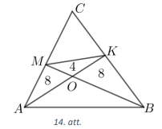
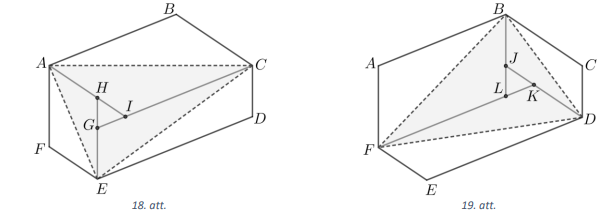

# <lo-sample/> LV.AMO.2022.5.1

Dotās $3 \times 3$ rūtiņu tabulas (skat. 1.att.) katrā rūtiņā 
ieraksti pa vienam naturālam skaitlim no $3$ līdz $11$ 
(katrā rūtiņā citu skaiti) tā, lai katrā rindā, katrā kolonnā un
katrā diagonālē ierakstīto trīs skaitļu summas būtu vienādas! 
Daži skaitļi jau ir ierakstīti.

<small>

* questionType:
* domain:

</small>

## Atrisinājums

Skat. 2.att., kur katrā rindā, katrā kolonnā un katrā diagonālē 
ierakstīto trīs skaitļu summa ir $21$.

# <lo-sample/> LV.AMO.2022.5.2

Karlsonam ir $29$ milzīgi tortes gabali. Viņš izvēlas kādu no gabaliem
un sagriež to vai nu $3$ , vai $5$ mazākos gabalos. Tad viņš atkal izvēlas 
kādu no gabaliem un sagriež to vai nu $3$, vai $5$ mazākos gabalos. Vai, 
atkārtoti izpildot šādas darbības, Karlsons var iegūt tieši $2022$ tortes gabalus?

<small>

* questionType:
* domain:

</small>

## Atrisinājums

Pamatosim, ka prasītais nav iespējams. levērojam, ka sākumā bija $29$
tortes gabali - nepāra skaitlis.

Ja vienu tortes gabalu sadala

- $3$ daļās, tad kopējais gabalu skaits palielinās par $2$ (par pāra skaitli), 
  tātad tas bija nepāra skaitlis un paliek nepāra skaitlis, jo, pie nepāra skaitļa 
  pieskaitot pāra skaitli, iegūst nepāra skaitli;
- $5$ daļās, tad kopējais gabalu skaits palielinās par $4$ (par pāra skaitli), 
  tātad tas bija nepāra skaitlis un paliek nepāra skaitlis, jo, pie nepāra skaitļa 
  pieskaitot pāra skaitli, iegūst nepāra skaitli;

Tātad kopējais gabalu skaits vienmēr būs nepāra skaitlis. Tā kā $2022$ ir 
pāra skaitlis, tad tieši $2022$ gabalus iegūt nevar.

# <lo-sample/> LV.AMO.2022.5.3

No taisnstūra ar izmēriem $6 \times 7$ rūtiņas izgriez sešas 3.att. 
redzamās figūras! Griezuma līnijām jāiet pa rūtinuu malām, 
figūras var būt pagrieztas vai apgāztas otrādi.

<small>

* questionType:
* domain:

</small>

## Atrisinājums

Skat., piemēram, 4.att. un 5.att.

# <lo-sample/> LV.AMO.2022.5.4

Laine uz lapas uzrakstīja lielāko divciparu pirmskaitli, kuram abi cipari 
arī ir pirmskaitli. Raimonds uzrakstīja mazāko divciparu pirmskaitli, kuram 
abi cipari arī ir pirmskaitļi. Kāda ir abu uzrakstīto skaitļu starpība?

<small>

* questionType:
* domain:

</small>

## Atrisinājums

Pamatosim, ka abu uzrakstīto skaitlu starpība ir $50$.

Abi uzrakstītie divciparu skaitļi var saturēt tikai ciparus $2,3,5$ un $7$, 
jo tie ir vienīgie viencipara pirmskaitļi.

Pēc kārtas pārbaudām tādus lielākos divciparu skaitļus, kam abi cipari ir 
pirmskaitļi:

- skaitlis $77$ neder, jo tas nav pirmskaitlis;
- skaitlis $75$ neder, jo tas nav pirmskaitlis;
- skaitlis $73$ ir pirmskaitlis.

Tātad Laine uz lapas uzrakstīja skaitli $73$ .

Pēc kārtas pārbaudām tādus mazākos divciparu skaitļus, kam abi cipari ir 
pirmskaitļi:

- skaitlis $22$ neder, jo tas nav pirmskaitlis;
- skaitlis $23$ ir pirmskaitlis.

Tātad Raimonds uz lapas uzrakstīja skaitli $23$.

Līdz ar to abu uzrakstīto skaitļu starpība ir $73-23=50$.

# <lo-sample/> LV.AMO.2022.5.5

Rindā pēc kārtas bez tukšumiem uzrakstīti visi skaitļi no $1$ līdz $999$:

$$123456789101112\ldots 998999.$$

Cik vietās šajā rindā pēc kārtas uzrakstīti cipari $2,0,2,2$ tieši šādā secībā?

<small>

* questionType:
* domain:

</small>

## Atrisinājums

Pamatosim, ka cipari $2,0,2,2$ tieši šādā secībā ir uzrakstīti divās vietās.

Tā kā katra rindā uzrakstītā skaitļa ciparu skaits ir mazāks nekā četri, 
tad minētie cipari nevar piederēt vienam skaitlim. Ja rindā šādu ciparu secību 
var atrast, tad tie pieder vairākiem pēc kārtas uzrakstītiem skaitļiem.

Minēto ciparu secību neveido uzrakstītie viencipara skaitļi.

Ja šī ciparu grupa atrastos vietā, kur mainās skaitļu garums (piemēram, 
pēdējais divciparu un pirmais trīsciparu skaitlis), tad šajā ciparu grupā 
noteikti būtu cipari $9$ un $1$. Tā kā šādu ciparu starp $2, 0, 2, 2$ nav, 
tad iesaistītie skaitļi ir vienādi gari.

Ja meklētie cipari pieder vairākiem secīgiem skaitļiem, tad aplūkosim, kur 
iepriekšējais skaitlis beidzas un sākas nākamais (skaitļus atdalīsim ar 
vertikālu svītru, ar $x$ un $y$ apzīmēsim nezināmos ciparus):

a. $\ldots 2\mid 022\ldots$ šāda situācija nevar būt, 
    jo neviena skaitļa pieraksts nesākas ar $0$;

b. $\ldots 20\mid 22\ldots$

  - divciparu skaitļi šādu secību veidot nevar, jo aiz $20$ seko $21$, nevis 
    $22$;
  - ja trīsciparu skaitlim $\overline{x 20}$ seko $\overline{22 y}$, 
    tad vienīgais derīgais variants ir $x=2$ un $y=1$ jeb $220$ 
    un $221$: $\ldots 2192\mathbf{2022}1222\ldots$;

c. $\ldots 202\mid 2\ldots$ ja trīsciparu skaitlim $202$ 
    seko $\overline{2 x y}$, tad vienīgais derīgais variants ir $x=0$ 
	un $y=3$ jeb $202$ un $203$: $\ldots 201\mathbf{2022}03204\ldots$

Tātad rindā cipari $2,0,2,2$ tieši šādā secībā ir uzrakstīti divās vietās.

   

# <lo-sample/> LV.AMO.2022.6.1

Piektdienas rītā Laine no savām mājām devās uz skolu. Kad viņa bija 
nogājusi $20 \%$ no visa ceļa, viņai vēl bija jānoiet $1200$ metri, lai 
nokļūtu līdz vietai, kur viņai būtu atlikuši vēl $20 \%$ no visa ceļa. Cik 
kilometru ir no Laines mājām līdz skolai?

<small>

* questionType:
* domain:

</small>

## Atrisinājums

No uzdevumā dotā izriet, ka $60 \%$ no visa ceļa ir $1200$ metri. Ja visu ceļa 
garumu no Laines mājām līdz skolai apzīmējam ar $x$, tad iegūstam, ka $60 \%$ 
no $x=1200$ jeb $\frac{60}{100} \cdot x=1200$. Tātad 
$x=\frac{1200 \cdot 100}{60}=2000$. Līdz ar to no Laines mājām līdz skolai 
ir $2000$ metri jeb $2$ kilometri.

# <lo-sample/> LV.AMO.2022.6.2

Konditorejā ir $4$ plaukti, kuros pārdevēja liek eklērus. No rīta šajos 
plauktos bija palikuši attiecīgi $2, 9, 0, 4$ eklēri. Ik pēc $20$ minūtēm 
pārdevēja izvēlas divus no šiem plauktiem un katrā no tiem ieliek $1$ svaigi 
ceptu eklēru. Šodien eklēri nevienam negaršo, tāpēc neviens tos nepērk. Vai 
iespējams, ka kādā brīdī visos četros plauktos būs vienāds skaits eklēru?

<small>

* questionType:
* domain:

</small>

## Atrisinājums

Pamatosim, ka prasītais nav iespējams.

Sākumā plauktos esošo eklēru kopējais skaits ir nepāra skaitlis: $2+9+0+4=15$.

Ik pēc $20$ minūtēm, pieliekot pa $1$ eklēram katrā no diviem izvēlētajiem 
plauktiem, visu eklēru kopējais skaits palielinās par $2$ (par pāra skaitli). 
Pie nepāra skaitļa pieskaitot pāra skaitli, iegūst nepāra skaitli. Tātad visu 
eklēru kopējais skaits visu laiku paliek nepāra skaitlis.

Beigās prasīts iegūt, lai visos plauktos ir vienāds eklēru skaits, bet četru 
vienādu skaitļu summa ir pāra skaitlis. Tātad nevar panākt, ka visos plauktos 
ir vienāds eklēru skaits.

# <lo-sample/> LV.AMO.2022.6.3

No kvadrāta ar izmēriem $10 \times 10$ rūtinas izgriez sešpadsmit 6.att. 
redzamās figūras! Griezuma līnijām jāiet pa rūtiņu malām, figūras var būt 
pagrieztas vai apgāztas otrādi.

<small>

* questionType:
* domain:

</small>

## Atrisinājums

Skat., piemēram, 7.att.

# <lo-sample/> LV.AMO.2022.6.4

Laine uz lapas uzrakstīja lielāko divciparu pirmskaitli, kuram abi cipari arī 
ir pirmskaitļi. Raimonds uz lapas uzrakstīja mazāko trīsciparu pirmskaitli. 
Kāda ir abu uzrakstīto skaitļu summa?

<small>

* questionType:
* domain:

</small>

## Atrisinājums

Pamatosim, ka abu uzrakstīto skaitlu summa ir $174$.

Laines uzrakstītais divciparu skaitlis var saturēt tikai ciparus $2,3,5$ un 
$7$, jo tie ir vienīgie viencipara pirmskaitlļi. Pēc kārtas pārbaudām tādus 
lielākos divciparu skaitļus, kam abi cipari ir pirmskaitļi:

- skaitlis $77$ neder, jo tas nav pirmskaitlis;
- skaitlis $75$ neder, jo tas nav pirmskaitlis;
- skaitlis $73$ ir pirmskaitlis.

Tātad Laine uz lapas uzrakstija skaitli $73$.

Mazākais trīsciparu skaitlis ir $100$, bet tas nav pirmskaitlis. Skaitlis $101$
ir pirmskaitlis, jo tas nedalās ar $2; 3; 5; 7; 11$. Tātad Raimonds uz lapas 
uzrakstīja skaitli $101$.

Līdz ar to abu uzrakstīto skaitļu summa ir $73+101=174$.

# <lo-sample/> LV.AMO.2022.6.5

Rindā pēc kārtas bez tukšumiem uzrakstīti visi skaitli no $1$ līdz $9999$:

$$123456789101112\ldots 99989999.$$

Cik vietās šajā rindā pēc kārtas uzrakstīti cipari $2,0,2,2$ (tieši šādā secībā)?

<small>

* questionType:
* domain:

</small>

## Atrisinājums

Pamatosim, ka cipari $2, 0, 2, 2$ tieši šādā secībā ir uzrakstīti piecās vietās.

Pēc kārtas uzrakstītie cipari pieder vai nu vienam, vai vairākiem pēc kārtas 
uzrakstītiem skaitļiem.

Starp uzrakstītajiem skaitļiem ir arī skaitlis $2022$. Tātad viena no vietām 
virknē, kur cipari uzrakstīti meklētajā secībā, ir tā, kur uzrakstīts skaitlis 
$2022$: $\ldots 2021\mathbf{2022}2023\ldots $

Minēto ciparu secību neveido uzrakstītie viencipara skaitļi. Ja šī ciparu grupa
atrastos vietā, kur mainās skaitļu garums (piemēram, pēdējais trīsciparu un 
pirmais četrciparu skaitlis), tad šajā ciparu grupā noteikti būtu cipari $9$ 
un $1$. Tā kā šādu ciparu starp $2, 0, 2, 2$ nav, tad iesaistītie skaitļi 
(ja tādi vispār ir) ir vienādi gari.

Ja meklētie cipari pieder vairākiem secīgiem skaitļiem, tad aplūkosim, kur 
iepriekšējais skaitlis beidzas un sākas nākamais (skaitļus atdalīsim ar 
vertikālu svītru, ar $x, y, z$ un $q$ apzīmēsim nezināmos ciparus):

a. $\ldots 2\mid 022\ldots $ šāda situācija nevar būt, jo neviena skaitļa 
pieraksts nesākas ar $0$;

b. $\ldots 20\mid 22\ldots $

- divciparu skaitli šādu secību veidot nevar, jo aiz $20$ seko $21$, nevis $22$;
- ja trīsciparu skaitlim $\overline{x 20}$ seko $\overline{22 y}$, tad 
  vienīgais derīgais variants ir $x=2$ un $y=1$ jeb $220$ un $221$: 
  $\ldots 219220221222\ldots $;
- ja četrciparu skaitlim $\overline{x y 20}$ seko $\overline{22 z q}$, tad 
  vienīgais derīgais variants ir $x=y=z=2, q=1$ jeb $2220$ un $2221$: 
  $\ldots 2219222022212222\ldots $;

c. $\ldots 202\mid 2\ldots $

- ja trīsciparu skaitlim $202$ seko $\overline{2 x y}$, tad vienīgais derīgais 
  variants ir $x=0$ un $y=3$ jeb $202$ un $203$: $\ldots 201202203204\ldots $;
- ja četrciparu skaitlim $\overline{x 202}$ seko $\overline{2 y z q}$, tad 
  vienīgais derīgais variants ir $x=y=2, z=0$ un $q=3$ jeb $2202$ un $2203$: 
  $\ldots $2201220222032204\ldots $

Tātad rindā cipari $2, 0, 2, 2$ tieši šādā secībā ir uzrakstīti piecās vietās.

# <lo-sample/> LV.AMO.2022.7.1

Attālināto mācību laikā skolēni iemācījās ļoti ātri atbildēt uz testa 
jautājumiem. Vilnis uz $4$ jautājumiem var atbildēt $30$ sekundēs, bet Raimonds
uz pieciem jautājumiem var atbildēt $40$ sekundēs. Skolotāja bija sagatavojusi 
testu ar ļoti daudz jautājumiem. Vilnim bija nepieciešama $1$ stunda, lai 
atbildētu uz visiem šī testa jautājumiem. Cik ilgā laikā šo pašu testu 
izpildīja Raimonds?

<small>

* questionType:
* domain:

</small>

## Atrisinājums

Tā kā Vilnis uz $4$ jautājumiem var atbildēt $30$ sekundēs, tad $1$ minūtē 
Vilnis atbild uz $8$ jautājumiem. Tātad stundas laikā Vilnis atbildēja uz 
$60 \cdot 8=480$ jautājumiem.

Tā kā Raimonds uz pieciem jautājumiem var atbildēt $40$ sekundēs, tad $120$ 
sekundēs jeb $2$ minūtēs Raimonds var atbildēt uz $3 \cdot 5=15$ jautājumiem. 
Tātad, lai atbildētu uz $480$ jautājumiem, Raimondam nepieciešamas 
$\frac{480}{15} \cdot 2=64$ minūtes.

# <lo-sample/> LV.AMO.2022.7.2

Karlsonam ir $30$ milzīgi tortes gabali. Viņš izvēlas trīs gabalus un sagriež 
katru no tiem vai nu $3$, vai $5$ mazākos gabalos (visus izvēlētos gabalus 
sagriež vienādā skaitā mazāku gabalu). Tad viņš atkal izvēlas kādus $3$ gabalus
un sagriež katru no tiem vai nu $3$, vai $5$ mazākos gabalos (visus izvēlētos 
gabalus sagriež vienādā skaitā gabalu). Vai, atkārtoti izpildot šādas darbības,
Karlsons var iegūt tieši $2000$ tortes gabalus?

<small>

* questionType:
* domain:

</small>

## Atrisinājums

Pamatosim, ka prasītais nav iespējams.

levērojam, ka sākumā gabalu skaits ir $30$, kas dalās ar $3$.

Aplūkosim, kā izmainās kopējais gabalu skaits, atkarībā no tā, kuru darbību 
Karlsons veic:

- ja katru no $3$ gabaliem sagriež $3$ daļās, tad iegūst $9$ gabalus un 
  kopējais gabalu skaits palielinās par $9-3=6$ gabaliem (par skaitli, kas 
  dalās ar $3$);
- ja katru no $3$ gabaliem sagriež $5$ daļās, tad iegūst $15$ gabalus un 
  kopējais gabalu skaits palielinās par $15-3=12$ gabaliem (par skaitli, kas 
  dalās ar $3$).

Ja pie skaitļa, kas dalās ar $3$, pieskaita skaitli, kas dalās ar $3$, vienmēr 
iegūst skaitli, kas dalās ar $3$. Tātad kopējais gabalu skaits pēc katras 
darbības dalās ar $3$.

Skaitļa $2000$ ciparu summa ir $2$, kas nedalās ar $3$, tātad arī pats skaitlis
$2000$ nedalās ar $3$. Tātad Karlsons nevarēs iegūt tieši $2000$ gabalus.

# <lo-sample/> LV.AMO.2022.7.3

Vai taisnstūri ar izmēriem $3 \times 3370$ rūtiņas var noklāt ar 8.att. 
redzamām figūrām tā, lai paliktu tieši $2022$ nenoklātas rūtiņas? Dotās figūras
malām jāiet pa rūtiņu līnijām, tā var būt pagriezta vai apgriezta spoguļattēlā,
figūras nedrīkst pārklāties vai iziet ārpus taisnstūra.

<small>

* questionType:ProveDisprove
* domain:

</small>

## Atrisinājums

Jā, var, skat. 9.att. Tā kā katrā taisnstūrī ar izmēriem $3 \times 5$ ir tieši 
$3$ nepārklātas rūtiņas un doto taisnstūri ar izmēriem $3 \times 3370$ var 
sadalīt $3370: 5=674$ šādos taisntūros, tad nepārklātas paliek tieši 
$3 \cdot 674=2022$ rūtiņas.

# <lo-sample/> LV.AMO.2022.7.4

Elektroniskais pulkstenis rāda stundu skaitu (vesels skaitlis robežās no $0$ 
līdz $23$) un minūšu skaitu (vesels skaitlis robežās no $0$ līdz $59$). 
Noteikt, cik reižu diennaktī stundu skaita un minūšu skaita starpība dalās 
ar $7$.

<small>

* questionType:
* domain:

</small>

## Atrisinājums

Pamatosim, ka diennaktī $207$ reizes stundu skaita un minūšu skaita starpība 
dalās ar $7$.

Skaitli, dalot ar $7$, iespējamas $7$ dažādas atlikumu vērtības: 
$0,1,2,3,4,5,6$. Skaitļus no $0$ līdz $59$ sadalīsim $7$ grupās atkarībā no tā,
kādu atlikumu šie skaitļi dod, dalot tos ar $7$, un ierakstīsim tabulā. 
levērosim, ka stundu un minūšu skaitu starpība dalās ar $7$ tad un tikai tad, 
ja stundu skaits un minūšu skaits ir ierakstīti vienā un tajā pašā tabulas 
rindiņā.

| Atlikums,   dalot ar $7$ | Stundu skaits | Minūšu skaits | Cik reižu stundu un minūšu skaita   starpība dalās ar $7$? |
| :---: | :--- | :--- | :--- |
| $0$ | $0; 7; 14; 21$ | $0; 7; 14; 21; 28; 35; 42; 49; 56$ | $4 \cdot 9=36$   ($4$ iespējas, kā izvēlēties stundu skaitu,   un $9$ iespējas, kā izvēlēties minūšu   skaitu) |
| $1$ | $1; 8; 15; 22$ | $1; 8; 15; 22; 29; 36; 43; 50; 57$ | $4 \cdot 9=36$ |
| $2$ | $2; 9; 16; 23$ | $2; 9; 16; 23; 30; 37; 44; 51; 58$ | $4 \cdot 9=36$ |
| $3$ | $3; 10; 17$ | $3; 10; 17; 24; 31; 38; 45; 52; 59$ | $3 \cdot 9=27$ |
| $4$ | $4; 11; 18$ | $4; 11; 18; 25; 32; 39; 46; 53$ | $3 \cdot 8=24$ |
| $5$ | $5; 12; 19$ | $5; 12; 19; 26; 33; 40; 47; 54$ | $3 \cdot 8=24$ |
| $6$ | $6; 13; 20$ | $6; 13; 20; 27; 34; 41; 48; 55$ | $3 \cdot 8=24$ |

Tātad pavisam ir $3 \cdot 36+27+3 \cdot 24=108+27+72=207$ iespējas, kā 
izvēlēties stundu un minūšu rādījumus tā, lai to starpība dalītos ar $7$.

# <lo-sample/> LV.AMO.2022.7.5

Trijzemē apgrozībā ir trīs veidu monētas: $2$ centi, $5$ centi un vēl viena. 
Zināms, ka gan trijkāji, kas maksā $13$ centus, gan trīsriteni, kas maksā $19$ 
centus, var nopirkt, maksājot tieši ar trīs monētām. Kāda ir Trijzemes trešās 
monētas vērtība? Atrodi visus iespējamos variantus un pamato, ka citu nav!

<small>

* questionType:
* domain:

</small>

## Atrisinājums

Pamatosim, ka vienīgā iespējamā trešās monētas vērtība ir $9$ centi.

Šķirosim gadījumus, cik nezināmās monētas varētu būt izmantotas $13$ un $19$ 
centu iegūšanai.

- Nevar būt izmantotas trīs nezināmās monētas, jo ne $13$, ne $19$ nedalās 
  ar $3$.
- Nevar būt tā, ka nav izmantota neviena nezināmā monēta, jo ne $13$, ne $19$ 
  centus nevar iegūt, izmantojot tikai $2$ un $5$ centu monētas.
- Ja būtu izmantotas divas nezināmās monētas, tad to summa būtu pāra skaitlis. 
  Tā kā trīs monētu vērtību summai jābūt nepāra skaitlim ($13$ vai $19$), tad 
  trešajai izmantotajai monētai arī jābūt nepāra skaitlim, tas nozīmē, ka tai 
  jābūt $5$ centu monētai. Tad iegūstam, ka

    * $13=5+4+4$, taču no monētām ar vērtībām $2; 4; 5$ centi nevar iegūt $19$ 
      centus;

	* $19=5+7+7$, taču no monētām ar vērtībām $2; 5; 7$ centi nevar iegūt $13$ 
	  centus.

  Līdz ar to ne $13$, ne $19$ centu iegūšanai nevar būt izmantotas divas 
  nezināmās monētas.

- Ja minēto vērtību iegūšanai izmantota tieši viena nezināmā monēta, tad abu 
  pārējo monētu summa varētu būt
	* $2+2$, un varam izteikt $13=2+2+\mathbf {9},19=2+2+15$

	* $2+5$, un varam izteikt $13=2+5+6,19=2+5+12$;

	* $5+5$, un varam izteikt $13=5+5+3,19=5+5+\mathbf {9}$

levērojam, ka vienīgā monētas vērtība, kas sakrīt, ir $9$. Līdz ar to esam 
ieguvuši, ka vienīgā iespējamā trešās monētas vērtība ir $9$ centi.

# <lo-sample/> LV.AMO.2022.8.1

Taisnes $y=x$ un $y=-2 x+2022$ krustojas punktā $A$. Punkti $B$ un $C$ ir 
attiecīgi šo taišņu krustpunkti ar $y$ asi. Aprēķināt trijstūra $ABC$ laukumu!

<small>

* questionType:
* domain:

</small>

## Atrisinājums

Punktu $B$ un $C$ koordinātas ir $(0; 0)$ un $(0; 2022)$. Tātad $B C=2022$. 
levērojot, ka $y=x$, aprēķinām abu taišņu krustpunkta $x$ koordinātu: 
$x=-2x+2022$ jeb $3x=2022$, tātad $x=674$. Līdz ar to attālums no punkta $A$ 
līdz $y$ asij ir $674$. Tātad 
$S_{ABC}=\frac{1}{2} BC \cdot h_{BC}=\frac{1}{2} \cdot 2022 \cdot 674=681414$.

# <lo-sample/> LV.AMO.2022.8.2

Kādā dienā Karlsons uzlika uz galda $44$ kūciņas. Lai būtu jautrāk, Karlsons 
izdomāja, ka vienā piegājienā viņš apēdīs vai nu $5$ kūciņas, vai arī $10$ 
kūciņas. Ja Karlsons apēda $5$ kūciņas, tad Brālītis uzreiz uz galda uzlika $9$
kūciņas. Ja Karlsons apēda $10$ kūciņas, tad Brālītis uzreiz uz galda uzlika 
$2$ kūciņas. Vai iespējams, ka kādā brīdī uz galda bija tieši $2022$ kūciņas?

<small>

* questionType:
* domain:

</small>

## Atrisinājums

Pamatosim, ka prasītais nav iespējams.

levērojam, ka sākumā kūciņu skaits ir $44$, kas dalās ar $4$.

Aplūkosim, kā izmainās kopējais kūciņu skaits, atkarībā no tā, cik kūciņas 
vienā piegājienā apēd Karlsons:

- ja apēd $5$ kūciņas un to vietā uz galda uzliek $9$ kūciņas, tad kopējais 
  kūciņu skaits palielinās par $4$ (par skaitli, kas dalās ar $4$);
- ja apēd $10$ kūciņas un to vietā uz galda uzliek $2$ kūciņas, tad kopējais 
  kūciņu skaits samazinās par $8$ (par skaitli, kas dalās ar $4$).

Ja pie skaitļa, kas dalās ar $4$, pieskaita vai no tā atņem skaitli, kas dalās 
ar $4$, vienmēr iegūst skaitli, kas dalās ar $4$.

Tātad kopējais kūciņu skaits pēc katra piegājiena dalās ar $4$.

Skaitlis $2022$ nedalās ar $4$. Tātad nav iespējams, ka uz galda kādā brīdī būs
tieši $2022$ kūciņas.

# <lo-sample/> LV.AMO.2022.8.3

Kvadrātā $ABCD$ novilkta diagonāle $AC$ un uz tās atzīmēts punkts $E$ tā, ka 
$\sphericalangle DEC=75^{\circ}$. Nogriežņa $DE$ pagarinājums krusto malu $AB$ punktā
$F$. Pierādīt, ka $EF=FB$!

<small>

* questionType:
* domain:

</small>

## Atrisinājums

Tā kā $AC$ ir kvadrāta diagonāle, tad 
$\sphericalangle BCA=\sphericalangle DCA=90^{\circ}: 2=45^{\circ}$. No 
trijstūra $ECD$ iegūstam, ka 
$\sphericalangle EDC=180^{\circ}-45^{\circ}-75^{\circ}=60^{\circ}$.

Novelkam nogriezni $BE$ (skat. 10.att.). levērojam, ka 
$\triangle DCE=\triangle BCE$ pēc pazīmes $m \ell m$, jo $DC=BC$, 
$\Varangle E C D=\sphericalangle ECB, EC$ - kopīga. Tā kā vienādos trijstūros 
attiecīgie elementi ir vienādi, tad 
$\sphericalangle BEC=\sphericalangle DEC=75^{\circ}$ un 
$\sphericalangle CBE=\sphericalangle CDE=60^{\circ}$.

Aprēķinām 
$\sphericalangle FEB=180^{\circ}-\sphericalangle BEC-\sphericalangle DEC=30^{\circ}$
un $\sphericalangle FBE=90^{\circ}-\sphericalangle CBE=30^{\circ}$. Tātad 
$\sphericalangle FEB=\sphericalangle FBE$ un trijstūris $EFB$ ir vienādsānu. 
Līdz ar to $EF=FB$.

# <lo-sample/> LV.AMO.2022.8.4

Māris iedomājās naturālu skaitli $n$. Pēc tam viņš izvēlējās vienu skaitļa $n$ 
dalītāju, pareizināja to ar $4$ un iegūto reizinājumu atņēma no dotā skaitļa 
$n$, iegūstot vērtību $11$. Kāda varēja būt $n$ vērtība? Atrodi visus variantus
un pamato, ka citu nav!

<small>

* questionType:
* domain:

</small>

## Atrisinājums

Skaitļa $n$ dalītāju apzīmējam ar $d$, tad $n-4d=11$. Tā kā $d$ ir skaitļa $n$ 
dalītājs, tad $n=k \cdot d$ un iegūstam, ka $kd-4d=11$ jeb $d(k-4)=11$, tas 
nozīmē, ka $11$ dalās ar $d$. Skaitlis $11$ ir pirmskaitlis, tāpēc iespējami 
divi gadījumi:

- $d=1$ un $k-4=11$ jeb $k=15$; no kā iegūstam, ka $n=k \cdot d=15 \cdot 1=15$;

- $d=11$ un $k-4=1$ jeb $k=5$; no kā iegūstam, ka $n=k \cdot d=5 \cdot 11=55$.

Tātad Māris iedomājās vai nu skaitli $15$, vai $55$.

# <lo-sample/> LV.AMO.2022.8.5

Mārtiņš augošā secībā pēc kārtas sāka rakstīt skaitļus, kuru pirmie četri 
cipari ir ,,$3321$":

$$3321; 33210; 33211; 33212; 33213; 33214;\ldots $$

Kāds ir $3321.$ skaitlis šajā virknē?

<small>

* questionType:
* domain:

</small>

## Atrisinājums

Pirmais naturālais skaitlis, kura pieraksts sākas ar „$3321$”, ir pats 
skaitlis $3321$.

Nākamie $10$: $3321\mathbf {0}; 3321\mathsbf {1}; \ldots ; 3321\mathbf{9};$

Nākamie $100$: $3321\mathbf {00}; 3321\mathbf {01}; \ldots ; 3321\mathbf {99};$

Nākamie $1000$: $3321\mathbf {000}; \ldots ; 3321\mathbf {999};$

Nākamie $1000$: $3321\mathbf {0000}; \ldots ; 3321\mathbf {0999};$

Nākamie $1000$: $3321\mathbf {1000}; \ldots ; 3321\mathbf {1999};$

Nākamie $200$: $3321\mathbf {2000}; \ldots; 3321\mathbf {2199};$

Nākamie $10$: $3321\mathbf {2200}; \ldots ; 3321\mathbf {2209}$.

Tātad kopā uzrakstīts $1+10+100+1000 \cdot 3+200+10=3321$ skaitlis, līdz ar to 
meklētais skaitlis ir $33212209$.

# <lo-sample/> LV.AMO.2022.9.1

Sporta preču veikalā ir daži vienriteņi, daži divriteņi un daži trīsriteņi, 
turklāt zināms, ka divriteņu ir vairāk nekā trīsriteņu. Emīls iegāja veikalā un
redzēja septiņus riteņu sēdekļus un trīspadsmit riepas. Cik vienriteņu ir 
sporta preču veikalā?

<small>

* questionType:
* domain:

</small>

## Atrisinājums

Vienriteņu, divriteņu un trīsriteņu skaitu apzīmējam attiecīgi ar $v, d$ un 
$t$. No dotā iegūstam, ka $v+d+t=7$ un $v+2d+3t=13$. levērojot, ka 
$v+2d+3t=(v+d+t)+d+2t$, iegūstam, ka $13=7+d+2t$ jeb $d=6-2t$. Tā kā $d>0$ un 
$t>0$, tad iespējami divi gadījumi:

- ja $t=1$, tad $d=6-2=4$;

- ja $t=2$, tad $d=6-4=2$, bet šāds gadījums neder, jo pēc dotā $d>t$.

Tātad $v+4+1=7$ jeb $v=2$. Līdz ar to esam ieguvuši, ka veikalā ir divi 
vienriteņi.

# <lo-sample/> LV.AMO.2022.9.2

Sākumā uz tāfeles uzrakstīts skaitlis $2112$. Ar to atļauts veikt šādas 
darbības:

- patvaļīgi mainīt uzrakstīto ciparu secību;
- ja skaitļa pēdējie divi cipari ir $12$, tos drīkst nodzēst;
- ciparu grupu "$21$" var aizstāt ar "$22233$"
- ciparu grupu "$223$" var aizstāt ar "$1$".

Vai, atkārtojot vairākus šādus gājienus, ir iespējams iegūt skaitli $212$?

<small>

* questionType:
* domain:

</small>

## Atrisinājums

Pamatosim, ka prasītais nav iespējams.

Sākotnēji uz tāfeles uzrakstītais skaitlis $2112$ dalās ar $3$ (ar $3$ dalās 
arī tā ciparu summa).

levērosim, ka veicot atļautos gājienus, uz tāfeles uzrakstītā skaitla ciparu 
summa attiecīgi

- nemainās;
- samazinās par $3$;
- palielinās par $9$;
- samazinās par $6$.

Veicot aprakstītos gājienus, iegūtā skaitļa ciparu summa vienmēr dalīsies ar 
trīs. Tātad gājienu rezultātā var iegūt tikai skaitļus, kuri dalās ar $3$. Taču
skaitlis $212$ nedalās ar $3$, tāpēc to ar aprakstītajiem gājieniem nevar iegūt.

# <lo-sample/> LV.AMO.2022.9.3

Izliektā sešstūrī $ABCDEF$ pretējās malas ir pa pāriem paralēlas, tas ir, 
$AB\|DE, BC\|EF$ un $CD\|AF$. Zināms, ka $AB=DE$. Pierādīt, ka $BC=EF$ un 
$CD=AF$.

<small>

* questionType:
* domain:

</small>

## Atrisinājums

Novelkam $AE$ un $BD$ (skat. 11.att.). Četrstūris $ABDE$ ir paralelograms, jo 
$AB\|DE$ un $AB=DE$. Tāpēc $BD=AE, \sphericalangle BAE=\sphericalangle BDE$ un 
$\sphericalangle ABD=\sphericalangle AED$.

Tā kā dotā sešstūra pretējās malas ir paralēlas, tad 
$\sphericalangle ABC=\sphericalangle DEF$ un 
$\sphericalangle CDE=\sphericalangle FAB$ kā leņķi ar paralēlām malām. Tātad iegūstam:

$$\begin{aligned}
& \circ \sphericalangle CBD=\sphericalangle ABC-\sphericalangle ABD=\sphericalangle DEF-\sphericalangle AED=\sphericalangle AEF; \\
& \circ \sphericalangle BDC=\sphericalangle CDE-\sphericalangle BDE=\sphericalangle FAB-\sphericalangle BAE=\sphericalangle FAE.
\end{aligned}$$

levērojam, ka $\triangle BCD=\triangle EFA$ pēc pazīmes $\ell m \ell$, jo 
$\sphericalangle CBD=\sphericalangle AEF, BD=AE, \sphericalangle BDC=\sphericalangle FAE$.

Līdz ar to $BC=EF$ un $CD=AF$ kā vienādu trijstūru atbilstošās malas.

# <lo-sample/> LV.AMO.2022.9.4

Skaitļi $a; b; c$ (tieši šādā secībā) veido aritmētisko progresiju. Pierādīt, 
ka skaitļi $a^{2}-bc; b^{2}-ac; c^{2}-ab$ (tieši šādā secībā) arī veido 
aritmētisko progresiju!

<small>

* questionType:
* domain:

</small>

## Atrisinājums

Tā kā skaitļi $a; b; c$ veido aritmētisko progresiju, tad tos varam pierakstīt 
kā $b-d; b; b+d$, kur $d$ ir diference. Izmantojot $b$ un $d$, izsakām arī 
citus skaitļus:

$$\begin{array}{ll}
a^{2}-bc=(b-d)^{2}-b(b+d)=b^{2}-2bd+d^{2}-b^{2}-bd=d^{2}-3bd \\
\text { o } & b^{2}-ac=b^{2}-(b-d)(b+d)=b^{2}-b^{2}+d^{2}=d^{2} \\
c^{2}-ab=(b+d)^{2}-(b-d)b=b^{2}+2bd+d^{2}-b^{2}+bd=d^{2}+3bd
\end{array}$$

Ievērojam, ka katru nākamo no šiem trīs skaitļiem iegūst, iepriekšējam skaitlim
pieskaitot $3bd$ (progresijas diference). Tātad skaitļi 
$a^{2}-bc; b^{2}-ac; c^{2}-ab$ veido aritmētisko progresiju.

# <lo-sample/> LV.AMO.2022.9.5

Kāds mazākais skaits rūtiņu jāaizkrāso taisnstūrī ar izmēriem $8 \times 8$ 
rūtiņas, lai nevarētu atrast nevienu taisnstūri ar izmēriem $1 \times 5$ 
rūtiņas (kurš var būt novietots gan horizontāli, gan vertikāli), kuram visas 
rūtiņas ir neaizkrāsotas?

<small>

* questionType:
* domain:

</small>

## Atrisinājums

Mazākais skaits rūtiņu, kas jāaizkrāso, ir $12$, skat., piemēram, 12.att.

Pamatosim, ka, atbilstoši uzdevuma nosacījumiem, mazāk kā $12$ rūtiņas nav 
iesējams aizkrāsot. Skaidrs, ka katrā no 13.att. redzamajiem $12$ ar treknāku 
līniju izceltajiem taisnstūriem jābūt aizkrāsotai vismaz vienai rūtiņai. Tātad 
jāaizkrāso vismaz $12$ rūtiņas.

# <lo-sample/> LV.AMO.2022.10.1

Uz tāfeles uzrakstīti $k$ secīgi naturāli skaitļi:

$$a+1; a+2; \ldots ; a+k$$

Atrast $k$ vērtību, ja zināms, ka tieši $52 \%$ no uzrakstītajiem skaitļiem ir 
pāra skaitļi!

<small>

* questionType:
* domain:

</small>

## Atrisinājums

Tā kā pāra skaitļu ir vairāk nekā nepāra skaitļu, tad pirmais un pēdējais 
uzrakstītais skaitlis ir pāra, jo tie pamīšus mainās - pāra skaitlis, nepāra 
skaitlis, pāra skaitlis, \ldots

Ja nepāra skaitļu skaitu apzīmējam ar $x$, tad pāra skaitļu skaits ir $x+1$ un 
$k=2x+1$. Līdz ar to $\frac{x+1}{2x+1}=52 \%$ jeb 
$\frac{x+1}{2x+1}=\frac{13}{25}$. legūstam, ka $25x+25=26x+13$ jeb $x=12$. 
Tātad $k=2x+1=25$.

# <lo-sample/> LV.AMO.2022.10.2

Sākumā uz tāfeles uzrakstīts skaitlis $1221$. Ar to atļauts veikt šādas 
darbības:

- patvaļīgi mainīt uzrakstīto ciparu secību;
- ja skaitļa pēdējie divi cipari ir $12$, tos drīkst nodzēst;
- ciparu grupu "$21$" var aizstāt ar "$112233$"
- ciparu grupu "$223$" var aizstāt ar "$1$".
- drīkst izsvītrot trīs vienādus pēc kārtas uzrakstītus ciparus.

Vai, atkārtojot vairākus šādus gājienus, ir iespējams iegūt skaitli $121$?

<small>

* questionType:
* domain:

</small>

## Atrisinājums

Pamatosim, ka prasītais nav iespējams.

Sākotnēji uz tāfeles uzrakstītais skaitlis $1221$ dalās ar $3$ (ar $3$ dalās 
arī tā ciparu summa).

levērosim, ka, veicot atļautos gājienus, uz tāfeles uzrakstītā skaitļa ciparu 
summa attiecīgi

- nemainās;
- samazinās par $3$;
- palielinās par $9$;
- samazinās par $6$;
- samazinās par $3$ (ja nodzēsti trīs vieninieki), $6$ (ja nodzēsti trīs 
  divnieki) vai $9$ (ja nodzēsti trīs trijnieki).

Veicot aprakstītos gājienus, iegūtā skaitļa ciparu summa vienmēr dalīsies ar 
trīs. Tātad gājienu rezultātā var iegūt tikai skaitļus, kuri dalās ar $3$. Taču
skaitlis $121$ nedalās ar $3$, tāpēc to ar aprakstītajiem gājieniem nevar iegūt.

# <lo-sample/> LV.AMO.2022.10.3

Uz trijstūra $ABC$ malām $AC$ un $BC$ atlikti attiecīgi punkti $M$ un $K$. 
Nogriežņi $AK$ un $BM$ krustojas punktā $O$. Aprēkināt trijstūra $ABC$ laukumu,
ja $S_{AMO}=S_{BKO}=8$ un $S_{KMO}=4$.

<small>

* questionType:
* domain:

</small>

## Atrisinājums

Tā kā $S_{AMK}=S_{BMK}=8+4=12$ (skat. 14.att.) un mala $MK$ ir kopīga, tad šo 
trijstūru augstumi, kas novilkti attiecīgi no virsotnēm $A$ un $B$, ir vienādi.
Līdz ar to secinām, ka $MK\|AB$ un $\triangle AOB \sim \triangle KOM$ pēc 
pazīmes $\ell \ell$.

Ievērojam, ka

$$\frac{8}{4}=\frac{S_{AMO}}{S_{OMK}}=\frac{\frac{1}{2} AO \cdot h_{AO}}{\frac{1}{2} OK \cdot h_{OK}}=\frac{AO}{OK}$$

Tātad $\frac{AB}{MK}=\frac{AO}{OK}=2$ un $S_{AOB}=4S_{MOK}=16$ un 
$S_{AMKB}=4+2 \cdot 8+16=36$. Tā kā $AB=2MK$ un $AB\|MK$, tad $S_{ABC}=4S_{MCK}$
un iegūstam vienādību 
$S_{ABC}=4\left(S_{ABC}-S_{AMKB}\right)$ jeb $S_{ABC}=4S_{ABC}-4 \cdot 36$, 
no kā aprēķinām, ka $S_{ABC}=48$.

\textit {Piezīme.} Var ievērot, ka $MK$ ir trijstūra $ABC$ viduslīnija.

# <lo-sample/> LV.AMO.2022.10.4

Kāds ir lielākais skaits dažādu naturālu skaitļu, ko var izvēlēties, lai 
jebkuru trīs izvēlēto skaitļu summa būtu pirmskaitlis?

<small>

* questionType:
* domain:

</small>

## Atrisinājums

Lielākais skaits dažādo naturālo skaitļu, ko var izvēlēties, ir $4$. Piemēram, 
der skaitļi $1, 3, 7, 9$, jo jebkuru trīs skaitļu summa ir pirmskaitlis: 
$1+3+7=11; 1+3+9=13; 1+7+9=17; 3+7+9=19$. Pierādīsim, ka vairāk kā $4$ skaitļus
izvēlēties nav iespējams.

Pamatosim, ka visiem izvēlētajiem skaitļiem ir jābūt nepāra skaitļiem. Ja būtu 
vai nu tieši viens, vai tieši divi pāra skaitļi, tad, izvēloties divus nepāra 
skaitļus un vienu pāra skaitli, summā iegūtu pāra skaitli, kas ir lielāks nekā 
$2$, tātad nevar būt pirmskaitlis. Līdzīgi, ja būtu vairāk nekā divi pāra 
skaitļi, tad, izvēloties tos, summā iegūtu pāra skaitli.

Sadalīsim skaitļus grupās pēc atlikuma, dalot tos ar $6$. lespējamās atlikumu 
vērtības ir $1, 3$ un $5$ . Ja kādā grupā būtu vismaz $3$ skaitļi, tad trīs no 
šīs grupas skaitļiem summā dos skaitļi, kas dalās ar $3$ un ir lielāks nekā 
$3$ - tātad tas nevar būt pirmskaitlis. Līdz ar to nevienā grupā nevar būt 
vairāk kā divi skaitļi. Ja būtu izvēlēti vairāk nekā $4$ skaitļi, tad, tā kā ir
$3$ grupas un nevienā grupā nav vairāk kā $2$ skaitļi, tad katrā no šīm trīs 
grupām ir vismaz viens skaitlis. Izvēloties no katras grupas pa vienam 
skaitlim, tie summā dos skaitli, kas dalās ar $3$ (jo $1+3+5$ dalās ar $3$) un 
ir lielāks nekā $3$, tātad nevar būt pirmskaitlis.

Līdz ar to esam pierādījuši, ka vairāk kā $4$ skaitlus izvēlēties nav 
iespējams.

# <lo-sample/> LV.AMO.2022.10.5

Pirmo $n$ skaitļu reizrēķina tabula ir tabula ar $n$ rindām un $n$ kolonnām, 
kurā $r$-tajā rindā un $k$-tajā kolonnā ierakstīts skaitlis $r \cdot k$ (visiem
$1 \leq r \leq n$ un $1 \leq k \leq n$ ). Šī tabula ir izkrāsota šaha galdiņa 
veidā tā, ka rūtiņa, kas atrodas pirmās rindas pirmajā kolonnā ir nokrāsota 
melna (15.att. redzams piemērs, kur $n=5$ ). lekrāsotajās rūtiņās ierakstīto 
skaitļu summu apzīmēsim ar $A$, bet neiekrāsotajās ar $B$. Aprēķiniet $(A-B)$ 
vērtību (tā var būt atkarīga no $n$ vērtības).

<small>

* questionType:
* domain:

</small>

## Atrisinājums

Šķirojam divus gadījumus.

1. Ja $n$ ir pāra skaitlis, tas ir, $n=2 m$, tad sadalām visu tabulu 
   $2 \times 2$ rūtiņas lielos kvadrātos. Katra $2 \times 2$ kvadrāta, kura 
   kreisā augšējā stūra rūtiņa atrodas $i$-tās rindas $j$-tajā kolonnā (skat. 
   16.att.), iekrāsotajās un neiekrāsotajās rūtiņās ierakstīto skaitļu summu 
   starpība ir

$$ij+(i+1)(j+1)-i(j+1)-(i+1)j=1$$

Tā kā tabula ir sadalīta $m \cdot m$ kvadrātos ar izmēriem 
$2 \times 2$, tad $A-B=m^{2}=\left(\frac{n}{2}\right)^{2}$.

2. Ja $n$ ir nepāra skaitlis, tas ir, $n=2m-1$, tad papildinām tabulu ar nulto 
   rindu un nulto kolonnu, kur katrā rūtiņā ierakstīta $0$ (tātad tas nemainīs 
   $(A-B)$ vērtību). Analoǵiski iegūstam, ka katrā $2 \times 2$ rūtiņu kvadrātā
   iekrāsotajās un neiekrāsotajās rūtiņās ierakstīto skaitļu summu starpība ir 
   $1$. Tātad $A-B=m^{2}=\left(\frac{n+1}{2}\right)^{2}$.

# <lo-sample/> LV.AMO.2022.11.1

Punkts $A$ ir parabolas $y=x^{2}+50$ virsotne, bet punkts $B$ ir parabolas 
$y=x^{2}-2022x+47$ virsotne. Aprēķināt trijstūra $AOB$ laukumu, ja punkts $O$ 
ir koordinātu asu krustpunkts!

<small>

* questionType:
* domain:

</small>

## Atrisinājums

levērojam, ka punkta $A$ koordinātas ir $(0;50)$. Tātad nogriežņa $OA$ garums 
ir $50$. Parabolas $y=x^{2}-2022x+47$ virsotnes $x$ koordināta ir 
$x_{v}=\frac{2022}{2}=1011$. Tātad attālums no punkta $B$ līdz $y$ asij ir 
$1011$. Līdz ar to 
$S_{AOB}=\frac{1}{2} OA \cdot h_{OA}=\frac{1}{2} \cdot 50 \cdot 1011=25275$.

# <lo-sample/> LV.AMO.2022.11.2

Doti divi lieli trauki A un B. Sākumā traukā A atrodas $2021$ melna un $2023$ 
baltas bumbiņas, bet traukā B - tikai melnas bumbiņas. Bumbiņu kopskaits abos 
traukos sākumā ir vienāds. Pēc kārtas tiek atkārtota šāda darbība:

uz labu laimi tiek paņemtas divas bumbinas no trauka A,

- ja tās ir vienādā krāsā, tad tās abas tiek ieliktas traukā B un viena melna 
  bumbiņa no trauka B tiek ielikta traukā A;
- ja tās ir dažādās krāsās, tad baltā bumbiņa tiek ielikta atpakaļ traukā A, 
  bet melnā - traukā B.

Šī darbība tiek atkārtota, līdz traukā A ir atlikusi tikai viena bumbiņa. Vai 
iespējams, ka tā būs melna?

<small>

* questionType:
* domain:

</small>

## Atrisinājums

Pamatosim, ka tā nevar būt melna. Sākumā traukā A bija $2023$ bumbiņas - nepāra
skaitlis. Aplūkosim, kā atkarībā no paņemto bumbiņu krāsas mainās balto bumbiņu
skaits traukā A.

| Paņemtās bumbiņas | Balto bumbiņu skaita izmaiņa traukā A |
| :--- | :--- |
| balta + balta | $-2$ |
| melna + melna | $0$ |
| balta + melna | $0$ |

Tātad balto bumbiņu skaits traukā A vai nu nemainās, vai arī samazinās par 
divi. Tas nozīmē, ka pēc katra gājiena traukā A ir nepāra skaits balto bumbiņu.
Līdz ar to vienas pēdējās bumbiņas krāsa traukā A būs balta.

# <lo-sample/> LV.AMO.2022.11.3

Izliekta četrstūra $ABCD$ diagonāle $AC$ ir leņķa $A$ bisektrise, $AC=AD$ un 
$\sphericalangle B=90^{\circ}$. Trijstūrī $ADC$ novilkts augstums $DH$. 
Pierādīt, ka taisne $BH$ krusto nogriezni $CD$ tā viduspunktā!

<small>

* questionType:
* domain:

</small>

## Atrisinājums

Tā kā $\sphericalangle BAC=\sphericalangle HAD$ un 
$AC=AD, \operatorname{tad} \triangle ABC=\triangle AHD$ pēc pazīmes 
"hipotenūza-šaurais leņķis" (skat. 17.att.) un $AB=AH$ kā atbilstošās malas. 
levērojam, trijstūri $BAH$ un $DAC$ ir vienādsānu trijstūri, kam ir vienādi 
virsotnes leņķi, tātad to pamata pieleņķi arī ir vienādi un 
$\sphericalangle HCD=\sphericalangle BHA=\sphericalangle CHK$. Līdz ar to esam 
ieguvuši, ka $\triangle CKH$ ir vienādsānu trijstūris un $CK=HK$.

Tā kā 
$\sphericalangle KDH=90^{\circ}-\sphericalangle HCD=90^{\circ}-\sphericalangle CHK=\sphericalangle KHD$, 
tad arī $HK=KD$. Tātad $DK=KC$ un esam pamatojuši, ka $BH$ krusto nogriezni 
$CD$ tā viduspunktā $K$.

# <lo-sample/> LV.AMO.2022.11.4

Četrciparu skaitli $\overline{abcd}$ sauksim par ekscentrisku, ja neviens tā 
cipars nav $0$ un tam ir spēkā vienādība 
$\overline{ab}+\overline{cd}=\overline{bc}$. Piemēram, skaitlis $1978$ ir 
ekscentrisks, jo $19+78=97$. Cik pavisam ir ekscentrisku skaitļu?

<small>

* questionType:
* domain:

</small>

## Atrisinājums

Pārrakstot doto sakarību $\overline{ab}+\overline{cd}=\overline{bc}$, iegūstam:

$$\begin{gathered}
10 a+b+10c+d=10b+c \\
10 a+d=9(b-c) \\
\bar{a} \bar{d}=9(b-c)
\end{gathered}$$

Esam ieguvuši, ka $9(b-c)$ ir divciparu skaitlis, tāpēc mazākā $(b-c)$ vērtība 
ir $2$. Lielāko $(b-c)$ vērtību iegūst, ja $b$ vērtība ir lielākā iespējamā, 
bet $c$-mazākā iespējamā, tāpēc lielākā $(b-c)$ vērtība ir $9-1=8$. Līdz ar to 
cipara $a$ vērtības var mainīties no $1$ līdz $7$ (jo $9 \cdot 2=18$ un 
$9 \cdot 8=72$). Apskatām iespējamos gadījumus.

| $\boldsymbol{a}$ | $\overline{\boldsymbol{a d}}: \mathbf{9}$ | $\boldsymbol{b}-\boldsymbol{c}=\overline{\boldsymbol{a d}}: \mathbf{9}$ | lespējamās starpības $(\boldsymbol{b}-\boldsymbol{c})$ |
| :---: | :---: | :---: | :--- |
| $1$ | $18$ | $2$ | $9-7=8-6=7-5=6-4=5-3=4-2=3-1$ |
| $2$ | $27$ | $3$ | $9-6=8-5=7-4=6-3=5-2=4-1$ |
| $3$ | $36$ | $4$ | $9-5=8-4=7-3=6-2=5-1$ |
| $4$ | $45$ | $5$ | $9-4=8-3=7-2=6-1$ |
| $5$ | $54$ | $6$ | $9-3=8-2=7-1$ |
| $6$ | $63$ | $7$ | $9-2=8-1$ |
| $7$ | $72$ | $8$ | $9-1$ |

Tātad kopējais ekscentrisko skaitļu skaits ir $7+6+\ldots +1=28$.

\textit {Piezīme.} Ekscentriski ir skaitļi: 
$1318, 1428, 1538, 1648, 1758, 1868, 1978, 2417, 2527, 2637, 2747, 2857, 2967, 3516, 3626, 3736, 3846, 3956, 4615, 4725, 4835, 4945, 5714, 5824, 5934, 6813, 6923, 7912$.

# <lo-sample/> LV.AMO.2022.11.5

Zināms, ka trijstūra $ABC$ leņķus $\alpha, \beta$ un $\gamma$ saista sakarība 
$\sin ^{2} \alpha+\sin ^{2} \beta+\sin ^{2} \gamma=2$. Pierādīt, ka trijstūris 
$ABC$ ir taisnleņķa trijstūris!

<small>

* questionType:
* domain:

</small>

## Atrisinājums

Tā kā $\alpha+\beta+\gamma=180^{\circ}$, tad

$$\begin{gathered}
\sin ^{2} \alpha+\sin ^{2} \beta+\sin ^{2}\left(180^{\circ}-(\alpha+\beta)\right)=2 \\
\sin ^{2} \alpha+\sin ^{2} \beta+\sin ^{2}(\alpha+\beta)=2 \\
\sin ^{2} \alpha+\sin ^{2} \beta+(\sin \alpha \cos \beta+\cos \alpha \sin \beta)^{2}=2 \\
\sin ^{2} \alpha+\sin ^{2} \beta+\sin ^{2} \alpha \cos ^{2} \beta+2 \sin \alpha \cos \beta \cos \alpha \sin \beta+\cos ^{2} \alpha \sin ^{2} \beta=2 \\
\sin ^{2} \alpha\left(1+\cos ^{2} \beta\right)+\sin ^{2} \beta\left(1+\cos ^{2} \alpha\right)+2 \sin \alpha \cos \beta \cos \alpha \sin \beta=2 \\
\left(1-\cos ^{2} \alpha\right)\left(1+\cos ^{2} \beta\right)+\left(1-\cos ^{2} \beta\right)\left(1+\cos ^{2} \alpha\right)+2 \sin \alpha \cos \beta \cos \alpha \sin \beta=2
\end{gathered}$$

$$
\begin{gathered}
1-\cos ^{2} \alpha+\cos ^{2} \beta-\cos ^{2} \alpha \cos ^{2} \beta+1+\cos ^{2} \alpha-\cos ^{2} \beta-\cos ^{2} \alpha \cos ^{2} \beta+2 \sin \alpha \cos \beta \cos \alpha \sin \beta=2
-2 \cos ^{2} \alpha \cos ^{2} \beta+2 \sin \alpha \cos \beta \cos \alpha \sin \beta=0 \\
2 \cos \alpha \cos \beta(\cos \alpha \cos \beta-\sin \alpha \sin \beta)=0 \\
2 \cos \alpha \cos \beta \cos (\alpha+\beta)=0
\end{gathered}
$$

Vismaz vienam no reizinātājiem jābūt vienādam ar nulli:

1) $\cos \alpha=0 \Rightarrow \alpha=90^{\circ}$ (lielākas vērtības neder, jo 
   $\alpha$ ir trijstūra leņķis);
2) $\cos \beta=0 \Rightarrow \beta=90^{\circ}$;
3) $\cos (\alpha+\beta)=0 \Rightarrow \alpha+\beta=90^{\circ} \Rightarrow \gamma=180^{\circ}-(\alpha+\beta)=90^{\circ}$.

Tātad kāds no trijstūra leņķiem ir taisns un trijstūris $ABC$ ir taisnleņķa.

# <lo-sample/> LV.AMO.2022.12.1

Regulāras piecstūra plāksnītes virsotnēs pa vienai reizei uzrakstīti skaitļi 
$1,2,3,4$ un $5$. Divas šādas plāksnītes sauksim par dažādām, ja, pagriežot vai
apmetot vienu plāksnīti otrādi, nevar panākt, ka visi vienas plāksnītes 
virsotnēs uzrakstītie skaitļi sakrīt ar otras plāksnītes virsotnēs 
uzrakstītajiem skaitļiem. Cik dažādas plāksnītes var izveidot?

<small>

* questionType:
* domain:

</small>

## Atrisinājums

Ņemot vērā, ka plāksnītes var brīvi pagriezt vai apmest otrādi, varam uzskatīt,
ka $1$ vienmēr atrodas fiksētā vietā, kā arī skaitlis $a$, kas atrodas pa 
kreisi no šīs virsotnes ir mazāks nekā skaitlis $b$, kas atrodas pa labi no šīs
virsotnes. Katrai šādai skaitļu kombinācijai $a \sim 1 \sim b$ var izveidot 
divas dažādas plāksnītes, attiecīgi atlikušajās virsotnēs ierakstot divus vēl 
neizmantotos skaitļus. Tā kā pavisam ir seši iespējamie $a$ un $b$ pāri: 
$2\sim 3; 2\sim 4; 2\sim 5; 3\sim 4; 3\sim 5$ un $4 \sim 5$, tad pavisam var 
izveidot $6 \cdot 2=12$ dažādas plāksnītes.

## Atrisinājums

Izvietojot skaitļus pilnīgi patvaļīgi, var iegūt $5!=120$ plāksnītes. Tā kā 
plāksnītes drīkst brīvi grozīt, tad dažādo variantu skaits ir $5$ reizes 
mazāks, tas ir, $120:5=24$. Šajā skaitā ir ieskaitīta arī katras plāksnītes 
apgrieztā plāksnīte (spoguļattēls), tātad pavisam ir $24:2=12$ dažādas 
plāksnītes.

# <lo-sample/> LV.AMO.2022.12.2

Doti divi lieli trauki A un B. Sākumā traukā A atrodas $2022$ melnas un $2022$ 
baltas bumbiņas, bet traukā B - tikai melnas bumbiņas. Bumbiņu kopskaits abos 
traukos sākumā ir vienāds. Pēc kārtas tiek atkārtota šāda darbība: uz labu 
laimi tiek paņemtas divas bumbiņas no trauka A,

- ja tās ir vienādā krāsā, tad tās abas tiek ieliktas traukā B un viena melna 
  bumbiņa no trauka B tiek ielikta traukā A;
- ja tās ir dažādās krāsās, tad baltā bumbiņa tiek ielikta atpakaļ traukā A, 
  bet melnā - traukā B.

Šī darbība tiek atkārtota, līdz traukā A ir atlikusi tikai viena bumbiņa. Vai 
iespējams, ka tā būs balta?

<small>

* questionType:
* domain:

</small>

## Atrisinājums

Pamatosim, ka tā nevar būt balta. Sākumā traukā A bija $2022$ bumbiņas - pāra 
skaitlis. Aplūkosim, kā atkarībā no paņemto bumbiņu krāsas mainās balto bumbiņu
skaits traukā A.

| Paņemtās bumbiņas | Balto bumbiņu skaita izmaiņa traukā A |
| :--- | :--- |
| balta + balta | $-2$ |
| melna + melna | $0$ |
| balta + melna | $0$ |

Tātad balto bumbiņu skaits traukā A vai nu nemainās, vai arī samazinās par 
divi. Tas nozīmē, ka pēc katra gājiena traukā A ir pāra skaits balto bumbiņu. 
Līdz ar to vienas pēdējās bumbiņas krāsa traukā A būs melna.

# <lo-sample/> LV.AMO.2022.12.3

Izliektā sešstūrī $ABCDEF$ pretējās malas ir pa pāriem paralēlas, bet dažāda 
garuma. Pierādīt, ka $S_{ACE}=S_{BDF}$!

<small>

* questionType:
* domain:

</small>

## Atrisinājums

Lai aprēķinātu $S_{ACE}$ no virsotnes $A$ novelkam nogriezni, kas paralēls $BC$
un $EF$, no $C$ novelkam nogriezni, kas paralēls $AB$ un $ED$, no $E$ novelkam 
nogriezni, kas paralēls $AF$ un $CD$ (skat. 18.att.). Ja pretējās malas nav 
vienādi garas, tad veidojas trīs paralelogrami $ABCI, CDEG$ un $AFEH$, kā arī 
trijstūris $GHI$.

levērojam, ka

- $GH=EH-EG=AF-CD$;

- $GI=ED-AB$;

- $HI=BC-EF$.

Tātad

$S_{ACE}=S_{AIC}+S_{CGE}+S_{AHE}+S_{GHI}=\frac{S_{ABCI}+S_{CDEG}+S_{AHEF}}{2}+S_{HGI}=\frac{S_{ABCI}+S_{CDEG}+S_{AHEF}+2S_{HGI}}{2}=\frac{S_{ABCDEF}+S_{HGI}}{2}$.

Lai aprēķinātu $S_{JKL}$, no $D$ novelkam nogriezni, kas paralēls $BC$ un $EF$,
no $F$ novelkam nogriezni, kas paralēls $AB$ un $ED$, no $B$ nogriezni, kas 
paralēls $AF$ un $CD$ (skat. 19.att.). Ja pretējās malas nav vienādi garas, tad
veidojas trīs paralelogrami $ABLF, BCDJ$ un $DEFK$, kā arī trijstūris $JKL$.

levērojam, ka

$$\begin{aligned}
& \circ \quad K L=F K-F L=E D-A B \\
& \circ \quad J L=A F-C D \\
& \bigcirc \quad J K=B C-E F
\end{aligned}$$

Tātad $\Delta JKL=\Delta GHI$ pēc pazīmes $\mathrm{mmm}$. Līdz ar to 
iegūstam, ka

$$S_{BDF}=S_{BDJ}+S_{DFK}+S_{BFL}+S_{JKL}=\frac{S_{ABLF}+S_{BCDJ}+S_{DEFK}}{2}+S_{JKL}=\frac{S_{ABCDEF}+S_{JKL}}{2}=\frac{S_{ABCDEF}+S_{GHI}}{2}=S_{ACE}$$

# <lo-sample/> LV.AMO.2022.12.4

Doti pieci naturāli skaitļi. Šo skaitļu reizinājums apzīmēts ar $R$, bet to 
piekto pakāpju summa ar $S$. Zināms, ka $S$ dalās ar $1001$. Vai ir iespējams, 
ka $R$ un $S$ ir savstarpēji pirmskaitļi?

<small>

* questionType:
* domain:

</small>

## Atrisinājums

levērojam, ka $1001$ dalās ar $11$, tātad doto skaitļu piekto pakāpju summa $S$
dalās ar $11$. Pierādīsim, ka no tā izriet, ka arī $R$ jādalās ar $11$, līdz ar
to būs pamatots, ka $R$ un $S$ nav savstarpēji pirmskaitļi.

Vispirms noskaidrosim, ar ko var būt kongruentas veselu skaitļu piektās pakāpes
pēc moduļa $11$.

| $n \pmod {11}$ | $n^5 \pmod {11}$ |
| :------------: | :--------------: |
| $0$            | $0$              |
| $1$            | $1$              | 
| $2$            | $-1$             | 
| $3$            | $1$              | 
| $4$            | $1$              | 
| $5$            | $1$              | 
| $6$            | $-1$             | 
| $7$            | $-1$             | 
| $8$            | $-1$             | 
| $9$            | $1$              | 
| $10$           | $-1$             | 

Pieņemsim, ka doto piecu skaitļu reizinājums $R$ nedalās ar $11$; tad arī 
neviens no šiem skaitļiem nedalās ar $11$, līdz ar to katra skaitļa piektā 
pakāpe ir kongruenta ar $1$ vai $-1$ pēc moduļa $11$. Secinām, ka visu doto 
skaitļu piekto pakāpju summa $S$ pēc moduļa $11$ ir pierakstāma formā 
$\pm 1 \pm 1 \pm 1 \pm 1 \pm 1$.

levērosim, ka tas ir nepāra skaitlis, kas pēc absolūtās vērtības nepārsniedz 
$5$, tātad nevar būt kongruents ar $0$ pēc moduļa $11$. Taču tā ir pretruna ar 
to, ka $S$ dalās ar $11$. Līdz ar to pieņēmums bijis aplams un $R$ dalās ar 
$11$. Secinām, ka skaitliem $R$ un $S$ ir kopīgs pirmreizinātājs $11$, tātad 
tie nav savstarpēji pirmskaitļi.

# <lo-sample/> LV.AMO.2022.12.5

Pierādīt, ka katram $n>2$ var atrast tādus $n$ atšķirīgus naturālus skaitļus 
$a_{1} < a_{2} < \cdots < a_{n} \leq 3 \cdot 2^{n-2}$, ka

$$\frac{1}{a_{1}}+\frac{1}{a_{2}}+\cdots+\frac{1}{a_{n}}=1$$

<small>

* questionType:
* domain:

</small>

## Atrisinājums

Ja $n=3$, tad der skaitļi $2, 3$ un $6$, jo 
$\frac{1}{2}+\frac{1}{3}+\frac{1}{6}=1$.

Tālāk izmantosim vienādību $\frac{1}{3}=\frac{1}{4}+\frac{1}{12}$ jeb vispārīgā
formā $\frac{1}{3k}=\frac{1}{4k}+\frac{1}{12k}$.

Tad no vienādības $\frac{1}{2}+\frac{1}{3}+\frac{1}{6}=1$, aizvietojot 
$\frac{1}{3}=\frac{1}{4}+\frac{1}{12}$, iegūstam derīgus skaitlus, ja $n=4$:

$$\frac{1}{2}+\frac{1}{4}+\frac{1}{6}+\frac{1}{12}=1$$

levērojam, ka gan iepriekš, gan tagad izteiksmē ir divi saskaitāmie, kuru 
saucējs dalās ar $3$. No šīm abām daļām izvēlamies mazāko daļu $\frac{1}{6}$, 
aizvietojam to ar $\frac{1}{8}+\frac{1}{24}$ un iegūstam derīgus skaitļus, 
ja $n=5$:

$$\frac{1}{2}+\frac{1}{4}+\frac{1}{8}+\frac{1}{12}+\frac{1}{24}=1$$

Atkal ir divas daļas, kuru saucējs dalās ar $3$. Šādi varam turpināt 
neierobežoti ilgi un lielākais saucējs vienmēr būs formā $3 \cdot 2^{n-2}$.

## Atrisinājums

Ar matemātiskās indukcijas metodi pierādīsim, ka jebkuram $n>2$ derīgu skaitļu 
komplektu veido šādi $n$ skaitli:

$$2^{1}<2^{2}<\cdots<2^{n-2}<3 \cdot 2^{n-3}<3 \cdot 2^{n-2}$$

Indukcijas bāze. Ja $n=3$, tad skaitļu komplekts $2<3<6$ der, jo 
$\frac{1}{2}+\frac{1}{3}+\frac{1}{6}=1$.

Induktīvais pieņēmums. Pieņemsim, ka šāda veida skaitļu komplekts ir derīgs 
vērtībai $n=k$, kur $k>3$:

$$\frac{1}{2}+\frac{1}{2^{2}}+\cdots+\frac{1}{2^{k-2}}+\frac{1}{3 \cdot 2^{k-3}}+\frac{1}{3 \cdot 2^{k-2}}=1$$

Induktīvā pāreja. Pierādīsim, ka šāda veida skaitļu komplekts ir derīgs 
vērtībai $n=k+1$:

$$\begin{gathered}
\frac{1}{2}+\frac{1}{2^{2}}+\cdots+\frac{1}{2^{k-2}}+\frac{1}{2^{k-1}}+\frac{1}{3 \cdot 2^{k-2}}+\frac{1}{3 \cdot 2^{k-1}}= \\
=\frac{1}{2}+\frac{1}{2^{2}}+\cdots+\frac{1}{2^{k-2}}+\frac{1}{3 \cdot 2^{k-2}}+\frac{1}{3 \cdot 2^{k-1}}+\frac{1}{2^{k-1}}= \\
=\frac{1}{2}+\frac{1}{2^{2}}+\cdots+\frac{1}{2^{k-2}}+\frac{1}{3 \cdot 2^{k-2}}+\frac{1}{2^{k-1}}\left(\frac{1}{3}+1\right)= \\
\quad=\frac{1}{2}+\frac{1}{2^{2}}+\cdots+\frac{1}{2^{k-2}}+\frac{1}{3 \cdot 2^{k-2}}+\frac{1}{2^{k-1}} \cdot \frac{4}{3}= \\
\quad=\frac{1}{2}+\frac{1}{2^{2}}+\cdots+\frac{1}{2^{k-2}}+\frac{1}{3 \cdot 2^{k-3}}+\frac{1}{3 \cdot 2^{k-2}}
\end{gathered}$$

Pēc induktīvā pieņēmuma šīs izteiksmes vērtība ir $1$, tātad skaitļu komplekts 
ir derīgs, un prasītais pierādīts.

