# <lo-sample/> LV.AMO.2022B.5.1

<text lang="en">
What is the smallest positive integer that uses only the digits $0$ and $2$ in its 
notation and is divisible by $15$?
</text>

<small>

* concepts:positive-integer,digit,decimal-notation,divisibility
* questionType: Findoptimal
* domain: NT
* LTopic: The resolution

</small> 

<text lang="en">
## Solution

We show that the smallest number satisfying the conditions is $2220$. 
For a number to be divisible by $15$, it must be divisible by 
$3$ and $5$. To be divisible by $3$, the sum of its digits must be divisible by $3$.
So the number $2$ must appear at least $3$ times in that number.

To be divisible by $5$, the last digit of this number must be $0$. 
Consequently, the smallest number with that property has at least $4$ digits and equals $2220$.
</text>

# <lo-sample/> LV.AMO.2022B.5.2

<text lang="en">
Draw a hexagon with its sides on a square grid having perimeter equal to its area!  
*Note:* The area is the number of little squares that make up the hexagon and the 
perimeter is the number of sides of the little squares on its border.
</text>

<small>

* Concepts:hexagon,side,square-grid,perimeter,area,square,border
* questionType: Findexample
* domain: Geom
* LTopic: Ltpolygon

</small> 

<text lang="en">
## Solution

Consider the hexagon shown in Figure 1. Its perimeter is $20$ and the area is also $20$.

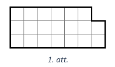
</text>

# <lo-sample/> LV.AMO.2022B.5.3

<text lang="en">
$250$ tickets were made for the theatre performance and at least half of them were sold. It is known that exactly a third of the audience were schoolchildren, exactly one fifth of the audience were students and exactly one-seventh were retirees. How many tickets were sold? 
</text>

<small>

* cooked: for fractions, at-least
* questionType: Findall
* domain: NT
* LTopic:

</small> 

<text lang="en">
## Solution 

*Answer.* $210$ tickets were sold.

To divide viewership directly into three, into five, and 
into seven equal parts, the number of tickets sold 
should be divisible by $3$, $5$, and $7$. 
So the number of tickets sold should be divisible 
by $3 \cdot 5 \cdot 7=105$. Since at least half of the tickets 
were sold, the number of sold tickets is between $125$ and $250$. 
The only number divisible by $105$ in this interval is $210$.
</text>

# <lo-sample/> LV.AMO.2022B.5.4

<text lang="en">
The balance scales (a), (b) and (c) are all in equilibrium. 
How many arrows should be put in the place of the question mark so that the 
balance scale (d) is also in equilibrium? Justify your answer!

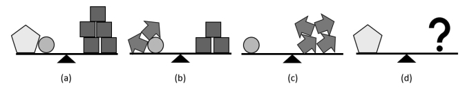
</text>

<small>

* Concept: Equality
* questionType: FindAll
* domain: ALG
* LTopic: LTEquationSystems

</small> 

<text lang="en">
## Solution

We need to place six arrows instead of the question mark. 
Let's express the mass of all the figures in "arrow units". 
From the balance (c), we conclude that the mass of the circle is 
four arrows. Consequently, the left side of 
balance (b) equals to six arrows that weigh 
as much as three squares. So the mass of one square is 
two arrows. 

Next, consider balance (a). By replacing the circle with four arrows 
and each square with two arrows, we get that the mass of the 
pentagon plus four arrows is ten arrows. 
So the mass of the pentagon alone is six arrows.
</text>

# <lo-sample/> LV.AMO.2022B.5.5

<text lang="en">
Each of the three girls, Elina, Guna and Maruta likes 
some color - either green, yellow, or orange. 
Each girl likes a different color, and dislikes the 
remaining two colors. 
Exactly one of the following claims is known to be true: 

* Guna doesn't like orange; 
* Elina doesn't like green; 
* Elina doesn't like orange. 

What colour does every girl like? Justify your answer!
</text>

<small>
* Concept: true-statement
* questionType: FindAll
* domain: Comb
* LTopic: LTLogic
</small> 

<text lang="en">
## Solution 

Guna likes orange, Elina likes green, and Maruta likes yellow. 
At least one of the last two claims must be true since Elina cannot 
like both green and orange. As there is only one true statement, 
the first statement is certainly false, meaning Guna
actually likes orange. 

If Elina liked yellow, then the two last statements 
would both be true, which is impossible. Since Guna likes orange, 
we conclude that Elina likes the green. Thus, Maruta is left with
yellow.
</text>

# <lo-sample/> LV.AMO.2022B.6.1

<text lang="en">
All positive integers from $1$ to $2022$ are 
written on a piece of paper, each appearing once. 
First, Amanda circled all the numbers 
divisible by $3$ in red. She then circled all the 
numbers divisible by $5$ in blue. Finally, 
she circled all the numbers divisible by $7$ in 
green. 
How many numbers are circled with at 
least two different colors? 
</text>

<small>

* cooked: natural-numbers, divisibility
* questionType: Findcount
* domain: NT
* LTopic:

</small> 

<text lang="en">
## Solution

We show that $249$ numbers are circled with at least two colors.

We look at all numbers divisible by at least two of the given
numbers $3$, $5$, or $7$. 

* If a number is divisible by  $3$ and $5$, it is divisible by $15$. 
  Since $2022=15 \cdot 134+12$, there are $134$ numbers divisible by $15$. 
* If a number is divisible by $3$ and $7$, it is divisible by $21$. 
  Since $2022=21 \cdot 96+6$, there are $96$ numbers divisible by $21$ 
  out of those written on the paper. 
* If a number is divisible by $5$ and $7$, it is divisible by $35$. 
  Since $2022=35 \cdot 57+27$, there are $57$ numbers divisible by $35$. 
  
Note that there are several numbers divisible by all three numbers 
$3$, $5$, and $7$, so they are divisible by $3 \cdot 5 \cdot 7=105$. 
Since $2022 = 105 \cdot 19 + 27$, there are altogether $19$ 
numbers divisible by $105$. The numbers divisible by $105$ 
were counted as numbers divisible by $15$, $21$, and $35$. 
So they were counted three times. We conclude that together there are 
$134 + 96 + 57 - 2 \cdot 19 = 249$ numbers divisible by at least two 
numbers out of $3$, $5$, $7$, so they are circled with at least two colors.
</text>

# <lo-sample/> LV.AMO.2022B.6.2

<text lang="en">
Show how to cut ten shapes (as in Fig.2) from the given piece 
of grid paper (see  Fig. 1).
(Mark the lines where cuts should be made!) 
The figures can also be rotated. 

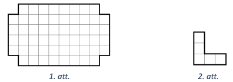
</text>

<small>

* Concept: grid, shape, Rotation
* questionType: Findexample
* domain: Geom
* LTopic: Ltcuttingcoverscoloring

</small> 

<text lang="en">
## Solution 

See, for example, Fig.4.

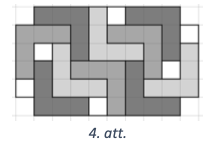
</text>

# <lo-sample/> LV.AMO.2022B.6.3

<text lang="en">
On a dark autumn night, Maris decided to add up all the 
positive integers from $1$ to $n$, where $n$ is some positive integer.
Could it happen that Maris gets a sum whose last digit is  
**(A)** $8$, **(B)** $9$?
</text>

<small>
* cooked: natural-numbers, sum, last-digit
* questionType: Provedisprove, ProveDisprove
* domain: NT
* LTopic: Ltcongruencemodulo
</small> 

<text lang="en">
## Solution 

**(A)**  
Yes, he can. For example, be $1+2+3+4+5+6+7=28$. 

**(B)** 
No, he cannot. Here's a list of the sums $S_{n}$ for 
some small $n$: 

* $S_{1}=1$ 
* $S_{2}=1+2=3$ 
* $S_{3}=1+2+3=6$ 
* $S_{4}=1+2+3+4=S_{3}+4=6+4=10$ 
* $S_{5}=1+2+3+4+5=S_{4}+5=10+5=15$ 
* $S_{6}=S_{5}+6=15+6=21$ 
* $\circ$... 

Let's create a table showing the last digit 
of the number $n$ and the last digit of the sum $S_{n}$. 
Note that we can compute the last digit of the sum 
$S_{n}$ by adding the last digit of the previous 
sum to the last digit of $n$. 

| The last digit of $n$       | The last digit of $S_n$        | 
| --------------------------- | ------------------------------ |
| $\mathbf{1}$                | $\mathbf{1}$                   |
| 2                           | 3                              |
| 3                           | 6                              |
| 4                           | 0                              |
| 5                           | 5                              |
| 6                           | 1                              |
| 7                           | 8                              |
| 8                           | 6                              |
| 9                           | 5                              |
| 0                           | 5                              |
| 1                           | 6                              |
| 2                           | 8                              |
| 3                           | 1                              |
| 4                           | 5                              |
| 5                           | 0                              |
| 6                           | 6                              |
| 7                           | 3                              |
| 8                           | 1                              |
| 9                           | 0                              |
| 0                           | 0                              |
| $\mathbf{1}$                | $\mathbf{1}$                   |

Since the last digit of $n$ and the last digit of
the sum $S_{n}$ in the last row of this table 
are the same two numbers as in the first row, 
the values in the table will start repeating 
periodically. 
The digit $9$ never appears in the second column 
of the table, so it cannot be the last digit of any sum $S_n$.
</text>

# <lo-sample/> LV.AMO.2022B.6.4

<text lang="en">
The balance scales (a), (b) and (c) are known to be in equilibirum. 
How many circles should you put in place of the question mark so that the balance scale 
(d) is also in equilibrium? Justify your answer!

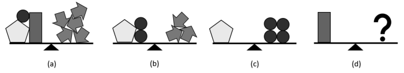 
</text>

<small>

* Concept: Equality
* questionType: FindAll
* domain: ALG
* LTopic: LTEquationSystems

</small> 

<text lang="en">
## Solution

*Answer.* The question mark should be replaced by five circles. 

We express the mass of all the shapes in "circle units". 
From the balance (c) we conclude that the mass of the pentagon 
equals to four circles. Thus the balance scale (b) has six circles 
on the left side, and this is the same as the mass of three arrows. 
So the mass of a single arrow equals to two circles. 

Next, consider the balance scale (a). By replacing the pentagon with 
four circles and each arrow with two circles, we get that the mass of 
the rectangle and five circles is the same as the mass of 
ten circles. So the rectangle has the mass of five circles.
</text>

# <lo-sample/> LV.AMO.2022B.6.5

<text lang="en">
Some of $273$ villagers always tell the truth, the remaining ones 
lie all the time. Each of the villagers has exactly one favourite 
day of the week. There was a poll of all the villagers, and they 
were asked to answer seven questions with either "Yes" or "No":

| Question                        |                |               |
| ------------------------------- | -------------- | ------------- |
| Is Monday your favorite day?    | $\square$ Yes  | $\square$ No  |
| Is Tuesday your favorite day?   | $\square$ Yes  | $\square$ No  |
| Is Wednesday your favorite day? | $\square$ Yes  | $\square$ No  |
| Is Thursday your favorite day?  | $\square$ Yes  | $\square$ No  |
| Is Friday your favorite day?    | $\square$ Yes  | $\square$ No  |
| Is Saturday your favorite day?  | $\square$ Yes  | $\square$ No  |
| Is Sunday your favorite day?    | $\square$ Yes  | $\square$ No  |

The number of "Yes" answers received to each question was as follows: 
Monday - $51$, Tuesday - $52$, Wednesday - $53$, Thursday - $55$, 
Friday - $54$, Saturday - $56$, Sunday - $57$. 
How many villagers lie all the time?
</text>

<small>

* cooked: truth, falsehood, mapping
* questionType: Findcount
* domain: Comb
* LTopic: The ltlogic

</small> 

<text lang="en">
## Solution 

*Answer.* In the village there are $21$ liars. 

Alltogether there were $51+52+53+54+55+56+57=378$ answers “Yes”. 
Note that every villager who tells the truth answered "Yes" exactly once 
(for their favourite day) and every liar exactly six times 
(for all the days that aren't his/her favourite day). 
If we turn one resident who says the truth into a liar, then we get 
five surplus answers "Yes". In the beginning assume that 
everyone in the village is telling the truth; in this case 
there would be $273$ answers “Yes”. 
As there are $378$ answers "Yes", we have $378-273=105$ 
"redundant" answers "Yes". This can be achieved by turning $105:5=21$ 
villagers into liars.
</text>

# <lo-sample/> LV.AMO.2022B.7.1

<text lang="en">
The following text was written on the board: $A869B$. Each of the 
letters $A$ and $B$ must be replaced by one digit 
(they may or may not be the same) so that the resulting five-digit 
number is divisible by $15$. In how many ways can you do this?
</text>

<small>

* cooked: variable, Digit, divisibility
* questionType: FindCount
* domain: NT
* LTopic: The resolution

</small> 

<text lang="en">
## Solution

*Answer.* This can be done in $6$ ways. 
For a number $\overline{A869B}$ to be divisible by $15$, 
it must be divisible by both $3$ and $5$. 
Consider two possible cases for the digit $B$ such that it is disible by $5$. 

* If $B=0$, the sum of the digits is $A+8+6+9+0=A+23$. 
  To be divisible by $3$, the sum of digits must be divisible by $3$, 
  so the possible values for $A$ are $1$, $4$, or $7$. 
* If $B=5$, the sum of the digits is $A+8+6+9+5=A+28$. 
  To be divisible by $3$, the sum of digits must be divisible by $3$, 
  so the possible values for $A$ are $2$, $5$, or $8$. 
  
As a result, there are six different options for digits replacing $A$ and $B$
respectively: $(A,B) = (1,0)$, $(A,B)=(4,0)$; $(A,B)=(7,0)$, 
$(A,B)=(2,5)$; $(A,B)=(5,5)$; $(A,B)=(8,5)$.
</text>

# <lo-sample/> LV.AMO.2022B.7.2

<text lang="en">
Do there exist **(A)** $5$; **(B)** $15$ positive integers (some of them may be equal) such that their sum equals their product?
</text>

<small>

* Concept: sum, product
* questionType: Provedisprove
* domain: ALG
* LTopic: Ltequations, LTNumTheoryByCases

</small> 

<text lang="en">
## Solution 

**(A)** Yes, the numbers $1,1,2,2,2$ satisfy the condition, since 
$1+1+2+2+2=8$ and $1 \cdot 1 \cdot 2 \cdot 2 \cdot 2=8$ 

**(B)** Yes, such numbers exist. For example, $1, 1, 1, 1, 1, 1, 1, 1, 1, 1, 1, 1, 1, 2, 15$ (13 copies of number $1$ and also numbers $2$ and $15$), 
since $13 \cdot 1+2+15=30$ and $1 \cdot 2 \cdot 15=30$. 

*Note* For (A) the solutions $1,1,1,3,3$ or $1,1,1,2,5$ are also valid.
</text>

# <lo-sample/> LV.AMO.2022B.7.3

<text lang="en">
Show how to draw $6$ lines in a plane and mark $7$ points on the lines so that 
exactly three points are marked on each line!
</text>

<small>
* Concept: Plane, line, point
* questionType: Findexample
* domain: Geom
* LTopic: Resolution
</small> 

<text lang="en">
## Solution 

An possible answer is shown in Fig.5. 

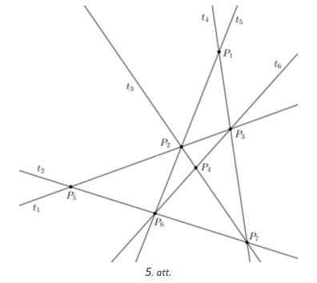
</text>

# <lo-sample/> LV.AMO.2022B.7.4

<text lang="en">
There's a pile of candies on the table. Karlsson and Lillebror 
(Little Brother) take turns making moves, with Karlsson starting the game. 
In one move, a player can remove from the pile and 
eat either one or two candies. The player who eats the last candy wins. 
Which player, can always win if there are initially
**(A)** $6$ candies in the heap; **(B)** $2022$ candies in the heap? 
</text>

<small>

* cooked: game, set, Remove, to-win
* questionType: Algorithm, Algorithm
* domain: NT
* LTopic:

</small> 

<text lang="en">
## Solution 

Lillebror can win in both cases. To achieve this, he can proceed 
as follows: in every move, if Karlsson eats one candy, then Lillebror 
eats two, and vice versa, if Karlsson eats two, then Lillebror eats one. 
Playing like this, after every pair of moves the number of candies 
in the pile drops by exactly $3$. Since initially the number of 
candies was divisible by $3$ (both $6$ and $2022$ are divisible by $3$), 
in either case it will become $0$ after a move by Lillebror, 
so the Lillebror will win. 

*Note.* In case (A), Lillebror will win after his second move. In case
(B), Lillebror will win after the $2022:3=674$ moves.
</text>

# <lo-sample/> LV.AMO.2022B.7.5

<text lang="en">
Some of $272$ villagers always tell the truth, the remaining ones 
lie all the time. Each of the villagers has exactly one favourite 
day of the week. There was a poll of all the villagers, and they 
were asked to answer seven questions with either "Yes" or "No":

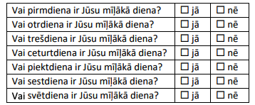 

The number of "Yes" answers received to each question was as follows: 
Monday - $53$, Tuesday - $54$, Wednesday - $55$, Thursday - $57$, 
Friday - $56$, Saturday - $58$, Sunday - $59$. 
How many villagers lie all the time? 
</text>

<small>

* cooked: truth, falsehood, mapping
* questionType: Findcount
* domain: Comb
* LTopic: The resolution

</small>

<text lang="en">
## Solution 

*Answer.* In the village there are $24$ liars. 

Alltogether there were $53+54+55+56+57+58+59=392$ answers "Yes". 
Note that every villager who tells the truth answered "Yes" exactly once 
(for their favourite day) and every liar exactly six times 
(for all the days that aren't his/her favourite day). 

If we turn one resident who says the truth into a liar, then we get 
five surplus answers "Yes".
In the beginning assume that 
everyone in the village is telling the truth; in this case 
we would have $272$ answers “Yes”. 

Since we have 392 answers "Yes", we have $392-272=120$ "redundant" answers "Yes". 
This can be achieved by turning $120:5=24$ villagers into liars.
</text>

# <lo-sample/> LV.AMO.2022B.8.1

<text lang="en">
The following text was written on the board: $N597M$. Each of the letters 
$N$ and $M$ should be replaced by a digit (they may or may not be 
the same) so that the resulting five digit number is divisible by $12$. 
In how many ways can you do this?
</text>

<small>

* cooked: divisibility, variable, digit
* questionType: Findcount
* domain: NT
* LTopic: The resolution

</small>

<text lang="en">
## Solution 

The requirements can be satisfied in $6$ different ways. 
In order to have a number $\overline{N597M}$ divisible by $12$, 
it must be divisible by $3$ and by $4$. 
To be divisible by $4$, the last two digits must be divisible by $4$. 
Let's look at two possible cases for the digit $M$ to achieve
divisiblity by $4$. 

* If $M=2$, the sum of digits is $N+5+9+7+2=N+23$. 
  To be divisible by $3$, the sum of its digits must be divisible by $3$,
  so the possible values of $N$ are $1$, $4$, or $7$. 
* If $M=6$, the sum of digits is $N+5+9+7+6=N+27$. 
  To be divisible by $3$, the sum of its digits must divisible by $3$, 
  so the possible values of $N$ are $0$, $3$, $6$, or $9$. No number can
  begin with a $0$, so the possible values of $N$ are $3$, $6$, or $9$. 
  
As a result, there are six different options how to replace $N$ and $M$: 
$(N,M)=(1,2)$; $(N,M)=(4,2)$; $(N,M)=(7,2)$; $(N,M)=(3,6)$; 
$(N,M)=(6,6)$; $(N,M)=(9,6)$.
</text>

# <lo-sample/> LV.AMO.2022B.8.2

<text lang="en">
The student had to complete a homework with $20$ tasks. For each task 
$8$ points are added, if the solution is correct, $5$ points are 
subtracted, if the solution is wrong, and $0$ points is given, 
if the task is not attempted. How many tasks did a student solve 
correctly, if his total score is $13$?
</text>

<small>

* cooked: add, subtract
* questionType: Findall
* domain: ALG
* LTopic: Ltequations

</small>

<text lang="en">
## Solution 

*Answer.* The student solved $6$ tasks correctly. 

Let us show that this answer is the only possibility. 
Let $x$ denote the number of tasks that were solved correctly, but $y$ denotes the number tasks that were wrong. 

Consider all solutions for the equation $8x-5y=13$. Since $8x$ is 
even, then $5y$ and $y$ must be odd. When expressing $x$, we would get $x=(13+5y):8$. As there were $20$ tasks in total, so there are only $6$ 
different values of $y$ such that $x+y \leq 20$. 
Indeed, if $y \geq 12$, then $x>9$ and $x+y>20$. 

If the calculated $x$ value is a positive integer, the resulting 
$x$ and $y$ values are valid. The table shows that the only 
valid values are $x=6$ and $y=7$, so the student solved $6$ tasks 
correctly, solved $7$ tasks incorrectly, and $7$ tasks were not attempted. 

| $\boldsymbol{y}$ | Is $x=(13+5y):8$ a positive integer? |
| ---------------- | ------------------------------------ |
| $\mathbf{1}$     | No                                   |
| $\mathbf{3}$     | No                                   |
| $\mathbf{5}$     | No                                   |
| $\mathbf{7}$     | Yes, $x=6$                           |
| $\mathbf{9}$     | No                                   |
| $\mathbf{11}$    | No                                   |
</text>

# <lo-sample/> LV.AMO.2022B.8.3

<text lang="en">
In a triangle $ABC$ on the side $BC$ there is a point $D$ 
such that $AD = BD$ and $AB = DC = AC$. Calculate the angles 
of $ABC$!
</text>

<small>

* Concept: triangle
* questionType: Findall
* domain: Geom
* LTopic: Lttriangles

</small> 

<text lang="en">
## Solution 

Since $AD=BD$, the triangle $ABD$ is an isosceles 
triangle with the base $AB$ and both angles at the base 
are equal, hence $\sphericalangle ABD=\sphericalangle BAD=\alpha$ 
(see Figure 6). 

We get from the triangle $ABD$ that 
$\sphericalangle ADB=180^{\circ}-\alpha-\alpha=180^{\circ}-2 \alpha$. 
Note that $\sphericalangle ADC = 180^{\circ} - \sphericalangle ADB=180^{\circ}-\left(180^{\circ}-2 \alpha\right)=2 \alpha$ as 
supplementary angles. Since the $AC=DC$, the triangle $ACD$ 
is also isosceles and angles at its base are the same, hence  $\sphericalangle DAC=\sphericalangle ADC = 2\alpha$. 

Since $AB=AC$, the triangle $ABC$ is also isosceles and the angles
at its base are the same, hence 
$\sphericalangle ABC=\sphericalangle ACB=\alpha$. 
From the triangle $ACD$, we get that

$$\sphericalangle ADC+\sphericalangle DAC+\sphericalangle ACD = 2 \alpha+2 \alpha+\alpha=180^{\circ}$$ 

By solving $5 \alpha=180^{\circ}$, we get that $\alpha=36^{\circ}$. 
Find all the angles in triangle $ABC$: 

- $\sphericalangle ABC = \sphericalangle ACB = \alpha=36^{\circ}$;
- $\sphericalangle BAC = \sphericalangle BAD + \sphericalangle DAC = \alpha+2 \alpha=108^{\circ}$.

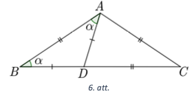
</text>

# <lo-sample/> LV.AMO.2022B.8.4

<text lang="en">
Is it possible to arrange the numbers  
**(A)** $0;\;1;\;2;\;3;\;4;\;5;\;6;\;7;\;8;\;9$   
**(B)** $0;\;1;\;2;\;3;\;4;\;5;\;6;\;7;\;8;\;9;\;10;\;11;\;12;\;13$  
around a circle so that any two adjacent numbers differ by $3$, $4$, or $5$?
</text>

<small>

* Concepted: Integer-numbers, distance
* questionType: Provedisprove, ProveDisprove
* domain: NT
* LTopic: Ltnumtheoryexamples

</small> 

<text lang="en">
## Solution

**(A)** Let us show that it is impossible. Note that the numbers 
$0$; $1$; $2$; $8$ and $9$ cannot be written next to each other 
as the difference between any two of them is not $3$; $4$ or $5$. 
So they should be written on the circle by skipping one position 
between any two of them (See Fig.7, where the letters indicate 
places where these five numbers should go.)

You can only write $7$ next to $2$ because their difference is $5$, 
but $7$ cannot stand next to any of the other numbers $0$, $1$, $8$, or $9$. 
So it is impossible to place $7$ anywhere on the circle, so the 
given numbers cannot be written in a way that 
every two adjacent numbers differ by $3$, $4$, or $5$. 

**(B)** Yes, for example, see Fig.8. Inside the circle the numbers 
indicate by how much any two neighboring number differ. 

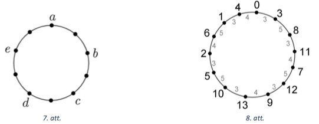
</text>

# <lo-sample/> LV.AMO.2022B.8.5

<text lang="en">
Five friends started arguing, and they stated the following: 

* Elina says: "I always speak the truth."
* Guna says: "Elina and Agnese are both lying."
* Maruta says: "Everyone speaks the truth."
* Agnese says: "Elina lies."
* Emils says: "Everyone lies." 

It is known that each friend either always speaks the truth 
or always lies. 
How many friends speak the truth? 
</text>

<small>

* cooked: truth, falsehood
* questionType: Findcount
* domain: Comb
* LTopic: Ltlogic

</small> 

<text lang="en">
## Solution 

*Answer.* We show that only one of the friends speaks the truth. 
Note that: 

- If Elina speaks the truth, then Agnese lies.  
  So they cannot both speak the truth. 
- If Agnese lies, then Elina says the truth, so the cannot both lie. 

Thus, either Elina or Agnese speaks the truth and the other one lies. 
It follows that Guna, Maruta and Emils lie. 
So only one of the friends speaks the truth (it is either Elina or Agnese). 
</text>

# <lo-sample/> LV.AMO.2022B.9.1

<text lang="en">
How many four-digit numbers $\overline{ABBA}$ are there that are 
divisible by $99$? (The same letters are replaced by the same digits,
but different letters may or may not be the same.)
</text>

<small>

* concepts: divisibility, Digit, variable
* questionType: Findcount
* domain: NT
* LTopic: The solution

</small> 

<text lang="en">
## Solution 

There are $10$ numbers that satisfy the conditions: 
$1881$, $2772$, $3663$, $4554$, $5445$, $6336$, $7227$, $8118$, $9009$, $9999$. For a number to be divisible by $99$, it must 
be divisible by both $11$ and $9$. 
Note that the given number is divisible by $11$, since the 
sum of digits in odd positions 
minus the sum of digits in even positions equals $0$, so it is divisble by $11$. 

To be divisible by $9$, the sum of its digits must be divisible by $9$. 
So $A+B+B+A=2(A+B)$ should be divisible by $9$. 
Since $A$ and $B$ are numbers, two cases are possible: 
$A+B=9$ or $A+B=18$. If $A+B=9$, there may be nine cases: 
$$A+B=1+8=2+7=3+6=4+5=5+4=6+3=7+2=8+1=9+0.$$ 

If you $A+B=18$, you can only have one case $A+B=9+9$.
</text>

# <lo-sample/> LV.AMO.2022B.9.2

<text lang="en">
Is the inequality always true: $x + \frac{9}{x} > y + \frac{9}{y}$, if 
**(A)** $x > y > 0$,  **(B)** $x > y > 3$?
</text>

<small>

* Concept: Inequality
* questionType: Provedisprove, ProveDisprove
* domain: ALG
* LTopic: Ltinequalities

</small> 

<text lang="en">
## Solution 

**(A)** 
No. For example, take $x=1$, and $y=0.1$. Then 
$x+\frac{9}{x}=10$ and $y+\frac{9}{y}=90.1$, but $10<90.1$. 

**(B)** 
We show that for $x>y>3$, the inequality given is true. 

Multiply both sides of the inequality $x+\frac{9}{x}>y+\frac{9}{y}$ 
by a positive expression $xy$, get an equivalent expression: 

$$x^{3} y+9 y>x y^{2}+9x.$$

In order to prove that the inequalities are true, 
it is sufficient to show that the $x^{2}y + 9y - xy^{2} - 9x>0$. 
Notice that we have $x-y>0$ and $xy-9>0$ since it is given that $x>y>3$. 
We look at the product of two positive expressions 
and rewrite it as follows: 

$$0 < (xy-9)(x-y) = x^{2}y - xy^{2} - 9x + 9y$$. 

So we proved the necessary inequality.
</text>

# <lo-sample/> LV.AMO.2022B.9.3

<text lang="en">
In a right triangle $ACB$ ($\sphericalangle C = 90^{\circ}$) 
$CH$ is an altitude. On the side $AC$ we mark a point $K$ 
so that $\sphericalangle CBK = \sphericalangle BAC$. 
Prove that the line $CH$ divides the segment $BK$ in half!
</text>

<small>

* Concept: right-triangle, alter, line, segment
* questionType: Prove
* domain: Geom
* LTopic: The

</small> 

<text lang="en">
## Solution

Denote the intersection of $CH$ and $KB$ with $O$ and $\sphericalangle CBK=\sphericalangle BAC=\alpha$, 
$\sphericalangle ABC=\beta$ (see Fig.9). 
From the triangle $ABC$, we get that 
$\sphericalangle BAC=180^{\circ}-\sphericalangle ACB-\sphericalangle ABC$, 
or $\alpha=90^{\circ}-\beta$. 

From the triangle $BHC$ we get that 
$\sphericalangle HCB=180^{\circ}-\sphericalangle CHB-\sphericalangle HBC=90^{\circ}-\beta=\alpha$, hence the triangle $COB$, is an equilateral triangle as two of its angles are 
equal to $\sphericalangle OBC=\sphericalangle OCB=\alpha$. It follows that 
$BO = OC$ as to legs of an isosceles triangle.

We get from the triangle $KCB$ that 
$\sphericalangle BKC=180^{\circ}-\sphericalangle KCB-\sphericalangle KBC =  90^{\circ}-\alpha=\beta$.
Notice that 
$\sphericalangle ACH = \sphericalangle ACB - \sphericalangle HCB = 90^{\circ} - \alpha = \beta$. 
So the triangle in the $KOC$ is isosceles because two of its angles are equal: 
$\sphericalangle OKC=\sphericalangle KCO = \beta$ and its side edges are the same $CO=OK$. 
From the equalities $BO=OC$ and $CO=OK$, we get that $BO=OK$, hence $CH$
divides segment $BK$ in half. 

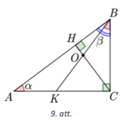
</text>

# <lo-sample/> LV.AMO.2022B.9.4

<text lang="en">
Is it possible to arrange the numbers  
**(A)** $1; 2; 3; 4; 5; 6; 7; 8; 9; 10; 11; 12; 13$;  
**(B)** $1; 2; 3; 4; 5; 6; 7; 8; 9; 10; 11; 12; 13; 14$  
on a circle so that any two adjacent numbers differ by $3$; $4$ or $5$?
</text>

<small>

* Concepted: Integer-numbers, distance
* questionType: Provedisprove
* domain: NT
* LTopic: Ltnumtheoryexamples

</small> 

<text lang="en">
## Solution 

**(A)** We show that it is impossible.  
Note that the numbers $1$; $2$; $3$; $11$; $12$ and $13$ 
cannot stand next to each other because the difference between 
any two of these numbers is not $3$, $4$ or $5$. 
So they should be written on the circle by skipping one position
between any two of them; after that there are there are only two 
adjacent positions left without numbers (Fig.10). 

Number $4$ can be only next to $1$ as their difference is $3$, but 
it cannot be next to any other numbers already written ($2,3,11,12,13$). 
So the number $4$ should take one of the two adjacent unoccupied positions.

Number $10$ can be next to $13$, but it cannot be next to any other 
numbers already written ($1,2,3,11,12$). So, $10$ should take another 
one of the two adjacent unoccupied positions. 
We conclude that numbers $4$ and $10$ should be written 
next to each other, but there is a contradiction with the 
condition of the problem, as their difference is $6$. 
Hence the given numbers cannot be written around the circle so that 
any two adjacent numbers differ by $3$; $4$ or $5$. 

**(B)** Yes, for example, see Fig.11, where the inside of the 
circle shows the difference between any two adjacent numbers.
</text>

# <lo-sample/> LV.AMO.2022B.9.5

<text lang="en">
The floor plan of the art museum shall is a rectangle 
of size **(A)** $8 \times 9$; **(B)** $9 \times 11$ squares, 
where one square corresponds to a single museum room. 
The director of the museum wants to create a visitor route 
that satisfies the following requirements: 

* the route starts in one of the squares (rooms) at the 
  edge of the rectangle; 
* a visitor on his route can move from one square (room) to another 
  square (room), if they share a common side. 
* the visitor enters each square (room) exactly once during the route;
* the route ends in a square (room) at the edge of the rectangle 
  and is located next to the square (room) that started the route.

Can the director of the museum create such route? 
</text>

<small>

* Concept: grid, square-side, rectangle, path
* questionType: Provedisprove, ProveDisprove
* domain: Comb
* LTopic: Ltgraphs

</small> 

<text lang="en">
## Solution 

**(A)** Yes, he can. See, for example, Fig.12. 

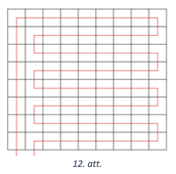{ width=200px }

**(B)** 
We prove that the required route cannot be created. 
Let us color the rectangular squares as a chessboard 
and note that this coloring ensures that any two 
adjacent boxes have different colors. 

Assume by contradiction that such route does exist. 
Since the route passes
through all the squares with odd numbers, the transition 
from white to black or vice versa occurs even number of 
times. Hence, the route will end in a square of the same 
color as the starting square. However, this is impossible,
because that square is next to the square where the route 
started. This is a contradiction and therefore 
no such route exists.
</text>

# <lo-sample/> LV.AMO.2022B.10.1

<text lang="en">
What is the last digit of $2022^{2022}$? 
</text>

<small>
* Concept: power, last-digit
* questionType: Findall
* domain: NT
* LTopic: Ltcongruencemodulo
</small> 

<text lang="en">
## Solution 

We find the last digit of the number by looking at it 
modulo $10$ (finding its remainder when dividing by $10). 
Notice that $2022^{2022} \equiv 2^{2022}(\bmod 10)$. 
So we need to find the last digit of $2^{2022}$. 

The sequence $2^{n}, n=1,2, \ldots$, is periodic modulo $10$. 
Look at its first terms. 

* if $n=1$, then $2^{1} \equiv 2 \pmod {10}$; 
* if $n=2$, then $2^{2} \equiv 4 \pmod {10}$; 
* if $n=3$, then $2^{3} \equiv 8 \pmod {10}$; 
* if $n=4$, then $2^{4} \equiv 16 \equiv 6 \pmod {10}$; 
* If $n=5$, then $2^{5} \equiv 32 \equiv 2 \pmod {10}$. 

This information can be summarized in a table: 

| $n$   | $2^n \pmod {10}$ |
| ----- | ---------------- |
| $1$   | $\mathbf{2}$     |
| $2$   | $4$              |
| $3$   | $8$              |
| $4$   | $6$              |
| $5$   | $\mathbf{2}$     |

We see that the sequence $2^{n}(\bmod 10)$ is periodic
with a period $4$. Since $2022=4 \cdot 505+2$, the sequence 
will make $505$ full periods, and its 
$2022$-th term same as its second term, so it is equal to $4$. 

We conclude that the last digit of $2022^{2022}$ is $4$. 
</text>

<text lang="en">
## Solution 

The last digit of this number is determined by 
finding the congruence class of the number modulo $10$. 
Given that we $2^{4} \equiv 16 \equiv 6(\bmod 10)$ and 
$6^{n} \equiv 6(\bmod 10)$, we get that

$$2022^{2022} \equiv 2^{2022} \equiv 2^{2020} \cdot 2^{2} \equiv\left(2^{4}\right)^{505} \cdot 4 \equiv 6 \cdot 4 \equiv 4 \pmod {10}.$$ 

So the last digit of the number $2022^{2022}$ is $4$.
</text>

# <lo-sample/> LV.AMO.2022B.10.2

<text lang="en">
Consider $n$ consecutive positive integers. 
Can we divide them into two groups so that the sum 
of the numbers in each group is a prime number if 
**(A)** $n = 8$, **(B)** $n = 10$? 
Each group must contain at least $2$ numbers. 
</text>

<small>
* Concept: PRIMES, natural-numbers, disjoint-Sets, sum
* questionType: Provedisprove, ProveDisprove
* domain: NT
* LTopic: For ltnumtheoryexamples, LTDivisibility
</small> 

<text lang="en">
## Solution 

**(A)** Yes, for example, numbers from $1$ to $8$ can be 
divided into the following two groups: 

$$1+2+4=7 \text{ un } 3+5+6+7+8=29$$ 

**(B)** No, it is impossible. Among any $10$ consecutive 
numbers there are $5$ even and $5$ odd numbers, so the sum 
of all $10$ numbers is odd. 
Therefore one of the groups add up to an odd number, 
but another one to an even number. 
As the sums of both groups are larger than $2$, 
the even number cannot be a prime.
</text>

# <lo-sample/> LV.AMO.2022B.10.3

<text lang="en">
There is a right triangle $ACB$; on its hypotenuse $AB$ 
there is a point $O$, which is the centre of a circle 
of radius of $3$ touching both legs (catheti) of the triangle.
Calculate the area of triangle $ACB$, if $OB = 5$.
</text>

<small>
* Concept: right-triangle, area, legs-in-right-triangle, circle, tangent
* questionType: Findall
* domain: Geom
* LTopic: Lttriangles
</small>

<text lang="en">
## Solution 

Denote the points where the circle touches the legs $CB$ and $CA$ by 
$M$ and $N$ respectively (see Fig.13). Since the radius $OM$ is perpendicular 
to the tangent $CB$, the triangle $OMB$ is right. 
By Pitagorean theorem $MB=\sqrt{OB^{2}-MO^{2}}=\sqrt{25-9}=4 \mathrm{~cm}$. 

Since the radii are perpendicular to the tangents and the 
triangle $ACB$ is right, the quadrilateral $ONCM$ has three right angles: 
$\sphericalangle NCM=\sphericalangle CNO=\sphericalangle CMO=90^{\circ}$. 
In this quadrilateral $ONCM$ two sides are the same: $ON=OM$ as two radii, 
so the quadrilateral $ONCM$ is a square and 
$MC=OM=3 \mathrm{~cm}$, $CB=BM+MC=7 \mathrm{~cm}$. 
Note that $\triangle OMB \sim \triangle ACB$ because of the 
condition $\ell \ell$ since they have $\sphericalangle B$
in common and $\sphericalangle OMB=\sphericalangle ACB=90^{\circ}$. 

Then $\frac{AC}{OM}=\frac{CB}{MB'}$, and we get 
$AC=\frac{OM \cdot CB}{MB}=\frac{3 \cdot 7}{4}=5,25 \mathrm{~cm}$. 
Hence $S_{ACB}=\frac{AC \cdot CB}{2}=18 \frac{3}{8} \mathrm{~cm}^{2}$.

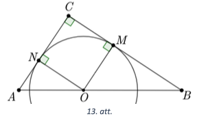
</text>

# <lo-sample/> LV.AMO.2022B.10.4

<text lang="en">
Consider three real numbers $a$, $b$, $c$ with $abc = 1$. 
Prove that the equation 

$$ax^4 + (2b + a)x^2 - 2cx + b^3c + bc + bc^3 = 0$$ 

has no real roots! 
</text>

<small>
* Concept: equation, real-numbers, root
* questionType: Prove
* domain: ALG
* LTopic: The resolution
</small> 

<text lang="en">
## Solution 

Multiply both sides of the equation by $a$ and 
makes equivalent transforms (using $abc=1$): 

$$\begin{gathered}
a^{2} x^{4}+\left(2 a b+a^{2}\right) x^{2}-2 a c x+a b^{3} c+a b c+a b c^{3}=0 \\
a^{2} x^{4}+2 a b x^{2}+a^{2} b^{2}-2 a c x+b^{2}+1+c^{2}=0 \\
\left(a^{2} x^{4}+2 a b x^{2}+b^{2}\right)+\left(a^{2} x^{2}-2 a c x+c^{2}\right)+1=0 \\
\left(a x^{2}+b\right)^{2}+(a x-c)^{2}+1=0
\end{gathered}$$ 

The left side of the last equation is at least $1$, since both 
squares are nonnegative. Hence the equation does not have real roots.
</text>

# <lo-sample/> LV.AMO.2022B.10.5

<text lang="en">
Five deputies (MPs) arrived at a restaurant and some of them shook hands with each other 
before lunch. It is known that if two deputies did not shake hands with each other, 
they did at least five handshakes together. Prove that deputies can be seated around 
a circular table so that each deputy has shaken hands with both people seated next to 
him/her. 
</text>

<small>
* cooked: Graph, Vertex, edge
* questionType: Prove
* domain: Comb
* LTopic: Ltgraphs
</small> 

<text lang="en">
## Solution 

First, let us show that out of any three MPs there are at least two who have shaken hands.
By contradiction, assume that there are three MPs who have not made any handshakes 
between them. Take any two of them - they have made at most four handshakes 
(each with two remaining MPs) - a contradiction. (1) 

Secondly, show that each MP has made at least two handshakes. 
By contradiction, assume that some MP has only done one handshake (or none at all). 
Denote this MP by $X$ and one of the MPs with whom he did not shake hands by $Y$. 
The MP $X$ has done at most one handshake, and MP $Y$ has done at most three 
handshakes (since he did not shake hands with $X$). So together they have 
made at most $4$ handshakes - a contradiction. (2) 

Thirdly, note that if two Members did not shake hands with each other, 
then at least one of them shook hands with all the remaining three. 
Indeed, if both of them would do at most two handshakes, then the pair would 
made at most $2+2=4$ handshakes together. (3) 

Assume that two MPs did not shake hands with each other. (If they all did, 
then they can be seated any way.) Seat those two MPs in places $A$ and $C$ (see Fig.14). 
Let us seat in $C$ the MP who shook hands with everyone else (according to (3) 
that is certainly the case). We will refer to these two Members as $A$ and $C$.

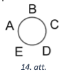 

There are two possibilities: 

* If $A$ has also shaken hands with all three others, then we'll put the remaining 
  ones in places $B$, $D$ and $E$ so that the two who have shaken hands with each other 
  are sitting in places $D$ and $E$ (according to (1) such MPs can be found).
  
* If $A$ has not shaken hands with somebody else (besides $C$), then let us put 
  that deputy in place $E$ (we will call this deputy $E$). 
  Deputy $A$ has certainly shaken hands with the two remaining MPs (otherwise 
  he would have done just one handshake). Deputy $E$ has certainly shaken 
  hands with at least one of the remaining two MPs (otherwise $E$ would have done just one handshake), let's seat this MP in place $D$. At this point the seating around the table 
  is complete and satisfies the requirements. 
</text>

<text lang="en">
## Solution 

If any two deputies did not shake hands with each other, then let's say 
that they hate each other. It follows from the problem that if any two 
deputies hate each other, then there can be at most one more hate relation 
between any of them and the three remaining deputies. 
It easily follows that any deputy can hate at most two other deputies. 
Our task is to seat them around the table so that no two adjacent deputies hate 
each other. 

Assume that there is some deputy who hates two other ones. 
Let us seat this deputy in place $A$ (Fig.14) and the two others he hates -- in 
places $C$ and $D$. (We will also name these deputies $A$, $C$, and $D$ respectively). 
Note that all three of these deputies do not hate any of the two remaining ones. 
Indeed, since $A$ and $C$ hate each other and $A$ hates $D$, 
they ($A$ and $C$) cannnot hate anyone else. The same reasoning applies also to 
$A$ and $D$. So by seating the two remaining members in $B$ and $E$, the requirement 
is satisfied. 

It remains to consider the case where every deputy hates at most one other deputy. 
In this situation we have at most two pairs of deputies who hate each other. 
If they are seated in non-adjacent places (such as $A$-$C$ and also $B$-$D$) 
the requirement is satisfied. 
</text>

# <lo-sample/> LV.AMO.2022B.11.1

<text lang="en">
Can $2022$ be expressed as the sum of cubes of two integers? 
</text>

<small>
* cooked: sum, cube-ALG, integer-numbers
* questionType: Provedisprove
* domain: NT
* LTopic: Ltcongruencemodulo
</small> 

<text lang="en">
## Solution 

We find out what are the integer cubes congruent to modulo $9$: 

* if $n \equiv 0\pmod 9$, then $n^{3} \equiv 0^{3} \equiv 0\pmod 9$; 
* If $n \equiv 1\pmod 9$, $n^{3} \equiv 1^{3} \equiv 1\pmod 9$; 
* if $n \equiv 2\pmod 9$, then $n^{3} \equiv 2^{3} \equiv 8 \equiv-1\pmod 9$; 
* if $n \equiv 3\pmod 9$, then $n^{3} \equiv 3^{3} \equiv 27 \equiv 0\pmod 9$; 
* if $n \equiv 4\pmod 9$, then $n^{3} \equiv 4^{3} \equiv 64 \equiv 1\pmod 9$; 
* if $n \equiv 5 \equiv-4\pmod 9$, then $n^{3} \equiv(-4)^{3} \equiv-1\pmod 9$; 
* if $n \equiv 6 \equiv-3\pmod 9$, then $n^{3} \equiv(-3)^{3} \equiv 0\pmod 9$; 
* if $n \equiv 7 \equiv-2\pmod 9$, then $n^{3} \equiv(-2)^{3} \equiv 1\pmod 9$; 
* if $n \equiv 8 \equiv-1\pmod 9$, then $n^{3} \equiv(-1)^{3} \equiv-1\pmod 9$. 

So integer cubes are congruent to $0$ or to $\pm 1$ modulo $9$. 
Let us find out what can the sum of 
two integer cubes be congruent to modulo $9$. 

| $a^{3}\pmod 9$ | -1 | 0 | 1 |
| :---: | :--- | :--- | :--- |
| $b^{3}\pmod 9$ |  |  |  |
| -1 | -2 | -1 | 0 |
| 0 | -1 | 0 | 1 |
| 1 | 0 | 1 | 2 |

We conclude that the sum of two integer cubes modulo $9$ 
can equal to any value from $-2,-1,0,1,2$, 
but nothing else. Since $2022 \equiv 6 \equiv-3 \pmod 9$ does not equal any of these values, 
the sum of two integer cubes cannot equal $2022$.
</text>

# <lo-sample/> LV.AMO.2022B.11.2

<text lang="en">
For what real values $p$ both roots $x_1,x_2$ 
of the equation $x^2 + x + p = 0$ are such that 
$x_1^2 + x_2^2 = 16$? 
</text>

<small>
* Concept: equation, square-ALG, sum, value
* questionType: Findall
* domain: ALG
* LTopic: The
</small> resolution of ltequations 

<text lang="en">
## Solution 

Let $x_1,x_2$ be the roots of the quadratic equation. 
By Vietas theorem, $x_{1} x_{2}=p$ and $x_{1}+x_{2}=-1s. 

Use the identity for the square of a sum and calculate: 

$$x_{1}^{2}+x_{2}^{2}=\left(x_{1}+x_{2}\right)^{2}-2 x_{1} x_{2}=1-2p=16.$$ 

We conclude that $2p=-15$ and $p=-7.5$.
</text>

# <lo-sample/> LV.AMO.2022B.11.3

<text lang="en">
The circle inscribed into a triangle $ABC$ touches 
edge $AB$ in point $D$ so that $AD = 8$ and $BD = 1$.
Compute the length of side $BC$ if the size 
of angle $\sphericalangle B$ in the triangle is $120^{\circ}$. 
</text>

<small>
* Concept: triangle, inscribed-circle, angle, tangent
* questionType: Findall
* domain: Geom
* LTopic: The resolution
</small>

<text lang="en">
## Solution 

Denote the point where the inscribed circle touches $BC$ 
by $E$ and the point where it touches $AC$ by $F$ (Fig. 15).
Since the same circle touches the sides of $ABC$, the 
tangents are equal: $BD=BE=1$, $AD=AF=8$, and $CE=CF=x$. 

Therefore $AB=9$, $BC=1+x$, $AC=8+x$. 
By cosine theorem, we get 

$$\begin{gathered}
AC^{2} = AB^{2} + BC^{2} - 2 \cdot AB \cdot BC \cdot \cos \sphericalangle B\\
(8+x)^{2}=9^{2}+(1+x)^{2}-2 \cdot 9 \cdot(1+x) \cdot \cos 120^{\circ} \\
64+16 x+x^{2}=81+1+2 x+x^{2}-2 \cdot 9(1+x) \cdot(-0.5) \\
5x=27\\
x=5.4. 
\end{gathered}$$

So $BC=1+x=6.4$.

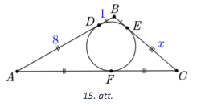
</text>

# <lo-sample/> LV.AMO.2022B.11.4

<text lang="en">
Prove that any positive integer greater than $3$ can be uniquely 
expressed as the sum of three $x,y,z$ ($x \leq y \leq z$) 
positive integers so that the numbers $x$, $y$, $z$ 
satisfy the inequality  

$$x^2 + y^2 + z^2 - xy - yz - xz \leq 1.$$ 
</text>

<small>
* concepted: Inequality, natural-numbers, sum
* questionType: Prove
* domain: NT
* LTopic: Lttransformsnumtheory
</small> 

<text lang="en">
## Solution 

Let us note the following:

$$\begin{gathered}
(x-y)^{2}+(y-z)^{2}+(z-x)^{2}=x^{2}-2 x y+y^{2}+y^{2}-2 y z+z^{2}+z^{2}-2 x z+x^{2}= \\
=2\left(x^{2}+y^{2}+z^{2}-x y-y z-x z\right) \leq 2 \\
\end{gathered}$$

So $(x-y)^{2}+(y-z)^{2}+(z-x)^{2} \leq 2$. 

It follows from the resulting inequality that the only possible 
triplets $(x;y;z)$ satisfying it are $(k;k;k)$, $(k;k;k+1)$ and 
$(k;k+1;k+1)$. This means that the first triplet can express all the 
numbers congruent to $0$ modulo $3$; the second triplet can express
all numbers congruent to $1$ modulo $3$, and the third triplet can 
express all numbers congruent to $2$ modulo $3$. 
You can see that the resulting expression with a sum is 
unique every time.
</text>

# <lo-sample/> LV.AMO.2022B.11.5

<text lang="en">
The floor plan of an art museum is a rectangle with dimensions 
$m \times n$ ($m \geq 2$, $n \geq 2$) squares, where each square 
corresponds to a single museum room. The director of the museum wants
to create a visitor route that satisfies the following requirements: 

* the route starts in one of the squares (rooms) at the edge of the rectangle; 
* a visitor can move from one square (room) to another square (room) 
  if they have a common side; 
* a visitor visits each square (room) exactly once during the route; 
* the route ends in the square (room) next to the edge of the rectangle 
  and next to the square where the route starts. 
  
For what values $m$ and $n$ can the director 
create a route satisfying these requirements?
</text>

<small>
* Concept: grid, square-side, rectangle, path
* questionType: Findall
* domain: Comb
* LTopic: Ltgraphs
</small>

<text lang="en">
## Solution 

The director can create a route as described above 
if and only if $m;n \geq 2$, and at least one of the $m$ 
or $n$ is divisible by $2$. We analyze three cases. 

1. If $m=2$ and $n \geq 2$, rotate the rectangle so that $m=2$ is the number of rows. 
   Create a route like this: the first part leads from the bottom left corner 
   to the bottom right corner (the entire bottom row), then it passes to the 
   top right corner and then goes all the way left until it reaches the top left corner 
   (the entire top row). It is evident that this route satisfies the requirements. 
2. If the $m>2$ is divisible by $2$ and $n>2$, rotate the rectangle so 
   that $m=2k$ ($k \geq 2$) is the number of rows. 
   In order to create a route satisfying the requirements, 
   introduce coordinates for the little squares (rooms), where 
   $(m;n)$ denotes a square with $m$ equal to the row number, and $n$ equal to 
   the column number; $(1;1)$ is the lower left corner. 
   
   Consider a route connecting the following squares consecutively staying inside the 
   same row or the same column: 
   
   * From $(i;2)$ to $(i;n)$,
   * From $(i;n)$ to $(i+1;n)$,
   * From $(i+1;n)$ to $(i+1;2)$,
   * From $(i+1;2)$ to $(i+2 ; 2)$,
   
   where $i$ takes all the values $\{1;3;5;\ldots;m-1=2 k-1\}$. 
   This route will end in the square $(m;2)$. Next, take the route to the $(m;1)$ 
   and then go to $(1;1)$ while staying in the first column. 
   Such route satisfies the requirements. An example of the route is shown in 
   Fig.16 with values $m=4$ and $n=5$:     
   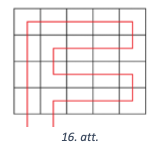   
3. If both $m$ and $n$ are not divisible by $2$ ($m;n \neq 1$), let us 
   show that the required route cannot be completed. 
   We color the squares within the $m \times n$ rectangle in a chessboard pattern and 
   note that adjacent squares always have different colors. 

   By contradiction, assume that the required route exists. 
   As the route passes through all squares (and the total number of squares is odd), 
   the transition from one square to another square occur an even number of times. 
   Consequently, the route will end in a square of the same colour as the starting 
   square. This is impossible, since both squares are next to each other and 
   should have different colors. 
   Consequently, there is no valid route in this case.

As the variables $m$ and $n$ are interchangeable, all cases are analyzed.
</text>

# <lo-sample/> LV.AMO.2022B.12.1

<text lang="en">
Can the number $2023^2$ be expressed as the sum of three integer cubes? 
</text>

<small>

* Concept: integer-numbers, cube-ALG, sum
* questionType: Provedisprove
* domain: NT
* LTopic: Ltcongruencemodulo

</small> 

<text lang="en">
## Solution 

We first find out what the integer cubes are congruent to modulo $9$: 

* if $n \equiv 0 \pmod 9$, then $n^{3} \equiv 0^{3} \equiv 0 \pmod 9$; 
* if $n \equiv 1 \pmod 9$, then $n^{3} \equiv 1^{3} \equiv 1 \pmod 9$; 
* if $n \equiv 2 \pmod 9$, then $n^{3} \equiv 2^{3} \equiv 8 \equiv-1 \pmod 9$; 
* if $n \equiv 3 \pmod 9$, then $n^{3} \equiv 3^{3} \equiv 27 \equiv 0 \pmod 9$; 
* if $n \equiv 4 \pmod 9$, then $n^{3} \equiv 4^{3} \equiv 64 \equiv 1 \pmod 9$; 
* if $n \equiv 5 \equiv-4 \pmod 9$, then $n^{3} \equiv(-4)^{3} \equiv-4^{3} \equiv-1 \pmod 9$; 
* if $n \equiv 6 \equiv-3 \pmod 9$, then $n^{3} \equiv(-3)^{3} \equiv 0 \pmod 9$; 
* if $n \equiv 7 \equiv-2 \pmod 9$, then $n^{3} \equiv(-2)^{3} \equiv 1 \pmod 9$; 
* if $n \equiv 8 \equiv-1 \pmod 9$, then $n^{3} \equiv(-1)^{3} \equiv-1 \pmod 9$.

So integer cubes are congruent to $0$ or $\pm 1$ modulo $9$. 
Let us consider what is the sum of two integer cubes congruent to modulo $9$: 

| $a^{3} \pmod 9$ | $-1$  | $0$   | $1$   |
| :-------------: | :---- | :---- | :---- |
| $b^{3} \pmod 9$ | $-2$  | $-1$  | $0$   |
| $-1$            | $-1$  | $0$   | $1$   |
| $0$             | $0$   | $1$   | $2$   |
| $1$             |       |       |       |

Next, consider what is the sum of three integer cubes modulo $9$. 

| $a^{3}+b^{3} \pmod 9$ | $-1$  | $0$   | $1$   | $-2$  | $2$   |
| :-------------------: | :---- | :---- | :---- | :---- | :---- |
| $-1$                  | $-2$  | $-1$  | $0$   | $-3$  | $1$   |
| $0$                   | $-1$  | $0$   | $1$   | $-2$  | $2$   |
| $1$                   | $0$   | $1$   | $2$   | $-1$  | $3$   |

We conclude that the sum of three integer cubes modulo $9$ can take any of the values 
$-3 ;-2 ;-1 ; 0 ; 1 ; 2 ; 3$ and nothing else. 
As $2023^{2} \equiv 7^{2} \equiv 4 \equiv-5 \pmod 9$ does not appear among these values, 
the sum of three whole skaitḷu cubes cannot be $2023^{2}$.
</text>

# <lo-sample/> LV.AMO.2022B.12.2

<text lang="en">
For what real values $p$ the sum of cubes of both roots of the equation $x^2 + x + p$ is equal to $(-16)$? 
</text>

<small>
* Concept: real-numbers, cube-ALG, equation
* questionType: Findall
* domain: ALG
* LTopic: The
</small> 

<text lang="en">
## Solution 

Denote the roots of the square equation with $x_{1}$ and $x_{2}$. 
Vietas theorem states that $x_{1} x_{2}=p$ and $x_{1}+x_{2}=-1$. Using the 
identy for the square of sum: 

$$x_{1}^{2}+x_{2}^{2} = \left(x_{1}+x_{2}\right)^{2} - 2x_{1}x_{2} = 1-2p.$$ 

The sum of cubes: 

$$x_{1}^{3}+x_{2}^{3} = \left(x_{1}+x_{2}\right)\left( x_{1}^{2}-x_{1} x_{2}+x_{2}^{2} \right )= -1(1-2p-p) = 3p-1 = -16.$$ 

So $3p=-15$ and $p=-5$.
</text>

# <lo-sample/> LV.AMO.2022B.12.3

<text lang="en">
In triangle $ABC$ the length of altitude drawn from $A$ is $1$. 
The median drawn from $C$ also has length $1$, but the altitude drawn from $B$ 
has length $\sqrt{3}$. What can be the area of this triangle? 
</text>

<small>
* Concepted: triangle, Median, altitude, area
* questionType: Findall
* domain: Geom
* LTopic: The lttriangles
</small> 

<text lang="en">
## Solution 

Let $M$ be the midpoint of $AB$. Draw perpendiculars $MP$ and $MT$ against 
the sides $AC$ and $BC$ respectively. Let $Q$ and $N$ be the feet of 
altitudes of $ABC$ drawn from the vertices $A$ and $B$ respectively. 
Since $MT \perp BC$ and $AQ \perp BC$, we have $MT \| AQ$. 
Therefore $MT$ is the midsegment of $AQB$, and therefore 
$MT=\frac{1}{2} AQ=\frac{1}{2}$. Similarly, we get that 
$MP=\frac{1}{2} BN=\frac{\sqrt{3}}{2}$. 

Note that for the right triangle $MTC$ we have 
$\sin \sphericalangle MCT = \frac{MT}{MC} = \frac{1}{2}$, therefore 
$\sphericalangle MCT = 30^{\circ}$. 
Similarly, in the right triangle $MPC$ we have 
$\sin \sphericalangle MCP = \frac{MP}{MC}=\frac{\sqrt{3}}{2}$, hence 
$\sphericalangle MCP=60^{\circ}$. 

Consider the possible values of $\sphericalangle MCB$: 

* If $T$ is on $BC$, then $\sphericalangle MCB = 30^{\circ}$; 
* If $T$ is on the extension of $BC$, $\sphericalangle MCB = 150^{\circ}$. 

As $\sphericalangle ACB=\sphericalangle MCA+\sphericalangle MCB$, it is impossible 
to have $\sphericalangle MCB=150^{\circ}$, since $\sphericalangle ACB$ would 
be at least $180^{\circ}$ for any value of $\sphericalangle MCB$. 
Hence $\sphericalangle MCB=30^{\circ}$. Analyze the values of 
$\sphericalangle MCA$ and $\sphericalangle ACB$ values similarly: 

* if $P$ is on $AC$, then $\sphericalangle MCA=60^{\circ}$ and 
  $\sphericalangle ACB=90^{\circ}$ 
* if $P$ is on the extension of $AC$, then $\sphericalangle MCA = 120^{\circ}$ 
  and $\sphericalangle ACB=150^{\circ}$. 
  
If $\sphericalangle ACB=90^{\circ}$ (see Fig.17), the altitudes from  
vertices $A$ and $B$ coincide with the catheti (i.e. legs) $AC$ and $BC$, so

$$S_{ABC}=\frac{AC \cdot BC}{2}=\frac{1 \cdot \sqrt{3}}{2}=\frac{\sqrt{3}}{2}.$$ 

If $\sphericalangle ACB=150^{\circ}$ (see Fig.18), consider the right 
triangle $AQC$ where $\sphericalangle ACQ = 30^{\circ}$, hence 
$\frac{AQ}{AC}=\sin \sphericalangle ACQ=\frac{1}{2}$. 
It follows that $AC = 2 \cdot AQ=2$ and 

$$S_{ABC}=\frac{AC \cdot BN}{2}=2 \cdot \frac{\sqrt{3}}{2}=\sqrt{3}.$$ 

Therefore the area of the triangle can be either $\frac{\sqrt{3}}{2}$ or $\sqrt{3}$.

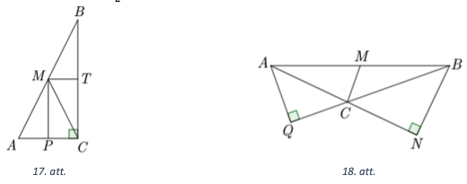
</text>

# <lo-sample/> LV.AMO.2022B.12.4

<text lang="en">
Solve the equation $3 \sin x + 4 \cos x = 6$ in real numbers.
</text>

<small>
* Concept: equation, real-numbers, sine, cosine
* questionType: Findall
* domain: ALG
* LTopic: The resolution
</small> 

<text lang="en">
## Solution 

Divide both sides of the equation by $5$: 

$$\frac{3}{5} \sin x+\frac{4}{5} \cos x=\frac{6}{5}.$$ 

Choose an acute angle $\alpha$ such that $\sin \alpha=\frac{4}{5}$. 
In this case $\cos \alpha = \sqrt{1-\sin ^{2} \alpha} = \sqrt{1-\left(\frac{4}{5}\right)^{2}}=\frac{3}{5}$ and the equation becomes 

$$\begin{gathered}
\sin x \cos \alpha+\cos x \sin \alpha=\frac{6}{5} \\
\sin (x+\alpha)=\frac{6}{5}
\end{gathered}$$ 

Sine values never exceed $1$, so there are no solutions for this equation. 
And there is no solution for the original equation either.
</text>

<text lang="en">
## Solution 

Use double angle formulas and the identity $\cos ^{2} \frac{x}{2}+\sin ^{2} \frac{x}{2}=1$. 
we get 

$$\begin{gathered}
3 \cdot 2 \sin \frac{x}{2} \cos \frac{x}{2}+4\left(\cos ^{2} \frac{x}{2}-\sin ^{2} \frac{x}{2}\right)=6\left(\cos ^{2} \frac{x}{2}+\sin ^{2} \frac{x}{2}\right), \\
6 \sin \frac{x}{2} \cos \frac{x}{2}+4 \cos ^{2} \frac{x}{2}-4 \sin ^{2} \frac{x}{2}=6 \cos ^{2} \frac{x}{2}+6 \sin ^{2} \frac{x}{2}, \\
2 \cos ^{2} \frac{x}{2}-6 \sin \frac{x}{2} \cos \frac{x}{2}+10 \sin ^{2} \frac{x}{2}=0.
\end{gathered}$$

Now divide both sides of the last equation by $2 \sin ^{2} \frac{x}{2} \neq 0$:

$$\operatorname{ctg}^{2} \frac{x}{2}-3 \operatorname{ctg} \frac{x}{2}+5=0.$$

Denote $\operatorname{ctg}^{2} = t$, get a quadratic equation $t^{2}-3t+5=0$. 
Its discriminant $D=(-3)^{2}-4 \cdot 1 \cdot 5=-11<0$, so there are 
no roots. Hence there is no solution for the original equation. 
</text>

<text lang="en">
## Solution 

Subtract $4 \cos x$ from both sides and get $3 \sin x=6-4 \cos x$. 
Raise both sides to the second power to get the following:

$$9 \sin ^{2} x=36-48 \cos x+16 \cos ^{2} x$$

Use the identity $\sin ^{2} x=1-\cos ^{2} x$ to rewrite like this:

$$\begin{gathered}
9\left(1-\cos ^{2} x\right)=36-48 \cos x+16 \cos ^{2} x, \\
9-9 \cos ^{2} x=36-48 \cos x+16 \cos ^{2} x, \\
25 \cos ^{2} x-48 \cos x+27=0. 
\end{gathered}$$

Denote $\cos x=t$ to get a quadratic equation $25t^2 - 48t + 27 = 0$ and 
discriminant $D=(-48)^{2}-4 \cdot 25 \cdot 27=48 \cdot 48-50 \cdot 54<0$. 
So the quadratic equation has no roots, and the original equation has no roots either. 
</text>

<text lang="en">
## Solution 

We will prove the following inequality: $a \sin x+b \cos x \leq \sqrt{a^{2}+b^{2}}$. 
Raise both sides of the inequality to the power two and use the 
identity $\sin ^{2} x+\cos ^{2} x=1$. We get the following inequalities: 

$$\begin{gathered}
(a \sin x+b \cos x)^{2} \leq\left(a^{2}+b^{2}\right)\left(\sin ^{2} x+\cos ^{2} x\right) \\
a^{2} \sin ^{2} x+2 a b \sin x \cos x+b \cos ^{2} x \leq a^{2} \sin ^{2} x+a^{2} \cos ^{2} x+b^{2} \sin ^{2} x+b^{2} \cos ^{2} x \\
0 \leq a^{2} \cos ^{2} x-2 a b \sin x \cos x+b^{2} \sin ^{2} x \\
(a \cos x-b \sin x)^{2} \geq 0
\end{gathered}$$

The last inequality is true for any $a, b$ and $x$. 
Therefore the initial inequality $a \sin x+b \cos x \leq \sqrt{a^{2}+b^{2}}$ is true as well. 
It follows that $3 \sin x+4 \cos x \leq \sqrt{3^{2}+4^{2}}=5$, 
and therefore the original equation has no roots. 
</text>

# <lo-sample/> LV.AMO.2022B.12.5

<text lang="en">
A table consists of $n \times n$ little squares. Ilmārs and Kims play the following 
game. They make alternating moves: in every move a player enters either 
$1$ or $-1$ in some little square that was empty so far. 
Ilmārs makes the first move. If a row or a column is completely filled in 
after some player's move, we calculate the product of the numbers in the row or column. 
If the product equals $-1$ then the player who completed that row/column gets $1$ point.
(If a player completed a row and a column at the same time, 
and both products were $-1$, then he scores two points). 
The game ends when all squares in the table are filled in. 
The player who gets more points wins. Which player has a winning strategy, if
**(A)** $n = 2021$; **(B)** $n = 2022$? 
</text>

<small>
* Concept: game, table, row, column, product, winning-strategy
* questionType: Provedisprove
* domain: Comb
* LTopic: Ltgames
</small> 

<text lang="en">
## Solution 

**(A)** 
If $n=2021$, Ilmārs wins. In his first move, he enters $-1$ in the central 
square; in all subsequent moves he plays symmetrically -- he writes the 
same number as Kim in the square located symmetrically against the center 
of the table. Whenever Kim scores a point after his move, Ilmārs will 
also score a point as he also fills a row/column on the opposite side. 
So Ilmārs will score just as many points as Kim. Additionally, 
note that Ilmārs will be the one who completes the middle row and the middle column,  
since he can always answer symmetrically to any Kim's move in that row or column. 
All numbers in the middle row and the middle column will be symmetrical, 
except the middle $-1$ that was recorded at the very beginning. 
So the product in the middle row/column will be $-1$, and Ilmārs will score 
extra $2$ points allowing him to win. 

**(B)** 
If $n=2022$, Kim wins. He repeats every number written by Ilmārs symmetrically 
against the vertical axis of symmetry in the table. The only exceptions 
are the moments when he has to make the last move in some row with exactly 
one empty square. In such cases he does not repeat the move of Ilmārs, but 
chooses a number to get the product on that row equal to $-1$. 
Because of symmetry, Kim will always be the one to fill a row, 
and this strategy will guarantee him $2022$ points -- one per every row. 
Additionally, note that every time Ilmārs completes a column, 
Kim will complete the symmetric column in his next move. 
As a result, Ilmārs will complete exactly $1011$ columns that gives him 
at most $1011$ points. Therefore Kim will win.
</text>