# <lo-sample/> LV.AMO.2022B.5.1

<text lang="lv">
Kāds ir mazākais naturālais skaitlis, kura pierakstā izmantoti tikai 
cipari $0$ un $2$ un kurš dalās ar $15$?
</text>

<text lang="en">
What is the smallest positive integer that uses only the digits $0$ and $2$ in its 
notation and is divisible by $15$?
</text>

<small>

* concepts:divisibility,digit
* questionType:FindOptimal
* domain:NT
* subdomain:NumeralSystems
* topic:DivisibilityRulesLastDigits
* topic:DivisibilityRulesFor3And9
* topic:DecimalNotationDigits

</small>

<text num="1" lang="lv">
## Atrisinājums

Pamatosim, ka mazākais skaitlis, kas atbilst nosacijumiem ir $2220$. 
Lai skaitlis dalītos ar $15$, tam jādalās gan ar $3$, gan ar $5$. 
Lai skaitlis dalītos ar $3$, tā ciparu summai jādalās ar $3$. 
Tātad ciparam $2$ šajā skaitlī jāparādās vismaz $3$ reizes. 
Lai uzdevumā aprakstītais skaitlis dalītos ar 5, 
tā pēdējam ciparam jābūt $0$. Līdz ar to meklētajam skaitlim ir vismaz $4$ 
cipari un šis skaitlis ir $2220$.
</text>

<text num="1" lang="en">
## Solution

We show that the smallest number satisfying the conditions is $2220$. 
For a number to be divisible by $15$, it must be divisible by 
$3$ and $5$. To be divisible by $3$, the sum of its digits must be divisible by $3$.
So the number $2$ must appear at least $3$ times in that number.

To be divisible by $5$, the last digit of this number must be $0$. 
Consequently, the smallest number with that property has at least $4$ digits and equals $2220$.
</text>

    
# <lo-sample/> LV.AMO.2022B.5.2

<text lang="lv">
Pa rūtiņu līnijām uzzīmē tādu sešstūri, kuram perimetra un laukuma vērtības sakrīt!  
*Piezīme.* Laukums ir sešstūri veidojošo rūtiņu skaits un perimetrs ir 
rūtiņu malu, kas pilnībā atrodas uz robežas, skaits.
</text>

<text lang="en">
Draw a hexagon with its sides on a square grid having perimeter equal to its area!  
*Note:* The area is the number of little squares that make up the hexagon and the 
perimeter is the number of sides of the little squares on its border.
</text>

<small>

* concepts:area,perimeter,grid,hexagon,square-side
* questionType:FindExample
* domain:Geom
* subdomain:Polygons
* topic:SquareGridShapes
* topic:PolygonPerimeter
* topic:Area

</small>

<text num="1" lang="lv">
## Atrisinājums

Piemēram, der 1.att. redzamais sešstūris, kuram perimetrs ir 
$20$ un arī laukums ir $20$.

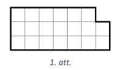
</text>

<text num="1" lang="en">
## Solution

Consider the hexagon shown in Fig.1. Its perimeter is $20$ and the area is also $20$.

</text>

    
# <lo-sample/> LV.AMO.2022B.5.3

<text lang="lv">
Uz teātra izrādi tika izgatavotas $250$ biļetes un vismaz puse 
no biļetēm tika pārdotas. Zināms, ka tieši trešdaļa
no skatītājiem bija skolēni, tieši piektdaļa – studenti un tieši 
septītdaļa – pensionāri. Cik biļetes tika pārdotas?
</text>

<text lang="en">
$250$ tickets were made for the theatre performance and at least half of them were sold. It is known that exactly a third of the audience were schoolchildren, exactly one fifth of the audience were students and exactly one-seventh were retirees. How many tickets were sold? 
</text>

<small>

* concepts:fractions,at-least
* questionType:FindAll
* domain:NT
* subdomain:Divisibility
* topic:MutualPrimes
* topic:ArithmeticSeriesDivisibility

</small>

<text num="1" lang="lv">
## Atrisinājums

Lai skatītāju skaitu varētu sadalīt tieši trīs, piecās un 
septiņās daļās, pārdoto biļešu skaitam jādalās ar $3$, $5$ un $7$. 
Tātad pārdoto biļešu skaitam jādalās ar $3 \cdot 5 \cdot 7=105$. 
Tā kā vismaz puse no biļetēm tika pārdotas, tad tika pārdotas 
$105 \cdot 2=210$ biļetes.
</text>

<text num="1" lang="en">
## Solution 

*Answer.* $210$ tickets were sold.

To divide viewership into three, into five, and 
into seven equal parts, the number of tickets sold 
should be divisible by $3$, $5$, and $7$. 
So the number of tickets sold should be divisible 
by $3 \cdot 5 \cdot 7=105$. Since at least half of the tickets 
were sold, the number of sold tickets is between $125$ and $250$. 
The only number divisible by $105$ in this interval is $210$.
</text>

    
# <lo-sample/> LV.AMO.2022B.5.4

<text lang="lv">
Zināms, ka svari (a), (b) un (c) atrodas līdzsvarā. 
Cik bultiņu jāliek jautājuma zīmes vietā, lai svari (d) atrastos
līdzsvarā? Atbildi pamatot!  
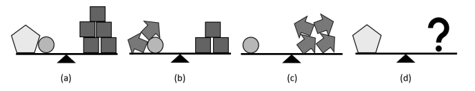
</text>

<text lang="en">
The balance scales (a), (b) and (c) are all in equilibrium. 
How many arrows should be put in the place of the question mark so that the 
balance scale (d) is also in equilibrium? Justify your answer!

</text>

<small>

* concepts:equality,pentagon
* questionType:FindAll
* domain:Alg
* subdomain:EquationSystems
* topic:SystemsSubstituteVariables

</small>

<text num="1" lang="lv">
## Atrisinājums

Jautājuma zīmes vietā jāliek sešas bultiņas. Izteiksim visu figūru 
masu bultiņās. No tā, ka svari (c) atrodas līdzsvarā, secinām, 
ka aplīša masa ir vienāda ar četru bultiņu masu.

Līdz ar to varam uzskatīt, ka svariem (b) kreisajā kausā atrodas 
sešas bultiņas, kas sver tikpat, cik trīs kvadrāti. Tātad viena kvadrāta 
masa ir tikpat, cik divu bultiņu masa.

Tālāk apskatām svarus (a). Aizvietojot aplīti ar četrām bultiņām un 
katru kvadrātu ar divām bultiņām, iegūstam, ka piecstūra un četru bultiņu 
masa ir tikpat, cik desmit bultiņu masa. Tātad piecstūra masa ir 
tikpat, cik sešu bultiņu masa.
</text>

<text num="1" lang="en">
## Solution

We need to place six arrows instead of the question mark. 
Let's express the mass of all the figures in "arrow units". 
From the balance (c), we conclude that the mass of the circle is 
four arrows. Consequently, the left side of 
balance (b) equals to six arrows that weigh 
as much as three squares. So the mass of one square is 
two arrows. 

Next, consider balance (a). By replacing the circle with four arrows 
and each square with two arrows, we get that the mass of the 
pentagon plus four arrows is ten arrows. 
So the mass of the pentagon alone is six arrows.
</text>

    
# <lo-sample/> LV.AMO.2022B.5.5

<text lang="lv">
Katrai no trīs meitenēm Elīnai, Gunai un Marutai patīk viena no krāsām: 
zaļa, dzeltena, oranža (katrai cita krāsa),
bet abas pārējās krāsas nepatīk. Zināms, ka tieši viens no apgalvojumiem ir patiess:

* Gunai nepatīk oranža krāsa;
* Elīnai nepatīk zaļa krāsa;
* Elīnai nepatīk oranža krāsa.

Kāda krāsa patīk katrai meitenei? Atbildi pamatot!
</text>

<text lang="en">
Each of the three girls, Elina, Guna and Maruta likes 
some color - either green, yellow, or orange. 
Each girl likes a different color, and dislikes the 
remaining two colors. 
Exactly one of the following claims is known to be true: 

* Guna doesn't like orange; 
* Elina doesn't like green; 
* Elina doesn't like orange. 

What colour does every girl like? Justify your answer!
</text>

<small>

* concepts:true-statement
* questionType:FindAll
* domain:Comb
* subdomain:Logic
* topic:PartitioningInPairsBijections

</small>

<text num="1" lang="lv">
## Atrisinājums

Gunai patīk oranžā, Elīnai - zalā un Marutai - dzeltenā krāsa.

Skaidrs, ka vismaz viens no diviem pēdējiem apgalvojumiem ir patiess, 
jo Elīnai nevar patikt gan zaļā, gan oranžā krāsa. Tā kā kopā 
ir tikai viens patiess apgalvojums, tad pirmais apgalvojums 
noteikti ir aplams un Gunai patīk oranžā krāsa.

Ja Elīnai patiktu dzeltenā krāsa, tad abi pēdējie apgalvojumi 
būtu patiesi, kas nav iespējams. Tā kā Gunai patīk oranžā krāsa, 
tad secinām, ka Elīnai patīk zalā krāsa. Tātad Marutai patīk dzeltenā krāsa.
</text>

<text num="1" lang="en">
## Solution 

Guna likes orange, Elina likes green, and Maruta likes yellow. 
At least one of the last two claims must be true since Elina cannot 
like both green and orange. As there is only one true statement, 
the first statement is certainly false, meaning Guna
actually likes orange. 

If Elina liked yellow, then the two last statements 
would both be true, which is impossible. Since Guna likes orange, 
we conclude that Elina likes the green. Thus, Maruta is left with
yellow.
</text>

    
# <lo-sample/> LV.AMO.2022B.6.1

<text lang="lv">
Uz papīra lapas uzrakstīti visi naturālie skaitļi no $1$ līdz $2022$ (katrs vienu reizi). 
Vispirms Amanda ar sarkanu zīmuli apvilka visus skaitļus, kas dalās ar $3$. 
Tad viņa ar zilu zīmuli apvilka visus skaitļus, kas dalās ar $5$. 
Un visbeidzot viņa ar zaļu zīmuli apvilka visus skaitļus, kas dalās ar $7$. 
Cik ir tādu skaitļu, kas ir apvilkti ar vismaz divām dažādām krāsām?
</text>

<text lang="en">
All positive integers from $1$ to $2022$ are 
written on a piece of paper, each appearing once. 
First, Amanda circled all the numbers 
divisible by $3$ in red. She then circled all the 
numbers divisible by $5$ in blue. Finally, 
she circled all the numbers divisible by $7$ in 
green. 
How many numbers are circled with at 
least two different colors? 
</text>

<small>

* concepts:natural-numbers,divisibility
* questionType:FindCount
* domain:NT
* subdomain:Divisibility
* topic:OtherCountingSetOperations
* topic:MutualPrimes

</small>

<text num="1" lang="lv">
## Atrisinājums

Pamatosim, ka $249$ skaitlii ir apvilkti ar vismaz divu krāsu zīmuļiem.

Lai kāds skaitlis būtu apvilkts ar vismaz divu krāsu zīmuļiem, 
nepieciešams aplūkot visus skaitļus, kas dalās vismaz ar diviem 
no dotajiem skaitliem $3$, $5$ vai $7$.

Ja skaitlis dalās ar $3$ un $5$, tad tas dalās ar $15$. 
Tā kā $2022=15 \cdot 134+12$, tad ar $15$ dalās $134$ skaiți no visiem uzrakstītajiem skaitliem.

Ja skaitlis dalās ar $3$ un $7$, tad tas dalās ar $21$. 
Tā kā $2022=21 \cdot 96+6$, tad ar 21 dalās 96 skaitli no visiem uzrakstītajiem skaitliem.

Ja skaitlis dalās ar $5$ un $7$, tad tas dalās ar $35$. Tā kā 
$2022=35 \cdot 57+27$, tad ar $35$ dalās $57$ skaitli no visiem uzrakstītajiem skaitliem.

Ievērojam, ka ir vairāki skaitli, kas vienlaicīgi dalās ar $3$, $5$ un $7$, 
tātad tie dalās arī ar $3 \cdot 5 \cdot 7=105$. Tā kā $2022 = 105 \cdot 19 + 27$, 
tad ar $105$ dalās $19$ skaitļi no visiem uzrakstītajiem skaitļiem. 
Skaitļi, kas dalās ar $105$, tiek ieskaitīti pie skaitļiem, kas dalās ar 
$15$, $21$ un $35$, tātad tie tiek ieskaitīti trīs reizes. 
Secinām, ka kopā ir $134+96+57-38 = 249$ skaitļi, kas dalās ar 
vismaz diviem skaitlliem, tātad tie ir apvilkti ar vismaz divu krāsu zīmuļiem.
</text>

<text num="1" lang="en">
## Solution

We show that $249$ numbers are circled with at least two colors.

We look at all numbers divisible by at least two of the given
numbers $3$, $5$, or $7$. 

* If a number is divisible by  $3$ and $5$, it is divisible by $15$. 
  Since $2022=15 \cdot 134+12$, there are $134$ numbers divisible by $15$. 
* If a number is divisible by $3$ and $7$, it is divisible by $21$. 
  Since $2022=21 \cdot 96+6$, there are $96$ numbers divisible by $21$ 
  out of those written on the paper. 
* If a number is divisible by $5$ and $7$, it is divisible by $35$. 
  Since $2022=35 \cdot 57+27$, there are $57$ numbers divisible by $35$. 
  
Note that there are several numbers divisible by all three numbers 
$3$, $5$, and $7$, so they are divisible by $3 \cdot 5 \cdot 7=105$. 
Since $2022 = 105 \cdot 19 + 27$, there are altogether $19$ 
numbers divisible by $105$. The numbers divisible by $105$ 
were counted as numbers divisible by $15$, $21$, and $35$. 
So they were counted three times. We conclude that together there are 
$134 + 96 + 57 - 2 \cdot 19 = 249$ numbers divisible by at least two 
numbers out of $3$, $5$, $7$, so they are circled with at least two colors.
</text>

    
# <lo-sample/> LV.AMO.2022B.6.2

<text lang="lv">
Parādi, kā no 1. att. dotās rūtiņu lapas var izgriezt desmit figūras, 
kādas dotas 2. att. (iezīmē, kur jāiet griezuma līnijām)! 
Figūras var būt arī pagrieztas.  
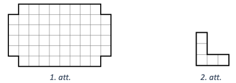
</text>

<text lang="en">
Show how to cut ten shapes (as in Fig.2) from the given piece 
of grid paper (see  Fig. 1).
(Mark the lines where cuts should be made!) 
The figures can also be rotated. 

</text>

<small>

* concepts:grid,shape,rotation
* questionType:FindExample
* domain:Geom
* subdomain:CuttingCoversColoring
* topic:SquareGridCutting
* topic:RotationBy90

</small>

<text num="1" lang="lv">
## Atrisinājums

Skat., piemēram, 4. att.

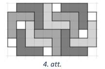
</text>

<text num="1" lang="en">
## Solution 

See, for example, Fig.4.

</text>

    
# <lo-sample/> LV.AMO.2022B.6.3

<text lang="lv">
Tumšā rudens vakarā Māris izdomāja saskaitīt visus naturālos skaitļus 
no $1$ līdz $n$, kur $n$ ir kāds naturāls skaitlis.
Vai var gadīties, ka Māris ieguva summu, kuras pēdējais cipars ir
**(A)** $8$, **(B)** $9$?
</text>

<text lang="en">
On a dark autumn night, Maris decided to add up all the 
positive integers from $1$ to $n$, where $n$ is some positive integer.
Could it happen that Maris gets a sum whose last digit is  
**(A)** $8$, **(B)** $9$?
</text>

<small>

* concepts:natural-numbers,sum,last-digit
* questionType:ProveDisprove,ProveDisprove
* domain:NT
* subdomain:Congruences
* topic:PeriodicRemainders
* topic:SeriesOneToNSum

</small>

<text num="1" lang="lv">
## Atrisinājums

**(A)** Jā, var, piemēram, $1+2+3+4+5+6+7=28$.

**(B)** Nē, nevar. Apskatām skaitlu summu $S_{n}$ dažām $n$ vērtībām:

* $S_{1}=1$
* $S_{2}=1+2=3$
* $S_{3}=1+2+3=6$
* $S_{4}=1+2+3+4=S_{3}+4=6+4=10$
* $S_{5}=1+2+3+4+5=S_{4}+5=10+5=15$
* $S_{6}=S_{5}+6=15+6=21$
* $\circ$...

Izveidosim tabulu, kurā rakstīsim skaitļa $n$ pēdējo ciparu un 
skaitļu summas $S_{n}$ pēdējo ciparu. Ievērojam, ka summas 
$S_{n}$ pēdējo ciparu iegūstam, ja iepriekšējās summas pēdējam 
ciparam pieskaitām skaitļa $n$ pēdējo ciparu.

| Skaitļa $n$ pēdējais cipars | Summas $S_{n}$ pēdējais cipars |
| --------------------------- | ------------------------------ |
| $\mathbf{1}$                | $\mathbf{1}$                   |
| 2                           | 3                              |
| 3                           | 6                              |
| 4                           | 0                              |
| 5                           | 5                              |
| 6                           | 1                              |
| 7                           | 8                              |
| 8                           | 6                              |
| 9                           | 5                              |
| 0                           | 5                              |
| 1                           | 6                              |
| 2                           | 8                              |
| 3                           | 1                              |
| 4                           | 5                              |
| 5                           | 0                              |
| 6                           | 6                              |
| 7                           | 3                              |
| 8                           | 1                              |
| 9                           | 0                              |
| 0                           | 0                              |
| $\mathbf{1}$                | $\mathbf{1}$                   |

Tā kā tabulas pēdējā rindiņā skaitla $n$ un summas $S_{n}$ 
pēdējie cipari ir tādi paši kā pirmajā, tad tālāk vērtības tabulā sāks 
periodiski atkārtoties. Cipars $9$ nav tabulas otrajā kolonnā, 
tāpēc tas nevar būt summas pēdējais cipars.
</text>

<text num="1" lang="en">
## Solution 

**(A)**  
Yes, he can. For example, be $1+2+3+4+5+6+7=28$. 

**(B)** 
No, he cannot. Here's a list of the sums $S_{n}$ for 
some small $n$: 

* $S_{1}=1$ 
* $S_{2}=1+2=3$ 
* $S_{3}=1+2+3=6$ 
* $S_{4}=1+2+3+4=S_{3}+4=6+4=10$ 
* $S_{5}=1+2+3+4+5=S_{4}+5=10+5=15$ 
* $S_{6}=S_{5}+6=15+6=21$ 
* $\circ$... 

Let's create a table showing the last digit 
of the number $n$ and the last digit of the sum $S_{n}$. 
Note that we can compute the last digit of the sum 
$S_{n}$ by adding the last digit of the previous 
sum to the last digit of $n$. 

| The last digit of $n$       | The last digit of $S_n$        | 
| --------------------------- | ------------------------------ |
| $\mathbf{1}$                | $\mathbf{1}$                   |
| 2                           | 3                              |
| 3                           | 6                              |
| 4                           | 0                              |
| 5                           | 5                              |
| 6                           | 1                              |
| 7                           | 8                              |
| 8                           | 6                              |
| 9                           | 5                              |
| 0                           | 5                              |
| 1                           | 6                              |
| 2                           | 8                              |
| 3                           | 1                              |
| 4                           | 5                              |
| 5                           | 0                              |
| 6                           | 6                              |
| 7                           | 3                              |
| 8                           | 1                              |
| 9                           | 0                              |
| 0                           | 0                              |
| $\mathbf{1}$                | $\mathbf{1}$                   |

Since the last digit of $n$ and the last digit of
the sum $S_{n}$ in the last row of this table 
are the same two numbers as in the first row, 
the values in the table will start repeating 
periodically. 
The digit $9$ never appears in the second column 
of the table, so it cannot be the last digit of any sum $S_n$.
</text>

    
# <lo-sample/> LV.AMO.2022B.6.4

<text lang="lv">
Zināms, ka svari (a), (b) un (c) atrodas līdzsvarā. Cik aplīšu jāliek jautājuma zīmes vietā, lai svari (d) atrastos
līdzsvarā? Atbildi pamatot!  
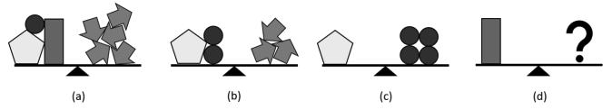
</text>

<text lang="en">
The balance scales (a), (b) and (c) are known to be in equilibirum. 
How many circles should you put in place of the question mark so that the balance scale 
(d) is also in equilibrium? Justify your answer!

 
</text>

<small>

* concepts:equality
* questionType:FindAll
* domain:Alg
* subdomain:EquationSystems
* topic:SystemsSubstituteVariables

</small>

<text num="1" lang="lv">
## Atrisinājums

Jautājuma zīmes vietā jāliek pieci aplǐši. Izteiksim visu figūru 
masu aplīšos. No tā, ka svari (c) atrodas līdzsvarā, secinām, 
ka piecstūra masa ir vienāda ar četru aplīšu masu.

Tātad varam uzskatīt, ka svariem (b) kreisajā kausā atrodas seši aplīši, 
kuru masa ir tikpat, cik trīs bultiņu masa. Tātad vienas bultiņas 
masa ir tikpat, cik divu aplīšu masa.

Tālāk apskatīsim svarus (a). Aizvietojot piecstūri ar četriem 
aplīšiem un katru bultiņu ar diviem aplīšiem, iegūstam, ka 
četrstūra un piecu aplīšu masa ir tikpat, cik desmit aplīšu masa. 
Tātad četrstūra masa ir tikpat, cik piecu aplīšu masa.
</text>

<text num="1" lang="en">
## Solution

*Answer.* The question mark should be replaced by five circles. 

We express the mass of all the shapes in "circle units". 
From the balance (c) we conclude that the mass of the pentagon 
equals to four circles. Thus the balance scale (b) has six circles 
on the left side, and this is the same as the mass of three arrows. 
So the mass of a single arrow equals to two circles. 

Next, consider the balance scale (a). By replacing the pentagon with 
four circles and each arrow with two circles, we get that the mass of 
the rectangle and five circles is the same as the mass of 
ten circles. So the rectangle has the mass of five circles.
</text>

# <lo-sample/> LV.AMO.2022B.6.5

<text lang="lv">
Daži no 273 ciema iedzīvotājiem visu laiku saka patiesību, 
pārējie visu laiku melo. Katram no ciema iedzīvotājiem
ir tieši viena mīļākā nedēļas diena. Aptaujājot iedzīvotājus, 
viņiem tika lūgts atbildēt uz septiņiem jautājumiem,
katrā no tiem izvēloties vienu no dotajām atbildēm:  
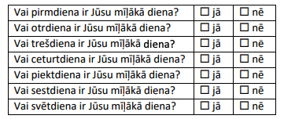  
Uz katru jautājumu saņemto apstiprinošo ("jā") atbilžu skaits bija šāds: 
pirmdiena – $51$, otrdiena – $52$,
trešdiena – $53$, ceturtdiena – $54$, piektdiena – $55$, 
sestdiena – $56$, svētdiena – $57$. Cik ciema iedzīvotāji visu laiku melo?  
</text>

<text lang="en">
Some of $273$ villagers always tell the truth, the remaining ones 
lie all the time. Each of the villagers has exactly one favourite 
day of the week. There was a poll of all the villagers, and they 
were asked to answer seven questions with either "Yes" or "No":

| Question                        |                |               |
| ------------------------------- | -------------- | ------------- |
| Is Monday your favorite day?    | $\square$ Yes  | $\square$ No  |
| Is Tuesday your favorite day?   | $\square$ Yes  | $\square$ No  |
| Is Wednesday your favorite day? | $\square$ Yes  | $\square$ No  |
| Is Thursday your favorite day?  | $\square$ Yes  | $\square$ No  |
| Is Friday your favorite day?    | $\square$ Yes  | $\square$ No  |
| Is Saturday your favorite day?  | $\square$ Yes  | $\square$ No  |
| Is Sunday your favorite day?    | $\square$ Yes  | $\square$ No  |

The number of "Yes" answers received to each question was as follows: 
Monday - $51$, Tuesday - $52$, Wednesday - $53$, Thursday - $55$, 
Friday - $54$, Saturday - $56$, Sunday - $57$. 
How many villagers lie all the time?
</text>

<small>

* concepts:truth,falsehood,mapping
* questionType:FindCount
* domain:Comb
* subdomain:Logic
* topic:TrueAndFalseStatements
* topic:DoubleCounting

</small>

<text num="1" lang="lv">
## Atrisinājums

Ciemā ir $21$ melis.

Kopā tika sanemtas $51+52+53+54+55+56+57=378$ atbildes "jā". 
Ievērosim, ka katrs ciema iedzīvotājs, kas saka patiesību, 
atbildēja "jā" tieši vienu reizi (savai mīlākajai dienai), 
bet katrs melis - tieši sešas reizes (visām dienām, kas 
nav viņa mīlākā diena). Tātad, ja mēs vienu iedzīvotāju, 
kurš saka patiesību, pārvērstu par meli, tad papildus mēs 
iegūstu piecas "liekas" atbildes jā.

Iesākumā pieņemsim, ka visi ciema iedzīvotāji saka patiesību, 
tādā gadījumā mums kopā būtu tieši $273$ atbildes "jā". 
Tā kā mums ir $378$ atbildes "jā", tad mums "liekas" ir 
$378-273=105$ atbildes "jā". Tātad par meļiem mums 
jāpārvērš $105:5=21$ ciema iedzīvotājs.
</text>

<text num="1" lang="en">
## Solution 

*Answer.* In the village there are $21$ liars. 

Alltogether there were $51+52+53+54+55+56+57=378$ answers “Yes”. 
Note that every villager who tells the truth answered "Yes" exactly once 
(for their favourite day) and every liar exactly six times 
(for all the days that aren't his/her favourite day). 
If we turn one resident who says the truth into a liar, then we get 
five surplus answers "Yes". In the beginning assume that 
everyone in the village is telling the truth; in this case 
there would be $273$ answers “Yes”. 
As there are $378$ answers "Yes", we have $378-273=105$ 
"redundant" answers "Yes". This can be achieved by turning $105:5=21$ 
villagers into liars.
</text>

    
# <lo-sample/> LV.AMO.2022B.7.1

<text lang="lv">
Uz tāfeles bija uzrakstīts šāds teksts: $A869B$. 
Katrs no burtiem $A$ un $B$ jāaizstāj ar vienu ciparu (tie var būt arī
vienādi) tā, lai iegūtais piecciparu skaitlis dalītos ar $15$. 
Cik dažādos veidos to var izdarīt?
</text>

<text lang="en">
The following text was written on the board: $A869B$. Each of the 
letters $A$ and $B$ must be replaced by one digit 
(they may or may not be the same) so that the resulting five-digit 
number is divisible by $15$. In how many ways can you do this?
</text>

<small>

* concepts:variable,digit,divisibility
* questionType:FindCount
* domain:NT
* subdomain:NumeralSystems
* topic:DivisibilityRulesLastDigits
* topic:DivisibilityRulesFor3And9

</small>

<text num="1" lang="lv">
## Atrisinājums

Prasīto var izdarīt $6$ veidos.

Lai skaitlis $\overline{A869B}$ dalītos ar $15$, tam jādalās 
gan ar $3$, gan ar $5$. Apskatīsim divus iespējamos gadījumus, 
kāds cipars var būt ierakstīts $B$ vietā, lai skaitlis dalītos ar $5$.

* Ja $B=0$, tad skaitla ciparu summa ir $A+8+6+9+0=A+23$. 
  Lai skaitlis dalītos ar $3$, tā ciparu summai jādalās ar $3$, 
  tāpēc iespējamās $A$ vērtības ir $1$, $4$ vai $7$.
* Ja $B=5$, tad skaitla ciparu summa ir $A+8+6+9+5=A+28$. 
  Lai skaitlis dalītos ar $3$, tā ciparu summai jādalās ar $3$, 
  tāpēc iespējamās $A$ vērtības ir $2$, $5$ vai $8$.

Līdz ar to iespējami seši dažādi varianti, kādus ciparus var ierakstīt 
$A$ un $B$ vietā:
$A=1$ un $B=0$;
$A=4$ un $B=0$;
$A=7$ un $B=0$;
$A=2$ un $B=5$;
$A=5$ un $B=5$;
$A=8$ un $B=5$.
</text>

<text num="1" lang="en">
## Solution

*Answer.* This can be done in $6$ ways. 

For a number $\overline{A869B}$ to be divisible by $15$, 
it must be divisible by both $3$ and $5$. 
Consider two possible cases for the digit $B$ such that it is disible by $5$. 

* If $B=0$, the sum of the digits is $A+8+6+9+0=A+23$. 
  To be divisible by $3$, the sum of digits must be divisible by $3$, 
  so the possible values for $A$ are $1$, $4$, or $7$. 
* If $B=5$, the sum of the digits is $A+8+6+9+5=A+28$. 
  To be divisible by $3$, the sum of digits must be divisible by $3$, 
  so the possible values for $A$ are $2$, $5$, or $8$. 
  
As a result, there are six different options for digits replacing $A$ and $B$
respectively: $(A,B) = (1,0)$, $(A,B)=(4,0)$; $(A,B)=(7,0)$, 
$(A,B)=(2,5)$; $(A,B)=(5,5)$; $(A,B)=(8,5)$.
</text>

    
# <lo-sample/> LV.AMO.2022B.7.2

<text lang="lv">
Vai var atrast **(A)** $5$; **(B)** $15$ naturālus skaitļus 
(ne obligāti dažādus), kuru summa ir vienāda ar to reizinājumu?
</text>

<text lang="en">
Do there exist **(A)** $5$; **(B)** $15$ positive integers 
(some of them may be equal) such that their sum equals their product?
</text>

<small>

* concepts:sum,product
* questionType:ProveDisprove
* domain:Alg
* subdomain:Equations
* topic:EquationsAndMonotonicity

</small>

<text num="1" lang="lv">
## Atrisinājums 

**(A)** Jā, var, piemēram, der skaitļi $1,1,2,2,2$, jo $1+1+2+2+2=8$ un 
$1 \cdot 1 \cdot 2 \cdot 2 \cdot 2=8$

**(B)** Jā, var, der, piemēram, skaitli $1, 1, 1, 1, 1, 1, 1, 1, 1, 1, 1, 1, 1, 2, 15$ 
($13$ vieninieki, $2$ un $15$), jo $13 \cdot 1+2+15=30$ un $1 \cdot 2 \cdot 15=30$.

*Piezīme.* **(A)** gadījumā der arī $1, 1, 1, 3, 3$ vai $1,1,1,2,5$.
</text>

<text num="1" lang="en">
## Solution 

**(A)** Yes, the numbers $1,1,2,2,2$ satisfy the condition, since 
$1+1+2+2+2=8$ and $1 \cdot 1 \cdot 2 \cdot 2 \cdot 2=8$ 

**(B)** Yes, such numbers exist. For example, $1, 1, 1, 1, 1, 1, 1, 1, 1, 1, 1, 1, 1, 2, 15$ (13 copies of number $1$ and also numbers $2$ and $15$), 
since $13 \cdot 1+2+15=30$ and $1 \cdot 2 \cdot 15=30$. 

*Note* For (A) the solutions $1,1,1,3,3$ or $1,1,1,2,5$ are also valid.
</text>

    
# <lo-sample/> LV.AMO.2022B.7.3

<text lang="lv">
Parādi, kā plaknē novilkt $6$ taisnes un uz tām atlikt $7$ punktus tā, 
lai uz katras no taisnēm būtu atzīmēti tieši trīs punkti!
</text>

<text lang="en">
Show how to draw $6$ lines in a plane and mark $7$ points on the lines so that 
exactly three points are marked on each line!
</text>

<small>

* concepts:plane,line,point
* questionType:FindExample
* domain:Geom
* subdomain:ObjectSystemsGeometry

</small>

## Atrisinājums

<text num="1" lang="lv">
Skat., piemēram, 5. att.

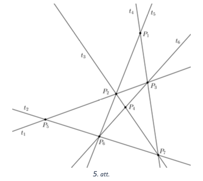
</text>

<text num="1" lang="en">
## Solution 

An possible answer is shown in Fig.5. 

</text>

    
# <lo-sample/> LV.AMO.2022B.7.4

<text lang="lv">
Uz galda ir kaudze ar konfektēm. Karlsons un Brālītis pēc kārtas izdara gājienus, 
Karlsons sāk spēli. Vienā gājienā
spēlētājs var paņemt no kaudzes un apēst vai nu vienu, 
vai divas konfektes. Uzvar tas spēlētājs, kurš apēd pēdējo
konfekti. Kurš spēlētājs, pareizi spēlējot, vienmēr var uzvarēt, 
ja sākumā kaudzē ir **(A)** $6$ konfektes;
**(B)** $2022$ konfektes?
</text>

<text lang="en">
There's a pile of candies on the table. Karlsson and Lillebror 
(Little Brother) take turns making moves, with Karlsson starting the game. 
In one move, a player can remove from the pile and 
eat either one or two candies. The player who eats the last candy wins. 
Which player, can always win if there are initially
**(A)** $6$ candies in the heap; **(B)** $2022$ candies in the heap? 
</text>

<small>

* concepts:game,set,remove,to-win
* questionType:Algorithm,Algorithm
* domain:NT
* subdomain:Divisibility,FixedInvariant

</small>

## Atrisinājums 

<text num="1" lang="lv">
Abos gadījumos vienmēr var uzvarēt Brālītis. Lai to panāktu, 
viņš var rīkoties šādi: katrā gājienā, ja Karlsons ēd vienu konfekti, 
tad Brālītis ēd divas un otrādi, ja Karlsons ēd divas, 
tad Brālītis - vienu. Šādi spēlējot, pēc katra (abu spēlētāju) 
gājiena konfekšu skaits kaudzē samazinās tieši par 3. 
Tā kā sākumā kaudzē konfekšu skaits dalī̄ās ar $3$ (gan $6$, gan $2022$ 
dalās ar $3$), tad arī abos gadījumos pēc kāda Brāliša gājiena 
tas klūs vienāds ar $0$, tātad Brālītis uzvarēs.

*Piezīme.* **(A)** gadījumā Brālītis uzvarēs jau pēc otrā gājiena, 
bet **(B)** gadījumā Brālítis uzvarēs pēc $2022: 3=674$. gājiena.
</text>

<text num="1" lang="en">
## Solution 

Lillebror can win in both cases. To achieve this, he can proceed 
as follows: in every move, if Karlsson eats one candy, then Lillebror 
eats two, and vice versa, if Karlsson eats two, then Lillebror eats one. 
Playing like this, after every pair of moves the number of candies 
in the pile drops by exactly $3$. Since initially the number of 
candies was divisible by $3$ (both $6$ and $2022$ are divisible by $3$), 
in either case it will become $0$ after a move by Lillebror, 
so the Lillebror will win. 

*Note.* In case (A), Lillebror will win after his second move. In case
(B), Lillebror will win after the $2022:3=674$ moves.
</text>

    
    
# <lo-sample/> LV.AMO.2022B.7.5

<text lang="lv">
Daži no $272$ ciema iedzīvotājiem visu laiku saka patiesību, 
pārējie visu laiku melo. Katram no ciema iedzīvotājiem
ir tieši viena mīļākā nedēļas diena. Aptaujājot iedzīvotājus, 
viņiem tika lūgts atbildēt uz septiņiem jautājumiem,
katrā no tiem izvēloties vienu no dotajām atbildēm:  

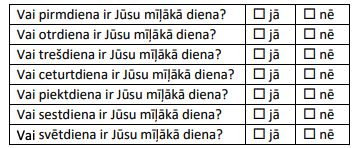  

Uz katru jautājumu saņemto apstiprinošo ("jā") atbilžu skaits bija šāds: 
pirmdiena – $53$, otrdiena – $54$,
trešdiena – $55$, ceturtdiena – $56$, piektdiena – $57$, sestdiena – $58$, svētdiena – $59$. 
Cik ciema iedzīvotāju visu laiku melo?
</text>

<text lang="en">
Some of $272$ villagers always tell the truth, the remaining ones 
lie all the time. Each of the villagers has exactly one favourite 
day of the week. There was a poll of all the villagers, and they 
were asked to answer seven questions with either "Yes" or "No":

 

The number of "Yes" answers received to each question was as follows: 
Monday - $53$, Tuesday - $54$, Wednesday - $55$, Thursday - $57$, 
Friday - $56$, Saturday - $58$, Sunday - $59$. 
How many villagers lie all the time? 
</text>

<small>

* concepts:truth,falsehood,mapping
* questionType:FindCount
* domain:Comb
* subdomain:Logic

</small>

<text num="1" lang="lv">
## Atrisinājums

*Atbilde.* Ciemā ir $24$ meļi.

Kopā tika saņemtas $53+54+55+56+57+58+59=392$ atbildes "jā". 
Ievērosim, ka katrs ciema iedzīvotājs, kas saka patiesību, 
atbildēja "jā" tieši vienu reizi (savai mīlākajai dienai), 
bet katrs melis - tieši sešas reizes (visām dienām, 
kas nav vina mīļākā diena). Tātad, ja mēs vienu iedzīvotāju, 
kurš saka patiesību, pārvērstu par meli, tad papildus mēs iegūstu 
piecas "liekas" atbildes jā.

Iesākumā pieņemsim, ka visi ciema iedzīvotāji saka patiesību, 
tādā gadījumā mums kopā būtu tieši $272$ atbildes "jā". Tā kā mums 
ir $392$ atbildes "jā", tad mums "liekas" ir $392-272=120$ 
atbildes "jā". Tātad par meļiem mums jāpārvērš $120:5=24$ ciema iedzīvotāji.
</text>

<text num="1" lang="en">
## Solution 

*Answer.* In the village there are $24$ liars. 

Alltogether there were $53+54+55+56+57+58+59=392$ answers "Yes". 
Note that every villager who tells the truth answered "Yes" exactly once 
(for their favourite day) and every liar exactly six times 
(for all the days that aren't his/her favourite day). 

If we turn one resident who says the truth into a liar, then we get 
five surplus answers "Yes".
In the beginning assume that 
everyone in the village is telling the truth; in this case 
we would have $272$ answers “Yes”. 

Since we have 392 answers "Yes", we have $392-272=120$ "redundant" answers "Yes". 
This can be achieved by turning $120:5=24$ villagers into liars.
</text>

    
# <lo-sample/> LV.AMO.2022B.8.1

<text lang="lv">
Uz tāfeles bija uzrakstīts šāds teksts: $N597M$. 
Katrs no burtiem $N$ un $M$ jāaizstāj ar vienu ciparu (tie var būt arī
vienādi) tā, lai iegūtais piecciparu skaitlis dalītos ar $12$. 
Cik dažādos veidos to var izdarīt?
</text>

<text lang="en">
The following text was written on the board: $N597M$. Each of the letters 
$N$ and $M$ should be replaced by a digit (they may or may not be 
the same) so that the resulting five digit number is divisible by $12$. 
In how many ways can you do this?
</text>

<small>

* concepts:divisibility,variable,digit
* questionType:FindCount
* domain:NT
* subdomain:NumeralSystems

</small>

<text num="1" lang="lv">
## Atrisinājums

Prasīto var izdarīt $6$ dažādos veidos.

Lai skaitlis $\overline{N597M}$ dalītos ar 12, tam jādalās 
gan ar $3$, gan ar $4$. Lai skaitlis dalītos ar $4$, 
tā pēdējo divu ciparu veidotajam skaitlim jādalās ar $4$. 
Apskatīsim divus iespējamos gadījumus, kāds cipars var 
būt ierakstīts $M$ vietā, lai skaitlis dalītos ar $4$.

* Ja $M=2$, tad skaitla ciparu summa ir $N+5+9+7+2=N+23$. 
  Lai skaitlis dalītos ar 3, tā ciparu summai jādalās ar $3$, 
  tāpēc iespējamās $N$ vērtības ir $1$, $4$ vai $7$.
* Ja $M=6$, tad skaitla ciparu summa ir $N+5+9+7+6=N+27$. 
  Lai skaitlis dalítos ar 3, tā ciparu summai jādalās ar $3$, 
  tāpēc iespējamās $N$ vērtības ir $0$, $3$, $6$ vai $9$. 
  Tā kā skaitlis nevar sākties ar $0$, 
  iespējamās $N$ vērtības ir $3$, $6$ vai $9$.

Līdz ar to iespējami seši dažādi varianti, kādus ciparus var 
ierakstīt $M$ un $N$ vietā: $(N,M)=(1,2)$; $(N,M)=(4,2)$; 
$(N,M)=(7,2)$; $(N,M)=(3,6)$; $(N,M)=(6,6)$; $(N,M)=(9,6)$.
</text>

<text num="1" lang="en">
## Solution 

The requirements can be satisfied in $6$ different ways. 
In order to have a number $\overline{N597M}$ divisible by $12$, 
it must be divisible by $3$ and by $4$. 
To be divisible by $4$, the last two digits must be divisible by $4$. 
Let's look at two possible cases for the digit $M$ to achieve
divisiblity by $4$. 

* If $M=2$, the sum of digits is $N+5+9+7+2=N+23$. 
  To be divisible by $3$, the sum of its digits must be divisible by $3$,
  so the possible values of $N$ are $1$, $4$, or $7$. 
* If $M=6$, the sum of digits is $N+5+9+7+6=N+27$. 
  To be divisible by $3$, the sum of its digits must divisible by $3$, 
  so the possible values of $N$ are $0$, $3$, $6$, or $9$. No number can
  begin with a $0$, so the possible values of $N$ are $3$, $6$, or $9$. 
  
As a result, there are six different options how to replace $N$ and $M$: 
$(N,M)=(1,2)$; $(N,M)=(4,2)$; $(N,M)=(7,2)$; $(N,M)=(3,6)$; 
$(N,M)=(6,6)$; $(N,M)=(9,6)$.
</text>
    
    
# <lo-sample/> LV.AMO.2022B.8.2

<text lang="lv">
Skolēnam tika uzdots mājas darbs, kurā bija $20$ uzdevumi. 
Par katru pareizi atrisinātu uzdevumu tiek doti $8$
punkti, par katru nepareizi atrisinātu uzdevumu tiek atņemti $5$ punkti, 
ja uzdevums nav risināts, tad par to ir $0$ punkti. 
Cik uzdevumus skolēns atrisināja pareizi, 
ja kopā viņš ieguva $13$ punktus?
</text>

<text lang="en">
The student had to complete a homework with $20$ tasks. For each task 
$8$ points are added, if the solution is correct, $5$ points are 
subtracted, if the solution is wrong, and $0$ points is given, 
if the task is not attempted. How many tasks did a student solve 
correctly, if his total score is $13$?
</text>

<small>

* concepts:add,subtract
* questionType:FindAll
* domain:Alg
* subdomain:Equations

</small>

<text num="1" lang="lv">
## Atrisinājums 

Skolēns pareizi atrisināja $6$ uzdevumus. Pamatosim, 
ka tā ir vienīgā derīgā vērtība. Apzīmējam pareizi 
atrisināto uzdevumu skaitu ar $x$ un nepareizi 
atrisināto uzdevumu skaitu ar $y$. legūstam vienādojumu

$$8x-5y=13$$

Tā kā $8x$ ir pāra skaitlis, tad $5y$ noteikti ir nepāra skaitlis, 
jo starpībai jābūt 13. Tātad $y$ ir nepāra skaitlis. 
No vienādības $8x-5y=13$ izsakot $x$, iegūstam $x=(13+5y):8$. 
Ievērojam, ka kopā bija 20 uzdevumi, tātad $x+y \leq 20$ un 
ir iespējamas tikai 6 dažādas $y$ vērtības, kuras attēlotas 
tabulā. Ja $y \geq 12$, tad $x>9$ un $x+y>20$. Ja aprēķinātā 
$x$ vērtība ir naturāls skaitlis, tad iegūtās $x$ un $y$ vērtības 
ir derīgas. Tabulā redzams, ka vienīgās derīgās vērtības ir 
$x=6$ un $y=7$, tātad skolēns pareizi atrisināja 6 uzdevumus, 
nepareizi atrisināja $7$ uzdevumus, bet $7$ uzdevumus nerisināja.

| $\boldsymbol{y}$ | Vai vērtība $\boldsymbol{x}=(\mathbf{1 3}+\mathbf{5} \boldsymbol{y}): \mathbf{8}$ ir naturāls skaitlis? |
| :---: | :---: |
| $\mathbf{1}$ | Nē |
| $\mathbf{3}$ | Nē |
| $\mathbf{5}$ | Nē |
| $\mathbf{7}$ | Jā, $x=6$ |
| $\mathbf{9}$ | Nē |
| $\mathbf{11}$ | Nē |
</text>

<text num="1" lang="en">
## Solution 

*Answer.* The student solved $6$ tasks correctly. 

Let us show that this answer is the only possibility. 
Let $x$ denote the number of tasks that were solved correctly, but $y$ denotes the number tasks that were wrong. 

Consider all solutions for the equation $8x-5y=13$. Since $8x$ is 
even, then $5y$ and $y$ must be odd. When expressing $x$, we would get $x=(13+5y):8$. As there were $20$ tasks in total, so there are only $6$ 
different values of $y$ such that $x+y \leq 20$. 
Indeed, if $y \geq 12$, then $x>9$ and $x+y>20$. 

If the calculated $x$ value is a positive integer, the resulting 
$x$ and $y$ values are valid. The table shows that the only 
valid values are $x=6$ and $y=7$, so the student solved $6$ tasks 
correctly, solved $7$ tasks incorrectly, and $7$ tasks were not attempted. 

| $\boldsymbol{y}$ | Is $x=(13+5y):8$ a positive integer? |
| ---------------- | ------------------------------------ |
| $\mathbf{1}$     | No                                   |
| $\mathbf{3}$     | No                                   |
| $\mathbf{5}$     | No                                   |
| $\mathbf{7}$     | Yes, $x=6$                           |
| $\mathbf{9}$     | No                                   |
| $\mathbf{11}$    | No                                   |
</text>

    
    
# <lo-sample/> LV.AMO.2022B.8.3

<text lang="lv">
Trijstūrī $ABC$ uz malas $BC$ atlikts tāds punkts $D$, 
ka $AD = BD$ un $AB = DC = AC$. Aprēķināt trijstūra $ABC$ leņķus!
</text>

<text lang="en">
In a triangle $ABC$ on the side $BC$ there is a point $D$ 
such that $AD = BD$ and $AB = DC = AC$. Calculate the angles 
of $ABC$!
</text>

<small>

* concepts:triangle
* questionType:FindAll
* domain:Geom
* subdomain:AnglesParallelsSimilarity

</small>

<text num="1" lang="lv">
## Atrisinājums

Tā kā $AD=BD$, tad trijstūris $ABD$ ir vienādsānu 
trijstūris ar pamatu $AB$ un tā pamata pielenķi ir vienādi, 
tātad $\sphericalangle ABD=\sphericalangle BAD=\alpha$ (skat. 6. att.).

No trijstūra $ABD$ iegūstam, ka 
$\sphericalangle ADB=180^{\circ}-\alpha-\alpha=180^{\circ}-2 \alpha$.

Ievērojam, ka 
$\sphericalangle ADC=180^{\circ} - \sphericalangle ADB=180^{\circ}-\left(180^{\circ}-2 \alpha\right)=2 \alpha$ kā blakusleņki. Tā kā $AC=DC$, tad arī trijstūris $ACD$ 
ir vienādsānu un tā pamata pieleņki ir vienādi, tātad 
$\sphericalangle DAC=\sphericalangle ADC = 2\alpha$.

Tā kā $AB=AC$, tad arī trijstūris $ABC$ ir vienādsānu un tā pamata pieleņķi ir vienādi, tātad $\sphericalangle ABC=\sphericalangle ACB=\alpha$. 
No trijstūra $ACD$ iegūstam, ka

$$\sphericalangle ADC+\sphericalangle DAC+\sphericalangle ACD = 2 \alpha+2 \alpha+\alpha=180^{\circ}$$

Atrisinot vienādojumu $5 \alpha=180^{\circ}$, iegūstam, ka $\alpha=36^{\circ}$.

Aprēkinām trijstūra $ABC$ leņķu vērtības:

$$\begin{aligned}
& \circ \quad \sphericalangle ABC = \sphericalangle ACB = \alpha=36^{\circ};\\
& \circ \quad \sphericalangle BAC = \sphericalangle BAD + \sphericalangle DAC = \alpha+2 \alpha=108^{\circ}.
\end{aligned}$$

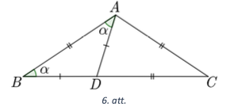
</text>

<text num="1" lang="en">
## Solution 

Since $AD=BD$, the triangle $ABD$ is an isosceles 
triangle with the base $AB$ and both angles at the base 
are equal, hence $\sphericalangle ABD=\sphericalangle BAD=\alpha$ 
(see Figure 6). 

We get from the triangle $ABD$ that 
$\sphericalangle ADB=180^{\circ}-\alpha-\alpha=180^{\circ}-2 \alpha$. 
Note that $\sphericalangle ADC = 180^{\circ} - \sphericalangle ADB=180^{\circ}-\left(180^{\circ}-2 \alpha\right)=2 \alpha$ as 
supplementary angles. Since the $AC=DC$, the triangle $ACD$ 
is also isosceles and angles at its base are the same, hence  $\sphericalangle DAC=\sphericalangle ADC = 2\alpha$. 

Since $AB=AC$, the triangle $ABC$ is also isosceles and the angles
at its base are the same, hence 
$\sphericalangle ABC=\sphericalangle ACB=\alpha$. 
From the triangle $ACD$, we get that

$$\sphericalangle ADC+\sphericalangle DAC+\sphericalangle ACD = 2 \alpha+2 \alpha+\alpha=180^{\circ}$$ 

By solving $5 \alpha=180^{\circ}$, we get that $\alpha=36^{\circ}$. 
Find all the angles in triangle $ABC$: 

- $\sphericalangle ABC = \sphericalangle ACB = \alpha=36^{\circ}$;
- $\sphericalangle BAC = \sphericalangle BAD + \sphericalangle DAC = \alpha+2 \alpha=108^{\circ}$.

</text>

    
    
# <lo-sample/> LV.AMO.2022B.8.4

<text lang="lv">
Vai pa apli var uzrakstīt skaitļus  
**(A)** $0;\;1;\;2;\;3;\;4;\;5;\;6;\;7;\;8;\;9$;
**(B)** $0;\;1;\;2;\;3;\;4;\;5;\;6;\;7;\;8;\;9;\;10;\;11;\;12;\;13$;
tā, lai katri divi blakus esoši skaitļi atšķirtos par $3$; $4$ vai $5$?
</text>

<text lang="en">
Is it possible to arrange the numbers  
**(A)** $0;\;1;\;2;\;3;\;4;\;5;\;6;\;7;\;8;\;9$   
**(B)** $0;\;1;\;2;\;3;\;4;\;5;\;6;\;7;\;8;\;9;\;10;\;11;\;12;\;13$  
around a circle so that any two adjacent numbers differ by $3$, $4$, or $5$?
</text>

<small>

* concepts:integer-numbers,distance
* questionType:ProveDisprove,ProveDisprove
* domain:Comb
* subdomain:Graphs
* method:ContradictionForExistence
* topic:HamiltonCircuits

</small>

## Atrisinājums 

<text num="1" lang="lv">
**(A)** Pamatosim, ka prasītais nav iespējams.  
Ievērosim, ka skaitli 0; 1; 2; 8 un 9 nevar būt uzrakstiti blakus 
viens otram, jo katru divu skaitlu starpība nav 3; 4 vai 5. 
Tātad tos jāraksta, izlaižot vienu pozīciju (skat. 7. att., 
kur ar burtiem apzīmētas vietas, kurās jāieraksta šie skaitlii). 
Skaitli $7$ var rakstīt blakus tikai skaitlim $2$, jo to starpība ir $5$, 
bet to nevar rakstīt blakus pārējiem pa apli uzrakstītajiem 
skaitliem $0$; $1$; $8$ vai $9$, tātad dotos skaitlus nevar 
uzrakstīt tā, lai katri divi blakus esoši skaitļi atškirtos par $3$; $4$ vai $5$.

**(B)** Jā, var, piemēram, skat. 8. att., kur rinķa iekšpusē 
ierakstīts, par cik atškiras skaitļi.

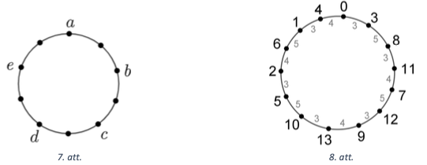
</text>

<text num="1" lang="en">
## Solution

**(A)** Let us show that it is impossible. Note that the numbers 
$0$; $1$; $2$; $8$ and $9$ cannot be written next to each other 
as the difference between any two of them is not $3$; $4$ or $5$. 
So they should be written on the circle by skipping one position 
between any two of them (See Fig.7, where the letters indicate 
places where these five numbers should go.)

You can only write $7$ next to $2$ because their difference is $5$, 
but $7$ cannot stand next to any of the other numbers $0$, $1$, $8$, or $9$. 
So it is impossible to place $7$ anywhere on the circle, so the 
given numbers cannot be written in a way that 
every two adjacent numbers differ by $3$, $4$, or $5$. 

**(B)** Yes, for example, see Fig.8. Inside the circle the numbers 
indicate by how much any two neighboring number differ. 

</text>

    
# <lo-sample/> LV.AMO.2022B.8.5

<text lang="lv">
Piecu draugu lokā izvērsās strīds, kurā:

* Elīna saka: "Es vienmēr saku taisnību."
* Guna saka: "Gan Elīna, gan Agnese melo."
* Maruta saka: "Visi saka taisnību."
* Agnese saka: "Elīna melo."
* Emīls saka: "Visi melo."
    
Cik draugu saka taisnību?
</text>

<text lang="en">
Five friends started arguing, and they stated the following: 

* Elina says: "I always speak the truth."
* Guna says: "Elina and Agnese are both lying."
* Maruta says: "Everyone speaks the truth."
* Agnese says: "Elina lies."
* Emils says: "Everyone lies." 

It is known that each friend either always speaks the truth 
or always lies. 
How many friends speak the truth? 
</text>

<small>

* concepts:truth,falsehood
* questionType:FindCount
* domain:Comb
* subdomain:Logic

</small>

<text num="1" lang="lv">
## Atrisinājums 

Pamatosim, ka tikai viens no draugiem saka taisnību. Ievērojam:

* ja Elīna saka taisnību, tad Agnese melo, tātad viņas abas nevar runāt taisnību;
* ja Agnese melo, tad Elīna saka taisnību, tātad viņas abas nevar melot.

Tātad vai nu Elīna, vai Agnese runā taisnību un otra melo. 
No tā izriet, ka gan Guna, gan Maruta, gan Emīls melo. 
Tātad tikai viens no draugiem saka taisnību.
</text>

<text num="1" lang="en">
## Solution 

*Answer.* We show that only one of the friends speaks the truth. 
Note that: 

- If Elina speaks the truth, then Agnese lies.  
  So they cannot both speak the truth. 
- If Agnese lies, then Elina says the truth, so the cannot both lie. 

Thus, either Elina or Agnese speaks the truth and the other one lies. 
It follows that Guna, Maruta and Emils lie. 
So only one of the friends speaks the truth (it is either Elina or Agnese). 
</text>

    
    
# <lo-sample/> LV.AMO.2022B.9.1

<text lang="lv">
Cik ir tādu četrciparu skaitļu $\overline{ABBA}$, kas dalās ar $99$? 
(Vienādiem burtiem atbilst vienādi cipari, dažādiem burtiem
var atbilst arī vienādi cipari.)
</text>

<text lang="en">
How many four-digit numbers $\overline{ABBA}$ are there that are 
divisible by $99$? (The same letters are replaced by the same digits,
but different letters may or may not be the same.)
</text>

<small>

* concepts:divisibility,digit,variable
* questionType:FindCount
* domain:NT
* subdomain:NumeralSystems

</small>

<text num="1" lang="lv">
## Atrisinājums 

Pamatosim, ka ir 10 skaitlļi, kas atbilst uzdevuma nosacījumiem: 
$1881$, $2772$, $3663$, $4554$, $5445$, $6336$, $7227$, $8118$, $9009$, $9999$.

Lai skaitlis dalītos ar $99$, tam jādalās gan ar $11$, gan ar $9$. 
Ievērojam, ka dotais skaitlis dalās ar $11$, jo tā ciparu summas, 
kas atrodas nepāra pozīcijās, un ciparu summas, kas atrodas 
pāra pozīcijās, starpība ir $(A+B)-(B+A)=0$, kas dalās ar $11$.

Lai skaitlis dalītos ar $9$, tā ciparu summai jādalās ar $9$. 
Tātad $A+B+B+A=2(A+B)$ jādalās ar $9$. Tā kā $A$ un $B$ ir cipari, 
tad iespējami divi gadījumi: $A+B=9$ vai $A+B=18$.

Ja $A+B=9$, tad iespējami devini gadijumi:

$$A+B=1+8=2+7=3+6=4+5=5+4=6+3=7+2=8+1=9+0$$

Ja $A+B=18$, tad iespējams tikai viens gadijums $A+B=9+9$.
</text>

<text num="1" lang="en">
## Solution 

There are $10$ numbers that satisfy the conditions: 
$1881$, $2772$, $3663$, $4554$, $5445$, $6336$, $7227$, $8118$, $9009$, $9999$. For a number to be divisible by $99$, it must 
be divisible by both $11$ and $9$. 
Note that the given number is divisible by $11$, since the 
sum of digits in odd positions 
minus the sum of digits in even positions equals $0$, so it is divisble by $11$. 

To be divisible by $9$, the sum of its digits must be divisible by $9$. 
So $A+B+B+A=2(A+B)$ should be divisible by $9$. 
Since $A$ and $B$ are numbers, two cases are possible: 
$A+B=9$ or $A+B=18$. If $A+B=9$, there may be nine cases: 
$$A+B=1+8=2+7=3+6=4+5=5+4=6+3=7+2=8+1=9+0.$$ 

If you $A+B=18$, you can only have one case $A+B=9+9$.
</text>

    
    
# <lo-sample/> LV.AMO.2022B.9.2

<text lang="lv">
Vai noteikti $x + \frac{9}{x} > y + \frac{9}{y}$, ja **(A)** $x > y > 0$, **(B)** $x > y > 3$? 
</text>

<text lang="en">
Is the inequality always true: $x + \frac{9}{x} > y + \frac{9}{y}$, if 
**(A)** $x > y > 0$,  **(B)** $x > y > 3$?
</text>

<small>

* concepts:inequality
* questionType:ProveDisprove,ProveDisprove
* domain:Alg
* subdomain:Inequalities
* method:PolynomialTransformations

</small>

<text num="1" lang="lv">
## Atrisinājums

**(A)** Nē, piemēram, ja $x=1$ un $y=0,1$, tad 
$x+\frac{9}{x}=10$ un $y+\frac{9}{y}=90,1$, bet $10<90,1$.

**(B)** Pamatosim, ka, ja $x>y>3$, tad dotā nevienādība ir patiesa.

Nevienādības $x+\frac{9}{x}>y+\frac{9}{y}$ abas puses reizinot 
ar pozitīvu izteiksmi $x y$, iegūstam ekvivalentu nevienādību

$$x^{2} y+9 y>x y^{2}+9x$$

Lai pierādītu, ka dotā nevienādība ir patiesa, pietiek pamatot, ka $x^{2} y+9 y-x y^{2}-9 x>0$.

Ievērojam, ka $x-y>0$ un $x y-9>0$, jo pēc dotā $x>y>3$.

Apskatām divu pozitīvu izteiksmju reizinājumu un to ekvivalenti pārveidojam:

$$0 < (xy-9)(x-y)=x^{2}y - xy^{2} -9x + 9y$$

Līdz ar to esam ieguvuši vajadzīgo.
</text>

<text num="1" lang="en">
## Solution 

**(A)** 
No. For example, take $x=1$, and $y=0.1$. Then 
$x+\frac{9}{x}=10$ and $y+\frac{9}{y}=90.1$, but $10<90.1$. 

**(B)** 
We show that for $x>y>3$, the inequality given is true. 

Multiply both sides of the inequality $x+\frac{9}{x}>y+\frac{9}{y}$ 
by a positive expression $xy$, get an equivalent expression: 

$$x^{3} y+9 y>x y^{2}+9x.$$

In order to prove that the inequalities are true, 
it is sufficient to show that the $x^{2}y + 9y - xy^{2} - 9x>0$. 
Notice that we have $x-y>0$ and $xy-9>0$ since it is given that $x>y>3$. 
We look at the product of two positive expressions 
and rewrite it as follows: 

$$0 < (xy-9)(x-y) = x^{2}y - xy^{2} - 9x + 9y$$. 

So we proved the necessary inequality.
</text>

    
# <lo-sample/> LV.AMO.2022B.9.3

<text lang="lv">
Taisnleņķa trijstūrī $ACB$ ($\sphericalangle C = 90^{\circ}$) 
novilkts augstums $CH$. Uz malas $AC$ atlikts punkts $K$ tā, ka 
$\sphericalangle CBK = \sphericalangle BAC$.
Pierādīt, ka taisne $CH$ dala nogriezni $BK$ divās vienādās daļās!
</text>

<text lang="en">
In a right triangle $ACB$ ($\sphericalangle C = 90^{\circ}$) 
$CH$ is an altitude. On the side $AC$ we mark a point $K$ 
so that $\sphericalangle CBK = \sphericalangle BAC$. 
Prove that the line $CH$ divides the segment $BK$ in half!
</text>

<small>

* concepts:right-triangle,altitude,line,segment
* questionType:Prove
* domain:Geom
* subdomain:AnglesParallelsSimilarity

</small>

<text num="1" lang="lv">
## Atrisinājums

Apzīmējam $CH$ un $KB$ krustpunktu ar $O$ un 
$\sphericalangle CBK=\sphericalangle BAC=\alpha$, 
$\sphericalangle ABC=\beta$ (skat. 9.att.). 
No trijstūra $ABC$ iegūstam, ka 
$\sphericalangle BAC=180^{\circ}-\sphericalangle ACB-\sphericalangle ABC$ 
jeb $\alpha=90^{\circ}-\beta$. No trijstūra $BHC$ iegūstam, ka 
$\sphericalangle HCB=180^{\circ}-\sphericalangle CHB-\sphericalangle HBC=90^{\circ}-\beta=\alpha$, tātad trijstūris $COB$ ir vienādsānu trijstūris, jo divi tā leņki ir vienādi 
$\sphericalangle OBC=\sphericalangle OCB=\alpha$. 
No tā izriet, ka $BO = OC$ kā vienādsānu trijstūra sānu malas.

No trijstūra $KCB$ iegūstam, ka 
$\sphericalangle BKC=180^{\circ}-\sphericalangle KCB-\sphericalangle KBC =  90^{\circ}-\alpha=\beta$. 
Ievērojam, ka 
$\sphericalangle ACH=\sphericalangle ACB-\sphericalangle HCB=90^{\circ}-\alpha=\beta$. 
Tātad trijstūris $KOC$ ir vienādsānu, jo divi tā lenki ir vienādi 
$\sphericalangle OKC=\sphericalangle KCO = \beta$, un tā sānu malas ir vienādas $CO=OK$.

No vienādībām $BO=OC$ un $CO=OK$ iegūstam, ka $BO=OK$, tātad $CH$ 
dala nogriezni $BK$ divās vienādās daļās

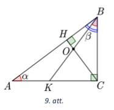
</text>

<text num="1" lang="en">
## Solution

Denote the intersection of $CH$ and $KB$ with $O$ and $\sphericalangle CBK=\sphericalangle BAC=\alpha$, 
$\sphericalangle ABC=\beta$ (see Fig.9). 
From the triangle $ABC$, we get that 
$\sphericalangle BAC=180^{\circ}-\sphericalangle ACB-\sphericalangle ABC$, 
or $\alpha=90^{\circ}-\beta$. 

From the triangle $BHC$ we get that 
$\sphericalangle HCB=180^{\circ}-\sphericalangle CHB-\sphericalangle HBC=90^{\circ}-\beta=\alpha$, hence the triangle $COB$, is an equilateral triangle as two of its angles are 
equal to $\sphericalangle OBC=\sphericalangle OCB=\alpha$. It follows that 
$BO = OC$ as to legs of an isosceles triangle.

We get from the triangle $KCB$ that 
$\sphericalangle BKC=180^{\circ}-\sphericalangle KCB-\sphericalangle KBC =  90^{\circ}-\alpha=\beta$.
Notice that 
$\sphericalangle ACH = \sphericalangle ACB - \sphericalangle HCB = 90^{\circ} - \alpha = \beta$. 
So the triangle in the $KOC$ is isosceles because two of its angles are equal: 
$\sphericalangle OKC=\sphericalangle KCO = \beta$ and its side edges are the same $CO=OK$. 
From the equalities $BO=OC$ and $CO=OK$, we get that $BO=OK$, hence $CH$
divides segment $BK$ in half. 

</text>

    
# <lo-sample/> LV.AMO.2022B.9.4

<text lang="lv">
Vai pa apli var uzrakstīt skaitļus  
**(A)** 1; 2; 3; 4; 5; 6; 7; 8; 9; 10; 11; 12; 13;  
**(B)** 1; 2; 3; 4; 5; 6; 7; 8; 9; 10; 11; 12; 13; 14;  
tā, lai katri divi blakus esoši skaitļi atšķirtos par $3$; $4$ vai $5$?
</text>

<text lang="en">
Is it possible to arrange the numbers  
**(A)** $1; 2; 3; 4; 5; 6; 7; 8; 9; 10; 11; 12; 13$;  
**(B)** $1; 2; 3; 4; 5; 6; 7; 8; 9; 10; 11; 12; 13; 14$  
on a circle so that any two adjacent numbers differ by $3$; $4$ or $5$?
</text>

<small>

* concepts:integer-numbers,distance
* questionType:ProveDisprove
* domain:Comb
* subdomain:Graphs
* method:ContradictionForExistence
* topic:HamiltonCircuits

</small>

<text num="1" lang="lv">
## Atrisinājums 

**(A)** Pamatosim, ka prasītais nav iespējams.

Ievērosim, ka skaitļi $1$; $2$; $3$; $11$; $12$ un $13$ nevar būt 
uzrakstīti blakus viens otram, jo katru divu skaitļu starpība nav 
$3$; $4$ vai $5$. Tātad tos jāraksta, izlaižot vienu pozīciju, 
tādējādi rodas tikai divas blakus vietas, kurās nav ierakstīti 
skaitļi (skat. 10.att.).

Skaitli 4 var rakstīt blakus tikai skaitlim $1$, jo to starpība ir $3$, 
bet to nevar rakstīt blakus pārējiem jau uzrakstītajiem skaitļiem 
$2$; $3$; $11$; $12$ vai $13$. Tātad skaitli $4$ jāraksta 
vienā no divām blakus esošajām brīvajām vietām.

Skaitli $10$ var rakstīt blakus tikai skaitlim 13, bet to nevar 
rakstīt blakus pārējiem pa apli uzrakstītajiem skaitļiem $1$; $2$; $3$; $11$ vai $12$. 
Tātad skaitli 10 jāraksta vienā no divām blakus esošajām brīvajām vietām. 
No tā izriet, ka skaitļus 4 un 10 jāraksta blakus, bet rodas pretruna 
ar uzdevuma nosacījumiem, jo to starpība ir $6$. Tātad dotos skaitļus 
nevar uzrakstīt tā, lai katri divi blakus esoši skaitļi atšķirtos par $3$; $4$ vai $5$.

**(B)** Jā, var, piemēram, skat. 11. att., kur rinķa iekšpusē ierakstīts, 
par cik atšķiras skaitļi.
</text>

<text num="1" lang="en">
## Solution 

**(A)** We show that it is impossible.  
Note that the numbers $1$; $2$; $3$; $11$; $12$ and $13$ 
cannot stand next to each other because the difference between 
any two of these numbers is not $3$, $4$ or $5$. 
So they should be written on the circle by skipping one position
between any two of them; after that there are there are only two 
adjacent positions left without numbers (Fig.10). 

Number $4$ can be only next to $1$ as their difference is $3$, but 
it cannot be next to any other numbers already written ($2,3,11,12,13$). 
So the number $4$ should take one of the two adjacent unoccupied positions.

Number $10$ can be next to $13$, but it cannot be next to any other 
numbers already written ($1,2,3,11,12$). So, $10$ should take another 
one of the two adjacent unoccupied positions. 
We conclude that numbers $4$ and $10$ should be written 
next to each other, but there is a contradiction with the 
condition of the problem, as their difference is $6$. 
Hence the given numbers cannot be written around the circle so that 
any two adjacent numbers differ by $3$; $4$ or $5$. 

**(B)** Yes, for example, see Fig.11, where the inside of the 
circle shows the difference between any two adjacent numbers.
</text>

    
    
# <lo-sample/> LV.AMO.2022B.9.5

<text lang="lv">
Mākslas muzeja plānojums ir taisnstūris ar izmēriem **(A)** $8 \times 9$; 
**(B)** $9 \times 11$ rūtiņas, 
kur viena rūtiņa atbilst vienai muzeja telpai. 
Muzeja vadītājs vēlas izveidot apmeklētāju maršrutu, 
kuram izpildās šādas īpašības:

* maršruts sākas kādā no rūtiņām (telpām), kas atrodas pie taisnstūra malas;
* apmeklētājs no vienas rūtiņas (telpas) var pāriet uz citu rūtiņu (telpu), ja tām ir kopīga mala;
* apmeklētājs maršruta laikā apmeklē katru rūtiņu (telpu) tieši vienu reizi;
* maršruts beidzas rūtiņā (telpā), kas atrodas pie taisnstūra malas blakus maršruta sākuma rūtiņai (telpai).

Vai muzeja vadītājs var izveidot šādu maršrutu?
</text>

<text lang="en">
The floor plan of the art museum shall is a rectangle 
of size **(A)** $8 \times 9$; **(B)** $9 \times 11$ squares, 
where one square corresponds to a single museum room. 
The director of the museum wants to create a visitor route 
that satisfies the following requirements: 

* the route starts in one of the squares (rooms) at the 
  edge of the rectangle; 
* a visitor on his route can move from one square (room) to another 
  square (room), if they share a common side. 
* the visitor enters each square (room) exactly once during the route;
* the route ends in a square (room) at the edge of the rectangle 
  and is located next to the square (room) that started the route.

Can the director of the museum create such route? 
</text>

<small>

* concepts:grid,square-side,rectangle,path
* questionType:ProveDisprove,ProveDisprove
* domain:Comb
* method:ContradictionForExistence
* subdomain:Graphs

</small>

<text num="1" lang="lv">
## Atrisinājums

**(A)** Jā, var, skat., piemēram, 12. att.

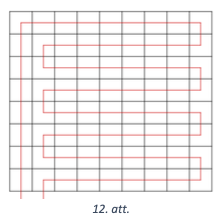

**(B)** Pierādīsim, ka prasīto maršrutu nav iespējams izveidot. 
Iekrāsosim taisnstūra rūtiņas šaha galdiņa veidā un ievērosim, ka šādam 
krāsojumam izpildās īpašība: blakus esošām rūtiņām ir dažādas krāsas. 
Pieņemsim pretējo, ka prasītais maršruts eksistē. Tā kā maršruts iziet cauri 
visām rūtiņām, kuru ir nepāra skaits, tad pāreja no vienas krāsas 
rūtiņas uz otras krāsas rūtiņu notiek pāra skaitu reižu. Līdz ar to maršruts 
beigsies tādas pašas krāsas rūtiņā kā maršruta sākuma rūtiņa. 
Taču tā nevar būt, jo šī rūtiņas atrodas blakus rūtiņai, 
kurā maršruts sākās. Līdz ar to iegūta pretruna, tāpēc šāds maršruts neeksistē.
</text>

<text num="1" lang="en">
## Solution 

**(A)** Yes, he can. See, for example, Fig.12. 

{ width=200px }

**(B)** 
We prove that the required route cannot be created. 
Let us color the rectangular squares as a chessboard 
and note that this coloring ensures that any two 
adjacent boxes have different colors. 

Assume by contradiction that such route does exist. 
Since the route passes
through all the squares with odd numbers, the transition 
from white to black or vice versa occurs even number of 
times. Hence, the route will end in a square of the same 
color as the starting square. However, this is impossible,
because that square is next to the square where the route 
started. This is a contradiction and therefore 
no such route exists.
</text>
    
    
# <lo-sample/> LV.AMO.2022B.10.1

<text lang="lv">
Kāds ir skaitļa $2022^{2022}$ pēdējais cipars?
</text>

<text lang="en">
What is the last digit of $2022^{2022}$? 
</text>

<small>

* concepts:power,last-digit
* questionType:FindAll
* domain:NT
* subdomain:Congruences

</small>

<text num="1" lang="lv">
## Atrisinājums

Skaitļa pēdējo ciparu noskaidrosim, apskatot doto skaitli 
pēc moduļa $10$. Ievērosim, ka $2022^{2022} \equiv 2^{2022}(\bmod 10)$. 
Tātad mums jānoskaidro skaitļa $2^{2022}$ pēdējais cipars.

Virkne $2^{n}, n=1,2, \ldots$, ir periodiska pēc moduļa $10$, 
apskatīsim šīs virknes pirmos locekļus:

* ja $n=1$, tad $2^{1} \equiv 2 \pmod {10}$;
* ja $n=2$, tad $2^{2} \equiv 4 \pmod {10}$;
* ja $n=3$, tad $2^{3} \equiv 8 \pmod {10}$;
* ja $n=4$, tad $2^{4} \equiv 16 \equiv 6 \pmod {10}$;
* ja $n=5$, tad $2^{5} \equiv 32 \equiv 2 \pmod {10}$.

Šo informāciju ērti apkopot tabulā:

| $n$ | 1 | 2 | 3 | 4 | 5 | $\ldots$ |
| :---: | :---: | :---: | :---: | :---: | :---: | :---: |
| $2^{n} \pmod {10}$ | $\mathbf{2}$ | 4 | 8 | 6 | $\mathbf{2}$ | $\ldots$ |

Redzam, ka virkne $2^{n}(\bmod 10)$ ir periodiska ar perioda garumu $4$. 
Tā kā $2022=4 \cdot 505+2$, tad virknes 2022.locekļa pēdējais cipars būs 
tāds pats kā virknes 2.locekļa pēdējais cipars, tātad pēdējais 
cipars būs $4$. Līdz ar to esam ieguvuši, ka skaitļa 
$2022^{2022}$ pēdējais cipars ir $4$.
</text>

<text num="1" lang="en">
## Solution 

We find the last digit of the number by looking at it 
modulo $10$ (finding its remainder when dividing by $10). 
Notice that $2022^{2022} \equiv 2^{2022}(\bmod 10)$. 
So we need to find the last digit of $2^{2022}$. 

The sequence $2^{n}, n=1,2, \ldots$, is periodic modulo $10$. 
Look at its first terms. 

* if $n=1$, then $2^{1} \equiv 2 \pmod {10}$; 
* if $n=2$, then $2^{2} \equiv 4 \pmod {10}$; 
* if $n=3$, then $2^{3} \equiv 8 \pmod {10}$; 
* if $n=4$, then $2^{4} \equiv 16 \equiv 6 \pmod {10}$; 
* If $n=5$, then $2^{5} \equiv 32 \equiv 2 \pmod {10}$. 

This information can be summarized in a table: 

| $n$   | $2^n \pmod {10}$ |
| ----- | ---------------- |
| $1$   | $\mathbf{2}$     |
| $2$   | $4$              |
| $3$   | $8$              |
| $4$   | $6$              |
| $5$   | $\mathbf{2}$     |

We see that the sequence $2^{n}(\bmod 10)$ is periodic
with a period $4$. Since $2022=4 \cdot 505+2$, the sequence 
will make $505$ full periods, and its 
$2022$-th term same as its second term, so it is equal to $4$. 

We conclude that the last digit of $2022^{2022}$ is $4$. 
</text>

<text num="2" lang="lv">
## Atrisinājums

Skaitļa pēdējo ciparu noskaidrosim, apskatot doto skaitli pēc moduļa $10$. 
Ievērojot, ka $2^{4} \equiv 16 \equiv 6(\bmod 10)$ un 
$6^{n} \equiv 6(\bmod 10)$, iegūstam

$$2022^{2022} \equiv 2^{2022} \equiv 2^{2020} \cdot 2^{2} \equiv\left(2^{4}\right)^{505} \cdot 4 \equiv 6 \cdot 4 \equiv 4 \pmod {10}$$

Līdz ar to esam ieguvuši, ka skaitla $2022^{2022}$ pēdējais cipars ir $4$.
</text>

<text num="2" lang="en">
## Solution 

The last digit of this number is determined by 
finding the congruence class of the number modulo $10$. 
Given that we $2^{4} \equiv 16 \equiv 6(\bmod 10)$ and 
$6^{n} \equiv 6(\bmod 10)$, we get that

$$2022^{2022} \equiv 2^{2022} \equiv 2^{2020} \cdot 2^{2} \equiv\left(2^{4}\right)^{505} \cdot 4 \equiv 6 \cdot 4 \equiv 4 \pmod {10}.$$ 

So the last digit of the number $2022^{2022}$ is $4$.
</text>

    
# <lo-sample/> LV.AMO.2022B.10.2

<text lang="lv">
Apskatām $n$ pēc kārtas ņemtus naturālus skaitļus. 
Vai var gadīties, ka tos var sadalīt divās grupās tā, ka katras
grupas skaitļu summa ir pirmskaitlis, ja **(A)** $n = 8$, 
**(B)** $n = 10$? Katrā grupā jābūt vismaz $2$ skaitļiem.
</text>

<text lang="en">
Consider $n$ consecutive positive integers. 
Can we divide them into two groups so that the sum 
of the numbers in each group is a prime number if 
**(A)** $n = 8$, **(B)** $n = 10$? 
Each group must contain at least $2$ numbers. 
</text>

<small>

* concepts:primes,natural-numbers,disjoint-sets,sum
* questionType:ProveDisprove,ProveDisprove
* domain:NT
* subdomain:NumberRepresentation
* method:FixedInvariant
* topic:Divisibility

</small>

<text num="1" lang="lv">
## Atrisinājums 

**(A)** Jā, piemēram, skait!us no 1 līdz 8 var sadalīt šādās divās grupās:

$$1+2+4=7 \text { un } 3+5+6+7+8=29$$

**(B)** Nē, tas nav iespējams. Starp 10 pēc kārtas ņemtiem naturāliem 
skaitļiem ir tieši 5 pāra un tieši 5 nepāra skaitļi, tātad visu $10$ 
skaitļu summa ir nepāra skaitlis. Tāpēc viena no apskatāmo grupu 
summām ir nepāra skaitlis, bet otra - pāra skaitlis. 
Tā kā abas summas ir lielākas nekā $2$, tad tā summa, 
kas ir pāra skaitlis, nav pirmskaitlis.
</text>

<text num="1" lang="en">
## Solution 

**(A)** Yes, for example, numbers from $1$ to $8$ can be 
divided into the following two groups: 

$$1+2+4=7 \text{ un } 3+5+6+7+8=29$$ 

**(B)** No, it is impossible. Among any $10$ consecutive 
numbers there are $5$ even and $5$ odd numbers, so the sum 
of all $10$ numbers is odd. 
Therefore one of the groups add up to an odd number, 
but another one to an even number. 
As the sums of both groups are larger than $2$, 
the even number cannot be a prime.
</text>

    
# <lo-sample/> LV.AMO.2022B.10.3

<text lang="lv">
Uz taisnleņķa trijstūra $ACB$ hipotenūzas $AB$ atlikts punkts $O$, 
kas ir centrs riņķa līnijai ar rādiusu $3$, kura pieskaras
abām katetēm. Aprēķināt trijstūra $ACB$ laukumu, ja $OB = 5$.
</text>

<text lang="en">
There is a right triangle $ACB$; on its hypotenuse $AB$ 
there is a point $O$, which is the centre of a circle 
of radius of $3$ touching both legs (catheti) of the triangle.
Calculate the area of triangle $ACB$, if $OB = 5$.
</text>

<small>

* concepts:right-triangle,area,legs-in-right-triangle,circle,tangent
* questionType:FindAll
* domain:Geom
* method:AnglesParallelsSimilarity,AugmentationWithNewElements

</small>

<text num="1" lang="lv">
## Atrisinājums

Punktus, kur riņķa līnijas rādiuss pieskaras katetēm, apzīmēsim ar 
$M$ un $N$ (skat. 13. att.). Tā kā rādiuss ir perpendikulārs 
pieskarei, tad trijstūris $OMB$ ir taisnleņka trijstūris. 
Pēc Pitagora teorēmas $MB=\sqrt{OB^{2}-MO^{2}}=\sqrt{25-9}=4 \mathrm{~cm}$.

Tā kā rādiusi ir perpendikulāri pieskarēm un trijstūris $ACB$ 
ir taisnleņka, tad četrstūra ONCM trīs leņki ir taisni 
$\sphericalangle NCM=\sphericalangle CNO=\sphericalangle CMO=90^{\circ}$. 
Četrstūra $ONCM$ divas blakusmalas ir vienādas $ON=OM$ kā rādiusi, 
tāpēc četrstūris $ONCM$ ir kvadrāts un $MC=OM=3 \mathrm{~cm}$, 
$CB=BM+MC=7 \mathrm{~cm}$. Ievērojam, ka $\triangle OMB \sim \triangle ACB$ 
pēc pazīmes $\ell \ell$, jo $\sphericalangle B$ ir kopīgs un 
$\sphericalangle OMB=\sphericalangle ACB=90^{\circ}$. 
Tad $\frac{AC}{OM}=\frac{CB}{MB'}$, no kā iegūstam, ka 
$AC=\frac{OM \cdot CB}{MB}=\frac{3 \cdot 7}{4}=5,25 \mathrm{~cm}$. 
Līdz ar to $S_{ACB}=\frac{AC \cdot CB}{2}=18 \frac{3}{8} \mathrm{~cm}^{2}$.

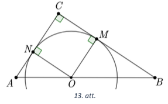
</text>

<text num="1" lang="en">
## Solution 

Denote the points where the circle touches the legs $CB$ and $CA$ by 
$M$ and $N$ respectively (see Fig.13). Since the radius $OM$ is perpendicular 
to the tangent $CB$, the triangle $OMB$ is right. 
By Pitagorean theorem $MB=\sqrt{OB^{2}-MO^{2}}=\sqrt{25-9}=4 \mathrm{~cm}$. 

Since the radii are perpendicular to the tangents and the 
triangle $ACB$ is right, the quadrilateral $ONCM$ has three right angles: 
$\sphericalangle NCM=\sphericalangle CNO=\sphericalangle CMO=90^{\circ}$. 
In this quadrilateral $ONCM$ two sides are the same: $ON=OM$ as two radii, 
so the quadrilateral $ONCM$ is a square and 
$MC=OM=3 \mathrm{~cm}$, $CB=BM+MC=7 \mathrm{~cm}$. 
Note that $\triangle OMB \sim \triangle ACB$ because of the 
condition $\ell \ell$ since they have $\sphericalangle B$
in common and $\sphericalangle OMB=\sphericalangle ACB=90^{\circ}$. 

Then $\frac{AC}{OM}=\frac{CB}{MB'}$, and we get 
$AC=\frac{OM \cdot CB}{MB}=\frac{3 \cdot 7}{4}=5,25 \mathrm{~cm}$. 
Hence $S_{ACB}=\frac{AC \cdot CB}{2}=18 \frac{3}{8} \mathrm{~cm}^{2}$.

</text>

    

# <lo-sample/> LV.AMO.2022B.10.4

<text lang="lv">
Doti reāli skaitļi $a$, $b$ un $c$, kuriem $abc = 1$. Pierādīt, ka vienādojumam

$$ax^4 + (2b + a)x^2 - 2cx + b^3c + bc + bc^3 = 0$$

nav reālu sakņu!
</text>

<text lang="en">
Consider three real numbers $a$, $b$, $c$ with $abc = 1$. 
Prove that the equation 

$$ax^4 + (2b + a)x^2 - 2cx + b^3c + bc + bc^3 = 0$$ 

has no real roots! 
</text>

<small>

* concepts:equation,real-numbers,root
* questionType:Prove
* domain:Alg
* method:PolynomialTransformations
* subdomain:Equations

</small>

<text num="1" lang="lv">
## Atrisinājums

Abas vienādojuma puses reizinām ar $a$ un veicam ekvivalentus 
pārveidojumus (izmantojot, ka $abc=1$):

$$\begin{gathered}
a^{2} x^{4}+\left(2 a b+a^{2}\right) x^{2}-2 a c x+a b^{3} c+a b c+a b c^{3}=0 \\
a^{2} x^{4}+2 a b x^{2}+a^{2} b^{2}-2 a c x+b^{2}+1+c^{2}=0 \\
\left(a^{2} x^{4}+2 a b x^{2}+b^{2}\right)+\left(a^{2} x^{2}-2 a c x+c^{2}\right)+1=0 \\
\left(a x^{2}+b\right)^{2}+(a x-c)^{2}+1=0
\end{gathered}$$

Tā kā vienādojuma kreisās puses vērtība ir vismaz $1$, jo kvadrātu vērtība 
ir nenegatīva, tad dotajam vienādojumam nav reālu sakņu.
</text>

<text num="1" lang="en">
## Solution 

Multiply both sides of the equation by $a$ and 
makes equivalent transforms (using $abc=1$): 

$$\begin{gathered}
a^{2} x^{4}+\left(2 a b+a^{2}\right) x^{2}-2 a c x+a b^{3} c+a b c+a b c^{3}=0 \\
a^{2} x^{4}+2 a b x^{2}+a^{2} b^{2}-2 a c x+b^{2}+1+c^{2}=0 \\
\left(a^{2} x^{4}+2 a b x^{2}+b^{2}\right)+\left(a^{2} x^{2}-2 a c x+c^{2}\right)+1=0 \\
\left(a x^{2}+b\right)^{2}+(a x-c)^{2}+1=0
\end{gathered}$$ 

The left side of the last equation is at least $1$, since both 
squares are nonnegative. Hence the equation does not have real roots.
</text>

    
    
# <lo-sample/> LV.AMO.2022B.10.5

<text lang="lv">
Restorānā ieradās pieci deputāti un pirms pusdienām daži no viņiem 
paspieda viens otram roku. 
Zināms, ka, ja kādi divi deputāti nepaspieda viens otram roku, 
tad abi kopā viņi izdarīja vismaz 
piecus rokasspiedienus. Pierādīt, ka deputātus var sasēdināt 
ap apaļu galdu tā, lai katrs būtu paspiedis 
roku abiem saviem blakussēdētājiem!
</text>

<text lang="en">
Five deputies (MPs) arrived at a restaurant and some of them shook hands with each other 
before lunch. It is known that if two deputies did not shake hands with each other, 
they did at least five handshakes together. Prove that deputies can be seated around 
a circular table so that each deputy has shaken hands with both people seated next to 
him/her. 
</text>

<small>

* concepts:graph,vertex,edge
* questionType:Prove
* domain:Comb
* subdomain:Graphs
* method:ContradictionForExistence

</small>

<text num="1" lang="lv">
## Atrisinājums

Pirmkārt pamatosim, ka no jebkuriem trīs deputātiem vismaz kādi divi 
ir paspieduši viens otram roku. Pieņemsim pretējo, ka kādi trīs 
deputāti nav savā starpā izdarīuši nevienu rokasspiedienu. 
Paņemsim jebkurus divus no tiem, tad tie kopā ir izdarijuš̌i 
lielākais četrus rokasspiedienus (katrs ar diviem atlikušajiem deputātiem) - pretruna. (1)

Otrkārt pamatosim, ka katrs deputāts ir izdarijis vismaz divus rokasspiedienus. 
Pieņemsim pretējo, ka kāds deputāts ir izdarīijs tikai vienu (vai nevienu) 
rokasspiedienu. Apzīmēsim šo deputātu ar $X$ un vienu no deputātiem, 
kam viņš nepaspieda roku, apzīmēsim ar Y. Deputāts $X$ ir paspiedis roku 
ne vairāk kā vienu reizi, bet deputāts $Y$ - ne vairāk kā trīs reizes 
(jo viņš nepaspieda roku deputātam $X$), tātad abi kopā viņi ir paspieduši 
roku ne vairāk kā 4 reizes - pretruna. (2)

Treškārt ievērosim, ka, ja kādi divi deputāti nepaspieda viens otram roku, 
tad vismaz viens no viniem paspieda roku visiem trim pārējiem 
(ja abiem būtu kāds "izlaists" rokasspiediens, tad abiem kopā 
būtu lielākais $2+2=4$ rokasspiedieni). (3)

Pieņemsim, ka kādi divi deputāti nepaspieda viens otram roku 
(ja visi paspieda, tad tos var sēdināt patvalīgi) un nosēdināsim 
tos vietās $A$ un $C$ (skat. 14. att.), vietā $C$ sēdināsim to, 
kurš paspieda roku visiem pārējiem (no (3) tāds noteikti ir). 
Turpmāk šos divus deputātus sauksim par $A$ un $C$.

Iespējami divi gadīumi:

* ja arī $A$ ir paspiedis roku visiem trim pārējiem, tad atlikušos 
  nosēdināsim vietās $B$, $D$ un $E$ tā, lai vietās $D$ un $E$ 
  sēdētu kādi, kas ir paspieduši viens otram roku 
  (no (1) tādi noteikti ir). Ar to prasītais būtu panākts.

* ja $A$ nav paspiedis roku vēl kādam deputātam, tad nosēdināsim 
  to vietā $E$ (un turpmāk sauksim par deputātu $E$). Deputāts $A$ 
  noteikti ir paspiedis roku abiem atlikušajiem deputātiem 
  (citādi viņš būtu izdarījis tikai vienu rokasspiedienu). 
  Deputāts $E$ noteikti ir paspiedis roku vismaz vienam no atlikušajiem 
  diviem deputātiem (citādi $E$ būtu izdarīis tikai vienu rokasspiedienu), 
  šo deputātu nosēdināsim vietā $D$. Redzams, ka ar šo prasītais ir panākts.
</text>

<text num="1" lang="en">
## Solution 

First, let us show that out of any three MPs there are at least two who have shaken hands.
By contradiction, assume that there are three MPs who have not made any handshakes 
between them. Take any two of them - they have made at most four handshakes 
(each with two remaining MPs) - a contradiction. (1) 

Secondly, show that each MP has made at least two handshakes. 
By contradiction, assume that some MP has only done one handshake (or none at all). 
Denote this MP by $X$ and one of the MPs with whom he did not shake hands by $Y$. 
The MP $X$ has done at most one handshake, and MP $Y$ has done at most three 
handshakes (since he did not shake hands with $X$). So together they have 
made at most $4$ handshakes - a contradiction. (2) 

Thirdly, note that if two Members did not shake hands with each other, 
then at least one of them shook hands with all the remaining three. 
Indeed, if both of them would do at most two handshakes, then the pair would 
made at most $2+2=4$ handshakes together. (3) 

Assume that two MPs did not shake hands with each other. (If they all did, 
then they can be seated any way.) Seat those two MPs in places $A$ and $C$ (see Fig.14). 
Let us seat in $C$ the MP who shook hands with everyone else (according to (3) 
that is certainly the case). We will refer to these two Members as $A$ and $C$.

 

There are two possibilities: 

* If $A$ has also shaken hands with all three others, then we'll put the remaining 
  ones in places $B$, $D$ and $E$ so that the two who have shaken hands with each other 
  are sitting in places $D$ and $E$ (according to (1) such MPs can be found).
  
* If $A$ has not shaken hands with somebody else (besides $C$), then let us put 
  that deputy in place $E$ (we will call this deputy $E$). 
  Deputy $A$ has certainly shaken hands with the two remaining MPs (otherwise 
  he would have done just one handshake). Deputy $E$ has certainly shaken 
  hands with at least one of the remaining two MPs (otherwise $E$ would have done just one handshake), let's seat this MP in place $D$. At this point the seating around the table 
  is complete and satisfies the requirements. 
</text>

<text num="2" lang="lv">
## Atrisinājums

Uzskatīsim, ka, ja kādi deputāti nepaspieda viens otram roku, tad viņi 
savstarpēji viens otru ienīst. No dotā izriet, ka, ja kādi divi deputāti 
viens otru ienīst, tad abi kopā viņi ienīst vēl lielākais vienu citu deputātu. 
No šī viegli redzēt, ka deputāts var ienīst lielākais divus citus deputātus. 
Mūsu uzdevums ir sasēdināt tos ap galdu tā, lai blakus nesēdētu divi, kas ienīst viens otru.

Pieņemsim, ka ir kāds deputāts, kas ienīst divus citus deputātus. 
Nosēdināsim šo deputātu vietā A (skat. 14. att.) un tos, ko vinš ienīst -- 
vietās $C$ un $D$ (tālāk sauksim šos deputātus attiecīgi par $A, C$ un $D$). 
Ievērosim, ka visi trīs šie deputāti neienīst nevienu no abiem pārējiem. 
Patiešām, tā kā $A$ un $C$ ienīst viens otru un $A$ ienīst vēl arī $D$, 
tad tie ( $A$ un $C$ ) nevar ienīst vairs nevienu citu. 
Tādu pašu spriedumu var izveikt arī par $A$ un $D$.
Tātad, abus atlikušos deputātus nosēdinot vietās $B$ un $E$, prasītais ir panākts.

Atliek aplūkot gadījumu, kad katrs deputāts ienīst lielākais vienu citu 
deputātu. Tad mums ir lielākais divi pāri deputātu, kas viens otru ienīst, 
nosēdinot tos ne blakus (piemēram, vietās $A$-$C$ un $B$-$D$) prasītais būs panākts.
</text>

<text num="2" lang="en">
## Solution 

If any two deputies did not shake hands with each other, then let's say 
that they hate each other. It follows from the problem that if any two 
deputies hate each other, then there can be at most one more hate relation 
between any of them and the three remaining deputies. 
It easily follows that any deputy can hate at most two other deputies. 
Our task is to seat them around the table so that no two adjacent deputies hate 
each other. 

Assume that there is some deputy who hates two other ones. 
Let us seat this deputy in place $A$ (Fig.14) and the two others he hates -- in 
places $C$ and $D$. (We will also name these deputies $A$, $C$, and $D$ respectively). 
Note that all three of these deputies do not hate any of the two remaining ones. 
Indeed, since $A$ and $C$ hate each other and $A$ hates $D$, 
they ($A$ and $C$) cannnot hate anyone else. The same reasoning applies also to 
$A$ and $D$. So by seating the two remaining members in $B$ and $E$, the requirement 
is satisfied. 

It remains to consider the case where every deputy hates at most one other deputy. 
In this situation we have at most two pairs of deputies who hate each other. 
If they are seated in non-adjacent places (such as $A$-$C$ and also $B$-$D$) 
the requirement is satisfied. 
</text>

    
    
# <lo-sample/> LV.AMO.2022B.11.1

<text lang="lv">
Vai skaitli 2022 var izteikt kā divu veselu skaitļu kubu summu?
</text>

<text lang="en">
Can $2022$ be expressed as the sum of cubes of two integers? 
</text>

<small>

* concepts:sum,cube-Alg,integer-numbers
* questionType:ProveDisprove
* domain:NT
* subdomain:Congruences
* method:ContradictionForExistence

</small>

<text num="1" lang="lv">
## Atrisinājums 

Vispirms noskaidrosim, ar ko var būt kongruenti veselu skaitlu kubi pēc moduļa $9$:

* ja $n \equiv 0\pmod 9$, tad $n^{3} \equiv 0^{3} \equiv 0\pmod 9$;
* ja $n \equiv 1\pmod 9$, tad $n^{3} \equiv 1^{3} \equiv 1\pmod 9 ;$
* ja $n \equiv 2\pmod 9$, tad $n^{3} \equiv 2^{3} \equiv 8 \equiv-1\pmod 9$;
* ja $n \equiv 3\pmod 9$, tad $n^{3} \equiv 3^{3} \equiv 27 \equiv 0\pmod 9$;
* ja $n \equiv 4\pmod 9$, tad $n^{3} \equiv 4^{3} \equiv 64 \equiv 1\pmod 9$;
* ja $n \equiv 5 \equiv-4\pmod 9$, tad $n^{3} \equiv(-4)^{3} \equiv-1\pmod 9$;
* ja $n \equiv 6 \equiv-3\pmod 9$, tad $n^{3} \equiv(-3)^{3} \equiv 0\pmod 9$;
* ja $n \equiv 7 \equiv-2\pmod 9$, tad $n^{3} \equiv(-2)^{3} \equiv 1\pmod 9$;
* ja $n \equiv 8 \equiv-1\pmod 9$, tad $n^{3} \equiv(-1)^{3} \equiv-1\pmod 9$.

Tātad veselu skaitlu kubi ir kongruenti ar 0 vai $\pm 1$ pēc moduļa $9$. 
Aplūkosim, ar ko var būt kongruenta divu veselu skaitllu kubu summa pēc moduļa $9$.

| $a^{3}\pmod 9$ | -1 | 0 | 1 |
| :---: | :--- | :--- | :--- |
| $b^{3}\pmod 9$ |  |  |  |
| -1 | -2 | -1 | 0 |
| 0 | -1 | 0 | 1 |
| 1 | 0 | 1 | 2 |

Esam ieguvuši, ka divu šādu skaitlu summa pēc moduļa $9$ var 
pieņemt jebkuru no vērtībām $-2,-1,0,1,2$, taču nekādas citas. 
Tā kā $2022 \equiv 6 \equiv-3 \pmod 9$ neparādās starp šīm vērtībām, 
tad divu veselu skaitļu kubu summa nevar būt $2022$.
</text>

<text num="1" lang="en">
## Solution 

We find out what are the integer cubes congruent to modulo $9$: 

* if $n \equiv 0\pmod 9$, then $n^{3} \equiv 0^{3} \equiv 0\pmod 9$; 
* If $n \equiv 1\pmod 9$, $n^{3} \equiv 1^{3} \equiv 1\pmod 9$; 
* if $n \equiv 2\pmod 9$, then $n^{3} \equiv 2^{3} \equiv 8 \equiv-1\pmod 9$; 
* if $n \equiv 3\pmod 9$, then $n^{3} \equiv 3^{3} \equiv 27 \equiv 0\pmod 9$; 
* if $n \equiv 4\pmod 9$, then $n^{3} \equiv 4^{3} \equiv 64 \equiv 1\pmod 9$; 
* if $n \equiv 5 \equiv-4\pmod 9$, then $n^{3} \equiv(-4)^{3} \equiv-1\pmod 9$; 
* if $n \equiv 6 \equiv-3\pmod 9$, then $n^{3} \equiv(-3)^{3} \equiv 0\pmod 9$; 
* if $n \equiv 7 \equiv-2\pmod 9$, then $n^{3} \equiv(-2)^{3} \equiv 1\pmod 9$; 
* if $n \equiv 8 \equiv-1\pmod 9$, then $n^{3} \equiv(-1)^{3} \equiv-1\pmod 9$. 

So integer cubes are congruent to $0$ or to $\pm 1$ modulo $9$. 
Let us find out what can the sum of 
two integer cubes be congruent to modulo $9$. 

| $a^{3}\pmod 9$ | -1 | 0 | 1 |
| :---: | :--- | :--- | :--- |
| $b^{3}\pmod 9$ |  |  |  |
| -1 | -2 | -1 | 0 |
| 0 | -1 | 0 | 1 |
| 1 | 0 | 1 | 2 |

We conclude that the sum of two integer cubes modulo $9$ 
can equal to any value from $-2,-1,0,1,2$, 
but nothing else. Since $2022 \equiv 6 \equiv-3 \pmod 9$ does not equal any of these values, 
the sum of two integer cubes cannot equal $2022$.
</text>

    
    
# <lo-sample/> LV.AMO.2022B.11.2

<text lang="lv">
Kādām reālām $p$ vērtībām vienādojuma $x^2 + x + p = 0$ sakņu kvadrātu summa ir $16$?
</text>

<text lang="en">
For what real values $p$ both roots $x_1,x_2$ 
of the equation $x^2 + x + p = 0$ are such that 
$x_1^2 + x_2^2 = 16$? 
</text>

<small>

* concepts:equation,square-Alg,sum,value
* questionType:FindAll
* domain:Alg
* method:
* subdomain:Equations
* method:PolynomialTransformations

</small>

<text num="1" lang="lv">
## Atrisinājums

Apzīmēsim kvadrātvienādojuma saknes ar $x_{1}$ un $x_{2}$. 
Pēc Vjeta teorēmas zināms, ka $x_{1} x_{2}=p$ un $x_{1}+x_{2}=-1$. 
Izmantojot summas kvadrāta formulu, varam aprēķināt, ka

$$x_{1}^{2}+x_{2}^{2}=\left(x_{1}+x_{2}\right)^{2}-2 x_{1} x_{2}=1-2 p=16$$

Esam ieguvuši, ka $2p=-15$ jeb $p=-7,5$.
</text>

<text num="1" lang="en">
## Solution 

Let $x_1,x_2$ be the roots of the quadratic equation. 
By Vietas theorem, $x_{1} x_{2}=p$ and $x_{1}+x_{2}=-1s. 

Use the identity for the square of a sum and calculate: 

$$x_{1}^{2}+x_{2}^{2}=\left(x_{1}+x_{2}\right)^{2}-2 x_{1} x_{2}=1-2p=16.$$ 

We conclude that $2p=-15$ and $p=-7.5$.
</text>

    
# <lo-sample/> LV.AMO.2022B.11.3

<text lang="lv">
Trijstūrī $ABC$ ievilktā riņķa līnija pieskaras malai 
$AB$ punktā $D$ tā, ka $AD = 8$ un $BD = 1$. Aprēķināt malas $BC$
garumu, ja trijstūra leņķa $B$ lielums ir $120^{\circ}$.
</text>

<text lang="en">
The circle inscribed into a triangle $ABC$ touches 
edge $AB$ in point $D$ so that $AD = 8$ and $BD = 1$.
Compute the length of side $BC$ if the size 
of angle $\sphericalangle B$ in the triangle is $120^{\circ}$. 
</text>

<small>

* concepts:triangle,inscribed-circle,angle,tangent
* questionType:FindAll
* domain:Geom
* subdomain:CirclesAndRelatedAngles
* method:AugmentationWithNewElements

</small>

<text num="1" lang="lv">
## Atrisinājums

Apzīmējam riņka līnijas pieskaršanās punktu malai $BC$ ar $E$ un 
malai $AC$ ar $F$ skat. 15.att. Tā kā trijstūrī $ABC$ ir ievilkta riņķa 
līnija, tad pieskaru nogriežņi ir vienādi: $BD=BE=1$,
$AD=AF=8$ un $CE=CF=x$. Tātad $AB=9, BC=1+x, AC=8+x$. 
Izmantojot kosinusu teorēmu, iegūstam

$AC^{2} = AB^{2} + BC^{2} - 2 \cdot AB \cdot BC \cdot \cos \sphericalangle B$  
$(8+x)^{2}=9^{2}+(1+x)^{2}-2 \cdot 9 \cdot(1+x) \cdot \cos 120^{\circ}$  
$64+16 x+x^{2}=81+1+2 x+x^{2}-2 \cdot 9(1+x) \cdot(-0,5)$  
$5x=27$  
$x=5.4$.

Tātad $BC=1+x=6.4$.

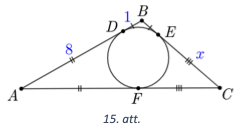
</text>

<text num="1" lang="en">
## Solution 

Denote the point where the inscribed circle touches $BC$ 
by $E$ and the point where it touches $AC$ by $F$ (Fig. 15).
Since the same circle touches the sides of $ABC$, the 
tangents are equal: $BD=BE=1$, $AD=AF=8$, and $CE=CF=x$. 

Therefore $AB=9$, $BC=1+x$, $AC=8+x$. 
By cosine theorem, we get 

$$\begin{gathered}
AC^{2} = AB^{2} + BC^{2} - 2 \cdot AB \cdot BC \cdot \cos \sphericalangle B\\
(8+x)^{2}=9^{2}+(1+x)^{2}-2 \cdot 9 \cdot(1+x) \cdot \cos 120^{\circ} \\
64+16 x+x^{2}=81+1+2 x+x^{2}-2 \cdot 9(1+x) \cdot(-0.5) \\
5x=27\\
x=5.4. 
\end{gathered}$$

So $BC=1+x=6.4$.

</text>

    
    
# <lo-sample/> LV.AMO.2022B.11.4

<text lang="lv">
Pierādīt, ka katru naturālu skaitli, kas ir lielāks nekā $3$, 
var vienā vienīgā veidā izteikt kā trīs naturālu
skaitļu $x,y,z$ ($x \leq y \leq z$) summu tā, lai skaitļiem 
$x$, $y$, $z$ izpildītos nevienādība

$$x^2 + y^2 + z^2 - xy - yz - xz \leq 1.$$
</text>

<text lang="en">
Prove that any positive integer greater than $3$ can be uniquely 
expressed as the sum of three $x,y,z$ ($x \leq y \leq z$) 
positive integers so that the numbers $x$, $y$, $z$ 
satisfy the inequality  

$$x^2 + y^2 + z^2 - xy - yz - xz \leq 1.$$ 
</text>

<small>

* concepts:inequality,natural-numbers,sum
* questionType:Prove
* domain:NT
* method:PolynomialTransformations

</small>

<text num="1" lang="lv">
## Atrisinājums

Ievērosim, ka

$$\begin{gathered}
(x-y)^{2}+(y-z)^{2}+(z-x)^{2}=x^{2}-2 x y+y^{2}+y^{2}-2 y z+z^{2}+z^{2}-2 x z+x^{2}= \\
=2\left(x^{2}+y^{2}+z^{2}-x y-y z-x z\right) \leq 2
\end{gathered}$$

Tātad $(x-y)^{2}+(y-z)^{2}+(z-x)^{2} \leq 2$.

No iegūtās nevienādības izriet, ka vienīgie iespējamie skaitļu 
trijnieki $(x ; y ; z)$, kas apmierina to, ir 
$(k;k;k)$, $(k;k;k+1)$ un $(k;k+1;k+1)$. 
Tas nozīmē, ka ar pirmo trijnieku var izteikt visus skaitļus, 
kuri ir kongruenti ar skaitli $0$ pēc moduļa $3$; ar otro trijnieku 
var izteikt visus skaitļus, kuri ir kongruenti ar skaitli $1$ 
pēc moduļa $3$ un ar trešo trijnieku var izteikt visus skaițus, 
kuri ir kongruenti ar skaitli $2$ pēc moduļa $3$.
Var redzēt, ka iegūtais sadalījums katru reizi ir unikāls.
</text>

<text num="1" lang="en">
## Solution 

Let us note the following:

$$\begin{gathered}
(x-y)^{2}+(y-z)^{2}+(z-x)^{2}=x^{2}-2 x y+y^{2}+y^{2}-2 y z+z^{2}+z^{2}-2 x z+x^{2}= \\
=2\left(x^{2}+y^{2}+z^{2}-x y-y z-x z\right) \leq 2 \\
\end{gathered}$$

So $(x-y)^{2}+(y-z)^{2}+(z-x)^{2} \leq 2$. 

It follows from the resulting inequality that the only possible 
triplets $(x;y;z)$ satisfying it are $(k;k;k)$, $(k;k;k+1)$ and 
$(k;k+1;k+1)$. This means that the first triplet can express all the 
numbers congruent to $0$ modulo $3$; the second triplet can express
all numbers congruent to $1$ modulo $3$, and the third triplet can 
express all numbers congruent to $2$ modulo $3$. 
You can see that the resulting expression with a sum is 
unique every time.
</text>

# <lo-sample/> LV.AMO.2022B.11.5

<text lang="lv">
Mākslas muzeja plānojums ir taisnstūris ar izmēriem $m \times n$ 
($m \geq 2$, $n \geq 2$) rūtiņas, 
kur viena rūtiņa atbilst vienai muzeja telpai. 
Muzeja vadītājs vēlas izveidot apmeklētāju maršrutu, kuram izpildās šādas īpašības:

* maršruts sākas kādā no rūtiņām (telpām), kas atrodas pie taisnstūra malas;
* apmeklētājs no vienas rūtiņas (telpas) var pāriet uz citu rūtiņu (telpu), ja tām ir kopīga mala;
* apmeklētājs maršruta laikā apmeklē katru rūtiņu (telpu) tieši vienu reizi;
* maršruts beidzas rūtiņā (telpā), kas atrodas pie taisnstūra malas blakus 
  maršruta sākuma rūtiņai (telpai).

Kādām $m$ un $n$ vērtībām muzeja vadītājs var izveidot šādu maršrutu?
</text>

<text lang="en">
The floor plan of an art museum is a rectangle with dimensions 
$m \times n$ ($m \geq 2$, $n \geq 2$) squares, where each square 
corresponds to a single museum room. The director of the museum wants
to create a visitor route that satisfies the following requirements: 

* the route starts in one of the squares (rooms) at the edge of the rectangle; 
* a visitor can move from one square (room) to another square (room) 
  if they have a common side; 
* a visitor visits each square (room) exactly once during the route; 
* the route ends in the square (room) next to the edge of the rectangle 
  and next to the square where the route starts. 
  
For what values $m$ and $n$ can the director 
create a route satisfying these requirements?
</text>

<small>

* concepts:grid,square-side,rectangle,path
* questionType:FindAll
* domain:Comb
* subdomain:Graphs
* method:ContradictionForExistence

</small>

<text num="1" lang="lv">
## Atrisinājums

Muzeja vadītājs var izveidot aprakstīto maršrutu visām 
$m;n \geq 2$ vērtībām, kurām vismaz viens no $m$ vai $n$ dalās ar 2. 
Aplūkojam trīs gadījumus.

1. Ja $m=2$ un $n \geq 2$, pagriezīsim taisnstūri tā, lai $m=2$ 
   būtu rindu skaits. Tātad maršruta pirmā daļa ved no apakšējā kreisā stūra 
   uz apakšējo labo stūri (visa apakšējā rinda), tālāk uz augšējo 
   labo stūri un pēc tam augšējo kreiso stūri (visa augšējā rinda). 
   Redzams, ka maršruts apmierina uzdevuma nosacijumus.

2. Ja $m>2$ dalās ar $2$ un $n>2$, pagriezīsim taisnstūri tā, lai 
   $m=2 k(k \geq 2)$ būtu rindu skaits. Lai konstruētu maršrutu, 
   kas apmierina uzdevumu nosacijumus, ieviešam rūtiņu koordinātu 
   sistēmu $(m;n)$, kur $m$ - rindas numurs, $n$-kolonnas numurs un 
   $(1;1)$ ir apakšējais kreisais stūris.

   Aplūkojam maršrutu, kas secīgi vienas rindas vai vienas kolonnas ietvaros savieno šādas rūtiņas:

   * $(i ; 2)$ ar $(i ; n)$
   * $(i ; n)$ ar $(i+1 ; n)$
   * $(i+1 ; n)$ ar $(i+1 ; 2)$;
   * $(i+1 ; 2)$ ar $(i+2 ; 2)$

   kur $i$ secīgi vienāds ar $\{1;3;5;\ldots;m-1=2 k-1\}$.

   Konstruētais maršruts noslēgsies rūtiņā $(m;2)$. 
   Tālāk vedam maršrutu uz $(m;1)$ un attiecīgi $(1;1)$ 
   pa pirmo kolonnu. Redzams, ka maršruts apmierina uzdevuma 
   nosacījumu. Maršruta piemērs redzams 16. att. ar vērtībām $m=4$ un $n=5$.

   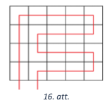

3. Ja gan $m$, gan $n$ nedalās ar $2$ ($m;n \neq 1$), 
   pierādīsim, ka prasīto maršrutu nav iespējams izveidto. 
   Iekrāsosim taisnstūra rūtiņas šaha galdiņa veidā un ievērosim, 
   ka šādam krāsojumam izpildās īpašība: blakus esošām rūtiņām ir dažādas krāsas.

   Pieņemsim pretējo, ka prasītais maršruts eksistē. Tā kā maršruts 
   iziet cauri visām rūtinām, kuru ir nepāra skaits, tad pārejas no 
   vienas rūtiņas uz otru notiek pāra skaitu reižu. Līdz ar to maršruts 
   beigsies tādas pašas krāsas rūtiņā kā sākuma rūtiņa. Taču tā nevar būt, 
   ja šī rūtiņas atrodas blakus, jo tām būtu jābūt dažādās krāsās. 
   Līdz ar to iegūta pretruna un šāds maršruts neeksistē.

Tā kā mainīgos $m$ un $n$ uzdevumā kontekstā var mainīt vietām, tad ir aplūkoti visi iespējamie gadījumi.
</text>

<text num="1" lang="en">
## Solution 

The director can create a route as described above 
if and only if $m;n \geq 2$, and at least one of the $m$ 
or $n$ is divisible by $2$. We analyze three cases. 

1. If $m=2$ and $n \geq 2$, rotate the rectangle so that $m=2$ is the number of rows. 
   Create a route like this: the first part leads from the bottom left corner 
   to the bottom right corner (the entire bottom row), then it passes to the 
   top right corner and then goes all the way left until it reaches the top left corner 
   (the entire top row). It is evident that this route satisfies the requirements. 
2. If the $m>2$ is divisible by $2$ and $n>2$, rotate the rectangle so 
   that $m=2k$ ($k \geq 2$) is the number of rows. 
   In order to create a route satisfying the requirements, 
   introduce coordinates for the little squares (rooms), where 
   $(m;n)$ denotes a square with $m$ equal to the row number, and $n$ equal to 
   the column number; $(1;1)$ is the lower left corner. 
   
   Consider a route connecting the following squares consecutively staying inside the 
   same row or the same column: 
   
   * From $(i;2)$ to $(i;n)$,
   * From $(i;n)$ to $(i+1;n)$,
   * From $(i+1;n)$ to $(i+1;2)$,
   * From $(i+1;2)$ to $(i+2 ; 2)$,
   
   where $i$ takes all the values $\{1;3;5;\ldots;m-1=2 k-1\}$. 
   This route will end in the square $(m;2)$. Next, take the route to the $(m;1)$ 
   and then go to $(1;1)$ while staying in the first column. 
   Such route satisfies the requirements. An example of the route is shown in 
   Fig.16 with values $m=4$ and $n=5$:     
      
3. If both $m$ and $n$ are not divisible by $2$ ($m;n \neq 1$), let us 
   show that the required route cannot be completed. 
   We color the squares within the $m \times n$ rectangle in a chessboard pattern and 
   note that adjacent squares always have different colors. 

   By contradiction, assume that the required route exists. 
   As the route passes through all squares (and the total number of squares is odd), 
   the transition from one square to another square occur an even number of times. 
   Consequently, the route will end in a square of the same colour as the starting 
   square. This is impossible, since both squares are next to each other and 
   should have different colors. 
   Consequently, there is no valid route in this case.

As the variables $m$ and $n$ are interchangeable, all cases are analyzed.
</text>

    
    
# <lo-sample/> LV.AMO.2022B.12.1

<text lang="lv">
Vai skaitli $2023^2$ var izteikt kā trīs veselu skaitļu kubu summu?
</text>

<text lang="en">
Can the number $2023^2$ be expressed as the sum of three integer cubes? 
</text>

<small>

* concepts:integer-numbers,cube-Alg,sum
* questionType:ProveDisprove
* domain:NT
* subdomain:Congruences
* method:ContradictionForExistence

</small>

<text num="1" lang="lv">
## Atrisinājums

Vispirms noskaidrosim, ar ko var būt kongruenti veselu skaitlu kubi pēc moduļa $9$:

* ja $n \equiv 0 \pmod 9$, tad $n^{3} \equiv 0^{3} \equiv 0 \pmod 9$;
* ja $n \equiv 1 \pmod 9$, tad $n^{3} \equiv 1^{3} \equiv 1 \pmod 9$;
* ja $n \equiv 2 \pmod 9$, tad $n^{3} \equiv 2^{3} \equiv 8 \equiv-1 \pmod 9$;
* ja $n \equiv 3 \pmod 9$, tad $n^{3} \equiv 3^{3} \equiv 27 \equiv 0 \pmod 9$;
* ja $n \equiv 4 \pmod 9$, tad $n^{3} \equiv 4^{3} \equiv 64 \equiv 1 \pmod 9$;
* ja $n \equiv 5 \equiv-4 \pmod 9$, tad $n^{3} \equiv(-4)^{3} \equiv-4^{3} \equiv-1 \pmod 9$;
* ja $n \equiv 6 \equiv-3 \pmod 9$, tad $n^{3} \equiv(-3)^{3} \equiv 0 \pmod 9$;
* ja $n \equiv 7 \equiv-2 \pmod 9$, tad $n^{3} \equiv(-2)^{3} \equiv 1 \pmod 9$;
* ja $n \equiv 8 \equiv-1 \pmod 9$, tad $n^{3} \equiv(-1)^{3} \equiv-1 \pmod 9$.

Tātad veselu skaitlu kubi ir kongruenti ar 0 vai $\pm 1$ pēc moduļa 9. Aplūkosim, ar ko var būt kongruenta divu veselu skaitlu kubu summa pēc moduļa 9.

| $a^{3} \pmod 9$ | -1 | 0 | 1 |
| :---: | :--- | :--- | :--- |
| $b^{3} \pmod 9$ | -2 | -1 | 0 |
| -1 | -1 | 0 | 1 |
| 0 | 0 | 1 | 2 |
| 1 |  |  |  |

Tagad aplūkojam, ar ko var būt kongruenta trīs veselu skaitļu kubu summa pēc modula 9.

| $a^{3}+b^{3} \pmod 9$ | -1 | 0 | 1 | -2 | 2 |
| :---: | :--- | :--- | :--- | :--- | :--- |
| -1 | -2 | -1 | 0 | -3 | 1 |
| 0 | -1 | 0 | 1 | -2 | 2 |
| 1 | 0 | 1 | 2 | -1 | 3 |

Esam ieguvuši, ka trīs šādu skaițu summa pēc moduļa 9 var pienemt jebkuru no vērtībām $-3 ;-2 ;-1 ; 0 ; 1 ; 2 ; 3$ un nekādas citas. Tā kā $2023^{2} \equiv 7^{2} \equiv 4 \equiv-5 \pmod 9$ neparādās starp šīm vērtībām, tad trīs veselu skaitļu kubu summa nevar būt $2023^{2}$.
</text>

<text num="1" lang="en">
## Solution 

We first find out what the integer cubes are congruent to modulo $9$: 

* if $n \equiv 0 \pmod 9$, then $n^{3} \equiv 0^{3} \equiv 0 \pmod 9$; 
* if $n \equiv 1 \pmod 9$, then $n^{3} \equiv 1^{3} \equiv 1 \pmod 9$; 
* if $n \equiv 2 \pmod 9$, then $n^{3} \equiv 2^{3} \equiv 8 \equiv-1 \pmod 9$; 
* if $n \equiv 3 \pmod 9$, then $n^{3} \equiv 3^{3} \equiv 27 \equiv 0 \pmod 9$; 
* if $n \equiv 4 \pmod 9$, then $n^{3} \equiv 4^{3} \equiv 64 \equiv 1 \pmod 9$; 
* if $n \equiv 5 \equiv-4 \pmod 9$, then $n^{3} \equiv(-4)^{3} \equiv-4^{3} \equiv-1 \pmod 9$; 
* if $n \equiv 6 \equiv-3 \pmod 9$, then $n^{3} \equiv(-3)^{3} \equiv 0 \pmod 9$; 
* if $n \equiv 7 \equiv-2 \pmod 9$, then $n^{3} \equiv(-2)^{3} \equiv 1 \pmod 9$; 
* if $n \equiv 8 \equiv-1 \pmod 9$, then $n^{3} \equiv(-1)^{3} \equiv-1 \pmod 9$.

So integer cubes are congruent to $0$ or $\pm 1$ modulo $9$. 
Let us consider what is the sum of two integer cubes congruent to modulo $9$: 

| $a^{3} \pmod 9$ | $-1$  | $0$   | $1$   |
| :-------------: | :---- | :---- | :---- |
| $b^{3} \pmod 9$ | $-2$  | $-1$  | $0$   |
| $-1$            | $-1$  | $0$   | $1$   |
| $0$             | $0$   | $1$   | $2$   |
| $1$             |       |       |       |

Next, consider what is the sum of three integer cubes modulo $9$. 

| $a^{3}+b^{3} \pmod 9$ | $-1$  | $0$   | $1$   | $-2$  | $2$   |
| :-------------------: | :---- | :---- | :---- | :---- | :---- |
| $-1$                  | $-2$  | $-1$  | $0$   | $-3$  | $1$   |
| $0$                   | $-1$  | $0$   | $1$   | $-2$  | $2$   |
| $1$                   | $0$   | $1$   | $2$   | $-1$  | $3$   |

We conclude that the sum of three integer cubes modulo $9$ can take any of the values 
$-3 ;-2 ;-1 ; 0 ; 1 ; 2 ; 3$ and nothing else. 
As $2023^{2} \equiv 7^{2} \equiv 4 \equiv-5 \pmod 9$ does not appear among these values, 
the sum of three whole skaitļu cubes cannot be $2023^{2}$.
</text>

    
# <lo-sample/> LV.AMO.2022B.12.2

<text lang="lv">
Kādām reālām $p$ vērtībām vienādojuma $x^2 + x + p$ sakņu kubu summa ir $(-16)$?
</text>

<text lang="en">
For what real values $p$ the sum of cubes of both roots of the equation $x^2 + x + p$ is equal to $(-16)$? 
</text>

<small>

* concepts:real-numbers,cube-Alg,equation
* questionType:FindAll
* domain:Alg
* subdomain:Equations
* method:PolynomialTransformations

</small>

<text num="1" lang="lv">
## Atrisinājums

Apzīmēsim kvadrātvienādojuma saknes ar $x_{1}$ un $x_{2}$. 
Pēc Vjeta teorēmas zināms, ka $x_{1} x_{2}=p$ un $x_{1}+x_{2}=-1$. 
Izmantojot summas kvadrāta formulu, varam aprēķināt, ka

$$x_{1}^{2}+x_{2}^{2}=\left(x_{1}+x_{2}\right)^{2}-2 x_{1} x_{2}=1-2p.$$

Sakņu kubu summu var izteikt kā

$$x_{1}^{3}+x_{2}^{3}=\left(x_{1}+x_{2}\right)\left(x_{1}^{2}-x_{1} x_{2}+x_{2}^{2}\right)=-1(1-2 p-p) = 3p-1 = -16.$$

Tātad $3p=-15$ un $p=-5$.
</text>

<text num="1" lang="en">
## Solution 

Denote the roots of the square equation with $x_{1}$ and $x_{2}$. 
Vietas theorem states that $x_{1} x_{2}=p$ and $x_{1}+x_{2}=-1$. Using the 
identy for the square of sum: 

$$x_{1}^{2}+x_{2}^{2} = \left(x_{1}+x_{2}\right)^{2} - 2x_{1}x_{2} = 1-2p.$$ 

The sum of cubes: 

$$x_{1}^{3}+x_{2}^{3} = \left(x_{1}+x_{2}\right)\left( x_{1}^{2}-x_{1} x_{2}+x_{2}^{2} \right )= -1(1-2p-p) = 3p-1 = -16.$$ 

So $3p=-15$ and $p=-5$.
</text>

    
    
# <lo-sample/> LV.AMO.2022B.12.3

<text lang="lv">
Trijstūrī $ABC$ no virsotnes $A$ vilktā augstuma garums ir $1$,
no virsotnes $C$ vilktās mediānas garums arī ir $1$, bet
augstuma no virsotnes $B$ garums ir $\sqrt{3}$. Kāds var būt šī trijstūra laukums?
</text>

<text lang="en">
In triangle $ABC$ the length of altitude drawn from $A$ is $1$. 
The median drawn from $C$ also has length $1$, but the altitude drawn from $B$ 
has length $\sqrt{3}$. What can be the area of this triangle? 
</text>

<small>

* concepts:triangle,median,altitude,area
* questionType:FindAll
* domain:Geom
* subdomain:Triangles
* method:AugmentationWithNewElements

</small>

<text num="1" lang="lv">
## Atrisinājums

Apzīmēsim $AB$ viduspunktu ar $M$ un novilksim perpendikulus 
$MP$ un $MT$ attiecīgi pret malām $AC$ un $BC$. 
Augstuma pamatus, kas vilkti no virsotnēm $A$ un $B$, apzīmēsim attiecīgi 
ar $Q$ un $N$. Tā kā $MT \| AQ$, jo $MT \perp BC$ un $AQ \perp BC$, 
tad $M T$ ir trijstūra $A Q B$ viduslīnija, 
tātad $M T=\frac{1}{2} A Q=\frac{1}{2}$. 
Līdzīgi iegūstam, ka $M P=\frac{1}{2} B N=\frac{\sqrt{3}}{2}$.

Ievērojam, ka taisnleņķa trijstūrī $MTC$ izpildās, ka 
$\sin \sphericalangle MCT=\frac{M T}{M C}=\frac{1}{2}$, tātad 
$\sphericalangle M C T=30^{\circ}$. Līdzīgi iegūstam, ka taisnleņka trijstūrī 
$MPC$ izpildās, ka $\sin \sphericalangle M C P=\frac{M P}{M C}=\frac{\sqrt{3}}{2}$, 
tātad $\sphericalangle M C P=60^{\circ}$.

Aplūkojam iespējamās $\sphericalangle MCB$ vērtības:

* ja $T$ atrodas uz $BC$, tad $\sphericalangle M C B=30^{\circ}$;
* ja $T$ atrodas uz $BC$ pagarinājuma, tad $\sphericalangle M C B=150^{\circ}$.

Tā kā $\sphericalangle ACB=\sphericalangle MCA+\sphericalangle MCB$, gadījums, 
ka $\sphericalangle MCB=150^{\circ}$, nav iespējams, jo tad pie 
jebkuras $\sphericalangle M C B$ vērtības $\sphericalangle A C B$ būs vienāds 
vai lielāks nekā $180^{\circ}$. No tā izriet, ka $\sphericalangle MCB=30^{\circ}$.

Līdzīgi aplūkojam iespējamās $\sphericalangle MCA$ un $\sphericalangle ACB$ vērtības:

* ja $P$ atrodas $AC$, tad $\sphericalangle MCA = 60^{\circ}$ un $\sphericalangle ACB = 90^{\circ}$,
* ja $P$ atrodas uz $AC$ pagarinājuma, tad $\sphericalangle MCA = 120^{\circ}$ un 
  $\sphericalangle A C B=150^{\circ}$.

Ja $\sphericalangle ACB=90^{\circ}$ (skat. 17. att.), tad augstumi no virsotnēm 
$A$ un $B$ sakrīt ar katetēm $AC$ un $BC$, tātad

$$S_{ABC}=\frac{AC \cdot BC}{2}=\frac{1 \cdot \sqrt{3}}{2}=\frac{\sqrt{3}}{2}.$$

Ja $\sphericalangle ACB=150^{\circ}$ (skat. 18. att.), aplūkojam taisnleņķa trijstūri $AQC$, kurā $\sphericalangle A C Q=30^{\circ}$, tātad $\frac{A Q}{A C}=\sin \sphericalangle ACQ=\frac{1}{2}$. No tā izriet, ka $A C=2 \cdot A Q=2$ un

$$S_{ABC}=\frac{AC \cdot BN}{2}=2 \cdot \frac{\sqrt{3}}{2}=\sqrt{3}.$$

Tātad trijstūra laukums var būt $\frac{\sqrt{3}}{2}$ vai $\sqrt{3}$.

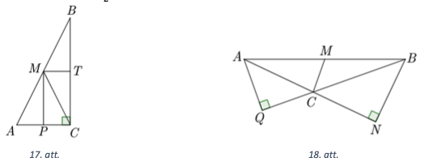
</text>

<text num="1" lang="en">
## Solution 

Let $M$ be the midpoint of $AB$. Draw perpendiculars $MP$ and $MT$ against 
the sides $AC$ and $BC$ respectively. Let $Q$ and $N$ be the feet of 
altitudes of $ABC$ drawn from the vertices $A$ and $B$ respectively. 
Since $MT \perp BC$ and $AQ \perp BC$, we have $MT \| AQ$. 
Therefore $MT$ is the midsegment of $AQB$, and therefore 
$MT=\frac{1}{2} AQ=\frac{1}{2}$. Similarly, we get that 
$MP=\frac{1}{2} BN=\frac{\sqrt{3}}{2}$. 

Note that for the right triangle $MTC$ we have 
$\sin \sphericalangle MCT = \frac{MT}{MC} = \frac{1}{2}$, therefore 
$\sphericalangle MCT = 30^{\circ}$. 
Similarly, in the right triangle $MPC$ we have 
$\sin \sphericalangle MCP = \frac{MP}{MC}=\frac{\sqrt{3}}{2}$, hence 
$\sphericalangle MCP=60^{\circ}$. 

Consider the possible values of $\sphericalangle MCB$: 

* If $T$ is on $BC$, then $\sphericalangle MCB = 30^{\circ}$; 
* If $T$ is on the extension of $BC$, $\sphericalangle MCB = 150^{\circ}$. 

As $\sphericalangle ACB=\sphericalangle MCA+\sphericalangle MCB$, it is impossible 
to have $\sphericalangle MCB=150^{\circ}$, since $\sphericalangle ACB$ would 
be at least $180^{\circ}$ for any value of $\sphericalangle MCB$. 
Hence $\sphericalangle MCB=30^{\circ}$. Analyze the values of 
$\sphericalangle MCA$ and $\sphericalangle ACB$ values similarly: 

* if $P$ is on $AC$, then $\sphericalangle MCA=60^{\circ}$ and 
  $\sphericalangle ACB=90^{\circ}$ 
* if $P$ is on the extension of $AC$, then $\sphericalangle MCA = 120^{\circ}$ 
  and $\sphericalangle ACB=150^{\circ}$. 
  
If $\sphericalangle ACB=90^{\circ}$ (see Fig.17), the altitudes from  
vertices $A$ and $B$ coincide with the catheti (i.e. legs) $AC$ and $BC$, so

$$S_{ABC}=\frac{AC \cdot BC}{2}=\frac{1 \cdot \sqrt{3}}{2}=\frac{\sqrt{3}}{2}.$$ 

If $\sphericalangle ACB=150^{\circ}$ (see Fig.18), consider the right 
triangle $AQC$ where $\sphericalangle ACQ = 30^{\circ}$, hence 
$\frac{AQ}{AC}=\sin \sphericalangle ACQ=\frac{1}{2}$. 
It follows that $AC = 2 \cdot AQ=2$ and 

$$S_{ABC}=\frac{AC \cdot BN}{2}=2 \cdot \frac{\sqrt{3}}{2}=\sqrt{3}.$$ 

Therefore the area of the triangle can be either $\frac{\sqrt{3}}{2}$ or $\sqrt{3}$.

</text>

    
    
# <lo-sample/> LV.AMO.2022B.12.4

<text lang="lv">
Atrisināt reālos skaitļos vienādojumu $3 \sin x + 4 \cos x = 6$.
</text>

<text lang="en">
Solve the equation $3 \sin x + 4 \cos x = 6$ in real numbers.
</text>

<small>

* concepts:equation,real-numbers,sine,cosine
* questionType:FindAll
* domain:Alg
* method:PolynomialTransformations
* subdomain:Equations

</small>

<text num="1" lang="lv">
## Atrisinājums

Izdalām abas vienādojuma puses ar $5$:

$$\frac{3}{5} \sin x+\frac{4}{5} \cos x=\frac{6}{5}.$$

Izvēlēsimies tādu šauru leņki $\alpha$, ka $\sin \alpha=\frac{4}{5}$. Tādā gadījumā 
$\cos \alpha=\sqrt{1-\sin ^{2} \alpha}=\sqrt{1-\left(\frac{4}{5}\right)^{2}}=\frac{3}{5}$ un vienādojumu varam pārrakstīt kā

$$\begin{aligned}
& \sin x \cos \alpha+\cos x \sin \alpha=\frac{6}{5} \\
& \sin (x+\alpha)=\frac{6}{5}
\end{aligned}$$

Tā kā sinusa vērtības nepārsniedz 1, tad šim vienādojumam atrisinājumu nav. 
Tātad arī dotajam vienādojumam atrisinājuma nav.
</text>

<text num="1" lang="en">
## Solution 

Divide both sides of the equation by $5$: 

$$\frac{3}{5} \sin x+\frac{4}{5} \cos x=\frac{6}{5}.$$ 

Choose an acute angle $\alpha$ such that $\sin \alpha=\frac{4}{5}$. 
In this case $\cos \alpha = \sqrt{1-\sin ^{2} \alpha} = \sqrt{1-\left(\frac{4}{5}\right)^{2}}=\frac{3}{5}$ and the equation becomes 

$$\begin{gathered}
\sin x \cos \alpha+\cos x \sin \alpha=\frac{6}{5} \\
\sin (x+\alpha)=\frac{6}{5}
\end{gathered}$$ 

Sine values never exceed $1$, so there are no solutions for this equation. 
And there is no solution for the original equation either.
</text>

<text num="2" lang="lv">
## Atrisinājums

Izmantojot divkāršā leņka formulas un $\cos ^{2} \frac{x}{2}+\sin ^{2} \frac{x}{2}=1$, 
iegūstam, ka

$$\begin{aligned}
& 3 \cdot 2 \sin \frac{x}{2} \cos \frac{x}{2}+4\left(\cos ^{2} \frac{x}{2}-\sin ^{2} \frac{x}{2}\right)=6\left(\cos ^{2} \frac{x}{2}+\sin ^{2} \frac{x}{2}\right) \\
& 6 \sin \frac{x}{2} \cos \frac{x}{2}+4 \cos ^{2} \frac{x}{2}-4 \sin ^{2} \frac{x}{2}=6 \cos ^{2} \frac{x}{2}+6 \sin ^{2} \frac{x}{2} \\
& 2 \cos ^{2} \frac{x}{2}-6 \sin \frac{x}{2} \cos \frac{x}{2}+10 \sin ^{2} \frac{x}{2}=0
\end{aligned}$$

Abas vienādojuma puses dalot ar $2 \sin ^{2} \frac{x}{2} \neq 0$, iegūstam, ka

$$\operatorname{ctg}^{2} \frac{x}{2}-3 \operatorname{ctg} \frac{x}{2}+5=0$$

Apzīmējot $\operatorname{ctg} \frac{x}{2}=t$, iegūstam kvadrātvienādojumu 
$t^{2}-3 t+5=0$, kura diskriminants $D=(-3)^{2}-4 \cdot 1 \cdot 5=-11<0$, 
tātad kvadrātvienādojumam nav sakņu, līdz ar to dotajam vienādojumam nav atrisinājuma.
</text>

<text num="2" lang="en">
## Solution 

Use double angle formulas and the identity $\cos ^{2} \frac{x}{2}+\sin ^{2} \frac{x}{2}=1$. 
we get 

$$\begin{gathered}
3 \cdot 2 \sin \frac{x}{2} \cos \frac{x}{2}+4\left(\cos ^{2} \frac{x}{2}-\sin ^{2} \frac{x}{2}\right)=6\left(\cos ^{2} \frac{x}{2}+\sin ^{2} \frac{x}{2}\right), \\
6 \sin \frac{x}{2} \cos \frac{x}{2}+4 \cos ^{2} \frac{x}{2}-4 \sin ^{2} \frac{x}{2}=6 \cos ^{2} \frac{x}{2}+6 \sin ^{2} \frac{x}{2}, \\
2 \cos ^{2} \frac{x}{2}-6 \sin \frac{x}{2} \cos \frac{x}{2}+10 \sin ^{2} \frac{x}{2}=0.
\end{gathered}$$

Now divide both sides of the last equation by $2 \sin ^{2} \frac{x}{2} \neq 0$:

$$\operatorname{ctg}^{2} \frac{x}{2}-3 \operatorname{ctg} \frac{x}{2}+5=0.$$

Denote $\operatorname{ctg}^{2} = t$, get a quadratic equation $t^{2}-3t+5=0$. 
Its discriminant $D=(-3)^{2}-4 \cdot 1 \cdot 5=-11<0$, so there are 
no roots. Hence there is no solution for the original equation. 
</text>

<text num="3" lang="lv">
## Atrisinājums

No abām vienādojuma pusēm atņemot $4 \cos x$, iegūstam, ka $3 \sin x=6-4 \cos x$.
Kāpinot abas vienādojuma puses kvadrātā, iegūstam, ka

$$9 \sin ^{2} x=36-48 \cos x+16 \cos ^{2} x$$

Izmantojot $\sin ^{2} x=1-\cos ^{2} x$, iegūstam, ka

$$\begin{gathered}
9\left(1-\cos ^{2} x\right)=36-48 \cos x+16 \cos ^{2} x \\
9-9 \cos ^{2} x=36-48 \cos x+16 \cos ^{2} x \\
25 \cos ^{2} x-48 \cos x+27=0
\end{gathered}$$

Apzīmējot $\cos x=t$, iegūstam kvadrātvienādojumu $25 t^{2}-48 t+27=0$, 
kura diskriminants $D=(-48)^{2}-4 \cdot 25 \cdot 27=48 \cdot 48-50 \cdot 54<0$, 
tātad kvadrātvienādojumam nav sakņu, līdz ar to arī dotajam vienādojumam nav sakņu.
</text>

<text num="3" lang="en">
## Solution 

Subtract $4 \cos x$ from both sides and get $3 \sin x=6-4 \cos x$. 
Raise both sides to the second power to get the following:

$$9 \sin ^{2} x=36-48 \cos x+16 \cos ^{2} x$$

Use the identity $\sin ^{2} x=1-\cos ^{2} x$ to rewrite like this:

$$\begin{gathered}
9\left(1-\cos ^{2} x\right)=36-48 \cos x+16 \cos ^{2} x, \\
9-9 \cos ^{2} x=36-48 \cos x+16 \cos ^{2} x, \\
25 \cos ^{2} x-48 \cos x+27=0. 
\end{gathered}$$

Denote $\cos x=t$ to get a quadratic equation $25t^2 - 48t + 27 = 0$ and 
discriminant $D=(-48)^{2}-4 \cdot 25 \cdot 27=48 \cdot 48-50 \cdot 54<0$. 
So the quadratic equation has no roots, and the original equation has no roots either. 
</text>

<text num="4" lang="lv">
## Atrisinājums

Pierādīsim, ka izpildās nevienādība $a \sin x+b \cos x \leq \sqrt{a^{2}+b^{2}}$. 
Kāpināsim abas nevienādības puses kvadrātā un izmantosim, ka 
$\sin ^{2} x+\cos ^{2} x=1$. Iegūstam, ka

$$\begin{gathered}
(a \sin x+b \cos x)^{2} \leq\left(a^{2}+b^{2}\right)\left(\sin ^{2} x+\cos ^{2} x\right) \\
a^{2} \sin ^{2} x+2 a b \sin x \cos x+b \cos ^{2} x \leq a^{2} \sin ^{2} x+a^{2} \cos ^{2} x+b^{2} \sin ^{2} x+b^{2} \cos ^{2} x \\
0 \leq a^{2} \cos ^{2} x-2 a b \sin x \cos x+b^{2} \sin ^{2} x \\
(a \cos x-b \sin x)^{2} \geq 0
\end{gathered}$$

Tā kā nevienādība ir patiesa jebkurai $a, b$ un $x$ vērtībai, 
tad sākotnējā nevienādība $a \sin x+b \cos x \leq \sqrt{a^{2}+b^{2}}$ 
ir patiesa. No tā izriet, ka $3 \sin x+4 \cos x \leq \sqrt{3^{2}+4^{2}}=5$, 
tātad dotajam vienādojumam nav sakņu.
</text>

<text num="4" lang="en">
## Solution 

We will prove the following inequality: $a \sin x+b \cos x \leq \sqrt{a^{2}+b^{2}}$. 
Raise both sides of the inequality to the power two and use the 
identity $\sin ^{2} x+\cos ^{2} x=1$. We get the following inequalities: 

$$\begin{gathered}
(a \sin x+b \cos x)^{2} \leq\left(a^{2}+b^{2}\right)\left(\sin ^{2} x+\cos ^{2} x\right) \\
a^{2} \sin ^{2} x+2 a b \sin x \cos x+b \cos ^{2} x \leq a^{2} \sin ^{2} x+a^{2} \cos ^{2} x+b^{2} \sin ^{2} x+b^{2} \cos ^{2} x \\
0 \leq a^{2} \cos ^{2} x-2 a b \sin x \cos x+b^{2} \sin ^{2} x \\
(a \cos x-b \sin x)^{2} \geq 0
\end{gathered}$$

The last inequality is true for any $a, b$ and $x$. 
Therefore the initial inequality $a \sin x+b \cos x \leq \sqrt{a^{2}+b^{2}}$ is true as well. 
It follows that $3 \sin x+4 \cos x \leq \sqrt{3^{2}+4^{2}}=5$, 
and therefore the original equation has no roots. 
</text>

    
    
    
# <lo-sample/> LV.AMO.2022B.12.5
    
<text lang="lv">
Dota rūtiņu tabula $n \times n$. Ilmārs un Kims spēlē šādu spēli. 
Viņi pēc kārtas kādā vēl tukšā rūtiņā ieraksta skaitli $1$
vai $-1$. Spēli sāk Ilmārs. Ja pēc kāda spēlētāja gājiena tiek 
aizpildīta kāda rinda vai kolonna, tad tiek aprēķināts
tajā esošo skaitļu reizinājums. Ja tas ir vienāds ar $-1$, tad spēlētājs, 
kurš veica pēdējo gājienu, iegūst $1$ punktu
(ja spēlētājs ar savu gājienu vienlaicīgi pabeidz gan rindu, gan kolonnu 
un katrā skaitļu reizinājums ir $-1$, tad
viņš iegūst divus punktus). Spēle beidzas, kad tabula ir pilnībā aizpildīta. Uzvar spēlētājs, kurš iegūst visvairāk
punktu. Kuram spēlētājam ir uzvaroša stratēģija, ja **(A)** $n = 2021$; **(B)** $n = 2022$?
</text>

<text lang="en">
A table consists of $n \times n$ little squares. Ilmārs and Kims play the following 
game. They make alternating moves: in every move a player enters either 
$1$ or $-1$ in some little square that was empty so far. 
Ilmārs makes the first move. If a row or a column is completely filled in 
after some player's move, we calculate the product of the numbers in the row or column. 
If the product equals $-1$ then the player who completed that row/column gets $1$ point.
(If a player completed a row and a column at the same time, 
and both products were $-1$, then he scores two points). 
The game ends when all squares in the table are filled in. 
The player who gets more points wins. Which player has a winning strategy, if
**(A)** $n = 2021$; **(B)** $n = 2022$? 
</text>

    
<small>

* concepts:game,table,row,column,product,winning-strategy
* questionType:ProveDisprove
* domain:Comb
* subdomain:CombinatorialGames

</small>

<text num="1" lang="lv">
## Atrisinājums 

**(A)** Ja $n=2021$, uzvar Ilmārs. Pirmajā gājienā viņš centrālajā 
rūtiņā ieraksta skaitli $-1$, bet tālākajos gājienos spēlē simetriski 
attiecībā pret centrālo rūtinu un Kima gājienu. Tādā gadījumā, 
ja Kims pēc sava gājiena iegūs kādu punktu, Ilmārs simetriski 
arī iegūs punktu. Tātad Ilmārs iegūs tieši tikpat punktu, cik Kims. 
Papildus tam varam ievērot, ka Ilmārs būs tas, kurš aizpildīs 
vidējo rindu un vidējo kolonnu simetrijas dēl. Tā kā visi skaitļi 
tajās būs simetriski, izņemot to, ka pa vidu ir ierakstīts $-1$, 
tad varam secināt, ka reizinājums būs $-1$ un Ilmārs iegūs papildu 
$2$ punktus, kas ļaus viņam uzvarēt.

**(B)** Ja $n=2022$, uzvar Kims. Viņš katru savu gājienu veic 
simetriski pret vertikālo tabulas simetrijas asi un Ilmāra gājienu, 
izņemot tos brīžus, kad viņam ir jāveic gājiens rindā, kurā 
ir atlikusi tieši viena tukša rūtiņa. Tajos brīžos viņš izvēlas 
tādu skaitli, lai šīs rindas reizinājums būtu $-1$. 
Simetrijas dēl Kims vienmēr būs tas, kurš aizpilda kādu rindu, 
un šī stratēǵija garantēs viņam $2022$ punktus par rindām. 
Papildus varam ievērot, ka simetrijas dēļ katru reizi, 
kad Ilmārs aizpildīs kādu kolonnu, tad nākamajā gājienā Kims 
aizpildīs simetrisko kolonnu. Līdz ar to Ilmārs aizpildīs tieši 
$1011$ kolonnas, kas viņam dod ne vairāk kā $1011$ punktus. 
Tātad Kims uzvarēs.
</text>

<text num="1" lang="en">
## Solution 

**(A)** 
If $n=2021$, Ilmārs wins. In his first move, he enters $-1$ in the central 
square; in all subsequent moves he plays symmetrically -- he writes the 
same number as Kim in the square located symmetrically against the center 
of the table. Whenever Kim scores a point after his move, Ilmārs will 
also score a point as he also fills a row/column on the opposite side. 
So Ilmārs will score just as many points as Kim. Additionally, 
note that Ilmārs will be the one who completes the middle row and the middle column,  
since he can always answer symmetrically to any Kim's move in that row or column. 
All numbers in the middle row and the middle column will be symmetrical, 
except the middle $-1$ that was recorded at the very beginning. 
So the product in the middle row/column will be $-1$, and Ilmārs will score 
extra $2$ points allowing him to win. 

**(B)** 
If $n=2022$, Kim wins. He repeats every number written by Ilmārs symmetrically 
against the vertical axis of symmetry in the table. The only exceptions 
are the moments when he has to make the last move in some row with exactly 
one empty square. In such cases he does not repeat the move of Ilmārs, but 
chooses a number to get the product on that row equal to $-1$. 
Because of symmetry, Kim will always be the one to fill a row, 
and this strategy will guarantee him $2022$ points -- one per every row. 
Additionally, note that every time Ilmārs completes a column, 
Kim will complete the symmetric column in his next move. 
As a result, Ilmārs will complete exactly $1011$ columns that gives him 
at most $1011$ points. Therefore Kim will win.
</text>
    

    