# <lo-sample/> LV.AMO.2023.5.1

Skaitļus no $1$ līdz $9$ ieraksti 1. att. redzamajos mazajos trijstūros 
(katrā trijstūrī citu naturālo skaitli) tā,
lai blakus trijstūros ierakstītie skaitļi neatšķiras vairāk kā par $3$.  
*Piezīme.* Par blakus trijstūriem sauksim trijstūrus, kam ir kopīga mala.

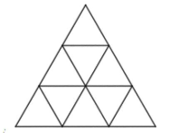

<small>

* topic:ArithmeticIdentities
* concepts:difference,distance,triangle
* seeAlso:LV.AMO.2023.6.1
* questionType:FindExample
* domain:Comb

</small>

## Atrisinājums

Sk., piemēram, 2. att., kur pelēkā krāsā norādītas atbilstošās starpības.

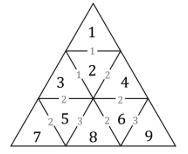

# <lo-sample/> LV.AMO.2023.5.2

Doti divi skaitļi. Zināms, ka viens no tiem ir tieši septiņas reizes 
lielāks nekā otrs un katram no tiem ir vismaz divi
cipari. Vai var gadīties, ka abu skaitļu pierakstā izmantoti tikai cipari 
**(A)** $3$; $4$; $6$ un $7$; **(B)** $1$; $2$ un $3$?

<small>

* concepts:decimal-notation
* topic:ModularArithmeticLastDigit
* subdomain:NumeralSystems
* strategy:CaseAnalysis
* questionType:ProveDisprove,ProveDisprove
* domain:NT

</small>

## Atrisinājums

**(a)** Nē, nevar. Ja skaitļa pēdējais cipars ir $3$, $4$, $6$ vai $7$, tad septiņas reizes lielāka skaitļa
pēdējais cipars ir attiecīgi $1$; $8$; $2$ vai $9$, bet pēc uzdevuma nosacījumiem nevienu no šiem cipariem
nevar izmantot skaitļu pierakstā.  
**(b)** Jā, var, piemēram, der skaitļi $33$ un $231$, jo $33 \cdot 7 = 231$.

# <lo-sample/> LV.AMO.2023.5.3

Rūtiņu lapā, kurā katras rūtiņas malas garums ir $1$, uzzīmē daudzstūri, kuram gan perimetra, gan
laukuma vērtība ir tāda pati kā malu skaits!

<small>

* questionType:FindExample
* topic:SquareGridShapes
* subdomain:IntegerLattices
* strategy:TrialAndError
* domain:Geom

</small>

## Atrisinājums

Piemēram, skat. 3. att., kur uzzīmēts $32$-stūris, kura laukuma un perimetra vērtība ir $32$.

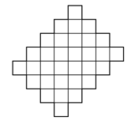

# <lo-sample/> LV.AMO.2023.5.4

Dots kvadrāts ar izmēriem $n \times n$ rūtiņas. 
Vienā gājienā kauliņu var pārlikt tieši $2$ rūtiņas uz priekšu pa jebkuru
no diagonālēm, kas iziet no tā lauciņa, kurā atrodas kauliņš (skat. 4. att., 
kur kauliņš apzīmēts ar "o" un ar "x"
atzīmētas tās rūtiņas, uz kurām to drīkst pārvietot). Vai, veicot vairākus gājienus, 
kauliņu no kreisās apakšējās
rūtiņas var pārvietot uz kreiso augšējo rūtiņu, ja kvadrāta izmēri ir: 
**(A)** $9 \times 9$; **(B)** $10 \times 10$; **(C)** $11 \times 11$?  
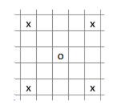

<small>

* topic:GraphColoredVertices
* questionType:ProveDisprove
* domain:Comb
* subdomain:Graphs
* method:FixedInvariant

</small>

## Atrisinājums

**(A)** Jā, var, skat., piemēram, 5. att., kur ar skaitļiem parādīti veiktie gājieni.

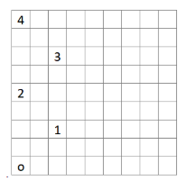

**(B)** Nē, nevar. **(C)** Nē, nevar. Pieņemsim, ka kauliņš sākumā atrodas uz pelēkas rūtiņas. Ievērojot, ka
kauliņu var pārlikt izlaižot vienu rūtiņu pa diagonāli, pakāpeniski pelēkā krāsā iekrāsojam rūtiņas, kurās
var atrasties kauliņš (skat. 6. att., kur iekrāsotas visas rūtiņas, kurās var atrasties kauliņš). Tā kā augšējā
kreisā stūra rūtiņa ir balta (kvadrātam $10 \times 10$ tā atzīmēta ar b, bet kvadrātam $11 \times 11$ tā atzīmēta ar
c), tad tajā kauliņš nevar nonākt.

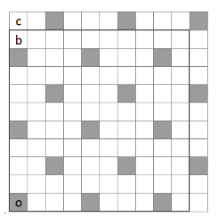

# <lo-sample/> LV.AMO.2023.5.5

Gunai bija četru veidu konfektes: 8 “Serenādes”, 14 “Lācīši Ķepainīši”, 
20 “Vāverītes” un 26 “Sarkanās magones”. 
Katru no saviem dzimšanas dienas viesiem viņa uzcienāja ar tieši 3 dažādām konfektēm.
Kāds ir lielākais iespējamais viesu skaits, kas bija ieradušies uz Gunas dzimšanas dienas svinībām?

<small>

* topic:PigeonholePrincipleForExtremes
* questionType:FindOptimal
* method:ExtremeElements,ContradictionForExistence
* domain:Comb
* topic:LinearOptimization

</small>

## Atrisinājums

Lielākais iespējamais viesu skaits ir $21$. Guna varēja pacienāt 21 viesi šādi:

* $13$ viesus pacienāja ar “Lācīšiem Ķepainīšiem”, “Vāverītēm” un “Sarkanajām magonēm”;
* $7$ viesus pacienāja ar “Serenādēm”, “Vāverītēm” un “Sarkanajām magonēm”;
* $1$ viesi pacienāja ar “Serenādi”, “Lācīti Ķepainīti” un “Sarkano magoni”.

Kopā Guna viesiem būtu iedevusi $8$ “Serenādes”, $14$ “Lācīšus Ķepainīšus”, $20$ “Vāverītes” un $21$
“Sarkano magoni”, kas nepārsniedz viņai esošo konfekšu daudzumu.

Pierādīsim, ka vairāk kā $21$ viesi Guna pacienāt nevarēs. Katru viesi ir jāpacienā ar vismaz divām
dažādām konfektēm no “Serenādēm”, “Lācīšiem Ķepainīšiem” un “Vāverītēm”. Kopā šo konfekšu ir
$8 + 14 + 20 = 42$. Ja būtu $22$ viesi vai vairāk, tad tiem vajadzētu vismaz $22 \cdot 2 = 44$ šo veidu
konfektes. Tātad vairāk par $21$ viesi nevar ierasties uz svinībām.

## Atrisinājums

Lielākais iespējamais viesu skaits ir $21$. Guna varēja pacienāt $21$ viesi šādi:

* $13$ viesus pacienāja ar “Lācīšiem Ķepainīšiem”, “Vāverītēm” un “Sarkanajām magonēm”;
* $7$ viesus pacienāja ar “Serenādēm”, “Vāverītēm” un “Sarkanajām magonēm";
* $1$ viesi pacienāja ar “Serenādi”, “Lācīti Ķepainīti” un “Sarkano magoni”.

Kopā Guna viesiem būtu iedevusi $8$ “Serenādes”, $14$ “Lācīšus Ķepainīšus”, $20$ “Vāverītes” un $21$ “Sarkano
magoni”, kas nepārsniedz viņai esošo konfekšu daudzumu.

Pierādīsim, ka vairāk kā $21$ viesi Guna pacienāt nevarēs. Pieņemsim, ka viņa ir pacienājusi $22$ viesus.
Tātad ir iztērētas $22 \cdot 3 = 66$ konfektes. Tā kā sākumā Gunai bija $8 + 14 + 20 + 26 = 68$ konfektes,
tad pāri paliek 68 − 66 = 2 konfektes. Ievērojam, ka katru viesi var pacienāt ar ne vairāk kā vienu
“Sarkano magoni”, tātad pāri jāpaliek vismaz $26 − 22 = 4$ “Sarkanajām magonēm”. Izveidojas
pretruna, tātad pieņēmums ir aplams un $22$ viesus Guna pacienāt nevar. Ja viņa nevar pacienāt $22$
viesus, tad nevar arī vairāk, un $21$ ir lielākais iespējamais viesu skaits.

# <lo-sample/> LV.AMO.2023.6.1

Skaitļus no $1$ līdz $16$ ieraksti 7.att. redzamajos mazajos trijstūros 
(katrā trijstūrī citu naturālo skaitli) tā,
lai blakus trijstūros ierakstīties skaitļi neatšķiras vairāk kā par $4$.  
*Piezīme.* Par blakus trijstūriem sauksim trijstūrus, kam ir kopīga mala.

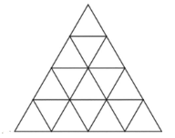

<small>

* questionType:FindExample
* domain:Comb

</small>

## Atrisinājums

Skat., piemēram, 8. att., kur pelēkā krāsā norādītas atbilstošās starpības.

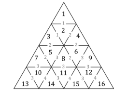

# <lo-sample/> LV.AMO.2023.6.2

Doti divi skaitļi, katram no tiem ir vismaz divi cipari. Zināms, ka pirmais skaitlis ir vienāds ar skaitli, kuru
iegūst, otro skaitli pareizinot pašu ar sevi. Vai var gadīties, ka abu skaitļu pierakstā izmantoti tikai cipari
**(a)** $2$; $3$; $7$ un $8$; **(b)** $1$; $3$; $4$; $5$ un $6$?

<small>

* questionType:ProveDisprove
* domain:NT

</small>

## Atrisinājums

**(a)** Nē, prasītais nav iespējams. Ja skaitļa pēdējais cipars ir $2$, $3$, $7$ vai $8$, tad skaitļa, kuru
iegūst, skaitli pareizinot pašu ar sevi, pēdējais cipars ir attiecīgi $4$, $9$, $9$ vai $4$, bet pēc uzdevuma
nosacījumiem nevienu no šiem cipariem nevar izmantot skaitļu pierakstā.  
**(b)** Jā, piemēram, der skaitļi $34$ un $1156$, jo $34 \cdot 34 = 1156$.

# <lo-sample/> LV.AMO.2023.6.3

No četrām tādām figūrām, kāda dota 9. att., uzzīmē figūru, kurai ir tieši: **(A)** $2$ simetrijas asis;
**(B)** $4$ simetrijas asis!

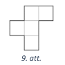

*Piezīme.* Figūru, kas dota 9. att., drīkst pagriezt un apmest otrādi. Uzzīmētajai figūrai var būt arī
caurumi. Figūrai jābūt saistītai, tas ir, no figūras katras rūtiņas jābūt iespējai aiziet uz jebkuru citu šīs
figūras rūtiņu, ejot tikai pa šīs figūras rūtiņām, katru reizi pārejot no attiecīgās rūtiņas uz blakus rūtiņu,
ar ko tai ir kopīga mala.

<small>

* questionType:FindExample,FindExample
* domain:Geom

</small>

## Atrisinājums

**(a)** Skat., piemēram, 10. attēlu. **(b)** Skat., piemēram, 11. attēlu.

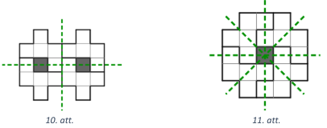

# <lo-sample/> LV.AMO.2023.6.4

Pie galda sēž zaļie bruņinieki un sarkanie bruņinieki, pavisam kopā 10 bruņinieku. Zaļie bruņinieki
vienmēr saka patiesību, sarkanie bruņinieki vienmēr melo. Katrs bruņinieks izteicās:

* pirmais bruņinieks teica: "starp mums nav neviena zaļā bruņinieka";
* otrais bruņinieks teica: "starp mums ir ne vairāk kā viens zaļais bruņinieks";
* trešais teica: "starp mums ir ne vairāk kā divi zaļie bruņinieki";
* ceturtais teica: "starp mums ir ne vairāk kā trīs zaļie bruņinieki",
* un tā tālāk, līdz desmitais bruņinieks teica: "starp mums ir ne vairāk kā deviņi zaļie bruņinieki".

Cik zaļo un cik sarkano bruņinieku sēž pie galda?

<small>

* questionType:FindCount
* domain:Comb
* method:ContradictionForExistence

</small>

## Atrisinājums

Pie galda sēž $5$ zaļie un $5$ sarkanie bruņinieki. Pamatosim, ka tā ir vienīgā iespēja.
Pieņemsim pretējo, ka pie galda sēž vairāk vai mazāk nekā pieci zaļie bruņinieki.

* Ja pie galda sēž 6 vai vairāk zaļie bruņinieki, tad pirmie 6 bruņinieki ir melojuši, jo viņi teica, ka pie
  galda ir ne vairāk kā pieci zaļie bruņinieki vai vēl mazāk. Tātad vismaz pirmie seši bruņinieki ir
  sarkanie un kopā ir vismaz 12 bruņinieki. Tas ir pretrunā nosacījumam, ka kopā ir 10 bruņinieki,
  tātad pieņēmums, ka var būt vairāk nekā 5 zaļi bruņinieki, ir aplams.
* Ja pie galda sēž 4 vai mazāk zaļie bruņinieki. Tad pēdējie seši bruņinieki teica patiesību, jo viņi
  teica, ka pie galda ir ne vairāk kā 4 zaļie bruņinieki vai vēl mazāk. Tātad visi šie seši bruņinieki ir
  zaļie. Rodas pretruna, jo aplūkojām gadījumu, ja zaļo bruņinieku ir mazāk nekā 5, tātad
  pieņēmums ir aplams.

Iegūstam, ka ir tieši pieci zaļie bruņinieki. Ja pirmie pieci bruņinieki ir sarkanie un pēdējie pieci ir zaļie,
tad uzdevuma nosacījumi izpildās.

## Atrisinājums

Pie galda sēž $5$ zaļie un $5$ sarkanie bruņinieki. Pamatosim, ka tā ir vienīgā iespēja.
Apzīmēsim zaļo bruņinieku skaitu ar $x$ un sarkano bruņinieku skaitu ar $10-x$. No bruņinieku
izteikumiem izriet, ka pirmie $x$ bruņinieki melo un ir sarkanie, bet pārējie saka patiesību. Tātad
$x=10−x$ jeb $x=5$.

Ja pirmie pieci bruņinieki ir sarkanie un pēdējie pieci ir zaļie, tad uzdevuma nosacījumi izpildās.

# <lo-sample/> LV.AMO.2023.6.5

Latvijā, tāpat kā visās eirozonas valstīs, apgrozībā ir $1$; $2$; $5$; 
$10$; $20$ un $50$ centu monētas. Pieņemsim, ka ir zināma no šīm monētām 
izveidotā naudas summa $S$ un izmantoto monētu skaits $M$. Daudzos gadījumos, 
zinot $S$ un $M$ vērtības, var noteikt precīzu izmantoto monētu komplektu.
Piemēram, ja $S=7$ un $M=3$, tad ir izmantota viena piecu un divas viena centa 
monētas un citu variantu nav. Kāda ir mazākā $M$ vērtība, kurai var atrast 
tādu $S$ vērtību, ka, zinot $S$ un $M$ vērtības, izmantoto monētu
komplektu viennozīmīgi nav iespējams noteikt?

<small>

* questionType:FindOptimal
* domain:Comb
* method:ExtremeElements

</small>

## Atrisinājums

Mazākā $M$ vērtība ir $3$, tai atbilst $S = 12$ un atšķirīgie monētu 
komplekti var būt $5 + 5 + 2$ un $10 + 1 + 1$.
Pierādīsim, ka tā ir mazākā iespējamā $M$ vērtība.
Ja $M=1$, tad viena izmantotā monēta ir nosakāma viennozīmīgi, 
jo $S$ ir jāsakrīt ar monētas vērtību. Aplūkosim gadījumu, ja $M=2$, 
un visas iespējamās divu monētu vērtību summas:

| Ar 1       | Ar 2       | Ar 5       | Ar 10      | Ar 20 vai 50  |
| ---------- | ---------- | ---------- | ---------- | ------------- | 
| $1+1=2$    | $2+2=4$    | $5+5=10$   | $10+10=20$ | $20+20 = 40$  |
| $1+2=3$    | $2+5=7$    | $5+10=15$  | $10+20=30$ | $20+50 = 70$  |
| $1+5=6$    | $2+10=12$  | $5+20=25$  | $10+50=60$ | $50+50 = 100$ |
| $1+10=11$  | $2+20=22$  | $5+50=55$  |            |               |
| $1+20=21$  | $2+50=52$  |            |            |               |
| $1+50=51$  |            |            |            |               |

Kā redzams, visas iespējamās summas ir dažādas, tātad monētu komplektu, ja $M=2$, 
iespējams noteikt viennozīmīgi.

## Atrisinājums

Mazākā $M$ vērtība ir $3$, tai atbilst $S=12$ un atšķirīgie monētu komplekti var būt
$5 + 5 + 2$ un $10 + 1 + 1$.

Pierādīsim, ka tā ir mazākā iespējamā 𝑀 vērtība.
Ja $M = 1$, tad viena izmantotā monēta ir nosakāma viennozīmīgi, jo $S$ ir jāsakrīt ar monētas vērtību.
Aplūkosim gadījumu, ja $M = 2$. Pieņemsim, ka eksistē divi atšķirīgi veidi, kā izteikt doto summu ar
divām monētām, tas ir, $S = a_1 + a_2 = b_1 + b_2$.

Nezaudējot vispārīgumu, varam pieņemt, ka $a_1$ ir vislielākā vērtība. 
Ja tā sakrīt ar kādu no vērtībām $b_1$
vai $b_2$, tad $a_2$ jāsakrīt ar attiecīgi $b_2$ vai $b_1$, tātad šie monētu komplekti būs vienādi. 
Tātad $b_1$ un $b_2$
vērtības ir mazākas nekā $a_1$ vērtība. Ievērosim, ka no dotajām monētu vērtībām 
1; 2; 5; 10; 20 un 50 katra nākamā vērtība ir vismaz divas reizes lielāka nekā iepriekšējā. 
Tas nozīmē, ka $a_1 \geq b_1 + b_2$. Tātad
vienādība $a_1 + a_2 = b_1 + b_2$ nav iespējama, 
jo vienādības kreisā puse noteikti ir lielāka nekā labā puse,
un mūsu pieņēmums ir aplams.

# <lo-sample/> LV.AMO.2023.7.1

Vai rindā kaut kādā secībā var uzrakstīt naturālus skaitļus 
**(A)** no $1$ līdz $23$; **(B)** no $1$ līdz $2023$ tā, lai blakus
skaitļiem nebūtu vienādu ciparu?

<small>

* questionType:ProveDisprove,ProveDisprove
* domain:Comb
* method:PigeonholePrincipleBasic

</small>

## Atrisinājums

**(A)** Var, piemēram, šādā veidā:
$$1; 2; 10; 3; 11; 4; 12; 5; 13; 22; 14; 7; 15; 8; 16; 20; 17; 9; 18; 23; 19; 6; 21.$$

**(B)** Nē, nevar. Pierādīsim, ka, lai kā arī šos skaitļus uzrakstītu rindā, 
vienmēr blakus atradīsies divi skaitļi, kas abi satur ciparu $1$.

Ievērosim, ka ir daudz skaitļu, kuros ir cipars 1, 
to skaits noteikti ir vismaz $1100$, jo ir $1000$ četrciparu
skaitļu, kas sākas ar ciparu $1$, un $100$ trīsciparu skaitļu, 
kas sākas ar ciparu $1$.
Pieņemsim, ka dotie skaitļi kaut kādā secībā uzrakstīti rindā 
un sadalīsim tos blakusesošu skaitļu pāros,
iegūsim $1012$ pārus (pēdējam skaitlim nav pāra, 
tas savā “pārī” būs vienīgais skaitlis).
Redzam, ka četrciparu un trīsciparu skaitļu, kas satur ciparu $1$, 
ir vairāk nekā pāru, tātad pēc Dirihlē
principa kādā pārī atradīsies divi skaitļi, kas abi satur ciparu $1$.

# <lo-sample/> LV.AMO.2023.7.2

Kāds ir lielākais iespējamais septiņciparu skaitlis, 
kuram vienlaicīgi izpildās šādi nosacījumi:

* tas dalās ar 12;
* skaitļa pirmais cipars ir tāds pats kā pēdējais cipars;
* skaitļa 2., 4. un 6. cipars ir vienādi un tie ir divas reizes 
  lielāki nekā pirmais cipars;
* skaitļa trešais cipars ir tāds pats kā piektais cipars?

<small>

* questionType:FindOptimal
* domain:NT

</small>

## Atrisinājums

Lielākais iespējamais septiņciparu skaitlis, kas atbilst uzdevuma nosacījumiem, 
ir $4888884$. Pamatosim, ka tas ir lielākais iespējamais skaitlis.

Skaitļa pēdējais cipars nevar būt lielāks kā $4$, jo 6. cipars ir divas 
reizes lielāks nekā pēdējais cipars
($2 \cdot 5 = 10$, kas nav cipars). 
Tā kā skaitlim jādalās ar $12$, tad tam jādalās gan ar $4$, gan ar $3$. 
Skaitļa otrais cipars nevar būt $9$, jo $94$ nedalās ar $4$ 
(dalāmības pazīme ar $4$). Tātad skaitlis varētu būt formā $\overline{48a8a84}$.
Lai skaitlis dalītos ar $3$, tā ciparu summai jādalās ar $3$. 
Tātad $4 + 8 + a + 8 + a + 8 + 4 = 32 + 2 \cdot a$
jādalās ar $3$. Lai septiņciparu skaitlis būtu vislielākais, 
tad $a$ vērtībai jābūt pēc iespējas lielākai:

* ja $a=9$, tad $32 + 2 \cdot a = 50$, kas nedalās ar $3$;
* ja $a=8$, tad $32 + 2 \cdot a = 48$, tātad $a = 8$ 
  un meklētais skaitlis ir $4888884$.

# <lo-sample/> LV.AMO.2023.7.3

No četrām tādām figūrām, kāda dota 12. att., uzzīmē figūru, kurai ir tieši: 
**(A)** $2$ simetrijas asis;
**(B)** $4$ simetrijas asis!  
*Piezīme.* Figūru, kas dota 12. att., drīkst pagriezt. 
Uzzīmētajai figūrai var būt arī caurumi. Figūrai jābūt
saistītai, tas ir, no figūras katras rūtiņas jābūt iespējai 
aiziet uz jebkuru citu šīs figūras rūtiņu, ejot tikai
pa šīs figūras rūtiņām, katru reizi pārejot no attiecīgās 
rūtiņas uz blakus rūtiņu, ar ko tai ir kopīga mala.

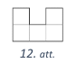

<small>

* questionType:FindExample,FindExample
* domain:Geom

</small>

## Atrisinājums

Skat., piemēram, **(a)** 13. att. un **(b)** 14. att.

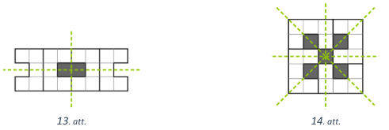

# <lo-sample/> LV.AMO.2023.7.4

Latvijā, tāpat kā visās eirozonas valstīs, apgrozībā ir 
$1$; $2$; $5$; $10$; $20$ un $50$ centu monētas. Pieņemsim, ka ir zināma 
no šīm monētām izveidotā naudas summa $S$ un izmantoto monētu skaits $M$.
Daudzos gadījumos, zinot $S$ un $M$ vērtības, var viennozīmīgi 
noteikt izmantoto monētu komplektu.
Piemēram, ja $S=7$ un $M=3$, tad ir izmantota viena piecu 
un divas viena centa monētas un citu variantu nav.

Kāda ir mazākā $S$ vērtība, kurai var atrast tādu $M$ vērtību, 
ka, zinot $S$ un $M$ vērtības, izmantoto monētu
komplektu viennozīmīgi nav iespējams noteikt?

<small>

* questionType:FindOptimal
* domain:Comb

</small>

## Atrisinājums

Mazākā $S$ vērtība ir $8$, tai atbilst $M=4$ un atšķirīgie monētu 
komplekti ir $5+1+1+1$ un $2+2+2+2$.

Pamatosim, ka mazākām $S$ vērtībām šāda $M$ vērtība neeksistē. 
Ievērosim, ka nevar izveidot summu $S$,
ja monētu skaits $M$ ir lielāks nekā $S$.
Tātad pietiek apskatīt visus gadījumus, kad $M \leq S < 8$.

Ja, piemēram $S=7$ un $M=7$, tad $7 = 1+1+1+1+1+1+1$ un nav citu 
veidu, kā samaksāt summu 7 ar 7 monētām. Arī citiem $S$ un $M$ 
samaksāšanas veids ir viens vienīgs (vai neeksistē vispār). 

| $S$    | $M=1$ | $M=2$ | $M=3$   | $M=4$     | $M=5$       | $M=6$         |
| ------ | ----- | ----- | ------- | --------- | ----------- | ------------- |
| $1$    | $1$   | nav   | nav     | nav       | nav         | nav           | 
| $2$    | $2$   | $1+1$ | nav     | nav       | nav         | nav           | 
| $3$    | nav   | $2+1$ | $1+1+1$ | nav       | nav         | nav           | 
| $4$    | nav   | $2+2$ | $2+1+1$ | $1+1+1+1$ | nav         | nav           | 
| $5$    | $5$   | nav   | $2+2+1$ | $2+1+1+1$ | $1+1+1+1+1$ | nav           | 
| $6$    | nav   | $5+1$ | $2+2+2$ | $2+2+1+1$ | $2+1+1+1+1$ | $1+1+1+1+1+1$ | 
| $7$    | nav   | $5+2$ | $5+1+1$ | $2+2+2+1$ | $2+2+1+1+1$ | $2+1+1+1+1+1$ | 

Visos aplūkotajos gadījumos saderīgos $S$ un $M$ pāros monētu 
komplektu varēja noteikt viennozīmīgi,
tādēļ $S=8$ ir mazākā iespējamā $S$ vērtība.

# <lo-sample/> LV.AMO.2023.7.5

Uz palodzes sēž vairākas bizbizmārītes, 
katrai no tām uz muguras ir vai nu divi punktiņi, vai septiņi
punktiņi. Tās bizbizmārītes, kurām uz muguras ir septiņi punktiņi, 
vienmēr saka patiesību, bet tās
bizbizmārītes, kurām uz muguras ir divi punktiņi, 
vienmēr melo. Katra bizbizmārīte izteicās:

* pirmā bizbizmārīte teica: "punktiņu skaits uz muguras mums visām ir vienāds";
* otrā teica: "mums visām kopā uz muguras ir $42$ punktiņi";
* trešā teica: "nē, mums visām kopā uz muguras ir $32$ punktiņi";
* katra no atlikušajām bizbizmārītēm teica: 
  "no pirmajām trijām bizbizmārītēm tieši viena teica patiesību".

Cik bizbizmārītes sēž uz palodzes?

<small>

* questionType:FindCount
* domain:Comb
* method:ContradictionForExistence

</small>

## Atrisinājums

Uz palodzes sēž $6$ bizbizmārītes. Pamatosim, ka tā ir vienīgā iespēja.
Aplūkosim pirmās trīs bizbizmārītes.

* Tās visas nerunā patiesību, jo otrās un trešās bizbizmārītes 
  izteikumi ir pretrunīgi.
* Nevar būt arī, ka tās visas melo. Pieņemsim pretējo, 
  ka pirmās trīs bizbizmārītes melo. Tātad melo arī visas pārējās 
  bizbizmārītes, kuras saka, ka no pirmajām trijām ir viena, kura nemelo. 
  Iegūstam, ka melo pilnīgi visas bizbizmārītes, bet tādā gadījumā 
  pirmā bizbizmārīte saka patiesību, ka visām uz muguras ir vienāds 
  punktiņu skaits. Iegūstam pretrunu, jo vienlaicīgi melo visas bizbizmārītes
  un pirmā saka patiesību, tātad pieņēmums ir aplams.

Tātad no pirmajām trim bizbizmārītēm ir tādas, 
kas melo, un ir tādas, kas saka patiesību. Iegūstam, ka
pirmā bizbizmārīte noteikti melo, jo vienāds punktiņu skaits nozīmē, 
ka vai nu visas bizbizmārītes melo,
vai visas saka patiesību. Tātad patiesību saka vai nu otrā, 
vai trešā bizbizmārīte, jo viņu izteikumi ir
pretrunīgi. Tādā gadījumā tieši viena no pirmajām trim bizbizmārītēm 
saka patiesību, tātad visas
pārējās saka patiesību un katrai no tām ir $7$ punktiņi.
Pirmajām trim bizbizmārītēm kopā uz muguras ir $7 + 2 + 2 = 11$ 
punktiņi. Ja otrā bizbizmārīte teiktu
patiesību, tad atlikušajām kopā uz muguras būtu $42 − 11 = 31$ punktiņš, 
kas nav iespējams, jo $31$ nedalās ar $7$. Tātad patiesību 
saka trešā bizbizmārīte un atlikušajām kopā ir $32 − 11 = 21$
punktiņš un bez pirmajām trim bizbizmārītēm ir vēl $21 ∶ 7 = 3$ 
bizbizmārītes. Tātad kopā uz palodzes
sēž $6$ bizbizmārītes. 

# <lo-sample/> LV.AMO.2023.8.1

Vai burtu vietā var ierakstīt sešus dažādus nenulles ciparus, 
lai dotā vienādība būtu patiesa un visas
daļas būtu nesaīsināmas: $\frac{A}{B} + \frac{C}{D} = \frac{E}{F}$. 

<small>

* questionType:ProveDisprove
* domain:Alg

</small>

## Atrisinājums

Jā, var, piemēram, $\frac{7}{3} + \frac{1}{6} = \frac{5}{2}$. 

# <lo-sample/> LV.AMO.2023.8.2

Trīsciparu skaitļa $x$ ciparu summa ir $12$. 
Ja šim skaitlim nodzēš pēdējo ciparu, tad atlikušais divciparu
skaitlis dalās ar $9$. Zināms, ka skaitlis $x$ ir par $99$ lielāks 
nekā trīsciparu skaitlis, ko iegūst, uzrakstot tā
ciparus pretējā secībā. Kāds var būt skaitlis $x$?

<small>

* questionType:FindAll
* domain:NT

</small>

## Atrisinājums

Vienīgais derīgais skaitlis $x$ ir $453$. 
Pamatosim, ka citu derīgu skaitļu nav. Apzīmējam
skaitli $x$ ar $\overline{abc}$. Tā kā, 
nodzēšot pēdējo ciparu, iegūst skaitli $\overline{ab}$, 
kas dalās $9$, tad šī skaitļa ciparu summa
$a+b$ dalās ar $9$. Summas vērtība nevar būt $18$ vai lielāka, 
jo visu trīs ciparu summa ir $12$. Summas
vērtība nevar būt $0$, citādi $a=b=0$, bet $a$ 
ir skaitļa pirmais cipars. Tātad vienīgā iespēja ir,
ka $a+b=9$. 
Tā kā ciparu summa ir $12$ jeb $a+b+c= 12$, 
tad iegūstam, ka $c = 3$.
Apzīmējam trīsciparu skaitli, kam cipari uzrakstīti pretējā secībā, 
ar $\overline{cba}$. Iegūstam:
$$\begin{aligned}
\overline{abc} − 99 & = \overline{cba}; \\
100a + 10b + c − 99 & = 100c + 10b + a; \\
99a − 99c = 99; \\
a - c = 1.\\ \end{aligned}$$
Tā kā $c=3$, tad $a=4$. Tā kā $a+b=9$, tad $b=5$.

# <lo-sample/> LV.AMO.2023.8.3

Divi vienādmalu trijstūri novietoti plaknē kā parādīts 15. att. 
Zināms, ka $\sphericalangle CAD = \alpha$ un $\sphericalangle FDJ = \beta$.
Izsaki leņķi $CGF$ ar $\alpha$ un $\beta$.

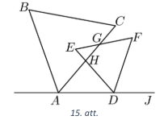

<small>

* questionType:FindAll
* domain:Geom

</small>

## Atrisinājums

Tā kā regulāra trijstūra visi leņķi ir $60^{\circ}$, tad 
$\sphericalangle HDA = 180^{\circ} − \sphericalangle FDJ - \sphericalangle EDF = 
180^{\circ} - \beta - 60^{\circ} = 120^{\circ} - \beta$ (skat. 16. att.). 
Izmantojot krustleņķu īpašību un trijstūra iekšējo leņķu
summu, iegūstam:

* $\sphericalangle EHG = \sphericalangle AHD = 180^{\circ} − \alpha − (120^{\circ} − \beta) = 60^{\circ} − \alpha + \beta$;
* $\sphericalangle CGF = \sphericalangle EGH = 180^{\circ} − 60^{\circ} − (60^{\circ} − \alpha + \beta) = 60^{\circ} + \alpha - \beta$.

Tātad $\sphericalangle CGF = \sphericalangle EGH = 60^{\circ} + \alpha − \beta$.

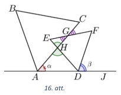

# <lo-sample/> LV.AMO.2023.8.4

Četru bērnu – Almas, Bruno, Cēzara un Dorotejas – 
tēvs mēdz bērniem iedot sīknaudu. Tā reiz tēvs
saviem bērniem iedeva sīknaudu šādi:

* Almai kādu naudas summu viena centa monētās;
* Bruno mazāko naudas summu divu centu monētās, 
  kas ir lielāka nekā Almai iedotā naudas summa;
* Cēzaram mazāko naudas summu piecu centu monētās, 
  kas ir lielāka nekā Bruno iedotā naudas summa;
* Dorotejai mazāko naudas summu desmit centu monētās, 
  kas ir lielāka nekā Cēzaram iedotā naudas summa.

Kāda ir **(a)** lielākā, **(b)** mazākā iespējamā starpība starp 
Dorotejai un Almai iedotajām naudas summām?

<small>

* questionType:FindOptimal
* domain:Alg

</small>

## Atrisinājums

**(a)** Lielākā iespējamā starpības starp naudas summām ir $16$ centi.  
**(b)** Mazākā iespējamā starpība starp naudas summām ir $7$ centi.

Pamatosim, kāpēc citu iespēju nav. Tā kā skaitļu 1; 2; 5 un 10 
mazākais kopīgais dalāmais ir 10,
tad 10 centus var izteikt ar 1; 2; 5 un 10 centu monētām.
Tātad no visām naudas summām varam atņemt 10 centus tik daudz reižu, 
līdz Almai paliek mazāk nekā 10 centi. Tā kā no visām summām ir
atņemts vienāds naudas daudzums, tad starpība starp Dorotejai 
un Almai iedotajām naudas summām
nemainās un visas iespējas ir aplūkotas tabulā.

| Alma                     | 0   | 1   | 2   | 3   | 4   | 5   | 6   | 7   | 8   | 9   | 
| ------------------------ | --- | --- | --- | --- | --- | --- | --- | --- | --- | --- |
| Bruno                    | 2   | 2   | 4   | 4   | 6   | 6   | 8   | 8   | 10  | 10  | 
| Cēzars                   | 5   | 5   | 5   | 5   | 10  | 10  | 10  | 10  | 15  | 15  |
| Doroteja                 | 10  | 10  | 10  | 10  | 20  | 20  | 20  | 20  | 20  | 20  |
| Starpība "Doroteja-Alma" | 10  | 9   | 8   | 7   | 16  | 15  | 14  | 13  | 12  | 11  |

Kā redzams, lielākā iespējamā starpība ir $16$, bet mazākā starpība ir $7$ centi.

# <lo-sample/> LV.AMO.2023.8.5

Uz palodzes sēž vairākas bizbizmārītes, katrai no tām uz muguras 
ir vai nu trīs punktiņi, vai astoņi
punktiņi. Tās bizbizmārītes, kurām uz muguras ir astoņi punktiņi, 
vienmēr saka patiesību, bet tās
bizbizmārītes, kurām uz muguras ir trīs punktiņi, vienmēr melo. 
Katra bizbizmārīte izteicās:

* pirmā bizbizmārīte teica: "punktiņu skaits uz muguras mums visām ir vienāds";
* otrā teica: "mums visām kopā uz muguras ir $38$ punktiņi";
* trešā teica: "nē, mums visām kopā uz muguras ir $48$ punktiņi";
* katra no atlikušajām bizbizmārītēm teica: "no pirmajām trijām bizbizmārītēm 
  tieši viena teica patiesību".

Cik bizbizmārītes sēž uz palodzes?

<small>

* seeAlso:LV.AMO.2023.7.5
* questionType:FindCount
* domain:Comb
* method:ContradictionForExistence

</small>

## Atrisinājums

Uz palodzes sēž 6 bizbizmārītes. Pamatosim, ka tā ir vienīgā iespēja.
Aplūkojam pirmās trīs bizbizmārītes.

* Tās visas nerunā patiesību, jo otrās un trešās bizbizmārītes 
  izteikumi ir pretrunīgi.
* Nevar būt arī, ka tās visas melo. Pieņemsim pretējo, ka pirmās 
  trīs bizbizmārītes melo. Tātad melo arī visas pārējās bizbizmārītes, 
  kuras saka, ka no pirmajām trijām ir viena, kura nemelo. Iegūstam,
  ka melo pilnīgi visas bizbizmārītes, bet tādā gadījumā pirmā bizbizmārīte 
  saka patiesību, ka visām uz muguras ir vienāds punktiņu skaits. 
  Iegūstam pretrunu, jo vienlaicīgi melo visas bizbizmārītes
  un pirmā saka patiesību, tātad pieņēmums ir aplams.

Tātad no pirmajām trim bizbizmārītēm ir tādas, kas melo, 
un ir tādas, kas saka patiesību. Iegūstam, ka
pirmā bizbizmārīte noteikti melo, jo vienāds punktiņu skaits nozīmē, 
ka vai nu visas bizbizmārītes melo,
vai visas saka patiesību. Tātad patiesību saka vai nu otrā, 
vai trešā bizbizmārīte, bet ne abas, jo viņu
izteikumi ir pretrunīgi. Tas nozīmē, ka tieši viena no pirmajām 
trim bizbizmārītēm saka patiesību, tātad
visas pārējās saka patiesību un katrai no tām ir $8$ punktiņi.
Pirmajām trim bizbizmārītēm kopā uz muguras ir $8+3+3=14$ punktiņi. 
Ja trešā bizbizmārīte teiktu
patiesību, tad atlikušajām kopā uz muguras būtu $48-14=34$ punktiņi, 
kas nav iespējams, jo $34$ nedalās ar $8$. 
Tātad patiesību saka otrā bizbizmārīte un atlikušajām kopā ir 
$38-14=24$ punktiņi un bez pirmajām trim bizbizmārītēm ir vēl 
$24∶8=3$ bizbizmārītes. Tātad kopā uz palodzes sēž $6$
bizbizmārītes.

# <lo-sample/> LV.AMO.2023.9.1

Uz tāfeles uzrakstīta daļa $\frac{10}{2023}$. 
Katrā gājienā var izvēlēties patvaļīgu naturālu skaitli un vai nu pieskaitīt
to gan daļas skaitītājam, gan saucējam, vai arī to reizināt ar daļas skaitītāju 
un saucēju. Vai, atkārtojot
šādus gājienus, var iegūt daļu, kuras vērtība ir: **(A)** $\frac{1}{10}$;
**(B)** $1$? 

<small>

* questionType:ProveDisprove,ProveDisprove
* domain:Alg
* subdomain:FixedInvariant

</small>

## Atrisinājums

**(A)** Jā, var, piemēram, šādi:

$$\frac{10}{2023} \;\rightarrow\; \frac{10 \cdot 9}{2023 \cdot 9} = \frac{90}{18207}
\;\rightarrow\; \frac{90 + 1923}{18207 + 1923} = \frac{2013}{20130} = \frac{1}{10}.$$

**(B)** Nē, nevar. Ievērosim, ka sākumā daļas skaitītājs ir mazāks 
nekā saucējs. Pēc katra atļautā gājiena šī īpašība saglabāsies. 
Tātad daļas vērtība nevar kļūt vienāda ar 1 (tā vienmēr būs mazāka 
nekā viens, jo tās skaitītājs vienmēr būs mazāks nekā saucējs).

# <lo-sample/> LV.AMO.2023.9.2

Ja divciparu skaitlim $\overline{ab}$ galā pieraksta divciparu skaitli
$\overline{cd}$, tad iegūtais četrciparu skaitlis dalās ar $13$.
Zināms, ka $12a + 9b$ dalās ar $13$. Kāds var būt skaitlis $\overline{cd}$?

<small>

* questionType:FindAll
* domain:NT

</small>

## Atrisinājums

Skaitlis $\overline{cd}$ var būt $13$; $26$; $39$; $52$; $65$; $78$ vai $91$. 
Apzīmējam iegūto četrciparu skaitli ar $\overline{abcd}$. 
Ekvivalenti pārveidojam šo skaitli:

$$\overline{abcd} = 1000a + 100b + 10c + d = (12a + 9b) + (10c + d) + 988a + 91b =$$
$$= (12a + 9b) + (10c + d) + 13 \cdot 76a + 13 \cdot 7𝑏.$$

Tā kā saskaitāmie $13 \cdot 76a$ un $13 \cdot 7b$ dalās ar $13$ 
un no dotā $12a + 9b$ dalās ar $13$, tad, lai viss skaitlis
dalītos ar $13$, arī $10c + d = \overline{cd}$ jādalās ar $13$. 
Tātad skaitlis $\overline{cd}$ var būt jebkurš skaitļa $13$ daudzkārtnis,
tas ir, $13$; $26$; $39$; $52$; $65$; $78$ vai $91$.

# <lo-sample/> LV.AMO.2023.9.3

Trijstūrī viens leņķis ir par $120^{\circ}$ lielāks nekā otrs. 
Pierādīt, ka bisektrise, kas vilkta no trešā leņķa
virsotnes, ir divas reizes garāka nekā augstums no tās pašas virsotnes!

<small>

* questionType:Prove
* domain:Geom
* method:AugmentationWithNewElements

</small>

## Atrisinājums

Apzīmējam trijstūra virsotnes ar $A, B, C$ un pieņemsim, ka 
$\sphericalangle B = \sphericalangle C + 120^{\circ}$ (skat.
17. att.). Apzīmējam $\sphericalangle C = x$, tad 
$\sphericalangle B = 120^{\circ} + x$ un 
$\sphericalangle A = 180^{\circ} - \sphericalangle B − 
\sphericalangle C = 60^{\circ} − 2x$.

No virsotnes $A$ novelkam augstumu $AH$ un bisektrisi $AM$. 
Tā kā $AM$ ir bisektrise, tad 
$\sphericalangle MAC = \frac{1}{2}\sphericalangle A = 30^{\circ} - x$. 
Leņķis $\sphericalangle AMH$ ir trijstūra $MCA$ ārējais leņķis, 
tātad 
$\sphericalangle AMH = \sphericalangle MAC + \sphericalangle MCA = 30^{\circ} − x + x = 30^{\circ}$. Tas nozīmē, ka taisnleņķa trijstūrī 
$AHM$ katete $AH$ atrodas pret $30^{\circ}$ leņķi, tātad
tā ir vienāda ar pusi no hipotenūzas $AM$ jeb $AM = 2AH$.

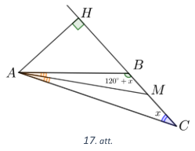

# <lo-sample/> LV.AMO.2023.9.4

Uz katras no $36$ kartītēm uzrakstīts kāds naturāls skaitlis 
(daži no tiem var būt arī vienādi). Kartītes
iespējams sadalīt deviņās grupās pa četrām kartītēm katrā tā, ka visās grupās uz 
kartītēm uzrakstīto skaitļu summas ir vienādas. Kā arī kartītes iespējams sadalīt 
četrās grupās pa deviņām kartītēm katrā
tā, ka visās grupās uz kartītēm uzrakstīto skaitļu summas ir vienādas.
Vai vienmēr visas kartītes var sadalīt sešās grupās pa sešām kartītēm katrā tā, ka visās grupās uz
kartītēm uzrakstīto skaitļu summas ir vienādas?

<small>

* questionType:ProveDisprove
* domain:Comb
* subdomain:CombinatorialStructures
* method:PigeonholePrincipleBasic

</small>

## Atrisinājums

Nē, ne vienmēr. Aplūkosim $4 \times 9$ rūtiņas lielu tabulu.

+---+---+---+---+---+---+---+---+---+
| 1 | 1 | 1 | 9 | 1 | 1 | 1 | 9 | 3 |
+---+---+---+---+---+---+---+---+---+
| 1 | 1 | 9 | 1 | 1 | 1 | 9 | 1 | 3 |
+---+---+---+---+---+---+---+---+---+ 
| 1 | 9 | 1 | 1 | 1 | 9 | 1 | 1 | 3 |
+---+---+---+---+---+---+---+---+---+
| 9 | 1 | 1 | 1 | 9 | 1 | 1 | 1 | 3 |
+---+---+---+---+---+---+---+---+---+

Varam uzskatīt, ka katra rūtiņa atbilst vienai kartītei un tajā ierakstītais skaitlis 
atbilst uz kartītes uzrakstītajam.
Tabulas sadalīšana pa rindām atbilst sadalīšanai četrās grupās pa deviņām kartītēm katrā, bet pa
kolonnām – deviņās grupās pa četrām kartītēm katrā. Abos gadījumos skaitļu summa visās grupās ir
vienāda – attiecīgi $27$ un $12$.

Pieņemsim, ka šos skaitļus var sadalīt sešās grupās pa sešām kartītēm katrā tā, lai skaitļu summa visās
grupās būtu vienāda. Tad skaitļu summai katrā grupā jābūt $18$. Tā kā pavisam ir astoņas kartītes ar
skaitli $9$, tad pēc Dirihlē principa vismaz vienā grupā būs vairāk nekā viena kartīte ar skaitli $9$. Ja grupā
ir divas kartītes ar $9$, tad jau uz šīm divām kartītēm uzrakstīto skaitļu summa ir $18$ un uz atlikušajām
četrām kartītēm uzrakstīto skaitļu summai jābūt $0$, kas nav iespējams, jo mazākā iespējamā četru
kartīšu summa ir $4 \cdot 1 = 4$. Esam ieguvuši pretrunu, ko izraisīja pieņēmums, 
ka kartītes sešās grupās pa sešām katrā ar vienādu skaitļu kopsummu sadalīt ir iespējams.

# <lo-sample/> LV.AMO.2023.9.5

Pirmie sešpadsmit naturālie skaitļi patvaļīgā secībā izvietoti pa apli, 
katriem diviem blakus skaitļiem aprēķināta to starpība (no lielākā skaitļa 
atņemot mazāko), un pēc tam aprēķināta visu šo $16$ starpību summa $S$. 
Vai var gadīties, ka: **(A)** $S = 100$; **(B)** $S = 123$?

<small>

* questionType:ProveDisprove,ProveDisprove
* domain:Comb
* subdomain:FixedInvariant

</small>

## Atrisinājums

**(A)** Jā, var, piemēram, skat. 18. att., kur ar pelēkā krāsā ir blakus skaitļu starpība. Tādā
gadījumā
$$S = 3 + 14 + 13 + 12 + 11 + 10 + 3 + 4 + 7 + 6 + 5 + 4 + 1 + 2 + 1 + 4 = 100.$$

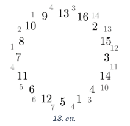

**(B)** Pamatosim, ka $S = 123$ nevar iegūt. Šo panāksim pierādot, ka $S$ vienmēr ir jābūt pāra skaitlim. Ja
$x_1, x_2, x_3, \ldots, x_{16}$ ir patvaļīgi sakārtoti pirmie 16 naturālie skaitļi, tad summu $S$ varam izteikt kā
$$S = |x_1 − x_2| + |x_2 − x_3| + |x_3 − x_4| + \cdots + |x_{15} − x_{16}| + |x_{16} − x_1|.$$
Ievērosim, ka $S$ būtu 0, ja, rēķinot starpību, nebūtu vienmēr no lielākā skaitļa jāatņem mazākais, tas ir,
starpības varētu pieļaut negatīvas vērtības, jo viss pa pāriem noīsinātos: 
$$x_1 − x_2 + x_2 − x_3 + x_3 − x_4 + \cdots + x_{15} − x_{16} + x_{16} − x_1 = 0.$$

Tikko sākam parūpēties par to, lai kāda no negatīvajām starpībām summā būtu pozitīva (no lielāka tiek
atņemts mazākais), tad rezultātā iegūstam, ka 𝑆 pieaug par pāra skaitli. Ja summā ir kāda negatīva
starpība $x_i − x_j$, kur $x_j > x_i$, un vēlamies to padarīt par pozitīvu izteiksmi $x_j − x_i$ jeb $|x_i − x_j|$, tad
jāpieskaita $2(x_j − x_i)$, kas ir pāra skaitlis, jo $x_j − x_i = (x_i − x_j) + 2(x_j − x_i)$. 
Ja mēs katru negatīvo starpību pārvērstu par pozitīvu, lai rezultātā iegūtu $S$, 
kā tas aprakstīts uzdevuma nosacījumos, tad pie $0$ būtu pakāpeniski jāpieskaita pāra skaitļi. 
Tātad neatkarīgi no tā, kā pa apli ir izkārtoti pirmie $16$ naturālie
skaitļi, skaitlis $S$ vienmēr būs pāra skaitlis.

# <lo-sample/> LV.AMO.2023.10.1

Pie galda sēž zaļie bruņinieki un sarkanie bruņinieki, pavisam kopā $10$ bruņinieku. 
Zaļie bruņinieki vienmēr saka patiesību, sarkanie bruņinieki vienmēr melo. 
Katrs bruņinieks izteicās:

* pirmais bruņinieks teica: "starp mums nav neviena zaļā bruņinieka";
* otrais bruņinieks teica: "starp mums ir ne vairāk kā viens zaļais bruņinieks";
* trešais teica: "starp mums ir ne vairāk kā divi zaļie bruņinieki";
* ceturtais teica: "starp mums ir ne vairāk kā trīs zaļie bruņinieki",
* un tā tālāk, līdz desmitais bruņinieks teica: "starp mums ir ne vairāk kā deviņi zaļie bruņinieki".

Cik zaļo un cik sarkano bruņinieku sēž pie galda?

<small>

* questionType:FindCount
* domain:Comb
* method:ContradictionForExistence

</small>

## Atrisinājums

Pie galda sēž $5$ zaļie un $5$ sarkanie bruņinieki. Pamatosim, ka tā ir vienīgā iespēja.
Pieņemsim pretējo, ka pie galda sēž vairāk vai mazāk nekā pieci zaļie bruņinieki.
* Ja pie galda sēž $6$ vai vairāk zaļie bruņinieki, tad pirmie $6$ bruņinieki ir melojuši, jo viņi teica, ka pie
  galda ir ne vairāk kā pieci zaļie bruņinieki vai vēl mazāk. Tātad vismaz pirmie seši bruņinieki ir
  sarkanie un kopā ir vismaz 12 bruņinieki. Tas ir pretrunā nosacījumam, ka kopā ir 10 bruņinieki,
  tātad pieņēmums, ka var būt vairāk nekā $5$ zaļi bruņinieki, ir aplams.
* Ja pie galda sēž $4$ vai mazāk zaļie bruņinieki. Tad pēdējie seši bruņinieki teica patiesību, jo viņi
  teica, ka pie galda ir ne vairāk kā $4$ zaļie bruņinieki vai vēl mazāk. Tātad visi šie seši bruņinieki ir
  zaļie. Rodas pretruna, jo aplūkojām gadījumu, ja zaļo bruņinieku ir mazāk nekā $5$, tātad
  pieņēmums ir aplams.

Iegūstam, ka ir tieši pieci zaļie bruņinieki. Ja pirmie pieci bruņinieki ir sarkanie un pēdējie pieci ir zaļie,
tad uzdevuma nosacījumi izpildās.

## Atrisinājums

Pie galda sēž $5$ zaļie un $5$ sarkanie bruņinieki. Pamatosim, ka tā ir vienīgā iespēja.
Apzīmēsim zaļo bruņinieku skaitu ar $x$ un sarkano bruņinieku skaitu ar $10-x$. No bruņinieku
izteikumiem izriet, ka pirmie $x$ bruņinieki melo un ir sarkanie, bet pārējie saka patiesību. Tātad
$x = 10−x$ jeb $x=5$.

Ja pirmie pieci bruņinieki ir sarkanie un pēdējie pieci – zaļie, tad izpildās uzdevuma nosacījumi.

# <lo-sample/> LV.AMO.2023.10.2

Pierādīt, ka $9x^2 + 5y^2 − 8xy − 4x + 2 > 0$ visām reālām $x$ un $y$ vērtībām!

<small>

* questionType:Prove
* domain:Alg
* method:PolynomialTransformations

</small>

## Atrisinājums

Veicam ekvivalentus pārveidojumus:

$$\begin{array}{c}
(4x^2 − 8xy + 4y^2) + y^2 + (4x^2 − 4x + 1) + x^2 + 1 > 0;\\
(2x − 2y)^2 + y^2 + (2x − 1)^2 + x^2 + 1 > 0.\\
\end{array}$$

Tā kā skaitļa kvadrāts ir nenegatīvs, tad pēdējās nevienādības kreisajā pusē ir četri nenegatīvi
saskaitāmie un vēl pozitīvs skaitlis $1$. Tātad pēdējā nevienādība ir patiesa. Tā kā tika veikti ekvivalenti
pārveidojumi, tad arī dotā nevienādība ir patiesa visiem reāliem skaitļiem $x$ un $y$.

# <lo-sample/> LV.AMO.2023.10.3

Dots ieliekts četrstūris $ABCD$, kuram $AB=BC=CD$. 
Zināms, ka $\sphericalangle BAD = \alpha$ un $\sphericalangle BCD = 2\alpha$, bet
leņķa $ABC$ lielums četrstūra ārpusē ir $7\alpha$ (skat. 19. att.). Aprēķināt $\alpha$ vērtību!

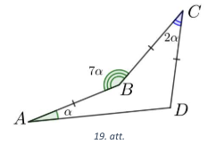

<small>

* questionType:FindAll
* domain:Geom
* method:AugmentationWithNewElements

</small>

## Atrisinājums

Savienosim $B$ ar $D$ un novilksim augstumu $BE$ no $B$ pret $AD$ 
un augstumu $CF$ no $C$
pret $BD$ (skat. 20. att.). 

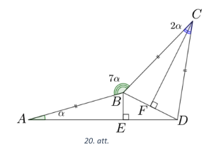

Tā kā vienādsānu trijstūrī $BCD$ ir novilkts augstums pret pamatu, tad tā ir arī
bisektrise un $\sphericalangle BCF = \sphericalangle DCF =
\frac{1}{2}\sphericalangle BCD = \alpha$. Ievērojam, ka 
trīs taisnleņķa trijstūri ir vienādi $\triangle ABE = \triangle CBF = \triangle CDF$
pēc pazīmes $h\ell$:

* $AB = CB = CD$ pēc dotā;
* $\sphericalangle BAE = \sphericalangle BCF = \sphericalangle DCF = \alpha$.

Tādā gadījumā $BE = BF = FD$ kā vienādo trijstūru atbilstošie elementi jeb 
$BE = \frac{1}{2}BD$, tātad
taisnleņķa trijstūrī $BED$ leņķis pret kateti, 
kas ir divas reizes īsāka nekā hipotenūza, ir $30^{\circ}$ jeb
$\sphericalangle BDE = 30^{\circ}$ un $\sphericalangle EBD = 60^{\circ}$.
No vienādsānu trijstūra $𝐵𝐶𝐷$ varam izteikt pamata pieleņķi 
$\sphericalangle DBC = (180^{\circ} − \sphericalangle BCD) ∶ 2 = 90^{\circ} − \alpha$.
No taisnleņķa trijstūra $ABE$ varam izteikt 
$\sphericalangle ABE = 180^{\circ} − \sphericalangle BAE − \sphericalangle AEB = 90^{\circ} − \alpha$.
Tā kā $\sphericalangle EBD + \sphericalangle DBC + \sphericalangle CBA + \sphericalangle ABE = 360^{\circ}$ (jo veidojas pilns leņķis), tad
$$60^{\circ} + 90^{\circ} − \alpha + 7\alpha + 90^{\circ} − \alpha = 360^{\circ}\;\;\Rightarrow\;\;\alpha=24^{\circ}.$$

## Atrisinājums

Vispirms atliekam punktus $B'$ un $C'$, kas ir attiecīgi punktu 
$B$ un $C$ simetriskie punkti
attiecībā pret taisni $AD$ (skat. 21. att.). 

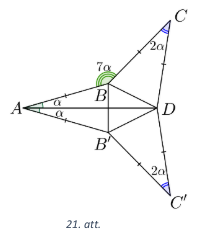

Savienojam punktus $B$ un $D$, kā arī $B'$ un $D$. 
Rezultātā izveidosies trīs vienādsānu trijstūri: $\triangle ABB'$, 
$\triangle B'C'D$ un $\triangle CBD$. 
Šie trijstūri ir savā starpā vienādi pēc pazīmes
$m\ell{}m$, jo to virsotnes leņķi 
$\sphericalangle B'AB = \sphericalangle BCD = \sphericalangle DC'B'$ un 
sānu malu garumi ir savstarpēji vienādi. 
Tātad $\triangle BB'D$ ir vienādmalu trijstūris un 
$\sphericalangle B'BD = 60^{\circ}$. 
Tā kā $\triangle ABB'$ 
ir vienādsānu, tad tā pamata
leņķis $\sphericalangle ABB'=90^{\circ} - \alpha$. 
Līdzīgi varam spriest par $\triangle CBD$ pamata leņķi 
$\sphericalangle CBD = 90^{\circ} - \alpha$. 

Tagad aplūkojam četrstūra $ABCD$ iekšējo leņķi $\sphericalangle ABC$. 
Izmantojot doto, iegūstam, ka tā lielums ir
$\sphericalangle ABC = 360^{\circ} − 7\alpha$. 
No otras puses, tas ir vienāds ar
$$\sphericalangle ABB' + \sphericalangle B'BD + \sphericalangle CBD = 
90^{\circ} - \alpha + 60^{\circ} + 90^{\circ} - \alpha = 
240^{\circ} - 2\alpha$$
Tātad 
$$360^{\circ} − 7\alpha = 240^{\circ} − 2\alpha \;\;\Rightarrow\;\; \alpha = 24^{\circ}.$$

# <lo-sample/> LV.AMO.2023.10.4

Uz katras no $72$ kartītēm uzrakstīts kāds naturāls skaitlis 
(daži no tiem var būt arī vienādi). Kartītes
iespējams sadalīt astoņās grupās pa deviņām kartītēm katrā tā, 
ka visās grupās uz kartītēm uzrakstīto
skaitļu summas ir vienādas. Kā arī kartītes iespējams sadalīt 
deviņās grupās pa astoņām kartītēm katrā
tā, ka visās grupās uz kartītēm uzrakstīto skaitļu summas ir vienādas.
Vai vienmēr:

**(A)** visas kartītes var sadalīt sešās grupās pa $12$ kartītēm katrā tā, 
ka visās grupās uz kartītēm uzrakstīto skaitļu summas ir vienādas;  
**(B)** visas kartītes var sadalīt $12$ grupās pa sešām kartītēm katrā tā, 
ka visās grupās uz kartītēm uzrakstīto skaitļu summas ir vienādas?

<small>

* questionType:ProveDisprove,ProveDisprove
* domain:Comb
* subdomain:CombinatorialStructures
* method:PigeonholePrincipleBasic

</small>

## Atrisinājums

Aplūkosim $8 \times 9$ lielu rūtiņu tabulu:

+---+---+---+---+---+---+---+---+---+
| 1 | 1 | 1 | 1 | 1 | 1 | 1 | 9 | 2 |
+---+---+---+---+---+---+---+---+---+ 
| 1 | 1 | 1 | 1 | 1 | 1 | 9 | 1 | 2 |
+---+---+---+---+---+---+---+---+---+
| 1 | 1 | 1 | 1 | 1 | 9 | 1 | 1 | 2 |
+---+---+---+---+---+---+---+---+---+ 
| 1 | 1 | 1 | 1 | 9 | 1 | 1 | 1 | 2 |
+---+---+---+---+---+---+---+---+---+
| 1 | 1 | 1 | 9 | 1 | 1 | 1 | 1 | 2 |
+---+---+---+---+---+---+---+---+---+
| 1 | 1 | 9 | 1 | 1 | 1 | 1 | 1 | 2 |
+---+---+---+---+---+---+---+---+---+
| 1 | 9 | 1 | 1 | 1 | 1 | 1 | 1 | 2 |
+---+---+---+---+---+---+---+---+---+
| 9 | 1 | 1 | 1 | 1 | 1 | 1 | 1 | 2 |
+---+---+---+---+---+---+---+---+---+

Varam uzskatīt, ka katra rūtiņa atbilst vienai kartītei un tajā 
ierakstītais skaitlis ir uz kartītes uzrakstītais
skaitlis.
Tabulas sadalīšana pa rindām atbilst sadalīšanai astoņās grupās pa deviņām 
kartītēm katrā, bet pa
kolonnām – deviņās grupās pa astoņām kartītēm katrā. 
Abos gadījumos skaitļu summa visās grupās ir
vienāda – attiecīgi $18$ un $16$. Visu skaitļu kopsumma ir $144$.

**(A)** Pamatosim, ka aplūkotajam piemēram neizpildās šī prasība. 
Pieņemsim pretējo, ka šos skaitļus var
sadalīt sešās grupās pa 12 kartītēm katrā tā, lai skaitļu summa 
visās grupās būtu vienāda. Tad skaitļu
summai katrā grupā jābūt $\frac{144}{6} = 24$. 
Tā kā kopā ir astoņas kartītes ar skaitli $9$, tad pēc Dirihlē principa
vismaz vienā grupā būs vairāk nekā viena kartīte ar $9$. 
Ja grupā ir divas kartītes ar 9, tad uz atlikušajām
$10$ kartītēm uzrakstīto skaitļu summai jābūt $24 − 2 \cdot 9 = 6$, 
kas nav iespējams, jo mazākā iespējamā
summa ir $10 \cdot 1 = 10$. 
Esam ieguvuši pretrunu, ko izraisīja pieņēmums, ka kartītes sešās grupās pa $12$
katrā ar vienādu skaitļu kopsummu sadalīt ir iespējams.

**(B)** Pamatosim, ka aplūkotajam piemēram neizpildās šī prasība. 
Pieņemsim pretējo, ka šos skaitļus var
sadalīt $12$ grupās pa sešām kartītēm katrā tā, lai skaitļu summa 
visās grupās būtu vienāda. Tad skaitļu summai katrā grupā jābūt $\frac{144}{12} = 12$. 
Nevienā grupā nevar būt vairāk kā viena kartīte ar skaitli $9$,
jo $2 \cdot 9 = 18 > 12$. Ja grupā ir viena kartīte ar $9$, 
tad uz atlikušajām piecām kartītēm uzrakstīto skaitļu
summai jābūt $12 − 9 = 3$, kas nav iespējams, jo mazākā iespējamā summa ir 
$5 \cdot 1 = 5$. Esam ieguvuši
pretrunu, ko izraisīja pieņēmums, ka ir iespējams sadalīt kartītes 
$12$ grupās pa sešām katrā ar vienādu skaitļu kopsummu.

# <lo-sample/> LV.AMO.2023.10.5

Uz tāfeles uzrakstīti visi naturālie skaitļi no $1$ līdz $100$ 
(katrs tieši vienu reizi). Maruta vienu no tiem
nodzēsa un izrādījās, ka viens no atlikušajiem skaitļiem tagad 
ir visu atlikušo skaitļu vidējais
aritmētiskais. Kāds varēja būt Marutas nodzēstais skaitlis?

<small>

* questionType:FindAll
* domain:NT

</small>

## Atrisinājums

Nodzēstais skaitlis varēja būt $1$ vai $100$. 
Ja nodzēš skaitli $1$ vai $100$, tad nosacījums
izpildās, jo atlikušo skaitļu vidējais aritmētiskais pirmajā gadījumā 
ir $\frac{2+3+\cdots+100}{99} = \frac{100+2}{99 \cdot 2} \cdot 99 = 51$, 
bet otrajā gadījumā ir $\frac{1+2+\cdots+99}{99} = \frac{1+99}{99 \cdot 2} \cdot 99 = 50$. 
Tagad arī redzams, kāpēc neder neviens cits skaitlis –
šajā gadījumā atlikušo skaitļu vidējais aritmētiskais atradīsies starp $50$ un $51$, 
tātad nebūs vesels skaitlis.

## Atrisinājums 

Ievērosim, ka pirmo $100$ skaitļu summa ir
$$S = \frac{101 \cdot 100}{2} = 50 \cdot 101 = (51 − 1)(99 + 2) = 
51 \cdot 99 + 102 − 99 − 2 = 51 \cdot 99 + 1.$$
Ja nodzēstais skaitlis ir $y$, tad $(S − y)$ jādalās ar 99. 
Tātad $(51 \cdot 99 + 1 − y)$ jādalās ar $99$. Tas nozīmē,
ka $y$ (kam jādod atlikums $1$, dalot ar $99$) 
var būt tikai $1$ vai $100$.

# <lo-sample/> LV.AMO.2023.11.1

Mārim bija četru veidu konfektes: 15 “Serenādes”, 25 “Lācīši Ķepainīši”, 
35 “Vāverītes” un 45 “Sarkanās magones”. Katru no saviem dzimšanas 
dienas viesiem viņš uzcienāja ar tieši 3 dažādām konfektēm.
Kāds ir lielākais iespējamais viesu skaits, kas bija ieradušies uz 
Māra dzimšanas dienas svinībām?

<small>

* questionType:FindOptimal
* domain:Comb
* topic:LinearOptimization
* method:ContradictionForExistence

</small>

## Atrisinājums 

Lielākais iespējamais viesu skaits ir $37$. Māris varēja pacienāt $37$ viesus šādi:

* $22$ viesus pacienāja ar “Lācīšiem Ķepainīšiem”, “Vāverītēm” un “Sarkanajām magonēm”;
* $13$ viesus pacienāja ar “Serenādēm”, “Vāverītēm” un “Sarkanajām magonēm”;
* $2$ viesus pacienāja ar “Serenādēm”, “Lācīšiem Ķepainīšiem” un “Sarkanajām magonēm”.

Kopā Māris viesiem būtu iedevis $15$ “Serenādes”, $24$ “Lācīšus Ķepainīšus”, 
$35$ “Vāverītes” un $37$ “Sarkanās magones”, 
kas nepārsniedz viņam esošo konfekšu daudzumu.
Pierādīsim, ka vairāk kā 37 viesus Māris pacienāt nevarēs. 
Katru viesi ir jāpacienā ar vismaz divām
dažādām konfektēm no “Serenādēm”, “Lācīšiem Ķepainīšiem” un “Vāverītēm”. 
Kopā šo konfekšu ir
$15 + 25 + 35 = 75$. Ja būtu $38$ viesi, tad tiem vajadzētu vismaz 
$38 \cdot 2 = 76$ šo veidu konfektes. Tātad
vairāk kā $37$ viesi nevarēja ierasties uz svinībām.

## Atrisinājums 

Lielākais iespējamais viesu skaits ir $37$. Māris varēja pacienāt $37$ viesus šādi:

* $22$ viesus pacienāja ar “Lācīšiem Ķepainīšiem”, “Vāverītēm” un “Sarkanajām magonēm”;
* $13$ viesus pacienāja ar “Serenādēm”, “Vāverītēm” un “Sarkanajām magonēm”;
* $2$ viesus pacienāja ar “Serenādēm”, “Lācīšiem Ķepainīšiem” un “Sarkanajām magonēm”.

Kopā Māris viesiem būtu iedevis $15$ “Serenādes”, $24$ “Lācīšus Ķepainīšus”, 
$35$ “Vāverītes” un $37$ “Sarkanās magones”, 
kas nepārsniedz viņam esošo konfekšu daudzumu.

Pierādīsim, ka vairāk kā $37$ viesus Māris pacienāt nevarēs. 
Pieņemsim, ka viņš ir pacienājis $38$ viesus.
Tātad viņš ir iztērējis $38 \cdot 3 = 114$ konfektes. 
Tā kā sākumā viņam bija $15 + 25 + 35 + 45 = 120$
konfektes, tad pāri paliek $120 − 114 = 6$ konfektes. 
Ievērojam, ka katru viesi var pacienāt ar ne vairāk
kā vienu “Sarkano magoni”, tātad pāri jāpaliek vismaz $45 − 37 = 7$ 
“Sarkanajām magonēm”. Izveidojas
pretruna, tātad pieņēmums ir aplams, un Māris nevar pacienāt $38$ viesus. 
Ja viņš nevar pacienāt $38$
viesus, tad nevar arī vairāk, un lielākais iespējamais viesu skaits ir $37$.

# <lo-sample/> LV.AMO.2023.11.2

Pierādīt, ka $a^2c + ac^2 - 6abc + 3b^2c + ab^2 \geq 0$
visām pozitīvām reālām $a$, $b$ un $c$ vērtībām!

<small>

* questionType:Prove
* domain:Alg
* method:PolynomialTransformations

</small>

## Atrisinājums 

Veicam ekvivalentus pārveidojumus:

$$\begin{array}{c}
c(a^2 - 2 \cdot a \cdot 2b + 4b^2) + a(c^2 - 2bc + b^2) \geq 0;\\
c(a - 2b)^2 + a(c-b)^2 \geq 0. \\
\end{array}$$
Tā kā skaitļa kvadrāts ir nenegatīvs un skaitļi $a$ un $c$ 
ir pozitīvi, tad pēdējās nevienādības kreisajā pusē
ir divu nenegatīvu skaitļu summa, kas arī ir nenegatīvs skaitlis. 
Tātad pēdējā nevienādība ir patiesa. Tā
kā tika veikti ekvivalenti pārveidojumi, 
tad arī dotā nevienādība ir patiesa visām pozitīvām $a$, $b$ un $c$
vērtībām.

# <lo-sample/> LV.AMO.2023.11.3

Dota riņķa līnija, uz tās atlikti punkti $A$, $B$ un $D$, 
bet punkts $C$ atlikts tās iekšpusē tā, ka punkti $A$ un $D$
atrodas dažādās pusēs no taisnes $BC$. 
Zināms, ka $AB = 2$, $BC = 5$, $CD = 3$, $AB \perp BC$
un $BC \perp CD$.
Aprēķināt riņķa, ko ierobežo dotā riņķa līnija, laukumu!

<small>

* questionType:FindAll
* domain:Geom
* method:AugmentationWithNewElements

</small>

## Atrisinājums 

Pagarinām nogriezni $BC$ līdz tas krusto riņķa līniju punktā 
$E$ (skat. 22. att.). Tādā
gadījumā $AE$ būs riņķa līnijas diametrs, 
jo uz tā balstās taisnais leņķis $\sphericalangle ABE$. 
Papildus novelkam
nogriezni $AD$ un tā krustpunktu ar $BC$ apzīmēsim ar $F$. 
Trijstūri $\triangle ABF$ un $\triangle FCD$ ir līdzīgi 
pēc pazīmes $\ell\ell$, jo abi ir taisnleņķa un 
$\sphericalangle AFB = \sphericalangle CFD$. No šī izriet, ka

$$\frac{AB}{BF} = \frac{CD}{CF}\;\;\Rightarrow\;\; 
\frac{2}{BF} = \frac{3}{FC} \;\;\Rightarrow\;\;
\frac{2}{BF} = \frac{3}{5 - BF} \;\;\Rightarrow\;\;
BF = 2, CF=3.$$

Tātad $\triangle CDF$ ir vienādsānu taisnleņķa trijstūris, 
jo $CF = CD = 3$. Tātad $\sphericalangle CDF = 45^{\circ}$.
Tā kā ievilktais leņķis ∢𝐴𝐷𝐸 balstās uz diametru $AE$, 
tad $\sphericalangle ADE = 90^{\circ}$. 
No kā izriet, ka
$$\sphericalangle CDE = \sphericalangle ADE − \sphericalangle CDF = 90^{\circ} − 45^{\circ} = 45^{\circ}.$$
Tātad arī $\triangle CDE$ ir taisnleņķa vienādsānu trijstūris, kurā $CD = CE = 3$.
Tātad $BE = BF + CF + CE = 8$ un diametrs $AE = \sqrt{8^2 + 2^2} = \sqrt{68} = 2\sqrt{17}$.
Līdz ar to riņķa laukums $S = \frac{\pi{}AE^2}{4} = 17\pi$. 

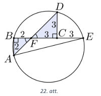

# <lo-sample/> LV.AMO.2023.11.4

Uz katras no $72$ kartītēm uzrakstīts kāds naturāls skaitlis 
(daži no tiem var būt arī vienādi). Kartītes
iespējams sadalīt astoņās grupās pa deviņām kartītēm katrā tā, 
ka visās grupās uz kartītēm uzrakstīto
skaitļu summas ir vienādas. Kā arī kartītes iespējams sadalīt 
deviņās grupās pa astoņām kartītēm katrā
tā, ka visās grupās uz kartītēm uzrakstīto skaitļu summas ir vienādas.
Vai vienmēr:  
**(A)** visas kartītes var sadalīt sešās grupās pa $12$ kartītēm katrā tā, 
ka visās grupās uz kartītēm uzrakstīto skaitļu summas ir vienādas;  
**(B)** visas kartītes var sadalīt $12$ grupās pa sešām kartītēm katrā tā, 
ka visās grupās uz kartītēm uzrakstīto skaitļu summas ir vienādas?

<small>

* questionType:ProveDisprove,ProveDisprove
* domain:Comb
* method:PigeonholePrincipleBasic

</small>

## Atrisinājums 

Aplūkosim $8 \times 9$ lielu rūtiņu tabulu:

| 1   | 1   | 1   | 1   | 1   | 1   | 1   | 9   | 2   |
| --- | --- | --- | --- | --- | --- | --- | --- | --- |
| 1   | 1   | 1   | 1   | 1   | 1   | 9   | 1   | 2   |
| 1   | 1   | 1   | 1   | 1   | 9   | 1   | 1   | 2   |
| 1   | 1   | 1   | 1   | 9   | 1   | 1   | 1   | 2   |
| 1   | 1   | 1   | 9   | 1   | 1   | 1   | 1   | 2   |
| 1   | 1   | 9   | 1   | 1   | 1   | 1   | 1   | 2   |
| 1   | 9   | 1   | 1   | 1   | 1   | 1   | 1   | 2   |
| 9   | 1   | 1   | 1   | 1   | 1   | 1   | 1   | 2   |

Varam uzskatīt, ka katra rūtiņa atbilst vienai kartītei un tajā 
ierakstītais skaitlis ir uz kartītes uzrakstītais skaitlis.

Tabulas sadalīšana pa rindām atbilst sadalīšanai astoņās grupās pa 
deviņām kartītēm katrā, bet pa
kolonnām – deviņās grupās pa astoņām kartītēm katrā. 
Abos gadījumos skaitļu summa visās grupās ir
vienāda – attiecīgi $18$ un $16$. Pieminēsim, ka visu skaitļu kopsumma šajā piemērā attiecīgi ir $144$.

**(A)** Pamatosim, ka aplūkotajam piemēram neizpildās šī prasība. 
Pieņemsim pretējo, ka šos skaitļus var
sadalīt sešās grupās pa $12$ kartītēm katrā tā, lai skaitļu summa 
visās grupās būtu vienāda. Tad skaitļu summai katrā grupā jābūt 
$\frac{144}{6} = 24$. Tā kā kopā ir astoņas kartītes ar skaitli $9$, 
tad pēc Dirihlē principa vismaz vienā grupā būs vairāk nekā 
viena kartīte ar $9$. Ja grupā ir divas kartītes ar $9$, 
tad uz atlikušajām $10$ kartītēm uzrakstīto skaitļu summai jābūt 
$24 − 2 \cdot 9 = 6$, kas nav iespējams, jo mazākā iespējamā
summa ir $10 \cdot 1 = 10$. Esam ieguvuši pretrunu, ko izraisīja pieņēmums, 
ka kartītes sešās grupās pa $12$
katrā ar vienādu skaitļu kopsummu sadalīt ir iespējams.

**(B)** Pamatosim, ka aplūkotajam piemēram neizpildās šī prasība. 
Pieņemsim pretējo, ka šos skaitļus var
sadalīt $12$ grupās pa sešām kartītēm katrā tā, lai skaitļu summa 
visās grupās būtu vienāda. Tad skaitļu
summai katrā grupā jābūt $\frac{144}{12} = 12$. 
Nevienā grupā nevar būt vairāk par vienu kartīti ar skaitli $9$,
jo $2 \cdot 9 = 18 > 12$. 
Ja grupā ir viena kartīte ar $9$, tad uz atlikušajām piecām 
kartītēm uzrakstīto skaitļu summai jābūt $12 − 9 = 3$, 
kas nav iespējams, jo mazākā iespējamā summa ir $5 \cdot 1 = 5$. 
Esam ieguvuši
pretrunu, ko izraisīja pieņēmums, ka ir iespējams sadalīt kartītes 
$12$ grupās pa sešām katrā ar vienādu
skaitļu kopsummu.

# <lo-sample/> LV.AMO.2023.11.5

Atrisināt veselos skaitļos vienādojumu $17a^2 - 7b^2 + c^2 = 2023$.

<small>

* questionType:FindAll
* domain:NT
* method:ContradictionForExistence

</small>

## Atrisinājums 

Pierādīsim, ka šim vienādojumam nav atrisinājuma. 
Lai to pamatotu, aplūkojam abas
vienādojuma puses pēc moduļa $8$. Vesela skaitļa kvadrāts 
pēc moduļa $8$ var pieņemt tikai vērtības $0$, $1$
vai $4$ (skat. tabulu).

| $n$           | 0   | 1   | 2   | 3   | 4   | 5   | 6   | 7   |  
| ------------- | --- | --- | --- | --- | --- | --- | --- | --- |
| $n^2 \pmod 8$ | 0   | 1   | 4   | 1   | 0   | 1   | 4   | 1   |

Tātad skaitlis $17a^2$ pēc moduļa 8 var pieņemt tikai vērtības 
$0$, $1$ vai $4$ (jo $17a^2 = 16a^2 + a^2$)
un līdzīgi arī $−7b^2$ (jo $−7b^2 = − 8b^2 + b^2$)
var pieņemt tikai šos trīs atlikumus. Bet skaitlis $2023$, dalot ar $8$,
dod atlikumu $7$. Redzams, ka nekādā veidā saskaitot trīs skaitļus 
no kopas $\{0; 1; 4\}$ mēs nevaram iegūt
skaitli, kas atlikumā, dalot ar $8$, dotu $7$. 
Tātad šim vienādojumam nav atrisinājuma.

# <lo-sample/> LV.AMO.2023.12.1

Vai burtu vietā var ierakstīt $9$ dažādus nenulles ciparus, 
lai vienādība $\frac{A}{B} + \frac{C}{D} + \frac{E}{F} + \frac{G}{H} = I$
būtu patiesa?

<small>

* questionType:ProveDisprove
* domain:Alg
* subdomain:Equations

</small>

## Atrisinājums 

Jā, var, piemēram,
$\frac{5}{4} + \frac{9}{3} + \frac{6}{8} + \frac{2}{1} = 1\frac{1}{4} + 3 + \frac{3}{4} + 2 = 7$. 

# <lo-sample/> LV.AMO.2023.12.2

Kāda ir izteiksmes $2x^2 − 8xy + 4x + 9y^2 - 14y + 9$
mazākā iespējamā vērtība, ja $x$ un $y$ ir reāli
skaitļi?

<small>

* questionType:FindOptimal
* domain:Alg
* method:PolynomialTransformations

</small>

## Atrisinājums 

Ekvivalenti pārveidojam doto izteiksmi:

$$\begin{array}{c}2x^2 − 8xy + 4x + 9y^2 − 14y + 9 = \\
= 2(x^2 + 4y^2 + 1 − 4xy + 2x − 4y) + y^2 − 6y + 9 − 2 = \\
= 2(x − 2y + 1)^2 + (y − 3)^2 − 2 \geq −2.\\
\end{array}$$

Tā kā kvadrāti ir nenegatīvi, tad dotās izteiksmes mazākā vērtība 
ir $−2$ un to iegūst, ja $y = 3$ un $x = 5$.

# <lo-sample/> LV.AMO.2023.12.3

Taisnstūra $ABCD$ diagonāle $BD$ ir kvadrāta $BDEF$ viena mala. 
Punkts $C$ atrodas kvadrāta $BDEF$ iekšpusē. 
Pierādīt, ka $S_{ABD} \leq S_{CEF}$.

<small>

* questionType:Prove
* domain:Geom
* method:AugmentationWithNewElements

</small>

## Atrisinājums 

Apzīmēsim $AD = a$ un $AB = b$. 
Tādā gadījumā $BD = \sqrt{a^2 + b^2}$, 
no kā iegūstam, ka
$S_{BDEF} = BD^2 = a^2 + b^2$. 

Caur punktu $C$ novelkam nogriezni $GH$, kas ir paralēls kvadrāta malai 
$BD$ (skat. 23. att.). Taisnstūra
diagonāle $BD$ sadala taisnstūra $ABCD$ laukumu divos vienādos trijstūros 
$ABD$ un $BCD$, kuru laukumi
ir $S_{ABD} = S_{BCD} = \frac{ab}{2}$.

Tā kā trijstūra $BCD$ pamats ir taisnstūra $BDHG$ mala $BD$, 
bet trijstūra augstuma garums ir vienāds ar
taisnstūra malas $BG$ garumu, tad $S_{BDHG} = 2S_{BCD} = ab$. 
Līdzīgi iegūstam, ka $S_{CEF} = \frac{1}{2}S_{EFGH}$. 
Līdz ar to
$$S_{CEF} = \frac{1}{2}S_{EFGH} = \frac{S_{BDEF} - S_{BDHG}}{2} = 
\frac{a^2 + b^2 - ab}{2} = \frac{(a-b)^2 + ab}{2} \geq \frac{ab}{2} = S_{ABD}.$$

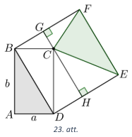

# <lo-sample/> LV.AMO.2023.12.4

Kvadrātā ar izmēriem $8 \times 8$ rūtiņas iekrāsotas astoņas rūtiņas tā, 
ka katrā rindā un katrā kolonnā ir
iekrāsota tieši viena rūtiņa.

**(A)** Pierādīt, ka jebkuram kvadrātam ar šādi iekrāsotām rūtiņām 
var atrast taisnstūri ar izmēriem $2 \times 4$
rūtiņas, kurā nav iekrāsota neviena rūtiņa!  
**(B)** Parādīt, ka līdzīgs apgalvojums par taisnstūri ar izmēriem 
$2 \times 5$ rūtiņas nav patiess!

<small>

* questionType:Prove,Prove
* domain:Comb
* method:ContradictionForExistence

</small>

## Atrisinājums 

**(A)** Mēģināsim panākt pretējo, tas ir, iekrāsot rūtiņas dotajā kvadrātā tā, 
lai nav taisnstūra ar izmēriem $2 \times 4$ rūtiņas bez iekrāsotām rūtiņām.

Visu laukumu sadalām kvadrātos ar izmēriem $2 \times 2$ rūtiņas, 
kurus nosauksim par šūnām (skat. 24. att.,
kur katrā šūnā norādīts tās numurs).

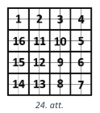

Tā kā katrā rindā un katrā kolonnā ir iekrāsota tieši viena rūtiņa, 
tad katrā šūnā var būt iekrāsotas 0, 1
vai 2 rūtiņas. Ja kādā šūnā būs atzīmētas divas rūtiņas, 
tad attiecīgajā šūnu rindā un šūnu kolonnā
pārējās šūnas būs bez iekrāsotām rūtiņām, turklāt vismaz divās 
blakus šūnās nebūs iekrāsotu rūtiņu,
šīs šūnas kopā veidos $2 \times 4$ rūtiņu taisnstūri bez iekrāsotām rūtiņām 
(pretruna ar pieņēmumu). Tātad
katrā šūnā drīkst iekrāsot ne vairāk kā 1 rūtiņu. 
Tā kā kopā ir iekrāsotas tieši $8$ rūtiņas, tad astoņās no
$16$ šūnām jābūt iekrāsotai tieši vienai rūtiņai.

Pamatosim: ja divas šūnas ar iekrāsotu rūtiņu atradīsies blakus, 
tad kaut kur blakus atradīsies divas
šūnas bez iekrāsotām rūtiņām. Ievērojam, ka doto kvadrātu var pagriezt tā, 
lai šīs divas blakus šūnas ar
iekrāsotajām rūtiņām būtu ar secīgiem numuriem 
(mazākais numurs ir nepāra) kā parādīts 24. att.

Tad atlikušās šūnas secīgi var sadalīt pa pāriem, iegūstot $7$ 
šūnu pārus. Lai nebūtu taisnstūris bez
iekrāsotām rūtiņām, tad vismaz katrā otrajā šūnā jāiekrāso rūtiņa. 
Tas nozīmē, ka nepieciešams pa
rūtiņai atzīmēt vismaz $7$ šūnās, kas nav iespējams, 
jo atlikušais iekrāsojamo rūtiņu skaits ir $6$.
Tātad šūnām ar iekrāsotajām rūtiņām jābūt izvietotām šaha galdiņa veidā 
(skat. 25. att.). 

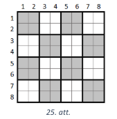

Simetrijas dēļ varam pieņemt, ka 1. šūna satur iekrāsotu rūtiņu. 
Aplūkosim 11. šūnu un pieņemsim, ka
tajā iekrāsotā rūtiņa atrodas šūnas kreisajā pusē (tas ir, sākotnējā kvadrāta 3. kolonnā). Vai nu 3. šūnā,
vai 9. šūnā iekrāsotajai rūtiņai ir jāatrodas 6. kolonnā 
(jo kolonnā drīkst būt iekrāsota tikai viena rūtiņa),
tad taisnstūris ar izmēriem $2 \times 4$ bez iekrāsotām rūtiņām 
parādīts attiecīgi 26. att. un 27. att.

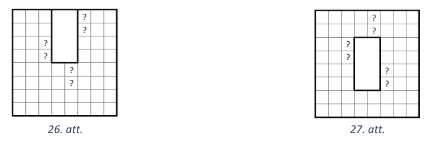

Gadījums, kad 11. šūnā iekrāsotā rūtiņa atrodas šūnas labajā pusē, 
ir simetrisks, tad taisnstūris ar
izmēriem $2 \times 4$ bez iekrāsotām rūtiņām parādīts 28. att. un 29. att.

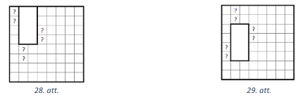

Līdz ar to jebkurā kvadrātā ar doto iekrāsojumu var atrast taisnstūri 
ar izmēriem $2 \times 4$ rūtiņas, kurā
nav iekrāsota neviena rūtiņa.

**(B)** Piemēram, skat. 30. att., kurā nevar atrast $2 \times 5$ 
taisnstūri ar neatzīmētu rūtiņu.

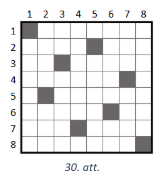

# <lo-sample/> LV.AMO.2023.12.5

Vai eksistē tāds naturāls skaitlis, kuram tieši 
**(A)** $25\%$; **(B)** $26\%$ no visiem tā pozitīvajiem dalītājiem dod
atlikumu $1$, dalot ar $3$?  
*Piezīme.* Skaitļa $n$ dalītājs ir arī $1$ un pats skaitlis $n$.

<small>

* questionType:ProveDisprove,ProveDisprove
* domain:NT

</small>

## Atrisinājums 

**(A)** Jā, ir, piemēram, skaitlis $27$. 
Tam ir četri dalītāji: $1$, $3$, $9$ un $27$. 
Vienīgais dalītājs, kas,
dalot ar $3$, atlikumā dod $1$, ir atlikums $1$, kas sastāda 
$\frac{1}{4}$ jeb $25\%$ no dalītājiem.

**(B)** Jā, eksistē, piemēram, skaitlis $3 \cdot 2^{24}$.
Pamatosim, ka šim skaitlim izpildās prasītā īpašība. 
Šim skaitlim kopā ir $50$ dalītāji, jo katru pirmskaitli,
veidojot dalītāju, vai nu varam izlaist, vai arī ņemt kādā no pakāpēm, 
kas nepārsniedz skaitlī ieejošo
pakāpi. Tātad reizinātājam $3$ ir $2$ izvēles, un reizinātājiem $2$ ir $25$ 
izvēles. Kopā iegūstam $2 \cdot 25 = 50$
izvēles jeb dalītājus. Puse no šiem dalītājiem ir formā $3 \cdot 2^a$ 
un otra puse ir formā $2^a$, kur
$a \in \{0; 1; 2; \ldots ; 24\}$. 
Dalītāji formā $3 \cdot 2^a$ dalās ar $3$. 
Noskaidrosim, kuri no dalītājiem formā $2^a$, 
dalot ar $3$, dod atlikumu $1$. Apskatām divus gadījumus.

* Ja kāpinātājs $a$ ir pāra skaitlis, tad $a = 2k$ un tādā gadījumā 
  $2^a = 2^{2k} = 4^k \equiv 1 \pmod 3$.
  Tātad visi šie dalītāji, dalot ar $3$, dod atlikumu $1$. 
  Tā kā no $0$ līdz $24$ (ieskaitot) ir $13$ pāra skaitļi, tad
  arī šādu dalītāju skaits ir $13$.
* Ja kāpinātājs $a$ ir nepāra skaitlis, tad $a = 2k+1$ 
  un tādā gadījumā $2^a = 2^{2k+1} = 2 \cdot 4^𝑘 \equiv 2 \cdot 1^k \equiv 2 \pmod 3$. Tātad visi šie dalītāji, dalot ar $3$, dod atlikumu $2$. To skaits ir $12$.

Tā kā skaitlim $3 \cdot 2^{24}$ ir $50$ dalītāji, tad $\frac{13}{50} = 26\%$ 
no tiem atlikumā dod $1$, dalot ar $3$.

