# <lo-sample/> LV.AMO.2024.5.1

Režģa (skatīt 1. att.) katrā rūtiņā ieraksti vienu ciparu no 1 līdz 5. 
Katrā rindā un katrā kolonnā jābūt ierakstītiem visiem skaitļiem 
no $1$ līdz $5$. Katrā ar tumšu līniju atdalītajā figūrā, 
kas satur divas vai trīs rūtiņas, ir dots skaitlis un darbību 
zīme. Ar šīs figūras rūtiņās ierakstītajiem skaitliem, 
veicot doto darbību, jāiegūst dotais skaitlis. Pietiek 
parādīt vienu piemēru, kā to izdarīt. Trijās ar tumšu līniju 
apvilktajās rūtiņās skaitḷi jau ir ierakstīti.

Piemēram, augšējā kreisā stūra figūrā "$2-$" nozīmē, ka abu 
ierakstīto skaitļu starpība (no lielākā atņemot mazāko) ir $2$.

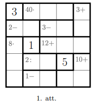

<small>

* questionType:
* domain:

</small>

## Atrisinājums 

Skaitḷus režģī iespējams sarakstīt, kā tas redzams 2. att.

# <lo-sample/> LV.AMO.2024.5.2

Kastē ir $7$ zal̦as, $3$ sarkanas, $11$ melnas un $9$ baltas bumbiņas. 
Kāds ir mazākais skaits bumbiņu, kas Aleksandram jāizvelk no kastes, 
lai garantētu, ka viņam: 

**(A)** ir vismaz divas vienādas krāsas bumbiņas;  
**(B)** ir vismaz divas melnas bumbinas;   
**(C)** ir vismaz viena bumbiṇa no katras krāsas?

<small>

* questionType:
* domain:

</small>

## Atrisinājums 

**(A)** Tā kā ir četras dažādas krāsas, tad minimālais bumbiṇu skaits, 
kas jāizvelk Aleksandram ir $4+1=5$. Ar četrām nepietiks, jo tad varētu 
gadīties izvilkt katru savā krāsā.

**(B)** Var gadīties, ka divas melnās bumbiņas tiek izvilktas pašas 
pēdējās. Tas ir, vispirms izvelk pilnīgi visas citu krāsu bumbiņas 
un tad 2 melnas. Tātad, nepieciešams izṇemt $7+3+9+2=21$ bumbiṇas.

**(C)** Visvairāk ir zaḷu, melnu un baltu bumbiņu. Var gadīties, ka tās 
tiek izvilktas, un pilnam krāsu komplektam pietrūkst sarkana bumbiṇa, 
kuru izvelk pēdējo. Tāpēc nepieciešams izvilkt $7+11+9+1=28$ bumbiņas.

# <lo-sample/> LV.AMO.2024.5.3

Uzraksti 10 izteiksmes, katrai izmantojot četrus skaitlus 
$3,5,7$ un $9$ katru tieši vienu reizi un trīs aritmētisko 
darbību zīmes (saskaitīšanu, atņemšanu, reizināšanu vai 
dalīšanu), tā, lai šo izteiksmju vērtības būtu skaitḷi 
$0,1,2,3,4,5,6,7,8,9$. Darbību grupēšanai drīkst izmantot 
iekavas, skaitḷu secību drīkst mainīt. Dalīšanai 
jāizpildās precīzi bez noapaļošanas. Katram skaitlim pietiek 
atrast vienu derīgu izteiksmi. Derīgas izteiksmes piemērs: 
$7 \cdot(9-5)-3=25$.

<small>

* questionType:
* domain:

</small>

## Atrisinājums 

Prasītos ciparus varam iegūt sekojoši:

$$\begin{aligned}
(9+3)-(5+7) & =0, & 5 \cdot((7+3)-9) & =5 \\
(9-7):(5-3) & =1, & (9: 3) \cdot(7-5) & =6 \\
(9+7):(5+3) & =2, & 7 \cdot(9-(3+5)) & =7, \\
(9-3):(7-5) & =3, & (7+9)-(3+5) & =8, \\
(9+5)-(7+3) & =4, & 9 \cdot(3-(7-5)) & =9 .
\end{aligned}$$

# <lo-sample/> LV.AMO.2024.5.4

Dots $7 \times 9$ rūtiņu taisnstūris. Vai tajā var ievietot deviņas 3. att. redzamās figūras? Figūras drīkst pagriezt un apmest otrādi, bet tās nevar pārklāties viena ar otru vai iziet ārpus taisnstūra.

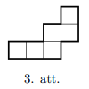

<small>

* questionType:
* domain:

</small>

## Atrisinājums 

Jā var. Piemēram tā, kā redzams 4. att.

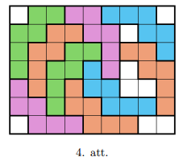

# <lo-sample/> LV.AMO.2024.5.5

Andris aizmirsa mājās pulksteni. Autobusa pieturā viņš pamanīja 
stāvam 4 cilvēkus. Katram no tiem Andris pajautāja: 
"Sakiet, cik ir pulkstenis?". Atbildes bija šādas:  
A: "Bez 6 minūtēm trīs."  
C: "3 minūtes pāri trijiem."  
B: "Bez 3 minūtēm trīs."  
D: "2 minūtes pāri trijiem."  

Izrādījās, ka nevienam no šiem cilvēkiem pulkstenis nerāda 
pareizu laiku. Pie tam, viena pulksteņa rādītais laiks 
atšķiras no patiesā laika par 2 minūtēm, otrā - par 3 minūtēm, 
trešā - par 4 minūtēm, ceturtā - par 5 minūtēm 
(nav zināms, kurš pulkstenis kavējas, kurš steidzas). 
Cik patiesībā bija pulkstenis? Atbildi pamato!

<small>

* questionType:
* domain:

</small>

## Atrisinājums

Pierakstīsim katra cilvēka atbildi. A - 2:54; B-2:57; C-3:03; D-3:02. Neviens no šiem laikiem pēc dotā nevar būt pareizs.
Pareizais laiks nevar būt 2:54 un 3:03 (tad attiecīgi C kl̦ūdītos par 9 minūtēm un $A$ kl̄ūdītos par 9 minūtēm). Tas nevar būt arī nedz mazāks, nedz lielāks, citādi A vai B klı̄̄dītos vairāk par 9 minūtēm. Tātad tas ir starp 2:55 un 3:01.
Neviens nekḹ̄dās par 1 minūti, tādēl neder 2:55, 2:56, 2:58, 3:01. Atliek tikai 3:00 vai 2:59. 3:00 neder, jo tad gan B, gan C kḷūdās par 3 min. Tātad pulkstenis bija 2:59.

# <lo-sample/> LV.AMO.2024.6.1

Režģa (skatīt 5. att.) katrā rūtiņā ieraksti vienu ciparu no 
$1$ līdz $6$. Katrā rindā un katrā kolonnā jābūt ierakstītiem 
visiem skaitliem no $1$ līdz $6$. Katrā ar tumšu līniju 
atdalītajā figūrā, kas satur divas vai trīs rūtiņas, ir 
dots skaitlis un darbību zīme. Ar šīs figūras rūtiṇās 
ierakstītajiem skaitliem, veicot doto darbību, jāiegūst 
dotais skaitlis. Pietiek parādīt vienu piemēru, kā to izdarīt. 
Vienā ar tumšu līniju apvilktajā rūtiņā skaitlis jau ir ierakstīts.

Piemēram, augšējā kreisā stūra figūrā "4-" nozīmē, ka abu ierakstīto skaitlu starpība (no lielākā atņemot mazāko) ir 4.

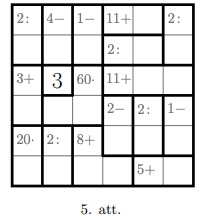

<small>

* questionType:
* domain:

</small>

## Atrisinājums 

Skaitḷus režģī iespējams sarakstīt, kā tas redzams 6. att.

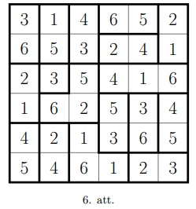

# <lo-sample/> LV.AMO.2024.6.2

Kastē ir 14 violetas, 18 brūnas, 4 oranžas un 19 dzeltenas bumbiņas. 
Anna no kastes izvilka 9 bumbiņas.  
**(A)** Vai var apgalvot, ka tieši piecas no izvilktajām bumbiņām ir dzeltenas?  
**(B)** Vai Anna noteikti izvilka vismaz trīs vienādas krāsas bumbinas?  
**(C)** Kāds mazākais skaits bumbiņu Annai vēl ir jāizvelk no kastes, 
lai varētu apgalvot, ka kopumā Annai vismaz sešas no bumbiņām ir vienā krāsā?

<small>

* questionType:
* domain:

</small>

## Atrisinājums 

**(A)** Nē. Piemēram, varētu gadīties, ka Anna kopā ir 
izvilkusi 9 violetas bumbiņas.

**(B)** Jā. Kopā ir deviņas bumbiņas un ir tikai četrās dažādās krāsās. 
Ja Anna būtu izvilkusi ne vairāk kā 2 bumbiņas no katras krāsas, 
tad kopā būtu ne vairāk kā $2 \cdot 4=8$ bumbiņas. Bet tas ir 
pretrunā ar doto, ka ir izvilktas 9 bumbiņas. Tātad noteikti 
Anna ir izvilkusi vismaz 3 vienas krāsas bumbiņas.

**(C)** Ievērosim, ka nav iespējams izvilkt sešas oranžas krāsas 
bumbiņas, jo kastē ir tikai četras šādas bumbiņas. Var gadīties, 
ka šīs Anniņa jau ir izvilkusi pirmās. Tātad, ja ir izvilktas 
visas četras oranžās bumbiṇas, tad kastē paliek tikai trīs 
krāsu bumbiņas. Pēc Dirihlē principa secinām, ka kopumā būtu 
nepieciešams izvilkt $5 \cdot 3+1=16$ bumbiņas no trīs dažādām 
krāsām, lai iegūtu 6 vienādas krāsas bumbiņas. Tātad Annai 
nepieciešamas kopā vismaz $4+16=20$ bumbiņas, lai garantētu to, 
ka sešas no tām ir vienā krāsā. Secinām, ka Annai jāizvelk 
vēl 20-9 = 11 bumbinas.

# <lo-sample/> LV.AMO.2024.6.3

Katrs no 10 rūķı̌šiem vienmēr saka patiesību vai vienmēr melo. 
Zināms, ka katram no rūķı̄šiem ir viena mīḷākā saldējuma garša - 
vaniḷas, šokolādes vai zemeņu.
Sniegbaltīte lūdza pacelt roku tiem rūk̦iem, kam mīļākais ir 
vaniļas saldējums, un astoņi rūk̦iši pacēla savu roku. 
Tad viṇa prasīja par šokolādes saldējumu un puse pacēla savu roku. 
Kad jautāja par zemeņu saldējumu, tikai viens rūk̦ītis pacēla 
savu roku. Cik no šiem rūķiem vienmēr saka patiesību?

<small>

* questionType:
* domain:

</small>

## Atrisinājums

Kopā rūķı̄ši pacēla rokas $8+5+1=14$ reizes. Ja visi teiktu patiesību, 
tad katrs paceltu roku vienu reizi un būtu 10 paceltas rokas kopumā.
Melis cels roku divas reizes - mīl̄ākajai saldējuma garšai necels, 
bet pārējām divām pacels. Katru patieso rūk̦i aizstājot ar meli, 
pacelto roku skaits palielinās par viens. Tā kā tika paceltas 
par $14-10=4$ rokām vairāk nekā tad, ja visi teiktu patiesību, 
tad ir 4 mel, un $10-4=6$ rūķi vienmēr saka patiesību.

# <lo-sample/> LV.AMO.2024.6.4

Parādi, kā griežot pa rūtiņu līnijām, 7. att. doto figūru var 
sagriezt divās vienādās daḷās. Daḷas ir vienādas, ja tās 
pagriežot vai apmetot otrādi var uzlikt vienu uz otras tā, 
ka tās sakrīt.

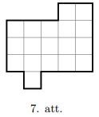

<small>

* questionType:
* domain:

</small>

## Atrisinājums 

Skatīt 8. att.

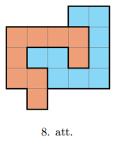

# <lo-sample/> LV.AMO.2024.6.5

Caurspīdīgā kastē ir ieliktas konfektes un četriem bērniem 
jāizsaka savs minējums par konfekšu skaitu tajā. Katrs piedāvā savu 
minējumu: 116, 124, 120 un 128. Izrādās, neviens nav uzminējis pareizi.
Noskaidrojiet, cik konfekšu var būt kastē, ja zināms, ka no patiesā 
konfekšu skaita viens no skolēniem kḷūdījās par viens, 
viens - par trīs, viens - par pieci un viens - par deviņi.

<small>

* questionType:
* domain:

</small>

## Atrisinājums

Pamatosim, ka konfekšu kastē var būt vai nu $119$, vai arı̄ 
125 konfektes. Konfekšu skaits nevar būt 115 (jo tad kāds 
būtu kḷūdījies par $128-115=13$ ) un nevar būt $129$ 
(jo tad kāds būtu kḷūdījies par $129-116=13$). Tā kā lielākam 
un mazākam skaitam klıūda būtu vēl lielāka un neviens no 
minējumiem nav pareizs, varam secināt, ka konfekšu skaits 
ir starp $117$ un $127$.
Uzrakstīsim secīgi derīgos variantus un arī skolēnu minējumus 
(tie būs pasvītroti):

$$\underline{116} ; 117 ; 118 ; 119 ; \underline{120} ; 121 ; 122 ; 123 ; \underline{124} ; 125 ; 126 ; 127 ; \underline{128}.$$

Neviens nav kļūdījies par divi, tādēl, varam izsvītrot skaitļus, 
kas atrodas attālumā divi no kāda no minējuma:
$\underline{116} ; 117 ; 118 ; 119 ; \underline{120} ; 121 ; 122 ; 123 ; 124 ; 125 ; 126 ; 127 ; \underline{128}$.

Neviens nav kḷūdījies par septiņi, tāpēc varam izsvītrot 121 un 123:

$$\underline{116} ; 117 ; 118 ; 119 ; \underline{120} ; 121 ; 122 ; 123 ; \underline{124} ; 125 ; 126 ; 127 ; \underline{128}.$$

Ievērosim, ka $117$ un $127$ nevar būt pareizā atbilde, 
jo abos gadījumos kāds būs kļūdījies par $11$. 
Atliek tikai $119$ un $125$. Viegli pārliecināties, 
ka abos gadījumos izpildās uzdevuma nosacījumi, 
tādēļ kastē var būt $119$ vai $125$ konfektes.

# <lo-sample/> LV.AMO.2024.7.1

Marta, Sandris un Linda vēlas sagatavot pulciņa telpu 
Ziemassvētku ballītei. Zināms, ka Marta viena pati to spētu 
izdarīt vienā stundā, Sandris to spētu pusotrā stundā, 
bet Linda to spētu izdarīt trīs stundās. Marta ieradās 
pulciņa telpā 16:00, Sandris $10$ minūtēs vēlāk, bet Linda 
vēl 15 minūtes pēc Sandra (katrs pēc ierašanās uzreiz 
k̦ērās pie pulciņa telpas gatavošanas). Cikos pulciņa 
telpa bija gatava?

<small>

* questionType:
* domain:

</small>

## Atrisinājums

Pamatosim, ka kopā tika pavadītas $37 \frac{1}{2}$ minūtes, 
lai sagatavotu telpu jeb telpa bija gatava 16:37:30. 
Tā kā Marta spēj sagatavot telpu stundā, tad katru minūti 
viṇa sagatavo $\frac{1}{60}$ no telpas. Pēc 10 minūtēm 
viņa būs sagatavojusi $\frac{10}{60}=\frac{1}{6}$ no telpas. 
Tātad vēl jāsakārto $1-\frac{1}{6}=\frac{5}{6}$ no telpas. 
No šī brīža palīdz arī Sandris. Tā kā Sandris viens pats 
spētu sagatavot telpu 90 minūtēs, tad katru minūti viņš 
sagatavo $\frac{1}{90}$ no telpas. Kopā ar Martu viņi katru 
minūti sagatavo 
$\frac{1}{60}+\frac{1}{90}=\frac{3}{180}+\frac{2}{180}=\frac{5}{180}=\frac{1}{36}$ 
no telpas. Tātad pēc 15 minūtēm būs sagatavota vēl 
$15 \cdot \frac{1}{36}=\frac{5}{12}$ no telpas. 
Tātad atliek sagatavot 
$\frac{5}{6}-\frac{5}{12}=\frac{10}{12}-\frac{5}{12}=\frac{5}{12}$ 
no telpas. No šī brīža Sandra ir ieradusies palīdzēt. Viņa spēj 
katru minūti sagatavot $\frac{1}{180}$ no telpas, tāpēc kopumā 
ar Sandri un Martu viṇi spēj sagatavo 
$\frac{1}{36}+\frac{1}{180}=\frac{5}{180}+\frac{1}{180}=\frac{6}{180}=\frac{1}{30}$ 
no telpas katru minūti. Tagad aprēk̦ināsim, cik minūtes nepieciešamas, 
lai sagatavotu $\frac{5}{12}$ no telpas, ja katru minūti 
tiek sagatavota $\frac{1}{30}$ no telpas:

$$\frac{\frac{5}{12}}{\frac{1}{30}}=\frac{5}{12} \cdot \frac{30}{1}=\frac{25}{2}=12 \frac{1}{2}.$$

Tātad sākotnēji Marta viena pati gatavoja telpu 10 minūtes, 
tad kopā ar Sandri vēl 15 minūtes, bet visi trijatā vēl 
$12 \frac{1}{2}$ minūtes. Kopumā bija nepieciešamas 
$10+15+12 \frac{1}{2}=37 \frac{1}{2}$ minūtes jeb telpa 
bija gatava 16:37:30.

# <lo-sample/> LV.AMO.2024.7.2

Jurğis Mik̦eldienas tirgū ar izlozes palīdzību izdalīja 11 balvas. 
Katra balva satur 6 rudens labumus: ābolus, bumbierus un bietes. 
Pie tam zināms, ka katra balva satur vismaz vienu ābolu, 
bumbieri un bieti. Pamatot, ka noteikti tika izdalītas divas 
tādas balvas, kurām bija vienāds saturs

<small>

* questionType:
* domain:

</small>

## Atrisinājums  

Nepieciešams uzzināt, cik dažādus komplektus Jurǵis varēja 
izveidot. Tā kā katra balva satur vismaz pa vienam no katra 
rudens labuma, tad varam apskatīt, cik dažādos veidos 
skaitli 6 var izteikt kā trīs naturālu skaitlu summu ar trīs 
saskaitāmajiem: $4+1+1,3+2+1$ un $2+2+2$. Nemot vērā, 
kura dārzeņa vai augla daudzums ir katrs no saskaitāmajiem, 
iegūsim 10 dažādus balvu komplektus:

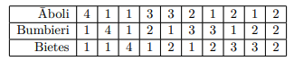

Tā kā tika izdalītas 11 balvas un ir 10 dažādi balvu komplekti, 
tad pēc Dirihlē principa noteikti būs izdalīti divi tādi komplekti, 
kam ir vienāds saturs.

# <lo-sample/> LV.AMO.2024.7.3

Skaitḷu virknes pirmais loceklis ir $12$. Katru nākamo iegūst 
iepriekšējo vai nu reizinot ar $2$ vai $3$, vai arī izdalot ar 
$2$ vai $3$ (ja tas dalās bez atlikuma). Vai šīs skaitļu virknes 
61.loceklis var būt skaitlis $54$?

<small>

* questionType:
* domain:

</small>

## Atrisinājums 

Pamatosim, ka prasītais nav iespējams. Aplūkojam, 
cik daudz pirmreizinātāju ir sākotnējam skaitlim. 
Sadalot $12$ pirmreizinātājos, iegūstam $12=2 \cdot 2 \cdot 3$, 
un tam ir trīs pirmreizinātāji. Jāiegūst skaitlis 
$54=2 \cdot 3 \cdot 3 \cdot 3$, kuram ir četri pirmreizinātāji.
Katram nākamajam skaitlim skaitllu virknē, skaitḷa 
pirmreizinātāju skaits pieaug par viens 
(ja reizina ar $2$ vai $3$) vai samazinās par viens 
(ja dala ar $2$ vai $3$). Tātad, pirmreizinātāju skaita paritāte 
mainās un veidojas periodiska virkne

$$n, p, n, p, n, p, \ldots$$

Sākam ar nepāra skaitu pirmreizinātāju (skaitlim $12$ ir trīs 
pirmreizinātāji) un mums interesē virknes 61.loceklis. 
Ievērojam, ka katrs virknes loceklis pāra pozīcijā būs pāra 
skaitlis, bet nepāra pozīcijā būs nepāra skaitlis. 
Tātad skaitļu virknes 61.loceklim būs nepāra skaits 
pirmreizinātāju. Bet prasīts iegūt $54$, kam ir pāra skaits 
pirmreizinātāju (četri). Secinām, ka prasītais nav iespējams.

# <lo-sample/> LV.AMO.2024.7.4

Dots kvadrāts ar izmēriem $10 \times 10$ rūtiņas. 
Kāds ir lielākais skaits 9. att. redzamo figūru, kuras 
var izgriezt no šī kvadrāta, ja griezuma līnijām jāiet pa 
rūtiņu līnijām? Figūras drīkst būt pagrieztas.

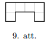

<small>

* questionType:
* domain:

</small>

## Atrisinājums 

Kvadrātā ir $10 \cdot 10=100$ rūtiņas, bet katrai figūrai 
ir 6 rūtiņas. Tā kā $100: 6=$ 16, atlikumā 4, tad vairāk 
par 16 figūrām ielikt noteikti nevar. Piemēru, kā 
izkārtot 16 figūras rūtiņas var skatīt 10. att. 
Secinām, ka 16 ir vislielākais figūru skaits.

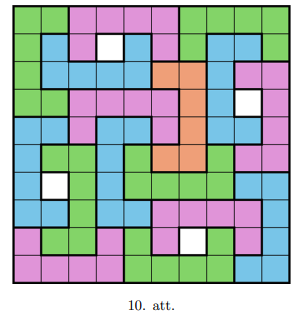

# <lo-sample/> LV.AMO.2024.7.5

Anita, Maija, Ināra un Sandra uzstājās koncertā. Katru dziesmu 
dziedāja 3 meitenes. Cik dziesmu meitenes nodziedāja pavisam, 
ja Anita dziedāja 7 dziesmas (vairāk nekā jebkura cita meitene), 
bet Sandra dziedāja 4 dziesmas (mazāk nekā jebkura cita meitene)?

<small>

* questionType:
* domain:

</small>

## Atrisinājums 

Pamatosim, ka kopējais nodziedāto dziesmu skaits ir 7. 
Apzīmēsim Maijas un Ināras nodziedāto dziesmu skaitu attiecīgi 
ar $M$ un $I$. Tad nodziedāto dziesmu summa ir 
$7+4+M+I=$ $11+M+I$. Katru dziesmu dzied 3 meitenes, 
tādēļ, katras meitenes dziedāto dziesmu summai jādalās ar trīs. 
Turklāt, $I$ un $M$ vērtības var būt 5 vai 6 (vismazākais 
dziedāto dziesmu skaits ir 4, bet vislielākais -- $7$). 
Vienīgais derīgais variants, lai $11+M+I$ dalītos ar 3 
ir gadījumā, kad $M=I=5$. Tādā gadījumā nodziedāto dziesmu 
skaits ir $\frac{11+5+5}{3}=\frac{21}{3}=7$.

Lai pierādītu, ka šāds koncerts ir iespējams, nepieciešams 
uzrādīt vismaz vienu derīgu piemēru.

|       | 1.    | 2.    | 3.    | 4.    | 5.    | 6.    | 7.    |
| :---: | :---: | :---: | :---: | :---: | :---: | :---: | :---: |
| A     | x     | x     | x     | x     | x     | x     | x     |
| M     | x     | x     | x     | x     | x     |       |       |
| I     |       |       | x     | x     | x     | x     | x     |
| S     | x     | x     |       |       |       | x     | x     |

# <lo-sample/> LV.AMO.2024.8.1

Doti trīs dažādi reāli skaitḷi. Zināms, ka aritmētiskais 
vidējais no divu mazāko skaitḷu aritmētiskā vidējā un 
divu lielāko skaitļu aritmētiskā vidējā ir vienāds ar visu 
trīs skaitḷu aritmētisko vidējo. Pie tam aritmētiskais 
vidējais no lielākā skaitḷa un mazākā skaitla ir 2024. 
Nosakiet šo trīs skaitḷu summu! 

<small>

* questionType:
* domain:

</small>

## Atrisinājums

Pamatosim, ka atbilde ir $6072$. Apz̄̄mēsim dotos skaitlus ar 
$a, b$ un $c$. Pie tam tā kā ir mazākais un lielākais skaitlis, 
tad varam pienemt, ka $a<b<c$. Pēc dotā mums zināms, ka

$$\frac{\frac{a+b}{2}+\frac{b+c}{2}}{2}=\frac{a+b+c}{3}$$

Vienkāršojot šo izteiksmi, iegūstam

$$\begin{aligned}
\frac{\frac{a+b}{2}+\frac{b+c}{2}}{2} & =\frac{a+b+c}{3} \\
3\left(\frac{a+b}{2}+\frac{b+c}{2}\right) & =2(a+b+c), \\
\frac{3}{2}(a+b+b+c) & =2(a+b+c), \\
3(a+2 b+c) & =4(a+b+c), \\
3 a+6 b+3 c & =4 a+4 b+4 c, \\
2 b & =a+c, \\
b & =\frac{a+c}{2} .
\end{aligned}$$

Tātad secinām, ka $b$ ir vienāds ar mazākā un lielākā skaitļa 
aritmētisko vidējo, jo $a<b<c$. Bet mums zināms, ka aritmētiskais 
vidējais no lielākā un mazākā skaitļa ir vienāds ar $2024$, 
tāpēc kā atbildi iegūstam

$$a+b+c=a+c+b=2 \cdot\left(\frac{a+c}{2}\right)+b=2 
\cdot\left(\frac{a+c}{2}\right)+\frac{a+c}{2}=2 
\cdot 2024+2024=3 \cdot 2024=6072.$$

# <lo-sample/> LV.AMO.2024.8.2

Pa apli patvaļīgā secībā sarakstīti visi naturālie skaitḷi no 
$1$ līdz $10$. Pamatot, ka noteikti var atrast tādus trīs 
secīgus skaitlus, kuru summa būs vismaz $17$.

<small>

* questionType:
* domain:

</small>

## Atrisinājums

Pien̦emsim pretējo, tas ir, pieņemsim, ka katru 3 secīgu skaitļu 
summa būs mazāka nekā 17. Ievērosim, ka kopā var izveidot $10$ 
šādas summas, jo katrs skaitlis ap apli būs pirmais saskaitāmais 
kādā summā tieši vienu reizi. Tātad visu summu kopsumma nepārsniegs 
$160$ (lielākā iespējamā summa ir 16). No otras puses visu 
summu kopsumma iekḷauj katru skaitli trīs reizes, tāpēc summu 
kopsummai jābūt tieši $3 \cdot(1+2+3+\cdots+9+10)=3 \cdot 55=165$. 
Iegūstam pretrunu, jo pēc mūsu pieņēmuma summu kopsumma 
nepārsniedz $160$. Tātad vismaz vienai summai jābūt lielākai nekā $16$.

# <lo-sample/> LV.AMO.2024.8.3

Trīs burvji rituālā spēj pārveidot skaitlus, bet katrs no burvjiem prot tikai vienu burvestību:

- pirmais burvis spēj atņemt no jebkura skaitḷa 1;
- otrais burvis spēj izdalīt jebkuru skaitli ar 2 ;
- trešais burvis spēj reizināt jebkuru skaitli ar 3.

Lai pārveidotu skaitli, burvji var pielietot savas burvestības jebkurā secībā, pat izlaižot citus burvjus. Bet katrs burvis savu burvestību katrā rituālā drīkst izmantot tikai 5 reizes, un starprezultātam jābūt veselam skaitlim, kas nepārsniedz 9. Vai burvji rituālā no skaitliem $3,8,9,2,4$ var iegūt **(A)** $3,3,3,3,3$; **(B)** $5,5,5,5,5$?

<small>

* questionType:
* domain:

</small>

## Atrisinājums

**(A)** Jā, burvji var iegūt šos skaitlus, ja (jebkurā secībā) 
pielieto sekojošās burvestības:

$$\begin{aligned}
& 3 \\
& 8 \stackrel{: 2}{\longmapsto} 4 \stackrel{-1}{\longmapsto} 3 \\
& 9 \stackrel{-1}{\longmapsto} 8 \stackrel{: 2}{\longmapsto} 4 \stackrel{-1}{\longmapsto} 3 \\
& 2 \stackrel{-3}{\longmapsto} 6 \stackrel{: 2}{\longmapsto} 3 \\
& 4 \stackrel{-1}{\longmapsto} 3
\end{aligned}$$

Ievērojam, ka neviena burvestība netika izmantota vairāk par 
$5$ reizēm un katrs starprezultāts nebija lielāks par 9.

**(B)** Pamatosim, ka prasīto burvji nevar paveikt. 
Lai iegūtu skaitli 5, pirms burvestības skaitlis var būt vai nu 
6 (pirmais burvis atņem 1), vai 10 (otrais burvis izdala ar 2). 
Bet tā kā 10 ir lielāks nekā 9, tad vienīgā iespēja ir, 
ka rituālā pirms iegūst gala skaitli, pirmais burvis 
pielieto savu burvestību uz visiem skaitlliem, tas ir, 
rituālam jābeidzas sekojoši:

$$\begin{aligned}
& \cdots 6 \stackrel{-1}{\longmapsto} 5 \\
& \cdots 6 \stackrel{-1}{\longmapsto} 5 \\
& \cdots 6 \stackrel{-1}{\longmapsto} 5 \\
& \cdots 6 \stackrel{-1}{\longmapsto} 5 \\
& \cdots 6 \stackrel{-1}{\longmapsto} 5
\end{aligned}$$

Ievērosim, ka pirmais burvis ir iztērējis visas savas 
burvestības šajā solī, jo bija nepieciešams pielietot viṇa 
burvestību 5 reizes. Tātad vienīgais veids, kā iegūt 
skaitli 6 , ir trešajam burvim pareizinot skaitli 2 ar 3, 
jo otrajam burvim būtu jādarbojas ar skaitli, 
kas būtu lielāks par 9, tas ir, 12. Iegūstam sekojošās rituāla beigas:

$$\begin{aligned}
& \cdots 2 \stackrel{3}{\longmapsto} 6 \stackrel{-1}{\longmapsto} 5 \\
& \cdots 2 \stackrel{\rightharpoonup 3}{\longmapsto} 6 \stackrel{-1}{\longmapsto} 5 \\
& \cdots 2 \stackrel{-3}{\longmapsto} 6 \stackrel{-1}{\longmapsto} 5 \\
& \cdots 2 \stackrel{3}{\longmapsto} 6 \stackrel{-1}{\longmapsto} 5 \\
& \cdots 2 \stackrel{3}{\longmapsto} 6 \stackrel{-1}{\longmapsto} 5
\end{aligned}$$

Līdzīgi secinām, ka trešais burvis būs iztērējis visas savas 
burvestības. Šobrīd vienīgās burvestības, kas ir palikušas pāri, 
ir otrā burvja burvestības. Tas nozīmē, ka, piemēram, 
skaitlis 9 būtu jādala ar 2 līdz iegūstam 2, bet 9 ir 
nepāra skaitlis, tāpēc dalījums būs nevesels skaitlis, un, 
turpinot to dalīt, rezultāts arī būs nevesels. Tātad 
nevaram no 9 iegūt 2, lai rituālā sasniegtu prasīto skaitļu kombināciju.

# <lo-sample/> LV.AMO.2024.8.4

Uz riņk̦a līnijas ar centru $O$ ir atlikti punkti 
$A, B$ un $C$ tā, lai punkts $O$ atrastos trijstūrī $ABC$. 
Pie tam zināms, ka $\sphericalangle AOC=\alpha$, bet 
$\sphericalangle OAB=\beta$. Izteikt leñki 
$\sphericalangle BCO$ ar $\alpha$ un $\beta$!

<small>

* questionType:
* domain:

</small>

## Atrisinājums

Ievērosim, ka trijstūris $AOC$ ir vienādsānu, jo $AO=CO$ 
kā riņka līnijas rādiusi. Ņemot vērā, ka vienādsānu trijstūrim 
pamata leņk̦i ir vienādi un ka trijstūrī leņk̦u summa 
ir $180^{\circ}$, iegūstam, ka

$$\sphericalangle C A O=\sphericalangle O C A=\frac{180^{\circ}-\alpha}{2} = 
90^{\circ}-\frac{\alpha}{2}$$

Līdzīgi varam spriest arı̄ par vienādsānu trijstūri $ABO$ ($AO=BO$ kā riņka 
līnijas rādiusi) un iegūt, ka $\sphericalangle ABO=\beta$. Apzīmēsim 
$\sphericalangle BCO$ ar $\gamma$. Tā kā trijstūris $BOC$ ir 
vienādsānu ($BO$ un $CO$ ir vienādi kā riņk̦a līnijas rādiusi), 
tad $\sphericalangle BCO=\sphericalangle OBC=\gamma$. Ņemot vērā, ka 
trijstūra $ABC$ iekšējā leņķu summa ir $180^{\circ}$, 
iegūstam (skatīt 11. att.), ka

$$90^{\circ}-\frac{\alpha}{2}+90^{\circ}-\frac{\alpha}{2}+\beta+\beta+\gamma+\gamma=180^{\circ}$$

jeb

$$2 \gamma=180^{\circ}-180^{\circ}+\alpha-2 \beta \Longrightarrow \gamma=\frac{a}{2}-\beta$$

Secinām, ka $\sphericalangle O B C=\frac{\alpha}{2}-\beta$.

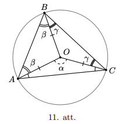

# <lo-sample/> LV.AMO.2024.8.5

Dotas piecas smagas kastes un tās izkārtotas, kā tas redzams 12. att. Šīs kastes var pārvietot tikai pagriežot par 90 grādiem ap kādu no kastes stūriem. Kastes nav iespējams pārvietot citām kastēm virsū. Pēc vairākiem šādiem pārvietojumiem šīs kastes tika izkārtotas, kā tas redzams 13. att. Kuras no šīm kastēm varēja sākotnēji atrasties 12. att. izkārtojuma centrā? Piemēru, kā kasti var pārvietot ap vienu stūri divos dažādos veidos skatīt 14. att.

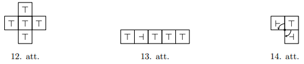

<small>

* questionType:
* domain:

</small>

## Atrisinājums

Pamatosim, ka sākotnējā izkārtojumā centrā varēja atrasties 
tikai ceturtā kaste. Iztēlosimies, ka kastes pilnībā atrodas uz 
šaha galdiņa izkārtojuma flīzēm, kuru izmēri sakrīt ar katras 
kastes izmēriem. Tādā gadījumā varam uzskatīt, ka sākotnējā 
izkārtojumā centrālā kaste atrodas uz baltas flīzes, bet apkārtējās 
uz melnām flīzēm. Katru reizi, kad pārbīdām kasti, tā atradīsies 
uz pretējas krāsas flīzes. Varam ievērot, ka rezultējošajā 
izkārtojumā četras no kastēm tika pārbīdītas pāra skaitu 
reižu, jo to simboli atrodas tādā pašā orientācijā kā sākumā. 
Tas nozīmē, ka šīs kastes atrodas uz tādām pašām
krāsu flīzēm kā sākotnējā izkārtojumā. Tā kā 3., 4. un 5. kaste 
atrodas viena otrai blakus, tad vismaz viena no tām atrodas 
uz baltas flīzes. Varētu gadīties, ka gan 3., gan 5. kastes 
atrodas uz baltas flīzes, bet tas nav iespējams, jo sākotnēji 
tikai viena kaste atradās uz baltas flizes, bet 3., 4. un 5. kaste 
atrodas uz flīzes, kuras krāsa sakrīt ar sākotnējā izkārtojuma 
flīzes krāsu. Tātad 4. kaste atrodas uz baltas flīzes un tās 
flīzes krāsa nav mainījusies. Secinām, ka šī ir tieši tā kaste, 
kas sākotnēji atradās centrā.

Lai iegūtu prasīto sakārtojumu no sākotnējā, tad vispirms kasti, 
kas atrodas virspusē, pārvietojam pa kreisi līdz tā atrodas vienā rindā ar 
vidējām kastēm, un visbeidzot apakšējo kasti arī pārbīdām pa kreisi
līdz tā atrodas vienā rindā ar visām kastēm. Šādi centra kaste ir 
ceturtā pēc kārtas, kā tas prasīts.

# <lo-sample/> LV.AMO.2024.9.1

Doti reāli skaitli $a$ un $b$, kuriem

$$\frac{a}{a^{2}-5}=\frac{b}{5-b^{2}}=\frac{a b}{a^{2} b^{2}-5}.$$

Kāda var būt izteiksmes $a^{4}+b^{4}$ vērtība, ja papildus zināms, ka $a+b \neq 0$?

<small>

* questionType:
* domain:

</small>

## Atrisinājums

Vienādojot saucējus pirmajai vienādībai, iegūstam

$$\begin{aligned}
a\left(5-b^{2}\right) & =b\left(a^{2}-5\right), \\
5 a-a b^{2} & =a^{2} b-5 b, \\
5 a+5 b & =a^{2} b+a b^{2}, \\
5(a+b) & =a b(a+b), \\
5 & =a b,
\end{aligned}$$

balstoties uz to, ka $a+b \neq 0$. Tātad iegūstam, ka

$$\frac{a}{a^{2}-5} = \frac{b}{5-b^{2}} = \frac{a b}{a^{2} b^{2}-5} = \frac{5}{25-5}=\frac{1}{4}.$$

No šī tad secinām, ka $4 a=a^{2}-5$ jeb $a^{2}-4 a-5=0$. 
Pēc Vjeta teorēmas šim ir divi atrisinājumi $a_{1}=-1$ un 
$a_{2}=5$. Tā kā $a b=5$, tad attiecīgi saistītās $b$ vērtības 
ir $b_{1}=-5$ un $b_{2}=1$. Šīs arī ir tās saknes, 
ko iegūst no dotās sakarības, tas ir, $4 b=5-b^{2}$. 
Abos gadījumos iegūstam, ka $a^{4}+b^{4}=5^{4}+1^{4}=625+1=626$.

# <lo-sample/> LV.AMO.2024.9.2

Katrs no 28 klases skolēniem kontroldarbā saņēma atzīmi, 
kas ir vesels skaitlis robežās no 0 līdz 10 ballēm. 
Pamatot, ka vai nu vismaz 4 skolēniem ir vienāda atzīme, 
vai arī vismaz 4 skolēni ieguva atzīmi, kas ir augstāka nekā $7$.

<small>

* questionType:
* domain:

</small>

## Atrisinājums

Izveidosim $9$ dažādas grupas. Pirmās astoņas grupas atbilst 
katrai atzīmei no $0$ līdz $7$, bet devītā grupa atzīmēm 
8, 9 un 10. Skolēnus piekārtosim grupai, kas atbilst katra 
sañemtajai kontroldarba atzīmei. Tā kā mums ir doti 28 skolēni 
un 9 dažādas grupas, tad pēc Dirihlē principa būs viena grupa, 
kura saturēs vismaz 4 skolēnus. Ja tā ir viena no pirmajām 
astoñām grupām, tad tas atbilst tam, ka 4 skolēniem ir 
vienāda atzīme. Ja devītā grupa satur vismaz 4 skolēnus, 
tad tas atbilst tam, ka vismaz 4 skolēni ieguva atzı̄mi, 
kas ir augstāka nekā $7$.

## Atrisinājums

Sagrupēsim skolēnus divās grupās. Pirmajā grupā ietilpst 
tie skolēni, kas sañēma kādu atzīmi no kopas $\{0,1,2,3,4,5,6,7\}$, 
un otrajā tie, kas san̄ēma kādu atzīmi no kopas $\{8,9,10\}$. 
Pien̦emsim, ka nav vismaz 4 skolēni, kas ieguva atzīmi, 
kas ir augstāka nekā 7. Tas nozīmē, ka otrajā grupā ir 
ne vairāk kā 3 skolēni. Tātad pirmajā grupā ir vismaz 25 skolēni. 
Tā kā pirmajā grupā ir 8 iespējamas vērtības, kurām 
dpiekārtoti vismaz 25 skolēni, tad pēc Dirihlē principa 
varam secināt, ka vismaz 4 skolēniem būs vienāda atzīme. 
Pretējā gadījumā, ja ir vismaz 4 skolēni, kas ieguva atzīmi, 
kas ir augstāka nekā $7$, tad arī izpildās uzdevuma 
nosacījumi. Secinām, ka vienmēr atradīsies vai nu vismaz $4$ 
skolēni ar vienādu atzīmi, vai arı̄ 4 skolēni, 
kas ieguva atzīmi, kas ir augstāka nekā 7 .

# <lo-sample/> LV.AMO.2024.9.3

Uz tāfeles uzrakstīti trīs skaitļi: 11, 12, 13. 
Vienā gājienā Agnese var izvēlēties vienu no skaitļiem, 
to nodzēst un tā vietā uzrakstīt skaitli, ko iegūst 
no divkāršotas abu pārējo skaitlu summas atņemot 
izvēlēto skaitli. Vai, atkārtojot šādus gājienus, 
Agnese var panākt to, ka uz tāfeles ir uzrakstīti 
skaitli 20, 24, 25?? 

<small>

* questionType:
* domain:

</small>

## Atrisinājums

Pamatosim, ka Agnese nevar panākt to, ka uz tāfeles 
ir uzrakstīti skaitḷi 20, 24, 25. Katrā gājienā 
izvēlēto skaitli apzīmēsim ar $c$, bet pārējos divus 
ar $a$ un $b$. Izvēlētais skaitlis $c$ katrā gājienā 
tiek aizstāts ar $2(a+b)-c$. Sākotnēji uz tāfeles ir 
viens pāra un divi nepāra skaitļi. Šķirosim gadījumus, 
kad $c$ ir attiecīgi pāra vai nepāra skaitlis. 
Pāra un nepāra skaitļu apzīmējumiem attiecīgi 
izmantosim $P$ un $N$.

Ja $c=P$, tad $2(a+b)-c=P-P=P$. Pāra skaitlis tiek 
aizvietots ar pāra skaitli.

Ja $c=N, \operatorname{tad} 2(a+b)-c=P-N=N$. Nepāra 
skaitlis tiek aizvietots ar nepāra skaitli.

Tātad vienmēr uz tāfeles skaitlu paritāte saglabāsies, 
tas ir, uz tāfeles vienmēr būs uzrakstīts 1 pāra skaitlis 
un 2 nepāra skaitlli. Bet prasīts iegūt 20,24 un 25 , kas ir 2 pāra skaitli un 1 nepāra skaitlis. Iegūstam pretrunu, tāpēc prasītais nav iespējams.

# <lo-sample/> LV.AMO.2024.9.4

Uz paralelograma $A B C D$ malām $B C$ un $C D$ atzīmēti attiecīgi punkti $E$ un $F$. Nogriežņu $A E$ un $B F$ krustpunkts ir $G$, nogriežņu $A F$ un $E D$ krustpunkts ir $I$, bet $B F$ un $E D$ krustpunkts ir $H$. Pamatot, ka $S_{A G H I}=S_{B E G}+S_{C E H F}+S_{D F I}$.

<small>

* questionType:
* domain:

</small>

## Atrisinājums

Ievērosim, ka $S_{A E D}=\frac{1}{2} S_{A B C D}$, jo trijstūra $A E D$ mala $A D$ sakrīt ar paralelograma malu un arī to attiecīgie augstumi sakrīt. Līdzīgi spriežot, varam secināt, ka $S_{F B C}+S_{D A F}=\frac{1}{2} S_{A B C D}$, jo abu šo trijstūru pamatu summa, tas ir, $D F+F C$ sakrīt ar paralelograma malu $D C$ un augstumi trijstūrī pret šīm malām sakrīt ar paralelograma augstumu. Tātad iegūstam, ka $S_{A E D}=S_{F B C}+S_{D A F}$, bet $S_{A E D}=S_{A G H I}+S_{G E H}+S_{A I D}, S_{F B C}=S_{B E G}+S_{G E H}+S_{C E H F}$ un $S_{D A F}=S_{A I D}+S_{D F I}$ (skatīt 15. att.). Apvienojot šīs izteiksmes, iegūstam, ka

$$\begin{aligned}
S_{AGHI}+S_{GEH}+S_{AID} & =S_{BEG}+S_{GEH}+S_{CEHF}+S_{AID}+S_{DFI}, \\
S_{AGHI} & =S_{BEG}+S_{CEHF}+S_{DFI},
\end{aligned}$$

kas arı̄ ir prasītā vienādība.

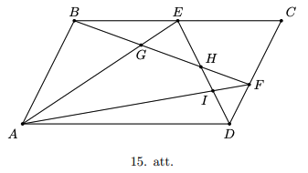

# <lo-sample/> LV.AMO.2024.9.5

Ingai ir tālrunis ar šādu pogu izkārtojumu:

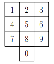

Viṇas draudzenes Zanes deviņciparu tālruņa numuram ir šādas īpašības:

- visi Zanes tālruņa numura cipari ir atšk̦irīgi;
- pirmie četri cipari ir sakārtoti augošā secībā un to 
  attiecīgo pogu centri veido kvadrātu;
- pēdējo četru ciparu pogu centri arı̄ veido kvadrātu;
- Zanes tālruña numurs dalās ar $15$.

Cik ir tādu deviņciparu tālruņa numuru, kas varētu būt Zanes tālruņa numurs?

<small>

* questionType:
* domain:

</small>

## Atrisinājums

Pamatosim, ka atbilde ir 12 dažādi skaitļi. Vispirms 
uzrakstīsim visas pogas, kuru centri veido kvadrātu:

$$\begin{array}{ll}
1,2,4,5, & 1,3,7,9 \\
4,5,7,8, & 2,4,6,8, \\
2,3,5,6, & 0,5,7,9 . \\
5,6,7,8, &
\end{array}$$

Taču ievērojam, ka mēs nevaram izmantot nevienu no kvadrātiem, 
kas atrodas kreisajā kolonnā, jo tad tā cipari atkārtotos 
ar kādu no cita kvadrāta. Tā kā numuram jādalās ar $15$, 
tad pēdējie četri cipari noteikti būs $0,5,7,9$, jo 
skaitlim jādalās ar $5$. To secību noskaidrosim vēlāk. 
Tā kā mēs jau esam izmantojuši skaitlus $7$ un $9$, 
tad pirmajiem četriem cipariem jābūt $2,4,6,8$ tieši 
šādā secībā, jo tie ir sakārtoti augoši. Vien̄̄gie atlikušie 
cipari, kas varētu atrasties tālruņa vid̄̄, ir $1$ un $3$. 
Tā kā numuram ir jādalās ar 3 (tas dalās ar 15), tad visu ciparu summai ir jādalās ar 3 . Iegūstam, ka $2+4+6+8+x+0+5+7+9=41+x$ jādalās ar 3 , kur $x$ ir 1 vai 3 . Tātad vienīgā iespēja ir tad, ja $x=1$. Esam ieguvuši, ka Zanes numurs ir izskatā

$$24681 * * * *,$$

kur pēdējie 4 cipari ir kāds no skaitliem $0,5,7,9$. 
Tā kā numuram ir jādalās ar 5 , tad pēdējais cipars var būt 
0 vai 5 . Tātad pēdējam ciparam ir divas opcijas. 
Pirmspēdējam ciparam nav šādu ierobežojumu, tāpēc tas 
var būt jebkurš no atlikušajiem 3 cipariem, tāpēc 
tam ir trīs opcijas. Simtu pozīcijā arı̄ varam ielikt 
jebkuru no atlikušajiem cipariem, tāpēc iegūstam divas 
opcijas. Atlikušo skaitli tad liekam tūkstošu pozīcijā. 
Kopumā mums ir $2 \cdot 3 \cdot 2 \cdot 1=12$ dažādi veidi, 
kā iegūt tālruņa numuru, kam izpildās īpašības, 
kas piemīt Zanes tālruṇa numuram.

# <lo-sample/> LV.AMO.2024.10.1

Atrast visus naturālos skaitlus $m$ un $n$, kuriem $m^{3} n+m+n=m n+2 m n^{2}$.

<small>

* questionType:
* domain:

</small>

## Atrisinājums 

Pārrakstīsim izteiksmi kā $m=m n+2 m n^{2}-m^{3} n-n$. 
Tā kā vienādojuma labā puse dalās ar $n$, tad arı̄ kreisā puse 
dalās ar $n$, tātad $m$ dalās ar $n$. Analoǵiski, pārveidojot 
vienādojumu par $m=m n+2 m n^{2}-m^{3} n-m$, iegūstam, 
ka $n$ dalās ar $m$. Tā kā abi šie skaitlii ir naturāli, 
tad iegūstam, ka $n=m$. Vienkāršojot sākotnējo izteiksmi 
attiecībā pret vienu mainīgo, iegūstam 
$n^{4}+2 n=n^{2}+2 n^{3}$ jeb $n\left(n^{3}-2 n^{2}-n+2\right)=0$. 
Tā kā $n$ ir naturāls, tad jābūt, ka $n^{3}-2 n^{2}-n+2=0$ 
jeb $n\left(n^{2}-2 n-1\right)=-2$. Tas nozīmē, ka $-2$ 
dalās ar $n$. Tātad $n$ var būt tikai $1$ vai $2$, 
un varam ievērot, ka abas šīs vērtības apmierina 
vienādojumu. Secinām, ka ir divi atrisinājuma pāri: 
$m=n=1$ un $m=n=2$.

# <lo-sample/> LV.AMO.2024.10.2

Doti 15 trīsciparu skaitli. Pamatot, ka no šiem skaitļiem 
var atrast vai nu divus tādus, kuru ciparu summa sakrīt, 
vai arī divus tādus, kuru ciparu summu summa ir vienāda ar $28$.

<small>

* questionType:
* domain:

</small>

## Atrisinājums

Mazākā iespējamā trīsciparu skaitḷa ciparu summa ir 1, 
kas atbilst skaitlim 100, bet lielākā ciparu summa ir 27, 
kas atbilst 999 . Izveidosim 14 dažādas kopas: 
$\{1 ; 27\},\{2 ; 26\}, \ldots,\{13 ; 15\},\{14\}$. 
Trīsciparu skaitli piekārtosim kopai, ja šī kopa 
satur skaitli, kas ir vienāds ar trīsciparu skaitļa 
ciparu summu. Ievērosim to, ka, ja divi trīsciparu 
skaitḷi ir piekārtoti vienai un tai pašai kopai, 
tad vai nu šo abu skaitlu ciparu summa sakrīt, 
vai arī to ciparu summu summa būs vienāda ar $28$. 
Tā kā mums ir doti 15 trīsciparu skaitli, bet ir 
tikai $14$ dažādas kopas, tad pēc Dirihlē principa jābūt 
vismaz vienai kopai, kurai būs piekārtoti vismaz 2 
trīsciparu skaitli. Šie skaitli būs tie, kas apmierina 
uzdevumā prasīto.

# <lo-sample/> LV.AMO.2024.10.3

Anniņa uz tāfeles uzrakstīja $n$ dažādus naturālus skaitļus 
un katram uzrakstīto skaitļu pārim aprēk̦ināja to summu. 
Apskatot šīs summas, izrādījās, ka katrs cipars no $0$ līdz 
$9$ parādās vismaz vienā no summām kā pēdējais cipars. 
Kāda ir mazākā iespējamā $n$ vērtība?

<small>

* questionType:
* domain:

</small>

## Atrisinājums

Pamatosim, ka mazākais $n$ ir $6$. Tā kā visi cipari no 
$0$ līdz $9$ parādās vismaz vienā no summām kā pēdējais 
cipars, tad jābūt vismaz 10 pāriem. Ja uz tāfeles ir 
uzrakstīti $n$ skaitli, tad pāru skaits būs $\frac{n(n-1)}{2}$. 
Šis skaitlis būs vismaz 10, ja $n \geq 5$. Ja uz tāfeles 
būtu uzrakstīti 5 skaitli, tad katrs skaitlis piedalītos 
$4$ pāru summās, tāpēc visu pāru summa būtu pāra skaitlis. 
No otras puses tā kā ir tikai 10 pāri, un katrs cipars no 
$0$ līdz $9$ parādās kādā summā kā pēdējais cipars, tad 
visu pāru summas pēdējais cipars būtu $5$, jo 
$0 + 1 + 2 + \ldots + 9 = 45$. Tātad iegūstam pretrunu. 
Ja uz tāfeles uzraksta skaitlius $1,2,3,4,5$ un $6$, 
tad iegūstam prasīto īpašību, ka visi cipari no $0$ līdz 
$9$ parādās kādā no pāru summām kā pēdējais cipars.

# <lo-sample/> LV.AMO.2024.10.4

Kvadrāta $ABCD$ iekšienē atlikts punkts $E$ tā, ka 
$\sphericalangle C B E=15^{\circ}$ un $AE=ED$. 
Pamatot, ka trijstūris $A E D$ ir vienādmalu.

<small>

* questionType:
* domain:

</small>

## Atrisinājums

Atzı̄mēsim punktu $E^{\prime}$ kvadrāta $ABCD$ iekšienē, 
lai $\triangle B E C=\triangle A E^{\prime} B$ 
(skatīt 16. att.). Tādā gadījumā $\sphericalangle E^{\prime} BE=60^{\circ}$, 
jo $\sphericalangle C B E=\sphericalangle A B E^{\prime}=15^{\circ}$ un 
$\sphericalangle B=90^{\circ}$. Bet tā kā 
$\triangle B E C=\triangle A E^{\prime} B$, tad trijstūris 
$E^{\prime} B E$ ir regulārs, jo $B E^{\prime}=B E$. 
Tātad iegūstam, ka $E^{\prime} E=A E$ jeb $\triangle A E^{\prime} E$ 
ir vienādsānu. Pie tam

$$\sphericalangle A E^{\prime} E=360^{\circ}-\sphericalangle B E^{\prime} E-\sphericalangle B E^{\prime} A=360^{\circ}-60^{\circ}-150^{\circ}=150^{\circ}=\sphericalangle B E^{\prime} A.$$

Tātad $\triangle B E^{\prime} A=\triangle E E^{\prime} A$ pēc pazīmes mlm. Iegūstam, ka $A E=B A=A D$ jeb to, ka trijstūris $A E D$ ir regulārs.

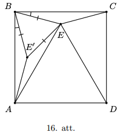

# <lo-sample/> LV.AMO.2024.10.5

Jānītis ir apmaldījies mežā ar laukumu $S$ kvadrātkilometri. 
Par mežu zināms tikai tas, ka tas atrodas plaknē un tajā 
nav caurumu. Pamatot, ka eksistē tāda stratēǵgija, kuras 
maršruts nav garāks kā $2 \sqrt{\pi S}$ kilometri, ar kuru 
Jānītis vienmēr var izkḷūt no meža (Jānītis nezina ne 
meža formu, ne savu sākotnējo atrašanās vietu tajā).

<small>

* questionType:
* domain:

</small>

## Atrisinājums 

Pamatosim, ka, ja Jānītis ies pa riņķa līniju, kuras 
garums ir $2 \sqrt{\pi S}$ kilometri, tad viņš vienmēr 
izkḷūs no meža. Šāds riņķa līnijas garums ir riņkim ar 
rādiusu $\sqrt{\frac{S}{\pi}}$ kilometri. Pieñemsim 
pretējo, tas ir, pieņemsim, ka Jānītis ar šo stratēǵiju 
nekad nesasniegs meža robežu. Tādā gadījumā nostaigātā
riņķa līnija atbilst riņķim ar laukumu 
$\pi\left(\sqrt{\frac{S}{\pi}}\right)^{2}=S$ 
kvadrātkilometri. Tā kā mežam nav caurumu, tad tas 
nozīmē, ka mežs ar laukumu $S$ kvadrātkilometri satur 
pilnībā riņki ar laukumu $S$ kvadrātkilometri. Iegūstam 
pretrunu ar to, ka riņk̦a līnija nešk̦ērso meža robežu.

# <lo-sample/> LV.AMO.2024.11.1

Dots trijstūris, kura malu garumi ir $a, b$ un $c$. 
Pierādīt, ka ir spēkā nevienādība

$$\frac{a^{2}+2 b c}{b^{2}+c^{2}}+\frac{b^{2}+2 a c}{a^{2}+c^{2}}+\frac{c^{2}+2 a b}{a^{2}+b^{2}}>3.$$

<small>

* questionType:
* domain:

</small>

## Atrisinājums

Pierādīsim, ka katrs saskaitāmais nevienādība ir lielāks nekā 1. 
Tā kā $a, b$ un $c$ ir trijstūra malas garumi, tad pēc trijstūra 
nevienādības mums zināms, ka $a+b>c$ jeb $a>(c-b)$. 
Kāpinot abas puses kvadrātā, iegūstam, ka $a^{2}>(c-b)^{2}$. 
Pārkārtojot izteiksmes saskaitāmos, iegūstam, ka

$$\begin{aligned}
& a^{2}>(c-b)^{2} \\
& a^{2}>c^{2}-2 b c+b^{2} \\
& a^{2}+2 b c>b^{2}+c^{2} \\
& \frac{a^{2}+2 b c}{a^{2}+b^{2}}>1
\end{aligned}$$

Līdzīgas nevienādības iegūstam, ja apskatām trijstūra 
nevienādības $b+c>a$ un $c+b>a$. Saskaitot šīs trīs nevienādības, 
iegūsim uzdevumā prasīto.

# <lo-sample/> LV.AMO.2024.11.1

Šaha festivālā piedalījās 95 dalībnieki. Zināms, ka festivāla laikā 
katrs dalībnieks izspēlēja ne vairāk kā 10 partijas, pie tam, 
katrs zaudēja vismaz vienā partijā. Katrā partijā uzvarētājs 
saņēma vienu punktu, zaudētājs $0$ punktus, bet, ja partija 
beidzās neizšk̦irti, tad abi spēlētāji saņēma puspunktu. 
Vai var droši apgalvot, ka festivāla beigās bija vismaz 
**(A)** $5$; **(B)** $6$ dalībnieki ar vienādu punktu skaitu?

<small>

* questionType:
* domain:

</small>

## Atrisinājums

Mazākais iespējamais iegūtais punktu skaits ir 0, 
bet lielākais ir 9, tātad dalībnieka punktu skaits var pieņemt 
$19$ vērtības 
$\left(0, \frac{1}{2}, 1,1 \frac{1}{2}, 2,2 \frac{1}{2}, \ldots, 8 \frac{1}{2}, 9\right)$.

**(A)** Jā. Pieņemsim pretējo, ka katrs iespējamais punktu skaits 
ir ne vairāk kā 4 dalībniekiem, tad kopā festivālā varēja piedalīties 
ne vairāk kā $4 \cdot 19=76$ dalībnieki - pretruna.

**(B)** Jā. Pieņemsim pretējo, ka katrs iespējamais punktu skaits 
ir ne vairāk kā 5 dalībniekiem. Tā kā dots, ka dalībnieku 
skaits ir 95, tad vien̄̄gais veids, kā tos sadalīt 19 grupās 
pēc iegūto punktu skaita, lai katrā grupā būtu ne vairāk 
kā 5 dalībnieki, ir katrā grupā ielikt tieši 5 dalībniekus. 
Bet šādā gadījumā dalībnieku kopējā iegūtā punktu summa būtu 
$5 \cdot\left(0+\frac{1}{2}+1+1 \frac{1}{2}+\ldots+8 \frac{1}{2}+9\right)=427 \frac{1}{2}$,
kas nav iespējams, jo kopējai punktu summai jābūt veselam 
skaitlim (tā kā katrā partijā tiek izspēlēts tieši viens punkts).

# <lo-sample/> LV.AMO.2024.11.3

Uz tāfeles uzrakstīts četrciparu skaitlis, kuram neviens 
cipars nav nulle. Zināms, ka, ja nodzēš jebkuru tā ciparu, 
tad atlikušais trīsciparu skaitlis nedalās ar $3$. 
Pierādīt, ka var nodzēst divus tā ciparus tā, ka atlikušais 
divciparu skaitlis dalās ar $3$.

<small>

* questionType:
* domain:

</small>

## Atrisinājums 

Tā kā skaitlis dalās ar $3$ tad un tikai tad, ja tā ciparu 
summa dalās ar $3$, tad visus spriedumus varam izteikt 
nevis par skaitliem, bet par attiecīgo skaitly ciparu summu. 
Apzīmēsim uz tāfeles uzrakstīto skaitli ar $\overline{abcd}$. 
Aplūkosim, kādi var būt atlikumi, $a, b, c$ un $d$, dalot ar $3$.
Vispirms ievērosim, ka starp šiem četriem skaitliem nav iespējams atrast visus trīs atlikumus - 0, 1 un 2. Ja varētu, tad attiecīgie trīs cipari veidotu trīsciparu skaitli, kas dalās ar 3, jo to atlikumu summa būtu $0+1+2=3$, bet zināms, ka neviens no trīsciparu skaitliem, kas izveidojas nodzēšot kādu no cipariem, nedalās ar 3 .
Līdzīgi varam spriest, ka starp šiem četriem skaitliem nav iespējams atrast trīs, kuriem būtu vienāds atlikums, dalot ar 3. Ja varētu, tad attiecīgie trīs cipari veidotu trīsciparu skaitli, kas dalās ar 3.
Tātad ir divi skaitlu pāri, kur katrā pārī ir skaitli, kas dod vienādu atlikumu, dalot ar 3 (norādīti atlikumi): a) $0,0,1,1$; b) $0,0,2,2$ vai c) $1,1,2,2$. Variantos a) un b) izvēlamies tos divus skaitlus, kas, dalot ar 3, atlikumā dod 0, bet variantā c) izvēlamies vienu skaitli, kas dod atlikumu 1, bet otru, kas dod atlikumu 2. Tādējādi visos gadījumos esam izveidojuši divciparu skaitli, kas dalās ar 3.

# <lo-sample/> LV.AMO.2024.11.4

Izliekta četrstūra diagonāles sadala to četros trijstūros ar vienādiem perimetriem. Pamatot, ka šis četrstūris ir rombs.

<small>

* questionType:
* domain:

</small>

## Atrisinājums

Vispirms pamatosim, ka šim četrstūrim diagonāles krustpunktā dalās uz pusēm. Diagonālu krustpunktu atzīmēsim ar $O$. Pieņemsim pretējo, tas ir, ka diagonāles nedalās uz pusēm krustpunktā. Tātad, nezaudējot vispārību, pieņemsim, ka $C O \leq A O$ un $B O \leq D O$. Atliksim punktus $C^{\prime}$ un $B^{\prime}$ attiecīgi uz nogriežņiem $C A$ un $B D$, lai $C O=O C^{\prime}$ un $B O=O D$ (skatīt 17. att.). Šādi esam izveidojuši paralelogramu $B C B^{\prime} C^{\prime}$.

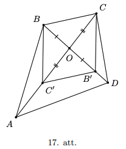

Pēc dotā mums zināms, ka $P_{B O C}=P_{A O D}$. Bet pēc konstrukcijas arı̄ $P_{B O C}=P_{B^{\prime} O C^{\prime}}$. Tātad iegūstam, ka $P_{B^{\prime} O C^{\prime}}=P_{A O D}$ jeb

$$B^{\prime} C^{\prime}+O C^{\prime}+O B^{\prime}=A D+A O+D O=A D+O C^{\prime}+C^{\prime} A+O B^{\prime}+B^{\prime} D$$

No šī varam secināt, ka $B^{\prime} C^{\prime}=A D+C^{\prime} A+B^{\prime} D$. Ja $C^{\prime} A>0$ un $B^{\prime} D>0$, tad, atkārtoti pielietojot trijstūra nevienādību, iegūstam:

$$A D+C^{\prime} A+B^{\prime} D>C^{\prime} D+B^{\prime} D>B^{\prime} C^{\prime}$$

bet tas ir pretrunā ar iepriekš secināto, ka $B^{\prime} C^{\prime}=A D+C^{\prime} A+B^{\prime} D$. Tātad secinām, ka $A C^{\prime}=D B^{\prime}=0$ jeb $C O=A O$ un $B O=D O$. Iegūstam, ka dotajam četrstūrim diagonāles krustpunktā dalās uz pusēm. Tātad četrstūris $A B C D$ ir paralelograms.
Lai pamatotu, ka $A B C D$ ir rombs, atliek parādīt, ka paralelograma $A B C D$ blakusesošās malas ir vienāda garuma, tas ir, ka $A B=B C$. Pēc dotā mums ir zināms, ka $P_{A B O}=P_{B O C}$ jeb $A B+B O+A O=$ $B C+B O+C O$. Tā kā $A B C D$ ir paralelograms, $\operatorname{tad} A O=C O$ un varam secināt, ka $A B=B C$ jeb četrstūris $A B C D$ ir rombs.

# <lo-sample/> LV.AMO.2024.11.5

Pie apaḷa galda sasēdušies vairāki hameleoni. Katrs hameleons var nokrāsoties vai nu sarkans, vai zaļš. Ik pēc minūtes tie hameleoni, kuru abi kaimiņi ir dažādās krāsās, maina savu krāsu. Vai noteikti (neatkarīgi no hameleonu sākotnējā krāsojuma) pienāks tāds brīdis, kad visu hameleonu krāsa sakritīs ar sākotnējo, ja pie galda sēž 
**(A)** $6$; **(B)** $7$ hameleoni?

<small>

* questionType:
* domain:

</small>

## Atrisinājums 

**(A)** Nē, ne vienmēr. Ja pie galda apsēdušies hameleoni, kuru krāsas secīgi ir: 
sarkans, zaļš, zaḷš, sarkans, zaļš, zaḷš, tad nākošajā minūtē visi hameleoni būs sarkani. Tātad no šī brīža hameleoni var būt tikai sarkani, un hameleonu 
krāsojumu kombinācija vairs nevar sakrist ar sākotnējo.

**(B)** Pamatosim, ka šāds brīdis vienmēr iestāsies. Apzīmēsim 
sarkanās krāsas hameleonus ar vieniniekiem, bet zal̦ās krāsas 
hameleonus - ar nullēm. Par krāsojumu kombināciju nosauksim 
šiem numuriem atbilstošo hameleonu krāsu virkni, piemēram, 
"$0,0,1,0,1,1,1$ " jeb "zal̦š, zaḷš, sarkans, zal̦š, sarkans, sarkans, sarkans". 
Ievērosim, ka kopā iespējamas $2^{7}=128$ krāsojumu kombinācijas. 
Tādā gadījumā katra hameleona krāsu nākošajā solı̄ varam izteikt 
kā kongruenču vienādojumu. Ja hameleona abi kaimiņi ir vienā
krāsā, tad to summa būs $0$ pēc moduļa 2. 
Līdz̄̄gi, ja abi kaimiņi ir pretējās krāsās, tad to summa 
ir vienāda ar 1 pēc modul̦a $2$. Tātad attiecīgi hameleona 
krāsa (skaitlis pēc moduļa 2) nemainās, ja abi kaimiṇi 
ir vienādā krāsā (pieskaita 0), bet mainās uz pretējo, 
ja abi kaimiņi ir dažādās krāsās (pieskaita $1$).
Vispirms pierādīsim, ka no divām dažādām krāsojumu kombinācijām nākamajā minūtē nevar iegūt vienu un to pašu krāsojumu kombināciju. Pien̦emsim pretējo, ka ir divi tādi hameleonu krāsojumi $x_{1}, x_{2}, x_{3}, x_{4}, x_{5}, x_{6}, x_{7}$ un $y_{1}, y_{2}, y_{3}, y_{4}, y_{5}, y_{6}, y_{7}$, no kuriem pēc pārkrāsošanās tiek iegūts viens un tas pats krāsojums $z_{1}, z_{2}, z_{3}, z_{4}, z_{5}, z_{6}, z_{7}$. Tad no pārkrāsošanas likumiem varam uzrakstīt vienādojumus:

$$\begin{aligned}
& z_{1} \equiv x_{7}+x_{1}+x_{2} \equiv y_{7}+y_{1}+y_{2}(\bmod 2), \\
& z_{2} \equiv x_{1}+x_{2}+x_{3} \equiv y_{1}+y_{2}+y_{3}(\bmod 2) \\
& z_{3} \equiv x_{2}+x_{3}+x_{4} \equiv y_{2}+y_{3}+y_{4}(\bmod 2) \\
& z_{4} \equiv x_{3}+x_{4}+x_{5} \equiv y_{3}+y_{4}+y_{5}(\bmod 2) \\
& z_{5} \equiv x_{4}+x_{5}+x_{6} \equiv y_{4}+y_{5}+y_{6}(\bmod 2), \\
& z_{6} \equiv x_{5}+x_{6}+x_{7} \equiv y_{5}+y_{6}+y_{7}(\bmod 2), \\
& z_{7} \equiv x_{6}+x_{7}+x_{1} \equiv y_{6}+y_{7}+y_{1}(\bmod 2)
\end{aligned}$$

Saskaitot visus vienādojumus kopā, mēs iegūstam

$$
3\left(x_{1}+x_{2}+x_{3}+x_{4}+x_{5}+x_{6}+x_{7}\right) \equiv 3\left(y_{1}+y_{2}+y_{3}+y_{4}+y_{5}+y_{6}+y_{7}\right)(\bmod 2)
$$

Bet tā kā vienādojums tiek apskatīts pēc modula 2 , tad

$$
x_{1}+x_{2}+x_{3}+x_{4}+x_{5}+x_{6}+x_{7} \equiv y_{1}+y_{2}+y_{3}+y_{4}+y_{5}+y_{6}+y_{7}(\bmod 2) .
$$

No šı̄ kongruenču vienādojuma abām pusēm atnemot $x_{2}+x_{3}+x_{4} \equiv y_{2}+y_{3}+y_{4}(\bmod 2)$ un arī $x_{5}+x_{6}+x_{7} \equiv y_{5}+y_{6}+y_{7}(\bmod 2)$, rezultātā iegūstam, ka $x_{1} \equiv y_{1}(\bmod 2)$. Līdzīgi varam arı̄ iegūt, ka atlikušie hameleoni ir nokrāsoti vienādi, tas ir,

$$\begin{array}{ll}
x_{2} \equiv y_{2}(\bmod 2), & x_{5} \equiv y_{5}(\bmod 2), \\
x_{3} \equiv y_{3}(\bmod 2), & x_{6} \equiv y_{6}(\bmod 2), \\
x_{4} \equiv y_{4}(\bmod 2), & x_{7} \equiv y_{7}(\bmod 2) .
\end{array}$$

Tātad secinām, ka abi sākotnējie krāsojumi sakrīt jeb esam ieguvuši 
pretrunu ar to, ka ir divas dažādas krāsojumu kombinācijas, 
kuras pēc pārkrāsošanās noved pie viena un tā paša krāsojuma.
Apzīmēsim hameleonu krāsojumu kombināciju $i$-tajā minūtē ar 
$k_{i}$ un aplūkosim virkni $k_{1}, k_{2}, k_{3}, \ldots$. 
Mūsu mērk̦is ir pierādīt, ka eksistē tāds $m>1$, ka $k_{1}=k_{m}$. 
Tā kā krāsojumu kombināciju skaits ir galīgs (128), 
tad šajā virknē kāds loceklis noteikti atkārtosies. 
Aplūkosim pirmo locekli šajā virknē, kas atkārtojas, 
apzīmēsim to ar $k_{m}$, bet to, ar kuru tas sakrīt, 
apzīmēsim ar $k_{i}$, tas ir, mums ir zināms, ka $k_{i}=k_{m}$, kur $i<m$.
Pieņemsim pretējo, ka $i>1$, tas ir, to, ka virkne neatkātojas
 ar sākotnējo krāsojumu kombināciju. Tādā gadījumā krāsojumu 
 kombināciju $k_{i}$, var iegūt gan no krāsojumu kombinācijas 
 $k_{i-1}$, gan no krāsojuma kombinācijas $k_{m-1}$. 
 Bet tā ir pretruna ar iepriekš pierādīto, ka no divām dažādām 
 krāsojumu kombinācijām nevar iegūt vienu un to pašu rezultāta 
 krāsojuma kombināciju.

# <lo-sample/> LV.AMO.2024.12.1

Dots trijstūris, kura malu garumi ir $a, b$ un $c$. Pamatot, ka ir spēkā nevienādība

$$a+b+c > \sqrt{2\left(a^{2}+b^{2}+c^{2}\right)}.$$

<small>

* questionType:
* domain:

</small>

## Atrisinājums

Tā kā $a, b$ un $c$ un ir trijstūra malas garumi, tad zināms, 
ka ir spēkā trijstūra nevienādība, tas ir, $a+b>c$. Pie 
tam abām, pusēm pieskaitot $c$, iegūstam $a+b+c>2 c$. 
Ja abas nevienādības puses pareizina ar $c$, tad iegūstam 
nevienādību $c(a+b+c)>2 c^{2}$. Līdzīgi rīkojoties, varam 
iegūt arī nevienādības $a(a+b+c)>2 a^{2}$ un $b(a+b+c)>2 b^{2}$, 
ja attiecīgi sākam ar $b+c>a$ un $a+c>b$. Saskaitot visas 
trīs nevienādības, iegūsim

$$(a+b+c)(a+b+c)>2\left(a^{2}+b^{2}+c^{2}\right)$$

jeb

$$(a+b+c)^{2}>2\left(a^{2}+b^{2}+c^{2}\right)$$

Tā kā abās nevienādības pusēs ir pozitīvas izteiksmes, 
tad varam vilkt kvadrātsakni, iegūstot

$$|a+b+c|>\sqrt{2\left(a^{2}+b^{2}+c^{2}\right)}.$$

Bet mums zināms, ka $a, b$ un $c$ ir pozitīvi skaitli, 
jo tie veido trijstūra malu garumus, tāpēc iegūstam prasīto nevienādību

$$a+b+c>\sqrt{2\left(a^{2}+b^{2}+c^{2}\right)}$$

# <lo-sample/> LV.AMO.2024.12.2

Šaha festivālā piedalījās 64 dalībnieki. Zināms, ka festivāla laikā 
katrs dalībnieks izspēlēja tieši 12 partijas, neviens neuzvarēja 
visās 12 partijās, bet katrs uzvarēja vismaz vienā partijā. 
Katrā partijā uzvarētājs saņēma vienu punktu, zaudētājs 0 punktus, 
bet, ja partija beidzās neizšk̦irti, tad abi spēlētāji 
saņēma puspunktu. Vai var droši apgalvot, ka festivāla beigās 
bija vismaz **(A)** 3; **(B)** 4 dalībnieki ar vienādu punktu skaitu?

<small>

* questionType:
* domain:

</small>

## Atrisinājums

Mazākais iespējamais iegūtais punktu skaits ir 1, bet lielākais 
ir $11 \frac{1}{2}$, tātad dalībnieka punktu skaits var 
pieņemt 22 vērtības $\left(1,1 \frac{1}{2}, 2,2 \frac{1}{2}, \ldots, 11,11 \frac{1}{2}\right)$.

**(A)** Jā. Pieņemsim pretējo, ka katrs iespējamais punktu skaits 
ir ne vairāk kā 2 dalībniekiem, tad kopā festivālā varēja piedalīties 
ne vairāk kā $2 \cdot 22=44$ dalībnieki - pretruna.

**(B)** Jā. Pien̦emsim pretējo, ka katrs iespējamais punktu skaits 
ir ne vairāk kā 3 dalībniekiem. Tā kā dots, ka dalībnieku skaits 
ir $64$, tad tiešas pretrunas ar Dirihlē principu nav, 
mums varētu būt pat $22 \cdot 3=66$ dalībnieki. Pretruna 
šeit ir nedaudz sarežḡītāka un balstās uz to, ka, ja katrā 
grupā ieliek $3$ dalībniekus, tad dalībnieku kopējais 
punktu skaits sanāk "nobīdīts uz augšu" (jo mums iztrūkst grupa, 
kas ieguvusi $\frac{1}{2}$ punktu).
Aplūkosim dalībnieku kopējo iegūto punktu summu. 
No vienas puses katrs no $64$ dalībniekiem izspēlēja $12$ partijas, 
tātad kopējais izspēlēto partiju skaits ir 
$\frac{64 \cdot 12}{2}=384$. Tā kā katrā partijā kopā tika 
izspēlēts viens punkts, tad visi dalībnieki kopā ir ieguvuši 
tieši 384 punktus.
No otras puses zināms, ka katrā iespējamajā punktu grupā bija 
ne vairāk kā 3 dalībnieki. Ja mēs tos saliekam pa grupām tā, 
lai to kopējā punktu summa būtu mazākā iespējamā (acīmredzami, 
ka, lai to izdarītu, katrā no 21 mazākajām grupām jāliek $3$ 
dalībnieki, bet lielākajā $11 \frac{1}{2}$ punktu grupā $1$ 
dalībnieks), tad iegūstam, ka mazākā iespējamā dalībnieku 
kopējā punktu summa ir 
$3 \cdot 1+3 \cdot 1 \frac{1}{2}+3 \cdot 2+3 \cdot 2 \frac{1}{2}+\ldots+$ $3 \cdot 11+1 \cdot 11 \frac{1}{2}=389 \frac{1}{2}-$ 
pretruna.

# <lo-sample/> LV.AMO.2024.12.3

Uz tāfeles uzrakstīti vairāki veseli skaitli, kuru kubu summa ir 2024. Vai var gadīties, ka šo skaitlu summa ir **(A)** 24 ; **(B)** 26?

<small>

* questionType:
* domain:

</small>

## Atrisinājums

**(A)** Pamatosim, ka šis nav iespējams. Ja mums ir dots, 
ka $2024=x_{1}^{3}+x_{2}^{3}+\cdots+x_{k}^{3}$, kur 
$x_{i}$ ir veseli skaitlli, tad šīs summas atlikums, dalot ar 6, 
ir vienāds 2. Ievērosim, ka $n^{3} \equiv n(\bmod 6)$ :

| $n \pmod 6$ | 0 | 1 | 2 | 3 | 4 | 5 |
| :---: | :---: | :---: | :---: | :---: | :---: | :---: |
| $n^{3} \pmod 6$ | 0 | 1 | 2 | 3 | 4 | 5 |

Tātad iegūstam, ka

$$x_{1}^{3}+x_{2}^{3}+\cdots+x_{k}^{3} \equiv 
x_{1}+x_{2}+\cdots+x_{k} \equiv 2024 \equiv 2(\bmod 6)$$

Tā kā 24 dalās ar 6 , tad secinām, ka prasītais nav iespējams.

**(B)** Jā, var. Piemēram, $2024=10^{3}+10^{3}+2^{3}+2^{3}+2^{3}$ un $26=10+10+2+2+2$.

# <lo-sample/> LV.AMO.2024.12.4

Riņķa līnijā ievilkts četrstūris $A B C D$, kuram $\sphericalangle B A D=2 \sphericalangle A D C$ un $C D=2 B C$. Uz malas $A D$ atlikts punkts $H$ tā, lai $\sphericalangle D H C=90^{\circ}$. Pamatot, ka $B H \| C D$.

<small>

* questionType:
* domain:

</small>

## Atrisinājums 

Uz malas $C D$ atliksim viduspunktu $M$. Tādā gadījumā $H M$ ir taisnleñka trijstūra mediāna, kas novilkta pret hipotenūzu $C D$, tāpēc $H M=D M=C M=B C$. Pie tam, tā kā $\triangle H M D$ ir vienādsānu (skatīt 18. att.) un $A B C D$ ir ievilkts četrstūris, iegūstam

$$
\sphericalangle H M D=180^{\circ}-2 \sphericalangle A D C=180^{\circ}-\sphericalangle B A D=\sphericalangle B C D
$$

Tātad varam secināt, ka $B C \| M H$, jo $\sphericalangle B C D=\sphericalangle H M D$ kā kāpšl̦u leñk̦i. Secinām, ka četrstūris $B C M H$ ir paralelograms, jo divas tā pretējās malas $(B C$ un $B H)$ ir paralēlas un vienāda garuma. Tas nozīmē, ka $B H \| C D$, kas arī bija jāpierāda.
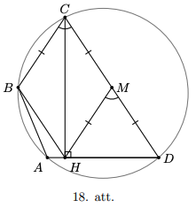

# <lo-sample/> LV.AMO.2024.12.5

Jānītis ir apmaldījies izliekta daudzstūra formas mežā ar 
laukumu $S$ kvadrātkilometri. Pamatot, ka eksistē tāda stratēgija, 
kuras maršruts nav garāks kā $\sqrt{2 \pi S}$ kilometri, 
ar kuru Jānītis vienmēr var izklı̄̄t no meža (Jānītis nezina 
ne meža formu, ne savu sākotnējo atrašanās vietu tajā).

<small>

* questionType:
* domain:

</small>

## Atrisinājums 

Pamatosim, ka Jānītis var izkļūt no meža, ejot pa loku, kas atbilst 
pusei no riņka līnijas ar rādiusu $\sqrt{\frac{2 S}{\pi}}$ 
kilometri. Šī pusriņķa loka garums ir 
$\frac{2 \pi \sqrt{\frac{2 S}{\pi}}}{2}=\sqrt{2 \pi S}$ 
kilometri. Pieņemsim pretējo, ka Jānītis neizkḹūst no meža, 
sekojot šai līnijai. Tātad šī līnija nekad nepieskaras meža 
robežai. Tā kā mežam ir izliekta daudzstūra forma, tad 
pusriņkis, kas atbilst noietajam lokam, noteikti iekḷaujas 
mežā pilnībā. Lai šo saskatītu atliek pārliecināties, 
ka meža robeža nevar iet cauri pusriņk̦a iekšienei. 
Bet tā kā pusriņk̦a līnija iekḷaujas mežā, tad kāda 
no potenciālajām meža virsotnēm pusriņk̦a iekšpusē būtu 
ar iekšējo leņki, kas pārsniedz $180^{\circ}$, jeb meža 
forma vairs nebūtu izliekts daudzstūris. Tā kā šī pusriņk̦a 
laukums ir $\pi(\sqrt{2 S})^{2}=S$ kvadrātkilometri, 
tad iegūstam, ka mežs satur sevī figūru, kuras laukums ir 
vienāds ar pašu mežu. Iegūstam pretrunu. Tātad pieņēmums, ka šī līnija 
nepieskaras meža robežai, ir bijis aplams.

