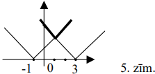

# <lo-sample/> LV.NOL.2004.5.1

Vai naturālos skaitļus no $1$ līdz $20$ ieskaitot var izrakstīt katru tieši 
vienu reizi

**(A)** rindā,

**(B)** pa apli

tā, lai katru divu blakus uzrakstītu skaitļu starpība būtu vismaz $10$?

<small>

* questionType:
* domain:

</small>

## Atrisinājums

**(A)** jā, var; piemēram,

$$\mathbf{11,\ 1,\ 12,\ 2,\ 13,\ 3,\ 14,\ 4,\ 15,\ 5,\ 16,\ 6,\ 17,\ 7,\ 18,\ 8,\ 19,\ 9,\ 20,\ 10}$$

**(B)** nē, nevar. Skaitlim $10$ iespējams tikai viens kaimiņš - skaitlis $20$.

# <lo-sample/> LV.NOL.2004.5.2

2. Vai naturālos skaitļus

**(A)** no $1$ līdz $12$ ieskaitot,

**(B)** no $1$ līdz $13$ ieskaitot

var sadalīt grupās tā, lai katras grupas skaitļu summa dalītos ar $3$?

<small>

* questionType:
* domain:

</small>

## Atrisinājums

**(A)** jā, var; piemēram, $\mathbf{3;\ 6;\ 9;\ 12}$ un 
$\mathbf{1;\ 2;\ 4;\ 5;\ 7;\ 8;\ 10;\ 11}$

**(B)** nē, nevar. Ja tas būtu iespējams, tad visu skaitļu summai būtu jādalās 
ar $3$, bet tā ir $91$.

# <lo-sample/> LV.NOL.2004.5.3

Katra kuba skaldne sadalīta $4$ vienādos kvadrātiņos. Vai kuba virsmu var 
pilnībā aplīmēt ar sešām tādām figūrām, kāda redzama 1.zīm.? (Rūtiņas, no kurām
sastāv šī figūra, ir tikpat lielas kā tās, kurās sadalīta kuba virsma.)

<small>

* questionType:
* domain:

</small>

## Atrisinājums

Jā, var. Skat. 3.zīm.

# <lo-sample/> LV.NOL.2004.5.4

Kvadrāts sastāv no $9 \times 9$ vienādām kvadrātiskām rūtiņām. Tajā iekrāsoti 
$5$ taisnstūri, katrs no kuriem sastāv no $4$ rūtiņām (šie taisnstūri nav 
kvadrāti).

Vai var gadīties, ka katram no $2$ rūtiņām sastāvošam taisnstūrim ir vismaz 
viens kopīgs punkts ar kādu jau iekrāsoto taisnstūri?

Vai tā var gadīties, ja kvadrāta izmēri ir $10 \times 10$ rūtiņas?

<small>

* questionType:
* domain:

</small>

## Atrisinājums

**(A)** var gadīties; skat. 4.zīm.

**(B)** nevar gadīties, skat. 5.zīm. Katrs iekrāsotais taisnstūris "aizliedz" 
parādīties augstākais diviem no tur attēlotajiem "domino", bet tādu ir $12$.

# <lo-sample/> LV.NOL.2004.5.5

Uz tāfeles uzrakstīta burtu virkne $\mathbf{abababababa}$. Ar vienu gājienu 
atļauts izvēlēties jebkuru daudzumu pēc kārtas uzrakstītu burtu, nodzēst tos un
atbrīvotajā vietā uzrakstīt šos pašus burtus apgrieztā secībā (piemēram, $abb$ 
var aizstāt $arbba$).

Ar kādu mazāko daudzumu gājienu, izpildot tos vienu pēc otra, var uz tāfeles 
iegūt virkni $\mathbf{aaaaabbbbb}$?

<small>

* questionType:
* domain:

</small>

## Atrisinājums

$\underline{Atbilde:}$ Ar $5$ gājieniem.

- Var izdarīt, piemēram, šādus pārveidojumus:

  $$\begin{align*}
  abab \mathbf{ab} ababa \\
  aba \mathbf{bbaa} baba \\
  ab \mathbf{aaabbb} aba \\
  a \mathbf{bbbbaaaa} ba \\
  aaaaa \mathbf{bbbbba} \\
  aaaaaabbbbb
  \end{align*}$$

- Sākumā ir $10$ vietas, kur blakus stāv dažādi burti, beigās - tikai viena 
  tāda vieta. Ar katru gājienu tādu vietu skaits samazinās ne vairāk kā par 
  $2$, tāpēc vajag vismaz $5$ gājienus.

# <lo-sample/> LV.NOL.2004.6.1

Andrim ir trīsreiz mazāk naudas nekā Jānim un Pēterim kopā, bet Jānim ir 
četrreiz mazāk naudas nekā Andrim un Pēterim kopā. Kam ir vairāk naudas: Andrim
vai Jānim?

<small>

* questionType:
* domain:

</small>

## Atrisinājums

No dotā seko: četrkāršots Andra naudas daudzums ir visu zēnu kopējais naudas 
daudzums, un pieckāršots Jāņa naudas daudzums ir visu zēnu kopējais naudas 
daudzums. Tāpēc Andrim naudas ir vairāk.

# <lo-sample/> LV.NOL.2004.6.2

Kvadrāts sastāv no $7 \times 7$ vienādām kvadrātiskām rūtiņām. Griežot pa 
rūtiņu līnijām, tas jāsagriež gabalos, no kuriem nekādi divi nav vienādi. Kāds 
ir lielākais iespējamais gabalu skaits? (Divus gabalus, kas ir viens otra 
spoguļattēli, uzskata par vienādiem.)

<small>

* questionType:
* domain:

</small>

## Atrisinājums

**(A)** Var iegūt $13$ gabalus (skat. 6.zīm.)

**(B)** 6.zīm. izmantotas visas dažādās figūriņas ar $1;\ 2;\ 3;\ 4$ rūtiņām un
$4$ figūras ar $5$ rūtiņām. Ja figūras aizstātu ar citām, kas sastāv no vairāk 
rūtiņām, daļu skaits nevarētu palielināties.

# <lo-sample/> LV.NOL.2004.6.3

Sauksim naturālu skaitli par labu, ja, atņemot no šī skaitļa tā ciparu 
reizinājumu, iegūst tā ciparu summu. Kuri divciparu naturāli skaitļi ir labi?

<small>

* questionType:
* domain:

</small>

## Atrisinājums

Ja $\overline{ab}$ ir labs naturāls skaitlis, tad $10a+b=ab+a+b$ un 
$9a=ab,\ b=9$. Tātad meklējamie skaitļi ir $19;\ 29;\ 39;\ \ldots;\ 99$.

# <lo-sample/> LV.NOL.2004.6.4

Kvadrāts sastāv no $3 \times 3$ rūtiņām. Katrā rūtiņā ierakstīts kaut kāds 
naturāls skaitlis (starp tiem var būt arī vienādi). Visās rindās un visās 
kolonnās ierakstīto skaitļu summas ir dažādas. Kāda ir mazākā iespējamā visā 
tabulā ierakstīto skaitļu summa?

<small>

* questionType:
* domain:

</small>

## Atrisinājums

$\underline{Atbilde:}$ $17$;

**(A)** tabula ar skaitļu summu $17$ redzama 7.zīm.

**(B)** mazākā iespējamā summa vienā rindā vai kolonā ir $3$. Tāpēc visu šo 
sešu summu summa $S$ nav mazāka par $3+4+5+6+7+8=33$. Tā kā $S$ pāra skaitlis 
(katrs tabulas skaitlis tajā ieskaitīts divas reizes), tad $S \geq 34$, no 
kurienes seko, ka tabulā ierakstīto skaitļu summa nav mazāka par $17$.

# <lo-sample/> LV.NOL.2004.6.5

Ap galdu sēž $7$ cilvēki. Katriem trim pie galda sēdošiem cilvēkiem var atrast 
tādu pie galda sēdošu cilvēku, kurš pazīst tos visus trīs. Pierādīt: pie galda 
ir tāds cilvēks, kurš pazīst visus pārējos ap galdu sēdošos.

($\underline{Piezīme:}$ ja $A$ pazīst $B$, tad arī $B$ pazīst $A$.)

<small>

* questionType:
* domain:

</small>

## Atrisinājums

Eksistē divi cilvēki $x$ un $y$, kuri pazīst viens otru. Ja $u$ - patvaļīgs 
cilvēks, tad eksistē tāds $z$, kas pazīst $x,\ y$ un $u$; tātad $x,\ y,\ z$ 
visi pazīst viens otru. Eksistē tāds $t$, kas pazīst $x,\ y$ un $z$; tātad 
$x,\ y,\ z,\ t$ visi pazīst cits citu. Atlikušajiem $3$ cilvēkiem eksistē kāds,
kas pazīst tos visus (šis "kāds" ir viens no $x,\ y,\ z,\ t$); tas der par 
meklējamo cilvēku.

# <lo-sample/> LV.NOL.2004.7.1

Kādu mazāko daudzumu no skaitļiem $1;\ 2;\ 3;\ \ldots;\ 14;\ 15$ var izsvītrot,
lai katru divu atlikušo summa būtu salikts skaitlis?

<small>

* questionType:
* domain:

</small>

## Atrisinājums

$\underline{Atbilde:}$ $7$ skaitļus.

**(A)** izsvītrojot visus pāra skaitļus, katru divu atlikušo skaitļu summa ir 
pāra skaitlis, kas nav mazāks par $4$, tātad tā ir salikts skaitlis,

**(B)** katrā no skaitļu pāriem 
$(1,\ 2),\ (3,\ 14),\ (4,\ 13),\ (5,\ 6),\ (7,\ 10),\ (8,\ 15),\ (11,\ 12)$ 
vismaz viens skaitlis ir jāsvītro.

# <lo-sample/> LV.NOL.2004.7.2

Šajā uzdevumā runājam par funkcijām, kas definētas visiem $x$. Pieņemsim, ka 
$y=f(x)$ un $y=g(x)$ abas ir lineāras funkcijas.

**(A)** vai var gadīties, ka $y=f(x)+g(x)$ nav lineāra funkcija?

**(B)** vai var gadīties, ka $y=f(x) \cdot g(x)$ ir lineāra funkcija?

<small>

* questionType:
* domain:

</small>

## Atrisinājums

**(A)** nē; $(ax+b)+(cx+d)=(a+c)x+(b+d)$

**(B)** jā; piemēram, $f(x)=1$ un $g(x)=1$.

# <lo-sample/> LV.NOL.2004.7.3

Nogriežņu $AB,\ BC,\ CD,\ DA,\ BD$ garumi ir 
$2 \mathrm{~cm},\ 3 \mathrm{~cm},\ 4 \mathrm{~cm},\ 7 \mathrm{~cm},\ 10 \mathrm{~cm}$
(varbūt citā secībā). Nekādi $3$ no punktiem $A,\ B,\ C,\ D$ neatrodas uz 
vienas taisnes.

Cik garš ir nogrieznis $BD$?

<small>

* questionType:
* domain:

</small>

## Atrisinājums

Uzdevumā minētie nogriežņi veido divus trijstūrus $\triangle BAD$ un 
$\triangle BCD$ ar kopīgu malu $BD$. Ne $2 \mathrm{~cm}$, ne $3 \mathrm{~cm}$ 
garais nogrieznis nevar būt mala trijstūrī kopā ar $10 \mathrm{~cm}$ garo 
nogriezni, jo tad trešajai malai jābūt garākai par 
$10 \mathrm{~cm}-3 \mathrm{~cm}=7 \mathrm{~cm}$; tātad $BD$ nav ne 
$2 \mathrm{~cm}$, ne $3 \mathrm{~cm}$ garš. Nevar būt $BD=10 \mathrm{~cm}$, jo 
no atlikušajiem garumiem nevar izveidot divus pārus $(x,\ y)$ un $(z,\ t)$ tā, 
ka $x+y>10$ un $z+t>10$; līdzīga iemesla dēļ nevar būt $BD=7 \mathrm{~cm}$. 
Tāpēc jābūt $BD=4 \mathrm{~cm}$. Šī iespēja der, jo var ņemt, piemēram, 
$AB=2 \mathrm{~cm},\ AD=3 \mathrm{~cm},\ CB=7 \mathrm{~cm},\ CD=10 \mathrm{~cm}$.

# <lo-sample/> LV.NOL.2004.7.4

Kvadrāts sastāv no $8 \times 8$ rūtiņām. Katrā rūtiņā ierakstīts naturāls 
skaitlis no $1$ līdz $64$ (visi skaitļi ir dažādi). Vai var gadīties, ka katrā 
rindā un katrā kolonnā atradīsies trīs tādi dažādi skaitļi, no kuriem viens 
vienāds ar abu pārējo reizinājumu?

<small>

* questionType:
* domain:

</small>

## Atrisinājums

Nē, nevar. Ir tikai $7$ skaitļi, kas mazāki par $8$. Tāpēc kādā no $8$ rindiņām
noteikti visi skaitļi ir vismaz $8$. Ja $a,\ b,\ c$ - šīs rindiņas skaitļi, tad
vai nu $b>8$, vai $c>8$; tāpēc $b \cdot c>8 \cdot 8=64 \geq a$, tātad 
$b \cdot c>a$.

# <lo-sample/> LV.NOL.2004.7.5

Kvadrāts sastāv no $15 \times 15$ vienādām kvadrātiskām rūtiņām. No tā 
jāizgriež taisnstūrus ar izmēriem $1 \times 9$ rūtiņas. Kādu lielāko daudzumu 
šādu taisnstūru var izgriezt?

<small>

* questionType:
* domain:

</small>

## Atrisinājums

7.5. $\underline{Atbilde:}$ $24$.
**(A)** 8.zīm. redzams, kā izgriezt $24$ taisnstūrus.

**(B)** viegli redzams, ka katram taisnstūrim jāsatur tieši viena iekrāsota 
rūtiņa (9.zīm.). Tā kā šādu rūtiņu ir $24$, tad vairāk par $24$ taisnstūriem 
izgriezt nevar.

# <lo-sample/> LV.NOL.2004.8.1

Kādu mazāko daudzumu no skaitļiem $1;\ 2;\ 3;\ \ldots;\ 14;\ 15$ var izsvītrot,
lai atlikušos varētu sadalīt divās grupās ar īpašību: vienas grupas visu 
skaitļu reizinājums vienāds ar otras grupas visu skaitļu reizinājumu?

<small>

* questionType:
* domain:

</small>

## Atrisinājums

8.1. $\underline{Atbilde:}$ $3$ skaitļus.
**(A)** izsvītrojot skaitļus 10; 11; 13, iegūstam sadalījumu

$$1 \cdot 2 \cdot 5 \cdot 6 \cdot 7 \cdot 8 \cdot 9=3 \cdot 4 \cdot 12 \cdot 14 \cdot 15$$

**(B)** abos reizinājumos jāietilpst vieniem un tiem pašiem pirmskaitļiem. 
Tāpēc $11$ un $13$ jāsvītro noteikti (tie katrs sastopami vienā eksemplārā), un
jāsvītro arī $5,\ 10$ vai $15$, lai atlikušo reizinātāju " $5$ " būtu pāra skaits.

# <lo-sample/> LV.NOL.2004.8.2

Ir zināms, ka skaitļa $2^{200}$ decimālajā pierakstā ir $61$ cipars. Cik 
daudziem no skaitļiem $2^{1};\ 2^{2};\ 2^{3};\ \ldots;\ 2^{199};\ 2^{200}$ 
decimālais pieraksts sākas ar ciparu $1$?

<small>

* questionType:
* domain:

</small>

## Atrisinājums

Ievērosim, ka:

- ja $2^{n}$ sākas ar $1$, tad $2^{n+1}$ nesākas ar $1$,
- $2^{n}$ ciparu skaits nevar par vairāk nekā $1$ pārsniegt $2^{n-1}$ ciparu 
  skaitu,
- ja $2^{n}$ sākas ar $1$, tad $2^{n}$ ir par $1$ ciparu vairāk nekā $2^{n-1}$.

No šejienes izriet: sadalot skaitļus $2^{n},\ n=1;\ 2;\ \ldots;\ 200$, grupās 
pēc to ciparu skaita, pavisam ir $61$ grupa un katrā grupā (izņemot viencipara 
pakāpes) ir tieši viena pakāpe, kas sākas ar ciparu $1$. Tāpēc uzdevuma atbilde
ir $60$.

# <lo-sample/> LV.NOL.2004.8.3

Nekādas trīs piecstūra virsotnes neatrodas uz vienas taisnes. Kādā lielākajā un
kādā mazākajā skaitā punktu var krustoties piecstūra diagonāles? (Atceramies, 
ka piecstūris var arī nebūt izliekts.)

<small>

* questionType:
* domain:

</small>

## Atrisinājums

Piecstūrim ir $5$ diagonāles, no tām pavisam var izveidot $10$ pārus. Piecos 
pāros diagonāles saskaras ar galiem, tātad nekrustojas. Tāpēc krustpunktu nevar
būt ne vairāk par $5$, ne mazāk par $0$. Piemērus skat. 10.zīm.; piecstūru 
malas iezīmētas ar biezākām līnijām.

# <lo-sample/> LV.NOL.2004.8.4

Dots, ka $a<b<c<d<e$ - naturāli skaitļi. Pie stacijas automašīnā iekrauj
$a+b+c+d+e$ saiņus. No tiem $a$ saiņi jāaizved uz $a~\mathrm{km}$ attālo ciemu 
$A$, $b$ saiņi - uz $b~\mathrm{km}$ attālo ciemu $B,\ \ldots,\ e$ saiņi - uz 
$e~\mathrm{km}$ attālo ciemu $E$. Pieejami tikai tādi ceļi, kas savieno staciju
ar ciemiem, pie tam uz katru ciemu no stacijas ved cits ceļš (tātad pēc katra 
ciema apmeklēšanas jāatgriežas pie stacijas, pirms var braukt uz nākošo ciemu).
Katram ciemam paredzētos saiņus drīkst izkraut no mašīnas tikai šajā ciemā. 
Viena saiņa pārvadāšana $1~\mathrm{km}$ attālumā izmaksā $1$ latu; braukšana 
bez saiņiem nemaksā neko. Kādā secībā jāapmeklē ciemi, lai kopējās pārvadājumu 
izmaksas būtu vismazākās iespējamās? (Ja mazākās izmaksas sasniedzamas vairāk 
nekā vienā veidā, tad jāuzrāda tos visus.)

<small>

* questionType:
* domain:

</small>

## Atrisinājums

Apzīmēsim skaitļus $a,\ b,\ c,\ d,\ e$ ciemu apmeklěšanas secībā ar 
$x,\ y,\ z,\ t,\ v$. Tad izmaksas ir

$$\begin{aligned}
& x(x+y+z+t+v)+(x+y)(y+z+t+v)+ \\
& +(y+z)(z+t+v)+(z+t)(t+v)+(t+v)v,
\end{aligned}$$

kas pēc pārveidojumiem (pakāpeniski apvienojot saskaitāmos summā "no otra 
gala") izrādās $(x+y+z+t+v)^{2}$. Tātad izmaksas visos gadījumos ir vienas un 
tās pašas.

# <lo-sample/> LV.NOL.2004.8.5

Jānis sadala $a$ metrus garu nogriezni $3$ mazākos nogriežņos; pēc tam Pēteris 
sadala $b$ metrus garu nogriezni $3$ mazākos nogriežņos. Pēteris grib, lai no 
iegūtajiem $6$ nogriežņiem varētu vienlaicīgi salikt divu trijstūru kontūras, 
skat. 2.zīm.; Jānis cenšas to nepieļaut. Kurš no zēniem var sasniegt savu 
mērķi? (Atbilde **varbūt** ir atkarīga no $a$ un $b$ vērtībām.)

<small>

* questionType:
* domain:

</small>

## Atrisinājums

Ja $a>b$, uzvar Jānis. Apzīmēsim $a=b+c$, $c>0$. Jānis sadala savu nogriezni 
gabalos $b+\frac{2c}{3},\ \frac{c}{6},\ \frac{c}{6}$. Tad daļa ar garumu 
$b+\frac{2c}{3}$ ir garāka par visām $5$ citām daļām kopā, tāpēc tā nevar būt 
trijstūra mala.

Ja $a \leq b$, uzvar Pēteris. Pieņemsim, ka Jāņa daļas ir $
x \geq y \geq z,\ x+y+z=a$. Pēteris izveido daļas ar garumiem 
$x,\ \frac{b-x}{2},\ \frac{b-x}{2}$. Tad var salikt vienādsānu trijstūri 
$(x,\ x,\ y)$ un vienādsānu trijstūri 
$\left(\frac{b-x}{2},\ \frac{b-x}{2},\ z\right)$: ievērojam, ka $x \geq y$ un 
$\frac{b-x}{2} \geq z \Leftrightarrow b-x \geq 2z$. Pēdējā nevienādība ir 
pareiza, jo $b-x \geq a-x=y+z \geq 2z$.

# <lo-sample/> LV.NOL.2004.9.1

Dots, ka $a$ un $b$ - kaut kādi reāli skaitļi. Pierādīt, ka

$$a^{2}+a b+b^{2} \geq 9(a+b-3)$$

<small>

* questionType:
* domain:

</small>

## Atrisinājums

Nevienādību pārveido par $(a-3)^{2}+(a-3)(b-3)+(b-3)^{2} \geq 0$. Tālāk ievēro,
ka $x^{2}+xy+y^{2}=\left(x+\frac{y}{2}\right)^{2}+\frac{3}{4} y^{2} \geq 0$

# <lo-sample/> LV.NOL.2004.9.2

Dots, ka $x$ - naturāls skaitlis. Kāds lielākais daudzums no skaitļiem

$$x;\ x+2;\ x+4;\ x+6;\ x+8$$

var vienlaicīgi būt pirmskaitļi?

<small>

* questionType:
* domain:

</small>

## Atrisinājums

Ja $x$ - pāra skaitlis, pirmskaitļu ir $\leq 1$. Ja $x=1;\ 3;\ 5$, pirmskaitļu 
ir $\leq 4$ (to ir $4$ pie $x=3$ un $x=5$). Ja $x>5$, tad, šķirojot iespējas 
atkarībā no $x$ pēdējā cipara, redzam, ka vienam skaitlim pēdējais cipars ir 
$5$. Tātad tas nav pirmskaitlis, un pirmskaitļu nav vairāk par $4$.

# <lo-sample/> LV.NOL.2004.9.3

Riņķa līnijas $W_{1}$ diametram $AB$ pieskaras otra riņķa līnija $W_{2}$, kuras
centrs atrodas uz $W_{1}$. Pierādīt: pieskares, kas no $A$ un $B$ vilktas riņķa
līnijai $W_{2}$ un kas nesakrīt ar $AB$, ir paralēlas savā starpā.

<small>

* questionType:
* domain:

</small>

## Atrisinājums

Tā kā $\triangle AOX=\triangle AOZ\ (hk)$, tad 
$\sphericalangle XAZ=2 \sphericalangle OAZ$. Līdzīgi 
$\sphericalangle YBZ=2 \sphericalangle OBZ$. Tāpēc 
$\sphericalangle XAZ+\sphericalangle YBZ=2(\sphericalangle OAZ+\sphericalangle OBZ)=2\left(180^{\circ}-\sphericalangle AOB\right)=2\left(180^{\circ}-90^{\circ}\right)=180^{\circ}$,
no kā seko vajadzīgais.

# <lo-sample/> LV.NOL.2004.9.4

Uz tāfeles uzrakstīti $2004$ skaitļi; viens no tiem ir $1$. Ar vienu gājienu 
atļauts nodzēst vienu skaitli un tā vietā uzrakstīt skaitli $a+b-c$, kur 
$a,\ b$ un $c$ - kaut kādi trīs no nenodzēstajiem skaitļiem. Vai, atkārtojot 
šādus gājienus vairākas reizes, var panākt, lai uz tāfeles vienlaicīgi būtu 
uzrakstīti $2004$ skaitļi, kas visi vienādi ar $1$?

<small>

* questionType:
* domain:

</small>

## Atrisinājums

$\underline{Atbilde:}$ jā, var.

$\underline{Risinājums.}$ Ja pieci no sākotnējiem skaitļiem ir 
$x;\ y;\ z;\ t;\ 1$, aizstājam $x$ un $y$ ar $a=z+t-1$. Tālāk $z$ un $t$ 
aizstājam ar $1+a-a=1$. Tālāk $a$ un $a$ aizstājam ar $1+1-1=1$. Tagad ir 
vismaz $5$ vieninieki. Līdzīgi pakāpeniski pārvēršam par vieniniekiem visus 
skaitļus, kas tādi vēl nav.

# <lo-sample/> LV.NOL.2004.9.5

Kādā kolektīvā katram cilvēkam ir tieši $3$ draugi (ja $A$ ir $B$ draugs, tad 
arī $B$ ir $A$ draugs). Nav tādu triju cilvēku, kas visi savā starpā 
draudzētos. Kāds ir mazākais iespējamais cilvēku skaits šajā kolektīvā?

<small>

* questionType:
* domain:

</small>

## Atrisinājums

To, ka var būt $6$ cilvēki, skat. 4.zīm.

Pierādīsim, ka tas ir mazākais iespējamais skaits. Apzīmēsim ar $A$ vienu 
cilvēku, ar $B,\ C,\ D$ - viņa draugus. Tā kā $B$ nevar draudzēties ne ar $C$, 
ne $D$, tad ir vismaz vēl divi citi cilvēki - $B$ draugi, no kurienes seko 
vajadzīgais.

# <lo-sample/> LV.NOL.2004.10.1

Atrast izteiksmes

$$|x+1|+|x-3|+|x+1|-|x-3|$$

mazāko iespējamo vērtību.

<small>

* questionType:
* domain:

</small>

## Atrisinājums

Ievērosim, ka $a+b+|a-b|=2 \max (a,\ b)$. Tāpēc apskatāmā izteiksme ir 
$2 \max (|x+1|, |x-3|)$. Tā kā $\max (|x+1|, |x-3|)=|x-1|+2$ (skat. 5.zīm.), 
tad meklējamais minimums ir $4$, un to sasniedz pie $x=1$.

# <lo-sample/> LV.NOL.2004.10.2

Naturālu skaitli sauc par palindromu, ja tā decimālais pieraksts ir simetrisks.
Piemēram, palindromi ir $11;\ 505;\ 4774$ utt.

Visi palindromi, sākot ar $11$, izrakstīti virknē augošā secībā. Kāda var būt 
blakus uzrakstītu palindromu starpība, ja zināms, ka tā ir pirmskaitlis?

<small>

* questionType:
* domain:

</small>

## Atrisinājums

Apzīmēsim divus viens otram sekojošus palindromus, kuru starpība ir 
pirmskaitlis, ar $a$ un $b$, $a<b$. Pieņemsim, ka $a$ sākas (tatad arī beidzas)
ar ciparu $x$, bet $b$ - ar ciparu $y$. Patvaļīga naturāla skaitļa $z$ ciparu 
skaitu apzīmēsim ar $|z|$.

Starpība $b-a$ var būt $11$ (piemēram, $22-11=11$) un $2$ (piemēram, 
$101-99=2$). Pierādīsim, ka citu iespēju nav. Ja $a<100$, to pārbauda tieši. 
Pieņemam, ka $a>100$. Ja būtu $x=y$, tad $b-a$ dalītos ar $10$ un nebūtu 
pirmskaitlis. Tāpēc $x \neq y$. Šķirojam divas iespējas.

**A.** $x<y \cdot$ Tad $x+1=y$ (pretējā gadījumā starp $a$ un $b$ atrastos 
palindroms $\underline{zzz \ldots z}$, kur $z=x+1$). Tad jābūt 
$a=\overline{x99 \ldots 9x}$ (pretējā gadījumā starp $a$ un $b$ atrastos 
palindroms $\overline{x99 \ldots 9x}$); tad $b=\overline{y00 \ldots 0y}$ un 
$b-a=11$.

**B.** $x>y$. Tad $|b| \geq|a|+1$. Jābūt 
$a=\underbrace{999 \ldots 9}_{t\ rizes}$, un tad noteikti 
$b=\underbrace{100 \ldots 01}_{t-1\ reizi}$ (ja būtu citādi, tad starp $a$ un 
$b$ atrastos palindroms $\underbrace{999 \ldots 9}$). Tad $b-a=2$.

# <lo-sample/> LV.NOL.2004.10.3

Rinķī ievilkta četrstūra malu garumi ir 
$1 \mathrm{~cm};\ 1 \mathrm{~cm};\ 2 \mathrm{~cm};\ 3 \mathrm{~cm}$ (ne 
noteikti šajā secībā). Kāds var būt šī četrstūra laukums?

<small>

* questionType:
* domain:

</small>

## Atrisinājums

Šķirojam divus gadījumus:

**A.** Malas ar garumu $1$ ir pretējās malas. Tad 
$BC \parallel AD,\ AH=\frac{1}{2}(AD-BC)=\frac{1}{2}$, $BH=\frac{\sqrt{3}}{2}$ 
un $L(ABCD)=\frac{5 \sqrt{3}}{4}$ (6.zīm.)

**B.** Malas ar garumu $1$ ir blakus malas (7.zīm.). Sagriežam riņķi pa hordu 
$BD$ un vienu no daļām "apgriežam otrādi", pēc tam abas daļas atkal saliekot 
kopā pa hordu. Simetrijas dēļ atkal iznāks riņķis, un šis gadījums reducēts uz 
iepriekšējo.

# <lo-sample/> LV.NOL.2004.10.4

Katram no diviem vienādiem regulāriem $n$-stūriem virsotnes kaut kādā kārtībā 
sanumurētas ar naturāliem skaitļiem no $1$ līdz $n$ (katrā $n$-stūrī visi 
numuri ir dažādi).

Noskaidrojiet, vai noteikti katrā $n$-stūrī var izvēlēties $3$ virsotnes tā, ka
vienlaicīgi izpildās sekojošas īpašības:

- abos $n$-stūros izvēlētas virsotnes ar vieniem un tiem pašiem numuriem,
- pirmajā $n$-stūrī izvēlēto virsotnu veidotais trijstūris un otrajā $n$-stūrī 
  izvēlēto virsotnu veidotais trijstūris abi ir viena tipa: vai nu abi ir 
  šaurleņķu, vai abi taisnleņķa, vai abi platleņķa.

Atbildiet uz šo jautājumu, ja **(A)** $n=5$; **(B)** $n=6$.

<small>

* questionType:
* domain:

</small>

## Atrisinājums

**(A)** nē. Skat., piem., 8.zīm.

**(B)** jā. Apvelkam ap abiem $6$-stūriem riņķa līnijas. Ja eksistē kaut viens 
skaitļu pāris, kas abos $6$-stūros ir diametra galapunktos, tad par trešajām 
virsotnēm var ņemt jebkuras ar vienādiem numuriem - abi trijstūri būs 
taisnleņķa.

Ja tāda pāra nav, tad ņemam divus skaitļus, kas pirmajā $6$-stūrī ir pretējās 
virsotnēs (pieņemsim, tie ir $x$ un $y$). Pieņemsim, ka skaitlis $z$ otrā 
$6$-stūrī ir pretējā virsotnē skaitlim $x$. Tad skaitļi $x,\ y,\ z$ ir 
meklējamie: abi ar tiem sanumurētie trijstūri ir taisnleņķa.

# <lo-sample/> LV.NOL.2004.10.5

Apzīmēsim $f(x)=x^{2}+px+q$. Pieņemsim, ka $a,\ b,\ c,\ d,\ e$ - kaut kādi 
skaitļi, pie tam $a \neq b+c+d+e$. Dots, ka $f(a)=f(b+c+d+e)$.

Vai noteikti jāizpildās vienādībām

$$f(a+b)=f(c+d+e),\ f(a+b+c)=f(d+e),\ f(e)=f(a+b+c+d)?$$

<small>

* questionType:
* domain:

</small>

## Atrisinājums

Kvadrātvienādojuma grafika simetrijas dēļ 
$f\left(x_{1}\right)=f\left(x_{2}\right)$ (kur $x_{1} \neq x_{2}$) tad un tikai
tad, ja $\frac{x_{1}+x_{2}}{2}=x_{0}$, kur $x_{0}$ - parabolas virsotnes 
abscisa. No dotā seko, ka $a+b+c+d+e=2x_{0}$. No tā savukārt seko visas 
vajadzīgās vienādības.

# <lo-sample/> LV.NOL.2004.11.1

Andris izvēlējās $5$ dažādus naturālus skaitļus un katriem diviem izvēlētajiem 
skaitļiem aprēķināja to summu. Kādu daudzumu dažādu summu Andris varēja iegūt?

<small>

* questionType:
* domain:

</small>

## Atrisinājums

Ja $a<b<c<d<e$, tad $a+b<a+c<a+d<a+e<b+e<c+e<d+e$. Tātad ir vismaz $7$ dažādas 
summas. Tā kā pavisam ir $10$ izvēlēto skaitļu pāri, tad nav vairāk par $10$ 
dažādām summām. Piemēri

$$\begin{aligned}
& 1;\ 2;\ 3;\ 4;\ 5 \\
& 1;\ 2;\ 3;\ 4;\ 6 \\
& 1;\ 2;\ 3;\ 4;\ 7 \\
& 1;\ 2;\ 3;\ 5;\ 8
\end{aligned}$$

parāda, ka pastāv visas iespējas $7;\ 8;\ 9;\ 10$.

# <lo-sample/> LV.NOL.2004.11.2

Atrast mazāko tādu naturālu skaitli $n$, $n>1$, ka katram veselam $x$ skaitlis 
$x^{n}-x$ dalās ar $10$.

<small>

* questionType:
* domain:

</small>

## Atrisinājums

Pie $n=2;\ n=3;\ n=4$ redzams, ka $2^{n}-2$ nedalās ar $10$. Ievērojam, ka

$$\begin{aligned}
x^{5}-x & =x\left(x^{4}-1\right)=x\left(x^{2}-1\right)\left(x^{2}+1\right)=x\left(x^{2}-1\right)\left(x^{2}-4+5\right)= \\
& =x\left(x^{2}-1\right)\left(x^{2}-4\right)+5 x\left(x^{2}-1\right)= \\
& =(x-2)(x-1)x(x+1)(x+2)+5(x-1)x(x+1)
\end{aligned}$$

Tā kā

1) vai nu $x$, vai $x-1$ ir pāra skaitlis,
2) viens no pieciem pēc kārtas nemtiem veseliem skaitļiem 
$x-2;\ x-1;\ x;\ x+1$; $x+2$ dalās ar $5$,

tad katrs saskaitāmais dalās gan ar $2$, gan ar $5$. Tā kā $LKD(2; 5)=1$, no tā
seko, ka abi saskaitāmie dalās ar $2 \cdot 5=10$. Tātad mazākā $n$ vērtība ir 
$5$.

# <lo-sample/> LV.NOL.2004.11.3

Platleņķa trijstūrim $ABC \left(\sphericalangle B>90^{\circ}\right.)$ apvilktā 
riņķa centrs ir $O$.

Dots, ka $\sphericalangle ACO=\sphericalangle ACB$. Pierādīt, ka 
$\sphericalangle OBC<2 \sphericalangle OBA$.

<small>

* questionType:
* domain:

</small>

## Atrisinājums

Skat. 9.zīm. No ievilktu leņķu īpašības 
$\sphericalangle BDA=\sphericalangle BCA=\alpha$. Tāpēc 
$\alpha+\gamma=\frac{1}{2} \cup BAD=90^{\circ}$. No vienādsānu trijstūra 
$BOC:\beta=2 \alpha$. No $\triangle ABC:\alpha+\beta+\gamma<180^{\circ}$. Tāpēc
$\beta<180^{\circ}-(\alpha+\gamma)=90^{\circ}$, tātad 
$\alpha=\frac{1}{2} \beta<45^{\circ}$. Tāpēc 
$\gamma=90^{\circ}-\alpha>45^{\circ}$. No $\beta<90^{\circ}$ un 
$\gamma>45^{\circ}$ seko vajadzīgais.

# <lo-sample/> LV.NOL.2004.11.4

Aplūkosim visus kvadrātvienādojumus ar reāliem koeficientiem $x^{2}+px+q=0$, 
kam ir vismaz viena reāla sakne un kam $|p| \leq 1$ un $|q| \leq 1$. Kādu 
apgabalu uz skaitļu ass aizpilda visu šo kvadrātvienādojumu visas saknes?

<small>

* questionType:
* domain:

</small>

## Atrisinājums

$\underline{Atbilde:}$ intervālu 
$\left[-\frac{1+\sqrt{5}}{2}; \frac{1+\sqrt{5}}{2}\right]$.

$\underline{Atrisinājums:}$

**(A)** ja $|p| \leq 1$ un $|q| \leq 1$, tad vienādojuma $x^{2}+px+q=0$ reālai 
saknei $x_{0}$ ir spēkā 
$\left|x_{0}\right|=\left|\frac{-p \pm \sqrt{p^{2}-4q}}{2}\right| \leq\left|\frac{p}{2}\right|+\frac{1}{2} \sqrt{p^{2}-4q} \leq \frac{1+\sqrt{5}}{2}$.
Tātad visas saknes pieder minētajam intervālam.

**(B)** vienādojumu $x^{2} \pm x-1=0$ saknes ir $\frac{-1 \mp \sqrt{5}}{2}$ un 
$\frac{1 \mp \sqrt{5}}{2}$. Tātad intervāla galapunkti ir vajadzīgā tipa 
vienādojumu saknes. Pieņemsim, ka 
$z \in\left[-\frac{1+\sqrt{5}}{2}; \frac{1+\sqrt{5}}{2}\right]$, tad 
$z=\alpha \cdot \frac{1+\sqrt{5}}{2}$, kur $|\alpha| \leq 1$. Apskatām 
vienādojumu $x^{2}-\alpha x-\alpha^{2}=0$. Ievērojam, ka $|-\alpha| \leq 1$ un 
$\left|-\alpha^{2}\right| \leq 1$, un šī vienādojuma saknes ir 
$\frac{\alpha}{2} \mp \sqrt{\frac{\alpha^{2}}{4}+\alpha^{2}}=\frac{\alpha}{2} \mp|\alpha| \cdot \frac{\sqrt{5}}{2}$.
Tātad viena no tām ir $\alpha \cdot \frac{1+\sqrt{5}}{2}=\mathrm{z}$. Tātad 
visi apskatāmā intervāla punkti ir vajadzīgā tipa vienādojumu saknes.

# <lo-sample/> LV.NOL.2004.11.5

Kvadrāts $ABCD$ sastāv no $n \times n$ vienādām kvadrātiskām rūtiņām, $n>2$. 
Par "lēdiju" sauc figūru, kas var atrasties jebkurā rūtiņā; tā apdraud visas 
tās rūtiņas, kas atrodas ar to vienā horizontālē, vienā vertikālē un vienā 
"diagonālē", kura paralēla $AC$ (skat. 1.zīm.)

Kādu mazāko lēdiju skaitu var novietot kvadrāta, lai visas neaizņemtās rūtiņas 
būtu apdraudētas?

<small>

* questionType:
* domain:

</small>

## Atrisinājums

$\underline{Atbilde:}$ vajag vismaz $k=\left\lceil\frac{2n-1}{3}\right\rceil$ 
lēdijas, un ar šo daudzumu pietiek.

(Tātad $2m$, ja $n=3m$;

$2m+1$, ja $n=3m+1$;

$2m+1$, ja $n=3m+2$.)

$\underline{Atrisinājums:}$ Pieņemsim, ka ir $k$ lēdijas, kas apmierina 
uzdevuma nosacījumus. Tad ir vismaz $n-k$ rindas (kolonnas) bez lēdijām.

Pieņemsim, ka augšējā "bezlēdiju" rindā $r_{1},\ r_{2},\ \ldots,\ r_{n-k}$ ir 
rūtiņas, kuru kolonnās nav lēdiju, un labējā "bezlēdiju" kolonnā 
$R_{1},\ R_{2},\ \ldots,\ R_{n-k}$ ir rūtiņas, kuru rindās nav lēdiju 
(ievērojam: viena $r_{i}$ sakrīt ar vienu $R_{j}$). Tad ir vismaz $2(n-k)-1$ 
šādas rūtiņas uz dažādām diagonālēm, kas paralēlas $AC$. Tāpēc jābūt 
$k \geq 2(n-k),\ 3k \geq n-1$, $k \geq \frac{2n-1}{3}$.

# <lo-sample/> LV.NOL.2004.12.1

Skaitļu virknē $1;\ 1;\ 2;\ 3;\ 5;\ \ldots$ katrs loceklis, sākot ar trešo, 
vienāds ar abu iepriekšējo locekļu summu. Noskaidrot, vai ar $6$ dalās

**(A)** virknes $24$-ais loceklis,

**(B)** virknes $2004$-ais loceklis.

<small>

* questionType:
* domain:

</small>

## Atrisinājums

Katra nākošā virknes locekļa atlikumu, dalot ar $6$, iegūst, saskaitot abu 
iepriekšējo virknes locekļu atlikumus dališanā ar $6$ un dalot iegūto summu ar 
$6$ ar atlikumu. Tāpēc virknes pirmo $26$ locekļu atlikumi, dalot ar $6$, ir:

$$\mathbf{1;\ 1}; 2;\ 3;\ 5;\ 2;\ 1;\ 3;\ 4;\ 1;\ 5;\ 0;\ 5;\ 5;\ 4;\ 3;\ 1;\ 4;\ 5;\ 3;\ 2;\ 5;\ 1;\ 0;\ \mathbf{1;\ 1};\ \ldots$

Redzam, ka virknes $24.$ loceklis dalās ar $6$. Tāpat skaidrs, ka atlikumi 
atkārtojas ar periodu $24$, jo $1.$ atlikums sakrīt ar $25$-o, bet $2.$ 
atlikums sakrīt ar $26$-o. Tā kā $2004=24 \cdot 83+12$, tad $2004$-ais loceklis
dod tādu pašu atlikumu kā $12$-ais, tātad arī dalās ar $6$.

# <lo-sample/> LV.NOL.2004.12.2

Dots, ka $AB$ ir riņķa līnijas $w_{1}$ diametrs, $DC \perp AB$, bet riņķa 
līnija $w_{2}$ pieskaras $CD,\ AB$ un riņķa līnijai $w_{1}$. Apzīmēsim $w_{2}$ 
un $AB$ pieskāršanās punktu ar $E$ (skat. 2.zīm.).

**(A)** pieņemot, ka jau pierādīta vienādība $AC=AE$, pierādīt: $CE$ ir 
$\sphericalangle BCD$ bisektrise,

**(B)** pierādì vienādību $AC=AE$.

<small>

* questionType:
* domain:

</small>

## Atrisinājums

**(A)** No trijstūra $\triangle CEB$ pēc ārējā leņķa īpašības 
$\sphericalangle CBE+\sphericalangle BCE=\sphericalangle CED$. Pēc pieņēmuma 
$\sphericalangle CED=\sphericalangle ACE$, tātad 
$\sphericalangle CBE+\sphericalangle BCE=\sphericalangle ACE$. No taisnleņķa 
trijstūra $ACB$ seko $\sphericalangle CBE=\sphericalangle ACD$, tātad 
$\sphericalangle ACD+\sphericalangle BCE=\sphericalangle ACE=\sphericalangle ACD+\sphericalangle DCE$,
no kurienes seko vajadzīgais (12.zīm.).

**(B)** Apzīmēsim $W_{1}$ un $W_{2}$ rādiusus attiecīgi ar $R$ un $r$ 
(13.zīm.).

Tad $AE^{2}}=(R+OE)^{2}=R^{2}+2R \cdot OE+OE^{2}=$

$=R^{2}+2R \cdot OE+\left[(R-r)^{2}-r^{2}\right]=2R^{2}+2R(OE-r)=$

$=2R^{2}+2R \cdot OD=2R \cdot AD$

Savukārt no taisnlengka trijstūru $ACB$ un $ADC$ līdzības seko $AC:AB=AD:AC$, 
tāpēc $AC^{2}=AB \cdot AD=2R \cdot AD=AE^{2}$. Tātad $AC=AE$.

# <lo-sample/> LV.NOL.2004.12.3

Skaitļu virknē $a_{1};\ a_{2};\ a_{3};\ \ldots$ zināms, ka $a_{1}=60$ un 
$a_{n+1}=a_{n}-\frac{1}{a_{n}}$ pie $n \geq 1$, ja vien $a_{n}$ ir definēts un 
$a_{n} \neq 0$. Pierādīt:

**(A)** eksistē tāds $k$, ka $a_{k} \leq 0$,

**(B)** eksistē tāds $k$, ka $a_{k} \leq 0$ un $k \leq 2004$.

<small>

* questionType:
* domain:

</small>

## Atrisinājums

**(A)** Pieņemsim no pretējā, ka visiem naturāliem $k$ pastāv nevienādība 
$a_{k}>0$. Tā kā virkne ir dilstoša, tad $a_{k} \leq 60$; tāpēc 
$a_{n+1} \leq a_{n}-\frac{1}{60}$ visiem $n$. Tāpēc 
$a_{n+1} \leq a_{1}-\frac{n}{60}=60-\frac{n}{60}<0$ pie $n>3600$ - pretruna.

**(B)** Pieņemsim no pretējā, ka $a_{k}>0$ visiem $k \leq 2004$. Spriežot 
līdzīgi kā (A) punktā, pakāpeniski iegūstam

$$\begin{array}{ll}
a_{301}<60-\frac{300}{60}=55 & a_{1576}<30-\frac{150}{30}=25 \\
a_{576}<55-\frac{275}{55}=50 & a_{1701}<25-\frac{125}{25}=20 \\
a_{826}<50-\frac{250}{50}=45 & a_{1801}<20-\frac{100}{20}=15 \\
a_{1051}<45-\frac{225}{45}=40 & a_{1876}<15-\frac{75}{15}=10 \\
a_{1251}<40-\frac{200}{40}=35 & a_{1976}<10-\frac{100}{10}=0\ - \text { pretruna. } \\
a_{1426}<35-\frac{175}{35}=30 &
\end{array}$$

# <lo-sample/> LV.NOL.2004.12.4

Atrisināt vienādojumu $x^{3}-13 \sqrt[3]{13x-12}+12=0$ reālos skaitļos.

<small>

* questionType:
* domain:

</small>

## Atrisinājums

Apzīmējam $\sqrt[3]{13x-12}=y$. Iegūstam sistēmu

$$\left\{\begin{array}{l}
x^{3}=13y-12 \\
y^{3}=13x-12
\end{array}\right.$$

Atņemot vienādojumus, iegūstam

$$\begin{gathered}
x^{3}-y^{3}=13(y-x) \\
(x-y)\left(x^{2}+xy+y^{2}+13\right)=0
\end{gathered}$$

Tā kā $x^{2}+xy+y^{2}+13=\left(x+\frac{y}{2}\right)^{2}+\frac{3y^{2}}{4}+13>0$,
seko, ka $x=y$.

Risinām vienādojumu

$x^{3}-13 x+12=0$ jeb $(x-1)(x-3)(x+4)=0$

No šejienes $x_{1}=1;\ x_{2}=3;\ x_{3}=-4$. Pārbaude parāda, ka visas saknes 
der (pārbaude nepieciešama!).

# <lo-sample/> LV.NOL.2004.12.5

Parlamentā ir $100$ deputātu. Ir zināms, ka nevienam deputātam nav aizspriedumu
pret vairāk nekā $2$ citiem deputātiem. (Ja $A$ ir aizspriedumi pret $B$, tad 
$B$ var arī nebūt aizspriedumu pret $A$.)

Kāds ir mazākais komisiju skaits, kurās noteikti var sadalīt jebkura šāda 
parlamenta deputātus (katram deputātam jāpiedalās vismaz vienā komisijā) tā, ka
nevienā komisijā nevienam deputātam nav aizspriedumu ne pret vienu citu?

<small>

* questionType:
* domain:

</small>

## Atrisinājums

**(A)** Var gadīties, ka ir $5$ deputāti, kuru "aizspriedumu struktūra" 
attēlota 14.zīm. Nekādus divus no tiem nevar iekļaut vienā komisijā. Tātad var 
gadīties, ka nepieciešamas vismaz $5$ komisijas.

**(B)** Parādīsim, ka ar $5$ komisijām vienmēr pietiek. Pierādīsim to ar 
matemātisko indukciju patvaļīgam deputātu skaitam $n$. Pie 
$n=1;\ 2;\ 3;\ 4;\ 5$ tas ir acīmredzams (katrā komisijā iekļauj vienu 
deputātu).

Pieņemsim, ka apgalvojums ir pareizs pie $n=1;\ 2;\ 3;\ \ldots$; $m-1$, kur 
$m \geq 6$. Apskatīsim $m$ deputātus. Ja katru no šiem deputātiem "ienīst" 
vairāk nekā $2$ citi, tad kopējais "ienaidu" skaits ir lielāks par 
$2~\mathrm{m}$, tā ir pretruna, jo katram deputātam ir aizspriedumi pret 
augstākais $2$ citiem, tāpēc "ienaidu" nav vairāk par $2~\mathrm{m}$.

Tāpēc eksistē deputāts $A$, pret kuru aizspriedumu nav vairāk kā $2$ citiem. 
Apskatīsim visus $m-1$ deputāus, izņemot $A$. Saskaņa ar induktīvo hipotēzi tos
var sadalīt $5$ komisijās vajadzīgā veidā. Deputāts $A$ ir "nepieņemams" ne 
vairāk kā $4$ no tām (jo ir $\leq 2$ deputāti, kam ir aizspriedumi pret viņu, 
un ir $\leq 2$ deputāti, pret kuriem viņam ir aizspriedumi). Tātad $A$ var 
pievienot vismaz $1$ komisijai. Induktīvā pāreja izdarīta.

