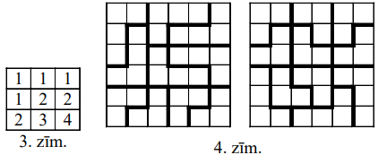
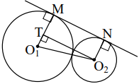

# <lo-sample/> LV.NOL.2005.5.1

Vai naturālos skaitļus no $1$ līdz $20$ ieskaitot var izrakstīt katru tieši 
vienu reizi

**(A)** rindā,

**(B)** pa apli

tā, lai katru divu blakus uzrakstītu skaitļu starpība būtu vismaz $10$?

<small>

* questionType:
* domain:

</small>

## Atrisinājums

**(A)** $j$ ā, var; piemēram,

$$\mathbf{11,\ 1,\ 12,\ 2,\ 13,\ 3,\ 14,\ 4,\ 15,\ 5,\ 16,\ 6,\ 17,\ 7,\ 18,\ 8,\ 19,\ 9,\ 20,\ 10}$$

**(B)** nē, nevar. Skaitlim $10$ iespējams tikai viens kaimiņš - skaitlis $20$.

# <lo-sample/> LV.NOL.2005.5.2

Pa sliežu ceļu, kam ir galos noapaļota taisnstūra forma, vienādos attālumos 
cits no cita kustas $n$ rotaļu vagoniņi (pirmais vagoniņš no pēdējā ir tādā 
pašā attālumā kā pirmais no otrā). Tie sanumurēti ar naturāliem skaitļiem 
kustības virzienā, sākot ar $1$. Kādā brīdī $12$-ais vagoniņš atradās pretī 
$22$-jam, bet $60$-ais vagoniņš - pretī $86$-jam (skat. 1.zīm.). Atrast $n$.

<small>

* questionType:
* domain:

</small>

## Atrisinājums

No $22.$ līdz $60.$ vagoniņam, tos abus ieskaitot, ir $60-22+1=39$ vagoniņi. 
Atbilstošajā posmā apakšā arī ir $39$ vagoniņi. Tātad no $86.$ līdz $n$-jam 
vagoniņam, tos abus ieskaitot, ir $39-12=27$ vagoniņi. Tāpēc $n=86+27-1=112$.

# <lo-sample/> LV.NOL.2005.5.3

Piecās kastītēs atrodas attiecīgi $1;\ 2;\ 3;\ 4;\ 5$ konfektes. Ar vienu 
gājienu drīkst no vienas kastītes ielikt otrā tik daudz konfekšu, cik šajā 
otrajā kastītē jau ir (ja kastīte, no kuras ņemam konfektes, to ir pietiekami 
daudz). Kāds ir lielākais konfekšu daudzums, ko var savākt vienā kastītē, 
atkārtojot šādus gājienus?

<small>

* questionType:
* domain:

</small>

## Atrisinājums

$\underline{Atbilde:}$ $14.$

$\underline{Risinājums.}$ Visas konfektes nevar savākt vienā kastē, jo to ir 
nepāra skaits, bet pēc katra gājiena kastītē, kurā ieliek konfektes, to ir pāra
skaits. Kā savākt kopā $14$ konfektes, redzams shēmā 1.zīm.

# <lo-sample/> LV.NOL.2005.5.4

Kvadrāts sastāv no $3 \times 3$ rūtiņām. Katra rūtiņa nokrāsota vienā krāsā. Ir
zināms: ja $a$ un $b$ ir jebkuras divas dažādas izmantotās krāsas, tad var 
atrast tādas divas rūtiņas, kam ir kopīga mala un no kurām viena nokrāsota 
krāsā $a$, bet otra krāsā $b$.

Kāds lielākais daudzums krāsu var būt izmantots?

<small>

* questionType:
* domain:

</small>

## Atrisinājums

$\underline{Atbilde:}$ $5$ krāsas.

$\underline{Risinājums.}$ Ja būtu $6$ krāsas $a,\ b,\ c,\ d,\ e,\ f$, tad būtu 
jābūt $15$ blakus esošu krāsu pāru 
$ab,\ ac,\ ad,\ ae,\ af,\ bc,\ bd,\ be,\ bf,\ cd,\ ce,\ cf,\ de,\ df,\ ef$. Bet
ir tikai $12$ malas, pa kurām robežojas $2$ rūtiņas. Piemēru ar $5$ krāsām 
skat. 2.zīm.

# <lo-sample/> LV.NOL.2005.5.5

Ciemi $A,\ B,\ C,\ D,\ E,\ F$ savienoti ar ceļiem tā, kā tas redzams 2.zīm. 
(mērogs nav ievērots). Blakus katram ceļam norādīts tā garums kilometros.

**(A)** vai pa ceļiem var veikt maršrutu, kas sākas pilsētā $A$, beidzas 
pilsētā $A$ un kura kopgarums ir tieši $863~\mathrm{km}$?

**(B)** vai to var izdarit, ja ceļš $DE$ ir slēgts?

($\underline{Piezīme:}$ sākot braukt pa kādu ceļu, pa to jābrauc līdz galam.)

<small>

* questionType:
* domain:

</small>

## Atrisinājums

**(A)** jā. Piemēram, var $20$ reizes veikt ciklisku maršrutu $ABCDEA$ un $1$ 
reizi - maršrutu $ABCFDEA$.

**(B)** nē. Visu palikušo "ārējo" ceļu garumi ir pāra skaitļi, "radiālo" ceļu 
garumi - nepāra. Lai sāktu un beigtu kustību ārējā virsotnē $A$, pāra skaitu 
reižu jābrauc pa radiāliem ceļiem. Tāpēc maršruta kopgarums izsacīsies ar pāra 
skaitu kilometru.

# <lo-sample/> LV.NOL.2005.6.1

Kvadrāts sastāv no $3 \times 3$ rūtiņām. Katrā rūtinā ierakstīts kaut kāds 
naturāls skaitlis (starp tiem var būt arī vienādi). Visās rindās un visās 
kolonnās ierakstīto skaitļu summas ir dažādas. Kāda ir mazākā iespējamā visā 
tabulā ierakstīto skaitļu summa?

<small>

* questionType:
* domain:

</small>

## Atrisinājums

$\underline{Atbilde:}$ $17$;

**(A)** tabula ar skaitļu summu $17$ redzama 3.zīm.

**(B)** mazākā iespējamā summa vienā rindā vai kolonā ir $3$. Tāpēc visu šo 
sešu summu summa $S$ nav mazāka par $3+4+5+6+7+8=33$. Tā kā $S$ ir pāra 
skaitlis (katrs tabulas skaitlis tajā ieskaitīts divas reizes), tad 
$S \geq 34$, no kurienes seko, ka tabulā ierakstito skaitļu summa nav mazāka 
par $17$.

# <lo-sample/> LV.NOL.2005.6.2

Pa apli stāv $n$ rūķīši ar seju pret centru. Katrs no viņiem vai nu vienmēr 
runā patiesību, vai vienmēr melo. Katrs no viņiem pasaka savam kaimiņam pa labi
"Tu esi melis".

Vai tas iespējams, ja **(A)** $n=2004$, **(B)** $n=2005$?

<small>

* questionType:
* domain:

</small>

## Atrisinājums

**(A)** jā; piemēram, patiesie rūķīši un meļi stāv pamīšus.

**(B)** nē. Sanumurēsim nūķīšus pēc kārtas ar numuriem 
$1;\ 2;\ 3;\ \ldots;\ 2005$. Ja $1.$ rūķīis ir patiess, tad otrais ir melis, 
trešais - patiess, ceturtais - melis, $\ldots$, $2005$-ais - patiess, pirmais -
melis. Iegūta pretruna. Līdzīgi iegūst pretrunu, ja $1.$ rūķītis ir melis.

# <lo-sample/> LV.NOL.2005.6.3

Kvadrāts, kas sastāv no $6 \times 6$ vienādām kvadrātiskām rūtiņām, sagriezts 
gabalos. Katra gabala forma ir viena no tām, kādas redzamas 3.zīmējumā, pie tam
ir gan vienas, gan otras formas gabali. Cik katras formas gabalu var būt? 
Gabali var būt novietoti arī citādi.

<small>

* questionType:
* domain:

</small>

## Atrisinājums

$\underline{Atbilde:}$ $4$ vai $8$ trīs rūtiņu gabali un atbilstoši $6$ vai $3$
četru rūtiņu gabali.

$\underline{Risinājums.}$ Apzīmēsim $3$ rūtiņu gabalu skaitu ar $a$, bet $4$ 
rūtiņu gabalu skaitu ar $b$. Tad $3a+4b=36$, $a$ un $b$ - naturāli skaitļi. 
Skaidrs, ka $1 \leq a<12$. Pārbaudot visas iespējamās naturālās $a$ vērtības, 
redzam: $b$ iznāk naturāls tikai pie $a=4$ (tad $b=6$) un $a=8$ (tad $b=3$). 
Atbilstoši sadalījumi redzami 4.zīm.

# <lo-sample/> LV.NOL.2005.6.4

Atrast minimālo naturālo skaitli $n$ ar īpašību: ja uz tāfeles uzrakstīti $n$ 
dažādi naturāli skaitļi, no kuriem neviens nepārsniedz $100$, tad no 
uzrakstītajiem var izvēlēties tādus divus, kuru reizinājums dalās ar $21$.

<small>

* questionType:
* domain:

</small>

## Atrisinājums

$\underline{Atbilde:}$ $n=87$;

$\underline{Risinājums.}$ Ir $14$ skaitļi, kas dalās ar 
$7:\ 1 \cdot 7,\ 2 \cdot 7,\ \ldots,\ 13 \cdot 7=91,\ 14 \cdot 7=98$. Ja uz 
tāfeles ir $87$ skaitļi, tad tur nav $13$ skaitļu; tad tur ir **vismaz viens 
skaitlis, kas dalās ar** $\mathbf{7}$. Tā kā ir $33$ skaitļi, kas dalās ar $3$,
un $33>13$, tad uz tāfeles ir **vismaz viens skaitlis, kas dalās ar** 
$\mathbf{3}$. N̦emam abus norādītos skaitļus (ja tie sakrīt, otro skaitli 
izvēlamies patvaļīgi).

Ja uz tāfeles ir $86$ skaitļi, tad var gadīties, ka tur nav neviena skaitļa, 
kas dalās ar $7$, un tad divus meklējamos skaitļus atrast nevar.

# <lo-sample/> LV.NOL.2005.6.5

Dažas kompānijas ir piemānījušas citas. Ir zināms, ka:

- ja kompānija $A$ ir piemānījusi kompāniju $B$, tad kompānija $B$ nav 
  piemānījusi kompāniju $A$,
- katra kompānija ir piemānījusi vismaz vienu citu,
- ja kompānija $A$ ir piemānījusi kompāniju $C$, tad var atrast tādu kompāniju 
  $B$, ka $A$ ir piemānījusi $B$, bet $B$ ir piemānījusi $C$.

Pierādīt, ka

**(A)** katra kompānija ir piemānījusi vismaz $3$ citas,

**(B)** kompāniju skaits var būt tieši $7$.

<small>

* questionType:
* domain:

</small>

## Atrisinājums

To, ka kompānija $X$ piemānījusi kompāniju $Y$, attēlosim ar $X \rightarrow Y$.

Apskatām vienu kompāniju $A$; eksistē tāda $C$, ka $A \rightarrow C$, un tātad 
$B$, ka $A \rightarrow B \rightarrow C$. Eksistē arī tāda $D$, ka 
$A \rightarrow D \rightarrow B \rightarrow C$, pie tam $D \neq C$ (pretējā 
gadījumā būtu $B \rightarrow C$ un $C \rightarrow B$). Tātad $A$ ir piemānījusi
$B,\ C$ un $D$.

Piemērs ar $7$ kompānijām: 
$1 \rightarrow 2 \rightarrow 3 \rightarrow 4 \rightarrow 5 \rightarrow 6 \rightarrow 1,\ 1 \rightarrow 5 \rightarrow 3 \rightarrow 1,\ 2 \rightarrow 4 \rightarrow 6 \rightarrow 2,\ 1 \rightarrow 7 \rightarrow 4 \rightarrow 1$,
$3 \rightarrow 7 \rightarrow 6 \rightarrow 3,\ 5 \rightarrow 7 \rightarrow 2 \rightarrow 5$.

# <lo-sample/> LV.NOL.2005.7.1

Kādu mazāko daudzumu no skaitļiem $1;\ 2;\ 3;\ \ldots;\ 12;\ 13$ var izsvītrot,
lai katru divu atlikušo summa būtu salikts skaitlis?

<small>

* questionType:
* domain:

</small>

## Atrisinājums

$\underline{Atbilde:}$ $6$ skaitļus.

**(A)** var izsvītrot visus pāra skaitļus

**(B)** katrā no skaitļu pāriem 
$(1,\ 2),\ (3,\ 4),\ (5,\ 6),\ (7,\ 10),\ (8,\ 9),\ (11,\ 12)$ vismaz viens 
skaitlis ir jāsvītro.

# <lo-sample/> LV.NOL.2005.7.2

Vai funkciju $y=2003x+4197,\ y=2004x+4198$ un $y=2005x+4199$ grafiki krustojas 
vienā punktā?

<small>

* questionType:
* domain:

</small>

## Atrisinājums

Katri divi grafiki krustojas. Ja $1.$ un $3.$ grafiks krustojas punktā 
$(a;\ b)$, tad $b=2003a+4197$ un $b=2005a+4199$. Saskaitot šīs vienādības un 
izdalot rezultātu ar $2$, iegūstam $b=2004a+4198$, t.i., $(a,\ b)$ atrodas arī 
uz trešā grafika.

# <lo-sample/> LV.NOL.2005.7.3

Mūsu rīcībā ir $100$ vienādas trijstūrveida plāksnītes; katras plāksnītes malas
garums ir $1$. Vai no tām var salikt figūru, kuras apkārtmērs ir **(A)** $56$, 
**(B)** $57$? Jāizmanto visas plāksnītes.

Saliekot plāksnītes nedrīkst pārklāties. Katras divas plāksnītes vai nu 
nesaskaras nemaz, vai saskaras tikai ar vienu stūri, vai saskaras ar vienu 
veselu malu.

<small>

* questionType:
* domain:

</small>

## Atrisinājums

$\underline{Atbilde:}$ **(A)** jā; **(B)** nē.

$\underline{Risinājums.}$ **(B)** Visu plāksnīšu apkārtmēru summa ir $300$. 
Tāpēc saliktās figūras apkārtmērs ir $300-2n$, kur $n$ - to malu skaits, pa 
kurām saskaras divas plāksnītes. Tātad apkārtmērs ir pāra skaitlis.

Piemēru **(A)** gadījumam skat. 5.zīm.

# <lo-sample/> LV.NOL.2005.7.4

Naturālu skaitli $n$ sauc par īpašu, ja tas ir vienāds ar četru savu dažādu 
dalītāju summu.

**(A)** atrodiet kaut vienu īpašu skaitli,

**(B)** pierādiet, ka īpašu skaitļu ir bezgalīgi daudz,

**(C)** pierādiet, ka visi īpaši skaitļi ir pāra.

<small>

* questionType:
* domain:

</small>

## Atrisinājums

**(A)** $12=1+2+3+6$

**(B)** $12n=n+2n+3n+6n$

**(C)** ja $a$ - nepāra skaitlis, tad visi tā dalītāji arī ir nepāra skaitļi. 
Bet četru nepāra skaitļu summa ir pāra skaitlis, tātad nav $a$.

# <lo-sample/> LV.NOL.2005.7.5

Dotas $8$ pēc ārējā izskata vienādas monētas. Ir zināms, ka vai nu visām tām 
masas ir vienādas, vai arī $4$ monētām ir viena masa, bet $4$ monētām - cita 
masa. Kā ar $3$ svēršanām uz sviras svariem bez atsvariem var noskaidrot, kura 
no iespējām pastāv īstenībā?

<small>

* questionType:
* domain:

</small>

## Atrisinājums

Uzliekam monētas uz kausiem pa $4$. Ja līdzsvara nav, ir divu dažādu masu 
monētas. Ja līdzsvars ir, otrajā svēršanā uzliekam uz kausiem pa $2$ monētām no
tām $4$, kas pirmajā svēršanā atradās uz viena kausa. Ja līdzsvara nav, ir divu
dažādu masu monētas. Ja līdzsvars ir, uzliekam uz kausiem pa $1$ monētai no 
tām, kas otrajā svēršanā atradās uz viena kausa. Ja līdzsvara nav, ir divu 
dažādu masu monētas. Ja līdzsvars ir, visām monētām ir vienādas masas.

# <lo-sample/> LV.NOL.2005.8.1

Ir zināms, ka skaitļa $2^{100}$ decimālajā pierakstā ir 431$ cipars. Cik 
daudziem no skaitļiem $2^{1};\ 2^{2};\ 2^{3};\ \ldots;\ 2^{99};\ 2^{100}$ 
decimālais pieraksts sākas ar ciparu $1$?

<small>

* questionType:
* domain:

</small>

## Atrisinājums

Ievērosim, ka:

- ja $2^{n}$ sākas ar $1$, tad $2^{n+1}$ nesākas ar $1$,
- $2^{n}$ ciparu skaits nevar par vairāk nekā $1$ pārsniegt $2^{n-1}$ ciparu 
  skaitu,
- ja $2^{n}$ sākas ar $1$, tad $2^{n}$ ir par $1$ ciparu vairāk nekā $2^{n-1}$.

No šejienes izriet: sadalot skaitļus $2^{n},\ n=1;\ 2;\ \ldots;\ 100$, grupās 
pēc to ciparu skaita, pavisam ir $31$ grupa un katrā grupā (izņemot viencipara 
pakāpes) ir tieši viena pakāpe, kas sākas ar ciparu $1$. Tāpēc uzdevuma atbilde
ir $30$.

# <lo-sample/> LV.NOL.2005.8.2

Kvadrāts sastāv no $4 \times 4$ vienādām kvadrātiskām rūtiņām. Rūtiņās 
ierakstīti naturāli skaitļi no $1$ līdz $16$ (dažādās rūtiņās - dažādi 
skaitļi). Rūtiņu sauc par izcilu, ja tajā ierakstītais skaitlis mazāks par 
augstākais vienā kaimiņu rūtiņā ierakstītu skaitli (divas rūtiņas sauc par 
kaimiņu rūtiņām, ja tām ir kopīga mala vai kopīgs stūris). Kāds lielākais 
daudzums rūtiņu var būt izcilas?

<small>

* questionType:
* domain:

</small>

## Atrisinājums

$\underline{Atbilde:}$ $8$ rūtiņas.

$\underline{Risinājums.}$ Katrā $2 \times 2$ rūtiņu kvadrātā ne vairāk kā $2$ 
rūtiņas var būt izcilas: ja tādu būtu $3$, tad rūtiņa, kurā ierakstīts mazākais
skaitlis no šiem trim, nevarētu būt izcila - pretruna. Tātad izcilu rūtiņu nav 
vairāk par $4 \cdot 2=8$. Piemēru ar $8$ izcilām rūtiņām skat. 6.zīm.

# <lo-sample/> LV.NOL.2005.8.3

Andris iedomājās patvaļīgu naturālu skaitli $n$. Juris ar vienu gājienu var 
pateikt Andrim piecus dažādus naturālus skaitļus 
$x_{1},\ x_{2},\ x_{3},\ x_{4},\ x_{5}$, un Andris pateiks Jurim **vienu** no 
skaitļiem $nx_{1},\ nx_{2},\ nx_{3},\ nx_{4},\ nx_{5}$ (bet nepaskaidros, 
**kura** reizinājuma vērtību viņš saka).

Ar kādu mazāko jautājumu skaitu Juris var noteikti noskaidrot $n$?

<small>

* questionType:
* domain:

</small>

## Atrisinājums

$\underline{Atbilde:}$ ar diviem jautājumiem.

$\underline{Atrisinājums.}$ Ar vienu jautājumu nepietiek: ja Andris pateiks 
Jurim skaitli $x_{1}x_{2}x_{3}x_{4}x_{5}$, Juris nezinās, vai Andris, 
iedomājies $x_{1}x_{2}x_{3}x_{4},\ x_{1}x_{2}x_{3}x_{5},\ x_{1}x_{3}x_{4}x_{5}$
vai $x_{2}x_{3}x_{4}x_{5}$.

Izmantojot divus jautājumus, Juris var rīkoties sekojoši. Pēc Andra pirmās 
atbildes $A$ viņš izvēlas $5$ dažādus pirmskaitļus 
$p_{1},\ p_{2},\ p_{3},\ p_{4},\ p_{5}$, ar kuriem nedalās $A$ (un tātad arī 
$n$), un pasaka tos Andrim. Atkarībā no tā, ar kuru no šiem pirmskaitļiem dalās
Andra otrā atbilde, Juris noskaidros $n$.

# <lo-sample/> LV.NOL.2005.8.4

Taisne $t$ nav nogriežņa $AB$ vidusperpendikuls. Cik uz taisnes $t$ var būt 
tādu punktu $C$, ka $A,\ B$ un $C$ ir vienādsānu trijstūra virsotnes?

<small>

* questionType:
* domain:

</small>

## Atrisinājums

Punkts $C$ var atrasties vai nu uz $AB$ vidusperpendikula, vai uz 
$r.l.\ (A;\ AB)$, vai uz $r.l.\ (B;\ AB)$. Atkarībā no šo $3$ līniju un $t$ 
savstarpējā novietojuma tādu punktu $C$ uz taisnes $t$ var būt 
$0;\ 1;\ 2;\ 3;\ 4;\ 5$. **Visiem gadījumiem nepieciešami piemēri.**

# <lo-sample/> LV.NOL.2005.8.5

Atrisināt vienādojumu

$$x^{3}\left(x^{2}-7\right)^{2}-36x=0$$

<small>

* questionType:
* domain:

</small>

## Atrisinājums

$\underline{Atbilde:}$ $x \in\{0;\ \pm 1;\ \pm 2;\ \pm 3\}$.

$\underline{Risinājums.}$ Vienādojumu pakāpeniski pārveido par

$$\begin{aligned}
& x\left[x^{2}\left(x^{2}-7\right)^{2}-36\right]=0 \\
& x\left[\left(x^{2}\right)^{3}-14\left(x^{2}\right)^{2}+49x^{2}-36\right]=0 \\
& x\left(x^{2}-1\right)\left(x^{2}-4\right)\left(x^{2}-9\right)=0
\end{aligned}$$

utt.

# <lo-sample/> LV.NOL.2005.9.1

Dots, ka $a$ un $b$ - kaut kādi reāli skaitļi. Pierādīt, ka

$$a^{2}-ab+b^{2} \geq 5a+5b-25$$

<small>

* questionType:
* domain:

</small>

## Atrisinājums

Nevienādību pārveido par $(a-5)^{2}-(a-5)(b-5)+(b-5)^{2} \geq 0$ un ievēro, ka 
$x^{2}-xy+y^{2}=\left(x-\frac{y}{2}\right)^{2}+\frac{3}{4} y^{2} \geq 0$.

# <lo-sample/> LV.NOL.2005.9.2

Kāda var būt četru tādu divciparu pirmskaitļu summa, kas sastādīti no cipariem 
$1;\ 2;\ 3;\ 4;\ 5;\ 6;\ 7;\ 9$, izmantojot katru no tiem tieši vienu reizi?

<small>

* questionType:
* domain:

</small>

## Atrisinājums

Šādi pirmskaitļi var būt, piemēram, $23;\ 41;\ 59;\ 67$. To summa ir $190$. Tā 
nevar būt citāda, jo cipari $2;\ 4;\ 5;\ 6$ nevar būt saskaitāmo pirmskaitļu 
vienu cipari; tāpēc tie ir desmitu cipari, un meklējamā summa noteikti ir 
$10(2+4+5+6)+(1+3+7+9)==10 \cdot 17+20=190$

# <lo-sample/> LV.NOL.2005.9.3

Divas riņķa līnijas ar rādiusiem $R$ un $r$ ārēji pieskaras viena otrai punktā 
$A$. Taisne $t$ pieskaras abām riņķa līnijām punktā $A$ un krusto to kopējās 
ārējās pieskares punktos $K$ un $L$.

**(A)** pierādīt, ka $MK=KN$ (skat. 1.zīm.);

**(B)** izteikt $KL$ ar $R$ un $r$.

<small>

* questionType:
* domain:

</small>

## Atrisinājums

**(A)** Tā kā $KM=KA$ (pieskares no viena punkta) un $KN=KA$ (tāpat), tad 
$KM=KN$.

**(B)** Abas kopējās ārējās pieskares ir vienāda garuma. Tāpēc no (A) seko, ka 
$KL=MN$.

No taisnleņķa trijstūra $O_{1}TO_{2}$ seko, ka 
$MN=TO_{2}=\sqrt{(R+r)^{2}-(R-r)^{2}}=2 \sqrt{Rr}$. Tādu pašu rezultātu iegūst,
ja $R-r=0$ un $\triangle O_{1}TO_{2}$ reducējas par nogriezni.

# <lo-sample/> LV.NOL.2005.9.4

Vai eksistē tādi $6$ skaitļi, ka, aprēķinot visas iespējamās to summas pa 
diviem, iegūst visus naturālos skaitļus no $1$ līdz $15$ ieskaitot?

<small>

* questionType:
* domain:

</small>

## Atrisinājums

$\underline{Atbilde:}$ nē, neeksistē.

$\underline{Risinājums.}$ No sešiem skaitļiem $a,\ b,\ c,\ d,\ e,\ f$, 
saskaitot tos pa $2$, iegūst $15$ summas: 
$a+b,\ a+c,\ a+d,\ a+e,\ a+f,\ b+c,\ b+d,\ b+e,\ b+f,\ c+d,\ c+e,\ c+f,\ d+e,\ d+f,\ e+f$.
Pieņemsim, ka iegūtie skaitļi ir visi naturālie skaitļi no $1$ līdz $15$ 
ieskaitot. Tad visiem skaitļiem $a,\ b,\ c,\ d,\ e,\ f$ jābūt dažādiem. Varam 
pieņemt, ka $a<b<c<d<e<f$. Skaidrs, ka vismazākā summa ir $a+b$, otrā mazākā 
summa ir $a+c$, vislielākā summa ir $e+f$, otrā lielākā summa ir $d+f$. Tāpēc 
$a+b=1,\ a+c=2,\ d+f=14,\ e+f=15$. Tātad $(a+c)-(a+b)=1=(e+f)-(d+f)$, no 
kurienes seko $c-b=e-d$ un $c+d=b+e$. Bet tad ne visas $15$ pāru summu 
skaitliskās vērtības ir dažādas, tātad šīs summas nevar pieņemt visas naturālās
vērtības no $1$ līdz $15$ ieskaitot.

# <lo-sample/> LV.NOL.2005.9.5

Ciparu virkni veido sekojoši: tās pirmie cipari ir $1;\ 2;\ 3;\ 4$, bet katrs 
nākošais vienāds ar četru iepriekšējo summas pēdējo ciparu. (Tātad virkne ir 
$1;\ 2;\ 3;\ 4;\ 0;\ 9;\ 6;\ 9;\ \ldots$)

**(A)** Vai virknē kādreiz pēc kārtas parādīsies cipari $2;\ 0;\ 0;\ 5$ tieši 
šādā secībā?

**(B)** Vai virknē kādreiz pēc kārtas citur nekā sākumā parādīsies cipari 
$1;\ 2;\ 3;\ 4$?

<small>

* questionType:
* domain:

</small>

## Atrisinājums

**(A)** Apzīmējot pāra ciparu ar $p$, bet nepāra ciparu ar $n$, tieši 
pārliecināmies, ka virknes sākums ir 
$\underline{n\ p\ n\ p\ p}\ \underline{n\ p\ n\ p\ p} \ldots$.

Katru virknes locekli viennozīmīgi nosaka četri iepriekšējie. Redzam, ka virknē
ir $2$ vienādi četru sekojošu burtu fragmenti $n\ p\ n\ p$. Pēc otrās šī 
fragmenta parādīšanās virkne "attīstīsies" tāpat kā pēc pirmās; tātad tā ir 
periodiska ar periodu $(n\ p\ n\ p\ p)$. Tātad virknē nekur pēc kārtas 
neparādīsies trīs burti $p$; tāpēc uzdevumā minētajā virknē nekad neparādīsies 
pēc kārtas sekojoši cipari $2;\ 0;\ 0;\ 5$.

**(B)** **Ja zināmi četru saskaitāmo summas pēdējais cipars un trīs saskaitāmo 
pēdējie cipari, tad ceturtā saskaitāmā pēdējais cipars ir noteikts 
viennozīmīgi.**

Aplūkosim visus četru pēc kārtas ņemtu ciparu komplektus tādā secībā, kā tie 
parādīsies mūsu virknē; daži pirmie komplekti ir $1234,\ 2340,\ 3409$ utt. Tā 
kā četru ciparu dažādu komplektu pavisam ir tikai galīgs skaits, tad agri vai 
vēlu kādam komplektam jāatkārtojas. Aplūkosim **pirmo** šādu atkārtošanos. Mēs 
apgalvojam, ka tā var būt tikai komplekta $1234$ paša pirmā komplekta - 
atkārtošanās. Tiešām, ja kā pirmais atkārtotos cits komplekts $\omega$:

$$\ldots \alpha;\ \omega;\ \ldots \ \ldots \ \beta;\ \omega;\ \ldots,$$

tad saskaņā ar augstāk izcelto faktu jābūt $\alpha=\beta$, un $\omega$ nebūtu 
pirmais komplekts, kas atkārtojas - pretruna.

Tātad $1;\ 2;\ 3;\ 4$ noteikti šajā secībā vēl kādreiz parādīsies mūsu virknē.

# <lo-sample/> LV.NOL.2005.10.1

Sākumā uz tāfeles uzrakstīti naturāli skaitļi no $1$ līdz $10$, katrs vienu 
reizi. Ar vienu gājienu atļauts izvēlēties jebkuru uz tāfeles uzrakstītu 
skaitļu grupu, nodzēst to un vietā uzrakstīt atlikumu, kādu dod nodzēsto 
skaitļu summa, dalot ar $3$. Pēc vairākiem šādiem gājieniem uz tāfeles palika 
divi skaitļi; viens no tiem bija $8$. Kāds varēja būt otrs skaitlis?

<small>

* questionType:
* domain:

</small>

## Atrisinājums

Sākotnēji uzrakstīto skaitļu summa ir $55$. Izdarot gājienus, atlikums, ko 
iegūst, uz tāfeles esošo skaitļu summu dalot ar $3$, nemainās. Tātad arī beigu 
situācijā šis atlikums ir $1$, jo $55=18 \cdot 3+1$.

Ievērosim, ka pēc $1.,\ 2.,\ 3.,\ \ldots$ gājiena izdarīšanas uz tāfeles 
vienmēr ir vismaz viens jaunuzrakstīts skaitlis (t.i., $0;\ 1$; vai $2$). Tātad
otrais uz tāfeles palikušais skaitlis ir $0;\ 1$ vai $2$. Vienīgais no tiem, 
kas apmierina nosacījumu par summas atlikumu, ir skaitlis $2$.

Skaitli $2$ var iegūt, piemēram, aizstājot $1+2+3$ ar $0$ un 
$0+4+5+6+7+9+10=41$ ar $2$.

# <lo-sample/> LV.NOL.2005.10.2

Apzīmēsim $f(x)=x^{2}+px+q$. Pieņemsim, ka $a,\ b,\ c,\ d,\ e$ - kāda piecstūra
malu garumi. Dots, ka $f(a)=f(b+c+d+e)$.

Vai noteikti jāizpildās vienādībām

$$f(a+b)=f(c+d+e),\ f(a+b+c)=f(d+e),\ f(e)=f(a+b+c+d)?$$

<small>

* questionType:
* domain:

</small>

## Atrisinājums

Tā kā katras malas garums ir mazāks par visu citu malu garumu summu, tad 
$a \neq b+c+d+e$. Kvadrātvienādojuma grafika simetrijas dēļ 
$f\left(x_{1}\right)=f\left(x_{2}\right)$ (kur $x_{1} \AA_{2}$) tad un tikai 
tad, ja $\frac{x_{1}+x_{2}}{2}=x_{0}$, kur $x_{0}$ - parabolas virsotnes 
abscisa. No dotā seko, ka $a+b+c+d+e=2x_{0}$. No tā savukārt seko visas 
vajadzīgās vienādības.

# <lo-sample/> LV.NOL.2005.10.3

Turnīrā piedalās $n$ tenisisti $(n \geq 3)$, katrs ar katru citu spēlē tieši 
vienu reizi. Tenisā neizšķirtu nav. Zināms, ka katrs turnīra dalībnieks 
izcīnīja vismaz vienu uzvaru. Pierādīt: pēc turnīra beigām var atrast tādus 
trīs dalībniekus un apzīmēt tos ar $A,\ B$ un $C$, ka $A$ uzvarējis pret 
$B,\ B$ - pret $C$, bet $C$ - pret $A$.

<small>

* questionType:
* domain:

</small>

## Atrisinājums

Tā kā katrs no $n$ dalībniekiem izcīnīja vismaz vienu un ne vairāk kā $n-1$ 
uzvaru, tad viena dalībnieka uzvaru skaits var pieņemt tikai $n-1$ dažādas 
vērtības. Tā kā dalībnieku ir $n$ un $n>n-1$, tad ir divi dalībnieki, kas 
izcīnījuši vienu un to pašu uzvaru skaitu. Viens no tiem savstarpējā cīņā 
uzvarējis; apzīmēsim to ar $A$, bet otru minēto dalībnieku ar $B$. Lai $A$ un 
$B$ uzvaru daudzumi būtu vienādi, $A$ jābūt zaudējušam pret kādu no 
dalībniekiem, pret kuru $B$ ir uzvarējis, šo dalībnieku varam apzīmēt ar $C$.

# <lo-sample/> LV.NOL.2005.10.4

Uz izliekta četrstūra $ABCD$ diagonāļu pagarinājumiem ņemti tādi punkti $M$ un 
$N$, ka $AM \parallel DC$ un $DN \parallel AB$ (skat. 2.zīm.). Pierādīt, ka 
$BC \parallel MN$.

<small>

* questionType:
* domain:

</small>

## Atrisinājums

Apzīmēsim $ABCD$ diagonāļu krustpunktu ar $O$. Tad no 
$\triangle AOB \sim \triangle NOB$ un $\triangle COD \sim \triangle AOM$ seko

$\frac{OB}{OD}=\frac{OA}{ON}$ un $\frac{OD}{OC}=\frac{OM}{OA}$

Sareizinot šīs vienādības, iegūstam $\frac{OB}{OC}=\frac{OM}{ON}$, no kā seko 
vajadzīgais.

# <lo-sample/> LV.NOL.2005.10.5

Uz papīra lapas uzrakstīti vairāki dažādi naturāli skaitļi; neviens no tiem 
nepārsniedz $100$. Zināms, ka:

1) $1$ un $100$ ir uzrakstīti uz lapas,
2) ja $n$ uzrakstīts uz lapas un $n \neq A$, tad var atrast vai nu tādu uz 
   lapas uzrakstītu skaitli $x$ , ka $n=2x$, vai divus tādus uz lapas 
   uzrakstītus skaitļus $x$ un $y$, ka $n=x+y$. Kāds mazākais daudzums skaitļu 
   var būt uzrakstīti uz lapas?

<small>

* questionType:
* domain:

</small>

## Atrisinājums

Apzīmēsim uzrakstītos skaitļus ar $1=n_{1}<n_{2}<\ldots<n_{k}=100$. Pie 
$i=1;\ 2;\ \ldots;\ k-1$ jābūt $n_{i+1} \leq n_{i}$, citādi $n_{i+1}$ nav 
izsakāms prasītajā veidā. Tāpēc $n_{2} \leq$, 
$n_{3} \leq 4,\ n_{4} \leq 8,\ n_{5} \leq 6,\ n_{6} \leq 32,\ n_{7} \leq 64$. 
Tā kā uz lapas atrodas arī $100$, tad $k \geq 8$. Pierādīsim, ka patiesībā 
$k \neq 8$. Ja $k=8$, tad $n_{8}=100$. Tā kā $n_{7}+n_{6} \leq 96$, tad jābūt 
$100=2n_{7}$, tāpēc $n_{7}=50$. Tā kā $n_{5}+n_{6} \leq 48$, jābūt 
$n_{7}=2n_{6}$, tāpēc $n_{6}=25$. Tā kā $n_{5}+n_{4} \leq 24$, tad jābūt 
$n_{6}=2n_{5}$, bet tas nav iespējams, jo $n_{6}$ ir nepāra skaitlis.

To, ka $n=9$ der, parāda piemērs $1;\ 2;\ 3;\ 5;\ 10;\ 20;\ 25;\ 50;\ 100$ (ir 
arī citi piemēri).

# <lo-sample/> LV.NOL.2005.11.1

Aprēķināt $\sqrt{2005 \cdot 2003 \cdot 1999 \cdot 1997+36}$.

<small>

* questionType:
* domain:

</small>

## Atrisinājums

Apzīmēsim $a=2001$. Tad zemsaknes izteiksme ir
$(a+4)(a+2)(a-2)(a-4)+36=\left(a^{2}-16\right)\left(a^{2}-4\right)+36=a^{4}-20a^{2}+100=\left(a^{2}-10\right)^{2}$,
tāpēc uzdevuma atbilde ir $\left|a^{2}-10\right|=2001^{2}-10=4003991$.

# <lo-sample/> LV.NOL.2005.11.2

Aplūkosim visus kvadrātvienādojumus ar reāliem koeficientiem $x^{2}+px+q=0$, 
kam ir vismaz viena reāla sakne un kam $|p| \leq 1$ un $|q| \leq 1$. Kādu 
apgabalu uz skaitļu ass aizpilda visu šo kvadrātvienādojumu visas saknes?

<small>

* questionType:
* domain:

</small>

## Atrisinājums

$\underline{Atbilde:}$ intervālu 
$\left[-\frac{1+\sqrt{5}}{2}; \frac{1+\sqrt{5}}{2}\right]$.

$\underline{Atrisinājums:}$

**(A)** ja $|p| \leq 1$ un $|q| \leq 1$, tad vienādojuma $x^{2}+px+q=0$ reālai 
saknei $x_{0}$ ir spēkā 
$\left|x_{0}\right|=\left|\frac{-p \pm \sqrt{p^{2}-4q}}{2}\right| \leq\left|\frac{p}{2}\right|+\frac{1}{2} \sqrt{p^{2}-4q} \leq \frac{1+\sqrt{5}}{2}$.
Tātad visas saknes pieder minētajam intervālam.

**(B)** vienādojumu $x^{2} \pm x-1=0$ saknes ir $\frac{-1 \mp \sqrt{5}}{2}$ un 
$\frac{1 \mp \sqrt{5}}{2}$. Tātad intervāla galapunkti ir vajadzīgā tipa 
vienādojumu saknes. Pieņemsim, ka 
$z \in\left[-\frac{1+\sqrt{5}}{2}; \frac{1+\sqrt{5}}{2}\right]$, tad 
$z=\alpha \cdot \frac{1+\sqrt{5}}{2}$, kur $|\alpha| \leq 1$. Apskatām 
vienādojumu $x^{2}-\alpha x-\alpha^{2}=0$. Ievērojam, ka $|-\alpha| \leq 1$ un 
$\left|-\alpha^{2}\right| \leq 1$, un šī vienādojuma saknes ir 
$\frac{\alpha}{2} \mp \sqrt{\frac{\alpha^{2}}{4}+\alpha^{2}}=\frac{\alpha}{2} \mp|\alpha| \cdot \frac{\sqrt{5}}{2}$.
Tātad viena no tām ir $\alpha \cdot \frac{1+\sqrt{5}}{2}=\mathrm{z}$. Tātad 
visi apskatāmā intervāla punkti ir vajadzīgā tipa vienādojumu saknes.

# <lo-sample/> LV.NOL.2005.11.3

Naturālu skaitli $n$ sauksim par līdzsvarotu, ja tā visus naturālos dalītājus 
(ieskaitot $1$ un pašu $n$) var sadalīt trīs daļās ar vienādām summām.

**(A)** atrast kaut vienu līdzsvarotu skaitli,

**(B)** pierādīt, ka līdzsvarotu skaitļu ir bezgalīgi daudz.

<small>

* questionType:
* domain:

</small>

## Atrisinājums

**(A)** Skaitļa $120$ apskatāmie dalītāji ir 
$1;\ 2;\ 3;\ 4;\ 5;\ 6;\ 8;\ 10;\ 12;\ 15;\ 20;\ 24;\ 30;\ 40;\ 60;\ 120$; to 
summa ir $360$. Viegli redzēt, ka $120=60+40+20=1+2+3+4+5+6+8+10+12++15+24+30$.
Tātad $120$ ir viens līdzsvarota skaitļa piemērs.

**(B)** Pieņemsim, ka $n$ - līdzsvarots skaitlis, bet $p$ - pirmskaitlis, ar 
kuru $n$ nedalās. Tad, ja skaitļa $n$ dalītāji ir 
$d_{1}; d_{2}; \ldots; d_{k}$, tad skaitļa $n \cdot p$ dalītāji ir 
$d_{1}; d_{2}; \ldots; d_{k}, pd_{1}; pd_{2}; \ldots; pd_{k}$. Tāpēc skaidrs, 
ka arī $n \cdot p$ ir līdzsvarots.

Tā kā pirmskaitļu ir bezgalīgi daudz, tad, sākot ar $120$, var konstruēt 
aizvien jaunus līdzsvarotus skaitļus (piemēram, nākošais varētu būt 
$120 \cdot 7=840$).

# <lo-sample/> LV.NOL.2005.11.4

Četrstūris $ABCD$ ievilkts riņķa līnijā. Zināms, ka 
$\sphericalangle ABC=60^{\circ}$ un $BC=CD$. Pierādīt, ka $AB=BC+DA$.

<small>

* questionType:
* domain:

</small>

## Atrisinājums

Atliekam uz $BA$ tādu punktu $N$, ka $BN=BC$. Tad $\triangle BCN$ - regulārs, 
tāpēc $\sphericalangle CNA=120^{\circ}$ un $CN=CD$. Tā kā 
$\sphericalangle B+\sphericalangle D=180^{\circ}$, tad 
$\sphericalangle D=120^{\circ}$; tātad 
$\sphericalangle CNA=\sphericalangle CDA$. Tā kā vienādās hordas $CB$ un $CD$ 
savelk vienādus lokus, tad $\sphericalangle NAC=\sphericalangle DAC$. Secinām, 
ka $\sphericalangle NCA=\sphericalangle DCA$ (katrā trijstūrī iekšējo leņķu 
summa ir $180^{\circ}$). Tāpēc $\triangle CNA=\triangle CDA\ (m \ell m)$; tātad
$NA=DA$. No tā seko vajadzīgais.

# <lo-sample/> LV.NOL.2005.11.5

Kādā klasē ir $n$ zēni un $n$ meitenes. Katrai meitenei patīk $x$ zēni. Katram 
zēnam patīk $y$ meitenes. Pierādīt, ka:

**(A)** ja $x+y>n$, tad noteikti var atrast tādu zēnu un tādu meiteni, kas 
patīk viens otram,

**(B)** ja $x+y \leq n$, tad var gadīties, ka šādu zēnu un meiteni atrast 
neizdodas.

<small>

* questionType:
* domain:

</small>

## Atrisinājums

**(A)** Pieņemsim, ka tāda pāra nav. Lūgsim katram zēnam uzrakstīt $y$ dažādas 
kartītes - katru ar savu vārdu un kādu tās meitenes vārdu, kas viņam patīk. 
Līdzīgu darbu lūgsim izdarīt meitenēm. Tā kā savstarpēju simpātiju nav, tad nav
divu kartīšu, uz kurām būtu vienādi uzraksti; tāpēc kartīšu nav vairāk par 
$n \cdot n=n^{2}$. No otras puses, kartīšu ir 
$x \cdot n+y \cdot n=(x+y) \cdot n>n \cdot n=n^{2}$ - pretruna.

**(B)** Attēlosim meitenes ar punktiem riņķa līnijas iekšpusē, bet zēnus - ar 
punktiem riņķa līnijas ārpusē (skat.zīm., kur $n=9$).

Ja katrai meitenei patīk $x$ zēni pulksteņa rādītāja kustības virzienā, sākot 
ar to, kurš stāv viņai blakus, bet katram zēnam - $y$ meitenes pulksteņa 
rādītāja kustības virzienā, sākot ar to, kura stāv viņam vienu pozīciju 
priekšā, tad savstarpēju simpātiju nav.

# <lo-sample/> LV.NOL.2005.12.1

Atrisināa pozitīvos skaitļos vienādojumu

$$\frac{1}{x+\frac{1}{x^{2}+\frac{1}{x^{3}+\frac{1}{x^{4}}}}}=\frac{1}{1+\frac{1}{x^{3}+\frac{1}{x^{2}+\frac{1}{x^{5}}}}}-\frac{1}{x^{2}+\frac{1}{x+\frac{1}{x^{4}+\frac{1}{x^{3}}}}}$$

<small>

* questionType:
* domain:

</small>

## Atrisinājums

Apzīmēsim vienādojuma kreiso pusi ar $a$; tad labās puses mazināmais ir 
$a \cdot x$, bet mazinātājs ir $\frac{a}{x}$. Iegūstam vienādojumu 
$a=ax-\frac{a}{x}$ jeb

$$a\left(1-x+\frac{1}{x}\right)=0$$

Tā kā pie $x>0$ arī $a>0$, iegūstam $1-x+\frac{1}{x}=0$, no kurienes 
$x=\frac{1+\sqrt{5}}{2}$ (otra sakne neder, jo $x>0$).

# <lo-sample/> LV.NOL.2005.12.2

Skaitļu virknē $a_{1}; a_{2}; a_{3}; \ldots$ zināms, ka $a_{1}=60$ un 
$a_{n+1}=a_{n}-\frac{1}{a_{n}}$ pie $n \geq 1$, ja vien $a_{n}$ ir definēts un 
$a_{n} \neq 0$. Pierādīt:

**(A)** eksistē tāds $k$, ka $a_{k} \leq$,

**(B)** eksistē tāds $k$, ka $a_{k} \leq 0$ un $k \leq 2005$.

<small>

* questionType:
* domain:

</small>

## Atrisinājums

**(A)** Pieņemsim no pretējā, ka visiem naturāliem $k$ pastāv nevienādība 
$a_{k}>0$. Tā kā virkne ir dilstoša, tad $a_{k} \leq 60$; tāpēc 
$a_{n+1} \leq a_{n}-\frac{1}{60}$ visiem $n$. Tāpēc 
$a_{n+1} \leq a_{1}-\frac{n}{60}=60-\frac{n}{60}<0$ pie $n>3600$ - pretruna.

**(B)** Pieņemsim no pretējā, ka $a_{k}>0$ visiem $k \leq 2005$. Spriežot 
līdzīgi kā (A) punktā, pakāpeniski iegūstam

$$\begin{array}{ll}
a_{301}<60-\frac{300}{60}=55 & a_{1576}<30-\frac{150}{30}=25 \\
a_{576}<55-\frac{275}{55}=50 & a_{1701}<25-\frac{125}{25}=20 \\
a_{826}<50-\frac{250}{50}=45 & a_{1801}<20-\frac{100}{20}=15 \\
a_{1051}<45-\frac{225}{45}=40 & a_{1876}<15-\frac{75}{15}=10 \\
a_{1251}<40-\frac{200}{40}=35 & a_{1976}<10-\frac{100}{10}=0 \text { - pretruna. } \\
a_{1426}<35-\frac{175}{35}=30 &
\end{array}$$

# <lo-sample/> LV.NOL.2005.12.3

Naturāli skaitļi no $1$ līdz $n(n>1)$ kaut kādā secībā izrakstīti virknē, katrs
vienu reizi. Ja virknē pirmais skaitlis ir $k$, tad pirmos $k$ locekļus virknē 
uzraksta pretējā secībā; pārējo locekļu vietas nemaina.

Pierādīt: atkārtojot šādas operācijas, noteikti kādreiz virknes pirmajā vietā 
atradīsies vieninieks.

<small>

* questionType:
* domain:

</small>

## Atrisinājums

Izmantosim matemātisko indukciju. Ja $n=1$, vieninieks jau atrodas vajadzīgajā 
vietā. Pieņemsim, ka apgalvojums ir pareizs pie $n=1;\ 2;\ \ldots;\ m$, un 
apskatīsim situāciju, kad rindā izrakstīti skaitļi no $1$ līdz $m+1$ ieskaitot.
Pieņemsim, ka vieninieks nekad neatradīsies pirmajā vietā. Šķirosim divus 
gadījumus:

**(A)** pirmajā vietā kādreiz atradīsies skaitlis $m+1$.Tad ar nākošo gājienu 
tas nonāks pēdējā vietā un tātad turpmāk vairs neizkustēsies. Tāpēc, sākot ar 
šo brīdi, visas darbības notiks ar skaitļiem no $1$ līdz $m$ ieskaitot, un 
vieninieks nonāks virknes sākumā saskaņā ar induktīvo hipotēzi.

**(B)** Skaitlis $(m+1)$ **nekad** neatradīsies pirmajā vietā. Ja $(m+1)$ jau 
sākumā atrodas pēdējā vietā, spriežam kā (A) gadījumā. Ja nē, $(m+1)$ vienmēr 
atrodas **starp** pirmo un pēdējo vietu. Tad skaitlis $k$, kas sākumā atrodas 
pēdējā vietā, nekad no tās neizkustas. Tāpēc, ja mēs **apmainām vietām** 
$(m+1)$ un $k$, tas neatstās nekādu iespaidu uz vieninieka kustību. Tālāk 
atsaucamies uz induktīvo hipotēzi.

# <lo-sample/> LV.NOL.2005.12.4

Dots, ka $AB$ - riņķa līnijas diametrs; $M$ - diametra punkts, kas atšķiras no 
$A$ un $B$; $N$ un $K$ - tādi divi riņķa līnijas punkti vienā pusē no 
$AB$, ka $\sphericalangle NMA=\sphericalangle KMB$; $L$ - tāds riņķa līnijas 
punkts, ka $NL \perp MN$ (skat. 3.zīm.).

Pierādīt, ka $LK \parallel AB$.

<small>

* questionType:
* domain:

</small>

## Atrisinājums

Pagarinām $NM$ līdz krustpunktam $S$ ar riņķa līniju. Tā kā 
$\sphericalangle BMS=\sphericalangle BMK$, tad $K$ un $S$ ir simetriski 
attiecībā pret $AB$. Tā kā $\sphericalangle LNS=90^{\circ}$, tad $LS$ ir 
diametrs. Tāpēc $\sphericalangle LKS=90^{\circ}$. Tātad $LK \perp KS$ un 
$AB \perp KS$; tātad $LK \parallel AB$, k.b.j.

# <lo-sample/> LV.NOL.2005.12.5

Trijstūra malu garumi izsakās ar pirmskaitļiem. Vai tā laukums var būt naturāls
skaitlis? (Malas mēra metros, laukumu - kvadrātmetros.)

<small>

* questionType:
* domain:

</small>

## Atrisinājums

Apzīmēsim trijstūra malu garumus ar $a,\ b,\ c;$ apzīmēsim $a+b+c=x$. No Herona
formulas iegūstam

$L^{2}=\frac{x}{2} \cdot\left(\frac{x}{2}-a\right)\left(\frac{x}{2}-b\right)\left(\frac{x}{2}-c\right)$
jeb $16L^{2}=x(x-2a)(x-2b)(x-2c)$

Tā kā $16L^{2}$ ir pāra skaitlis, tad arī $x$ ir pāra skaitlis. Šķirojam divas 
iespējas:

1) visi $a,\ b,\ c$ ir pāra skaitli; tad $a=b=c=2$ un 
   $L=\frac{\sqrt{3}}{4} \cdot 2^{2}=\sqrt{3} \notin N$.
2) viens no skaitļiem $a,\ b,\ c$ ir pāra skaitlis, bet divi - nepāra. Varam 
   pieņemt, ka $a$ pāra skaitlis; tad $a=2$. Ja $b \neq c$, varam pieņemt, ka 
   $b<c$. Tā kā $b$ un $c$ - nepāra pirmskaitļi, tad $c-b \geq 2$, jeb 
   $c-b \geq a$, kas ir pretruna ar trijstūra nevienādību. Tāpēc $b=c$, un 
   iegūstam

$16L^{2}=x(x-4)(x-2b)^{2}$  
$16L^{2}=(2b+2)(2b-2) \cdot 4$  
$(2b+2)(2b-2)=4L^{2}$  
$b^{2}-1=L^{2}$  
$(b-L)(b+L)=1$  
tāpēc $b-L=\frac{1}{b+L}$

Acīmredzot tas nav iespējams, jo $b-L \in Z$, bet $b+L>3$, tāpēc 
$\frac{1}{b+L} \notin Z$.

