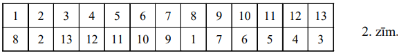
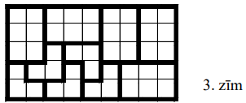

# <lo-sample/> LV.NOL.2006.5.1

No četrciparu skaitļa $A$ atņemot trīsciparu skaitli $B$, iegūst $8002$. Šos 
pašus skaitļus $A$ un $B$ saskaitot, iegūst piecciparu skaitli. Atrast $A$ un 
$B$.

<small>

* questionType:
* domain:

</small>

## Atrisinājums

No uzdevuma nosacījumiem seko: pieskaitot skaitlim $8002$ skaitli $B$ divas 
reizes, iegūst vismaz $10\ 000$. Tas ir iespējams tikai, ja $B=999$ (ja 
$B<999$, tad $8002+B+B<10000)$. Tāpēc $B=999$ un $A=8002+999=9001$.

# <lo-sample/> LV.NOL.2006.5.2

Uz tāfeles uzrakstīta burtu virkne $\mathbf{abababababa}$. Ar vienu gājienu 
atļauts izvēlēties jebkuru daudzumu pēc kārtas uzrakstītu burtu, nodzēst tos 
un atbrīvotajā vietā uzrakstīt šos pašus burtus apgrieztā secībā (piemēram, 
$abb$ var aizstāt ar $bba$).

Ar kādu mazāko daudzumu gājienu, izpildot tos vienu pēc otra, var uz tāfeles 
iegūt virkni $\mathbf{aaaaabbbbb}$?

<small>

* questionType:
* domain:

</small>

## Atrisinājums

$\underline{Atbilde:}$ Ar $5$ gājieniem.

- Var izdarīt, piemēram, šādus pārveidojumus:

$$\begin{align*}
abab \mathbf{ab} ababa \\
aba \mathbf{bbaa} baba \\
ab \mathbf{aaabbb} aba \\
a \mathbf{bbbbaaaa} ba \\
aaaaa \mathbf{bbbbba} \\
aaaaaabbbbb
\end{align*}$$

- Sākumā ir $10$ vietas, kur blakus stāv dažādi burti, beigās - tikai viena 
tāda vieta. Ar katru gājienu tādu vietu skaits samazinās ne vairāk kā par $2$, 
tāpēc vajag vismaz $5$ gājienus.

# <lo-sample/> LV.NOL.2006.5.3

Parādīt, ka trijstūri var sagriezt **(A)** četros, **(B)** sešos trijstūros tā,
ka neviena griežot iegūtā trijstūra mala pilnībā nesakrīt ne ar vienu citu 
griežot iegūtā trijstūra malu.

<small>

* questionType:
* domain:

</small>

## Atrisinājums

Skat. 1.zīm.

# <lo-sample/> LV.NOL.2006.5.4

Uz katras no $n$ kartiņām uzrakstīts pa naturālam skaitlim (starp tiem var būt 
arī vienādi). Zināms, ka vienlaicīgi izpildās šādas īpašības:

- starp uzrakstitajiem skaitļiem ir vismaz $5$ dažādi,
- katrām divām kartiņām (apzīmēsim tās ar $A$ un $B$) var atrast divas citas 
  kartiņas (apzīmēsim tās ar $C$ un $D$) tā, ka to skaitļu summa, kas 
  uzrakstīti uz $A$ un $B$, vienāda ar to skaitļu summu, kas uzrakstīti uz $C$ 
  un $D$.

Pierādiet, ka mazākā iespējamā $n$ vērtība ir $13$.

<small>

* questionType:
* domain:

</small>

## Atrisinājums

Var ņemt, piemēram, $13$ kartiņas ar skaitļiem

$$1;\ 1;\ 1;\ 1;\ 2;\ 2;\ 3;\ 4;\ 4;\ 5;\ 5;\ 5;\ 5$$

Parādīsim, ka $13$ ir **mazākais** iespējamais kartiņu skaits. Pieņemsim, ka 
$a$ un $b$ - divi mazākie **dažādi** skaitļi, $a<b$. Tā kā summai $a+b$ 
jāizsakās vēl citādi, jābūt vēl pa vienam eksemplāram gan $a$, gan $b$. Lai 
summu $a+a$ varētu izsacīt ar citām kartiņām, jābūt vēl diviem $a$ 
eksemplāriem. Līdzīgi konstatē, ka lielākajai vērtībai $d$ jābūt vismaz uz $4$ 
kartiņām un otrai lielākajai vērtībai $c$ - vismaz uz $2$ kartiņām. Tā kā jābūt
vismaz $5$ dažādiem skaitļiem, tad nepieciešama vēl $13.$ kartiņa.

# <lo-sample/> LV.NOL.2006.5.5

Kādā kolbā atrodas pa $10$ baltām, sarkanām un zaļām amēbām. Ja satiekas tieši 
divas dažādu krāsu amēbas, tad tās saplūst un no tām izveidojas viena trešās 
krāsas amēba. Vai var gadīties, ka traukā paliek tikai viena amēba?

<small>

* questionType:
* domain:

</small>

## Atrisinājums

Ar katru pārvēršanos **katras** krāsas amēbu skaits mainās par $1$. Tāpēc pēc 
$1.$ pārvēršanās **katras** krāsas amēbu daudzums būs nepāra skaitlis, pēc $2.$
pārvēršanās - pāra skaitlis, pēc $3.$ pārvēršanās - nepāra skaitlis utt. Tāpēc 
nevar iestāties situācija, kad divu krāsu amēbu skaits ir $0$, bet trešās 
krāsas amēbu skaits ir $1$.

# <lo-sample/> LV.NOL.2006.6.1

Vai var uz taisnes izvietot $5$ punktus $A,\ B,\ C,\ D,\ E$ (varbūt citādā 
kārtībā) tā, ka $AB=1,\ BC=3,\ CD=5,\ DE=7,\ EA=9$?

<small>

* questionType:
* domain:

</small>

## Atrisinājums

Nē, nevar, Ejot no $A$ uz $B$, no $B$ uz $C$, no $C$ uz $D$, no $D$ uz $E$ un 
no $E$ uz $A$, katru nostaigāto taisnes gabalu nostaigā pāra skaitu reižu (cik 
reizes pa labi, tik reizes pa kreisi). Tāpēc kopējam nostaigātajam ceļam 
jāizsakās ar pāra skaitli. Bet $1+3+5+7+9=25$

# <lo-sample/> LV.NOL.2006.6.2

Ap galdu sēž $7$ cilvēki. Katriem trim pie galda sēdošiem cilvēkiem var atrast 
tādu pie galda sēdošu cilvēku, kurš pazīst tos visus trīs. Pierādīt: pie galda 
ir tāds cilvēks, kurš pazīst visus pārējos ap galdu sēdošos.

($\underline{Piezīme:}$ ja $A$ pazīst $B$, tad arī $B$ pazīst $A$.)

<small>

* questionType:
* domain:

</small>

## Atrisinājums

Eksistē divi cilvēki $x$ un $y$, kuri pazīst viens otru. Ja $u$ - patvaļīgs 
cilvēks, tad eksistē tāds $z$, kas pazīst $x,\ y$ un $u$; tātad $x,\ y,\ z$ 
visi pazīst viens otru. Eksistē tāds $t$, kas pazīst $x,\ y$ un $z$; tātad 
$x,\ y,\ z,\ t$ visi pazīst cits citu. Atlikušajiem $3$ cilvēkiem eksistē kāds,
kas pazīst tos visus (šis "kāds" ir viens no $x,\ y,\ z,\ t$); tas der par 
meklējamo cilvēku.

# <lo-sample/> LV.NOL.2006.6.3

Tabulā ir divas rindas un $n$ kolonnas (skat. 1.zīm.)

Katrā rindā jāieraksta visi naturālie skaitļi no $1$ līdz $n$ ieskaitot (katrs 
vienu reizi) tā, lai katrā kolonnā ierakstīto skaitļu summa būtu **kaut kāda** 
naturāla skaitļa reizinājums pašam ar sevi. Vai to var izdarīt, ja **(A)** 
$n=11$, **(B)** $n=13$?

<small>

* questionType:
* domain:

</small>

## Atrisinājums

**(A)** Nē. Vienā kolonnā ar $4$ var atrasties tikai $5$, un vienā kolonā ar 
$11$ arī var atrasties tikai $5$. Bet $5$ nevar reizē atrasties $2$ kolonnās.

**(B)** jā, skat. 2.zīm.

# <lo-sample/> LV.NOL.2006.6.4

Kādā valstī lieto 
$1;\ 2;\ 3;\ 5;\ 8;\ 10;\ 15;\ 20;\ 25;\ 29;\ 43;\ 50;\ 60;\ 68;\ 75;\ 100$ 
santīmu monētas. Naudas automāts samaina jebkuru vienu monētu pret jebkurām $4$
monētām (pēc mūsu izvēles) ar tādu pašu kopējo vērtību kā maināmajai monētai. 
Vai var ar šī automāta palīdzību samainīt vienu $100$ santīmu monētu $100$ 
viena santīma monētās?

<small>

* questionType:
* domain:

</small>

## Atrisinājums

Nē. Pēdējā maiņā būtu jāiegūst četras $1$ santīma monētas, samainot vienu $4$ 
santīmu monētu; bet tādas vispār nav.

# <lo-sample/> LV.NOL.2006.6.5

No $9$ dažādiem nenulles cipariem, katru izmantojot tieši vienu reizi, 
izveidoti $5$ naturāli skaitļi. Mazākais no tiem ir visu četru pārējo skaitļu 
dalītājs. Kāds var būt šis mazākais skaitlis?

<small>

* questionType:
* domain:

</small>

## Atrisinājums

$\underline{Atbilde:}$ $1;\ 3;\ 9$.

Apzīmēsim mazāko izveidoto skaitli ar $x$; skaidrs, ka $x$ ir viencipara 
skaitlis. Skaitlis $x$ nevar būt pāra, jo tādā gadījumā augstākais $3$ no 
pārējiem skaitļiem ir pāra, un ceturtais nedalās ar $x$. Skaidrs, ka 
$x \neq 5$, jo tad neviens no pārējiem skaitļiem nedalās ar $x$.

Pieņemsim, ka $x=7$. Ja kādam no pārējiem skaitļiem būtu $3$ vai vairāk cipari,
tad kāds cits no tiem būtu viencipara, un tas nedalītos ar $7$. Tātad pārējie 
skaitļi var būt tikai $14;\ 21;\ 28;\ 35;\ 42;\ 49;\ 56;\ 63;\ 84;\ 91;\ 98$. 
Ciparus $3;\ 5;\ 6$ satur tikai skaitļi $35;\ 56;\ 63$. Noteikti jāņem divi no 
tiem, bet tad viens cipars atkārtojas; pretruna, tātad $x \neq 7$.

Paliek iespējas $A=1$ (pārējos skaitļus sastāda patvaļīgī), $A=3$ (var ņemt, 
piemēram, $3;\ 9;\ 18;\ 27;\ 645$) un $A=9$ (var ņemt, piemēram, 
$9;\ 18;\ 27;\ 36;\ 45$).

# <lo-sample/> LV.NOL.2006.7.1

Plaknē atzīmēti $5$ punkti. Cik var būt trijstūru, kam visas virsotnes atrodas 
šajos punktos?

<small>

* questionType:
* domain:

</small>

## Atrisinājums

Ja visi $5$ punkti ir uz vienas taisnes, ir $0$ trijstūru.

Ja uz vienas taisnes ir tikai četri punkti, tad ir $6$ trijstūri.

Ja nekādi $3$ punkti nav uz vienas taisnes, tad ir $10$ trijstūri.

Ja $3$ punkti (teiksim, $A;\ B;\ C$) ir uz vienas taisnes, bet citu uz vienas 
taisnes esošu punktu trijnieku nav, tad ir $9$ trijstūri.

Ja ir $2$ punktu trijnieki, kas katrs ir uz vienas taisnes (piemēram, 
$A;\ B;\ C$ un $A;\ D;\ E$), tad ir $8$ trijstūri.

$\underline{Atbilde:}$ $0;\ 6;\ 8;\ 9;\ 10$.

# <lo-sample/> LV.NOL.2006.7.2

Dotas $8$ pēc ārējā izskata vienādas monētas. Ir zināms, ka vai nu visām tām 
masas ir vienādas, vai arī $4$ monētām ir viena masa, bet $4$ monētām - cita 
masa. Kā ar $3$ svēršanām uz sviras svariem bez atsvariem var noskaidrot, kura 
no iespējām pastāv īstenībā?

<small>

* questionType:
* domain:

</small>

## Atrisinājums

Uzliekam monētas uz kausiem pa $4$. Ja līdzsvara nav, ir divu dažādu masu 
monētas. Ja līdzsvars ir, otrajā svēršanā uzliekam uz kausiem pa $2$ monētām no
tām $4$, kas pirmajā svēršanā atradās uz viena kausa. Ja līdzsvara nav, ir divu
dažādu masu monētas. Ja līdzsvars ir, uzliekam uz kausiem pa $1$ monētai no 
tām, kas otrajā svēršanā atradās uz viena kausa. Ja līdzsvara nav, ir divu 
dažādu masu monētas. Ja līdzsvars ir, visām monētām ir vienādas masas.

# <lo-sample/> LV.NOL.2006.7.3

Apskatām visus naturālos skaitļus no $1$ līdz $200$ ieskaitot.

**(A)** vai no tiem var izvēlēties $101$ skaitli tā, lai neviens izvēlētais 
skaitlis nebūtu divu citu izvēlēto skaitļu starpība?

**(B)** vai tā var izvēlēties $102$ skaitļus?

<small>

* questionType:
* domain:

</small>

## Atrisinājums

**(A)** jā; piemēram, izvēlamies skaitļus no $100$ līdz $200$ ieskaitot.

**(B)** nē. Apzīmēsim izvēlētos skaitļus ar $x_{1}<x_{2}<\ldots<x_{102}$. 
Apskatīsim **arī** skaitļus $x_{1}+x_{2}; x_{1}+x_{3}; \ldots; x_{1}+x_{102};$ 
pavisam mums ir $203$ skaitļi. Tie visi nav mazāki par $x_{1}$ un nav lielāki 
par $x_{1}+x_{102}$; šajā intervālā ir 
$\left(x_{1}+x_{102}\right)-x_{1}+1=x_{102}+1 \leq 201$ skaitlis. Tā kā 
$203>201$, tad divi no apskatāmajiem skaitļiem ir vienādi savā starpā. Skaidrs,
ka var būt tikai $x_{i}=x_{1}+x_{j}$, no kurienes seko $x_{1}=x_{i}-x_{j}$.

# <lo-sample/> LV.NOL.2006.7.4

Kuri naturālie skaitļi ir vienādi ar trīs savu dažādu pozitīvu dalītāju summu?

<small>

* topic:IntegerFactorization
* topic:NumTheoryInequalityLargeIntervals
* questionType:FindAll
* domain:Alg

</small>

## Atrisinājums

Meklējamo skaitli apzīmēsim ar $n$. Tā **iespējami** pozitīvie dalītāji 
(dilstošā secībā) ir $n; \frac{n}{2}; \frac{n}{3}; \frac{n}{4}; \ldots$

Skaidrs, ka neviens no apskatāmajiem $3$ dažādajiem dalītājiem nevar būt $n$. 
Ja lielākais no tiem nav $\frac{n}{2}$, tad to summa nepārsniedz 
$\frac{n}{3}+\frac{n}{4}+\frac{n}{5}<n$, un tā nevar būt. Tāpēc viens no $3$ 
dalītājiem ir $\frac{n}{2}$, un abu pārējo summa ir $\frac{n}{2}$. Ja lielākais
no šiem abiem pārējiem ir $\frac{n}{3}$, tad trešais ir 
$\frac{n}{2}-\frac{n}{3}=\frac{n}{6}$. Ja lielākais no šiem abiem pārējiem ir 
mazāks par $\frac{n}{3}$, tad to summa nepārsniedz 
$\frac{n}{4}+\frac{n}{5}<\frac{n}{2}$, un tā nevar būt.

Tāpēc vienīgā iespēja ir, ka šie dalītāji ir $\frac{n}{2}, \frac{n}{3}$ un 
$\frac{n}{6}$. Lai tādi dalītāji eksistētu, nepieciešams un pietiekams, lai $n$
dalītos ar $6$.

# <lo-sample/> LV.NOL.2006.7.5

Kādā ciemā dzīvo $n$ pļāpas; katrai mājās ir telefons. Šodien katra pļāpa 
piezvanīja vismaz vienai citai. Starp katrām divām pļāpām notika tieši viena 
saruna. Pierādīt: var atrast trīs tādas pļāpas $A,\ B$ un $C$, ka $A$ 
piezvanīja $B,\ B$ piezvanīja $C$ un $C$ piezvanīja $A$.

<small>

* questionType:
* domain:

</small>

## Atrisinājums

Katra pļāpa zvanījusi vismaz $1$ reizi un ne vairāk kā $(n-1)$ reizes; dažādu 
iespējamu zvanīšanu daudzumu tātad ir $n-1$. Pļāpu ir $n$; ievērojam, ka 
$n>n-1$. Tāpēc ir $2$ pļāpas (apzīmēsim tās ar $A$ un $B$), kas zvanījušas 
vienādu daudzumu reižu. Viena no tām zvanījusi otrai; pieņemsim, ka pļāpa $A$ 
zvanījusi pļāpai $B$. Tad pļāpa $B$ nav zvanījusi pļāpai $A$. Lai pļāpas $A$ un
$B$ būtu veikušas vienādu daudzumu zvanu, ir jābūt tādai pļāpai - apzīmēsim to 
ar $C$ - kam $B$ ir zvanījusi, bet $A$ nav zvanījusi (citādi $A$ veikto zvanu 
būtu vismaz par $1$ vairāk nekā $B$ veikto zvanu). Ja $A$ nav zvanījusi $C$, 
tad $C$ ir zvanījusi $A$. Vajadzīgās $3$ pļāpas ir atrastas.

# <lo-sample/> LV.NOL.2006.8.1

Ir zināms, ka visiem $x$ pastāv vienādība 
$x^{4}+64=\left(x^{2}-4x+8\right) \cdot A$, kur $A$ ir izteiksme, kas izveidota
no $x$ un naturāliem skaitļiem ar saskaitīšanas, atņemšanas un reizināšanas 
operāciju palīdzību. Atrast $A$.

<small>

* topic:CompletingSquare
* questionType:FindAll
* domain:Alg

</small>

## Atrisinājums

$x^{4}+64=\left(x^{2}-4x+8\right)\left(x^{2}+4x+8\right)$.

*Piezīme:* Kreisajai pusei var pieskaitīt un atņemt $16x^2$, tad atdalīt pilno kvadrātu
un dalīt reizinātājos pēc kvadrātu starpības formulas.

# <lo-sample/> LV.NOL.2006.8.2

Jānis sadala $a$ metrus garu nogriezni $3$ mazākos nogriežņos; pēc tam Pēteris 
sadala $b$ metrus garu nogriezni $3$ mazākos nogriežnos. Pēteris grib, lai no 
iegūtajiem $6$ nogriežņiem varētu vienlaicīgi salikt divu trijstūru kontūras, 
skat. 2.zīm.; Jānis cenšas to nepieļaut. Kurš no zēniem var sasniegt savu 
mērķi? (Atbilde **varbūt** ir atkarīga no $a$ un $b$ vērtībām.)

<small>

* questionType:
* domain:

</small>

## Atrisinājums

Ja $a>b$, uzvar Jānis. Apzīmēsim $a=b+c,\ c>0$. Jānis sadala savu nogriezni 
gabalos $b+\frac{2c}{3}, \frac{c}{6}, \frac{c}{6}$. Tad daļa ar garumu 
$b+\frac{2c}{3}$ ir garāka par visām $5$ citām daļām kopā, tāpēc tā nevar būt 
trijstūra mala.

Ja $a \leq b$, uzvar Pēteris. Pieņemsim, ka Jāņa daļas ir 
$x \geq y \geq z,\ x+y+z=a$. Pēteris izveido daļas ar garumiem 
$x,\ \frac{b-x}{2},\ \frac{b-x}{2}$. Tad var salikt vienādsānu trijstūri 
$(x,\ x,\ y)$ un vienādsānu trijstūri 
$\left(\frac{b-x}{2},\ \frac{b-x}{2},\ z\right)$: ievērojam, ka $x \geq y$ un 
$\frac{b-x}{2} \geq z \Leftrightarrow b-x \geq 2 z$. Pēdējā nevienādība ir 
pareiza, jo $b-x \geq a-x=y+z \geq 2z$.

# <lo-sample/> LV.NOL.2006.8.3

Vai var izrakstīt rindā visus naturālos skaitļus no $1$ līdz $2006$ ieskaitot 
katru vienu reizi tā, lai katru $3$ pēc kārtas uzrakstīto skaitļu summa dalītos
ar $4$?

<small>

* topic:PeriodicRemainders
* topic:CongruenceClasses
* questionType:ProveDisprove
* domain:NT

</small>

## Atrisinājums

Nē. Apskatām $4$ pēc kārtas uzrakstītus skaitļus $a,\ b,\ c,\ d$. Tā kā $a+b+c$
un $b+c+d$ abi dalās ar $4$, tad $a$ un $d$ jādod vienādi atlikumi, dalot ar 
$4$. Tātad skaitļiem, kas rindā atrodas $1.,\ 4.,\ 7.,\ 11.,\ \ldots,\ 2005.$ 
vietā, jādod vienādi atlikumi, dalot ar $4$; šo vietu ir $668$. Bet skaitļiem 
no $1$ līdz $2006$ ieskaitot, dalot tos ar $4$, atlikumi $1$ un $2$ ir $502$ 
reizes, bet atlikumi $3$ un $0$ - $501$ reizi.

*Piezīme:* Atlikumi, dalot ar $4$ šādā virknē atkārtosies ar periodu $3$, 
t.i. viens no atlikumiem neparādīsies vispār.

# <lo-sample/> LV.NOL.2006.8.4

Par stūrīti sauc no $3$ vienādiem kvadrātiem sastāvošu figūru, kas redzama 
3.zīm. Kvadrāta malas garums ir $1$.

Vai taisnstūri ar izmēriem **(A)** $8 \times 8$, **(B)** $12 \times 12$, 
**(C)** $5 \times 9$ var sagriezt stūrīšos?

<small>

* questionType:
* domain:

</small>

## Atrisinājums

**(A)** Nē, jo $64$ nedalās ar $3$

**(B)** jā, jo kvadrātu $12 \times 12$ viegli sadalīt taisnstūros $2 \times 3$,
bet katru šādu taisnstūri divos stūrīšosos.

**(C)** jā, skat. 3.zīm.

# <lo-sample/> LV.NOL.2006.8.5

Uz katras no $100$ kartiņām ir pa naturālam skaitlim no $1$ līdz $100$ 
ieskaitot (visi skaitļi uz kartiņām ir dažādi). Daļa kartiņu ir Juliatai, 
pārējās - Maijai. Zināms: ja paņem pa vienai kartiņai no katras meitenes, tad 
uz tām uzrakstīto skaitļu summa nav ne uz vienas Juliatas kartiņas, bet uz tām 
uzrakstīto skaitļu reizinājums nav ne uz vienas Maijas kartiņas. Maijai nav 
kartiņas ar skaitli $13$. Cik kartiņu ir Maijai?

<small>

* questionType:
* domain:

</small>

## Atrisinājums

To, ka kartiņa ar skaitli $x$ ir Juliatai resp. Maijai, pierakstīsim kā 
$x \sim j$ resp. $x \sim m$. Pēc dotā $13 \sim j$. Apskatīsim jebkuru $x$, kur 
$x \sim m$. Ja $1 \sim j$, tad $1 \cdot x \sim m$ dod pretrunu. Tāpēc 
$1 \sim m$.

Ja $12 \sim j$, tad $1+12=13 \sim j$ dod pretrunu. Tāpēc $12 \sim m$.

Tā kā $6+7 \sim j$, tad $6$ un $7$ ir vienai un tai pašai meitenei. Ja būtu 
$6 \sim j$ un $7 \sim j$, tad $1+6 \sim j$ dotu pretrunu. Tāpēc $6 \sim m$ un 
$7 \sim m$.

Līdzīgi secinām, ka $3 \sim m$, un $10 \sim m$; $5 \sim m$ un $8 \sim m$; 
$4 \sim m$ un $9 \sim m;\ 2 \sim m$ un $11 \sim m$.

Tātad skaitļi no $1$ līdz $12$ ir Maijai. Tā kā $13 \sim j$, tad skaitļi 
$13 \cdot k(k=1;\ 2;\ 3;\ \ldots;\ 7)$ nav Maijai, tāpēc tie ir Juliatai. 
Savukārt šo skaitļu summas ar $1;\ 2;\ \ldots;\ 12$ nav Juliatai, tāpēc tās ir 
Maijai. Tātad Juliatai ir $7$ kartiņas ar skaitļiem, kuri dalās ar $13$, bet 
Maijai ir $93$ pārējās kartiņas.

(Viegli pārbaudīt, ka šis sadalījums apmierina uzdevuma prasības; pārbaude 
nepieciešama)

# <lo-sample/> LV.NOL.2006.9.1

Kādā kolektīvā katram cilvēkam ir tieši $3$ draugi (ja $A$ ir $B$ draugs, tad 
arī $B$ ir $A$ draugs). Nav tādu triju cilvēku, kas visi savā starpā 
draudzētos. Kāds ir mazākais iespējamais cilvēku skaits šajā kolektīvā?

<small>

* questionType:
* domain:

</small>

## Atrisinājums

To, ka var būt $6$ cilvēki, skat. 3.zīm.

Pierādīsim, ka tas ir mazākais iespējamais skaits. Apzīmēsim ar $A$ vienu 
cilvēku, ar $B,\ C,\ D$ - viņa draugus. Tā kā $B$ nevar draudzēties ne ar $C$, 
ne $D$, tad ir vismaz vēl divi citi cilvēki - $B$ draugi, no kurienes seko 
vajadzīgais.

# <lo-sample/> LV.NOL.2006.9.2

Dots, ka $ABCD$ - paralelograms. Taisne $t$ ir paralela diagonālei $BD$ un 
krusto malu $AB$ punktā $M$, bet malu $AD$ - punktā $K$. Pierādīt, ka trijstūru
$BMC$ un $KCD$ laukumi ir vienādi.

Ja nevarat atrisināt uzdevumu vispārīgajā gadījumā, apskatiet gadījumu, kad 
$ABCD$ - kvadrāts (protams, iegūto punktu skaits tad būs mazāks).

<small>

* questionType:
* domain:

</small>

## Atrisinājums

Tā kā $\Delta KDC$ un $\triangle KDB$ ir kopīgs pamats $KD$ un vienādi augstumi
 pret šo pamatu, tad $\mathbf{L}(\mathbf{KDC})=\mathbf{L}(\mathbf{KDB})$. 
 Līdzīgi $\mathbf{L}(\mathbf{BMC})=\mathbf{L}(\mathbf{BMD})$.

Bet $\triangle KDB$ un $\triangle BMD$ ir kopīgs pamats $BD$ un vienādi 
augstumi pret šo pamatu, tāpēc 
$\mathbf{L}(\mathbf{KDB})=\mathbf{L}(\mathbf{BMD})$. No šīm vienādībām seko 
vajadzīgais.

(Speciālajā kvadrāta gadījumā vajadzīgais seko arī, piemēram, no simetrijas dēļ
spēkā esošās vienādības $\triangle BMC=\Delta DKC$.)

# <lo-sample/> LV.NOL.2006.9.3

Ja $a$ - reāls skaitlis, tad ar $[a]$ apzīmē lielāko veselo skaitli, kas 
nepārsniedz $a$ (skaitļa $a$ veselo daļu). Piemēram, 
$[4,8]=4;\ [-3,3]=-4;\ [5]=5$.

Savukārt pēc definīcijas $\{a\}=a-[a]$ (skaitļa $a$ daļveida daļa). Piemēram, 
$\{4,8\}=0,8;\ \{-3,3\}=0,7;\ \{5\}=0$.

Atrisināt reālos skaitļos vienādojumu sistēmu

$$\left\{\begin{array}{l}
{[x]+\{y\}=z} \\
{[y]+\{z\}=x} \\
{[z]+\{x\}=y}
\end{array}\right.$$

<small>

* questionType:
* domain:

</small>

## Atrisinājums

Pārrakstām sistēmu formā

$$\left\{\begin{array}{l}
{[x]+\{y\}=[z]+\{z\}} \\
{[y]+\{z\}=[x]+\{x\}} \\
{[z]+\{x\}=[y]+\{y\}}
\end{array}\right.$$

Tā kā skaitlis viennozīmīgi nosaka savu veselo daļu un daļveida daļu, tad no 
šejienes seko $[x]=[y]=[z]$ un $\{x\}=\{y\}=\{z\}$, tātad $x=y=z$. No otras 
puses, skaidrs, ka jebkurš vienādu skaitļu trijnieks $(a;a;a)$ der par 
atrisinājumu.

# <lo-sample/> LV.NOL.2006.9.4

Kuri naturālie skaitļi $x$ apmierina vienlaicīgi visas sekojošās prasības:

- $x \leq 2006$,
- $x$ dalās ar $5$,
- $x+1$ dalās ar $7$,
- $x+2$ dalās ar $9$,
- $x+3$ dalās ar $11$?

<small>

* questionType:FindAll
* domain:NT

</small>

## Atrisinājums

No uzdevumā dotajām pēdējām $4$ prasībām seko, ka $2x-5$ dalās ar $5$; ar $7$; 
ar $9$; ar $11$ (piemēram, $2x-5=2(x+1)-7$ dalās ar $7$ utml.). Tā kā 
$5;\ 7;\ 9;\ 11$ pa pāriem ir savstarpēji pirmskaitļi, tad $2x-5$ dalās ar 
$5 \cdot 7 \cdot 9 \cdot 11=3465$. Tā kā $1 \leq x \leq 2006$, tad 
$3 \leq 2x-5 \leq 4007$. Šajās robežās ar $3465$ dalās tikai $0$ un $3465$. Bet
$2x-5=0$ naturālam $x$ nav iespējams, tāpēc $2x-5=3465$ un 
$\mathbf{x}=\mathbf{1735}$.

# <lo-sample/> LV.NOL.2006.9.5

Gunārs un Dzintars pamīšus raksta uz tāfeles pa vienam naturālam skaitlim, kas 
nepārsniedz $1000$. Sāk Dzintars, uzrakstot skaitli $1$. Neviens jau uzrakstīts
skaitlis netiek nodzēsts; nevienu skaitli nedrīkst rakstīt otrreiz.

Ja kaut kāds skaitlis $x$ jau ir uz tāfeles, tad ar kārtējo gājienu drīkst 
uzrakstīt vai nu $x+1$, vai $2x$ (ja izvēlētais rakstāmais skaitlis nepārsniedz
$1000$). Tas, kurš uzraksta $1000$, uzvar. Kurš no zēniem uzvar, pareizi 
spēlējot?

<small>

* questionType:ProveDisprove
* domain:NT

</small>

## Atrisinājums

Uzvar Gunārs.

Tā kā pēdējais (uzvarošais) gājiens tiek izdarīts vai nu no pozīcijas $500$, 
vai no pozīcijas $999$, tad zaudē tas, kurš uzraksta vienu no šiem skaitļiem. 
Pieņemsim, ka zaudētājs uzraksta $500$. Tas tiek darīts tāpēc, ka citu iespēju 
(izņemot varbūt rakstīt $999$) viņam nav. Tas nozīmē, ka visi skaitļi 
$1;\ 2;\ 3;\ \ldots;\ 499$ jau ir uzrakstīti (citādi varētu rakstīt mazāko vēl 
neuzrakstīto no tiem) un tātad arī divas reizes lielākie skaitļi 
$502;\ 504;\ \ldots;\ 998$ ir uzrakstīti; no tā savukārt seko, ka arī 
$503;\ 505;\ \ldots;\ 997$ ir jau uzrakstīti. Savukārt $999$ vēl nav uzrakstīts
(citādi spēle būtu beigusies jau ātrāk) un arī $501$ vēl nav uzrakstīts (citādi
jau iepriekš būtu uzrakstīts $500$, un spēle būtu beigusies ātrāk). Tātad 
brīdī, kad zaudētājs uzrakstījis $500$, uz tāfeles atrodas $997$ skaitļi 
(ieskaitot $500$). Tāpēc skaitli $500$ uzraksta sācējs, proti, Dzintars. Tāpēc 
viņš zaudē.

Gadījumu, ja "zaudējošais gājiens" ir $999$ uzrakstīšana, analizē līdzīgi.

# <lo-sample/> LV.NOL.2006.10.1

Atrodiet lielāko $12$-ciparu skaitli ar īpašību: katri divi blakus uzrakstīti 
cipari veido pirmskaitli, un visi šie $11$ pirmskaitļi ir dažādi.

<small>

* questionType:FindOptimal
* domain:NT

</small>

## Atrisinājums

Visiem cipariem, izņemot pirmo, jābūt $1;\ 3;\ 7;\ 9$. No šiem cipariem var 
sastādīt $10$ pirmskaitļus $11;\ 13;\ 17;\ 19;\ 31;\ 37;\ 71;\ 73;\ 79;\ 97$. 
Tātad visi tie būs atrodami meklējamā skaitlī, un vienpadsmitais pirmskaitlis 
būs tas, kas sāksies ar skaitļa pirmo ciparu.

Ar $1$ sākas $4$ pirmskaitļi, bet beidzas $3$; tāpēc $1$ ir meklējamā skaitļa 
otrais cipars. Vislielākais iespējamais pirmais cipars ir $6$ (jo $71$ būs 
sastopams tālāk, bet $81$ un $91$ nav pirmskaitļi).

Ar $9$ sākas $1$ pirmskaitlis, bet beidzas $2$; tāpēc $9$ ir meklējamā 
skaitļa pēdējais cipars. Aiz otrā cipara lielākie iespējamie rakstāmi cipari 
$9$ un $7$. Tātad skaitlis jāmeklē formā

$$6197abcdefg9.$$

Citu devītnieku skaitlī nevar būt (aiz tiem neko nevar uzrakstīt). Tāpēc $g=7$.
Izvēloties $a$ un $b$ iespējami lielus, iegūstam 

$$619737cdef79.$$

Tā kā $c \neq 9$ un $c \neq 3$ ($73$ jau sastopams agrāk), tad $c=1$. Iegūstam 
formu 

$$6197371def79.$$

Tā kā $d \neq 7$ (aiz $d$ nebūtu ko rakstīt), liekam iespējami lielāko vērtību 
$d=3$. Atliek $e=f=1$ (lai parādītos pirmskaitlis $11$).

$\underline{Atbilde:}$ $\mathbf{619737131179}$.

# <lo-sample/> LV.NOL.2006.10.2

Katram no diviem vienādiem regulāriem $n$-stūriem virsotnes kaut kādā kārtībā 
sanumurētas ar naturāliem skaitļiem no $1$ līdz $n$ (katrā $n$-stūrī visi 
numuri ir dažādi).

Noskaidrojiet, vai noteikti katrā $n$-stūrī var izvēlēties $3$ virsotnes tā, ka
vienlaicīgi izpildās sekojošas īpašības:

- abos $n$-stūros izvēlētas virsotnes ar vieniem un tiem pašiem numuriem,
- pirmajā $n$-stūrī izvēlēto virsotņu veidotais trijstūris un otrajā $n$-stūrī 
  izvēlēto virsotņu veidotais trijstūris abi ir viena tipa: vai nu abi ir 
  šaurleņķu, vai abi taisnleņķa, vai abi platleņķa.

Atbildiet uz šo jautājumu, ja **(A)** $n=5$; **(B)** $n=2006$.

<small>

* questionType:
* domain:

</small>

## Atrisinājums

**(A)** nē. Skat., piem., 5.zīm.

**(B)** jā. Apvelkam ap abiem $2006$-stūriem riņķa līnijas. Ja eksistē kaut 
viens skaitļu pāris, kas abos $2006$-stūros ir diametra galapunktos, tad par 
trešajām virsotnēm var ņemt jebkuras ar vienādiem numuriem - abi trijstūri būs 
taisnleņķa.

Ja tāda pāra nav, tad ņemam divus skaitļus, kas pirmajā $2006$-stūrī ir 
pretējās virsotnēs (pieņemsim, tie ir $x$ un $y$). Pieņemsim, ka skaitlis $z$ 
otrā $2006$-stūrī ir pretējā virsotnē skaitlim $x$. Tad skaitļi $x,\ y,\ z$ ir 
meklējamie: abi ar tiem sanumurētie trijstūri ir taisnleņķa.

# <lo-sample/> LV.NOL.2006.10.3

Dots, ka $a,\ b$ un $c$ - pozitīvi skaitļi. Pierādīt, ka vismaz viens no 
skaitļiem $\frac{a}{bc+1},\ \frac{b}{ac+1},\ \frac{c}{ab+1}$ nepārsniedz 
$\frac{1}{2}$.

<small>

* questionType:
* domain:

</small>

## Atrisinājums

Varam pieņemt, ka $a$ ir mazākais no skaitļiem $a;\ b;\ c$. Tad 
$\frac{a}{bc+1} \leq \frac{a}{a^{2}+1}$. Nevienādība 
$\frac{a}{a^{2}+1} \leq \frac{1}{2}$ ir pareiza, jo 
$(a-1)^{2} \geq 0 \Rightarrow a^{2}+1 \geq 2a$.

# <lo-sample/> LV.NOL.2006.10.4

Šaurleņķu trijstūra $ABC$ iekšpusē atrodas punkts $P$. Stari $AP,\ BP,\ CP$ 
krusto attiecīgi malas $BC,\ AC,\ AB$ attiecīgi punktos 
$A_{1},\ B_{1},\ C_{1}$. Pierādīt: ap abiem četrstūriem $ABA_{1}B_{1}$ un 
$ACA_{1}C_{1}$ var apvilkt riņķa līnijas tad un tikai tad, ja $P$ ir 
$\triangle ABC$ augstumu krustpunkts.

<small>

* questionType:
* domain:

</small>

## Atrisinājums

Ja $P$ ir $\triangle ABC$ augstumu krustpunkts, tad (6.zīm.)

$\sphericalangle AB_{1}B=\sphericalangle AA_{1}B$ (un tātad 
$A,\ B,\ A_{1},\ B_{1}$ ir uz vienas riņķa līnijas) un 
$\sphericalangle AC_{1}C=\sphericalangle AA_{1}C$ (un tātad 
$A,\ C,\ A_{1},\ C_{1}$ ir uz vienas riņķa līnijas). No otras puses, ja 
uzdevumā minētās divas riņķa līnijas eksistē, tad (7.zīm.) ievilktu leņķu 
īpašības dēļ 
$\sphericalangle A_{1}CC_{1}=\sphericalangle A_{1}AB=\sphericalangle A_{1}B_{1}P$.
No šejienes seko, ka $B_{1},\ C,\ A_{1},\ P$ ir uz vienas riņķa līnijas un 
tātad 
$\sphericalangle \mathbf{CA}_{\mathbf{1}} \mathbf{P}+\mathbf{CCB}_{\mathbf{1}} \mathbf{P}=\mathbf{180}^{\mathbf{o}}$.
No tā, ka $A,\ B_{1},\ A_{1},\ B$ ir uz vienas riņķa līnijas, seko, ka 
$\sphericalangle AB_{1}B=\sphericalangle AA_{1}B$ un tātad 
$\sphericalangle \mathbf{CB}_{\mathbf{1}} \mathbf{P}=\sphericalangle \mathbf{CA}_{\mathbf{1}} \mathbf{P}$.
No abām izceltajām vienādībām seko, ka 
$\sphericalangle CB_{1}P=\sphericalangle CA_{1}P=90^{\circ}$, t.i., $P$ ir 
$\triangle ABC$ augstumu krustpunkts.

# <lo-sample/> LV.NOL.2006.10.5

Ir $2006$ pēc ārējā izskata vienādas monētas. Dažas (vismaz viena) ir īstas un 
dažas (vismaz viena) ir viltotas. Visām īstajām monētām ir vienādas masas; arī 
visām viltotajām monētām ir vienādas masas. Viltotās monētas ir vieglākas par 
īstajām. Kā, izmantojot sviras svarus bez atsvariem, ar $1004$ svēršanām 
noskaidrot, cik ir viltoto monētu?

<small>

* questionType:
* domain:

</small>

## Atrisinājums

Salīdzinām divas monētas $A$ un $B$. Pastāv divas iespējas.

1. $A$ un $B$ ir dažādas masas. Tad viena no tām ir viltota, otra - īsta. 
Sadalām atlikušās $2004$ monētas $1002$ pāros un katru no tiem salīdzinām ar 
pāri $(A,\ B)$.

Katrā svēršanā mēs noskaidrosim, cik viltoto monētu ir konkrētajā pārī. Pavisam
tiks izmantotas $1+1002=1003$ svēršanas.

2. $A$ un $B$ ir vienādas masas. Kā iepriekš salīdzinām pāri $(A,\ B)$ ar 
citiem monētu pāriem, kamēr atrodam pāri $(C,\ D)$, kura masa atšķiras no 
$(A,\ B)$ masas. Pieņemsim, ka $(C,\ D)$ kopējā masa ir mazāka nekā $(A,\ B)$ 
kopējā masa (otrs gadījums ir "simetrisks"). Tad $A$ un $B$, kā arī visas citas
līdz šim svērtās monētas ir īstas. Salīdzinām $C$ un $D$. Rezultātā mēs atrodam
vismaz vienu monētu no pāra $(C,\ D)$, kura ir viltota. Tagad izveidojam pāri 
(īsta monēta, viltota monēta) un turpinām kā $1.$ gadījumā. Pavisam tiks 
izmantotas $1+1002+1=1004$ svēršanas.

# <lo-sample/> LV.NOL.2006.11.1

Doti $6$ viens otram sekojoši naturāli skaitļi. Pierādīt: eksistē pirmskaitlis,
ar kuru dalās tieši viens no šiem skaitļiem.

<small>

* questionType:Prove
* domain:NT

</small>

## Atrisinājums

Apzīmēsim apskatāmos skaitļus ar $n;\ n+1;\ n+2;\ n+3;\ n+4;\ n+5$. Ja $n$ (un 
tātad arī $n+5$) nedalās ar $5$, tad tieši viens no apskatāmajiem skaitļiem 
dalās ar $5$. Ja $n$ dalās ar $5$, tad neviens no skaitļiem 
$n+1;\ n+2;\ n+3;\ n+4$ nedalās ar $5$; divi no tiem (to starpība ir $2$) 
nedalās ar $2$; vismaz viens no šiem abiem nedalās ar $3$. Šis skaitlis tāpēc 
dalās ar kādu pirmskaitli $p,\ p>5$; tātad $p \geq 7$. Bet no $6$ pēc kārtas 
ņemtiem skaitļiem tikai viens var dalīties ar $p$, ja $p>6$.

# <lo-sample/> LV.NOL.2006.11.2

Kvadrāts $ABCD$ sastāv no $n \times n$ vienādām kvadrātiskām rūtiņām. Par 
"lēdiju" sauc figūru, kas var atrasties jebkurā rūtiņā; tā apdraud visas tās 
rūtiņas, kas atrodas ar to vienā horizontālē, vienā vertikālē un vienā 
"diagonālē", kura paralēla $AC$ (skat. 1.zīm.)

Kādu mazāko lēdiju skaitu var novietot kvadrātā, lai visas neaizņemtās rūtiņas 
būtu apdraudētas?

<small>

* questionType:
* domain:

</small>

## Atrisinājums

$\underline{Atbilde:}$ vajag vismaz $k=\left\lceil\frac{2n-1}{3}\right\rceil$ 
lēdijas, un ar šo daudzumu pietiek.

(Tātad $2m$, ja $n=3m$;

$2m+1$, ja $n=3m+1$;

$2m+1$, ja $n=3m+2$.)

$\underline{Atrisinājums:}$ Pieņemsim, ka ir $k$ lēdijas, kas apmierina 
uzdevuma nosacījumus. Tad ir vismaz $n-k$ rindas (kolonnas) bez lēdijām.

Pieņemsim, ka augšējā "bezlēdiju" rindā $r_{1}, r_{2}, \ldots, r_{n-k}$ ir 
rūtiņas, kuru kolonnās nav lēdiju, un labējā "bezlēdiju" kolonnā 
$R_{1}, R_{2}, \ldots, R_{n-k}$ ir rūtiņas, kuru rindās nav lēdiju (ievērojam: 
**viena** $r_{i}$ sakrīt ar **vienu** $R_{j}$). Tad ir vismaz $2(n-k)-1$ šādas 
rūtiņas uz dažādām diagonālēm, kas paralēlas $AC$. Tāpēc jābūt 
$k \geq 2(n-k),\ 3k \geq 2n-1$, $k \geq \frac{2n-1}{3}$.

# <lo-sample/> LV.NOL.2006.11.3

Stars $t$ ir $\triangle ABC$ leņķa $A$ bisektrise. Tā krusto malu $BC$ punktā 
$K$. Punkti $M$ un $N$ ir to perpendikulu pamati, kas no $B$ un $C$ vilkti pret 
$t$ ($M$ un $N$ nesakrīt). Tā perpendikula pamats, kas no $K$ vilkts pret $AC$,
ir $S$. Pierādīt, ka $\sphericalangle MSK=\sphericalangle NSK$.

<small>

* questionType:
* domain:

</small>

## Atrisinājums

Novelkam perpendikulu $KT$ pret $AB$. Tā kā 
$\sphericalangle BTK=\sphericalangle BMK$, tad ap $BTMK$ var apvilkt riņķa 
līniju. Tāpēc $\sphericalangle KBM=\sphericalangle KTM$. Simetrijas pēc 
(attiecībā pret $AM$) $\sphericalangle KTM=\sphericalangle KSM$, tāpēc 
$\sphericalangle KBM=\sphericalangle KSM$.

Tā kā $BM \parallel CN$, tad $\sphericalangle KBM=\sphericalangle KCN$. Tā kā 
ap $CNKS$ var apvilkt riņķa līniju (pretējo leņķu summa ir $180^{\circ}$), tad 
$\sphericalangle NCK=\sphericalangle NSK$. No šejienes seko vajadzīgais (skat. 
10.zīm.).

# <lo-sample/> LV.NOL.2006.11.4

Funkcija $f(x)$ definēta visiem $x \geq 0$. Ir zināms, ka funkcijas 
$f(x)-x^{3}$ un $f(x)-3x$ ir augošas visā definīcijas apgabalā. Pierādīt, ka 
funkcija $f(x)-x^{2}-x$ ir augoša

**(A)** segmentā $[0;\ 1]$,

**(B)** visā definīcijas apgabalā.

<small>

* questionType:
* domain:

</small>

## Atrisinājums

**(A)** pieņemsim, ka $0 \leq x<y<1$. No dotā $f(y)-3 y>f(x)-3x$, tāpēc 
$f(y)-f(x) \geq 3(y-x)$. Tā kā $0<x+y+1<3$, tad $f(y)-f(x) \geq(x+y+1)(y-x)$ 
jeb $f(y)-f(x) \geq xy-x^{2}+y^{2}-yx+y-x$, jeb 
$f(y)-y^{2}-y \geq f(x)-x^{2}-x$, k.b.j.

**(B)** pieņemsim, ka $1 \leq x<y$. Tad no dotā $f(y)-y^{3}>f(x)-x^{3}$, tāpēc 
$f(y)-f(x)>(y-x)\left(y^{2}+xy+x^{2}\right)$.

Tā kā $y^{2}+xy+x^{2}>y+x+1$, tad $f(y)-f(x)>(x+y+1)(y-x)$, no kurienes kā (A) 
gadījumā seko vajadzīgais.

Ja $f(x)-x^{2}-x$ ir augoša apgabalos $[0;\ 1]$ un $[1;\ \infty)$, tad tā ir 
augoša arī apgabalā $[0;\ \infty)$

# <lo-sample/> LV.NOL.2006.11.5

Andrim, Dzintaram un Gunāram ir liels daudzums zīmīšu. Uz katras zīmītes ir 
uzrakstīts viens no skaitļiem $2;\ 3;\ 4;\ 5;\ 6;\ 7;\ 8$. Maija uzlīmēja 
katram no viņiem uz pieres pa vienai zīmītei. Katrs zēns redz zīmītes uz abu 
draugu pierēm, bet neredz zīmīti uz savas pieres. Maija, visiem dzirdot, 
paziņoja: "Ne visi skaitļi uz jūsu pierēm ir dažādi. Visu triju skaitļu 
reizinājums ir vesela skaitļa kvadrāts."

Vai zēni nesarunājoties var noskaidrot, kādi skaitļi ir uz viņu pierēm?

<small>

* questionType:ProveDisprove
* domain:NT

</small>

## Atrisinājums

Tā kā visi trīs skaitļi nav dažādi, apzīmēsim tos ar $x;\ x;\ y$ (varbūt 
$x=y$). Reizinājums $x \cdot x \cdot y=x^{2}y$ ir vesela skaitļa kvadrāts tad 
un tikai tad, ja $y$ ir vesela skaitļa kvadrāts. Tātad viens no šiem skaitļiem 
ir $4$, un abi pārējie ir savā starpā vienādi.

Ja **visi** skaitļi ir $4$, tad katrs zēns redz divus četriniekus. Tā kā katrs 
zina, ka $4$ ir lietots vai nu vienu, vai trīs reizes, tad katrs secina, ka 
viņam uz pieres ir skaitlis $4$. Ja visi skaitļi nav $4$, tad viens zēns redz 
divus vienādus skaitļus, kas nav $4$; tāpēc viņš secina, ka viņam uz pieres ir 
$4$. Katrs no abiem pārējiem redz skaitļus $4$ un $x \neq 4$, tāpēc no 
iepriekšējā secina, ka viņam uz pieres ir $x$ ($x$ ir viens no skaitļiem 
$2;\ 3;\ 5;\ 6;\ 7;\ 8)$.

# <lo-sample/> LV.NOL.2006.12.1

Koordinātu plaknē uzzīmēts funkcijas $y=x^{4}-2x^{2}+7$ grafiks un taisne, kas 
krusto šo grafiku $4$ dažādos punktos. Pierādīt, ka krustpunktu abscisu summa 
ir $0$.

<small>

* questionType:
* domain:

</small>

## Atrisinājums

Apskatāmo krustpunktu abscisas ir vienādojuma $x^{4}-2x^{2}+7=ax+b$ saknes (ja 
$y=ax+b$ ir novilktās taisnes vienādojums; skaidrs, ka taisne **nav** 
perpendikulāra $Ox$ asij, jo tad tā krustotu grafiku vienā punktā; tāpēc tās 
vienādojums ir formā $y=ax+b$). Šo vienādojumu var pierakstīt formā

$$x^{4}+0 \cdot x^{3}-2x^{2}-ax+(7-b)=0$$

Apzīmējot krustpunktu abscisas ar $x_{1};\ x_{2};\ x_{3};\ x_{4}$, no Bezū 
teorēmas seko, ka kreisā puse identiski vienāda ar 
$\left(x-x_{1}\right)\left(x-x_{2}\right)\left(x-x_{3}\right)\left(x-x_{4}\right)$.
Pielīdzinot koeficientus pie $x^{3}$, iegūstam vajadzīgo.

# <lo-sample/> LV.NOL.2006.12.2

Parlamentā ir $100$ deputātu. Ir zināms, ka nevienam deputātam nav aizspriedumu
pret vairāk nekā $5$ citiem deputātiem. (Ja $A$ ir aizspriedumi pret $B$, tad 
$B$ var arī nebūt aizspriedumu pret $A$.)

Kāds ir mazākais komisiju skaits, kurās noteikti var sadalīt jebkura šāda 
parlamenta deputātus (katram deputātam jāpiedalās vismaz vienā komisijā) tā, ka
nevienā komisijā nevienam deputātam nav aizspriedumu ne pret vienu citu?

<small>

* questionType:
* domain:

</small>

## Atrisinājums

**(A)** Var gadīties, ka ir $11$ deputāti, kuru "aizspriedumu struktūra" 
attēlota 11.zīm. (zīmējumā no katra punkta iziet bultiņas uz $5$ tam sekojošiem
punktiem pulksteņrāditāja kustības virzienā). Nekādus divus no tiem nevar 
iekļaut vienā komisijā. Tātad var gadīties, ka nepieciešamas vismaz $11$ 
komisijas.

**(B)** Parādīsim, ka ar $11$ komisijām vienmēr pietiek. Pierādīsim to ar 
matemātisko indukciju patvaļīgam deputātu skaitam $n$. Pie 
$n=1;\ 2;\ \ldots;\ 11$ tas ir acīmredzams (katrā komisijā iekļauj vienu 
deputātu)

Pieņemsim, ka apgalvojums ir pareizs pie $n=1;\ 2;\ 3;\ \ldots;\ m-1$, kur 
$m \geq 12$. Apskatīsim $m$ deputātus. Ja katru no šiem deputātiem "ienīst" 
vairāk nekā $5$ citi, tad kopējais "ienaidu" skaits ir lielāks par $5m$, tā ir 
pretruna, jo katram deputātam ir aizspriedumi pret augstākais $5$ citiem, tāpēc
"ienaidu" nav vairāk par $5m$.

Tāpēc eksistē deputāts $A$, pret kuru aizspriedumu nav vairāk kā $5$ citiem. 
Apskatīsim visus $m-1$ deputāus, izņemot $A$. Saskaņā ar induktīvo hipotēzi tos
var sadalīt $11$ komisijās vajadzīgā veidā. Deputāts $A$ ir "nepieņemams" ne 
vairāk kā $10$ no tām (jo ir $\leq 5$ deputāti, kam ir aizspriedumi pret viņu, 
un ir $\leq 5$ deputāti, pret kuriem viņam ir aizspriedumi). Tātad $A$ var 
pievienot vismaz $1$ komisijai. Induktīvā pāreja izdarīta.

# <lo-sample/> LV.NOL.2006.12.3

Kuriem pirmskaitļiem $p$ piemīt īpašība: skaitlim $p^{2}+11$ ir mazāk nekā $11$
naturālu dalītāju?

<small>

* questionType:FindAll
* domain:NT

</small>

## Atrisinājums

Pārbaude parāda, ka der $p=2;\ 3;\ 5$ un neder $p=7;\ p=11$. Pieņemsim, ka 
$p>11$. Ja $p=3k+1$, tad $p^{2}=9k^{2}+6k+1$; ja $p=3k+2$, tad 
$p^{2}=9k^{2}+12k+4$. Tātad $p^{2}+11$ dalās ar $3$. Bez tam $p$ ir nepāra 
skaitlis, $p=2q+1$; tāpēc $p^{2}+11=4q^{2}+4q+12$ dalās ar $4$. Tāpēc 
$p^{2}+11=12a$, kur $a \geq 12$ (jo $p^{2}+11>11^{2}+11=12 \cdot 11$). Šim 
skaitlim ir vismaz $11$ dažādi dalītāji 
$1;\ 2;\ 3;\ 4;\ 6;\ 12;\ 2a;\ 3a;\ 4a;\ 6a;\ 12a$. Tātad šie $p$ neapmierina 
uzdevuma prasības.

# <lo-sample/> LV.NOL.2006.12.4

Rinķa līnijā ievilkts kvadrāts $ABCD$. Punkts $M$ atrodas uz mazākā no lokiem 
$CD$ un nesakrīt ne ar $C$, ne ar $D$. Taisne $AM$ krusto taisnes $BD$ un $CD$ 
attiecīgi punktos $P$ un $R$. Taisne $BM$ krusto taisnes $AC$ un $DC$ attiecīgi
punktos $Q$ un $S$. Pierādiet, ka $PS \perp QR$.

<small>

* questionType:
* domain:

</small>

## Atrisinājums

Tā kā $\sphericalangle PMS=\frac{1}{2} \cup AmB=45^{\circ}=\sphericalangle PDS$,
tad ap $PDMS$ var apvilkt riņķa līniju. Tā kā $\sphericalangle DMS=90^{\circ}$ 
(balstās uz $180^{\circ}$ "lielajā" riņķa līnijā), tad arī 
$\sphericalangle DPS=90^{\circ}$. Tāpēc $\mathbf{PS} \perp \mathbf{BD}$. 
Līdzīgi pierāda, ka $\mathbf{RQ} \perp \mathbf{AC}$. No izceltajiem faktiem 
seko vajadzīgais, jo $BD \perp AC$.

# <lo-sample/> LV.NOL.2006.12.5

Pa apli izvietotas $n$ spuldzes; sākotnēji tās visas ir izslēgtas. Viena 
spuldze apzīmēta ar $S$. Atrodam visus skaitļa $n$ pozitīvos dalītājus, 
ieskaitot $1$ un $n$. **Katram** šādam dalītājam $d$ veicam sekojošu operāciju:
mainām katras $d$-tās spuldzes stāvokli (sākot ar spuldzi $S$), pavisam izdarot
$n$ maiņas. (Piemēram, ja 2.zīm. attēlotajā situācijā pie $n=6$ ņemts dalītājs 
$d=3$, tad pakāpeniski mainīsim spuldžu $S;\ C;\ S;\ C;\ S;\ C$ stāvokļus.)

Kurām $n$ vērtībām, beidzot šīs darbības, visas spuldzes būs ieslēgtas?

<small>

* seeAlso:LV.NOL.2007.12.2
* questionType:FindAll
* domain:NT

</small>

## Atrisinājums

**Atbilde:** $n=2^{k},\ k=0;\ 1;\ 2;\ \ldots$.

**Risinājums.** Ja $k=0$, tad $n=1$; vienīgā spuldze tiek ieslēgta, un tālāk 
nekas netiek darīts. Pie $n=2^{k},\ k \in N$, katram no dalītājiem 
$d=2;\ 4;\ 8;\ \ldots;\ 2^{k-1};\ 2^{k}$ atbilstošā maiņsu sērija skar katru 
spuldzi $0$ vai $d$ reizes (tātad kopumā neietekmē tās stāvokli), kamēr 
dalītājam $1$ atbilstošā sērija maina katras spuldzes stāvokli $1$ reizi. Tāpēc
beigās visas spuldzes būs ieslēgtas.

Ja turpretī skaitlim $n$ ir kāds nepāra pirmskaitlis $p$, ar kuru $n$ dalās, 
tad $(p+1)$-ā spuldze (uzskatot $S$ par pirmo spuldzi) tiks "aizskārta" tieši 
divas reizes (sērijās, kas atbilst $n$ dalītājiem $1$ un $p$) un tāpēc beigās 
paliks izslēgta.

