# <lo-sample/> LV.NOL.2007.5.1

Vai no taisnstūrveida papīra strēmelītēm ar izmēriem 
$1 \mathrm{~cm} \times 1 \mathrm{~cm},\ 1 \mathrm{~cm} \times 2 \mathrm{~cm}, 1 \mathrm{~cm} \times 3 \mathrm{~cm}, \ldots, 1 \mathrm{~cm} \times 2007 \mathrm{~cm}$,
izmantojot katru no tām tieši vienā eksemplārā, var salikt taisnstūri? 
Strēmelītes nedrīkst pārklāties.

<small>

* questionType:
* domain:

</small>

## Atrisinājums

Jā, var; skat., piem., 3.zīm.

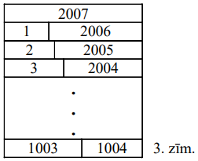

# <lo-sample/> LV.NOL.2007.5.2

Uz katras no $n$ kartiņām uzrakstīts pa naturālam skaitlim (starp tiem var būt arī vienādi). Zināms, ka vienlaicī̄i izpildās šādas īpašības:

- starp uzrakstītajiem skaitļiem ir vismaz $5$ dažādi,
- katrām divām kartiņām (apzīmēsim tās ar $A$ un $B$) var atrast divas citas 
  kartiņas (apzīmēsim tās ar $C$ un $D$) tā, ka to skaitļu summa, kas 
  uzrakstīti uz $A$ un $B$, vienāda ar to skaitļu summu, kas uzrakstititi uz 
  $C$ un $D$.
  
Pierādiet, ka mazākā iespējamā $n$ vērtība ir $13$.

<small>

* questionType:
* domain:

</small>

## Atrisinājums

Var ņemt, piemēram, $13$ kartiņas ar skaitļiem

$$1;\ 1;\ 1;\ 1;\ 2;\ 2;\ 3;\ 4;\ 4;\ 5;\ 5;\ 5;\ 5.$$

Parādīsim, ka $13$ ir mazākais iespējamais kartiņu skaits. Pieņemsim, ka $a$ un
$b$ - divi mazākie dažādi skaitļi, $a<b$. Tā kā summai $a+b$ jāizsakās vēl 
citādi, jābūt vēl pa vienam eksemplāram gan $a$, gan $b$. Lai summu $a+a$ 
varētu izsacīt ar citām kartiņām, jābūt vēl diviem $a$ eksemplāriem. Līdzīgi 
konstatē, ka lielākajai vērtībai $d$ jābūt vismaz uz $4$ kartiņām un otrai 
lielākajai vērtībai $c$ - vismaz uz $2$ kartiņām. Tā kā jābūt vismaz $5$ 
dažādiem skaitļiem, tad nepieciešama vēl $13.$ kartiņa.

# <lo-sample/> LV.NOL.2007.5.3

Kvadrāts sastāv no $6 \times 6$ vienādām kvadrātiskām rūtiņām. Vai dažas no tām
var nokrāsot melnas tā, lai katrā $3 \times 3$ rūtiņu kvadrātā būtu tieši divas
melnas rūtiņas?

<small>

* questionType:
* domain:

</small>

## Atrisinājums

Jā, var; skat., piem., 4.zīm.

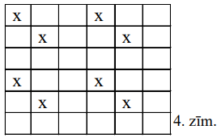

# <lo-sample/> LV.NOL.2007.5.4

Deju kolektīvā ir $5$ zēni un $5$ meitenes; visu bērnu augumi ir dažādi. Dejā 
"Alfa" bērni sadalīti $5$ pāros tā, ka katrā pārī zēns ir garāks par meiteni.

**(A)** Vai var gadīties, ka dejā "Beta" bērni sadalīit $5$ pāros tā, ka katrā 
pārī meitene garāka par zēnu?

**(B)** Vai var gadīties, ka dejā "Gamma" bērni sadalīti $5$ pāros tā, ka 
četros pāros meitene garāka par zēnu?

<small>

* questionType:
* domain:

</small>

## Atrisinājums

**(A)** Nē, nevar; neviena meitene nav garāka par visgarāko zēnu.

**(B)** jā, var; skat. sekojošo tabulu, kur doti augumi centimetros.

"Alfa"

| Zēni | Meitenes |
| :---: | :---: |
| $170$ | $169$ |
| $168$ | $167$ |
| $166$ | $165$ |
| $164$ | $163$ |
| $162$ | $161$ |

"Beta"

| Zēni | Meitenes |
| :---: | :---: |
| $170$ | $161$ |
| $168$ | $169$ |
| $166$ | $167$ |
| $164$ | $165$ |
| $162$ | $163$ |

# <lo-sample/> LV.NOL.2007.5.5

Atrodiet mazāko piecciparu naturālo skaitli, kam visi cipari dažādi un kas 
dalās ar $61$.

<small>

* questionType:
* domain:

</small>

## Atrisinājums

$\underline{Atbilde:}$ $10248$

$\underline{Risinājums:}$ mazākais piecciparu naturālais skaitlis, kam visi 
cipari ir dažādi, ir $10234$ (vispirms izvēlas iespējami mazu pirmo ciparu, 
tad - iespējami mazu otro utt.) Virzoties no $10234$ uz augšu, atbildi atrod 
mēģinājumu ceļā.

# <lo-sample/> LV.NOL.2007.6.1

Katrs no trim rūķīšiem Alfa, Beta un Gamma vai nu vienmēr melo, vai vienmēr 
runā patiesību. Kādu dienu profesors Ciparinš dzirdēja, ka viens no viņiem 
paziņo: "Alfa un Beta abi ir meli", bet otrs - "Beta un Gamma abi ir meļi" 
(profesors nedzirdēja, **kuri** rūķīši to sacīja). Cik starp $3$ rūķīšiem ir 
meļu?

<small>

* questionType:
* domain:

</small>

## Atrisinājums

$\underline{Atbilde:}$ divi meļi.

**(A)** Piemērs: Alfa un Beta - meļi, Gamma - patiess rūķītis; pirmo frāzi saka
Gamma, otro Alfa.

**(B)** ja meļu būtu ne vairāk par vienu, tad vismaz vienu no diviem 
izteicieniem ir teicis patiess rūķītis. Bet tad ir patiesība, ka meļu ir vismaz
divi - pretruna. Ja visi rūķīši būtu meļi, tad abas frāzes ir patiesas, un tās 
teikuši meļi - atkal pretruna.

# <lo-sample/> LV.NOL.2007.6.2

Tabulā ir divas rindas un $n$ kolonnas (skat. 1.zīm.)

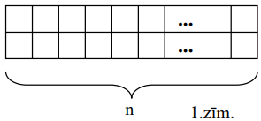

Katrā rindā jāieraksta visi naturālie skaitļi no $1$ līdz $n$ ieskaitot (katrs 
vienu reizi) tā, lai katrā kolonnā ierakstīto skaitļu summa būtu **kaut kāda** 
naturāla skaitļa reizinājums pašam ar sevi. Vai to var izdarīt, ja **(A)** 
$n=11$, **(B)** $n=13$?

<small>

* questionType:
* domain:

</small>

## Atrisinājums

**(A)** Nē. Vienā kolonnā ar $4$ var atrasties tikai $5$, un vienā kolonā ar 
$11$ arī var atrasties tikai $5$. Bet $5$ nevar reizē atrasties $2$ kolonnās.

**(B)** jā, skat. 5.zīm.

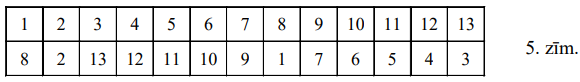

# <lo-sample/> LV.NOL.2007.6.3

Andrim ir figūriņas, kas sastāv no vienādiem kvadrātiņiem (skat. 2.zīm.) - pa 
$10$ katra veida.

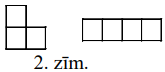

Vai viņš var salikt kvadrātu ar izmēriem $7 \times 7$ rūtiņas, izmantojot 
**(A)** tieši $12$ figūriņas, **(B)** tieši $14$ figūriņas? Figūriņas savā 
starpā nedrīkst pārklāties.

<small>

* questionType:
* domain:

</small>

## Atrisinājums

**(A)** Nē; $12$ figūriņām ir pats lielākais $12 \cdot 4=48<7 \cdot 7$ rūtiņas;

**(B)** jā, skat., piem., 6.zīm.

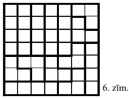

# <lo-sample/> LV.NOL.2007.6.4

Vai eksistē desmitciparu naturāls skaitlis, kura visi cipari ir dažādi un kuru 
var iegūt, sareizinot savā starpā vairākus divniekus, pieciniekus un 
septītniekus?

<small>

* questionType:
* domain:

</small>

## Atrisinājums

Nē, neeksistē. Tāda skaitļa ciparu summa ir $45$, tātad tas dalās ar 
$9=3 \cdot 3$; bet starp tā pirmreizinātājiem nav neviena trijnieka.

# <lo-sample/> LV.NOL.2007.6.5

Veikalā pārdeva $5$ dažādu nosaukumu saldos sieriņus; visas $5$ cenas bija 
dažādas. Gunārs, Dzintars un Maija katrs nopirka trīs dažādu nosaukumu 
sieriņus; visi trīs bērni samaksāja vienu un to pašu naudas summu. Pierādīt: 
vismaz divi no bērniem nopirka vienu un to pašu nosaukumu sieriņus.

<small>

* questionType:
* domain:

</small>

## Atrisinājums

Pierādīsim vispirms, ka ir divi bērni, kam sakrīt vismaz divu nopirkto sieriņu 
nosaukumi (šis fakts neizmantos to, ka visi samaksāja vienādus naudas 
daudzumus). Ja Gunāram un Dzintaram nav divu kopēju nosaukumu sieriņu, tad pa 
abiem viņiem ir visu nosaukumu sieriņi, tātad arī visu trīs Maijas nopirkto 
nosaukumu sieriņi. Tāpēc no trim Maijas nosaukumiem vismaz diviem ir jābūt arī 
Gunāram vai Dzintaram (pretējā gadījumā Maijai varētu būt augstākais divu 
nosaukumu sieriņi).

Apskatīsim tos bērnus, kam divi sieriņu nosaukumi sakrīt. Tā kā sakrīt arī viņu
samaksātās naudas summas, tad par trešo sieriņu viņi samaksājuši vienādus 
naudas daudzumus; tā kā visas cenas ir dažādas, tad sakrīt arī trešo viņu 
nopirkto sieriņu nosaukumi.

# <lo-sample/> LV.NOL.2007.7.1

Kurus naturālos skaitļus $n$ var izsacīt formā $n=\frac{x}{y}$, kur 
$x=a^{5},\ y=b^{3}$, $a$ un $b$ - naturāli skaitļi?

<small>

* questionType:
* domain:

</small>

## Atrisinājums

Jebkuru: $n=n^{10}:n^{9}=\left(n^{2}\right)^{5}:\left(n^{3}\right)^{3}$

# <lo-sample/> LV.NOL.2007.7.2

Rindā uzrakstīti $13$ veseli skaitļi (starp tiem var būt arī vienādi), kuru 
summa ir pozitīva. Katru $3$ pēc kārtas uzrakstīto skaitļu summa ir negatīva.

**(A)** parādīt kaut vienu piemēru, kā to izdarīt,

**(B)** pierādīt: vismaz $5$ no uzrakstītajiem skaitļiem ir pozitīvi.

<small>

* questionType:
* domain:

</small>

## Atrisinājums

**(A)** $7;\ -4;\ -4;\ 7;\ -4;\ -4;\ 7;\ -4;\ -4;\ 7;\ -4;\ -4;\ 7$

**(B)** pozitīviem jābūt skaitļiem $1.,\ 4.,\ 7.,\ 10.,\ 13.$ pozīcijās. Uz 
katru pusi no katra no šiem skaitļiem esošo citu skaitļu skaits dalās ar $3$; 
sadalot tos grupās pa $3$, iegūstam, ka uz katru pusi no katra no šiem 
skaitļiem $A$ esošo skaitļu summa ir negatīva. Lai visu skaitļu summa būtu 
pozitīva, jābūt $A>0$.

# <lo-sample/> LV.NOL.2007.7.3

Kvadrāts sastāv no $6 \times 6$ rūtiņām. Vai var dažas no tām izkrāsot melnas 
tā, lai vienlaicīgi būtu apmierinātas šādas prasības:

**(A)** katrā rindiņā un katrā kolonnā ir tieši $4$ melnas rūtiņas,

**(B)** no katras melnas rūtiņas var aiziet uz katru citu melnu rūtiņu, ar 
katru soli šķērsojot kādu divu melnu rūtiņu kopējo malu?

<small>

* questionType:
* domain:

</small>

## Atrisinājums

Jā, var. Skat., piem., 7.zīm.

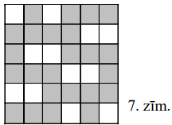

# <lo-sample/> LV.NOL.2007.7.4

Kuri naturālie skaitļi ir vienādi ar trīs savu dažādu pozitīvu dalītāju summu?

<small>

* questionType:
* domain:

</small>

## Atrisinājums

Meklējamo skaitli apzīmēsim ar $n$. Tā iespējami pozitīvie dalītāji (dilstošā 
secībā) ir $n; \frac{n}{2}; \frac{n}{3}; \frac{n}{4}; \ldots$

Skaidrs, ka neviens no apskatāmajiem $3$ dažādajiem dalītājiem nevar būt $n$. 
Ja lielākais no tiem nav $\frac{n}{2}$, tad to summa nepārsniedz 
$\frac{n}{3}+\frac{n}{4}+\frac{n}{5}<n$, un tā nevar būt. Tāpēc viens no $3$ 
dalītājiem ir $\frac{n}{2}$, un abu pārējo summa ir $\frac{n}{2}$. Ja lielākais
no šiem abiem pārējiem ir $\frac{n}{3}$, tad trešais ir 
$\frac{n}{2}-\frac{n}{3}=\frac{n}{6}$. Ja lielākais no šiem abiem pārējiem ir 
mazāks par $\frac{n}{3}$, tad to summa nepārsniedz 
$\frac{n}{4}+\frac{n}{5}<\frac{n}{2}$, un tā nevar būt.

Tāpēc vienīgā iespēja ir, ka šie dalītāji ir $\frac{n}{2}, \frac{n}{3}$ un 
$\frac{n}{6}$. Lai tādi dalītāji eksistētu, nepieciešams un pietiekams, lai $n$
dalītos ar $6$.

# <lo-sample/> LV.NOL.2007.7.5

Profesoram Cipariņam ir $10$ monētas; tieši $2$ no tām ir viltotas, bet viņš 
nezina, kuras. Cipariņš pazīst burvi, kuram vienā reizē var iedot pārbaudīt $3$
monētas; pēc pārbaudes burvis atdod monētas atpakaļ un klusējot norāda uz vienu
no tām. Ir zināms: burvis nenorāda uz īstu monētu, ja starp viņam iedotajām 
trim monētām ir kaut viena viltota. Kā ar $4$ pārbaudēm Cipariņš var garantēti 
noskaidrot vismaz vienu viltoto monētu?

<small>

* questionType:
* domain:

</small>

## Atrisinājums

Var riņķoties, piemēram, šādi:

1. Iedodam burvim $3$ monētas; to, uz kuru viņš norāda, apzīmējam ar $A$, 
   pārējās - ar $B$ un $C$.
2. Iedodam burvim $3$ citas monētas; to, uz kuru viņš norāda, apzīmējam ar $D$,
   pārējās - ar $E$ un $F$.
3. Iedodam burvim $3$ citas monētas; to, uz kuru viņš norāda, apzīmējam ar $G$,
   pārējās - ar $H$ un $I$.
4. Iedodam burvim $A,\ D,\ G$. Pieņemsim, ka viņš norāda uz $A$ (citus 
   gadījumus analizē tieši tāpat).
   
**Pierādīsim, ka $\mathbf{A}$ ir viltota.** Tiešām, vismaz viena viltota monēta
starp jau pārbaudītajām deviņām ir. Tāpēc vismaz viena no $A,\ D,\ G$ ir 
viltota; tāpēc $A$ ir viltota.

# <lo-sample/> LV.NOL.2007.8.1

Kontroldarbu latviešu valodā rakstīja $50$ pirmklasnieki. Daži no viņiem zina 
visus burtus, izņemot " $l$ ", kuru rakstot izlaiž; pārēie zina visus burtus, 
izņemot " $d$ ", kuru rakstot izlaiž. Skolotājs lūdza $10$ skolēniem uzrakstīt 
vārdu "gads", citiem $18$ skolēniem - vārdu "gals", pārējiem skolēniem - vārdu 
"galds". Vārdus "gads" un "gals" uzrakstīja pa $15$ skolēniem katru. Cik 
skolēni pareizi izpildīja sev doto uzdevumu?

<small>

* questionType:
* domain:

</small>

## Atrisinājums

Skolēni, kas uzrakstīja "gas", visi kļūdījās. Daži no $22$ skolniekiem, kam 
bija jāraksta "galds", uzrakstīa "gals", pārējie - "gads". Tātad no $15+15=30$ 
atbildēm "gads" un "gals" $22$ atbildes ir nepareizas, bet $30-22=8$ atbildes -
pareizas.

# <lo-sample/> LV.NOL.2007.8.2

Atrisināt vienādojumu

$$x^{3}\left(x^{2}-7\right)^{2}-36x=0$$

<small>

* questionType:
* domain:

</small>

## Atrisinājums

Ar ekvivalentiem pārveidojumiem vienādojums pārveidojas par 
$x\left(x^{2}-1\right)\left(x^{2}-4\right)\left(x^{2}-9\right)=0$. Tāpēc 
atrisinājuma kopa ir $\{0; \pm 1; \pm 2; \pm 3\}$.

# <lo-sample/> LV.NOL.2007.8.3

Trijstūra $ABC$ iekšpusē atrodas punkts $O$. Vai var būt, ka vienlaicīgi 
$\sphericalangle OAB=\sphericalangle OBA,\ \sphericalangle OBC=\sphericalangle OCB$
un $\sphericalangle OCA=\sphericalangle OAC$?

<small>

* questionType:
* domain:

</small>

## Atrisinājums

**Atbilde:** nē, nevar.

**Risinājums:** trijstūrī pret lielāku malu atrodas lielāks leņķis. Tāpēc no 
uzdevumā minētajām sakarībām, apskatot 
$\triangle AOB, \triangle BOC, \triangle COA$, sekotu $OB>OA,\ OC>OB,\ OA>OC$, 
no kā seko $OB>OB$ - pretruna.

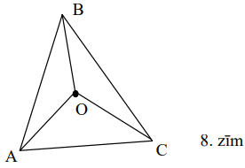

# <lo-sample/> LV.NOL.2007.8.4

Atrast mazāko naturālo skaitli, kas dalās ar katru no kaut kādiem $12$ pēc 
kārtas ņemtiem naturāliem skaitļiem.

<small>

* questionType:
* domain:

</small>

## Atrisinājums

No $12$ pēc kārtas ņemtiem naturāliem skaitļiem vismaz viens dalās ar $5$, 
vismaz viens - ar $7$, vismaz viens - ar $8$, vismaz viens - ar $9$ un vismaz 
viens - ar $11$. Meklējamajam skaitlim $A$ jādalās ar $5;\ 7;\ 8;\ 9;\ 11$. Tā 
kā šie skaitļi ir pa pāriem savstarpēji pirmskaitļi, tad $A$ jādalās ar to 
reizinājumu $5 \cdot 7 \cdot 8 \cdot 9 \cdot 11=27720$. Tātad $A \geq 27720$. 
Skaidrs, ka skaitlis $27720$ dalās ar $1;\ 2;\ 3;\ \ldots;\ 11;\ 12$. Tātad 
meklējamais skaitlis ir $27720$.

# <lo-sample/> LV.NOL.2007.8.5

Kvadrāts sastāv no $100 \times 100$ vienādām kvadrātiskām rūtiņām, kas 
izkrāsotas šaha galdiņa kārtībā. Griežot pa rūtiņu līnijām, tas sagriezts 
mazākos kvadrātos ar nepāra skaita rūtiņām katrā. Pierādiet: no šo kvadrātu 
centrālajām rūtiņām tieši puse ir baltas un puse - melnas. (Ja kvadrāts sastāv 
no $1$ rūtiņas, tad šo vienīgo rūtiņu uzskata par tā centrālo).

<small>

* questionType:
* domain:

</small>

## Atrisinājums

Katrā griežot iegūtajā kvadrātā vienas krāsas rūtiņu ir par $1$ vairāk nekā 
otras krāsas rūtiņu, un vairākums rūtiņu ir tajā krāsā, kurā ir centrālā 
rūtiņa. "Vairākumu nodrošinošo" balto rūtiņu jābūt tikpat, cik "vairākumu 
nodrošinošo" melno rūtiņu, jo lielajā kvadrātā melno un balto rūtiņu ir vienāds
daudzums.

# <lo-sample/> LV.NOL.2007.9.1

Kāda var būt četru tādu divciparu pirmskaitļu summa, kas sastādīti no cipariem 
$1;\ 2;\ 3;\ 4;\ 5;\ 6;\ 7;\ 9$, izmantojot katru no tiem tieši vienu reizi?

<small>

* questionType:
* domain:

</small>

## Atrisinājums

Šādi pirmskaitļi var būt, piemēram, $23;\ 41;\ 59;\ 67$. To summa ir $190$. Tā 
nevar būt citāda, jo cipari $2;\ 4;\ 5;\ 6$ nevar būt saskaitāmo pirmskaitļu 
vienu cipari; tāpēc tie ir desmitu cipari, un meklējamā summa noteikti ir 
$10(2+4+5+6)+(1+3+7+9)=10 \cdot 17+20=190$.

# <lo-sample/> LV.NOL.2007.9.2

Dots, ka $3 \leq x \leq 6$ un $3 \leq y \leq 6$. Pierādīt, ka 
$2x^{2}+2y^{2} \leq 5xy$.

<small>

* questionType:
* domain:

</small>

## Atrisinājums

Pierādāmo nevienādību viegli pārveidot par $(x-2y)(2x-y) \leq 0$ un tālāk par 
$\left(\frac{x}{y}-\frac{1}{2}\right)\left(\frac{x}{y}-2\right) \leq 0$, kas ir
acīmredzami.

# <lo-sample/> LV.NOL.2007.9.3

Taisnleņķa trijstūrī $ABC\left(\sphericalangle ACB=90^{\circ}\right)$ novilkta 
mediāna $CM$. Riņķa līnija, kas ievilkta $\triangle ACM$, pieskaras $AC$ un 
$AM$ attiecīgi punktos $X$ un $Y$; dots, ka $XY \parallel CM$. Aprēķināt 
$\triangle ABC$ leņķu lielumus.

<small>

* questionType:
* domain:

</small>

## Atrisinājums

Mediāna pret hipotenūzu vienāda ar pusi no hipotenūzas, tāpēc $MA=MC$. Tā kā 
$\triangle AMC \sim \triangle AYX$, tad $YA=YX$. Pieskaru vienādības dēļ 
$YA=XA$. Tāpēc $\Delta AYX$ ir regulārs, $\sphericalangle A=60^{\circ}$ un 
$\sphericalangle B=30^{\circ}$.

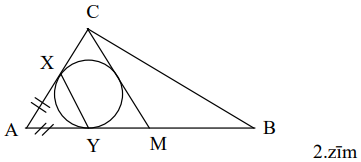

# <lo-sample/> LV.NOL.2007.9.4

Ceļu policijas vienībā ir $7$ policisti. Katru vakaru dežurēt dodas $3$ no 
tiem. Pēc kāda laika izrādījās, ka katri divi policisti kopā dežurējuši tieši 
$n$ reizes.

**(A)** atrodiet kaut vienu iespējamu $n$ vērtību,

**(B)** vai var būt, ka $n=3$?

<small>

* questionType:
* domain:

</small>

## Atrisinājums

**(A)** Ja visi iespējamie policistu trijnieki ir nodežurējuši pa vienai 
reizei, tad katrs pāris ir dežurējis kopā ar pieciem citiem policistiem; tātad 
var būt $n=5$.

**(B)** attēlosim policistus ar regulāra $7$-stūra virsotnēm. Ja pa reizei 
dežurēs visi tie policistu trijnieki, kuru atbilstošās virsotnes veido 
vienādsānu trijstūri, iegūsim situāciju ar $n=3$.

# <lo-sample/> LV.NOL.2007.9.5

Kvadrāts sastāv no $10 \times 10$ rūtiņām. Katrā rūtiņā ierakstīts naturāls 
skaitlis, kas nepārsniedz $10$. Ja divām rūtiņām ir kopēja mala vai kopējs 
stūris, tad tajās ierakstīto skaitļu lielākais kopīgais dalītājs ir $1$.

**(A)** pierādīt, ka kāds skaitlis ierakstīts vismaz $15$ rūtiņās,

**(B)** pierādīt, ka kāds skaitlis ierakstīts vismaz $17$ rūtiņās.

<small>

* questionType:
* domain:

</small>

## Atrisinājums

Katrā $2 \times 2$ rūtiņu kvadrātā var būt ne vairāk kā viens pāra skaitlis. 
Tātad nepāra skaitļi ierakstīti vismaz $25 \times 3=75$ reizes. Tā kā to 
pavisam ir pieci, iegūstam (A) risinājumu.

Katrā $2 \times 2$ rūtiņu kvadrātā var būt ne vairāk kā viens no skaitļiem 
$3;6;9$. Tāpēc katrā $2 \times 2$ rūtiņu kvadrātā ir vismaz $2$ skaitļi no 
kopas $\{1; 5; 7\}$; tātad to pavisam ir vismaz $50$. Tā kā $3 \cdot 16<50$, 
iegūstam (B) risinājumu.

# <lo-sample/> LV.NOL.2007.10.1

Ir $2006$ pēc ārējā izskata vienādas monētas. Dažas (vismaz viena) ir īstas un 
dažas (vismaz viena) ir viltotas. Visām īstajām monētām ir vienādas masas; arī 
visām viltotajām monētām ir vienādas masas. Viltotās monētas ir vieglākas par 
īstajām. Kā, izmantojot sviras svarus bez atsvariem, ar $1004$ svēršanām 
noskaidrot, cik ir viltoto monētu?

<small>

* questionType:
* domain:

</small>

## Atrisinājums

Salīdzinām divas monētas $A$ un $B$. Pastāv divas iespējas.

1. $A$ un $B$ ir dažādas masas. Tad viena no tām ir viltota, otra - īsta. 
   Sadalām atlikušās $2004$ monētas $1002$ pāros un katru no tiem salīdzinām ar
   pāri ($A,\ B$). Katrā svēršanā mēs noskaidrosim, cik viltoto monētu ir 
   konkrētajā pārī. Pavisam tiks izmantotas $1+1002=1003$ svēršanas.
2. $A$ un $B$ ir vienādas masas. Kā iepriekš salīdzinām pāri $(A,\ B)$ ar 
   citiem monētu pāriem, kamēr atrodam pāri ($C,\ D$), kura masa atšķiras no 
   ($A,\ B$) masas. Pieņemsim, ka ($C,\ D$) kopējā masa ir mazāka nekā 
   ($A,\ B$) kopējā masa (otrs gadījums ir "simetrisks"). Tad $A$ un $B$, kā 
   arī visas citas līdz šim svērtās monētas ir īstas. Salīdzinām $C$ un $D$. 
   Rezultātā mēs atrodam vismaz vienu monētu no pāra ($C,\ D$), kura ir 
   viltota. Tagad izveidojam pāri (īsta monēta, viltota monēta) un turpinām kā 
   $1.$ gadījumā. Pavisam tiks izmantotas $1+1002+1=1004$ svēršanas.

# <lo-sample/> LV.NOL.2007.10.2

Kvadrāts sastāv no $n \times n$ rūtiņām, $n \geqq 3$. Pierādīt, ka katru rūtiņu
var nokrāsot baltu, melnu vai sarkanu tā, lai izpildītos īpašība: katrai 
rūtiņai $x$ eksistē tādas divas kaiminu rūtiņas $y$ un $z$, ka $x$, $y$ un $z$ 
visas nokrāsotas dažādās krāsās. (Divas rūtiņas sauc par kaimiņu rūtiņām, ja 
tām ir kopēja mala.)

<small>

* questionType:
* domain:

</small>

## Atrisinājums

Pie nepāra $n$ to var izdarīt, piemēram, šādi: $2; 4; 6; \ldots$ rindās visas 
rūtiņas nokrāso melnas, bet pērējās rindās visas rūtiņas nokrāso šādi: $1.$ 
rindā $bsbs\ldots$, $3.$ rindā $sbsb\ldots$, $5.$ rindā $bsbs\ldots$, $7.$ 
rindā $sbsb\ldots$ utt. Pie $n=4$ var būt, piemēram, 3.zīm.

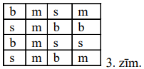

Ja $n$ - pāra skaitlis, kas dalās ar $4$, kvadrātu sadala $4 \times 4$ rūtiņu 
kvadrātos un izmanto 3.zīm. redzamo krāsojumu.

Ja $n$ - pāra skaitlis, kas nedalās ar $4$, kvadrātu sadala četros vienādos 
kvadrātos ar nepāra skaitu rūtiņu katrā un izmanto sākumā minēto krāsojumu.

# <lo-sample/> LV.NOL.2007.10.3

Sauksim naturālu skaitli $n>1$ par labu, ja visus tā pozitīvos dalītājus var 
sadalīt divās daļās, kuru summas ir vienādas.

**(A)** atrodiet kaut vienu labu skaitli, kas lielāks par $10$,

**(B)** vai eksistē labi skaitli, kas lielāki par $20072007$?

<small>

* questionType:
* domain:

</small>

## Atrisinājums

**(A)** piemēram, $n=30$; dalītāju grupas ir $1+2+3+5+10+15=6+30$.

**(B)** ja $p$ - "pietiekami liels" pirmskaitlis, apskatām skaitli $6p$. 
Dalītāju grupas ir $1+2+3+p+2p+3p=6+6p$.

# <lo-sample/> LV.NOL.2007.10.4

Taisnleņķa trapecē 
$ABCD\left(\sphericalangle A=\sphericalangle B=90^{\circ}\right.$) diagonāles 
krustojas punktā $S$. Punkts $M$ atrodas uz nogriežņa $AB$ un $SM \perp AB$. 
Pierādīt, ka $\sphericalangle CMS=\sphericalangle DMS$.

<small>

* questionType:
* domain:

</small>

## Atrisinājums

Skaidrs, ka $\triangle BSC \sim \triangle DSA$ (atbilstošie leņķi vienādi kā 
krustleņķi un kā iekšējie šķērsleņķi pie paralēlām taisnēm). Līdzīgos 
trijstūros augstumu attiecība vienāda ar atbilstošo malu attiecību, tāpēc 
$BC:DA=BM:AM$. Tāpēc $\triangle CBM \sim \triangle DAM$, un iegūstam 
$\sphericalangle BCM=\sphericalangle ADM$. Tad 
$\sphericalangle CMS=\sphericalangle BCM=\sphericalangle ADM=\sphericalangle DMS$,
k.b.j.

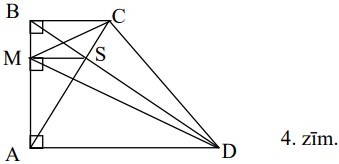

# <lo-sample/> LV.NOL.2007.10.5

Dots, ka $f(x)=x^{2}+8x+12$. Atrisināt vienādojumu $f(f(f(x)))=0$.

<small>

* questionType:
* domain:

</small>

## Atrisinājums

Ievērosim, ka $f(x)=(x+4)^{2}-4$. Tāpēc 
$f(f(x))=\left((x+4)^{2}-4+4\right)^{2}-4=(x+4)^{4}-4$ un 
$f(f(f(x)))=\left((x+4)^{4}-4+4\right)^{2}-4=(x+4)^{8}-4$.

Risinot vienādojumu $(x+4)^{8}-4=0$, iegūstam

$(x+4)^{8}=4$

$x+4= \pm \sqrt[4]{2}$

$x=-4 \pm \sqrt[4]{2}$

# <lo-sample/> LV.NOL.2007.11.1

Atrisināt naturālos skaitļos vienādojumu

$$x^{2}+3x=2^{y}$$

<small>

* questionType:
* domain:

</small>

## Atrisinājums

Pārveidojam vienādojumu par $x(x+3)=2^{y}$. Ja $x$ - pāra skaitlis, tad $x+3$ -
nepāra skaitlis, kas lielāks par $1$, tātad dalās ar kādu nepāra pirmskaitli; 
tad $x(x+3)$ nevar būt vienāds ar $2^{y}$ saskaņā ar aritmētikas pamatteorēmu. 
Līdzīgi nevar būt, ka $x>1$ un $x$ - nepāra skaitlis. Pārbaudot $x=1$, redzam, 
ka $y=2$. Tātad $(x; y)=(1; 2)$ ir vienīgais atrisinājums.

# <lo-sample/> LV.NOL.2007.11.2

Kādā klasē ir $n$ zēni un $n$ meitenes. Katrai meitenei patīk $x$ zēni. Katram 
zēnam patīk $y$ meitenes. Pierādīt, ka:

**(A)** ja $x+y>n$, tad noteikti var atrast tādu zēnu un tādu meiteni, kas 
patīk viens otram,

**(B)** ja $x+y \leq n$, tad var gadīties, ka šādu zēnu un meiteni atrast 
neizdodas.

<small>

* questionType:
* domain:

</small>

## Atrisinājums

**(A)** Pieņemsim, ka tāda pāra nav. Lūgsim katram zēnam uzrakstīt $y$ dažādas 
kartītes - katru ar savu vārdu un kādu tās meitenes vārdu, kas viņam patīk. 
Līdzīgu darbu lūgsim izdarīt meitenēm. Tā kā savstarpēju simpātiju nav, tad nav
divu kartīšu, uz kurām būtu vienādi uzraksti; tāpēc kartīšu nav vairāk par 
$n \cdot n=n^{2}$. No otras puses, kartīšu ir 
$x \cdot n+y \cdot n=(x+y) \cdot n>n \cdot n=n^{2}$ - pretruna.

**(B)** Attēlosim meitenes ar punktiem riņķa līnijas iekšpusē, bet zēnus - ar 
punktiem riņķa linijas ārpusē (skat. 5.zīm., kur $n=9$).

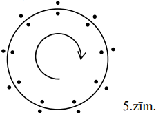

Ja katrai meitenei patīk $x$ zēni pulksteņa rādītāja kustības virzienā, sākot 
ar to, kurš stāv viņai blakus, bet katram zēnam - $y$ meitenes pulksteņa 
rādītāja kustības virzienā, sākot ar to, kura stāv viņam vienu pozīciju 
priekšā, tad savstarpēju simpātiju nav.

# <lo-sample/> LV.NOL.2007.11.3

Vai eksistē $3$ kvadrāttrinomi ar īpašību: lai kā arī apzīmētu vienu no tiem ar
$f_{1}(x)$, otru ar $f_{2}(x)$ un trešo ar $f_{3}(x)$, atradīsies tāds skaitlis
$a$, ka $f_{1}(a)<f_{2}(a)<f_{3}(a)$?

<small>

* questionType:
* domain:

</small>

## Atrisinājums

Jā, eksistē. Pietiek, ka to grafiki krustojas tā, kā parādīts 6.zīm. Šādā 
risinājumā nepieciešams, lai vai nu tiktu uzrādīti konkrēti trinomi, vai arī 
pamatots, kāpēc tāds zīmējums ir izveidojams (jo principā varētu gadīties, ka 
zīmējumā parādītā krustošānās nav iespējama).

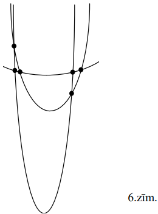

# <lo-sample/> LV.NOL.2007.11.4

Šaurleņķu trijstūrī $ABC$ novilkti augstumi $AX$ un $CY$; malas $AC$ 
viduspunkts ir $M$. Uz augstuma $AX $atzīmēts tāds punkts $Z$, ka $Y=ZX$. 
Pierādīt, ka punkti $A;\ Y;\ Z;\ M$ atrodas uz vienas riņķa līnijas.

<small>

* questionType:
* domain:

</small>

## Atrisinājums

Tā kā $\sphericalangle AYC=90^{\circ}=\sphericalangle AXC$, tad ap $AYXC$ var 
apvilkt riņķa līniju; tāpēc $\sphericalangle ACY=\sphericalangle AXY$ kā 
ievilkti leņķi, kas balstās uz vienu un to pašu loku.

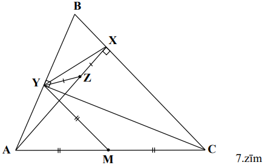

Apzīmēsim $\sphericalangle ACY=\sphericalangle AXY=\varphi$. Izmantojot 
trijstūra leņķu summu, viegli iegūt, ka $\sphericalangle AMY=2 \varphi$ un 
$\sphericalangle AZY=2 \varphi$, tātad 
$\sphericalangle AMY=\sphericalangle AZY$. No šejienes seko vajadzīgais.

# <lo-sample/> LV.NOL.2007.11.5

Rindā izrakstīti $6$ pozitīvi skaitļi; pirmais no tiem ir $1$, sestais ir $6$. 
Par šo rindu ir zināms: ja skaitļi $x,\ y,\ z$ atrodas tajā viens aiz otra 
tieši šādā secībā, tad $y=\frac{2xz}{x+z}$.

Kādi skaitļi izrakstīti rindā?

<small>

* questionType:
* domain:

</small>

## Atrisinājums

Doto vienādību varam ekvivalenti pārveidot par 
$\frac{1}{y}=\frac{\frac{1}{x}+\frac{1}{z}}{2}$. Tātad dotajiem skaitļiem 
apgrieztie skaitļi veido aritmētisku progresiju; acīmredzami šī progresija ir 
$1; \frac{5}{6}; \frac{4}{6}; \frac{3}{6}$; $\frac{2}{6}; \frac{1}{6}$, un paši
skaitļi ir $1; \frac{6}{5}; \frac{3}{2}; 2; 3; 6$.

# <lo-sample/> LV.NOL.2007.12.1

Skaitļi $a_{1};\ a_{2};\ a_{3};\ a_{4}$ šādā secībā veido ģeometrisku 
progresiju, kuras visi locekļi ir dažādi; $f(x)$ ir kvadrāttrinoms. Vai var 
vienlaicīgi pastāvēt vienādības $f\left(a_{1}\right)=a_{2}$, 
$f\left(a_{2}\right)=a_{3}, f\left(a_{3}\right)=a_{4}$?

Vai var vienlaicīgi pastāvēt tikai divas no šīm vienādībām?

<small>

* questionType:
* domain:

</small>

## Atrisinājums

Ja $a_{1}=1;\ a_{2}=2;\ a_{3}=4;\ a_{4}=8$ un $f(x)=x^{2}-x+2$, no minētajām 
vienādībām pastāv tikai pirmās divas. Visas šīs vienādības nevar vienlaicīgi 
pastāvēt. Ja tā būtu, tad kvadrātvienādojumam $f(x)-q \cdot x=0$ ($q$ - 
progresijas kvocients) būtu $3$ dažādas saknes $a_{1},\ a_{2},\ a_{3}$, bet tas
nevar būt.

# <lo-sample/> LV.NOL.2007.12.2

Pa apli izvietotas $n$ spuldzes; sākotnēji tās visas ir izslēgtas. Viena 
spuldze apzīmēta ar $S$. Atrodam visus skaitļa $n$ pozitīvos dalītājus, 
ieskaitot $1$ un $n$. Katram šādam dalītājam $d$ veicam sekojošu operāciju: 
mainām katras $d$-tās spuldzes stāvokli (sākot ar spuldzi $S$), pavisam izdarot
$n$ maiņas. (Piemēram, ja 1.zīm. attēlotajā situācijā pie $n=6$ nemts dalītājs 
$d=3$, tad pakāpeniski mainīsim spuldžu $S;\ C;\ S;\ C;\ S;\ C$ stāvokļus.)

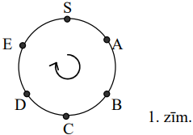

Kurām $n$ vērtībām, beidzot šīs darbības, visas spuldzes būs ieslēgtas?

<small>

* questionType:
* domain:

</small>

## Atrisinājums

**Atbilde:** $n=2^{k},\ k=0;\ 1;\ 2;\ \ldots$.

**Risinājums.** Ja $k=0$, tad $n=1$; vienīgā spuldze tiek ieslēgta, un tālāk 
nekas netiek darīts. Pie $n=2^{k}$, $k \in N$, katram no dalītājiem 
$d=2;\ 4;\ 8;\ \ldots;\ 2^{k-1};\ 2^{k}$ atbilstošā maiņu sērija skar katru 
spuldzi $0$ vai $d$ reizes (tātad kopumā neietekmē tās stāvokli), kamēr 
dalītājam $1$ atbilstošā sērija maina katras spuldzes stāvokli $1$ reizi. Tāpēc
beigās visas spuldzes būs ieslēgtas.

Ja turpretī skaitlim $n$ ir kāds nepāra pirmskaitlis $p$, ar kuru $n$ dalās, 
tad $(p+1)$-ā spuldze (uzskatot $S$ par pirmo spuldzi) tiks "aizskārta" tieši 
divas reizes (sērijās, kas atbilst $n$ dalītājiem $1$ un $p$) un tāpēc beigās 
paliks izslēgta.

# <lo-sample/> LV.NOL.2007.12.3

Kādiem naturāliem skaitļiem $n$ vienlaicīgi piemīt sekojošas īpašības:

**(A)** $n-1$ un $n+1$ ir pirmskaitļi,

**(B)** skaitļa $n$ visu naturālo dalītāju summa (ieskaitot $1$ un $n$) ir 
$2n$?

<small>

* questionType:
* domain:

</small>

## Atrisinājums

Tieša pārbaude parāda, ka neder $n=1;\ 2;\ 3;\ 4;\ 5$, tātad $n \geq 6$. Ja 
$n$, dalot ar $3$, dod atlikumu $1$ resp. $2$, tad $n-1$ resp. $n+1$ nav 
pirmskaitlis. Tāpēc $n$ dalās ar $3$. Ja $n$-nepāra skaitlis, tad $n-1$ un 
$n+1$ nav pirmskaitļi, tāpēc $n$ dalās ar $2$. Tātad $n$ dalās ar $6$. Tad $n$ 
ir dalītāji $1;\ \frac{n}{6};\ \frac{n}{2};\ \frac{n}{3}; n$. Bet 
$\frac{n}{6}+\frac{n}{2}+\frac{n}{3}+n=2n$. Saskaņā ar uzdevuma nosacījumiem 
$1$ jābūt vienam no skaitļiem $\frac{n}{6};\ \frac{n}{2};\ \frac{n}{3};\ n$. 
Mums der tikai $1=\frac{n}{6}$; tad $n=6$. Pārbaude parāda, ka šī vērtība der.

# <lo-sample/> LV.NOL.2007.12.4

Trijstūra $ABC$ leņķa $A$ bisektrise krusto malas $AB$ vidusperpendikulu punktā
$X$, malas $AC$ vidusperpendikulu punktā $Y$, bet $\triangle ABC$ apvilkto 
riņķa līniju punktā $Z$. Punkti $A,\ X,\ Y,\ Z$ atrodas uz bisektrises šajā 
secībā. Pierādiet, ka $AX=YZ$.

<small>

* questionType:
* domain:

</small>

## Atrisinājums

Tā kā $AX=BX$, mums pietiek pierādīt, ka $BX=YZ$. Tas būs pierādīts, ja 
iegūsim, ka $\Delta CZY=\Delta ZBX$. Bet tā tas ir, jo (1) $CZ=ZB$ kā hordas, 
kas savelk vienādus lokus ($UCZ=UZB$, jo uz tiem balstās vienādi ievilktie 
leņķi $CAZ$ un $ZAB$);

(2) $\sphericalangle CYZ=2 \sphericalangle CAY=\sphericalangle CAB$ (ārējais 
leņķis $\triangle CYA$); līdzīgi $\sphericalangle ZXB=\sphericalangle CAB$. 
Tātad $\sphericalangle CYZ=\sphericalangle ZXB$;

(3) 
$\sphericalangle CZY=\sphericalangle CZA=\sphericalangle CBA=\sphericalangle ZBX$.

No (2) un (3) seko, ka $\Delta CZY \sim \triangle ZBX$. Tas kopā ar $CZ=ZB$ dod
vajadzīgo trijstūru vienādību.

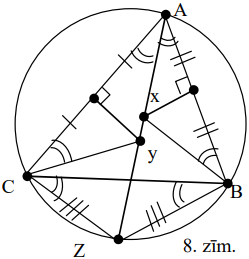

# <lo-sample/> LV.NOL.2007.12.5

Kvadrāts sastāv no $12 \times 12$ rūtiņām, kas izkrāsotas melnas un baltas šaha
galdiņa kārtībā. Ar vienu gājienu var izvēlēties divas rūtiņas, kam ir kopīga 
mala, un pārkrāsot tās: melnu - par sarkanu, sarkanu - par baltu, baltu - par 
melnu. Ar kādu mazāko gājienu skaitu var panākt, lai vienlaicīgi visas 
sākotnēji melnās rūtiņas būtu baltas, bet visas sākotnēji baltās rūtiņas - 
melnas?

<small>

* questionType:
* domain:

</small>

## Atrisinājums

**Atbilde:** ar $144$ gājieniem.

**Risinājums.** Sākumā ir $72$ melnas rūtiņas. Lai melnu rūtiņu pārveidotu par 
baltu, tās krāsa jāmaina divas reizes. Tā kā sākotnēji melnajām rūtiņām nav 
kopīgu malu, tad ar vienu gājienu var skart tikai vienu sākotnēji melno rūtiņu.
Tāpēc nepieciešami vismaz $72 \cdot 2=144$ gājieni.

Parādīsim, ka ar $144$ gājieniem pietiek. Sadalīsim kvadrātu $24$ taisnstūros 
ar izmēriem $2 \times 3$ rūtiņas. Sākotnēji katram no tiem ir viens no 
krāsojumiem, kas redzami 9.zīm.:

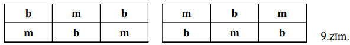

Ar $6$ gājieniem vienu taisnstūri var pārveidot vajadzīgajā formā:

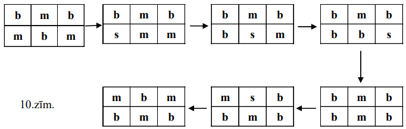

Tātad pavisam pietiek ar $24 \cdot 6=144$ gājieniem.

