# <lo-sample/> LV.NOL.2008.5.1

Starp katriem diviem blakus uzrakstītiem cipariem vienādības zīmes kreisajā 
pusē jāievieto "+" vai "-" zīme tā, lai iegūtu pareizu vienādību. Jābūt sešām 
"+" zīmēm un divām "-" zīmēm. Pacentieties atrast trīs dažādus zīmju 
izvietojumus.

$$\mathbf{123456789=19}$$

<small>

* questionType:
* domain:

</small>

## Atrisinājums

"-" zīmes var likt pirms $4$ un $9$; $5$ un $8$; $6$ un $7$. Starp citu, tās ir 
vienīgās iespējas (tas bērniem nav jāpamato).

# <lo-sample/> LV.NOL.2008.5.2

Vai var pa apli izrakstīt naturālos skaitļus no $1$ līdz $10$ katru tieši vienu
reizi tā, lai katru divu blakus uzrakstītu skaitļu starpība būtu:

**(A)** vismaz $4$,  
**(B)** vismaz $5$?

<small>

* questionType:
* domain:

</small>

## Atrisinājums

**(A)** var. Skat., piem., 4.zīm.

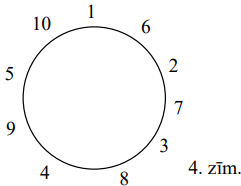

**(B)** nē, nevar. Skaitlim " $5$ " iespējams tikai viens kaimiņš - skaitlis 
" $10$ ".

# <lo-sample/> LV.NOL.2008.5.3

Deju kolektīvā ir $5$ zēni un $5$ meitenes; visu bērnu augumi ir dažādi. Dejā 
"Alfa" bērni sadalīti $5$ pāros tā, ka katrā pārī zēns ir garāks par meiteni.

**(A)** Vai var gadīties, ka dejā "Beta" bērni sadalīti $5$ pāros tā, ka katrā 
pārī meitene garāka par zēnu?

**(B)** Vai var gadīties, ka dejā "Gamma" bērni sadalīti $5$ pāros tā, ka 
četros pāros meitene garāka par zēnu?

<small>

* questionType:
* domain:

</small>

## Atrisinājums

**(A)** Nē, nevar; neviena meitene nav garāka par visgarāko zēnu.

**(B)** jā, var; skat. sekojošo tabulu, kur doti augumi centimetros.

"Alfa"

| Zēni | Meitenes |
| :---: | :---: |
| $170$ | $169$ |
| $168$ | $167$ |
| $166$ | $165$ |
| $164$ | $163$ |
| $162$ | $161$ |

"Gamma"

| Zēni | Meitenes |
| :---: | :---: |
| $170$ | $161$ |
| $168$ | $169$ |
| $166$ | $167$ |
| $164$ | $165$ |
| $162$ | $163$ |

# <lo-sample/> LV.NOL.2008.5.4

Vai no figūrām, kas parādītas 1.zīm., var salikt kaut kādu taisnstūri? Katru 
figūru jāņem tieši vienā eksemplārā. Visas rūtiņas ir vienādi kvadrātiņi. 
Figūras drīkst pagriezt un pat apgriezt "uz mutes", bet tās nedrīkst pārklāties
viena ar otru.

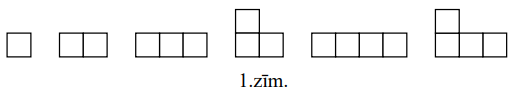

<small>

* questionType:
* domain:

</small>

## Atrisinājums

Nē. Rūtiņu kopskaits ir $17$. Vienīgais veids, kā $17$ sadalās naturālos 
reizinātājios, ir $1 \cdot 17=17 \cdot 1$. Bet divas no dotajām figūrām nevar 
ietilpināt joslā ar platumu " $1$ ".

# <lo-sample/> LV.NOL.2008.5.5

Sešpadsmit punkti izvietoti kvadrātiska režģa formā (skat. 2.zīm.). Kādu mazāko
daudzumu punktu jāizdzēš, lai nekādi $4$ palikušie punkti nebūtu tāda kvadrāta 
virsotnes, kura malas vērstas bultiņu virzienos?

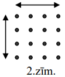

<small>

* questionType:
* domain:

</small>

## Atrisinājums

To, ka ar $4$ punktiem pietiek, skat. 5.zīm.

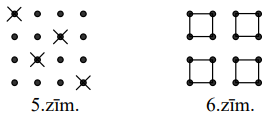

Skaidrs, ka vismaz $4$ punkti jānodzēš, lai "likvidētu" kaut vai tikai 6.zīm. 
redzamos kvadrātus.

# <lo-sample/> LV.NOL.2008.6.1

Basketbola spēlē starp votivapām un šillišallām uzvarēja votivapas ar rezultātu
$68:62$. Spēles gaitā bija tāds brīdis, kad votivapas bija guvuši tik punktu, 
cik šillišallām vēl bija atlicis gūt līdz spēles beigām. Cik punktu šai brīdī 
bija guvušas abas komandas kopā?

<small>

* questionType:
* domain:

</small>

## Atrisinājums

Acīmredzami, $62$.

# <lo-sample/> LV.NOL.2008.6.2

Andrim ir figūriņas, kas sastāv no vienādiem kvadrātiņiem (skat. 3.zīm.) - pa 
$10$ katra veida.

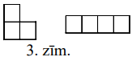

Vai viņš var salikt kvadrātu $7 \times 7$ rūtiņas, izmantojot **(A)** $12$ 
figūriņas; **(B)** $14$ figūriņas? Figūriņas nedrīkst pārklāties.

<small>

* questionType:
* domain:

</small>

## Atrisinājums

**(A)** nē. $12$ figūriņām ir pats lielākais $12 \cdot 4=48<7 \cdot 7$ rūtiņas;

**(B)** jā. Skat., piem., 7.zīm.

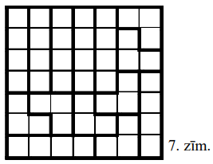

# <lo-sample/> LV.NOL.2008.6.3

Vai eksistē tādi naturāli skaitļi $x$ un $y$, ka

**(A)** $xy(x-y)=20082007$?

**(B)** $xy(x-y)=240$?

<small>

* questionType:
* domain:

</small>

## Atrisinājums

**(A)** nē. Ja $x$ vai $y$ ir pāra skaitlis, tad $xy(x-y)$ ir pāra skaitlis; ja
gan $x$, gan $y$ ir nepāra, tad $x-y$ ir pāra, un $xy(x-y)$ atkal ir pāra.

**(B)** piemēram, $x=10;\ y=6$.

# <lo-sample/> LV.NOL.2008.6.4

Vai eksistē tāds naturāls skaitlis $n$, ka reizinājums $n \cdot n$ nākas ar 
$1234567 \ldots$?

<small>

* questionType:
* domain:

</small>

## Atrisinājums

Var ņemt, piemēram, $n=1111111$.

# <lo-sample/> LV.NOL.2008.6.5

Karnevāla zālē ir $5$ lampas; katras divas lampas savieno viena vītne. Lampu un
vītņu krāsošanai kopā izmantotas $n$ krāsas. Ir zināms, ka vienlaicīgi izpildās
šādas divas īpašības:

**(A)** nekādas divas vītnes, kas piestiprinātas vienai lampai, nav vienā 
krāsā,

**(B)** neviena vīne nav piestiprināta lampai ar tādu pašu krāsu.

Kāda ir mazākā iespējamā $n$ vērtība?

<small>

* questionType:
* domain:

</small>

## Atrisinājums

Piemēru ar $n=5$ skat. 8.zīm.

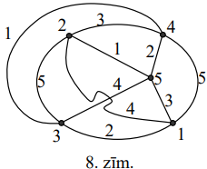

Tā kā lampai un $4$ vītnēm, kas tai piestiprinātas, visām jābūt dažādās krāsās,
tad ar mazāk nekā $5$ krāsām nepietiek.

# <lo-sample/> LV.NOL.2008.7.1

Kurus naturālos skaitļus $n$ var izsacīt formā $n=\frac{x}{y}$, kur 
$x=a^{3},\ y=b^{4},\ a$ un $b$ - naturāli skaitļi?

<small>

* seeAlso:LV.NOL.2007.7.1
* seeAlso:LV.NOL.2009.7.1
* topic:BezoutIdentity
* topic:CanonicalFactorization
* topic:StandardIdentities
* questionType:FindAll
* domain:NT

</small>

## Atrisinājums

Jebkuru: $n=\left(n^{3}\right)^{3}:\left(n^{2}\right)^{4}$.

*Piezīme:* Katru pirmskaitļa pakāpi $p^k$ skaitļa $n$ sadalījumā 
var izteikt $p^{3c}/p^{4d}$ kaut kādiem naturāliem $c,d$. Piemēram, 
$n = n^{9}/n^{8} = (n^3)^3/(n^2)^4$.

# <lo-sample/> LV.NOL.2008.7.2

Ir $4$ tortes gabali ar masām $x,\ y,\ z,\ t$; dots, ka $x<y<z<t$. Andris un 
Maija spēlē šādu spēli. Andris izvēlas vienu tortes gabalu, pēc tam Maija - 
otru; abi bērni nekavējoties sāk ēst. Tikko kāds savu gabalu apēdis, vinš 
nekavējoties izvēlas kādu gabalu no atlikušajiem un sāk ēst to, utt. Spēles 
mērķis ir apēst vairāk tortes nekā otram. Abi bērni torti ēd vienmērīgi un ar 
vienādiem ātrumiem.

Vai var gadīties, ka Andris uzvar, no sākuma izvēloties gabalu $x$? Uzskatām, 
ka Maija noteikti ēd torti sev visizdevīgākajā veidā.

<small>

* questionType:
* domain:

</small>

## Atrisinājums

Jā. Pieņemsim, ka $x=4;\ y=5;\ z=6;\ t=10$. Ja Maija ēd $y$ vai $z$, Andris 
paspēj sākt ēst $t$, un $4+10>5+6$. Ja Maija ēd $t$, Andris pēc $x$ ēd $y$ un 
vēl paspēj sākt ēst $z$, iekāms Maija pabeigusi ēst $t$.

# <lo-sample/> LV.NOL.2008.7.3

Sporta klubā sapulcējušies cīkstoņi un vingrotājas. Cīkstoņu vidējais svars ir 
$84~\mathrm{kg}$; vingrotāju vidējais svars ir $54~\mathrm{kg}$; visu sportistu
vidējais svars ir $71~\mathrm{kg}$. Pierādīt, ka cīkstoņu skaits dalās ar $17$.

<small>

* topic:BaricenterCoordinates
* topic:NumTheoryInequalityMethod
* topic:IntegerFactorization
* questionType:Prove
* domain:Alg

</small>

## Atrisinājums

Ja cīkstoņu ir $c$ un vingrotāju - $v$, tad cīkstoņu kopsvars ir $84c$ un 
vingrotāju kopsvars - $54v$. Tāpēc $\frac{84c+54v}{c+v}=71$, no kurienes 
iegūstam $13c=17v$. Tātad $13c$ dalās ar $17$. Tā kā $LKD(13;\ 17)=1$, tad $c$ 
dalās ar $17$.

*Piezīme.* Lai $71$ būtu līdzsvara punkts (smaguma centrs) 
starp $84k$ un $54m$, attiecībai $k/m$ jābūt 
$17/13$ un $\text{LKD}(13,17)=1$.

# <lo-sample/> LV.NOL.2008.7.4

Vai eksistē

**(A)** sešstūris, kuru var sagriezt divos trijstūros,

**(B)** sešstūris, kuru nevar sagriezt divos četrstūros?

<small>

* questionType:
* domain:

</small>

## Atrisinājums

Jā. Skat. 9.zīm.

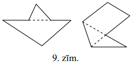

# <lo-sample/> LV.NOL.2008.7.5

Kvadrāts sastāv no $n \times n$ vienādām kvadrātiskām rūtiņām. Katrā rūtiņā 
ierakstīts nenegatīvs vesels skaitlis. Visu ierakstīto skaitļu summa ir $101$. 
Katrās divās rūtiņās, kurām ir kopīga mala, ierakstītie skaitļi atšķiras viens 
no otra tieši par $1$. Kāda ir lielākā iespējamā $n$ vērtība?

<small>

* questionType:
* domain:

</small>

## Atrisinājums

**Atbilde:** $n=13$.

Parādīsim, ka šī vērtība der. Izkrāsojam rūtiņas šaha galdiņa kārtībā tā, ka 
stūra rūtiņas ir melnas. Melnajās rūtiņās ierakstām " $1$ ", $8$ baltajās 
rūtiņās " $2$ ", citās baltajās rūtiņās " $0$ ". Tiešām, 
$85 \cdot 1+8 \cdot 2=85+16=101$.

Ja $n$ - pāra skaitlis, tad gan balto, gan melno rūtiņu ir pāra skaits. 
Melnajās rūtiņās ir vienas paritātes skaitļi, baltajās - otras. Tātad kopā 
jābūt ierakstītam pāra skaitam nepāra skaitļu; tāpēc ierakstīto skaitļu summa 
nevar būt nepāra skaitlis $101$.

Ja $n$ - nepāra skaitlis, $n \geqq 15$, tad katras krāsas rūtiņu ir vismaz 
$(225-1):2=112$. Vienas krāsas rūtiņās visi skaitļi ir nepāra, tātad vismaz 
$1$; tāpēc to summa ir vismaz $112>101$ pretruna.

# <lo-sample/> LV.NOL.2008.8.1

Sešciparu naturālu skaitli sauc par laimīgu, ja kaut kādu $3$ ciparu summa 
vienāda ar pārējo $3$ ciparu summu. Divi viens otram sekojoši skaitļi ir 
laimīgi. Pierādīt, ka viens no tiem dalās ar $10$.

<small>

* topic:SequenceGaps
* topic:InvariantParity
* questionType:Prove
* domain:NT

</small>

## Atrisinājums

Ja mazākā laimīgā skaitļa pēdējais cipars nav $9$, tad abu skaitļu ciparu 
summas ir viens otram sekojoši naturāli skaitļi; tāpēc viena no tām ir nepāra -
pretruna.

*Piezīme.* Palielinot skaitli par $1$ bez pārnesuma, tā ciparu summas paritāte mainās par $1$.

# <lo-sample/> LV.NOL.2008.8.2

Kvadrāts sastāv no $2008 \times 2008$ vienādām kvadrātiskām rūtiņām, kas 
izkrāsotas šaha galdiņa kārtībā. Griežot pa rūtiņu līnijām, tas sagriezts 
mazākos kvadrātos ar nepāra skaitu rūtiņu katrā. Pierādiet: no šo kvadrātu 
centrālajām rūtiņām tieši puse ir baltas un puse - melnas. (Ja kvadrāts sastāv 
no $1$ rūtiņas, tad šo vienīgo rūtiņu uzskata par tā centrālo).

<small>

* questionType:
* domain:

</small>

## Atrisinājums

Katrā griežot iegūtajā kvadrātā vienas krāsas rūtiņu ir par $1$ vairāk nekā 
otras krāsas rūtiņu, un vairākums rūtiņu ir tajā krāsā, kurā ir centrālā 
rūtiņa. "Vairākumu nodrošinošo" balto rūtiņu jābūt tikpat, cik "vairākumu 
nodrošinošo" melno rūtiņu, jo lielajā kvadrātā melno un balto rūtiņu ir vienāds
daudzums.

# <lo-sample/> LV.NOL.2008.8.3

Skaitļi $a,\ b,\ c$ visi nav vienādi savā starpā. Pierādīt, ka 
$a^{2}+b^{2}+c^{2} \neq ab+ac+bc$.

<small>

* questionType:
* domain:

</small>

## Atrisinājums

No nevienādības $(a-b)^{2}+(b-c)^{2}+(c-a)^{2}>0$, atverot iekavas, seko 
$a^{2}+b^{2}+c^{2}>ab+ac+bc$.

# <lo-sample/> LV.NOL.2008.8.4

Katrīna katru dienu nēsā citas krāsas cepuri. Viņa nolēmusi, ka pēc sarkanas 
cepures vina nēsā dzeltenu, pēc dzeltenas - zaļu, pēc zaļas - brūnu, pēc brūnas
violetu, pēc violetas - atkal sarkanu, utt. Pirmajā dienā Katrīnai bija zaļa 
cepure, $2008.$ dienā - dzeltena. Ir zināms, ka Katrīna pieļāva **tieši vienu 
kļūdu**, valkājot sarkanu cepuri dienā, kad to nevajadzēja darīt. Kādas krāsas 
cepuri viņa valkāja iepriekšējā dienā?

<small>

* questionType:
* domain:

</small>

## Atrisinājums

**Atbilde:** zaļu.

**Risinājums.** Cepuru virkne ir periodiska ar periodu $ZBVSD$. Ja Katrīna 
nekļūdītos, tad $2008.$ dienā viņa nēsātu violetu cepuri, jo 
$2008=401 \cdot 5+3$. Tātad kļūdas dēļ notika pārbīde par $2$ cepurēm uz 
priekšu. Varam uzskatīt, ka dienā pirms kļūdainās izvēles Katrīna pareizajā 
secībā valkāja trīs cepures, no kurām pirmā ir tā, kuru viņa valkāja patiesībā.
Skaidri redzams, ka tā ir zaļa.

# <lo-sample/> LV.NOL.2008.8.5

Šaurleņķu trijstūrī $ABC$ novilkts augstums $CH$; izrādījās, ka $AH=BC$. Caur 
$H$ paralēli malai $BC$ novilkta taisne; tā krusto augstumu $AA_{1}$ punktā 
$K$. Pierādīt, ka $K$ atrodas uz $\sphericalangle ABC$ bisektrises.

<small>

* questionType:
* domain:

</small>

## Atrisinājums

Ievērosim, ka 
$\sphericalangle KAH=90^{\circ}-\sphericalangle B=\sphericalangle HCB$. Tāpēc 
$\triangle KAH=\triangle HCB\ (hl)$. Tāpēc $HK=BH$. Tātad $\triangle KHB$ - 
vienādsānu un $\sphericalangle HBK=\sphericalangle HKB$. Bet 
$\sphericalangle HKB=\sphericalangle KBC$, jo $HK \parallel BC$. Tātad 
$\sphericalangle HBK=\sphericalangle KBC$, k.b.j.

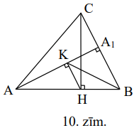

# <lo-sample/> LV.NOL.2008.9.1

Atrodiet vismaz $5$ dažādus pirmskaitļus, ar kuriem dalās skaitlis 
$3^{32}-2^{32}$.

<small>

* questionType:
* domain:

</small>

## Atrisinājums

Ievērojam, ka 
$3^{32}-2^{32}=\left(3^{16}+2^{16}\right)\left(3^{8}+2^{8}\right)\left(3^{4}+2^{4}\right)\left(3^{2}+2^{2}\right)(3+2)(3-2)$
(vairākas reizes lietojam formulu $a^{2}-b^{2}=(a+b)(a-b)$ ). Tā kā 
$3+2=5;\ 3^{2}+2^{2}=13;\ 3^{4}+2^{4}=97$; 
$3^{8}+2^{8}=6561+256=6817=17 \cdot 401$, uzdevums atrisināts. (Skaitlis $401$ 
ir pirmskaitlis, jo nedalās ne ar vienu skaitli no $2$ līdz 
$\lfloor \sqrt{401}\rfloor=20$ ieskaitot.)

# <lo-sample/> LV.NOL.2008.9.2

Trijstūrī $ABC$ ar $h_{a}$, $h_{b}$ un $h_{c}$ apzīmēti to augstumu garumi, kas
vilkti attiecīgi no virsotnēm $A,\ B,\ C$. Dots, ka 
$h_{a} \geq 3, h_{b} \geq 4, h_{c} \geq 5$.

Kāds ir mazākais iespējamais $\triangle ABC$ laukums?

<small>

* questionType:
* domain:

</small>

## Atrisinājums

Saskaņā ar teorēmu par slīpnes un perpendikula garumu $CA \geq h_{c} \geq 5$. 
Tāpēc $L(ABC)=\frac{1}{2} AC \cdot h_{b} \geq \frac{1}{2} \cdot 5 \cdot 4=10$. 
Vērtība $L(ABC)=10$ tiek sasniegta, piemēram, taisnleņķa trijstūrī $ABC$, kur 
$AB=4;\ AC=5;\ \sphericalangle A=90^{\circ}$. Šis trijstūris apmierina uzdevuma
nosacījumus: 
$h_{b}=AB=4, h_{c}=AC=5, h_{a}=\frac{AB \cdot AC}{BC}=\frac{4 \cdot 5}{\sqrt{41}}=\sqrt{\frac{400}{41}}=\sqrt{9 \frac{31}{41}}>\sqrt{9}=3$
(skat. 4.zīm.)

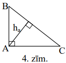

# <lo-sample/> LV.NOL.2008.9.3

Ceļu policijas vienībā ir $7$ policisti. Katru vakaru dežurēt dodas $3$ no 
tiem. Pēc kāda laika izrādījās, ka katri divi policisti kopā dežurējuši tieši 
$n$ reizes.

**(A)** atrodiet kaut vienu iespējamu $n$ vērtību,

**(B)** vai var būt, ka $n=3$?

<small>

* questionType:
* domain:

</small>

## Atrisinājums

**(A)** Ja visi iespējamie policistu trijnieki ir nodežurējuši pa vienai 
reizei, tad katrs pāris ir dežurējis kopā ar pieciem citiem policistiem; tātad 
var būt $n=5$.

**(B)** attēlosim policistus ar regulāra $7$-stūra virsotnēm. Ja pa reizei 
dežurēs visi tie policistu trijnieki, kuru atbilstošās virsotnes veido 
vienādsānu trijstūri, iegūsim situāciju ar $n=3$.

# <lo-sample/> LV.NOL.2008.9.4

Katram no kvadrāttrinomiem $x^{2}+ax+b$ un $x^{2}+cx+d$ ir divas dažādas 
saknes; visi skaitļi $a,\ b,\ c,\ d$ ir dažādi. Minēto četru sakņu summas puse 
ir vienādojuma $x^{2}+ax+b=x^{2}+cx+d$ sakne. Pierādīt, ka pirmā kvadrāttrinoma
sakņu kvadrātu summa vienāda ar otrā kvadrāttrinoma sakņu kvadrātu summu.

<small>

* questionType:
* domain:

</small>

## Atrisinājums

Vienādojumam $x^{2}+ax+b=x^{2}+cx+d$ ir sakne $x_{0}=\frac{d-b}{a-c}$ (tā 
eksistē, jo $a \neq c$). Apzīmējot doto kvadrāttrinomu saknes attiecīgi ar 
$x_{1},\ x_{2};\ x_{3},\ x_{4}$, iegūstam, ka $x_{1}+x_{2}+x_{3}+x_{4}=-(a+c)$.
Tāpēc $\frac{d-b}{a-c}=-\frac{a+c}{2}$ no kurienes $2d-2b=c^{2}-a^{2}$. No 
Vjeta teorēmas iegūstam 
$2x_{3}x_{4}-2x_{1}x_{2}=\left(x_{3}+x_{4}\right)^{2}-\left(x_{1}+x_{2}\right)^{2}$,
no kurienes tieši seko vajadzīgais.

# <lo-sample/> LV.NOL.2008.9.5

Kādā valstī ir $100$ pilsētas. No katras pilsētas iziet $5$ ceļi. Katrs ceļš 
savieno divas pilsētas, neiegriežoties citās; starp katrām divām pilsētām ir ne
vairāk par vienu ceļu; visu ceļu garumi ir dažādi. Visu ceļu kopgarums ir 
$30000 ~\mathrm{km}$. Ja izvēlas katrai pilsētai visīsāko no tās izejošo ceļu un
saskaita visu $100$ izvēlēto ceļu garumus (varbūt dažu ceļu garumus ieskaita 
summā divreiz), iegūst $10000 ~\mathrm{km}$. Pierādīt, ka šajā valstī ir tāds 
ceļš, kura garums nav mazāks par $125 ~\mathrm{km}$.

<small>

* questionType:
* domain:

</small>

## Atrisinājums

Iedomāsimies, ka no katras pilsētas pa katru ceļu nobrauc automašīna (kopā ir 
$500$ automašīnu). Kopējais nobrauktais attālums ir 
$2 \cdot 30000 \mathrm{~km}=60000 \mathrm{~km}$. Automašīnas, kas brauca pa 
uzdevumā minētajiem īsākajiem ceļiem, kopā nobrauca $10000~\mathrm{km}$; tāpēc 
$400$ pārējās automašīnas kopā nobrauca $50000~\mathrm{km}$; tāpēc vismaz viena
no tām nobrauca $\geq \frac{50000}{400}=125(\mathrm{~km})$.

# <lo-sample/> LV.NOL.2008.10.1

Atrodiet mazāko naturālo skaitli, ko var izsacīt gan kā $15$, gan kā $16$, gan 
kā $17$ pēc kārtas ņemtu naturālu skaitļu summu.

<small>

* topic:GcdAndLcmProperties
* topic:SeriesArithmeticSum
* questionType:FindOptimal
* domain:NT

</small>

## Atrisinājums

Šādam skaitlim jādalās gan ar $15$ (jo 
$(n+1)+(n+2)+\ldots+(n+8)+\ldots+(n+14)+(n+15)=15(n+8)$, gan ar $17$, gan ar 
$8$ (jo $(n+1)+\ldots+(n+16)=8((n+1)+(n+16))$. Tā kā $15,\ 17$ un $8$ ir pa 
pāriem savstarpēji pirmskaitļi, tam jādalās ar $15 \cdot 17 \cdot 8=2040$. 
Mazākais naturālais skaitlis, kas dalās ar $2040$, ir $2040$. Viegli pārbaudīt,
ka visi $15\ (16;\ 17)$ saskaitāmie iznāk naturāli skaitļi (šī pārbaude 
nepieciešama).

# <lo-sample/> LV.NOL.2008.10.2

Dots, ka $f(x)=x^{2}+8x+12$. Atrisināt vienādojumu $f(f(f(f(x))))=0$.

<small>

* questionType:
* domain:

</small>

## Atrisinājums

Ievērosim, ka $f(x)=(x+4)^{2}-4$. Tāpēc 
$f(f(x))=\left((x+4)^{2}-4+4\right)^{2}-4=(x+4)^{4}-4$, 
$f(f(f(x)))=\left((x+4)^{4}-4+4\right)^{2}-4=(x+4)^{8}-4$ un līdzīgi 
$f(f(f(f(x))))=(x+4)^{16}-4$. Risinot vienādojumu $(x+4)^{16}-4=0$, iegūstam

$$\begin{aligned}
& (x+4)^{16}=4 \\
& x+4= \pm \sqrt[8]{2} \\
& x=-4 \pm \sqrt[8]{2}
\end{aligned}$$

# <lo-sample/> LV.NOL.2008.10.3

Dots, ka $\triangle ABC$ ir taisnleņķa, $\sphericalangle ACB=90^{\circ}$. 
Zināms, ka $CH$ ir šī trijstūra augstums, $CM=2 \cdot HM$ un $KM \perp AB$ 
(skat. 1.zīm.). Aprēķināt $\sphericalangle AKC$.

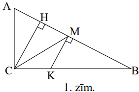

<small>

* questionType:
* domain:

</small>

## Atrisinājums

Saskaņā ar uzdevumā doto ap $AMKC$ var apvilkt riņķa līniju, jo 
$\sphericalangle M+\sphericalangle C=90^{\circ}+90^{\circ}=180^{\circ}$. Bez 
tam $\sphericalangle AMC=\sphericalangle HMC=60^{\circ}$, jo taisnleņķa 
trijstūrī $CHM$ hipotenūza divas reizes garāka par kateti. Tāpēc no ievilktu 
leņķu īpašībām $\sphericalangle AKC=\sphericalangle AMC=60^{\circ}$.

# <lo-sample/> LV.NOL.2008.10.4

Dots, ka $x$ un $y$ - reāli skaitļi. Pierādīt, ka 
$\left(1+x^{2}\right)\left(1+y^{2}\right) \geq x\left(1+y^{2}\right)+y\left(1+x^{2}\right)$.

<small>

* questionType:
* domain:

</small>

## Atrisinājums

Vispirms reizināsim nevienādības abas puses ar $2$. Tālāk nevienādības 
pareizība seko no identiskiem pārveidojumiem:

$$\begin{aligned}
& 2\left(1+x^{2}\right)\left(1+y^{2}\right)-2 x\left(1+y^{2}\right)-2 y\left(1+x^{2}\right)= \\
& =\left(1+x^{2}\right)\left(1+y^{2}\right)-2 x\left(1+y^{2}\right)+\left(1+x^{2}\right)\left(1+y^{2}\right)-2y\left(1+x^{2}\right)= \\
& =(1-x)^{2}\left(1+y^{2}\right)+(1-y)^{2}\left(1+x^{2}\right) \geq 0
\end{aligned}$$

# <lo-sample/> LV.NOL.2008.10.5

Kvadrāts sastāv no $n \times n$ vienādām kvadrātiskām rūtiņām. Ir zināms, ka to
var sagriezt tādos gabalos, kādi parādīti 2.zīm., pie tam abu veidu gabali ir 
vienādā skaitā. Atrast mazāko iespējamo $n$ vērtību.

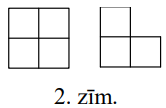

<small>

* questionType:
* domain:

</small>

## Atrisinājums

Ja katra veida figūru ir $k$, tad kopējais rūtiņu skaits tajās ir $4k+3k=7k$; 
tātad $n^{2}=7k$ un $n$ jādalās ar $7$. Mazākās iespējamās $n$ vērtības ir 
$n=7$ un $n=14$.

**A.** Pie $n=7$ uzdevuma prasības nav izpildāmas. Pieņemsim, ka tas izdevies, 
un izkrāsosim rūtiņas, kā parādīts 5.zīm. Katrs no $7$ kvadrātiem satur $2$ 
melnas rūtiņas, tāpēc $7$ "stūrīši" kopā satur $28-14=14$ melnas rūtiņas. Tāpēc
katrs "stūrītis" satur tieši $2$ melnas un $1$ baltu rūtiņu (jo katrs stūrītis 
noteikti satur ne vairāk kā $2$ melnas rūtiņas). Bet melnās rūtiņas nevar 
sadalīties pa pāriem, kas ietilpst kvadrātos un stūrīšos, jo katrā rindiņā, 
kurā tās vispār ir, tās ir nepāra skaitā.

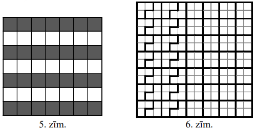

**B.** Risinājumu pie $n=14$ skat. 6.zīm.

# <lo-sample/> LV.NOL.2008.11.1

Šaurleņķu trijstūrī $ABC$ novilkti augstumi $AX$ un $CY$; malas $AC$ 
viduspunkts ir $M$. Uz augstuma $AX$ atzīmēts tāds punkts $Z$, ka $YZ=ZX$. 
Pierādīt, ka punkti $A;\ Y;\ Z;\ M$ atrodas uz vienas riņķa līnijas.

<small>

* questionType:
* domain:

</small>

## Atrisinājums

Tā kā $\sphericalangle AYC=90^{\circ}=\sphericalangle AXC$, tad ap $AYXC$ var 
apvilkt riņķa līniju; tāpēc $\sphericalangle ACY=\sphericalangle AXY$ kā 
ievilkti leņķi, kas balstās uz vienu un to pašu loku.

Apzīmēsim $\sphericalangle ACY=\sphericalangle AXY=\varphi$. Izmantojot 
trijstūra leņķu summu, viegli iegūt, ka $\sphericalangle AMY=2 \varphi$ un 
$\sphericalangle AZY=2 \varphi$, tātad 
$\sphericalangle AMY=\sphericalangle AZY$. No šejienes seko vajadzīgais.

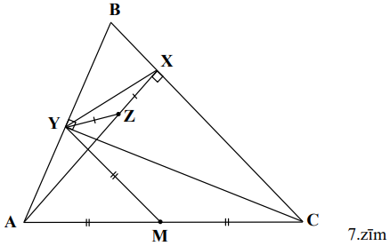

# <lo-sample/> LV.NOL.2008.11.2

Kvadrāts sastāv no $n \times n$ vienādām kvadrātiskām rūtiņām. Ir zināms, ka to
var sagriezt tādos gabalos, kādi parādīti 3.zīm., pie tam viena veida gabalu ir
tikpat, cik otra. Atrast mazāko iespējamo $n$ vērtību.

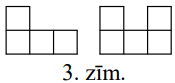

<small>

* questionType:
* domain:

</small>

## Atrisinājums

Apzīmēsim katra veida figūru skaitu ar $k$; tad tās kopā satur $4k+5k=9k$ 
rūtiņas. Iegūstam vienādību $9k=n^{2}$, tātad $n$ dalās ar $3$. Mazākās 
iespējamās $n$ vērtības ir $n=3$ un $n=6$. Vērtība $n=3$ acīmredzami neder. 
Atrisinājumu pie $n=6$ skat. 8.zīm.

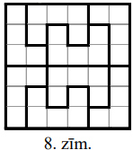

# <lo-sample/> LV.NOL.2008.11.3

Ir zināms, ka $f(x)$ un $g(x)$ - kvadrāttrinomi, pie tam gan $2f(x)+g(x)$, gan 
$f(x)-g(x)$ ir tāds kvadrāttrinoms, kuram ir tikai viena sakne (jeb, citādi 
sakot, abas saknes ir vienādas). Dots arī, ka kvadrāttrinomam $f(x)$ ir divas 
dažādas saknes. Pierādīt, ka kvadrāttrinomam $g(x)$ sakņu nav.

<small>

* questionType:
* domain:

</small>

## Atrisinājums

No uzdevumā dotā seko, ka gan $2f(x)+g(x)$, gan $f(x)-g(x)$ ir vai nu 
nenegatīva, vai nepozitīva funkcija. Ja tās abas būtu viena tipa, tad arī to 
summa $3f(x)$ būtu vai nenegatīva, vai nepozitīva; bet tas ir pretrunā ar to, 
ka $f(x)$ ir divas dažādas saknes. Tāpēc viens no polinomiem $2f(x)+g(x)$ un 
$f(x)-g(x)$ ir nenegatīvs, bet otrs - nepozitīvs, turklāt to (vienīgās) saknes 
atšķiras viena no otras. Bet tad polinoms $(2f(x)+g(x))-2(f(x)-g(x))=3g(x)$ 
pieņem vai nu tikai pozitīvas, vai tikai negatīvas vērtības, no kā seko 
uzdevuma apgalvojums.

# <lo-sample/> LV.NOL.2008.11.4

Apzīmējam $f(n)=1^{n}+2^{n}+3^{n}+4^{n},\ n=1; 2; 3; \ldots$. Ar kādu lielāko 
daudzumu nuļļu var beigties skaitlis $f(n)$?

<small>

* questionType:FindOptimal
* domain:NT

</small>

## Atrisinājums

Viegli aprēķināt, ka $f(1)=10,\ f(2)=30,\ f(3)=100$. Pierādīsim, ka pie $n>3$ 
skaitlis $f(n)$ nedalās ar $1000$. Tad būs skaidrs, ka uzdevuma atbilde ir "ar 
$2$ nullēm".

Pie $n>3$ skaitļi $2^{n}$ un $4^{n}$ dalās ar $8$, bet $1^{n}=1$. Savukārt 
$3^{n}$, dalot ar $8$, pārmaiņus dod atlikumus $3$ un $1$: pie nepāra $n$, 
$n=2k+1$, iegūstam 
$3^{n}=3^{2k+1}=3 \cdot 9^{k}=3 \cdot(8+1)^{k}=3 \cdot(8Q+1)=24Q+3$, bet pie 
pāra $n$, $n=2k$, iegūstam 
$3^{n}=3^{2k}=9^{k}=(8+1)^{k}=8P+1(Q, P \in \mathbf{Z})$. Tāpēc summa $f(n)$ 
dod atlikumu $4$ vai $2$, dalot ar $8$; tāpēc nedalās ar $8$; tāpēc tā nedalās 
ar $1000$.

# <lo-sample/> LV.NOL.2008.11.5

Regulāra $n$-stūra virsotnēs ierakstīti naturāli skaitļi no $1$ līdz $n$ (katrā
virsotnē cits skaitlis) ar īpašību: ja $A,\ B,\ C$ - trīs $n$-stūra virsotnes 
un $AB=AC$, tad virsotnē $A$ ierakstītais skaitlis vai nu lielāks par **abiem** 
skaitļiem, kas ierakstīti virsotnēs $B$ un $C$, vai arī mazāks par tiem abiem.

Vai var būt, ka **(A)** $n=8$, **(B)** $n=7$, **(C)** $n=10$, **(D)** $n=16$?

<small>

* questionType:
* domain:

</small>

## Atrisinājums

**(A)** jā, var; skat. 9.zīm.

**(B)** nē, nevar. Pieņemam, ka tas izdevies. Apzīmējam skaitļus izrakstīšanas 
secībā ar $a_{1}; a_{2}; \ldots; a_{7}$; varam pieņemt, ka $a_{1}<a_{2}$. Tad 
jābūt 
$a_{2}>a_{3},\ a_{3}<a_{4},\ a_{4}>a_{5},\ a_{5}<a_{6},\ a_{6}>a_{7},\ a_{7}<a_{1},\ a_{1}>a_{2}$ -
pretruna. (Izšķirošais bija tas, ka $7$ - nepāra skaitlis.)

**(C)** nē, nevar. Apskatām piecas desmitstūra virsotnes, kas veido regulāru 
piecstūri, un spriežam par tām kā (B) gadījumā.

**(D)** jā, var. Skat. 10.zīm.

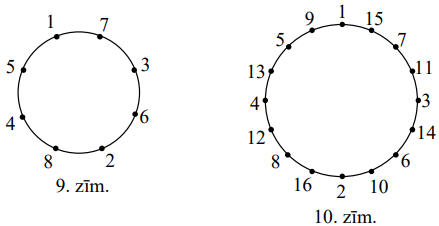

**Komentārs.** Uzdevuma prasības ir izpildāmas tad un tikai tad, ja $n$ ir 
divnieka pakāpe ar naturālu kāpinātāju. Ja $n$ dalās ar kādu nepāra pirmskaitli
$p$, apskatām regulāru $p$-stūri ar virsotnēm $n$-stūra virsotnēs un spriežam 
kā (B) gadījumā. Induktīvā pāreja no $n=2^{k}$ uz $n=2^{k+1}$ shematiski 
attēlota 11.zīm.; ar tās palīdzību no 12.zīm. iegūts 9.zīm. un no 9.zīm. - 
10.zīm.

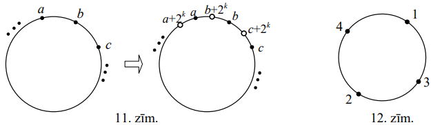

# <lo-sample/> LV.NOL.2008.12.1

No $10$ skaitļiem izveidotu virkni sauc par **labu**, ja tā vienlaicīgi 
apmierina šādas $3$ prasības:

**(A)** tā satur visus naturālos skaitļus no $1$ līdz $10$ ieskaitot,

**(B)** ja no virknes izsvītro trīs skaitļus $8,\ 9$ un $10$, tad atlikušie 
$7$ virknes locekļi nav augošā secībā,

**(C)** ja no virknes izsvītro **vēl arī** skaitli $7$, tad atlikušie virknes 
locekļi ir augošā secībā.

Cik ir labu virkņu? Atbilde jādod decimālā pierakstā.

<small>

* questionType:
* domain:

</small>

## Atrisinājums

Padomāsim kā šādu virkni uzrakstīt. Vispirms uzrakstīsim 
$1;\ 2;\ 3;\ 4;\ 5;\ 6$; augošā secībā. Skaitļus $7;\ 8;\ 9;\ 10$ jāieraksta 
vai nu intervālos starp šiem skaitļiem, vai pirms vai pēc visiem. No šīm 
iespējām skaitlim "$7$" atvēlētas tikai sešas - to nevar rakstīt aiz "$6$".
Pēc tam skaitļu "$8$" ierakstīšanai ir astoņas vietas, "$9$" 
ierakstīšanai - deviņas vietas un "$10$" ierakstīšanai - $10$ vietas. Tāpēc 
meklējamo virkņu ir $6 \cdot 8 \cdot 9 \cdot 10=4320$.

# <lo-sample/> LV.NOL.2008.12.2

Kādiem naturāliem skaitļiem $n$ vienlaicīgi piemīt sekojošas īpašības:

a. $n-1$ un $n+1$ ir pirmskaitļi,  
b. skaitļa $n$ visu naturālo dalītāju summa (ieskaitot $1$ un $n$) ir $2n$?

<small>

* seeAlso:LV.NOL.2007.12.3
* questionType:FindAll
* domain:NT

</small>

## Atrisinājums

Tieša pārbaude parāda, ka neder $n=1; 2; 3; 4; 5$, tātad $n \geq 6$. Ja $n$, 
dalot ar $3$, dod atlikumu $1$ resp. $2$, tad $n-1$ resp. $n+1$ nav 
pirmskaitlis. Tāpēc $n$ dalās ar $3$. Ja $n$-nepāra skaitlis, tad $n-1$ un 
$n+1$ nav pirmskaitļi, tāpēc $n$ dalās ar $2$. Tātad $n$ dalās ar $6$. Tad $n$ 
ir dalītāji $1; \frac{n}{6}; \frac{n}{2}; \frac{n}{3}; n$. Bet 
$\frac{n}{6}+\frac{n}{2}+\frac{n}{3}+n=2n$. Saskaņā ar uzdevuma nosacījumiem 
$1$ jābūt vienam no skaitļiem $\frac{n}{6}; \frac{n}{2}; \frac{n}{3}; n$. Mums 
der tikai $1=\frac{n}{6}$; tad $n=6$. Pārbaude parāda, ka šī vērtība der.

# <lo-sample/> LV.NOL.2008.12.3

Pierādīt, ka visiem reāliem skaitļiem $x$ un $y$ pastāv nevienādība

$$\cos \left(x^{2}\right)+\cos \left(y^{2}\right)-\cos (xy)<3$$

<small>

* questionType:
* domain:

</small>

## Atrisinājums

Tā kā $|\cos t| \leq 1$, tad 
$\cos \left(x^{2}\right)+\cos \left(y^{2}\right)-\cos (xy) \leq 1+1-(-1)=3$. 
Lai pierādītu stingro nevienādību, jāpierāda, ka nevar vienlaicīgi būt 
$\cos x^{2}=1, \cos y^{2}=1, \cos (x y)=-1$. Pieņemsim pretējo. Tad 
$x^{2}=2 \pi n, y^{2}=2 \pi k, x y=\pi(2l+1), n, k, l \in Z$. No tā seko, ka 
$x^{2}y^{2}=4 \pi^{2} nk$ un $(xy)^{2}=\pi^{2} \cdot(2l+1)^{2}$. No tā seko, ka
$4nk=(2l+1)^{2}$ Bet pāra skaitlis nevar būt vienāds ar nepāra skaitli - 
pretruna.

# <lo-sample/> LV.NOL.2008.12.4

Trijstūrī $ABC$ dots, ka $AC<BC$. Apzīmējam apvilkto riņķa līniju ar $w$. 
Punkts $E$ ir viduspunkts tam no $w$ lokiem $AB$, kurš satur $C$. Punkts $D$ 
atrodas uz nogriežņa $BC$ un $BD=AC$. Stars $ED$ krusto $w$ punktā $F$, kas 
nesakrīt ar $A$. Pierādīt, ka $AF \parallel BC$.

<small>

* questionType:
* domain:

</small>

## Atrisinājums

Pastāv $2$ gadījumi: **(A)** $F$ pieder lokam $AB$, **(B)** $F$ pieder lokam 
$AC$.

**(B)** no ievilktu leņķu īpašībām 
$\sphericalangle CAE=\sphericalangle CBE=\sphericalangle DBE$; no $E$ izvēles 
$AE=BE$; no konstrukcijas $AC=BD$. Tāpēc 
$\triangle CAE=\triangle DBE\ (m \ell m)$. Tāpēc 
$\sphericalangle CEA=\sphericalangle DEB=\sphericalangle FEB$; vienādi ievilkti
leņķi balstās uz vienādiem lokiem. Tāpēc loki $AmC$ un $FnB$ vienādi savā 
starpā. Pēc teorēmas par paralēlām hordām $AF \parallel CB$, k.b.j.

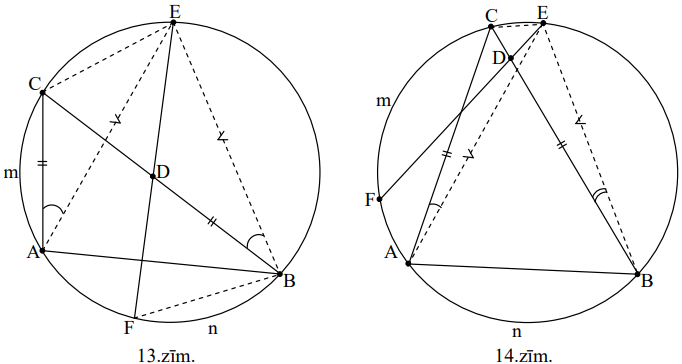

**(B)** iepriekšējā pierādījuma galā aiz teikuma "Tāpēc loki $AmC$ un $FnB$ 
vienādi savā starpā." jāiestarpina "Atņemot no tiem abiem loku $AF$, iegūstam, 
ka loki $FmC$ un $AnB$ vienādi savā starpā".

# <lo-sample/> LV.NOL.2008.12.5

Klasē ir $10$ skolēni. Viņiem jāregistrējas $1023$ eksāmenu kārtošanai, 
turklāt nedrīkst būt divu tādu eksāmenu, kurus kārto vieni un tie paši 
skolnieki. Katru eksāmenu jākārto vismaz vienam skolniekam. Dots, ka $n$ - 
vesels skaitlis, $0 \leq n \leq 1023$. Pierādīt, ka eksāmenam reģistrējušos 
skolnieku sarakstus var nodrukāt uz baltām un zaļām lapām tā, ka vienlaicīgi 
izpildās šādas prasības:

- ja divas lapas $X$ un $Y$ ir vienā krāsā, tad tā lapa, uz kuras pierakstīti 
  tieši tie skolnieki, kas pierakstīti vismaz uz vienas no lapām $X$ un $Y$, ir
  tādā pašā krāsā kā $X$ un $Y$,
- ir tieši $n$ baltas lapas.

<small>

* questionType:
* domain:

</small>

## Atrisinājums

Skaidrs, ka uz lapām jāraksta skolēnu kopas visas netukšās apakškopas, jo to ir
tieši $2^{10}-1=1023$. Identificēsim skolēnus ar skaitļiem 
$0;\ 1;\ 2;\ \ldots;\ 9$. N̦emsim skolēnu netukšu kopu 
$A \subset\{0; 1; 2; \ldots; 9\}$. Parādīsim, kā izvēlēties krāsu lapai, uz 
kuras uzrakstīs $A$.

- Ja $n=1023$, lapas krāsa noteikti ir balta.
- Ja $n=0$, lapas krāsa noteikti ir zaļa.
- Apskatām gadījumu, kad $n>0$ un $n<1023$.

Izsakām $n=2^{a_{1}}+2^{a_{2}}+\ldots+2^{a_{k}}$, kur 
$0 \leq a_{1}<a_{2}<\ldots<a_{k} \leq 9$ - dažādi nenegatīvi veseli skaitļi 
(t.i., izsakām $n$ binārajā sistēmā). Uzskatīsim skaitļus 
$a_{1}, a_{2}, \ldots, a_{k}$ par baltiem, bet pārējos skaitļus no 
$\{0; 1; 2; \ldots; 9\}$ - par zaļiem. **Krāsosim kopas** $\mathbf{A}$ **lapu 
tādā krāsā, kādā ir kopas $\mathbf{A}$ lielākais elements.**

Tā kā divu kopu apvienojuma lielākais elements ir lielākais no šo kopu 
lielākajiem elementiem, uzdevuma nosacījums par lapu krāsām izpildās. 
Noskaidrosim, cik ir balto lapu. Ir tieši $2^{a_{i}}$ kopas, kuru lielākais 
elements ir $a_{i}$ (katru no skaitļiem $0; 1; \ldots; a_{i}-1$ var iekļaut vai
neiekļaut). Tāpēc balto lapu ir $2^{a_{1}}+\ldots+2^{a_{k}}=n$, kas bija 
vajadzīgs.

**Piezīme:** iespējams arī risinājums ar matemātisko indukciju.

