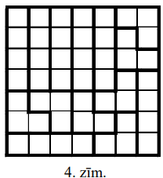
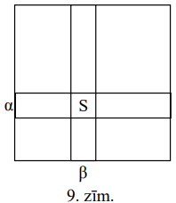

# <lo-sample/> LV.NOL.2009.5.1

Vai var pa apli izrakstīt naturālos skaitļus no $1$ līdz $12$ katru tieši vienu
reizi tā, lai katru divu blakus uzrakstītu skaitļu starpība būtu:

**(A)** vismaz $5$,

**(B)** vismaz $6$?

<small>

* questionType:
* domain:

</small>

## Atrisinājums

**(A)** Jā, var. Skat., piem., 1.zīm.

**(B)** nevar; skaitlim $6$ blakus var būt tikai $12$.

# <lo-sample/> LV.NOL.2009.5.2

Figūra, kas attēlota 1.zīm., sastāv no vienādām kvadrātiskām rūtiņām. Vai to 
var sagriezt divos gabalos tā, lai no šiem gabaliem varētu salikt vienu 
kvadrātu? Griezumiem jāiet pa rūtiņu līnijām; gabali saliekot nedrīkst 
pārklāties un saliktā kvadrāta iekšpusē nedrīkst palikt tukšumi.

<small>

* questionType:
* domain:

</small>

## Atrisinājums

Skat., piem., 2.zīm.

# <lo-sample/> LV.NOL.2009.5.3

Vai var uzrakstīt piecciparu skaitli, lietojot pa vienai reizei ciparus 
$1;\ 2;\ 3;\ 4;\ 5$, lai vienlaicīgi izpildītos šādas īpašības:

(A) izsvītrojot ciparu $1$, atlikušais skaitlis dalītos ar $1$,

(B) izsvītrojot ciparu $2$, atlikušais skaitlis dalītos ar $2$,

(C) izsvītrojot ciparu $3$, atlikušais skaitlis dalītos ar $3$,

(D) izsvītrojot ciparu $4$, atlikušais skaitlis dalītos ar $4$,

(E) izsvītrojot ciparu $5$, atlikušais skaitlis dalītos ar $5$?

Vai var uzrakstīt sešciparu skaitli ar tādām pašām $5$ īpašībām, lietojot pa 
vienai reizei ciparus $0;\ 1;\ 2;\ 3;\ 4;\ 5$?

<small>

* questionType:
* domain:

</small>

## Atrisinājums

**(A)** nē; izsvītrojot $5$, palikušais skaitlis nevar dalīties ar $5$.

**(B)** jā; piem., skaitlis $154320$.

# <lo-sample/> LV.NOL.2009.5.4

Kvadrāts sastāv no $4 \times 4$ vienādām kvadrātiskām rūtiņām. Divas rūtiņas 
sauc par kaimiņu rūtiņām, ja tām ir kopīga mala.

Vai var rūtiņās ierakstīt naturālos skaitļus no $1$ līdz $16$, katru tieši 
vienu reizi, lai katrs no astoņiem ierakstītiem skaitļiem būtu mazāks par visās
savās kaimiņu rūtiņām ierakstītajiem, bet katrs no astoņiem pārējiem skaitļiem 
būtu lielāks par visās savās kaimiņu rūtiņās ierakstītajiem?

<small>

* questionType:
* domain:

</small>

## Atrisinājums

Jā. Piemēram, izkrāsojam rūtiņas šaha galdiņa secībā, baltajās rūtiņās 
ierakstām skaitļus no $1$ līdz $8$, bet melnajās - no $9$ līdz $16$.

# <lo-sample/> LV.NOL.2009.5.5

Andris pieraksta datumu kā naturālu skaitli, bez atstarpes rakstot vienu aiz 
otra dienas numuru mēnesī un mēneša numuru gadā. Piemēram, 2.jūliju viņš 
pieraksta kā $27$, bet 18.septembri - kā $189$.

Cik ir tādu naturālu skaitļu, kas ir vairāk nekā viena datuma pieraksti Andra 
sistēmā?

<small>

* questionType:
* domain:

</small>

## Atrisinājums

Andra "kods" var būt divciparu, trīsciparu vai četrciparu. To atšifrējot, 
problēmas var radīt tikai trīsciparu kodi, pie tam tikai tādi, kam pēdējais 
cipars ir $1$ vai $2$; tad priekšpēdējais cipars noteikti ir $1$. Tā kā janvārī
ir $31$ diena, iegūstam $111$; $211$; $311$; tā kā februārī ir augstākais $29$ 
dienas, iegūstam $112$ un $212$. Tātad pavisam ir $5$ šādi kodi.

# <lo-sample/> LV.NOL.2009.6.1

Kvadrāts sastāv no $5 \times 5$ vienādām baltām kvadrātiskām rūtiņām. Vai var 
nokrāsot melnā krāsā **(A)** $1$ rūtiņu, **(B)** $4$ rūtiņas tā, lai katrā no 
$3 \times 3$ rūtiņām sastāvošā kvadrātā būtu tieši viena melna rūtiņa?

<small>

* questionType:
* domain:

</small>

## Atrisinājums

Skat., piem., 3.zīm.

# <lo-sample/> LV.NOL.2009.6.2

Andrim ir figūriņas, kas sastāv no vienādiem kvadrātiņiem (skat. 2.zīm.) - 
pa $10$ katra veida.

Vai viņš var salikt kvadrātu $7 \times 7$ rūtiņas, izmantojot **(A)** $12$ 
figūriņas; **(B)** $14$ figūriņas? Figūriņas nedrīkst pārklāties.

<small>

* questionType:
* domain:

</small>

## Atrisinājums

**(A)** nē. $12$ figūriņām ir pats lielākais $12 \cdot 4=48<7 \cdot 7$ rūtiņas;

**(B)** jā. Skat., piem., 4.zīm.

# <lo-sample/> LV.NOL.2009.6.3

Pieci rūķīši sanesa savā namiņā kastes ar dārgakmeņiem. Katru kasti nesa tieši 
divi rūķīši. Vai var gadīties, ka katrs rūķītis piedalījās tieši triju kastu 
nešanā?

Vai tas varētu notikt, ja kastu nešanā piedalītos tieši četri rūķīši?

<small>

* questionType:
* domain:

</small>

## Atrisinājums

**(A)** nē. Ja kastu būtu $n$, tad rūķīšu piedalīšanos kopā būtu gan 
$2 \cdot n$, gan $5 \cdot 3$. Bet naturālam $n$ nevar pastāvēt vienādība 
$2n=15$.

**(B)** jā. Skat., piem., 5.zīm.

# <lo-sample/> LV.NOL.2009.6.4

Maijai bija $7$ kartītes; uz katras no tām uzrakstīts pa ciparam, kas 
nepārsniedz $5$. Viņa salika no kartītēm septiņciparu skaitli $A$, bet pēc 
tam - citu septiņciparu skaitli $B$ un saskaitīja abus iegūtos skaitļus.

Vai var gadīties, ka summa arī ir septiņciparu skaitlis un visi cipari tajā ir 
nepāra?

<small>

* questionType:
* domain:

</small>

## Atrisinājums

Nē. Spriežam no pretējā. Šķirojam divas iespējas:

**(A)** saskaitišanā pārnesums nerodas. Tad katrā šķirā tiek saskaitīts pāra 
cipars un nepāra cipars. Tātad tiem jābūt vienādā skaitā, bet $7$ nedalās ar 
$2$.

**(B)** kādā šķirā rodas pārnesums. Aplūkojam pašu labējo no šādām šķirām. Tur 
saskaitīti divi piecinieki (citādi summu, kas ir vismaz $10$, iegūt nevar); bet
tad summā šajā šķirā rodas pāra cipars $0$.

# <lo-sample/> LV.NOL.2009.6.5

Dotas $200$ pēc ārējā izskata vienādas monētas. Puse no tām sver pa $100$ 
gramiem katra, puse - pa $101$ gramu katra. Doti sviras svari bez atsvariem. 
Jāizveido divas monētu kaudzītes, lai to svari atšķirtos, bet monētu daudzumi 
tajās būtu vienādi. Ar kādu mazāko svēršanu skaitu Jūs to spējat izdarīt?

(**Piezīme.** Nav jācenšas pierādīt, ka Jūsu sasniegtais svēršanu skaits ir 
mazākais iespējamais.)

<small>

* questionType:
* domain:

</small>

## Atrisinājums

Pierādīsim, ka pietiek ar $1$ svēršanu. Uzliekam uz kausiem pa $67$ monētām. Ja
svari nav līdzsvarā, vajadzīgās monētu kaudzītes atrodas uz kausiem. Ja svari 
ir līdzsvarā, tad par meklējamām kaudzītēm der malā palikušās $66$ monētas un 
jebkuras $66$ monētas no viena svaru kausa. Pierādīsim to.

Tiešām, ja malā palikušās $66$ monētas kopā sver tikpat, cik $66$ monētas no 
$1.$ kausa, tad šajos komplektos ir vienāds skaits (apzīmēsim to ar $x$) 
"vieglo monētu". Tad uz $1.$ kausa atrodas vai nu $x$, vai $x+1$ "vieglā" 
monēta (atkarībā no tā, vai $67$-ā monēta uz šī kausa ir "smagā" vai "vieglā").
Atbilstoši uz otrā svaru kausa ir vai nu $x$ , vai $x+1$ "vieglā monēta" (jo 
kausi atrodas līdzsvarā). Tātad pavisam vieglo monētu ir vai nu $2x+x=3x$, vai 
$2(x+1)+x=3 x+2$. Bet ne vienādojumam $3x=100$, ne vienādojumam $3x+2=100$ nav 
atrisinājuma veselos skaitļos. Iegūta pretruna, tātad mūsu pieņēmums nepareizs 
un malā palikušo monētu svars noteikti atšķiras no $1.$ kausa jebkuru $66$ 
monētu kopējā svara. Tieši tāpat pierāda, ka malā palikušo monētu kopējais 
svars noteikti atšķiras no $2.$ kausa jebkuru $66$ monētu kopējā svara.

Skaidrs, ka pavisam bez svēršanas prasītās monētu kaudzītes atrast nevar. Tātad
meklējamais minimums ir $1$.

# <lo-sample/> LV.NOL.2009.7.1

Kurus naturālos skaitļus $n$ var izsacīt formā $n=\frac{x}{y}$, kur 
$x=a^{3}, y=b^{5}$, $a$ un $b$ naturāli skaitļi?

<small>

* questionType:
* domain:

</small>

## Atrisinājums

Visus: $n=\left(n^{7}\right)^{3}:\left(n^{4}\right)^{5}$.

# <lo-sample/> LV.NOL.2009.7.2

Rindā no sākuma bija uzrakstīti $2009$ vieninieki. Ar vienu gājienu nodzēš 
divus pirmos rindā esošos skaitļus un tās otrā galā pieraksta abu nodzēsto 
skaitļu summu. Šādus gājienus atkārto, līdz rindā paliek tikai viens skaitlis.

**(A)** cik gājienu tiks izdarīti?

**(B)** atrast vienīgo palikušo skaitli.

<small>

* questionType:
* domain:

</small>

## Atrisinājums

**(A)** ar katru gājienu skaitļu skaits samazinās par $1$. Tā kā tas dilst no 
$2009$ līdz $1$, tad pavisam izdarīs $2009-1=2008$ gājienus.

**(B)** uzrakstīto skaitļu summa paliek nemainīga. Tāpēc pēdējais palikušais 
skaitlis būs $2009$.

# <lo-sample/> LV.NOL.2009.7.3

Naturālam skaitlim $a$ ir tieši $4$ dalītāji, bet naturālam skaitlim $b$ - 
tieši $6$ dalītāji. Pierādiet, ka reizinājumam $ab$ ir **vismaz** $9$ dalītāji.
Vai var gadīties, ka šim reizinājumam ir **tieši** $9$ dalītāji?

(**Piezīme:** apskatām tikai tādus dalītājus, kas paši ir naturāli skaitļi. Pie
skaitļa dalītājiem pieskaita gan viņu pašu, gan vieninieku.)

<small>

* questionType:
* domain:

</small>

## Atrisinājums

**(A)** pieņemsim, ka $a$ dalītāji ir $1<a_{1}<a_{2}<a$, bet $b$ dalītāji ir 
$1<b_{1}<b_{2}<b_{3}<b_{4}<$ b. Tad 
$1<b_{1}<b_{2}<b_{3}<b_{4}<b<a_{1}b<a_{2}b<ab$ ir $9$ dažādi skaitļa $ab$ 
dalītāji.

**(B)** jā; piemēram, ja $a=8,\ b=32$ un $ab=256$.

# <lo-sample/> LV.NOL.2009.7.4

Kvadrātiska režģa veidā izvietoti $16$ punkti (skat. 3.zīm.). Kādu lielāko 
daudzumu punktu var nokrāsot sarkanus tā, lai nekādi divi nogriežņi, kam abi 
gali ir sarkani, viens gals kopīgs un kas vērsti kādā no bultiņu attēlotajiem 
virzieniem, nebūtu perpendikulāri viens otram?

<small>

* questionType:
* domain:

</small>

## Atrisinājums

**(A)** var nokrāsot $6$ punktus; skat., piem., 6.zīm.

**(B)** pierādīsim, ka $7$ vai vairāk punktus nokrāsot nevar. Pieņemsim no 
pretējā, ka tas izdevies. Šķirojam gadījumus.

   **(B1)** ir kolonna, kurā nokrāsoti $3$ vai vairāk punkti. Tātad tajās 
   rindās, kurās ir šie punkti, citu nokrāsotu punktu nav. Tāpēc vēl var 
   nokrāsot vai nu $0$, vai augstākais $3$ punktus (skat. 7.zīm.).

   **(B2)** nevienā kolonnā nav nokrāsoti vairāk par $2$ punktiem. Ņemam 
   kolonnu $\alpha$, kurā nokrāsoti $2$ punkti (tāda noteikti eksistē); 
   pieņemsim, ka tie ir rindās $\beta$ un $\gamma$. Citi nokrāsotie punkti var 
   atrasties tikai ārpus $\alpha, \beta$ un $\gamma$. Tur pavisam ir $6$ 
   taisnstūra režģa veidā izvietoti punkti (skat. 8.zīm.).

Viegli pārbaudīt: lai kurus $5$ punktus no šiem $6$ nokrāsotu (t.i., tikai 
vienu atstātu nenokrāsotu), uzdevumā minētais taisnleņķa trijstūris eksistē. 
Iegūta pretruna.

# <lo-sample/> LV.NOL.2009.7.5

Sprīdītis ceļo triju rūķīšu pavadībā. Viņš zina, ka divi rūķīši vienmēr runā 
patiesību, bet trešais rūķītis dažreiz melo. Sprīdītis nezina, kurš rūķītis ir 
"neuzticams". Kādā brīdī Sprīdītis var izvēlēties vienu no trim ceļiem. Viņš 
zina, ka pa vienu no ceļiem dienas gājiena attālumā atrodas Laimīgā Zeme. Tomēr
ne viņš, ne rūķīši nezina, kurš ir šis ceļš. Kā Sprīdītis var nokļūt Laimīgajā 
Zemē, patērējot ceļā ne vairāk kā $3$ dienas?

Pieņemam, ka visas pārrunas notiek momentāni.

(**Piezīme.** Ja nespējat tikt galā $3$ dienās, aprakstiet "visekonomiskāko" no
Jūsu atrastajiem plāniem.)

<small>

* questionType:
* domain:

</small>

## Atrisinājums

Sprīdītis nosūta vienu rūķīti $A$ izlūkos pa vienu ceļu, divus citus rūķīšus 
$B$ un $C$ izlūkos pa otru ceļu, bet pats dodas izlūkos pa trešo ceļu. Visiem 
pieteikts pēc divām dienām atgriezties ceļu sazarojuma vietā.

Ja Sprīdītis konstatē, ka Laimīgā Zeme sasniedzama pa viņa izvēlēto ceļu, tad 
viņš rūķīšus nemaz neaptaujā, bet kopā ar visiem dodas uz mērķi. Aplūkosim 
gadījumus, kad Sprīdītis savā izlūkgājienā Laimīgo Zemi nav sasniedzis. Tad 
viņš jautā visiem rūķīšiem, vai viņi ir sasnieguši Laimīgo Zemi. Šķirojam divas
iespējas.

**(A)** $B$ un $C$ atbildes ir dažādas. Tātad viens no viņiem ir neuzticams. 
Tātad $A$ noteikti runā patiesību. Balstoties uz $A$ teikto un sava 
izlūkgājiena rezultātiem, Sprīdītis izvēlas pareizo ceļu;

**(B)** $B$ un $C$ atbildes ir vienādas. Tad tās abas nevar būt nepareizas; 
tātad tās ir pareizas. (Ievērojiet: mēs neapgalvojām, ka $B$ un $C$ abi vienmēr
runā patiesību!). Balstoties uz $B$ un $C$ teikto un sava izlūkgājiena 
rezultātiem, Sprīdītis izvēlas pareizo ceļu.

# <lo-sample/> LV.NOL.2009.8.1

Tabulā (skat. 4.zīm.) Katrīnai jāizvēlas $4$ rūtiņas tā, ka katrā rindā un 
katrā kolonnā tika izvēlēta tieši viena rūtiņa. Pierādiet: neatkarīgi no tā, 
kuras $4$ rūtiņas saskaņā ar šiem noteikumiem Katrīna izvēlēsies, tajās 
ierakstīto skaitļu summa būs $64$.

<small>

* questionType:
* domain:

</small>

## Atrisinājums

Apskatīsim divus iespējamos risinājumus.

**A.** Sadalīsim katrā rūtiņā ierakstīto skaitli divos saskaitāmajos, kā 
parādīts 9.zīm.

Ievērosim, ka katrā rindiņā ir vienādi pirmie saskaitāmie, bet katrā kolonnā - 
otrie. Tā kā no katras rindiņas ņemta viena rūtiņa, tad visu izvēlēto skaitļu 
pirmo saskaitāmo summa ir $1+9+17+25=52$; līdzīgi, tā kā no katras kolonnas 
ņemta viena rūtiņa, tad visu izvēlēto skaitļu otro saskaitāmo summa ir 
$0+2+4+6=12$. Atliek ievērot, ka $52+12=64$.

**B.** Minētās $4$ rūtiņas var izvēlēties tikai $24$ veidos; visas šīs summas 
var tieši aprēķināt un konstatēt, ka katra no tām ir $64$.

# <lo-sample/> LV.NOL.2009.8.2

Skaitļi $a,\ b,\ c$ visi nav vienādi savā starpā. Pierādiet, ka 
$a^{2}+b^{2}+c^{2} \neq ab+ac+bc$.

<small>

* questionType:
* domain:

</small>

## Atrisinājums

No nevienādības $(a-b)^{2}+(b-c)^{2}+(c-a)^{2}>0$, atverot iekavas, seko 
$a^{2}+b^{2}+c^{2}>ab+ac+bc$

# <lo-sample/> LV.NOL.2009.8.3

Atrodiet skaitļa $113^{113}-19^{19}$ pēdējo ciparu.

<small>

* questionType:
* domain:

</small>

## Atrisinājums

Ievērosim, ka $113^{113}=\left(113^{4}\right)^{28} \cdot 113$ un $113^{4}$ 
beidzas ar ciparu $1\left(3^{4}=81\right)$. Tāpēc $113^{113}$ beidzas ar 
ciparu $3$. Līdzīgi 
$19^{19}=\left(19^{2}\right)^{9} \cdot 19=(\ldots 1)^{9} \cdot 19$ beidzas ar 
ciparu $9$. Tāpēc $113^{113}-19^{19}$ beidzas ar ciparu $4$.

# <lo-sample/> LV.NOL.2009.8.4

Maijai bija vairāki akmeņi. Viņa tos visus kaut kā sadalīja pa sviras svaru 
abiem kausiem; svari nostājās līdzsvarā. Pēc tam viņa visus akmeņus sadalīja pa
kausiem citādi; svari atkal nostājās līdzsvarā. Trešajā svēršanas reizē Maija 
uz kreisā svaru kausa atstāja tieši tos akmeņus, kas tur bija abās iepriekšējās
reizēs, un līdzīgi uz labā kausa - tieši tos akmeņus, kas tur bija abās 
iepriekšējās reizēs. Pierādiet, ka svari atkal nostāsies līdzsvarā.

<small>

* questionType:
* domain:

</small>

## Atrisinājums

Pieņemsim, ka trešajā svēršanā uz kreisā kausa akmeņu kopējā masa bija $x$, bet
uz labā kausa - $y$. Pārējie akmeņi, kas pirmajā svēršanā bija uz kreisā kausa,
otrajā svēršanā bija uz labā, un otrādi. Apzīmējot šīs kopējās masas attiecīgi 
ar $a$ un $b$, iegūstam

$$\begin{aligned}
& a+x=b+y \\
& b+x=a+y
\end{aligned}$$

Saskaitot šīs vienādības, iegūstam vajadzīgo.

# <lo-sample/> LV.NOL.2009.8.5

Trijstūrī $ABC$ divas malas ir vienādas savā starpā, un 
$\sphericalangle ABC=20^{\circ}$. Pierādiet, ka $3 \cdot AC>AB$.

<small>

* questionType:
* domain:

</small>

## Atrisinājums

Šķirojam $3$ gadījumus.

**I**

$3 \cdot AC=3 \cdot AB>AB$.

**II**

$3 \cdot AC>2 \cdot AC=AC+CB>AB$.

**III**

Tā kā $\sphericalangle ABE=60^{\circ}$ un $BA=BE$, tad $\triangle ABE$ ir 
vienādmalu. Tāpēc $3AC=AC+CD+DE>AE=AB$.

# <lo-sample/> LV.NOL.2009.9.1

Trijstūrī $ABC$ ar $h_{a}$, $h_{b}$ un $h_{c}$ apzīmēti to augstumu garumi, kas
vilkti attiecīgi no virsotnēm $A,\ B,\ C$. Dots, ka 
$h_{a} \geq 5,\ h_{b} \geq 12,\ h_{c} \geq 13$.

Kāds ir mazākais iespējamais $\triangle ABC$ laukums?

<small>

* questionType:
* domain:

</small>

## Atrisinājums

Saskaņā ar teorēmu par slīpnes un perpendikula garumu $CA \geq_{c} \geq 13$. 
Tāpēc $L(ABC)=\frac{1}{2} AC \cdot h_{b} \geq \frac{1}{2} \cdot 13 \cdot 12=78$.
Vērtība $L(ABC)=78$ tiek sasniegta, piemēram, taisnleņķa trijstūrī $ABC$, kur 
$AB=12;\ AC=13; \sphericalangle A=90^{\circ}$. Šis trijstūris apmierina 
uzdevuma nosacījumus: 
$h_{b}=AB=12, h_{c}=AC=13, h_{a}=\frac{AB \cdot AC}{BC}=\frac{12 \cdot 13}{\sqrt{313}}>\frac{12 \cdot 13}{18}>5$
(skat. 4.zīm.)

# <lo-sample/> LV.NOL.2009.9.2

Kuri četrciparu naturāli skaitļi vienādi ar savu divu pēdējo ciparu veidotā 
naturālā skaitļa kvadrātu?

<small>

* questionType:
* domain:

</small>

## Atrisinājums

Apzīmējam četrciparu skaitļa $n$ pirmo divu ciparu veidoto skaitli ar $a$, bet 
pēdējo divu ciparu veidoto skaitli ar $b$. Tad $n=100a+b$, tāpēc iegūstam 
$100a+b=b^{2}$ un $25 \cdot 4 \cdot a=b(b-1)$. Tā kā $LKD(b, b-1)=1$, tad vai 
nu $b$, vai $b-1$ dalās ar $25$. Tāpēc $b$ varbūt iespējamās vērtības ir 
$00;\ 01;\ 25;\ 26;\ 50;\ 51;\ 75;\ 76$. Atbilstoši $a$ vērtība iznāk divciparu
naturāls skaitlis tikai pie $b=76$, tad $a=57$. Tāpēc ir tikai viens 
meklējamais skaitlis $n=5776$.

# <lo-sample/> LV.NOL.2009.9.3

Divas riņķa līnijas krustojas. To rādiusu garumi ir $R$ un $r$, bet attālums 
starp to centriem ir $d$. Vienā no abu riņķa līniju krustpunktiem tām abām 
novilktas pieskares. Pierādīt: šīs pieskares ir perpendikulāras viena otrai tad
un tikai tad, ja $R^{2}+r^{2}=d^{2}$.

<small>

* questionType:
* domain:

</small>

## Atrisinājums

Atceramies, ka

**(A)** pieskare ir perpendikulāra rādiusam, kura galapunktā tā novilkta,

**(B)** $\underline{tātad}$ taisne, kas novilkta perpendikulāri rādiusam tā 
galapunktā, ir pieskare.

1. Pieņemsim, ka $R^{2}+r^{2}=d^{2}$. Novelkam rādiusus uz $r.l.$ krustpunktu 
   $A$. Tad $OA^{2}+SA^{2}=OS^{2}$, tātad pēc Pitagora teorēmai apgrieztās 
   teorēmas $\triangle OAS$ ir taisnleņķa. Tāpēc taisne $SA$ (pēc augšminētā 
   (B) punkta) ir $r.l.\ w_{1}$ pieskare, un tāpat taisne $OA$ ir $w_{2}$ 
   pieskare. Tātad abas pieskares punktā $A$ ir savstarpēji perpendikulāras.
   
   
   
2. Pieņemam, ka pieskares krustpunktā $A$ ir savstarpēji perpendikulāras 
   (6.zīm.).

   Tā kā $t \perp l$, tad $t$ satur $w_{2}$ rādiusu, tātad iet caur $S$. 
   Līdzīgi $1$ iet caur $O$. Tāpēc $\Delta OAS$ ir taisnleņķa, un no Pitagora 
   teorēmas seko vajadzīgais.

# <lo-sample/> LV.NOL.2009.9.4

Kvadrātvienādojumam $x^{2}+px+q=0$ ir divas dažādas saknes, kas abas pieder 
intervālam $[-1; 1]$. Pierādīt, ka katram reālam skaitlim $x$ pastāv 
nevienādība $x^{2}+px+q \geq-1$

<small>

* questionType:
* domain:

</small>

## Atrisinājums

Apzīmēsim saknes ar $x_{1}$ un $x_{2}$, kur $x_{1}<x_{2}$. Tad pie 
$x \notin\left(x_{1}; x_{2}\right)$ 
$x^{2}+px+q=\left(x-x_{1}\right)\left(x-x_{2}\right) \geq 0>-1$. Ja 
$x \in\left(x_{1}; x_{2}\right)$, tad 
$\left|x^{2}+px+q\right|=\left|\left(x-x_{1}\right)\left(x_{2}-x\right)\right|=\left(x-x_{1}\right) \cdot\left(x_{2}-x\right) \leq$

$\leq\left(\frac{\left(x-x_{1}\right)+\left(x_{2}-x\right)}{2}\right)^{2}=\left(\frac{x_{2}-x_{1}}{2}\right)^{2} \leq\left(\frac{2}{2}\right)^{2}=1$,

no kā seko vajadzīgais.

# <lo-sample/> LV.NOL.2009.9.5

Pieņemsim, ka $n \geqq 3$, $n$ - naturāls skaitlis. Aplūkosim patvaļīgu $n$ 
cilvēku grupu.

**(A)** pierādīt, ka šajā grupā var atrast divus tādus cilvēkus $A$ un $B$, kam
starp pārējiem ir vienādi paziņu daudzumi,

**(B)** rūķītis Muriburis apgalvo: katriem diviem šīs grupas cilvēkiem $A$ un 
$B$, kam šajā grupā paziņu daudzumi ir vienādi, var atrast vai nu tādu cilvēku 
$C$, kas pazīst gan $A$, gan $B$, vai arī tādu cilvēku $D$, kas nepazīst ne 
$A$, ne $B$. Vai Muriburis runā patiesību, ja $n=4$? Bet ja $n=2009$?

$\underline{Piezīme:}$ uzskatām, ka neviens nepazīst pats sevi un, ja $X$ 
pazīst $Y$, tad arī $Y$ pazīst $X$.

<small>

* questionType:
* domain:

</small>

## Atrisinājums

**(A)** Pieņemsim pretējo, ka tādu divu cilvēku nav. Tā kā cilvēku ir tieši $n$
un paziņu daudzums vienam cilvēkam var būt $0;\ 1;\ 2;\ \ldots;\ n-1$ (t.i., 
tieši $n$ dažādas vērtības), tad katrai šai vērtībai "jārealizējas"; t.sk. 
jārealizējas arī paziņu daudzumiem $0$ un $n-1$. Bet tas nav iespējams: ja ir 
kāds, kam nav neviena paziņas, tad nevar būt neviena, kas pazīst visus $n-1$ 
citus. Iegūta pretruna.

**(B)** Pie $n=4$ var gadīties, ka trešā cilvēka nav: skat, piem., 7.zīm., kur 
punkti attēlo cilvēkus, bet līnijas - pazīšanās.

Pie $n=2009$ tādi cilvēki noteikti atradīsies. Pieņemsim pretējo: nekādiem 
diviem cilvēkiem ar vienādiem paziņu daudzumiem minētā trešā cilvēka nav. 
Ņemsim divus cilvēkus $A$ un $B$ ar vienādiem paziņu daudzumiem (tādi eksistē 
saskaņā ar (A) punktu). Katru no pārējiem $n-2$ cilvēkiem pazīst 
$\underline{tieši\ viens}$ no $A$ un $B$, tāpēc $n-2$ jādalās ar $2$ (citādi $A$
un $B$ paziņu daudzumi neiznāktu vienādi). Tāpēc $n$ jābūt pāra skaitlim. Bet 
$2009$ ir nepāra.

# <lo-sample/> LV.NOL.2009.10.1

Atrodiet mazāko naturālo skaitli, kuru var izsacīt gan kā $11$, gan kā $12$, 
gan kā $13$ pēc kārtas ņemtu naturālu skaitļu summu.

<small>

* questionType:
* domain:

</small>

## Atrisinājums

Šādam skaitlim jādalās gan ar $11$ (jo 
$(n+1)+(n+2)+\ldots+(n+10)+(n+11)=11(n+6)$ ), gan ar $13$, gan ar $6$ (jo 
$(n+1)+(n+2)+\ldots+(n+12)=6((n+1)+(n+12))$ ). Tā kā $11,\ 13$ un $6$ ir pa 
pāriem savstarpēji pirmskaitļi, tad tam jādalās ar $6 \cdot 11 \cdot 13=858$. 
Mazākais naturālais skaitlis, kas dalās ar $858$, ir $858$. Viegli pārbaudīt, 
ka visi $11\ (12; 13)$ saskaitāmie iznāk **naturāli** skaitļi 
($\underline{pārbaude\ nepieciešama}$).

# <lo-sample/> LV.NOL.2009.10.2

Caur trijstūrī $ABC$ ievilktās riņķa līnijas centru $I$ novilkta taisne $t$ tā,
kā parādīts 1.zīm. Tā dala trijstūra laukumu uz pusēm. Pierādīt, ka tā dala uz 
pusēm arī trijstūra perimetru.

<small>

* questionType:
* domain:

</small>

## Atrisinājums

$L(MBN)=L(MIB)+L(NIB)=\frac{1}{2} r \cdot(MB+BN); \quad L(ABC)=\frac{1}{2} r \cdot(AB+BC+CA)$.
Ja $L(MBN)=\frac{1}{2} L(ABC)$, tad no 
$\frac{1}{2} r(MB+BN)=\frac{1}{4} r(AB+BC+CA)$ seko 
$MB+BN=\frac{1}{2}(AB+BC+CA)$, k.b.j.

# <lo-sample/> LV.NOL.2009.10.3

Dots, ka $a$ un $b$ ir naturāli skaitļi, $a^{2}$ dalās ar $b$ un $b^{2}$ dalās 
ar $a$. Pierādīt, ka $(a+b)^{3}$ dalās ar $a \cdot b$. Vai noteikti $(a+b)^{2}$
dalās ar $a \cdot b$?

<small>

* questionType:
* domain:

</small>

## Atrisinājums

Tā kā $a^{2}$ dalās ar $b$ un $a$ dalās ar $a$, tad $a^{3}=a^{2} \cdot a$ dalās
ar $b \cdot a$. Līdzīgi pierāda, ka $b^{3}$ dalās ar $ab$. Tāpēc arī 
$(a+b)^{3}=a^{3}+b^{3}+3ab(a+b)$ dalās ar $ab$. Ja $a=2$ un $b=4$, tad 
$(a+b)^{2}=36$ nedalās ar $a \cdot b=8$.

# <lo-sample/> LV.NOL.2009.10.4

Atrisināt vienādojumu $\sqrt{x-1}+2 \sqrt{y-4}+3 \sqrt{z-9}=\frac{1}{2}(x+y+z)$
reālos skaitļos.

<small>

* questionType:
* domain:

</small>

## Atrisinājums

Pārveidojam vienādojumu par $x+y+z=2 \sqrt{x-1}+4 \sqrt{y-4}+6 \sqrt{z-9}$ un 
tālāk par $(\sqrt{x-1}-1)^{2}+(\sqrt{y-4}-2)^{2}+(\sqrt{z-9}-3)^{2}=0$. Tā kā 
kvadrāti ir nenegatīvi, tad katrs no tiem ir $0$. No šejienes viegli iegūt 
$x=2;\ y=8;\ z=18$.

# <lo-sample/> LV.NOL.2009.10.5

Kvadrātiska režģa formā izvietotas $100$ spuldzes. Katra spuldze var būt vai nu
ieslēgta, vai izslēgta. Pieskaroties jebkurai spuldzei (apzīmēsim to ar $A$), 
tā maina savu stāvokli (no ieslēgta uz izslēgtu vai otrādi). Vienlaicīgi savu 
stāvokli maina arī visas tās spuldzes, kuras ar $A$ ir vai nu vienā rindā, vai 
vienā kolonnā.

Sākumā visas spuldzes ir izslēgtas. Ar kādu mazāko pieskārienu skaitu var 
panākt, lai tās vienlaicīgi visas būtu ieslēgtas?

<small>

* questionType:
* domain:

</small>

## Atrisinājums

$\underline{Atbilde:}$ ar $100$ pieskāršanās reizēm.

$\underline{Risinājums:}$ **(A)** pieskaroties katrai spuldzei $1$ reizi, katra
spuldze maina savu stāvokli $19$ (nepāra skaitu) reižu, tātad gala rezultātā no
izslēgtas kļūst par ieslēgtu.

**(B)** pierādīsim, ka $100$ ir meklētais minimums. Skaidrs, ka varam apskatīt 
situāciju, kad katrai spuldzei vai nu nepieskaras nemaz, vai pieskaras vienu 
reizi, jo divas pieskāršanās vienai spuldzei savstarpēji anulējas. Pieņemsim no
pretējā, ka kādai spuldzei $S$ nepieskaras.

Tad rindā $\alpha$ un kolonnā $\beta$ kopā jābūt nepāra skaitam pieskaršanos; 
varam pieņemt, ka rindā $\alpha$ ir nepāra skaits pieskaršanos. Šo pieskaršanos
dēļ katra spuldze rindā $\alpha$ mainījusi savu stāvokli nepāra skaitu reižu; 
tāpēc 
$\underline{katrā\ kolonnā\ jābūt\ pāra\ skaitam\ pieskaršanos\ ārpus\ \alpha}$.
Tāpēc kopīgais pieskaršanos skaits ārpus $\alpha$ ir pāra skaitlis. Pieskaitot 
vēl pieskāršanās rindā $\alpha$, kopējais pieskaršanos 
$\underline{skaits\ ir\ nepāra\ skaitlis}$. Katra pieskāršanās izsauc izmaiņas 
$19$ spuldzēs, tāpēc kopējais izmaiņu skaits 
$\underline{S\ ir\ nepāra\ skaitlis}$. Bet katra no $100$ spuldzēm maina savu 
stāvokli nepāra skaitu reižu, tāpēc 
$\underline{S\ kā\ 100\ nepāra\ skaitļu\ summa\ ir\ pāra\ skaitlis}$. Iegūta 
pretruna.

# <lo-sample/> LV.NOL.2009.11.1

Regulāra $n$-stūra virsotnēs ierakstīti naturāli skaitļi no $1$ līdz $n$ (katrā
virsotnē cits skaitlis) ar īpašību: ja $A,\ B\, C$ - trīs $n$-stūra virsotnes 
un $AB=AC$, tad virsotnē $A$ ierakstītais skaitlis vai nu lielāks par **abiem**
skaitļiem, kas ierakstīti virsotnēs $B$ un $C$, vai arī mazāks par tiem abiem.

Vai var būt, ka **(A)** $n=8$, **(B)** $n=7$, **(C)** $n=10$, **(D)** $n=16$?

<small>

* questionType:
* domain:

</small>

## Atrisinājums

**(A)** jā, var; skat. 10.zīm.

**(B)** nē, nevar. Pieņemam, ka tas izdevies. Apzīmējam skaitļus izrakstīšanas 
secībā ar $a_{1}; a_{2}; \ldots; a_{7}$; varam pieņemt, ka $a_{1}<a_{2}$. Tad 
jābūt 
$a_{2}>a_{3},\ a_{3}<a_{4},\ a_{4}>a_{5},\ a_{5}<a_{6},\ a_{6}>a_{7},\ a_{7}<a_{1},\ a_{1}>a_{2}$ -
pretruna. (Izšķirošais bija tas, ka $7$ - nepāra skaitlis.)

**(C)** nē, nevar. Apskatām piecas desmitstūra virsotnes, kas veido regulāru 
piecstūri, un spriežam par tām kā (B) gadījumā.

**(D)** jā, var. Skat. 11.zīm.

**Komentārs.** Uzdevuma prasības ir izpildāmas tad un tikai tad, ja $n$ ir 
divnieka pakāpe ar naturālu kāpinātāju. Ja $n$ dalās ar kādu nepāra pirmskaitli
$p$, apskatām regulāru $p$-stūri ar virsotnēm $n$-stūra virsotnēs un spriežam 
kā (B) gadījumā. Induktīvā pāreja no $n=2^{k}$ uz $n=2^{k+1}$ shematiski 
attēlota 12.zīm.; ar tās palīdzību no 13.zīm. iegūts 10.zīm. un no 10.zīm. - 
11.zīm.

# <lo-sample/> LV.NOL.2009.11.2

Atrisināt veselos skaitļos vienādojumu $\frac{x^{2}}{2}+\frac{5}{y}=7$.

<small>

* questionType:
* domain:

</small>

## Atrisinājums

Ja $(x; y)$ ir atrisinājums, tad arī $(-x; y)$ ir atrisinājums. Tāpēc sākumā 
apskatām tikai gadījumu $x \geq 0$. Vienādojumu var pārveidot par 
$x^{2}y+10=14y$ un tālāk par $y=\frac{10}{14-x^{2}}$. Tā kā $y$ jābūt veselam 
un $y \neq 0$, tad jābūt $\left|14-x^{2}\right| \leq 10$, no kurienes 
$4 \leq x^{2} \leq 24$; tā kā apskatām $x \geq 0$, tad $2 \leq x \leq 4$. 
Pārbaudot visas iespējas, iegūstam atrisinājumus 
$(2; 1),\ (-2; 1),\ (3; 2),\ (-3; 2),\ (4; -5);\ (-4; -5)$.

# <lo-sample/> LV.NOL.2009.11.3

Atrisināt nevienādību $|||2-x|-x|-9| \leq 2009$.

<small>

* questionType:
* domain:

</small>

## Atrisinājums

Šķirojam divus gadījumus.

$\underline{\mathbf{A.}}$ $x \geq 2$. Tad nevienādība kļūst par 
$||x-2-x|-9| \leq 2009$ jeb $7 \leq 2009$. Tātad visas šīs $x$ vērtības der.

$\underline{\mathbf{B.}}$ $x<2$. Tad nevienādība kļūst par 
$||2-2x|-9| \leq 2009$ un tālāk par $9-2009 \leq |2x-2| \leq 9+2009$, no 
kurienes $|2x-2| \leq 2018$ un $|x-1| \leq 1009$. Tāpēc 
$1-1009 \leq x \leq 1+1009$ jeb $-1008 \leq x \leq 1010$; der visi $x$, kur 
$-1008 \leq x<2$. Apvienojot visas atbildes, iegūstam $x \geq-1008$.

# <lo-sample/> LV.NOL.2009.11.4

Riņķa līnija iet caur regulāra trijstūra $ABC$ virsotni $B$ un krusto tā malas,
kā parādīts 2.zīm. Pierādīt, ka $AM+CL=AN+CK$.

<small>

* questionType:
* domain:

</small>

## Atrisinājums

Apzīmēsim $\triangle ABC$ malas garumu ar $a$. No teorēmas par sekanšu 
nogriežņu reizinājumiem iegūstam

$AM \cdot a=AN(a-LC)$ un

$CL \cdot(a-AN)=CK \cdot a$.

Saskaitot abas vienādības un veicot elementārus algebriskus pārveidojumus, 
iegūstam vajadzīgo.

# <lo-sample/> LV.NOL.2009.11.5

Telpā doti $7$ punkti; nekādi $3$ no tiem neatrodas uz vienas taisnes un nekādi
$4$ neatrodas vienā plaknē. Katri divi punkti savienoti ar baltu vai sarkanu 
nogriezni. Pierādīt: ir vismaz divi trijstūri, katram no kuriem visas $3$ malas
ir nokrāsotas vienādi (varbūt vienam trijstūrim tās visas ir baltas, bet otram 
sarkanas).

<small>

* questionType:
* domain:

</small>

## Atrisinājums

Ņemam vienu no punktiem $P$ un šķirojam divas iespējas.

$\underline{\mathbf{A.}}$ No $P$ iziet $3$ balti un $3$ sarkani nogriežņi. Ja 
kaut divus šo $3$ balto nogriežņu galapunktus arī savieno balts nogrieznis, 
esam ieguvuši baltu trijstūri. Ja tos visus savieno sarkani nogriežņi, iegūstam
sarkanu trijstūri.

Līdzīgi otru vienkrāsainu trijstūri iegūstam, apskatot triju sarkano nogriezņu 
galus.

$\underline{\mathbf{B.}}$ No $P$ iziet vismaz $4$ vienas krāsas nogriežņi 
(varam pieņemt, ka balti). Apskatām to galus $M,\ N,\ K,\ L$. Ja starp 
nogriežņiem, kas savieno $M,\ N,\ K$ un $L$, ir kaut divi balti, iegūstam $2$ 
baltus trijstūrus. Ja vismaz $5$ no tiem ir sarkani - varam pieņemt, ka visi, 
izņemot varbūt $MN$ - iegūstam sarkanus trijstūrus $KLM$ un $KLN$.

$\underline{\mathbf{Komentārs\ 1.}}$ To, ka iegūtās konfigurācijas tiešām ir 
trijstūri, nevis "divkārši nogriežņi", un to, ka nogriežņi nekrustojas (kas 
radītu neskaidrības par to, kā nokrāsots krustpunkts), garantē uzdevumā dotais 
par punktu izvietojumu telpā. Starp citu, pirmais nosacījums seko no otrā un 
uzdevuma tekstā pieminēts tikai, lai "neatšķaidītu" risinājumā kombinatoriskos 
spriedumus.

$\underline{\mathbf{Komentārs\ 2.}}$ Vairāk papūloties, var pierādīt, ka ir 
vismaz $4$ vienkrāsaini trijstūri.

# <lo-sample/> LV.NOL.2009.12.1

Pierādīt, ka visiem reāliem skaitļiem $x$ un $y$ pastāv nevienādība

$$\cos \left(x^{2}\right)+\cos \left(\mathrm{y}^{2}\right)-\cos (xy)<3$$

<small>

* questionType:
* domain:

</small>

## Atrisinājums

Tā kā $|\cos t| \leq 1$, tad 
$\cos \left(x^{2}\right)+\cos \left(y^{2}\right)-\cos (xy) \leq 1+1-(-1)=3$. 
Lai pierādītu stingro nevienādību, jāpierāda, ka nevar vienlaicīgi būt 
$\cos x^{2}=1, \cos y^{2}=1, \cos (x y)=-1$. Pieņemsim pretējo. Tad 
$x^{2}=2 \pi n, y^{2}=2 \pi k, xy=\pi(2 l+1), n, k, l \in Z$. No tā seko, ka 
$x^{2}y^{2}=4 \pi^{2} nk$ un $(xy)^{2}=\pi^{2} \cdot(2l+1)^{2}$. No tā seko, ka
$4nk=(2 l+1)^{2}$ Bet pāra skaitlis nevar būt vienāds ar nepāra skaitli - 
pretruna.

# <lo-sample/> LV.NOL.2009.12.2

Dots, ka $p$ ir pirmskaitlis un $n=\left(p^{2}-1\right)\left(p^{2}-4\right)+9$.
Kāda ir mazākā iespējamā $n$ ciparu summa? Kuriem $p$ tā tiek sasniegta?

<small>

* questionType:
* domain:

</small>

## Atrisinājums

Ja $p=2,\ n=9$; ja $p=3,\ n=49$; ja $p=5,\ n=513$. Pieņemsim, ka $p>5$. Tad 
$n=(p-2)(p-1)(p+1)(p+2)+9$ un $p-2;\ p-1;\ p;\ p+1;\ p+2$ ir $5$ pēc kārtas 
ņemti naturāli skaitļi, tāpēc viens no tiem dalās ar $5$. Tā kā $p>5$, tad tas 
nav $p$; tāpēc $\left(p^{2}-1\right)\left(p^{2}-4\right)$ dalās ar $5$. 
Skaitlis $p^{2}-1$ ir pāra, tāpēc $\left(p^{2}-1\right)\left(p^{2}-4\right)$ 
dalās ar $10$. Tāpēc $\left(p^{2}-1\right)\left(p^{2}-4\right)+9$ pēdējais 
cipars ir $9$. Tā kā pie $p>5$ iznāk $n>10$, tad ir vēl citi cipari bez pēdējā,
tāpēc ciparu summa ir lielāka par $9$. Tātad mazākā iespējamā $n$ ciparu summa 
ir $9$, un tā tiek sasniegta pie $p=2$ un $p=5$.

# <lo-sample/> LV.NOL.2009.12.3

Atrisināt vienādojumu 
$x+y+\frac{1}{x}+\frac{1}{y}+4=2 \cdot(\sqrt{2x}+1+\sqrt{2y+1})$ pozitīvos 
reālos skaitļos.

<small>

* questionType:
* domain:

</small>

## Atrisinājums

Ar ekvivalentiem pārveidojumiem iegūstam 
$\frac{1}{x}(x-\sqrt{2x+1})^{2}+\frac{1}{y}(y-\sqrt{2y+1})^{2}=0$. Tā kā 
$x>0,\ y>0$, tad $x-\sqrt{2x+1}=0$ un $y-\sqrt{2y+1}=0$, no kurienes viegli 
seko $x=y=1+\sqrt{2}$.

# <lo-sample/> LV.NOL.2009.12.4

Regulāra trijstūra $ABC$ virsotne $B$ atrodas uz riņķa līnijas; tā malu 
pagarinājumi krusto riņķa līniju, kā parādīts 3.zīm. Pierādīt, ka 
$AM+CL=AN+CK$.

<small>

* questionType:
* domain:

</small>

## Atrisinājums

Apzīmējam $\triangle ABC$ malas garumu ar $a$. No teorēmas par hordu nogriežņu 
reizinājumiem iegūstam

$AM(a+CK)=AN \cdot a$ un

$CL \cdot a=CK \cdot(AM+a)$.

Saskaitot šīs vienādības un veicot ekvivalentus pārveidojumus, iegūstam 
vajadzīgo.

# <lo-sample/> LV.NOL.2009.12.5

Telpā doti $4$ punkti, kas visi neatrodas vienā plaknē. Cik ir paralēlskaldņu, 
kam visi šie punkti ir virsotnes?

<small>

* questionType:
* domain:

</small>

## Atrisinājums

$\underline{Atbilde:}$ $29$.

$\underline{Risinājums.}$ Četras paralēlskaldņa virsotnes, kas neatrodas vienā 
plaknē, var izvēlēties četros būtiski dažādos veidos atkarībā no tā, kā tās 
savienotas vai nav savienotas ar šķautnēm.:

**(A)** viena virsotne un trīs ar to savienotās (14. zīm.),

**(B)** četras virsotnes "ķēdītē" (15.zīm.),

**(C)** trīs virsotnes "ķēdītē" un viena virsotne pretējā skaldnē (16.zīm.),

**(D)** četras izolētas virsotnes (17.zīm.).

**(A)** Atkarībā no tā, kurš no $4$ dotajiem punktiem ir $A$, iegūstam $4$ 
paralēlskaldņus.

**(B)** Atkarībā no tā, kuri divi no dotajiem punktiem ir $B$ un $C$ un kurš no
abiem atlikušajiem savienots ar šķautni ar $B$, bet kurš - ar $C$, iegūstam 
$C_{4}^{2} \cdot 2=12$ paralēlskaldņus.

**(C)** Atkarībā no tā, kuri $3$ no dotajiem punktiem ir vienā skaldnē un kurš 
no tiem ir "vidējais ķēdītē", iegūstam $C_{4}^{3} \cdot 3=12$ paralēlskaldņus.

**(D)** Patvaļīgā veidā sadalot punktus pāros, šie pāri nosaka divas šķērsas 
taisnes. Caur tām jāvelk savstarpēji paralēlas skaldņu plaknes; to var izdarīt 
vienā vienīgā veidā. Tāpēc tāds paralēlskaldnis ir tikai viens. Atliek ievērot,
ka $4+12+12+1=29$.

