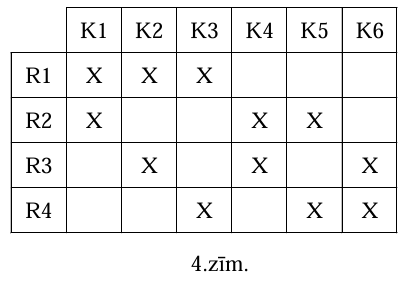
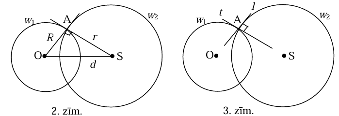

# <lo-sample/> LV.NOL.2010.5.1

Vai var pa apli izrakstīt naturālos skaitļus no $1$ līdz $12$ katru tieši vienu reizi
tā, lai katru divu blakus uzrakstītu skaitļu starpība būtu vai nu $1$, vai $2$?

<small>

* questionType:
* domain:

</small>

## Atrisinājums

Piemēram, skat. 1.zīm.

# <lo-sample/> LV.NOL.2010.5.2

Andris pieraksta datumu kā naturālu skaitli, bez atstarpes rakstot vienu aiz otra dienas
numuru mēnesī un mēneša numuru gadā. Piemēram, $2.$ jūliju viņš pieraksta kā $27$, bet
$18.$ septembri- kā $189$.

Cik ir tādu naturālu skaitļu, kas ir vairāk nekā viena datuma pieraksti Andra sistēmā?

<small>

* questionType:
* domain:

</small>

## Atrisinājums

Andra "kods" var būt divciparu, trīsciparu vai četrciparu. To atšifrējot, problēmas var
radīt tikai trīsciparu kodi, pie tam tikai tādi, kam pēdējais cipars ir $1$ vai $2$;
tad priekšpēdējais cipars noteikti ir $1$. Tā kā janvārī ir $31$ diena, iegūstam
$111; 211; 311;$ tā kā februārī ir augstākais $29$ dienas, iegūstam $112$ un $212$.
Tātad pavisam ir $5$ šādi kodi.

# <lo-sample/> LV.NOL.2010.5.3

Kādu lielāko daudzumu trijstūrīšu var iekrāsot 1.zīm. redzamajā figūrā, lai nekādiem
diviem iekrāsotiem trijstūrīšiem nebūtu ne kopīga mala, ne kopīgs stūris?

<small>

* questionType:
* domain:

</small>

## Atrisinājums

Katrā izdalītajā daļā drīkst nokrāsot augstākais vienu trijstūrīti (skat. 2.zīm.).
Tāpēc maksimums ir $4$ (piemēram, stūra un centrālā rūtiņa).

# <lo-sample/> LV.NOL.2010.5.4

Kvadrāts sastāv no $5 \times 5$ rūtiņām. Vai to var sagriezt $5$ gabalos, lai viens
būtu tāds, kāds redzams 2.zīm, bet pārējie četri būtu savā starpā vienādi?

<small>

* questionType:
* domain:

</small>

## Atrisinājums

Jā, var. Skat., piem., 3.zīm.

# <lo-sample/> LV.NOL.2010.5.5

Astoņi rūķīši katrs uzzinājuši vienu jaunu ziņu (katrs citu). Katram mājās ir telefons,
un viena saruna ilgst vienu stundu. Tās laikā abi runātāji pagūst viens otram izstāstīt
visus jaunumus.

Kāds ir mazākais stundu skaits, kuru laikā visi rūķīši var uzzināt visus jaunumus?

<small>

* questionType:
* domain:

</small>

## Atrisinājums

Atbilde: $3$ stundās.

Ja rūķīši runā šādi: $AB, CD, EF, GH ; AC, BD, EG, FH; AE, BF, CG, DH$, tad vajadzīgais
tiek sasniegts.

Tā kā katru jaunumu pēc $2$ stundām var zināt augstākais $4$ rūķīši, tad ar $2$ stundām
nepietiek.

# <lo-sample/> LV.NOL.2010.6.1

Pieci rūķīši sanesa savā namiņā kastes ar dārgakmeņiem. Katru kasti nesa tieši divi
rūķīši. Vai var gadīties, ka katrs rūķītis piedalījās tieši triju kastu nešanā?

Vai tas varētu notikt, ja kastu nešanā piedalītos tieši četri rūķīši?

<small>

* questionType:
* domain:

</small>

## Atrisinājums

**(A)** nē. Ja kastu būtu $n$, tad rūķīšu piedalīšanos kopā būtu gan $2 \cdot n$, gan
$5 \cdot 3$. Bet naturālam $n$ nevar pastāvēt vienādība $2n=15$.

**(B)** jā, skat. 4.zīm.

# <lo-sample/> LV.NOL.2010.6.2

Vai var atrast tādus veselus skaitļus $a$ un $b$, ka
1) $a \cdot 17-b \cdot 13=1$
2) $a \cdot 39-b \cdot 91=2$?

<small>

* questionType:
* domain:

</small>

## Atrisinājums

**(A)** jā; piemēram, $10 \cdot 17-13 \cdot 13=1$.

**(B)** nē, jo gan $39$, gan $91$ dalās ar $13$ , bet $2$- nedalās.

# <lo-sample/> LV.NOL.2010.6.3

Tabula sastāv no $5 \times 5$ kvadrātiskām rūtiņām. Vai var katrā rūtiņā ierakstīt pa
naturālam skaitlim tā, lai vienlaicīgi
1) visu ierakstīto skaitļu summa būtu nepāra skaitlis,
2) katrā tādā figūrā, kāda attēlota 3.zīm. (tā var būt novietota arī citādi), ierakstīto
   skaitļu summa arī būtu nepāra skaitlis?

<small>

* questionType:
* domain:

</small>

## Atrisinājums

Jā. Skat., piem., 5.zīm.

# <lo-sample/> LV.NOL.2010.6.4

Klases šaha turnīrā piedalās $10$ dalībnieki; katrs spēlē ar katru vienu reizi. Par
uzvaru piešķir $1$ punktu, par neizšķirtu $1 / 2$ punkta, par zaudējumu $0$ punktus.
Nolemts, ka klases lielmeistara nosaukumu piešķirs tiem, kas izcīnīs vismaz $7$ punktus.
Kāds lielākais skolēnu skaits šajā turnīrā var iegūt lielmeistara nosaukumu?

<small>

* questionType:
* domain:

</small>

## Atrisinājums

Turnīrā kopā izspēlē $45$ partijas un izcīna $45$ punktus (katrā partijā vienu).

Ja lielmeistaru būtu ne mazāk par $7$, tad viņu kopējais punktu skaits būtu vismaz
$7 \cdot 7=49$- pretruna.

Ja lielmeistaru būtu $6$, tad viņiem kopā jāizcīna vismaz $6 \cdot 7=42$ punkti; bet
atlikušie $4$ dalībnieki jau savā starpā vien izcīna $6$ punktus. Tātad kopā būtu
vismaz $48$ punkti; tā ir pretruna.

Tātad lielmeistaru skaits nevar būt vairāk par $5$. Pieci lielmeistari var
būt- piemēram, ja katrs no viņiem uzvar visus citus dalībniekus, bet savā starpā
lielmeistari spēlē neizšķirti; tad katrs iegūst $7$ punktus.

# <lo-sample/> LV.NOL.2010.6.5

Deviņi rūķīši katrs uzzinājuši vienu jaunu ziņu (katrs citu). Katram mājās ir telefons,
un viena saruna ilgst vienu stundu. Tās laikā abi runātāji pagūst viens otram izstāstīt
visus jaunumus.

Kāds ir mazākais stundu skaits, kuru laikā visi rūķīši var uzzināt visus jaunumus?

<small>

* questionType:
* domain:

</small>

## Atrisinājums

Ar $4$ stundām nepietiek. Pirmajā stundā vismaz viens rūķītis nerunā; tāpēc viņa
jaunumu pēc pirmās stundas zina tikai viens rūķītis- viņš pats. Pēc otrās stundas to
zina augstākais $2$, pēc trešās- augstākais četri, pēc ceturtās- augstākais astoņi
rūķiši.

Ar $5$ stundām pietiek:

$1.$ stundā runā $H$ un $I$;

$2.$- $4.$ stundā $A, B, C, D, E, F, G, H$ uzzina visu kā 5.5.uzdevuma risinājumā;

$5.$ stundā atkal runā $H$ un $I$.

# <lo-sample/> LV.NOL.2010.7.1

Rindā no sākuma bija uzrakstīti $2009$ vieninieki. Ar vienu gājienu nodzēš divus pirmos
rindā esošos skaitļus un tās otrā galā pieraksta abu nodzēsto skaitļu summu. Šādus
gājienus atkārto, līdz rindā paliek tikai viens skaitlis.

**(A)** cik gājienu tiks izdarīti?

**(B)** atrast vienīgo palikušo skaitli.

<small>

* questionType:
* domain:

</small>

## Atrisinājums

**(A)** ar katru gājienu skaitļu skaits samazinās par $1$. Tā kā tas dilst no $2009$
līdz $1$, tad pavisam izdarīs $2009-1=2008$ gājienus.

**(B)** uzrakstīto skaitļu summa paliek nemainīga. Tāpēc pēdējais palikušais skaitlis
būs $2009$.

# <lo-sample/> LV.NOL.2010.7.2

Dots, ka $x^{3}=y^{4}$ un $x^{11}=y^{15}$. Atrast $x$ un $y$, ja tie ir pozitīvi skaitļi.

<small>

* questionType:
* domain:

</small>

## Atrisinājums

No pirmās vienādības seko $x^{12}=y^{16}$. Dalot to ar otro vienādību, iegūst $x=y$.
Ievietojot pirmajā, seko $y=1$ un pēc tam $x=1$.

# <lo-sample/> LV.NOL.2010.7.3

Cik ir tādu naturālu skaitļu $x$ robežās no $1$ līdz $2010$ ieskaitot, ka
$(x+1)(x+2)(x+3)$ dalās ar $343$?

<small>

* questionType:
* domain:

</small>

## Atrisinājums

Ievērojam, ka $343=7 \cdot 7 \cdot 7$. Vismaz vienam no reizinātājiem
$x+1 ; x+2 ; x+3$ jādalās ar $7$. Tā kā skaitļi, kas dalās ar $7$, atšķiras viens no
otra vismaz par $7$, tad tieši viena iekava dalās ar $343$. Šī iekava ir viens no
skaitļiem $343 \cdot 1 ; 343 \cdot 2 ; 343 \cdot 3 ; 343 \cdot 4 ; 343 \cdot 5$, jo jau
$343 \cdot 6 > 2010$. Tāpēc meklējamo skaitļu ir $5 \cdot 3=15$.

# <lo-sample/> LV.NOL.2010.7.4

Kvadrātisks režģis sastāv no $4 \times 4$ vienādām kvadrātiskām rūtiņām. Kādu lielāko
daudzumu nogriežņu, kas kalpo par rūtiņu malām, var nokrāsot tā, lai nevienai no $16$
rūtiņām nebūtu nokrāsotas visas malas?

<small>

* questionType:
* domain:

</small>

## Atrisinājums

**Atbilde:** $32$.

Kā redzam 6.zīm., $32$ nogriežņus var nokrāsot. Katrai no 7.zīm. atzīmētajām rūtiņām
var nokrāsot ne vairāk kā $3$ malas; pieskaitot vēl $8$ atlikušos nogriežņus uz
kvadrāta kontūra, iegūstam, ka $8 \cdot 3+8=32$ tiešām ir maksimums.

# <lo-sample/> LV.NOL.2010.7.5

Seši rūķīši katrs uzzinājuši vienu jaunu ziņu (katrs citu). Katram mājās ir telefons,
un viena saruna ilgst vienu stundu. Tās laikā abi runātāji pagūst viens otram izstāstīt
visus jaunumus.

Kāds ir mazākais stundu skaits, kuru laikā visi rūķīši var uzzināt visus jaunumus?

<small>

* questionType:
* domain:

</small>

## Atrisinājums

Ar $2$ stundām nepietiek (skat. 5.5.risinājumu). Ar $3$ stundām mērķi var sasniegt,
piemēram, šādi (rūķīšus apzīmējam ar burtiem):

$1.$ stunda: $AD, BE, CF$;

$2.$stunda: $AE, BF, CD$;

$3.$ stunda: $AF, BD, CE$.

# <lo-sample/> LV.NOL.2010.8.1

Kuru no skaitļiem
$102^{2} \cdot 103^{2} \cdot \ldots \cdot 199^{2}$ un
$\left(102^{2}-1\right)\left(103^{2}-1\right) \ldots\left(199^{2}-1\right)$ sadalot
pirmskaitļu reizinājumā, iegūst vairāk **dažādu** pirmskaitļu? Par cik vairāk?

(**Paskaidrojums:** $24=2 \cdot 2 \cdot 2 \cdot 3$ satur divus dažādus pirmskaitļus
$-2$ un $3$.)

<small>

* questionType:
* domain:

</small>

## Atrisinājums

Pārveidojot otro skaitli, lietojot kvadrātu starpības formulu, iegūstam reizinājumu
$101 \cdot 103 \cdot 102 \cdot 104 \cdot \ldots \cdot 198 \cdot 200$. Redzam, ka otrajā
skaitlī ir **viens** papildus pirmskaitlis $101$. Skaitlis $200$, kas rodas labajā galā,
jaunus pirmskaitļus nedod.

# <lo-sample/> LV.NOL.2010.8.2

Trijstūrī $ABC$ divas malas ir vienādas savā starpā, un
$\sphericalangle ABC=20^{\circ}$. Pierādiet, ka $3 \cdot AC > AB$.

<small>

* questionType:
* domain:

</small>

## Atrisinājums

Šķirojam $3$ gadījumus.

**I**

$3 \cdot AC=3 \cdot AB > AB$.

**II**

$3 \cdot AC > 2 \cdot AC=AC+CB > AB$.

**III**

Tā kā $\sphericalangle ABE=60^{\circ}$ un $BA=BE$, tad $\triangle ABE$ ir vienādmalu.
Tāpēc $3AC=AC+CD+DE > AE=AB$.

# <lo-sample/> LV.NOL.2010.8.3

Četrciparu skaitlim pārlika ciparus citā kārtībā. Pierādīt: sākotnējā un iegūtā skaitļa
starpība dalās ar $9$.

<small>

* questionType:
* domain:

</small>

## Atrisinājums

Uzrakstām $\overline{abcd}=(999a+99b+9c)+(a+b+c+d)$. Atņemot saskaitāmie $(a+b+c+d)$
saīsinās.

# <lo-sample/> LV.NOL.2010.8.4

Vai eksistē tādi skaitļi
$a_{1}, \quad b_{1}, \quad c_{1}, \quad a_{2}, \quad b_{2}, \quad c_{2}, \quad$ ka
vienādība $\left(x^{2}+y^{2}+1\right)=\left(a_{1}x+b_{1}y+c_{1}\right)\left(a_{2}x+b_{2}y+c_{2}\right)$
ir identitāte?

<small>

* questionType:
* domain:

</small>

## Atrisinājums

Nē. Ja kaut viens no skaitļiem $a_{1}, b_{1}, a_{2}, b_{2}$ nav $0$, tad $x$ un $y$ var
izvēlēties tā, lai attiecīgā iekava, tātad arī visa labā puse, būtu $0$; bet kreisā
puse vienmēr ir pozitīva. Pretējā gadījumā labā puse ir konstante, bet kreisā- nav.

# <lo-sample/> LV.NOL.2010.8.5

Katras divas no $6$ lampām savienotas ar baltu vai sarkanu vītni. Pierādīt: var atrast
tādas $3$ lampas, kuras visas savā starpā savienotas ar vienas krāsas vītnēm.

<small>

* questionType:
* domain:

</small>

## Atrisinājums

N̦emam vienu lampu $A$; no tās iziet $5$ vītnes. Vismaz trīs no tām ir vienā krāsā;
varam pieņemt, ka $AB, AC, AD$ ir baltas. Ja kaut viena no vītnēm $BC, BD, CD$ arī ir
balta, mums ir balts trijstūris; pretējā gadījumā $BCD$ ir sarkans trijstūris.

# <lo-sample/> LV.NOL.2010.9.1

Atrodiet kaut vienu kvadrātvienādojumu ar veseliem koeficientiem, kam viena no saknēm ir
**(A)** $\sqrt{2}+1$,
**(B)** $\sqrt{7+4 \sqrt{3}}$.

**Piezīme.** Katrā uzdevuma daļā runā par **citu** kvadrātvienādojumu.

<small>

* questionType:
* domain:

</small>

## Atrisinājums

(A) piemēram, $x^{2}-2x-1=0$.

(B) ievērojam, ka $\sqrt{7+4 \sqrt{3}}=\sqrt{(\sqrt{3}+2)^{2}}=\sqrt{3}+2$. Tāpēc
    der, piemēram, vienādojums $x^{2}-4x+1=0$

# <lo-sample/> LV.NOL.2010.9.2

Divas riņķa līnijas krustojas. To rādiusu garumi ir $R$ un $r$, bet attālums starp to
centriem ir $d$. Vienā no abu rinķa līniju krustpunktiem tām abām novilktas pieskares.
Pierādīt: šīs pieskares ir perpendikulāras viena otrai tad un tikai tad, ja
$R^{2}+r^{2}=d^{2}$

<small>

* questionType:
* domain:

</small>

## Atrisinājums

Atceramies, ka

(A) pieskare ir perpendikulāra rādiusam, kura galapunktā tā novilkta,
(B) tātad taisne, kas novilkta perpendikulāri rādiusam tā galapunktā, ir pieskare.

1. Pieņemsim, ka $R^{2}+r^{2}=d^{2}$. Novelkam rādiusus uz r.l. krustpunktu $A$. Tad
   $OA^{2}+SA^{2}=OS^{2}$, tātad pēc Pitagora teorēmai apgrieztās teorēmas
   $\triangle OAS$ ir taisnleņķa. Tāpēc taisne $SA$ (pēc augšminētā (B) punkta) ir r.l.
   $w_{1}$ pieskare, un tāpat taisne $OA$ ir $w_{2}$ pieskare. Tātad abas pieskares
   punktā $A$ ir savstarpēji perpendikulāras.
   

2. Pieņemam, ka pieskares krustpunktā $A$ ir savstarpēji perpendikulāras (3.zīm.). Tā
   kā $t \perp l$, tad $t$ satur $w_{2}$ rādiusu, tātad iet caur $S$. Līdzīgi $l$ iet
   caur $O$. Tāpēc $\triangle OAS$ ir taisnleņķa, un no Pitagora teorēmas seko
   vajadzīgais.

# <lo-sample/> LV.NOL.2010.9.3

Šaurleņku trijstūra $A B C$ iekšpusē dots punkts $P$. Pierādīt: $P$ attālumu summa līdz ABC malām nav garāka par ABC lielāko augstumu.

<small>

* questionType:
* domain:

</small>

## Atrisinājums

Varam pieņemt, ka garākais augstums $h$ ir pret malu $c$. Tātad $c$ ir īsākā vai viena no īsākajām malām.

4.zīm.

Tad (skat. 4.zīm.), izsakot ABC laukumu divos veidos, iegūstam $\frac{1}{2} h c=\frac{1}{2} c f+\frac{1}{2} a d+\frac{1}{2} b e$, no kurienes seko $h=f+\frac{a}{c} \cdot d+\frac{b}{c} \cdot e$.

Tā kā $\frac{a}{c} \geq 1$ un $\frac{b}{c} \geq 1$, iegūstam $h \geq f+d+e$, k.b.j.

# <lo-sample/> LV.NOL.2010.9.4

Ap apaļu galdu sēž zēni un meitenes, zēnu ir trīs reizes vairāk nekā meiteņu. Tādu vietu, kur blakus sēž zēns un meitene, ir divreiz mazāk nekā pārējo vietu (t.i., tādu, kur blakus sēž vai nu zēns un zēns, vai meitene un meitene). Kāds ir mazākais iespējamais bērnu skaits?

<small>

* questionType:
* domain:

</small>

## Atrisinājums

Apzīmēsim meiteņu un zēnu daudzumus attiecīgi ar $m$ un $z$. Tad $z=3 m$, un pavisam ir $4 m$ bērnu.

Ja ir $a$ pāru „zēns-meitene", tad citu pāru ir $2 a$, tāpēc ir pavisam $3 a$ pāru. Tāpēc $3 a=4 m$. Tātad $m$ jādalās ar 3, un ir vismaz 12 bērnu. Piemēru ar 12 bērniem skat. 5.zīm.

# <lo-sample/> LV.NOL.2010.9.5

Atrisiniet naturālos skaitļos vienādojumu sistēmu $\left\{\begin{array}{l}x^{2}+y=z^{2} \\ y^{2}+x=t^{2}\end{array}\right.$.

<small>

* questionType:
* domain:

</small>

## Atrisinājums

Varam pieņemt, ka $x \geq y$. Tad $x^{2}<x^{2}+y<x^{2}+2 x+1=(x+1)^{2}$. Tāpēc $x^{2}+y$ atrodas starp diviem blakus esošu naturālu skaitļu kvadrātiem. Tātad tas nav naturāla skaitļa kvadrāts. Tāpēc sistēmai atrisinājuma naturālos skaitļos nav.

# <lo-sample/> LV.NOL.2010.10.1

a) dots, ka $x+y=n$. Pierādīt, ka $x^{2}+y^{2} \geq \frac{n^{2}}{2}$.

b) dots, ka $x+y+z=n$. Pierādīt, ka $x^{2}+y^{2}+z^{2} \geq \frac{n^{2}}{3}$.

<small>

* questionType:
* domain:

</small>

## Atrisinājums

a) $x^{2}+y^{2}=x^{2}+(n-x)^{2}=2 x^{2}-2 n x+n^{2}=2\left(x-\frac{n}{2}\right)^{2}+\frac{n^{2}}{2} \geq \frac{n^{2}}{2}$, jo kvadrāts nav negatīvs.

b) apzīmējam $x=\frac{n}{3}+a, y=\frac{n}{3}+b, z=\frac{n}{3}+c$; tad $a+b+c=(x+y+z)-3 \cdot \frac{n}{3}=0$. Tāpēc $x^{2}+y^{2}+z^{2}=\left(\frac{n}{3}+a\right)^{2}+\left(\frac{n}{3}+b\right)^{2}+\left(\frac{n}{3}+c\right)^{2}=\frac{n^{2}}{3}+\frac{2}{3} n(a+b+c)+\left(a^{2}+b^{2}+c^{2}\right)=$ $=\frac{n^{2}}{3}+\left(a^{2}+b^{2}+c^{2}\right) \geq \frac{n^{2}}{3}$, k.b.j.

# <lo-sample/> LV.NOL.2010.10.2

Dots, ka $a$ un $b$ ir naturāli skaitļi, $a^{2}$ dalās ar $b$ un $b^{2}$ dalās ar $a$. Pierādīt, ka $(a-b)^{3}$ dalās ar $a \cdot b$. Vai noteikti $(a-b)^{2}$ dalās ar $a \cdot b$ ?

<small>

* questionType:
* domain:

</small>

## Atrisinājums

Ievērojam, ka $(a-b)^{3}=a^{3}-3 a^{2} b+3 a b^{2}-b^{3}=a^{2} \cdot a-3 a b(a-b)-b^{2} \cdot b$. Tā kā $a^{2}$ dalās ar $b$, tad $a^{2} \cdot a$ dalās ar $a b$; tā kā $b^{2}$ dalās ar $a, \operatorname{tad} b^{2} \cdot b$ dalās ar $a b$. Tātad arī visa izteiksme dalās ar $a b$.

Ja $a=4$ un $b=2, \operatorname{tad}(a-b)^{2}$ nedalās ar $a b$.

# <lo-sample/> LV.NOL.2010.10.3

Taisnleņka trijstūrī ABC augstums no taisnā leņka B virsotnes ir BD . Trijstūros ABD un BCD ievilkto riņ̧̧u centri ir $\mathrm{O}_{1}$ un $\mathrm{O}_{2}$. Pierādīt, ka $\triangle \mathrm{ABC}$ un $\Delta \mathrm{O}_{1} \mathrm{DO}_{2}$ ir līdzīgi savā starpā.

<small>

* questionType:
* domain:

</small>

## Atrisinājums

Tā kā $\sphericalangle \mathrm{O}_{1} \mathrm{DB}=\sphericalangle \mathrm{O}_{2} \mathrm{DB}=45^{\circ}$, tad $\sphericalangle \mathrm{O}_{1} \mathrm{DO}_{2}=90^{\circ}$. Atceramies, ka $\triangle \mathrm{ADB}$ un $\triangle \mathrm{BDC}$ ir līdzīgi (piemēram, pēc diviem leņķiem). Līdzīgos trijstūros visi atbilstošie elementi ir proporcionāli; tāpēc $\mathrm{O}_{1} \mathrm{D}: \mathrm{AB}=\mathrm{O}_{2} \mathrm{D}: \mathrm{BC}$ (atbilstošie elementi - attālumi no iecentra līdz taisnā leņka virsotnei un hipotenūzai). Tāpēc $\Delta \mathrm{O}_{1} \mathrm{DO}_{2} \sim \Delta \mathrm{ABC}$ (leņku vienādība un sānu malu proporcionalitāte).

# <lo-sample/> LV.NOL.2010.10.4

Atrisināt naturālos skaitļos vienādojumu $x^{3}=y!+2$.

<small>

* questionType:
* domain:

</small>

## Atrisinājums

Pie $y \geq 4$ labā puse dalās ar 2 , bet nedalās ar 8 . Kreisajai pusei 2 jāsatur kā reizinātāju 3., 6., 9., ... pakāpē, tāpēc atrisinājuma nav. Atliek pārbaudīt $y=1 ; 2 ; 3$. Iegūstam atrisinājumu $x=2 ; y=3$.

# <lo-sample/> LV.NOL.2010.10.5

Turnīrā piedalās 6 komandas. Katrai ar katru citu jāspēlē tieši vienu reizi; neizšķirtu nav. Katru dienu komandas sadalās trīs pāros, un katra pāra komandas spēlē savā starpā. (Tātad katru dienu katra komanda spēlē vienu spēli.) Kāds ir mazākais dienu skaits, pēc kura var rasties situācija: jau ir skaidrs, kurai (vienīgajai) komandai pēc turnīra noslēguma būs vairāk uzvaru nekā jebkurai citai, un ir arī skaidrs, kurai (vienīgajai) komandai pēc turnīra noslēguma būs mazāk uzvaru nekā jebkurai citai?

<small>

* questionType:
* domain:

</small>

## Atrisinājums

Atbilde: pēc 4 dienām.

Apskatām 7.zīmējumu. Uzvarētājs noteikti būs A, zaudētājs - F, jo viņu pārsvars/atpalicība pirms pēdējās kārtas ir 2 uzvaras.

|  | A | B | C | D |  |  |
| :---: | :---: | :---: | :---: | :---: | :---: | :---: |
|  |  | 1 |  | 1 | 1 | 1 |
|  | 0 |  | 1 | 0 | 1 |  |
|  |  | 0 |  | 1 | 0 | 1 |
|  | 0 | 1 | 0 |  |  | 1 |
|  | 0 | 0 | 1 |  |  | 1 |
|  | 0 |  | 0 | 0 | 0 |  |

7.zīm.

Pierādīsim, ka ar 3 dienām nepietiek. Pieņemot pretējo, pirms divām pēdējām kārtām uzvarētāja pārsvaram jābūt vismaz 3 uzvaras, zaudētāja atpalicībai - tāpat. Bet starpība starp uzvarētāju un zaudētāju pēc 3.dienas var būt augstākais 3 , un $3<3+3$.

# <lo-sample/> LV.NOL.2010.11.1

Dots, ka $p$ un $q$ ir naturāli skaitļi un kvadrātvienādojuma $x^{2}+p x+q=0$ saknes ir $x_{1}$ un $x_{2}$. Pierādīt, ka
a) $x_{1}^{2}+x_{2}^{2}$,
b) $x_{1}^{8}+x_{2}^{8}$,
c) $x_{1}^{5}+x_{2}^{5}$

ir vesels skaitlis.

<small>

* questionType:
* domain:

</small>

## Atrisinājums

Ievērojam, ka $x_{1}^{2}+x_{2}^{2}=\left(x_{1}+x_{2}\right)^{2}-2\left(x_{1} x_{2}\right)=p^{2}-2 q$ ir vesels skaitlis. Tālāk, $x_{1}^{4}+x_{2}^{4}=\left(x_{1}^{2}+x_{2}^{2}\right)^{2}-2 x_{1}^{2} x_{2}^{2}$ arī ir vesels skaitlis. Līdzīgi seko, ka $x_{1}^{8}+x_{2}^{8}$ ir vesels skaitlis.

c) gadījumā vispirms pierādīsim, ka

$x_{1}^{3}+x_{2}^{3}=\left(x_{1}+x_{2}\right)\left(\left(x_{1}+x_{2}\right)^{2}-3 x_{1} x_{2}\right)=(-p)\left(p^{2}-3 q\right)$ ir vesels skaitlis.

Tālāk $\left(x_{1}^{5}+x_{2}^{5}\right)=\left(x_{1}^{4}+x_{2}^{4}\right)\left(x_{1}+x_{2}\right)-\left(x_{1} x_{2}\right)\left(x_{1}^{3}+x_{2}^{3}\right)$, un atkal lietojam Vjeta teorēmu līdz ar iepriekšējiem rezultātiem.

# <lo-sample/> LV.NOL.2010.11.2

Atrisināt veselos skaitļos vienādojumu $\frac{x^{2}}{2}+\frac{5}{y}=7$.

<small>

* questionType:
* domain:

</small>

## Atrisinājums

Ja $(x ; y)$ ir atrisinājums, tad arī $(-x ; y)$ ir atrisinājums. Tāpēc sākumā apskatām tikai gadījumu $x \geq 0$. Vienādojumu var pārveidot par $x^{2} y+10=14 y$ un tālāk par $y=\frac{10}{14-x^{2}}$. Tā kā $y$ jābūt veselam un $y \neq 0$, tad jābūt $\left|14-x^{2}\right| \leq 10$, no kurienes $4 \leq x^{2} \leq 24$; tā kā apskatām $x \geq 0$, tad $2 \leq x \leq 4$. Pārbaudot visas iespējas, iegūstam atrisinājumus (2;1), (-2;1), (3;2), $(-3 ; 2),(4 ;-5) ;(-4 ;-5)$.

# <lo-sample/> LV.NOL.2010.11.3

Dots, ka $a>b>c>d$. Pierādīt, ka $a-d+\frac{1}{a-b}+\frac{1}{b-c}+\frac{1}{c-d} \geq 6$.

Kad pastāv vienādība?

<small>

* questionType:
* domain:

</small>

## Atrisinājums

Pārveidojam nevienādību par $(a-b)+(b-c)+(c-d)+\frac{1}{a-b}+\frac{1}{b-c}+\frac{1}{c-d} \geq 6$ un lietojam nevienādību $x+\frac{1}{x} \geq 2$ pie $x=a-b ; b-c ; c-d$. Vienādība pastāv tad un tikai tad, kad $a-b=b-c=c-d=1$.

# <lo-sample/> LV.NOL.2010.11.4

Dots, ka ABCD ir izliekts četrstūris, kas nav paralelograms. Taisne, kas novilkta caur diagonāļu viduspunktiem, krusto malas AB un CD attiecīgi iekšējos punktos M un N . Pierādīt, ka trijstūru ABN un CDM laukumi ir vienādi savā starpā.

<small>

* questionType:
* domain:

</small>

## Atrisinājums

Apzīmējam ar $A_{1}, B_{1}, C_{1}, D_{1}$ punktu $A, B, C, D$ projekcijas uz taisnes EF. Tā kā $\Delta \mathrm{BFB}_{1}=\Delta \mathrm{DFD}_{1}(h l)$, tad $\mathrm{BB}_{1}=\mathrm{DD}_{1}$. Līdzīgi $\mathrm{CC}_{1}=\mathrm{AA}_{1}$.

Tāpēc $\mathrm{L}(\mathrm{ABN})=\mathrm{L}(\mathrm{AMN})+\mathrm{L}(\mathrm{BMN})=\frac{1}{2} \mathrm{MN}^{2}\left(\mathrm{AA}_{1}+\mathrm{BB}_{1}\right)$.

Līdzīgi $L(C D M)=\frac{1}{2} M N\left(C_{1}+D_{1}\right)$. No tā arī seko vajadzīgais.

# <lo-sample/> LV.NOL.2010.11.5

Turnīrā piedalās 8 komandas. Katrai ar katru citu jāspēlē tieši vienu reizi; neizšķirtu nav. Katru dienu komandas sadalās četros pāros, un katra pāra komandas spēlē savā starpā. (Tātad katru dienu katra komanda spēlē vienu spēli.) Kāds ir mazākais dienu skaits, pēc kura var rasties situācija: jau ir skaidrs, kurai (vienīgajai) komandai pēc turnīra noslēguma būs vairāk uzvaru nekā jebkurai citai, un ir arī skaidrs, kurai (vienīgajai) komandai pēc turnīra noslēguma būs mazāk uzvaru nekā jebkurai citai?

<small>

* questionType:
* domain:

</small>

## Atrisinājums

Atbilde: pēc 6 dienām.

Risinājums. Apskatām 9.zīm. Uzvarētājs noteikti būs A, zaudētājs - H, jo viņu pārsvars/atpalicība pirms pēdējās kārtas ir 2 uzvaras.

|  | A | B | C | D | E | F | G | H |
| :---: | :---: | :---: | :---: | :---: | :---: | :---: | :---: | :---: |
|  |  |  | 1 | 1 | 1 | 1 | 1 | 1 |
|  |  |  | 0 | 1 | 0 | 1 | 1 | 1 |
|  | 0 | 1 |  | 0 | 0 | 1 |  | 1 |
|  | 0 | 0 | 1 |  | 1 |  | 0 | 1 |
|  | 0 | 1 | 1 | 0 |  | 0 | 0 |  |
|  | 0 | 0 | 0 |  | 1 |  | 1 | 1 |
|  | 0 | 0 |  | 1 | 1 | 0 |  | 1 |
|  | 0 | 0 | 0 | 0 |  | 0 | 0 |  |

9.zīm.

Pierādīsim, ka ar 5 dienām nepietiek. Pieņemot pretējo, pēc 5.dienas uzvarētāja pārsvaram pār citiem jābūt vismaz 3 uzvaras, zaudētāja atpalicībai - tāpat. Bet starpība starp uzvarētāju un zaudētāju pēc 5.dienas var būt augstākais 5 , un $5<3+3$.

# <lo-sample/> LV.NOL.2010.12.1

Dots, ka $n$ - naturāls skaitlis, kas nedalās ar 5 . Kāda ir mazākā iespējamā ciparu summa skaitlim $\left(n^{2}-1\right)\left(n^{2}-4\right)+7$ ? Pie kādām $n$ vērtībām tā tiek sasniegta?

<small>

* questionType:
* domain:

</small>

## Atrisinājums

Viens no skaitļiem $n-2 ; n-1 ; n ; n+1 ; n+2$ dalās ar 5 . Tā kā tas nav $n$, tad $\left(n^{2}-1\right)\left(n^{2}-4\right)$ dalās ar 5 . Tā kā viens no reizinātājiem ir pāra, tad $\left(n^{2}-1\right)\left(n^{2}-4\right)$ dalās ar 10. Tāpēc apskatāmā skaitļa pēdējais cipars ir 7 . Pie $n=1$ un $n=2$ meklējamā ciparu summa ir 7 ; pie $n \geq 3$ skaitlim ir vismaz divi cipari. Tāpēc tā ciparu summa ir lielāka par 7 . Tātad mazākā iespējamā ciparu summa ir 7 , kas tiek sasniegta pie $n=1$ un $n=2$.

# <lo-sample/> LV.NOL.2010.12.2

Aplīšos 1.z̄̄m jāizvieto pa vienam naturālam skaitlim no 1 līdz 10 (tiem visiem jābūt dažādiem) tā, lai katra bultina ietu no mazāka skaitļla uz lielāku skaitli. Cik dažādu izvietojumu var izveidot?

1.zīm.

<small>

* questionType:
* domain:

</small>

## Atrisinājums

Acīmredzot jābūt $A=1$. Skaitllus starp „kreiso" un „labo" zaru var sadalīt $C_{9}^{3}=84$ veidos.

Kreisā zara iekšpusē iespējami 2 sadalījumi (B - mazākais skaitlis). C jābūt mazākajam labajā zarā; tālākais sadalījums iespējams $C_{5}^{2}=10$ veidos. Attiecībā uz F un H tālākas izvēles nav. Daļā ar G, I, K iespējami divi izvietojumi (G - mazākais skaitlis).

Pavisam iznāk $84 \cdot 2 \cdot 10 \cdot 2=3360$.

10.zīm.

# <lo-sample/> LV.NOL.2010.12.3

Atrisināt vienādojumu $\sqrt{1-x^{2}}+\sqrt{1-y^{2}}=2-x^{2}-y^{2}$.

<small>

* questionType:
* domain:

</small>

## Atrisinājums

Apzīmējam $1-x^{2}=a, 1-y^{2}=b ; \operatorname{tad} \sqrt{a}+\sqrt{b}=a+b$. Tā kā $0 \leq a \leq 1$ un $0 \leq b \leq 1$, tad $\sqrt{a} \geq a$ un $\sqrt{b} \geq b$, turklāt vienādības pastāv tad un tikai tad, ja a un b ir 0 vai 1 . Tāpēc iegūstam 9 atrisinājumus $(1 ; 1),(1 ;-1),(-1 ; 1),(-1 ;-1),(1 ; 0),(-1 ; 0),(0 ; 1),(0 ;-1)$, $(0 ; 0)$.

# <lo-sample/> LV.NOL.2010.12.4

Riņkī ievilkta sešstūra ABCDEF diagonāles AD , BE un CF krustojas vienā punktā. Pierādīt: sešstūra malas var sadalīt 2 grupās pa 3 malām katrā tā, ka abās grupās iekļauto malu garumu reizinājumi ir vienādi savā starpā.

<small>

* questionType:
* domain:

</small>

## Atrisinājums

No riņ̣kī ievilktu leņ̧u īpašībām seko, ka $\triangle \mathrm{BSC} \sim \Delta \mathrm{FSE}$. Tāpēc $\frac{\mathrm{BC}}{\mathrm{EF}}=\frac{\mathrm{SB}}{\mathrm{SF}}$.

Līdzīgi pierāda $\frac{\mathrm{AF}}{\mathrm{CD}}=\frac{\mathrm{SF}}{\mathrm{SD}} \quad$ un $\quad \frac{\mathrm{ED}}{\mathrm{AB}}=\frac{\mathrm{SD}}{\mathrm{SB}}$. Sareizinot šīs vienādības, iznāk $\frac{\mathrm{BC}}{\mathrm{EF}} \cdot \frac{\mathrm{AF}}{\mathrm{CD}} \cdot \frac{\mathrm{ED}}{\mathrm{AB}}=1$, no kurienes $\mathrm{BC} \cdot \mathrm{AF} \cdot \mathrm{ED}=\mathrm{EF} \cdot \mathrm{CD} \cdot \mathrm{AB}$.

# <lo-sample/> LV.NOL.2010.12.5

Regulārā 20-stūrī katrā virsotnē ir pa vienai monētai. Ar vienu gājienu var izvē̄ēties 2 monētas un tās pārbīdīt: vienu uz blakus virsotni pulksteņa rādītāja kustības virzienā, otru uz blakus virsotni pretēji pulksteņa rādītāja kustības virzienam. Vai, atkārtojot šādus gājienus, var savākt visas monētas
a) 4 kaudzēs pa 5 monētām katrā,
b) 5 kaudzēs pa 4 monētām katrā?

<small>

* questionType:
* domain:

</small>

## Atrisinājums

Atbilde: a) var, b) nevar.

Risinājums. a) sanumurējam virsotnes pēc kārtas ar skaitliem no 1 līdz 20 un savācam vispirms monētas no 1., 2., 3., 4., 5. virsotnes piektajā virsotnē, bet monētas no 6., 7., 8., 9., 10. virsotnes -6 .virsotnē. Pēc tam līdzīgi rīkojamies pārējām 10 monētām.

b) atkal sanumurējam virsotnes tāpat kā a) daļā un starp 1 . un 20. virsotni atzīmējam zaļu punktu Z. Ar S sapratīsim monētu aiznemto virsotnuu numuru summu (katras virsotnes numuru ieskaitām tik reižu, cik tajā ir monētu). Sākumā $S=1+2+\ldots+20=10 \cdot 21$. Paskatāmies, kā S mainās. Ja kārtējā gājienā Z šķērrso divas monētas vai nešķērso neviena, S nemainās. Ja kārtējā gājienā Z şkērso viena monēta, S mainās par 20 jeb par $2 \cdot 10$. Tāpēc S vienmēr ir $10 \cdot \mathrm{n}$, kur n - nepāra skaitlis. Bet, ja visas monētas savāktu pa 4 monētām kaudzē, $S$ dalītos ar 4. Tātad tas nav iespējams.
