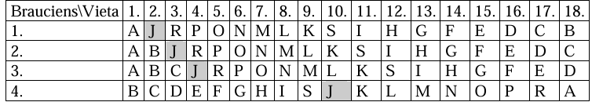

# <lo-sample/> LV.NOL.2011.5.1

Vai skaitli $119$ var izteikt kā vairāku naturālu skaitļu summu tā, lai arī šo skaitļu
reizinājums būtu $119$?

<small>

* questionType:
* domain:

</small>

## Atrisinājums

Jā, piemēram $7$, $17$, un $95$ vieninieki.

# <lo-sample/> LV.NOL.2011.5.2

Cik rūtiņas liels ir trijstūra $ABC$ laukums?

<small>

* questionType:
* domain:

</small>

## Atrisinājums

$S(ACM)=\frac{1}{2}S(ANCM)=\frac{1}{2} \cdot 3 \cdot 2=3$ rūtiņas, līdzīgi
$S(AKB)=\frac{1}{2} \cdot 4 \cdot 1=2$ rūtiņas un
$S(CBL)=\frac{1}{2} \cdot 2 \cdot 2=2$ rūtiņas.

Tātad $S(ABC)=S(AKLM)-S(ACM)-S(AKB)-S(CBL)= \\
=3 \cdot 4-3-2-2=5$ rūtiņas (skat. 1.zīm.).

# <lo-sample/> LV.NOL.2011.5.3

Četrdesmitvietīgs autobuss veica reisu no pilsētas $A$ uz pilsētu $G$, pa ceļam
pieturot pilsētās $B, C, D, E$ un $F$ (iespējams, citā secībā). Katrā pilsētā iekāpušo
un/vai izkāpušo pasažieru skaits parādīts tabulā:

| Pilsēta | Izkāpa | Iekāpa |
| :------ | :----- | :----- |
| $A$     | -      | $34$   |
| $B$     | $23$   | $30$   |
| $C$     | $28$   | $29$   |
| $D$     | $21$   | $32$   |
| $E$     | $26$   | $14$   |
| $F$     | $35$   | $22$   |
| $G$     | $28$   | -      |

Noteikt, kādā secībā tika apmeklētas pilsētas $B, C, D, E$ un $F$, ja zināms, ka
nevienā brīdī autobusā netika pārvadāts vairāk pasažieru kā autobusā ir vietu!

<small>

* questionType:
* domain:

</small>

## Atrisinājums

Ievērosim trīs nosacījumus, kuriem jābūt spēkā visu ceļojuma laiku: autobusā nevienā
brīdī nedrīkst būt vairāk par $40$ pasažieriem, nevienā pieturā no autobusa nevar
izkāpt vairāk pasažieru, nekā ir autobusā un katru pilsētu var apmeklēt ne vairāk kā
vienreiz.

Pirmā pilsēta ir $A$ un, izbraucot no tās, autobusā ir $34$ pasažieri, bet pēdējā ir
$G$, iebraucot tajā autobusā bija $28$ pasažieri.

Otrā pilsēta var būt $C$, tad pēc maršruta $AC$ nobraukšanas autobusā ir $35$ pasažieri
(apzīmēsim to $AC$ ($35$)) vai arī otrā pilsēta var būt $E$, tātad $AE$ ($22$).

Analizēsim iespējamos šo maršrutu turpinājumus:

1) $ACE$ ($23$) $\rightarrow$ $ACEB$ ($30$) vai $ACED$ ($34$), taču neviens no šiem
maršrutiem nav tālāk turpināms.

2) $ACF$ ($22$) $\rightarrow$ $ACFD$ ($33$) $\rightarrow$ $ACFDB$ ($40$) $\rightarrow$
$ACFDBE$ ($28$) $\rightarrow$ $ACFDBEG$ ($0$)

3) $ACF$ ($22$) $\rightarrow$ $ACFD$ ($33$) $\rightarrow$ $ACFDE$ ($21$)- maršruts nav
turpināms.

4) $AED$ ($33$) $\rightarrow$ $AEDB$ ($40$) $\rightarrow$ $AEDBF$ ($27$)- maršruts nav
turpināms.

5) $AED$ ($33$) $\rightarrow$ $AEDC$ ($34$)- maršruts nav turpināms.

Tātad vienīgais maršruts, kas apmierina visus noteikumus, ir $ACFDBEG$.

# <lo-sample/> LV.NOL.2011.5.4

Vai ir iespējams $5 \times 5$ rūtiņu kvadrātā izkrāsot dažas rūtiņas tā, ka katrā
$3 \times 3$ rūtiņu kvadrātā, kas ir lielā kvadrāta daļa, ir iekrāsotas tieši
**(A)** trīs, **(B)** četras rūtiņas?

<small>

* questionType:
* domain:

</small>

## Atrisinājums

**(A)** skat., piem., 2.zīm.; **(B)** skat., piem., 3.zīm.

# <lo-sample/> LV.NOL.2011.5.5

Astoņas raganas katra ir iemācīusies jaunu burvestību (katra citu). Katrai raganai ir
mobilais telefons. Kad viena ragana piezvana otrai, tās vienas minūtes laikā paspēj
viena otrai iemācīt visas burvestības, ko māk pašas. Kāds ir mazākais iespējamais
laiks, pēc kura visas raganas būs iemācījušās visas jaunās burvestības?

<small>

* questionType:
* domain:

</small>

## Atrisinājums

Atbilde: pēc $3$ minūtēm.

Ar trim minūtēm pietiek, ja sarunas raganu starpā notiek, piemēram, šādi:

$1.$ minūte: $AB, CD, EF, GH$.
$2.$ minūte: $AC, BD, EG, FH$.
$3.$ minūte: $AE, BF, CG, DH$.

Tā kā katru jauno burvestību pēc $2$ minūtēm var zināt augstākais $4$ raganas, tad ar
$2$ minūtēm nepietiek.

# <lo-sample/> LV.NOL.2011.6.1

Vai naturālos skaitļus no $1$ līdz $21$ var sadalīt grupās tā, ka katrā grupā lielākais
skaitlis ir vienāds ar pārējo skaitļu summu?

<small>

* questionType:
* domain:

</small>

## Atrisinājums

Ja tāds sadalījums būtu iespējams, tad katrā grupā un līdz ar to arī visu skaitļu summa
būtu pāra skaitlis (katrā grupā ietilpstošo skaitļu summa ir $2M_{i}$, kur $M_{i}$ ir
attiecīgās grupas lielākais skaitlis). Taču visu doto skaitļu summa
$1+2+3+\cdots+21=231$ ir nepāra skaitlis.

# <lo-sample/> LV.NOL.2011.6.2

Visi piecciparu naturālie skaitļi, kuru pierakstā katrs no cipariem $1, 2, 3, 4, 5$
izmantots tieši vienu reizi, ir uzrakstīti virknē augošā secībā:
$12345, 12354, 12435, \ldots$. Kurš pēc kārtas šajā virknē ir skaitlis $45321$?

<small>

* questionType:
* domain:

</small>

## Atrisinājums

Pavisam šajā virknē ir $5 \cdot 4 \cdot 3 \cdot 2 \cdot 1=120$ skaitļi. Interesējošais
skaitlis ir pēdējais, kas sākas ar $4$, un pēc šī skaitļa virknē vēl ir $24$ skaitļi,
kas sākas ar ciparu $5$. Tātad šajā virknē skaitlis $45321$ atrodas $96.$ vietā.

# <lo-sample/> LV.NOL.2011.6.3

Vai var atrast tādus veselus skaitļus $x$ un $y$, ka
**(A)** $12x-8y=2$;
**(B)** $11x-7y=2$?

<small>

* questionType:
* domain:

</small>

## Atrisinājums

**(A)** nē, jo gan $12$, gan $8$ dalās ar $4$, bet $2$- nedalās.

**(B)** jā; piemēram, $11 \cdot 4-7 \cdot 6=2$.

# <lo-sample/> LV.NOL.2011.6.4

Sagriez zīmējumā redzamo figūru pa rūtiņu malām četrās gan pēc formas, gan pēc laukuma
vienādās daļās tā, lai katrā no tām būtu pa vienam melnam un pa vienam baltam aplītim.

<small>

* questionType:
* domain:

</small>

## Atrisinājums

Skat., piem., 4.zīm.

# <lo-sample/> LV.NOL.2011.6.5

$6 \times 6$ rūtiņas lielā kvadrātā izkrāso sešas rūtiņas tā, lai no tā nevarētu
izgriezt ne taisnstūri $1 \times 6$ rūtiņas, ne kvadrātu $3 \times 3$ rūtiņas, kam
visas rūtiņas ir neizkrāsotas.

<small>

* questionType:
* domain:

</small>

## Atrisinājums

Skat., piem., 5.zīm.

# <lo-sample/> LV.NOL.2011.7.1

Atrodiet skaitļa $1^{2}+2^{2}+\cdots+99^{2}$ pēdējo ciparu.

<small>

* questionType:
* domain:

</small>

## Atrisinājums

Tā kā katriem desmit pēc kārtas ņemtiem skaitļiem kvadrātu summa beidzas ar vienu un to
pašu ciparu, un šai summai pievienojot $0^{2}$, tajā būs desmit desmitnieku
$(0,1,2, \ldots 9; 10, 11$, ..., 19; ...; 90, 91, ..., 99), tātad meklētās summas
pēdējais cipars ir nulle.

# <lo-sample/> LV.NOL.2011.7.2

Cik ir tādu naturālu skaitļu $n$ no $1$ līdz $2011$ ieskaitot, ka skaitlis
$(n+1)(n+2)(n+3)$ dalās ar $125$?

<small>

* questionType:
* domain:

</small>

## Atrisinājums

Ievērojam, ka $125=5 \cdot 5 \cdot 5$. Vismaz vienam no reizinātājiem
$n+1 ; n+2 ; n+3$ jādalās ar $5$ . Tā kā skaitļi, kas dalās ar $5$, atšķiras viens no
otra vismaz par $5$, tad tieši viena iekava dalās ar $125$. Šī iekava ir viens no
skaitļiem $125 \cdot k$, kur $k=1,2,3, \ldots, 16$, jo jau $125 \cdot 17 > 2011$.
Tāpēc meklējamo skaitļu ir $16 \cdot 3=48$.

# <lo-sample/> LV.NOL.2011.7.3

Pa apli uzrakstīti pieci dažādi skaitļi, nekādu divu blakus uzrakstīto skaitļu
reizinājums nav pozitīvs. Aplūkojam visus piecus triju pēc kārtas uzrakstītu skaitļu
reizinājumus. Cik no tiem ir pozitīvi?

<small>

* questionType:
* domain:

</small>

## Atrisinājums

**Atbilde:** tieši viens no tiem.

Vispirms pierādīsim, ka kāds no skaitļiem ir $0$. Ja neviens no tiem nav nulle, tad
visu blakus skaitļu reizinājumi ir negatīvi, tātad jebkuri divi blakus skaitļi ir ar
pretējām zīmēm. Ja mēs skaitļus apzīmējam ar $a, b, c, d, e$, tad $a$ un $b$ ir ar
pretējām zīmēm, $b$ un $c$ ir ar pretējām zīmēm, tātad $a$ un $c$ ir ar vienādām zīmēm.
Tieši tāpat pamato, ka $c$ un $e$ arī ir ar vienādām zīmēm. Bet tātad arī $a$ un $e$ ir
ar vienādām zīmēm un reizinājums $ae$ ir pozitīvs- pretruna.

Tātad, viens no skaitļiem ir $0$, pieņemsim, ka $e=0$. Tad zīmes skaitļiem $a, b, c, d$
var būt vai nu " $+ - + -$ " vai " $- + - +$ ". Redzams, ka no reizinājumiem
$abc$, $bcd$ viens ir pozitīvs (" $- + -$ ") un viens negatīvs (" $+ - +$ "). Pārējie
trīs triju blakusstāvošu skaitļu reizinājumi satur reizinātāju $e$, tātad to vērtība ir
$0$. Tātad tieši viens no šiem reizinājumiem ir pozitīvs.

# <lo-sample/> LV.NOL.2011.7.4

Vai $8 \times 8$ rūtiņas lielā kvadrātā var aizkrāsot **(A)** $16$ rūtiņas, **(B)**
$17$ rūtiņas tā, ka nekādas divas aizkrāsotās rūtiņas neatrodas blakus? (Par blakus
rūtiņām sauksim rūtiņas, kurām ir kopīgs vismaz viens punkts).

<small>

* questionType:
* domain:

</small>

## Atrisinājums

**(A)** Var, skat., piem., 6.zīm.

**(B)** Nē, nevar. Kvadrātu $8 \times 8$ rūtiņas sadalām $16$ kvadrātiņos ar izmēriem
$2 \times 2$ rūtiņas. Vismaz vienā no tiem būs vismaz divas aizkrāsotās rūtiņas, bet
tās ir blakusrūtiņas.

# <lo-sample/> LV.NOL.2011.7.5

Pilsētā, kurā dzīvo godīgie iedzīvotāji (kas vienmēr runā tikai taisnību) un blēži (kas
vienmēr melo), notika domes vēlēšanas, kurās piedalījās visi pilsētas iedzīvotāji.
Balsot varēja par kādu no četrām partijām $A, B, C$ un $D$, un katrs iedzīvotājs
nobalsoja tieši par vienu partiju. Pirms rezultātu apkopošanas žurnālisti veica visu
iedzīvotāju aptauju. Uz jautājumu „Vai jūs balsojāt par partiju $A$?" ar "Jā" atbildēja
$22 \%$ pilsētas iedzīvotāju. Uz līdzīgu jautājumu par partiju " $B$ " ar "Jā" atbildēja
$33 \%$, par partiju " $C$ "- $44\%$, bet par partiju " $D$ " $55 \%$ iedzīvotāju. Cik
procenti pilsētas iedzīvotāju ir godīgie iedzīvotāji un cik blēži?

<small>

* questionType:
* domain:

</small>

## Atrisinājums

Ar $g$ apzīmēsim cik $\%$ no visiem iedzīvotājiem ir godīgie, ar $g_{A}$ (resp.
$g_{B}, g_{C}, g_{D}$)- tos godīgos iedzīvotājus ($\%$ no visiem iedzīvotājiem), kas
balsoja par $A$ (resp., B, C, D) partiju, $g_{A}+g_{B}+g_{C}+g_{D}=g$; līdzīgi ar
$b, b_{A}, b_{B}, b_{C}, b_{D}$ apzīmēsim blēžus ( $\%$ no visiem iedzīvotājiem).

Par $A$ pozitīvi atbildēja godīgie iedzīvotāji, kas balsoja par $A$ un tie blēži, kas
nebalsoja par $A$. Tātad $g_{A}+b-b_{A}=22 \%$. Līdzīgi:
$g_{B}+b-b_{B}=33 \%, g_{C}+b-b_{C}=44 \%$ un $g_{D}+b-b_{D}=55 \%$.

Saskaitot šīs vienādības, iegūstam $g+3b=154 \%$, tātad $2b=54 \%$ jeb $b=27 \%$ un
$g=73 \%$.

# <lo-sample/> LV.NOL.2011.8.1

Piecciparu skaitlis $B$ ir iegūts no mazāka piecciparu skaitļa $A$, samainot vietām tā
ciparus. Pierādīt, ka $B-A$ dalās ar $9$.

<small>

* questionType:
* domain:

</small>

## Atrisinājums

Uzrakstām $\overline{abcde}=(9999a+999b+99c+9d)+(a+b+c+d+e)$. Atņemot saskaitāmie
$(a+b+c+d+e)$ saīsinās.

# <lo-sample/> LV.NOL.2011.8.2

Zināms, ka skaitlis $1$ ir vienādojuma $x^{2}+px+q=0$ sakne. Ar ko ir vienāda summa
$p+q$?

<small>

* questionType:
* domain:

</small>

## Atrisinājums

Ievietojot $x=1$, iegūstam $1+p+q=0$ jeb $p+q=-1$.

# <lo-sample/> LV.NOL.2011.8.3

Trijstūrī $ABC$ $\sphericalangle ABC=30^{\circ}$. Uz malas $AB$ izvēlēts punkts $E$, bet
uz malas $BC$ punkts $F$, tā, ka trijstūris $CEF$ ir vienādmalu. Pierādīt, ka punkts $F$
ir malas $BC$ viduspunkts.

<small>

* questionType:
* domain:

</small>

## Atrisinājums

$\sphericalangle FCE=\sphericalangle CEF=\sphericalangle EFC=60^{\circ}$. Tad
$\sphericalangle BFE=180^{\circ}-60^{\circ}=120^{\circ}$ (blakusleņķi) un
$\sphericalangle BEF=180^{\circ}-30^{\circ}-120^{\circ}=30^{\circ}$, tātad
$\triangle EBF$- vienādsānu un $BF=EF=FC$ (skat. 7.zīm.)

# <lo-sample/> LV.NOL.2011.8.4

Apskatām zīmējumā parādīto figūru, kas sastāv no $32$ rūtiņām. Kāds ir lielākais dažādu
taisnstūru skaits, kuros to var sagriezt (griezumus jāveic tikai pa rūtiņu malām)?
Atbildi pamato! (Divus taisnstūrus uzskata par atšķirīgiem, ja tiem atšķiras izmēri
nevis tikai novietojums, piem.,  un 
ir vienādi taisnstūri.)

<small>

* questionType:
* domain:

</small>

## Atrisinājums

Figūru var sagriezt augstākais $7$ dažādos taisnstūros, piem., skat. 8.zīm.

Ja to sagrieztu tādos taisnstūros, kuru laukums nepārsniedz $6$ rūtiņas, tad to laukumu
summa nepārsniegtu $1+2+3+4+4+5+6+6=31 < 32$ (šie taisnstūri ir ar izmēriem
$1 \times 1,1 \times 2$, $1 \times 3,1 \times 4,2 \times 2,1 \times 5,1 \times 6$
un $2 \times 3$ rūtiņas).

Tāpēc, figūru sagriežot kaut kādā skaitā taisnstūru, kāda iegūtā taisnstūra laukums būs
vismaz $8$. Pie tam, neviena taisnstūra laukums nebūs vienāds ar $7$. Tāpēc, ja figūru
sagrieztu vismaz $8$ dažādos taisnstūros, tad to laukumu summa, ievērojot visu
augstākminēto, būtu vismaz $1+2+3+4+4+5+6+8=33 > 32$- pretruna. Tāpēc $7$ ir lielākais
dažādo taisnstūru skaits, kuros figūru var sagriezt.

# <lo-sample/> LV.NOL.2011.8.5

Pilsētā, kurā dzīvo godīgie iedzīvotāji (kas vienmēr runā tikai taisnību) un blēži (kas
vienmēr melo), notika domes vēlēšanas, kurās piedalījās visi pilsētas iedzīvotāji.
Balsot varēja par kādu no četrām partijām $A, B, C$ un $D$, un katrs iedzīvotājs
nobalsoja tieši par vienu partiju. Pirms rezultātu apkopošanas žurnālisti veica visu
iedzīvotāju aptauju. Uz jautājumu "Vai jūs balsojāt par partiju $A$?" ar "Jā" atbildēja
$33\%$ pilsētas iedzīvotāju. Uz līdzīgu jautājumu par partiju " $B$ " ar "Jā" atbildēja
$44\%$, par partiju " $C$ "- $55\%$, bet par partiju " $D$ " $0\%$ iedzīvotāju. Kāds
patiesībā bija balsu sadalījums, t.i., cik procenti iedzīvotāju nobalsoja par katru
partiju?

<small>

* questionType:
* domain:

</small>

## Atrisinājums

Tā kā par partiju $D$ neviens iedzīvotājs nav atbildējis ar "jā", tad visi blēži ir
balsojuši par šo partiju un $g_{D}=0$ (*apzīmējumi tādi paši kā 7.5.uzdevuma risinājumā*).
Par partiju $A$ ar "Jā" atbildēja visi godīgie iedzīvotāji, kas balsoja par $A$
(apzīmēsim tos ar $g_{A}$ ) un visi blēži (apzīmēsim tos ar $b$), tātad
$g_{A}+b=33 \%$. Līdzīgi par partiju $B$ balsoja $g_{B}+b=44 \%$ iedzīvotāju, bet par
partiju $C-g_{C}+b=55 \%$.

Saskaitot visas vienādības, iegūstam $g_{A}+g_{B}+g_{C}+3b=g+3b=132 \%$ jeb $2b=32 \%$
un $b=16 \%$. Tātad par partiju $A$ ir balsojuši $17 \%$, par $B$- $28 \%$, par
$C$- $39\%$, par $D$- $16 \%$ iedzīvotāju.

# <lo-sample/> LV.NOL.2011.9.1

Apskatām funkcijas $y=ax^{2}+x+b$, kur $a$ un $b$- reāli skaitļi, pie tam $a+b=2011$.
Pierādīt, ka visu šādu funkciju grafikiem ir divi kopīgi punkti.

<small>

* questionType:
* domain:

</small>

## Atrisinājums

Ja $x=1$, tad $y=a+1+b=2012$. Ja $x=-1$, tad $y=a-1+b=2010$. Tātad punkti $(1; 2012)$
un $(-1 ; 2010)$ pieder visu minēto funkciju grafikiem.

# <lo-sample/> LV.NOL.2011.9.2

Kvadrātā $ABCD$ ir ievilkts riņķa līnijas loks $AC$ (riņķa līnijas centrs ir $D$, bet
rādiuss $DA$; skat.zīm.). Uz loka $AC$ atzīmēts tāds punkts $E$, ka
$\sphericalangle ADE=2 \sphericalangle ABE$. Aprēķināt $\sphericalangle ABE$ lielumu.

<small>

* questionType:
* domain:

</small>

## Atrisinājums

$\underline{Atbilde:}$ $\sphericalangle ABE=15^{\circ}$.

Apzīmēsim $\sphericalangle ABE=x$, tad $\sphericalangle ADE=2x$. Tā kā
$\triangle ADE$- vienādsānu, tad
$\sphericalangle DAE=\left(180^{\circ}-2x\right):2=90^{\circ}-x$. Tātad
$\sphericalangle BAE=x$ un $\triangle AEB$ ir vienādsānu trijstūris, kur
$AE=BE$. $\sphericalangle BEC=90^{\circ}-x=\sphericalangle DAE$, tātad
$\triangle AED=\triangle BEC$ ($m \ell m$), tātad arī $DE=EC=DC$ un
$\triangle DEC$- vienādmalu. $\sphericalangle EDC=60^{\circ}$,
$\sphericalangle ADE=30^{\circ}=2x$ un $x=15^{\circ}$. Tātad
$\sphericalangle ABE=15^{\circ}$.

# <lo-sample/> LV.NOL.2011.9.3

Aplī uzrakstīti $k$ dažādi naturāli skaitļi. Starp tiem pāra skaitļu ir trīs reizes
vairāk nekā nepāra skaitļu. Tādu vietu, kur blakus esošo skaitļu summa dalās ar $2$, ir
divreiz vairāk nekā tādu vietu, kur blakus esošo skaitļu summa nedalās ar $2$. Kāda ir
mazākā iespējamā $k$ vērtība?

<small>

* questionType:
* domain:

</small>

## Atrisinājums

$\underline{Atbilde:}$ $k=12$.

Apzīmēsim pāra skaitļus ar $p$, bet nepāra ar $n$. Tā kā $p$ skaits ir trīs reizes
lielāks par $n$ skaitu, tad $k$ jādalās ar $4$. Tā kā blakus esošo skaitļu pāru skaits
arī ir $k$, tad $k$ jādalās ar $3$, tātad $k$ jādalās ar $12$.

Piemērs parāda, ka $12$ skaitļus var izvietot atbilstoši uzdevuma nosacījumiem.

# <lo-sample/> LV.NOL.2011.9.4

Pierādīt, ka nav tādu naturālu skaitļu $a, x$, $y$ un $z$, ka
$7^{a}=7^{x}+7^{y}+7^{z}$.

<small>

* questionType:
* domain:

</small>

## Atrisinājums

Ja dotā vienādība izpildās, tad $a > x, a > y$ un $a > z$. Naturāliem skaitļiem no
šejienes seko nevienādības $a \geq x+1, a \geq y+1$ un $a \geq z+1$.

Tātad
$7^{a}=7 \cdot 7^{a-1}=4 \cdot 7^{a-1}+7^{a-1}+7^{a-1}+7^{a-1} > 7^{x}+7^{y}+7^{z}$ un
nav tādu naturālu skaitļu $a, x, y, z$, ka $7^{a}=7^{x}+7^{y}+7^{z}$.

# <lo-sample/> LV.NOL.2011.9.5

Sacensībās piedalījās deviņas kamaniņbraucējas. Sacensību uzvarētāju nosaka pēc četru
braucienu laiku kopsummas- kam šī summa mazāka, tā ieņem augstāku vietu. Atsevišķu
sportistu braucienu laiki atsevišķos braucienos un šo laiku kopsumma visām sportistēm
bija atšķirīga. Kamaniņbraucēja Maija visos braucienos ienēma vienu un to pašu- $N$-to
vietu. Kādai lielākajai $N$ vērtībai iespējams, ka Maija kopvērtējumā tomēr uzvarēs,
t.i., iegūs $1.$ vietu?

<small>

* questionType:
* domain:

</small>

## Atrisinājums

$\underline{Atbilde:}$ $N \leq 7$.

Ja Maija kādai sportistei būs zaudējusi visos četros braucienos, tad viņa būs zaudējusi
šai sportistei arī kopvērtējumā. Tātad, lai Maija kopvērtējumā būtu pirmā, nedrīkst
atrasties neviena tāda sportiste, kura būtu ātrāka par Maiju visos četros braucienos.
Pie $N=7$ tas ir iespējams, skat., piem., tabulu.

Pierādīsim, ka $N$ nevar būt lielāks par $7$. Ja $N$ būtu $8$, tad katrā braucienā
tikai viena sportiste būtu zaudējusi Maijai un kopumā būtu tikai četras sportistes no
astoņām, kas kopvērtējumā varētu būt zaudējušas Maijai, tātad Maija kopvērtējumā
nevarētu būt ieguvusi augstākais $5.$ vietu.

# <lo-sample/> LV.NOL.2011.10.1

**(A)** Dots, ka $s+t=p$. Pierādīt, ka $2s^{2} \geq p^{2}-2t^{2}$.

**(B)** Dots, ka $s+t+u=p$. Pierādīt, ka $3s^{2} \geq p^{2}-3t^{2}-3u^{2}$.

<small>

* questionType:
* domain:

</small>

## Atrisinājums

**(A)** $(s+t)^{2}=p^{2} \Rightarrow s^{2}+2st+t^{2}=p^{2} \Rightarrow s^{2}+2st-t^{2}=p^{2}-2t^{2} \Rightarrow 2s^{2}-(s-t)^{2}=p^{2}-2t^{2}$.
Tā kā $(s-t)^{2} \geq 0$, tad $2s^{2} \geq p^{2}-2t^{2}$, k.b.j.

**(B)** $(s+t+u)^{2}=p^{2} \Rightarrow s^{2}+t^{2}+u^{2}+2st+2su+2tu=p^{2} \Rightarrow$ $s^{2}-2t^{2}-2u^{2}+2st+2su+2tu=p^{2}-3t^{2}-3u^{2} \Rightarrow 3s^{2}-(s-t)^{2}-(s-u)^{2}-(t-u)^{2}=p^{2}-3t^{2}-3u^{2}$.

Tā kā $(s-t)^{2} \geq 0,(s-u)^{2} \geq 0$ un $(t-u)^{2} \geq 0$, tad
$3s^{2} \geq p^{2}-3t^{2}-3u^{2}$, k.b.j.

# <lo-sample/> LV.NOL.2011.10.2

Trijstūrī $ABC$ novilkts augstums $AD$. Zināms, ka $AC > AB$. Pierādīt, ka
$DC-DB > AC-AB$.

<small>

* questionType:
* domain:

</small>

## Atrisinājums

Ja $AD$ atrodas trijstūra $ABC$ iekšpusē, atliekam punktu $C_{1}$ simetriski punktam $C$
attiecībā pret taisni $AD$. Tad $DC_{1}=DC$ un $AC_{1}=AC$. No trijstūra nevienādības
trijstūrī $ABC_{1}$ seko $DC-DB=DC_{1}-DB=C_{1}B > AC_{1}-AB=AC-AB$.

Ja $\triangle ABC$ ir platleņķa trijstūris un $AD$ atrodas ārpus trijstūra $ABC$,
pierādāmais apgalvojums tieši seko no trijstūra nevienādības trijstūrī $ABC$.

# <lo-sample/> LV.NOL.2011.10.3

Ar $[a]$ apzīmējam lielāko veselo skaitli, kas nepārsniedz $a$. Atrisināt pozitīvos
skaitļos vienādojumu $x \cdot[x \cdot[x]]=41$.

<small>

* questionType:
* domain:

</small>

## Atrisinājums

$\underline{Atbilde:}$ vienīgais šāds skaitlis ir $3 \frac{8}{11}$.

Ja $x \geq 4$, tad vienādojuma kreisā puse nav mazāka par $64$ un prasītā vienādība
neizpildās.

Ja $x < 3$, tad vienādojuma kreisā puse nepārsniedz $27$ un prasītā
vienādība neizpildās.

Tātad $3 \leq x < 4$ un iegūstam vienādojumu $x \cdot[3x]=41$. Tā kā $9 \leq 3x < 12$,
tad šķirojam variantus:

a) $[3x]=9 ; 9x=41, x=4 \frac{5}{9} \quad$- neder, jo $[x] \neq 3$;
b) $[3x]=10 ; 10x=41, x=4.1$- neder, jo $[x] \neq 3$;
c) $[3x]=11 ; 11x=41, x=3 \frac{8}{11}$- der (nepieciešama pārbaude).

# <lo-sample/> LV.NOL.2011.10.4

Trijstūris $ABC$ ir vienādsānu $(AB=BC)$ un $\sphericalangle ABC=30^{\circ}$. Uz malas
$AB$ izvēlēts punkts $E$, bet uz malas $BC$- punkts $F$, tā, ka trijstūris $CEF$ ir
vienādmalu. Aprēķināt trijstūru $CEF$ un $ABC$ laukumu attiecību!

<small>

* questionType:
* domain:

</small>

## Atrisinājums

$\sphericalangle BAC=\sphericalangle BCA=\left(180^{\circ}-30^{\circ}\right):2=75^{\circ}, \sphericalangle FCE=\sphericalangle CEF=\sphericalangle EFC=60^{\circ}$.
Tad $\sphericalangle BFE=180^{\circ}-60^{\circ}=120^{\circ}$ (blakusleņķik) un
$\sphericalangle BEF=180^{\circ}-30^{\circ}-120^{\circ}=30^{\circ}$, tātad
$\triangle EBF$- vienādsānu un $BF=EF=FC$.

Apzīmēsim $AB=BC=2a$, tad $FC=BF=a$. Tad $S_{CEF}=\frac{\sqrt{3}}{4}a^2$ un

$S_{ABC}=\frac{1}{2} \cdot 2a \cdot 2a \cdot \sin 30^{\circ}=a^{2}$. Tātad
$\frac{S_{CEF}}{S_{ABC}}=\frac{\sqrt{3}}{4}$.

# <lo-sample/> LV.NOL.2011.10.5

Bobslejista Jāņa komanda piedalījās sacensībās, kurās uzvarētāju nosaka pēc četru
braucienu laiku kopsummas- kam šī summa mazāka, tas ieņem augstāku vietu. Jāņa komanda
pirmajā braucienā ieņēma $2.$, otrajā braucienā- $3.$, trešajā $4.$, bet ceturtajā
braucienā- $10.$ vietu. Pavisam sacensībās piedalījās $18$ komandas. Atsevišķu komandu
braucienu laiki atsevišķos braucienos un šo laiku kopsumma visām komandām bija
atšķirīga. Kādu augstāko un kādu zemāko vietu kopvērtējumā varēja iegūt Jāņa komanda?

<small>

* questionType:
* domain:

</small>

## Atrisinājums

$\underline{Atbilde:}$ augstākā- $1.$ vieta, zemākā- $16.$ vieta.

Jāņa komanda noteikti ir zaudējusi tām komandām, kurām tā ir zaudējusi katrā atsevišķā
braucienā. Ja ir zaudēts ne visos braucienos, tad kopvērtējumā var būt uzvarējusi gan
viena, gan otra komanda. Pirmo vietu Jāņa komanda var iegūt tad, ja neatrodas tāda
komanda, kura būtu bijusi labāka par Jāņa komandu visos braucienos. Tas ir iespējams,
ja komandas atsevišķos braucienos finišējušas, piemēram šādi (Jāņa komanda apzīmēta ar
$J$):

Šeit jāņem vērā, ka vietu secība dažādos braucienos nenozīmē vienādu laika starpību.
Piemēram, pirmajā braucienā pirmo divu vietu rezultātu starpība neko neļauj spriest par
pirmo divu vietu rezultātu starpību citos braucienos.

Zemākā iespējamā Jāņa komandas vieta būs tad, ja augstāk par Jāņa komandu atradīsies
visas komandas, kas ir uzvarējušas Jāņa komandu vismaz vienā braucienā. Tādas komandas
pavisam ir $15$ (viena pirmajā braucienā, divas- otrajā, trīs- trešajā un
deviņas- ceturtajā). Tātad zemākā Jāņa komandas ieņemtā vieta kopvērtējumā var būt $16$.
(Jāparāda piemērs, kad tas var realizēties.)

# <lo-sample/> LV.NOL.2011.11.1

Pierādīt, ka visiem reāliem $x, y$

$$x^{2}+y^{2}+4 \geq 2x+2y+xy$$

<small>

* questionType:
* domain:

</small>

## Atrisinājums

Pareizinot doto izteiksmi ar divi, iegūst

$$2x^{2}+2y^{2}+8 \geq 4x+4y+2xy$$

To savukārt var pārveidot par triju kvadrātu summu:

$$(x-y)^{2}+(x-2)^{2}+(y-2)^{2} \geq 0$$

# <lo-sample/> LV.NOL.2011.11.2

Uz izliekta četrstūra $ABCD$ malas $BC$ atzīmēts iekšējs punkts $E$, bet uz pretējās
malas $AD$- iekšējs punkts $F$. Zināms, ka nogrieznis $EF$ krusto četrstūra $ABCD$
diagonāles to viduspunktos. Pierādīt, ka trijstūru $ADE$ un $BCF$ laukumi ir savā
starpā vienādi!

<small>

* questionType:
* domain:

</small>

## Atrisinājums

Punkti $P$ un $O$ ir attiecīgi $AC$ un $BD$ viduspunkti $(AP=PC$ un $BO=OD)$. No $B$ un
$D$ novelk perpendikulus pret $EF$: $BG \perp EF$ un $DH \perp EF$. Aplūko taisnleņķa
trijstūrus $BGO$ un $DHO$. Šiem trijstūriem ir vienādas hipotenūzas
$OB=OD$ un šaurie leņķi $\sphericalangle BOG=\sphericalangle DOH \quad$ (kā krustleņķi).
Tātad $\triangle BGO=\triangle DHO$, tāpēc arī $BG=DH$. No tā seko, ka trijstūru $EFD$
un $BEF$ laukumi ir vienādi, jo tiem ir kopīga mala $EF$ un pret šo malu vilktie
augstumi ir vienādi. Līdzīgi, novelkot augstumus no $A$ un $C$ pret $EF$, var pierādīt,
ka arī trijstūru $AEF$ un $CEF$ laukumi ir vienādi. Tad
$S_{ADE}=S_{AEF}+S_{DEF}=S_{CEF}+S_{BEF}=S_{BCF}$, k.b.j.

# <lo-sample/> LV.NOL.2011.11.3

Atrisināt vienādojumu sistēmu reālos skaitļos:

$$\left\{\begin{array}{l}
x+xy+y=17 \\
y+yz+z=71 \\
z+zx+x=11
\end{array}\right.$$

<small>

* questionType:
* domain:

</small>

## Atrisinājums

Visiem vienādojumiem abām pusēm pieskaitot $1$ , iegūstam

$$\left\{\begin{array}{l}
(x+1)(y+1)=18 \\
(y+1)(z+1)=72 \\
(z+1)(x+1)=12
\end{array}\right.$$

Sareizinot šos trīs vienādojumus, iegūstam

$((x+1)(y+1)(z+1))^{2}=72^{2} \cdot 3$ jeb \\
$(x+1)(y+1)(z+1)=72 \sqrt{3}$ vai $(x+1)(y+1)(z+1)=-72 \sqrt{3}$

Iegūtās sakarību izdalot ar sistēmas katru vienādojumu, iegūstam

$$\left\{\begin{array} {l} 
{z+1= 4 \sqrt {3} } \\
{x+1= \sqrt {3} } \\
{y+1= 6 \sqrt {3} }
\end{array} \Rightarrow \left\{\begin{array}{l}
x=\sqrt{3}-1 \\
y=6 \sqrt{3}-1 \\
z=4 \sqrt{3}-1
\end{array}\right.\right.$$

vai

$$\left\{\begin{array} {l} 
{z+1=- 4 \sqrt {3} } \\
{x+1=- \sqrt {3} } \\
{y+1=- 6 \sqrt {3}}
\end{array} \Rightarrow \left\{\begin{array}{l}
x=-\sqrt{3}-1 \\
y=-6 \sqrt{3}-1 \\
z=-4 \sqrt{3}-1
\end{array}\right.\right.$$

# <lo-sample/> LV.NOL.2011.11.4

Zināms, ka $a$ un $b$ ir naturāli skaitļi, pie tam $a^{b}+1$ dalās ar $21$. Kāda ir
mazākā iespējamā summas $a+b$ vērtība?

<small>

* questionType:
* domain:

</small>

## Atrisinājums

Meklējamo $a+b$ mazāko iespējamo vērtību apzīmēsim ar $S$. Ievērosim, ka
$21=5^{2}-5+1$, tāpēc $5^{3}+1=(5+1)\left(5^{2}-5+1\right)$ dalās ar $21$ un tāpēc
$S \leq 5+3=8$. Tālāk izmantosim faktu: jebkuram naturālam $n$ skaitlis $n^{2}+1$
nedalās ar $3$. Tiešām, ja $n$ dalās ar $3$, tad $n^{2}+1$ nedalās ar $3$, un ja $n$
nedalās ar $3$, tad $n^{2}-1=(n+1)(n-1)$ dalās ar $3$ un $n^{2}+1$ nedalās ar $3$.
Tāpēc ja $b$ būtu pāra skaitlis, tad $a^{b}$ būtu pilns kvadrāts un $a^{b}+1$ nedalītos
ar $3$ un tāpēc arī ar $3 \cdot 7=21$. Tāpēc $b$ ir nepāra skaitlis, līdz ar to pietiek
pārbaudīt šādas $b$ vērtības: $1, 3 , 5, 7$. Ja $b=1$, tad $a \geq 20$ un $a+b > S$. Ja
$b=7$, tad $a > 1$ un $a+b > 8$. Tāpēc ja summa $a+b$ ir minimāla, tad $b$ ir $3$ vai $5$.
Tālāka pārbaude rāda, ka ja $a^{3}+1$ dalās ar $21$, tad $a \geq 5$ un ja $a^{5}+1$
dalās ar $21$, tad $a \geq 4$. Tāpēc $S \geq 8$, no kurienes seko, ka $S=8$.

# <lo-sample/> LV.NOL.2011.11.5

Aplī uzrakstīti $n$ veseli skaitļi, kuru summa ir $10$, pie tam katrs skaitlis ir
vienāds ar tam pulksteņrādītāja virzienā sekojošo divu skaitļu starpības moduli. Atrast
visas iespējamās $n$ vērtības!

<small>

* questionType:
* domain:

</small>

## Atrisinājums

Tā kā katrs no skaitļiem ir divu citu skaitļu starpības modulis, tad visi uzrakstītie
skaitļi ir nenegatīvi. Aplūkosim lielāko no tiem, apzīmēsim to ar $L$ Savukārt ar $A$
un $B$ apzīmēsim skaitlim $L$ pulksteņrādītāja virzienā sekojošos skaitļus secībā
$\ldots L, A, B \ldots$, pie tam $0 \leq A \leq$. un $0 \leq B \leq L$. Lai būtu spēkā
vienādība $L=|A-B|$, vai nu $A=L$ un $B=0$, vai arī $A=0$ un $B=L$.

Turpinot spriedumus, iegūstam, ka visi aplī uzrakstītie skaitļi ir vai nu $L$, vai $0$,
pie tam tie sadalās $k$ grupiņās pa trim $(L, L, 0)$.

Tātad visu skaitļu summa ir $10=2L \cdot k$, bet uzrakstīto skaitļu skaits $n=3k$.
$Lk=5$, tātad $k=1$ vai $k=5$ un $n=3$ ($L=5$) vai $n=15$ ($L=1$).

# <lo-sample/> LV.NOL.2011.12.1

Atrisināt reālos skaitļos vienādojumu

$$\left(\frac{1}{2}-\sqrt{1-a^{2}}\right)^{2}+\left(\frac{1}{2}-\sqrt{1-b^{2}}\right)^{2}=\frac{1}{2}$$

<small>

* questionType:
* domain:

</small>

## Atrisinājums

Tā kā $0 \leq a^{2} \leq 1$ un $0 \leq b^{2} \leq 1$, tad
$0 \leq \sqrt{1-a^{2}} \leq 1$ un $0 \leq \sqrt{1-b^{2}} \leq 1$. Tātad
$-\frac{1}{2} \leq \frac{1}{2}-\sqrt{1-a^{2}} \leq \frac{1}{2} \quad$ un
$\quad-\frac{1}{2} \leq \frac{1}{2}-\sqrt{1-b^{2}} \leq \frac{1}{2} \quad$ jeb
$\quad\left|\frac{1}{2}-\sqrt{1-a^{2}}\right| \leq \frac{1}{2} \quad$ un
$\left|\frac{1}{2}-\sqrt{1-b^{2}}\right| \leq \frac{1}{2}$, tātad
$\left(\frac{1}{2}-\sqrt{1-a^{2}}\right)^{2} \leq \frac{1}{4}$ un
$\left(\frac{1}{2}-\sqrt{1-b^{2}}\right)^{2} \leq \frac{1}{4}$. Uzdevumā dotā
vienādība izpildās tikai gadījumā, ja
$\left(\frac{1}{2}-\sqrt{1-a^{2}}\right)^{2}=\frac{1}{4}$ un
$\left(\frac{1}{2}-\sqrt{1-b^{2}}\right)^{2}=\frac{1}{4}$ jeb
$\sqrt{1-a^{2}}=0$ vai $\sqrt{1-a^{2}}=1$ un $\sqrt{1-b^{2}}=0$ vai
$\sqrt{1-b^{2}}=1$, tātad $a^{2}=0$ vai $a^{2}=1$ un $b^{2}=0$ vai $b^{2}=1$. Tāpēc
iegūstam $9$ atrisinājumus
$(1; 1),(1;-1),(-1; 1),(-1;-1),(1; 0)$, $(-1; 0),(0; 1),(0;-1),(0; 0)$.

# <lo-sample/> LV.NOL.2011.12.2

Trijstūrī $ABC$ caur patvaļīgu malas $BC$ iekšējo punktu $P$ tiek vilktas taisnes
$u || AC$ un $v || AB$, kuras krusto malas $AB$ un $AC$ attiecīgi punktos $M$ un $N$.
Pierādīt, ka trijstūra $ABC$ laukums ir vienāds ar trijstūru $MBC$ un $NBC$ laukumu
summu.

<small>

* questionType:
* domain:

</small>

## Atrisinājums

Ievērojam, ka $S(ABC)=S(MBP)+S(NPC)+S(AMPN)$, $S(MBC)=S(MBP)+S(MPC)$,
$S(NBC)=S(NPC)+S(NBP)$. Lai pierādītu prasīto atliek pierādīt, ka S(MPC)+S(NBP)=S(AMPN).

Bet $S(MPC)=\frac{1}{2} MP \cdot h_{1}=\frac{1}{2} S(AMPN)$, jo augstums no $C$ pret
$MP$ ir vienāds ar augstumu no $A$ pret $MP$, jo $AC||MP$. Tāpat
$S(NBP)=\frac{1}{2} NP \cdot h_{2}=\frac{1}{2} S(AMPN)$, jo augstums no $B$ pret $NP$
ir vienāds ar augstumu no $A$ pret $NP$, jo $AB || NP$.

# <lo-sample/> LV.NOL.2011.12.3

Naturālu skaitli sauksim par *fantastisku*, ja tas ir vienāds ar sava kvadrāta ciparu
reizinājumu. Piemēram, $1$ ir *fantastisks* (jo $1^{2}=1$ un $1=1$ ), bet $4$- nē
(jo $4^{2}=16$, bet $1 \cdot 6=6 \neq 4$ ). Pierādīt, ka visi nepāra skaitļi, kas
lielāki par $1$, nav $fantastiski$.

<small>

* questionType:
* domain:

</small>

## Atrisinājums

Viegli pārbaudīt, ka skaitli $3, 5, 7$ un $9$ nav fantastiski:
$3 \neq 9,5 \neq 10,7 \neq 36$ un $9 \neq 8$.

Vairākciparu skaitļiem $n$ interesēsimies par pēdējo un priekšpēdējo ciparu $n^{2}$
decimālajā pierakstā.

Ja $n=10k+1$, tad $n^{2}=100k^{2}+10 \cdot 2k+1$ un $n^{2}$ pēdējais cipars ir $1$,
bet priekšpēdējais pāra cipars.

Ja $n=10k+3$, tad $n^{2}=100k^{2}+10 \cdot 6k+9$ un $n^{2}$ pēdējais cipars ir $9$,
bet priekšpēdējais- pāra cipars.

Ja $n=10k+5$, tad $n^{2}=100k^{2}+100k+25$ un $n^{2}$ pēdējais cipars ir $5$, bet
priekšpēdējais- $2$ (pāra cipars).

Ja $n=10k+7$, tad $n^{2}=100k^{2}+140k+49=100\left(k^{2}+k\right)+10(4k+4)+9$ un
$n^{2}$ pēdējais cipars ir $9$, bet priekšpēdējais- pāra cipars.

Ja $n=10k+9$, tad $n^{2}=100k^{2}+180k+81=100\left(k^{2}+k\right)+10(8k+8)+1$ un
$n^{2}$ pēdējais cipars ir $1$, bet priekšpēdējais- pāra cipars.

Līdz ar to, ja $n$ ir nepāra skaitlis, tad $n^{2}$ satur vismaz vienu pāra ciparu un
visu ciparu reizinājums ir pāra skaitlis, tātad nav vienāds ar $n$.

# <lo-sample/> LV.NOL.2011.12.4

Taisnstūrveida rūtiņu tabula sastāv no $n$ rindām un $2011$ kolonnām. Tās rūtiņās
ierakstīts pa naturālam skaitlim tā, ka katrā rūtiņā ierakstītais skaitlis ir mazāks
vai vienāds ar tieši vienā tās kaimiņu rūtiņā ierakstīto skaitli. Kādai lielākajai $n$
vērtībai tas ir iespējams? (Divas rūtiņas sauksim par kaimiņu rūtiņām, ja tām ir
kopīga mala.)

<small>

* questionType:
* domain:

</small>

## Atrisinājums

Pierādīsim, ka $N$ nevar būt lielāks par $1$.

Ja $N > 1$, tad visām rūtiņām ir vairāk nekā viena kaimiņu rūtiņa. Aplūkosim vienu
rūtiņu, kurā ierakstīts vismazākais skaitlis (šādas rūtiņas var būt arī vairākas).
Tajā ierakstītais skaitlis ir mazāks vai vienāds ar visās (vairāk nekā vienā) kaimiņu
rūtiņās ierakstītajiem skaitļiem- pretruna.

Ja $N=1$, tabulas aizpildījums var būt šāds:

| $1$      |
| :------- |
| $2$      |
| $3$      |
| $4$      |
| $5$      |
| $\ldots$ |
| $2008$   |
| $2009$   |
| $2010$   |
| $2010$   |

# <lo-sample/> LV.NOL.2011.12.5

Pierādīt, ka neeksistē daudzskaldnis, kuram ir nepāra skaits skaldņu un katrai
skaldnei ir nepāra skaits virsotņu.

<small>

* questionType:
* domain:

</small>

## Atrisinājums

Katra škautne ir mala tieši divām skaldnēm, tātad divkāršots daudzskaldņa škautņu
skaits ir vienāds ar visu skaldņu malu skaitu summu, tāpēc šī summa ir pāra skaitlis.
Bet nepāra skaita nepāru skaitļu ir nepāra skaitlis, tad iegūstam pretrunu.
