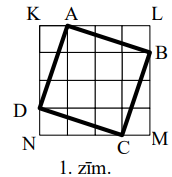
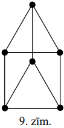
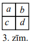

# <lo-sample/> LV.NOL.2012.5.1

Ar naturālu skaitli var veikt divu veidu darbības:
1) reizināt ar $3$,
2) nodzēst pēdējo ciparu.

Parādīt, kā no skaitļa $5$ var iegūt skaitli $21$, vairakkārt pielietojot tikai
šīs darbības.

<small>

* questionType:
* domain:

</small>

## Atrisinājums

Piemēram, $5 \rightarrow 15 \rightarrow 1 \rightarrow 3 \rightarrow 9 \rightarrow 27 \rightarrow 81 \rightarrow 8 \rightarrow 24 \rightarrow 72 \rightarrow 7 \rightarrow 21$.

# <lo-sample/> LV.NOL.2012.5.2

Cik rūtiņas liels ir kvadrāta $ABCD$ laukums (skat. 1.zīm.)?

<small>

* questionType:
* domain:

</small>

## Atrisinājums

Lai aprēķinātu kvadrāta $ABCD$ laukumu, no kvadrāta $KLMN$ laukuma jāatņem 
trijstūru $ALB,\ BMC,\ CND,\ DKA$ laukumi (skat. 1.zīm.). Šie trijstūri kopā 
veido taisnstūri ar malu garumiem $2$ un $3$ rūtiņas.

Tātad $S(ABCD)=4 \cdot 4-2 \cdot 3=10$ rūtiņas.

# <lo-sample/> LV.NOL.2012.5.3

Izveidot septiņciparu skaitli, kas dalās ar $7$ un kura pierakstā katrs no 
cipariem $1,\ 2,\ 3,\ 4,\ 5,\ 7,\ 8$ izmantots tieši vienu reizi.

<small>

* questionType:
* domain:

</small>

## Atrisinājums

**Atbilde:** piemēram, $1428357$.

Ievērosim, ka $14$ dalās ar $7$, tātad arī $1400000$ dalās ar $7;\ 28$ un 
$28000$ dalās ar $7;\ 35$ un $350$ dalās ar $7$. Tātad 
$1400000+28000+350+7=1428357$ dalās ar $7$. Uzdevuma prasības apmierina arī 
daudzi citi skaitļi.

# <lo-sample/> LV.NOL.2012.5.4

Maijai dārzā ir kvadrātveida puķu dobe, kura sastāv no $10 \times 10$ vienādiem
kvadrātveida lauciņiem. Viņa ir iegādājusies dzeltenu, sarkanu un baltu tulpju 
sīpoliņus. Maija vēlas katrā lauciņā iestādīt tieši vienu tulpi.

**(A)** Vai Maija var trīs krāsu tulpes iestādīt tā, lai katrā rindā būtu 
nepāra skaits katras krāsas ziedu?

**(B)** Vai Maija var tulpes iestādīt tā, lai lauciņos, kam ir kopīga mala, 
uzziedētu atšķirīgas krāsas tulpes un lai katrā rindā jebkuras trīs pēc kārtas 
ņemtas tulpes, būtu atšķirīgās krāsās?

<small>

* questionType:
* domain:

</small>

## Atrisinājums

**(A)** Nē, nevar gadīties. Tad katrā rindā kopējais ziedu skaits būtu trīs 
nepāra saskaitāmo summa, t.i., nepāra skaitlis, bet katrā rindā jābūt $10$ 
(pāra skaitlis) ziediem.

**(B)** Jā, var. Skat., piem., 2.zīm. (Ar vienādiem cipariem apzīmētajos 
lauciņos jāstāda vienas krāsas tulpes, ar dažādiem - dažādu krāsu tulpes.)

# <lo-sample/> LV.NOL.2012.5.5

**(A)** Pa apli izvietot ciparus $1$ un $2$ (pavisam astoņus ciparus) tā, lai, 
lasot pa trīs cipariem pēc kārtas pulksteņrādītāja virzienā, būtu sastopami 
visi trīsciparu skaitļi, kuru pierakstā ir tikai cipari $1$ un/vai $2$.

**(B)** Vai pa apli var izvietot $16$ ciparus $1$ un $2$ tā, lai, lasot pa 
četriem cipariem pēc kārtas pulksteņrādītāja virzienā, būtu sastopami visi 
četrciparu skaitļi, kuru pierakstā ir tikai cipari $1$ un/vai $2$?

*(Piemēram, 2.zīm. parādīts, ka četrus ciparus var izvietot tā, lai būtu 
sastopami visi divciparu skaitļi, kuru pierakstā ir tikai cipari* $1$ *un/vai* 
$2:\ 11,\ 12,\ 22,\ 21$*.)*

<small>

* questionType:
* domain:

</small>

## Atrisinājums

**(A)** Skat., piem., 3.zīm. **(B)** Skat., piem., 4.zīm.

# <lo-sample/> LV.NOL.2012.6.1

Atrast divus vienu otram sekojošus naturālus skaitļus, kuriem abiem ciparu 
summa dalās ar $5$.

<small>

* questionType:
* domain:

</small>

## Atrisinājums

Piemēram, $49999$ un $50000$.

# <lo-sample/> LV.NOL.2012.6.2

Visi piecciparu naturālie skaitļi, kuru pierakstā katrs no cipariem 
$1,\ 2,\ 3,\ 4,\ 5$ izmantots tieši vienu reizi, ir uzrakstīti virknē augošā 
secībā: $12345,\ 12354,\ 12435,\ \ldots $. Kurš pēc kārtas šajā virknē ir 
skaitlis $53421$?

<small>

* questionType:
* domain:

</small>

## Atrisinājums

Pavisam šajā virknē ir $5 \cdot 4 \cdot 3 \cdot 2 \cdot 1=120$ skaitļi. 
Interesējošais skaitlis ir pēdējais, kas sākas ar $53$, un pēc šī skaitļa 
virknē vēl ir $6$ skaitļi, kas sākas ar cipariem $54$. Tātad šajā virknē 
skaitlis $53421$ atrodas $114.$ vietā.

# <lo-sample/> LV.NOL.2012.6.3

Vai plaknē var uzzīmēt

**(A)** sešstūri,

**(B)** septiņstūri

un riņķa līniju, kas krusto uzzīmētā daudzstūra katru malu tieši vienā punktā? 
(Riņķa līnija nepieskaras daudzstūra malām un neiet caur tā virsotnēm.)

<small>

* questionType:
* domain:

</small>

## Atrisinājums

**(A)** Skat., piem., 5.zīm.

**(B)** Nē, nevar. Lai septiņstūra malas krustotu riņķa līniju, jābūt 
virsotnēm, kas atrodas riņķa iekšpusē, un virsotnēm, kas atrodas riņķa ārpusē. 
Ar $A_{1}$ apzīmēsim septiņstūra $A_{1}A_{2}A_{3}A_{4}A_{5}A_{6}A_{7}$ 
virsotni, kas atrodas riņķa iekšpusē. Lai mala $A_{1}A_{2}$ krustotu riņķa 
līniju, virsotnei $A_{2}$ jāatrodas riņķa ārpusē. Līdzīgi virsotnei $A_{3}$ 
jāatrodas riņķa iekšpusē, virsotnei $A_{4}$ - riņķa ārpusē, virsotnei 
$A_{5}$ - riņķa iekšpusē, virsotnei $A_{6}$ - riņķa ārpusē, virsotnei 
$A_{7}$ - riņķa iekšpusē. Bet tādā gadījumā septiņstūra malu $A_{1}A_{7}$ riņķa
līnija nekrusto.

# <lo-sample/> LV.NOL.2012.6.4

Vai piecstūra virsotnēs var ierakstīt piecus dažādus naturālus skaitļus, lai 
jebkuru divu blakus stāvošu skaitļu summa būtu pirmskaitlis?

<small>

* questionType:
* domain:

</small>

## Atrisinājums

Nē, nevar. Ievērosim, ka divu dažādu naturālu skaitļu summa ir lielāka nekā 
$2$, un visi pirmskaitļi, kas lielāki nekā $2$, ir nepāra skaitļi. Ja uzdevuma 
prasības būtu iespējams izpildīt, tad blakus stāvošajiem skaitļiem būtu jābūt 
ar dažādu paritāti. Tā kā pa apli uzrakstīto skaitļu skaits ir $5$ (nepāra), 
tad kādā vietā blakus atradīsies vienādas paritātes skaitļi, kuru summa būs 
pāra skaitlis, lielāks nekā $2$, t.i., salikts skaitlis.

# <lo-sample/> LV.NOL.2012.6.5

Katrs no trīs rūķīšiem ir iedomājies vienu no skaitļiem $1,\ 2$ vai $3$, 
katrs - citu skaitli. Katrs rūķītis zina, kādus skaitļus ir iedomājušies 
pārējie rūķīši.

Kā var noskaidrot, kuru skaitli katrs rūķītis ir iedomājies, ja katram rūķītim 
var uzdot tieši vienu jautājumu, uz kuru viņš var atbildēt tikai ar "jā" vai 
"nē"? Katram rūķītim drīkst jautāt arī par citu rūķīšu iedomātajiem skaitļiem.

<small>

* questionType:
* domain:

</small>

## Atrisinājums

Uzdevumam iespējami dažādi risinājumi.

Piemēram, viens no risinājumiem.

1. Pirmajam rūķītim jautā, vai viņa iedomātais skaitlis ir lielāks nekā otrā 
   rūķīša iedomātais skaitlis.
2. Otrajam - vai viņa iedomātais skaitlis ir lielāks nekā trešā rūķīša 
   iedomātais skaitlis.
3. Trešajam rūķītim jautā, vai viņš ir iedomājies skaitli $2$.

Ja uz 1. un 2. jautājumu tika saņemtas atbildes "jā", tad pirmā, otrā un trešā 
rūķīšu iedomātie skaitļi ir attiecīgi $3,\ 2,\ 1$. Ja abas atbildes bija "nē", 
tad iedomātie skaitļi ir attiecīgi $1,\ 2,\ 3$.

Ja uz 1. jautājumu atbilde ir "nē", bet uz otro - "jā", tad otrā rūķīša 
iedomātais skaitlis ir $3$. Pārējo rūķīšu iedomātos skaitļus nosaka pēc 
atbildes uz 3. jautājumu.

Ja uz 1. jautājumu atbilde ir "jā", bet uz otro - "nē", tad otrā rūķīša 
iedomātais skaitlis ir $1$. Atkal pārējo rūķišu iedomātos skaitļus var noteikt 
pēc atbildes uz 3. jautājumu.

# <lo-sample/> LV.NOL.2012.7.1

Ar naturālu skaitli var veikt divu veidu operācijas:
1) reizināt ar $7$,
2) nodzēst skaitļa lielāko (vienu no lielākajiem, ja tādi ir vairāki) ciparu.

Vai ar šādām operācijām no skaitļa $9$ var iegūt skaitli $27$, atkārtojot tās 
vairākas reizes jebkādā secībā?

<small>

* questionType:
* domain:

</small>

## Atrisinājums

Jā, var, piemēram: 
$9 \rightarrow 63 \rightarrow 441 \rightarrow 41 \rightarrow 287 \rightarrow 27$.

# <lo-sample/> LV.NOL.2012.7.2

Uzzīmēt slēgtu lauztu līniju ar $7$ posmiem, kura sadala plakni daudzstūros, 
starp kuriem ir astoņstūris.

<small>

* questionType:
* domain:

</small>

## Atrisinājums

Skat., piem., 6.zīm.

# <lo-sample/> LV.NOL.2012.7.3

Pa apli uzrakstīti septiņi dažādi skaitļi, nekādu divu blakus uzrakstīto 
skaitļu reizinājums nav pozitīvs. Aplūkojam visus triju pēc kārtas uzrakstītu 
skaitļu reizinājumus. Cik no šiem septiņiem reizinājumiem ir pozitīvi?

<small>

* questionType:
* domain:

</small>

## Atrisinājums

**Atbilde:** tieši divi no tiem.

Vispirms pierādīsim, ka kāds no skaitļiem ir $0$. Ja neviens no skaitļiem nav 
nulle, tad visu blakus skaitļu reizinājumi ir negatīvi, tātad jebkuri divi 
blakus skaitļi ir ar pretējām zīmēm. Ja mēs skaitļus apzīmējam ar 
$a,\ b,\ c,\ d,\ e,\ f,\ g$, tad $a$ un $b$ ir ar pretējām zīmēm, $b$ un $c$ ir
ar pretējām zīmēm, tātad $a$ un $c$ ir ar vienādām zīmēm. Tieši tāpat pamato, 
ka $c$ un $e$ un $e$ un $g$ arī ir ar vienādām zīmēm. Bet tad arī $a$ un $g$ ir
ar vienādām zīmēm un reizinājums $ag$ ir pozitīvs - pretruna.

Tātad, viens no skaitļiem ir $0$, pieņemsim, ka $g=0$. Tad zīmes skaitļiem 
$a,\ b,\ c,\ d,\ e,\ f$ var būt vai nu "+ - + - + -" vai "- + - + - +". 
Redzams, ka no reizinājumiem $abc,\ bcd,\ cde,\ def$ divi ir pozitīvi ("- + -")
un divi negatīvi ("+ - +"). Pārējie trīs triju blakusstāvošu skaitļu 
reizinājumi satur reizinātāju $g$, tātad to vērtība ir $0$. Tātad tieši divi no
šiem reizinājumiem ir pozitīvi.

# <lo-sample/> LV.NOL.2012.7.4

Pierādīt, ka $1004041$ nav pirmskaitlis.

<small>

* questionType:
* domain:

</small>

## Atrisinājums

Ievērosim, ka 
$1004041=1014141-10100=101 \cdot 10000+101 \cdot 40+101 \cdot 1-101 \cdot 100=101 \cdot(10000+40+1-100)=101 \cdot 9941$,
tātad tas nav pirmskaitlis.

# <lo-sample/> LV.NOL.2012.7.5

Vienādmalu trijstūris ar malas garumu $4$ sadalīts $16$ vienādos trijstūros 
(skat. 3.zīm.).

Katrā mazajā trijstūrī ir ierakstīts viens skaitlis, pavisam ierakstīti septiņi
trijnieki un deviņi piecinieki.

Pierādīt, ka var izvēlēties četrus trijstūrus, kas veido vienādmalu trijstūri 
ar malas garumu $2$ un kuros ierakstīto skaitļu summa ir vismaz $18$.

<small>

* questionType:
* domain:

</small>

## Atrisinājums

Sadalīsim sākotnējo trijstūri četros vienādmalu trijstūros ar malas garumu $2$ 
(skat. 7.zīm.). Tā kā ir četri šādi trijstūri (kas nepārklājas), un tajos 
ierakstīti $9$ piecinieki, tad kādā no šiem trijstūriem būs vismaz trīs 
piecinieki, tāpēc tajā ierakstīto skaitļu summa būs vismaz $5+5+5+3=18$, k.b.j.

# <lo-sample/> LV.NOL.2012.8.1

Skaitli $3999991$ uzrakstīt kā divu veselu skaitļu reizinājumu tā, lai katrs no
reizinātājiem ir lielāks nekā $1$.

<small>

* questionType:
* domain:

</small>

## Atrisinājums

Ievērosim, ka 
$3999991=4000000-9=2000^{2}-3^{2}=(2000-3) \cdot(2000+3)=1997 \cdot 2003$.

# <lo-sample/> LV.NOL.2012.8.2

Trijstūrī $ABC$ leņķis $ABC$ ir $30^{\circ}$ liels. Uz malas $AB$ izvēlēts 
punkts $E$, bet uz malas $BC$ punkts $F$ tā, ka trijstūris $CEF$ ir vienādmalu.
Pierādīt, ka punkts $F$ ir malas $BC$ viduspunkts.

<small>

* questionType:
* domain:

</small>

## Atrisinājums

$\sphericalangle FCE=\sphericalangle CEF=\sphericalangle EFC=60^{\circ}$. Tad 
$\sphericalangle BFE=180^{\circ}-60^{\circ}=120^{\circ}$ (blakusleņķi) un 
$\sphericalangle BEF=180^{\circ}-30^{\circ}$ $120^{\circ}=30^{\circ}$, tātad 
$\triangle EBF$ - vienādsānu un $BF=EF=FC$ (skat. 8.zīm.)

# <lo-sample/> LV.NOL.2012.8.3

Vai naturāla skaitļa ciparu reizinājums var būt skaitlis $\overline{aabbcc}$? 
(Pieraksts $\overline{kmn}$ nozīmē, ka skaitlī ir $k$ simti, $m$ desmiti un $n$
vieni.)

<small>

* questionType:
* domain:

</small>

## Atrisinājums

Ievērosim, ka skaitlis $\overline{aabbcc}=11 \cdot \overline{a0b0c}$ dalās ar 
$11$, taču neviens cipars nedalās ar $11$. Tātad $\overline{aabbcc}$ nevar būt 
neviena naturāla skaitļa ciparu reizinājums.

# <lo-sample/> LV.NOL.2012.8.4

Uzzīmēt plaknē sešus punktus tā, lai no katra uzzīmētā punkta tieši trīs citi 
uzzīmētie punkti atrastos tieši $1~\mathrm{cm}$ attālumā.

<small>

* questionType:
* domain:

</small>

## Atrisinājums

Skat., piem., 9.zīm.; katra novilktā nogriežņa garums ir $1~\mathrm{cm}$, bet 
pārējie attālumi starp šiem punktiem ir lielāki vai mazāki nekā 
$1~\mathrm{cm}$.

# <lo-sample/> LV.NOL.2012.8.5

Uzzīmēt figūru, kuru var sadalīt vienādos "stūrīšos" (skat. 4.zīm.) tieši divos
dažādos veidos. "Stūrīši" var būt pagriezti arī citādāk. (Divi sadalījumi, kas 
iegūstami viens no otra pagrieziena rezultātā vai ir viens otra spoguļattēls, 
uzskatāmi par vienādiem.)

<small>

* questionType:
* domain:

</small>

## Atrisinājums

Skat., piem., 10.zīm. attēloto figūru. Dalot to "stūrīšos", sākot no augšējās 
rindas, iegūst trīs sadalījumus (skat. 10. a), b) un c) zīm.). Taču 10. b) un 
10. c) zīm. attēlotie sadalījumi ir viens otra spoguļattēls, tāpēc ir tikai 
divi dažādi veidi, kā šo figūru sadalīt "stūrīšos".

# <lo-sample/> LV.NOL.2012.9.1

Apskatām visas funkcijas $y=ax^{2}-2x+b$, kur $a$ un $b$ - reāli skaitļi un 
$a+b=2012$. Pierādīt, ka visu šādu funkciju grafikiem ir divi kopīgi punkti.

<small>

* questionType:
* domain:

</small>

## Atrisinājums

Ja $x=1$, tad $y=a-2+b=2010$. Ja $x=-1$, tad $y=a+2+b=2014$. Tātad punkti 
$(1; 2010)$ un $(-1; 2014)$ pieder visu minēto funkciju grafikiem.

# <lo-sample/> LV.NOL.2012.9.2

Regulāra trijstūra iekšpusē patvaļīgi izvēlēts punkts $P$. Pierādīt, ka 
attālumu summa no punkta $P$ līdz trijstūra malām nav atkarīga no punkta $P$ 
izvēles.

<small>

* questionType:
* domain:

</small>

## Atrisinājums

Apzīmēsim dotā regulārā trijstūra $ABC$ malas garumu ar $a$ un augstumu ar $h$ 
(skat. 1.zīm.). Tad 
$S_{ABC}=\frac{1}{2} a \cdot PK+\frac{1}{2} a \cdot PL+\frac{1}{2} a \cdot PM=\frac{1}{2} a \cdot(PK+PL+PM)$.
No otras puses $S_{ABC}=\frac{1}{2} a \cdot h$. Tātad $PK+PL+PM=h$ neatkarīgi 
no punkta $P$ izvēles.

# <lo-sample/> LV.NOL.2012.9.3

Kādām $n$ vērtībām $n$ cilvēkus var sadalīt grupās (varbūt tikai vienā) tā, lai
katrā grupā būtu tieši $5,\ 6$ vai $7$ cilvēki?

<small>

* questionType:
* domain:

</small>

## Atrisinājums

**Atbilde:** $n=5,6,7$ un $n \geq 10$.

Acīmredzot, ja $n \leq 4, n=8$ vai $n=9$, uzdevuma prasības izpildīt nav 
iespējams.

Ja $n=5,6$ vai $7$, tad var izveidot vienu atbilstošā lieluma grupu.

Ja $n \geq 10:n=10=5+5;\ n=11=5+6,\ n=12=6+6,\ n=13=6+7,\ n=14=7+7$.

Ja $n \geq 15$, varam izteikt $n=5k+i,\ k \geq 3,\ i=0,1,2,3,4$, jeb 
pārveidojot $n=5(k-2)+(10+i)$.

Tā kā $n=10+i(i=0,1,2,3,4)$ cilvēkus var sadalīt vajadzīgā lieluma grupās un 
$5k$ var sadalīt $k$ grupās pa $5$ cilvēkiem katrā, tad visiem $n \geq 10$ 
uzdevuma prasības var izpildīt.

# <lo-sample/> LV.NOL.2012.9.4

Dota skaitļu virkne $1,\ 1,\ 2,\ 5,\ 9,\ 6,\ \ldots$. Tā tiek veidota pēc 
likuma: virknes pirmie divi locekļi ir $1$, bet katrs nākamais ir vienāds ar 
divu iepriekšējo locekļu kvadrātu summas pēdējo ciparu.

**(A)** Noteikt, vai šīs virknes $2012.$ loceklis ir pāra vai nepāra skaitlis.

**(B)** Aprēķināt virknes $2012.$ locekli.

<small>

* questionType:
* domain:

</small>

## Atrisinājums

**(A)** Apzīmējot virknes pāra locekļus ar $p$ un nepāra ar $n$, iegūsim virkni
$n, n, p, n, n, p, n, \ldots$, viegli saprast, ka šī virkne ir periodiska ar 
perioda garumu $3$. Tāpēc tikai tie locekļi, kuru kārtas numurs dalās ar $3$, 
ir pāra, tāpēc $2012.$ loceklis ir nepāra.

**(B)** Turpinot virkni tālāk, iegūsim, ka tā ir

$$1, \underline{1}, 2,5,9,6,7,5,4,1,7,0,9,1,2,5, \ldots$$

Katrs virknes loceklis ir viennozīmīgi noteikts ar diviem iepriekšējiem. Tā kā 
virknes otrais un trešais loceklis ir $1$ un $2$, un $14.$ un $15.$ loceklis 
arī ir $1$ un $2$, tad virkne, sākot ar $2.$ locekli, ir periodiska ar perioda 
garumu $12$. Tāpēc $2006.$ loceklis ir $1$ (jo $2+12 \cdot 167=2006$ ) un 
$2007.$ loceklis ir $2$. Tāpēc $2012.$ loceklis ir $5$.

# <lo-sample/> LV.NOL.2012.9.5

Dots naturāls skaitlis $n \geq 3$. Aplūkojam visus naturālos skaitļus no $1$ 
līdz $n-1$ ieskaitot, kas ir savstarpēji pirmskaitļi ar skaitli $n$. Pierādīt, 
ka šo skaitļu summa dalās ar $n$.

<small>

* questionType:
* domain:

</small>

## Atrisinājums

Ievērosim: ja skaitlis $x$ ir savstarpējs pirmskaitlis ar skaitli $n$, tad arī 
skaitlis $n-x$ ir savstarpējs pirmskaitlis ar $n$. Tāpēc visus skaitļus no $1$ 
līdz $n-1$, kas ir savstarpēji pirmskaitļi ar $n$, var sagrupēt pa pāriem $x$ 
un $n-x$. (Ja $n$ ir pāra skaitlis $2m$, tad $m$ un $n-m=m$ neveido divu dažādu
skaitļu pāri, taču šo pāri neaplūkojam, jo $m$ un $2m$ nav savstarpēji 
pirmskaitļi).

Katrā pārī skaitļu summa ir $n$. Tātad visu aplūkojamo skaitļu summa dalās ar 
$n$.

# <lo-sample/> LV.NOL.2012.10.1

**(A)** Dots, ka $a+b=c$. Pierādīt, ka $2a^{2} \geqq c^{2}-2b^{2}$.

**(B)** Dots, ka $a+b+c=d$. Pierādīt, ka $3a^{2} \geq d^{2}-3b^{2}-3c^{2}$.

<small>

* questionType:
* domain:

</small>

## Atrisinājums

**(A)** $(a+b)^{2}=c^{2} \Rightarrow a^{2}+2ab+b^{2}=c^{2} \Rightarrow a^{2}+2ab-b^{2}=c^{2}-2 b^{2} \Rightarrow$ $2 a^{2}-(a-b)^{2}=c^{2}-2b^{2}$

Tā kā $(a-b)^{2} \geq 0$, tad $2a^{2} \geq c^{2}-2b^{2}$, k.b.j.

**(B)** $(a+b+c)^{2}=d^{2} \Rightarrow a^{2}+b^{2}+c^{2}+2ab+2ac+2bc=d^{2} \Rightarrow$ 
$a^{2}-2b^{2}-2c^{2}+2ab+2ac+2bc=d^{2}-3b^{2}-3c^{2} \Rightarrow$ 
$3a^{2}-(a-b)^{2}-(a-c)^{2}-(b-c)^{2}=d^{2}-3b^{2}-3c^{2}$.

Tā kā $(a-b)^{2} \geq 0,(a-c)^{2} \geq 0$ un $(b-c)^{2} \geq 0$, tad 
$3a^{2} \geq d^{2}-3b^{2}-3c^{2}$, k.b.j.

# <lo-sample/> LV.NOL.2012.10.2

Uz trijstūra $ABC$ malas $AC$ izvēlēts punkts $K$. Nogrieznis $BK$ sadala 
trijstūri $ABC$ divos trijstūros. Visi trīs trijstūri ($\triangle ABC$ un abi 
dalījumā iegūtie trijstūri) ir līdzīgi. Pierādīt, ka $\triangle ABC$ ir 
taisnleņķa trijstūris.

<small>

* questionType:
* domain:

</small>

## Atrisinājums

Aplūkosim 2.zīmējumu. No trijstūru $BKC$ un $ABK$ līdzības seko, ka pastāv trīs
iespējas.

1) $\sphericalangle BKC=\sphericalangle ABK$. Tad taisnēm $KC$ un $AB$ jābūt 
   paralēlām, bet tas nav iespējams, jo tās krustojas punktā $A$.
2) $\sphericalangle BKC=\sphericalangle BAK$. Tad taisnēm $KB$ un $AB$ jābūt 
   paralēlām, bet tas nav iespējams, jo tās krustojas punktā $B$.

Atliek trešā iespēja.

3) $\sphericalangle BKC=\sphericalangle BKA$. Tad leņķis $\sphericalangle BKC$ ir taisns, un trijstūris $B K C$ ir taisnleņķa trijstūris. Tā kā $\triangle A B C$ ir līdzīgs trijstūrim $B K C$, tad arī $\triangle A B C$ ir taisnleņķa trijstūris.

# <lo-sample/> LV.NOL.2012.10.3

Doti seši pēc kārtas sekojoši naturāli skaitļi. Pierādīt, ka var atrast tādu 
pirmskaitli $p$, ka tieši viens no dotajiem skaitļiem dalās ar $p$.

<small>

* questionType:
* domain:

</small>

## Atrisinājums

Dotos skaitļus apzīmēsim ar $a,\ a+1,\ a+2,\ a+3,\ a+4,\ a+5$, $a \geq 1$. 
Viens no skaitļiem $a+2,\ a+3$ ir nepāra, pieņemsim, ka tas ir $a+3$. Tad abi 
skaitļi $a+1$ un $a+3$ ir nepāra. Šie skaitļi abi vienlaicīgi nevar dalīties ar
$3$, tāpēc kāds no tiem nedalās ar $3$. Tas skaitlis, kas nedalās ar $2$ un 
$3$, ir lielāks nekā $1$, tāpēc tas dalās ar kādu pirmskaitli $p$, kas nav $2$ 
un $3$. Tāpēc $p \geq 5$. Šis pirmskaitlis der par meklēto, jo nākamais 
skaitlis, kas dalās ar $p$, ir vismaz $a+1+p>a+5$, bet iepriekšējais 
nepārsniedz $a+3-p < a$. Ja nepāra skaitlis būtu $a+2$, tad, izdarot līdzīgus 
spriedumus, var pierādīt, ka kāds no skaitļiem $a+2$ vai $a+4$ dalās ar kādu 
pirmskaitli $p \geq 5$, kas der par meklēto.

# <lo-sample/> LV.NOL.2012.10.4

Ir aprēķinātas skaitļu $2^{2012}$ un $5^{2012}$ vērtības un iegūtie skaitļi 
uzrakstīti viens aiz otra. Cik cipari uzrakstīti?

<small>

* questionType:
* domain:

</small>

## Atrisinājums

Pieņemsim, ka $n$ ir skaitļa $2^{2012}$ ciparu skaits, $m$ - skaitļa $5^{2012}$
ciparu skaits. Tad $10^{n-1}<2^{2012}<10^{n}$ un $10^{m-1}<5^{2012}<10^{m}$. 
Sareizināsim šīs nevienādības: $10^{n+m-2}<10^{2012}<10^{n+m}$. Tātad 
$n+m-2 < 2012 < n+m$ un vienīgā iespējamā $n+m$ vērtība (t.i., uzrakstīto ciparu 
skaits) ir $2013$.

# <lo-sample/> LV.NOL.2012.10.5

Dota tabula ar izmēriem $n \times n$ rūtiņas, katrā tās rūtiņā ierakstīts 
vesels skaitlis. Tabulas rindas un kolonnas pēc kārtas sanumurētas ar skaitļiem
no $1$ līdz $n$, sākot no augšējās rindas un kreisās kolonnas (skat. 1.zīm.). 
Zināms, ka visiem $i$ izpildās sakarība: $i$-tajā rindā ierakstīto skaitļu 
summa ir vienāda ar $i$-tajā kolonnā ierakstīto skaitļu summu.

Atrast visus tādus $n$, kuriem visām šādām tabulām izpildās sekojoša īpašība:

$i$-tās rindas $j$-tajā kolonnā ierakstītais skaitlis ir vienāds ar $i$-tās 
kolonnas $j$-tajā rindā ierakstīto skaitli (t.i., tabula ir simetriska 
attiecībā pret galveno diagonāli, skat. 1.zīm. iekrāsoto diagonāli).

<small>

* questionType:
* domain:

</small>

## Atrisinājums

Skaidrs, ka der $n=1$ (no vienas rūtiņas sastāvoša tabula vienmēr ir simetriska
pret galveno diagonāli) un $n=2$ (tā kā $a+b=a+c$, tad $b=c$, skat. 3.zīm.).

Ja $n \geqq 3$, tad nosacījumus neapmierina, piemēram, 4.zīm. attēlotā tabula.

# <lo-sample/> LV.NOL.2012.11.1

Vai eksistē tāds naturāls skaitlis $m$, kura ciparu reizinājums ir vienāds ar 
simetrisku $8$-ciparu skaitli?

(Par *simetrisku* sauc skaitli, kas vienādi lasāms no abiem galiem.)

<small>

* questionType:
* domain:

</small>

## Atrisinājums

Simetrisks $8$-ciparu skaitlis $\overline{abcddcba}$ dalās ar $11$, jo tā 
ciparu summa pāra pozīcijās $a+c+d+b$ ir vienāda ar ciparu summu nepāra 
pozīcijās $b+d+c+a$ (summu starpība $0$ dalās ar $11$). Dotais skaitlis nevar 
būt ciparu reizinājums, jo vienam reizinātājam jādalās ar $11$, bet neviens 
cipars nepārsniedz $9$.

# <lo-sample/> LV.NOL.2012.11.2

Atrisināt vienādojumu sistēmu reālos skaitļos:

$$\left\{\begin{array}{l}
2x+xy+2y=8 \\
2y+yz+2z=20 \\
2z+zx+2x=14
\end{array}\right.$$

<small>

* questionType:
* domain:

</small>

## Atrisinājums

Visiem vienādojumiem abām pusēm pieskaitot $4$, iegūstam

$$\left\{\begin{array}{l}
(x+2)(y+2)=12 \\
(y+2)(z+2)=24 \\
(z+2)(x+2)=18
\end{array}\right.$$

Sareizinot šos trīs vienādojumus, iegūstam

$((x+2)(y+2)(z+2))^{2}=72^{2}$ jeb  
$(x+2)(y+2)(z+2)=72$ vai $(x+2)(y+2)(z+2)=-72$

Iegūtās sakarības izdalot ar sistēmas katru vienādojumu, iegūstam

$$\left\{\begin{array} {l} 
{z+2=6} \\
{x+2=3} \\
{y+2=4}
\end{array}\right. \Rightarrow \left\{\begin{array} {l} 
{x=1} \\
{y=2} \\
{z=4}
\end{array}\right. \text { vai } \left\{\begin{array} {l} 
{z+2=-6} \\
{x+2=-3} \\
{y+2=-4}
\end{array}\right. \Rightarrow \left\{\begin{array}{l}
x=-5 \\
y=-6 \\
z=-8
\end{array}\right.$$

# <lo-sample/> LV.NOL.2012.11.3

Vienā riņķa līnijā ievilkts regulārs deviņstūris un regulārs trijstūris. Kas ir
lielāks: dotā deviņstūra malu kvadrātu summa vai dotā trijstūra malu kvadrātu 
summa?

<small>

* questionType:
* domain:

</small>

## Atrisinājums

Aplūkosim regulārā trijstūra malu $AB$ un trīs sekojošas deviņstūra malas 
$AK,\ KL$ un $LB$ (skat. 5.zīm.). Ievērosim, ka trijstūri $AKL$ un $ALB$ ir 
platleņķka, jo leņķi $\sphericalangle AKL$ un $\sphericalangle ALB$ balstās uz 
lokiem, kas ir lielāki nekā $180^{\circ}$. No kosinusu teorēmas seko, ka 
$AK^{2}+KL^{2} < AL^{2}$ un $AL^{2}+LB^{2} < AB^{2}$. Tātad 
$AK^{2}+KL^{2}+LB^{2} < AB^{2}$. Tas nozīmē, ka regulāra deviņstūra trīs malu 
kvadrātu summa ir mazāka nekā regulāra trijstūra malas kvadrāts. Tātad visu 
deviņu deviņstūra malu kvadrātu summa ir mazāka nekā regulāra trijstūra trīs 
malu kvadrātu summa.

# <lo-sample/> LV.NOL.2012.11.4

Atrast augošu aritmētisku progresiju, kuras visi elementi ir naturāli skaitļi 
un kurai piemīt īpašība: neviens tās elements nav naturāla skaitļa $k$-tā 
pakāpe jebkuram naturālam $k \geq 2$.

<small>

* questionType:
* domain:

</small>

## Atrisinājums

Der, piemēram, aritmētiskā progresija $2,6,10, \ldots$, vispārīgā locekļa 
formula $a_{n}=4n-2$, $n \geq 1$.

Pieņemsim, ka ir tāds $n$, ka $a_{n}=b^{k}$, kur $b$ un $k$ - naturāli skaitļi 
un $k \geq 2$. Tā kā visi virknes locekļi $a_{n}$ ir pāra skaitļi, tad $b^{k}$ 
ir pāra skaitlis un $b$ arī ir pāra skaitlis. Bet tad $b^{k}$ dalās ar $2^{k}$,
un pie $k \geq 2b^{k}$ dalās ar $4$. Taču $a_{n}$ ar $4$ nedalās - pretruna, 
tāpēc minētā virkne der par meklēto.

$\underline{Piezīme:}$ šī nav vienīgā virkne, kas apmierina uzdevuma prasības.

# <lo-sample/> LV.NOL.2012.11.5

Dotas sešas vienāda izskata monētas un sviras svari bez atsvariem. Četras no 
monētām sver $8$ gramus katra, pārējās divas sver $7$ gramus katra. Kā ar divām
svēršanām atrast vismaz vienu monētu, kas sver $7$ gramus?

<small>

* questionType:
* domain:

</small>

## Atrisinājums

Var rīkoties, piemēram, šādi.

Vispirms katrā svaru kausā novieto $3$ monētas. Ja svari ir līdzsvarā, tad 
katra $7~\mathrm{g}$ smagā monēta ir savā kausā. Tad izvēlas $2$ monētas no 
viena kausa un sver vēlreiz. Ja to masas ir vienādas, tad atlikusī monēta sver 
$7~\mathrm{g}$, ja nē, tad vieglākā no tām sver $7~\mathrm{g}$.

Ja pirmajā svēršanā viens svaru kauss (apzīmēsim to ar $A$) bija vieglāks, tad 
abas $7~\mathrm{g}$ monētas ir šajā svaru kausā. Tad izvēlas $2$ monētas no 
kausa $A$ un sver vēlreiz. Ja svari ir līdzsvarā, tad atrastas abas 
$7~\mathrm{g}$ monētas, pretējā gadījumā vieglākā no tām sver $7$ gramus.

# <lo-sample/> LV.NOL.2012.12.1

Skaitlis $a$ ir vienādojuma $x^{3}-2x^{2}+3x-4=0$ sakne. Pierādīt, ka 
$a>-\frac{1}{2}$.

<small>

* questionType:
* domain:

</small>

## Atrisinājums

Pieņemsim, ka $x<0$. Tad $x^{3}<0,\ x^{2}>0$ un $-2x^{2}<0,\ 3x<0$, tāpēc 
$x^{3}-2x^{2}+3x-4<0$. Tātad vienādojuma $x^{3}-2x^{2}+3x-4=0$ sakne $a$ nevar 
būt negatīvs skaitlis un $a \geq 0>-\frac{1}{2}$.

# <lo-sample/> LV.NOL.2012.12.2

Pierādīt, ka neeksistē daudzskaldnis, kuram ir nepāra skaits skaldņu un katrai 
skaldnei ir nepāra skaits virsotņu.

<small>

* questionType:
* domain:

</small>

## Atrisinājums

Katra šķautne ir mala tieši divām skaldnēm, tātad divkāršots daudzskaldņa 
šķautņu skaits ir vienāds ar visu skaldņu malu skaitu summu, tāpēc šī summa ir 
pāra skaitlis. Bet nepāra skaita nepāru skaitļu ir nepāra skaitlis, tad 
iegūstam pretrunu.

# <lo-sample/> LV.NOL.2012.12.3

Nogrieznis $BP$ ir trijstūra $ABC$ bisektrise, punkti $N$ un $M$ ir attiecīgi 
malu $AB$ un $AC$ tādi iekšēji punkti, ka $AN=PC$ un $AM=BC$. Taisnes $BP$ un 
$MN$ krustojas punktā $X$. Pierādīt, ka $\triangle NBX \sim \triangle PBC$.

<small>

* questionType:
* domain:

</small>

## Atrisinājums

No bisektrises īpašības iegūstam $\frac{AB}{AP}=\frac{BC}{PC}$. Tā kā $AM=BC$ 
un $AN=PC$, tad ir spēkā $\frac{AB}{AP}=\frac{AM}{AN}$. Tāpēc 
$\triangle ABP \sim \triangle AMN$. No tā seko, ka 
$\sphericalangle ANM=\sphericalangle APB$. Savukārt 
$\sphericalangle BNX=180^{\circ}-\sphericalangle ANM$ un 
$\sphericalangle BPC=180^{\circ}-\sphericalangle APB$, tāpēc 
$\sphericalangle BNX=\sphericalangle BPC$. No tā iegūstam vajadzīgo pēc pazīmes
$ll$.

$\underline{Piezīme:}$ punkts $M$ var atrasties dažādās pusēs no $P$, kā arī 
sakrist ar to. Tomēr tas nekādi neietekmē uzdevuma atrisinājumu (piem., sk. 6. 
un 7.zīm.).

# <lo-sample/> LV.NOL.2012.12.4

Kādiem pirmskaitļiem $p$ skaitlim $p^{2}+23$ ir tieši četri naturāli dalītāji?

<small>

* questionType:
* domain:

</small>

## Atrisinājums

**Atbilde:** $p=2$.

Ja $p=2$, tad skaitlim $p^{2}+23=27$ ir tieši $4$ naturāli dalītāji 
$1,\ 3,\ 9,\ 27$.

Ja $p>2$, tad $p$ ir nepāra skaitlis $2k+1$. Tādā gadījumā

$$\begin{equation*}
(2k+1)^{2}+23=4\left(k^{2}+k\right)+24=4k(k+1)+24=8m+24=8(m+3). \tag{*}
\end{equation*}$$

Šim skaitlim ir vismaz pieci naturāli dalītāji $1,\ 2,\ 4,\ 8$ un $8(m+3)$.

(*) $k(k+1)=2m$, jo divu pēc kārtas sekojošu naturālu skaitļu 
reizinājums pāra skaitlis.

# <lo-sample/> LV.NOL.2012.12.5

Regulārā $17$-stūrī $A_{1}A_{2} \ldots A_{17}$ atzīmētas četras virsotnes 
$A_{i}, A_{j}, A_{k}, A_{l} (i < j < k < l)$. No pārējām virsotnēm ir jāizvēlas četras
virsotnes (apzīmēsim tās ar $B,\ C,\ D$ un $E)$ tā, lai $B$ būtu starp $A_{i}$ 
un $A_{j},\ C$ būtu starp $A_{j}$ un $A_{k},\ D$ būtu starp $A_{k}$ un 
$A_{l},\ E$ būtu starp $A_{l}$ un $A_{i}$. Kādām $i, j, k, l$ vērtībām punktu 
četrinieku $(B,\ C,\ D,\ E)$ var izvēlēties visvairāk veidos?

<small>

* questionType:
* domain:

</small>

## Atrisinājums

Ar $b, c, d$ un $e$ apzīmējam virsotņu skaitu attiecīgi starp $A_{i}$ un 
$A_{j}$, starp $A_{j}$ un $A_{k}$, starp $A_{k}$ un $A_{l}$ un starp $A_{l}$ un
$A_{i}$. Četriniekus $(B, C, D, E)$ var izvēlēties $b \cdot c \cdot d \cdot e$ 
veidos. Tā kā virsotnes $B, C, D$ un $E$ nevar sakrist ar $A_{i}, A_{j}, A_{k}$
un $A_{l}$, tad $b+c+d+e=17-4=13$. Mums jāatrod, kādiem $b, c, d, e$ 
reizinājums $b \cdot c \cdot d \cdot e$ sasniedz lielāko vērtību pie nosacījuma
$b+c+d+e=13$.

Sākumā apskatām vienkāršāku problēmu: atrast maksimumu reizinājumam 
$b \cdot c$, ja zināms, ka $b+c=S,\ S$ - fiksēts vesels skaitlis un $b$ un $c$ 
jābūt veseliem skaitļiem. Salīdzinot $b \cdot c$ un

$(b+1) \cdot(c-1)=b c-b+c-1$, konstatējam, ka

$b \cdot c<(b+1) \cdot(c-1)$, ja $-b+c-1>0$ jeb $b < c-1$  
$b \cdot c=(b+1) \cdot(c-1)$, ja $-b+c-1=0$ jeb $b=c-1$  
$b \cdot c>(b+1) \cdot(c-1)$, ja $-b+c-1<0$ jeb $b>c-1$

Tātad, ja $b \cdot c$ vērtība sasniedz maksimumu, tad $b \geq c-1$. Līdzīgā 
veidā var izsecināt, ka $c \geq b-1$. Tas nozīmē, ka $b \cdot c$ vērtība var 
sasniegt maksimumu tikai, ja $b=c,\ b=c-1$ vai $c=b-1$.

Tagad atgriežamies pie sākotnējā uzdevuma. Ja $b \cdot c \cdot d \cdot e$ 
sasniedz maksimālo vērtību, tad reizinājumiem 
$b \cdot c,\ b \cdot d,\ b \cdot e,\ c \cdot d,\ c \cdot e,\ d \cdot e$ arī 
jāsasniedz maksimums. Tas ir iespējams tikai tad, ja katri divi no skaitļiem 
$b, c, d$ un $e$ vai nu ir vienādi, vai atšķiras tieši par $1$. Un tas var 
notikt tikai, ja viens no $b$, c, $d$ un $e$ ir vienāds ar $4$, bet visi 
pārējie - ar $3$. Tad punktus $B$, $C, D, E$ varēs izvēlēties 
$4 \cdot 3 \cdot 3 \cdot 3=108$ veidos.

Šajā gadījumā virsotnes $A_{i}, A_{j}, A_{k}, A_{l}$, jāizvēlas tā, lai 
$i, j, k, l$ apmierina sekojošus nosacījumus:

$i < j < k < l,\ i=1,2,3,4$ vai $5$,

$j-i=4$ vai $5,\ k-j=4$ vai $5,\ l-k=4$ vai $5$, pie tam tieši viens no 
$j-i,\ k-j,\ l-k,\ 17+i-l$ ir $5$.

Atbilstoši šiem nosacījumiem ($i, j, k, l$) var izvēlēties $17$ veidos: 
$(1,5,9,13),\ (1,5,9,14),\ (1,5,10,14),\ (1,6,10,14),\ (2,6,10,14),\ (2,6,10,15),\ (2,6,11,15),\ (2,7,11,15),\ (3,7,11,15),\ (3,7,11,16),\ (3,7,12,16),\ (3,8,12,16),\ (4,8,12,16),\ (4,8,12,17),\ (4,8,13,17),\ (4,9,13,17),\ (5,9,13,17)$.

