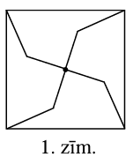

# <lo-sample/> LV.NOL.2013.5.1

Vai var atrast $7$ naturālus skaitļus (ne obligāti dažādus), kuru summa vienāda
ar to reizinājumu?

<small>

* questionType:
* domain:

</small>

## Atrisinājums

Jā, piemēram, $1,1,1,1,1,3,4$.

*Piezīme.* Uzdevumam ir arī vairāki citi atrisinājumi.

# <lo-sample/> LV.NOL.2013.5.2

Parādi, kā kvadrātu var sadalīt četros vienādos piecstūros.

<small>

* questionType:
* domain:

</small>

## Atrisinājums

Skat., piemēram, 1.zīm.

# <lo-sample/> LV.NOL.2013.5.3

Izveido sešciparu skaitli, kas dalās ar $7$ un kura pierakstā katrs no cipariem
$1, 2, 3, 4, 5, 8$ izmantots tieši vienu reizi.

<small>

* questionType:
* domain:

</small>

## Atrisinājums

**Atbilde:** piemēram, $142835$.

Ievērosim, ka $14$ dalās ar $7$, tātad arī $140000$ dalās ar $7$; $28$ un $2800$
dalās ar $7$; $35$ dalās ar $7$. Tātad $140000+2800+35=142835$ dalās ar $7$.
Uzdevuma prasības apmierina arī daudzi citi skaitļi.

# <lo-sample/> LV.NOL.2013.5.4

Piecstūra katrā virsotnē ieraksti vienu naturālu skaitli tā, lai katras malas
galapunktos ierakstīto skaitļu lielākais kopīgais dalītājs būtu $1$, bet katras
diagonāles galapunktos ierakstīto skaitļu lielākais kopīgais dalītājs būtu
lielāks nekā $1$.

<small>

* questionType:
* domain:

</small>

## Atrisinājums

Skat., piemēram, 2.zīm.

Uzdevuma atrisinājumu var iegūt, piemēram, šādi. Vispirms uz katras no
diagonālēm uzraksta dažādus pirmskaitļus, un pēc tam katrā virsotnē ieraksta
skaitļus, kas vienādi ar to pirmskaitļu reizinājumu, kas uzrakstīti uz no šīs
virsotnes izejošajām diagonālēm. Tādējādi katras diagonāles galapunktos
ierakstītajiem skaitļiem LKD vienāds ar uz šīs diagonāles uzrakstīto
pirmskaitli, tātad lielāks nekā $1$. Savukārt no virsotnēm, kas atrodas vienas
malas galapunktos, iziet dažādas diagonāles, tāpēc tajās ierakstīto skaitļu
LKD= $1$.

*Piezīme.* Uzdevuma atrisinājumam pietiek parādīt vienu pareizu piemēru.

# <lo-sample/> LV.NOL.2013.5.5

Doti $13$ punkti, daži no šiem punktiem savienoti ar nogriežņiem. Vai var būt
tā, ka no katra punkta iziet tieši $3$ vai $5$ nogriežņi?

<small>

* questionType:
* domain:

</small>

## Atrisinājums

**Atbilde:** nē, nevar.

Pieņemsim, ka to var izdarīt. Tad no katra no $13$ punktiem iziet nepāra skaits
nogriežņu. Tātad kopējais nogriežņu galapunktu skaits ir nepāra skaitlis, bet
tas ir pretrunā ar to, ka nogrieznim ir tieši divi galapunkti.

# <lo-sample/> LV.NOL.2013.6.1

Atrodi tādus četrus dažādus naturālus skaitļus $a$, $b, c$, $d$, ka
$\frac{1}{a}+\frac{1}{b}+\frac{1}{c}+\frac{1}{d}=1$.

<small>

* questionType:
* domain:

</small>

## Atrisinājums

**Atbilde:** piemēram, $2, 3, 9, 18$.

*Piezīme.* Uzdevumam ir arī vairāki citi atrisinājumi.

# <lo-sample/> LV.NOL.2013.6.2

Uz tāfeles rindā uzrakstīti naturālie skaitļi no $1$ līdz $10$. Roberts izvēlas
jebkurus divus no tiem, nodzēš tos un rindas galā uzraksta šo skaitļu starpību
(ja skaitļi ir dažādi, starpību aprēķina, no lielākā skaitļa atņemot mazāko).
Šo darbību atkārto, kamēr uz tāfeles paliek viens skaitlis.

**a)** Vai iespējams, ka šis skaitlis ir $1$?

**b)** Vai iespējams, ka šis skaitlis ir $0$?

<small>

* questionType:
* domain:

</small>

## Atrisinājums

**a)** Jā, piemēram: vispirms piecos gājienos iegūst

$$(1,2),(3,4),(5,6),(7,8),(9,10) \rightarrow 1,1,1,1,1 .$$

Tad četros gājienos iegūst prasīto:

$$1,1,1,1,1 \rightarrow 0,0,1 \rightarrow 0,1 \rightarrow 1$$

**b)** Ievērosim, ka, veicot doto pārveidojumu, uz tāfeles palikušo skaitļu
summas paritāte nemainās (jo $(a+b)$ un $(a-b)$ ir vienas paritātes skaitļi).
Sākotnējo skaitļu summa $55$ ir nepāra skaitlis; tātad rezultātā nevar iegūt
pāra skaitli $0$.

# <lo-sample/> LV.NOL.2013.6.3

Vai plaknē var uzzīmēt
**a)** $12$-stūri,

**b)** $13$-stūri

un riņķa līniju, kas krusto uzzīmētā daudzstūra katru malu tieši vienā punktā?
(Riņķa līnija nepieskaras daudzstūra malām un neiet caur tā virsotnēm.)

<small>

* questionType:
* domain:

</small>

## Atrisinājums

**a)** Skat., piem., 3.zīm.

**b)** Nē, nevar. Lai $13$-stūra malas krustotu riņķa līniju, jābūt virsotnēm,
       kas atrodas riņķa iekšpusē, un virsotnēm, kas atrodas riņķa ārpusē. Ar
	   $A_{1}$ apzīmēsim $13$-stūra
	   $A_{1}A_{2}A_{3}A_{4}A_{5}A_{6}A_{7}A_{8}A_{9}A_{10}A_{11}A_{12}A_{13}$
	   virsotni, kas atrodas riņķa iekšpusē. Lai mala $A_{1}A_{2}$ krustotu
	   riņķa līniju, virsotnei $A_{2}$ jāatrodas riņķa ārpusē. Līdzīgi virsotnei
	   $A_{3}$ jāatrodas riņķa iekšpusē, virsotnei $A_{4}$- riņķa ārpusē,
	   virsotnei $A_{5}$- riņķa iekšpusē, virsotnei $A_{6}$- riņķa ārpusē,
	   virsotnei $A_{7}$- riņķa iekšpusē, virsotnei $A_{8}$- riņķa ārpusē,
	   virsotnei $A_{9}$- riņķa iekšpusē, virsotnei $A_{10}$- riņķa ārpusē,
	   virsotnei $A_{11}- riņķa iekšpusē, virsotnei $A_{12}$- riņķa ārpusē,
	   virsotnei $A_{13}$- riņķa iekšpusē. Bet tādā gadījumā $13$-stūra malu
	   $A_{1}A_{13}$ riņķa līnija nekrusto.

# <lo-sample/> LV.NOL.2013.6.4

Atrast nenulles ciparus (ne obligāti dažādus):
**a)** $p, q$ un $r$ tādus, ka skaitlis $\overline{pqr}$ dalās ar
$\overline{qr}$ un $\overline{qr}$ dalās ar $r$;
**b)** $k, l, m$ un $n$ tādus, ka skaitlis $\overline{klmn}$ dalās ar
$\overline{lmn}, \overline{lmn}$ dalās ar $\overline{mn}$ un $\overline{mn}$
dalās ar $n$;
**c)** $a, b, c, d$ un $e$ tādus, ka skaitlis $\overline{abcde}$ dalās ar
$\overline{bcde}, \overline{bcde}$ dalās ar $\overline{cde}, \overline{cde}$
dalās ar $\overline{de}$ un $\overline{de}$ dalās ar $e$.

(*Pieraksts $\overline{xyzt}$ nozīmē, ka četrciparu skaitlī ir $x$ tūkstoši, 
$y$ simti, $z$ desmiti un $t$ vieni.*)

<small>

* questionType:
* domain:

</small>

## Atrisinājums

**a)** Ja pirmais cipars ir $1$, tad, pierakstot klāt divciparu skaitli, ar ko
dalās $100$, piemēram, $25$, iegūstam meklēto skaitli $125$.

**b)** Spriežot līdzīgi un izmantojot jau a) gadījumā atrasto $3$ ciparu
skaitli, var iegūt skaitli $1125$, kas apmierina uzdevuma prasības.

**c)** Var pamanīt, ka $90000$ dalās ar $1125$, tāpēc der skaitlis $91125$.

*Piezīme. Uzdevumam katrā apakšpunktā ir arī vairāki citi atrisinājumi.*

# <lo-sample/> LV.NOL.2013.6.5

Vai kvadrātā $6 \times 6$ rūtiņas var iekrāsot **a)** $7$ rūtiņas; **b)** $6$
rūtiņas tā, lai atlikušajā daļā vairs nevarētu ievietot nevienu 1.zīmējumā
attēloto figūru (tā var būt pagriezta vai apgriezta citādi)?

Figūra var tikt novietota tikai tā, lai tās malas ietu pa rūtiņu līnijām.

<small>

* questionType:
* domain:

</small>

## Atrisinājums

**Atbilde:** var iekrāsot gan $7$ , gan $6$ rūtiņas tā, lai uzdevuma prasības
būtu izpildītas. 4.zīm. parādīts, kā var iekrāsot $6$ rūtiņas; šajā zīmējumā
iekrāsojot vēl vienu jebkuru rūtiņu, uzdevuma prasības tiks apmierinātas. Ir arī
citi veidi, kā var iekrāsot $7$ rūtiņas.

# <lo-sample/> LV.NOL.2013.7.1

Naturālie skaitļi no $1$ līdz $18$ sadalīti pa pāriem tā, ka katrā pārī esošo
skaitļu summa ir naturāla skaitļa kvadrāts. Ar ko pārī apvienots skaitlis $1$?

Par skaitļa kvadrātu sauc skaitļa reizinājumu pašam ar sevi.

<small>

* questionType:
* domain:

</small>

## Atrisinājums

Izveidosim tabulu, ar ko pārī var būt apvienots katrs no dotajiem skaitļiem.

| $1$  | $3,8,15$ |
| :--- | :------- |
| $2$  | $7,14$   |
| $3$  | $1,6,13$ |
| $4$  | $5,12$   |
| $5$  | $4,11$   |
| $6$  | $3,10$   |
| $7$  | $2,9,18$ |
| $8$  | $1,17$   |
| $9$  | $7,16$   |

| $10$ | $6,15$ |
| :--- | :----- |
| $11$ | $5,14$ |
| $12$ | $4,13$ |
| $13$ | $3,12$ |
| $14$ | $2,11$ |
| $15$ | $1,10$ |
| $16$ | $9$    |
| $17$ | $8$    |
| $18$ | $7$    |

Ievērosim, ka $18$ var būt apvienots pārī tikai ar $7, 17$ ar $8$ un $16$ ar $9$.
Tālāk pakāpeniski secinām, ka $2$ ir apvienots ar $14, 11$ ar $5, 4$ ar $12, 13$
ar $3, 6$ ar $10$ un $1$ ar $15$.

**Atbilde:** $1$ ir apvienots pārī ar $15$.

# <lo-sample/> LV.NOL.2013.7.2

Cik starp pirmajiem $2013$ naturālajiem skaitļiem ir tādu skaitļu $x$, ka
skaitlis $x(x+1)(x+2)$ dalās ar $111$?

<small>

* questionType:
* domain:

</small>

## Atrisinājums

**Atbilde:** $162$.

$111=3 \cdot 37$, tāpēc vienam no skaitļiem $x, x+1$ vai $x+2$ jādalās ar $37$.
(Starp trīs pēc kārtas sekojošiem naturāliem skaitļiem viens noteikti dalās ar
$3$, tāpēc dotais reizinājums vienmēr dalās ar $3$.)

No $1$ līdz $2013$ ir $54$ skaitļi, kas dalās ar $37$ (lielākais $1998$).

Tātad $54$ veidos var izvēlēties tādu $x$, kas dalās ar $37$, $54$ veidos- tādu
$x$, ka $x+1$ dalās ar $37$ un $54$ veidos- tādu $x$, ka $x+2$ dalās ar $37$,
t.i., pavisam ir $54+54+54=162$ tādi skaitļi $x$, ka $x(x+1)(x+2)$ dalās ar $111$.

# <lo-sample/> LV.NOL.2013.7.3

Vai eksistē tāds **a)** $11$-stūris; **b)** $12$-stūris, kuram $8$ virsotnes
atrodas uz vienas taisnes?

<small>

* questionType:
* domain:

</small>

## Atrisinājums

**a)** Ja $11$-stūra $8$ virsotnes atrodas uz vienas taisnes, tad $3$ virsotnes
uz tās neatrodas. Apzīmēsim tās ar $A$, $B4 un $C$. Tad no pārējām $8$
virsotnēm daļa atrodas starp $A$ un $B$, daļa starp $B$ un $C$ un daļa- starp
$C$ un $A$. Pēc Dirihlē principa kādā no šīm daļām ir vismaz $3$ virsotnes un
tās visas atrodas uz vienas taisnes- pretruna.

**b)** Jā, var; skat. piemēram, 5.zīm.

# <lo-sample/> LV.NOL.2013.7.4

Vai pa riņķi var uzrakstīt $13$ naturālus skaitļus tā, lai jebkuru blakus esošu
skaitļu starpība būtu $6, 10, 14$ vai $18$?
 
<small>

* questionType:
* domain:

</small>

## Atrisinājums

Pieņemsim, ka to var izdarīt. Ievērosim, ka tādā gadījumā visu skaitļu
paritātes ir vienādas. Ja visi skaitļi ir nepāra, tad tiem visiem pieskaitīsim
$1$, uzdevumā dotā īpašība joprojām izpildīsies (blakus esošo skaitļu starpība
nemainīsies). Ja visi skaitļi ir pāra skaitļi (sākumā dotie vai iepriekš
aprakstītās darbības rezultātā iegūtie), izdalīsim tos visus ar $2$. Tagad
blakus stāvošo skaitļu starpības būs $3, 5, 7$ vai $9$ . Ievērosim, ka tagad
blakus stāvošo skaitļu paritātes ir dažādas, bet $13$ skaitļu gadījumā tas nav
iespējams.

# <lo-sample/> LV.NOL.2013.7.5

Vienādmalu trijstūris ar malas garumu $4$ sadalīts $16$ vienādos trijstūros
(skat. 2.zīm.). Katrā mazajā trijstūrī ir ierakstīts viens skaitlis, pavisam
ierakstīti septiņi trijnieki un deviņi piecinieki.

Pierādi, ka var izvēlēties četrus trijstūrus, kas veido vienādmalu trijstūri ar
malas garumu $2$ un kuros ierakstīto skaitļu summa ir vismaz $18$.

<small>

* questionType:
* domain:

</small>

## Atrisinājums

Sadalīsim sākotnējo trijstūri četros vienādmalu trijstūros ar malas garumu $2$
(skat. 6.zīm.). Tā kā ir četri šādi trijstūri (kas nepārklājas), un tajos
ierakstīti $9$ piecinieki, tad kādā no šiem trijstūriem būs vismaz trīs
piecinieki, tāpēc tajā ierakstīto skaitļu summa būs vismaz $5+5+5+3=18$, k.b.j.

# <lo-sample/> LV.NOL.2013.8.1

Skaitli $8999999$ uzraksti kā divu veselu skaitļu reizinājumu tā, lai katrs no
reizinātājiem ir lielāks nekā $1$.

<small>

* questionType:
* domain:

</small>

## Atrisinājums

Ievērosim, ka
$8999999=9000000-1=3000^{2}-1^{2}=(3000-1) \cdot(3000+1)=2999 \cdot 3001$.

# <lo-sample/> LV.NOL.2013.8.2

Trijstūrī $ABC$ novilkts augstums $BH$, bisektrise $BL$ un mediāna $BM$. Zināms,
ka punkts $L$ atrodas starp punktiem $M$ un $H$, turklāt
$\sphericalangle MBL=\sphericalangle LBH$,
$\sphericalangle CBH=\sphericalangle BAH$ un $BM=BC$. Nosaki trijstūra $ABC$
leņķu lielumus!

<small>

* questionType:
* domain:

</small>

## Atrisinājums

**Atbilde:** $\sphericalangle A=30^{\circ}, \sphericalangle B=90^{\circ}, \sphericalangle C=60^{\circ}$.

Tā kā $\sphericalangle MBL=\sphericalangle LBH$ un $BL$ ir bisektrise, tad
$\sphericalangle CBH=\sphericalangle ABM=\sphericalangle BAC$ un
$\triangle AMB$ ir vienādsānu un $BM = AM$ (skat. 7.zīm.).

Tā kā $MC=AM=BM=BC$, tad
$\triangle MBC$ ir vienādmalu un
$\sphericalangle MBC=\sphericalangle BCM=\sphericalangle CMB=60^{\circ}$.

$BH$ ir vienādmalu trijstūra $MBC$ augstums, tātad arī bisektrise, tāpēc
$\sphericalangle BAC=\sphericalangle CBH=60^{\circ}:2=30^{\circ}$.

$\sphericalangle ABC=180^{\circ}-(\sphericalangle BAC+\sphericalangle ACB)=180^{\circ}-\left(30^{\circ}+60^{\circ}\right)=90^{\circ}$.

# <lo-sample/> LV.NOL.2013.8.3

Cik ir tādu četrciparu skaitļu, kuru pierakstā ir vismaz viens pāra cipars?

<small>

* questionType:
* domain:

</small>

## Atrisinājums

**Atbilde:** $8375$.

Pavisam ir $9000$ četrciparu skaitļi. No tiem $5^{4}=625$ skaitļi satur tikai
nepāra ciparus. Tātad $9000-625=8375$ četrciparu skaitļu pierakstā ir vismaz
viens pāra cipars.

# <lo-sample/> LV.NOL.2013.8.4

Kvadrātā $3 \times 3$ rūtiņas ieraksti deviņus dažādus naturālus skaitļus tā,
lai katrā rindiņā ierakstīto skaitļu reizinājums un katrā kolonnā ierakstīto
skaitļu reizinājums būtu viens un tas pats.

<small>

* questionType:
* domain:

</small>

## Atrisinājums

To var izdarīt, piemēram, tā, kā parādīts 8.zīm.

Izmantojot pakāpju īpašību $a^{x+y}=a^{x} \cdot a^{y}$, atrisinājumu var iegūt,
tabulā ierakstot pakāpes ar vienādām bāzēm tā, lai kāpinātāju summa katrā
rindiņā un katrā kolonnā būtu viena un tā pati.

# <lo-sample/> LV.NOL.2013.8.5

Rindā kaut kādā secībā stāv $10$ zēni un $10$ meitenes. Divus bērnus var mainīt
vietām, ja starp tiem stāv ne vairāk kā $9$ citi bērni.

**a)** Pierādi, ka ar $10$ maiņām noteikti pietiek, lai panāktu, ka vispirms
stāv $10$ zēni un pēc tam $10$ meitenes.

**b)** Pierādi, ka sākuma situācija var būt tāda, ka ar $9$ maiņām nevar panākt,
ka vispirms stāv $10$ zēni un pēc tam $10$ meitenes.

<small>

* questionType:
* domain:

</small>

## Atrisinājums

**a)** Sanumurēsim pozīcijas no $1$ līdz $20$. Mums jāpanāk, ka pozīcijās no
$1$ līdz $10$ stāv zēni, bet no $11$ līdz $20$- meitenes.

Aplūkosim pirmo pozīciju. Ja tur stāv zēns, tad viss jau kārtībā. Ja meitene,
tad kādā no pozīcijām $2$ līdz $11$ noteikti stāv kāds zēns (jo vēl ir tikai
$9$ meitenes), tātad to var samainīt vietām ar $1$ . pozīcijā stāvošo meiteni.
Šādā veidā pirmajā solī ar vienu vai nevienu maiņu var panākt, ka pirmajā
pozīcijā stāv zēns.

Tālāk otrajā solī tieši tādā pašā veidā panāk, ka otrajā pozīcijā stāv zēns,
trešajā solī- ka trešajā pozīcijā stāv zēns utt.

Ar $10$ soļiem, t.i., ar ne vairāk kā $10$ maiņām var panākt, ka visās pozīcijās
no $1$ līdz $10$ stāv zēni.

**b)** Aplūkosim sākuma situāciju, kad meitenes stāv pozīcijās no $1$ līdz $10$,
bet zēni- pozīcijās no $11$ līdz $20$. Katrā maiņā piedalās tikai viens zēns
($2$ zēnu mainīšana vietām neko nemaina), tāpēc pēc $9$ maiņām noteikti būs
vismaz viens zēns, kas savu vietu nebūs mainījis, tātad joprojām atradīsies
kādā no pozīcijām no $11$ līdz $20$.

# <lo-sample/> LV.NOL.2013.9.1

Vai eksistē tāds naturāls skaitlis, kura kvadrāta pēdējie $9$ cipari ir
$987654321$?

<small>

* questionType:
* domain:

</small>

## Atrisinājums

Jā, piem., $111111111^{2}=12345678987654321$.

# <lo-sample/> LV.NOL.2013.9.2

Regulāra trijstūra iekšpusē patvaļīgi izvēlēts punkts $K$. Pierādīt, ka
attālumu summa no punkta $K$ līdz trijstūra malām nav atkarīga no punkta $K$
izvēles.

<small>

* questionType:
* domain:

</small>

## Atrisinājums

Apzīmēsim dotā regulārā trijstūra $ABC$ malas garumu ar $a$ un augstumu ar $h$
(skat. 1.zīm.). Tad
$S_{ABC}=\frac{1}{2} a \cdot KD+\frac{1}{2} a \cdot KE+\frac{1}{2} a \cdot KF=\frac{1}{2} a \cdot(KD+KE+KF)$.
No otras puses $S_{ABC}=\frac{1}{2} a \cdot h$. Tātad $KD+KE+KF=h$ neatkarīgi no
punkta $K$ izvēles.

# <lo-sample/> LV.NOL.2013.9.3

Taisnstūra malu garumi ir veseli skaitļi, bet tā perimetrs un laukums izsakās
ar vienu un to pašu skaitli. Atrast visus šādus taisnstūrus.

<small>

* questionType:
* domain:

</small>

## Atrisinājums

Ja $a$ un $b, a \geq b$ ir taisnstūra malu garumi, tad $ab=2a+2b$. Pārveidojot,
1.zīm. iegūstam $ab-2a-2b+4=4$ jeb $\quad(a-2)(b-2)=4$. Iegūtajam vienādojumam
naturālos skaitļos ir divi atrisinājumi:

- $a-2=b-2=2$ jeb $a=b=4$;
- $a-2=4$ un $b-2=1$ jeb $a=6$ un $b=3$.

# <lo-sample/> LV.NOL.2013.9.4

Zināms, ka $a_{1}, a_{2}, \ldots, a_{2013}$ ir tādi naturāli skaitļi, ka
$a_{1} > \sqrt{a_{2}}, a_{2} > \sqrt{a_{3}}, \ldots$, $a_{2012} > \sqrt{a_{2013}}$ un $a_{2013} > \sqrt{a_{1}}$.
Aprēķināt mazāko iespējamo summas $a_{1}+a_{2}+\ldots+a_{2013}$ vèrtību.

<small>

* questionType:
* domain:

</small>

## Atrisinājums

Tā kā visi $a_{i}(i=1,2, \ldots, 2013)$ ir naturāli skaitļi, to mazākā iespējamā
vērtība ir $1$. Ja kāds no dotajiem skaitļiem $a_{k}=1$, tad nevienādība
$a_{k}=1 > \sqrt{a_{k+1}}$ nav patiesa nevienam naturālam skaitlim $a_{k+1}$,
Tātad mazākā iespējamā skaitļu $a_{i}$ vērtība ir $2$. Viegli pārbaudīt, ka
$a_{1}=a_{2}=\ldots=a_{2013}=2$ apmierina dotās nevienādības, tāpēc summas
$a_{1}+a_{2}+\ldots+a_{2013}$ mazākā iespējamā vērtība ir
$2+2+\ldots+2=2 \cdot 2013=4026$.

# <lo-sample/> LV.NOL.2013.9.5

Profesora Cipariņa olimpiādē bija $3$ uzdevumi. Tajā piedalījās $100$ skolēni.
Pierādīt, ka atradīsies vismaz $13$ skolēni, kas izrēķināja vienus un tos pašus
uzdevumus (vai arī neizrēķināja nevienu uzdevumu).

Katrs skolēns katru uzdevumu vai nu izrēķināja vai neizrēķināja, daļēji
risinājumi netika iesniegti.

<small>

* questionType:
* domain:

</small>

## Atrisinājums

No trīs uzdevumiem var izveidot $8$ dažādus atrisināto uzdevumu „komplektus"
(t.sk., neviens atrisināts uzdevums). Ja katru "komplektu" būtu atrisinājuši ne
vairāk kā $12$ skolēni, tad skolēnu kopējais skaits būtu ne vairāk kā
$12 \cdot 8=96 < 100$. Tātad ir vismaz $13$ skolēni, kas izrēķinājuši vienus un
tos pašus uzdevumus.

*Piezīme.* Dotā uzdevuma risinājumā izmantots Dirihlē princips.

# <lo-sample/> LV.NOL.2013.10.1

Zināms, ka $a_{1}, a_{2}, \ldots, a_{10}$ ir dažādi naturāli skaitļi tādi, ka
$a_{1} > \sqrt{a_{2}}, a_{2} > \sqrt{a_{3}}$, ..., $\quad a_{9} > \sqrt{a_{10}}$
un $a_{10} > \sqrt{a_{1}}$. Aprēķināt mazāko iespējamo summas
$a_{1}+a_{2}+\ldots+a_{10}$ vērtību.

<small>

* questionType:
* domain:

</small>

## Atrisinājums

Tā kā visi $a_{i}(i=1,2, \ldots, 10)$ ir naturāli skaitļi, to mazākā iespējamā
vērtība ir $1$. Ja kāds no dotajiem skaitļiem $a_{k}=1$, tad nevienādība
$a_{k}=1 > \sqrt{a_{k+1}}$ nav patiesa nevienam naturālam skaitlim $a_{k+1}$.
Tātad mazākā iespējamā skaitļu $a_{i}$ vērtība ir $2$. Viegli pārbaudīt, ka
$a_{1}=2$, $a_{2}=3$, $a_{3}=4$, $a_{4}=5$, $a_{5}=6$, $a_{6}=7$, $a_{7}=8$,
$a_{8}=9$, $a_{9}=10$, $a_{10}=11$ apmierina dotās nevienādības. Tā kā tie ir
mazākie dažādie naturālie skaitļi, kas apmierina dotās nevienādības, tad summas
$a_{1}+a_{2}+\ldots+a_{10}$ mazākā iespējamā vērtība ir

$$2+3+4+5+6+7+8+9+10+11=65$$.

# <lo-sample/> LV.NOL.2013.10.2

Trijstūrim $ABC$ apvilktās riņķa līnijas un ievilktās riņķa līnijas centri ir
simetriski attiecībā pret vienu no trijstūra $ABC$ malām. Aprēķināt trijstūra
$ABC$ leņķus.

<small>

* questionType:
* domain:

</small>

## Atrisinājums

**Atbilde:** $36^{\circ}, 36^{\circ}, 108^{\circ}$.

Tā kā $\triangle ABC$ apvilktās un ievilktās riņķa līniju centri ir simetriski
vienu trijstūra malām (apzīmēsim to ar $BC$; skat. 2.zīm.), tad viens no tiem
atrodas $\triangle ABC$ iekšpusē, bet otrs- ārpusē. Tā kā ievilktās
riņķa līnijas centrs ${O}_{1}$ vienmēr atrodas trijstūra iekšpusē, tad
apvilktās riņķa līnijas centrs $O$ atrodas $\triangle ABC$ ārpusē un
$\triangle ABC$ ir platleņķa trijstūris.

$OC=OB$ kā apvilktās riņķa līnijas rādiusi, tad
$\triangle BOC$ ir vienādsānu. Apzīmēsim
$\sphericalangle OCB=\sphericalangle OBC=x$. Tad
$\sphericalangle BOC=180^{\circ}-$ $2x=UBAC$.

Tā kā $O_{1}$ ir simetrisks $O$ attiecībā pret taisni $BC$, tad
$\sphericalangle O_{1}BC=\sphericalangle OBC=x$ un
$\sphericalangle O_{1}CB=\sphericalangle OCB=x$.

Ievilktās rinķa līnijas centrs atrodas bisektrišu krustpunktā, tāpēc
$\sphericalangle CBO_{1}=\sphericalangle O_{1}BA=x$
un $\sphericalangle BCO_{1}=\sphericalangle O_{1}CA=x$.

Apskatām leņķus:
$\quad \triangle ABC \quad \sphericalangle BAC=\frac{1}{2} \cup BnC=\frac{1}{2}\left(360^{\circ}-\left(180^{\circ}-2 x\right)\right)=90^{\circ}+x$,
$\sphericalangle ACB=\sphericalangle CBA=2x$. Tad $90^{\circ}+x+2x+2x=180^{\circ}$
jeb $5x=90^{\circ}$ un $x=18^{\circ}$. Tātad
$\sphericalangle ACB=\sphericalangle CBA=36^{\circ}, \sphericalangle BAC=108^{\circ}$.

# <lo-sample/> LV.NOL.2013.10.3

Vai eksistē tāda trijstūra piramīda, kurai katras skaldnes perimetrs ir $2013$
un kurai nav vienāda garuma šķautņu?

<small>

* questionType:
* domain:

</small>

## Atrisinājums

Apzīmēsim piramīdas šķautņu garumus kā parādīts 3.zīm.

Pienemsim, ka $a, b, c, d, e, f$ ir dažādi skaitļi. Tā kā visu skaldņu
perimetri ir vienādi, tad

$\left\{\begin{array}{l}a+b=d+f \\ a+c=e+f \\ b+c=d+e\end{array}\right.$

Saskaitot pirmos divus vienādojumus un no tiem atnemot trešo vienādojumu,
iegūstam $2a=2f$ jeb $a=f-$ pretruna.

# <lo-sample/> LV.NOL.2013.10.4

Ansītis aprēķināja skaitļu $2^{2013}$ un $5^{2013}$ vērtības un iegūtos skaitļus
uzrakstīja vienu aiz otra. Cik cipari uzrakstīti?

<small>

* questionType:
* domain:

</small>

## Atrisinājums

Pieņemsim, ka $n$ ir skaitļa $2^{2013}$ ciparu skaits, $m$- skaitļa
$5^{2013}$ ciparu skaits. Tad $10^{n-1} < 2^{2013} < 10^{n}$ un
$10^{m-1} < 5^{2013} < 10^{m}$. Sareizināsim šīs nevienādības:
$10^{n+m-2} < 10^{2013} < 10^{n+m}$. Tātad $n+m-2 < 2013 < n+m$ un vienīgā
iespējamā $n+m$ vērtība (t.i., uzrakstīto ciparu skaits) ir $2014$.

# <lo-sample/> LV.NOL.2013.10.5

Doti $7$ dažādi naturāli skaitļi, kuri nepārsniedz $21$. Pierādīt, ka no tiem
var izvēlēties divus skaitļu pārus, kuru starpības ir vienādas. (Skaitļu pāriem
var būt arī kopīgs skaitlis, starpību aprēķina no lielākā skaitļa atņemot
mazāko.)

<small>

* questionType:
* domain:

</small>

## Atrisinājums

No septiņiem dažādiem skaitļiem var izveidot $(6 \cdot 7):2=21$ dažādus pārus.
Dotie skaitļi ir dažādi, pie tam nav mazāki kā $1$ un nav lielāki kā $21$,
tāpēc divu šādu skaitļu starpības vērtība ir vismaz $1$ un nepārsniedz
$21-1=20$. Tā kā starpības var pieņemt tikai $20$ dažādas vērtības, bet pavisam
var izveidot $21$ dažādu skaitļu pāri, tad vismaz divu pāru skaitļu starpības
būs vienādas.

# <lo-sample/> LV.NOL.2013.11.1

Atrisināt veselos skaitļos vienādojumu $(x-y)(x+y)=x$.

<small>

* questionType:
* domain:

</small>

## Atrisinājums

**Atbilde:** atrisinājumi ir $(0; 0)$ un $(1; 0)$.

Pārveidosim vienādojumu formā

$$x(x-1)=y^{2}$$

Ja $x=0$ vai $x=1, tad $y=0$ un atrisinājums eksistē.

Pieņemsim, ka $x > 1$. Tad ir spēkā stingrā nevienādība

$$(x-1)^{2} < x(x-1) < x^{2}$$

Tā kā $x(x-1)$ atrodas starp divu secīgu veselu skaitļu kvadrātiem, tad tas
nevar būt vesela skaitļa kvadrāts.

Līdzīgi, ja $x < 0$, tad ir spēkā stingrā nevienādība

$$x^{2} < x(x-1) < (x-1)^{2}$$

Tātad arī šajā gadījumā $x(x-1)$ nevar būt vesela skaitļa kvadrāts.

# <lo-sample/> LV.NOL.2013.11.2

Caur paralelograma $ABCD$ virsotnēm $B$ un $D$ ir novilkta riņķa līnija, kas
krusto malas $AB, DA, BC$ un $CD$ attiecīgi to
iekšējos punktos $P, Q, R$ un $S$. Pierādīt, ka $PQ || RS$

<small>

* questionType:
* domain:

</small>

## Atrisinājums

Novilksim diagonāli $BD$; apzīmēsim $\sphericalangle PQD=\alpha$
(skat. 4.zīm.). Tā kā četrstūris $PQDB$ ir ievilkts riņķa līnijā, tad
$\sphericalangle PBD=180^{\circ}-\sphericalangle PQD=180^{\circ}-\alpha$.
No tā, ka $ABCD$ ir paralelograms un $AB || CD$ seko, ka
$\sphericalangle SDB=\sphericalangle PBD=180^{\circ}-\alpha$.
Četrstūris $SRBD$ arī ir ievilkts riņķa līnijā, tāpēc
$\sphericalangle SRB=180^{\circ}-\sphericalangle SDB=180^{\circ}-\left(180^{\circ}-\alpha\right)=\alpha$.

Atliek ievērot, ka taisnes $PQ$ un $RS$ veido vienādus lenķus
$\alpha$ ar paralēlām taisnēm $AD$ un $BC$, tāpēc tās arī ir paralēlas.

# <lo-sample/> LV.NOL.2013.11.3

Dotas sešas vienāda izskata monētas un sviras svari bez atsvariem. Četras no
monētām sver $10$ gramus katra, pārējās divas sver $9$ gramus katra. Kā ar divām
svēršanām atrast vismaz vienu monētu, kas sver $9$ gramus?

<small>

* questionType:
* domain:

</small>

## Atrisinājums

Var rīkoties, piemēram, šādi.

Vispirms katrā svaru kausā novieto trīs monētas. Ja svari ir līdzsvarā, tad
katra $9~ \mathrm{g}$ smagā monēta ir savā kausā. Tad izvēlas divas monētas no
viena kausa un sver vēlreiz. Ja to masas ir vienādas, tad atlikusī monēta sver
$9~ \mathrm{g}$; ja nē, tad vieglākā no tām sver $9~ \mathrm{g}$.

Ja pirmajā svēršanā viens svaru kauss (apzīmēsim to ar $A$ ) bija vieglāks, tad
abas $9~ \mathrm{g}$ monētas ir šajā svaru kausā. Tad izvēlas divas monētas no
kausa $A$ un sver vēlreiz. Ja svari ir līdzsvarā, tad atrastas abas
$9~ \mathrm{g}$ monētas, pretējā gadījumā vieglākā no tām sver $9$ gramus.

# <lo-sample/> LV.NOL.2013.11.4

Polinoms $P(x)$ ar veseliem koeficientiem četrām veselām $x$ vērtībām pieņem
vērtību $2000$. Pierādīt, ka nav tādas veselas $x$ vērtības, pie kuras dotais
polinoms pieņem vērtību $2013$.

<small>

* questionType:
* domain:

</small>

## Atrisinājums

Apzīmēsim $F(x)=P(x)-2000$. Tādā gadījumā $a, b, c, d$ ir polinoma $F(x)$
saknes un $F(x)=(x-a)(x-b)(x-c)(x-d) R(x)$.

Ja $P(n)=2013$, tad $F(n)=13=(n-a)(n-b)(n-c)(n-d) R(n)$. Taču skaitļi $13$
nevar izteikt kā ne mazāk kā $4$ dažādu veselu skaitļu reizinājumu.

# <lo-sample/> LV.NOL.2013.11.5

Plaknē doti $n \geq 3$ patvaļīgi izvietoti punkti. Zināms, ka nekādi $3$ no
tiem neatrodas uz vienas taisnes. Pierādīt, ka eksistē tāds $n$-stūris
(iespējams, ieliekts), kura virsotnes atrodas šajos punktos. Daudzstūra malas
nedrīkst krustoties.

<small>

* questionType:
* domain:

</small>

## Atrisinājums

Aplūkosim visas iespējamās slēgtās lauztās līnijas, kas katra sastāv no $n$
posmiem un visi tās $n$ lauzuma punkti ir dotajos punktos. Pierādīsim, ka no
tām lauztā līnija ar vismazāko perimetru arī ir meklētais $n$-stūris.
Pieņemsim pretējo, ka šādai lauztai līnijai kādi divi posmi $AB$ un $CD$
krustojas punktā $X$ , pie tam lauztā līnija turpinās no punkta $A$ uz $D$
un no punkta $B$ uz $C$ (skat. 5.zīm.):

Izdzēšam nogriežņus $AB$ un $CD$, un uzzīmējam nogriežņus $AC$ un $BD$.
Pierādīsim, ka lauztās līnijas perimetrs samazinājās.

No trijstūra nevienādības seko, ka
$AC < AX+XC$ un
$BD < BX+XD$. Tāpēc
$AC+BD < (AX+XC)+(BX+XD)=(AX+BX)+(XC+XD)=AB+CD$,
un jaunās lauztās līnijas perimetrs ir mazāks nekā iepriekšējēs, kas ir
pretrunā ar pieņēmumu.

# <lo-sample/> LV.NOL.2013.12.1

Zināms, ka $a$ un $b$ ir divi dažādi naturāli skaitļi. Pierādīt, ka

$$\frac{a+b}{2}-\sqrt{ab} > \frac{1}{4(a+b)}$$

<small>

* questionType:
* domain:

</small>

## Atrisinājums

Pārveidosim doto nevienādību:

$\frac{a+b}{2}-\sqrt{ab} > \frac{1}{4(a+b)} \Leftrightarrow a+b-\frac{1}{2(a+b)} > 2 \sqrt{ab} \Leftrightarrow(a+b)^{2}-1+\frac{1}{4(a+b)^{2}} > 4ab \Leftrightarrow$ $(a-b)^{2}+\frac{1}{4(a+b)^{2}} > 1$

Tā kā $a$ un $b$ ir divi dažādi naturāli skaitļi, tad
$(a-b)^{2} \geq 1$ un $\frac{1}{4(a+b)^{2}} > 0$, līdz ar to pēdējā
nevienādība ir patiesa. Tā kā tika veikti ekvivalenti pārveidojumi, tad arī
visas iepriekšējās, t.sk. dotā, nevienādības ir patiesas, k.b.j.

# <lo-sample/> LV.NOL.2013.12.2

Nogrieznis $BP$ ir trijstūra $ABC$ bisektrise, punkti $N$ un $M$ ir attiecīgi
malu $AB$ un $AC$ tādi iekšēji punkti, ka $AN=PC$ un $AM=BC$. Taisnes $BP$ un
$MN$ krustojas punktā $X$. Pierādīt, ka $\triangle NBX \sim \triangle PBC$.

<small>

* questionType:
* domain:

</small>

## Atrisinājums

No bisektrises īpašības iegūstam $\frac{AB}{AP}=\frac{BC}{PC}$. Tā kā
$AM=BC$ un $AN=PC$, tad ir spēkā $\frac{AB}{AP}=\frac{AM}{AN}$. Tāpēc
$\triangle ABP \sim \triangle AMN$. No tā seko, ka
$\sphericalangle ANM=\sphericalangle APB$. Savukārt
$\sphericalangle BNX=180^{\circ}-\sphericalangle ANM$ un
$\sphericalangle BPC=180^{\circ}-\sphericalangle APB$, tāpēc
$\sphericalangle BNX=\sphericalangle BPC$. No tā iegūstam vajadzīgo pēc pazīmes
$\ell \ell$.

*Piezīme*: punkts $M$ var atrasties dažādās pusēs no $P$ , kā arī sakrist ar
to. Tomēr tas nekādi neietekmē uzdevuma risinājumu (piem., sk. 6. un 7.zīm.).

# <lo-sample/> LV.NOL.2013.12.3

Dots, ka $n > 1$ ir tāds naturāls skaitlis, kas, dalot ar $7$, dod atlikumu
$1$. Pierādīt, ka skaitļa $n^{2}+3n+3$ visi pirmreizinātāji ir mazāki nekā
$n^{2}$.

<small>

* questionType:
* domain:

</small>

## Atrisinājums

Ievērosim, ka $n^{2}+3n+3 \equiv 1^{2}+3+3 \equiv 0(\bmod 7)$. Tātad skaitlis
$n^{2}+3n+3$ dalās ar $7$ un tā pirmreizinātāji var būt tikai skaitlis $7$ vai
arī tādi pirmskaitļi, kas nepārsniedz $\frac{n^{2}+3n+3}{7}$. Pamatosim, ka
$7 < n^{2}$ un $\frac{n^{2}+3n+3}{7} < n^{2}$.

Tā kā $n \equiv 1(\bmod 7)$ un $n > 1$, tad $n \geq 8$. Taču tad
$n^{2} \geq 8^{2} > 7$.

Nevienādība $\quad \frac{n^{2}+3n+3}{7} < n^{2} \quad$ ir ekvivalenta
nevienādībai $\quad n^{2}+3n+3 < 7n^{2} \quad \Leftrightarrow$ $2n^{2}-n-1 > 0$.

Atliek ievērot, ka funkcija $f(x)=2x^{2}-x-1=(x-1)(2x+1)$ pieņem pozitīvas
vērtības intervālā $(1 ;+\infty)$, tātad $2n^{2}-n-1 > 0$ visiem naturāliem
skaitļiem $n > 1$.

# <lo-sample/> LV.NOL.2013.12.4

Dots regulārs sešstūris ar malas garumu $1$. Uz katras malas ir patvaļīgi
izvēlēts viens punkts (skat. 1.zīm.). Pierādīt, ka vismaz viena iekrāsotā
trijstūra laukums nepārsniedz $\frac{\sqrt{3}}{16}$.

<small>

* questionType:
* domain:

</small>

## Atrisinājums

Sauksim par doto $6$ trijstūru sānu malām tās malas, kas atrodas uz sešstūra
malām. Aplūkosim šo trijstūru abu sānu malu garumu summas. Tā kā dotā sešstūra
perimetrs ir vienāds ar $6$, no Dirihlē principa seko, ka vismaz viena šāda
summa nav lielāka kā $1$ (jo visas trijstūru sānu malas pilnībā nosedz visas
sešstūra malas). Apzīmēsim šo trijstūri ar $\Delta$ un tā sānu malas ar $a$ un
$b$, tad $a+b \leq 1$. No nevienādības starp vidējo aritmētisko un vidējo
ģeometrisko seko:

$$\begin{align*}
& 2 \sqrt{ab} \leq a+b \leq 1 \\
& ab \leq\left(\frac{a+b}{2}\right)^{2} \leq\left(\frac{1}{2}\right)^{2} \\
& ab \leq \frac{1}{4} \tag{1}
\end{align*}$$

Trijstūra $\Delta$ laukumu varam aprēķināt pēc formulas
$\frac{1}{2} ab \sin \alpha$, kur $\alpha$ ir leņķis starp malām $a$ un $b$.
Tā kā dots regulārs sešstūris, tad $\alpha=120^{\circ}$. Tāpēc trijstūra
$\Delta$ laukums ir vienāds ar

$$\begin{equation*}
\frac{1}{2} ab \sin \alpha=\frac{1}{2} ab \sin 120^{\circ}=\frac{1}{2} ab \frac{\sqrt{3}}{2}=\frac{\sqrt{3}}{4} ab \tag{2}
\end{equation*}$$

No (1) un (2) seko, ka trijstūra $\Delta$ laukums nav lielāks kā
$\frac{\sqrt{3}}{4} \cdot \frac{1}{4}=\frac{\sqrt{3}}{16}$, k.b.j.

# <lo-sample/> LV.NOL.2013.12.5

Parlamentā ir $2013$ deputāti; katram no viņiem ir domstarpības ar ne vairāk
kā $d$ ( $0 \leq d \leq 2012$ ) citiem deputātiem. Domstarpības ir abpusējas:
ja $A$ ir domstarpības ar $B$, tad arī $B$ ir domstarpības ar $A$. Pierādīt,
ka deputātus var sadalīt $d+1$ komisijā tā, lai nekādiem diviem vienas
komisijas locekļiem nebūtu domstarpību savā starpā.

<small>

* questionType:
* domain:

</small>

## Atrisinājums

Pierādīsim vispārīgāku apgalvojumu: ja parlamentā ir $n$ deputāti un katram no
viņiem ir domstarpības ar ne vairāk kā $d$ citiem deputātiem, kur
$0 \leq d \leq n$, tad deputātus var sadalīt $d+1$ komisijā tā, lai vienas
komisijas nekādiem diviem deputātiem nebūtu domstarpību savā starpā. Tādā
gadījumā uzdevumā prasītais sekos no pierādītā apgalvojuma, ja $n=2013$.
Pierādāmo apgalvojumu pamatosim ar matemātisko indukciju pēc $n$.

*Indukcijas bāze.* Ja $n=d+1$, tad katrā no $d+1$ komisijām iekļaujam tieši
vienu deputātu. Acīmredzami, ka tad starp vienas komisijas locekļiem nekādiem
diviem deputātiem nebūtu domstarpību savā starpā.

*Induktīvais pieņēmums.* Pieņemsim, ka gadījumā, ja parlamentā ir $n$ deputāti,
tad viņus var sadalīt vajadzīgajā veidā.

*Induktīvā pāreja.* Pieņemsim, ka parlamentā ir $n+1$ deputāts; parādīsim, ka
arī tad viņus var sadalīt $d+1$ komisijā vajadzīgajā veidā.

Izvēlamies patvaļīgu deputātu $A$. Atlikušos $n$ deputātus sadala $d+1$
komisijā tā, lai starp vienas komisijas locekļiem nekādiem diviem deputātiem
nebūtu domstarpību savā starpā (ko var izdarīt, saskaņā ar induktīvo pieņēmumu).
Deputātam $A$ ir domstarpības ar ne vairāk kā $d$ citiem deputātiem, taču
izveidota $d+1$ komisija. Tas nozīmē, ka ir vismaz viena tāda komisija, ka
$A$ nav domstarpību ne ar vienu šīs komisijas deputātu. Tad $A$ varam iekļaut
šajā komisijā, līdz ar ko arī $n+1$ deputāts ir sadalīts $d+1$ komisijā
vajadzīgajā veidā. Induktīvā pāreja ir izdarīta, tātad apgalvojums ir pierādīts.

