# <lo-sample/> LV.NOL.2014.5.1

Uz rūtiņu lapas uzzīmēti divi taisnstūri ar izmēriem $1 \times 3$ rūtiņas tā, 
ka tie nepārklājas un saskaras pa veselu skaitu rūtiņu malām, veidojas 
daudzstūris, no $6$ rūtiņām, kura malas iet pa rūtiņu līnijām. Katrs no 
taisnstūriem var būt novietots vertikāli vai horizontāli. Kāds var būt iegūtās 
figūras perimetrs? (Atrodi visas iespējamās vērtības un pamato, kāpēc nav 
citu!)

<small>

* questionType:
* domain:

</small>

## Atrisinājums

Katra taisnstūra perimetrs ir $2 \cdot(1+3)=8$, tātad *"kopējais"* perimetrs ir
$16$. Saliekot kopā, taisnstūri var saskarties ar $1,\ 2$ vai $3$ rūtiņu malām 
(skat. A1.zīm.); ar katru rūtiņu malu, kas tiem saskaras, kopējais perimetrs 
samazinās par $2$. Tātad iegūtajai figūrai perimetrs var būt 
$16-2=14,\ 16-4=12$ vai $16-6=10$.

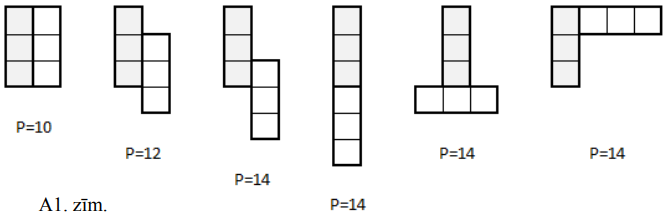

# <lo-sample/> LV.NOL.2014.5.2

Naturālā vienpadsmitciparu skaitlī vienādus ciparus aizstāja ar vienādiem 
burtiem, bet dažādus - ar dažādiem; ieguva pierakstu $PĀRSTEIGUMS$. Zināms, ka 
šis skaitlis dalās ar $18$. Noteikt, kurš cipars aizstāts ar burtu $S$. Atbildi
pamatot!

<small>

* questionType:
* domain:

</small>

## Atrisinājums

Vārdā $PĀRSTEIGUMS$ pavisam ir $11$ burti, no tiem pirmie $10$ dažādi, tātad 
pirmie $10$ burti apzīmē visus $10$ ciparus. Tad

$$P+Ā+R+S+T+E+I+G+U+M+S=0+1+2+3+4+5+6+7+8+9+S=45+S$$

Tā kā dotais vienpadsmitciparu skaitlis dalās ar $18=2 \cdot 9$, tad tas ir 
pāra skaitlis (tātad $S$ ir pāra cipars) un tā ciparu summa dalās ar $9$ (t.i.,
$45+S$ dalās ar $9$).

Lai summa $45+S$ dalītos ar $9$, saskaitāmajam $A$ ir jādalās ar $9$ (ja viens 
saskaitāmais dalās ar $9$, tad, lai summa dalītos ar $9$, arī otram 
saskaitāmajam jādalās ar $9$). Vienīgie cipari, kas dalās ar $9$, ir $0$ un 
$9$. Tā kā $S$ ir pāra skaitlis, tad cipars $9$ neder.

Tātad ar burtu $S$ ir aizstāts cipars $0$.

# <lo-sample/> LV.NOL.2014.5.3

No četrciparu skaitļa $A$ atņemot trīsciparu skaitli $B$, iegūst $8002$. Šos 
pašus skaitļus $A$ un $B$ saskaitot, iegūst piecciparu skaitli. Atrast $A$ un 
$B$.

<small>

* questionType:
* domain:

</small>

## Atrisinājums

No uzdevuma nosacījumiem seko, ka, pieskaitot skaitlim $8002$ skaitli $B$ divas
reizes, iegūst vismaz $10\ 000$. Tas ir iespējams tikai, ja $B=999$ (ja 
$B<999$, tad $8002+B+B<10000$). Tāpēc $B=999$ un $A=8002+B=8002+999=9001$.

*Piezīme.* Uzdevumu var risināt arī apskatot vislielāko trīsciparu skaitli 
$999$ un pamatojot, ka mazāki trīsciparu skaitļi uzdevuma nosacījumus 
neapmierina.

# <lo-sample/> LV.NOL.2014.5.4

Grāmatas lappuses ir sanumurētas ar naturāliem skaitļiem no $1$ līdz $2014$ pēc
kārtas. Cik lappušu numuros ir sastopams cipars $7$?

<small>

* questionType:
* domain:

</small>

## Atrisinājums

Vispirms noskaidrosim, cik lappušu numuros pirmajās $1000$ lappusēs nav 
izmantots cipars $7$. Aizstāsim $1000$ lappusi ar $0$ - to lappusi, tad visi 
lappušu numuri ir trīsciparu skaitļi (viencipara un divciparu lappusēm priekšā 
var pierakstīt divas vai vienu nulli). Katru ciparu var izvēlēties $9$ veidos 
(der visi cipari izņemot $7$), tāpēc šādu lappušu skaits ir 
$9 \cdot 9 \cdot 9=729$. Tātad cipars $7$ ir izmantots $1000-729=271$ lappuses 
numurā. Tikpat daudz lappusēs cipars $7$ ir izmantots otrajā tūkstotī. Vēl 
viens cipars $7$ ir izmantots skaitlī $2007$. Tātad kopā cipars $7$ ir 
sastopams $271+271+1=543$ lappušu numuros.

## Atrisinājums

Pieņemsim, ka grāmatai ir vēl arī $0$ - tā lappuse. Tā kā tās numerācijā nav 
izmantots cipars $7$, tad šāds pieņēmums neizmanīs rezultātu - aprēķināto 
lappušu numuru skaitu.

Starp pirmajām desmit lappusēm (no $0.$ līdz $9.$) vienas numurā būs sastopams 
cipars $7$.

Lai aprēķinātu lappušu ar $7$ skaitu starp pirmajām $100$ lappusēm (no $0.$ 
līdz $99.$), nepieciešams ņemt vērā, ka septītnieks ir visās lappusēs no $70.$ 
līdz $79.$ (kopā $10$ lappuses) un pārējos deviņos lappušu desmitos katrā vēl 
pa vienam - kopā $19$ lappuses.

Tagad aprēķinām lappušu skaitu starp pirmajām $1000$ lappusēm (no $0.$ līdz 
$999.$). No $700.$ līdz $799.$ lappusei cipars $7$ ir visās $100$ lappusēs. 
Katrā no pārējiem deviņiem lappušu simtiem ir pa $19$ lappusēm. Tātad pavisam 
$100+9 \cdot 19=271$ lappuse.

Tieši tikpat lappušu ar ciparu $7$ ir otrajā lappušu tūkstotī (no $1000.$ līdz 
$1999.$). Tātad no $0.$ līdz $1999.$ lappusei cipars $7$ ir sastopams $542$ 
lappušu numuros. Vēl cipars $7$ ir $2007.$ lappuses numurā.

Tātad no $1.$ līdz $2014.$ lappusei cipars $7$ ir sastopams $543$ lappušu 
numuros.

# <lo-sample/> LV.NOL.2014.5.5

Doti $99$ punkti, daži no šiem punktiem savienoti ar nogriežņiem. Vai var būt 
tā, ka no katra punkta iziet nepāra skaits nogriežņu?

<small>

* questionType:
* domain:

</small>

## Atrisinājums

Pieņemsim, ka tā var būt. Tad no katra no $99$ punktiem iziet nepāra skaits 
nogriežņu. Tātad kopējais nogriežņu galapunktu skaits ir nepāra skaitlis, bet 
tas ir pretrunā ar to, ka nogrieznim ir tieši divi galapunkti. Tātad uzdevumā 
aprakstītā situācija nav iespējama.

# <lo-sample/> LV.NOL.2014.6.1

Atrodiet kaut vienu tādu skaitli $a$, ka vienlaicīgi izpildās šādas īpašības:

**(A)** noapaļojot $a$, $3 \cdot a$, $5 \cdot a$, $7 \cdot a$ līdz veselam 
skaitlim, jānoapaļo uz leju;

**(B)** noapaļojot $2 \cdot a,\ 4 \cdot a,\ 6 \cdot a$ līdz veselam skaitlim, 
jānoapaļo uz augšu.

<small>

* questionType:
* domain:

</small>

## Atrisinājums

Var pārbaudīt, ka der, piemēram, skaitlis $a=0,49$. Der arī citas $a$ vērtīas.

# <lo-sample/> LV.NOL.2014.6.2

Rūtiņu lapā uzzīmēt figūru, kuras malas iet pa rūtiņu līnijām un kuru var 
sadalīt četrās daļās tā, ka katra daļa sastāv no veselām rūtiņām un katra daļa 
saskaras ar katru citu daļu vismaz pa vienas rūtiņas malu. Vai prasītās figūras
laukums var būt mazāks par $10$ rūtiņām?

<small>

* questionType:
* domain:

</small>

## Atrisinājums

Piemēram, skat. A2.zīm.

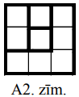

# <lo-sample/> LV.NOL.2014.6.3

Pareizā vienādībā $4 \cdot 4=16$ var katru ciparu izmainīt tieši par $1$ un 
atkal iegūt pareizu vienādību $5 \cdot 5=25$. Atrast

**(A)** kaut vienu piemēru ar tādu pašu īpašību, kurā reizina viencipara 
skaitli un trīsciparu skaitli,

**(B)** kaut vienu piemēru ar tādu pašu īpašību, kurā reizina viencipara 
skaitli un divciparu skaitli, pie tam sākotnējā vienādībā ir vismaz četri 
dažādi cipari.

<small>

* questionType:
* domain:

</small>

## Atrisinājums

Der, piemēram,
**(A)** $1 \cdot 333=333$ un $2 \cdot 222=444$;
**(B)** $3 \cdot 25=75$ un $4 \cdot 16=64$.

# <lo-sample/> LV.NOL.2014.6.4

Grāmatas lappuses ir sanumurētas ar naturāliem skaitļiem no $1$ līdz $2014$ pēc
kārtas. Cik lappušu numuros ir sastopams vismaz viens no cipariem $3$ vai $7$?

<small>

* questionType:
* domain:

</small>

## Atrisinājums

Vispirms noskaidrosim, cik lappušu numuros pirmajās $1000$ lappusēs nav 
izmantots cipars $3$ vai $7$. Aizstāsim $1000$ lappusi ar $0$ - to lappusi, tad
visi lappušu numuri ir trīsciparu skaitļi (viencipara un divciparu lappusēm 
priekšā var pierakstīt divas vai vienu nulli). Katru ciparu var izvēlēties $8$ 
veidos (der visi cipari izņemot $3$ un $7$), tāpēc šādu lappušu skaits ir 
$8 \cdot 8 \cdot 8=512$. Tātad cipars $3$ vai $7$ ir izmantots $1000-512=488$ 
lappušu numuros. Tikpat daudz lappusēs cipars $3$ vai $7$ ir izmantots otrajā 
tūkstotī. Vēl cipars $3$ ir izmantots skaitlī $2003$ un $2013$, cipars $7$ - 
skaitlī $2007$. Tātad kopā cipars $3$ vai $7$ ir sastopams $488+488+3=979$ 
lappušu numuros.

## Atrisinājums

Pieņemsim, ka grāmatai ir vēl arī $0$-tā lappuse. Tā kā tās numerācijā nav 
izmantoti cipari $3$ un $7$, tad šāds pieņēmums neizmanīs rezultātu - 
aprēķināto lappušu numuru skaitu.

Starp pirmajām desmit lappusēm (no $0.$ līdz $9.$ lappusei) divu lappušu 
numuros būs sastopams cipars $3$ vai $7$.

Lai aprēķinātu prasīto lappušu (ar ciparu $3$ vai $7$) numuru skaitu starp 
pirmajām $100$ lappusēm (no $0.$ līdz $99.$), nepieciešams ņemt vērā, ka cipars
$3$ ir visās lappusēs no $30.$ līdz $39.$ un cipars $7$ - visās lappusēs no 
$70.$ līdz $79.$, bet pārējos astoņos lappušu desmitos katrā vēl pa divām - 
kopā $36$ lappuses.

Tagad aprēķinām lappušu numuru skaitu starp pirmajām $1000$ lappusēm (no $0.$ 
līdz $999.$). No $300.$ līdz $399.$ lappusei visās ir cipars $3$, bet no $700.$
līdz $799.$ lappusei visās ir cipars $7$. Katrā no pārējiem astoņiem lappušu 
simtiem ir pa $36$ lappušu numuriem ar ciparu $3$ vai $7$. Tātad starp pirmajām
$1000$ lappusēm ir $200+8 \cdot 36=488$ lappušu numuri, kas satur ciparu $3$ 
vai $7$.

Tieši tikpat lappušu numuru, kas satur ciparu $3$ vai $7$, ir otrajā lappušu 
tūkstotī (no $1000.$ līdz $1999.$). Tātad no $0.$ līdz $1999.$ lappusei $976$ 
lappušu numuros ir sastopams cipars $3$ vai $7$. Vēl cipars $3$ vai $7$ ir 
atrodams $2003.,\ 2007.$ un $2013.$ lappuses numurā.

Tātad no $1.$ līdz $2014.$ lappusei cipars $3$ vai $7$ ir sastopams $979$ 
lappušu numuros.

# <lo-sample/> LV.NOL.2014.6.5

Uz tāfeles rindā uzrakstīti naturālie skaitļi no $1$ līdz $20$. Roberts izvēlas
jebkurus divus no tiem, nodzēš tos un rindas galā uzraksta šo skaitļu starpību 
(ja skaitļi ir dažādi, starpību aprēķina, no lielākā skaitļa atņemot mazāko). 
Šo darbību atkārto, kamēr uz tāfeles paliek viens skaitlis.

**(A)** Vai iespējams, ka šis skaitlis ir $0$?

**(B)** Vai iespējams, ka šis skaitlis ir $1$?

<small>

* questionType:
* domain:

</small>

## Atrisinājums

**(A)** Jā, piemēram, vispirms desmit gājienos iegūst

$$\begin{aligned}
& (1,2),(3,4),(5,6),(7,8),(9,10),(11,12),(13,14),(15,16),(17,18),(19,20) \rightarrow \\
& \rightarrow 1,1,1,1,1,1,1,1,1,1. 
\end{aligned}$$

Pēc tam piecos gājienos iegūst:

$$(1,1),(1,1),(1,1),(1,1),(1,1) \rightarrow 0,0,0,0,0$$

Tad četros gājienos iegūst skaitli $0$:

$$0,0,0,0,0 \rightarrow 0,0,0,0 \rightarrow 0,0,0 \rightarrow 0,0 \rightarrow 0$$

**(B)** Ievērosim, ka, veicot doto pārveidojumu, uz tāfeles palikušo skaitļu 
summas paritāte nemainās (jo $(a+b)$ un ($a-b$) ir vienas paritātes skaitļi). 
Sākotnējo skaitļu summa $210$ ir pāra skaitlis; tātad rezultātā nevar iegūt 
nepāra skaitli $1$.

# <lo-sample/> LV.NOL.2014.7.1

$$\square \cdot x+ \square = \square$$

Ariadne vienā (jebkurā) rūtiņā ieraksta vienu skaitli, pēc tam Eleonora citā 
rūtiņā ieraksta vienu skaitli un beidzot Ariadne ieraksta skaitli atlikušajā 
tukšajā rūtiņā. Pierādīt, ka Ariadne var panākt jebkuru no trim situācijām:

**(A)** vienādojumam ir tieši viens atrisinājums,

**(B)** vienādojumam nav atrisinājumu;

**(C)** vienādojumam ir bezgalīgi daudz atrisinājumu.

(Spēles sākumā jau zināms, kuru situāciju jāiegūst.)

<small>

* questionType:
* domain:

</small>

## Atrisinājums

Ievērojam, ka lineāram vienādojumam $ax=b$ :

- ir tieši viens atrisinājums, ja $a \neq 0$;
- nav atrisinājums, ja $a=0$ un $b \neq 0$;
- ir bezgalīgi daudz atrisinājumu, ja $a=b=0$.

Tātad Ariadnei jārīkojas šādi:

**(A)** Pirmajā gājienā pirmajā lodziņā jāieraksta no nulles atšķirīgs 
skaitlis. Neatkarīgi no Eleonoras gājiena un Ariadnes otrā gājiena vienādojumam
būs tieši viens atrisinājums.

**(B)** Pirmajā gājienā pirmajā lodziņā jāieraksta $0$, bet otrs skaitlis 
Ariadnei jāieraksta citāds nekā Eleonoras ierakstītais.

**(C)** Pirmajā lodziņā Ariadnei jāieraksta $0$, bet otram skaitlim jābūt tādam
pašam kā Eleonoras ierakstītajam.

# <lo-sample/> LV.NOL.2014.7.2

Uz taisnā leņķa $KLM$ malām atlikti punkti $X$ un $Y$ (katrs uz savas malas); 
uz tā bisektrises ņemts tāds punkts $O$, ka $\sphericalangle XOY=90^{\circ}$. 
Pierādīt, ka $OX=OY$.

<small>

* questionType:
* domain:

</small>

## Atrisinājums

Novelkam no punkta $O$ perpendikulus $OA$ un $OB$ pret leņķa $KLM$ malām $KL$ 
un $LM$ (skat. A3.zīm.). Tā kā punkts $O$ atrodas uz leņķa bisektrises, tad 
attālumi no punkta $O$ līdz leņķa malām ir vienādi, t.i., $OA=OB$. Četrstūra 
$LAOB$ trīs leņķi ir $90^{\circ}$ lieli, tātad arī 
$\sphericalangle AOB=90^{\circ}$.

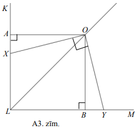

Ievērojam, ka

- $\sphericalangle XOA=\sphericalangle XOY-\sphericalangle AOY=90^{\circ}-\sphericalangle AOY$;
- $\sphericalangle YOB=\sphericalangle AOB-\sphericalangle AOY=90^{\circ}-\sphericalangle AOY=\sphericalangle XOA$.

Tad $\triangle XAO=\triangle YBO$ (pēc pazīmes " $\ell m \ell$ "):

- $\sphericalangle XAO=\sphericalangle YBO=90^{\circ}$;
- $OA=OB$;
- $\sphericalangle XOA=\sphericalangle YOB$.

Līdz ar to $OX=OY$ kā vienādu trijstūru atbilstošās malas.

# <lo-sample/> LV.NOL.2014.7.3

Cik starp pirmajiem $2014$ naturālajiem skaitļiem ir tādu skaitļu $x$, ka 
skaitlis $x(x+1)(x+2)$ dalās ar $87$?

<small>

* topic:DivisibilityRulesOther
* topic:MultiplesInInterval
* questionType:FindCount
* domain:NT

</small>

## Atrisinājums

Ievērojam, ka $87=29 \cdot 3$. Tā kā $29$ ir pirmskaitlis, tad vienam no 
skaitļiem $x,\ x+1$ vai $x+2$ jādalās ar $29$. Starp trīs pēc kārtas sekojošiem
naturāliem skaitļiem viens noteikti dalās ar $3$, tāpēc dotais reizinājums 
vienmēr dalās ar $3$.

No $1$ līdz $2016$ ($2016$ ir lielākā iespējamā $x+2$ vērtība) ir $69$ skaitļi,
kas dalās ar $29$ (lielākais no tiem ir $2001=69 \cdot 29$).

Tātad $69$ veidos var izvēlēties tādu $x$, kas dalās ar $29$, $69$ veidos - 
tādu $x$, ka $x+1$ dalās ar $29$ un $69$ veidos - tādu $x$, ka $x+2$ dalās ar 
$29$, t. i., pavisam ir $69+69+69=207$ tādi skaitļi $x$, ka $x(x+1)(x+2)$ dalās
ar $87$.

## Atrisinājums
 
**#DivisibilityProperties** 
Ievērojam, ka izteiksme $x(x+1)(x+2)$ vienmēr dalās ar $3$, 
jo $x, x+1, x+2$ pieņem visus iespējamos atlikumus, dalot ar $3$. 

Uzdevumā faktiski jāsaskaita tie $x$, kuriem $x(x+1)(x+2)$ dalās 
ar $87/3 = 29$. 
Vērtības $x=29,58,87,116,\ldots,2001$ dalās ar $29$. Piemēram $2001 = 29 \cdot 69$. 
Šādu $x$ ir pavisam $69$. 

Bet tā kā ar $29$ drīkst dalīties arī $x+1$ vai $x+2$, tad der arī $x=28,57,86,115,\ldots$
un arī $x=27,56,85,114,\ldots$. Tāpēc atrisinājumu ir trīsreiz vairāk nekā $69$. 
To pavisam ir $3 \cdot 69 = 207$.

jādalās ar $29$. 
Tādu $x$ ir trīsreiz vairāk kā $\left\lfloor 2014/29 \right\rfloor$. 

# <lo-sample/> LV.NOL.2014.7.4

Uz ballīti ieradās $N$ ($N>1$) cilvēki un ballītes beigās katrs uz lapiņas 
uzrakstīja veselu skaitli robežās no $0$ līdz $N-1$ - cik jau iepriekš 
pazīstamus cilvēkus ballītē saticis. Uzskatīsim, ka pazīšanās ir abpusēja - ja 
$A$ pazīst $B$, tad $B$ pazīst $A$. Izrādījās, ka uz visām lapiņām bija 
uzrakstīti atšķirīgi skaitļi. Pierādīt, ka vismaz viens no ballītes 
apmeklētājiem ir kļūdījies.

<small>

* questionType:
* domain:

</small>

## Atrisinājums

Ja visi skaitļi ir atšķirīgi, tad katrs no skaitļiem no $0$ līdz $N-1$ ir bijis
uzrakstīts tieši vienu reizi. Tas, kurš uzrakstīja $0$, nepazina nevienu citu 
ballītes dalībnieku un, tātad, arī viņu neviens nepazina. Tas nozīmē, ka 
nevarēja būt dalībnieks, kas pazīst $N-1$ dalībnieku (visus, izņemot sevi). 
Tātad vismaz viens no ballītes apmeklētājiem kļūdījās.

# <lo-sample/> LV.NOL.2014.7.5

Pilsētas ielu tīkls veido kvadrātveida režģi, kas sastāv no $8 \times 8$ 
vienādām kvadrātiskām rūtiņām. Katrā no $81$ rūtiņu stūriem ir autobusu 
pietura; citu pieturu nav. Kādu vismazāko skaitu autobusa maršrutu jāievieš, 
lai no katras pieturas varētu aizbraukt uz katru citu, izdarot ne vairāk kā 
vienu pārsēšanos? Pa katru maršrutu autobuss kursē abos virzienos; katrs 
maršruts drīkst saturēt augstākais vienu pagriezienu.

<small>

* questionType:
* domain:

</small>

## Atrisinājums

Katrs maršruts iet pa augstākais vienu horizontāli un vienu vertikāli. Ja 
maršrutu skaits nepārsniedz $8$, tad atrastos vertikāle un horizontāle, pa 
kurām neiet neviens maršruts; uz šo ielu krustpunktu nevarētu aizbraukt.

Ar $9$ maršrutiem pietiek. Piemēram, var ņemt visus maršrutus, katrs no kuriem 
satur pilnībā vienu vertikāli un visu augšējās horizontāles daļu pa labi no šīs
vertikāles (skat. A4.zīm.).

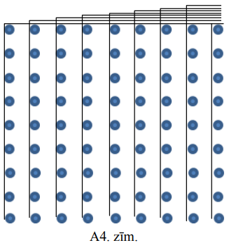

# <lo-sample/> LV.NOL.2014.8.1

Dots, ka $a+b+c=0$ un $a \neq 0$. Pierādīt, ka vienādojumam $ax^{2}+bx+c=0$ ir 
saknes (varbūt vienādas), un izteikt tās, neizmantojot kvadrātsaknes zīmi.

<small>

* questionType:
* domain:

</small>

## Atrisinājums

No vienādības $a+b+c=0$ seko, ka skaitlis $1$ ir vienādojuma $ax^{2}+bx+c=0$ 
sakne. Otru vienādojuma sakni atrodam izmantojot Vjeta teorēmu:

$x_{1}+x_{2}=-\frac{b}{a} \Rightarrow \quad x_{1}=1$ un $x_{2}=-\frac{b}{a}-1$

vai arī

$x_{1}x_{2}=\frac{c}{a} \Rightarrow \quad x_{1}=1$ un $x_{2}=\frac{c}{a}$

# <lo-sample/> LV.NOL.2014.8.2

Taisnstūra $ABCD$ diagonāle $BD$ ir taisnstūra $BDEF$ mala, punkts $C$ atrodas 
uz $EF$. Malas $BC$ viduspunkts ir $G$. Pierādīt, ka $AG=EG$.

<small>

* questionType:
* domain:

</small>

## Atrisinājums

Novelkam nogriežņu $BC$ un $BF$ vidusperpendikulus $GK$ un $MN$ (skat. 
A5.zīm.).

Tā kā katrs punkts, kas atrodas uz nogriežņa vidusperpendikula, atrodas vienādā
attālumā no nogriežņa galapunktiem, tad $AG=DG$.

Ievērojam, ka $BM=MF$ un $MN \perp BF$. No kā seko, ka $MG \parallel CF$ un 
$MG$ ir trijstūra $BFC$ viduslīnija, kas iet caur malas $BC$ viduspunktu $G$. 
Tātad punkts $G$ atrodas uz nogriežņa $BF$ vidusperpendikula $MN$ (nogriežņu 
$BF$ un $DE$ vidusperpendikuli sakrīt, jo $BDEF$ ir taisnstūris). Līdz ar to 
$DG=GE$.

Esam ieguvuši, ka $AG=DG=GE$, kas arī bija jāpierāda.

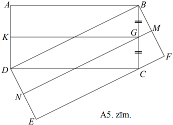

# <lo-sample/> LV.NOL.2014.8.3

Cik ir tādu piecciparu skaitļu, kuru pierakstā ir vismaz viens nepāra cipars?

<small>

* topic:RuleOfProduct
* topic:CountingSetDifference
* questionType:FindCount
* domain:Comb

</small>

## Atrisinājums

Pavisam ir $9 \cdot 10 \cdot 10 \cdot 10 \cdot 10=90000$ piecciparu skaitļi. 
Uzdevumā prasīts atrast visus tos piecciparu skaitļus, kuru pierakstā ir vismaz
viens nepāra cipars; šo nosacījumu neapmierina tie skaitļi, kuros visi cipari 
ir pāra. Šādu (kas satur tikai pāra ciparus) skaitļu skaits ir 
$4 \cdot 5 \cdot 5 \cdot 5 \cdot 5=2500$ (skaitļa pirmais cipars var būt 
$2,\ 4,\ 6,\ 8$ - četras dažādas iespējas). Tātad $90000-2500=87500$ piecciparu
skaitļu pierakstā ir vismaz viens nepāra cipars.

## Atrisinājums

**#SetComplement** 
Vieglāk saskaitīt skaitļus, kuri neapmierina doto prasību -- t.i. skaitļus, 
kuru pierakstā nav nepāra ciparu. 

**#ProductRule**
Skaitlis nevar sākties ar ciparu $0$, tātad pirmais cipars var būt 
$2,4,6,8$. Visi tālākie cipari var pieņemt jebkuru no piecām vērtībām 
$0,2,4,6,8$. 
Pēc reizināšanas likuma, $5$-ciparu skaitļu bez nepāru cipariem ir 
$4 \cdot 5^4 = 2500$. 

Visu pārējo skaitļu, kuros ir vismaz viens nepāra cipars būs $90000 - 2500$.

# <lo-sample/> LV.NOL.2014.8.4

Uz ballīti ieradās $N(N>1)$ cilvēki un ballītes beigās katrs uz lapiņas 
uzrakstīja veselu skaitli robežās no $0$ līdz $N-1$ - cik jau iepriekšs 
pazīstamus cilvēkus ballītē saticis. Uzskatīsim, ka pazīšanās ir abpusēja - ja 
$A$ pazīst $B$, tad $B$ pazīst $A$. Vai var būt, ka uz visām lapiņām bija 
uzrakstīti nepāra skaitļi, ja **(A)** $N=2014$, **(B)** $N=2401$?

<small>

* questionType:
* domain:

</small>

## Atrisinājums

**(A)** var būt. Piemēram, ja visi viesi viens otru pazīst pa pāriem, tad visi 
viesi uz lapiņas būs uzrakstījuši pa vieniniekam.

**(B)** nevar būt. Visu uzrakstīto skaitļu kopsummai jābūt pāra skaitlim, kas 
vienāds ar divkāršotu pazīšanos skaitu (jo katru pazīšanos atzīmē abi tajā 
iesaistītie - $A$ pazīst $B$ un $B$ pazīst $A$). Nepāra skaita nepāru skaitļu 
summa ir nepāra skaitlis, tāpēc šāda situācija nav iespējama.

# <lo-sample/> LV.NOL.2014.8.5

Trijstūra virsotnes atrodas kvadrātiska rūtiņu režģa punktos. Pierādīt, ka kāda
no trijstūra malām iet vai nu caur kādu citu rūtiņu režģa punktu, vai kādas 
rūtiņas centru. 

<small>

* questionType:
* domain:

</small>

## Atrisinājums

Ieviesīsim koordinātu sistēmu tā, ka koordinātu asis iet pa rūtiņu malām un $1$
vienība ir vienas rūtiņas malas garums. Varam ievērot, ka rūtiņu krustpunktu 
koordinātas ir $\left(\frac{n_{1}}{2}, \frac{n_{2}}{2}\right)$, kur $n_{1}$ un 
$n_{2}$ ir nepāra skaitļi. Punktu $(a, b)$ un $(c, d)$ viduspunkta koordinātas 
ir $\left(\frac{a+c}{2}, \frac{b+d}{2}\right)$.

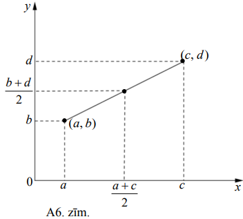

Aplūkosim trijstūra virsotnu koordinātas $(x, y)$ pēc to paritātes. Katra 
virsotne ietilpst kādā no grupām

$$(p, p), \quad(p, n), \quad(n, p), \quad \mathbf{(n, n)}$$

kur ar $p$ apzīmēts pāra skaitlis, ar $n$ - nepāra.

Iespējami divi gadījumi:

- Ja divas trijstūra virsotnes ietilpst vienā grupā, tad izvēlamies šos divus 
  punktus un šo punktu viduspunkta koordinātas abi būs veseli skaitļi, kas 
  nozīmē, ka šis viduspunkts atrodas kādā citā rūtiņu režģa krustpunktā.
- Ja nekādas divas virsotnes neietilpst vienā grupā, tad var izvēlēties divas 
  virsotnes tā, ka abām koordinātām ir pretēja paritāte. Šo punktu viduspunkta 
  koordinātas būs formā $\left(\frac{n_{1}}{2}, \frac{n_{2}}{2}\right)$, kur 
  $n_{1}$ un $n_{2}$ - nepāra skaitļi, kas nozīmē, ka šis viduspunkts atrodas 
  kādas rūtiņas centrā jeb trijstūra mala iet caur rūtiņas centru. Līdz ar to 
  esam pierādījuši prasīto.

# <lo-sample/> LV.NOL.2014.9.1

Vai vienādojumam $2x^{2}+a^{2}+b^{2}=2x \cdot(a+b)$ ir atrisinājums, ja $a$ un 
$b$ ir dažādi skaitļi?

<small>

* questionType:
* domain:

</small>

## Atrisinājums

Ievērosim, ka

$$2x^{2}-2x \cdot(a+b)+a^{2}+b^{2}=\left(x^{2}-2ax+a^{2}\right)+\left(x^{2}-2bx+b^{2}\right)=(x-a)^{2}+(x-b)^{2}$$

Tāpēc doto vienādojumu var pārveidot formā

$$(x-a)^{2}+(x-b)^{2}=0$$

Divu skaitļu kvadrātu summa ir $0$ tad un tikai, ja abi šie skaitļi ir nulles. 
Ja $x$ ir dotā vienādojuma sakne, tad jābūt $x=a$ un $x=b$; bet tas nozīmē, ka 
$a=b$; pretruna ar uzdevuma nosacījumu. Tātad dotajam vienādojumam nav 
atrisinājuma.

## Atrisinājums

Uzrakstām dota kvadrātvienādojuma diskriminatu:

$$\begin{aligned}
D & =4(a+b)^{2}-8\left(a^{2}+b^{2}\right)=4a^{2}+8ab+4b^{2}-8a^{2}-8b^{2}= \\
& =-4a^{2}+8ab-4b^{2}=-4\left(a^{2}-2ab+b^{2}\right)=-4(a-b)^{2}
\end{aligned}$$

Lai kvadrātvienādojumam būtu atrisinājums diskriminanta vētībai jābūt 
nenegatīvai. Tā kā $-4(a-b)^{2} \leq 0$, tad vienīgā iespēja, lai dotajam 
vienādojumam eksistētu atrisinājums ir gadījums, kad $a=b$.

Tātad, ja $a$ un $b$ ir dažādi skaitļi, dotajam vienādojumam nav atrisinājuma.

# <lo-sample/> LV.NOL.2014.9.2

Taisnstūra malu garumi ir veseli skaitļi, tā perimetrs ir par $8$ mazāks nekā 
taisnstūra laukums. Atrast visus šādus taisnstūrus.

<small>

* questionType:
* domain:

</small>

## Atrisinājums

Ja $a$ un $b,\ a \geq b$ ir taisnstūra malu garumi, tad $ab=2a+2b+8$. 
Ekvivalenti pārveidojot, iegūstam $ab-2a-2b+4=12$ jeb $(a-2)(b-2)=12$. Pēdējā 
vienādojuma kreisās puses reizinātāji var pieņemt tikai vērtības $1$ un 
$12,\ 2$ un $6$ vai $3$ un $4$ (tā kā vienādojums ir simetrisks attiecībā pret 
mainīgajiem $a$ un $b$, tad reizinātāju secība nav svarīga). Līdz ar to 
iespējami trīs gadījumi:

- $a-2=1$ un $b-2=12$ jeb $a=3$ un $b=14$;
- $a-2=2$ un $b-2=6$ jeb $a=4$ un $b=8$;
- $a-2=3$ un $b-2=4$ jeb $a=5$ un $b=6$.

Uzdevuma nosacījumus apmierina taisnstūri ar izmēriem 
$3 \times 14,\ 4 \times 8$ un $5 \times 6$.

# <lo-sample/> LV.NOL.2014.9.3

Atrisināt naturālos skaitļos vienādojumu $3abc+3a+3b=7bc+7$.

<small>

* questionType:
* domain:

</small>

## Atrisinājums

Izsakām mainīgo $a$ :

$$\begin{aligned}
& a(3bc+3)=7bc+7-3b \\
& a=\frac{7bc+7-3b}{3(bc+1)}=\frac{7(bc+1)-3b}{3(bc+1)}=\frac{7(bc+1)}{3(bc+1)}-\frac{3b}{3(bc+1)}=\frac{7}{3}-\frac{b}{bc+1}=2 \frac{1}{3}-\frac{b}{bc+1}
\end{aligned}$$

Lai $a$ būtu naturāls skaitlis, tad jābūt $\frac{b}{bc+1}=\frac{1}{3}$ vai 
$\frac{b}{bc+1}=1 \frac{1}{3}=\frac{4}{3}$.

Apskatām abus gadījumus:

- Ja $\frac{b}{bc+1}=\frac{1}{3}$, tad $a=2$ un $bc+1=3b$ jeb 
  $c=\frac{3b-1}{b}=\frac{3b}{b}-\frac{1}{b}=3-\frac{1}{b}$. Skaitlis $c$ ir 
  naturāls tikai tad, ja $\frac{1}{b}$ ir naturāls. Vienīgā iespēja, ja $b=1$. 
  Līdz ar to esam ieguvuši, ka $a=2,\ b=1$ un $c=2$ ir dotā vienādojuma 
  atrisinājums.
- Ja $b$ un $c$ ir naturāli skaitļi, tad $b < bc+1$ jeb $\frac{b}{bc+1}<1$. Tātad
  $\frac{b}{bc+1} \neq \frac{4}{3}$ un šajā gadījumā dotajam vienādojumam nav 
  atrisinājuma.

Līdz ar to esam parādījuši, ka dotajam vienādojumam naturālos skaitļos ir viens
vienīgs atrisinājums $a=2,\ b=1$ un $c=2$.

# <lo-sample/> LV.NOL.2014.9.4

Figūra "sienāzis" apdraud tās rūtiņas, kas tai pieskaras ar stūriem (skat. 
1.zīm, kur $s$ - sienāzis, $x$ - rūtiņas, ko tas apdraud). Cik dažādos veidos 
uz $8 \times 8$ rūtiņu šaha galdiņa var novietot vienu baltu un vienu melnu 
sienāzi (katru savā rūtiņā) tā, lai tie viens otru neapdraudētu?

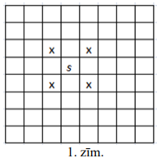

<small>

* questionType:
* domain:

</small>

## Atrisinājums

Apskatām trīs principiāli atšķirīgus baltā sienāža izvietojumus:

- Ja baltais sienāzis atrodas šaha galdiņa stūra rūtiņā, tad tas apdraud tikai 
  vienu rūtiņu $x$ (skat. A1. a) zīm.). Līdz ar to melno sienāzi var novietot 
  jebkurā no atlikušajām $64-1-1=62$ rūtiņām. Tā kā ir četras stūra rūtiņas, 
  tad dažādo izvietojumu skaits ir $4 \cdot 62=248$.
- Ja baltais sienāzis atrodas šaha galdiņa malējā rūtiņā (ne stūrī), tad tas 
  apdraud divas rūtiņas $x$ (skat. A1. b) zīm.). Līdz ar to melno sienāzi var 
  novietot jebkurā no atlikušajām $64-1-2=61$ rūtiņām. Tā kā ir $24$ malējās 
  rūtiņas, tad dažādo izvietojumu skaits ir $24 \cdot 61=1464$.
- Ja baltais sienāzis atrodas kādā no šaha galdiņa vidus rūtiņā (ne stūrī un ne
  pie šaha galda malas), tad tas apdraud četras rūtiņas $x$ (skat. A1. c) 
  zīm.). Līdz ar to melno sienāzi var novietot jebkurā no atlikušajām 
  $64-1-4=59$ rūtiņām. Tā kā ir $36$ vidus rūtiņas, tad dažādo izvietojumu 
  skaits ir $36 \cdot 59=2124$.

Tātad kopējais dažādo figūru izvietojumu skaits ir $248+1464+2124=3836$.

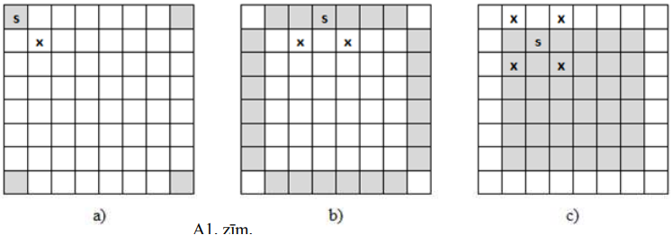

# <lo-sample/> LV.NOL.2014.9.5

Kvadrāta $ABCD$ malas garums ir $1;\ M$ ir malas $AD$ viduspunkts. Nogriežņi 
$AC$ un $BM$ krustojas punktā $S$. Aprēķināt trijstūra $ASM$ laukumu.

<small>

* questionType:
* domain:

</small>

## Atrisinājums

Trijstūri $ASM$ un $CSB$ ir līdzīgi (pēc pazīmes " $\ell \ell$ "), jo 
$\sphericalangle ASM=\sphericalangle CSB$ kā krustleņķi un 
$\sphericalangle SAM=\sphericalangle SCB$ kā iekšējie šķērsleņķi pie paralēlām 
taisnēm $AD$ un $BC$ (skat. A2.zīm.). Tā kā $AM=\frac{1}{2} AD=\frac{1}{2} BC$,
tad $\frac{BS}{SM}=\frac{BC}{AM}=2$. Šo trijstūru laukumu attiecība ir vienāda 
ar trijstūru līdzības koeficienta kvadrātu, t.i., 
$\frac{S_{CSB}}{S_{ASM}}=2^{2}=4$ jeb $S_{CSB}=4S_{ASM}$.

Ievērojam, ka trijstūriem $ASM$ un $ASB$ ir kopīgs augstums, un malu, pret 
kurām novilkts kopīgais augstums, attiecība ir $\frac{BS}{SM}=2$. Līdz ar to šo
trijstūru laukumu attiecība arī ir $2$, t.i., $\frac{S_{ABS}}{S_{ASM}}=2$ jeb 
$S_{ABS}=2S_{ASM}$.

Esam ieguvuši, ka $S_{ABC}=S_{ABS}+S_{SBC}=2S_{ASM}+4S_{ASM}$. Tā kā 
$S_{ABC}=\frac{1}{2} S_{ABCD}=\frac{1}{2} \cdot 1=\frac{1}{2}$, tad 
$6S_{ASM}=\frac{1}{2}$ jeb $S_{ASM}=\frac{1}{12}$.

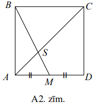

# <lo-sample/> LV.NOL.2014.10.1

Dots, ka $x^{3}>2$. Pierādīt, ka
**(A)** $x^{6}>4$;
**(B)** $x^{7}>5$.

<small>

* questionType:
* domain:

</small>

## Atrisinājums

**(A)** Ievērojam, ka $x^{6}=x^{3} \cdot x^{3}>2 \cdot 2=4$. Līdz ar to esam 
pierādījuši, ka $x^{6}>4$.

## Atrisinājums

**(A)** Dotās nevienādības $x^{3}>2$ abas puses ir pozitīvas. Tāpēc, ceļotot to
pakāpē ar naturālu kāpinātāju, atkal iegūst patiesas nevienādības. Tātad, ceļot
$x^{3}>2$ kvadrātā, iegūst $x^{6}>4$, kas arī bija jāpierāda.

## Atrisinājums

**(B)** Tā kā $2^{7}=128>125=5^{3}$, tad, doto izteiksmi kāpinot septītajā 
pakāpē, iegūstam:

$$\left(x^{3}\right)^{7}>2^{7}>5^{3} \Rightarrow\left(x^{7}\right)^{3}>5^{3} \Rightarrow x^{7}>5$$

## Atrisinājums

**(B)** Velkot trešās pakāpes sakni no dotās nevienādības abu pušu izteiksmēm, 
iegūstam $x>\sqrt[3]{2}$.

Tā kā nevienādību $x>\sqrt[3]{2}$ un $x^{6}>4$ abas puses ir pozitīvas, tad 
varam šīs nevienādības reizināt

$$x \cdot x^{6}>\sqrt[3]{2} \cdot 4$$

Veicot pārveidojumus un novērtējot, iegūstam prasīto:

$$x^{7}>\sqrt[3]{2} \cdot 4=\sqrt[3]{2} \cdot \sqrt[3]{64}=\sqrt[3]{128}>\sqrt[3]{125}=5$$

# <lo-sample/> LV.NOL.2014.10.2

Pierādīt, ka, izvēloties $52$ no aritmētiskās progresijas 
$1,\ 4,\ 7,\ 10,\ \ldots$ locekļiem, kas nepārsniedz $300$, vienmēr starp šiem 
skaitļiem var atrast divus skaitļus, kuru summa ir $302$.

<small>

* topic:SeriesMembersSumsClosedFormulas
* topic:MultiplesInInterval
* topic:SeriesMembersSumsClosedFormulas
* topic:NumTheoryPigeonhole
* questionType:Prove
* domain:Comb

</small>

## Atrisinājums

Lielākais minētās aritmētiskās progresijas loceklis, kas nepārsniedz $300$, ir 
$298$. Sadalām visus progresijas locekļus kopās (katras kopas, kurā ir divi 
progresijas locekļi, elementu summa ir $302$):

$$\{1\},\ \{151\},\ \{4, 298\},\ \{7, 295\},\ \{10, 292\},\ \ldots,\ \{148, 154\}$$

Šādu kopu skaits ir $51$. Tā kā ir jāizvēlas $52$ skaitļi, tad vismaz divi no 
tiem būs no vienas kopas. Šie skaitļi ir meklētie divi skaitļi, kas summā dod 
$302$.

## Atrisinājums

Progresijā ir 100 locekļu zem 300

$$1, 4, 7, \ldots, 148, 151, 154, \ldots, 298$$

* Diviem locekļiem - $1$, $151$ - nav pāra, ar ko summa ir $302$.
* Vēl ir 49 pārīši - $(4,298)$, $(7,295)$, $\ldots$, $(148,154)$.
* Izvēloties $52$ skaitļus, vismaz $50$ no tiem būs $\neq 1$, $\neq 151$. 
* Dirihlē princips - divi būs no viena pārīša.

# <lo-sample/> LV.NOL.2014.10.3

Piecstūris $ABCDE$ ievilkts riņķa līnijā, nogriežņi $AD$ un $BE$ krustojas 
punktā $F$. Zināms, ka $BC=DF=DE$. Pierādīt, ka $AC=CE$.

<small>

* questionType:
* domain:

</small>

## Atrisinājums

Novelkam $BD,\ AC$ un $EC$ (skat. A3.zīm.).

Tā kā ievilktie leņķi, kas balstās uz vienādām hordām, ir vienādi, tad 
$\sphericalangle EBD=\sphericalangle BEC=\sphericalangle DAE=\beta$ un 
$\sphericalangle DEC=\sphericalangle CAD=\alpha$. Vienādsānu trijstūra $DEF$ 
leņķi pie pamata ir vienādi, t.i., 
$\sphericalangle DEF=\sphericalangle EFD=\alpha+\beta$. Tad 
$\sphericalangle AEF=180^{\circ}-\sphericalangle EFD=180^{\circ}-(\alpha+\beta)$
kā blakusleņķi. No $\triangle AEF$ iegūstam, ka

$$\sphericalangle AEF=180^{\circ}-\sphericalangle FAE-\sphericalangle AFE=180^{\circ}-\beta-180^{\circ}+\alpha+\beta=\alpha.$$

Esam ieguvuši, ka $\sphericalangle EAC=\sphericalangle AEC=\alpha+\beta$. Tātad
trijstūris $AEC$ ir vienādsānu un $AC=CE$ kā atbilstošās sānu malas.

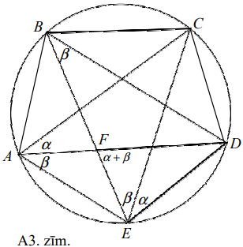

# <lo-sample/> LV.NOL.2014.10.4

Zināms, ka $a_{1}, a_{2}, \ldots, a_{10}$ ir tādi dažādi nepāra naturāli 
skaitļi, ka $a_{1}>\sqrt{a_{2}},\ a_{2}>\sqrt{a_{3}}, \ldots$, 
$a_{9}>\sqrt{a_{10}}$ un $a_{10}>\sqrt{a_{1}}$. Aprēķināt vismazāko summas 
$a_{1}+a_{2}+\ldots+a_{10}$ vērtību.

<small>

* questionType:
* domain:

</small>

## Atrisinājums

Tā kā visi $a_{i}(i=1,2, \ldots, 10)$ ir naturāli skaitļi, to mazākā iespējamā 
vērtība ir $1$. Ja kāds no dotajiem skaitļiem $a_{k}=1$, tad nevienādība 
$a_{k}=1>\sqrt{a_{k+1}}$ nav patiesa nevienam naturālam skaitlim $a_{k+1}$. 
Tātad mazākā iespējamā skaitļu $a_{i}$ vērtība ir $3$ (skaitlis $2$ neder, jo 
tas ir pāra skaitlis). Viegli pārbaudīt, ka 
$a_{1}=3,\ a_{2}=5,\ a_{3}=7,\ a_{4}=9,\ a_{5}=11,\ a_{6}=13,\ a_{7}=15$, 
$a_{8}=17,\ a_{9}=19,\ a_{10}=21$ apmierina dotās nevienādības. Tā kā tie ir 
mazākie dažādie nepāra naturālie skaitļi, kas apmierina dotās nevienādības, tad
summas $a_{1}+a_{2}+\ldots+a_{10}$ mazākā iespējamā vērtība ir

$$3+5+7+9+11+13+15+17+19+21=120$$

# <lo-sample/> LV.NOL.2014.10.5

Grozos pa apli izvietotas $2014$ konfektes tā, ka blakus grozos konfekšu skaits
atšķiras tieši par $1$. Zināms, ka ir vismaz divi grozi un katrā grozā ir 
vismaz viena konfekte. Kāds var būt **(A)** vismazākais; **(B)** vislielākais 
grozu skaits?

<small>

* questionType:
* domain:

</small>

## Atrisinājums

**(A)** Vismazākais grozu skaits, kas apmierina uzdevuma nosacījumus, ir $4$. 
Konfekšu izvietojums grozos ir šāds: $(503,\ 504,\ 503,\ 504)$.

Skaidrs, ka nepietiek ar diviem groziem, jo tad vienā grozā konfekšu skaits 
būtu $k$, bet otrā $k+1$, kas kopā dotu nepāra skaitli. Nepietiek arī ar 
trijiem groziem, jo tad grozā ar mazāko konfekšu skaitu būtu $k$ konfektes un 
blakus grozos pa $k+1$ konfektei, bet saskaņā ar uzdevuma noteikumiem blakus 
grozos nevar būt vienāds konfekšu skaits.

**(B)** Pierādīsim, ka grozu skaitam vienmēr ir jādalās ar $4$. Blakus esošos 
grozos konfekšu skaitam vienmēr ir pretēja paritāte - līdz ar to grozu skaitam 
noteikti jādalās ar $2$ (citādi kaut kur blakus būs divi grozi, kuros abos ir 
vai nu pāra, vai nepāra skaits konfekšu).

Ievērosim, ka divos blakus esošos grozos konfekšu summa vienmēr ir nepāra 
skaitlis. Apzīmējam grozu skaitu ar $2n$ un sadalām visus grozus $n$ 
blakusstāvošu grozu pāros, katrā šādā pārī konfekšu skaits ir nepāra, tātad 
kopējais konfekšu skaits ir $n$ nepāra skaitļu summa. Tā kā kopējais konfekšu 
skaits ir $2014$, tad $n$ jābūt pāra skaitlim. Tātad grozu skaits dalās ar $4$.
(*Piezīme.* Šis spriedums arī parāda, ka mazākais grozu skaits var būt $4$).

Lielākais iespējamais grozu skaits ir $1340$. Konfektes grozos var izvietot 
šādi (divos grozos ir trīs konfektes, pārējos grozos - viena vai divas 
konfektes):

$$3,2,3,2,1,2,1, \ldots, 2,1,2$$

Ja grozu skaits būtu lielāks, tad būtu vismaz $1344$ grozi, tātad $672$ 
blakusstāvošu grozu pāri un, ja katrā pārī būtu minimālais konfekšu skaits 
(t.i., trīs konfektes), tad kopējais konfekšu skaits būtu vismaz 
$672 \cdot 3=2016$, kas pārsniedz $2014$.

# <lo-sample/> LV.NOL.2014.11.1

Polinoms $P(x)$, kura visi koeficienti ir veseli skaitļi, piecām veselām $x$ 
vērtībām pieņem vērtību $2000$. Pierādīt, ka nav tādas veselas $x$ vērtības, 
pie kuras dotais polinoms pieņem vērtību $2014$.

<small>

* questionType:
* domain:

</small>

## Atrisinājums

Apzīmēsim $F(x)=P(x)-2000$. Tādā gadījumā $a,\ b,\ c,\ d,\ e$ ir polinoma 
$F(x)$ saknes un $F(x)=(x-a)(x-b)(x-c)(x-d)(x-e)R(x)$.

Ja $P(n)=2014$, tad $F(n)=14=(n-a)(n-b)(n-c)(n-d)(n-e) R(n)$. Esam ieguvuši, ka
skaitlis $14$ ir uzrakstīts kā vismaz piecu dažādu veselu skaitļu reizinājums. 
Iegūta pretruna, jo $14=1 \cdot 2 \cdot 7$ vai $14=1 \cdot 14$. Tātad nav tādas
veselas $x$ vērtības, pie kuras dotais polinoms pieņem vērtību $2014$.

# <lo-sample/> LV.NOL.2014.11.2

Riņķa līnijā ar centru punktā $O$ novilkti divi savstarpēji perpendikulāri 
rādiusi $OA$ un $OB$. Caur hordas $AB$ viduspunktu $C$ novilkta horda $DE$, kas
paralēla $OA$ (punkts $D$ atrodas uz mazākā loka $AB$). Aprēķināt leņķa $AOD$ 
lielumu!

<small>

* questionType:
* domain:

</small>

## Atrisinājums

Ar $F$ apzīmējam nogriežņu $OB$ un $DE$ krustpunktu un 
$\sphericalangle AOD=\alpha$ (skat. A4.zīm.). Tā kā $AC=CB$ un 
$AO \parallel DE$, tad $CF$ ir trijstūra $AOB$ viduslīnija un $OF=BF$.

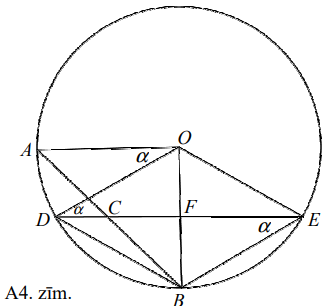

No $OA$ un $DE$ paralelitātes seko, ka $DE \perp OB$ un 
$\sphericalangle ODE=\sphericalangle AOD=\alpha$ (kā iekšējie šķērsleņķi). 
Četrstūris $DOEB$ ir rombs, jo $DE \perp OB,\ OF=FB$ un $DF=FE$ (rādiuss, kas 
perpendikulārs hordai, dala to uz pusēm). No romba īpašībām seko, ka 
$\sphericalangle DEB=\alpha$. Līdz ar to 
$\sphericalangle DOB=2 \sphericalangle DEB=2 \alpha$ kā centra leņķis un 
ievilktais leņķis, kas balstās uz vienu un to pašu loku $DB$.

Ievērojam, ka $\sphericalangle DOB+\sphericalangle AOD=90^{\circ}$ jeb 
$3 \alpha=90^{\circ}$ un $\alpha=\sphericalangle AOD=30^{\circ}$.

# <lo-sample/> LV.NOL.2014.11.3

Kādiem naturāliem skaitļiem $n$ piemīt šāda īpašība: visu skaitļa $n$ naturālo 
dalītāju, izņemot $1$ un $n$, kvadrātu summa ir vienāda ar pašu skaitli $n$?

<small>

* questionType:
* domain:

</small>

## Atrisinājums

Parādīsim, ka uzdevuma nosacījumus apmierina visi naturālie skaitļi, kas ir 
pirmskaitļu kvadrāti, t.i., $n=p^{2},\ p$ - pirmskaitlis.

Pirmkārt, $n=p^{2}$ der, jo $p^{2}$ vienīgais dalītājs, kas nav ne $1$, ne arī 
$p^{2}$, ir pirmskaitlis $p$. Tātad skaitļa $n=p^{2}$ naturālo dalītāju 
(izņemot $1$ un $n$) kvadrātu summa ir $p^{2}=n$.

Otrkārt, pierādām, ka citi naturālie skaitļi neder. Skaitlis $1$ neder, jo tam 
nav citu naturālu dalītāju kā tikai skaitlis $1$. Apskatām saliktu skaitli 
$n=a \cdot b$, kur $a>1$ un $b>1$. Tad skaitļa $n$ dalītāju (kas atšķiras no 
$1$ un $n$) kvadrātu summa ir vismaz $a^{2}+b^{2}$. Taču

$$a^{2}+b^{2} \geq 2ab>ab=n$$

kur pirmā nevienādība izriet no patiesas nevienādības $(a-b)^{2} \geq 0$. Līdz 
ar to saliktiem skaitļiem $n$ apskatāmo dalītāju kvadrātu summa ir lielāka nekā
$n$.

# <lo-sample/> LV.NOL.2014.11.4

Kādā pilsētā ir $n$ detektīvi ($n \geq 2$) un cita starpā tie izseko arī viens 
otru. Zināms, ka jebkuriem diviem detektīviem $A$ un $B$ vai nu $A$ izseko $B$,
vai $B$ izseko $A$. Pierādīt, ka visus detektīvus var nostādīt vienā rindā tā, 
ka pirmais izseko otro, otrais - trešo, $\ldots$, $(n-1)$-ais izseko $n$-to.

<small>

* questionType:
* domain:

</small>

## Atrisinājums

Apgalvojumu pierādīsim ar matemātisko indukciju pēc detektīvu skaita $n$.

*Bāze.* Ja $n=2$, apgalvojums ir patiess, t.i., $A_{1} \rightarrow A_{2}$ 
(detektīvs $A_{1}$ izseko detektīvu $A_{2}$).

*Induktīvais pieņēmums.* Pieņemsim, ka $k$ detektīvi 
$A_{1}, A_{2}, \ldots, A_{k}$ nostādīti rindā atbilstoši uzdevuma nosacījumiem:

$$A_{1} \rightarrow A_{2} \rightarrow \cdots \rightarrow A_{i} \rightarrow A_{i+1} \rightarrow \cdots \rightarrow A_{k}$$

*Induktīvā pāreja.* Aplūkojam detektīvu $A_{k+1}$. Iespējami divi gadījumi:

1. Ja detektīvs $A_{k+1}$ izseko detektīvu $A_{1}$ (apzīmēsim 
   $A_{k+1} \rightarrow A_{1}$ ), tad detektīvu $A_{k+1}$ var novietot rindas 
   sākumā.
2. Ja $A_{1} \rightarrow A_{k+1}$, tad iespējami divi gadījumi:

- visiem $i$ izpildās $A_{i} \rightarrow A_{k+1}$, tad detektīvu $A_{k+1}$ var 
  nostādīt rindas beigās;
- ja visiem $i$ neizpildās, ka $A_{i} \rightarrow A_{k+1}$, tad ņemsim mazāko 
  $i$ tādu, ka $A_{k+1} \rightarrow A_{i}$, tādā gadījumā 
  $A_{i-1} \rightarrow A_{k+1}$. Tad detektīvu $A_{k+1}$ var nostādīt rindā 
  starp detektīviem $A_{i-1}$ un $A_{i}$.

Līdz ar to esam pieradījuši uzdevuma prasīto.

# <lo-sample/> LV.NOL.2014.11.5

Neviens no reāliem skaitļiem $x,\ y$ un $z$ nav nulle un $x+y+z=xyz$. Pierādīt,
ka

$$\frac{1}{x^{2}}+\frac{1}{y^{2}}+\frac{1}{z^{2}} \geq 1$$

<small>

* questionType:
* domain:

</small>

## Atrisinājums

Reizinot doto nevienādību ar $(xyz)^{2}>0$, iegūstam ekvivalentu nevienādību:

$$y^{2}z^{2}+x^{2}z^{2}+x^{2}y^{2} \geq(xyz)^{2}$$

Veiksim ekvivalentus pārveidojumus:

$$\begin{aligned}
& y^{2}z^{2}+x^{2}z^{2}+x^{2}y^{2} \geq xyz(x+y+z) \\
& y^{2}z^{2}+x^{2}z^{2}+x^{2}y^{2} \geq x^{2}yz+xy^{2}z+xyz^{2} \\
& 2y^{2}z^{2}+2x^{2}z^{2}+2x^{2}y^{2} \geq 2x^{2}yz+2xy^{2}z+2xyz^{2} \\
& 2y^{2}z^{2}+2x^{2}z^{2}+2x^{2}y^{2}-2x^{2}yz-2xy^{2}z-2xyz^{2} \geq 0 \\
& \left(x^{2}y^{2}-2x^{2}yz+x^{2}z^{2}\right)+\left(x^{2}y^{2}-2xy^{2}z+y^{2}z^{2}\right)+\left(x^{2}z^{2}-2xyz^{2}+y^{2}z^{2}\right) \geq 0 \\
& (xy-xz)^{2}+(yz-xy)^{2}+(xz-yz)^{2} \geq 0
\end{aligned}$$

Trīs kvadrātu summa ir nenegatīvs skaitlis, līdz ar to pēdējā nevienādība ir 
patiesa. Tā kā tika veikti ekvivalenti pārveidojumi, tad arī dotā nevienādība 
ir patiesa.

# <lo-sample/> LV.NOL.2014.12.1

Zināms, ka $a>\frac{1}{2},\ b>\frac{1}{2},\ c>\frac{1}{2}$ un $x$ ir 
vienādojuma $x^{3}-ax^{2}+bx-c=0$ sakne. Pierādīt, ka $x>-\frac{1}{2}$.

<small>

* questionType:
* domain:

</small>

## Atrisinājums

Pieņemsim, ka $x<0$. Tad $x^{3}<0,\ -ax^{2}<0,\ bx<0,\ -c<0$, tāpēc 
$x^{3}-ax^{2}+bx-c<0$.

Tātad vienādojuma $x^{3}-ax^{2}+bx-c=0$ sakne $x$ nevar būt negatīvs skaitlis 
un $x \geq 0>-\frac{1}{2}$.

# <lo-sample/> LV.NOL.2014.12.2

Uz paralelograma $ABCD$ pretējām malām $AB$ un $CD$ atzīmēti attiecīgi punkti 
$E$ un $F$. Nogriežņu $AF$ un $DE$ krustpunkts ir $H$, bet $BF$ un $CE$ 
krustpunkts ir $G$. Pierādīt, ka $S_{EGFH}=S_{ADH}+S_{BCG}$.

<small>

* questionType:
* domain:

</small>

## Atrisinājums

Izsakām trijstūra $ABF$ (skat. A5.zīm.) laukumu vairākos veidos:

- $S_{ABF}=S_{ADF}+S_{BCF}$;
- $S_{ABF}=\frac{1}{2} AB \cdot h_{AB}=\frac{1}{2} S_{ABCD}$;
- $S_{ABF}=S_{AHE}+S_{BEG}+S_{GEHF}$.

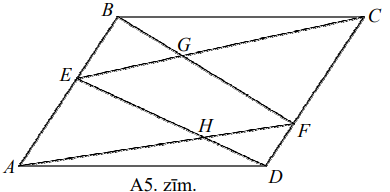

Līdzīgi vairākos veidos izsakām trijstūra $CDE$ laukumu:

- $S_{CDE}=\frac{1}{2} CD \cdot h_{CD}=\frac{1}{2} S_{ABCD}$;
- $S_{CDE}=S_{ADE}+S_{BCE}=S_{ADH}+S_{AHE}+S_{BCG}+S_{BEG}$.

Tā kā $S_{ABF}=S_{CDE}=\frac{1}{2} S_{ABCD}$, tad

$$\begin{aligned}
S_{AHE}+S_{BEG}+S_{GEHF} & =S_{ADH}+S_{AHE}+S_{BCG}+S_{BEG} \\
S_{GEHF} & =S_{ADH}+S_{BCG}
\end{aligned}$$

kas arī bija jāpierāda.

# <lo-sample/> LV.NOL.2014.12.3

Uz tāfeles uzrakstīti visi trīsciparu skaitļi, kas dalās ar $31$:

$$124,\ 155,\ 186,\ 217,\ \ldots,\  961,\ 992$$

Vai no šiem skaitļiem var izvēlēties **(A)** deviņus, **(B)** desmit tā, ka gan
simtu, gan desmitu, gan vienu pozīcijā vismaz pa vienai reizei ir atrodams 
katrs no cipariem $1$ līdz $9$?

<small>

* questionType:
* domain:

</small>

## Atrisinājums

**(A)** Lai pa reizei būtu pārstāvēts katrs no nenulles cipariem, tiem katrā 
pozīcijā jāparādās tieši vienu reizi. Tātad katrā pozīcijā ciparu summa ir $45$
un visu izvēlēto skaitļu summas vērtība ir 
$45 \cdot 111=3^{3} \cdot 5 \cdot 37$. Tā kā visi izvēlētie skaitļi dalās ar 
$31$, tad arī šo skaitļu summa dalās ar $31$. Esam ieguvuši pretrunu, jo 
aprēķinātā summas vērtība nedalās ar $31$. Tātad no dotajiem skaitļiem nevar 
izvēlēties deviņus tā, ka gan simtu, gan desmitu, gan vienu pozīcijā vismaz pa 
vienai reizei ir atrodams katrs no cipariem $1$ līdz $9$

**(B)** Uzdevuma prasīto var izpildīt. Der, piemēram, skaitļi

$$124,\ 248,\ 372,\ 465,\ 496,\ 589,\ 651,\ 713,\ 837,\ 992.$$

# <lo-sample/> LV.NOL.2014.12.4

Alise nēsā rokassprādzes, kas sastāv no virtenē savērtām $10$ melnām un $20$ 
baltām pērlītēm. Marta zaķis prot rokassprādzei samainīt divas pērlītes vietām 
tad, ja starp tām atrodas tieši trīs citas pērlītes. Cik rokassprādzes Alise 
var vienlaicīgi nēsāt, lai Marta zaķis ar atkārtotām darbībām no tām nevarētu 
iegūt divas vienādas? Rokassprādzes tiek uzskatītas par vienādām, ja tās sakrīt
pagriežot pa apli (ap roku).

<small>

* questionType:
* domain:

</small>

## Atrisinājums

Atbilde. $6$ rokassprādzes.

Aplūkosim $15$ pērlītes, kas atrodas pāra pozīcijās un parādīsim, ka Marta 
zaķis tās var sakārtot patvaļīgā secībā. Sanumurēsim tās šādi (skat. A6.zīm.)

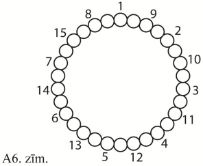

Marta zaķis var mainīt vietām $1$ ar $2$, $2$ ar $3, \ldots, 15$ ar $1$. Tātad 
viņš var no sākuma iemainīt pareizo pērlīti vietā nr. $1$, pēc tam, neaiztiekot
vietu nr. $1$, iemainīt pareizo pērlīti vietā nr. $2$, pēc tam, nemainot $1$ un
$2$ iemainīt pareizajā pērlīti vietā nr. $3$ utt. To pašu var izdarīt arī ar 
pērlītēm, kas atrodas nepāra pozīcijās. Tātad atškirīgas būs $6$ rokassprādzes,
kurām pāra pozīcijās būs dažāds melno pērlīšu skaits: $0,\ 1,\ 2,\ 3,\ 4,\ 5$. 
Sešas vai vairāk melnās pērlītes pāra pozīcijās nozīmē $4$ vai mazāk nepāra 
pozīcijās, un, tā kā rokassprādzi var pagriezt tā, ka pāra pozīcijas pāriet par
nepāra pozīcijām, tad šādas rokassprādzes varēs pārtaisīt par jau kādu no 
esošajām.

# <lo-sample/> LV.NOL.2014.12.5

Vai var atrast tādus $2014$ dažādus naturālus skaiţus 
$a_{1}, a_{2}, \ldots, a_{2014}$, ka

$$\frac{1}{a_{1}}+\frac{1}{a_{2}}+\ldots+\frac{1}{a_{2014}}=1?$$

<small>

* questionType:
* domain:

</small>

## Atrisinājums

Ievērojam, ka $\frac{1}{2}+\frac{1}{3}+\frac{1}{6}=1$.

Tagad uzrādīsim paņēmienu (to var saukt par indukciju), kā no $k$ 
saskaitāmajiem var iegūt $k+1$ saskaitāmo. Izdalām iegūtās vienādības abas 
puses ar $2$ un pieskaitām $\frac{1}{2}$:

$$\frac{1}{4}+\frac{1}{6}+\frac{1}{12}+\frac{1}{2}=\frac{1}{2}+\frac{1}{2}=1$$

Procesu turpinām:

$$\frac{1}{8}+\frac{1}{12}+\frac{1}{24}+\frac{1}{4}+\frac{1}{2}=1$$

Skaidrs, ka šādā veidā tiks iegūti $2014$ saskaitāmie un tie visi būs dažādi.

*Piezīme.* Uzdevumu var atrisināt arī izmantojot matemātisko indukciju un 
vienādību $\frac{1}{m}=\frac{1}{m+1}+\frac{1}{m(m+1)}$.

