# <lo-sample/> LV.NOL.2015.5.1

Mudīte ar automašīnu plkst. 7:10 devās ceļā no Skrundas uz Daugavpili, braucot 
cauri Rīgai. Rīgā viņa iebrauca plkst. 9:10 un no Rīgas uz Daugavpili izbrauca 
plkst. 9:40. Daugavpilī vina nokļuva plkst. 12:40. Aprēķini attālumu no 
Skrundas līdz Rīgai, ja attālums no Rīgas līdz Daugavpilij ir $225$ kilometri! 
Braukšanas ātrums visā ceļa posmā bija viens un tas pats.

<small>

* questionType:FindAll
* domain:Alg

</small>

## Atrisinājums

Shematiski attēlojam uzdevumā doto (skat. A1.att.).

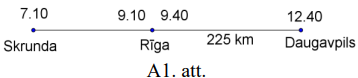

No Rīgas uz Daugavpili Mudīte brauca $3$ stundas. Tātad vienā stundā viņa veica
$225:3=75~\mathrm{km}$. No Skrundas uz Rīgu Mudīte brauca $2$ stundas, tātad 
attālums no Skrundas līdz Rīgai ir $75 \cdot 2=150~\mathrm{km}$.

# <lo-sample/> LV.NOL.2015.5.2

Niknajam jūras laupītājam Smuidrim ir četras kaudzes ar zelta monētām. Viņš māk
vienu kaudzi sadalīt $3$ vai $5$ mazākās kaudzēs. Vai, atkārtoti izpildot šādas
darbības, Smuidris varēs iegūt tieši $2015$ kaudzes, ko piešķirt saviem 
palīgiem?

<small>

* questionType:ProveDisprove
* domain:Comb

</small>

## Atrisinājums

Ievērojam, ka sākumā bija $4$ kaudzes - pāra skaitlis.

Ja vienu kaudzi sadala

- $3$ daļās, tad kopējais kaudžu skaits palielinās par $2$ (par pāra skaitli), 
  tātad tas bija pāra skaitlis un paliek pāra skaitlis, jo, saskaitot divus 
  pāra skaitļus, iegūst pāra skaitli;
- $5$ daļās, tad kopējais kaudžu skaits palielinās par $4$ (par pāra skaitli), 
  tātad tas bija pāra skaitlis un paliek pāra skaitlis, jo, saskaitot divus 
  pāra skaitļus, iegūst pāra skaitli.

Tātad kopējais kaudžu skaits vienmēr būs pāra skaitlis. Tā kā $2015$ ir nepāra 
skaitlis, tad tieši $2015$ kaudzes iegūt nevarēs.

# <lo-sample/> LV.NOL.2015.5.3

Rihards ir izcepis interesantas formas torti, kuras pamatā ir $17$ kvadrātveida
cepumi (skat. 1.att.). Parādi vienu veidu, kā torti sadalīt četros pēc formas 
vienādos gabalos, lai katrs saturētu tieši četrus cepumus, un gabaliņš ar vienu
cepumu paliktu pāri. Tā kā tortes augšpuse ir izdekorēta, tad gabalus drīkst 
grozīt, bet nedrīkst apmest otrādi.

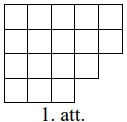

<small>

* questionType:FindExample
* domain:Geom

</small>

## Atrisinājums

Tortes sadalījumu skat., piemēram, A2.att.

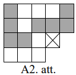

*Piezīme.* Iespējami arī citi sadalījumi.

# <lo-sample/> LV.NOL.2015.5.4

Reizināšanas piemērā ciparus aizstāja ar burtiem - vienādi cipari tika aizstāti
ar vienādiem burtiem, dažādi - ar dažādiem. Tika iegūta šāda izteiksme:

$$EJA \cdot M=2015$$

Nosaki, kāds cipars atbilst katram burtam! Atrodi visas iespējas un pamato, ka 
citu nav!

<small>

* questionType:FindAll
* domain:NT

</small>

## Atrisinājums

Skaitlis $M$ nevar būt pāra skaitlis, jo tad arī reizinājums būtu pāra 
skaitlis.

Skaitlis $M$ nevar būt $1$, jo tad $EJA \cdot 1=EJA \neq 2015$.

Skaitļa $2015$ ciparu summa ir $2+0+1+5=8$, tāpēc tas nedalās ne ar $3$, ne ar 
$9$. Līdz ar to $M \neq 3$ un $M \neq 9$.

Ievērojam, ka skaitlis $2015$ nedalās ar $7$, jo $2015:7=287,\ atl.6$. Tātad 
$M \neq 7$.

Vērtība $M=5$ der, jo $403 \cdot 5=2015$.

Tātad vienīgā iespēja, kā var būt aizstāti cipari, ir $E=4,\ J=0,\ A=3,\ M=5$.

## Atrisinājums

Skaitlis $M$ nevar būt ne $0$, ne $1$, jo tad $EJA \cdot 0=0 \neq 2015$ vai 
$EJA \cdot 1=EJA \neq 2015$. Sadalām skaitli $2015$ pirmreizinātājos: 
$2015=5 \cdot 13 \cdot 31$. Tātad vienīgais viencipara skaitlis, kas ir $2015$ 
reizinātājs, ir $5$ un cipari ir aizvietoti šādi: $E=4,\ J=0,\ A=3,\ M=5$.

# <lo-sample/> LV.NOL.2015.5.5

Raimonds stāv upes krastā un viņam ir divi spaiņi. Viena spaiņa tilpums ir $10$
litri, bet otra spaiņa tilpumu Raimonds ir aizmirsis - tas ir vai nu $7$, vai 
$8$ litri. Kā Raimondam ar ūdens pārliešanu palīdzību noteikt otrā spaiņa 
tilpumu? Nekādu citu palīglīdzekļu Raimondam nav un ieskatoties nepilnā spainī 
nav iespējams precīzi noteikt tajā esošā ūdens daudzumu.

<small>

* questionType:Algorithm
* domain:Comb

</small>

## Atrisinājums

Spaini, kura tilpums ir $10$ litri, sauksim par lielo spaini, otru spaini - par
mazo.

Ievērojam, ka $4 \cdot 7=28$ un $4 \cdot 8=32$. Tas nozīmē:

- ja mazā spaiņa tilpums ir $7$ litri, tad var pieliet $4$ pilnus spaiņus un 
  vēl ūdens paliek pāri (No lielā spaiņa lej ūdeni mazajā, kamēr tas pilns, tad
  mazo spaini iztukšo un atlikušo ūdeni no lielā spaiņa atkal ielej mazajā 
  spainī, piepilda lielo spaini. Darbības atkārto līdz ir izlieti $3$ lielie 
  spaiņi.);
- ja mazā spaiņa tilpums ir $8$ litri, tad var pieliet $3$ pilnus spaiņus un 
  ceturtais spainis nav pilns.

  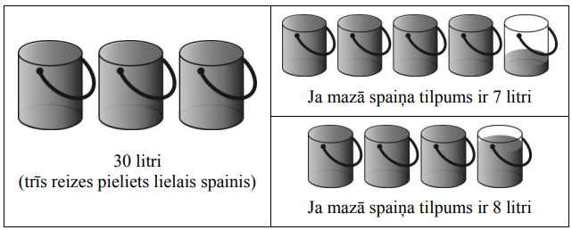
  
*Piezīme.* Ir arī citi atrisinājumi.

# <lo-sample/> LV.NOL.2015.6.1

Veikalā ir divu veidu saldumu pakas. Vienā pakā ir $8$ vienādas lielas 
šokolādes un $6$ vienādas mazas šokolādes, bet otrā pakā ir $12$ tādas pašas 
lielas šokolādes un $6$ tādas pašas mazas šokolādes. Aprēķini, cik maksā viena 
lielā šokolāde un cik maksā viena mazā šokolāde, ja pirmās pakas cena ir $15$ 
eiro un otrās - $21$ eiro! (Pakas cena veidojas, saskaitot tajā ielikto 
šokolāžu cenu.)

<small>

* questionType:FindAll
* domain:Alg

</small>

## Atrisinājums

Ievērojam, ka abās pakās ir vienāds skaits mazo šokolāžu, tad paku saturs 
atšķiras tikai par $12-8=4$ lielajām šokolādēm. Tā kā paku cena atšķiras par 
$21-15=6$ eiro, tad vienas lielās šokolādes cena ir $6:4=1,50$ eiro. Tātad $8$ 
lielās šokolādes maksā $8 \cdot 1,50=12$ eiro un $6$ mazās šokolādes maksā 
$15-12=3$ eiro. Tad vienas mazās šokolādes cena ir $3:6=0,50$ eiro.

# <lo-sample/> LV.NOL.2015.6.2

Bagātajai Austrumu princesei Smuidrai zem gultas ir $6$ lādes. Sākumā lādēs ir 
attiecīgi $1,\ 5,\ 0,\ 0,\ 2,\ 3$ zelta monētas. Katru stundu viņa izvēlas $2$ 
lādes un katrā no tām pieliek klāt $1$ monētu. Vai, atkārtoti izpildot šādas 
darbības, var panākt, ka kādā brīdī visās lādēs būs vienāds skaits monētu?

<small>

* questionType:ProveDisprove
* domain:Comb

</small>

## Atrisinājums

Sākumā lādēs esošo monētu kopējais skaits ir nepāra skaitlis: $1+5+0+0+2+3=11$.

Katrā stundā, pieliekot pa vienai monētai katrā no divām izvēlētajām lādēm, 
visu monētu kopējais skaits palielinās par $2$ (par pāra skaitli). Pie nepāra 
skaitļa pieskaitot pāra skaitli, iegūst nepāra skaitli. Tātad visu monētu 
kopējais skaits pēc katras stundas paliek nepāra skaitlis.

Beigās prasīts iegūt, ka visās lādēs ir vienāds monētu skaits, bet sešu vienādu
skaitļu summa ir pāra skaitlis.

Tātad nevar panākt, ka visās lādēs ir vienāds monētu skaits.

# <lo-sample/> LV.NOL.2015.6.3

Tabulā, kuras izmēri ir $3 \times 3$ rūtiņas, katrā rūtiņā ierakstūts tieši 
viens naturāls skaitlis no $1$ līdz $9$ (visi ierakstītie skaitļi ir dažādi). 
Katrām divām rūtiņām ar kopīgu malu aprēķina tajos ierakstīto skaitļu summu. 
Vai iespējams, ka neviena no šīm summām nav pirmskaitlis?

<small>

* questionType:ProveDisprove
* domain:NT

</small>

## Atrisinājums

Jā, skaitļus var ierakstīt tā, ka neviena no summām nav pirmskaitlis (skat., 
piemēram, A3.att.).

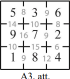

*Piezīme.* Iespējami arī citi skaitļu izvietojumi.

# <lo-sample/> LV.NOL.2015.6.4

Rūtiņu lapā uzzīmēta figūra (skat. 2.att.). Kāds ir lielākais skaits 3.att. 
doto figūru, ko var izgriezt no 2.att. figūras? Griezuma līnijām jāiet pa 
rūtiņu malām.

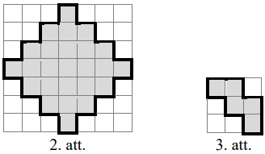

<small>

* questionType:FindOptimal
* domain:Geom

</small>

## Atrisinājums

No dotās figūras var izgriezt četras 3.att. figūras (skat. A4.att.).

Pierādīsim, ka vairāk figūru izgriezt nevar. Izkrāsojam 2.att. doto figūru kā 
šaha galdiņu (skat. A5.att.), tā satur $9$ melnas rūtiņas. Ir divi dažādi 
varianti, cik melnās rūtiņas var saturēt 3.att. figūra (skat. A6.att. un 
A7.att.). Abos gadījumos tā satur vismaz $2$ melnas rūtiņas. Tātad var izgriezt
ne vairāk kā $4$ figūras, jo piecas 3.att. figūras kopā satur vismaz 
$5 \cdot 2=10$ melnās rūtiņas.

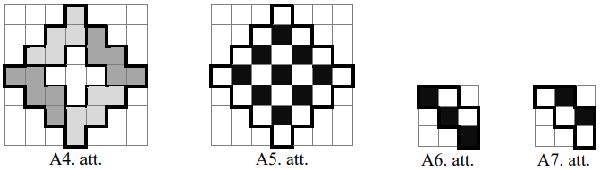

## Atrisinājums

No dotās figūras var izgriezt četras 3.att. figūras (skat. A4.att.).

Pierādīsim, ka vairāk figūru izgriezt nevar. Tā kā dotā figūra sastāv no $25$ 
rūtiņām un 3.att. figūra satur $5$ rūtiņas, tad nevarētu izgriezt vairāk kā 
$25:5=5$ figūras.

Ar " $o$ " atzīmēto rūtiņu var saturēt figūra, kāda redzama A8.att. (simetrisko
gadījumu neapskatām, jo tas ir analoģisks tālāk aprakstītajam). Pēc tam 
figūras, kas satur ar " $x$ " apzīmētās rūtiņas, var izgriezt vienā vienīgā 
veidā (kā parādīts A4.att.). No atlikušās daļas nevar izgriezt 3.att. doto 
figūru.

Tātad lielākais skaits 3.att. figūru, ko var izgriezt no dotās figūras, ir $4$.

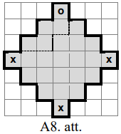

# <lo-sample/> LV.NOL.2015.6.5

Sivēntiņš $229$ ābolus salika $60$ grozos. Dažos grozos viņš ielika $x$ ābolus,
bet pārējos - katrā pa $3$ āboliem. Nosaki visas iespējamās naturālās $x$ 
vērtības!

<small>

* questionType:FindAll
* domain:NT

</small>

## Atrisinājums

Ja katrā grozā būtu tieši $3$ āboli, tad kopā grozos būtu salikti tikai 
$3 \cdot 60=180$ āboli. Tātad atlikušie $229-180=49$ āboli ir jāsadala pa 
dažiem groziem. Tā kā $49=7 \cdot 7=49 \cdot 1$ un ir $60$ grozi, tad iespējami
trīs gadījumi:

- $1$ grozā jāpieliek $49$ āboli - tātad $x=3+49=52$;
- $7$ grozos vēl jāieliek katrā pa $7$ āboliem - tātad $x=3+7=10$;
- $49$ grozos vēl jāieliek katrā pa $1$ ābolam - tātad $x=3+1=4$.

Līdz ar to vienīgās iespējamās naturālās $x$ vērtības ir $4,\ 10$ vai $52$.

# <lo-sample/> LV.NOL.2015.7.1

Atrisini vienādojumu $\frac{8a-5}{5}-\frac{2a-7}{2}=-3$.

<small>

* questionType:FindAll
* domain:Alg

</small>

## Atrisinājums

Veicam ekvivalentus pārveidojumus:

$$\begin{aligned}
& \left.\frac{8a-5}{5}-\frac{2a-7}{2}=-3 \quad \right\rvert\, \cdot 10 \\
& 2 \cdot(8a-5)-5 \cdot(2a-7)=-30 \\
& 16a-10-10a+35=-30 \\
& 6a=-55 \\
& a=-\frac{55}{6}
\end{aligned}$$

Atbilde: $a=-\frac{55}{6}$.

# <lo-sample/> LV.NOL.2015.7.2

Sensenos laikos saimnieciskajam Gotfrīdam bija $99$ aitas un $21$ kamielis, 
citu mājlopu Gotfrīdam nebija. Bagdādē par $4$ kamieļiem pretī varēja saņemt 
$8$ aitas, bet Damaskā par $5$ aitām pretī varēja saņemt $3$ kamieļus. Vai, 
atkārtoti mainot dzīvniekus tikai šajās divās pilsētās, Gotfrīds varēja iegūt 
tieši $2015$ mājlopus?

<small>

* topic:InvariantRemainder
* topic:InvariantParity
* questionType:ProveDisprove
* domain:NT

</small>

## Ieteikums 

Par cik mainās dzīvnieku kopskaits katras maiņas iznākumā? 
Vai ejot šādiem soļiem var no $99+21$ sasniegt $2015$?

## Atrisinājums

Ievērojam, ka sākumā kopējais mājlopu skaits ir 99+21=120 - pāra skaitlis.

Aplūkosim, kā izmainās kopējais mājlopu skaits, atkarībā no tā, kurā pilsētā 
notiek maiņa:

1) ja par $4$ kamieļiem pretī saņem $8$ aitas, tad kopējais mājlopu skaits 
palielinās par $4$ (par pāra skaitli), tātad tas bija pāra skaitlis un paliek 
pāra skaitlis, jo, saskaitot divus pāra skaitļus, iegūst pāra skaitli;
2) ja par $5$ aitām pretī saņem $3$ kamieļus, tad kopējais mājlopu skaits 
samazinās par $2$ (par pāra skaitli), tātad tas bija pāra skaitlis un paliek 
pāra skaitlis, jo, saskaitot divus pāra skaitļus, iegūst pāra skaitli.

Tātad kopējais mājlopu skaits vienmēr būs pāra skaitlis. Tā kā $2015$ ir nepāra
skaitlis, tad tieši $2015$ mājlopus iegūt nevarēs.

# <lo-sample/> LV.NOL.2015.7.3

Tabulā, kuras izmēri ir $3 \times 3$ rūtiņas, katrā rūtiņā ierakstīts viens 
naturāls skaitlis, kas nepārsniedz $10$, visi ierakstītie skaitļi ir dažādi. 
Katrām divām rūtiņām ar kopīgu malu aprēķina tajos ierakstīto skaitļu summu. 
Vai iespējams, ka visas iegūtās summas ir pirmskaitļi?

<small>
  
* topic:GraphColoredVertices
* topic:ModularParity
* topic:PrimesDistribution
* topic:ExhaustionMethod
* questionType:ProveDisprove
* domain:NT

</small>

## Atrisinājums

Jā, skaitļus var ierakstīt tā, ka visas summas ir pirmskaitļi (skat., piemēram,
A9.att.).

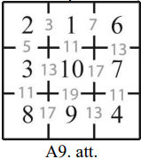

*Piezīme.* Iespējami arī citi skaitļu izvietojumi.

## Atrisinājums

Pāru/nepāru skaitļi izvietojami kā melnās/baltās rūtiņas 
šaha galdiņam. Kvadrāta vidū liek $1$, un pārlasa dažādos $2,4,6,10$ 
izvietojumu variantus (skaitli $8$ neizmanto).

# <lo-sample/> LV.NOL.2015.7.4

Taisnstūris $ABCD$ sagriezts kvadrātos, katra iegūtā kvadrāta perimetrs ir 
naturāls skaitlis. Vai taisnstūra $ABCD$ perimetrs noteikti ir naturāls 
skaitlis?

<small>

* questionType:ProveDisprove
* domain:Geom

</small>

## Atrisinājums

Ne , taisnstūra perimetrs var nebūt naturāls skaitlis. Piemēram, ja taisnstūris
ar izmēriem $\frac{1}{2} \times \frac{1}{4}$ sadalīts divos kvadrātos, kuru 
malu garumi ir $\frac{1}{4}$ (skat. A10.att.). Tādā gadījumā kvadrātu perimetri
ir $4 \cdot \frac{1}{4}=1$ (naturāls skaitlis), bet taisnstūra perimetrs ir 
$2 \cdot\left(\frac{1}{4}+\frac{2}{4}\right)=2 \cdot \frac{3}{4}=\frac{3}{2}$ 
(nav naturāls skaitlis).

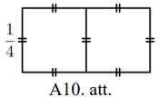

# <lo-sample/> LV.NOL.2015.7.5

Uz galda rindā novietotas sešas monētas, zināms, ka starp tām ir vismaz viena 
īsta un vismaz viena viltota monēta, kas ir vieglāka nekā īstā. Visas īstās 
monētas sver vienādi, un arī visas viltotās monētas sver vienādi, bet ir 
vieglākas par īstajām. No katras īstās monētas pa labi (ne noteikti blakus) 
atrodas kāda viltota monēta, bet no katras viltotās pa kreisi (ne noteikti 
blakus) atrodas kāda īsta monēta. Kā ar divām svēršanām ar sviru svariem bez 
atsvariem var noteikt katra veida monētu skaitu?

<small>

* questionType:Algorithm
* domain:Comb

</small>

## Atrisinājums

Tā kā no katras īstās monētas pa labi atrodas kāda viltota monēta, tad pirmā 
monēta no labās puses nevar būt īsta, tātad tā ir viltota. Līdzīgi secinām, ka 
pirmā monēta no kreisās puses ir īsta.

Pirmajā svēršanā uz viena svaru kausa liekam īsto un viltoto monētu, bet uz 
otra - divas no atlikušajām monētām. Iespējami trīs svaru stāvokļi:

- ja svari ir līdzsvarā, tad uz otra kausa arī ir viena īsta un viena viltota 
  monēta;
- ja svaru kauss, uz kura ir īstā un viltotā monēta, ir smagāks, tad otrā kausā
  ieliktās abas monētas ir viltotas;
- ja svaru kauss, uz kura ir īstā un viltotā monēta, ir vieglāks, tad otrā 
  kausā ieliktās abas monētas ir īstas.

Otrajā svēršanā uz viena svaru kausa liekam īsto un viltoto monētu, bet uz 
otra - vēl nesvērtās divas monētas. Līdzīgi kā pirmajā svēršanā, nosaka, kādas 
monētas ir uz otrā kausa. Līdz ar to ar divām svēršanām ir noskaidrots, kādas 
monētas ir novietotas uz galda.

# <lo-sample/> LV.NOL.2015.8.1

Pierādi, $ka$
**(A)** $49^{5}+7^{9}$ dalās ar $2$;
**(B)** $49^{5}-7^{9}$ dalās ar $6$.

<small>

* topic:CongruenceClasses
* questionType:Prove,Prove
* domain:NT

</small>

## Atrisinājums

**(A)** Izmantojot pakāpju īpašības, iegūstam

$$49^{5}+7^{9}=\left(7^{2}\right)^{5}+7^{9}=7^{10}+7^{9}=7^{9}(7+1)=7^{9} \cdot 8$$

Doto izteiksmi esam sadalījuši reizinātājos, no kuriem viens dalās ar $2$, 
tāpēc arī reizinājums dalās ar $2$. Tātad esam pierādījuši, ka skaitlis 
$49^{5}+7^{9}$ dalās ar $2$.

**(B)** Izmantojot pakāpju īpašības, iegūstam

$$49^{5}-7^{9}=\left(7^{2}\right)^{5}-7^{9}=7^{10}-7^{9}=7^{9}(7-1)=7^{9} \cdot 6$$

Doto izteiksmi esam sadalījuši reizinātājos, no kuriem viens dalās ar $6$, 
tāpēc arī reizinājums dalās ar $6$. Tātad esam pierādījuši, ka skaitlis 
$49^{5}-7^{9}$ dalās ar $6$.

*Piezīme.* (A) daļu var pierādīt, pamatojot, ka skaitlis $49^{5}+7^{9}$ ir pāra
skaitlis (nepāra skaitli kāpinot jebkurā naturālā pakāpē, iegūst nepāra 
skaitli; divu nepāra skaitļu summa ir pāra skaitlis), tātad tas dalās ar $2$.

## Atrisinājums

Divu nepāru skaitļu summas/starpības ir pāru skaitļi. 
Pie tam $49^n$ un $7^n$ dod atlikumu $1$, dalot ar $3$. 

# <lo-sample/> LV.NOL.2015.8.2

Autoservisā "Šrotiņš" ir $39$ mašīnas. Naskais Maigonis katra mēneša $20.$ 
datumā vai nu pārdod $7$ restaurētas mašīnas un to vietā nopērk $16$ vecas 
mašīnas, vai arī $19$ mašīnas nodod metāllūžņos un to vietā nopērk $4$ vecas 
mašīnas. Nekādas citas darbības, kas maina mašīnu skaitu, netiek veiktas. Vai 
iespējams, ka "Šrotiņā" kāda mēneša $21.$ datumā būs tieši $2015$ mašīnas?

<small>

* topic:InvariantRemainder
* questionType:ProveDisprove
* domain:NT

</small>

## Atrisinājums

Ievērojam, ka sākumā mašīnu skaits ir $39$, kas dalās ar $3$.

Aplūkosim, kā izmainās kopējais mašīnu skaits, atkarībā no tā, kuru darbību 
Maigonis veic:

1. ja pārdod $7$ restaurētas mašīnas un to vietā nopērk $16$ vecas mašīnas, tad
   kopējais mašīnu skaits palielinās par $9$ (par skaitli, kas dalās ar $3$);
2. ja $19$ mašĩnas nodod metāllūžņos un to vietā nopērk $4$ vecas mašĩnas, tad 
   kopējais mašīnu skaits samazinās par $15$ (par skaitli, kas dalās ar $3$).

Ja pie skaitļa, kas dalās ar $3$, pieskaita vai no tā atņem skaitli, kas dalās 
ar $3$, vienmēr iegūst skaitli, kas dalās ar $3$, jo 
$3k \pm 3m=3 \cdot(k \pm m)$.

Tātad kopējais mašīnu skaits pēc katras darbības dalās ar $3$.

Skaitļa $2015$ ciparu summa ir $2+0+1+5=8$, kas nedalās ar $3$, tātad arī pats 
skaitlis $2015$ nedalās ar $3$. Tātad nav iespējams, ka „Šrotiņā" kāda mēneša 
$21.$ datumā būs tieši $2015$ mašīnas.

## Atrisinājums

Salīdzina atlikumus pēc $3$ moduļa.
Mašīnu skaits vienmēr mainās par $-7+16=9$ vai par $-19+4 = -15$, 
tātad par $3k$. Bet $39+3k \neq 2015$.

# <lo-sample/> LV.NOL.2015.8.3

Kurš no skaitļiem $(a+b)(c+d)$, $(b+c)(d+a)$, $(a+c)(b+d)$ ir vislielākais un kurš 
vismazākais, ja zināms, ka $a>b>c>d>0$? Pamato atbildi!

<small>

* questionType:FindAll
* domain:Alg

</small>

## Atrisinājums

Vislielākais ir skaitlis $(b+c)(d+a)$ un vismazākais ir skaitlis $(a+b)(c+d)$.

Pierādīsim, ka

1. $(b+c)(d+a)>(a+c)(b+d)$;
2. $(a+c)(b+d)>(a+b)(c+d)$.

Veicam ekvivalentus pārveidojumus:

1. $(b+c)(d+a)>(a+c)(b+d)$;  
   $bd+ba+cd+ca>ab+ad+cb+cd$;  
   $bd+ca>ad+cb$;  
   $bd+ca-ad-bc>0$;    
   $d(b-a)-c(b-a)>0$;  
   $(b-a)(d-c)>0$.  
   Iegūtā nevienādība ir patiesa, jo $b-a<0,\ d-c<0$ un divu negatīvu skaitļu
   reizinājums ir pozitīvs skaitlis.

2. $(a+c)(b+d)>(a+b)(c+d)$;  
   $ab+ad+bc+cd>ac+ad+bc+bd$;    
   $ab+cd>ac+bd$;    
   $ab+cd-ac-bd>0$;    
   $a(b-c)-d(b-c)>0$;   
   $(b-c)(a-d)>0$.
   Iegūtā nevienādība ir patiesa, jo $b-c>0,\ a-d>0$ un divu pozitīvu skaitļu
   reizinājums ir pozitīvs skaitlis.

Tātad esam ieguvuši, ka $(b+c)(d+a)>(a+c)(b+d)>(a+b)(c+d)$ no kā seko 
prasītais.

# <lo-sample/> LV.NOL.2015.8.4

Uz vienādmalu trijstūra $ABC$ malām $AB$ un $BC$ attiecīgi atlikti punkti $M$ 
un $N$ tā, ka $MB+BN=AC$. Pierādi, ka 
$\sphericalangle MAN+\sphericalangle MCN=60^{\circ}$.

<small>

* questionType:Prove
* domain:Geom

</small>

## Atrisinājums

Trijstūris $ABC$ ir regulārs, tāpēc $AC=AB$. No nogriežņu garuma īpašībām 
iegūstam, ka $AB=AM+MB$. Tā kā $AC=MB+BN$, tad $AM+MB=MB+BN$ jeb $AM=BN$ (skat.
A11. att.). Tāpēc $\triangle ABN=\triangle CAM$ (pēc pazīmes " $m \ell m$ "), 
jo $AM=BN$, $\sphericalangle ABN=\sphericalangle CAM=60^{\circ}$ un $AB=AC$. 
Tad $\sphericalangle BAN=\sphericalangle ACM$ kā atbilstošie leņķi vienādos 
trijstūros. Līdz ar to 
$\sphericalangle MAN+\sphericalangle MCN=\sphericalangle ACM+\sphericalangle MCN=\sphericalangle ACB=60^{\circ}$

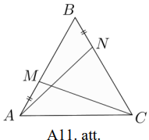

*Piezīme.* Uzdevumu var risināt arī pamatojot, ka $MB=NC$ un 
$\triangle MBC=\triangle NCA$.

# <lo-sample/> LV.NOL.2015.8.5

Kvadrāts $ABCD$ sagriezts kvadrātos, katra iegūtā kvadrāta perimetrs ir 
naturāls skaitlis. Vai kvadrāta $ABCD$ perimetrs noteikti ir naturāls skaitlis?

<small>

* questionType:ProveDisprove
* domain:Geom

</small>

## Atrisinājums

Apskatām dotā kvadrāta $ABCD$ vienu malu $AB$ un visus kvadrātus, kam viena 
mala atrodas uz $AB$ (skat. A12.att.). Apzīmējam $AB$ garumu ar $a$, bet mazo 
kvadrātu malu garumus ar $a_{1},\ a_{2},\ \ldots,\ a_{n}$. No dotā izriet, ka 
katras malas garuma $a_{i}$ reizinājums ar $4$ ir naturāls skaitlis, t. i., 
$4a_{i}$ ir naturāls skaitlis. Tā kā $P_{ABCD}=4a$ un 
$a=a_{1}+a_{2}+\ldots+a_{n}$, tad

$$P_{ABCD}=4 \cdot\left(a_{1}+a_{2}+\ldots+a_{n}\right)=4a_{1}+4a_{2}+\ldots+4a_{n}$$

Vairāku naturālu skaitļu summa ir naturāls skaitlis, tāpēc kvadrāta $ABCD$ 
perimetrs noteikti ir naturāls skaitlis.

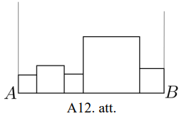

# <lo-sample/> LV.NOL.2015.9.1

Atrisināt vienādojumu $\frac{5}{x^{2}-9}-\frac{1}{3-x}=\frac{1}{2}$.

<small>

* questionType:FindAll
* domain:Alg

</small>

## Atrisinājums

Definīcijas kopa: 
$\left\{\begin{array}{l}x^{2}-9 \neq 0 \\ 3-x \neq 0\end{array} \Rightarrow x \neq 3\right.$
un $x \neq-3$

$$x \in(-\infty; -3) \cup(-3; 3) \cup(3; +\infty)$$

Veicam ekvivalentus pārveidojumus:

$$\begin{aligned}
& \frac{5}{(x-3)(x+3)}+\frac{1}{x-3}=\frac{1}{2} \\
& \frac{10}{2(x-3)(x+3)}+\frac{2x+6}{2(x-3)(x+3)}=\frac{x^{2}-9}{2(x-3)(x+3)}; \quad \mid \cdot 2(x-3)(x+3) \neq 0 \\
& 10+2x+6=x^{2}-9
\end{aligned}$$

$$x^{2}-2x-25=0$$

Izmantojot kvadrātvienādojuma sakņu aprēķināšanas formulas, iegūstam

$$\begin{gathered}
D=4-4 \cdot(1) \cdot(-25)=4+100=104=4 \cdot 26 \\
x_{1,2}=\frac{2 \pm \sqrt{4 \cdot 26}}{2}=\frac{2 \pm 2 \sqrt{26}}{2}=1 \pm \sqrt{26}
\end{gathered}$$

Abas $x$ vērtības pieder vienādojuma definīcijas kopai.

Atbilde: $x=1+\sqrt{26}$ vai $x=1-\sqrt{26}$.

# <lo-sample/> LV.NOL.2015.9.2

Regulāra astoņstūra virsotnēs pēc kārtas uzrakstīti skaitļi 
$7,\ 15,\ 3,\ 17,\ 1,\ 9,\ 5,\ 11$. Ar skaitļiem atļauts veikt šādas darbības:

- pieskaitīt kādam skaitlim divus skaitļus, kas atrodas blakus virsotnēs;
- atņemt no skaitļa divkāršotu pretējā virsotnē uzrakstīto skaitli, ja starpība
  ir pozitīva.

Vai, atkārtoti izpildot šīs darbības, var panākt, ka vienā no virsotnēm būs 
ierakstīts skaitlis $2014$?

<small>

* questionType:ProveDisprove
* domain:Comb

</small>

## Atrisinājums

Visi skaitļi, kas uzrakstīti regulārā astoņstūra virsotnēs, sākumā ir nepāra 
skaitļi.

Ievērojam, ka

1. nepāra skaitlim pieskaitot divus nepāra skaitļus, iegūst nepāra skaitli;
2. no nepāra skaitļa atņemot divkāršotu nepāra skaitli, iegūst nepāra skaitli.

Tātad gan pēc pirmās, gan pēc otrās darbības astoņstūra virsotnē atkal būs 
ierakstīts nepāra skaitlis. Līdz ar to visi skaitļi, kas atrodas astoņstūra 
virsotnēs, vienmēr paliek nepāra. Bet skaitlis $2014$ ir pāra skaitlis, tātad 
skaitli $2014$ iegūt nevarēs.

# <lo-sample/> LV.NOL.2015.9.3

Vai jebkuru taisnstūri var sagriezt **(A)** $2014$, **(B)** $2015$ savstarpēji 
līdzīgos trijstūros?

<small>

* questionType:ProveDisprove,ProveDisprove
* domain:Geom

</small>

## Atrisinājums

Jebkuru taisnstūri var sagriezt divos vienādos taisnleņķa trijstūros (skat. A1.
zīm.).

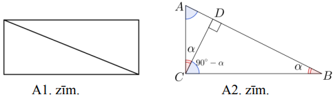

Pierādīsim, ka patvaļīgu taisnleņķa trijstūri var sagriezt divos trijstūros, 
kas katrs ir līdzīgs sākotnējam trijstūrim.

Ja taisnais leņķis ir $\sphericalangle ACB$ (skat. A2.zīm.), tad no tā velk 
perpendikulu $CD$ pret hipotenūzu $AB$. Trijstūri $ABC,\ ACD$ un $CBD$ ir 
līdzīgi (pēc pazīmes, " $\ell \ell$ "), jo

- $\sphericalangle ACB=\sphericalangle ADC=\sphericalangle CDB=90^{\circ}$;
- $\sphericalangle CBA=\sphericalangle DCA=\sphericalangle DBC=\alpha$.

Tas nozīmē, ka, novelkot perpendikulu no taisnā leņķa virsotnes, sākotnējais 
trijstūris tiek sadalīts divos tam līdzīgos trijstūros.

Turpinot tādā pat veidā dalīt iegūtos taisnleņķa trijstūrus, prasīto taisnstūra
sadalījumu var atrast jebkurai naturālai $N(N \geq 2)$ vērtībai.

Tātad šādu sadalījumu var atrast arī, ja $N=2014$ vai $N=2015$.

*Piezīme.* Doto taisnstūri var sadalīt $2014$ vienādos trijstūros (tie ir 
līdzīgi ar līdzības koeficientu $1$). Vispirms doto taisnstūri sadala $1007$ 
vienādos taisnstūros un pēc tam katru no iegūtajiem taisnstūriem sadala divos 
vienādos taisnleņķa trijstūros (skat. A3.zīm., kur dotā taisnstūra malu garumi
ir $a$ un $b$).

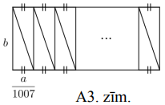

# <lo-sample/> LV.NOL.2015.9.4

Uz tāfeles uzrakstīti naturāli skaitļi no $1$ līdz $13$. Dārta grib nodzēst 
vienu no tiem, bet pārējos ierakstīt $3 \times 4$ rūtiņu tabulā (katru skaitli 
vienā rūtiņā) tā, lai visās rindās un kolonnās skaitļu vidējais aritmētiskais 
būtu vienāds.

**(A)** Pierādīt, ka ir tieši viens skaitlis, kuru nodzēšot, viņa to varēs 
izdarīt!  
**(B)** Atrast vienu skaitļu izvietojuma piemēru!

<small>

* questionType:Prove,FindExample
* domain:Alg

</small>

## Atrisinājums

Pieņemsim, ka tabulā ir trīs rindas un četras kolonnas. Ar $A$ apzīmējam rindā 
ierakstīto četru skaitļu vidējo aritmētisko. Tad rindā ierakstīto skaitļu summa
ir $4A$ un trīs rindās (jeb visā tabulā) ierakstīto skaitļu summa ir $12A$. 
Pirmo trīspadsmit naturālu skaitļu summa ir

$$\frac{(1+13) \cdot 13}{2}=91$$

Ar $x$ apzīmējam skaitli, kuru Dārta nodzēsīs. To nosakām no vienādojuma
 
$$\begin{equation*}
12A=91-x \tag{*}
\end{equation*}$$

Pierādīsim, ka $A$ ir naturāls skaitlis. Ja $A=n+p$, kur $n \in N,\ 0 < p < 1$, tad 
no nosacījuma, ka katrā rindā ierakstīto skaitļu summa ir $4A$, izriet, ka 
$4p \in N$. Savukārt no nosacījuma, ka katrā kolonnā ierakstīto skaitļu summa 
ir $3A$, izriet, ka $3p \in N$. Tātad $4p-3p=p \in N$, kas ir pretrunā ar to, 
ka $0 < p < 1$.

Esam pierādījuši, ka vienādības $(\ast)$ abu pušu izteiksmju vērtība ir naturāls 
skaitlis. Tā kā $(\ast)$ kreisās puses izteiksme dalās ar $12$, tad arī labās puses 
izteiksmei jādalās ar $12$.

Ievērojam, ka skaitlis $91$, dalot ar $12$, dod atlikumu $7$, tāpēc $91-x$ 
dalīsies ar $12$, ja $x$ būs formā $12k+7$, kur $k$ ir nenegatīvs vesels 
skaitlis, no kā seko, ka $x=7$, jo dotie skaitļi nepārsniedz $13$. Tātad tabulā
nebūs ierakstīts skaitlis $7$. Vidējā aritmētiskā vērtība $A=84:12=7$.

Lai iegūtu $12$ skaitļu: $1,\ 2,\ 3,\ 4,\ 5,\ 6,\ 8,\ 9,\ 10,\ 11,\ 12,\ 13$ 
vajadzīgo izvietojumu, vispirms divās rindās ierakstām tādus skaitļus, kuru 
summa ir $4A=28$. Trešajā rindā ierakstām atlikušos četrus skaitļus. Tad mainām
skaitļu secību pa rindām, lai katras kolonnas skaitļu summa būtu $21$.

Skaitļu izvietojumu skat., piemēram, A4.zīm.

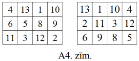

# <lo-sample/> LV.NOL.2015.9.5

Apskata visas funkcijas $y=ax^{2}+x+b$, kur koeficientus $a$ un $b$ saista 
sakarība $a+2b=2015$.

Pierādīt, ka visu šādu funkciju grafikiem ir divi kopīgi punkti!

<small>

* questionType:Prove
* domain:Alg

</small>

## Atrisinājums

Aplūkosim funkcijas vērtību, ja $x= \pm \frac{1}{\sqrt{2}}$ :

$$y=a \cdot\left( \pm \frac{1}{\sqrt{2}}\right)^{2} \pm \frac{1}{\sqrt{2}}+b=\left(\frac{1}{2} a+b\right) \pm \frac{1}{\sqrt{2}}=\frac{2015}{2} \pm \frac{1}{\sqrt{2}}$$

Tātad punkti $\left(\frac{1}{\sqrt{2}}; \frac{2015}{2}+\frac{1}{\sqrt{2}}\right)$
un $\left(-\frac{1}{\sqrt{2}}; \frac{2015}{2}-\frac{1}{\sqrt{2}}\right)$ ir 
kopīgi visu aplūkoto funkciju grafikiem.

*Piezīmes.*

1. Ievērot to, ka šie punkti pieder visām parabolām, var, pamanot, ka 
   izteiksmes $\frac{1}{2} a+b$ vērtība ir $\frac{2015}{2}$ neatkarīgi no $a$ 
   un $b$ vērtībām. Tad, ņemot $x^{2}=\frac{1}{2}$, funkcijas vērtība nebūs 
   atkarīga no konkrētajām $a$ un $b$ vērtībām.
2. Kopīgos punktus 
   $\left(\frac{1}{\sqrt{2}}; \frac{2015}{2}+\frac{1}{\sqrt{2}}\right)$ un 
   $\left(-\frac{1}{\sqrt{2}}; \frac{2015}{2}-\frac{1}{\sqrt{2}}\right)$ var 
   iegūt arī no dotajām parabolām paņemot divas patvaļīgas (piemēram, 
   $a=0,\ b=\frac{2015}{2}$ un $a=1,\ b=1007$) un atrodot to krustpunktus 
   (atrisinot kvadrātvienādojumu).

# <lo-sample/> LV.NOL.2015.10.1

Uz parabolas $y=ax^{2}+bx+c$ atrodas punkts $M(1;15)$, tās virsotne ir punktā 
$N(-3;-1)$. Noteikt koeficientus $a$, $b$ un $c$!

<small>

* questionType:FindAll
* domain:Alg

</small>

## Atrisinājums

Ja punkts $M(1; 15)$ atrodas uz parabolas, tad iegūstam vienādību:
$15=a \cdot 1^{2}+b \cdot 1+c$ jeb $15=a+b+c$. 

Ja punkts $N(-3 ;-1)$ atrodas uz parabolas, tad iegūstam
$-1=a \cdot(-3)^{2}+b \cdot(-3)+c$ jeb $-1=9a-3b+c$. 

Parabolas virsotnes $x$ koordinātu aprēķina pēc formulas $x_{0}=\frac{-b}{2a}$.
Tātad iegūstam, ka $-3=\frac{-b}{2a}$ jeb $b=6a$.

Lai noteiktu koeficientus $a$, $b$, $c$, sastādām vienādojumu sistēmu:

$$\left\{\begin{array}{l}
a+b+c=15  \tag{1}\\
9a-3b+c=-1 \\
b=6a
\end{array}\right.$$

No $(1)$ atņemto $(2)$, iegūst $4b-8a=16$ jeb $b-2a=4$.
Izmantojot $(3)$, pakāpeniski iegūstam koeficientu vērtības:

$$6a-2a=4 \quad \Rightarrow \quad a=1 \quad \Rightarrow \quad b=6 \quad \Rightarrow \quad c=8$$

Atbilde. Koeficientu vērtības ir $a=1$, $b=6$, $c=8$.

*Piezīme:*

1. Trešo sistēmas vienādojumu var iegūt, ja izvēlas punktam $(1; 15)$ 
   simetrisko punktu $(-7; 15)$ attiecībā pret parabolas simetrijas asi $x=-3$:

   $$15=a \cdot(-7)^{2}+b \cdot(-7)+c\;\;\text{jeb}\;\;15=49a-7b+c$$

2. Risinājumā var izmantot, ka parabolas ar virsotni punktā 
   $\left(x_{0}; y_{0}\right)$ vienādojums ir $y=a\left(x-x_{0}\right)^{2}+y_{0}$.
   Tad, vienādojumā $y=a(x+3)^{2}-1$ ievietojot punkta $M$ koordinātas 
   ($x=1,\ y=15$), var atrast $a$ vērtību $a=1$. Tātad meklētā parabola ir 
   $y=1 \cdot(x+3)^{2}-1=x^{2}+6x+8$.

# <lo-sample/> LV.NOL.2015.10.2

Ar naturālu skaitli atļauts veikt šādas darbības:

- pieskaitīt $6$;
- dalīt ar $4$, ja skaitlis dalās ar $4$;
- mainīt vietām skaitļa ciparus (skaitļa sākumā nedrīkst atrasties nulle).

Vai, atkārtoti izpildot šīs darbības, no skaitļa $30$ var iegūt skaitli $2015$?

<small>

* topic:DivisibilityRulesFor3And9
* topic:Invariant
* questionType:ProveDisprove
* domain:NT

</small>

## Atrisinājums

Nē, nevar. Kā invariantu aplūkojam dalāmību ar $3$ - skaitlim 
$30$ izpildās īpašība "dalās ar $3$", bet skaitlim $2015$ šī īpašība 
neizpildās.

No otras puses, ja kāds skaitlis dalās ar $3$, 
tad skaitlis, kas no tā tiek iegūts 
ar uzdevumā dotajām darbībām, arī dalās ar $3$. 

Pārbaudām pēdējo apgalvojumu:

- skaitlis $n$ dalās ar $3$, tad arī $n+6$ dalās ar $3$;
- pāra skaitlis $4n$ dalās ar $3$, tad arī skaitlis $n$ dalās ar $3$ (jo $n$ 
  joprojām satur reizinātāju $3$);
- ja skaitlis $n$ dalās ar $3$, tad arī tā ciparu summa dalās ar $3$, bet 
  ciparu summa nemainās, ja tos pārkārto. 
  
Tātad, ja dotais skaitlis dalās ar $3$, tad pēc atļauto darbību izpildes arī 
jauniegūtais skaitlis dalīsies ar $3$.

Skaitlis $2015$ ar $3$ nedalās, tātad ar atļautajām darbībām to iegūt nevar.

# <lo-sample/> LV.NOL.2015.10.3

Vairāku pēc kārtas sekojošu naturālu skaitļu summa ir $177$. Kādas vērtības var
pieņemt mazākais no šiem saskaitāmajiem?

<small>

* topic:SeriesMembersSumsClosedFormulas
* topic:CanonicalFactorization
* topic:ExhaustionMethod
* questionType:FindAll
* domain:Alg

</small>

## Atrisinājums

Izmantojam aritmētiskās progresijas locekļu summas formulu:

$$S_{n}=\frac{a_{1}+a_{n}}{2} \cdot n$$

ko, lietojot sakarību $a_{n}=a_{1}+(n-1) d$, var pārrakstīt formā:

$$S_{n}=\frac{2a_{1}+(n-1)d}{2} \cdot n$$

Mazāko no skaitļiem apzīmējam ar $a$. Ievērojam ka diference $d=1$, tāpēc 
iegūstam

$S_{n}=\frac{2a+n-1}{2} \cdot n$ jeb $2S_{n}=(2a-1+n) \cdot n$

Tā kā pēc uzdevumā dotā $S_{n}=177$, tad iegūstam vienādojumu:

$$\begin{aligned}
& (2a-1+n) \cdot n=2 \cdot 177 \\
& (2a-1+n) \cdot n=2 \cdot 3 \cdot 59
\end{aligned}$$

Mazākais no diviem reizinātājiem vienādības kreisajā pusē ir $n$, jo $a$ un $n$
ir naturāli skaitļi.

Vērtība $n=1$ neder, jo tad ir tikai viens saskaitāmais, tāpēc $n$ var pieņemt 
tikai trīs vērtības: $2,\ 3$ un $6$. Aprēķinām, kādas vērtības var pieņemt $a$:

- $n=2 \Rightarrow 2a+1=3 \cdot 59 \Rightarrow 2a=176 \Rightarrow a=88$;
- $n=3 \Rightarrow 2a+2=2 \cdot 59 \Rightarrow 2a=116 \Rightarrow a=58$;
- $n=6 \Rightarrow 2a+5=59 \Rightarrow 2a=54 \Rightarrow a=27$.

Tātad mazākais no saskaitāmajiem var būt $88,\ 58$ vai $27$.

## Atrisinājums

Aritmētiskas progresijas locekļu summa

$$S=a_1 + a_2 + \ldots + a_n = \frac{a_1 + a_n}{2}\cdot{}n$$

> Aritmētiskās progresijas summu iegūst, reizinot "vidējo elementu": 
> $a_v = \frac{a_1+a_n}{2}$ ar progresijas locekļu skaitu: $S = a_v\cdot{}n$.  
> Ja $n$ ir nepāru skaitlis, tad vidējais elements $a_v$ tiešām progresijā ir.  
> Ja $n$ ir nepāru skaitlis, tad "vidējais elements" ir abu vidējo locekļu 
> aritmētiskais vidējais. 

Abos gadījumos $2\cdot{}177 = (a_1+a_n)\cdot{}n$ jeb
$$2 \cdot 3 \cdot 59 = (a_1+a_n)\cdot{}n$$

Skaitlim $2 \cdot 3 \cdot 59$ ir tikai galīgs skaits dalītāju $n$. 
Gadījumu pārlase:

* Ja $n=2$, tad $177 = 88\frac{1}{2}\cdot{}2 = 88+89$,
* Ja $n=3$, tad $177 = 59\cdot{}3 = 58+59+60$,
* Ja $n=6$, tad $177 = 29\frac{1}{2}\cdot{}6=27+28+29+30+31+32$. 

Vēl lielāki $2 \cdot 3 \cdot 59$ dalītāji ($n=59$ u.c.) novestu pie ļoti garām aritmētiskām 
progresijām, kurās būtu arī negatīvi locekļi.
Tās neder, jo $177$ bija vairāku pēc kārtas sekojošu **naturālu** skaitļu summa.

# <lo-sample/> LV.NOL.2015.10.4

Vai eksistē tāds vesels skaitlis $x$, ka visi skaitļi

**(A)** $x,\ x+23,\ x+45,\ x+121$;  
**(B)** $x,\ x+23,\ x+46,\ x+121$

ir veselu skaitļu pakāpes ar naturālu kāpinātāju, kas lielāks nekā $1$ 
(kāpinātāji var būt dažādi)?

<small>

* topic:CountingObjects
* topic:PrimeFactorizationAndPowers
* topic:ModularParity
* strategy:contradiction
* questionType:ProveDisprove,ProveDisprove
* domain:NT

</small>

## Atrisinājums

**(A)** Jā, piemēram, var ņemt $x=4$, tad

$$x=4=2^{2}; \quad x+23=27=3^{3}; \quad x+45=49=7^{2} ; \quad x+121=125=5^{3}.$$

**(B)** Ievērosim: ja $y$ ir pāra skaitlis un vienlaikus vesela skaitļa pakāpe 
ar kāpinātāju, kas ir lielāks nekā $1$, tad $y$ dalās ar $4$ (t. i., $y=a^{n}$ 
kādam veselam skaitlim $a$ un naturālam $n \geq 2$; ja $y$ ir pāra skaitlis, 
tad $a$ arī ir pāra skaitlis, līdz ar to $a^{n}$ dalās ar $2^{n}$ dalās ar $4$,
jo $n \geq 2$).

Pieņemsim pretējo, ka eksistē tāds $x$, ka visi skaitļi 
$x,\ x+23,\ x+46,\ x+121$ ir veselu skaitļu pakāpes ar kāpinātāju, kas lielāks 
nekā $1$.

Tieši viens no skaitļiem $x,\ x+23$ ir pāra skaitlis; aplūkosim abus iespējamos
gadījumus.

- Ja $x$ ir pāra skaitlis, tad tas dalās ar $4$, pēc iepriekš pamatotā. Taču 
  tad $x+46=(x+44)+2$ nedalās ar $4$, tātad nevar būt vesela skaitļa pakāpe ar 
  kāpinātāju, kas lielāks nekā $1$ - pretruna.
- Ja $x+23$ ir pāra skaitlis, tad tas dalās ar $4$, saskaņā ar iepriekš 
  pamatoto. Taču tad $x+121=((x+23)+96)+2=((x+23)+4 \cdot 24)+2$ nedalās ar 
  $4$, tātad nevar būt vesela skaitļa pakāpe ar kāpinātāju, kas lielāks nekā 
  $1$ - pretruna.

Tātad neeksistē tāds vesels skaitlis $x$, ka visi skaitļi 
$x,\ x+23,\ x+46,\ x+121$ ir veselu skaitļu pakāpes ar naturālu kāpinātāju, kas
lielāks nekā $1$.

## Atrisinājums

**(A)** Ievietojam nelielas vērtības. 
Ievērojam, ka $x$ arī ir vesela skaitļa pakāpe. 
Ievietojam $x=1,4,8,9,16,25,32,36,49,\ldots$. 
Der jau $x=4$ (pirmajā piemērā)

**(B)**
Noskaidrojam, vai $x$ un $x+46$ var *vienlaikus* būt naturālu skaitļu pakāpes?

* Ja $x$ ir pāru, tad **gan** $x$, **gan** $x+46$ dalās ar $4$ (tā ir pretruna, 
  jo $46$ nedalās ar $4$). 
* Ja $x$ ir nepāru, tad **gan** $x+23$, **gan** $x+121$ dalās ar $4$ (tā ir pretruna, 
  jo starpība $121-23 = 98$ nedalās ar $4$). 

# <lo-sample/> LV.NOL.2015.10.5

Uz kvadrāta $ABCD$ malas $AB$ kā pamata uz kvadrāta ārpusi konstruēts 
trijstūris $AEB$. Taisne, kas vilkta no $E$ caur kvadrāta diagonāļu krustpunktu
$O$, krusto kvadrāta malu $AB$ punktā $F$ un malu $DC$ - punktā $G$. Zināms, ka
$\sphericalangle OEB=\sphericalangle OCG$. Pierādīt, ka trijstūris $AEB$ ir 
taisnleņķa!

<small>

* questionType:Prove
* domain:Geom

</small>

## Atrisinājums

Kvadrāta pretējās malas $AB$ un $CD$ ir paralēlas, tāpēc 
$\sphericalangle BAC=\sphericalangle ACD$ kā iekšējie šķērsleņķi (skat. A5. 
zīm.).

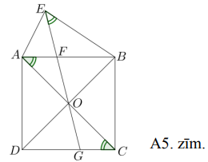

Punkti $A,\ E,\ B,\ O$ atrodas uz vienas riņķa līnijas $\omega$, jo 
$\sphericalangle BAO=\sphericalangle OEB$. Tā kā kvadrāta diagonāles ir 
perpendikulāras, tad $\sphericalangle AOB=90^{\circ}$; no kā seko, ka $AB$ ir 
riņķa līnijas $\omega$ diametrs. Tātad $\sphericalangle AEB=90^{\circ}$ kā 
ievilktais leņķis, kas balstās uz diametra. Līdz ar to ir pierādīts, ka 
trijstūris $AEB$ ir taisnleņķa.

*Piezīme.* Risinājumā var izmantot arī to, ka 
$\sphericalangle AOB+\sphericalangle AEB=180^{\circ}$, jo četrstūris $AEBO$ ir 
ievilkts riņķa līnijā.

# <lo-sample/> LV.NOL.2015.11.1

Atrisināt nevienādūbu $|x-2|-6+\frac{5}{|x-2|}>0$.

<small>

* questionType:FindAll
* domain:Alg

</small>

## Atrisinājums

Dotās nevienādības definīcijas kopa ir visi reālie skaitļi, izņemot skaitli 
$2$, t. i., $x \in(-\infty; 2) \cup(2;+\infty)$.

Tā kā $|x-2|>0$ visām $x$ vērtībām no definīcijas kopas, tad dotās nevienādības
abas puses reizinot ar pozitīvu skaitli $|x-2|$, iegūstam ekvivalentu 
nevienādību:

$$|x-2|^{2}-6 \cdot|x-2|+5>0$$

Apzīmējot $|x-2|=t$, iegūstam kvadrātnevienādību: $t^{2}-6t+5>0$.

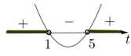

Iegūstam, ka $t<1$ vai $t>5$.

Vēl jāiegūst atbilstošās $x$ vērtības:

1) No nevienādības $|x-2| < 1$ iegūstam, ka  
   $-1 < x-2 < 1$ jeb $1 < x < 3$

2) No nevienādības $|x-2|>5$ iegūstam, ka  
   $x-2<-5$ vai arī $x-2>5$

Līdz ar to iegūstam, ka $x<-3$ vai arī $x>7$.

Ievērojot definīcijas kopu, iegūstam, ka dotās nevienādības atrisinājums ir 
$x \in(-\infty;-3) \cup(1; 2) \cup(2; 3) \cup(7;+\infty)$.

*Piezīme.* Nevienādību var risināt arī ar intervālu metodi.

# <lo-sample/> LV.NOL.2015.11.2

Vienā gājienā no 1.zīm. attēlotās figūras var izvēlēties jebkuru 2.zīm. redzamo
figūru (figūru var arī pagriezt) un tajā ierakstītajiem skaitļiem vai nu 
pieskaitī $1$, vai arī atņemt $1$.

Vai, atkārtoti izpildot šādus gājienus, var panākt, ka visās šūnās ir 
ierakstīts skaitlis $2015$?

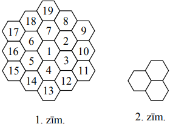

<small>

* questionType:ProveDisprove
* domain:Comb

</small>

## Atrisinājums

Šūnās ierakstītie skaitļi $1,\ 2,\ \ldots,\ 19$ veido aritmētisko progresiju ar
diferenci $1$. Izmantojot aritmētiskās progresijas locekļu summas formulu, 
aprēķinām sākumā šūnās ierakstīto skaitļu summu:

$$\frac{(1+19) \cdot 19}{2}=190$$

Ja katrā šūnā ir ierakstīts skaitlis $2015$, tad visu šo skaitļu summa ir 
$2015 \cdot 19=38285$.

Ievērosim, ka pēc katra gājiena visu šūnās ierakstīto skaitļu summa vai nu 
palielinās par $3$, vai arī samazinās par $3$. Tas nozīmē, ka visu šūnās 
ierakstīto skaitļu summas atlikums, dalot ar $3$, visu laiku paliek nemainīgs. 
Sākumā doto skaitļu summa $190$, dalot ar $3$, dod atlikumu $1$, bet beigās 
nepieciešamā summa $38285$, dalot ar $3$, dod atlikumu $2$ (skaitļa $38285$ 
ciparu summa ir $26$ un, dalot ar $3$, tā dod tādu pašu atlikumu, kā skaitli 
dalot ar $3$). Tā kā atlikumi ir dažādi, tad uzdevumā prasītais nav izpildāms, 
t. i., nevar panākt, lai katrā šūnā būtu ierakstīts skaitlis $2015$.

# <lo-sample/> LV.NOL.2015.11.3

Kāds ir mazākais naturālais skaitlis $n$, kuru iespējams izteikt kā trīs 
dažādu naturālu skaitļu $a$, $b$ un $c$ summu tā, ka visi skaitļi 
$a+b$, $a+c$, $b+c$ ir naturālu skaitļu kvadrāti?

<small>

* questionType:FindOptimal
* domain:NT

</small>

## Atrisinājums

Mazākā iespējamā $n$ vērtība ir $55=6+19+30$.

Pierādīsm, ka mazāku $n$ vērtību iegūt nevar.

Apzīmējam $a+b=p^{2},\ a+c=q^{2},\ b+c=r^{2}$. Nezaudējot vispārīgumu, varam 
pieņemt, ka $0 < a < b < c$, tad $p^{2} < q^{2} < r^{2}$.

Izmantojot šīs sakarības un pieņemot, ka zināmas $p^{2},\ q^{2},\ r^{2}$ 
vērtības, varam izteikt $a,\ b,\ c$ un $n$ vērtības:

$$a=\frac{p^{2}+q^{2}-r^{2}}{2},\ b=\frac{p^{2}-q^{2}+r^{2}}{2},\ c=\frac{-p^{2}+q^{2}+r^{2}}{2},\ n=\frac{p^{2}+q^{2}+r^{2}}{2}<\frac{3r^{2}}{2}$$

Tā kā $n$ jābūt naturālam skaitlim, tad $p^{2}+q^{2}+r^{2}$ ir jābūt pāra 
skaitlim, tātad starp $p,\ q,\ r$ ir vai nu tieši divi nepāra skaitļi, vai arī 
neviens nepāra skaitlis.

Tā kā $a$ jābūt naturālam skaitlim, tad $p^{2}+q^{2} > r^{2}$. Tā kā $r^{2} < n$, 
tad jāaplūko tikai tādas skaitļu kvadrātu vērtības, kas mazākas nekā $55$:

$$1,\ 4,\ 9,\ 16,\ 25,\ 36,\ 49$$

Mazākā $r^{2}$ vērtība, kurai var atrast tādas $p^{2},\ q^{2}$ vērtības, kas 
apmierina nevienādību $p^{2}+q^{2}>r^{2}$, ir $r^{2}=36$ un 
$p^{2}=16,\ q^{2}=25$. Šo skaitļu summa ir nepāra skaitlis, tāpēc neapmierina 
uzdevuma prasības.

Nākamā $r^{2}$ vērtība, kurai var atrast tādas $p^{2},\ q^{2}$ vērtības, kas 
apmierina nevienādību $p^{2}+q^{2}>r^{2}$, ir $r^{2}=49$.

Iespējami divi gadījumi:

- $r^{2}=49,\ p^{2}=16,\ q^{2}=36$ - šo skaitļu summa ir nepāra skaitlis, tāpēc
  neapmierina uzdevuma prasības;
- $r^{2}=49,\ p^{2}=25,\ q^{2}=36$ - šīs vērtības apmierina uzdevuma 
  nosacījumus un no vienādojumu sistēmas 
  $\left\{\begin{array}{l}a+b=25 \\ a+c=36 \\ b+c=49\end{array}\right.$ 
  iegūstam, ka $a=6,\ b=19,\ c=30$.

Tātad mazākā iespējamā $n$ vērtība ir $6+19+30=55$.

# <lo-sample/> LV.NOL.2015.11.4

Uz trijstūra $XAC$ malas $XC$ atlikts iekšējs punkts $B$ tā, ka $AB=AC$. Leņķu 
$ACB$ un $ABX$ bisektrises krustojas punktā $D$. Pierādīt, ka $AD=AB$!

<small>

* questionType:Prove
* domain:Geom

</small>

## Atrisinājums

Apzīmējam $\sphericalangle ACD=\sphericalangle DCB=\alpha$ (pēc bisektrises 
definīcijas). Tad $\sphericalangle BCA=\sphericalangle ABC=2 \alpha$ kā leņķi 
pie pamata vienādsānu trijstūrī un $\sphericalangle ABX=180^{\circ}-2 \alpha$ 
(pēc blakusleņķu īpašības). Nogrieznis $BD$ ir leņķa $ABX$ bisektrise, tāpēc 
$\sphericalangle ABD=\sphericalangle DBX=90^{\circ}-\alpha$ (skat. A6.zīm.).

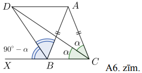

Tā kā trijstūra iekšējo leņķu summa ir $180^{\circ}$, tad no $\triangle ABC$ un
$\triangle DBC$ iegūstam

$$\begin{gathered}
\sphericalangle BAC=180^{\circ}-\sphericalangle ABC-\sphericalangle ACB=180^{\circ}-4 \alpha \\
\sphericalangle BDC=180^{\circ}-\sphericalangle DCB-\sphericalangle ABC-\sphericalangle ADB=180^{\circ}-\alpha-2 \alpha-\left(90^{\circ}-\alpha\right)=90^{\circ}-2 \alpha
\end{gathered}$$

Ievērojam, ka 
$\sphericalangle BDC=90^{\circ}-2 \alpha=\frac{1}{2} \sphericalangle BAC$.

Aplūkojam riņķa līniju $\omega$ ar centru punktā $A$ un rādiusu $AB$. Tad 
$\sphericalangle BAC$ ir centra leņķis, kas balstās uz hordas $BC$. Tā kā 
leņķa $BDC$ lielums ir tieši divas reizes mazāks nekā centra leņķim, tad tas ir
ievilkts leņķis. Tātad punkts $D$ atrodas uz riņķa līnijas $\omega$. Līdz ar to
$AD=AB$ kā riņķa līnijas $\omega$ rādiusi, kas arī bija jāpierāda.

# <lo-sample/> LV.NOL.2015.11.5

Dots taisnstūris ar izmēriem $n \times m$ rūtiņas. Sākumā katrā rūtiņā ir 
ierakstīts $5$. Māris dotajā taisnstūrī veic secīgas darbības:

1. izvēlas kādu taisnstūri un visās tā rūtiņās ieraksta ciparu $1$;
2. izvēlas kādu taisnstūri un visās tā rūtiņās ieraksta ciparu $2$;
3. izvēlas kādu taisnstūri un visās tā rūtiņās ieraksta ciparu $3$;
4. visbeidzot izvēlas kādu taisnstūri un visās tā rūtiņās ieraksta ciparu $4$.

Katra izvēlētā taisnstūra malām jāiet pa rūtiņu līnijām un cipars vienmēr 
jāraksta rūtiņā jau esošā skaitļa labajā pusē.

Vai iespējams, ka visās rūtiņās ierakstītie skaitļi ir dažādi, ja dotā 
taisnstūra izmēri ir **(A)** $3 \times 6$, **(B)** $3 \times 5$, **(C)** 
$4 \times 4$ rūtiņas?

<small>

* questionType:ProveDisprove,ProveDisprove,ProveDisprove
* domain:Comb
* method:PigeonholePrincipleBasic

</small>

## Atrisinājums

Rūtiņās var būt ierakstīti $16$ atšķirīgi skaitļi:

$$\begin{gathered}
5 \\
51;\ 52;\ 53;\ 54; \\
512;\ 513;\ 514;\ 523;\ 524;\ 534; \\
5123;\ 5124;\ 5134;\ 5234; \\
51234.
\end{gathered}$$

**(A)** Tā kā taisnstūrī $3 \times 6$ ir $18$ rūtiņas, tad pēc Dirihlē principa
vismaz divās rūtiņās ierakstītie skaitļi būs vienādi. Tātad nav iespējams, ka 
visās laukuma rūtiņās ierakstītie skaitļi atšķiras.

**(B)** Tā kā taisnstūrī $3 \times 5$ ir $15$ rūtiņas, tad tieši viens skaitlis
nebūs ierakstīts. Ievērojam, ka katrs no cipariem $1,\ 2,\ 3$ un $4$ parādās 
astoņos skaitļos. Tātad katrs no cipariem $1,\ 2,\ 3,\ 4$ būs ierakstīts $7$ 
vai $8$ rūtiņās. Tā kā katrs cipars ir ierakstīts taisnstūrveida laukumā, tad 
vienīgais iespējamais taisnstūra izmērs ir $2 \times 4$ rūtiņas (pretējā 
gadījumā pēc Dirihlē principa vismaz divās rūtiņās ierakstītie skaitļi būs 
vienādi). Vēl varam ievērot, ka jebkuru divu ciparu pāris ir sastopams tieši 
četros skaitļos. Līdz ar to katriem diviem taisnstūriem drīkst būt kopīgas ne 
vairāk kā četras rūtiņas. Taisnstūrī ar izmēriem $3 \times 5$ rūtiņas 
taisnstūri $2 \times 4$ rūtiņas var novietot četros dažādos veidos (skat. 
A7.zīm.).

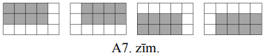

Taisnstūriem, kas atrodas pie augšējās malas, pārklājas sešas rūtiņas - tātad 
vairākās no tām ierakstīto skaitļu komplekti būs vienādi un panākt, ka visās 
rūtiņās ierakstītie skaitļi ir atšķirirīgi, nav iespējams.

**(C)** Jā, ir iespējams, ka visās laukuma rūtiņās ierakstītie skaitļi atšķiras
(skat., piemēram, A8.zīm.).

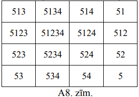

Taisnstūrus var izvēlēties, piemēram, kā parādīts A9.zīm.

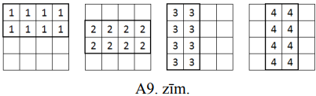

# <lo-sample/> LV.NOL.2015.12.1

Atrisināt vienādojumu 
$(x-2) \log _{\sqrt{6}}\left(x^{2}-5x\right)=2x-\log _{\sqrt{6}} 36$.

<small>

* questionType:FindAll
* domain:Alg

</small>

## Atrisinājums

Definīcijas kopa: $x^{2}-5x>0$.

No kā seko, ka $x \in(-\infty; 0) \cup(5;+\infty)$.

Ievērojam, ka $\log _{\sqrt{6}} 36=\log _{\sqrt{6}}(\sqrt{6})^{4}=4$, tad doto 
vienādojumu var pārveidot formā:

$$\begin{align*}
& (x-2) \log _{\sqrt{6}}\left(x^{2}-5x\right)=2x-4 \\
& (x-2) \log _{\sqrt{6}}\left(x^{2}-5x\right)=2(x-2) \tag{*}
\end{align*}$$

Ievērojam, ka $x-2$ ir abu saskaitāmo kopīgais reizinātājs:

$$\begin{gathered}
(x-2) \log _{\sqrt{6}}\left(x^{2}-5x\right)-2(x-2)=0 \\
(x-2)\left(\log _{\sqrt{6}}\left(x^{2}-5x\right)-2\right)=0
\end{gathered}$$

Reizinājums ir vienāds ar $0$, ja kāds no reizinātājiem ir vienāds ar $0$. 
Iegūstam divus gadījumus:

1) $x-2=0$ jeb $x=2$ - šī vētība neder, jo nepieder definīcijas kopai;
2) $\log _{\sqrt{6}}\left(x^{2}-5x\right)-2=0$ jeb 
   $\log _{\sqrt{6}}\left(x^{2}-5x\right)=2$. Izmantojot logaritma definīciju, 
   iegūstam

$x^{2}-5x=(\sqrt{6})^{2}$ jeb $x^{2}-5x-6=0$

Tad pēc Vjeta teorēmas $x_{1}=6$ un $x_{2}=-1$. Abas iegūtās $x$ vērtības 
pieder vienādojuma definīcijas kopai. Atbilde: $x=6$ vai $x=-1$.

*Piezīme.* Vienādojuma (*) abas puses var izdalīt ar $x-2 \neq 0$ (jo $x$ 
vērtība $2$ nepieder definīcijas kopai) un iegūt vienādojumu: 
$\log _{\sqrt{6}}\left(x^{2}-5x\right)=2$.

# <lo-sample/> LV.NOL.2015.12.2

Ar naturālu skaitli atļauts izdarīt šādas darbības:

- pieskaitīt skaitlim tā ciparu summu;
- atņemt no skaitļa tā ciparu summu.

Vai, atkārtoti izpildot šīs darbības, no skaitļa $139$ var iegūt skaitli 
**(A)** $63$; **(B)** $193$?

<small>

* questionType:ProveDisprove,ProveDisprove
* domain:NT

</small>

## Atrisinājums

**(A)** Skaitli $63$ var iegūt šādi:

$$139 \xrightarrow{-13} 126 \xrightarrow{-9} 117 \xrightarrow{-9} 108 \xrightarrow{-9} 99 \xrightarrow{-18} 81 \xrightarrow{-9} 72 \xrightarrow{-9} 63.$$

**(B)** Atlikums, ko iegūst, dalot naturālu skaitli ar $9$, ir vienāds ar 
atlikumu, ko iegūst, dalot ar $9$ šī skaitļa ciparu summu. Tāpēc naturāla 
skaitļa un tā ciparu summas starpība noteikti dalīsies ar $9$. Kaut vienu reizi
izpildot atņemšanu, visi turpmāk iegūstamie skaitļi dalīsies ar $9$.

Tā kā $193$ nedalās ar $9$, tad skaitli $193$ varētu iegūt tikai tad, ja 
skaitlim visu laiku pieskaitīs tā ciparu summu. Tātad skaitļi pārveidosies 
šādi:

$$139 \xrightarrow{+13} 152 \xrightarrow{+8} 160 \xrightarrow{+7} 167 \xrightarrow{+14} 181 \xrightarrow{+10} 191 \xrightarrow{+11} 202 \longrightarrow \ldots$$

Visi tālāk iegūstamie skaitļi ir lielāki nekā $193$, tātad skaitli $193$ 
nevarēs iegūt.

# <lo-sample/> LV.NOL.2015.12.3

Cik daudz ir piecciparu skaitļu, kas sastāv tieši no trīs dažādiem cipariem, no
kuriem neviens nav $0$ un neviens neatkārtojas vairāk kā divas reizes?

<small>

* questionType:FindCount
* domain:Comb

</small>

## Atrisinājums

Ar $a$ apzīmējam ciparu, kas skaitlī ir vienu reizi, bet ar $b$ un $c$ - 
ciparus, kas skaitlī ir divas reizes.

Cipars $a$ var būt $5$ dažādās vietās, ciparu $b$ var novietot 
$C_{4}^{2}=\frac{4 \cdot 3}{2}=6$ veidos (atlikušajās $4$ vietās ir jānovieto 
divi cipari $b$), ciparu $c$ atlikušajās vietās var novietot $1$ veidā. Tātad 
ir $5 \cdot 6 \cdot 1=30$ (reizināšanas likums) dažādas kombinācijas, kā 
cipari $a,\ b,\ c$ var veidot meklēto piecciparu skaitli. Ciparu $a$ no 
cipariem $1,\ 2,\ \ldots,\ 9$ var izvēlēties $9$ veidos, bet $b$ un 
$c-\frac{8 \cdot 7}{2}=28$ veidos. Tātad pavisam ir $30 \cdot 9 \cdot 28=7560$ 
piecciparu skaitļi, kas atbilst uzdevuma nosacījumiem.

# <lo-sample/> LV.NOL.2015.12.4

Izliekta četrstūra $ABCD$ malu $AB,\ BC,\ CD$ un $DA$ viduspunkti ir attiecīgi 
$E,\ F,\ G$ un $H$. Nogrieznis $AF$ krustojas ar $DE$ un $BG$ attiecīgi punktos
$K$ un $L$, bet $CH$ krustojas ar $DE$ un $BG$ attiecīgi punktos $N$ un $M$. 
Pierādīt, ka $S_{BFL}+S_{CMG}+S_{DNH}+S_{AKE}=S_{KLMN}$ !

<small>

* questionType:Prove
* domain:Geom

</small>

## Atrisinājums

Novelkam nogriezni $AC$ un aplūkojam trijstūrus $ABF,\ AFC,\ ACH$ un $CDH$ 
(skat. A10.zīm.). Izmantojot trijstūra laukuma formulu 
$S_{\Delta}=\frac{1}{2} a \cdot h_{a}$, iegūstam

- $S_{ABF}=\frac{1}{2} BF \cdot h_{BC}=\frac{1}{2} FC \cdot h_{BC}=S_{AFC}$;
- $S_{ACH}=\frac{1}{2} AH \cdot h_{AD}=\frac{1}{2} HD \cdot h_{AD}=S_{CDH}$.

Ievērojam, ka 
$S_{ABCD}=S_{ABF}+S_{AFC}+S_{ACH}+S_{CDH}=2 \cdot\left(S_{AFC}+S_{ACH}\right)=2S_{AFCH}$.

Tātad $S_{AFCH}=\frac{1}{2} S_{ABCD}$.

Analoģiski, novelkot $BD$, pierāda, ka $S_{BGDE}=\frac{1}{2} S_{ABCD}$.

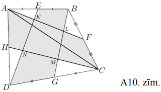

Iekrāsotās daļas laukumu (skat. A10.zīm.) apzīmējam ar $S$. Esam ieguvuši, ka

$$\begin{gathered}
S_{ABCD}=S_{AFCH}+S_{BGDE} \\
S_{BFL}+S_{CMG}+S_{DNH}+S_{AKE}+S=S+S_{KLMN} \\
S_{BFL}+S_{CMG}+S_{DNH}+S_{AKE}=S_{KLMN}
\end{gathered}$$

kas arī bija jāpierāda.

# <lo-sample/> LV.NOL.2015.12.5

Vai eksistē tādi naturāli skaitļi $a,\ b$ un $c$, ka skaitļa $a^{2}+b^{2}+c^{2}$

**(A)** pēdējie divi cipari ir $15$;  
**(B)** pēdējie četri cipari ir $2015$?

<small>

* questionType:ProveDisprove,ProveDisprove
* domain:NT

</small>

## Atrisinājums

**(A)** Jā, eksistē, piemēram, $a=9,\ b=5,\ c=3$. Tad 
$a^{2}+b^{2}+c^{2}=81+25+9=115$.

**(B)** Pierādīsim, ka šādi skaitļi neeksistē. Apskatām vienādojumu

$$\begin{equation*}
a^{2}+b^{2}+c^{2}=\overline{\ldots 2015} \tag{*}
\end{equation*}$$

Skaitlis dalās ar $8$, ja tā pēdējo trīs ciparu veidotais skaitlis dalās ar 
$8$.

Skaitli $\overline{\ldots 2015}$ dalot ar $8$, iegūst atlikumu 
$7(\overline{\ldots 2015}=\underset{\vdots 8}{\overline{\ldots 2000}}+15=\underset{\vdots 8}{\overline{\ldots 2000}}+\underset{\vdots 8}{8}+7)$.

Jebkuru naturālu skaitli var pierakstīt formā $8m+k$, kur 
$k=0,\ 1,\ \ldots,\ 7$.

Apskatām skaitļa kvadrātu 
$(8m+k)^{2}=64m^{2}+16mk+k^{2}=8 \cdot\left(8m^{2}+2mk\right)+k^{2}$. Skaitli 
$(8m+k)^{2}$ dalot ar $8$, iegūsim tādu pašu atlikumu, kā $k^{2}$, dalot ar 
$8$.

| $k$ | $0$ | $1$ | $2$ | $3$ | $4$ | $5$ | $6$ | $7$ |
| ---- | ---- | ---- | ---- | ---- | ---- | ---- | ---- | ---- |
| $k^{2}$ | $0$ | $1$ | $4$ | $9$ | $16$ | $25$ | $36$ | $49$ |
| Atlikums, dalot ar $8$ | $0$ | $1$ | $4$ | $1$ | $0$ | $1$ | $4$ | $1$ |

Tātad skaitļa kvadrātu, dalot ar $8$, atlikumā var iegūt $0,\ 1,\ 4$.

Skaitli $7$ (vienādojuma $\left({ }^{*}\right)$ labās puses atlikums) nevar 
iegūt, izmantojot tikai minētos atlikumus.

Tātad vienādojumam (*) nav atrisinājuma jeb neeksistē tādi naturāli skaitļi 
$a$, $b$ un $c$, ka skaitļa $a^{2}+b^{2}+c^{2}$ pēdējie četri cipari ir $2015$.

*Piezīme.* Uzdevumu var risināt, izmantojot kongruenci pēc moduļa $8$.

