# <lo-sample/> LV.NOL.2016.5.1

Daļas ir uzrakstītas augošā secībā. Kāds naturāls skaitlis var būt ierakstīts 
$\square$ vietā?

$$\frac{5}{16}; \frac{\square}{5}; \frac{3}{4}$$

<small>

* questionType:
* domain:

</small>

## Atrisinājums

Paplašinot visas daļas, lai to saucēji būtu $80$, iegūstam 
$\frac{25}{80}; \frac{16 \cdot \square}{80}; \frac{60}{80}$. Vidējās daļas 
skaitītājam $16 \cdot \square$ jābūt lielākam nekā $25$ un mazākam nekā $60$, 
turklāt tam jādalās ar $16$. Vienīgie skaitļi, kas atbilst, ir $32=16 \cdot 2$ 
un $48=16 \cdot 3$, tāpēc kvadrātiņā var būt ierakstīts skaitlis $2$ vai $3$.

# <lo-sample/> LV.NOL.2016.5.2

Rindā viens aiz otra bez tukšumiem ir uzrakstīti pēc kārtas sekojoši naturāli 
skaitļi no $1$ līdz $N$, tādējādi veidojot vienu lielu skaitli (Piemēram, ja 
$N=12$, tad ir uzrakstīts skaitlis $123456789101112$.).

Kāds ir mazākais iegūtais skaitlis, kas dalās ar **(A)** $8$; **(B)** $18$?

<small>

* questionType:
* domain:

</small>

## Atrisinājums

**(A)** Skaitlis dalās ar $8$, ja tā pēdējo trīs ciparu veidotais skaitlis 
dalās ar $8$. Pārbaudot trīs ciparu veidotos skaitļus iegūstam, ka mazākais 
skaitlis, kas dalās ar $8$, ir $123456$.

**(B)** Lai skaitlis dalītos ar $18$, tam vienlaicīgi jādalās ar $2$ un $9$. 
Pirmais skaitlis, kas dalās ar $9$ (pārbaudām pēc ciparu summas), ir 
$12345678$. Tā kā šis ir arī pāra skaitlis, tad tas dalās ar $2$ un līdz ar to 
tas dalās arī ar $18$, jo skaitļi $2$ un $9$ ir savstarpēji pirmskaitļi. Tātad 
mazākais skaitlis, kas apmierina uzdevuma nosacījumus, ir $12345678$.

# <lo-sample/> LV.NOL.2016.5.3

No $20$ vienādiem kubiņiem, kuriem katras šķautnes garums ir $1~\mathrm{cm}$, 
salīmēja 1.att. redzamo figūru, kurai katrā skaldnē trūkst centrālais kubiņš, 
kā arī iztrūkst pašas figūras centrālais kubiņš. Cik kvadrātiņi, kuriem katras 
malas garums ir $1~\mathrm{cm}$, ir nepieciešami, lai aplīmētu visu šo figūru?

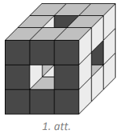

<small>

* questionType:
* domain:

</small>

## Atrisinājums

Katras skaldnes pārklāšanai nepieciešami $8$ kvadrātiņi, tātad, lai pārklātu 
visas sešas skaldnes, vajag $6 \cdot 8=48$ kvadrātiņus. Lai pārklātu katrā 
skaldnē esošo caurumu, vajag $4$ kvadrātiņus, tātad, lai pārklātu visus sešus 
caurumus, vajag $6 \cdot 4=24$ kvadrātiņus. Kopā figūras pārklāšanai vajag 
$48+24=72$ kvadrātiņus.

## Atrisinājums

Ievērojam, ka salīmētajā figūrā ir tikai divu veidu kubiņi - astoņi stūra 
kubiņi, kuriem nesalīmētas ir atlikušas trīs skaldnes, un $12$ vidus kubiņi, 
kuriem nesalīmētas ir palikušas četras skaldnes. Tātad figūras pārklāšanai 
vajag $8 \cdot 3+12 \cdot 4=24+48=72$ kvadrātiņus.

# <lo-sample/> LV.NOL.2016.5.4

Vienādi burti apzīmē vienādus skaitļus, dažādi - dažādus. Atrodi vienu piemēru,
kādi naturāli skaitļi jāliek burtu vietā, lai abas dotās vienādības būtu 
patiesas!

$$\begin{aligned}
& A+B=C \cdot D \\
& A \cdot B=C+D
\end{aligned}$$

<small>

* questionType:
* domain:

</small>

## Atrisinājums

Der, piemēram, $A=2,\ B=3,\ C=1$ un $D=5$, jo $2+3=1 \cdot 5$ un 
$2 \cdot 3=1+5$.

# <lo-sample/> LV.NOL.2016.5.5

Sadali taisnstūri ar izmēriem $11 \times 13$ rūtiņas sešos kvadrātos tā, lai 
dalījuma līnijas ietu pa rūtiņu līnijām!

<small>

* questionType:
* domain:

</small>

## Atrisinājums

Skat., piemēram, 2.att.

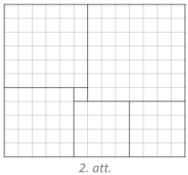

# <lo-sample/> LV.NOL.2016.6.1

Trīs brāļiem - Rihardam, Haraldam un Olafam - kopā ir $13,20$ eiro. Zināms, ka 
Haraldam ir par $2,10$ eiro vairāk nekā Rihardam un par $3,30$ eiro mazāk nekā 
Olafam. Cik naudas ir katram brālim?

<small>

* questionType:
* domain:

</small>

## Atrisinājums

Ja Haraldam ir $x$ eiro, tad Rihardam ir $x-2,10$ eiro un Olafam ir $x+3,30$ 
eiro. Tātad

$$\begin{gathered}
x+x-2,10+x+3,30=13,20 \\
3x+1,20=13,20 \\
3x=12,00 \\
x=4,00
\end{gathered}$$

Līdz ar to Haraldam ir $4$ eiro, Rihardam ir $1,90$ eiro un Olafam ir $7,30$ 
eiro.

# <lo-sample/> LV.NOL.2016.6.2

Rindā viens aiz otra bez tukšumiem ir uzrakstīti pēc kārtas sekojoši naturāli 
skaitļi no $1$ līdz $N$, tādējādi veidojot vienu lielu skaitli (Piemēram, ja 
$N=12$, tad ir uzrakstīts skaitlis $123456789101112$.)

Kāds ir mazākais iegūtais skaitlis, kas dalās ar **(A)** $9$; **(B)** $24$?

<small>

* questionType:
* domain:

</small>

## Atrisinājums

**(A)** Skaitlis dalās ar $9$, ja tā ciparu summa dalās ar $9$. Pārbaudot 
ciparu summas, iegūstam, ka mazākais skaitlis, kas dalās ar $9$, ir $12345678$,
jo tā ciparu summa ir $36$.

**(B)** Lai skaitlis dalītos ar $24$, tam vienlaicīgi jādalās ar $8$ un $3$. 
Pirmais skaitlis, kas dalās ar $8$ (pārbaudām trīs ciparu veidotos skaitļus), 
ir $123456$. Tā kā šī skaitļa ciparu summa ir $1+2+3+4+5+6=21$, kas dalās ar 
$3$, tad arī pats skaitlis dalās ar $3$. Tātad skaitlis $123456$ dalās ar $8$ 
un ar $3$, līdz ar to tas dalās arī ar $24$, jo skaitļi $3$ un $8$ ir 
savstarpēji pirmskaitļi. Tātad mazākais skaitlis, kas apmierina uzdevuma 
nosacījumus, ir $123456$.

# <lo-sample/> LV.NOL.2016.6.3

Rūtiņu lapā, kurā katras rūtiņas malas garums ir $1$ vienība, pa rūtiņu līnijām
uzzīmē astoņstūri tā, lai tā malu garumi pēc kārtas ir 
$3;\ 4;\ 5;\ 6;\ 7;\ 8;\ 9;\ 10$ vienības!

<small>

* questionType:
* domain:

</small>

## Atrisinājums

Skat. 3.att.

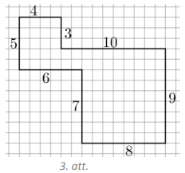

# <lo-sample/> LV.NOL.2016.6.4

Dotas $20$ pēc ārējā izskata vienādas monētas, bet visas to masas ir dažādas. 
Kā, izmantojot sviras svarus bez atsvariem, ar $28$ svēršanām atrast gan pašu 
vieglāko, gan pašu smagāko monētu?

<small>

* questionType:
* domain:

</small>

## Atrisinājums

Sadalām monētas pa pāriem un salīdzinām katra pāra monētas - nosakām vieglāko 
un smagāko monētu katrā pārī. Pēc katras svēršanas vieglāko monētu liekam vienā
kaudzītē, bet smagāko - otrā kaudzītē. Tā kā ir $20:2=10$ pāri, tad ir veiktas 
$10$ svēršanas. Skaidrs, ka visvieglākā monēta jāmeklē starp vieglākajām, bet 
vissmagākā - starp smagākajām. Apskatām katru kaudzīti atsevišķi.

No kaudzītes, kurā ir vieglākās monētas, paņemam divas un salīdzinām tās, 
vieglāko atstājam svaros un salīdzinām ar nākamo, atkal svaros atstājot 
vieglāko. Tā turpinām, kamēr visas atlikušās monētas no šīs kaudzītes ir 
nosvērtas. Pēdējās svēršanas vieglākā monēta ir pati vieglākā no visām. Kopā 
tika veiktas $9$ svēršanas.

Analoģiski no kaudzītes, kurā ir smagākās monētas, atrod pašu smagāko no 
visām - svaros visu laiku jāatstāj smagākā monēta, bet vieglākā jāmet prom. 
Kopā tika veiktas $9$ svēršanas.

Līdz ar to ar $10+9+9=28$ svēršanām esam atraduši gan pašu vieglāko, gan pašu 
smagāko monētu.

# <lo-sample/> LV.NOL.2016.6.5

Katrā tukšajā kvadrātiņā (skat. 4.att.) ieraksti vienu ciparu tā, lai iegūtu 
pareizu reizināšanas piemēru! Neviens skaitlis tajā nedrīkst sākties ar $0$.

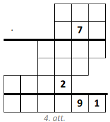

<small>

* questionType:
* domain:

</small>

## Atrisinājums

Der skaitļu $129$ un $879$ reizinājums (skat. 5.att.).

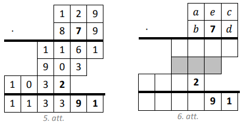

*Piezīme.* Atrisinājumu var palīdzēt atrast tālāk aprakstītie spriedumi. 
Apzīmējam skaitļus tā, kā parādīts 6.att. Tā kā $7 \cdot \overline{aec}$ ir 
trīsciparu skaitlis (skat. 6.att. iekrāsoto rindu), tad $a=1$ (ja $a$ būtu 
lielāks, tad reizinājums būtu četrciparu skaitlis). Skaidrs, ka $c$ un $d$ ir 
nepāra cipari, jo to reizinājuma pēdējais cipars ir $1$. Tātad $b$ ir pāra 
cipars, jo reizinājuma $b \cdot c$ pēdējais cipars ir $2$. Tā kā 
$7 \cdot \overline{aec}$ ir trīsciparu skaitlis, tad, lai 
$b \cdot \overline{aec}$ būtu četrciparu skaitlis, $b$ ir jābūt lielākam nekā 
$7$. Tātad $b=8$. Tā kā reizinājuma $b \cdot c$ pēdējais cipars ir $2$ un $c$ 
ir nepāra cipars, tad vienīgā iespēja, ka $c=9$. Līdz ar to $d=9$, jo 
reizinājuma $c \cdot d$ pēdējais cipars ir $1$. Ciparu $e$ piemeklējam tā, lai 
rezultāta pirmspēdējais cipars būtu $9$, vienīgā iespēja, ka $e=2$. Pārbaudot 
redzam, ka $129$ un $879$ reizinājums tiešām atbilst dotajam piemēram.

# <lo-sample/> LV.NOL.2016.7.1

Saldumu veikalā vienas konfektes cena ir $3$ centi. Aivaram ir vairāk naudas 
nekā Bruno, Cildai ir vairāk naudas nekā Aivaram, Dainai - vairāk nekā Cildai.

**(A)** Vai Daina noteikti var nopirkt vairāk konfekšu nekā Bruno?

**(B)** Vai Cilda noteikti var nopirkt vairāk konfekšu nekā Bruno?

<small>

* questionType:
* domain:

</small>

## Atrisinājums

Pieņemsim, ka Aivaram ir $a$ centi, Bruno - $b$ centi, Cildai - $c$ centi un 
Dainai - $d$ centi. Pēc uzdevuma nosacījumiem $d>c>a>b$.

**(A)** Tā kā visiem ir atšķirīgs naudas daudzums, tad Dainai ir par vismaz $3$
centiem vairāk naudas nekā Bruno. Līdz ar to Daina noteikti var nopirkt vismaz 
par vienu konfekti vairāk nekā Bruno.

**(B)** Nē, var gadīties, ka Cilda nevar nopirkt vairāk konfektes kā Bruno, 
piemēram, ja Bruno ir $3$ centi, Aivaram ir $4$ centi un Cildai ir $5$ centi, 
tad šajā gadījumā Cilda var nopirkt tikpat konfektes, cik Bruno.

# <lo-sample/> LV.NOL.2016.7.2

Dots naturāls skaitlis, kas dalās ar $99$ un kura pēdējais cipars nav $0$. 
Pierādi, ka, uzrakstot šī skaitļa ciparus pretējā secībā, arī iegūst skaitli, 
kas dalās ar $99$.

<small>

* topic:DivisibilityRulesFor3And9
* topic:DivisibilityRuleFor11
* topic:DivisibilityRulesOther
* questionType:Prove
* domain:NT

</small>

## Atrisinājums

Ja skaitlis dalās ar $99$, tad tas vienlaicīgi dalās gan ar $9$, gan $11$. 
Skaitlis dalās ar $9$ tad un tikai tad, ja tā ciparu summa dalās ar $9$. 
Uzrakstot ciparus pretējā secībā, ciparu summa nemainīsies un arī iegūtais 
skaitlis dalīsies ar $9$. 

Skaitlis dalās ar $11$ tad un tikai tad, ja tā pāra 
un nepāra pozīcijās esošo ciparu summu starpība dalās ar $11$. Pārrakstot 
skaitļa ciparus pretējā secībā, minētā īpašība saglabājas - pāra un nepāra 
pozīcijās esošo ciparu summu starpība dalīsies ar $11$ un, tātad arī šis 
skaitlis dalīsies ar $11$. Tā kā skaitlis vienlaicīgi dalās gan ar $9$, gan 
$11$ un skaitļi $9$ un $11$ ir savstarpēji pirmskaitļi, tad iegūtais skaitlis 
dalās arī ar $99$.

# <lo-sample/> LV.NOL.2016.7.3

No trīs dotajām figūrām (skat. 7.att.) saliec simetrisku daudzstūri un uzzīmē 
arī simetrijas asi! Figūras drīkst būt pagrieztas vai apgrieztas spoguļattēlā.

*Piezīme.* Figūra ir simetriska, ja to var pārlocīt tā, ka tās abas puses 
sakrīt.

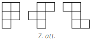

<small>

* questionType:
* domain:

</small>

## Atrisinājums

Skat. 8.att.

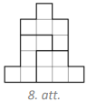

# <lo-sample/> LV.NOL.2016.7.4

Dotas $13$ pēc ārējā izskata vienādas monētas. No tām $12$ monētas ir ar 
vienādu masu, bet viena - ar atšķirīgu. Doti arī sviras svari bez atsvariem. Kā
ar divām svēršanām noskaidrot, vai atšķirīgā monēta ir vieglāka vai smagāka par
pārējām? Pašu monētu atrast nav nepieciešams.

<small>

* questionType:
* domain:

</small>

## Atrisinājums

Katrā svaru kausā ieliekam $6$ monētas.

- Ja svaru kausi ir līdzsvarā, tad atšķirīgā monēta ir tā, kas nebija uz 
  svariem. Salīdzinot to ar kādu no svērtajām monētām, noskaidrojam, vai tā ir 
  vieglāka vai smagāka par pārējām.
- Ja svaru kausi nav līdzsvarā, tad, nezaudējot vispārīgumu, varam pieņemt, ka 
  monētas kreisajā kausā ir vieglākas nekā monētas labajā kausā. Otrajā 
  svēršanā katrā svaru kausā ieliekam pa trīs monētām no kreisā kausa.
- Ja svaru kausi ir līdzsvarā, tad visām monētām no kreisā svaru kausa ir 
  vienāda masa, un atšķirīgā monēta pirmajā svēršanā atradās labajā svaru 
  kausā, tātad tā ir smagāka nekā pārējās.
- Ja svaru kausi nav līdzsvarā, tad atšķirīgā monēta pirmajā svēršanā atradās 
  kreisajā svaru kausā, tātad tā ir vieglāka nekā pārējās.

# <lo-sample/> LV.NOL.2016.7.5

**(A)** Vai var atrast dažādus veselus skaitļus $a, b, c$ un $d$ tādus, ka 
izpildās vienādības $a+b=cd$ un $ab=c+d$ ?

**(B)** Vai šādus skaitļus var atrast, ja papildus zināms, ka $a>2016$?

<small>

* topic:SymmetricAlgebraicExpressions
* topic:NumTheoryExtremeElement
* questionType:ProveDisprove,ProveDisprove
* domain:Alg

</small>

## Atrisinājums

**(A)** Der, piemēram, $a=2,\ b=3, c=1$ un $d=5$, jo $2+3=1 \cdot 5$ un 
$2 \cdot 3=1+5$.

**(B)** Der, piemēram, $a=2017,\ b=-2017,\ c=0$ un $d=-2017^{2}$, jo 
$2017-2017=0 \cdot\left(-2017^{2}\right)$ un $2017 \cdot(-2017)=0-2017^{2}$.

*Piezīme.* (B) gadījumā atrastie skaitļi der arī (A) gadījumam.

## Atrisinājums

**(A)** Izveidojam piemēru, izvēloties nelielu vērtību, ar kuru iespējami 
vienkārši veikt aprēķinus.
Tā kā $a,b,c,d$ uzdevuma formulā ir simetriski, var paņemt, teiksim, $c=1$. 
Ja $c=1$, tad $a+b=d$, $ab=d+1$ (divu skaitļu summa par $1$ mazāka nekā reizinājums).

Der, piemēram, atrisinājums $(a,b,c,d)=(2,3,1,5)$.

**(B)**
Atkal ievērojam, ka $a,b,c,d$ uzdevuma formulā ir simetriski - tāpēc nav būtiski, 
kuru burtu pirmo ar kaut ko aizvieto.
Izvēlamies $c=0$. Tad $a+b=0$, $ab=d$.

Der, piemēram, atrisinājums $(a,b,c,d) = (2017, -2017, 0, -2017^2)$.

# <lo-sample/> LV.NOL.2016.8.1

Aprēķini izteiksmes $\sqrt{a-b}+\sqrt{b-c}+\sqrt{c-d}+\sqrt{d-a}$ vērtību!

<small>

* questionType:
* domain:

</small>

## Atrisinājums

Tā kā zemsaknes izteiksmei jābūt nenegatīvai, tad 
$a \geq b,\ b \geq c,\ c \geq d,\ d \geq a$, no kā izriet, ka 
$a \geq b \geq c \geq d \geq a$. Tas ir iespējams tikai tad, ja $a=b=c=d$.

Līdz ar to izteiksmes $\sqrt{a-b}+\sqrt{b-c}+\sqrt{c-d}+\sqrt{d-a}$ vērtība ir 
$0$.

# <lo-sample/> LV.NOL.2016.8.2

Karlīna uzrakstīja divus skaitļus, kuru pierakstā nav izmantots cipars $0$. 
Katru ciparu viņa aizstāja ar burtu: dažādus ciparus - ar dažādiem burtiem, 
vienādus - ar vienādiem. Viens no uzrakstītajiem skaitļiem $DUBĻUNNN$ dalās ar 
$104$. Pierādi, ka otrais skaitlis $BURBUĻUVANNA$ nedalās ar $56$.

<small>

* topic:DivisibilityRulesFor2And4
* questionType:Prove
* domain:NT

</small>

## Atrisinājums

Tā kā skaitlis $DUBĻUNNN$ dalās ar $104=8 \cdot 13$, tad tas dalās arī ar $8$. 
Ar $8$ dalās skaitļi, kuru pēdējo trīs ciparu veidotais skaitlis dalās ar $8$, 
tātad skaitlis $\overline{NNN}$ jeb $100N+10N+N=111 N$ dalās ar $8$. Tā kā 
$111$ ar $8$ nedalās, tad ar $8$ dalās $N$. Vienīgais cipars, kas nav $0$ un 
kura veidotais viencipara skaitlis dalās ar $8$, ir $N=8$. Ja skaitlis 
$BURBUĻVANNA$ dalītos ar $56=8 \cdot 7$, tad tas dalītos arī ar $8$, turklāt tā
pēdējo trīs ciparu veidotais skaitlis $\overline{NNA}$ jeb 
$\overline{88A}=880+A$ dalītos ar $8$. Tā kā $880$ dalās ar $8$, tad arī 
skaitlim $A$ būtu jādalās ar $8$, bet tas nav iespējams, jo $A$ nevar būt ne 
$0$, ne $8$. Tātad skaitlis $BURBUĻVANNA$ nedalās ar $56$.

## Atrisinājums

Skaitļi $104$ un $56$ šeit nav izraudzīti patvaļīgi, 
tiem lielākais kopīgais dalītājs $\gcd(104,56) = 8$. 
Tāpēc aplūkosim dalāmības pazīmi ar $8$ un tikai divus 
ciparus $A$ un $N$ abos skaitļos. 

* Skaitlis *DUBĻUNNN* dalās ar $104$; tāpēc tas dalās arī ar $8$. 
  Pēc dalāmības pazīmes ar $8$: trīs pēdējo ciparu veidotais 
  skaitlis $\overline{NNN}$ dalās ar $8$. Pārbaudot visas cipara $N$ iespējas, 
  atrodam, ka $N=0$ vai $N=8$ (pēc dotā $N=8$, jo cipari nav nulles).
* Pieņemsim no pretējā, ka arī skaitlis *BURBUĻVANNA* dalās ar $56$, tātad arī ar $8$. 
  Pēc dalāmības pazīmes ar $8$, arī pēdējo trīs ciparu veidotais 
  skaitlis $\overline{NNA}$ dalās ar $8$. Tā kā $N=8$, tad  
  seko, ka $A=0$ (nevar būt) vai $A=8$. Atliek iespēja $A=N$, kas 
  ir pretruna, jo visi burti apzīmē dažādus ciparus.

# <lo-sample/> LV.NOL.2016.8.3

Caur taisnstūra $ABCD$ diagonāļu krustpunktu $O$ novilkta taisne $PQ$ tā, ka 
$P$ atrodas uz $AD,\ Q$ - uz $BC$ un $PQ=QD$. Pierādīt, ka $DP=2AP$.

<small>

* questionType:
* domain:

</small>

## Atrisinājums

Tā kā $\sphericalangle AOP=\sphericalangle COQ,\ AO=OC$ un 
$\sphericalangle OAP=\sphericalangle OCQ$, tad $\triangle AOP=\triangle COQ$ 
pēc pazīmes $\ell m \ell$ (skat. 9.att.). Līdz ar to $AP=QC$ kā atbilstošās 
malas vienādos trijstūros. Vienādsānu trijstūrī $PQD$ novelkam augstumu $QH$, 
kas ir arī mediāna, tāpēc $PH=HD$. Tā kā $QCDH$ ir taisnstūris, tad $QC=HD$. 
Līdz ar to $AP=PH=HD$ un $DP=PH+HD=2AP$.

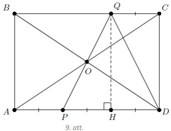

# <lo-sample/> LV.NOL.2016.8.4

Kādu lielāko skaitu rūtiņu diagonāļu var novilkt $4 \times 4$ rūtiņas lielā 
tabulā, lai šīs diagonāles veidotu slēgtu lauztu līniju? Lauztā līnija nedrīkst
pati sevi krustot vai pieskarties.

<small>

* questionType:
* domain:

</small>

## Atrisinājums

Var novilkt $12$ rūtiņu diagonāles, skat. 10.att.

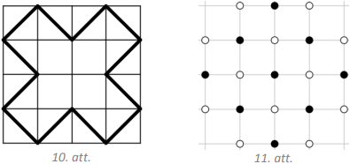

Pamatosim, ka vairāk diagonāļu novilkt nevar. Ievērojam, ka slēgta lauzta 
līnija nevar iet caur kvadrāta stūriem. Atlikušās rūtiņu virsotnes nokrāsojam 
tā, kā parādīts 11.att., iegūsim $9$ melnas un $12$ baltas virsotnes. Katra 
rūtiņas diagonāle savā starpā saista divas vienas krāsas virsotnes un, tā kā 
jāveido lauzta līnija, tad visas līnijai piederošās virsotnes būs vienā krāsā. 
Tātad tā nevar saturēt vairāk kā $12$ virsotnes un tātad arī posmus.

# <lo-sample/> LV.NOL.2016.8.5

Smaragda pilsētā naudas vienība ir centi. Tur ir $21 \%$ PVN (pievienotās 
vērtības nodokļa) likme. Tas nozīmē, ka ikvienas pārdodamās preces cenu iegūst,
pareizinot kādu veselu skaitu centu (cenu bez PVN) ar skaitli $1,21$ un 
reizinājumu noapaļojot līdz tuvākajam veselajam centu skaitam. Cenu sauc par 
neiespējamu, ja to nevar iegūt minētajā veidā. Cik pavisam ir neiespējamu cenu 
no $1$ līdz $1000$ centiem ieskaitot?

Piemēram, $3$ centi ir neiespējama cena, jo $2 \cdot 1,21=2,42$, pēc 
noapaļošanas $2$ centi, savukārt, $3 \cdot 1,21=3,63$, pēc noapaļošanas $4$ 
centi. Tā kā nekāda cita vesela skaitļa starp $2$ un $3$ nav, tad cenu, kas ir 
tieši $3$ centi nevar iegūt pēc PVN pievienošanas.

<small>

* questionType:
* domain:

</small>

## Atrisinājums

Vispirms pamatosim, ja sākumā preču cenas bija dažādas, tad pēc PVN 
pievienošanas un noapaļošanas tās arī būs dažādas. Ievērojam, ka, noapaļojot 
skaitļus no intervāla $[a-0,5; a+0,5)$, iegūstam $a$. Tā kā šī intervāla garums
ir $1$, tad secinām, ja starpība starp diviem skaitļiem ir lielāka nekā $1$, 
tad, tos noapaļojot, iegūst dažādus skaitļus. Ņemam divas blakus esošas cenas 
$a$ un $a+1$ pirms PVN pievienošanas un reizinām tās ar $1,21$. Iegūto skaitļu 
starpība $1,21(a+1)$ - $1,21a=1,21$ ir lielāka nekā $1$, tātad pēc noapaļošanas
iegūtie skaitļi ir dažādi.

Ievērojam, ka $826 \cdot 1,21=999,46 \approx 999$, bet 
$827 \cdot 1,21=1000,67 \approx 1001$, tāpēc visi skaitļi, kuri nepārsniedz 
$826$, pēc PVN pievienošanas attēlosies par cenām intervālā no $1$ līdz $1000$.
Tādēļ, pievienojot PVN skaitliem starp $1$ un $826$, mēs varam iegūt pavisam 
$826$ dažādas cenas intervālā $[1; 1000]$. Visas pārējās cenas būs neiespējamās, 
tādu pavisam ir $1000-826=174$.

# <lo-sample/> LV.NOL.2016.9.1

Nosaki funkciju $y=2016-x$ un $y=\frac{2015}{x}$ grafiku krustpunktu 
koordinātas!

<small>

* questionType:
* domain:

</small>

## Atrisinājums

Krustpunkta abscisu iegūst no vienādojuma $2016-x=\frac{2015}{x}$. Reizinot 
abas vienādojuma puses ar $x \neq 0$, iegūst $x^{2}-2016x+2015=0$. Pēc Vjeta 
teorēmas

$$\left\{\begin{array}{l}
x_{1}+x_{2}=2016 \\
x_{1} \cdot x_{2}=2015
\end{array}\right.$$

Tātad $x_{1}=2015$ un $x_{2}=1$, tiem atbilstošās ordinātas ir $y_{1}=1$ un 
$y_{2}=2015$. Esam ieguvuši, ka grafiku krustpunktu koordinātas ir $(2015; 1)$ 
un $(1; 2015)$.

# <lo-sample/> LV.NOL.2016.9.2

Pierādīt, ka

**(A)** no pieciem naturāliem skaitļiem vienmēr var izvēlēties vairākus (vismaz
divus), kuru summa dalās ar $4$;

**(B)** var atrast četrus tādus naturālus skaitļus, ka no tiem nevar izvēlēties
vairākus (vismaz divus), kuru summa dalās ar $4$.

<small>

* questionType:
* domain:

</small>

## Atrisinājums

**(A)** Naturāls skaitlis, dalot ar $4$, dod atlikumu $0,\ 1,\ 2$ vai $3$, pāra
skaitļi dod atlikumu $0$ vai $2$, nepāra - atlikumu $1$ vai $3$.

1. Ja starp dotajiem pieciem skaitļiem ir divi, kas, dalot ar $4$, abi dod 
   atlikumu $0$ vai abi dod atlikumu $2$, tad šo divu skaitļu summa dalās ar 
   $4$, jo $0+0 \equiv 0(\bmod 4)$ vai $2+2 \equiv 4 \equiv 0(\bmod 4)$, tad 
   varam ņemt šos. Pretējā gadījumā mums ir ne vairāk kā divi pāra skaitļi, 
   tātad ir vismaz trīs nepāra skaitļi.
2. Ja starp nepāra skaitļiem ir gan tāds, kas, dalot ar $4$, dod atlikumu $1$, 
   gan tāds, kas dod atlikumu $3$, tad šo abu summa dalās ar $4$ un mēs varam 
   ņemt šos. Pretējā gadījumā mums visi nepāra skaitļi dod vienu un to pašu 
   atlikumu ($1$ vai $3$), dalot ar $4$.
3. Ja kāds no skaitļiem, dalot ar $4$, dod atlikumu $2$, tad tas summā ar 
   diviem nepāra skaitļiem (kuri abi dod atlikumu $1$ vai $3$, dalot ar $4$) 
   dalās ar $4$, jo $2+1+1 \equiv 4 \equiv 0(\bmod 4)$ vai 
   $2+3+3 \equiv 8 \equiv 0(\bmod 4)$, tad varam ņemt šos trīs skaitļus. 
   Pretējā gadījumā mums ir ne vairāk kā viens pāra skaitlis (kurš dod atlikumu
   $0$, dalot ar $4$).
4. Ja ir ne vairāk kā viens pāra skaitlis, tad ir vismaz četri nepāra skaitļi, 
   kas visi dod vienādus atlikumus, dalot ar $4$, tad to summa dalās $4$.

**(B)** Līdzīgi kā (A) gadījumā varam izsecināt, ka neder divi pāra skaitļi, 
kas dod vienādus atlikumus, dalot ar $4$, divi nepāra skaitļi, kas dod dažādus 
atlikumus, dalot ar $4$ un neder arī viens pāra skaitlis, kas dod atlikumu $2$,
dalot ar $4$. Tādējādi nonākam pie atlikumiem $0,\ 1,\ 1,\ 1$ vai 
$0,\ 3,\ 3,\ 3$, kas abi der.

N̦emsim jebkurus skaitļus, kas, dalot ar $4$, dod attiecīgi atlikumus, 
$0,\ 1,\ 1,\ 1$. Tad vairāku no tiem atlikumu summa būs vismaz $1$, bet ne 
lielāka kā $3$ (ja mēs sasummējam visus), tātad tā var pieņemt tikai vērtības 
$1,\ 2$ vai $3$. Tātad nekādu vairāku no tiem summa nedalīsies ar $4$. Šādi 
skaitļi ir, piemēram, $4,\ 1,\ 5,\ 9$ (to, ka tie der var pārbaudīt arī, 
aprēķinot visas $11$ iespējamās vairāku no tiem summas).

# <lo-sample/> LV.NOL.2016.9.3

Trijstūrī $ABC$ novilkta bisektrise $BD$. Zināms, ka $AD=DB$ un $AB=2BC$. 
Aprēķināt $\sphericalangle BAC$ lielumu!

<small>

* questionType:
* domain:

</small>

## Atrisinājums

Pēc bisektrises definīcijas $\sphericalangle ABD=\sphericalangle DBC=\alpha$. 
Malas $AB$ viduspunktu apzīmējam ar $E$ (skat. 1.att.)

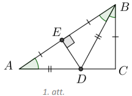

Tā kā $AD=DB$, tad trijstūris $ADB$ ir vienādsānu, tāpēc 
$\sphericalangle BAC=\sphericalangle ABD=\alpha$ un nogrieznis $DE$ ir gan 
mediāna, gan augstums, no kā izriet, ka $\sphericalangle BED=90^{\circ}$. Pēc 
dotā $AB=2BC$, tāpēc $BE=BC$. Ievērojam, ka $\triangle BED=\triangle BCD$ pēc 
pazīmes $m \ell m$, jo 
$BE=BC, \sphericalangle EBD=\sphericalangle DBC=\alpha, BD$ - kopīga mala. 
Tāpēc $\sphericalangle BED=\sphericalangle BCD=90^{\circ}$ kā atbilstošie leņķi
vienādos trijstūros. Tā kā $\triangle ABC$ iekšējo leņķu summa ir 
$180^{\circ}$, tad

$\sphericalangle BAC+\sphericalangle ABC+\sphericalangle BCA=180^{\circ}$;  
$\alpha+2 \alpha+90^{\circ}=180^{\circ}$;  
$3 \alpha=90^{\circ}$ jeb $\alpha=30^{\circ}$.   

Tātad $\sphericalangle BAC=30^{\circ}$.

# <lo-sample/> LV.NOL.2016.9.4

Ķērpjbārdis, Puszābaks un Uzrocis spēlē novusu, pie tam tas, kurš zaudē 
partiju, atdod savu vietu tam, kurš iepriekšējo partiju nespēlēja. Beigās 
izrādījās, ka Ķērpjbārdis ir izspēlējis $10$ partijas, bet Puszābaks - $21$. 
Cik partijas izspēlēja Uzrocis?

<small>

* questionType:
* domain:

</small>

## Atrisinājums

Skaidrs, ka katrs spēlētājs spēlē vismaz vienā no divām pēc kārtas sekojošām 
partijām. Tā kā Ķērpjbārdis spēlēja tikai $10$ partijas, tad kopējais partiju 
skaits nav lielāks kā $21$, bet tas nav arī mazāks kā $21$, jo tik partijas 
spēlēja Puszābaks. Tātad tika izspēlēta tieši $21$ partija un, tā kā Puszābaks 
spēlēja tajās visās un Ķērpjbārdis ar viņu spēlēja $10$ partijās, tad Uzrocis 
spēlēja atlikušajās $21-10=11$ partijās.

Var secināt vēl precīzāk: Ķērpjbārdis spēlēja visās partijās ar pāra numuriem 
$(2,\ 4,\ 6,\ \ldots)$, bet Uzrocis visās ar nepāra numuriem 
$(1,\ 3,\ 5,\ \ldots)$, visās partijās uzvarēja Puszābaks.

# <lo-sample/> LV.NOL.2016.9.5

Doti $2016$ skaitļi: $1^{2}$; $2^{2}$; $3^{2}$; $\ldots$; $2015^{2}$; $2016^{2}$. 
Vai starp šiem skaitļiem var salikt "+" un "-" zīmes tā, lai iegūtās izteiksmes
vērtība būtu $0$?

<small>

* questionType:
* domain:

</small>

## Atrisinājums

Jā, var. Ievērosim, ka divu pēc kārtas sekojošu skaitļu kvadrātu starpība ir 
$(n+1)^{2}-n^{2}=2n+1$. Tāpat arī $(n+3)^{2}-(n+2)^{2}=2n+5$ un tātad, saliekot
starp jebkuriem četriem pēc kārtas sekojošiem kvadrātiem zīmes $+--+$, iegūstam
izteiksmi, kuras vērtība ir $4$:

$$+n^{2}-(n+1)^{2}-(n+2)^{2}+(n+3)^{2}=-(2n+1)+(2n+5)=4$$

Savukārt, saliekot zīmes $-++-$, iegūstam izteiksmi, kuras vērtība ir $-4$:

$$-n^{2}+(n+1)^{2}+(n+2)^{2}-(n+3)^{2}=2n+1-(2n+5)=-4$$

Tātad, saliekot astoņiem pēc kārtas sekojošiem kvadrātiem zīmes $+--+-++-$, 
iegūstam izteiksmi, kuras vērtība ir $0$:

$\left(n^{2}-(n+1)^{2}-(n+2)^{2}+(n+3)^{2}\right)+\left(-(n+4)^{2}+(n+5)^{2}+(n+6)^{2}-(n+7)^{2}\right)=4-4=0$

Tā kā $2016$ dalās ar $8$, tad visus kvadrātus var sadalīt grupās pa $8$ un 
katrā no tām salikt zīmes tā, ka šīs grupas summa ir $0$, tātad arī visas 
izteiksmes summa ir $0$.

# <lo-sample/> LV.NOL.2016.10.1

Pierādīt, ka katram naturālam $n$ ir patiesa vienādība 
$1 \cdot 4+2 \cdot 7+3 \cdot 10+\cdots+n \cdot(3n+1)=n(n+1)^{2}$. 

<small>

* topic:SequenceGaps
* topic:NumTheoryMathInduction
* questionType:Prove
* domain:Alg

</small>

## Atrisinājums

Izmantosim matemātiskās indukcijas metodi.

*Indukcijas bāze.* Ja $n=1$, tad $1 \cdot 4=1 \cdot 2^{2}$ jeb $4=4$.

*Induktīvais pieņēmums.* Pieņemsim, ka vienādība izpildās, ja $n=k$, tas ir,

$$1 \cdot 4+2 \cdot 7+3 \cdot 10+\cdots+k \cdot(3 k+1)=k(k+1)^{2}$$

*Induktīvā pāreja.* Pierādīsim, ka vienādība ir spēkā arī tad, ja $n=k+1$, tas 
ir,

$1 \cdot 4+2 \cdot 7+3 \cdot 10+\cdots+(k+1) \cdot(3(k+1)+1)=(k+1)((k+1)+1)^{2}$ jeb  
$1 \cdot 4+2 \cdot 7+3 \cdot 10+\cdots+(k+1) \cdot(3k+4)=(k+1)(k+2)^{2}$

Pārveidojam vienādības kreisās puses izteiksmi:

$\underbrace{1 \cdot 4+2 \cdot 7+3 \cdot 10+\cdots+k \cdot(3k+1)}_{induktīvais\ pieņēmums}+(k+1) \cdot(3k+4)=k(k+1)^{2}+(k+1) \cdot(3k+4)=$  
$=(k+1)(k(k+1)+3k+4)=(k+1)\left(k^{2}+4k+4\right)=(k+1)(k+2)^{2}$.

*Secinājums.* Tā kā vienādība ir patiesa, ja $n=1$, un no tā, ka vienādība ir spēkā, ja $n=k$, izriet, ka vienādība ir spēkā arī $n=k+1$, secinām, ka vienādība ir spēkā visām naturālām $n$ vērtībām.

## Atrisinājums

Ekvivalenti pārveidojot doto vienādību, iegūstam

$\sum_{k=1}^{n}k(3k+1)=\sum_{k=1}^{n}\left(3k^{2}+k\right)=\sum_{k=1}^{n}3k^{2}+\sum_{k=1}^{n}k=\frac{3n(n+1)(2n+1)}{6}+\frac{n(n+1)}{2}=$

$=\frac{n(n+1)}{2}(2n+1+1)=n(n+1)^{2}$.

Pārveidojumos tika izmantots, ka $n$ pēc kārtas esošu naturālu skaitļu kvadrātu
summa ir $\frac{n(n+1)(2n+1)}{6}$.

## Atrisinājums

Definējam virkni 

$$a_n = 1\cdot{}4 + 2\cdot{}7 + 3\cdot{}10 + \cdots + n\cdot{}(3n + 1)$$

Katrs nākamais šīs virknes loceklis ir par $n\cdot{}(3n+1)$ lielāks kā iepriekšējais.
Tikpat liela ir starpība starp $n(n+1)^2$ un izteiksmi, kur $n$ aizstāj ar $n-1$: $(n-1)n^2$:

$$n(n+1)^2 - (n-1)n^2 = n(n^2 + 2n + 1) - n^3 + n^2 =$$
$$= n^3+2n^2+n - n^3+n^2 = 3n^2 + n = n(3n+1).$$

Spriedums ar matemātisko indukciju 

**Bāze:** 
Ja $n=1$, tad $a_1 = 1\cdot{}4 = 4$ un arī $n(n+1)^2 = 4$. 

**Pāreja:**
Palielinot $n$ par $1$, gan virkne $a_n$, gan formula $n(n+1)^2$ 
pieaug vienādiem soļiem. 

# <lo-sample/> LV.NOL.2016.10.2

Pierādīt, ka no jebkuriem trim naturālu skaitļu kvadrātiem var izvēlēties divus
tā, ka to summa vai starpība dalās ar $5$.

<small>

* topic:ModularArithmetic
* topic:ModularArithmetic
* topic:NumTheoryPigeonhole
* questionType:Prove
* domain:NT

</small>

## Atrisinājums

Vispirms noskaidrosim, ar ko var būt kongruents naturāla skaitļa kvadrāts pēc 
moduļa $5$.

| $n(\bmod 5)$ | $0$ | $1$ | $2$ | $3$ | $4$ |
| :---: | :---: | :---: | :---: | :---: | :---: |
| $n^{2}(\bmod 5)$ | $0$ | $1$ | $4$ | $4$ | $1$ |

Tātad naturāla skaitļa kvadrāts pēc moduļa $5$ var būt kongruents ar $0,\ 1$ 
vai $4$.

- Ja divi kvadrāti dod vienādu atlikumu, dalot ar $5$, tad to starpība dalās ar
  $5$.
- Ja nekādi divi no šiem trim kvadrātiem nav kongruenti pēc moduļa $5$, tad tie
  pēc moduļa $5$ pieņem visas iespējamās vērtības $0,\ 1$ un $4$. Tā kā 
  $1+4=5$, tad šo atbilstošo kvadrātu summa dalīsies ar $5$.

# <lo-sample/> LV.NOL.2016.10.3

Izliektā četrstūrī $APQC$ uz malas $AC$ izvēlēts punkts $B$ tā, ka trijstūri 
$APB$ un $BQC$ ir vienādsānu taisnleņķa trijstūri ar pamatiem attiecīgi $AB$ un
$BC$. Ap trijstūri $PBQ$ apvilktā riņķa līnija vēlreiz krusto taisni $AC$ 
punktā $S$. Pierādīt, ka $PS=SQ$.

<small>

* questionType:
* domain:

</small>

## Atrisinājums

Tā kā trijstūri $APB$ un $BQC$ ir vienādsānu taisnleņķa, tad 
$\sphericalangle ABP=\sphericalangle CBQ=45^{\circ}$ (skat. 2.att.). Tāpēc 
$\sphericalangle PBQ=180^{\circ}-\sphericalangle ABP-\sphericalangle CBQ=90^{\circ}$.
Savukārt, $\sphericalangle PSQ=\sphericalangle PBQ=90^{\circ}$ kā ievilktie 
leņķi, kas balstās uz viena un tā paša loka $PQ$. Varam pieņemt, ka $S$ pieder 
nogrieznim $AB$ (gadījums, kad $S$ pieder nogrieznim $BC$, risināms līdzīgi). 
Tad $\sphericalangle PQS=\sphericalangle PBS=45^{\circ}$ kā ievilktie leņķi, 
kas balstās uz vienu loku $PS$. Līdz ar to trijstūris $PSQ$ ir vienādsānu 
taisnleņķa ar virsotni punktā $S$. Tāpēc $PS=SQ$.

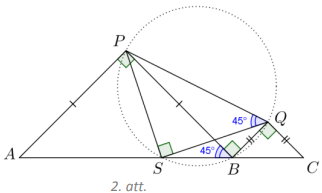

# <lo-sample/> LV.NOL.2016.10.4

Ķērpjbārdis, Puszābaks un Uzrocis spēlē novusu, pie tam tas, kurš zaudē 
partiju, atdod savu vietu tam, kurš iepriekšējo partiju nespēlēja. Beigās 
izrādījās, ka Ķērpjbārdis ir izspēlējis $10$ partijas, Puszābaks - $15$, bet 
Uzrocis - $17$. Kurš zaudēja sestajā partijā?

<small>

* questionType:
* domain:

</small>

## Atrisinājums

Tā kā katrā partijā spēlē divi spēlētāji, tad kopā tika izspēlēta 
$(10+15+17):2=21$ partija. Katrs spēlētājs spēlē vismaz vienā no divām pēc 
kārtas sekojošām partijām. Vienīgā iespēja, kā Ķērpjbārdis varēja spēlēt tikai 
$10$ partijas, ir tad, ja viņš spēlēja visās partijās ar pāra numuriem un visās
zaudēja. Tātad viņš zaudēja arī sestajā partijā.

# <lo-sample/> LV.NOL.2016.10.5

Pierādīt, ka katram naturālam $n$ rūtiņu lapā, kurā rūtiņas malas garums ir 
$1$, pa rūtiņu līnijām ir iespējams uzzīmēt astoņstūri tā, ka tā malu garumi 
pēc kārtas ir $n;\ n+1;\ n+2;\ n+3;\ n+4;\ n+5;\ n+6;\ n+7$.

<small>

* questionType:
* domain:

</small>

## Atrisinājums

Parādīsim, kā katram naturālam $n$ konstruēt astoņstūri $ALKPCONM$ (skat. 
3.att.).

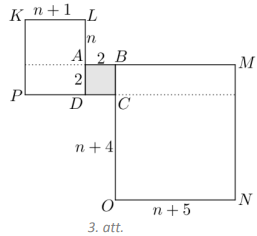

Ja no $A$ velk $n$ vienības garu nogriezni uz augšu, tad turpina $n+1$ vienību 
horizontāli pa kreisi, tad $n+2$ - vertikāli uz leju, tad $n+3$ - horizontāli 
pa labi, būsim nonākuši punktā $C$. Velkot nogriezni no $C$ ar garumu $n+4$ 
vertikāli uz leju, tad $n+5$ - horizontāli pa labi, tad $n+6$ - vertikāli uz 
augšu, tad $n+7$ - horizontāli pa kreisi, atgriezīsimies sākumpunktā $A$. Šī 
konstrukcija nav atkarīga no konkrētās $n$ vērtības.

# <lo-sample/> LV.NOL.2016.11.1

Atrisināt nevienādību $x^{2}+3kx-k>0$ visām parametra $k$ vērtībām!

<small>

* questionType:
* domain:

</small>

## Atrisinājums

Aprēķinām diskriminantu: $D=9k^{2}+4k=k(9k+4)$. Tā kā $D=0$, ja $k=0$ vai 
$k=-\frac{4}{9}$, tad šie punkti sadala parametra $k$ asi trīs intervālos. 
Uzskicējot parabolu $y=9k^{2}+4k$, varam noteikt diskriminanta $D$ zīmi šajos 
intervālos (skat. 4.att.).

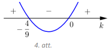

| Ja $k \in\left(-\frac{4}{9}; 0\right)$, | Ja $k=-\frac{4}{9}$ vai $k=0$, | Ja $k \in\left(-\infty; -\frac{4}{9}\right) \cup(0; +\infty)$, |
| ---- | ---- | ---- |
| tad $D<0$ un funkcijas $y=x^{2}+3kx-k$ grafiks $x$ asi nekrusto.   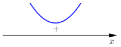   Tātad dotās nevienādības atrisinājums ir $x \in(-\infty; +\infty)$ | tad $D=0$ un funkcijas $y=x^{2}+3kx-k$ grafiks pieskaras $x$ asij.   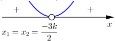   Apskatām katru $k$ vērtību atsevišķi.   Ja $k=-\frac{4}{9}$, tad dotās nevienādības atrisinājums ir $x \in\left(-\infty; \frac{2}{3}\right) \cup\left(\frac{2}{3} ;+\infty\right)$ Ja $k=0$, tad dotās nevienādības atrisinājums ir $x \in(-\infty; 0) \cup(0 ;+\infty)$ | tad $D>0$ un funkcijas $y=x^{2}+3kx-k$ grafiks krusto $x$ asi divos punktos:   $x_{1}=\frac{-3k-\sqrt{9k^{2}+4k}}{2}$   $x_{2}=\frac{-3k+\sqrt{9k^{2}+4k}}{2}$   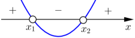   Tātad dotās nevienādības atrisinājums ir $x \in\left(-\infty; x_{1}\right) \cup\left(x_{2};+\infty\right)$ |

Apkoposim nevienādības atrisinājumu.

- Ja $k \in\left(-\frac{4}{9}; 0\right)$, tad $x \in(-\infty ;+\infty)$.
- Ja $k=-\frac{4}{9}$, tad 
  $x \in\left(-\infty; \frac{2}{3}\right) \cup\left(\frac{2}{3};+\infty\right)$.
- Ja $k=0$, tad $x \in(-\infty; 0) \cup(0;+\infty)$.
- Ja $k \in\left(-\infty;-\frac{4}{9}\right) \cup(0;+\infty)$, tad 
  $x \in\left(-\infty; \frac{-3k-\sqrt{9k^{2}+4k}}{2}\right) \cup\left(\frac{-3k+\sqrt{9k^{2}+4k}}{2};+\infty\right)$.

# <lo-sample/> LV.NOL.2016.11.2

Pierādīt, ka starp jebkuriem pieciem naturālu skaitļu kvadrātiem var atrast 
divus tādus, ka to summa vai starpība dalās ar $13$.

<small>

* questionType:Prove
* domain:NT
* method:PigeonholePrincipleBasic

</small>

## Atrisinājums

Vispirms noskaidrosim, ar ko var būt kongruents naturāla skaitļa kvadrāts pēc 
moduļa $13$.

| $n(\bmod 13)$ | $n^{2}(\bmod 13)$ |
| ---- | ---- |
| $0$ | $0$ |
| $1$ | $1$ |
| $2$ | $4$ |
| $3$ | $9$ |
| $4$ | $3$ |
| $5$ | $12$ |
| $6$ | $10$ |
| $7$ | $10$ |
| $8$ | $12$ |
| $9$ | $3$ |
| $10$ | $9$ |
| $11$ | $4$ |
| $12$ | $1$ |

Tātad naturāla skaitļa kvadrāts pēc moduļa $13$ var būt kongruents ar 
$0,\ 1,\ 3,\ 4,\ 9,\ 10$ vai $12$.

- Ja divi kvadrāti dod vienādu atlikumu, dalot ar $13$, tad to starpība dalās 
  ar $13$.
- Ja nekādi divi no šiem pieciem kvadrātiem nav kongruenti pēc moduļa $13$, tad
  sadalām šo kvadrātu iespējamās vērtības pēc moduļa $13$ četrās grupās: 
  $\{0\}$, $\{1; 12\}$, $\{3; 10\}$, $\{4; 9\}$. Tā kā ir jāizvēlas pieci 
  naturālu skaitļu kvadrāti, tad vismaz divi no tiem būs vienā grupā (Dirihlē 
  princips). Šo divu skaitļu summa dalās ar $13$.

# <lo-sample/> LV.NOL.2016.11.3

Izliekta četrstūra $ABCD$ diagonāles krustojas punktā $E$. Ap trijstūriem $ABE$
un $CDE$ apvilktās riņķa līnijas krustojas arī punktā $F$. Pierādīt, ka 
trijstūri $ABF$ un $CDF$ ir līdzīgi!

<small>

* questionType:
* domain:

</small>

## Atrisinājums

Ievērojam, ka $\sphericalangle DEC=\sphericalangle AEB$ kā krustleņķi (skat. 
5.att.) un $\sphericalangle CFD=\sphericalangle DEC$ kā ievilktie leņķi, kas 
balstās uz vienu loku $CD$, un $\sphericalangle AFB=\sphericalangle AEB$ kā 
ievilktie leņķi, kas balstās uz vienu loku $AB$. Tātad 
$\sphericalangle CFD=\sphericalangle AFB$.

Ievilktie leņķi $\sphericalangle DCF$ un $\sphericalangle DEF$ ir vienādi, jo 
balstās uz vienu loku $FD$. No blakusleņķu īpašības izriet, ka 
$\sphericalangle BEF=180^{\circ}-\sphericalangle DEF$. Tā kā ap četrstūri 
$ABEF$ ir apvilkta riņķa līnija, tad tā pretējo leņķu summa ir $180^{\circ}$, tāpēc 
$\sphericalangle BAF=180^{\circ}-\sphericalangle BEF=180^{\circ}-\left(180^{\circ}-\sphericalangle DEF\right)=\sphericalangle DEF$.
Esam ieguvuši, ka $\triangle CDF \sim \triangle ABF$ pēc pazīmes $\ell \ell$.

# <lo-sample/> LV.NOL.2016.11.4

Ķērpjbārdis, Puszābaks un Uzrocis spēlē novusu pie tam tas, kurš zaudē partiju,
atdod savu vietu tam, kurš iepriekšējo partiju nespēlēja. Beigās izrādijās, ka 
Ķērpjbārdis ir izspēlējis $12$ partijas, Puszābaks - $15$, bet Uzrocis - $19$. 
Ķērpjbārdis uzvarēja $14.$ partijā. Kurš zaudēja otrajā partijā?

<small>

* questionType:
* domain:

</small>

## Atrisinājums

Pamatosim, ka otrajā partijā zaudēja Ķērpjbārdis. Tā kā katrā partijā spēlē $2$
spēlētāji, tad kopā tika izspēlētas $(12+15+19):2=23$ partijas. Katrs spēlētājs
spēlē vismaz vienā no divām pēc kārtas sekojošām partijām. Tā kā Ķērpjbārdis 
uzvarēja $14.$ partijā, tad viņš spēlēja arī $15.$ partijā. No astoņām partijām
ar numuriem no $16$ līdz $23$ viņš spēlēja vismaz četrās. Tā kā kopā viņš 
spēlēja $12$ partijas, tad pirmajās $13$ partijās viņš spēlēja ne vairāk kā $6$
reizes. Tas ir iespējams tikai tad, ja viņš spēlēja $2.,\ 4.,\ 6.,\ 8.,\ 10.$ 
un $12.$ partijā un visās zaudēja. Tātad viņš zaudēja otrajā partijā.

# <lo-sample/> LV.NOL.2016.11.5

Uz tāfeles uzrakstīts vienādojums 
$\square x^{4}-\square x^{3}+\square x^{2}-\square x+\square=0$. Makss un 
Morics spēlē spēli: Makss nosauc vienu reālu skaitli, tad Morics nosauc otru, 
tad Makss nosauc trešo, Morics - ceturto un visbeidzot Makss - piekto. Pēc tam 
Morics kaut kādā secībā ieraksta šos skaitļus tukšajos kvadrātiņos. Vai Makss 
vienmēr var panākt, lai iegūtajam vienādojumam ir vismaz viena vesela sakne?

<small>

* questionType:
* domain:

</small>

## Atrisinājums

Jā, Makss prasīto vienmēr var panākt. Aplūkosim vienādojumu 
$ax^{4}-bx^{3}+cx^{2}-dx+e=0$. Ievietojot $x=-1$, iegūstam, ka $a+b+c+d+e=0$. 
Tātad, ja $a+b+c+d+e=0$, tad $x=-1$ ir šī vienādojuma sakne. Līdz ar to Maksam 
pēdējais skaitlis ir jāizvēlas tāds, lai visu piecu skaitļu summa būtu $0$, jo 
tad, lai kā Morics tos ierakstītu tukšajos kvadrātiņos, vienādojumam noteikti 
būs vismaz viena vesela sakne $x=-1$.

# <lo-sample/> LV.NOL.2016.12.1

Noteikt funkcijas $y=\sqrt{5 \cdot 2^{x}-3^{x}}$ definīcijas kopu!

<small>

* questionType:
* domain:

</small>

## Atrisinājums

Zemsaknes izteiksmei jābūt nenegatīvai, tāpēc $5 \cdot 2^{x}-3^{x} \geq 0$. Tā 
kā $2^{x}>0$ visiem reāliem $x$, tad, nevienādības abas puses dalot ar $2^{x}$,
iegūst $5-1,5^{x} \geq 0$ jeb $5 \geq 1,5^{x}$. Logaritmējot abas puses pie 
bāzes $1,5>1$, iegūst $\log _{1,5} 5 \geq x$. Līdz ar to dotās funkcijas 
definīcijas kopa ir $x \in\left(-\infty; \log _{1,5} 5\right]$.

# <lo-sample/> LV.NOL.2016.12.2

Atrast visu skaitļu, kas pierakstāmi formā $a^{4}-b^{4}$, kur $a>b>5$ un $a$ un
$b$ ir pirmskaitļi, lielāko kopīgo dalītāju!

<small>

* questionType:
* domain:

</small>

## Atrisinājums

Ievērojam, ka 
$a^{4}-b^{4}=\left(a^{2}-b^{2}\right)\left(a^{2}+b^{2}\right)=(a-b)(a+b)\left(a^{2}+b^{2}\right)$.

Tā kā $11^{4}-7^{4}=4 \cdot 18 \cdot(121+49)=2^{4} \cdot 3^{2} \cdot 5 \cdot 17=240 \cdot 51$
un $13^{4}-11^{4}=2 \cdot 24 \cdot(169+121)=2^{4} \cdot 3 \cdot 5 \cdot 29=240 \cdot 29$,
tad meklētais lielākais kopīgais dalītājs $d$ nevar būt lielāks kā $240$. 
Pamatosim, ka visi skaitļi dalās ar $240$, līdz ar to būs pierādīts, ka 
$d=240$. Ievērosim, ka $240=16 \cdot 3 \cdot 5$; tā kā visi reizinātāji ir 
savstarpēji pirmskaitļi, tad pietiekami parādīt, ka katrs no dotajiem skaitļiem
dalās gan ar $16$, gan ar $3$, gan ar $5$.

- Tā kā jebkurš pirmskaitlis $p$, kas lielāks nekā $5$, ir nepāra skaitlis, 
  tad, to dalot ar pāra skaitli, nevar iegūt atlikumu, kas ir pāra skaitlis, 
  līdz ar to var rasties tikai nepāra atlikums: 
  $1,\ 3,\ 5,\ 7,\ 9,\ 11,\ 13,\ 15$. Tātad $p$ var būt kongruents ar 
  $\pm 1, \pm 3, \pm 5$ vai $\pm 7$ pēc moduļa $16$. Noskaidrosim, ar ko var 
  būt kongruenta pirmskaitļa ceturtā pakāpe pēc moduļa $16$:

     $p^{4} \equiv( \pm 1)^{4} \equiv 1(\bmod 16)$;  
     $p^{4} \equiv( \pm 3)^{4} \equiv 81 \equiv 1(\bmod 16)$;  
     $p^{4} \equiv( \pm 5)^{4} \equiv 25 \cdot 25 \equiv 9 \cdot 9 \equiv 81 \equiv 1(\bmod 16)$;  
     $p^{4} \equiv( \pm 7)^{4} \equiv 49 \cdot 49 \equiv 1 \cdot 1 \equiv 1(\bmod 16)$.  
  
  Tātad $p^{4} \equiv 1(\bmod 16)$

- Pirmskaitļi $p>5$, dalot ar $3$, var iegūt tikai atlikumu $1$ vai $2$, tāpēc 
  pēc moduļa $3$ šāds pirmskaitlis $p$ var pieņemt tikai vērtības $\pm 1$ un 
  $p^{4} \equiv 1(\bmod 3)$.
- Pirmskaitļi $p>5$, dalot ar $5$, var iegūt tikai atlikumu $1,\ 2,\ 3$ vai 
  $4$, tāpēc pēc moduļa $5$ šāds pirmskaitlis $p$ var pieņemt tikai vērtības 
  $\pm 1$ un $\pm 2$. Tad $p^{4} \equiv( \pm 1)^{4} \equiv 1(\bmod 5)$ vai 
  $p^{4} \equiv( \pm 2)^{4} \equiv 16 \equiv 1(\bmod 5)$. Tātad 
  $p^{4} \equiv 1(\bmod 5)$.

Līdz ar to $p^{4} \equiv 1(\bmod 240)$ un tāpēc 
$a^{4}-b^{4} \equiv 1-1 \equiv 0(\bmod 240)$ jeb $a^{4}-b^{4}$ dalās ar $240$. 
Esam pierādīuši, ka visu skaitļu, kas pierakstāmi formā $a^{4}-b^{4}$, kur 
$a>b>5$ un $a$ un $b$ ir pirmskaitļi, lielākais kopīgais dalītājs ir $240$.

*Piezīme.* Pamatot to, ka $a^{4}-b^{4}$ dalās ar $16$, var, ievērojot, ka 
jebkuriem nepāra skaitļiem $a$ un $b$ to kvadrātu summa dalās ar $2$, bet 
kvadrātu starpība dalās ar $8$.

# <lo-sample/> LV.NOL.2016.12.3

Četrstūris $ABCD$ ir ievilkts riņķa līnijā, arī tā malu viduspunkti atrodas uz 
vienas riņķa līnijas. Pierādīt, ka 
$\sphericalangle ABD+\sphericalangle BDC=90^{\circ}$.

<small>

* questionType:
* domain:

</small>

## Atrisinājums

Apzīmējam malu $AB,\ BC,\ CD$ un $DA$ viduspunktus attiecīgi ar $E,\ F,\ G$ un 
$H$ (skat. 6.att.). Tā kā $EF$ un $HG$ ir attiecīgi trijstūru $ABC$ un $ADC$ 
viduslīnijas, tad $EF \parallel AC \parallel HG$. Līdzīgi 
$EH \parallel BD \parallel FG$. Līdz ar to četrstūris $EFGH$ ir paralelograms, 
jo tā pretējās malas ir pa pāriem paralēlas. Tā kā $EFGH$ visas virsotnes 
atrodas uz riņķa līnijas, tad tā pretējo leņķu summa ir $180^{\circ}$, no kā 
izriet, ka paralelograma $EFGH$ katra leņķa lielums ir $90^{\circ}$ un $EFGH$ 
ir taisnstūris. Ievērojam, ka $EF \parallel AC$ un $EH \parallel BD$, tāpēc 
$AC \perp BD$ jeb $\sphericalangle BOA=90^{\circ}$, kur $O$ ir $AC$ un $BD$ 
krustpunkts.

Ievilktie leņķi, kas balstās uz viena un tā paša loka, ir vienādi, tad 
$\sphericalangle CDB=\sphericalangle CAB$. Tā kā $\triangle BOA$ iekšējo leņķu 
summa ir $180^{\circ}$, tad 
$180^{\circ}=\sphericalangle BAO+\sphericalangle AOB+\sphericalangle OBA=\sphericalangle BDC+90^{\circ}+\sphericalangle DBA$
jeb $\sphericalangle ABD+\sphericalangle BDC=90^{\circ}$, kas arī bija 
jāpierāda.

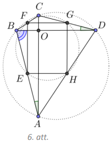

# <lo-sample/> LV.NOL.2016.12.4

Ķērpjbārdis, Puszābaks un Uzrocis spēlē novusu, pie tam tas, kurš zaudē 
partiju, atdod savu vietu tam, kurš iepriekšējo partiju nespēlēja. Beigās 
izrādīās, ka Ķērpjbārdis ir uzvarējis $10$ partijās, Puszābaks - $12$, bet 
Uzrocis - $14$ partijās. Cik partijas izspēlēja katrs no viņiem?

<small>

* questionType:
* domain:

</small>

## Atrisinājums

Tā kā katrā partijā ir tieši viens uzvarētājs, tad kopā tika izspēlētas 
$10+12+14=36$ partijas. Aplūkosim jebkuru spēlētāju un apzīmēsim ar $z$ tā 
zaudēto partiju skaitu un ar $n$ to partiju skaitu, kurā viņš nespēlēja. Pēc 
katras zaudētas partijas nāk partija, kurā viņš nespēlē, izņemot varbūt pēdējo 
partiju, tātad $z \leq n+1$. Un arī otrādi - pirms katras nespēlētas partijas 
ir zaudēta partija, izņemot varbūt pašu pirmo, tātad $n \leq z+1$. Līdz ar to 
$-1 \leq z-n \leq 1$. Ķērpjbārdis neuzvarēja $36-10=26$ partijās, viņam 
$z+n=26$. Tā kā $26$ ir pāra skaitlis, tad $z$ un $n$ ir ar vienādu paritāti un
gadījumi $z-n= \pm 1$ nav iespējami, tātad atliek $z-n=0$, no kā izriet, ka 
$z=n=13$, tātad viņš piedalijās $z+10=23$ partijās. Analogi Puszābakam 
$z+n=24$, tātad viņam $z=n=12$, un $z+12=24$ partijas, kurās viņš spēlēja, 
Uzrocim $z+n=22$, tātad viņam $z=n=11$ un $z+14=25$ partijas. Esam ieguvuši, ka
Ķērpjbārdis izspēlēja $23$ partijas, Puszābaks - $24$ partijas, bet Uzrocis - 
$25$ partijas.

# <lo-sample/> LV.NOL.2016.12.5

Kurš skaitlis ir lielāks: $\log _{2015} 2016$ vai $\log _{2016} 2017$?

<small>

* questionType:
* domain:

</small>

## Atrisinājums

Pamatosim, ka lielāks ir skaitlis $\log _{2015} 2016$.

Pierādīsim vispārīgu apgalvojumu: ja $x < y$, tad 
$\log _{x}(x+1)>\log _{y}(y+1)$.

Aplūkosim funkciju $f(x)=\log _{x}(x+1)$ intervālā $x \in(1,+\infty)$ un 
pierādīsim, ka tā šajā intervālā ir dilstoša. Varam pārveidot

$$f(x)=\log _{x}\left(\frac{(x+1) \cdot x}{x}\right)=\log _{x}\left(\frac{x+1}{x}\right)+1=1+\log _{x}\left(1+\frac{1}{x}\right)=1+\frac{\lg \left(1+\frac{1}{x}\right)}{\lg x}$$

Ja $x < y$, tad $1+\frac{1}{x}>1+\frac{1}{y}$, tātad arī 
$\lg \left(1+\frac{1}{x}\right)>\lg \left(1+\frac{1}{y}\right)$, jo 
logaritmiskā funkcija pie bāzes $10$ ir augoša funkcija. Šī paša iemesla dēļ 
arī $\lg x<\lg y$, tātad arī

$$1+\frac{\lg \left(1+\frac{1}{x}\right)}{\lg x}>1+\frac{\lg \left(1+\frac{1}{y}\right)}{\lg y}$$

kas nozīmē, ka $f(x) > f(y)$, ja $x < y$.

