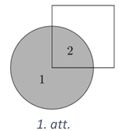
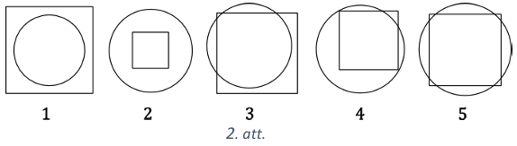
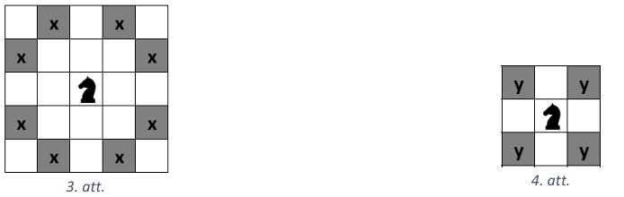
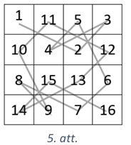
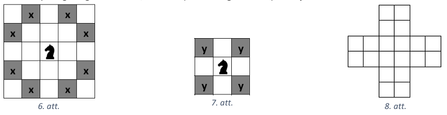
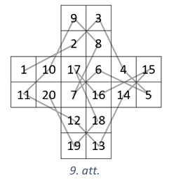
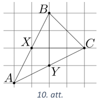
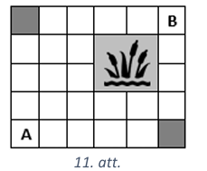
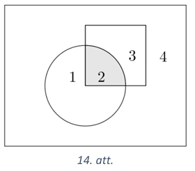
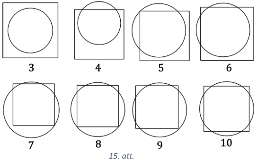

# <lo-sample/> LV.NOL.2017.5.1

Uz autoceļa "Brauc un piesprādzējies" ir trīs braukšanas joslas. Pa pirmo joslu
jābrauc ar ātrumu no $50$ līdz $70$ kilometriem stundā, pa otro joslu - ar
ātrumu no $90$ līdz $110$ kilometriem stundā, bet pa trešo - ar ātrumu no $120$
līdz $140$ kilometriem stundā.

Autovadītājs brauc pa autoceļa "Brauc un piesprādzējies" vienu noteiktu joslu un
ievēro, ka uz odometra (ierīce, kas rāda nobrauktā ceļa garumu kilometros)
displeja redzams rādījums

$15951$

Autovadītājs, ievērojot šo simetrisko skaitli, kas vienādi lasāms gan no labās,
gan kreisās puses, nolēma pēc divām stundām atkal aplūkot displeju.

Izrādījās, ka displejā atkal bija redzams simetrisks skaitlis. Pa kuru joslu vai
joslām noteikti nebrauca autovadītājs?

<small>

* questionType:
* domain:

</small>

## Atrisinājums

Apskatām, kādi ir nākamie simetriskie skaitļi, ko var redzēt odometra displejā.

- Pēc skaitļa $15951$ var redzēt skaitli $16061$. Šajā gadījumā autovadītājs
  divās stundās ir nobraucis $16061-15951=110 \mathrm{~km}$, tas ir iespējams,
  ja brauc pa pirmo joslu, piemēram, ar ātrumu $55 \mathrm{~km} / \mathrm{h}$.
- Pēc skaitļa $16061$ var redzēt skaitli $16161$. Šajā gadījumā autovadītājs
  divās stundās ir nobraucis $16161-15951=210 \mathrm{~km}$, tas ir iespējams,
  ja brauc pa otro joslu, piemēram, ar ātrumu $105 \mathrm{~km} / \mathrm{h}$.

- Pēc skaitļa $16161$ var redzēt skaitli $16261$. Šajā gadījumā autovadītājs
  divās stundās būtu nobraucis $16261-15951=310 \mathrm{~km}$. Pat braucot ar
  vislielāko atlauto ātrumu $140 \mathrm{~km} / \mathrm{h}$ divās stundās var
  nobraukt tikai $140 \cdot 2=280 \mathrm{~km}$, kas ir mazāk nekā $310$ km.

Ja autovadītājs brauktu pa trešo joslu ar mazāko iespējamo ātrumu
$120 \mathrm{~km} / \mathrm{h}$, tad divās stundās viņš nobrauktu $240$ km, bet
$15951+240=16191$, kas ir vairāk nekā $16161$. Tātad autovadītājs noteikti
nebrauca pa trešo joslu.

# <lo-sample/> LV.NOL.2017.5.2

Skaitlim $2016201620172017$ izsvītroja vienu vai vairākus ciparus tā, ka 
iegūtais skaitlis dalās ar $3$. Kādu lielāko skaitli varēja iegūt?

<small>

* questionType:
* domain:

</small>

## Atrisinājums

Lielākais skaitlis, kādu var iegūt, ir $201620162017017$. Pamatosim, ka lielāku
skaitli nevar iegūt. Lai iegūtu lielāko skaitli, jāizsvītro pēc iespējas mazāk
cipari. Lai skaitlis dalītos ar 3, tā ciparu summai jādalās ar $3$. Dotā skaitļa
ciparu summa ir $38$. Vienīgā iespēja izsvītrot vienu ciparu, lai iegūtā skaitļa
ciparu summa un tātad arī pats skaitlis dalītos ar $3$, ir izsvītrot ciparu $2$.
No četriem skaitļiem, ko var iegūt, izsvītrojot divnieku ($16201620172017$,
$201601620172017$, $201620160172017$, $201620162017017$), lielākais ir
$201620162017017$.

# <lo-sample/> LV.NOL.2017.5.3

Krokodils, lauva, tīģeris un gepards iztiku sev sagādā, medījot antilopes. Katrs
no tiem vienā dienā var nomedīt vienu antilopi, ar to, neskaitot medību dienu,
krokodilam pietiek vēl vienai dienai, lauvam - vēl divām dienām, tīģerim - vēl
trim dienām, bet gepardam - vēl četrām dienām. Katrs no tiem nākamajā dienā pēc
tam, kad ir apēdis savu antilopi, atkal dodas medībās. Zināms, ka $2017.$ gada
$17.$ februārī tie visi bija devušies medībās. Kurš būs nākamais tuvākais datums,
kad tie visi reizē atkal dosies medībās?

<small>

* questionType:
* domain:

</small>

## Atrisinājums

Skaidrs, ka krokodils dodas medībās katru otro dienu, lauva - katru trešo,
tīģeris - katru ceturto, bet gepards - katru piekto dienu. Pēc $n$ dienām
krokodils dosies medībās, ja $n$ dalīsies ar $2$, lauva - ja $n$ dalīsies ar $3$,
tīģeris - ja $n$ dalīsies ar $4$, un gepards - ja $n$ dalīsies ar $5$ . Tātad,
ja tie visi kopā
atkal dosies medībās pēc $n$ dienām, tad $n$ jādalās gan ar $2$, gan ar $3$, gan
ar $4$, gan ar $5$. Mazākais šāds $n$ ir šo četru skaitļu mazākais kopīgais
dalāmais, kas ir $60$. Tātad visi reizē atkal dosies medībās pēc $60$ dienām,
tas ir, $2017.$ gada $18.$ aprīlī.

# <lo-sample/> LV.NOL.2017.5.4

Zane uz papīra lapas uzzīmēja riņķa līniju un kvadrātu (tā, ka neviens no tiem
nepieskaras lapas malai), izkrāsoja riņķi pelēku un tad sagrieza lapu pa to
kontūriem. Cik pelēkas daļas viņa šādi varēja iegūt? Atrodi visus variantus,
nav jāpamato, ka citu nav! Vienu piemēru, kā var iegūt $2$ pelēkas daļas,
skat. 1.att.

<small>

* questionType:
* domain:

</small>

## Atrisinājums

Var iegūt $1, 2, 3, 4$ vai $5$ pelēkas daļas, skat., piemēram, 2.att.

# <lo-sample/> LV.NOL.2017.5.5

Šaha zirdziņš ir sasitis kāju, tāpēc viņš veic vienu garu lēcienu (tas ir, no
tās rūtiņas, kurā stāv zirdziņš, viņš var aizlēkt uz jebkuru rūtiņu, kas
atzīmēta ar "x", skat. 3.att.) un vienu īsu lēcienu (tas ir, no tās rūtiņas,
kurā stāv zirdziņš, viņš var aizlēkt uz jebkuru rūtiņu, kas atzīmēta ar " $y$ ",
skat. 4.att.). Parādi, kā klibais zirdziņš var apstaigāt šaha galdiņu ar
izmēriem $4 \times 4$ lauciņi, pamīšus izpildot vienu garu lēcienu, vienu īsu
lēcienu, vienu garu lēcienu, vienu īsu lēcienu, .. !

*Piezīme.* Apstaigāt galdiņu nozīmē, ka zirdziņš katrā šaha galdiņa lauciņā ir
bijis tieši vienu reizi.

<small>

* questionType:
* domain:

</small>

## Atrisinājums

Šaha galdiņu ar izmēriem $4 \times 4$ lauciņus var apstaigāt, piemēram, kā
parādīts 5.att.

# <lo-sample/> LV.NOL.2017.6.1

Veikalā "Kartupelis un apelsīns" ir jauns norēķinu veids, lietojot kases aparātu
"Runā un maksā". Pircējs mikrofonā pasaka, ko un cik daudz vēlas iegādāties, un
tad kases aparāts izdrukā čeku, kuru ir jāapmaksā. Pircējs saka: "Vēlos samaksāt
par $1~\mathrm{kg}$ apelsīnu (cena $0,90 € / \mathrm{kg}$ ), $2~\mathrm{kg}$
banānu (cena $0,60 € / \mathrm{kg}$ ) un trīs vienādiem dzērveņu želejkonfekšu
iepakojumiem, kuru cenu neatceros.

Kases aparāts izdrukā čeku par $€ 5,30$.

Pircējs nav ar mieru un lūdz pārrēķināt. Tik tiešām - jaunajā čekā ir cita
summa. Kā var noteikti zināt, ka pirmais čeks bija kļūdains?

<small>

* questionType:
* domain:

</small>

## Atrisinājums

Par $1~\mathrm{kg}$ apelsīnu un $2~\mathrm{kg}$ banānu pircējam kopā jāmaksā
$1 \cdot 0,90+2 \cdot 0,60=2,10$ eiro. Līdz ar to par $3$ vienādiem dzērveņu
želejkonfekšu iepakojumiem būtu jāmaksā $5,30-2,10=3,20$ eiro jeb $320$ centi.
Tā kā $320$ nedalās ar $3$, tad pirmais čeks noteikti bija kļūdains.

# <lo-sample/> LV.NOL.2017.6.2

Skaitlim $201720182019$ izsvītroja vienu vai vairākus ciparus tā, ka iegūtais
skaitlis dalās ar $9$. Kādu lielāko skaitli varēja iegūt?

<small>

* questionType:
* domain:

</small>

## Atrisinājums

Lielākais skaitlis, kādu var iegūt, ir $2012012019$. Pamatosim, ka lielāku
skaitli nevar iegūt. Lai iegūtu lielāko skaitli, jāizsvītro pēc iespējas mazāk
cipari. Lai skaitlis dalītos ar $9$, tā ciparu summai jādalās ar $9$. Dotā
skaitļa ciparu summa ir $33$. Nav iespējams izsvītrot vienu ciparu, lai iegūtā
skaitļa ciparu summa dalītos ar $9$ . Vienīgā iespēja izsvītrot divus ciparus,
lai iegūtā skaitļa ciparu summa un tātad arī pats skaitlis dalītos ar $9$, ir
izsvītrot ciparus $7$ un $8$ .

# <lo-sample/> LV.NOL.2017.6.3

Šaha zirdziņš ir sasitis kāju, tāpēc viņš veic vienu garu lēcienu (tas ir, no
tās rūtiņas, kurā stāv zirdziņš, viņš var aizlēkt uz jebkuru rūtiņu, kas
atzīmēta ar " $x$ ", skat. 6.att.) un vienu īsu lēcienu (tas ir, no tās rūtiņas,
kurā stāv zirdziņš, viņš var aizlēkt uz jebkuru rūtiņu, kas atzīmēta ar "y",
skat. 7.att.). Vai zirdziņš var apstaigāt 8.att. doto figūru, pamīšus izpildot
vienu garu lēcienu, vienu īsu lēcienu, vienu garu lēcienu, vienu īsu
lēcienu, .... ?

*Piezīme.* Apstaigāt figūru nozīmē, ka zirdziņš katrā figūras rūtiņā ir bijis
tieši vienu reizi.

<small>

* questionType:
* domain:

</small>

## Atrisinājums

Jā, zirdziņš var apstaigāt uzdevumā doto figūru, skat., piemēram, 9.att.

# <lo-sample/> LV.NOL.2017.6.4

Uz rūtiņu lapas uzzīmē tādu trijstūri $ABC$, lai vienlaicīgi izpildītos šādi
nosacījumi:

- visas trijstūra virsotnes atrodas rūtiņu krustpunktos;
- punkts $X$ ir nogriežņa $AB$ viduspunkts;
- punkts $Y$ ir nogriežņa $AC$ viduspunkts;
- nogriežņi $BY$ un $CX$ krustojoties veido $90^{\circ}$ lielu leņķi.

*Piezīme.* Nogriežņa viduspunkts ir tāds punkts, kas sadala nogriezni divos
vienāda garuma nogriežnoos.

<small>

* questionType:
* domain:

</small>

## Atrisinājums

Kā uzzīmēt trijstūri skat., piemēram, 10.att.

# <lo-sample/> LV.NOL.2017.6.5

Parkā aug liepas un ozoli. No visiem kokiem liepas ir $25 \%$, bet ozoli-
$75 \%$. Pavasara talkas pirmajā dienā skolēni parkā stādīja tikai liepas, kā
rezultātā dienas beigās ozolu īpatsvars parkā nokritās līdz $15\%$. Talkas
otrajā dienā skolēni parkā stādīja tikai ozolus, kā rezultātā dienas beigās
parkā izveidojās tāda pati koku proporcija ( $25 \%$ liepu un $75 \%$ ozolu),
kāda bija pirms talkas. Cik reizes parkā pieauga ozolu skaits pēc talkas beigām,
salīdzinot ar situāciju pirms tās?

<small>

* questionType:
* domain:

</small>

## Atrisinājums

Koku skaitu pirms talkas apzīmējam ar $x$, tad liepu skaits ir $\frac{1}{4} x$
un ozolu skaits ir $\frac{3}{4} x$. Pēc pirmās talkas dienas ozolu īpatsvars
samazinājās piecas reizes un tā kā tika stādītas tikai liepas, tad koku
kopskaits palielinājās piecas reizes, tas ir, pēc pirmās talkas dienas visu
koku skaits bija $5x$ ). Tātad pirmajā talkas dienā tika iestādītas
$5x-x=4x$ liepas un kopējais liepu skaits pēc talkas bija
$\frac{1}{4}x+4x=4 \frac{1}{4}x=\frac{17}{4}x$.

Pēc otrās talkas dienas ozolu skaits atkal ir trīs reizes lielāks nekā liepu
skaits, tātad ozolu skaits ir $\frac{17}{4} x \cdot 3=\frac{51}{4} x$. Tātad
ozolu skaits parkā pēc talkas beigām ir pieaudzis
$\frac{51}{4}x: \frac{3}{4}x=\frac{51 \cdot 4}{4 \cdot 3}=17$ reizes.

# <lo-sample/> LV.NOL.2017.7.1

Varde vienā lēcienā var pārvietoties vienu rūtiņu uz augšu vai vienu rūtiņu pa
labi. Cik dažādos veidos varde no rūtiņas $A$ var nokļut rūtiņā $B$
(skat. 11.att.)? Iekrāsotajās rūtiņās ir šķērslis, tajās varde neiet.

<small>

* questionType:
* domain:

</small>

## Atrisinājums

Pakāpeniski aprēķinām, cik veidos varde var nokļūt katrā rūtiņā. levērojam, ka
rūtiņā $X$ (skat. 12.att.) varde var nokļūt no rūtiņas $C$ vai $D$. Ja rūtiņā
$C$ varde var nokļūt $c$ veidos, bet rūtiņā $D$ tā var nokļūt $d$ veidos, tad
rūtiņā $X$ varde var nokļūt $c+d$ veidos. Tātad no rūtiņas $A$ rūtiņā $B$ varde
var nokļūt $19$ dažādos veidos (skat. 13.att.).

# <lo-sample/> LV.NOL.2017.7.2

Piecciparu skaitļa kas dalās ar $13$, pirmais cipars ir vienāds ar ceturto, bet
otrais - ar piekto. Kāds ir šī skaitļa trešais cipars? Atrodi visas iespējamās
vērtības un pamato, ka citu nav!

<small>

* questionType:
* domain:

</small>

## Atrisinājums

Doto piecciparu skaitli varam uzrakstīt kā $\overline{abcab}$. Pārveidojam šo
skaitli

$$\overline{abcab}=\overline{ab} \cdot 1000+c \cdot 100+\overline{ab}=1001 \cdot \overline{ab}+100c$$

Tā kā $1001$ dalās ar $13(1001:13=77)$, tad, lai viss skaitlis dalītos ar $13$,
arī saskaitāmajam $100c$ jādalās ar $13$. Tā kā $100$ un $13$ ir savstarpēji
pirmskaitļi, tad $c$ jādalās ar $13$, tas iespējams tikai tad, kad $c=0$.

# <lo-sample/> LV.NOL.2017.7.3

Zane uz papīra lapas uzzīmēja riņka līniju un kvadrātu (tā, ka neviens no tiem
nepieskaras lapas malai) un tad sagrieza lapu pa to kontūriem. Cik daļās var būt
sagriezta lapa? Atrodi visus variantus, nav jāpamato, ka citu nav! Vienu piemēru,
kā lapa var būt sagriezta $4$ daļās, skat. 14.att.

<small>

* questionType:
* domain:

</small>

## Atrisinājums

Lapa var būt sagriezta $3,4,5,6,7,8,9,10$ daļās, skat., piemēram, 15.att.

# <lo-sample/> LV.NOL.2017.7.4

Trijstūrī $ABC(AB < BC)$ novilkta bisektrise $BD$. Uz $BD$ izvēlēts tāds punkts
$F$, ka $\sphericalangle AFD=\sphericalangle ADF$, un uz $BC$ izvēlēts tāds
punkts $E$, ka $FE \| AC$. Pierādīt, ka $\sphericalangle B A F=\sphericalangle B E F!$

<small>

* questionType:
* domain:

</small>

## Atrisinājums

Apzīmējam $\sphericalangle A B F=\sphericalangle E B F=\beta$ un $\sphericalangle A F D=\sphericalangle A D F=\alpha$ un aprēķināsim $\sphericalangle B A F$ un $\sphericalangle B E F$. levērojam, ka $\sphericalangle A F B=180^{\circ}-\sphericalangle A F D=180^{\circ}-\alpha$ (blakuslenku summa ir $180^{\circ}$ ), tad no trijstūra $B A F$ iegūstam, ka $\sphericalangle B A F=180^{\circ}-\sphericalangle A B F-\sphericalangle A F B=180^{\circ}-\beta-\left(180^{\circ}-\alpha\right)=\alpha-\beta \quad$ (trijstūra iekšējo lenku summa ir $180^{\circ}$ ).

Līdzīgi iegūstam $\sphericalangle B D C=180^{\circ}-\sphericalangle A D F=180^{\circ}-\alpha$ un

$$
\sphericalangle D C B=180^{\circ}-\sphericalangle B D C-\sphericalangle D B C=180^{\circ}-\left(180^{\circ}-\alpha\right)-\beta=\alpha-\beta
$$

Tā kā $\sphericalangle B E F=\sphericalangle D C B$ (kāpš|u leņki pie paralēlām taisnēm), tāpēc arī $\sphericalangle B E F=\alpha-\beta$.

Līdz ar to esam ieguvuši, ka $\sphericalangle B A F=\sphericalangle B E F=\alpha-\beta$.

*Piezīme.* Prasīto var iegūt arī, pierādot, ka $\triangle A B F=\triangle E B F$ pēc pazīmes $\ell m \ell$.

# <lo-sample/> LV.NOL.2017.7.5

Kāds ir mazākais rūtiņu skaits, kas jāiekrāso $4 \times 4$ rūtiņu kvadrātā, lai neatkarīgi no tā, kuras divas rūtiņu rindas un divas rūtiņuu kolonnas tiktu izmestas, vismaz viena iekrāsotā rūtiņa paliktu neizmesta?

<small>

* questionType:
* domain:

</small>

## Atrisinājums

Mazākais skaits rūtiņu, kas jāiekrāso, ir 7. Tās var iekrāsot, piemēram, kā parādīts 17.att. Redzams, ka, izmetot jebkuras divas rindas, aizkrāsotas paliek vēl rūtiņas trīs dažādās kolonnās, tātad ar 2 kolonnu izmešanu visas atlikušās iekrāsotās rūtiņas izmest nevar.

17.att.

Pierādīsim, ka mazāk rūtiņu nevar iekrāsot, tas ir, ka sešas iekrāsotas rūtiņas vienmēr var izmest, izmetot divas rindas un divas kolonnas.

Ja kādā rindā ir 3 vai vairāk iekrāsotas rūtiņas, tad, izvēloties šo rindu, atliek vēl 3 vai mazāk rūtiņas, ko viegli izmest ar 3 gājieniem.

Ja nav tādas rindas, kurā ir 3 vai vairāk iekrāsotas rūtiņas, tad pēc Dirihlē principa noteikti ir rinda, kurā ir 2 iekrāsotas rūtiņas, izmetot to, paliek 3 rindas un 4 iekrāsotas rūtiņas, tātad atkal pēc Dirihlē principa ir vēl viena rinda, kurā ir 2 iekrāsotas rūtiņas. Izmetot arī to, atliek 2 iekrāsotas rūtinas, kuras var izmest, izmetot divas kolonnas.

# <lo-sample/> LV.NOL.2017.8.1

Slidotavai "Pa plānu ledu" ir taisnstūrveida forma un tās perimetrs ir 120 metri. Pie slidotavas vienas malas atrodas kvadrātveida laukums, kurā uzbūvēta slidu noma, bet pie blakus malas atrodas kvadrātveida stāvlaukums (skat. 18.att.). Stāvlaukuma platība ir par $1200 \mathrm{~m}^{2}$ lielāka nekā slidu nomas platība. Aprēķini slidotavas platību!

<small>

* questionType:
* domain:

</small>

## Atrisinājums

Slidu nomas malas garumu apzīmējam ar $x$, tad stāvlaukuma malas garums ir $60-x$. Slidu nomas platība ir $x^{2}$ un stāvlaukuma platība ir $(60-x)^{2}$. Līdz ar to iegūstam vienādojumu

$$
\begin{gathered}
(60-x)^{2}-x^{2}=1200 \\
3600-120 x+x^{2}-x^{2}=1200 \\
120 x=2400 \\
x=20
\end{gathered}
$$

Tātad slidotavas platība ir $x \cdot(60-x)=20 \cdot 40=800 \mathrm{~m}^{2}$.

# <lo-sample/> LV.NOL.2017.8.2

Ja no piecciparu skait!a, kam pirmais cipars vienāds ar ceturto, bet otrais - ar piekto, atnem vieninieku tad iegūtais skaitlis dalās ar 11. Kāds var būt sākotnējā piecciparu skait!̣a trešais cipars? Atrodi visus iespējamos variantus un pamato, ka citu nav!

<small>

* questionType:
* domain:

</small>

## Atrisinājums

Doto piecciparu skaitli varam uzrakstīt kā $\overline{a b c a b}$. Pārveidojam šo skaitli

$\overline{a b c a b}-1=\overline{a b} \cdot 1000+c \cdot 100+\overline{a b}-1=\overline{a b} \cdot 1001+100 c-1=\overline{a b} \cdot 1001+99 c+c-1$.

Tā kā 1001 dalās ar $11(1001: 11=91)$ un 99 dalās ar 11 , tad, lai viss skaitlis dalītos ar 11, arī $c-1$ jādalās ar 11. Tas iespējams tikai tad, ja $c=1$.

# <lo-sample/> LV.NOL.2017.8.3

a) Parādi, kā šaha zirdziņš var apstaigāt šaha galdiņu ar izmēriem $5 \times 5$ lauciņi! Vienā lēcienā no tās rūtinas, kurā stāv zirdziņš, tas var aizlēkt uz jebkuru rūtiņu, kas atzīmēta ar "x", skat. 19.att.

b) Šaha zirdziņš ir sasitis kāju, tāpēc tas veic vienu garu lēcienu (skat. 19.att.) un vienu īsu lēcienu (no tās rūtinas, kurā stāv zirdziņš, tas var aizlēkt uz jebkuru rūtiņu, kas atzīmēta ar "y", skat. 20.att.). Vai klibais zirdziņš var apstaigāt šaha galdiņu izmēriem $5 \times 5$ laucini, pamǐšus izpildot vienu garu lēcienu, vienu īsu lēcienu, vienu garu lēcienu, vienu īsu lēcienu, ....?

*Piezīme.* Apstaigāt galdiņu nozīmē, ka zirdziņš katrā šaha galdina lauciņā ir bijis tieši vienu reizi.

<small>

* questionType:
* domain:

</small>

## Atrisinājums

a) Šaha zirdziņš galdiņu var apstaigāt tā, kā parādīts, piemēram, 21.att.

| 1 | 14 | 9 | 20 | 3 |
| :---: | :---: | :---: | :---: | :---: |
| 24 | 19 | 2 | 15 | 10 |
| 13 | 8 | 25 | 4 | 21 |
| 18 | 23 | 6 | 11 | 16 |
| 7 | 12 | 17 | 22 | 5 |

21.att.

22.att.

b) Pierādīsim, ka klibais zirdziņš nevar apstaigāt šaha galdiņu ar izmēriem $5 \times 5$ laucini.

Pieņemsim pretējo, ka zirdziņam šādā veidā ir izdevies apstaigāt laukumu. Aplūkosim tikai zirdziņa īsos gājienus, savienosim ar līniju katrus divus lauciņu centrus, starp kuriem zirdziņš veic īso gājienu. Starta lauciņš (no kura zirdziņš sāk) šajā gadījumā paliek nesavienots, pārējie 24 laucini ir pa pāriem savienoti. Aplūkosim ar "x" atzīmētos lauciņus (skat. 22.att.), tādi ir 9, tātad vismaz 8 no tiem būs savienoti ar līniju ar kādu citu lauciņu, bet līnija (īsais gājiens) no tiem var iet tikai uz ar "o" apzīmēto lauciņu, kādi ir tikai 4. Tātad kāds no ar "o" apzīmētajiem lauciņiem būs savienots ar līniju ar vairāk nekā vienu laucinu pretruna.

# <lo-sample/> LV.NOL.2017.8.4

Uz kvadrāta $A B C D$ malām atzīmēti punkti $E, F, G$ un $H$ tā, ka $\frac{A E}{E B}=\frac{B F}{F C}=\frac{C G}{G D}=\frac{D H}{A H}=9$. Aprēkināt iekrāsotās daļas (skat. 23.att.) laukuma attiecību pret $A B C D$ laukumu!

23.att.

<small>

* questionType:
* domain:

</small>

## Atrisinājums

Apzīmējam $E B=x$, tad $E B=C F=D G=A H=x$ un $A E=B F=C G=D H=9 x$ (skat. 24.att.). Kvadrāta $A B C D$ malas garums ir $10 x$ un $S(A B C D)=100 x^{2}$

Tā kā trijstūri $H A E, E B F, F C G$ un $G D H$ ir vienādi pēc pazīmes $m \ell m$, tad $H E=E F=F G=G H$. Tā kā $\sphericalangle H E F=180^{\circ}-(\sphericalangle A E H+\sphericalangle B E F)=180^{\circ}-(\sphericalangle A E H+\sphericalangle A H E)=180^{\circ}-90^{\circ}=90^{\circ}$, tad četrstūris $E F G H$ ir kvadrāts, kura laukums ir

$$
S(E F G H)=S(A B C D)-4 \cdot S(H A E)=100 x^{2}-4 \cdot \frac{1}{2} \cdot x \cdot 9 x=82 x^{2}
$$

lekrāsotās daļas laukums ir puse no kvadrāta $E F G H$ laukuma, tātad tas ir $41 x^{2}$. Tātad iekrāsotās daļas laukuma attiecība pret kvadrāta $A B C D$ laukumu ir $\frac{41 x^{2}}{100 x^{2}}=\frac{41}{100}$.

# <lo-sample/> LV.NOL.2017.8.5

Divi septītās klases skolēni un vairāki astotās klases skolēni piedalījās skolas šaha turnīrā. Turnīrā katrs dalībnieks ar katru izspēlēja vienu partiju. Katrā partijā par uzvaru dalībniekam tika pieškirts viens punkts, par neizškirtu katrs dalībnieks saņēma 0,5 punktus, bet par zaudējumu punkti netika pieškirti. Turnīra beigās septītās klases skolēni kopā bija ieguvuši 8 punktus, bet visi astotās klases skolēni bija ieguvuši vienādu punktu skaitu. Cik astotās klases skolēni piedalijās turnīrā? Atrodi visus iespējamos variantus un pamato, ka citu nav!

<small>

* questionType:
* domain:

</small>

## Atrisinājums

Ar $n$ apzīmējam astotās klases skolēnu skaitu, kas piedalījās turnīrā un ar $x$ - punktu skaitu, ko ieguva katrs astotās klases skolēns. Tātad turnīrā kopā piedalījās $n+2$ skolēni un tā kā katrs dalībnieks ar katru izspēlēja vienu partiju, tad kopējais spēlu un arī punktu skaits ir $\frac{(n+2)(n+1)}{2}$. Astotās klases skolēni kopā ieguva

$$
n x=\frac{(n+2)(n+1)}{2}-8
$$

punktus. Reizinot abas vienādojuma puses ar 2 , iegūstam

$$
\begin{gathered}
2 n x=(n+2)(n+1)-16 \\
2 n x=n^{2}+3 n-14
\end{gathered}
$$

Dalot abas vienādojuma puses ar $n$, iegūstam

$$
\begin{array}{r}
2 x=\frac{n^{2}}{n}+\frac{3 n}{n}-\frac{14}{n} \\
2 x=n+3-\frac{14}{n}
\end{array}
$$

Tā kā $2 x$ ir vesels skaitlis, tad $n$ ir jābūt skaitļa 14 dalītājam, tas ir, $n$ iespējamās vērtības ir $1 ; 2 ; 7 ; 14$. Apskatām visus gadījumus.

- Ja $n=1$, tad $2 x=1+3-14=-10$, kas nav iespējams, jo punktu skaits nevar būt negatīvs.
- Ja $n=2$, tad $2 x=2+3-7=-2$, kas nav iespējams, jo punktu skaits nevar būt negatīvs.
- Ja $n=7, \operatorname{tad} 2 x=7+3-2=8$ jeb $x=4$.
- Ja $n=14, \operatorname{tad} 2 x=14+3-1=16$ jeb $x=8$.

Tātad turnīrā piedalījās 7 vai 14 astotās klases skolēni. Parādīsim, ka abi šie gadījumi ir iespējami.

- Ja turnīrā piedalījās 7 astotās klases skolēni, tad turnīrā kopā piedalījās 9 skolēni un katrs izspēlēja 8 spēles. Piemēram, ja visas spēles beidzās neizškirti, tad katrs turnīra dalībnieks izcīnīja 4 punktus, kas atbilst uzdevuma nosacijumiem.
- Ja turnīrā piedalījās 14 astotās klases skolēni, tad doto turnīra rezultātu varēja panākt, piemēram, sekojošā veidā, kur ar A un B apzīmēti 7. klases skolēni:
- spēle starp A un B beidzās neizškirti;
- visas spēles starp 8. klases skolēniem beidzās neizškirti;
- septini 8. klases skolēni uzvarēja A, bet spēlēja neizškirti ar B;
- otri septinii 8. klases skolēni uzvarēja $B$, bet spēēēja neizškirti ar $A$.

Šajā gadijumā abiem 7. klases skolēniem ir 4 punkti (8 neizškirti), bet visiem 8. klases skolēniem ir 8 punkti (14 neizškirti un viena uzvara).

I E G U L D Ī J U M S T A V Ā N Ā K O T N Ē

# <lo-sample/> LV.NOL.2017.9.1

Koka sija sver 90 kg , bet par 2 m garāka dzelzs sija sver 160 kg , pie tam viens metrs dzelzs sijas sver par 5 kilogramiem vairāk nekā viens metrs koka sijas. Cik sver viens metrs katras sijas?

<small>

* questionType:
* domain:

</small>

## Atrisinājums

Koka sijas garumu apzīmējam ar $x$, bet dzelzs sijas garumu - ar $x+2$. Tad viens metrs koka sijas sver $\frac{90}{x} \mathrm{~kg}$, bet viens metrs dzelzs sijas sver $\frac{160}{x+2} \mathrm{~kg}$. Tā kā viens metrs dzelzs sijas sver par 5 kilogramiem vairāk nekā viens metrs koka sijas, tad iegūstam vienādojumu $\frac{160}{x+2}-\frac{90}{x}=5$.

Tā kā $x$ un $x+2$ ir siju garumi, tad $x>0$ un $x+2>0$. Vienādojuma abas puses reizinot ar $x(x+2)>0$, iegūstam

$$
\begin{aligned}
160 x-90(x+2) & =5 x(x+2) \\
32 x-18(x+2) & =x(x+2) \\
32 x-18 x-36 & =x^{2}+2 x \\
x^{2}-12 x+36 & =0
\end{aligned}
$$

Līdz ar to esam ieguvuši, ka $x_{1}=x_{2}=6$.

Tātad viens metrs koka sijas sver $90: 6=15 \mathrm{~kg}$ un viens metrs dzelzs sijas sver $160: 8=20 \mathrm{~kg}$.

# <lo-sample/> LV.NOL.2017.9.2

Pierādīt, ka $9 x^{6}-x^{3}+1>0$ visiem reāliem $x$.

<small>

* questionType:
* domain:

</small>

## Atrisinājums

Veicam ekvivalentus pārveidojumus:

$$
\begin{gathered}
\left(3 x^{3}\right)^{2}-2 \cdot 3 x^{3} \cdot \frac{1}{6}+\left(\frac{1}{6}\right)^{2}+\frac{35}{36}>0 \\
\left(3 x^{3}-\frac{1}{6}\right)^{2}+\frac{35}{36}>0
\end{gathered}
$$

Tā kā skaitļa kvadrāts ir nenegatīvs un $\frac{35}{36}$ ir pozitīvs skaitlis, tad pēdējā nevienādība ir patiesa. Tā kā tika veikti ekvivalenti pārveidojumi, tad arī dotā nevienādība ir patiesa visiem reāliem skaitliem $x$.

## Atrisinājums

Reizinām nevienādības abas puses ar 2 un veicam ekvivalentus pārveidojumus:

$$
\begin{gathered}
18 x^{6}-2 x^{3}+2>0 \\
x^{6}-2 x^{3}+1+17 x^{6}+1>0 \\
\left(x^{3}-1\right)^{2}+17 x^{6}+1>0
\end{gathered}
$$

Tā kā skaitļa kvadrāts ir nenegatīvs, saskaitāmais $17 x^{6}$ ir nenegatīvs un skaitlis 1 ir pozitīvs skaitlis, tad pēdējā nevienādība ir patiesa. Tā kā tika veikti ekvivalenti pārveidojumi, tad arī dotā nevienādība ir patiesa visiem reāliem skaitlliem $x$.

# <lo-sample/> LV.NOL.2017.9.3

Trapeces $A B C D$ pamatu attiecība $B C: A D=3: 5$. Uz sānu malas $C D$ atlikts punkts $E$ tā, ka nogrieznis $A E$ dala trapeces laukumu uz pusēm. Kādā attiecībā punkts $E$ sadala sānu malu $C D$ ?

<small>

* questionType:
* domain:

</small>

## Atrisinājums

Tā kā $B C: A D=3: 5$, tad $S(A B C): S(A C D)=3: 5$, jo šiem trijstūriem ir vienādi augstumi, kas sakrīt ar trapeces augstumu (skat. 25.att.). Tātad $S(A B C)=3 x$ un $S(A C D)=5 x$. Tad $S(A B C D)=S(A B C)+S(A C D)=3 x+5 x=8 x$. Tā kā nogrieznis $A E$ dala trapeces laukumu uz pusēm, $\operatorname{tad} S(A B C E)=4 x$ un $S(A E D)=4 x$. Līdz ar to $S(A C E)=S(A C D)-S(A E D)=5 x-4 x=x$. Tātad
$S(A C E): S(A E D)=1: 4$. Tā kā šiem trijstūriem ir kopīgs augstums (no punkta $A$ ), tad $C E: E D=1: 4$ jeb punkts $E$ dala malu $C D$ attiecībā $1: 4$.

# <lo-sample/> LV.NOL.2017.9.4

Naturālu skaitli sauksim par pārdabisku, ja, tā ciparus uzrakstot pretējā secībā, iegūst skaitli, kas ir lielāks nekā sākotnējais skaitlis, un iegūtais skaitlis dalās ar sākotnējo skaitli. Mazākais pārdabiskais skaitlis ir 1089, jo $9801: 1089=9$. Atrast vēl divus citus pārdabiskus skait!us!

<small>

* questionType:
* domain:

</small>

## Atrisinājums

Var ievērot, ka, pierakstot pārdabiskam skaitlim galā pašam sevi, arī iegūst pārdabisku skaitli, tāpēc der, piemēram, skaitli 10891089 un 108910891089, jo 98019801:10891089 = 9 un $980198019801: 108910891089=9$.

*Piezīme.* Pārdabisku skait|u ir bezgalīgi daudz (skat. 12.3. pierādījumu), nākamie mazākie ir 2178; 10989; 21978; 109989; 219978; 1099989; 2199978; 10891089; 10999989; 21782178; 21999978.

# <lo-sample/> LV.NOL.2017.9.5

a) Pierādīt, ka starp 1010 dažādiem naturāliem skaitļiem, no kuriem neviens nepārsniedz 2017, vienmēr iespējams izvēlēties trīs skait|us tā, ka divu izvēlēto skait|u summa ir vienāda ar trešo skaitli!

b) Vai šāda īpašība ir spēkā arī 1009 dažādiem naturāliem skaitlliem, kas nepārsniedz 2017?

<small>

* questionType:
* domain:

</small>

## Atrisinājums

a) Lielāko starp izvēlētajiem skaitliem apzīmējam ar $x$ un pierādīsim, ka var atrast divus citus skait!us, kuru summa ir $x$.

Visus skait|us, kas mazāki nekā $x$, sadalām pāros tā, ka vienā pārī esošo skait|u summa ir $x$ :

1) ja $x$ ir nepāra skaitlis jeb $x=2 n+1$, tad tie sadalās $n$ pāros

$$
(1 ; 2 n),(2 ; 2 n-1), \ldots,(n ; n+1)
$$

2) ja $x$ ir pāra skaitlis jeb $x=2 n$, tad tie sadalās $n-1$ pāros

$$
(1 ; 2 n-1),(2 ; 2 n-2), \ldots,(n-1 ; n+1)
$$

skaitlim $n$ pāra nav, to atstāsim vienu pašu.

Tā kā $x \leq 2017$, tad abos gadījumos $n \leq 1008$.

Tā kā ir izvēlēti 1009 skaitlli, kas mazāki nekā $x$, tad pēc Dirihlē principa vismaz divi no tiem būs no viena pāra, kas summā dod $x$, tie arī būs trīs meklētie skaitli.

b) Savukārt 1009 dažādiem skaitļiem, kas nepārsniedz 2017, minētā īpašība nav spēkā. Ja izvēlamies visus nepāra skaitlus no 1 līdz 2017, tad izvēlēti ir 1009 skaitļi, no kuriem nekādi divi summā nedod citu skaitli no šī komplekta, jo divu nepāra skaitlu summa vienmēr ir pāra skaitlis.

*Piezīme.* Alternatīvi varam izvēlēties 1009 lielākos skait|us (no 1009 līdz 2017), tad jebkuru divu šādu skait|u summa būs lielāka nekā divu mazāko skaitlu summa, tas ir, $1009+1010=2019$, kas jau ir lielāka nekā vislielākais skaitlis 2017.

# <lo-sample/> LV.NOL.2017.10.1

Punkti $A$ un $B$ ir 16 km attālumā viens no otra, bet $B$ un $C-12 \mathrm{~km}$ attālumā. Šoseja $A-B-C$ punktā $B$ izveido taisnu leņki (skat. 26.att.). Ceļinieka ātrums pa šoseju ir $v \mathrm{~km} / \mathrm{h}$, bet pa lauku celu ātrums ir $c \mathrm{~km} / \mathrm{h}$. Ja ce!̣inieks dodas no $A$ uz $C$ pa šoseju (maršruts $A \rightarrow B \rightarrow C$ ), tad viņš nonāk galapunktā par 20 min ātrāk nekā ejot no $A$ uz $C$ pa lauku celu (maršruts $A \rightarrow C$ ). Ja turpretī viņš iet 11 km pa šoseju no $A$ uz $D$ un pēc tam uz $C$ pa lauku celu (maršruts $A \rightarrow D \rightarrow C$ ), tad viņš ceļā pavada 5 stundas un 5 minūtes. Aprēkināt $v$ un $c$ !

<small>

* questionType:
* domain:

</small>

## Atrisinājums

Izmantojot Pitagora teorēmu trijstūrī $A B C$, iegūstam $A C=20 \mathrm{~km}$ (skat. 27.att.). Tā kā $B D=A B-A D=16-11=5 \mathrm{~km}$, tad, lietojot Pitagora teorēmu trijstūrī $D B C$, iegūstam, ka $C D=13 \mathrm{~km}$.

No uzdevuma nosacījumiem iegūstam vienādojumu sistēmu:

$$
\left\{\begin{array}{l}
\frac{20}{c}-\frac{28}{v}=\frac{1}{3} \\
\frac{13}{c}+\frac{11}{v}=\frac{61}{12}
\end{array}\right.
$$

Reizinot sistēmas pirmo vienādojumu ar 11 un otro ar 28 , iegūstam

$$
\left\{\begin{array}{l}
\frac{220}{c}-\frac{308}{v}=\frac{11}{3} \\
\frac{364}{c}+\frac{308}{v}=\frac{427}{3}
\end{array}\right.
$$

Saskaitot abus vienādojumus, iegūstam $\frac{584}{c}=\frac{438}{3}$ jeb $c=4$.

levietojot iegūto $c$ vērtību pirmajā vienādojumā, aprēkinām otru nezināmo: $5-\frac{28}{v}=\frac{1}{3}$ jeb $v=6$.

Tātad ceļinieka ātrums pa šoseju $v=6 \mathrm{~km} / \mathrm{h}$, bet pa lauku viņa ātrums ir $c=4 \mathrm{~km} / \mathrm{h}$.

# <lo-sample/> LV.NOL.2017.10.2

Pierādīt, ka $x^{2}+2 y^{2}+2 x y+y+1>0$, ja $x, y$ - reāli skaitli!

<small>

* questionType:
* domain:

</small>

## Atrisinājums

Veicam ekvivalentus pārveidojumus:

$$
\begin{gathered}
\left(x^{2}+2 x y+y^{2}\right)+y^{2}+y+1>0 \\
(x+y)^{2}+\left(y^{2}+2 \cdot y \cdot \frac{1}{2}+\left(\frac{1}{2}\right)^{2}\right)+\frac{3}{4}>0 \\
(x+y)^{2}+\left(y+\frac{1}{2}\right)^{2}+\frac{3}{4}>0
\end{gathered}
$$

Tā kā skaitļa kvadrāts ir nenegatīvs un $\frac{3}{4}$ ir pozitīvs skaitlis, tad pēdējā nevienādība ir patiesa. Tā kā tika veikti ekvivalenti pārveidojumi, tad arī dotā nevienādība ir patiesa visiem reāliem skaitliem $x$ un $y$.

# <lo-sample/> LV.NOL.2017.10.3

Kvadrāta $A B C D$ diagonāles krustojas punktā $O$, punkts $E$ ir nogriežņa $A O$ viduspunkts. Taisne $B E$ krusto malu $A D$ punktā $F$, bet taisne $F O$ krusto malu $B C$ punktā $G$. Pierādīt, ka trijstūris $B F G$ ir vienādsānu!

<small>

* questionType:
* domain:

</small>

## Atrisinājums

Trijstūri $A E F$ un $C E B$ ir līdzīgi pēc pazīmes $\ell \ell$, jo $\sphericalangle A E F=\sphericalangle C E B$ kā krustleņki un $\sphericalangle F A E=\sphericalangle B C E$ kā iekšējie škērsleņki pie paralēlām taisnēm (skat. 28.att.). Tā kā $A E=O E$ un $A O=O C$, tad $E C=3 A E$ un līdz ar to trijstūru $C E B$ un $A E F$ līdzības koeficients $k=\frac{E C}{A E}=3$. Tātad $A F=x$ un $B C=3 x$

Trijstūri $A O F$ un $C O G$ ir vienādi pēc pazīmes $\ell m \ell$, jo $\sphericalangle O A F=\sphericalangle O C G$ (iekšējie škē̄rsleņki), $A O=O C$ un $\sphericalangle A O F=\sphericalangle C O G$ (krustleņki). Tāpēc $A F=C G=x$, no kā izriet, ka $B G=B C-C G=3 x-x=2 x$. Trijstūrī $B F G$ no punkta $F$ novelkam augstumu $F U$. levērojam, ka četrstūris $A B U F$ ir taisnstūris, tāpēc $A F=B U=x$ kā taisnstūra pretējās malas. Esam ieguvuši, ka $U G=B G-B U=2 x-x=x=B U$. Tātad $F U$ ir trijstūra $B F G$ mediāna. Tā kā $F U$ trijstūrī $B F G$ ir gan mediāna, gan augstums, tad trijstūris $B F G$ ir vienādsānu trijstūris, kas arī bija jāpierāda.

28.att.

29.att.

## Atrisinājums

Savienojam diagonāļu krustpunktu $O$ ar malas $A B$ viduspunktu $T$, nogriežña $O T$ krustpunktu ar $B E$ apzīmējam ar $P$ (skat. 29.att.). Tad $O T \| A D$, jo $O T$ ir trijstūra $A B D$ viduslīnija. Tā kā $O T$ un $B E$ ir trijstūra $A B O$ mediānas, tad $P O: T P=2: 1$. Apzīmējam kvadrāta $A B C D$ malas garumu ar a. Tad $T P=\frac{1}{3} O T=\frac{1}{3} \cdot \frac{1}{2} a=\frac{a}{6}$. Nogrieznis $T P$ ir trijstūra $A B F$ viduslīnija, tāpēc $A F=2 T P=\frac{a}{3}$. Trijstūri $A O F$ un $C O G$ ir vienādi pēc pazīmes $\ell m \ell$, jo $\sphericalangle O A F=\sphericalangle O C G$ (iekšējie škeērslenki.), $A O=O C$ un $\sphericalangle A O F=\sphericalangle C O G$ (krustlenki. . Tāpēc $G C=\frac{a}{3}$ un $B G=\frac{2 a}{3}$.

Savienojam punktu $F$ ar nogriežna $B G$ viduspunktu $U$, tad $F U$ ir trijstūra $B F G$ mediāna un $B U=U G=\frac{a}{3}$. Četrstūris $A B U F$ ir taisnstūris, jo $B U=A F=\frac{a}{3}$ un $B U \| A F$, un $\sphericalangle A B U$ ir taisns. Līdz ar to $F U$ ir trijstūra $B F G$ augstums. Tā kā $F U$ trijstūrī $B F G$ ir gan mediāna, gan augstums, tad trijstūris $B F G$ ir vienādsānu trijstūris, kas arī bija jāpierāda.

# <lo-sample/> LV.NOL.2017.10.4

Dots taisnstūris ar izmēriem $7 \times 5$ rūtinas. Griežot pa rūtiņu līnijām, tas sagriezts septinās vienlielās da!ās (katras dalas laukums ir 5 rūtinas). Noteikt, kāds ir mazākais iespējamais griezuma līiju kopgarums, pieņemot, ka rūtinas malas garums ir viena vienība!

<small>

* questionType:
* domain:

</small>

## Atrisinājums

Mazākais iespējamais griezuma līiju kopgarums ir 24 vienības, skat., piemēram, 30.att.

30.att.

Pierādīsim, ka nav iespējams iegūt mazāku griezuma līiju kopgarumu. Pieņemsim, ka taisnstūris ir sagriezts 7 dalās, kuru perimetri ir $P_{1}, P_{2}, \ldots, P_{7}$, un griezuma līniju kopgarums ir $L$. Aplūkojam summu $P_{1}+P_{2}+\ldots+P_{7}$. Šajā summā katrs griezuma posms ir ieskaitīts divas reizes, bet katras dalas ārmalas posms - vienu reizi. Tā kā taisnstūra perimetrs ir $(7+5) \cdot 2=24$, tad iegūstam $P_{1}+P_{2}+\ldots+P_{7}=2 L+24$ jeb $L=\frac{P_{1}+P_{2}+\ldots+P_{7}-24}{2}$. Tātad $L$ būs minimāls, ja perimetru summa būs vismazākā. Apskatīsim, kādas figūras, kuru laukums ir 5 rūtinas, var iegūt, griežot pa rūtiņu līnijām. Figūru, ko iegūst no pieciem vienības kvadrātiem, pievienojot tos vienu otram pa vesela garuma malām, sauc par pentamino. Pavisam ir 12 dažādi pentamino (skat. 31.att.).

31.att.

32.att.

33.att.

No visām pentamino figūrām mazākais perimetrs ir 32.att. dotajai figūrai un tas ir 10 vienības, pārējām figūrām perimetrs ir 12 .

Tagad pierādīsim, ka doto taisnstūri nevar sagriezt 7 šādās figūrās. lekrāsojam rūtinas, kā redzams 33.att., ievērojam, ka katra 32.att. figūriņa aizņem vismaz vienu iekrāsoto rūtiņu. Tad, ja būtu izdevies sagriezt taisnstūri 7 šādās figūras, tad būtu vajadzīgas vismaz 7 iekrāsotās rūtinas, bet ir tikai 6 , pretruna.

Tātad ir ne vairāk kā sešas 32.att. figūras un septītā figūra ir citādāka, turklāt tās perimetrs ir 12. Līdz ar to perimetru summa ir vismaz $6 \cdot 10+12=72$, un griezuma līniju garumu summa $L \geq \frac{72-24}{2}=24$.

# <lo-sample/> LV.NOL.2017.10.5

Desmitciparu skaitlī vienādus ciparus aizvietojot ar vienādiem burtiem, bet dažādus - ar dažādiem, ieguva vārdu MATEMĀTIKA (īsais "A" un garais "Ā" aizstāj atškirīgus ciparus). Papildus zināms, ka skaitlis $\overline{M A}$ dalās ar 2, $\overline{M A T}-\operatorname{ar} 3, \overline{M A T E}-$ ar 4, $\overline{\text { MATEM }}-$ ar 5, $\overline{\text { MATEMA }}-$ ar 6, $\overline{\text { MATEMĀT }}-$ ar 7, $\overline{\text { MATEMĀTI }}$ - ar 8, $\overline{\text { MATEMĀTIK }}$ - ar 9, $\overline{\text { MATEMĀTIKA }}$ - ar 10. Noteikt, kāds bija sākotnējais desmitciparu skaitlis!

<small>

* questionType:
* domain:

</small>

## Atrisinājums

Ja skaitlis dalās ar 10, tā pēdējais cipars ir 0 . Tātad $A=0$.

Ja skaitlis dalās ar 5 , tad tā pēdējais cipars ir vai nu 0 , vai 5 . Tā kā jau ieguvām, ka $A=0$, tad $M=5$. Apskatām skait|us $\overline{M A T}=\overline{50 T}$ un $\overline{M A T E M \bar{A}}=\overline{50 T E 5 \bar{A}}$. No dalāmības pazīmes ar 3 izriet, ka

$$
\begin{align*}
& 5+0+T \text { jādalās ar } 3  \tag{1}\\
& E+5+\bar{A} \text { jādalās ar } 3 \tag{2}
\end{align*}
$$

Tātad no (1) iegūstam, ka iespējamās $T$ vērtības ir 1; 4 vai 7. Lai skaitlis dalītos ar pāra skaitli, tad nepieciešams, lai skaitļa pēdējais cipars būtu pāra. Tā kā $\overline{M A T E}$ un $\overline{M A T E M \bar{A}}$ jādalās attiecīgi ar 4 un 6, tad $E$ un Ā ir jābūt pāra skaitliem un, nemot vērā (2), iegūstam, ka $E+\bar{A}$ iespējamās vērtības ir 4; 10 vai 16. Tā kā $E$ un Ā jābūt dažādiem pāra skaitļiem, tad iespējama ir tikai summa 10, un der varianti $2+8$; $4+6 ; 6+4 ; 8+2$

Tā kā $\overline{M A T E}$ jādalās ar 4, tad no dalāmības pazīmes ar 4 izriet, ka $\overline{T E}$ jādalās ar 4, un līdzīgi no dalāmības pazīmes ar 8 iegūstam, ka $\overline{\mathrm{A} T I}$ jādalās ar 8. Pārbaudām visus iespējamos variantus atkarībā no $T$ vērtības.

| $\boldsymbol{T}$ | $\boldsymbol{E}$ | $\overline{\mathrm{A}}$ |  |
| :--- | :--- | :--- | :--- |
| 1 | 2 | 8 | $I=6$ un, lai $\overline{M A T E M A \bar{A} I K}$ dalītos ar 9, tad $K$ būtu jābūt 8, kas neder, jo $\overline{\mathrm{A}}=8$. |
|  | 6 | 4 | Neder, jo 5016541 nedalās ar 7. |
| 4 | 8 | 2 | Neder, jo 5048524 nedalās ar 7. |
| 7 | 2 | 8 | Neder, jo 5072587 nedalās ar 7. |
|  | 6 | 4 | $I=2$ un $K=9$, līdz ar to sākotnējais skaitlis bija 5076547290. |

# <lo-sample/> LV.NOL.2017.11.1

Zināms, ka skait|u $a_{1} ; a_{2} ; a_{3}$ summa ir 105 un tie veido aritmētisko progresiju, bet skaitlii $a_{1} ; a_{2}$; $a_{3}+4$ veido ģeometrisko progresiju. Atrast visas iespējamās $a_{1} ; a_{2} ; a_{3}$ vērtības un pamatot, ka citu nav!

<small>

* questionType:
* domain:

</small>

## Atrisinājums

No aritmētiskās progresijas definīcijas izriet, ka $a_{2}=a_{1}+d$ un $a_{3}=a_{1}+2 d$, kur $d$ ir diference. Līdz ar to iegūstam vienādojumu

$$
\begin{gathered}
a_{1}+a_{1}+d+a_{1}+2 d=105 \\
3 a_{1}+3 d=105 \\
a_{1}+d=35 \\
a_{1}=35-d
\end{gathered}
$$

Tā kā $a_{1} ; a_{2} ; a_{3}+4$ veido ģeometrisko progresiju, tad izpildās vienādība $\frac{a_{2}}{a_{1}}=\frac{a_{3}+4}{a_{2}}$ jeb $a_{2}^{2}=a_{1}\left(a_{3}+4\right)$. Izsakot $a_{1}, a_{2}$ un $a_{3}$ ar $d$, iegūstam

$$
\begin{gathered}
(35-d+d)^{2}=(35-d)(35-d+2 d+4) \\
35^{2}=(35-d)(39+d) \\
d^{2}+4 d-35 \cdot 39+35^{2}=0 \\
d^{2}+4 d-35 \cdot 4=0 \\
d^{2}+4 d-140=0
\end{gathered}
$$

Izmantojot Vjeta teorēmu, iegūstam $d_{1}=10$ un $d_{2}=-14$

Līdz ar to esam ieguvuši, ka $a_{1}=25 ; a_{2}=35 ; a_{3}=45$ vai $a_{1}=49 ; a_{2}=35 ; a_{3}=21$

# <lo-sample/> LV.NOL.2017.11.2

Pierādīt, ka $x^{4}+2 x^{3} y+2 x y^{3}+y^{4} \geq 6 x^{2} y^{2}$, ja $x$ un $y$ ir reāli pozitīvi skaitli!

<small>

* questionType:
* domain:

</small>

## Atrisinājums

Veicam ekvivalentus pārveidojumus:

$$
\begin{gathered}
\left(x^{4}-2 x^{2} y^{2}+y^{4}\right)+2 x^{3} y+2 x y^{3}-4 x^{2} y^{2} \geq 0 \\
\left(x^{2}-y^{2}\right)^{2}+2 x y\left(x^{2}+y^{2}-2 x y\right) \geq 0 \\
\left(x^{2}-y^{2}\right)^{2}+2 x y(x-y)^{2} \geq 0
\end{gathered}
$$

Tā kā skait|a kvadrāts ir nenegatīvs un $x y>0$ pēc dotā, tad pēdējā nevienādība ir patiesa. Tā kā tika veikti ekvivalenti pārveidojumi, tad arī dotā nevienādība ir patiesa visiem pozitīviem skaitliem $x$ un $y$.

# <lo-sample/> LV.NOL.2017.11.3

Atrisināt naturālos skaitlos vienādojumu sistēmu:

$$
\left\{\begin{array}{l}
x+z=2017  \tag{1}\\
31 x z=y^{2}
\end{array}\right.
$$

<small>

* questionType:
* domain:

</small>

## Atrisinājums

No (2) izriet, ka $y$ jādalās ar 31 jeb

$$
y=31 t
$$

un, tātad arī kādam no reizinātājiem $x$ vai $z$ jādalās ar 31. Turklāt dalīties ar 31 var tikai viens no šiem skaitlliem, pretējā gadījumā no (1) iegūtu, ka 2017 dalās ar 31, bet tā nav. Tā kā 2017 ir pirmskaitlis, tad $x$ un $z$ nav kopīgu dalītāju. Dotā vienādojumu sistēma ir simetriska attiecībā pret $x$ un $z$, tāpēc pieņemsim, ka $x$ dalās ar 31, tas ir,

$$
\begin{equation*}
x=31 p \tag{4}
\end{equation*}
$$

(pienemot, ka $z$ dalās ar 31, visi spriedumi ir analogiski).

Izmantojot (3) un (4), no (2) iegūstam, ka $31 \cdot 31 p \cdot z=(31 t)^{2}$ jeb $p z=t^{2}$. Tā kā $p$ un $z$ nav kopīgu dalītāju, tad katram no skaitļiem $p$ un $z$ ir jābūt kāda naturāla skaitļa kvadrātam, tas ir, $p=p_{1}^{2}$ un $z=z_{1}^{2}$. Izmantojot (1) un (4), iegūstam $p=\frac{x}{31}=\frac{2017-z}{31}<\frac{2017}{31}$ jeb $p_{1}^{2}<\frac{2017}{31}<65$. Tātad $p_{1} \leq 8$.

Izveidojam tabulu, kurā analizējam visas iespējamās $p_{1}$ vērtības.

| $p_{1}$ | $p=p_{1}^{2}$ | $x=31 p$ | $z=2017-x$ | $z$ ir kvadrāts | Paskaidrojums |
| :---: | :---: | :---: | :---: | :---: | :---: |
| 1 | 1 | 31 | 1986 | nē | 1986 dalās ar 2, bet nedalās ar 4 |
| 2 | 4 | 124 | 1893 | nē | kvadrāta pēdējais cipars nevar būt 3 |
| 3 | 9 | 279 | 1738 | nē | kvadrāta pēdējais cipars nevar būt 8 |
| 4 | 16 | 496 | $1521=39^{2}$ | jā |  |
| 5 | 25 | 775 | 1242 | nē | kvadrāta pēdējais cipars nevar būt 2 |
| 6 | 36 | 1116 | 901 | nē | $30^{2}=900$ un $31^{2}=961$ |
| 7 | 49 | 1519 | 498 | nē | kvadrāta pēdējais cipars nevar būt 8 |
| 8 | 64 | 1984 | 33 | nē | kvadrāta pēdējais cipars nevar būt 3 |

Esam ieguvuši atrisinājumu $x=496, y=4836, z=1521$ un tā kā vienādojumu sistēma ir simetriska attiecībā pret $x$ un $z$, iegūstam otru atrisinājumu $x=1521, y=4836, z=496$.

# <lo-sample/> LV.NOL.2017.11.4

Četras riņka līnijas ārēji pieskaras tā, kā parādīts 34.att. Pierādīt, ka četrstūrim, ko veido riņka līniju pieskaršanās punkti, var apvilkt riņ̂ka līniju!

<small>

* questionType:
* domain:

</small>

## Atrisinājums

Riņka līniju pieskaršanās punktus apzīmējam $\operatorname{ar} A, B, C$ un $D$ (skat. 35.att.). Novelkam doto riņķa līniju kopīgās pieskares $A M$ un $B M$. Trijstūris $A M B$ ir vienādsānu, jo $A M=M B$ kā riņķa līnijas pieskaru nogriežņi, kas novilkti no punkta ārpus tās. Līdz ar to $\sphericalangle M A B=\sphericalangle M B A=\alpha$ kā leņki pie pamata vienādsānu trijstūrī. Līdzīgi iegūstam atlikušo leņku pāru vienādības.

levērojam, ka $\sphericalangle D A B+\sphericalangle A B C+\sphericalangle B C D+\sphericalangle C D A=2 \alpha+2 \beta+2 \gamma+2 \delta=360^{\circ}$, no kurienes iegūstam, ka $\alpha+\beta+\gamma+\delta=180^{\circ}$. Tā kā $\sphericalangle D A B+\sphericalangle B C D=\alpha+\beta+\gamma+\delta=180^{\circ}$, tad četrstūrim $A B C D$ var apvilkt rink, līniju, kas arī bija jāpierāda.

*Piezīme.* Leņku vienādību varēja pierādīt arī izmantojot hordas-pieskares leņki.

# <lo-sample/> LV.NOL.2017.11.5

Antra un Baiba spēlē spēli uz $3 \times 3$ rūtiņuu laukuma. Spēlētājas gājienus izdara pēc kārtas, katrā gājienā kādā no tukšajām rūtiņām ierakstot vai nu nullíti, vai krustinu (katra spēlētāja katrā gājienā var rakstīt jebkuru no šiem simboliem). Kad viss laukums aizpildīts, tiek saskaitīts spēles rezultāts. Par katru rindu, kolonnu un diagonāli (tādu, kas satur 3 rūtinas), ja tajā ir pāra skaits krustiņu, punktu saņem Antra, bet, ja krustinu skaits ir nepāra, tad punktu saņem Baiba. Uzvar spēlētāja, kuras punktu kopsumma ir lielāka. Pierādīt, ka spēlētājai, kura sāk spēli, ir uzvaroša stratēḡija, un aprakstīt to!

<small>

* questionType:
* domain:

</small>

## Atrisinājums

Aplūkosim gadījumu, kad pirmā gājienu izdara Antra un izmanto tālāk aprakstīto stratēģiju. Pirmajā gājienā centrālajā rūtịnā Antra ieliek krustiņu (skat. 36.att.).

36.att.

Uz katru Baibas gājienu Antra atbild, ieliekot pretēju simbolu rūtiņā, kas ir simetriska attiecībā pret kvadrāta centru. Piemēram, uz Baibas gājienu „,” laukuma kreisā apakšējā stūrī, Antra atbild ar „x” laukuma augšējā labajā stūrī (skat. 37.att.).

37.att.

Tādējādi pēc katra Antras gājiena veidojas viens trijnieks, kas iet caur centrālo rūtiņu un Antra saņem punktu. Šādi par otro rindu, otro kolonnu un abām diagonālēm Antra kopā iegūst 4 punktus. Ja aplūko pirmo un trešo kolonnu, tad simetrijas dē! vienā kolonnā punktu ir ieguvusi viena spēlētāja, bet otrā-otra spēlētāja. Tas pats attiecas uz pirmo un trešo rindu. Tātad aprakstītā stratéġija vienmēr garantē Antras uzvaru ar rezultātu 6:2.

levērosim, ka spēle ir simetriska attiecī̄ā uz izmantotajiem simboliem - pāra skaits krustinuu kādā virzienā nozīmē nepāra skaitu nullišu un otrādi. Tātad, ja pirmā gājienu izdara Baiba, tad viņai centrālajā rūtiņā jāieliek „, 0 ” un tālāk jāspēlē pēc iepriekš aprakstītās stratēģijas.

# <lo-sample/> LV.NOL.2017.12.1

Jebkuriem diviem pozitīviem skaitlliem $x$ un $y$ piekārtots trešais skaitlis $x^{\lg y}$, ko apzīmēsim ar $x * y$. Pierādīt, ka pozitīviem skaitlliem $x, y$ un $z$ izpildās $(x * y) * z=x *(y * z)$.

<small>

* questionType:
* domain:

</small>

## Atrisinājums

Pierādāmā vienādība $(x * y) * z=x *(y * z)$ ir ekvivalenta vienādībām:

$$
x^{\lg y} * z=x * y^{\lg z}
$$

$$
\begin{gathered}
\left(x^{\lg y}\right)^{\lg z}=x^{\lg \left(y^{\lg z}\right)} \\
x^{\lg y \cdot \lg z}=x^{\lg z \cdot \lg y}
\end{gathered}
$$

Pēdējā vienādība ir patiesa, tātad pozitīviem skaitliem $x, y$ un $z$ izpildās $(x * y) * z=x *(y * z)$.

# <lo-sample/> LV.NOL.2017.12.2

Pierādīt, ka $x^{2}+y^{2}+4 \geq 2 x-2 y-x y$, ja $x, y-$ reāli skait!i!

<small>

* questionType:
* domain:

</small>

## Atrisinājums

Reizinām nevienādības abas puses ar 2 un veicam ekvivalentus pārveidojumus:

$$
\begin{gathered}
2 x^{2}+2 y^{2}+8 \geq 4 x-4 y-2 x y \\
x^{2}+2 x y+y^{2}+x^{2}-4 x+y^{2}+4 y+8 \geq 0 \\
(x+y)^{2}+\left(x^{2}-4 x+4\right)+\left(y^{2}+4 y+4\right) \geq 0 \\
(x+y)^{2}+(x-2)^{2}+(y+2)^{2} \geq 0
\end{gathered}
$$

Tā kā skaitļa kvadrāts ir nenegatīvs, tad pēdējās nevienādības kreisajā pusē ir trīs nenegatīvu skait|u summa, kas arī ir nenegatīvs skaitlis. Tātad pēdējā nevienādība ir patiesa. Tā kā tika veikti ekvivalenti pārveidojumi, tad arī dotā nevienādība ir patiesa visiem reāliem skaitliem $x$ un $y$.

# <lo-sample/> LV.NOL.2017.12.3

Naturālu skaitli sauksim par pārdabisku, ja, tā ciparus uzrakstot pretējā secībā, iegūst skaitli, kas ir lielāks nekā sākotnējais skaitlis, un iegūtais skaitlis dalās ar sākotnējo skaitli. Mazākais pārdabiskais skaitlis ir 1089, jo 9801: 1089 = 9. a) Atrast vēl divus citus pārdabiskus skait|us! b) Pierādīt, ka pārdabisku skait|u ir bezgalīgi daudz!

<small>

* questionType:
* domain:

</small>

## Atrisinājums

a) Nākamie pārdabiskie skaitļi ir 2178; 10989; 21978; 109989; 219978; 1099989; 2199978; $10891089 ; 10999989 ; 21782178 ; 21999978$.

b) Aplūkojam skait|us, ko veido pierakstot skaitlim 1089 beigās $k(k>1)$ reizes skaitli 1089, tas ir, skait|us formā 10891089...1089. Šāda "pierakstīšana galā" ir līdzvērtīga skaitļa reizināšanai ar skaitli 100010001...0001, kurā ir $k$ vieninieki un starp diviem blakus vieniniekiem ir trīs nulles. No uzdevuma nosacijumiem, zinot, ka $9801=1089 \cdot 9$, iegūstam

$10891089 \ldots 1089 \cdot 9=1089 \cdot 10001 \ldots 001 \cdot 9=9801 \cdot 10001 \ldots 001=98019801 \ldots 9801$.

Rezultātā ir iegūts sākotnējais skaitlis, kura cipari ir uzrakstīti pretējā secībā. Tā kā $k$ var būt jebkurš naturāls skaitlis, tad esam pierādījuši, ka pārdabisku skait|u ir bezgalīgi daudz.

*Piezīme.* Var pierādīt arī, ka visi skaitli, kas iegūti no 1089 vai 2178 , ierakstot tiem vidū patvalīgu skaitu devītnieku, ir pārdabiski, bet šajā gadījumā pierādījums ir sarežḡītāks.

# <lo-sample/> LV.NOL.2017.12.4

Divas dažādas riņka līnijas iekšēji pieskaras punktā $A$. Lielākās riņka līnijas centrs ir $O$ un taisne $O A$ krusto mazāko riņka līniju punktā $B$, bet lielāko - punktā $C$. Lielākās riņka līnijas diametrs, kas ir perpendikulārs $O A$, krusto mazāko rinķa līniju punktā $D$, bet lielāko - punktā $E$ (punkts $D$ atrodas starp $O$ un $E$, skat. 38.att.). Aprēkināt abu riņka līniju rādiusu garumus, ja $D E=5$ un $B C=7$.

<small>

* questionType:
* domain:

</small>

## Atrisinājums

Lielākās riņka līnijas rādiusa garumu apzīmējam ar $R$, tad $A O=O E=O C=R$, $O D=O E-E D=R-5$ un $O B=O C-B C=R-7$.

Trijstūris $A D B$ ir taisnleņka, jo $\sphericalangle A D B$ balstās uz mazākās riņka līnijas diametra $A B$.

Taisnleņka trijstūrī augstuma pret hipotenūzu kvadrāts ir vienāds ar katešu projekciju uz diagonāles reizinājumu, tas ir, $O D^{2}=A O \cdot O B$ jeb $(R-5)^{2}=R(R-7)$. Atrisinot iegūto vienādojumu, iegūstam $3 R=25$ jeb $R=\frac{25}{3}$. Mazākās riņķa līnijas rādiusa garums ir $\frac{A C-B C}{2}=\frac{50}{6}-\frac{7}{2}=\frac{29}{6}$.

*Piezīme.* Vienādību $O D^{2}=A O \cdot O B$ var iegūt arī pamatojot, ka $\triangle A O D \sim \triangle D O B$.

# <lo-sample/> LV.NOL.2017.12.5

Kādu lielāko skaitu $5 \times 13$ rūtiņu taisnstūru var izgriezt no rūtiņu lapas, kuras izmēri ir a) $41 \times 65$; b) $47 \times 65$ rūtinas?

<small>

* questionType:
* domain:

</small>

## Atrisinājums

a) Lielākais skaits taisnstūru $5 \times 13$, ko var izgriezt no rūtiņuu lapas $41 \times 65$, ir 41, piemēram, skat. 39.att. Vairāk taisnstūrus nav iespējams izgriezt, jo $(41 \cdot 65):(5 \cdot 13)=41$.

b) No rūtiņu lapas $47 \times 65$ rūtiņas var izgriezt 46 taisnstūrus, skat., piemēram, 40 .att.

Pierādīsim, ka 47 taisnstūrus izgriezt nevar. Ja varētu izgriezt 47 taisnstūrus, tad visa sākotnējā rūtiņu lapa būtu jāsagriež $5 \times 13$ rūtiņu taisnstūros. Pieņemsim, ka tas ir izdevies un aplūkosim 47 rūtiņu garo malu. Pieņemsim, ka pie šīs malas pieskaras $m$ taisnstūri ar garo malu (13) un $n$ - ar īso malu (5), tad $13 m+5 n=47$. Pamatosim, ka šim vienādojumam nav atrisinājuma nenegatīvos veselos skaitlos. Ja $m \geq 4$, tad vienādojuma kreisās puses izteiksmes vērtība ir vismaz $13 \cdot 4+5 n \geq 52>47$, tātad $m<4$. Pārbaudām visas iespējamās $m$ vērtības:

$$
\begin{aligned}
& \circ \text { ja } m=0, \operatorname{tad} n=\frac{47}{5} \\
& \text { ○ ja } m=1, \operatorname{tad} n=\frac{34}{5} \\
& \text { ○ ja } m=2, \operatorname{tad} n=\frac{21}{5} \\
& \text { ○ ja } m=3, \operatorname{tad} n=\frac{8}{5}
\end{aligned}
$$

Nevienā gadījumā $n$ nav nenegatīvs vesels skaitlis. Tātad 47 taisnstūros doto lapu sagriezt nav iespējams.

