# <lo-sample/> LV.NOL.2018.5.1

Parādi divus dažādus piemērus, kādi naturāli skaitļi var būt ierakstīti 
$\square$ vietā, lai ir patiesa vienādība

$$\frac{1}{\square}+\frac{1}{\square}+\frac{1}{\square}=1$$

$\textit {Piezīme.}$ Piemēri, kas atšķiras tikai ar saskaitāmo secību, nav 
dažādi.

<small>

* questionType:
* domain:

</small>

## Atrisinājums

Der jebkuri divi no variantiem:

$$\frac{1}{3}+\frac{1}{3}+\frac{1}{3}=1; \quad \frac{1}{2}+\frac{1}{4}+\frac{1}{4}=\frac{2}{4}+\frac{1}{4}+\frac{1}{4}=1; \quad \frac{1}{2}+\frac{1}{3}+\frac{1}{6}=\frac{3}{6}+\frac{2}{6}+\frac{1}{6}=1$$

# <lo-sample/> LV.NOL.2018.5.2

Tautas deju kolektīvā ir $18$ dejotāji, jaunākajam no tiem ir $11$ gadi, bet 
vecākajam - $15$ gadi.

**a)** Vai noteikti šajā kolektīvā ir dejotājs, kuram ir $13$ gadi?

**b)** Vai varētu gadīties, ka šajā kolektīvā ir tikai četru dažādu vecumu 
dejotāji?

**c)** Vai noteikti šajā kolektīvā ir vismaz pieci dejotāji, kam ir vienāds 
gadu skaits?

**d)** Vai noteikti šajā kolektīvā ir vismaz četri dejotāji, kam ir vienāds 
gadu skaits?

<small>

* questionType:
* domain:

</small>

## Atrisinājums

**a)** Nē, piemēram, varētu gadīties, ka vienam dejotājam ir $11$ gadi, bet 
pārējiem $17$ dejotājiem - $15$ gadi.

**b)** Jā, piemēram, varētu gadīties, ka $1$ dejotājam ir $11$ gadi, $1$ 
dejotājam - $12$ gadi, $1$ dejotājam - $13$ gadi un $15$ dejotājiem - $15$ 
gadi.

**c)** Nē, piemēram, varētu gadīties, ka $4$ dejotājiem ir $11$ gadi, $4$ 
dejotājiem - $12$ gadi, $4$ dejotājiem - $13$ gadi, $3$ dejotājiem - $14$ gadi 
un $3$ dejotājiem - $15$ gadi.

**d)** Jā, noteikti. Sadalīsim dejotājus grupās atbilstoši to gadu skaitam: 
$\{11\};\ \{12\};\ \{13\};\ \{14\};\ \{15\}$. Ja katrā grupā būtu ne vairāk kā 
$3$ dejotāji, tad pavisam kopā kolektīvā būtu ne vairāk kā $3 \cdot 5=15$ 
dejotāji, bet tā ir pretruna ar doto, ka kolektīvā ir $18$ dejotāji. Tātad 
kolektīvā ir vismaz četri dejotāji, kam ir vienāds gadu skaits. (Izmantots 
Dirihlē princips.)

# <lo-sample/> LV.NOL.2018.5.3

Sadali 1.att. doto figūru $8$ vienādās daļās, tā, lai dalījuma līnijas ietu pa 
rūtiņu malām!

$\textit {Piezīme.}$ Daļas var būt pagrieztas vai apmestas otrādi attiecībā 
viena pret otru. Divas figūras sauc par vienādām, ja tās var uzlikt vienu uz 
otras tā, ka abas figūras pilnīgi sakrīt.

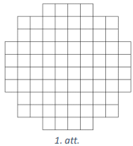

<small>

* questionType:
* domain:

</small>

## Atrisinājums

Der jebkurš no 2.att. dotajiem sadalījumiem.

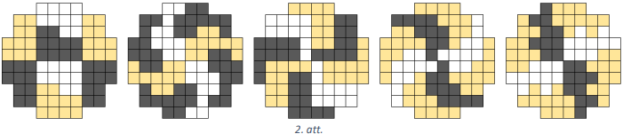

# <lo-sample/> LV.NOL.2018.5.4

Parādi vienu piemēru, kādi naturāli skaitļi var būt ierakstīti burtu vietā, lai
katru trīs pēc kārtas esošu skaitļu summa būtu $20$.

$$7, a, b, c, d, e, f, 9$$

<small>

* questionType:
* domain:

</small>

## Atrisinājums

Ir viens vienīgs veids, kā ierakstīt skaitļus: $7;\ 9;\ 4;\ 7;\ 9;\ 4;\ 7;\ 9$.
Redzams, ka katri trīs pēc kārtas esoši skaitļi ir $7,\ 9,\ 4$, kaut kādā 
secībā, to summa ir $20$.

$\textit {Piezīme.}$ Skaitļus var palīdzēt atrast tālāk aprakstītie spriedumi. 
No tā, ka $a+b+c=b+c+d$ izriet, ka $a=d$, tātad skaitļi, kas atrodas $3$ 
pozīcijas atstatu ir vienādi. Tātad $7=c=f$ un $a=d=9$, visbeidzot $b=e$ un to 
vērtību var atrast, izmantojot to, ka $a+b+c=20$.

# <lo-sample/> LV.NOL.2018.5.5

Divi spēlētāji pēc kārtas ņem konfektes no konfekšu kaudzes. Katrā gājienā 
jāpaņem vismaz viena, bet ne vairāk kā septiņas konfektes. Uzvar tas spēlētājs,
kurš paņem pēdējo konfekti. Kurš no spēlētājiem (pirmais vai otrais) vienmēr 
var uzvarēt (neatkarīgi no pretinieka gājieniem), ja sākumā konfekšu kaudzē ir 
**a)** $64$ konfektes, **b)** $2018$ konfektes?

<small>

* questionType:
* domain:

</small>

## Atrisinājums

Pamatosim, ka **a)** gadījumā vienmēr var uzvarēt otrais spēlētājs, bet **b)** 
gadījumā - pirmais spēlētājs.

Vienmēr var uzvarēt tas spēlētājs, pēc kura gājiena atlikušais konfekšu skaits 
dalās ar $8$. Ja konfekšu skaits dalās ar $8$ un pretinieks savā gājienā paņem 
$n$ konfektes ($n=1,\ 2,\ 3,\ 4,\ 5,\ 6$ vai $7$), tad, pēc viņa paņemot 
$(8-n)$ konfektes (tas ir, attiecīgi $7,\ 6,\ 5,\ 4,\ 3,\ 2$ vai $1$ konfekti),
konfekšu skaits samazinās par $8$ un atlikušais konfekšu skaits atkal dalās ar 
$8$. Tā turpinot, tas ir, pēc katriem diviem gājieniem (viens gājiens katram 
spēlētājam) samazinot konfekšu skaitu par $8$, var noteikti paņemt pēdējo 
konfekti, tas ir, nodrošināt, ka pēc sava gājiena paliek $0$ konfektes.

Tā kā $64$ dalās ar $8$, tad **a)** gadījumā vienmēr var uzvarēt otrais 
spēlētājs, jo viņš varēs nodrošināt, ka pēc viņa gājiena paliek 
$56,\ 48, \ldots, 16,\ 8,\ 0$ konfektes, bet $2018$ nedalās ar $8$, tāpēc 
**b)** gadījumā vienmēr var uzvarēt pirmais spēlētājs, pirmajā gājienā viņam 
jāņem $2$ konfektes (lai atlikušais skaits $2016$ dalītos ar $8$) un tad tālāk 
jārīkojas atbilstoši iepriekš aprakstītajai shēmai.

# <lo-sample/> LV.NOL.2018.6.1

Parādi vienu piemēru, kādus naturālus skaitļus var ierakstīt burtu $a, b, c$ 
vietā, lai ir patiesa vienādība

$$\frac{1}{a}+\frac{1}{b}+\frac{1}{c}=\frac{4}{5}$$

<small>

* questionType:
* domain:

</small>

## Atrisinājums

Der jebkurš no variantiem:

$$\begin{aligned}
& \frac{1}{2}+\frac{1}{4}+\frac{1}{20}=\frac{10}{20}+\frac{5}{20}+\frac{1}{20}=\frac{16}{20}=\frac{4}{5} \\
& \frac{1}{2}+\frac{1}{5}+\frac{1}{10}=\frac{5}{10}+\frac{2}{10}+\frac{1}{10}=\frac{8}{10}=\frac{4}{5}
\end{aligned}$$

# <lo-sample/> LV.NOL.2018.6.2

Koru finālskatē piedalījās desmit zēnu kori, kopā $291$ dalībnieks. Katrs 
dalībnieks dzied tieši vienā korī.

**a)** Vai noteikti ir tāds koris, kurā ir tieši $20$ dalībnieki?

**b)** Vai var gadīties, ka ir tāds koris, kurā ir tieši $32$ dalībnieki?

**c)** Vai var apgalvot, ka ir tieši viens tāds koris, kurā ir vismaz $30$ 
dalībnieki?

**d)** Vai noteikti ir tāds koris, kurā ir vismaz $30$ dalībnieki?

<small>

* questionType:
* domain:

</small>

## Atrisinājums

**a)** Nē, piemēram, varētu gadīties, ka vienā korī ir tieši $30$ dalībnieki, 
bet pārējos deviņos koros - katrā pa $29$ dalībniekiem.

**b)** Jā, piemēram, vienā korī ir tieši $32$ dalībnieki, vienā - $19$ 
dalībnieki, bet pārējos astoņos - pa $30$ dalībniekiem. 

**c)** Nē, piemēram, varētu gadīties, ka deviņos koros ir pa $30$ dalībniekiem,
bet pēdējā korī - $21$ dalībnieks.

**d)** Jā, noteikti. Ja katrā korī būtu ne vairāk kā $29$ dalībnieki, tad 
pavisam kopā finālskatē būtu piedalījušies ne vairāk kā $29 \cdot 10=290$ 
dalībnieki, bet tā ir pretruna ar doto, ka piedalījās $291$ dalībnieks. Tātad 
noteikti ir tāds koris, kurā ir vismaz $30$ dalībnieki. (Izmantots Dirihlē 
princips.)

# <lo-sample/> LV.NOL.2018.6.3

Vai taisnstūri ar izmēriem $6 \times 8$ rūtiņas var pārklāt ar **a)** divām 
3.att. dotajām figūrām un $20$ figūrām, kādas dotas 4.att.; **b)** vienu 3.att.
doto figūru un $22$ figūrām, kādas dotas 4.att.? Figūras drīkst pagriezt.

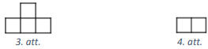

<small>

* questionType:
* domain:

</small>

## Atrisinājums

**a)** Jā, var, piemēram, skat., 5.att.

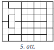

**b)** Nē, prasīto izdarīt nevar. lekrāsosim doto taisnstūri kā šaha galdiņu 
(skat. 6.att.). Lai kur novietotu 4.att. figūru, tā vienmēr pārklās tieši vienu
melnu rūtiņu, tātad $22$ tādas figūras kopā pārklās tieši $22$ melnas rūtiņas. 
Ar vienu 3.att. figūru var pārklāt vai nu tieši $3$ melnas, vai tieši $1$ melnu
rūtiņu (skat. 7.att.), tātad kopā ar visām dotajām figūrām būs pārklātas $23$ 
vai $25$ melnas rūtiņas, bet taisnstūrī ir $24$ melnas rūtiņas. Līdz ar to 
taisnstūri ar dotajām figūrām pārklāt nav iespējams.

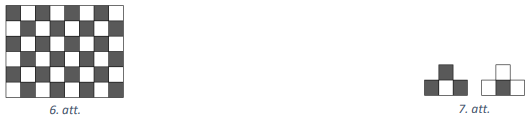

# <lo-sample/> LV.NOL.2018.6.4

Divciparu skaitļa sākumā un beigās pierakstīja ciparu $1$. leguva četrciparu 
skaitli, kas ir $23$ reizes lielāks nekā sākotnējais divciparu skaitlis. Kāds 
bija sākotnējais divciparu skaitlis? Atrodi visus derīgos divciparu skaitļus un
pamato, ka citu nav!

<small>

* questionType:
* domain:

</small>

## Atrisinājums

Apzīmējam doto divciparu skaitli ar $\overline{ab}$. Tad jābūt patiesai 
vienādībai $23 \cdot \overline{ab}=\overline{1ab1}$. Lai reizinājuma pēdējais 
cipars būtu $1$, vienīgā iespēja, ka $b=7$. Iegūstam 
$23 \cdot \overline{a7}=\overline{1a71}$. levērojam, ka $a>3$, jo 
$23 \cdot 37=851$, kas nav četrciparu skaitlis. Pārbaudām pārējās iespējamās 
cipara $a$ vērtības:

- ja $a=4$, tad $23 \cdot 47=1081$ - neder;
- ja $a=5$, tad $23 \cdot 57=1311$ - neder;
- ja $a=6$, tad $23 \cdot 67=1541$ - neder;
- ja $a=7$, tad $23 \cdot 77=1771-$ der;
- ja $a=8$, tad $23 \cdot 87=2001$ - neder, līdz ar to neder arī $a=9$, jo tad 
  reizinājuma pirmais cipars nav $1$.

Tātad vienīgais derīgais divciparu skaitlis ir $77$.

## Atrisinājums

Apzīmējam doto divciparu skaitli ar $\overline{ab}$. Tad jābūt patiesai 
vienādībai $23 \cdot \overline{ab}=\overline{1ab1}$. Lai reizinājuma pēdējais 
cipars būtu $1$, vienīgā iespēja, ka $b=7$. Iegūstam 
$23 \cdot \overline{a7}=\overline{1a71}$, ko var pārrakstīt formā

$$\begin{gathered}
23 \cdot(10a+7)=1000+100a+71 \\
230a+161=1071+100a \\
130a=910 \\
a=7
\end{gathered}$$

Tātad vienīgais derīgais divciparu skaitlis ir $77$.

# <lo-sample/> LV.NOL.2018.6.5

Divi spēlētāji pēc kārtas ņem konfektes no konfekšu kaudzes. Katrā gājienā 
jāpaņem vismaz viena, bet ne vairāk kā septiņas konfektes. Zaudē tas spēlētājs,
kuram jāņem pēdējā konfekte. Kurš no spēlētājiem (pirmais vai otrais) vienmēr 
var uzvarēt (neatkarīgi no pretinieka gājieniem), ja sākumā konfekšu kaudzē ir 
**a)** $81$ konfekte, **b)** $2018$ konfektes?

<small>

* questionType:
* domain:

</small>

## Atrisinājums

Pamatosim, ka **a)** gadījumā vienmēr var uzvarēt otrais spēlētājs, bet **b)** 
gadījumā - pirmais spēlētājs.

Vienmēr var uzvarēt tas spēlētājs, pēc kura gājiena atlikušais konfekšu skaits,
dalot ar $8$, dod atlikumā $1$. Ja konfekšu skaits, dalot ar $8$, dod atlikumā 
$1$ un pretinieks savā gājienā paņem $n$ konfektes ($n=1,\ 2,\ 3,\ 4,\ 5,\ 6$ 
vai $7$), tad, pēc viņa paņemot $(8-n)$ konfektes (tas ir, attiecīgi 
$7,\ 6,\ 5,\ 4,\ 3,\ 2$ vai $1$ konfekti), konfekšu skaits samazinās par $8$ un
atlikušais konfekšu skaits atkal, dalot ar $8$, dod atlikumā $1$. Tā turpinot, 
tas ir, pēc katriem diviem gājieniem (viens gājiens katram spēlētājam) 
samazinot konfekšu skaitu par $8$, spēlētājs noteikti atstās pretiniekam tieši 
$1$ konfekti un līdz ar to nodrošinās sev uzvaru.

Tā kā $81$, dalot ar $8$, dod atlikumā $1$, tad **a)** gadījumā vienmēr var 
uzvarēt otrais spēlētājs, jo viņš varēs nodrošināt, ka pēc viņa gājiena paliek 
$73,\ 65, \ldots, 17,\ 9,\ 1$ konfekte, bet $2018$, dalot ar $8$, dod atlikumā 
$2$, tāpēc **b)** gadījumā vienmēr var uzvarēt pirmais spēlētājs, pirmajā 
gājienā viņam jāņem $1$ konfekte (lai atlikušais skaits $2017$, dalot ar $8$, 
dotu atlikumā $1$) un tad tālāk jārīkojas atbilstoši iepriekš aprakstītajai 
shēmai.

# <lo-sample/> LV.NOL.2018.7.1

Četrstāvu mājai ir vairāk nekā $200$ logu. Zināms, ka pirmajā stāvā ir nepāra 
skaits logu, bet katrā no nākamiem stāviem to ir tieši par diviem mazāk nekā 
stāvu zemāk. Kāds mazākais logu skaits var būt šīs mājas ceturtajā stāvā?

<small>

* questionType:
* domain:

</small>

## Atrisinājums

Ar $x$ apzīmējam logu skaitu ceturtajā stāvā. Tad kopējais logu skaits ir

$$\begin{gathered}
x+(x+2)+(x+4)+(x+6)>200 \\
4x+12>200 \\
4x>188 \\
x>47
\end{gathered}$$

Līdz ar to mazākais iespējamais logu skaits $4.$ stāvā ir $49$.

# <lo-sample/> LV.NOL.2018.7.2

Maisiņā bija $10$ sarkanas, $10$ dzeltenas un $10$ zaļas lentes. Tautas deju 
kolektīva astoņas meitenes katra izvēlējās vienu lenti no šī maisiņa.

**a)** Vai var apgalvot, ka tieši četras meitenes izvēlējās vienādas krāsas 
lentes?

**b)** Vai noteikti ir vismaz trīs meitenes, kas izvēlējās vienādas krāsas 
lentes?

**c)** Kāds mazākais skaits lenšu būtu jāizņem no maisiņa, lai varētu apgalvot,
ka vismaz četras no tām ir vienā krāsā?

<small>

* questionType:
* domain:

</small>

## Atrisinājums

**a)** Nē, piemēram, varētu gadīties, ka $1$ meitene izvēlējās sarkanu lenti, 
$1$ meitene - dzeltenu lenti un $6$ meitenes - zaļu lenti.

**b)** Jā, noteikti. Ja katras krāsas lenti būtu izvēlējušās ne vairāk kā $2$ 
meitenes, tad kopā būtu ne vairāk kā $2 \cdot 3=6$ meitenes, bet tā ir pretruna
ar doto, ka lentes izvēlējās $8$ meitenes. Tātad noteikti ir vismaz $3$ 
meitenes, kas izvēlējās vienas krāsas lenti. (Izmantots Dirihlē princips.)

**c)** Ar deviņām (vai mazāk) lentēm nepietiktu, jo tad varētu gadīties, ka no 
katras krāsas ir pa $3$ lentēm (vai mazāk). Tātad, ja no maisina izņemtu $10$ 
lentes, tad pēc Dirihlē principa noteikti vismaz četras no tām būtu vienā 
krāsā.

# <lo-sample/> LV.NOL.2018.7.3

Aprēķināt $\sphericalangle BCD+\sphericalangle DEF+\sphericalangle FGH$ (skat. 
8.att.), ja $AB \| GH, \sphericalangle ABC=120^{\circ}, \sphericalangle CDE=90^{\circ}$
un $\sphericalangle EFG=60^{\circ}$.

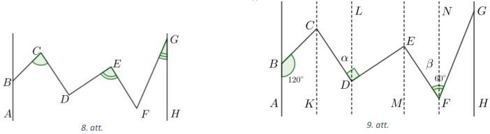

<small>

* questionType:
* domain:

</small>

## Atrisinājums

Novelkam taisnei $AB$ paralēlas taisnes caur punktiem $C,\ D,\ E$ un $F$ (skat.
9.att.). Tā kā iekšējo vienpusleņķu summa pie paralēlām taisnēm ir 
$180^{\circ}$, tad $\sphericalangle BCK=180^{\circ}-120^{\circ}=60^{\circ}$. 
Apzīmējam $\sphericalangle CDL=\alpha, \sphericalangle EFN=\beta$. levērojam, 
ka $\sphericalangle LDE=90^{\circ}-\alpha$ un 
$\sphericalangle NFG=60^{\circ}-\beta$. Tā kā iekšējie škērsleņķi pie paralēlām
taisnēm ir vienādi, tad 
$\sphericalangle KCD=\sphericalangle CDL=\alpha,\ \sphericalangle MEF=\sphericalangle EFN=\beta,\ \sphericalangle DEM=\sphericalangle LDE=90^{\circ}-\alpha$
un $\sphericalangle FGH=\sphericalangle NFG=60^{\circ}-\beta$. Līdz ar to

$$\begin{gathered}
\sphericalangle BCD+\sphericalangle DEF+\sphericalangle FGH=\sphericalangle BCK+\sphericalangle KCD+\sphericalangle DEM+\sphericalangle MEF+\sphericalangle FGH= \\
=60^{\circ}+\alpha+90^{\circ}-\alpha+\beta+60^{\circ}-\beta=210^{\circ}
\end{gathered}$$

# <lo-sample/> LV.NOL.2018.7.4

Dots, ka piecciparu skaitlis $\overline{acbba}$ dalās ar $11$ un $a>b>c$. 
Pierādīt, ka var atrast trīs citus piecciparu skaitļus, kas dalās ar $11$, ir 
lielāki nekā $\overline{acbba}$ un veidoti, samainot vietām sākotnējā skaitļa 
ciparus!

<small>

* questionType:
* domain:

</small>

## Atrisinājums

Pārrakstām doto skaitli formā

$$\begin{gathered}
\overline{acbba}=10000a+1000c+100b+10b+a=9999a+2a+1001c-c+110b \\
\overline{acbba}=11 \cdot 99a+11 \cdot 91c+11 \cdot 10b+2a-c
\end{gathered}$$

Tā kā pēdējās vienādības kreisā puse dalās ar $11$, tad arī vienādības labajai 
pusei ir jādalās ar $11$. Labās puses pirmie trīs saskaitāmie dalās ar $11$, 
tātad arī $(2a-c)$ dalās ar $11$.

Aplūkojam skaitļus $\overline{acabb}, \overline{abbca}$ un $\overline{abacb}$. 
Tie visi ir lielāki nekā dotais skaitlis (jo $a>b>c$) un tie dalās ar $11$, jo 
skaitli

- $\overline{acabb}$ var izteikt formā

$$\begin{gathered}
\overline{acabb}=10100a+1000c+11b=10098a+1001c+11b+2a-c= \\
=11 \cdot 918a+11 \cdot 91c+11b+(2a-c)
\end{gathered}$$

kur katrs saskaitāmais dalās ar $11$;

- $\overline{abbca}$ var izteikt formā

$$\begin{gathered}
\overline{abbca}=10001a+1100b+10c=9999a+1100b+11c+2a-c= \\
=11 \cdot 909a+11 \cdot 100b+11c+(2a-c)
\end{gathered}$$

kur katrs saskaitāmais dalās ar $11$;

- $\overline{abacb}$ var izteikt formā

$$\begin{gathered}
\overline{abacb}=10100a+1001b+10c=10098a+1001b+11c+2a-c= \\
=11 \cdot 918a+11 \cdot 91b+11c+(2a-c)
\end{gathered}$$

kur katrs saskaitāmais dalās ar $11$.

## Atrisinājums

Skaitlis dalās ar $11$, ja tā ciparu summas, kas atrodas nepāra pozīcijās, un 
ciparu summas, kas atrodas pāra pozīijās, starpība dalās ar $11$. Dotais 
skaitlis dalās ar $11$, tāpēc $(a+b+a)-(c+b)=2a-c$ dalās ar $11$.

Aplūkojam skaitļus $\overline{acabb}, \overline{abbca}$ un $\overline{abacb}$. 
Tie visi ir lielāki nekā dotais skaitlis (jo $a>b>c$) un tie dalās ar $11$, jo 
ciparu summas, kas atrodas nepāra pozīcijās, un ciparu summas, kas atrodas pāra
pozīcijās, starpība ir $2a-c$, kas dalās ar $11$.

# <lo-sample/> LV.NOL.2018.7.5

Visi naturālie skaitļi no $1$ līdz $16$ ierakstīti tabulas (skat. 10.att.) 
rūtiņās, katrā rūtiņā tieši viens skaitlis. Visās tabulas rindās, kolonnās un 
uz abām galvenajām diagonālēm rūtiņās ierakstīto skaitļu summas ir vienādas. 
Pierādit, ka iekrāsotajās rūtiņās ierakstīto skaitļu summa ir $34$.

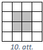

<small>

* questionType:
* domain:

</small>

## Atrisinājums

Tā kā rindās ierakstīto skaitļu summas ir vienādas, tad katrā rindā ierakstīto 
skaitļu summa ir

$$\frac{1+2+3+4+5+6+7+8+9+10+11+12+13+14+15+16}{4}=2 \cdot 17=34$$

lekrāsotajās rūtiņās ierakstīto skaitļu summu apzīmējam ar $S$, otrajā un 
trešajā rindā ierakstīto skaitļu summu, pirmajā un ceturtajā kolonnā ierakstīto
skaitļu summu un abās galvenajās diagonālēs ierakstīto skaitļu summu apzīmējam 
attiecīgi ar $R_{2}, R_{3}, K_{1}, K_{4}, D_{1}, D_{2}$.

Tā kā $D_{1}=D_{2}=R_{2}=R_{3}=K_{1}=K_{4}=34$, tad (skat. 11.att.)

$$S=\frac{1}{2}\left(D_{1}+D_{2}+R_{2}+R_{3}-K_{1}-K_{4}\right)=\frac{1}{2} \cdot 68=34$$

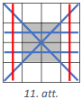

# <lo-sample/> LV.NOL.2018.8.1

Zināms, ka $a$ ir tāds reāls skaitlis, ka $a+\frac{1}{a}=3$. Aprēķināt **a)** 
$a^{2}+\frac{1}{a^{2}}+2$; **b)** $a^{4}+\frac{1}{a^{4}}$

<small>

* questionType:
* domain:

</small>

## Atrisinājums

**a)** Redzams, ka 
$a^{2}+\frac{1}{a^{2}}+2=a^{2}+2 \cdot a \cdot \frac{1}{a}+\frac{1}{a^{2}}=\left(a+\frac{1}{a}\right)^{2}=3^{2}=9$.

**b)** No a) gadījuma izriet, ka $a^{2}+\frac{1}{a^{2}}=7$. Līdz ar to 
iegūstam, ka

$$a^{4}+\frac{1}{a^{4}}=a^{4}+2 \cdot a^{2} \cdot \frac{1}{a^{2}}+\frac{1}{a^{4}}-2=\left(a^{2}+\frac{1}{a^{2}}\right)^{2}-2=49-2=47$$

# <lo-sample/> LV.NOL.2018.8.2

Maisiņā ir sarkanas, dzeltenas un zaļas lentes. Katra no meiteņu kora $29$ 
dalībniecēm izvēlējās tieši trīs no šīm lentēm (ne obligāti dažādās krāsās).

**a)** Vai noteikti ir tāds lenšu krāsu komplekts, ko izvēlējās tieši divas 
meitenes?

**b)** Vai noteikti ir tāds lenšu krāsu komplekts, ko izvēlējās vismaz trīs 
meitenes?

**c)** Kāds mazākais skaits no dalībniecēm jāizvēlas, lai starp tām noteikti 
būtu trīs meitenes, kas izvēlējās vienu un to pašu lenšu krāsu komplektu?

<small>

* questionType:
* domain:

</small>

## Atrisinājums

levērojam, ka iespējami $10$ dažādi lenšu krāsu komplekti:

|      | Sarkana | Dzeltena | Zaļa |
| ---- | ------- | -------- | ---- |
| $\mathbf{1.}$ | $3$ | $0$ | $0$ |
| $\mathbf{2.}$ | $0$ | $3$ | $0$ |
| $\mathbf{3.}$ | $0$ | $0$ | $3$ |
| $\mathbf{4.}$ | $2$ | $1$ | $0$ |
| $\mathbf{5.}$ | $2$ | $0$ | $1$ |
| $\mathbf{6.}$ | $1$ | $2$ | $0$ |
| $\mathbf{7.}$ | $0$ | $2$ | $1$ |
| $\mathbf{8.}$ | $1$ | $0$ | $2$ |
| $\mathbf{9.}$ | $0$ | $1$ | $2$ |
| $\mathbf{10.}$ | $1$ | $1$ | $1$ |

**a)** Nē, piemēram, varētu gadīties, ka pirmo komplektu izvēlas $4$ meitenes, 
otro komplektu - $1$ meitene, bet pārējos astoņus komplektus - pa $3$ meitenēm.

**b)** Jā, noteikti. Ja katru komplektu būtu izvēlējušās ne vairāk kā $2$ 
meitenes, tad kopā būtu ne vairāk kā $2 \cdot 10=20$ meitenes, bet tā ir 
pretruna ar doto, ka lentas izvēlējās $29$ meitenes. Tātad noteikti ir vismaz 
$3$ meitenes, kas izvēlējās vienu un to pašu lenšu krāsu komplektu. (Izmantots 
Dirihlē princips.)

**c)** Ja izvēlētos $20$ meitenes (vai mazāk), tad varētu gadīties, ka katru 
komplektu ir izvēlējušās $2$ meitenes (vai mazāk). Tātad, ja izvēlētos $21$ 
meiteni, tad pēc Dirihlē principa noteikti būtu trīs meitenes, kas izvēlējās 
vienu un to pašu lenšu krāsu komplektu.

# <lo-sample/> LV.NOL.2018.8.3

Dots trijstūris $PQR$, kurā $\sphericalangle PQR=20^{\circ}$ un 
$\sphericalangle PRQ=40^{\circ}$. No virsotnes $P$ novilktā bisektrise krusto 
malu $QR$ punktā $S$, nogriežņa $PS$ garums ir $2$. Par cik mala $QR$ ir garāka
nekā $PQ$ ?

<small>

* questionType:
* domain:

</small>

## Atrisinājums

Tā kā $PS$ ir leņķa $\sphericalangle QPR$ bisektrise un trijstūra iekšējo leņķu
summa ir $180^{\circ}$, tad 
$\sphericalangle RPS=\sphericalangle SPQ=\frac{1}{2}\left(180^{\circ}-20^{\circ}-40^{\circ}\right)=60^{\circ}$
(skat. 12.att.).

No $\triangle PSQ$ iegūstam, ka 
$\sphericalangle PSQ=180^{\circ}-\sphericalangle PQR-\sphericalangle S PQ=180^{\circ}-20^{\circ}-60^{\circ}=100^{\circ}$.
Novelkam $PT=2$, kur $T$ atrodas uz malas $QR$. Trijstūris $TPS$ ir vienādsānu 
un $\sphericalangle PST=\sphericalangle PTS=80^{\circ}$ un 
$\sphericalangle TPS=20^{\circ}$. Trijstūris $RTP$ ir vienādsānu, jo 
$\sphericalangle PRQ=40^{\circ}$ un 
$\sphericalangle RPT=\sphericalangle RPS-\sphericalangle TPS=60^{\circ}-20^{\circ}=40^{\circ}$.
Tātad $PT=TR=2$. Tā kā $\sphericalangle QTP=\sphericalangle TPQ=80^{\circ}$, 
tad arī trijstūris $PQT$ ir vienādsānu un $PQ=QT$.

Esam ieguvuši, ka $QR=QT+TR=PQ+2$ jeb mala $QR$ ir par $2$ garāka nekā $PQ$.

$\textit {Piezīme.}$ Uzdevumu var risināt arī, atliekot uz $QR$ tādu punktu 
$T$, ka $PQ=QT$. Pēc tam, spriežot līdzīgi, kā dotajā risinājumā, iegūst 
vajadzīgo.

# <lo-sample/> LV.NOL.2018.8.4

No cipariem $1,\ 2,\ 3,\ 4,\ 5,\ 6,\ 7,\ 8,\ 9$, katru izmantojot vienu reizi, 
izveidoti trīs trīsciparu skaitļi. Ar kādu lielāko nuļļu skaitu var beigties šo
trīs skaitļu summa?

<small>

* questionType:
* domain:

</small>

## Atrisinājums

Lielākais nuļļu skaits ir $2$. To var iegūt, piemēram, $195+762+843=1800$.

Pierādīsim, ka ar vairāk kā $2$ nullēm skaitļu summa nevar beigties.

Ja izveidotos skaitļus apzīmē ar $\overline{abc},\ \overline{def}$ un 
$\overline{ghl}$, tad to summa izsakāma kā

$$\begin{aligned}
S & =(a+d+g) \cdot 100+(b+e+h) \cdot 10+c+f+i= \\
& =99(a+d+g)+9(b+e+h)+a+b+c+d+e+f+g+h+i
\end{aligned}$$

Ņemot vērā, ka visu izmantoto ciparu summa ir $45$, iegūstam

$$
S=99(a+d+g)+9(b+e+h)+45
$$

Tātad izveidoto skaitļu summa $S$ dalās ar $9$, jo katrs saskaitāmais dalās ar 
$9$.

Trīs trīsciparu skaitļu summa ir mazāka nekā $3000$, jo katrs saskaitāmais ir 
mazāks nekā $1000$. Vienīgie divi skaitļi ar trīs nullēm beigās, kas mazāki 
nekā $3000$, ir $1000$ un $2000$, kas nedalās ar $9$. Tāpēc summa $S$ nevar 
beigties ar trīs nullēm.

$\textit {Piezīme.}$ Vajadzīgo piemēru var atrast, piemeklējot ciparus, sākot 
ar skaitļu pēdējo ciparu.

# <lo-sample/> LV.NOL.2018.8.5

Visi naturālie skaitļi no $1$ līdz $16$ ierakstīti tabulas (skat. 13.att.) 
rūtiņās, katrā rūtiņā tieši viens skaitlis. Visās tabulas rindās, kolonnās un 
uz abām galvenajām diagonālēm rūtiņās ierakstīto skaitļu summas ir vienādas. 
Pierādīt, ka iekrāsotajās rūtiņās ierakstīto skaitļu summa ir $34$.

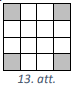

<small>

* questionType:
* domain:

</small>

## Atrisinājums

Tā kā rindās ierakstīto skaitļu summas ir vienādas, tad katrā rindā ierakstīto 
skaitļu summa ir

$$\frac{1+2+3+4+5+6+7+8+9+10+11+12+13+14+15+16}{4}=2 \cdot 17=34$$

Iekrāsotajās rūtiņās ierakstīto skaitļu summu apzīmējam ar $S$, otrajā un 
trešajā rindā ierakstīto skaitļu summu, pirmajā un ceturtajā kolonnā ierakstīto
skaitļu summu un abās galvenajās diagonālēs ierakstīto skaitļu summu apzīmējam 
attiecīgi ar $R_{2}, R_{3}, K_{1}, K_{4}, D_{1}, D_{2}$.

Tā kā $D_{1}=D_{2}=R_{2}=R_{3}=K_{1}=K_{4}=34$, tad (skat. 14.att.)

$$S=\frac{1}{2}\left(D_{1}+D_{2}+K_{1}+K_{4}-R_{2}-R_{3}\right)=\frac{1}{2} \cdot 68=34$$

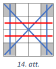

# <lo-sample/> LV.NOL.2018.9.1

Jaunieši devās četru dienu pārgājienā gar jūru. Pirmajā dienā tie nogāja 
$30~\mathrm{km}$. Otrajā dienā tie ar jahtu nobrauca $20 \%$ no atlikušā ceļa. 
Trešajā dienā jaunieši atkal gāja kājām, noejot $1,5$ reizes lielāku attālumu 
nekā viņi brauca ar jahtu. Ceturtajā dienā atlikušo ceļu $1,5$ stundās jaunieši
veica ar kvadricikliem, kuru ātrums ir $40~\mathrm{km/h}$. Cik kilometru garš 
bija maršruts?

<small>

* questionType:
* domain:

</small>

## Atrisinājums

Atlikušo maršruta garumu, kas palicis, kad noieti pirmie $30~\mathrm{km}$, 
apzīmējam ar $x$ (skat. 15.att.). Tad ar jahtu pa jūru jaunieši brauca 
$0,2x~\mathrm{km}$, bet pēc tam ar kājām gāja vēl 
$1,5 \cdot 0,2x=0,3x~\mathrm{km}$. Ar kvadricikliem tie veica 
$1,5 \cdot 40=60~\mathrm{km}$. Iegūstam vienādojumu $0,2x+0,3x+60=x$ jeb 
$x=120$. Tātad kopējais maršruta garums bija $x+30=120+30=150$ kilometri.

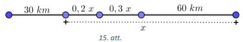

# <lo-sample/> LV.NOL.2018.9.2

Skolas ēdnīcas pusdienu piedāvājumā ir divas dažādas zupas, divi dažādi 
pamatēdieni un divi dažādi deserti. Pusdienās aizgāja $30$ vienas klases 
skolēni, no katra ēdienu veida (zupa, pamatēdiens, deserts) katrs skolēns 
izvēlējās ne vairāk kā vienu ēdienu, pie tam nebija tāda skolēna, kurš neēda 
vispār neko. Vai noteikti ir divi skolēni, kas pasūtīja vienu un to pašu?

<small>

* questionType:
* domain:

</small>

## Atrisinājums

Pamatosim, ka noteikti ir divi tādi skolēni, kas pasūtīja vienu un to pašu. 
levērojam, ka katra veida ēdienu var vai nu neiekļaut komplektā, vai izvēlēties
vienu no diviem tā veidiem, tātad katram ēdiena veidam ir $3$ dažādas iespējas.
Tā kā katrs skolēns izvēlējās vismaz vienu no piedāvātajiem ēdieniem (neder 
variants, ka no katra ēdiena veida neizvēlas neko), tad ir iespējams izveidot 
$3 \cdot 3 \cdot 3-1=26$ dažādus pusdienu komplektus.

**Ja katru no šiem komplektiem būtu izvēlējies ne vairāk kā viens skolēns, tad**
**pusdienās būtu aizgājuši ne vairāk kā $26$ skolēni, kas ir pretrunā ar uzdevuma**
**nosacījumiem. Tātad noteikti ir divi skolēni, kas pasūtīja vienu un to pašu.**

$\textit {Piezīme.}$ Treknrakstā izceltā teksta vietā var būt, piemēram, arī 
šāds spriedums: tā kā pusdienās aizgāja $30$ skolēni un $30>26$, tad pēc 
Dirihlē principa noteikti ir divi skolēni, kas pasūtīja vienu un to pašu.

# <lo-sample/> LV.NOL.2018.9.3

Četrstūra $ABCD$ malu $AB$ un $CD$ garumu summa ir vienāda ar malas $AD$ 
garumu. Leņķu $DAB$ un $CDA$ bisektrišu krustpunkts $F$ atrodas uz malas $BC$. 
Pierādīt, ka punkts $F$ ir $BC$ viduspunkts!

<small>

* questionType:
* domain:

</small>

## Atrisinājums

Tā kā $AD=AB+CD$, tad uz malas $AD$ ir tāds punkts $E$, ka $AB=AE$ un $ED=DC$ 
(skat. 16.att.). levērojam, ka $\triangle BAF=\triangle EAF$ pēc pazīmes 
$m \ell m$, jo $AB=AE, \sphericalangle BAF=\sphericalangle EAF$ (bisektrises 
definīcija) un $AF$ - kopīga mala, un $\triangle FED=\triangle FCD$ pēc pazīmes
$m \ell m$, jo $\sphericalangle EDF=\sphericalangle CDF; ED=DC$ un $DF$ - kopīga.

Vienādos trijstūros atbilstošās malas ir vienādas, tāpēc $BF=EF=CF$. Tātad 
punkts $F$ atrodas vienādā attālumā no $B$ un $C$, līdz ar to punkts $F$ ir 
$BC$ viduspunkts.

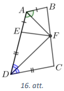

# <lo-sample/> LV.NOL.2018.9.4

Vai var atrast tādus veselus skaitļus $x$ un $y$, ka $20x^{3}-17y^{2}+1=2018$?

<small>

* questionType:
* domain:

</small>

## Atrisinājums

Pierādīsim, ka tādus skaitļus nevar atrast. Pārveidojam doto vienādojumu:

$$\begin{aligned}
20x^{3}-2000 & =17+17y^{2} \\
20\left(x^{3}-100\right) & =17\left(1+y^{2}\right)
\end{aligned}$$

Ievērojam, ka vienādojuma kreisā puse ir pāra skaitlis. Lai vienādība būtu 
patiesa, arī vienādojuma labai pusei jābūt pāra skaitlim, līdz ar to $y$ jābūt 
nepāra skaitlim. Ņemot $y=2k+1$, kur $k \in \mathbb{Z}$, iegūstam

$$20\left(x^{3}-100\right)=17\left(2+4k^{2}+4k\right)$$

Tā kā vienādības kreisā puse dalās ar četri, bet labā puse nedalās, tad 
vienādojumam nav atrisinājuma veselos skaitļos.

## Atrisinājums

Pierādīsim, ka tādus skaitļus nevar atrast. Pārveidojam doto vienādojumu:

$$\begin{aligned}
20x^{3}-2000 & =17+17y^{2} \\
20\left(x^{3}-100\right) & =17\left(1+y^{2}\right)
\end{aligned}$$

Ievērojam, ka vienādojuma kreisā puse dalās ar $4$.

Pamatosim, ka vienādojuma labā puse nedalās ar $4$, tas ir, pamatosim, ka 
$1+y^{2}$ nedalās ar $4$. Apskatām, kādu atlikumu var dot skaitlis $1+y^{2}$, 
dalot ar $4$:

- ja $y$ dalās ar $4$, tas ir, $y=4k$, kur $k \in \mathbb{Z}$, tad 
  $1+y^{2}=1+16k^{2}$, kas nedalās ar $4$;
- ja $y$, dalot ar $4$, dod atlikumā $1$, tas ir, $y=4k+1$, kur 
  $k \in \mathbb{Z}$, tad $1+y^{2}=1+16k^{2}+8k+1=4\left(4k^{2}+2k\right)+2$, 
  kas nedalās ar $4$;
- ja $y$, dalot ar $4$, dod atlikumā $2$, tas ir, $y=4k+2$, kur 
  $k \in \mathbb{Z}$, tad $1+y^{2}=1+16k^{2}+16k+4=4\left(4k^{2}+4k\right)+5$, 
  kas nedalās ar $4$;
- ja $y$, dalot ar $4$, dod atlikumā $3$, tas ir, $y=4k+3$, kur 
  $k \in \mathbb{Z}$, tad $1+y^{2}=1+16k^{2}+24k+9=4\left(4k^{2}+6k\right)+10$,
  kas nedalās ar $4$.

Tā kā vienādojuma kreisā puse dalās ar $4$, bet labā nedalās, tad esam 
pierādījuši, ka nevar atrast tādus veselus skaitļus $x$ un $y$, lai pastāvētu 
vienādība.

# <lo-sample/> LV.NOL.2018.9.5

Dota figūra, kuras laukums ir $24$ rūtiņas (skat. 17.att.). Griežot pa rūtiņu 
līnijām, tā sagriezta sešās vienlielās daļās (katras daļas laukums ir $4$ 
rūtiņas). Noteikt, kāds ir mazākais iespējamais griezuma līniju kopgarums, 
pieņemot, ka rūtiņas malas garums ir viena vienība!

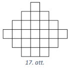

<small>

* questionType:
* domain:

</small>

## Atrisinājums

Dotās figūras perimetrs ir $26$ vienības. Iegūto sešu daļu perimetrus apzīmējam
ar $p_{1}, p_{2}, p_{3}, p_{4}, p_{5}, p_{6}$ un aplūkojam summu 
$p_{1}+p_{2}+p_{3}+p_{4}+p_{5}+p_{6}$. Šajā summā katrs griezuma posms ir 
ieskaitīts divas reizes, bet katras daļas ārmalas posms - vienu reizi. Tad 
griezuma līniju kopgarumu var izteikt kā 
$\frac{1}{2}\left(p_{1}+p_{2}+p_{3}+p_{4}+p_{5}+p_{6}-26\right)$. Tātad 
nepieciešams minimizēt iegūto sešu daļu perimetru summu. Pavisam ir piecas 
dažādas figūras, kas sastāv no četrām rūtiņām (skat. 18.att.). Visām figūrām, 
izņemot $2 \times 2$ kvadrātu, perimetrs ir $10$ vienības, bet kvadrāta 
perimetrs ir $8$ vienības. Pamatosim, ka no dotās figūras var izgriezt ne 
vairāk kā divus $2 \times 2$ kvadrātus. Kvadrāts $2 \times 2$ var atrasties 
tikai tajās vietās, kur kādā no kvadrāta rūtiņām atrodas "X" (skat. 19.att.). 
Ja kvadrātu novieto citās vietās, tad tas atšķeļ vienu atsevišķu rūtiņu. Tātad 
no dotās figūras var izgriezt ne vairāk kā divus $2 \times 2$ kvadrātus. Līdz 
ar to mazākais iespējamais griezuma līniju kopgarums ir 
$(2 \cdot 8+4 \cdot 10-26):2=15$, to var iegūt, piemēram, kā parādīts 20.att.

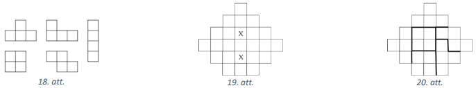

# <lo-sample/> LV.NOL.2018.10.1

Uz gara baļķa $600~\mathrm{cm}$ attālumā viens no otra atrodas gliemezis un 
skudra. Ja tie pārvietotos viens otram pretī, tad tie sastaptos pēc $5$ 
minūtēm. Ja tie kustētos vienā virzienā ar tiem pašiem ātrumiem, tad skudra 
panāktu gliemeži pēc $20$ minūtēm. Noteikt, cik centimetrus minūtē veic skudra 
un cik - gliemezis!

<small>

* questionType:
* domain:

</small>

## Atrisinājums

Skudras ātrumu apzīmējam ar $x$ un gliemeža - ar $y$. Tad iegūstam vienādojumu 
sistēmu

$$
\left\{\begin{array} {c} 
{5x+5y=600} \\
{20x=20y+600}
\end{array} \quad \text { jeb } \quad \left\{\begin{array}{c}
x+y=120 \\
x-y=30
\end{array}\right.\right.
$$

Saskaitot pēdējās sistēmas vienādojumus, iegūstam $2x=150$ jeb 
$x=75~\mathrm{cm/min}$ un $y=45~\mathrm{cm/min}$.

# <lo-sample/> LV.NOL.2018.10.2

Skolas ēdnīcas pusdienu piedāvājumā ir divas dažādas zupas, divi dažādi 
pamatēdieni un divi dažādi deserti. Pusdienās aizgāja $200$ skolēni, no katra 
ēdienu veida (zupa, pamatēdiens, deserts) katrs skolēns izvēlējās ne vairāk kā 
vienu ēdienu, pie tam nebija tāda skolēna, kurš neēda vispār neko. Kāds ir 
lielākais skaits skolēnu, kas noteikti pasūtīja vienu un to pašu?

<small>

* questionType:
* domain:

</small>

## Atrisinājums

Pamatosim, ka lielākais skolēnu skaits, kas noteikti pasūtīja vienu un to pašu,
ir $8$. levērojam, ka katra veida ēdienu var vai nu neiekļaut komplektā, vai 
izvēlēties vienu no diviem tā veidiem, tātad katram ēdiena veidam ir $3$ 
dažādas iespējas. Tā kā katrs skolēns izvēlējās vismaz vienu no piedāvātajiem 
ēdieniem (neder variants, ka no katra ēdiena veida neizvēlas neko), tad ir 
iespējams izveidot $3 \cdot 3 \cdot 3-1=26$ dažādus pusdienu komplektus. **Ja** 
**katru no šiem komplektiem būtu izvēlējušies ne vairāk kā $7$ skolēni, tad** 
**pusdienās būtu aizgājuši ne vairāk kā $7 \cdot 26=182$ skolēni, kas ir pretrunā**
**ar uzdevuma nosacījumiem. Tātad noteikti ir $8$ skolēni, kas pasūtīja vienu un** 
**to pašu.** Nevar apgalvot, ka vairāk kā $8$ skolēni pasūtīja vienu un to pašu, jo
ir iespējams, ka pirmos $18$ no $26$ dažādajiem pusdienu komplektiem izvēlējās 
pa $8$ skolēniem un atlikušos $8$ pusdienu komplektus - pa $7$ skolēniem (tas 
ir, $18 \cdot 8+8 \cdot 7=200$ ).

$\textit {Piezīme.}$ Treknrakstā izceltā teksta vietā var būt, piemēram, arī 
šāds spriedums: tā kā skolēnu skaits ir $200=7 \cdot 26+18$, tad pēc Dirihlē 
principa noteikti ir $8$ skolēni, kas pasūtīja vienu un to pašu.

# <lo-sample/> LV.NOL.2018.10.3

Punkts $K$ ir kvadrāta $ABCD$ malas $AB$ viduspunkts. Uz diagonāles $AC$ 
atlikts tāds punkts $L$, ka $AL:LC=3:1$. Pierādīt, ka 
$\sphericalangle KLD=90^{\circ}$.

<small>

* questionType:
* domain:

</small>

## Atrisinājums

No punkta $L$ pret malām $AB$ un $AD$ novelkam attiecīgi perpendikulus $LF$ un 
$LE$ (skat. 21.att.). Simetrijas dēļ $LF=LE$. Tā kā $AL:LC=3:1$, tad pēc Talesa
teorēmas $ED=BF=\frac{1}{4} AB$. Līdz ar to 
$FK=BK-BF=\frac{1}{2} AB-\frac{1}{4} AB=\frac{1}{4} AB$ un $FK=ED$. Tātad 
$\triangle LFK=\triangle LED$ pēc pazīmes $m \ell m$ un 
$\sphericalangle FLK=\sphericalangle ELD$ kā atbilstošie leņķi vienādos 
trijstūros. levērojam, ka 
$\sphericalangle KLD=\sphericalangle KLE+\sphericalangle ELD=\sphericalangle KLE+\sphericalangle FLK=\sphericalangle FLE=90^{\circ}$

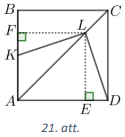

$\textit {Piezīme.}$ Iegūt prasīto var arī aprēkinot, ka $K D=\sqrt{\frac{5 a}{4}}$ un $K L=L D=\sqrt{\frac{5 a}{8}}$, kur $a-$ kvadrāta malas garums, un izmantojot Pitagora teorēmas apgriezto teorēmu.

# <lo-sample/> LV.NOL.2018.10.4

10.4. No cipariem $1,2,3,4,5,6,7,8,9$, katru izmantojot divas reizes, izveidoti trīs sešciparu skaitli. Ar kādu lielāko nullu skaitu var beigties trīs izveidoto skaitlu summa?

<small>

* questionType:
* domain:

</small>

## Atrisinājums

Atrisinājums. Lielākais nullu skaits ir 5. To var iegūt, piemēram, $257899+327686+314415=900000$.

Pierādīsim, ka ar vairāk kā 5 nullēm skaitlu summa nevar beigties.

Ja izveidotos skait|us apzīmē ar $\overline{a_{1} a_{2} a_{3} a_{4} a_{5} a_{6}}, \overline{b_{1} b_{2} b_{3} b_{4} b_{5} b_{6}}$ un $\overline{c_{1} c_{2} c_{3} c_{4} c_{5} c_{6}}$, tad to summa izsakāma kā

$$
\begin{aligned}
S= & \left(a_{1}+b_{1}+c_{1}\right) \cdot 10^{5}+\left(a_{2}+b_{2}+c_{2}\right) \cdot 10^{4}+\left(a_{3}+b_{3}+c_{3}\right) \cdot 10^{3}+\left(a_{4}+b_{4}+c_{4}\right) \cdot 10^{2}+ \\
& +\left(a_{5}+b_{5}+c_{5}\right) \cdot 10+\left(a_{6}+b_{6}+c_{6}\right)
\end{aligned}
$$

Nemot vērā, ka visu izmantoto ciparu summa ir $45 \cdot 2=90$, iegūstam

$$
\begin{aligned}
S= & 99999\left(a_{1}+b_{1}+c_{1}\right)+9999\left(a_{2}+b_{2}+c_{2}\right)+999\left(a_{3}+b_{3}+c_{3}\right)+99\left(a_{4}+b_{4}+c_{4}\right)+9\left(a_{5}+b_{5}+\right. \\
& \left.+c_{5}\right)+\left(a_{1}+b_{1}+c_{1}+a_{2}+b_{2}+c_{2}+a_{3}+b_{3}+c_{3}+a_{4}+b_{4}+c_{4}+a_{5}+b_{5}+c_{5}+a_{6}+b_{6}+c_{6}\right)=
\end{aligned}
$$

$$
\begin{aligned}
= & 99999\left(a_{1}+b_{1}+c_{1}\right)+9999\left(a_{2}+b_{2}+c_{2}\right)+999\left(a_{3}+b_{3}+c_{3}\right)+99\left(a_{4}+b_{4}+c_{4}\right)+ \\
& +9\left(a_{5}+b_{5}+c_{5}\right)+90
\end{aligned}
$$

Tātad izveidoto skait|u summa $S$ dalās ar 9 .

Trīs sešciparu skait!u summa ir mazāka nekā 3000 000, jo katrs saskaitāmais ir mazāks nekā 1000000 . Vienīgie divi skait|li ar sešām nullēm beigās, kas mazāki nekā 3000000 , ir 1000000 un 2000000 , kas nedalās ar 9. Tāpēc summa $S$ nevar beigties ar sešām nullēm.

Piezīmes. 1) Der arī $493862+511382+794756=1800000$ un $921478+925176+853346=2700000$.

2) Vajadzīgo piemēru var atrast, piemeklējot ciparus, sākot ar skait|u pēdējo ciparu.

# <lo-sample/> LV.NOL.2018.10.5

10.5. Dota figūra, kuras laukums ir 28 rūtinas (skat. 22.att.). Griežot pa rūtinu līnijām, tā sagriezta septiņās vienliel̄s daḹs (katras daļas laukums ir 4 rūtinas). Noteikt, kāds ir mazākais iespējamais griezuma līiju kopgarums, pieņemot, ka rūtinas malas garums ir viena vienība!

22.att.

<small>

* questionType:
* domain:

</small>

## Atrisinājums

Atrisinājums. Dotās figūras perimetrs ir 26 vienības. Iegūto septiņu daļu perimetrus apzīmējam ar $p_{1}, p_{2}, p_{3}, p_{4}, p_{5}, p_{6}, p_{7}$ un aplūkojam summu $p_{1}+p_{2}+p_{3}+p_{4}+p_{5}+p_{6}+p_{7}$. Šajā summā katrs griezuma posms ir ieskaitīts divas reizes, bet katras dalas ārmalas posms - vienu reizi. Tad griezuma līiju kopgarumu var izteikt kā $\frac{1}{2}\left(p_{1}+p_{2}+p_{3}+p_{4}+p_{5}+p_{6}+p_{7}-26\right)$. Tātad jācenšas minimizēt iegūto septinu daļu perimetru summu. Pavisam ir piecas dažādas figūras, kas sastāv no četrām rūtinām (skat. 23.att.). Visām figūrām, izņemot $2 \times 2$ kvadrātu, perimetrs ir 10 vienības, bet kvadrāta perimetrs ir 8 vienības.

Pamatosim, ka dotajā laukumā iespējams izvietot ne vairāk kā četrus $2 \times 2$ kvadrātus. Katrs $2 \times 2$ rūtinu kvadrāts satur vienu rūtịu, kas atzīmēta ar burtu (skat. 24.att.), tāpēc no dotās figūras nevar izgriezt vairāk kā piecus kvadrātus. Pieņemsim, ka viens no kvadrātiem satur rūtinu " C ". Ja " C " ir $2 \times 2$ kvadrāta apakšēēs rindas rūtiņa, tad šis kvadrāts nelauj izgriezt vienu no kvadrātiem ar rūtinuu augšējā rindā (" $A$ " vai " $B$ "). Ja " $C$ " ir $2 \times 2$ kvadrāta augšējās rindas rūtina, tad, izgriežot kvadrātus, kas satur " $A$ " vai “ $B$ ", tiktu norobežots divu rūtinu liels laukums. Tātad no dotās figūras var izgriezt ne vairāk kā četrus $2 \times 2$ kvadrātus.

Līdz ar to mazākais iespējamais griezuma līiju kopgarums ir $(4 \cdot 8+3 \cdot 10-26): 2=18$, to var iegūt, piemēram, kā parādīts 25 .att.

23.att.

24.att.

25.att.

# <lo-sample/> LV.NOL.2018.11.1

11.1. Spīdolai ir 482 bildes un divi vienādi fotoalbumi. Pirmā albuma katrā lapā viņa ielīmēja tieši 21 bildi. Ja otrā albuma katrā lapā viņa ielīmētu tieši 19 bildes, tad lapu pietrūktu, savukārt, ja katrā lapā viņa ielīmētu tieši 23 bildes, tad vismaz viena lapa paliktu tukša. Cik lapu ir fotoalbumā?

<small>

* questionType:
* domain:

</small>

## Atrisinājums

Atrisinājums. Apzīmējam ar $x$ lapu skaitu katrā fotoalbumā. Tad bilžu skaits, kas Spīdolai jāielīmē otrajā fotoalbumā, ir $(482-21 x)$. Iegūstam nevienādību sistēmu:

$$
\left\{\begin{array} { c } 
{ 1 9 x < 4 8 2 - 2 1 x } \\
{ 2 3 ( x - 1 ) \geq 4 8 2 - 2 1 x }
\end{array} \text { jeb } \left\{\begin{array}{l}
x<\frac{482}{40}=12 \frac{2}{40} \\
x \geq \frac{505}{44}=11 \frac{21}{44}
\end{array}\right.\right.
$$

Tā kā lapu skaits ir naturāls skaitlis, tad fotoalbumā ir 12 lapas.

Piezīme. Ja sistēmas otrā nevienādība ir $23 x>482-21 x$, tad iegūst, ka $x=11$ vai $x=12$, bet vērtība $x=11$ neder, jo tad albumā nepaliek vismaz viena tukša lapa.

# <lo-sample/> LV.NOL.2018.11.2

11.2. Sporta zālē trenējas 32 cilvēki, kuri visi ir vismaz 21 gadu veci. Pierādīt, ka no šiem cilvēkiem var atrast divus tādus, kuriem ir vairāk nekā 30 gadi vai 4 tādus, kuru gadu skaits ir vienāds!

<small>

* questionType:
* domain:

</small>

## Atrisinājums

1. atrisinājums. Pieņemam pretējo tam, kas jāpierāda, tas ir, nav divu cilvēku, kuriem ir vairāk kā 30 gadi un nav četru cilvēku, kuriem ir vienāds gadu skaits. Sadalām cilvēkus grupās pēc to gadu skaita: $\{21\} ;\{22\} ;\{23\} ; \ldots ;\{29\} ;\{30\} ;\{$ vairāk nekā 30$\}$. Tad pirmajās 10 grupās katrā ir ne vairāk kā 3 cilvēki un pēdējā - ne vairāk kā viens cilvēks. Tātad sporta zālē nav vairāk kā $3 \cdot 10+1=31$ cilvēks - pretruna. Tātad pienēmums ir aplams un esam pierādījuši, ka var atrast divus tādus cilvēkus, kuriem ir vairāk nekā 30 gadi vai 4 tādus, kuru gadu skaits ir vienāds.

## Atrisinājums

2. atrisinājums. Sadalām cilvēkus grupās pēc to gadu skaita: $\{21\} ;\{22\} ;\{23\} ; \ldots$; $\{29\}$; \{30\}; \{vairāk nekā 30$\}$. Ja pēdējā grupā ir vismaz divi cilvēki, tad prasītais izpildās.

Ja pēdējā grupā ir mazāk nekā divi cilvēki, tad pa atlikušajām grupām jāsadala vismaz 31 cilvēks. Tā kā ir 10 grupas un vismaz $31=3 \cdot 10+1$ cilvēks, tad pēc Dirihlē principa kādā no šīm grupām ir vismaz 4 cilvēki, tātad tiem gadu skaits ir vienāds.

# <lo-sample/> LV.NOL.2018.11.3

11.3. Trapeces $A B C D$ pamatu $A B$ un $C D$ garumu summa ir vienāda ar sānu malas $A D$ garumu. Pierādīt, ka lenkku $D A B$ un $C D A$ bisektrises krustojas $B C$ viduspunktā!

<small>

* questionType:
* domain:

</small>

## Atrisinājums

Atrisinājums. Bisektrišu krustpunktu apzīmējam ar $F$. Ir jāpierāda, ka $F$ atrodas uz $B C$, un arī, ka $F B=F C$.

Pierādīsim, ka $F B=F C$. Uz $A D$ izvēlamies tādu punktu $E$, ka $E A=A B$, tad $D E=D C$ (jo $A E+E D=A D=A B+D C$ ). Tad $\triangle A E F=\triangle A B F$ pēc pazīmes $m \ell m$, jo $\sphericalangle B A F=\sphericalangle E A F ; A B=A E$ un $A F$ - kopīga un $\triangle E D F=\triangle C D F$ pēc pazīmes $m \ell m$, jo $\sphericalangle E D F=\sphericalangle C D F ; E D=D C$ un $D F-$ kopīga. Tā kā vienādos trijstūros attiecīgās malas ir vienādas, $\operatorname{tad} B F=E F=C F$. Tātad punkts $F$ atrodas vienādā attālumā no $B$ un $C$.

Atliek pierādīt, ka $F$ atrodas uz $B C$. Apskatot četrstūrus $A B F E$ un $E F C D$ un izmantojot, ka četrstūra iekšējo lenku summa ir $360^{\circ}$ un ka trapeces sānu malas pieleņku summa ir $180^{\circ}$, iegūstam

$\sphericalangle B F C=\sphericalangle B F E+\sphericalangle E F C=$

$$
\begin{aligned}
& =\left(360^{\circ}-\sphericalangle A B F-\sphericalangle B A E-\sphericalangle A E F\right)+\left(360^{\circ}-\sphericalangle F E D-\sphericalangle E D C-\sphericalangle D C F\right)= \\
& =720^{\circ}-(\sphericalangle A B F+\sphericalangle D C F)-(\sphericalangle B A E+\sphericalangle E D C)-(\sphericalangle A E F+\sphericalangle F E D)= \\
& =720^{\circ}-180^{\circ}-180^{\circ}-180^{\circ}=180^{\circ}
\end{aligned}
$$

Esam ieguvuši, ka $\sphericalangle B F C$ ir izstiepts lenkis, lïdz ar to $F$ atrodas uz $B C$.

# <lo-sample/> LV.NOL.2018.11.4

11.4. No cipariem $1,2,3,4,5,6,7,8,9$, katru izmantojot divas reizes, izveidoja vienu septinciparu, vienu sešciparu un vienu piecciparu skaitli. Ar kādu lielāko nullu skaitu var beigties trīs izveidoto skait|u summa?

<small>

* questionType:
* domain:

</small>

## Atrisinājums

Atrisinājums. Lielākais nullu skaits ir 6. To var iegūt, piemēram, $8514789+421679+63532=9000000$. Pierādīsim, ka ar vairāk kā 6 nullēm skait|u summa nevar beigties.

Izveidotos skait|us apzīmējam ar $\overline{a_{1} a_{2} a_{3} a_{4} a_{5} a_{6} a_{7}}, \overline{b_{1} b_{2} b_{3} b_{4} b_{5} b_{6}}$ un $\overline{c_{1} c_{2} c_{3} c_{4} c_{5}}$, tad to summa izsakāma kā $S=a_{1} \cdot 10^{6}+\left(a_{2}+b_{1}\right) \cdot 10^{5}+\left(a_{3}+b_{2}+c_{1}\right) \cdot 10^{4}+\left(a_{4}+b_{3}+c_{2}\right) \cdot 10^{3}+\left(a_{5}+b_{4}+c_{3}\right) \cdot 10^{2}+$ $+\left(a_{6}+b_{5}+c_{4}\right) \cdot 10+\left(a_{7}+b_{6}+c_{5}\right)$

Nemot vērā, ka visu izmantoto ciparu summa ir $45 \cdot 2=90$, iegūstam

$$
\begin{aligned}
S= & 999999 a_{1}+99999\left(a_{2}+b_{1}\right)+9999\left(a_{3}+b_{2}+c_{1}\right)+999\left(a_{4}+b_{3}+c_{2}\right)+99\left(a_{5}+b_{4}+c_{3}\right)+ \\
& +9\left(a_{6}+b_{5}+c_{4}\right)+\left(a_{1}+b_{1}+c_{1}+a_{2}+b_{2}+c_{2}+a_{3}+b_{3}+c_{3}+a_{4}+b_{4}+c_{4}+a_{5}+b_{5}+c_{5}+\right. \\
& +a_{6}+b_{6}+a_{7}= \\
= & 999999 a_{1}+99999\left(a_{2}+b_{1}\right)+9999\left(a_{3}+b_{2}+c_{1}\right)+999\left(a_{4}+b_{3}+c_{2}\right)+99\left(a_{5}+b_{4}+c_{3}\right)+ \\
& +9\left(a_{6}+b_{5}+c_{4}\right)+90
\end{aligned}
$$

Tātad visu izveidoto skaitlu summa dalās ar 9 .

Septincciparu, sešciparu un piecciparu skaitlu summa ir mazāka nekā $10000000+1000000+100000=11100000$ un vienīgais skaitlis ar septinaām nullēm beigās, kas ir mazāks nekā 11100 000, ir 10000 000, kas nedalās ar 9. Tāpēc summa $S$ nevar beigties ar septinām nullēm.

Piezīme. Vajadzīgo piemēru var atrast, piemeklējot ciparus, sākot ar skaitlu pēdējo ciparu.

# <lo-sample/> LV.NOL.2018.11.5

11.5. Pierādīt, ka $a^{4}+b^{4}+c^{4}+d^{4}+a^{2} b^{2}+b^{2} c^{2}+c^{2} d^{2}+d^{2} a^{2}+a^{2} c^{2}+b^{2} d^{2} \geq 10 a b c d$ visiem reāliem skaitliem $a, b, c, d$.

<small>

* questionType:
* domain:

</small>

## Atrisinājums

1. atrisinājums. Veicam ekvivalentus pārveidojumus:

$a^{4}+b^{4}+c^{4}+d^{4}-4 a b c d+\left(a^{2} b^{2}-2 a b c d+c^{2} d^{2}\right)+\left(a^{2} c^{2}-2 a b c d+b^{2} d^{2}\right)+$ $+\left(b^{2} c^{2}-2 a b c d+d^{2} a^{2}\right) \geq 0$

$\left(a^{4}-2 a^{2} b^{2}+b^{4}\right)+\left(c^{4}-2 c^{2} d^{2}+d^{4}\right)+\left(2 a^{2} b^{2}+2 c^{2} d^{2}-4 a b c d\right)+(a b-c d)^{2}+(a c-b d)^{2}+$ $+(b c-d a)^{2} \geq 0$

$\left(a^{2}-b^{2}\right)^{2}+\left(c^{2}-d^{2}\right)^{2}+2(a b-c d)^{2}+(a b-c d)^{2}+(a c-b d)^{2}+(b c-d a)^{2} \geq 0$

Tā kā katrs saskaitāmais ir nenegatīvs, tad pēdējā nevienādība ir patiesa un arī dotā nevienādība ir patiesa.

## Atrisinājums

2. atrisinājums. Izmantojot nevienādību starp vidējo aritmētisko un vidējo ģeometrisko, novērtējam dotās nevienādības kreiso pusi:

$$
\begin{aligned}
& a^{4}+b^{4}+c^{4}+d^{4}+a^{2} b^{2}+b^{2} c^{2}+c^{2} d^{2}+d^{2} a^{2}+a^{2} c^{2}+b^{2} d^{2} \geq \\
& \geq 10 \cdot \sqrt[10]{a^{4} \cdot b^{4} \cdot c^{4} \cdot d^{4} \cdot a^{2} b^{2} \cdot b^{2} c^{2} \cdot c^{2} d^{2} \cdot d^{2} a^{2} \cdot a^{2} c^{2} \cdot b^{2} d^{2}}= \\
& \quad=10 \cdot \sqrt[10]{a^{10} \cdot b^{10} \cdot c^{10} \cdot d^{10}}=10 \cdot|a b c d| \geq 10 a b c d
\end{aligned}
$$

# <lo-sample/> LV.NOL.2018.12.1

12.1. Divas sniega tīrāmās mašīnas, strādājot vienlaicīgi, Sūnu ciema ielas var notīrīt 4 h 12 min. Ja pirmās mašīnas darba ražīgumu palielinātu divas reizes, bet otra mašīna sāktu strādāt par 10 minūtēm vēlāk nekā pirmā, tad sniegu notīrītu 2 h 30 min. Cik stundās sniegu Sūnu ciemā notīritu, ja strādātu tikai otrā sniega tīrāmā mašīna?

<small>

* questionType:
* domain:

</small>

## Atrisinājums

Atrisinājums. Apzīmējam: $x$ - tik stundās pirmā mašīna notīrītu sniegu, ja strādātu viena; $y-$ tik stundās otrā mašīna notīrītu sniegu, ja strādātu viena. Tad vienā stundā pirmā mašīna notīrītu $\frac{1}{x}$ no visa sniega un otra mašīna notīrītu $\frac{1}{y}$ no visa sniega. Tā kā, strādājot vienlaicīgi, abas mašīnas sniegu var notīrīt 4 h 12 min jeb 4,2 stundās, iegūstam vienādojumu $\frac{4,2}{x}+\frac{4,2}{y}=1$.

Ja pirmās mašīnas darba ražīgumu palielinātu divas reizes, tad tā vienā stundā notīītu $\frac{2}{x}$ no visa sniega. Ja otra mašīna sāktu strādāt par 10 minūtēm vēlāk nekā pirmā, tad tā būtu strādājusi 2 h 20 min jeb $\frac{7}{3}$ h. Iegūstam vienādojumu $\frac{2 \cdot 2,5}{x}+\frac{\frac{7}{3}}{y}=1$.

Apzīmējot $\frac{1}{x}=a$ un $\frac{1}{y}=b$, iegūstam vienādojumu sistēmu:

$$
\left\{\begin{array} { c } 
{ 4 , 2 a + 4 , 2 b = 1 } \\
{ 5 a + \frac { 7 } { 3 } b = 1 }
\end{array} \text { jeb } \left\{\begin{array}{c}
21 a+21 b=5 \\
-21 a-9,8 b=-4,2
\end{array}\right.\right.
$$

Saskaitot abus pēdējās sistēmas vienādojumus, iegūstam $11,2 b=0,8$ jeb $b=\frac{8}{112}=\frac{1}{14}$. Tātad $y=\frac{1}{b}=14$. Līdz ar to esam ieguvuši, ka otrā sniega tīrāmā mašīna sniegu Sūnu ciemā notīrītu 14 stundās.

# <lo-sample/> LV.NOL.2018.12.2

12.2. Pierādīt, ka starp jebkuriem 78 trīsciparu skaitliem var atrast četrus tādus skait|us, kuru ciparu summas ir vienādas!

<small>

* questionType:
* domain:

</small>

## Atrisinājums

Atrisinājums. Pavisam iespējamas 27 dažādas ciparu summas vērtības:

| Ciparu summa | Trīsciparu skaitli |
| :--- | :--- |
| $\mathbf{1}$ | 100 |
| $\mathbf{2}$ | $101 ; 110 ; 200$ |
| $\ldots$ | $\ldots$ |
| $\mathbf{2 6}$ | $899 ; 989 ; 998$ |
| $\mathbf{2 7}$ | 999 |

levērojam, ka

1) ciparu summa 1 un 27 katra ir tikai vienam skaitlim (100 un 999),
2) ciparu summa 2 un 26 katra ir tikai trīs skaitliem (101; 110; 200 un 899; 989; 998).

Tātad šajās grupās vairāk skait|u nevar būt neatkarīgi no tā, kurus 78 trīsciparu skait|us izvēlamies. Pieñemsim, ka šīs četras grupas ir maksimāli piepildītas - tajās kopā ievietoti 8 skaitli. Tad atlikušajās 23 grupās jāievieto $78-8=70$ skaitli. Ja katrā no šīm 23 grupām būtu ievietoti ne vairāk kā 3 skaitlli, tad kopā būtu izvietoti ne vairāk kā $3 \cdot 23=69$ skaitļi - pretruna tam, ka pa grupām jāizvieto 70 skaitļi. Līdz ar to noteikti ir tāda grupa, kurā ir vismaz četri skaitļi - tie arī ir meklētie četri skaitli, kuru ciparu summas ir vienādas.

Piezīme. Treknrakstā izceltā teksta vietā var būt, piemēram, arī šāds spriedums: tā kā $70=3 \cdot 23+1$, tad pēc Dirihlē principa noteikti ir tāda grupa, kurā ir vismaz četri skaitļi - tie arī ir meklētie četri skaitli, kuru ciparu summas ir vienādas.

# <lo-sample/> LV.NOL.2018.12.3

12.3. Trijstūrī $A B C$ ievilktā rinka līnija pieskaras malai $A B$ punktā $D$, bet malai $A C$ punktā $E$. Leņku $B$ un $C$ bisektrises krusto taisni $D E$ attiecīgi punktos $M$ un $N$. Pierādīt, ka punkti $B, C, M$ un $N$ atrodas uz vienas rinka līnijas!

<small>

* questionType:
* domain:

</small>

## Atrisinājums

Atrisinājums. Tā kā $C N$ un $B M$ ir bisektrises, tad $\sphericalangle A C N=\sphericalangle N C B=\alpha$ un $\sphericalangle A B M=\sphericalangle M B C=\beta$ (skat. 27.att.). No trijstūra $A B C$ iegūstam, ka $\sphericalangle B A C=180^{\circ}-\sphericalangle A B C-\sphericalangle B C A=180^{\circ}-2 \alpha-2 \beta$. Tā kā $A E=A D$ kā pieskaru nogriežņi, kas vilkti no punkta $A$, tad trijstūris $E A D$ ir vienādsānu un $\sphericalangle A D E=\sphericalangle A E D=\alpha+\beta$. Tā kā $\sphericalangle A E N$ ir trijstūra $N E C$ ārējais lenkis, tad $\sphericalangle A E N=\sphericalangle E C N+\sphericalangle E N C$, no kurienes $\sphericalangle E N C=\sphericalangle A E N-\sphericalangle E C N=\alpha+\beta-\alpha=\beta$. Tā kā $\sphericalangle M N C=\sphericalangle M B C=\beta$, tad ap četrstūri $C M N B$ var apvilkt rinka līiju, tas ir, punkti $B, C, M$ un $N$ atrodas uz vienas rinka līijas.

Piezīme. Risinājumā izmantota apgrieztā teorēma par ievilktajiem lenkiem: ja četrstūrī $A B C D$ ir spēkā vienādība $\sphericalangle A B D=\sphericalangle A C D$, tad ap četrstūri var apvilkt rinka līiju.

# <lo-sample/> LV.NOL.2018.12.4

12.4. Doti naturāli skaitli $a$ un $b$. Pierādīt

a) ja $20 a+18 b$ dalās ar 7 , tad $201 a+8 b$ dalās ar 7;

b) ja $201 a+8 b$ dalās ar 7 , tad $20 a+18 b$ dalās ar 7 .

<small>

* questionType:
* domain:

</small>

## Atrisinājums

Atrisinājums. a) Ja $20 a+18 b$ dalās ar 7, tad arī $6 a+4 b$ dalās ar 7, jo $20 a+18 b=14 a+14 b+(6 a+4 b)$. Tas nozīmē, ka arī $7 \cdot 27 a+2(6 a+4 b)=201 a+8 b$ dalās ar 7 .

b) Ja $201 a+8 b$ dalās ar 7 , tad arī $201 a+8 b-7(28 a+b)=5 a+b$ dalās ar 7. Tas nozīmē, ka arī $18(5 a+b)-7 \cdot 10 a=20 a+18 b$ dalās ar 7 .

# <lo-sample/> LV.NOL.2018.12.5

12.5. Vienādojuma ar veseliem koeficientiem $x^{4}+b x^{2}+c=0$ vienas saknes vērtība ir $\sqrt{20}-\sqrt{18}$. Atrast vienādojuma koeficientus un pārējās trīs saknes!

<small>

* questionType:
* domain:

</small>

## Atrisinājums

Atrisinājums. levērojam, ja $x=\sqrt{20}-\sqrt{18}$, tad $x^{2}=38-12 \sqrt{10}>0$ un $x^{4}=2884-912 \sqrt{10}$.

levietojot doto sakni dotajā vienādojumā, iegūstam

$$
\begin{align*}
& 2884-912 \sqrt{10}+b(38-12 \sqrt{10})+c=0  \tag{*}\\
& 2884+38 b+c-912 \sqrt{10}-12 \sqrt{10} b=0
\end{align*}
$$

Lai pastāvētu vienādība, iracionālajai un racionālajai daļai katrai atseviški jābūt 0 , tas ir,

$$
\left\{\begin{array}{c}
2884+38 b+c=0 \\
-912 \sqrt{10}-12 b \sqrt{10}=0
\end{array}\right.
$$

Atrisinot iegūto vienādojumu sistēmu, iegūstam $b=-\frac{912}{12}=-76$ un $c=-2884+2888=4$.

Tātad sākotnējais vienādojums ir $x^{4}-76 x^{2}+4=0$.

Aplūkojot $\left({ }^{*}\right)$, ievērojam, ka veiktie spriedumi un iegūtais vienādojums nebūtu mainijies, ja iracionālās daļas vērtība būtu ar pretēju zīmi, tas ir, $2884+912 \sqrt{10}+b(38+12 \sqrt{10})+c=0$, bet šādu sakarību var iegūt, ja $x=\sqrt{20}+\sqrt{18}$. No kā izriet, ka $x=\sqrt{20}+\sqrt{18}$ arī ir dotā vienādojuma sakne.

Ņemot vērā, ka $(-x)$ ir dotā vienādojuma sakne, ja $x$ ir š̃ vienādojuma sakne, iegūstam, ka vienādojuma saknes ir $x_{1,2}=\sqrt{20} \pm \sqrt{18}$ un $x_{3,4}=-\sqrt{20} \pm \sqrt{18}$.

