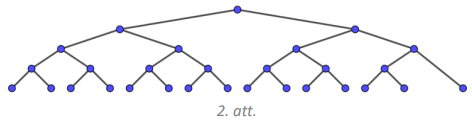
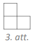
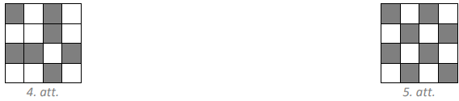
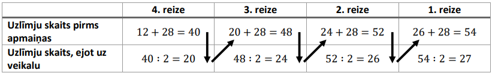
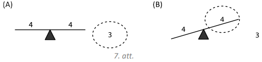
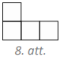
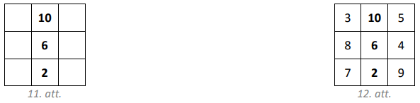

# <lo-sample/> LV.NOL.2019.5.1.

Sākumā katrā no divām tvertnēm bija $250$ litri degvielas. No pirmās tvertnes 
vispirms izlēja $\frac{1}{5}$ degvielas un tad pielēja $\frac{1}{5}$ no 
tvertnē atlikušās degvielas. Otrajā tvertnē vispirms pielēja klāt $\frac{1}{5}$
no tvertnē esošā degvielas daudzuma un tad izlēja $\frac{1}{5}$ no tvertnē 
esošās degvielas. Cik litru degvielas tagad ir katrā tvertnē?

<small>

* questionType:
* domain:

</small>

## Atrisinājums

Vispirms no pirmās degvielas tvertnes izlēja $\frac{1}{5} \cdot 250=50$ litrus 
degvielas un tvertnē palika $250-50=200$ litri degvielas. Pēc tam pielēja 
$\frac{1}{5} \cdot 200=40$ litrus degvielas. Tātad pirmajā tvertnē tagad ir 
$200+40=240$ litri degvielas.

Vispirms otrajā degvielas tvertnē ielēja $\frac{1}{5} \cdot 250=50$ litrus 
degvielas, tātad tvertnē bija $250+50=300$ litri degvielas. Pēc tam izlēja 
$\frac{1}{5} \cdot 300=60$ litrus degvielas. Tātad otrajā tvertnē tagad ir 
$300-60=240$ litri degvielas.

# <lo-sample/> LV.NOL.2019.5.2.

Dotas $15$ pēc ārējā izskata vienādas monētas, bet visas to masas ir dažādas. 
Kā, izmantojot sviras svarus bez atsvariem, ar $21$ svēršanu atrast gan pašu 
vieglāko, gan pašu smagāko monētu?

<small>

* questionType:
* domain:

</small>

## Atrisinājums

Sadalām monētas septiņos pāros (viena monēta paliek bez pāra; apzīmēsim šo 
monētu ar $M$). Salīdzinām katra pāra monētas - nosakām vieglāko un smagāko 
monētu katrā pārī. Pēc katras svēršanas vieglāko monētu liekam vienā kaudzītē, 
bet smagāko - otrā kaudzītē. Tā kā ir septiņi pāri, tad ir veiktas $7$ 
svēršanas (skat. 1.att.). Skaidrs, ka visvieglākā monēta jāmeklē starp 
vieglākajām monētām, bet vissmagākā - starp smagākajām. Apskatām katru kaudzīti
atsevišķi.

No kaudzītes, kurā ir $7$ vieglākās monētas, paņemam divas un salīdzinām tās, 
vieglāko atstājam svaros un salīdzinām ar nākamo, atkal svaros atstājot 
vieglāko. Tā turpinām, kamēr visas atlikušās monētas no šīs kaudzītes ir 
nosvērtas. Pēdējās svēršanas vieglākā monēta ir pati vieglākā šajā kaudzītē. 
Kopā tika veiktas $6$ svēršanas.

Analoģiski no kaudzītes, kurā ir $7$ smagākās monētas, atrod pašu smagāko 
monētu šajā kaudzītē - svaros visu laiku jāatstāj smagākā monēta, bet vieglākā 
jāmet prom. Kopā tika veiktas $6$ svēršanas.

Vēl atliek noskaidrot, vai monēta $M$ (monēta, kas pašā sākumā palika bez pāra)
ir vieglāka nekā atrastā vieglākā monēta vai arī smagāka nekā atrastā smagākā 
monēta. Tam nepieciešamas ne vairāk kā $2$ svēršanas.

Tātad ar $7+6+6+2=21$ svēršanu esam atraduši gan pašu vieglāko, gan pašu 
smagāko monētu.

## Atrisinājums

Sākumā izveidojam $7$ monētu pārus (skat. 2.att.) un katrā pārī noskaidrojam, 
kura ir smagākā monēta ($1.$ kārta; $7$ svēršanas). Tad šīm septiņām atrastajām
monētām klāt pievienojam vēl nesvērto monētu un izveidojam četrus monētu pārus.
Katrā pārī atrodam smagāko monētu ($2.$ kārta; $4$ svēršanas). legūtās četras 
smagākās monētas atkal sadalām divos pāros un ar $2$ svēršanām ($3.$ kārta) 
atrodam smagāko monētu katrā pārī. Veicot vēl vienu svēršanu ($4.$ kārta), esam
atraduši vissmagāko monētu no visām.

Vieglākā monēta jāmeklē no tām septiņām monētām, kas "zaudēja" (t.i., bija 
vieglākas) pirmajā kārtā, un vēl tās monētas, kas pirmajā kārtā netika svērta. 
Lai no $8$ monētām atrastu vieglāko, nepieciešamas $7$ svēršanas, piemēram, 
svaros katrā svēršanā jāatstāj vieglākā monēta, bet smagākā jānoliek prom.

Tātad kopā nepieciešama $7+4+2+1+7=21$ svēršana.

# <lo-sample/> LV.NOL.2019.5.3.

Anniņa kvadrātā $4 \times 4$ iekrāsoja dažas pelēkas rūtiņas tā, ka neveidojas 
neviens stūrītis (skat. 3.att.), kam visas rūtiņas ir pelēkas. Ja Anniņa 
iekrāsos vēl jebkuru vienu rūtiņu, tad noteikti veidosies stūrītis, kam visas 
rūtiņas ir pelēkas. Jānītis, ievērojot tos pašus nosacījumus, iekrāsoja rūtiņas
citā kvadrātā $4 \times 4$. Vai var gadīties, ka Anniņa iekrāsoja mazāk rūtiņu 
nekā Jānītis? Figūra $stūrītis$ var būt arī pagriezta.

<small>

* questionType:
* domain:

</small>

## Atrisinājums

Jā, var gadīties, piemēram, ja Anniņa iekrāsoja $7$ rūtiņas kā parādīts 4.att.,
bet Jānītis iekrāsoja $8$ rūtiņas kā parādīts 5.att.

# <lo-sample/> LV.NOL.2019.5.4.

Veikalā par $28$ uzlīmēm var saņemt mašīnu. Valentīns ieradās veikalā, kur 
pārdevējs viņam iedeva tikpat uzlīmes, cik Valentīnam jau bija, un tad viņš 
$28$ uzlīmes samainīja pret mašīnu. Nākamajā dienā Valentīns atkal ieradās 
veikalā, kur pārdevējs viņam iedeva tikpat uzlīmes, cik Valentīnam jau bija, un
$28$ viņš samainīja pret mašīnu. Tas pats notika vēl $2$ reizes. Pēc ceturtās 
reizes, kad Valentīns bija veicis apmaiņu, viņam vēl palika $12$ uzlīmes. Cik 
uzlīmes bija Valentīnam pirms pirmā veikala apmeklējuma? (Ārpus šī veikala 
Valentīns uzlīmes nesaņem un netērē.)

<small>

* questionType:
* domain:

</small>

## Atrisinājums

Risinām šo uzdevumu no beigām (skat. tabulā).

Tātad Valentīnam pirms pirmā veikala apmeklējuma bija $27$ uzlīmes.

# <lo-sample/> LV.NOL.2019.5.5.

Vai vārdā $NEAPJAUŠAMAIS$ var aizvietot burtus ar cipariem tā, ka dažādus 
burtus aizstāj dažādi cipari (burti $S$ un Š ir aizstāti ar atšķirīgiem 
cipariem), bet vienādus - vienādi, turklāt izveidotais skaitlis ir pirmskaitlis?

<small>

* questionType:
* domain:

</small>

## Atrisinājums

Nē, nevar. Vārdā $NEAPJAUŠAMAIS$ izmantoti desmit atšķirīgi burti, tātad būtu 
jāizmanto visi desmit cipari. Tad $NEAPJAUŠAMAIS$ ciparu summa būtu

$$(N+E+A+P+J+U+Š+M+I+S)+3 \cdot A=45+3 \cdot A$$

kas dalās ar $3$, līdz ar to arī pats skaitlis dalītos ar $3$. Vienīgais 
pirmskaitlis, kas dalās ar $3$, ir pats skaitlis $3$, bet dotais ir 
desmitciparu skaitlis, tātad tas nevar būt pirmskaitlis.

# <lo-sample/> LV.NOL.2019.6.1.

Konkursā bija $90$ jautājumu. Par katru pareizu atbildi var iegūt $3$ punktus, 
par katru nepareizu atbildi tiek atņemts $1$ punkts. Ja uz kādu jautājumu nav 
sniegta atbilde, tad par šo jautājumu ir $0$ punktu. Olafs konkursā ieguva 
$200$ punktus un zināms, ka viņš uz $10$ jautājumiem atbildēja nepareizi. Uz 
cik jautājumiem Olafs nesniedza atbildi?

<small>

* questionType:
* domain:

</small>

## Atrisinājums

Tā kā Olafs uz $10$ jautājumiem atbildēja nepareizi, tad par pareizajām 
atbildēm kopējais iegūto punktu skaits tika samazināts par $10$, tas ir, par 
pareizajām atbildēm iegūtais punktu skaits bija $200+10=210$. Tā kā par katru 
pareizu atbildi iegūst $3$ punktus, tad Olafs pareizi atbildēja uz $210:3=70$ 
jautājumiem. Tātad Olafs nesniedza atbildi uz $90-10-70=10$ jautājumiem.

# <lo-sample/> LV.NOL.2019.6.2.

Dotas $11$ pēc ārējā izskata vienādas monētas, no kurām $10$ ir īstas, bet 
viena ir viltota. Īstās monētas masa ir $12$ grami, bet viltotās - $11$ grami. 
Kā ar $3$ svēršanām uz sviras svariem bez atsvariem atrast viltoto monētu?

<small>

* questionType:
* domain:

</small>

## Atrisinājums

Katrā svaru kausā ieliekam $5$ monētas, vienu monētu atstājot malā.

(A) Ja svaru kausi ir līdzsvarā, tad viltotā monēta ($11 g$) ir tā, kas nebija 
    uz svariem (skat. 6.att. (A)).

(B) Ja svaru kausi nav līdzsvarā, tad viltotā monēta atrodas uz "vieglākā" 
    svaru kausa (skat. 6.att. (B)). Otrajā svēršanā katrā svaru kausā ieliekam 
	$2$ monētas no "vieglākā" kausa, vienu monētu atstājot malā.

- Ja svaru kausi ir līdzsvarā, tad viltotā monēta ir tā, kas šajā svēršanā bija
  atlikta malā.
- Ja svaru kausi nav līdzsvarā, tad viltotā monēta atrodas uz "vieglākā" svaru 
  kausa. Trešajā svēršanā katrā svaru kausā ieliekam pa vienai monētai no 
  "vieglākā" kausa. Viltotā monēta atrodas uz "vieglākā" svaru kausa.

## Atrisinājums

Katrā svaru kausā ieliekam $4$ monētas, $3$ monētas atstājot malā.

(A) Ja svaru kausi ir līdzsvarā, tad viltotā monēta ir kaudzītē, kas nebija uz 
    svariem (skat. 7.att. (A)). Otrajā svēršanā katrā svaru kausā liekam pa 
	vienai monētai no šīs kaudzītes, vienu monētu atstājot malā.

- Ja svaru kausi ir līdzsvarā, tad viltotā monēta ir tā, kas šajā svēršanā bija
  atlikta malā.
- Ja svaru kausi nav līdzsvarā, tad viltotā monēta ir tā, kas atrodas 
  "vieglākajā" svaru kausā.

(B) Ja svaru kausi nav līdzsvarā, tad viltotā monēta atrodas uz "vieglākā" 
    svaru kausa (skat. 7.att. (B)). Otrajā svēršanā katrā svaru kausā ieliekam 
	$2$ monētas no "vieglākā" kausa. Svari noteikti nosvērsies. Izvēlamies tās 
	divas monētas, kas atrodas "vieglākajā" kausā un trešajā svēršanā tās 
	salīdzinām savā starpā. Viltotā monēta atradīsies "vieglākajā" kausā.

# <lo-sample/> LV.NOL.2019.6.3.

Vai taisnstūri ar izmēriem **a)** $5 \times 8$, **b)** $5 \times 12$ rūtiņas 
var pārklāt ar 8.att. redzamajām figūrām? Taisnstūrim jābūt pilnībā pārklātam. 
Figūras nedrīkst iziet ārpus taisnstūra un nedrīkst pārklāties, tās drīkst būt 
pagrieztas vai apgrieztas spoguļattēlā.

<small>

* questionType:
* domain:

</small>

## Atrisinājums

**a)** Jā, var, piemēram, skat. 9.att.

**b)** Nē, nevar. lekrāsosim doto taisnstūri joslās (skat. 10.att.), tad 
taisnstūrī ir iekrāsotas $30$ (pāra skaitlis) melnas un $30$ (pāra skaitlis) 
baltas rūtiņas. Ja taisnstūri varētu pārklāt, tad tas būtu pārklāts ar tieši 
$60:4=15$ figūrām. Lai kā arī šajā kvadrātā tiktu novietota dotā figūra, tā 
pārklās vai nu tieši vienu melnu rūtiņu, vai tieši $3$ melnas rūtiņas (skat. 
10.att.), tātad nepāra skaita melnas rūtiņas. Tāpēc arī $15$ (nepāra skaitlis) 
šādas figūras kopā var pārklāt tikai nepāra skaita melnas rūtiņas. Tā kā nepāra
skaitlis nevar būt vienāds ar pāra skaitli - melno rūtiņu skaitu visā 
taisnstūrī, tad taisnstūri pārklāt nevar.

# <lo-sample/> LV.NOL.2019.6.4.

Aizpildi doto kvadrātu (skat. 11.att.), tukšajās rūtiņās ierakstot pa vienam 
naturālam skaitlim, tā, lai visi deviņi skaitļi ir dažādi un visās rindās, 
visās kolonnās un abās diagonālēs skaitļu summas būtu vienādas! (Pietiek 
parādīt vienu veidu, kā to izdarīt.)

<small>

* questionType:
* domain:

</small>

## Atrisinājums

Skaitļu izkārtojumu skat., piemēram, 12.att.

$Piezīme.$ Atrast atrisinājumu var palīdzēt tālāk aprakstītie spriedumi.

Visās rindās, kolonnās un diagonālēs skaitļu summai jābūt $10+6+2=18$. 
Aplūkojam augšējo rindu. Tajā trūkst divu skaitļu, kuru summai jābūt $8$. Tie 
nevar būt $4$ un $4$ (jo visiem skaitļiem jābūt dažādiem), kā arī $6$ un $2$, 
jo tie jau ir izmantoti, tātad atliek varianti $5$ un $3$ vai $7$ un $1$. 
Pārbaudot pirmo variantu, nonākam pie dotā atrisinājuma, bet, pārbaudot otro 
variantu, iegūst, ka vienam skaitlim jābūt $0$, kas neder, jo visiem skaitļiem 
jābūt naturāliem.

$Piezīme.$ Atrisinājumu var iegūt kā sekas no $3 \times 3$ maģiskā kvadrāta, 
pieskaitot $1$.

# <lo-sample/> LV.NOL.2019.6.5.

Dots, ka $LAI + ŠIS + IR + LABS=2019$ un $IR + IR = LAI$. Parādi vienu piemēru,
kādi cipari var būt burtu vietās, lai dotās vienādības būtu patiesas un 
vienādus ciparus aizstātu vienādi burti, dažādus - dažādi (burti $Š$ un $S$ ir 
atšķirīgi).

<small>

* questionType:
* domain:

</small>

## Atrisinājums

Vienīgais šī uzdevuma atrisinājums ir $L=1; A=2; I=6; Š=5; S=0; R=3; B=7$, tad 
iegūstam patiesas vienādības $126+560+63+1270=2019$ un $63+63=126$.

$Piezīme.$ Atrast atrisinājumu var palīdzēt tālāk aprakstītie spriedumi.

Tā kā divu divciparu skaitļu summa ir trīsciparu skaitlis, tas ir, 
$IR + IR = LAI$, tad vienīgā iespēja, ka $L=1$. No šīs vienādības izriet arī, 
ka $I$ ir lielāks nekā $4$, turklāt tam jābūt pāra skaitlim. Tātad jāpārbauda 
iespējamās vērtības $I=6$ un $I=8$. levietojot šīs vērtības vienādojumā 
$LAI + ŠIS + IR + LABS=2019$, un šķirojot dažādos gadījumus, pakāpeniski atrod 
$R, A, Š$ un $S$ vērtības. Daļa no gadījumiem ir nederīgi, jo dažādiem burtiem 
atbilst vienādi cipari.

# <lo-sample/> LV.NOL.2019.7.1.

Doti trīs vienādojumi $ax+b=0, bx+c=0$ un $cx+a=0$. Neviens no koeficientiem 
$a, b, c$ nav $0$.

**a)** Vai var gadīties, ka tieši diviem no šiem vienādojumiem saknes ir 
       vienādas?

**b)** Vai noteikti vismaz vienam no šiem vienādojumiem ir negatīva sakne?

<small>

* questionType:
* domain:

</small>

## Atrisinājums

**a)** Jā, var. Piemēram, ja $a=4, b=8, c=2$, tad vienādojumi ir 
$4x+8=0, 8x+2=0$ un $2x+4=0$ un to saknes attiecīgi ir $x=-2, x=-0,25$ un 
$x=-2$.

**b)** Jā, noteikti. Doto vienādojumu saknes ir 
$x=-\frac{b}{a^{\prime}} x=-\frac{c}{b}$ un $x=-\frac{a}{c}$. Sakņu reizinājums
ir $-\frac{b}{a} \cdot\left(-\frac{c}{b}\right) \cdot\left(-\frac{a}{c}\right)=-1$,
tātad vismaz viena sakne ir negatīva.

# <lo-sample/> LV.NOL.2019.7.2.

Dotas $14$ pēc ārējā izskata vienādas monētas. Zināms, ka $13$ monētu masas ir 
vienādas savā starpā, bet vienas monētas masa ir citāda. Kā ar divām svēršanām 
uz sviras svariem bez atsvariem noskaidrot, vai atšķirīgā monēta ir vieglāka 
vai smagāka nekā pārējās? (Pašu monētu atrast nav nepieciešams.)

<small>

* questionType:
* domain:

</small>

## Atrisinājums

Uzliekam uz katra svaru kausa $4$ monētas, malā atstājot $6$ monētas.

(A) Ja kausi ir līdzsvarā, tad atšķirīgā monēta palikusi malā (skat. 
13.att. (A)). Otrajā svēršanā salīdzinām malā palikušās $6$ monētas ar jebkurām
$6$ jau svērtajām (parastajām) monētām.

- Ja svaru kauss ar 6 parastajām monētām nosveras uz leju, tad atškirīgā monēta ir vieglāka nekā pārējās.
- Ja svaru kauss ar 6 parastajām monētām nosveras uz augšu, tad atškirīgā monēta ir smagāka nekā pārējās.

(B) Ja pirmajā svēršanā svari nav līdzsvarā, tad atškirīgā monēta ir atradusies uz svariem (skat. 13.att. (B)). Otrajā svēršanā salīdzinām vieglākā kausa 4 monētas ar jebkurām 4 malā palikušajām (parastajām) monētām.

- Ja svaru kausi ir līdzsvarā, tad atškirīgā monēta pirmajā svēršanā ir bijusi uz "smagākā" kausa un ir smagāka nekā citas monētas.
- Ja svaru kausi nav līdzsvarā, tad atškirīgā monēta pirmajā svēršanā ir bijusi uz "vieglākā" kausa un ir vieglāka nekā citas monētas.

(A)

(B)

6

13. att

## Atrisinājums

2. atrisinājums. Uzliekam uz katra svaru kausa 5 monētas, malā atstājot 4 monētas.

(A) Ja kausi ir līdzsvarā, tad atškirirīgā monēta palikusi malā (skat. 14.att. (A)). Otrajā svēršanā salīdzinām malā palikušās 4 monētas ar jebkurām 4 jau svērtajām (parastajām) monētām.

- Ja svaru kauss ar 4 parastajām monētām nosveras uz leju, tad atškirīgā monēta ir vieglāka nekā pārējās.
- Ja svaru kauss ar 4 parastajām monētām nosveras uz augšu, tad atškirīgā monēta ir smagāka nekā pārējās.

(B) Ja pirmajā svēršanā svari nav līdzsvarā, tad atškirīgā monēta ir atradusies uz svariem (skat. 14.att. (B)). Izvēlamies vieglākā kausa monētas un tām pievienojam vienu parasto monētu, kas pirmajā svēršanā bija atlikta malā. legūstam kaudzīti ar 6 monētām. Otrajā svēršanā katrā svaru kausā liekam pa 3 monētām no šīs kaudzītes.

- Ja svaru kausi ir līdzsvarā, tad atškirīgā monēta pirmajā svēršanā ir bijusi uz "smagākā" kausa un ir smagāka nekā citas monētas.
- Ja svaru kausi nav līdzsvarā, tad atškirīgā monēta pirmajā svēršanā ir bijusi uz "vieglākā" kausa un ir vieglāka nekā citas monētas.

(A)

(B)

# <lo-sample/> LV.NOL.2019.7.3.

7.3. Anniņa kvadrātā $6 \times 6$ iekrāsoja dažas pelēkas rūtinas tā, ka neveidojas neviens stūrītis (skat. 15.att.), kam visas rūtiņas ir pelēkas. Ja Anniņa iekrāsos vēl jebkuru vienu rūtiņu, tad noteikti veidosies stūrītis, kam visas rūtiņas ir pelēkas. Jānītis, ievērojot tos pašus nosacījumus, iekrāsoja rūtinas citā kvadrātā $6 \times 6$. Vai var gadīties, ka Anniņa iekrāsoja mazāk rūtinuu nekā Jānītis? Figūra stūrītis var būt arī pagriezta.

Atrisin
<small>

* questionType:
* domain:

</small>

## Atrisinājums
ājums. Jā, var gadīties, piemēram, ja Anniņa iekrāsoja 12 rūtinas kā parādīts 16.att., bet Jānītis iekrāsoja 18 rūtiņas kā parādīts 17.att.

# <lo-sample/> LV.NOL.2019.7.4.

7.4. Vai var atrast tādus veselus skait|us $a$ un $b$, ka $a b(a+5 b)=150015$ ?

<small>

* questionType:
* domain:

</small>

## Atrisinājums

Atrisinājums. Pamatosim, ka nevar atrast prasītos skait|us. Ja $a$ vai $b$ ir pāra skaitlis, tad vienādojuma kreisās puses izteiksmes vērtība ir pāra skaitlis, kas nevar būt vienāds ar nepāra skaitli 150015. Ja $a$ un $b$ abi ir nepāra skaitli, tad $(a+5 b)$ ir pāra skaitlis un vienādojuma kreisās puses izteiksmes vērtība ir pāra skaitlis, kas nevar būt vienāds ar nepāra skaitli 150015. Tātad nevar atrast tādus veselus skait|us $a$ un $b$, lai dotā vienādība būtu patiesa.

# <lo-sample/> LV.NOL.2019.7.5.

7.5. Uz tāfeles uzrakstītas deviņas zvaigznītes *

. Mārtiņš ieraksta kādas zvaigznītes vietā jebkuru ciparu no 1 līdz 9. Pēc tam Rihards jebkuru divu citu zvaigznīšu vietā ieraksta divus nenulles ciparus (tie var arī atkārtoties). Pēc tam vēl divas reizes vinii atkārto šo darbību. Rihards uzvar, ja iegūtais deviņciparu skaitlis dalās ar 31. Vai Rihards vienmēr var uzvarēt?

<small>

* questionType:
* domain:

</small>

## Atrisinājums

Atrisinājums. Pamatosim, ka Rihards vienmēr var uzvarēt.

Sadalām visus ciparus grupās pa trim cipariem katrā $(* * *)(* * *)(* * *)$. Tad deviņciparu skaitli varam izteikt kā $A \cdot 10^{6}+B \cdot 10^{3}+C$, kur $A, B$ un $C$ ir trīsciparu skaitļi, kas izveidojas attiecīgi pirmajā, otrajā un trešajā grupā. Ja Rihardam izdosies panākt, ka katrā grupā izveidotais trīsciparu skaitlis $A, B$ un $C$ dalās ar 31, tad arī iegūtais devinciparu skaitlis dalīsies ar 31 (ja katrs saskaitāmais dalās ar 31, tad arī summa dalās ar 31) un Rihards būs uzvarējis.

levērojam, ka ar 31 dalās trīsciparu skait!̣i 124, 248, 372, 465, 496, 589, 651, 713, 837 un 992. Kad Mārtiņš aizvieto zvaigznīti, kas atrodas kādā grupā, Rihards atlikušās divas tās pašas grupas zvaigznītes aizvieto tā, lai tās kopā veidotu kādu no desmit minētajiem trīsciparu skaitliem. Tā kā katrā no trim pozīcijām (vieni, desmiti, simti) minētajos skaitlos var atrast jebkuru ciparu no 1 līdz 9, tad to vienmēr ir iespējams izdarīt.

Piezīme. Var izvēlēties arī citus trīsciparu skaitlus, kas dalās ar 31. Ar 31 dalās šādi trīsciparu skaitli: 124; 155; $186 ; 217 ; 248 ; 279 ; 310 ; 341 ; 372 ; 403 ; 434 ; 465 ; 496 ; 527 ; 558 ; 589 ; 620 ; 651 ; 682 ; 713 ; 744 ; 775 ; 806 ; 837$; $868 ; 899 ; 930 ; 961 ; 992$.

# <lo-sample/> LV.NOL.2019.8.1.

8.1. Taisnstūra vienas malas garums ir $(2 \sqrt{3}-\sqrt{6})(2 \sqrt{3}+\sqrt{6})$, bet otras malas garums ir $(\sqrt{3})^{2}+\sqrt{1 \frac{7}{9}}$. Aprēḳināt malas garumu kvadrātam, kura laukums ir tikpat liels kā dotajam taisnstūrim (atbildi vienkāršot)!

<small>

* questionType:
* domain:

</small>

## Atrisinājums

Atrisinājums. Aprēkinām taisnstūra malu garumus:

$$
\begin{aligned}
& (2 \sqrt{3}-\sqrt{6})(2 \sqrt{3}+\sqrt{6})=(2 \sqrt{3})^{2}-(\sqrt{6})^{2}=4 \cdot 3-6=6 \\
& (\sqrt{3})^{2}+\sqrt{1 \frac{7}{9}}=3+\sqrt{\frac{16}{9}}=3+\frac{4}{3}=4 \frac{1}{3}
\end{aligned}
$$

Taisnstūra laukums ir $6 \cdot 4 \frac{1}{3}=26$. Līdz ar to kvadrāta malas garums ir $\sqrt{26}$.

# <lo-sample/> LV.NOL.2019.8.2.

8.2. Zināms, ka no 26 monētām viena ir viltota - tā ir vieglāka nekā pārējās, kurām visām ir vienāda masa. Kā ar trīs svēršanām uz sviras svariem bez atsvariem atrast viltoto monētu?

<small>

* questionType:
* domain:

</small>

## Atrisinājums

Atrisinājums. Sadalām monētas trīs kaudzītēs: divas kaudzītes pa 9 monētām katrā un viena kaudzīte, kurā ir 8 monētas.

Pirmajā svēršanā salīdzinām kaudzītes, kurās ir pa 9 monētām. lespējami divi gadīumi.

(A) Ja viens svaru kauss ir vieglāks nekā otrs, tad uz tā atrodas viltotā monēta.

(B) Ja abi svaru kausi ir līdzsvarā, tad viltotā monēta ir tajā kaudzītē, kas šajā svēršanā atradās malā.

Līdzīgi rīkojamies un spriežam arī visās nākamajās svēršanās: izvē̄amies to kaudzīti, kurā atrodas viltotā (vieglākā) monēta un dalām to mazākās kaudzītēs, katru reizi salīdzinot kaudzītes, kurās ir vienāds monētu skaits un nosakot, kurā kaudzītē atrodas vieglākā monēta. Dališana mazākās kaudzītēs shematiski attēlota 18.att. Piezīme. Lai gadījums ar 8 monētām nebūtu jāapskata atsevišḳi, varam šai kaudzītei pievienot vienu "parasto" monētu.

18. att

# <lo-sample/> LV.NOL.2019.8.3.

8.3. Izliekta piecstūra $A B C D E$ diagonālu $A C$ un $B D$ krustpunkts ir $M, A C$ un $B E$ krustpunkts ir $K$. Zināms, ka $A K=C M$ un $B K=K E=A E$. Pierādīt, ka $E M=B C$.

<small>

* questionType:
* domain:

</small>

## Atrisinājums

Atrisinājums. levērosim, ka $\triangle M A E=\triangle C K B$ pēc pazīmes m \ell m , jo

○ $A M=A K+K M=M C+K M=K C$ (skat. 19.att.);

○ tā kā $\Varangle E A K=\Varangle A K E$ kā leņki pie pamata vienādsānu trijstūrī $A E K$ un $\Varangle A K E=\Varangle B K C$ kā krustleņki, $\operatorname{tad} \Varangle E A M=\Varangle B K C$;

- $A E=K B$ pēc dotā.

Līdz ar to $E M=B C$ kā atbilstošās malas vienādos trijstūros.

19.att.

# <lo-sample/> LV.NOL.2019.8.4.

8.4. Uz tāfeles uzrakstīti skaitli $\frac{3}{2}, \frac{4}{5}, \frac{5}{3}$. Ar vienu gājienu atļauts izvēlēties divus no uzrakstītajiem skaitlliem (apzīmēsim tos ar $a$ un $b$ ), nodzēst tos un to vietā uzrakstīt uz tāfeles skait|lus $\frac{b^{2}}{a}$ un $\frac{a^{2}}{b}$. Vai, izdarot vairākus šādus gājienus, var panākt, lai uz tāfeles vienlaicīgi būtu uzrakstīti skaitli $\frac{4}{3}, \frac{4}{5}, \frac{5}{2}$ ?

<small>

* questionType:
* domain:

</small>

## Atrisinājums

Atrisinājums. Nē, nevar. Izdarot gājienus, uz tāfeles uzrakstīto skait|u reizinājums nemainās, tas ir, ja uz tāfeles pirms gājiena izdarīšanas ir uzrakstīti skaitļi $a, b, c$, tad to reizinājums ir $a \cdot b \cdot c$, un arī pēc gājiena izdarīšanas uz tāfeles uzrakstīto skaitlu reizinājums ir $\frac{b^{2}}{a} \cdot \frac{a^{2}}{b} \cdot c=a \cdot b \cdot c$. Tā kā sākumā uzrakstīto skaitlu reizinājums ir $\frac{3}{2} \cdot \frac{4}{5} \cdot \frac{5}{3}=2$, bet skait|u $\frac{4}{3}, \frac{4}{5}, \frac{5}{2}$ reizinājums ir $\frac{4}{3} \cdot \frac{4}{5} \cdot \frac{5}{2}=\frac{8}{3}$, tad prasītais nav iespējams.

# <lo-sample/> LV.NOL.2019.8.5.

8.5. Izmantojot divus atškirīgus nenulles ciparus $x$ un $y$ ir izveidoti divi trīsciparu skaitli $\overline{x y x}$ un $\overline{y x y}$. Zināms, ka $\overline{x y x}$ dalās ar 3 , bet $\overline{y x y}$ dalās ar 4. Kāds var būt izveidotais trīsciparu skaitlis $\overline{y x y}$ ?

<small>

* questionType:
* domain:

</small>

## Atrisinājums

Atrisinājums. Skaitlis dalās ar 3 tad, ja tā ciparu summa dalās ar 3 . Tātad $(2 x+y)$ dalās ar 3 .

Skaitlis dalās ar 4 tad, ja tā divu pēdējo ciparu veidotais skaitlis dalās ar 4. Tātad $\overline{x y}=10 x+y$ dalās ar 4 .

levērojam, ka $10 x+y=8 x+2 x+y$. Tā kā $10 x+y$ dalās ar 4 un $8 x$ dalās ar 4 , tad arī $(2 x+y)$ ir jādalās ar 4. Bet tas nozīmē, ka $(2 x+y)$ ir jādalās ar 12 , jo 3 un 4 ir savstarpēji pirmskaitļi. levērojot, ka $x$ un $y$ ir cipari $(2 x+y<27)$, iespējami divi gadīumi:

○ ja $2 x+y=12$ jeb $y=12-2 x$, tad ievērojam, ka $x \leq 5$, un pārbaudām visus iespējamos gadījumus:

| $x$ | 1 | 2 | 3 | 4 | 5 |
| :---: | :---: | :---: | :---: | :---: | :---: |
| $y=12-2 x$ | 10 | 8 | 6 | 4 |  |
|  | (neder, jo nav cipars) |  |  | (neder, jo $x=y$ ) |  |

○ ja $2 x+y=24$ jeb $y=24-2 x$, tad ievērojam, ka $x>7$, un pārbaudām abus iespējamos gadījumus:

| $x$ | 8 | 9 |
| :---: | :---: | :---: |
| $y=24-2 x$ | 8 | 6 |

Līdz ar to trīsciparu skaitlis $\overline{y x y}$ var būt $828,636,252,696$.

Piezīme. Uzdevumu var atrisināt, veicot pilno pārlasi, tas ir, pārbaudot visus divciparu skait|us $\overline{x y}$, kas dalās ar 4 .

# <lo-sample/> LV.NOL.2019.9.1.

9.1. Lineāra funkcija $y=\left(m^{2}-3 m\right) x+4 m-4$ krusto $x$ asi punktā, kura abscisa ir 2. Atrodi $m$ vērtības un noskaidro, vai atbilstošā funkcija ir augoša vai dilstoša!

<small>

* questionType:
* domain:

</small>

## Atrisinājums

Atrisinājums. Dotā funkcija krusto $x$ asi punktā $(2 ; 0)$, ievietojot šīs vērtīas dotajā funkcijā, iegūstam vienādojumu $0=\left(m^{2}-3 m\right) \cdot 2+4 m-4$ jeb $m^{2}-m-2=0$, kura saknes ir $m_{1}=-1$ un $m_{2}=2$. Tātad iespējami divi gadijumi:

- ja $m=-1$, tad dotā funkcija ir $y=4 x-8$ un tā ir augoša, jo koeficients pie $x$ ir pozitivss;
- ja $m=2$, tad dotā funkcija ir $y=-2 x+4$ un tā ir dilstoša, jo koeficients pie $x$ ir negatīvs .

# <lo-sample/> LV.NOL.2019.9.2.

9.2. Dotas divas melnas, divas sarkanas un divas zalas lodītes. Vienas lodītes masa ir 99 g , bet tādas pašas krāsas otras lodītes masa ir 101 g . Pārējās četras lodītes katra sver 100 g . Kā, lietojot sviras svarus bez atsvariem, ar divām svēršanām atrast vieglāko lodīti?

<small>

* questionType:
* domain:

</small>

## Atrisinājums

1. atrisinājums. Pirmajā svēršanā salī̀dzinām vienas sarkanās un vienas melnās lodītes masu.
1) Ja svari ir līdzsvarā (skat. 20.att.), tad melnās un sarkanās lodītes katra sver 100 g , tātad vieglākā lodīte ir zalā krāsā. Otrajā svēršanā, salīdzinot abas zalās lodītes, atrodam vieglāko.

$100 \mathrm{~g} \quad 100 \mathrm{~g}$

2) Apskatām gadīumu, kad svari nav līdzsvarā. Nezaudējot vispārīgumu, varam pienemt, ka sarkanā lodīte ir smagāka nekā melnā. Tad iespējami divi gadījumi (skat. 21.att.):

- sarkanā lodīte sver 100 g un melnā- 99 g ;
- sarkanā lodīte sver 101 g un melnā- 100 g .

Tātad vieglākā lodīte ir vai nu tā, kas atrodas uz vieglākā svaru kausa, vai otra no sarkanajām. Otrajā svēršanā salīdzinot šīs abas lodītes (to, kas atrodas uz vieglākā svaru kausa un nesvērto sarkano lodīti), atrodam vieglāko. (Piezīme. Otrajā svēršanā var salīdzināt arī to lodīti, kas atrodas uz vieglākā svaru kausa ar kādu no zalajām.)

## Atrisinājums

2. atrisinājums. Pirmajā svēršanā katrā kausā liekam no katras krāsas pa vienai lodītei (katrā svaru kausā ir 3 lodītes). Svari noteikti nebūs līdzsvarā, jo viens no kausiem saturēs vieglo lodīti, bet otrs saturēs smago lodīti. Tagad atliek tikai uzzināt, kura no lodītēm vieglajā kausā ir tā, kas sver 99 g . Otrajā svēršanā salīdzinām jebkuras divas lodītes no vieglā kausa:

- ja svari ir līdzsvarā, tad abas lodītes sver 100 g un tā, kura netika svērta, ir meklētā lodīte, kas sver 99 g ;
- ja svari nav līdzsvarā, tad vieglākais kauss ir tas, kurš satur meklēto lodīti.

3. atrisinājums. Pirmajā svēršanā vienā kausā ieliekam abas zalā̄s lodītes un otrā ieliekam vienu melnu un vienu sarkanu lodīti. Jaaapskata trīs gadijumi.
1) Ja svari ir līdzsvarā, tad tas nozīmē, ka zalās lodītes ir tās, kuru masas nav 100 g . Otrajā svēršanā salīdzinām zaļās lodītes, lai atrastu vieglāko.
2) Ja kauss ar zalajajām lodītēm ir smagāks, tad lodīte, kuras masa ir 99 g atrodas vieglākajā kausā un ir vai nu sarkana, vai melna. Otrajā svēršanā salīdzinām abas melnās lodītes:

- ja svari ir līdzsvarā, tad sarkanā lodīte, ko izmantojām pirmajā svēršanā, sver 99 g ;
- ja svari nav līdzsvarā, tad vieglākā melnā lodīte sver 99 g .

3) Ja kauss ar melno un sarkano lodīti ir smagāks, tad tajā atrodas lodīte, kas sver 101 g . Otrajā svēršanā salīdzinām abas melnās lodītes:

- ja svari i līdzsvarā, tad tā sarkanā lodīte, ko neizmantojām pirmajā svēršanā, sver 99 g ;
- ja svari nav līdzsvarā, tad vieglākajā kausā atrodas vieglākā melnā lodīte, kas sver 99 g .

# <lo-sample/> LV.NOL.2019.9.3.

9.3. Uz kvadrāta $A B C D$ malām $A B, B C, C D$ un $D A$ attiecīgi atzīmēti punkti $E, F, G, H$ tā, ka $A E=B F=C G=D H . \quad$ Kvadrāta iekšpusē atlikts patvalịgs punkts $O . \quad$ Pierādīt, ka $S_{A E O H}+S_{F C G O}=S_{B F O E}+S_{D H O G}$.

<small>

* questionType:
* domain:

</small>

## Atrisinājums

1. atrisinājums. Nezaudējot vispārīgumu, varam pienemt, ka kvadrāta malas garums ir 1. Apzīmējam $A E=B F=C G=D H=x$, tad $D G=B E=1-x$. Novelkam nogriežņus $O B$ un $O D$ (skat. 22.att.).

levērojam, ka no punkta $O$ ir novilkti divi perpendikuli attiecīgi pret kvadrāta paralēlajām malām $B C$ un $A D$, tātad šo perpendikulu (apzīmējam attiecīgi ar $h_{B C}$ un $h_{A D}$ ) summa ir attālums starp paralēlajām malām, no kā secinām, ka $h_{B C}+h_{A D}=1$. Izmantojot trijstūra laukuma aprēkināšanas formulu $S_{\Delta}=\frac{1}{2} a h_{a}$, iegūstam

$$
S_{O B F}+S_{O H D}=\frac{1}{2} B F \cdot h_{B F}+\frac{1}{2} H D \cdot h_{H D}=\frac{1}{2} x \cdot\left(h_{B F}+h_{H D}\right)=\frac{1}{2} x \cdot 1=\frac{1}{2} x
$$

Līdzīgi aprēkinām, ka $S_{O B E}+S_{O D G}=\frac{1}{2}(1-x)$.

Tātad

$$
\begin{gathered}
S_{B F O E}+S_{D H O G}=S_{O B F}+S_{O H D}+S_{O B E}+S_{O D G}=\frac{1}{2} x+\frac{1}{2}(1-x)=\frac{1}{2} \\
S_{A E O H}+S_{F C G O}=S_{A B C D}-\left(S_{B F O E}+S_{D H O G}\right)=1-\frac{1}{2}=\frac{1}{2}
\end{gathered}
$$

Līdz ar to esam pierādijuši, ka $S_{A E O H}+S_{F C G O}=S_{B F O E}+S_{D H O G}$.

## Atrisinājums

2. atrisinājums. Novelkam nogriežnuus $E F, F G, G H$ un $H E$ (skat. 23.att.). Trijstūri $H A E, E B F, F C G$ un $G D H$ ir vienādi pēc pazīmes $m \ell m$ un to laukumi arī ir vienādi, tātad pietiek pierādīt, ka $S_{E O F}+S_{G O H}=S_{F O G}+S_{H O E}$. Tā kā trijstūri $H A E, E B F, F C G$ un $G D H$ ir vienādi taisnlenka trijstūri, tad $E F=F G=G H=H E=a$ un divu trijstūra šauro lenku summa ir $90^{\circ}$, tas ir, viens no tiem ir $\alpha$, bet otrs ir $\left(90^{\circ}-\alpha\right)$. Tāpēc

$$
\Varangle H E F=\Varangle E F G=\Varangle F G H=\Varangle G H E=180^{\circ}-\alpha-\left(90^{\circ}-\alpha\right)=90^{\circ}
$$

Līdz ar to četrstūris $E F G H$ ir kvadrāts.

Izmantojot trijstūra laukuma aprēkināšanas formulu $S_{\Delta}=\frac{1}{2} a h_{a}$, iegūstam

$$
S_{E O F}+S_{G O H}=\frac{1}{2} E F \cdot h_{E F}+\frac{1}{2} G H \cdot h_{G H}=\frac{1}{2} a\left(h_{E F}+h_{G H}\right)=\frac{1}{2} a^{2}
$$

Līdzīgi iegūstam, ka $S_{F O G}+S_{H O E}=\frac{1}{2} a^{2}$. Tātad esam pierādījuši, ka $S_{E O F}+S_{G O H}=S_{F O G}+S_{H O E}$, un līdz ar to $\operatorname{arī} S_{A E O H}+S_{F C G O}=S_{B F O E}+S_{D H O G}$.

# <lo-sample/> LV.NOL.2019.9.4.

9.4. Kvadrāts sastāv no $n \times n$ rūtịām. Rindas sanumurētas no lejas uz augšu ar skaitliem $1 ; 2 ; \ldots$; $n$ tāpat sanumurētas kolonnas no kreisās uz labo pusi. Katrā rūtiņā ierakstīts vai nu (+1), vai ( -1 . Ja rindas un kolonnas numuri ir vienādi, tad visu šajā rindā ierakstīto skait|u reizinājums atškiras no visu šajā kolonnā ierakstīto skait|u reizinājuma. Vai tas ir iespējams, ja a) $n=7$, b) $n=8$ ?

<small>

* questionType:
* domain:

</small>

## Atrisinājums

Atrisinājums. a) Nē, nav iespējams. levērojam, ka rindā vai kolonnā visu ierakstīto skaitlu reizinājums var būt tikai $(+1)$ vai $(-1)$. Apzīmēsim rindās ierakstīto skaitlu reizinājumus attiecīgi ar $r_{1}, r_{2}, \ldots, r_{7}$ un kolonnās ierakstīto skaitlu reizinājumus attiecīgi ar $k_{1}, k_{2}, \ldots, k_{7}$. No dotā secinām, ka $i$-tajā rindā un $i$-tajā kolonnā ierakstīos skaitlu reizinājumi ir attiecīgi (+1) un (-1), vai otrādi. Līdz ar to $r_{1} \cdot k_{1}=r_{2} \cdot k_{2}=\ldots=r_{7} \cdot k_{7}=-1$, tātad

$$
\left(r_{1} \cdot r_{2} \ldots \cdot r_{7}\right) \cdot\left(k_{1} \cdot k_{2} \cdot \ldots \cdot k_{7}\right)=\left(r_{1} \cdot k_{1}\right)\left(r_{2} \cdot k_{2}\right) \ldots\left(r_{7} \cdot k_{7}\right)=-1
$$

Taču šis reizinājums ir visu tabulā ierakstīto skait]u reizinājuma kvadrāts - pretruna, jo skait|a kvadrāts ir nenegatīvs. Tātad kvadrātā $7 \times 7$ nav iespējams ierakstīt skait|us atbilstoši uzdevuma nosacijumiem.
b) Jā, ir iespējams, noteikumiem atbilstošu skait|u izvietojumu skat., piemēram, 24.att., kur tukšajās rūtiņās ierakstīts (+1).

1. 2. 3. 4. 5. 6. 7. 8 .
1.att.

# <lo-sample/> LV.NOL.2019.9.5.

9.5. Kāds mazākais ciparu skaits jāpieraksta ciparu virknes 3456 beigās, lai iegūtu skaitli, kas dalās ar 2019?

<small>

* questionType:
* domain:

</small>

## Atrisinājums

1. atrisinājums. Mazākais ciparu skaits, kas jāpieraksta ciparu virknes beigās, ir trīs. Piemēram, skaitlis 3456528 dalās ar 2019 (3456528 $=2019 \cdot 1712$ ).

Pierādīsim, ka mazāk kā trīs ciparus nevar pierakstīt dotās ciparu virknes beigās, lai izpildītos uzdevuma nosacijumi.

Skaitlis 3456 nedalās ar 2019, tāpēc dotās virknes beigās ir jāpieraksta vismaz viens cipars.

levērojam, ka $17 \cdot 2019=34323<\overline{3456 x}$ un $18 \cdot 2019=36342>\overline{3456 x}$, kur $x-$ cipars. Līdz ar to ar viena cipara pievienošanu nevar izveidot skaitli, kas dalās ar 2019.

Līdzīgi $171 \cdot 2019=345249<\overline{3456 x y}$ un $172 \cdot 2019=347268>\overline{3456 x y}$, kur $x$ un $y$ - cipari. Līdz ar to ar divu ciparu pievienošanu nevar izveidot skaitli, kas dalās ar 2019.

Tātad esam pierādījuši, ka jāpievieno vismaz trīs cipari.

## Atrisinājums

2. atrisinājums. Mazākais ciparu skaits, kas jāpieraksta ciparu virknes beigās, ir trīs. Piemēram, skaitlis 3456528 dalās ar 2019 (3456528 $=2019 \cdot 1712$ ).

Pierādīsim, ka mazāk kā trīs ciparus nevar pierakstīt dotās ciparu virknes beigās, lai izpildītos uzdevuma nosacijumi.

Skaitlis 3456 nedalās ar 2019, tāpēc dotās virknes beigās ir jāpieraksta vismaz viens cipars.

levērojam, ka $\overline{3456 x}=34560+x=17 \cdot 2019+237+x$, kur $x$ - cipars. Tā kā $17 \cdot 2019$ dalās ar 2019, tad, lai $\overline{3456 x}$ dalītos ar 2019, arī $(237+x)$ jādalās ar 2019, bet tas nav iespējams, jo $x$ ir cipars. Līdz ar to ar viena cipara pievienošanu nevar izveidot skaitli, kas dalās ar 2019.

Līdzīgi apskatām skaitli $\overline{3456 x y}=345600+\overline{x y}=171 \cdot 2019+351+\overline{x y}$, kur $x$ un $y-$ cipari. Tā kā $171 \cdot 2019$ dalās ar 2019, tad, lai $\overline{3456 x y}$ dalītos ar 2019, arī $(351+\overline{x y})$ jādalās ar 2019, bet tas nav iespējams, jo $\overline{x y}$ ir divciparu skaitlis. Līdz ar to ar divu ciparu pievienošanu nevar izveidot skaitli, kas dalās ar 2019.

Piezīme. Atrast meklēto skaitli palīdz līdzīgi spriedumi, tas ir, $3456000=1711 \cdot 2019+1491$ un $1491+528=2019$.

# <lo-sample/> LV.NOL.2019.10.1.

10.1. Kvadrātfunkcija $y=x^{2}+\left(m^{2}+3 m\right) x+m-1$ krusto $x$ asi punktā, kura abscisa ir 1 . Kāda var būt $m$ vērtība? Atrast otru parabolas krustpunktu ar $x$ asi!

<small>

* questionType:
* domain:

</small>

## Atrisinājums

Atrisinājums. Dotā funkcija krusto $x$ asi punktā $(1 ; 0)$, līdz ar to, ievietojot šīs vērtības dotajā funkcijā, iegūstam vienādojumu $0=1+m^{2}+3 m+m-1$ jeb $m^{2}+4 m=0$, kura saknes ir $m_{1}=0$ un $m_{2}=-4$. Tātad iespējami divi gadījumi:

- ja $m=0$, tad dotā funkcija ir $y=x^{2}-1$ un tās otrs krustpunkts ar $x$ asi ir $(-1 ; 0)$;
- ja $m=-4$, tad dotā funkcija ir $y=x^{2}+4 x-5$ un tās otrs krustpunkts ar $x$ asi ir $(-5 ; 0)$.

# <lo-sample/> LV.NOL.2019.10.2.

10.2. Dotas 6 pēc ārējā izskata vienādas monētas. Trim no tām masa katrai ir 50 g , bet pārējām trim - katrai 51 g . Kā, lietojot sviras svarus bez atsvariem, ar divām svēršanām atrast vienu monētu, kuras masa ir 51 g ?

<small>

* questionType:
* domain:

</small>

## Atrisinājums

1. atrisinājums. Pirmajā svēršanā uz katra svaru kausa uzliekam pa 3 monētām. lespējami divi gadījumi:

(A) uz viena svaru kausa ir trīs smagākās (masa 51 g ) monētas, bet uz otra - trīs vieglākās (masa 50 g ) monētas;

(B) uz viena svaru kausa ir divas smagākās un viena vieglākā monēta, bet uz otra - viena smagākā un divas vieglākās monētas (skat. 25.att.).

Abos gadījumos viens svaru kauss nosveras uz leju. Nemam tās trīs monētas, kas atrodas uz tā svaru kausa, kas nosvērās uz leju. Uzliekam divas no šīm trīs monētām pa vienai uz katra svaru kausa.

- Ja svaru kausi ir līdzsvarā, tad uz abiem svaru kausiem uzliktas smagākās monētas - prasītais izpildīts, esam atraduši pat divas monētas, kuru masa ir 51 g .
- Ja svaru kausi nav līdzsvarā, tad smagākā monēta atrodas uz tā svaru kausa, kas nosveras uz leju - prasītais izpildīts, esam atraduši monētu, kuras masa ir 51 g .

Tātad, izmantojot divas svēršanas ir atrasta vismaz viena monēta, kuras masa ir 51 g , un prasītais ir izpildīts.
(A)

(B)

25.att.

## Atrisināums

2. atrisinājums. Pirmajā svēršanā uz katra svaru kausa uzliekam pa 2 monētām.

- Ja svaru kausi ir līdzsvarā, tad uz katra svaru kausa uzlikts pa vienai smagajai ( 51 g ) monētai (skat. 26.att.). Otrajā svēršanā izvēlamies divas monētas, kas atrodas uz viena svaru kausa un salīdzinām savā starpā, lai atrastu smagāko monētu.

26.att.

- Ja svaru kausi nav līdzsvarā, tad iespējami trīs gadījumi (skat. 27.att.):

(A) uz smagākā svaru kausa uzliktas divas smagās monētas, bet uz otra kausa - divas vieglās;

(B) uz smagākā svaru kausa uzliktas divas smagās monētas, bet uz otra kausa viena smagā un viena vieglā;

(C) uz smagākā svaru kausa uzlikta viena smagā monēta un viena vieglā, bet uz otra svaru kausa - divas vieglās monētas.

Otrajā svēršanā izvēlamies divas monētas, kas atrodas uz smagākā svaru kausa, un salīdzinām savā starpā (no tām vismaz viena ir monēta, kuras masa ir 51 g ):

- ja svari ir līdzsvarā, tad esam atraduši divas monētas, kuru masa ir 51 g ;
- ja svari nav līdzsvarā, tad smagākā (51 g) monēta ir tā, kas atrodas uz svaru kausa, kas nosveras uz leju.

27.att.

# <lo-sample/> LV.NOL.2019.10.3.

10.3. Plaknē dotas divas rinka līnijas $\omega_{1}$ un $\omega_{2}$, kurām nav kopīgu punktu un kuru rādiusi nav vienāda garuma. Novilktas trīs pieskares $t_{1}, t_{2}$ un $t_{3}$, kas katra pieskaras abām riņka līnijām - abas riņka līnijas atrodas vienā un tajā pašā $t_{1}$ pusē, vienā un tajā pašā $t_{2}$ pusē, bet katra savā $t_{3}$ pusē (skat. 28.att.). Taisne $t_{1}$ pieskaras $\omega_{1}$ punktā $A$ un krusto $t_{3}$ punktā $C$, taisne $t_{2}$ pieskaras $\omega_{2}$ punktā $B$ un krusto $t_{3}$ punktā $D$. Pierādīt, ka $A C=B D$.

28.att.

<small>

* questionType:
* domain:

</small>

## Atrisinājums

Atrisinājums. Ar $E, F, G$ un $H$ apzīmējam pārējos pieskaršanās punktus (skat. 29.att.). Tā kā pieskaru, kas vilktas no viena punkta, nogriežņi ir vienādi, tad iegūstam vienādības: $A C=C E, C H=C G, D H=D B, D E=D F$. Tātad

$$
\begin{aligned}
& \quad F B=F D+D B=D E+D B=(E H+H D)+D B=E H+2 D B \text { jeb } B D=\frac{1}{2}(F B-E H) \\
& \text { ○ } A G=A C+C G=A C+C H=A C+(C E+E H)=2 A C+E H \text { jeb } A C=\frac{1}{2}(A G-E H)
\end{aligned}
$$

Ar $X$ apzīmējam pieskaru $t_{1}$ un $t_{2}$ krustpunktu, tad $X G=X B$ un $X A=X F$. Līdz ar to $A G=F B$, no kā izriet, ka $A C=B D$.

29.att.

# <lo-sample/> LV.NOL.2019.10.4.

10.4. Doti 2019 reāli skaitļi ar īpašību, ka jebkuru 1010 skaitlu summa ir lielāka nekā atlikušo 1009 skait|lu summa. Pierādīt, ka visi dotie skaitli ir pozitīvi!

<small>

* questionType:
* domain:

</small>

## Atrisinājums

Atrisinājums. Pieņemsim pretējo, ka kāds no dotajiem skaitliem $x$ ir negatīvs vai 0 , tas ir $x \leq 0$. Atlikušos 2018 skait|us sadalām divās grupās $A$ un $B$ katrā pa 1009 skaitliem. Grupas $A$ un $B$ skait|u summu attiecīgi apzīmējam ar $S_{A}$ un $S_{B}$. Pēc dotā vienlaicīgi ir spēkā divas nevienādības $S_{A}+x>S_{B}$ un $S_{B}+x>S_{A}$. Saskaitot šīs nevienādības, iegūstam

$$
S_{A}+S_{B}+2 x>S_{A}+S_{B}
$$

Līdz ar to $2 x>0$ jeb $x>0$. Esam ieguvuši pretrunu ar pienēemumu, ka $x \leq 0$. Tātad visi dotie skait!i ir pozitīvi.

# <lo-sample/> LV.NOL.2019.10.5.

10.5. Atrast visus pirmskait|u pārus $(m, n)$, kuriem $20 m+18 n=2018$.

<small>

* questionType:
* domain:

</small>

## Atrisinājums

Atrisinājums. Dalām abas dotā vienādojuma puses ar 2 un pārveidojam iegūto vienādojumu:

$$
\begin{gathered}
10 m+9 n=1009 \\
1000-10 m=9 n-9 \\
10(100-m)=9(n-1)
\end{gathered}
$$

levērojam, ka iegūtās vienādības labās puses izteiksme ir pozitīva, tātad arī $(100-m)$ jābūt pozitīvam. Tā kā 10 un 9 ir savstarpēji pirmskaitļi, tad $(100-m)$ ir jādalās ar 9 . lespējamās $m$ vērtības varētu būt 1, 10, 19, 28, 37, $46,55,64,73,82$ un 91 , no kurām derīgas ir tikai 19,37 un 73 , jo tie ir pirmskaitli. Atrodam atbilstošās $n$ vērtības:

- ja $m=19$, tad $10 \cdot 81=9(n-1)$ jeb $n=91$ (neder, jo nav pirmskaitlis),
- ja $m=37$, tad $10 \cdot 63=9(n-1)$ jeb $n=71$ (pirmskaitlis),
- ja $m=73$, tad $10 \cdot 27=9(n-1)$ jeb $n=31$ (pirmskaitlis).

Tātad dotajam vienādojumam ir divi atrisinājumi: $m=37, n=71$ un $m=73, n=31$.

# <lo-sample/> LV.NOL.2019.11.1.

11.1. Vai var gadīties, ka 30.att. ir doti funkciju $y=a x^{2}+b x+c, y=c x^{2}+b x+a$ un $y=b x+c$ grafiki? (Funkciju grafiki nav zīmēti mērogā.)

<small>

* questionType:
* domain:

</small>

## Atrisinājums

Atrisinājums. Nē, nevar.

Funkcijas $y=b x+c$ grafiks ir taisne. levērojam, ka tā ir dilstoša funkcija un taisne krusto $y$ asi punktā, kura ordinātas vērtība ir pozitīva, tad $b<0$.

Apskatām funkciju $y=a x^{2}+b x+c$. Tā kā doto parabolu zari ir vērsti uz augšu un krustpunktu ar $y$ asi ordinātas vērtība ir pozitīva, tad $a>0$. Aprēkinām šīs parabolas virsotnes abscisas vērtību $x_{v}=-\frac{b}{2 a}$. Tā kā virsotne atrodas trešajā kvadrantā, tad $x_{v}<0$ un, nemot vērā, ka $a>0$, secinām, ka $b>0$. Esam ieguvuši pretrunu ar to, ka $b<0$ (lineārā funkcija dilstoša), tātad 30.att. nevar būt doti funkciju $y=a x^{2}+b x+c$, $y=c x^{2}+b x+a$ un $y=b x+c$ grafiki.

# <lo-sample/> LV.NOL.2019.11.2.

11.2. Šaha klubā ir 13 šahisti. Visu vịuu spēles prasme ir atškirīga un partijā vienmēr uzvar spēcīgākais. a) Kā, izspēlējot 12 partijas, noskaidrot pašu labāko šahistu šajā klubā? b) Kā, izspēlējot 15 partijas, noskaidrot gan pašu labāko, gan otru labāko šahistu šajā klubā?

<small>

* questionType:
* domain:

</small>

## Atrisinājums

Atrisinājums. a) Izvēlamies divus šahistus un noskaidrojam labāko. Pirmās partijas uzvarētājs spēlē ar kādu vēl nespēlējušu šahistu. Šīs partijas uzvarētājs spēlē ar nākamo vēl nespēlējušo šahistu. Tā turpina - katras partijas labākais spēlētājs sacenšas tālāk, kamēr katrs šahists ir izspēlējis vismaz vienu partiju. Pēdējās partijas uzvarētājs ir labākais šajā klubā. Tā kā ir 12 zaudētāji, tad kopā tika izspēlētas 12 partijas.

b) Sākumā izveidojam 6 šahistu pārus (skat. 31.att.) un katrā pārī noskaidrojam labāko šahistu (6 partijas). Tad šos sešus labākos šahistus sadalām trīs pāros un katrā no šiem pāriem noskaidrojam labāko šahistu (3 partijas). Pirmos divus no atrastajiem trīs labākajiem šahistiem salīdzinām savā starpā un noskaidrojam labāko (1 partija), bet trešo no tiem salīdzinām ar to šahistu, kas līdz šim nav piedalījies nevienā šaha partijā un noskaidrojam labāko (1 partija). Visbeidzot labākie šahisti no pēdējām divām šaha partijām sacenšas savā starpā (1 partija). Tātad, izspēlējot $6+3+1+1+1=12$ šaha partijas, ir noskaidrots pats labākais šahists šajā klubā. lepriekš parādījām, kā, izspēlējot 12 partijas, var noskaidrot uzvarētāju šajā klubā. Otrs labākais šahists meklējams tikai un vienīgi no tiem 4 šahistiem, kas spēlējuši ar uzvarētāju un tam zaudējuši. Labākais no šiem četriem šahistiem atrodams, izspēlējot vēl 3 partijas, piemēram, salīdzinām divus šahistus (1 partija), labākais no tiem spēlē ar nākamo (1 partija), labākais šahists šajā partijā spēlē ar nākamo šahistu (1 partija). Tas nozīmē, ka ar $12+3=15$ šaha partijām var atrast pašu labāko un otro labāko šahistu.

Piezīme. b) gadījumā aprakstītais plāns reizē ir atrisinājums gan a), gan b) gadījumam. Rīkojoties pēc a) gadījumā aprakstītā plāna, nav iespējams, izspēlējot 15 partijas, atrast arī otru labāko šahistu.

31.att.

# <lo-sample/> LV.NOL.2019.11.3.

11.3. Divas riņka līijas $\omega_{1}$ (ar centru punktā $O_{1}$ ) un $\omega_{2}$ (ar centru punktā $O_{2}$ ) krustojas punktā $A$. Taisne $O_{1} A$ krusto $\omega_{2}$ punktā $B_{2}$, bet $\omega_{1}-$ punktā $C_{1}$. Taisne $O_{2} A$ krusto $\omega_{1}$ punktā $B_{1}$, bet $\omega_{2}$ - punktā $C_{2}$ (skat. 32.att.). Pierādīt, ka $\Varangle B_{2} B_{1} A=\Varangle C_{2} C_{1} A$.

<small>

* questionType:
* domain:

</small>

## Atrisinājums

1. atrisinājums. Tā kā $\Varangle C_{1} B_{1} A=\Varangle C_{2} B_{2} A=90^{\circ}$ (kā ievilktie leņki, kas balstās uz diametra) un $\Varangle B_{1} A C_{1}=\Varangle B_{2} A C_{2}$ (kā krustlenki), tad trijstūri $\triangle A B_{1} C_{1} \sim \triangle A B_{2} C_{2}$ pēc pazīmes $\ell \ell$ un $\frac{A B_{1}}{A B_{2}}=\frac{A C_{1}}{A C_{2}}$. Tā kā $\frac{A B_{1}}{A B_{2}}=\frac{A C_{1}}{A C_{2}}$ un $\Varangle B_{1} A B_{2}=\Varangle C_{1} A C_{2}$ kā krustleņki, tad $\Delta B_{1} A B_{2} \sim \Delta C_{1} A C_{2}$ pēc pazīmes mlm. Tātad $\Varangle B_{2} B_{1} A=\Varangle C_{2} C_{1} A$ kā atbilstošie lenki līdzīgos trijstūros.

## Atrisinājums

2. atrisinājums. Tā kā $\Varangle C_{1} B_{1} A=\Varangle C_{2} B_{2} A=90^{\circ}$ kā ievilktie lenkii, kas balstās uz diametra, tad ap četrstūri $B_{1} B_{2} C_{2} C_{1}$ var apvilkt rinka līiju (skat. 33.att.). Līdz ar to $\Varangle B_{2} B_{1} C_{2}=\Varangle C_{2} C_{1} B_{2}$ kā ievilktie lenkị, kas balstās uz viena un tā paša loka $B_{2} C_{2}$. Tātad $\Varangle B_{2} B_{1} A=\Varangle C_{2} C_{1} A$.

# <lo-sample/> LV.NOL.2019.11.4.

11.4. Pierādīt, ka nevienādība $\frac{a}{b}(a+1)^{2}+\frac{b}{a}(b+1)^{2} \geq 2(a+1)(b+1)$ ir spēkā visiem reāliem pozitīviem skaitliem $a$ un $b$.

<small>

* questionType:
* domain:

</small>

## Atrisinājums

1. atrisinājums. Tā kā $a$ un $b$ ir pozitīvi skaitli, tad abas nevienādības puses drīkst reizināt ar $a b$. legūstam pierādāmajai nevienādībai ekvivalentu nevienādību

$$
\begin{gathered}
a^{2}(a+1)^{2}+b^{2}(b+1)^{2} \geq 2 a(a+1) b(b+1) \\
a^{2}(a+1)^{2}-2 a(a+1) b(b+1)+b^{2}(b+1)^{2} \geq 0
\end{gathered}
$$

Ekvivalenti pārveidojam šīs nevienādības kreisās puses izteiksmi:

$$
\begin{gathered}
(a(a+1))^{2}-2 a(a+1) b(b+1)+(b(b+1))^{2} \geq 0 \\
(a(a+1)-b(b+1))^{2} \geq 0
\end{gathered}
$$

Reāla skaitla kvadrāts ir vienmēr ir nenegatīvs. Līdz ar to iegūta patiesa nevienādība un arī dotā nevienādība ir patiesa, jo tika veikti tikai ekvivalenti pārveidojumi.

## Atrisinājums

2. atrisinājums. Dotā nevienādība ir ekvivalenta nevienādībai

$$
\frac{a}{b}(a+1)^{2}+\frac{b}{a}(b+1)^{2}-2(a+1)(b+1) \geq 0
$$

levērojot, ka $a$ un $b$ ir pozitīvi skaitli, ekvivalenti pārveidojam šīs nevienādības kreisās puses izteiksmi:

$$
\begin{gathered}
\left(\sqrt{\frac{a}{b}}\right)^{2}(a+1)^{2}+\left(\sqrt{\frac{b}{a}}\right)^{2}(b+1)^{2}-2(a+1)(b+1) \geq 0 \\
\left(\sqrt{\frac{a}{b}}(a+1)\right)^{2}-2 \sqrt{\frac{a}{b}}(a+1) \sqrt{\frac{b}{a}}(b+1)+\left(\sqrt{\frac{b}{a}}(b+1)\right)^{2} \geq 0 \\
\left(\sqrt{\frac{a}{b}}(a+1)-\sqrt{\frac{b}{a}}(b+1)\right)^{2} \geq 0
\end{gathered}
$$

Reāla skaitla kvadrā̄s ir vienmēr ir nenegatīvs. Līdz ar to iegūta patiesa nevienādība un arī dotā nevienādība ir patiesa, jo tika veikti tikai ekvivalenti pārveidojumi.

## Atrisinājums

3. atrisinājums. Tā kā $a$ un $b$ ir pozitīvi skaitļi, tad dotās nevienādības kreisās puses izteiksmi var novērtēt, izmantojot nevienādību starp vidējo aritmētisko un vidējo ģeometrisko:

$$
\frac{a}{b}(a+1)^{2}+\frac{b}{a}(b+1)^{2} \geq 2 \cdot \sqrt{\frac{a}{b}(a+1)^{2} \cdot \frac{b}{a}(b+1)^{2}}=2(a+1)(b+1)
$$

kas arī bija jāpierāda.

# <lo-sample/> LV.NOL.2019.11.5.

11.5. Atrast visus pirmskaitlu pārus $(m, n)$, kuriem $20 m+19 n=2019$.

<small>

* questionType:
* domain:

</small>

## Atrisinājums

1. atrisinājums. Pārveidojam doto vienādojumu

$$
\begin{aligned}
2000-20 m & =19 n-19 \\
20(100-m) & =19(n-1)
\end{aligned}
$$

levērojam, ka iegūtās vienādības labās puses izteiksme ir pozitīva, tātad arī $(100-m)$ jābūt pozitīvam. Tā kā 20 un 19 ir savstarpēji pirmskaitli, tad $(100-m)$ ir jādalās ar 19. lespējamās $m$ vērtības varētu būt 5, 24, 43, 62 un 81, no kurām derīgas ir tikai 5 un 43, jo tie ir pirmskaitli. Atrodam atbilstošās $n$ vērtības:

- ja $m=5$, tad $20 \cdot 95=19(n-1)$ jeb $n=101$ (pirmskaitlis),

○ ja $m=43$, tad $20 \cdot 57=19(n-1)$ jeb $n=61$ (pirmskaitlis).

Tātad dotajam vienādojumam ir divi atrisinājumi: $m=5, n=101$ un $m=43, n=61$.

## Atrisinājums

2. atrisinājums. Apskatīsim doto vienādojumu pēc moduļa 19. Tā kā $20 m \equiv 1 \cdot m \equiv m(\bmod 19)$, $19 n \equiv 0(\bmod 19)$ un $2019 \equiv 5(\bmod 19)$, tad, lai būtu vienādība, jāizpildās nosacījumam $m \equiv 5(\bmod 19)$. levērojot, ka $20 \cdot 101=2020>2019$, secinām, ka $m<101$. Tātad derīgās $m$ vērtības ir pirmskaitli, kas mazāki nekā 101, un, dalot ar 19, dod atlikumu 5. Šādas vērtības ir tikai divas $m=5$ un $m=43$. Atrodam atbilstošās $n$ vērtības:

- ja $m=5$, tad $20 \cdot 95=19(n-1)$ jeb $n=101$ (pirmskaitlis),
- ja $m=43$, tad $20 \cdot 57=19(n-1)$ jeb $n=61$ (pirmskaitlis).

Tātad dotajam vienādojumam ir divi atrisinājumi: $m=5, n=101$ un $m=43, n=61$.

# <lo-sample/> LV.NOL.2019.12.1.

12.1. Urnā atrodas 66 baltas un nezināms skaits melnu lodīšu. Ja uz labu laimi tiek izvilktas divas lodītes, tad varbūtība, ka abas lodītes būs vienā krāsā, sakrīt ar varbūtību, ka lodītes būs dažādās krāsās. Cik melno lodīšu atrodas urnā? 

<small>

* questionType:
* domain:

</small>

## Atrisinājums

Atrisinājums. Tā kā varbūtība, ka abas lodītes būs vienā krāsā, sakrīt ar varbūtību, ka lodītes būs dažādās krāsās, tad abas varbūtības ir $\frac{1}{2}$. Varbūtību, ka abas lodītes būs vienā krāsā, aprēkināsim izmantojot formulu $P(A)=\frac{k}{n^{\prime}}$ kur $k$ ir labvēlīgo notikumu skaits un $n$ ir visu notikumu kopskaits.

Ar $m$ apzīmējam melno lodīšu skaitu. Tad labvēlīgo notikumu (abas lodītes ir vienā krāsā) skaits ir $66 \cdot 65+m(m-1)$ un visu notikumu kopskaits (izņemtas divas lodītes) ir $(66+m)(65+m)$. Līdz ar to varbūtība, ka abas izvilktās lodītes ir vienādā krāsā, ir $\frac{m(m-1)+66 \cdot 65}{(66+m)(65+m)}$.

Lai iegūtu melno lodǐšu skaitu, jāatrisina vienādojums

$$
\frac{m(m-1)+66 \cdot 65}{(66+m)(65+m)}=\frac{1}{2}
$$

Reizinām abas vienādojuma puses ar $2(66+m)(65+m)>0$, iegūstam

$$
\begin{gathered}
2 m^{2}-2 m+2 \cdot 66 \cdot 65=66 \cdot 65+131 m+m^{2} \\
m^{2}-133 m+66 \cdot 65=0
\end{gathered}
$$

Šī vienādojuma saknes ir $m_{1}=78$ un $m_{2}=55$. Tātad urnā atrodas 78 vai 55 melnas lodītes.

Piezīme. Varbūtību, ka abas izņemtās lodītes ir vienā krāsā, var arī aprēkināt, izmantojot notikumu summas varbūtību, tas ir, ja notikumi $A$ un $B$ ir nesavienojami, tad $P(A \cup B)=P(A)+P(B)$, kur $A$ - abas izņemtās lodītes ir baltas un $B$ - abas izņemtās lodītes ir melnas. Aprēḳinām varbūtību $P(A)$. Ar $m$ apzīmējam melno lodīšu skaitu. Varbūtība, ka pirmā izvilktā lodīte ir balta, ir $\frac{66}{66+m}$ un varbūtība, ka otrā izvilktā lodīte arī ir balta (ja pirmā bija balta), ir $\frac{66-1}{66+m-1}$. Tātad varbūtība, ka abas izvilktās lodītes ir baltas, ir $P(A)=\frac{66 \cdot 65}{(66+m)(65+m)}$. Līdzīgi iegūstam, ka varbūtība, ka abas izvilktās lodītes ir melnas, ir $P(B)=\frac{m(m-1)}{(66+m)(65+m)}$. Līdz ar to varbūtība, ka abas izvilktās lodītes ir vienādā krāsā, ir $\frac{m(m-1)}{(66+m)(65+m)}+\frac{66 \cdot 65}{(66+m)(65+m)}$.

# <lo-sample/> LV.NOL.2019.12.2.

12.2. Brigita ir iedomājusies naturālu skaitli, kas nepārsniedz 60. Indra drīkst Brigitai uzdot jautājumus, uz kuriem atbilde ir "jā" vai "nē". Kā, uzdodot sešus jautājumus, Indra noteikti var uzzināt Brigitas iedomāto skaitli?

<small>

* questionType:
* domain:

</small>

## Atrisinājums

1. atrisinājums. Indra domās sadala skait|us divos vienāda apjoma intervālos: [1; 30] un [31; 60]. Pirmais jautājums: "Vai iedomātais skaitlis pieder intervālam $[1 ; 30]$ ?"

○ Ja atbilde uz pirmo jautājumu ir "jā", tad nākamais jautājums jāuzdod par divreiz mazāku intervālu nekā tas, par kuru jau zināms, ka tajā atrodas iedomātais skaitlis, tas ir, "Vai iedomātais skaitlis pieder intervālam $[1 ; 15]$ ?"

- Ja atbilde uz pirmo jautājumu ir "nē", tad iedomātais skaitlis atrodas intervālā [31; 60] un nākamais jautājums būtu jāuzdod par divreiz mazāku intervālu [31; 45].

Līdzīgi Indrai jārīkojas arī turpmākajos jautājumos, tas ir, atkarībā no atbildes vienmēr jāaplūko tas intervāls, kas satur iedomāto skaitli, un šis intervāls jāsadala divos pēc apjoma vienādos intervālos (katrā no abiem intervāliem ir vai nu $n$ skaitli, vai arī vienā ir $n$, bet otrā $n+1$ skaitlis). (Skat., piemēram, 34.att., kurā parādīts, kāda apjoma intervālos notiek dalīšana.)

Šādi rīkojoties, ar sešiem jautājumiem Indra noteikti var uzzināt Brigitas iedomāto skaitli.

Piezīme. Atrisinājums balstīts uz "skaldi un valdi" algoritmu.

## Atrisinājums

2. atrisinājums. Tā kā Brigitas iedomātais skaitlis nepārsniedz 60, tad to binārajā skaitīšanas sistēmā var uzrakstīt izmantojot ne vairāk kā 6 ciparus. Indrai jāuzdod jautājums par katru skaitļa ciparu:
3. jautājums - Vai skaitļa pirmais cipars binārajā skaitīšanas sistēmā ir 1?
4. jautājums - Vai skaitļa otrais cipars binārajā skaitīšanas sistēmā ir 1?

...

6. jautājums - Vai skait|̣a sestais cipars binārajā skaitīšanas sistēmā ir 1?

Tā kā skaitļa binārajā pierakstā tiek izmantoti tikai cipari 0 un 1, tad šādi rīkojoties, ar sešiem jautājumiem Indra noteikti var uzzināt Brigitas iedomāto skaitli.

34.att.

35.att.

# <lo-sample/> LV.NOL.2019.12.3.

12.3. Trijstūrī $A B C$ ievilktās riņka līnijas centrs ir $O$. Nogriežnii $O A, O B, O C$ krusto šo rinka līniju attiecīgi punktos $D, E$, $F$. Zināms, ka $\frac{A B}{D E}=\frac{B C}{E F}=\frac{A C}{D F}$. Pierādīt, ka trijstūris $A B C$ ir regulārs!

<small>

* questionType:
* domain:

</small>

## Atrisinājums

1. atrisinājums. Punkts $O$ ir trijstūra $A B C$ bisektrišu krustpunkts (skat. 35.att.). Apzīmējam $\Varangle B A C=2 \alpha$, $\Varangle A B C=2 \beta$ un $\Varangle A C B=2 \gamma$. Tad $\Varangle D O F=180^{\circ}-\alpha-\gamma$ un $\Varangle O D F=\Varangle D F O=\frac{1}{2}(\alpha+\gamma)$, jo $\triangle O D F$ ir vienādsānu. Līdzīgi iegūstam, ka $\Varangle E D O=\Varangle D E O=\frac{1}{2}(\alpha+\beta)$ un $\Varangle O E F=\Varangle O F E=\frac{1}{2}(\beta+\gamma)$.

Tātad $\triangle D E F$ iekšējo lenku lielumi ir $\Varangle E D F=\alpha+\frac{1}{2}(\beta+\gamma), \Varangle D E F=\beta+\frac{1}{2}(\alpha+\gamma), \Varangle E F D=\gamma+\frac{1}{2}(\alpha+\beta)$. Izmantojot, ka $\alpha+\beta+\gamma=90^{\circ}$, iegūstam $\Varangle E D F=\frac{\alpha}{2}+45^{\circ}, \Varangle D E F=\frac{\beta}{2}+45^{\circ}$ un $\Varangle E F D=\frac{\gamma}{2}+45^{\circ}$. Tā kā $\frac{A B}{D E}=\frac{B C}{E F}=\frac{A C}{D F}$, tad $\triangle A B C \sim \triangle D E F$ pēc pazīmes mmm un atbilstošie trijstūru lenkki ir vienādi, tas ir, $2 \alpha=\frac{\alpha}{2}+45^{\circ}, 2 \beta=\frac{\beta}{2}+45^{\circ}$ un $2 \gamma=\frac{\gamma}{2}+45^{\circ}$. Tātad $\alpha=\beta=\gamma=30^{\circ}$ jeb $2 \alpha=2 \beta=2 \gamma=60^{\circ}$ un $\triangle A B C$ ir regulārs.

## Atrisinājums

2. atrisinājums. Punkts $O$ ir trijstūrim $D E F$ apvilktās riņka līnijas centrs - vidusperpendikulu krustpunkts. Tā kā $\frac{A B}{D E}=\frac{B C}{E F}=\frac{A C}{D F}$, tad trijstūri $A B C$ un $D E F$ ir homotētiski ar homotētijas centru $O$. Tātad trijstūrī $D E F$ ievilktās riņka līnijas centrs arī ir $O$. Tā kā trijstūra $D E F$ bisektrišu krustpunkts sakrīt ar vidusperpendikulu krustpunktu, tad tas ir regulārs trijstūris. Līdz ar to arī trijstūris $A B C$ ir regulārs.

# <lo-sample/> LV.NOL.2019.12.4.

12.4. Pierādīt, ka pozitīviem skaitlliem $a, b, c$ izpildās nevienādība $\left|\sqrt{a^{2}+b^{2}}-\sqrt{a^{2}+c^{2}}\right| \leq|b-c|$.

<small>

* questionType:
* domain:

</small>

## Atrisinājums

1. atrisinājums. Ja $b=c$, tad dotā nevienādība ir patiesa.

Ja $b>c$, tad jāpierāda, ka $\sqrt{a^{2}+b^{2}}-\sqrt{a^{2}+c^{2}} \leq b-c$. Reizinot abas nevienādības puses ar saistīto izteiksmi $\left(\sqrt{a^{2}+b^{2}}+\sqrt{a^{2}+c^{2}}\right)$, iegūstam $b^{2}-c^{2} \leq(b-c)\left(\sqrt{a^{2}+b^{2}}+\sqrt{a^{2}+c^{2}}\right)$.

Tālāk, dalot abas nevienādības puses ar $(b-c)$, kas ir pozitīvs skaitlis, iegūstam

$b+c \leq \sqrt{a^{2}+b^{2}}+\sqrt{a^{2}+c^{2}}$,

kas ir patiesa nevienādība, jo $b \leq \sqrt{a^{2}+b^{2}}$ un $c \leq \sqrt{a^{2}+c^{2}}$.

Ja $b<c$, tad jāpierāda, ka $\sqrt{a^{2}+c^{2}}-\sqrt{a^{2}+b^{2}} \leq c-b$, ko var izdarīt analogi kā iepriekšējā gadījumā.

## Atrisinājums

2. atrisinājums. Ja $b=c$, tad dotā nevienādība ir patiesa.

Apskatām gadījumu, kad $b \neq c$. Novelkam nogriezni $A D$, kura garums ir $a$. Tam perpendikulāri no punkta $D$ uz vienu pusi atliekam nogriežņus $B D$ un $C D$, kuru garumi attiecīgi ir $b$ un $c$ (iespējami divi gadījumi, skat. 36.att.). No Pitagora teorēmas trijstūros $A D B$ un $A D C$ iegūstam, ka $A C=\sqrt{a^{2}+c^{2}}$ un $A B=\sqrt{a^{2}+b^{2}}$. levērojam, ka $B C=|B D-C D|=|b-c|$. No trijstūra nevienādības trijstūrī $A B C$ iegūstam $B C>|A B-A C|$ jeb $|b-c|>\left|\sqrt{a^{2}+b^{2}}-\sqrt{a^{2}+c^{2}}\right|$.

Līdz ar to esam pierādījuši, ka $\left|\sqrt{a^{2}+b^{2}}-\sqrt{a^{2}+c^{2}}\right| \leq|b-c|$.

36.att.

# <lo-sample/> LV.NOL.2019.12.5.

12.5. Pierādīt, ka vienādojumam $(a-b)^{2}=a+b$ ir bezgalīgi daudz atrisinājumu naturālos skaitlos!

<small>

* questionType:
* domain:

</small>

## Atrisinājums

Atrisinājums. Pamatosim, ka der vērtības formā $a=\frac{k(k+1)}{2}$ un $b=\frac{k(k-1)}{2}$, kur $k$ ir naturāls skaitlis, kas lielāks nekā 1:

- $\quad a$ un $b$ ir naturāli skaitli, jo $k(k+1)$ un $k(k-1)$ dalās ar 2 kā divu pēc kārtas esošu naturālu skaitļu reizinājums;
- ievietojot šīs vērtības dotajā vienādojumā, iegūstam patiesu vienādību:

$$
\begin{aligned}
\left(\frac{k(k+1)}{2}-\frac{k(k-1)}{2}\right)^{2} & =\frac{k(k+1)}{2}+\frac{k(k-1)}{2} \\
\left(\frac{2 k}{2}\right)^{2}=\frac{2 k^{2}}{2} & \Rightarrow \quad k^{2}=k^{2}
\end{aligned}
$$

Tā kā šādu $k$ vērtību ir bezgalīgi daudz, tad arī dotajam vienādojumam ir bezgalīgi daudz atrisinājumu:

Piezīme. Meklētās $a$ un $b$ vērtības var palīdzēt atrast tālāk aprakstītie spriedumi.

1. veids. Apzīmējam $a-b=k$, tad $k^{2}=a+b$. Saskaitot abas vienādības, iegūstam $2 a=k+k^{2}$ jeb $a=\frac{k(k+1)}{2}$. Aprēkinām $b=a-k=\frac{k^{2}+k}{2}-k=\frac{k^{2}-k}{2}=\frac{k(k-1)}{2}$
2. veids. Apzīmējam $a-b=k$, tad $a+b=k+2 b$, tātad doto vienādojumu var pārrakstīt formā $k^{2}=k+2 b$, no kā iegūstam, ka $b=\frac{k^{2}-k}{2}=\frac{k(k-1)}{2}$ un $a=k+b$.
