# <lo-sample/> LV.NOL.2019.5.1.

Sākumā katrā no divām tvertnēm bija $250$ litri degvielas. No pirmās tvertnes 
vispirms izlēja $\frac{1}{5}$ degvielas un tad pielēja $\frac{1}{5}$ no 
tvertnē atlikušās degvielas. Otrajā tvertnē vispirms pielēja klāt $\frac{1}{5}$
no tvertnē esošā degvielas daudzuma un tad izlēja $\frac{1}{5}$ no tvertnē 
esošās degvielas. Cik litru degvielas tagad ir katrā tvertnē?

<small>

* questionType:
* domain:

</small>

## Atrisinājums

Vispirms no pirmās degvielas tvertnes izlēja $\frac{1}{5} \cdot 250=50$ litrus 
degvielas un tvertnē palika $250-50=200$ litri degvielas. Pēc tam pielēja 
\frac{1}{5} \cdot 200=40 litrus degvielas. Tātad pirmajā tvertnē tagad ir 
$200+40=240$ litri degvielas.

Vispirms otrajā degvielas tvertnē ielēja $\frac{1}{5} \cdot 250=50$ litrus 
degvielas, tātad tvertnē bija $250+50=300$ litri degvielas. Pēc tam izlēja 
$\frac{1}{5} \cdot 300=60$ litrus degvielas. Tātad otrajā tvertnē tagad ir 
$300-60=240$ litri degvielas.

# <lo-sample/> LV.NOL.2019.5.2.

Dotas $15$ pēc ārējā izskata vienādas monētas, bet visas to masas ir dažādas. 
Kā, izmantojot sviras svarus bez atsvariem, ar $21$ svēršanu atrast gan pašu 
vieglāko, gan pašu smagāko monētu?

<small>

* questionType:
* domain:

</small>

## Atrisinājums

Sadalām monētas septiņos pāros (viena monēta paliek bez pāra; apzīmēsim šo 
monētu ar $M$). Salīdzinām katra pāra monētas - nosakām vieglāko un smagāko 
monētu katrā pārī. Pēc katras svēršanas vieglāko monētu liekam vienā kaudzītē, 
bet smagāko - otrā kaudzītē. Tā kā ir septiņi pāri, tad ir veiktas $7$ 
svēršanas (skat. 1.att.). Skaidrs, ka visvieglākā monēta jāmeklē starp 
vieglākajām monētām, bet vissmagākā - starp smagākajām. Apskatām katru kaudzīti
atsevišķi.

No kaudzītes, kurā ir $7$ vieglākās monētas, paņemam divas un salīdzinām tās, 
vieglāko atstājam svaros un salīdzinām ar nākamo, atkal svaros atstājot 
vieglāko. Tā turpinām, kamēr visas atlikušās monētas no šīs kaudzītes ir 
nosvērtas. Pēdējās svēršanas vieglākā monēta ir pati vieglākā šajā kaudzītē. 
Kopā tika veiktas $6$ svēršanas.

Analoģiski no kaudzītes, kurā ir $7$ smagākās monētas, atrod pašu smagāko 
monētu šajā kaudzītē - svaros visu laiku jāatstāj smagākā monēta, bet vieglākā 
jāmet prom. Kopā tika veiktas $6$ svēršanas.

Vēl atliek noskaidrot, vai monēta $M$ (monēta, kas pašā sākumā palika bez pāra)
ir vieglāka nekā atrastā vieglākā monēta vai arī smagāka nekā atrastā smagākā 
monēta. Tam nepieciešamas ne vairāk kā $2$ svēršanas.

Tātad ar $7+6+6+2=21$ svēršanu esam atraduši gan pašu vieglāko, gan pašu 
smagāko monētu.

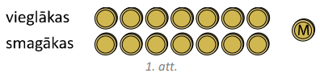

## Atrisinājums

Sākumā izveidojam $7$ monētu pārus (skat. 2.att.) un katrā pārī noskaidrojam, 
kura ir smagākā monēta ($1.$ kārta; $7$ svēršanas). Tad šīm septiņām atrastajām
monētām klāt pievienojam vēl nesvērto monētu un izveidojam četrus monētu pārus.
Katrā pārī atrodam smagāko monētu ($2.$ kārta; $4$ svēršanas). legūtās četras 
smagākās monētas atkal sadalām divos pāros un ar $2$ svēršanām ($3.$ kārta) 
atrodam smagāko monētu katrā pārī. Veicot vēl vienu svēršanu ($4.$ kārta), esam
atraduši vissmagāko monētu no visām.

Vieglākā monēta jāmeklē no tām septiņām monētām, kas "zaudēja" (t.i., bija 
vieglākas) pirmajā kārtā, un vēl tās monētas, kas pirmajā kārtā netika svērtas.
Lai no $8$ monētām atrastu vieglāko, nepieciešamas $7$ svēršanas, piemēram, 
svaros katrā svēršanā jāatstāj vieglākā monēta, bet smagākā jānoliek prom.

Tātad kopā nepieciešama $7+4+2+1+7=21$ svēršana.

# <lo-sample/> LV.NOL.2019.5.3.

Anniņa kvadrātā $4 \times 4$ iekrāsoja dažas pelēkas rūtiņas tā, ka neveidojas 
neviens stūrītis (skat. 3.att.), kam visas rūtiņas ir pelēkas. Ja Anniņa 
iekrāsos vēl jebkuru vienu rūtiņu, tad noteikti veidosies stūrītis, kam visas 
rūtiņas ir pelēkas. Jānītis, ievērojot tos pašus nosacījumus, iekrāsoja rūtiņas
citā kvadrātā $4 \times 4$. Vai var gadīties, ka Anniņa iekrāsoja mazāk rūtiņu 
nekā Jānītis? Figūra $stūrītis$ var būt arī pagriezta.

<small>

* questionType:
* domain:

</small>

## Atrisinājums

Jā, var gadīties, piemēram, ja Anniņa iekrāsoja $7$ rūtiņas kā parādīts 4.att.,
bet Jānītis iekrāsoja $8$ rūtiņas kā parādīts 5.att.

# <lo-sample/> LV.NOL.2019.5.4.

Veikalā par $28$ uzlīmēm var saņemt mašīnu. Valentīns ieradās veikalā, kur 
pārdevējs viņam iedeva tikpat uzlīmes, cik Valentīnam jau bija, un tad viņš 
$28$ uzlīmes samainīja pret mašīnu. Nākamajā dienā Valentīns atkal ieradās 
veikalā, kur pārdevējs viņam iedeva tikpat uzlīmes, cik Valentīnam jau bija, un
$28$ viņš samainīja pret mašīnu. Tas pats notika vēl $2$ reizes. Pēc ceturtās 
reizes, kad Valentīns bija veicis apmaiņu, viņam vēl palika $12$ uzlīmes. Cik 
uzlīmes bija Valentīnam pirms pirmā veikala apmeklējuma? (Ārpus šī veikala 
Valentīns uzlīmes nesaņem un netērē.)

<small>

* questionType:
* domain:

</small>

## Atrisinājums

Risinām šo uzdevumu no beigām (skat. tabulā).

Tātad Valentīnam pirms pirmā veikala apmeklējuma bija $27$ uzlīmes.

# <lo-sample/> LV.NOL.2019.5.5.

Vai vārdā $NEAPJAUŠAMAIS$ var aizvietot burtus ar cipariem tā, ka dažādus 
burtus aizstāj dažādi cipari (burti $S$ un $Š$ ir aizstāti ar atšķirīgiem 
cipariem), bet vienādus - vienādi, turklāt izveidotais skaitlis ir pirmskaitlis?

<small>

* questionType:
* domain:

</small>

## Atrisinājums

Nē, nevar. Vārdā $NEAPJAUŠAMAIS$ izmantoti desmit atšķirīgi burti, tātad būtu 
jāizmanto visi desmit cipari. Tad $NEAPJAUŠAMAIS$ ciparu summa būtu

$$(N+E+A+P+J+U+Š+M+I+S)+3 \cdot A=45+3 \cdot A$$

kas dalās ar $3$, līdz ar to arī pats skaitlis dalītos ar $3$. Vienīgais 
pirmskaitlis, kas dalās ar $3$, ir pats skaitlis $3$, bet dotais ir 
desmitciparu skaitlis, tātad tas nevar būt pirmskaitlis.

# <lo-sample/> LV.NOL.2019.6.1.

Konkursā bija $90$ jautājumu. Par katru pareizu atbildi var iegūt $3$ punktus, 
par katru nepareizu atbildi tiek atņemts $1$ punkts. Ja uz kādu jautājumu nav 
sniegta atbilde, tad par šo jautājumu ir $0$ punktu. Olafs konkursā ieguva 
$200$ punktus un zināms, ka viņš uz $10$ jautājumiem atbildēja nepareizi. Uz 
cik jautājumiem Olafs nesniedza atbildi?

<small>

* questionType:
* domain:

</small>

## Atrisinājums

Tā kā Olafs uz $10$ jautājumiem atbildēja nepareizi, tad par pareizajām 
atbildēm kopējais iegūto punktu skaits tika samazināts par $10$, tas ir, par 
pareizajām atbildēm iegūtais punktu skaits bija $200+10=210$. Tā kā par katru 
pareizu atbildi iegūst $3$ punktus, tad Olafs pareizi atbildēja uz $210:3=70$ 
jautājumiem. Tātad Olafs nesniedza atbildi uz $90-10-70=10$ jautājumiem.

# <lo-sample/> LV.NOL.2019.6.2.

Dotas $11$ pēc ārējā izskata vienādas monētas, no kurām $10$ ir īstas, bet 
viena ir viltota. Īstās monētas masa ir $12$ grami, bet viltotās - $11$ grami. 
Kā ar $3$ svēršanām uz sviras svariem bez atsvariem atrast viltoto monētu?

<small>

* questionType:
* domain:

</small>

## Atrisinājums

Katrā svaru kausā ieliekam $5$ monētas, vienu monētu atstājot malā.

**(A)** Ja svaru kausi ir līdzsvarā, tad viltotā monēta ($11 g$) ir tā, kas nebija 
uz svariem (skat. 6.att. (A)).

**(B)** Ja svaru kausi nav līdzsvarā, tad viltotā monēta atrodas uz "vieglākā" 
svaru kausa (skat. 6.att. (B)). Otrajā svēršanā katrā svaru kausā ieliekam $2$ 
monētas no "vieglākā" kausa, vienu monētu atstājot malā.

- Ja svaru kausi ir līdzsvarā, tad viltotā monēta ir tā, kas šajā svēršanā bija
  atlikta malā.
- Ja svaru kausi nav līdzsvarā, tad viltotā monēta atrodas uz "vieglākā" svaru 
  kausa. Trešajā svēršanā katrā svaru kausā ieliekam pa vienai monētai no 
  "vieglākā" kausa. Viltotā monēta atrodas uz "vieglākā" svaru kausa.

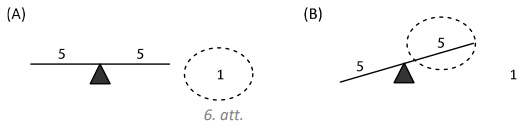

## Atrisinājums

Katrā svaru kausā ieliekam $4$ monētas, $3$ monētas atstājot malā.

**(A)** Ja svaru kausi ir līdzsvarā, tad viltotā monēta ir kaudzītē, kas nebija
uz svariem (skat. 7.att. (A)). Otrajā svēršanā katrā svaru kausā liekam pa 
vienai monētai no šīs kaudzītes, vienu monētu atstājot malā.

- Ja svaru kausi ir līdzsvarā, tad viltotā monēta ir tā, kas šajā svēršanā bija
  atlikta malā.
- Ja svaru kausi nav līdzsvarā, tad viltotā monēta ir tā, kas atrodas 
  "vieglākajā" svaru kausā.

**(B)** Ja svaru kausi nav līdzsvarā, tad viltotā monēta atrodas uz "vieglākā" 
svaru kausa (skat. 7.att. (B)). Otrajā svēršanā katrā svaru kausā ieliekam $2$ 
monētas no "vieglākā" kausa. Svari noteikti nosvērsies. Izvēlamies tās divas 
monētas, kas atrodas "vieglākajā" kausā un trešajā svēršanā tās salīdzinām 
savā starpā. Viltotā monēta atradīsies "vieglākajā" kausā.

# <lo-sample/> LV.NOL.2019.6.3.

Vai taisnstūri ar izmēriem **a)** $5 \times 8$, **b)** $5 \times 12$ rūtiņas 
var pārklāt ar 8.att. redzamajām figūrām? Taisnstūrim jābūt pilnībā pārklātam. 
Figūras nedrīkst iziet ārpus taisnstūra un nedrīkst pārklāties, tās drīkst būt 
pagrieztas vai apgrieztas spoguļattēlā.

<small>

* questionType:
* domain:

</small>

## Atrisinājums

**a)** Jā, var, piemēram, skat. 9.att.

**b)** Nē, nevar. lekrāsosim doto taisnstūri joslās (skat. 10.att.), tad 
taisnstūrī ir iekrāsotas $30$ (pāra skaitlis) melnas un $30$ (pāra skaitlis) 
baltas rūtiņas. Ja taisnstūri varētu pārklāt, tad tas būtu pārklāts ar tieši 
$60:4=15$ figūrām. Lai kā arī šajā kvadrātā tiktu novietota dotā figūra, tā 
pārklās vai nu tieši vienu melnu rūtiņu, vai tieši $3$ melnas rūtiņas (skat. 
10.att.), tātad nepāra skaita melnas rūtiņas. Tāpēc arī $15$ (nepāra skaitlis) 
šādas figūras kopā var pārklāt tikai nepāra skaita melnas rūtiņas. Tā kā nepāra
skaitlis nevar būt vienāds ar pāra skaitli - melno rūtiņu skaitu visā 
taisnstūrī, tad taisnstūri pārklāt nevar.

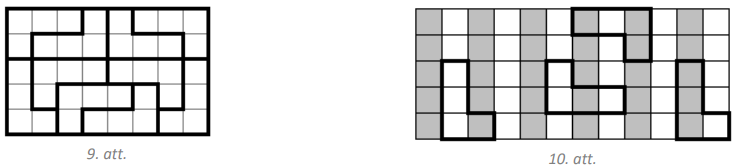

# <lo-sample/> LV.NOL.2019.6.4.

Aizpildi doto kvadrātu (skat. 11.att.), tukšajās rūtiņās ierakstot pa vienam 
naturālam skaitlim, tā, lai visi deviņi skaitļi ir dažādi un visās rindās, 
visās kolonnās un abās diagonālēs skaitļu summas būtu vienādas! (Pietiek 
parādīt vienu veidu, kā to izdarīt.)

<small>

* questionType:
* domain:

</small>

## Atrisinājums

Skaitļu izkārtojumu skat., piemēram, 12.att.

$Piezīme.$ Atrast atrisinājumu var palīdzēt tālāk aprakstītie spriedumi.

Visās rindās, kolonnās un diagonālēs skaitļu summai jābūt $10+6+2=18$. 
Aplūkojam augšējo rindu. Tajā trūkst divu skaitļu, kuru summai jābūt $8$. Tie 
nevar būt $4$ un $4$ (jo visiem skaitļiem jābūt dažādiem), kā arī $6$ un $2$, 
jo tie jau ir izmantoti, tātad atliek varianti $5$ un $3$ vai $7$ un $1$. 
Pārbaudot pirmo variantu, nonākam pie dotā atrisinājuma, bet, pārbaudot otro 
variantu, iegūst, ka vienam skaitlim jābūt $0$, kas neder, jo visiem skaitļiem 
jābūt naturāliem.

$Piezīme.$ Atrisinājumu var iegūt kā sekas no $3 \times 3$ maģiskā kvadrāta, 
pieskaitot $1$.

# <lo-sample/> LV.NOL.2019.6.5.

Dots, ka $LAI + ŠIS + IR + LABS=2019$ un $IR + IR = LAI$. Parādi vienu piemēru,
kādi cipari var būt burtu vietās, lai dotās vienādības būtu patiesas un 
vienādus ciparus aizstātu vienādi burti, dažādus - dažādi (burti $Š$ un $S$ ir 
atšķirīgi).

<small>

* questionType:
* domain:

</small>

## Atrisinājums

Vienīgais šī uzdevuma atrisinājums ir $L=1; A=2; I=6; Š=5; S=0; R=3; B=7$, tad 
iegūstam patiesas vienādības $126+560+63+1270=2019$ un $63+63=126$.

$Piezīme.$ Atrast atrisinājumu var palīdzēt tālāk aprakstītie spriedumi.

Tā kā divu divciparu skaitļu summa ir trīsciparu skaitlis, tas ir, 
$IR + IR = LAI$, tad vienīgā iespēja, ka $L=1$. No šīs vienādības izriet arī, 
ka $I$ ir lielāks nekā $4$, turklāt tam jābūt pāra skaitlim. Tātad jāpārbauda 
iespējamās vērtības $I=6$ un $I=8$. levietojot šīs vērtības vienādojumā 
$LAI + ŠIS + IR + LABS=2019$, un šķirojot dažādos gadījumus, pakāpeniski atrod 
$R, A, Š$ un $S$ vērtības. Daļa no gadījumiem ir nederīgi, jo dažādiem burtiem 
atbilst vienādi cipari.

# <lo-sample/> LV.NOL.2019.7.1.

Doti trīs vienādojumi $ax+b=0,\ bx+c=0$ un $cx+a=0$. Neviens no koeficientiem 
$a, b, c$ nav $0$.

**a)** Vai var gadīties, ka tieši diviem no šiem vienādojumiem saknes ir 
       vienādas?

**b)** Vai noteikti vismaz vienam no šiem vienādojumiem ir negatīva sakne?

<small>

* questionType:
* domain:

</small>

## Atrisinājums

**a)** Jā, var. Piemēram, ja $a=4,\ b=8,\ c=2$, tad vienādojumi ir 
$4x+8=0,\ 8x+2=0$ un $2x+4=0$ un to saknes attiecīgi ir $x=-2,\ x=-0,25$ un 
$x=-2$.

**b)** Jā, noteikti. Doto vienādojumu saknes ir 
$x=-\frac{b}{a},\ x=-\frac{c}{b}$ un $x=-\frac{a}{c}$. Sakņu reizinājums
ir $-\frac{b}{a} \cdot\left(-\frac{c}{b}\right) \cdot\left(-\frac{a}{c}\right)=-1$,
tātad vismaz viena sakne ir negatīva.

# <lo-sample/> LV.NOL.2019.7.2.

Dotas $14$ pēc ārējā izskata vienādas monētas. Zināms, ka $13$ monētu masas ir 
vienādas savā starpā, bet vienas monētas masa ir citāda. Kā ar divām svēršanām 
uz sviras svariem bez atsvariem noskaidrot, vai atšķirīgā monēta ir vieglāka 
vai smagāka nekā pārējās? (Pašu monētu atrast nav nepieciešams.)

<small>

* questionType:
* domain:

</small>

## Atrisinājums

Uzliekam uz katra svaru kausa $4$ monētas, malā atstājot $6$ monētas.

**(A)** Ja kausi ir līdzsvarā, tad atšķirīgā monēta palikusi malā (skat. 
13.att. (A)). Otrajā svēršanā salīdzinām malā palikušās $6$ monētas ar 
jebkurām $6$ jau svērtajām (parastajām) monētām.

- Ja svaru kauss ar $6$ parastajām monētām nosveras uz leju, tad atšķirīgā 
  monēta ir vieglāka nekā pārējās.
- Ja svaru kauss ar $6$ parastajām monētām nosveras uz augšu, tad atšķirīgā 
  monēta ir smagāka nekā pārējās.

**(B)** Ja pirmajā svēršanā svari nav līdzsvarā, tad atšķirīgā monēta ir 
atradusies uz svariem (skat. 13.att. (B)). Otrajā svēršanā salīdzinām 
vieglākā kausa $4$ monētas ar jebkurām $4$ malā palikušajām (parastajām) 
monētām.

- Ja svaru kausi ir līdzsvarā, tad atšķirīgā monēta pirmajā svēršanā ir bijusi 
  uz "smagākā" kausa un ir smagāka nekā citas monētas.
- Ja svaru kausi nav līdzsvarā, tad atšķirīgā monēta pirmajā svēršanā ir bijusi
  uz "vieglākā" kausa un ir vieglāka nekā citas monētas.

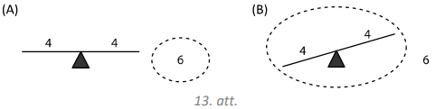

## Atrisinājums

Uzliekam uz katra svaru kausa $5$ monētas, malā atstājot $4$ monētas.

**(A)** Ja kausi ir līdzsvarā, tad atšķirīgā monēta palikusi malā (skat. 
14.att. (A)). Otrajā svēršanā salīdzinām malā palikušās $4$ monētas ar 
jebkurām $4$ jau svērtajām (parastajām) monētām.

- Ja svaru kauss ar $4$ parastajām monētām nosveras uz leju, tad atšķirīgā 
  monēta ir vieglāka nekā pārējās.
- Ja svaru kauss ar $4$ parastajām monētām nosveras uz augšu, tad atškirīgā 
  monēta ir smagāka nekā pārējās.

**(B)** Ja pirmajā svēršanā svari nav līdzsvarā, tad atšķirīgā monēta ir 
atradusies uz svariem (skat. 14.att. (B)). Izvēlamies vieglākā kausa 
monētas un tām pievienojam vienu parasto monētu, kas pirmajā svēršanā bija 
atlikta malā. legūstam kaudzīti ar $6$ monētām. Otrajā svēršanā katrā svaru 
kausā liekam pa $3$ monētām no šīs kaudzītes.

- Ja svaru kausi ir līdzsvarā, tad atšķirīgā monēta pirmajā svēršanā ir bijusi 
  uz "smagākā" kausa un ir smagāka nekā citas monētas.
- Ja svaru kausi nav līdzsvarā, tad atšķirīgā monēta pirmajā svēršanā ir bijusi
  uz "vieglākā" kausa un ir vieglāka nekā citas monētas.

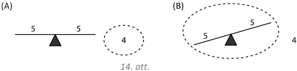

# <lo-sample/> LV.NOL.2019.7.3.

Anniņa kvadrātā $6 \times 6$ iekrāsoja dažas pelēkas rūtiņas tā, ka neveidojas 
neviens stūrītis (skat. 15.att.), kam visas rūtiņas ir pelēkas. Ja Anniņa 
iekrāsos vēl jebkuru vienu rūtiņu, tad noteikti veidosies stūrītis, kam visas 
rūtiņas ir pelēkas. Jānītis, ievērojot tos pašus nosacījumus, iekrāsoja rūtiņas
citā kvadrātā $6 \times 6$. Vai var gadīties, ka Anniņa iekrāsoja mazāk rūtiņu 
nekā Jānītis? Figūra stūrītis var būt arī pagriezta.

<small>

* questionType:
* domain:

</small>

## Atrisinājums

Jā, var gadīties, piemēram, ja Anniņa iekrāsoja $12$ rūtiņas kā parādīts 
16.att., bet Jānītis iekrāsoja $18$ rūtiņas kā parādīts 17.att.

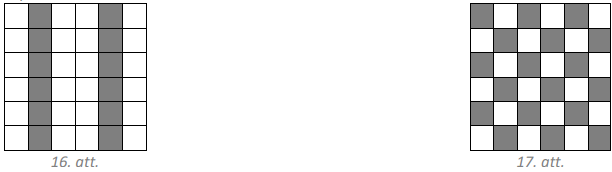

# <lo-sample/> LV.NOL.2019.7.4.

Vai var atrast tādus veselus skaitļus $a$ un $b$, ka $ab(a+5b)=150015$ ?

<small>

* questionType:
* domain:

</small>

## Atrisinājums

Pamatosim, ka nevar atrast prasītos skaitļus. Ja $a$ vai $b$ ir pāra skaitlis, 
tad vienādojuma kreisās puses izteiksmes vērtība ir pāra skaitlis, kas nevar 
būt vienāds ar nepāra skaitli $150015$. Ja $a$ un $b$ abi ir nepāra skaitļi, 
tad $(a+5b)$ ir pāra skaitlis un vienādojuma kreisās puses izteiksmes vērtība 
ir pāra skaitlis, kas nevar būt vienāds ar nepāra skaitli $150015$. Tātad nevar
atrast tādus veselus skaitļus $a$ un $b$, lai dotā vienādība būtu patiesa.

# <lo-sample/> LV.NOL.2019.7.5.

Uz tāfeles uzrakstītas deviņas zvaigznītes $*********$. Mārtiņš ieraksta kādas 
zvaigznītes vietā jebkuru ciparu no $1$ līdz $9$. Pēc tam Rihards jebkuru divu 
citu zvaigznīšu vietā ieraksta divus nenulles ciparus (tie var arī 
atkārtoties). Pēc tam vēl divas reizes viņi atkārto šo darbību. Rihards uzvar, 
ja iegūtais deviņciparu skaitlis dalās ar $31$. Vai Rihards vienmēr var 
uzvarēt?

<small>

* questionType:
* domain:

</small>

## Atrisinājums

Pamatosim, ka Rihards vienmēr var uzvarēt.

Sadalām visus ciparus grupās pa trim cipariem katrā (* * *)(* * *)(* * *). 
Tad deviņciparu skaitli varam izteikt kā $A \cdot 10^{6}+B \cdot 10^{3}+C$, kur
$A, B$ un $C$ ir trīsciparu skaitļi, kas izveidojas attiecīgi pirmajā, otrajā 
un trešajā grupā. Ja Rihardam izdosies panākt, ka katrā grupā izveidotais 
trīsciparu skaitlis $A, B$ un $C$ dalās ar $31$, tad arī iegūtais deviņciparu 
skaitlis dalīsies ar $31$ (ja katrs saskaitāmais dalās ar $31$, tad arī summa 
dalās ar $31$) un Rihards būs uzvarējis.

levērojam, ka ar $31$ dalās trīsciparu skaitļi 
$124,\ 248,\ 372,\ 465,\ 496,\ 589,\ 651,\ 713,\ 837$ un $992$. Kad Mārtiņš aizvieto 
zvaigznīti, kas atrodas kādā grupā, Rihards atlikušās divas tās pašas grupas 
zvaigznītes aizvieto tā, lai tās kopā veidotu kādu no desmit minētajiem 
trīsciparu skaitļiem. Tā kā katrā no trim pozīcijām (vieni, desmiti, simti) 
minētajos skaitļos var atrast jebkuru ciparu no $1$ līdz $9$, tad to vienmēr ir
iespējams izdarīt.

$Piezīme.$ Var izvēlēties arī citus trīsciparu skaitļus, kas dalās ar $31$. Ar 
$31$ dalās šādi trīsciparu skaitļi: 
$124;\ 155;\ 186;\ 217;\ 248;\ 279;\ 310;\ 341;\ 372;\ 403;\ 434;\ 465;\ 496;\ 527;\ 558;\ 589;\ 620;\ 651;\ 682;\ 713;\ 744;\ 775;\ 806;\ 837;\ 868;\ 899;\ 930;\ 961;\ 992$.

# <lo-sample/> LV.NOL.2019.8.1.

Taisnstūra vienas malas garums ir $(2 \sqrt{3}-\sqrt{6})(2 \sqrt{3}+\sqrt{6})$,
bet otras malas garums ir $(\sqrt{3})^{2}+\sqrt{1 \frac{7}{9}}$. Aprēķināt 
malas garumu kvadrātam, kura laukums ir tikpat liels kā dotajam taisnstūrim 
(atbildi vienkāršot)!

<small>

* questionType:
* domain:

</small>

## Atrisinājums

Aprēķinām taisnstūra malu garumus:

$$
\begin{aligned}
& (2 \sqrt{3}-\sqrt{6})(2 \sqrt{3}+\sqrt{6})=(2 \sqrt{3})^{2}-(\sqrt{6})^{2}=4 \cdot 3-6=6 \\
& (\sqrt{3})^{2}+\sqrt{1 \frac{7}{9}}=3+\sqrt{\frac{16}{9}}=3+\frac{4}{3}=4 \frac{1}{3}
\end{aligned}
$$

Taisnstūra laukums ir $6 \cdot 4 \frac{1}{3}=26$. Līdz ar to kvadrāta malas 
garums ir $\sqrt{26}$.

# <lo-sample/> LV.NOL.2019.8.2.

Zināms, ka no $26$ monētām viena ir viltota - tā ir vieglāka nekā pārējās, 
kurām visām ir vienāda masa. Kā ar trīs svēršanām uz sviras svariem bez 
atsvariem atrast viltoto monētu?

<small>

* questionType:
* domain:

</small>

## Atrisinājums

Sadalām monētas trīs kaudzītēs: divas kaudzītes pa $9$ monētām katrā un viena 
kaudzīte, kurā ir $8$ monētas.

Pirmajā svēršanā salīdzinām kaudzītes, kurās ir pa $9$ monētām. lespējami divi 
gadīumi.

**(A)** Ja viens svaru kauss ir vieglāks nekā otrs, tad uz tā atrodas viltotā 
monēta.

**(B)** Ja abi svaru kausi ir līdzsvarā, tad viltotā monēta ir tajā kaudzītē, 
kas šajā svēršanā atradās malā.

Līdzīgi rīkojamies un spriežam arī visās nākamajās svēršanās: izvēlamies to 
kaudzīti, kurā atrodas viltotā (vieglākā) monēta un dalām to mazākās kaudzītēs,
katru reizi salīdzinot kaudzītes, kurās ir vienāds monētu skaits un nosakot, 
kurā kaudzītē atrodas vieglākā monēta. Dalīšana mazākās kaudzītēs shematiski 
attēlota 18.att. 

$Piezīme.$ Lai gadījums ar $8$ monētām nebūtu jāapskata 
atsevišķi, varam šai kaudzītei pievienot vienu "parasto" monētu.

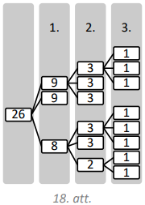

# <lo-sample/> LV.NOL.2019.8.3.

Izliekta piecstūra $ABCDE$ diagonāļu $AC$ un $BD$ krustpunkts ir $M,\ AC$ un 
$BE$ krustpunkts ir $K$. Zināms, ka $AK=CM$ un $BK=KE=AE$. Pierādīt, ka 
$EM=BC$.

<small>

* questionType:
* domain:

</small>

## Atrisinājums

levērosim, ka $\triangle MAE=\triangle CKB$ pēc pazīmes $m \ell m$, jo

- $AM=AK+KM=MC+KM=KC$ (skat. 19.att.);

- tā kā $\sphericalangle EAK=\sphericalangle AKE$ kā leņķi pie pamata 
  vienādsānu trijstūrī $AEK$ un $\sphericalangle AKE=\sphericalangle BKC$ kā 
  krustleņķi, tad $\sphericalangle EAM=\sphericalangle BKC$;

- $AE=KB$ pēc dotā.

Līdz ar to $EM=BC$ kā atbilstošās malas vienādos trijstūros.

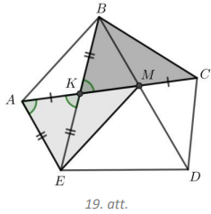

# <lo-sample/> LV.NOL.2019.8.4.

Uz tāfeles uzrakstīti skaitļi $\frac{3}{2},\ \frac{4}{5},\ \frac{5}{3}$. Ar vienu
gājienu atļauts izvēlēties divus no uzrakstītajiem skaitļiem (apzīmēsim tos ar 
$a$ un $b$), nodzēst tos un to vietā uzrakstīt uz tāfeles skaitļus 
$\frac{b^{2}}{a}$ un $\frac{a^{2}}{b}$. Vai, izdarot vairākus šādus gājienus, 
var panākt, lai uz tāfeles vienlaicīgi būtu uzrakstīti skaitļi 
$\frac{4}{3},\ \frac{4}{5},\ \frac{5}{2}$?

<small>

* questionType:
* domain:

</small>

## Atrisinājums

Nē, nevar. Izdarot gājienus, uz tāfeles uzrakstīto skaitļu reizinājums 
nemainās, tas ir, ja uz tāfeles pirms gājiena izdarīšanas ir uzrakstīti skaitļi
$a, b, c$, tad to reizinājums ir $a \cdot b \cdot c$, un arī pēc gājiena 
izdarīšanas uz tāfeles uzrakstīto skaitļu reizinājums ir 
$\frac{b^{2}}{a} \cdot \frac{a^{2}}{b} \cdot c=a \cdot b \cdot c$. Tā kā sākumā
uzrakstīto skaitļu reizinājums ir 
$\frac{3}{2} \cdot \frac{4}{5} \cdot \frac{5}{3}=2$, bet skaitļu 
$\frac{4}{3}, \frac{4}{5}, \frac{5}{2}$ reizinājums ir 
$\frac{4}{3} \cdot \frac{4}{5} \cdot \frac{5}{2}=\frac{8}{3}$, tad prasītais 
nav iespējams.

# <lo-sample/> LV.NOL.2019.8.5.

Izmantojot divus atšķirīgus nenulles ciparus $x$ un $y$ ir izveidoti divi 
trīsciparu skaitļi $\overline{xyx}$ un $\overline{yxy}$. Zināms, ka 
$\overline{xyx}$ dalās ar $3$, bet $\overline{yxy}$ dalās ar $4$. Kāds var būt 
izveidotais trīsciparu skaitlis $\overline{yxy}$ ?

<small>

* questionType:
* domain:

</small>

## Atrisinājums

Skaitlis dalās ar $3$ tad, ja tā ciparu summa dalās ar $3$. Tātad $(2x+y)$ 
dalās ar $3$.

Skaitlis dalās ar $4$ tad, ja tā divu pēdējo ciparu veidotais skaitlis dalās ar
$4$. Tātad $\overline{xy}=10x+y$ dalās ar $4$.

levērojam, ka $10x+y=8x+2x+y$. Tā kā $10x+y$ dalās ar $4$ un $8x$ dalās ar $4$,
tad arī $(2x+y)$ ir jādalās ar $4$. Bet tas nozīmē, ka $(2x+y)$ ir jādalās ar 
$12$, jo $3$ un $4$ ir savstarpēji pirmskaitļi. levērojot, ka $x$ un $y$ ir 
cipari $(2x+y<27)$, iespējami divi gadīumi:

- ja $2x+y=12$ jeb $y=12-2x$, tad ievērojam, ka $x \leq 5$, un pārbaudām visus 
  iespējamos gadījumus:

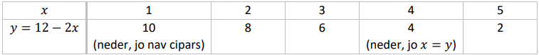

- ja $2x+y=24$ jeb $y=24-2x$, tad ievērojam, ka $x>7$, un pārbaudām abus 
  iespējamos gadījumus:

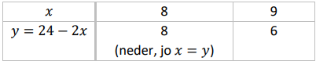

Līdz ar to trīsciparu skaitlis $\overline{yxy}$ var būt $828,\ 636,\ 252,\ 696$.

$Piezīme.$ Uzdevumu var atrisināt, veicot pilno pārlasi, tas ir, pārbaudot 
visus divciparu skaitļus $\overline{xy}$, kas dalās ar $4$.

# <lo-sample/> LV.NOL.2019.9.1.

Lineāra funkcija $y=\left(m^{2}-3 m\right) x+4m-4$ krusto $x$ asi punktā, kura 
abscisa ir $2$. Atrodi $m$ vērtības un noskaidro, vai atbilstošā funkcija ir 
augoša vai dilstoša!

<small>

* questionType:
* domain:

</small>

## Atrisinājums

Dotā funkcija krusto $x$ asi punktā $(2; 0)$, ievietojot šīs vērtīas dotajā 
funkcijā, iegūstam vienādojumu $0=\left(m^{2}-3m\right) \cdot 2+4m-4$ jeb 
$m^{2}-m-2=0$, kura saknes ir $m_{1}=-1$ un $m_{2}=2$. Tātad iespējami divi 
gadījumi:

- ja $m=-1$, tad dotā funkcija ir $y=4x-8$ un tā ir augoša, jo koeficients pie 
  $x$ ir pozitīvs;
- ja $m=2$, tad dotā funkcija ir $y=-2x+4$ un tā ir dilstoša, jo koeficients 
  pie $x$ ir negatīvs.

# <lo-sample/> LV.NOL.2019.9.2.

Dotas divas melnas, divas sarkanas un divas zaļas lodītes. Vienas lodītes masa 
ir $99~\mathrm{g}$, bet tādas pašas krāsas otras lodītes masa ir 
$101~\mathrm{g}$. Pārējās četras lodītes katra sver $100~\mathrm{g}$. Kā, 
lietojot sviras svarus bez atsvariem, ar divām svēršanām atrast vieglāko 
lodīti?

<small>

* questionType:
* domain:

</small>

## Atrisinājums

Pirmajā svēršanā salī̀dzinām vienas sarkanās un vienas melnās lodītes masu.

**1)** Ja svari ir līdzsvarā (skat. 20.att.), tad melnās un sarkanās lodītes 
katra sver $100~\mathrm{g}$, tātad vieglākā lodīte ir zaļā krāsā. Otrajā 
svēršanā, salīdzinot abas zaļās lodītes, atrodam vieglāko.

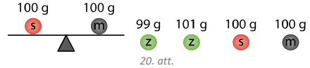

**2)** Apskatām gadījumu, kad svari nav līdzsvarā. Nezaudējot vispārīgumu, 
varam pieņemt, ka sarkanā lodīte ir smagāka nekā melnā. Tad iespējami divi 
gadījumi (skat. 21.att.):

- sarkanā lodīte sver $100~\mathrm{g}$ un melnā - $99~\mathrm{g}$;
- sarkanā lodīte sver $101~\mathrm{g}$ un melnā - $100~\mathrm{g}$.

Tātad vieglākā lodīte ir vai nu tā, kas atrodas uz vieglākā svaru kausa, vai 
otra no sarkanajām. Otrajā svēršanā salīdzinot šīs abas lodītes (to, kas 
atrodas uz vieglākā svaru kausa un nesvērto sarkano lodīti), atrodam vieglāko.
($Piezīme.$ Otrajā svēršanā var salīdzināt arī to lodīti, kas atrodas uz 
vieglākā svaru kausa ar kādu no zaļajām.)

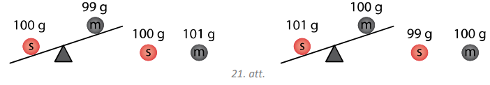

## Atrisinājums

Pirmajā svēršanā katrā kausā liekam no katras krāsas pa vienai lodītei (katrā 
svaru kausā ir $3$ lodītes). Svari noteikti nebūs līdzsvarā, jo viens no 
kausiem saturēs vieglo lodīti, bet otrs saturēs smago lodīti. Tagad atliek 
tikai uzzināt, kura no lodītēm vieglajā kausā ir tā, kas sver $99~\mathrm{g}$. 
Otrajā svēršanā salīdzinām jebkuras divas lodītes no vieglā kausa:

- ja svari ir līdzsvarā, tad abas lodītes sver $100~\mathrm{g}$ un tā, kura 
  netika svērta, ir meklētā lodīte, kas sver $99~\mathrm{g}$;
- ja svari nav līdzsvarā, tad vieglākais kauss ir tas, kurš satur meklēto 
  lodīti.

Pirmajā svēršanā vienā kausā ieliekam abas zaļās lodītes un otrā ieliekam 
vienu melnu un vienu sarkanu lodīti. Jāapskata trīs gadījumi.

**1)** Ja svari ir līdzsvarā, tad tas nozīmē, ka zaļās lodītes ir tās, kuru 
masas nav $100~\mathrm{g}$. Otrajā svēršanā salīdzinām zaļās lodītes, lai 
atrastu vieglāko.
**2)** Ja kauss ar zaļajām lodītēm ir smagāks, tad lodīte, kuras masa ir 
$99~\mathrm{g}$ atrodas vieglākajā kausā un ir vai nu sarkana, vai melna. 
Otrajā svēršanā salīdzinām abas melnās lodītes:

   - ja svari ir līdzsvarā, tad sarkanā lodīte, ko izmantojām pirmajā svēršanā,
     sver $99~\mathrm{g}$;
   - ja svari nav līdzsvarā, tad vieglākā melnā lodīte sver $99~\mathrm{g}$.

**3)** Ja kauss ar melno un sarkano lodīti ir smagāks, tad tajā atrodas lodīte,
kas sver $101~\mathrm{g}$. Otrajā svēršanā salīdzinām abas melnās lodītes:

   - ja svari ir līdzsvarā, tad tā sarkanā lodīte, ko neizmantojām pirmajā 
     svēršanā, sver $99~\mathrm{g}$;
   - ja svari nav līdzsvarā, tad vieglākajā kausā atrodas vieglākā melnā 
     lodīte, kas sver $99~\mathrm{g}$.

# <lo-sample/> LV.NOL.2019.9.3.

Uz kvadrāta $ABCD$ malām $AB,\ BC,\ CD$ un $DA$ attiecīgi atzīmēti punkti 
$E,\ F,\ G,\ H$ tā, ka $AE=BF=CG=DH$. Kvadrāta iekšpusē atlikts patvaļīgs 
punkts $O$. Pierādīt, ka $S_{AEOH}+S_{FCGO}=S_{BFOE}+S_{DHOG}$.

<small>

* questionType:
* domain:

</small>

## Atrisinājums

Nezaudējot vispārīgumu, varam pieņemt, ka kvadrāta malas garums ir $1$. 
Apzīmējam $AE=BF=CG=DH=x$, tad $DG=BE=1-x$. Novelkam nogriežņus $OB$ un $OD$ 
(skat. 22.att.).

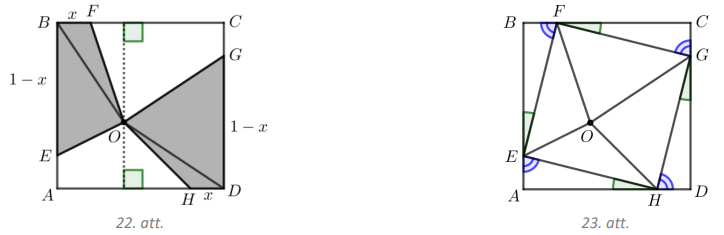

levērojam, ka no punkta $O$ ir novilkti divi perpendikuli attiecīgi pret 
kvadrāta paralēlajām malām $BC$ un $AD$, tātad šo perpendikulu (apzīmējam 
attiecīgi ar $h_{BC}$ un $h_{AD}$) summa ir attālums starp paralēlajām malām, 
no kā secinām, ka $h_{BC}+h_{AD}=1$. Izmantojot trijstūra laukuma aprēķināšanas
formulu $S_{\Delta}=\frac{1}{2} ah_{a}$, iegūstam

$$S_{OBF}+S_{OHD}=\frac{1}{2} BF \cdot h_{BF}+\frac{1}{2} HD \cdot h_{HD}=\frac{1}{2} x \cdot\left(h_{BF}+h_{HD}\right)=\frac{1}{2} x \cdot 1=\frac{1}{2} x$$

Līdzīgi aprēķinām, ka $S_{OBE}+S_{ODG}=\frac{1}{2}(1-x)$.

Tātad

$$\begin{gathered}
S_{BFOE}+S_{DHOG}=S_{OBF}+S_{OHD}+S_{OBE}+S_{ODG}=\frac{1}{2} x+\frac{1}{2}(1-x)=\frac{1}{2} \\
S_{AEOH}+S_{FCGO}=S_{ABCD}-\left(S_{BFOE}+S_{DHOG}\right)=1-\frac{1}{2}=\frac{1}{2}
\end{gathered}$$

Līdz ar to esam pierādijuši, ka $S_{AEOH}+S_{FCGO}=S_{BFOE}+S_{DHOG}$.

## Atrisinājums

Novelkam nogriežņus $EF,\ FG,\ GH$ un $HE$ (skat. 23.att.). Trijstūri 
$HAE,\ EBF,\ FCG$ un $GDH$ ir vienādi pēc pazīmes $m \ell m$ un to laukumi arī 
ir vienādi, tātad pietiek pierādīt, ka $S_{EOF}+S_{GOH}=S_{FOG}+S_{HOE}$. Tā kā
trijstūri $HAE,\ EBF,\ FCG$ un $GDH$ ir vienādi taisnleņķa trijstūri, tad 
$EF=FG=GH=HE=a$ un divu trijstūra šauro leņķu summa ir $90^{\circ}$, tas ir, 
viens no tiem ir $\alpha$, bet otrs ir $\left(90^{\circ}-\alpha\right)$. Tāpēc

$$\sphericalangle HEF=\sphericalangle EFG=\sphericalangle FGH=\sphericalangle GHE=180^{\circ}-\alpha-\left(90^{\circ}-\alpha\right)=90^{\circ}$$

Līdz ar to četrstūris $EFGH$ ir kvadrāts.

Izmantojot trijstūra laukuma aprēķināšanas formulu 
$S_{\Delta}=\frac{1}{2} ah_{a}$, iegūstam

$$S_{EOF}+S_{GOH}=\frac{1}{2} EF \cdot h_{EF}+\frac{1}{2} GH \cdot h_{GH}=\frac{1}{2} a\left(h_{EF}+h_{GH}\right)=\frac{1}{2} a^{2}$$

Līdzīgi iegūstam, ka $S_{FOG}+S_{HOE}=\frac{1}{2} a^{2}$. Tātad esam 
pierādījuši, ka $S_{EOF}+S_{GOH}=S_{FOG}+S_{HOE}$, un līdz ar to arī 
$S_{AEOH}+S_{FCGO}=S_{BFOE}+S_{DHOG}$.

# <lo-sample/> LV.NOL.2019.9.4.

Kvadrāts sastāv no $n \times n$ rūtiņām. Rindas sanumurētas no lejas uz augšu 
ar skaitļiem $1; 2; \ldots$; $n$ tāpat sanumurētas kolonnas no kreisās uz labo 
pusi. Katrā rūtiņā ierakstīts vai nu $(+1)$, vai $(-1)$. Ja rindas un kolonnas 
numuri ir vienādi, tad visu šajā rindā ierakstīto skaitļu reizinājums atšķiras 
no visu šajā kolonnā ierakstīto skaitļu reizinājuma. Vai tas ir iespējams, ja 
**a)** $n=7$, **b)** $n=8$?

<small>

* questionType:
* domain:

</small>

## Atrisinājums

**a)** Nē, nav iespējams. levērojam, ka rindā vai kolonnā visu ierakstīto 
skaitļu reizinājums var būt tikai $(+1)$ vai $(-1)$. Apzīmēsim rindās 
ierakstīto skaitļu reizinājumus attiecīgi ar $r_{1}, r_{2}, \ldots, r_{7}$ un 
kolonnās ierakstīto skaitļu reizinājumus attiecīgi ar 
$k_{1}, k_{2}, \ldots, k_{7}$. No dotā secinām, ka $i$-tajā rindā un $i$-tajā 
kolonnā ierakstīto skaitļu reizinājumi ir attiecīgi $(+1)$ un $(-1)$, vai 
otrādi. Līdz ar to 
$r_{1} \cdot k_{1}=r_{2} \cdot k_{2}=\ldots=r_{7} \cdot k_{7}=-1$, tātad

$$\left(r_{1} \cdot r_{2} \ldots \cdot r_{7}\right) \cdot\left(k_{1} \cdot k_{2} \cdot \ldots \cdot k_{7}\right)=\left(r_{1} \cdot k_{1}\right)\left(r_{2} \cdot k_{2}\right) \ldots\left(r_{7} \cdot k_{7}\right)=-1$$

Taču šis reizinājums ir visu tabulā ierakstīto skaitļu reizinājuma kvadrāts - 
pretruna, jo skaitļa kvadrāts ir nenegatīvs. Tātad kvadrātā $7 \times 7$ nav 
iespējams ierakstīt skaitļus atbilstoši uzdevuma nosacījumiem.

**b)** Jā, ir iespējams, noteikumiem atbilstošu skaitļu izvietojumu skat., 
piemēram, 24.att., kur tukšajās rūtiņās ierakstīts $(+1)$.

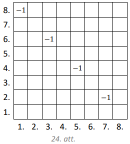

# <lo-sample/> LV.NOL.2019.9.5.

Kāds mazākais ciparu skaits jāpieraksta ciparu virknes $3456$ beigās, lai 
iegūtu skaitli, kas dalās ar $2019$?

<small>

* questionType:
* domain:

</small>

## Atrisinājums

Mazākais ciparu skaits, kas jāpieraksta ciparu virknes beigās, ir trīs. 
Piemēram, skaitlis $3456528$ dalās ar $2019$ ($3456528=2019 \cdot 1712$).

Pierādīsim, ka mazāk kā trīs ciparus nevar pierakstīt dotās ciparu virknes 
beigās, lai izpildītos uzdevuma nosacījumi.

Skaitlis $3456$ nedalās ar $2019$, tāpēc dotās virknes beigās ir jāpieraksta 
vismaz viens cipars.

levērojam, ka $17 \cdot 2019=34323<\overline{3456x}$ un 
$18 \cdot 2019=36342>\overline{3456x}$, kur $x$ - cipars. Līdz ar to ar viena 
cipara pievienošanu nevar izveidot skaitli, kas dalās ar $2019$.

Līdzīgi $171 \cdot 2019=345249<\overline{3456xy}$ un 
$172 \cdot 2019=347268>\overline{3456xy}$, kur $x$ un $y$ - cipari. Līdz ar to 
ar divu ciparu pievienošanu nevar izveidot skaitli, kas dalās ar $2019$.

Tātad esam pierādījuši, ka jāpievieno vismaz trīs cipari.

## Atrisinājums

Mazākais ciparu skaits, kas jāpieraksta ciparu virknes beigās, ir trīs. 
Piemēram, skaitlis $3456528$ dalās ar $2019$ ($3456528=2019 \cdot 1712$).

Pierādīsim, ka mazāk kā trīs ciparus nevar pierakstīt dotās ciparu virknes 
beigās, lai izpildītos uzdevuma nosacījumi.

Skaitlis $3456$ nedalās ar $2019$, tāpēc dotās virknes beigās ir jāpieraksta 
vismaz viens cipars.

levērojam, ka $\overline{3456x}=34560+x=17 \cdot 2019+237+x$, kur $x$ - cipars.
Tā kā $17 \cdot 2019$ dalās ar $2019$, tad, lai $\overline{3456x}$ dalītos ar 
$2019$, arī $(237+x)$ jādalās ar $2019$, bet tas nav iespējams, jo $x$ ir 
cipars. Līdz ar to ar viena cipara pievienošanu nevar izveidot skaitli, kas 
dalās ar $2019$.

Līdzīgi apskatām skaitli 
$\overline{3456xy}=345600+\overline{xy}=171 \cdot 2019+351+\overline{xy}$, kur 
$x$ un $y$ - cipari. Tā kā $171 \cdot 2019$ dalās ar $2019$, tad, lai 
$\overline{3456xy}$ dalītos ar $2019$, arī $(351+\overline{xy})$ jādalās ar 
$2019$, bet tas nav iespējams, jo $\overline{xy}$ ir divciparu skaitlis. Līdz 
ar to ar divu ciparu pievienošanu nevar izveidot skaitli, kas dalās ar $2019$.

$Piezīme.$ Atrast meklēto skaitli palīdz līdzīgi spriedumi, tas ir, 
$3456000=1711 \cdot 2019+1491$ un $1491+528=2019$.

# <lo-sample/> LV.NOL.2019.10.1.

Kvadrātfunkcija $y=x^{2}+\left(m^{2}+3m\right)x+m-1$ krusto $x$ asi punktā, 
kura abscisa ir $1$. Kāda var būt $m$ vērtība? Atrast otru parabolas 
krustpunktu ar $x$ asi!

<small>

* questionType:
* domain:

</small>

## Atrisinājums

Dotā funkcija krusto $x$ asi punktā $(1; 0)$, līdz ar to, ievietojot šīs 
vērtības dotajā funkcijā, iegūstam vienādojumu $0=1+m^{2}+3m+m-1$ jeb 
$m^{2}+4m=0$, kura saknes ir $m_{1}=0$ un $m_{2}=-4$. Tātad iespējami divi 
gadījumi:

- ja $m=0$, tad dotā funkcija ir $y=x^{2}-1$ un tās otrs krustpunkts ar $x$ asi
  ir $(-1; 0)$;
- ja $m=-4$, tad dotā funkcija ir $y=x^{2}+4x-5$ un tās otrs krustpunkts ar $x$
  asi ir $(-5; 0)$.

# <lo-sample/> LV.NOL.2019.10.2.

Dotas $6$ pēc ārējā izskata vienādas monētas. Trim no tām masa katrai ir 
$50~\mathrm{g}$, bet pārējām trim - katrai $51~\mathrm{g}$. Kā, lietojot sviras
svarus bez atsvariem, ar divām svēršanām atrast vienu monētu, kuras masa ir 
$51~\mathrm{g}$?

<small>

* questionType:
* domain:

</small>

## Atrisinājums

Pirmajā svēršanā uz katra svaru kausa uzliekam pa $3$ monētām. lespējami divi 
gadījumi:

**(A)** uz viena svaru kausa ir trīs smagākās (masa $51~\mathrm{g}$) monētas, 
bet uz otra - trīs vieglākās (masa $50~\mathrm{g}$) monētas;

**(B)** uz viena svaru kausa ir divas smagākās un viena vieglākā monēta, bet uz
otra - viena smagākā un divas vieglākās monētas (skat. 25.att.).

Abos gadījumos viens svaru kauss nosveras uz leju. Ņemam tās trīs monētas, kas 
atrodas uz tā svaru kausa, kas nosvērās uz leju. Uzliekam divas no šīm trīs 
monētām pa vienai uz katra svaru kausa.

- Ja svaru kausi ir līdzsvarā, tad uz abiem svaru kausiem uzliktas smagākās 
  monētas - prasītais izpildīts, esam atraduši pat divas monētas, kuru masa ir 
  $51~\mathrm{g}$.
- Ja svaru kausi nav līdzsvarā, tad smagākā monēta atrodas uz tā svaru kausa, 
  kas nosveras uz leju - prasītais izpildīts, esam atraduši monētu, kuras masa 
  ir $51~\mathrm{g}$.

Tātad, izmantojot divas svēršanas ir atrasta vismaz viena monēta, kuras masa ir
$51~\mathrm{g}$, un prasītais ir izpildīts.

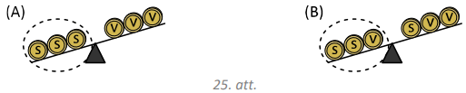

## Atrisināums

Pirmajā svēršanā uz katra svaru kausa uzliekam pa $2$ monētām.

- Ja svaru kausi ir līdzsvarā, tad uz katra svaru kausa uzlikts pa vienai 
  smagajai ($51~\mathrm{g}$) monētai (skat. 26.att.). Otrajā svēršanā 
  izvēlamies divas monētas, kas atrodas uz viena svaru kausa un salīdzinām savā
  starpā, lai atrastu smagāko monētu.

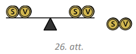

- Ja svaru kausi nav līdzsvarā, tad iespējami trīs gadījumi (skat. 27.att.):

   **(A)** uz smagākā svaru kausa uzliktas divas smagās monētas, bet uz otra 
           kausa - divas vieglās;

   **(B)** uz smagākā svaru kausa uzliktas divas smagās monētas, bet uz otra 
           kausa viena smagā un viena vieglā;

   **(C)** uz smagākā svaru kausa uzlikta viena smagā monēta un viena vieglā, 
           bet uz otra svaru kausa - divas vieglās monētas.

   Otrajā svēršanā izvēlamies divas monētas, kas atrodas uz smagākā svaru 
   kausa, un salīdzinām savā starpā (no tām vismaz viena ir monēta, kuras masa 
   ir $51~\mathrm{g}$):

   - ja svari ir līdzsvarā, tad esam atraduši divas monētas, kuru masa ir 
	 $51~\mathrm{g}$;
   - ja svari nav līdzsvarā, tad smagākā ($51~\mathrm{g}$) monēta ir tā, kas
   	 atrodas uz svaru kausa, kas nosveras uz leju.
		
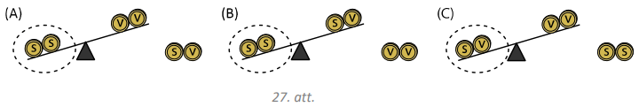

# <lo-sample/> LV.NOL.2019.10.3.

Plaknē dotas divas riņķa līnijas $\omega_{1}$ un $\omega_{2}$, kurām nav kopīgu
punktu un kuru rādiusi nav vienāda garuma. Novilktas trīs pieskares 
$t_{1}, t_{2}$ un $t_{3}$, kas katra pieskaras abām riņķa līnijām - abas riņķa 
līnijas atrodas vienā un tajā pašā $t_{1}$ pusē, vienā un tajā pašā $t_{2}$ 
pusē, bet katra savā $t_{3}$ pusē (skat. 28.att.). Taisne $t_{1}$ pieskaras 
$\omega_{1}$ punktā $A$ un krusto $t_{3}$ punktā $C$, taisne $t_{2}$ pieskaras 
$\omega_{2}$ punktā $B$ un krusto $t_{3}$ punktā $D$. Pierādīt, ka $AC=BD$.

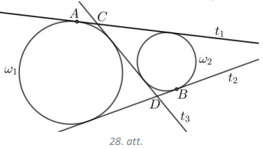

<small>

* questionType:
* domain:

</small>

## Atrisinājums

Ar $E, F, G$ un $H$ apzīmējam pārējos pieskaršanās punktus (skat. 29.att.). Tā 
kā pieskaru, kas vilktas no viena punkta, nogriežņi ir vienādi, tad iegūstam 
vienādības: $AC=CE,\ CH=CG,\ DH=DB,\ DE=DF$. Tātad

- $FB=FD+DB=DE+DB=(EH+HD)+DB=EH+2DB$ jeb $BD=\frac{1}{2}(FB-EH)$  
- $AG=AC+CG=AC+CH=AC+(CE+EH)=2AC+EH$ jeb $AC=\frac{1}{2}(AG-EH)$

Ar $X$ apzīmējam pieskaru $t_{1}$ un $t_{2}$ krustpunktu, tad $XG=XB$ un 
$XA=XF$. Līdz ar to $AG=FB$, no kā izriet, ka $AC=BD$.

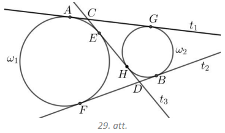

# <lo-sample/> LV.NOL.2019.10.4.

Doti $2019$ reāli skaitļi ar īpašību, ka jebkuru $1010$ skaitļu summa ir 
lielāka nekā atlikušo $1009$ skaitļu summa. Pierādīt, ka visi dotie skaitļi ir 
pozitīvi!

<small>

* questionType:
* domain:

</small>

## Atrisinājums

Pieņemsim pretējo, ka kāds no dotajiem skaitļiem $x$ ir negatīvs vai $0$, tas 
ir $x \leq 0$. Atlikušos $2018$ skaitļus sadalām divās grupās $A$ un $B$ katrā 
pa $1009$ skaitļiem. Grupas $A$ un $B$ skaitļu summu attiecīgi apzīmējam ar 
$S_{A}$ un $S_{B}$. Pēc dotā vienlaicīgi ir spēkā divas nevienādības 
$S_{A}+x>S_{B}$ un $S_{B}+x>S_{A}$. Saskaitot šīs nevienādības, iegūstam

$$S_{A}+S_{B}+2x>S_{A}+S_{B}$$

Līdz ar to $2x>0$ jeb $x>0$. Esam ieguvuši pretrunu ar pieņēmumu, ka 
$x \leq 0$. Tātad visi dotie skaitļi ir pozitīvi.

# <lo-sample/> LV.NOL.2019.10.5.

Atrast visus pirmskaitļu pārus $(m, n)$, kuriem $20m+18n=2018$.

<small>

* questionType:
* domain:

</small>

## Atrisinājums

Dalām abas dotā vienādojuma puses ar $2$ un pārveidojam iegūto vienādojumu:

$$\begin{gathered}
10m+9n=1009 \\
1000-10m=9n-9 \\
10(100-m)=9(n-1)
\end{gathered}$$

levērojam, ka iegūtās vienādības labās puses izteiksme ir pozitīva, tātad arī 
$(100-m)$ jābūt pozitīvam. Tā kā $10$ un $9$ ir savstarpēji pirmskaitļi, tad 
$(100-m)$ ir jādalās ar $9$. lespējamās $m$ vērtības varētu būt 
$1,\ 10,\ 19,\ 28,\ 37,\ 46,\ 55,\ 64,\ 73,\ 82$ un $91$, no kurām derīgas ir 
tikai $19,\ 37$ un $73$, jo tie ir pirmskaitļi. Atrodam atbilstošās $n$ 
vērtības:

- ja $m=19$, tad $10 \cdot 81=9(n-1)$ jeb $n=91$ (neder, jo nav pirmskaitlis),
- ja $m=37$, tad $10 \cdot 63=9(n-1)$ jeb $n=71$ (pirmskaitlis),
- ja $m=73$, tad $10 \cdot 27=9(n-1)$ jeb $n=31$ (pirmskaitlis).

Tātad dotajam vienādojumam ir divi atrisinājumi: $m=37, n=71$ un $m=73, n=31$.

# <lo-sample/> LV.NOL.2019.11.1.

Vai var gadīties, ka 30.att. ir doti funkciju $y=ax^{2}+bx+c,\ y=cx^{2}+bx+a$ un
$y=bx+c$ grafiki? (Funkciju grafiki nav zīmēti mērogā.)

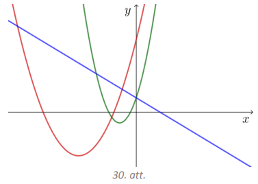

<small>

* questionType:
* domain:

</small>

## Atrisinājums

Nē, nevar.

Funkcijas $y=bx+c$ grafiks ir taisne. levērojam, ka tā ir dilstoša funkcija un 
taisne krusto $y$ asi punktā, kura ordinātas vērtība ir pozitīva, tad $b<0$.

Apskatām funkciju $y=ax^{2}+bx+c$. Tā kā doto parabolu zari ir vērsti uz augšu 
un krustpunktu ar $y$ asi ordinātas vērtība ir pozitīva, tad $a>0$. Aprēķinām 
šīs parabolas virsotnes abscisas vērtību $x_{v}=-\frac{b}{2a}$. Tā kā virsotne 
atrodas trešajā kvadrantā, tad $x_{v}<0$ un, ņemot vērā, ka $a>0$, secinām, ka 
$b>0$. Esam ieguvuši pretrunu ar to, ka $b<0$ (lineārā funkcija dilstoša), 
tātad 30.att. nevar būt doti funkciju $y=ax^{2}+bx+c$,\ $y=cx^{2}+bx+a$ un 
$y=bx+c$ grafiki.

# <lo-sample/> LV.NOL.2019.11.2.

Šaha klubā ir $13$ šahisti. Visu viņu spēles prasme ir atšķirīga un partijā 
vienmēr uzvar spēcīgākais. **a)** Kā, izspēlējot $12$ partijas, noskaidrot pašu
labāko šahistu šajā klubā? **b)** Kā, izspēlējot $15$ partijas, noskaidrot gan 
pašu labāko, gan otru labāko šahistu šajā klubā?

<small>

* questionType:
* domain:

</small>

## Atrisinājums

**a)** Izvēlamies divus šahistus un noskaidrojam labāko. Pirmās partijas 
uzvarētājs spēlē ar kādu vēl nespēlējušu šahistu. Šīs partijas uzvarētājs spēlē
ar nākamo vēl nespēlējušo šahistu. Tā turpina - katras partijas labākais 
spēlētājs sacenšas tālāk, kamēr katrs šahists ir izspēlējis vismaz vienu 
partiju. Pēdējās partijas uzvarētājs ir labākais šajā klubā. Tā kā ir $12$ 
zaudētāji, tad kopā tika izspēlētas $12$ partijas.

**b)** Sākumā izveidojam $6$ šahistu pārus (skat. 31.att.) un katrā pārī 
noskaidrojam labāko šahistu ($6$ partijas). Tad šos sešus labākos šahistus 
sadalām trīs pāros un katrā no šiem pāriem noskaidrojam labāko šahistu ($3$ 
partijas). Pirmos divus no atrastajiem trīs labākajiem šahistiem salīdzinām 
savā starpā un noskaidrojam labāko ($1$ partija), bet trešo no tiem salīdzinām 
ar to šahistu, kas līdz šim nav piedalījies nevienā šaha partijā un 
noskaidrojam labāko ($1$ partija). Visbeidzot labākie šahisti no pēdējām divām 
šaha partijām sacenšas savā starpā ($1$ partija). Tātad, izspēlējot 
$6+3+1+1+1=12$ šaha partijas, ir noskaidrots pats labākais šahists šajā klubā. 
lepriekš parādījām, kā, izspēlējot $12$ partijas, var noskaidrot uzvarētāju 
šajā klubā. Otrs labākais šahists meklējams tikai un vienīgi no tiem $4$ 
šahistiem, kas spēlējuši ar uzvarētāju un tam zaudējuši. Labākais no šiem 
četriem šahistiem atrodams, izspēlējot vēl $3$ partijas, piemēram, salīdzinām 
divus šahistus ($1$ partija), labākais no tiem spēlē ar nākamo ($1$ partija), 
labākais šahists šajā partijā spēlē ar nākamo šahistu ($1$ partija). Tas 
nozīmē, ka ar $12+3=15$ šaha partijām var atrast pašu labāko un otro labāko 
šahistu.

$Piezīme.$ b) gadījumā aprakstītais plāns reizē ir atrisinājums gan a), gan b) 
gadījumam. Rīkojoties pēc a) gadījumā aprakstītā plāna, nav iespējams, 
izspēlējot $15$ partijas, atrast arī otru labāko šahistu.

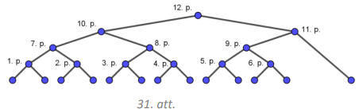

# <lo-sample/> LV.NOL.2019.11.3.

Divas riņķa līijas $\omega_{1}$ (ar centru punktā $O_{1}$) un $\omega_{2}$ (ar 
centru punktā $O_{2}$) krustojas punktā $A$. Taisne $O_{1} A$ krusto 
$\omega_{2}$ punktā $B_{2}$, bet $\omega_{1}-$ punktā $C_{1}$. Taisne $O_{2}A$ 
krusto $\omega_{1}$ punktā $B_{1}$, bet $\omega_{2}$ - punktā $C_{2}$ (skat. 
32.att.). Pierādīt, ka $\sphericalangle B_{2}B_{1}A=\sphericalangle C_{2}C_{1}A$.

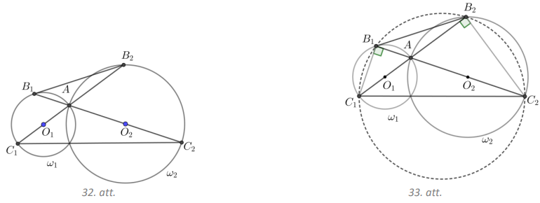

<small>

* questionType:
* domain:

</small>

## Atrisinājums

Tā kā $\sphericalangle C_{1}B_{1}A=\sphericalangle C_{2}B_{2}A=90^{\circ}$ (kā 
ievilktie leņķi, kas balstās uz diametra) un 
$\sphericalangle B_{1}AC_{1}=\sphericalangle B_{2}AC_{2}$ (kā krustleņķi), tad 
trijstūri $\triangle AB_{1}C_{1} \sim \triangle AB_{2}C_{2}$ pēc pazīmes 
$\ell \ell$ un $\frac{AB_{1}}{AB_{2}}=\frac{AC_{1}}{AC_{2}}$. Tā kā 
$\frac{AB_{1}}{AB_{2}}=\frac{AC_{1}}{AC_{2}}$ un 
$\sphericalangle B_{1}AB_{2}=\sphericalangle C_{1}AC_{2}$ kā krustleņķi, tad 
$\Delta B_{1}AB_{2} \sim \Delta C_{1}AC_{2}$ pēc pazīmes $m \ell m$. Tātad 
$\sphericalangle B_{2}B_{1}A=\sphericalangle C_{2}C_{1}A$ kā atbilstošie leņķi 
līdzīgos trijstūros.

## Atrisinājums

Tā kā $\sphericalangle C_{1}B_{1}A=\sphericalangle C_{2}B_{2}A=90^{\circ}$ kā 
ievilktie leņķi, kas balstās uz diametra, tad ap četrstūri 
$B_{1}B_{2}C_{2}C_{1}$ var apvilkt riņķa līniju (skat. 33.att.). Līdz ar to 
$\sphericalangle B_{2}B_{1}C_{2}=\sphericalangle C_{2}C_{1}B_{2}$ kā ievilktie 
leņķi, kas balstās uz viena un tā paša loka $B_{2}C_{2}$. Tātad 
$\sphericalangle B_{2}B_{1}A=\sphericalangle C_{2}C_{1}A$.

# <lo-sample/> LV.NOL.2019.11.4.

Pierādīt, ka nevienādība 
$\frac{a}{b}(a+1)^{2}+\frac{b}{a}(b+1)^{2} \geq 2(a+1)(b+1)$ ir spēkā visiem 
reāliem pozitīviem skaitļiem $a$ un $b$.

<small>

* questionType:
* domain:

</small>

## Atrisinājums

Tā kā $a$ un $b$ ir pozitīvi skaitļi, tad abas nevienādības puses drīkst 
reizināt ar $ab$. legūstam pierādāmajai nevienādībai ekvivalentu nevienādību

$$\begin{gathered}
a^{2}(a+1)^{2}+b^{2}(b+1)^{2} \geq 2a(a+1)b(b+1) \\
a^{2}(a+1)^{2}-2a(a+1) b(b+1)+b^{2}(b+1)^{2} \geq 0
\end{gathered}$$

Ekvivalenti pārveidojam šīs nevienādības kreisās puses izteiksmi:

$$\begin{gathered}
(a(a+1))^{2}-2a(a+1) b(b+1)+(b(b+1))^{2} \geq 0 \\
(a(a+1)-b(b+1))^{2} \geq 0
\end{gathered}$$

Reāla skaitļa kvadrāts ir vienmēr ir nenegatīvs. Līdz ar to iegūta patiesa 
nevienādība un arī dotā nevienādība ir patiesa, jo tika veikti tikai 
ekvivalenti pārveidojumi.

## Atrisinājums

Dotā nevienādība ir ekvivalenta nevienādībai

$$\frac{a}{b}(a+1)^{2}+\frac{b}{a}(b+1)^{2}-2(a+1)(b+1) \geq 0$$

levērojot, ka $a$ un $b$ ir pozitīvi skaitļi, ekvivalenti pārveidojam šīs 
nevienādības kreisās puses izteiksmi:

$$\begin{gathered}
\left(\sqrt{\frac{a}{b}}\right)^{2}(a+1)^{2}+\left(\sqrt{\frac{b}{a}}\right)^{2}(b+1)^{2}-2(a+1)(b+1) \geq 0 \\
\left(\sqrt{\frac{a}{b}}(a+1)\right)^{2}-2 \sqrt{\frac{a}{b}}(a+1) \sqrt{\frac{b}{a}}(b+1)+\left(\sqrt{\frac{b}{a}}(b+1)\right)^{2} \geq 0 \\
\left(\sqrt{\frac{a}{b}}(a+1)-\sqrt{\frac{b}{a}}(b+1)\right)^{2} \geq 0
\end{gathered}$$

Reāla skaitļa kvadrāts vienmēr ir nenegatīvs. Līdz ar to iegūta patiesa 
nevienādība un arī dotā nevienādība ir patiesa, jo tika veikti tikai 
ekvivalenti pārveidojumi.

## Atrisinājums

Tā kā $a$ un $b$ ir pozitīvi skaitļi, tad dotās nevienādības kreisās puses 
izteiksmi var novērtēt, izmantojot nevienādību starp vidējo aritmētisko un 
vidējo ģeometrisko:

$$\frac{a}{b}(a+1)^{2}+\frac{b}{a}(b+1)^{2} \geq 2 \cdot \sqrt{\frac{a}{b}(a+1)^{2} \cdot \frac{b}{a}(b+1)^{2}}=2(a+1)(b+1)$$

kas arī bija jāpierāda.

# <lo-sample/> LV.NOL.2019.11.5.

Atrast visus pirmskaitļu pārus $(m, n)$, kuriem $20m+19n=2019$.

<small>

* questionType:
* domain:

</small>

## Atrisinājums

Pārveidojam doto vienādojumu

$$\begin{aligned}
2000-20m & =19n-19 \\
20(100-m) & =19(n-1)
\end{aligned}$$

levērojam, ka iegūtās vienādības labās puses izteiksme ir pozitīva, tātad arī 
$(100-m)$ jābūt pozitīvam. Tā kā $20$ un $19$ ir savstarpēji pirmskaitļi, tad 
$(100-m)$ ir jādalās ar $19$. lespējamās $m$ vērtības varētu būt 
$5,\ 24,\ 43,\ 62$ un $81$, no kurām derīgas ir tikai $5$ un $43$, jo tie ir 
pirmskaitļi. Atrodam atbilstošās $n$ vērtības:

- ja $m=5$, tad $20 \cdot 95=19(n-1)$ jeb $n=101$ (pirmskaitlis),

- ja $m=43$, tad $20 \cdot 57=19(n-1)$ jeb $n=61$ (pirmskaitlis).

Tātad dotajam vienādojumam ir divi atrisinājumi: $m=5,\ n=101$ un 
$m=43,\ n=61$.

## Atrisinājums

Apskatīsim doto vienādojumu pēc moduļa $19$. Tā kā 
$20m \equiv 1 \cdot m \equiv m(\bmod 19)$, $19n \equiv 0(\bmod 19)$ un 
$2019 \equiv 5(\bmod 19)$, tad, lai būtu vienādība, jāizpildās nosacījumam 
$m \equiv 5(\bmod 19)$. levērojot, ka $20 \cdot 101=2020>2019$, secinām, ka 
$m<101$. Tātad derīgās $m$ vērtības ir pirmskaitļi, kas mazāki nekā $101$, un, 
dalot ar $19$, dod atlikumu $5$. Šādas vērtības ir tikai divas $m=5$ un $m=43$.
Atrodam atbilstošās $n$ vērtības:

- ja $m=5$, tad $20 \cdot 95=19(n-1)$ jeb $n=101$ (pirmskaitlis),
- ja $m=43$, tad $20 \cdot 57=19(n-1)$ jeb $n=61$ (pirmskaitlis).

Tātad dotajam vienādojumam ir divi atrisinājumi: $m=5,\ n=101$ un $m=43,\ n=61$.

# <lo-sample/> LV.NOL.2019.12.1.

Urnā atrodas $66$ baltas un nezināms skaits melnu lodīšu. Ja uz labu laimi tiek
izvilktas divas lodītes, tad varbūtība, ka abas lodītes būs vienā krāsā, sakrīt
ar varbūtību, ka lodītes būs dažādās krāsās. Cik melno lodīšu atrodas urnā? 

<small>

* questionType:
* domain:

</small>

## Atrisinājums

Tā kā varbūtība, ka abas lodītes būs vienā krāsā, sakrīt ar varbūtību, ka 
lodītes būs dažādās krāsās, tad abas varbūtības ir $\frac{1}{2}$. Varbūtību, ka
abas lodītes būs vienā krāsā, aprēķināsim izmantojot formulu 
$P(A)=\frac{k}{n^{\prime}}$ kur $k$ ir labvēlīgo notikumu skaits un $n$ ir visu
notikumu kopskaits.

Ar $m$ apzīmējam melno lodīšu skaitu. Tad labvēlīgo notikumu (abas lodītes ir 
vienā krāsā) skaits ir $66 \cdot 65+m(m-1)$ un visu notikumu kopskaits 
(izņemtas divas lodītes) ir $(66+m)(65+m)$. Līdz ar to varbūtība, ka abas 
izvilktās lodītes ir vienādā krāsā, ir 
$\frac{m(m-1)+66 \cdot 65}{(66+m)(65+m)}$.

Lai iegūtu melno lodīšu skaitu, jāatrisina vienādojums

$$\frac{m(m-1)+66 \cdot 65}{(66+m)(65+m)}=\frac{1}{2}$$

Reizinām abas vienādojuma puses ar $2(66+m)(65+m)>0$, iegūstam

$$\begin{gathered}
2m^{2}-2m+2 \cdot 66 \cdot 65=66 \cdot 65+131m+m^{2} \\
m^{2}-133m+66 \cdot 65=0
\end{gathered}$$

Šī vienādojuma saknes ir $m_{1}=78$ un $m_{2}=55$. Tātad urnā atrodas $78$ vai 
$55$ melnas lodītes.

$Piezīme.$ Varbūtību, ka abas izņemtās lodītes ir vienā krāsā, var arī 
aprēķināt, izmantojot notikumu summas varbūtību, tas ir, ja notikumi $A$ un 
$B$ ir nesavienojami, tad $P(A \cup B)=P(A)+P(B)$, kur $A$ - abas izņemtās 
lodītes ir baltas un $B$ - abas izņemtās lodītes ir melnas. Aprēķinām varbūtību
$P(A)$. Ar $m$ apzīmējam melno lodīšu skaitu. Varbūtība, ka pirmā izvilktā 
lodīte ir balta, ir $\frac{66}{66+m}$ un varbūtība, ka otrā izvilktā lodīte arī
ir balta (ja pirmā bija balta), ir $\frac{66-1}{66+m-1}$. Tātad varbūtība, ka 
abas izvilktās lodītes ir baltas, ir $P(A)=\frac{66 \cdot 65}{(66+m)(65+m)}$. 
Līdzīgi iegūstam, ka varbūtība, ka abas izvilktās lodītes ir melnas, ir 
$P(B)=\frac{m(m-1)}{(66+m)(65+m)}$. Līdz ar to varbūtība, ka abas izvilktās 
lodītes ir vienādā krāsā, ir 
$\frac{m(m-1)}{(66+m)(65+m)}+\frac{66 \cdot 65}{(66+m)(65+m)}$.

# <lo-sample/> LV.NOL.2019.12.2.

Brigita ir iedomājusies naturālu skaitli, kas nepārsniedz $60$. Indra drīkst 
Brigitai uzdot jautājumus, uz kuriem atbilde ir "jā" vai "nē". Kā, uzdodot 
sešus jautājumus, Indra noteikti var uzzināt Brigitas iedomāto skaitli?

<small>

* questionType:
* domain:

</small>

## Atrisinājums

Indra domās sadala skaitļus divos vienāda apjoma intervālos: $[1; 30]$ un 
$[31; 60]$. Pirmais jautājums: "Vai iedomātais skaitlis pieder intervālam 
$[1; 30]$ ?"

- Ja atbilde uz pirmo jautājumu ir "jā", tad nākamais jautājums jāuzdod par 
  divreiz mazāku intervālu nekā tas, par kuru jau zināms, ka tajā atrodas 
  iedomātais skaitlis, tas ir, "Vai iedomātais skaitlis pieder intervālam 
  $[1; 15]$?"

- Ja atbilde uz pirmo jautājumu ir "nē", tad iedomātais skaitlis atrodas 
  intervālā $[31; 60]$ un nākamais jautājums būtu jāuzdod par divreiz mazāku 
  intervālu $[31; 45]$.

Līdzīgi Indrai jārīkojas arī turpmākajos jautājumos, tas ir, atkarībā no 
atbildes vienmēr jāaplūko tas intervāls, kas satur iedomāto skaitli, un šis 
intervāls jāsadala divos pēc apjoma vienādos intervālos (katrā no abiem 
intervāliem ir vai nu $n$ skaitļi, vai arī vienā ir $n$, bet otrā $n+1$ 
skaitlis). (Skat., piemēram, 34.att., kurā parādīts, kāda apjoma intervālos 
notiek dalīšana.)

Šādi rīkojoties, ar sešiem jautājumiem Indra noteikti var uzzināt Brigitas 
iedomāto skaitli.

$Piezīme.$ Atrisinājums balstīts uz "skaldi un valdi" algoritmu.

## Atrisinājums

Tā kā Brigitas iedomātais skaitlis nepārsniedz $60$, tad to binārajā 
skaitīšanas sistēmā var uzrakstīt izmantojot ne vairāk kā $6$ ciparus. Indrai 
jāuzdod jautājums par katru skaitļa ciparu:

$1.$ jautājums - Vai skaitļa pirmais cipars binārajā skaitīšanas sistēmā ir $1$?
$2.$ jautājums - Vai skaitļa otrais cipars binārajā skaitīšanas sistēmā ir $1$?

   $\ldots $

$6.$ jautājums - Vai skaitļa sestais cipars binārajā skaitīšanas sistēmā ir $1$?

Tā kā skaitļa binārajā pierakstā tiek izmantoti tikai cipari $0$ un $1$, tad 
šādi rīkojoties, ar sešiem jautājumiem Indra noteikti var uzzināt Brigitas 
iedomāto skaitli.

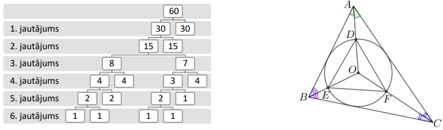

# <lo-sample/> LV.NOL.2019.12.3.

Trijstūrī $ABC$ ievilktās riņķa līnijas centrs ir $O$. Nogriežņi $OA, OB, OC$ 
krusto šo riņķa līniju attiecīgi punktos $D, E, F$. Zināms, ka 
$\frac{AB}{DE}=\frac{BC}{EF}=\frac{AC}{DF}$. Pierādīt, ka trijstūris $ABC$ ir 
regulārs!

<small>

* questionType:
* domain:

</small>

## Atrisinājums

Punkts $O$ ir trijstūra $ABC$ bisektrišu krustpunkts (skat. 35.att.). Apzīmējam
$\sphericalangle BAC=2 \alpha$, $\sphericalangle ABC=2 \beta$ un 
$\sphericalangle ACB=2 \gamma$. Tad 
$\sphericalangle DOF=180^{\circ}-\alpha-\gamma$ un 
$\sphericalangle ODF=\sphericalangle DFO=\frac{1}{2}(\alpha+\gamma)$, jo 
$\triangle ODF$ ir vienādsānu. Līdzīgi iegūstam, ka 
$\sphericalangle EDO=\sphericalangle DEO=\frac{1}{2}(\alpha+\beta)$ un 
$\sphericalangle OEF=\sphericalangle OFE=\frac{1}{2}(\beta+\gamma)$.

Tātad $\triangle DEF$ iekšējo leņķu lielumi ir 
$\sphericalangle EDF=\alpha+\frac{1}{2}(\beta+\gamma), \sphericalangle DEF=\beta+\frac{1}{2}(\alpha+\gamma), \sphericalangle E F D=\gamma+\frac{1}{2}(\alpha+\beta)$.
Izmantojot, ka $\alpha+\beta+\gamma=90^{\circ}$, iegūstam 
$\sphericalangle EDF=\frac{\alpha}{2}+45^{\circ}, \sphericalangle DEF=\frac{\beta}{2}+45^{\circ}$
un $\sphericalangle EFD=\frac{\gamma}{2}+45^{\circ}$. Tā kā 
$\frac{AB}{DE}=\frac{BC}{EF}=\frac{AC}{DF}$, tad 
$\triangle ABC \sim \triangle DEF$ pēc pazīmes $mmm$ un atbilstošie trijstūru 
leņķi ir vienādi, tas ir, 
$2 \alpha=\frac{\alpha}{2}+45^{\circ}, 2 \beta=\frac{\beta}{2}+45^{\circ}$ un 
$2 \gamma=\frac{\gamma}{2}+45^{\circ}$. Tātad $\alpha=\beta=\gamma=30^{\circ}$ 
jeb $2 \alpha=2 \beta=2 \gamma=60^{\circ}$ un $\triangle ABC$ ir regulārs.

## Atrisinājums

Punkts $O$ ir trijstūrim $DEF$ apvilktās riņķa līnijas centrs - 
vidusperpendikulu krustpunkts. Tā kā $\frac{AB}{DE}=\frac{BC}{EF}=\frac{AC}{DF}$,
tad trijstūri $ABC$ un $DEF$ ir homotētiski ar homotētijas centru $O$. Tātad 
trijstūrī $DEF$ ievilktās riņķa līnijas centrs arī ir $O$. Tā kā trijstūra 
$DEF$ bisektrišu krustpunkts sakrīt ar vidusperpendikulu krustpunktu, tad tas 
ir regulārs trijstūris. Līdz ar to arī trijstūris $ABC$ ir regulārs.

# <lo-sample/> LV.NOL.2019.12.4.

Pierādīt, ka pozitīviem skaitļiem $a,\ b,\ c$ izpildās nevienādība 
$\left|\sqrt{a^{2}+b^{2}}-\sqrt{a^{2}+c^{2}}\right| \leq|b-c|$.

<small>

* questionType:
* domain:

</small>

## Atrisinājums

Ja $b=c$, tad dotā nevienādība ir patiesa.

Ja $b>c$, tad jāpierāda, ka $\sqrt{a^{2}+b^{2}}-\sqrt{a^{2}+c^{2}} \leq b-c$. 
Reizinot abas nevienādības puses ar saistīto izteiksmi 
$\left(\sqrt{a^{2}+b^{2}}+\sqrt{a^{2}+c^{2}}\right)$, iegūstam 
$b^{2}-c^{2} \leq(b-c)\left(\sqrt{a^{2}+b^{2}}+\sqrt{a^{2}+c^{2}}\right)$.

Tālāk, dalot abas nevienādības puses ar $(b-c)$, kas ir pozitīvs skaitlis, 
iegūstam

$b+c \leq \sqrt{a^{2}+b^{2}}+\sqrt{a^{2}+c^{2}}$,

kas ir patiesa nevienādība, jo $b \leq \sqrt{a^{2}+b^{2}}$ un 
$c \leq \sqrt{a^{2}+c^{2}}$.

Ja $b < c$, tad jāpierāda, ka $\sqrt{a^{2}+c^{2}}-\sqrt{a^{2}+b^{2}} \leq c-b$, 
ko var izdarīt analogi kā iepriekšējā gadījumā.

## Atrisinājums

Ja $b=c$, tad dotā nevienādība ir patiesa.

Apskatām gadījumu, kad $b \neq c$. Novelkam nogriezni $AD$, kura garums ir $a$.
Tam perpendikulāri no punkta $D$ uz vienu pusi atliekam nogriežņus $BD$ un 
$CD$, kuru garumi attiecīgi ir $b$ un $c$ (iespējami divi gadījumi, skat. 
36.att.). No Pitagora teorēmas trijstūros $ADB$ un $ADC$ iegūstam, ka 
$AC=\sqrt{a^{2}+c^{2}}$ un $AB=\sqrt{a^{2}+b^{2}}$. levērojam, ka 
$BC=|BD-CD|=|b-c|$. No trijstūra nevienādības trijstūrī $ABC$ iegūstam 
$BC>|AB-AC|$ jeb $|b-c|>\left|\sqrt{a^{2}+b^{2}}-\sqrt{a^{2}+c^{2}}\right|$.

Līdz ar to esam pierādījuši, ka 
$\left|\sqrt{a^{2}+b^{2}}-\sqrt{a^{2}+c^{2}}\right| \leq|b-c|$.

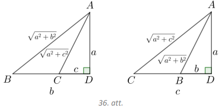

# <lo-sample/> LV.NOL.2019.12.5.

Pierādīt, ka vienādojumam $(a-b)^{2}=a+b$ ir bezgalīgi daudz atrisinājumu 
naturālos skaitļos!

<small>

* questionType:
* domain:

</small>

## Atrisinājums

Pamatosim, ka der vērtības formā $a=\frac{k(k+1)}{2}$ un $b=\frac{k(k-1)}{2}$, 
kur $k$ ir naturāls skaitlis, kas lielāks nekā $1$:

- $a$ un $b$ ir naturāli skaitļi, jo $k(k+1)$ un $k(k-1)$ dalās ar $2$ kā
  divu pēc kārtas esošu naturālu skaitļu reizinājums;
- ievietojot šīs vērtības dotajā vienādojumā, iegūstam patiesu vienādību:

$$\begin{aligned}
\left(\frac{k(k+1)}{2}-\frac{k(k-1)}{2}\right)^{2} & =\frac{k(k+1)}{2}+\frac{k(k-1)}{2} \\
\left(\frac{2k}{2}\right)^{2}=\frac{2k^{2}}{2} & \Rightarrow \quad k^{2}=k^{2}
\end{aligned}$$

Tā kā šādu $k$ vērtību ir bezgalīgi daudz, tad arī dotajam vienādojumam ir 
bezgalīgi daudz atrisinājumu:

$Piezīme.$ Meklētās $a$ un $b$ vērtības var palīdzēt atrast tālāk aprakstītie 
spriedumi.

$1.\ veids.$ Apzīmējam $a-b=k$, tad $k^{2}=a+b$. Saskaitot abas vienādības, 
iegūstam $2a=k+k^{2}$ jeb $a=\frac{k(k+1)}{2}$. Aprēķinām 
$b=a-k=\frac{k^{2}+k}{2}-k=\frac{k^{2}-k}{2}=\frac{k(k-1)}{2}$  
$2.\ veids.$ Apzīmējam $a-b=k$, tad $a+b=k+2b$, tātad doto vienādojumu var 
pārrakstīt formā $k^{2}=k+2b$, no kā iegūstam, ka 
$b=\frac{k^{2}-k}{2}=\frac{k(k-1)}{2}$ un $a=k+b$.
