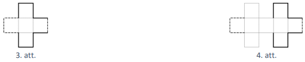
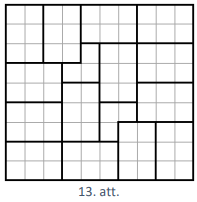
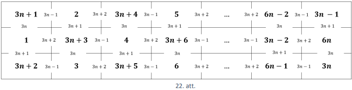
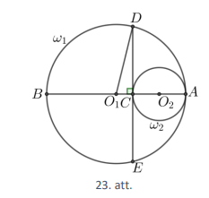
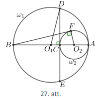

# <lo-sample/> LV.NOL.2021.5.1.

Doti četri trīsciparu skaitļi 
$\bar{x} \overline{zy}; \overline{yaz}; \overline{yax}; \overline{zxa}$ un 
zināms, ka $a, x, y, z$ ir dažādi cipari. Vai var būt, ka 
$\overline{xzy}<\overline{yaz}<\overline{yax}<\overline{zxa}$?

<small>

* questionType:
* domain:

</small>

## Atrisinājums

Pieņemsim, ka šajā virknē katrs nākamais skaitlis ir lielāks nekā 
iepriekšējais. Lielāks ir tas skaitlis, kuram lielāks ir vecākās šķiras cipars.
Aplūkojot pirmo, otro un ceturto skaitli, iegūstam, ka $x < y < z$. Salīdzinot otro
un trešo skaitli, iegūstam $z < x$. legūta pretruna, tātad nevar būt, ka šajā 
virknē katrs nākamais skaitlis ir lielāks nekā iepriekšējais.

# <lo-sample/> LV.NOL.2021.5.2.

Valentīns savā burtnīcā zīmē figūras, pirmās trīs no tām parādītas 1.att. Pirmā
figūra sastāv no pieciem vienādiem kvadrātiem un tās perimetrs ir $12$ cm. 
Katru nākamo figūru Valentīns iegūst, iepriekšējai figūrai labajā pusē 
piezīmējot klāt vienu 2.att. doto figūru.

**a)** No cik kvadrātiem sastāv $70.$ figūra?

**b)** Nosaki $70.$ figūras perimetru!

**c)** Vai kādai no Valentīna zīmētajām figūrām perimetrs ir $1000$ cm?

<small>

* questionType:
* domain:

</small>

## Atrisinājums

**a)** levērojam, ka, lai iegūtu nākamo figūru, iepriekšējai figūrai tiek 
       pievienoti $4$ kvadrāti. Pirmā figūrai sastāv no $5$ kvadrātiem un vēl 
	   jāpievieno $69 \cdot 4$ kvadrāti, tātad $70.$ figūra sastāvēs no 
	   $5+276=281$ kvadrāta.

**b)** levērojam, ka pirmajai figūrai ir $12$ vienādas malas, tātad katras 
	   malas garums ir $1$ cm. Apskatām, kā mainās katras nākamās figūras 
	   perimetrs.

- Pirmajai figūrai perimetrs ir $P_{1}=12$ cm. levērojam, ka $12$ var uzrakstīt
  kā $4+8$ (skat. 3.att., kur malu, kas iekrāsotas ar pārtrauktu līniju, 
  kopējais garums ir $4$ cm, bet ar biezāku līniju iekrāsoto malu kopējais 
  garums ir $8$ cm).
- Otrajai figūrai perimetrs ir $P_{2}=4+8+8=4+2 \cdot 8$ cm, jo pie pirmās 
  figūras perimetra nāk klāt $8$ malas (skat. 4.att., kur ar biezāku līniju 
  iezīmētas malas, kas tiek pievienotas figūrai), kuru kopējais garums ir $8$ 
  cm.
- Trešajai figūrai perimetrs ir $P_{3}=4+2 \cdot 8+8=4+3 \cdot 8$ cm, jo pie 
  otrās figūras perimetra nāk klāt $8$ malas.

Līdzīgi iegūst arī nākamo figūru perimetrus, katru reizi pieskaitot $8$ cm. 
Līdz ar to figūras, kuras kārtas numurs ir $n$, perimetrs ir 
$P_{n}=4+n \cdot 8$ cm.

Tātad $70.$ figūras perimetrs ir $P_{70}=4+70 \cdot 8=564$ cm.

**c)** levērojam, ja no figūras perimetra atņem $4$, tad iegūtajam rezultātam 
       jādalās ar $8$. Tā kā $1000-4=996$ un $996:8=124$, $atl$ $4$ (nedalās 
	   ar $8$), tad nav tādas figūras, kuras perimetrs ir $1000$ cm.

# <lo-sample/> LV.NOL.2021.5.3.

Sagriez 5.att. doto figūru divpadsmit 6.att. figūrās!

<small>

* questionType:
* domain:

</small>

## Atrisinājums

Skat., piemēram, 7.att.

# <lo-sample/> LV.NOL.2021.5.4.

Dota tabula ar izmēriem $2 \times 12$ rūtiņas. Katrā rūtiņā ierakstīts naturāls
skaitlis no $1$ līdz $24$ (katrā rūtiņā cits skaitlis). Vai iespējams, ka 
rūtiņās, kurām ir kopīga mala, ierakstīto skaitļu starpība ir vismaz **a)** 
$11$, **b)** $12$?

<small>

* questionType:
* domain:

</small>

## Atrisinājums

**a)** Jā, prasītais ir iespējams, piemēram, skat. 8.att.

**b)** Pierādīsim, ka prasītais nav iespējams. Pieņemsim pretējo, ka iespējams 
	   aizpildīt tabulu. levērojam, ka katrai tabulas rūtiņai ir vismaz divas 
	   blakus rūtiņas (blakus rūtiņas ir rūtiņas, kurām ir kopīga mala), un 
	   aplūkosim to rūtiņu, kurā ierakstīts skaitlis $12$. Šim skaitlim tikai 
	   viens no tabulā ierakstītajiem skaitļiem var nodrošināt starpību, kas ir
       vismaz $12$, ir skaitlis $24$. Esam ieguvuši pretrunu, tātad derīgs 
	   tabulas aizpildījums neeksistē.

# <lo-sample/> LV.NOL.2021.5.5.

Atrodi tādu trīsciparu skaitli, kam vienlaicīgi izpildās tālāk dotie nosacīumi!
Šis skaitlis,

- dalot ar $2$, atlikumā dod $1$,
- dalot ar $3$, atlikumā dod $2$,
- dalot ar $4$, atlikumā dod $3$,
- dalot ar $5$, atlikumā dod $4$,
- dalot ar $6$, atlikumā dod $5$,
- dalot ar $7$, atlikumā dod $6$,
- dalot ar $8$, atlikumā dod $7$.

<small>

* questionType:
* domain:

</small>

## Atrisinājums

Ja meklētajam skaitlim pieskaitīsim $1$, tad iegūtais skaitlis dalīsies ar 
$2; 3; 4; 5; 6; 7; 8$ (bez atlikuma). levērojam, ka der skaitlis 
$3 \cdot 5 \cdot 7 \cdot 8=840$, tas dalās ar $2; 3; 4; 5; 6; 7$ un $8$. Tātad 
meklētais skaitlis ir $840-1=839$.

# <lo-sample/> LV.NOL.2021.6.1.

Doti trīs kvadrāti ar laukumiem attiecīgi $1m^{2}, 4m^{2}$ un $9m^{2}$. 
Kvadrāti salikti viens virs otra tā, kā parādīts 9.att. Aprēķini iegūtās 
figūras perimetru!

<small>

* questionType:
* domain:

</small>

## Atrisinājums

Kvadrātu malu garumi attiecīgi ir $1$ m, $2$ m un $3$ m. levērojam, ka lauztās 
līnijas $ABCDE$ garums ir tāds pats kā lauztās līnijas $AKE$ garums un lauztās 
līnijas $JIHGF$ garums ir tāds pats kā lauztās līnijas $JMF$ garums (skat. 
10.att.). Tad dotās figūras garums ir $1+2+3=6$ m un platums ir $3$ m. Līdz ar 
to figūras perimetrs ir $(6+3) \cdot 2=18$ m.

# <lo-sample/> LV.NOL.2021.6.2.

Atrodi skaitļa $1^{3}+3^{3}+5^{3}+\cdots+101^{3}$ pēdējo ciparu!

<small>

* questionType:
* domain:

</small>

## Atrisinājums

Lai atrastu dotās summas pēdējo ciparu, sagrupējam saskaitāmos un nosakām 
katras grupas summas pēdējo ciparu:

- summas $1^{3}+11^{3}+\cdots+101^{3}$ pēdējais cipars ir $1$, jo ir 
  vienpadsmit saskaitāmie un katra saskaitāmā pēdējais cipars ir $1$;
- $3^{3}+13^{3}+\cdots+93^{3}$ pēdējais cipars ir $0$, jo katra saskaitāmā 
  pēdējais cipars ir $7$, jo $3^{3}=27$, un pavisam ir $10$ šādi saskaitāmie 
  $7 \cdot 10=70$.
- $5^{3}+15^{3}+\cdots+95^{3}$ pēdējais cipars ir $0$, jo katra saskaitāmā 
  pēdējais cipars ir $5$, jo $5^{3}=125$, un pavisam ir $10$ šādi saskaitāmie 
  $5 \cdot 10=50$.
- $7^{3}+17^{3}+\cdots+97^{3}$ pēdējais cipars ir $0$, jo katra saskaitāmā 
  pēdējais cipars ir $3$, jo $7^{3}=343$, un pavisam ir $10$ šādi saskaitāmie 
  $3 \cdot 10=30$.
- $9^{3}+19^{3}+\cdots+99^{3}$ pēdējais cipars ir $0$, jo katra saskaitāmā 
  pēdējais cipars ir $9$, jo $9^{3}=729$, un pavisam ir $10$ šādi saskaitāmie 
  $9 \cdot 10=90$.

Tātad uzdevumā dotā skaitļa pēdējais cipars ir $1$.

# <lo-sample/> LV.NOL.2021.6.3.

Izmantojot divas 11.att. un četrpadsmit 12.att. figūras, saliec taisnstūri ar 
izmēriem $10 \times 9$ tā, lai 11.att. figūras nesaskartos! Figūras drīkst 
pagriezt.

<small>

* questionType:
* domain:

</small>

## Atrisinājums

Skat., piemēram, 13.att.

# <lo-sample/> LV.NOL.2021.6.4.

Dota tabula ar izmēriem $3 \times 10$ rūtiņas. Katrā rūtiņā ierakstīts naturāls
skaitlis no $1$ līdz $30$ (katrā rūtiņā cits skaitlis). Vai iespējams, ka 
rūtiņās, kurām ir kopīga mala, ierakstīto skaitļu starpība ir vismaz **a)** 
$14$, **b)** $15$?

<small>

* questionType:
* domain:

</small>

## Atrisinājums

**a)** Jā, prasītais ir iespējams, piemēram, skat. 14.att.

**b)** Pierādīsim, ka prasītais nav iespējams. Pieņemsim pretējo, ka iespējams 
	   aizpildīt tabulu. levērojam, ka katrai tabulas rūtiņai ir vismaz divas 
	   blakus rūtiņas (blakus rūtiņas ir rūtiņas, kurām ir kopīga mala), un 
	   aplūkosim to rūtiņu, kurā ierakstīts skaitlis $15$. Šim skaitlim tikai 
	   viens no tabulā ierakstītajiem skaitļiem var nodrošināt starpību, kas ir
	   vismaz $15$, ir skaitlis $30$. Esam ieguvuši pretrunu, tātad derīgs 
	   tabulas aizpildījums neeksistē.

# <lo-sample/> LV.NOL.2021.6.5.

Sešciparu naturāliem skaitļiem katrs cipars aizstāts ar burtu tā, ka vienādi 
burti aizstāj vienādus ciparus, bet dažādi burti - dažāus ciparus. Zināms, ka 
trīs skaitļi, kam pēc aizstāšanas atbilst vārdi $AGNESE, ASTERE$ un $SNIEGS$, 
visi dalās ar $8$. Vai iespējams, ka skaitlis, kam atbilst vārds $GRIEZE$, 
dalās ar $8$?

<small>

* questionType:
* domain:

</small>

## Atrisinājums

Skaitlis dalās ar $8$, ja tā pēdējo trīs ciparu veidotais skaitlis dalās ar 
$8$. Pieņemsim, ka visi skaitļi $ESE, ERE, EGS$ un $EZE$ dalās ar $8$.

levērojam, ka ar $8$ dalās tikai pāra skaitļi, tāpēc burtiem $E$ un $S$ atbilst
pāra cipari.

No tā, ka skaitlis $ESE$ dalās ar $8$, iegūstam, ka burta $E$ var vietā būt 
tikai $0, 4$ vai $8$, jo neviens no skaitļiem 
$202, 242, 262, 282, 606, 626, 646, 686$ nedalās ar $8$ (neviens no tiem 
nedalās ar $4$, tātad nedalās arī ar $8$).

Apskatām visus iespējamos gadījumus.

- Ja ar $E$ ir aizstāts cipars $0$ vai $8$, tad trīsciparu skaitļu, kas sākas 
  un beidzas ar $E$ un dalās ar $8$, vidējais cipars var būt tikai $0, 4$ vai 
  $8$. Tā kā $E$ jau izmanto vienu no cipariem $0$ vai $8$, tad iespējami tikai
  divi varianti. Pēc dotā $ESE$ un $ERE$ atbilstošie skaitļi dalās ar $8$, 
  tāpēc $EZE$ atbilstošais skaitlis nevar dalīties ar $8$.
- Ja ar $E$ aizstāts cipars $4$, tad trīsciparu skaitļu, kas sākas un beidzas 
  ar $E$ un dalās ar $8$, vidējais cipars var būt tikai $2$ un $6$. Arī šajā 
  gadījumā iespējami tikai divi varianti $424$ un $464$. Pēc dotā $ESE$ un 
  $ERE$ atbilstošie skaitļi dalās ar $8$, tāpēc $EZE$ atbilstošais skaitlis 
  nevar dalīties ar $8$.

Līdz ar to esam pamatojuši, ka skaitlis, kam atbilst vārds $GRIEZE$, nedalās ar
$8$.

$Piezīme.$ Viens derīgs skaitļu komplekts iegūstams, ja burtus aizvieto šādi: 
$A=9, G=2, N=3, E=0, S=4, T=6, R=8, I=5, Z=1$ (der arī $Z=7$). Tādā gadījumā 
vārdam $AGNESE$ atbilst skaitlis $923040, ASTERE - 946080, SNIEGS - 435024$ un 
$GRIEZE - 285010$.

# <lo-sample/> LV.NOL.2021.7.1.

Dota taisne $y=2019x-2020$. Uzraksti vienādojumu taisnei, kas iet caur punktu 
$(14; -2006)$ un krusto doto taisni punktā, kura abscisa ir $0$.

<small>

* questionType:
* domain:

</small>

## Atrisinājums

Meklētās taisnes vienādojums ir formā $=kx+b$, kur 
$k \in \mathbb{R}, b \in \mathbb{R}$. Sākumā atrodam ordinātu punktam, kurā 
meklētā taisne krusto doto taisni $y=2019 \cdot 0-2020=-2020$. Tātad meklētā un
dotā taisne krustojas punktā $(0; -2020)$. Līdz ar to $b=-2020$. Tā kā meklētā 
taisne iet caur punktu $(14; -2006)$, tad iegūstam vienadojumu $-2006=14k-2020$
jeb $k=1$. Tātad meklētās taisnes vienādojums ir $y=x-2020$.

# <lo-sample/> LV.NOL.2021.7.2.

Uz tāfeles rindā uzrakstīti nepāra skaitļi $1; 3; 5; \ldots ; 2021; 2023$. 
Katram no tiem priekšā pierakstīa vai nu "+", vai "-" zīmi. Vai var gadīties, 
ka iegūtās izteiksmes vērtība ir **a)** $4$; **b)** $1$?

<small>

* questionType:
* domain:

</small>

## Atrisinājums

**a)** Jā, iegūtās izteiksmes vērtība var būt $4$. Apskatām četrus pēc kārtas 
	   esošus naturālus nepāra skaitļus $2n-1; 2n+1; 2n+3; 2n+5$. levērojam, ka
	   katram no tiem var pierakstīt priekšā vai nu "+", vai "-" zīmi tā, lai 
	   iegūtu summu $0$:

$$+(2n-1)-(2n+1)-(2n+3)+(2n+5)=0$$

Pavisam uz tāfeles ir uzrakstīti $1012$ skaitļi. Sagrupējam skaitļus no $9$ 
līdz $2023$ grupās pa četri tā, lai katrā grupā esošo skaitļu summa būtu $0$, 
bet skaitļiem $1; 3; 5; 7$ priekšā liekam attiecīgi "- + - +":

$$\underbrace{-1+3-5+7}{=4} \underbrace{+9-11-13+15}{=0}+\ldots \underbrace{+2017-2019-2021+2023}_{=0}=4$$

**b)** Nē, nevar iegūt vērtību $1$. Tā kā uz tāfeles ir uzrakstīts pāra skaits 
	   ($1012$ skaitļi) nepāra skaitļu, tad to summa būs pāra skaitlis, jo, 
	   saskaitot vai atņemot divus nepāra skaitļus, iegūst pāra skaitli.

# <lo-sample/> LV.NOL.2021.7.3.

Vai 15.att. figūru var pārklāt ar **a)** piecpadsmit 16.att. figūrām, **b)** 
trīs 16.att. figūrām un divpadsmit 17.att. figūrām? Figūras drīkst pagriezt.

<small>

* questionType:
* domain:

</small>

## Atrisinājums

**a)** Nē, nevar. Dotajā figūrā kopā ir $60$ rūtiņas, bet vienā figūrā ir $4$ 
	   rūtiņas. Tātad, ja uzdevuma prasības varētu izpildīt, figūra būtu 
	   noklāta ar tieši $15$ figūrām. Izkrāsojam figūru šaha galdiņa veidā 
	   (skat. 18.att.); pavisam melnā krāsā ir nokrāsotas $30$ (pāra skaits) 
	   rūtiņas. Lai kā arī šajā figūrā tiktu novietota 16.att. figūra, tā 
	   noklās vai nu tieši vienu melnu rūtiņu, vai tieši $3$ melnas rūtiņas 
	   (skat. 19.att.), tātad nepāra skaita melnas rūtiņas. Tāpēc arī $15$ 
	   (nepāra skaitlis) šādas figūras kopā var noklāt tikai nepāra skaita 
	   melnas rūtiņas. Tā kā nepāra skaitlis nevar būt vienāds ar pāra 
	   skaitli - melno rūtiņu skaitu visā figūrā, tad figūru pilnībā pārklāt 
	   nevar.

**b)** Nē, nevar pārklāt. Dotā figūra satur $60$ rūtiņas, bet 
	   $3 \cdot 4+12 \cdot 3=12+36=48<60$.

$Piezīme.$ a) gadīumā pierādīt, ka figūru nevar pārklāt, var arī, piemēram, 
apskatot apakšējo kreiso rūtiņu, kuru var pārklāt vienā vienīgā veidā, un 
pamatojot, ka arī tālākais pārklājums ir noteikts viennozīmīgi.

# <lo-sample/> LV.NOL.2021.7.4.

Dota tabula ar izmēriem $2 \times n$ rūtiņas, kurā katrā rūtiņā ierakstīts 
viens naturāls skaitlis no $1$ līdz $2n$ (katrā rūtiņā cits skaitlis) tā, ka 
rūtiņās, kurām ir kopīga mala, ierakstīto skaitļu starpība ir vismaz $K$, (kur 
$K$ ir naturāls skaitlis). Kādai lielākajai $K$ vērtībai tas ir iespējams 
(izsaki atbildi atkarībā no $n$ vērtības)?

<small>

* questionType:
* domain:

</small>

## Atrisinājums

Lielākā iespējamā $K$ vērtība ir $n-1$, atbilstošu tabulas aizpildījumu skat. 
20.att., kur blakus rūtiņās (blakus rūtiņas ir rūtiņas, kurām ir kopīga mala) 
pa vertikāli ierakstīto skaitļu starpība ir $n$, bet pa horizontāli starpība ir
$n+1$ vai $n-1$.

Pamatosim, ka $K$ nevar būt vienāds ar $n$ vai lielāks nekā $n$. Pieņemsim 
pretējo, ka $K \geq n$. levērojam, ka katrai tabulas rūtiņai ir vismaz divas 
blakus rūtiņas, un aplūkojam to rūtiņu, kurā ir ierakstīts skaitlis $N$. Šim 
skaitlim tikai viens no tabulā ierakstītajiem skaitļiem var nodrošināt 
starpību, kas ir vismaz $n$, tas ir skaitlis $2n$. legūta pretruna, tātad 
derīgs tabulas aizpildījums šajā gadījumā neeksistē.

# <lo-sample/> LV.NOL.2021.7.5.

Atrodi tādu naturālu skaitli $n$, ka skaitļa $11n$ ciparu summa ir vismaz $11$ 
reizes mazāka nekā skaitļa $n$ ciparu summa!

<small>

* questionType:
* domain:

</small>

## Atrisinājums

Der, piemēram, skaitlis $n=909091$ (ciparu summa ir $28$), jo $11n=10000001$ 
(ciparu summa ir $2$) un $\frac{28}{2}=14>11$.

$Piezīme.$ Prasīto skaitli var atrast, izmantojot dalāmības pazīmi ar $11$ un 
ievērojot, ka skaitlis $1\underbrace {00 \ldots 00}_{pāra\ skaits\ 0}1$ dalās 
ar $11$.

# <lo-sample/> LV.NOL.2021.8.1.

Profesoram Cipariņam ir airu laiva. Profesors stāvošā ūdenī airē ar ātrumu 
$7$ km/h. Vienu dienu viņš nolēma doties braucienā pa vietējo upi. Izbraucot no
mājām, profesors brauca $8$ stundas pret straumi, līdz nokļuva kādā atpūtas 
vietā. Vēlāk, kad bija atpūties, profesors devās atpakaļ mājās. Pēc $4$ stundu 
airēšanas viņu izbiedēja skaļš putna kliedziens un viņš no rokām izlaida airus,
kas iekrita ūdenī. Atlikušo ceļa gabalu laivu nesa straume. Aprēķini straumes 
ātrumu, ja zināms, ka profesors Cipariņš ceļā uz atpūtas vietu pavadīja par $2$
stundām vairāk nekā atpakaļceļā!

<small>

* questionType:
* domain:

</small>

## Atrisinājums

Ar $x$ apzīmējam upes straumes ātrumu. Izmantojot uzdevumā doto, aizpildām 
tabulu.

|  | $\boldsymbol{v}$ km/h | $\boldsymbol{t}$, h | $\boldsymbol{s}$, km |
| :--- | :---: | :---: | :---: |
| Pret straumi | $7-x$ | $8$ | $8(7-x)$ |
| Pa straumi (airējot) | $7+x$ | $4$ | $4(7+x)$ |
| Pa straumi (bez airiem) | $x$ | $2$ | $2x$ |

Tā kā turpceļā un atpakaļceļā veiktais attālums ir viens un tas pats, tad 
iegūstam vienādojumu:

$$\begin{gathered}
8(7-x)=4(7+x)+2x \\
56-8x=28+4x+2x \\
14x=28 \\
x=2
\end{gathered}$$

Līdz ar to esam ieguvuši, ka upes straumes ātrums ir $2$ km/h.

# <lo-sample/> LV.NOL.2021.8.2.

Dīvainam kalkulatoram ir tikai divas pogas: "P", kas uz ekrāna redzamo skaitli 
palielina par pieci, un "S", kas uz ekrāna redzamo skaitli palielina par 
septiņi. leslēdzot kalkulatoru, uz ekrāna redzams skaitlis $0$. Kāds ir 
lielākais naturālais skaitlis, kuru nevar iegūt uz kalkulatora ekrāna?

<small>

* questionType:
* domain:

</small>

## Atrisinājums

Pierādīsim, ka lielākais skaitlis, ko nevar iegūt uz ekrāna, ir $23$.

levērojam, ka vienīgie skaitļi, kas mazāki nekā $15$ un ko iespējams iegūt ar 
pogu nospiedieniem, ir $5$ (P), $7$ (S), $10$ (PP), $12$ (PS) un $14$ (SS).

Lai uz ekrāna iegūtu skaitli $23$, iepriekšējam skaitlim jābūt vai nu $18$, vai
$16$ un pirms tam ir bijis jābūt kādam no skaitļiem $13, 11$ vai $9$, bet šādus
skaitļus nav iespējams iegūt. Līdz ar to arī $23$ nav iespējams iegūt.

Pierādīsim, ka visus skaitļus, kas lielāki nekā $23$, ir iespējams iegūt. 
levērojam, ka uz ekrāna var iegūt piecus secīgus skaitļus:

- $24=2 \cdot 5+2 \cdot 7$ (PPSS);
- $25=5 \cdot 5$ (PPPPP);
- $26=1 \cdot 5+3 \cdot 7$ (PSSS);
- $27=4 \cdot 5+1 \cdot 7$ (PPPPS);
- $28=4 \cdot 7$ (SSSS).

Katru no skaitļiem, kas lielāks nekā $28$, var iegūt no kāda no skaitļiem 
$24; 25; 26; 27; 28$, nospiežot pogu "P" vajadzīgo reižu skaitu.

# <lo-sample/> LV.NOL.2021.8.3.

Trijstūrī $ABC$ novilktas bisektrises $AK$ un $BM$. Zināms, ka $AK=BM=AB$. 
Aprēķini trijstūra $ABC$ leņķus!

<small>

* questionType:
* domain:

</small>

## Atrisinājums

Trijstūris $ABM$ ir vienādsānu, jo $AB=BM$ (pēc dotā), tāpēc apzīmējam 
$\sphericalangle BAM=\sphericalangle BMA=2 \alpha$ un pēc bisektrises 
definīcijas $\sphericalangle BAK=\alpha$ (skat. 21.att.). Tā kā trijstūra 
$ABM$ virsotnes lenkis $\sphericalangle ABM=180^{\circ}-4 \alpha$, tad 
$\sphericalangle ABK=$ $2 \sphericalangle ABM=360^{\circ}-8 \alpha$. levērojam,
ka

- $\sphericalangle AKB=\frac{1}{2}\left(180^{\circ}-\sphericalangle BAK\right)=\frac{180^{\circ}-\alpha}{2}$;
- $\sphericalangle AKB=\sphericalangle ABK=360^{\circ}-8 \alpha$.

Līdz ar to iegūstam vienādojumu 
$\frac{180^{\circ}-\alpha}{2}=360^{\circ}-8 \alpha$, no kā izriet, ka 
$180^{\circ}-\alpha=720^{\circ}-16 \alpha$ jeb 
$\alpha=540^{\circ}:15=36^{\circ}$. Tātad trijstūra $ABC$ lenņķu lielumi ir 
$\sphericalangle BAC=36^{\circ} \cdot 2=72^{\circ}, \quad \sphericalangle ABC=360^{\circ}-8 \cdot 36^{\circ}=72^{\circ}$
un $\sphericalangle ACB=180^{\circ}-2 \cdot 72^{\circ}=36^{\circ}$.

# <lo-sample/> LV.NOL.2021.8.4.

Dota tabula ar izmēriem $3 \times 2n$ rūtiņas, kurā katrā rūtiņā ierakstīts 
viens naturāls skaitlis no $1$ līdz $6n$ (katrā rūtiņā cits skaitlis) tā, ka 
rūtiņās, kurām ir kopīga mala, ierakstīto skaitļu starpība ir vismaz $K$ (kur 
$K$ ir naturāls skaitlis). Kādai lielākajai $K$ vērtībai tas ir iespējams 
(izsaki atbildi atkarībā no $n$ vērtības)?

<small>

* questionType:
* domain:

</small>

## Atrisinājums

Lielākā iespējamā $K$ vērtība ir $3n-1$.

Pieņemsim pretējo, ka $K \geq \frac{6n}{2}=3 n$. levērojam, ka katrai tabulas 
rūtiņai ir vismaz divas blakus rūtiņas (blakus rūtiņas ir rūtiņas, kurām ir 
kopīga mala), un aplūkojam to rūtiņu, kurā ierakstīts skaitlis $3n$. Šim 
skaitlim tikai viens no tabulā ierakstītajiem skaitļiem var nodrošināt 
starpību, kas ir vismaz $3n$, tas ir skaitlis $6n$. Esam ieguvuši pretrunu, 
tātad derīgs tabulas aizpildijums ar $K \geq 3 n$ neeksistē.

Ja $K=3n-1$, tad tabulu var aizpildīt, piemēram, kā parādīts 22.att., kur 
blakus rūtiņās ierakstīto skaitļu starpības periodiski atkārtojas.

# <lo-sample/> LV.NOL.2021.8.5.

Dotas $8$ pēc ārējā izskata vienādas monētas. Ir zināms, ka vai nu visām tām 
masas ir vienādas, vai arī $4$ monētām ir viena masa, bet $4$ monētām - cita 
masa. Kā ar $2$ svēršanām uz sviras svariem bez atsvariem var noskaidrot, kura 
no iespējām pastāv īstenībā?

<small>

* questionType:
* domain:

</small>

## Atrisinājums

Pirmajā svēršanā uz katra svaru kausa uzliekam pa $3$ monētām. lespējami divi 
gadījumi.

1. Ja svaru kausi nav līdzsvarā, tad ir divu dažādu masu monētas.
2. Svaru kausi ir līdzsvarā, tas ir iespējams divos gadījumos, ja

- visu $6$ svērto monētu masas ir vienādas, tātad arī nesvērto monētu masas ir 
  vienādas (un arī vienādas ar svērto monētu masu);
- uz katra svaru kausa ir divas monētas ar masu $x$ un viena monēta ar masu 
  $y$, tātad katras nesvērtās monētas masa ir $y$.

Otrajā svēršanā paņemam divas monētas no viena svaru kausa noliekam malā un to 
vietā svaru kausā ieliekam abas nesvērtās monētas. lespējami divi gadījumi.

1. Ja svaru kausi ir līdzsvarā, tad visām $8$ monētām ir vienāda masa.
2. Ja svaru kausi nav līdzsvarā, tad ir divu dažādu masu monētas.

# <lo-sample/> LV.NOL.2021.9.1.

Vienādsānu trijstūra pamata malas garums ir $10$ cm, bet perimetrs ir mazāks 
nekā $30$ cm. Kāds var būt trijstūra sānu malas garums?

<small>

* questionType:
* domain:

</small>

## Atrisinājums

Trijstūra sānu malas garumu apzīmējam ar $x$. Tad no dotā iegūstam, ka 
jāizpildās nevienādībai

$$\begin{gathered}
10+x+x<30 \\
2x<20 \\
x<10
\end{gathered}$$

Lai trijstūris eksistētu, jāizpildās trijstūra nevienādībai, tas ir, $x+10>x$ 
(patiesa visām $x$ vērtībām) un $x+x>10$ jeb $x>5$. Līdz ar to $x \in(5; 10)$ 
jeb trijstūra sānu malas garums ir lielāks nekā $5$ cm un mazāks nekā $10$ cm.

# <lo-sample/> LV.NOL.2021.9.2.

Pierādit, ka 
$\frac{1}{1 \cdot 3}+\frac{1}{3 \cdot 5}+\frac{1}{5 \cdot 7}+\ldots+\frac{1}{2019 \cdot 2021}=\frac{1010}{2021}$.

<small>

* questionType:
* domain:

</small>

## Atrisinājums

levērojam, ka visiem naturāliem skaitļiem $n$ izpildās vienādība 
$\frac{1}{(2n-1)(2n+1)}=\frac{1}{2}\left(\frac{1}{2n-1}-\frac{1}{2n+1}\right)$.
Tāpēc pierādāmās vienādības kreisās puses izteiksmi var pārveidot formā:

$$\begin{aligned}
\frac{1}{1 \cdot 3}+\frac{1}{3 \cdot 5}+\frac{1}{5 \cdot 7}+\ldots+ & \frac{1}{2019 \cdot 2021}=\frac{1}{2}\left(\frac{1}{1}-\frac{1}{3}\right)+\frac{1}{2}\left(\frac{1}{3}-\frac{1}{5}\right)+\frac{1}{2}\left(\frac{1}{5}-\frac{1}{7}\right)+\cdots+\frac{1}{2}\left(\frac{1}{2019}-\frac{1}{2021}\right)= \\
& =\frac{1}{2}\left(\frac{1}{1}-\frac{1}{3}+\frac{1}{3}-\frac{1}{5}+\frac{1}{5}-\frac{1}{7}+\cdots+\frac{1}{2019}-\frac{1}{2021}\right)
\end{aligned}$$

levērojam, ka šajā izteiksmē parādās pretēji skaitļi, kuru summa ir $0$, līdz 
ar to pēc vienkāršošanas paliek tikai divi saskaitāmie $\frac{1}{1}$ un 
$\left(-\frac{1}{2021}\right)$, tātad

$$\frac{1}{1 \cdot 3}+\frac{1}{3 \cdot 5}+\frac{1}{5 \cdot 7}+\ldots+\frac{1}{2019 \cdot 2021}=\frac{1}{2}\left(\frac{1}{1}-\frac{1}{2021}\right)=\frac{1}{2} \cdot \frac{2020}{2021}=\frac{1010}{2021}$$

kas arī bija jāpierāda.

# <lo-sample/> LV.NOL.2021.9.3.

Divas riņķa līnijas $\omega_{1}$ un $\omega_{2}$ iekšēji pieskaras punktā $A$ 
($\omega_{2}$ atrodas $\omega_{1}$ iekšpusē) un $\omega_{1}$ centrs neatrodas 
$\omega_{2}$ iekšpusē. Riņķa līnijas $\omega_{1}$ diametrs $AB$ škērso 
$\omega_{2}$ punktā $C$. Zināms, ka $\omega_{1}$ hordas $DE$, kas iet caur $C$ 
perpendikulāri $AB$, garums sakrīt ar $BC$ garumu. Aprēķināt $\omega_{1}$ un 
$\omega_{2}$ diametru garumu attiecību $\frac{AB}{AC}$.

<small>

* questionType:
* domain:

</small>

## Atrisinājums

Simetrijas dēļ $CD=CE$ un pēc dotā $BC=2CD$ (skat. 23.att.). Pēc krustisku 
hordu īpašības iegūstam, ka $BC \cdot CA=CD^{2}$ jeb $2CD \cdot CA=CD^{2}$, no 
kā iegūstam $AC=\frac{1}{2} CD$. Tātad
$AB=BC+AC=2CD+\frac{1}{2} CD=\frac{5}{2} CD$ un varam aprēķināt prasīto 
$\frac{AB}{AC}=\frac{\frac{5}{2} CD}{\frac{1}{2} CD}=5$.

## Atrisinājums

Apzīmējam $O_{1}D=O_{1}A=R$ un $O_{2}A=O_{2}C=r$, kur $O_{1}$ un $O_{2}$ ir 
attiecīgi riņķa līniju $\omega_{1}$ un $\omega_{2}$ centri (skat. 23.att.). 
levērojam, ka $BC=AB-AC=2R-2r, \quad O_{1}C=O_{1}A-AC=R-2r$ un simetrijas dēļ
$CD=\frac{1}{2} BC=R-r$. Pēc Pitagora teorēmas taisnleņķa trijstūrī $O_{1}CD$ 
iegūstam, ka $CD^{2}=O_{1}D^{2}-O_{1}C^{2}$. Līdz ar to esam ieguvuši 
vienādojumu

$$\begin{aligned}
&\left(\frac{1}{2} BC\right)^{2}=O_{1}D^{2}-O_{1}C^{2} \\
&(R-r)^{2}=R^{2}-(R-2r)^{2} \\
& R^{2}-2Rr+r^{2}=R^{2}-R^{2}+4Rr-4r^{2} \\
& R^{2}-6Rr+5r^{2}=0
\end{aligned}$$

Izmantojot grupēšanas paņēmienu, sadalām kreisās puses izteiksmi reizinātājos:

$$\begin{gathered}
R^{2}-Rr-5Rr+5r^{2}=0 \\
R(R-r)-5r(R-r)=0 \\
\quad(R-r)(R-5r)=0
\end{gathered}$$

Reizinājums ir $0$ tikai tad, ja kāds no reizinātājiem ir $0$. Tātad iespējami 
divi gadījumi:

- $R-r=0$ jeb $R=r$, kas neder, jo riņķa līnijas šajā gadījumā sakrīt;
- $R-5r=0$ jeb $R=5r$, tātad varam aprēķināt prasīto 
$\frac{AB}{AC}=\frac{2R}{2r}=\frac{R}{r}=5$.

# <lo-sample/> LV.NOL.2021.9.4.

Uz katras no $2N$ kartītēm uzrakstīts viens naturāls skaitlis no $1$ līdz $N$, 
katrs skaitlis uzrakstīts uz tieši divām kartītēm. Kartītes jāsaliek rindā 
vienu aiz otras tā, lai starp kartītēm, uz kurām uzrakstīts skaitlis $k$, 
atrastos tieši $k$ citas kartītes. Vai kartītes var salikt prasītajā veidā, ja 
**a)** $N=4$, **b)** $N=5$?

<small>

* questionType:
* domain:

</small>

## Atrisinājums

**a)** Jā, kartītes var salikt, piemēram, skat. 24.att.

**b)** Pieņemsim, ka ir izdevies salikt kartītes rindā tā, kā prasīts. 
Sanumurēsim tās pēc kārtas ar naturāliem skaitļiem no $1$ līdz $10$ (skat. 
25.att.).

Parādīsim, ka ir pāra skaits kartīšu, kas atrodas vietās ar pāra numuriem. No 
divām kartītēm, uz kurām uzrakstīts skaitlis $2$, viena atrodas vietā ar pāra 
numuru, otra - vietā ar nepāra numuru. Tas ir spēkā arī kartītēm, uz kurām 
rakstīts $4$. Tātad no šīm četrām kartītēm divas atrodas vietās ar pāra numuru,
bet otras divas - vietās ar nepāra numuru. Abas kartītes, uz kurām ir rakstīts 
viens un tas pats nepāra skaitlis ($1, 3$ vai $5$), atrodas vietās, kuru 
numuriem ir vienāda paritāte (tas ir, abi ir pāra vai abi nepāra), tātad tās 
izmaina pāra vietās esošo kartīšu skaitu par pāra skaitli ($0$ vai $2$). 
Redzam, ka kopā vietās ar pāra numuriem atrodas pāra skaits kartīšu (tāpat arī 
vietās ar nepāra numuriem).

Bet pavisam ir $5$ vietas ar pāra numuriem un $5$ vietas ar nepāra numuriem, 
iegūta pretruna, tātad prasīto izdarīt nevar.

# <lo-sample/> LV.NOL.2021.9.5.

Dota $N \times N$ rūtiņu tabula, kurā visas diagonāles ir sanumurētas pēc 
kārtas ar skaitļiem no $1$ līdz $2N-1$. Visās rūtiņās, kas pieder vienai 
diagonālei, ierakstīts šīs diagonāles numurs (piemēram, 26.att. parādīts 
tabulas aizpildījums, ja $N=5$). Pierādīt, ka visām naturālām $N$ vērtībām visu
tabulā ierakstīto skaitļu summa ir kāda naturāla skaitļa kubs!

<small>

* questionType:
* domain:

</small>

## Atrisinājums

Aplūkojam tādas divas rūtiņas, kas ir simetriskas attiecībā pret galveno 
diagonāli, kas iet caur visām rūtiņām, uz kurām rakstīts skaitlis $N$. Ja viena
no tām atrodas uz diagonāles, kura ir $k$ diagonāles "pirms" galvenās 
diagonāles, tad otra atrodas uz diagonāles, kura ir $k$ diagonāles "aiz" 
galvenās diagonāles, tas nozīmē, ka tajās ir ierakstīti attiecīgi skaitļi 
$(N-k)$ un $(N+k)$ un to summa ir $2N$. Tas nozīmē, ja abus šajās rūtiņās 
esošos skaitļus $(N-k)$ un $(N+k)$ aizstāj ar $N$, tad to summa nemainās. Tā 
izdarot ar visiem simetriskajiem rūtiņu pāriem, iegūstam kvadrātu, kurā visās 
$N \cdot N=N^{2}$ rūtiņās ierakstīts skaitlis $N$, tātad visu kvadrātā 
ierakstīto skaitļu summa ir $N^{2} \cdot N=N^{3}$.

## Atrisinājums

levērojam, ka vismazākā ir pirmajā rindā ierakstīto skaitļu summa, bet katrā 
nākamajā tā ir par $N$ lielāka nekā iepriekšējā rindā. Ja pirmās rindas skaitļu
summa ir $s=1+2+\cdots+N$, tad otrās rindas skaitļu summa ir $(s+N)$, trešās 
rindas skaitļu summa ir $(s+2 N), \ldots$, pēdējās rindas skaitļu summa ir 
$(s+(N-1)N)$. Tātad visu tabulā ierakstīto skaitļu summa ir

$$\begin{aligned}
Ns & +N(1+2+\cdots+(N-1))=N(1+2+\cdots+N)+N \cdot \frac{N \cdot(N-1)}{2}= \\
& =N \cdot \frac{N \cdot(N+1)}{2}+N \cdot \frac{N \cdot(N-1)}{2}=\frac{N}{2}\left(N^{2}-N+N^{2}+N\right)=N^{3}
\end{aligned}$$

# <lo-sample/> LV.NOL.2021.10.1.

Pierādīt, ka katram naturālam $n$ izpildās vienādība

$$\frac{1^{2}}{1 \cdot 3}+\frac{2^{2}}{3 \cdot 5}+\cdots+\frac{n^{2}}{(2n-1)(2n+1)}=\frac{n(n+1)}{2(2n+1)}$$

<small>

* questionType:
* domain:

</small>

## Atrisinājums

Izmantosim matemātiskās indukcijas metodi.

$Indukcijas\ bāze.$ Ja $n=1$, tad 
$\frac{1^{2}}{1 \cdot 3}=\frac{1 \cdot 2}{2 \cdot 3}$ jeb 
$\frac{1}{3}=\frac{1}{3}$.

$Induktīvais\ pieņēmums.$ Pieņemsim, ka vienādība izpildās, ja $n=k$, tas ir,

$$\frac{1^{2}}{1 \cdot 3}+\frac{2^{2}}{3 \cdot 5}+\cdots+\frac{k^{2}}{(2k-1)(2k+1)}=\frac{k(k+1)}{2(2k+1)}$$

$Induktīvā\ pāreja.$ Pierādīsim, ka vienādība ir spēkā arī tad, ja $n=k+1$, tas ir,

$$\begin{gathered}
\frac{1^{2}}{1 \cdot 3}+\frac{2^{2}}{3 \cdot 5}+\cdots+\frac{(k+1)^{2}}{(2(k+1)-1)(2(k+1)+1)}=\frac{(k+1)(k+1+1)}{2(2(k+1)+1)} \\
\frac{1^{2}}{1 \cdot 3}+\frac{2^{2}}{3 \cdot 5}+\cdots+\frac{(k+1)^{2}}{(2k+1)(2k+3)}=\frac{(k+1)(k+2)}{2(2k+3)}
\end{gathered}$$

Pārveidojam vienādības kreisās puses izteiksmi:

$$\begin{gathered}
\frac{1^{2}}{1 \cdot 3}+\frac{2^{2}}{3 \cdot 5}+\cdots+\frac{k^{2}}{(2k-1)(2k+1)}+\frac{(k+1)^{2}}{(2k+1)(2k+3)}=\frac{k(k+1)}{2(2k+1)}+\frac{(k+1)^{2}}{(2k+1)(2k+3)}= \\
\text { induktivais pienēmums } \\
=\frac{k+1}{2k+1}\left(\frac{k}{2}+\frac{k+1}{2k+3}\right)=\frac{k+1}{2k+1}\left(\frac{2k^{2}+3k+2k+2}{2(2k+3)}\right)=\frac{(k+1)\left(2 k^{2}+5k+2\right)}{(2k+1) 2(2k+3)}= \\
=\frac{(k+1)(2k+1)(k+2)}{(2k+1)2(2k+3)}=\frac{(k+1)(k+2)}{2(2k+3)}
\end{gathered}$$

$Secinājums.$ Tā kā vienādība ir patiesa, ja $n=1$, un no tā, ka vienādība ir 
spēkā, ja $n=k$, izriet, ka vienādība ir spēkā arī $n=k+1$, secinām, ka 
vienādība ir spēkā visām naturālām $n$ vērtībām.

# <lo-sample/> LV.NOL.2021.10.2.

Vai eksistē tāds dažādmalu trijstūris, kura malu garumi ir naturāli skaitļi, 
kas veido ģeometrisko progresiju?

<small>

* questionType:
* domain:

</small>

## Atrisinājums

Jā, eksistē, piemēram, trijstūris ar malu garumiem $4, 6$ un $9$ , jo šie 
skaitļi apmierina trijstūra nevienādību: $4+6>9, 4+9>6$ un $6+9>4$ un tie veido
ģeometrisko progresiju, kuras pirmais loceklis ir $4$ un kvocients $1,5$.

# <lo-sample/> LV.NOL.2021.10.3.

Divas riņķa līnijas $\omega_{1}$ un $\omega_{2}$ iekšēji pieskaras punktā $A$ 
($\omega_{2}$ atrodas $\omega_{1}$ iekšpusē) un $\omega_{1}$ centrs neatrodas 
$\omega_{2}$ iekšpusē. Riņķa līnijas $\omega_{1}$ diametrs $AB$ škērso 
$\omega_{2}$ punktā $C$. Pieskares $BF$, kas no $B$ vilkta pret $\omega_{2}$, 
un $\omega_{1}$ hordas $DE$, kas iet caur $C$ perpendikulāri $AB$, garumi 
sakrīt. Aprēķināt $\omega_{1}$ un $\omega_{2}$ diametru garumu attiecību 
$\frac{AB}{AC}$.

<small>

* questionType:
* domain:

</small>

## Atrisinājums

Simetrijas dēļ $CD=CE$ (skat. 27.att.) un pēc dotā $BF=2CD$. Pēc 
pieskares-sekantes īpašības iegūstam, ka $BF^{2}=BC \cdot AB$ jeb 
$4CD^{2}=BC \cdot AB$ un pēc krustisku hordu īpašības $BC \cdot AC=CD^{2}$, no 
kā iegūstam $4BC \cdot AC=BC \cdot AB$ jeb $4AC=AB$. Līdz ar to esam ieguvuši, 
ka $\frac{AB}{AC}=4$.

## Atrisinājums

Apzīmējam $O_{1}D=O_{1}A=R$ un $O_{2}A=O_{2}C=r$, kur $O_{1}$ un $O_{2}$ ir 
attiecīgi riņķa līniju $\omega_{1}$ un $\omega_{2}$ centri (skat. 27.att.). 
levērojam, ka $O_{1}C=O_{1}A-AC=R-2r$ un $O_{2}B=AB-AO_{2}=2R-r$. Pēc Pitagora 
teorēmas taisnleņķa trijstūrī $O_{1}CD$ un $BFO_{2}$ iegūstam

- $CD^{2}=O_{1}D^{2}-O_{1}C^{2}=R^{2}-(R-2r)^{2}=4Rr-4r^{2}$;
- $BF^{2}=O_{2}B^{2}-O_{2}F^{2}=(2R-r)^{2}-r^{2}=4R^{2}-4Rr$.

Tā kā simetrijas dēļ $CD=\frac{1}{2} BF$, tad $4CD^{2}=BF^{2}$ un iegūstam 
vienādojumu

$16Rr-16r^{2}=4R^{2}-4Rr \quad$ jeb $\quad R^{2}-5Rr+4r^{2}=0$

Izmantojot grupēšanas paņēmienu, sadalām kreisās puses izteiksmi reizinātājos:

$$R^{2}-Rr-4Rr+4r^{2}=0 \Rightarrow R(R-r)-4r(R-r)=0 \Rightarrow(R-r)(R-4r)=0$$

Reizinājums ir $0$ tikai tad, ja kāds no reizinātājiem ir $0$. Tātad iespējami 
divi gadījumi:

- $R-r=0$ jeb $R=r$, kas neder, jo riņķa līnijas šajā gadījumā sakrīt;
- $R-4r=0$ jeb $R=4r$, tātad varam aprēķināt prasīto 
  $\frac{AB}{AC}=\frac{2R}{2r}=\frac{R}{r}=4$.

# <lo-sample/> LV.NOL.2021.10.4.

Uz katras no $2N$ kartītēm uzrakstīts viens naturāls skaitlis no $1$ līdz $N$, 
katrs skaitlis uzrakstīts uz tieši divām kartītēm. Kartītes jāsaliek rindā 
vienu aiz otras tā, lai starp kartītēm, uz kurām uzrakstīts skaitlis $k$, 
atrastos tieši $k$ citas kartītes. Vai kartītes var salikt prasītajā veidā, 
ja **a)** $N=6$, **b)** $N=7$?

<small>

* questionType:
* domain:

</small>

## Atrisinājums

**a)** Pieņemsim, ka ir izdevies salikt kartītes rindā tā, kā prasīts. 
Sanumurēsim tās pēc kārtas ar naturāliem skaitļiem no $1$ līdz $12$ (skat. 
28.att.).

Parādīsim, ka ir nepāra skaits kartīšu, kas atrodas vietās ar pāra numuriem. No
divām kartītēm, uz kurām uzrakstīts skaitlis $2$, viena atrodas vietā ar pāra 
numuru, otra - vietā ar nepāra numuru. Tas ir spēkā arī kartītēm, uz kurām 
rakstīts $4$ un arī $6$. Tātad no šīm sešām kartītēm trīs atrodas vietās ar 
pāra numuru, bet otras trīs - vietās ar nepāra numuru. Abas kartītes, uz kurām 
ir rakstīts viens un tas pats nepāra skaitlis ($1, 3$ vai $5$), atrodas vietās,
kuru numuriem ir vienāda paritāte (tas ir, abi ir pāra vai abi nepāra), tātad 
tās izmaina pāra vietās esošo kartīšu skaitu par pāra skaitļi ($0$ vai $2$). 
Redzam, ka kopā vietās ar pāra numuriem atrodas nepāra skaits kartīšu (tāpat 
arī vietās ar nepāra numuriem). Bet pavisam ir $6$ vietas ar pāra numuriem un 
$6$ vietas ar nepāra numuriem, iegūta pretruna, tātad prasīto izdarīt nevar.  
**b)** Jā, kartītes var salikt, piemēram, skat. 29.att.

# <lo-sample/> LV.NOL.2021.10.5.

Dota $N \times N$ rūtiņu tabula, kurā visas diagonāles ir sanumurētas pēc 
kārtas ar skaitļiem no $1$ līdz $2N-1$. Katram $i$, kur $1 \leq i \leq 2N-1$ 
visās rūtiņās, kas pieder diagonālei ar numuru $i$, ierakstīts $i$-tais nepāra 
skaitlis pēc kārtas (piemēram, 30.att. parādīts tabulas aizpildījums, ja 
$N=5$). Pierādīt, ka ir bezgalīgi daudz tādu naturālu $N$ vērtību, ka visu 
tabulā ierakstīto skaitļu summa ir kāda naturāla skaitļa kvadrāts!

<small>

* questionType:
* domain:

</small>

## Atrisinājums

Aplūkojam kādas divas rūtiņas, kas ir simetriskas attiecībā pret galveno 
diagonāli, kas iet caur visām rūtiņām, uz kurām rakstīts skaitlis $2N-1$. Ja 
viena no tām atrodas uz diagonāles, kura ir $k$ diagonāles "pirms" galvenās 
diagonāles, tad otra atrodas uz diagonāles, kura ir $k$ diagonāles "aiz" 
galvenās diagonāles, tas nozīmē, ka tajās ir ierakstīti attiecīgi skaitļi 
$(2N-1-2k)$ un $(2N-1+2k)$ un to summa ir $4N-2$. Tas nozīmē, ja abus šajās 
rūtiņās esošos skaitļus $(2N-1-2k)$ un $(2N-1+2k)$ aizstāj ar $2N-1$, tad to 
summa nemainās. Tā izdarot ar visiem simetriskajiem rūtiņu pāriem, iegūstam 
kvadrātu, kurā visās $N \cdot N=N^{2}$ rūtiņās ierakstīts skaitlis $2N-1$, 
tātad visu kvadrātā ierakstīto skaitļu summa ir $N^{2} \cdot(2N-1)$. Ja $2N-1$ 
ir kāda naturāla nepāra skaitļa $k$ kvadrāts (tas ir, $2N-1=k^{2}$ jeb 
$N=\frac{k^{2}+1}{2}$, kur $k-$ jebkurš naturāls nepāra skaitlis), tad tabulā 
ierakstīto skaitļu summa ir naturāla skaitļa $\frac{k\left(k^{2}+1\right)}{2}$ 
kvadrāts. Tā kā naturālu nepāra skaitļu ir bezgalīgi daudz, tad arī derīgu $N$ 
vērtību ir bezgalīgi daudz.

## Atrisinājums

levērojam, ka vismazākā skaitļu summa ir pirmajā rindā, bet katrā nākamajā 
rindā summa ir tieši par $2N$ lielāka. Ja pirmās rindas rūtiņās ierakstīto 
skaitļu summa ir $s$, tad otrajā rindā skaitļu summa ir $s+2N$, trešajā rindā 
skaitlu summa ir $s+4N, \ldots$, pēdējā rindā skaitļu summa ir $s+2(N-1)N$. 
Visu tabulā ierakstīto skaitļu summa ir $Ns+2N(1+2+\cdots+(N-1))$.

Aprēķinām pirmās rindas skaitļu summu:

$$\begin{gathered}
s=1+3+5+\cdots+(2N-1)=1+(1+2)+(1+4)+\cdots+(1+2(N-1))= \\
=N+2(1+2+\ldots+(N-1))=N+N(N-1)=N^{2}
\end{gathered}$$

Līdz ar to visas tabulas skaitļu summa ir 
$N^{3}+N^{2}(N-1)=2N^{3}-N^{2}=N^{2}(2N-1)$. Ja $2N-1$ ir kāda naturāla nepāra 
skaitļa $k$ kvadrāts (tas ir, $2N-1=k^{2}$ jeb $N=\frac{k^{2}+1}{2}$, kur $k-$ 
jebkurš naturāls nepāra skaitlis), tad tabulā ierakstīto skaitļu summa ir 
naturāla skaitļa $\frac{k\left(k^{2}+1\right)}{2}$ kvadrāts. Tā kā naturālu 
nepāra skaitļu ir bezgalīgi daudz, tad arī derīgu $N$ vērtību ir bezgalīgi 
daudz.

# <lo-sample/> LV.NOL.2021.11.1.

Pierādīt, ka visām naturālām $n$ vērtībām $6^{2n}+19^{n}-2^{n+1}$ dalās ar 
$17$.

<small>

* questionType:
* domain:

</small>

## Atrisinājums

Izmantosim matemātiskās indukcijas metodi.

$Indukcijas\ bāze.$ Ja $n=1$, tad $6^{2}+19^{1}-2^{2}=51$, kas dalās ar $17$.

$Induktīvais\ pieņēmums.$ Pieņemsim, ka apgalvojums ir patiess, ja $n=k$, tas 
ir, $6^{2k}+19^{k}-2^{k+1}$ dalās ar $17$.

$Induktīvā\ pāreja.$ Pierādīsim, ka apgalvojums ir patiess arī, ja $n=k+1$, tas 
ir, $6^{2k+2}+19^{k+1}-2^{k+2}$ dalās ar $17$. Pārveidojam izteiksmi:

$$\begin{aligned}
& 6^{2k+2}+19^{k+1}-2^{k+2}=36 \cdot 6^{2k}+19 \cdot 19^{k}-2 \cdot 2^{k+1}= \\
& =\underbrace{19 \cdot\left(6^{2k}+19^{k}-2^{k+1}\right)}_{\vdots 17}+\underbrace{17 \cdot 6^{2k}}_{\vdots 17}+\underbrace{17 \cdot 2^{k+1}}_{: 17} .
\end{aligned}$$

Tā kā katrs saskaitāmais dalās ar $17$, tad arī summa dalās ar $17$.

$Secinājums.$ Tā kā apgalvojums ir patiess, ja $n=1$, un no tā, ka apgalvojums 
ir patiess, ja $n=k$, izriet, ka apgalvojums ir patiess arī $n=k+1$, secinām, 
ka apgalvojums ir patiess visām naturālām vērtībām.

## Atrisinājums

Apskatām doto izteiksmi pēc moduļa $17$:

$$6^{2n}+19^{n}-2^{n+1} \equiv 36^{n}+19^{n}-2 \cdot 2^{n} \equiv 2^{n}+2^{n}-2 \cdot 2^{n} \equiv 0(\bmod 17)$$

# <lo-sample/> LV.NOL.2021.11.2.

Bezgalīgas augošas aritmētiskās progresijas locekļi ir naturāli skaitļi. 
Pierādīt, ka tajā ir tāds loceklis, kurā desmit cipari pēc kārtas ir 
piecinieki.

<small>

* questionType:
* domain:

</small>

## Atrisinājums

Apzīmējam aritmētiskās progresijas diferenci ar $d$ un izvēlēsimies tādu 
naturālu skaitli $n$, kuram $d<10^{n}$. Aplūkojam $10^{n}$ pēc kārtas sekojošus
naturālus skaitļus, no kuriem pirmais sākas ar $m$ pieciniekiem un beidzas $n$ 
nullēm un $m \geq 10$ ir izvēlēts tāds, lai šis pirmais skaitlis būtu lielāks 
nekā mūsu aritmētiskās progresijas pirmais loceklis:

$$\underbrace{5555 \ldots 555}_{m\ piecinieki} \underbrace{00 \ldots 00}_{n\ nulles}; \quad 5 \ldots 500 \ldots 01; \quad 5 \ldots 500 \ldots 02; \ldots, 5 \ldots 599 \ldots 98; \quad 5 \ldots 599 \ldots 99.$$

Tā kā šie ir vairāk nekā $d$ pēc kārtas sekojoši naturāli skaitļi, tad vismaz 
viens no tiem piederēs dotajai aritmētiskajai progresijai un tajā ir vismaz 
$10$ piecinieki pēc kārtas.

# <lo-sample/> LV.NOL.2021.11.3.

Divas ringa līnijas $\omega_{1}$ un $\omega_{2}$ ārēji pieskaras. Taisne $t$ 
pieskaras $\omega_{1}$ punktā $A$, bet $\omega_{2}$ - punktā $B$. Ir novilkts 
$\omega_{1}$ diametrs $AC$ un no punkta $C$ - pieskare $CD$ pret $\omega_{2}$ 
($D$ - pieskaršanās punkts). Pierādīt, ka $AC=CD$!

<small>

* questionType:
* domain:

</small>

## Atrisinājums

Ar $O_{1}$ un $O_{2}$ apzīmējam attiecīgi riņķa līniju $\omega_{1}$ un 
$\omega_{2}$ centrus, bet ar $K$ - riņķa līniju pieskaršanās punktu (skat. 
31.att.). Tā kā $AC \perp AB$ un $BO_{2} \perp AB$, tad 
$\sphericalangle BO_{2} K=\sphericalangle CO_{1}K$ kā iekšējie škērsleņķi pie 
paralēlām taisnēm $AC$ un $BO_{2}$. Tad arī 
$\sphericalangle BKO_{2}=\sphericalangle CKO_{1}$ kā vienādsānu trijstūru 
$CO_{1}K$ un $BO_{2}K$ leņķi pie pamata trijstūros ar vienādiem virsotnes 
leņķiem. Tātad punkts $K$ ir nogriežņa $BC$ iekšējs punkts.

Tā kā $AC$ ir diametrs, tad $\sphericalangle CKA=90^{\circ}$ un pēc Eiklīda 
teorēmas taisnleņķa trijstūrī $CAB$ iegūstam, ka $AC^{2}=CK \cdot CB$. Pēc 
pieskares-sekantes īpašības iegūstam, ka $CD^{2}=CK \cdot CB$.

Tātad $AC^{2}=CD^{2}$ un līdz ar to $AC=CD$.

## Atrisinājums

Apzīmējam $O_{1}A=O_{1}C=r$ un $O_{2}B=O_{2}D=R$, kur $O_{1}$ un $O_{2}$ ir 
attiecīgi riņķa līniju $\omega_{1}$ un $\omega_{2}$ centri (skat. 32.att.). 
Novelkam $O_{1}E \perp O_{2}B$ un $O_{2}F \perp O_{1}C$, kur $E \in O_{2} B$ un
$F \in O_{1}C$. Tā kā $O_{1}O_{2}=r+R$ un $O_{2}E=R-r$, tad pēc Pitagora 
teorēmas $\triangle O_{1}EO_{2}$ iegūstam

$$O_{1}E^{2}=\left(O_{1}O_{2}\right)^{2}-O_{2}E^{2}=(r+R)^{2}-(R-r)^{2}=4Rr.$$

levērojam, ka $AB^{2}=O_{1}E^{2}=O_{2}F^{2}=4Rr$ un $O_{2}E=FO_{1}=R-r$. Tātad 
$CF=CO_{1}-FO_{1}=r-(R-r)=2r-R$ un pēc Pitagora teorēmas $\triangle CFO_{2}$ 
iegūstam

$$O_{2}C^{2}=CF^{2}+O_{2}F^{2}=(2r-R)^{2}+4Rr=4r^{2}+R^{2}$$

Apskatām $\triangle CDO_{2}$

$$CD^{2}=O_{2}C^{2}-O_{2}D^{2}=4r^{2}+R^{2}-R^{2}=4r^{2}$$

Līdz ar to $CD=2r$ un $AC=2 \cdot O_{1}A=2r$, un esam pierādījuši, ka $AC=CD$.

# <lo-sample/> LV.NOL.2021.11.4.

Pa apli uzrakstīti $10$ naturāli skaitļi, kuru summa ir $100$. Zināms, ka 
jebkuru trīs pēc kārtas esošu skaitļu summa ir vismaz $29$. Kādu lielāko 
vērtību var pieņemt lielākais no šiem desmit skaitļiem?

<small>

* questionType:
* domain:

</small>

## Atrisinājums

Lielākais no šiem skaitļiem var būt $13$, tad skaitļi var būt izvietoti, 
piemēram, kā parādīts 33.att. Pierādīsim, ka lielākais skaitlis nevar būt 
lielāks kā $13$. Apzīmējam lielāko skaitli ar $a$ un pārējos $9$ skaitļus 
sadalām trīs trijniekos. Skaitļu summa katrā trijniekā ir vismaz $29$, tāpēc 
$a \leq 100-3 \cdot 29=13$.

# <lo-sample/> LV.NOL.2021.11.5.

Atrisināt veselos skaitļos vienādojumu $n^{3}=(n-1)^{3}+(n-2)^{3}+(n-3)^{3}$.

<small>

* questionType:
* domain:

</small>

## Atrisinājums

Ekvivalenti pārveidojam doto vienādojumu:

$$\begin{gathered}
n^{3}=n^{3}-3n^{2}+3n-1+n^{3}-6n^{2}+12n-8+n^{3}-9n^{2}+27n-27 \\
2n^{3}-18n^{2}+42n-36=0 \\
n^{3}-9n^{2}+21n-18=0
\end{gathered}$$

levērojam, ka $6^{3}=5^{3}+4^{3}+3^{3}$, tātad $n=6$ ir dotā vienādojuma sakne 
un vienādojumu $n^{3}-9n^{2}+21n-18=0$ var pārveidot formā (izdalot polinomu ar
binomu $(n-6)$):

$$(n-6)\left(n^{2}-3n+3\right)=0$$

Vienādojumam $n^{2}-3n+3=0$ nav veselu sakņu, jo $D=9-12<0$.

$Piezīme.$ Tā kā vienādojuma veselās saknes var būt tikai brīvā locekļa 
dalītāji, tad var pārbaudīt visas iespējamās vērtības 
$\pm 1; \pm 2; \pm 3; \pm 6; \pm 9; \pm 18$.

# <lo-sample/> LV.NOL.2021.12.1.

Virkne $\left(x_{n}\right)$ definēta rekurenti: $x_{1}=1, x_{2}=-3, x_{3}=-29$ 
un $x_{n+3}=9x_{n+2}-26x_{n+1}+24x_{n}$ visiem naturāliem $n$. Pierādīt, ka 
$x_{n}=2^{n}+3^{n}-4^{n}$ visiem naturāliem $n$.

<small>

* questionType:
* domain:

</small>

## Atrisinājums

Izmantosim matemātiskās indukcijas metodi.

$Indukcijas\ bāze.$ Ja $n=1$, tad $x_{1}=2^{1}+3^{1}-4^{1}=1$. Ja $n=2$, tad 
$x_{2}=2^{2}+3^{2}-4^{2}=-3$. Ja $n=3$, tad $x_{3}=2^{3}+3^{3}-4^{3}=-29$.

$Induktīvais\ pieņēmums.$ Pieņemsim, ka formula ir spēkā, ja $n=k, n=k+1$ un 
$n=k+2$, tas ir,

$x_{k}=2^{k}+3^{k}-4^{k}, \quad x_{k+1}=2^{k+1}+3^{k+1}-4^{k+1} \quad $ un $\quad x_{k+2}=2^{k+2}+3^{k+2}-4^{k+2}$

$Induktīvā\ pāreja.$ Pierādīsim, ka formula ir spēkā arī tad, ja $n=k+3$, tas 
ir, $x_{k+3}=2^{k+3}+3^{k+3}-4^{k+3}$. Izmantojot induktīvo pieņēmumu, iegūstam

$$\begin{gathered}
x_{k+3}=9x_{k+2}-26x_{k+1}+24x_{k}= \\
=9\left(2^{k+2}+3^{k+2}-4^{k+2}\right)-26\left(2^{k+1}+3^{k+1}-4^{k+1}\right)+24\left(2^{k}+3^{k}-4^{k}\right)= \\
=2^{k}(9 \cdot 4-26 \cdot 2+24)+3^{k}(9 \cdot 9-26 \cdot 3+24)-4^{k}(9 \cdot 16-26 \cdot 4+24)= \\
=2^{k} \cdot 8+3^{k} \cdot 27-4^{k} \cdot 64=2^{k+3}+3^{k+3}-4^{k+3}
\end{gathered}$$

$Secinājums.$ Tā kā formula ir patiesa, ja $n=1, n=2$ un $n=3$, un no tā, ka 
formula ir spēkā, ja $n=k$, $n=k+1$ un $n=k+2$, izriet, ka formula ir spēkā arī
$n=k+3$, secinām, ka formula ir spēkā visām naturālām $n$ vērtībām.

# <lo-sample/> LV.NOL.2021.12.2.

**a)** Parādi vienu veidu, kā 34.att. figūras katrā rūtiņā ierakstīt veselu 
skaitli tā, lai jebkurā taisnstūrī $1 \times 3$ vai $3 \times 1$ ierakstīto 
skaitļu summa būtu $2020$ un arī visu trīspadsmit ierakstīto skaitļu summa būtu
$2020$. **b)** Parādi, kā prasīto izdarīt, lai figūrā būtu ierakstīti pēc 
iespējas vairāk dažādi skaitļi!

<small>

* questionType:
* domain:

</small>

## Atrisinājums

**a)** Skat., piemēram, 35.att., kur figūras labajā pusē norādītas atbilstošajā
rindā esošo skaitļu summas, visu figūrā ierakstīto skaitļu summa ir 
$3S+S+0+S-4S=S$, kur $S=2020$.

**b)** Lielākais atšķirīgo skaitļu skaits ir $9$, piemēram, skat. 35.att., kur 
$S=2020$. Pamatosim, ka vairāk atšķirīgu skaitļu nevar ierakstīt. Apskatām 
rindu, kurā ir ierakstīti pieci skaitļi (skat. 36.att.). Tā kā $a+b+c=2020$ un
$b+c+d=2020$, tad $a=d$ un simetrijas dēļ $b=e$. Tātad šajā rindā ir 
ierakstīti lielākais trīs atšķirīgi skaitļi. Arī kolonnā, kurā ir ierakstīti 
pieci skaitļi, lielākais trīs no tiem var būt dažādi. Tātad lielākais atšķrīgo 
skaitļu skaits ir $13-4=9$, jo pavisam ir $13$ skaitļi un vismaz $4$ ir vienādi
ar kādu citu.

# <lo-sample/> LV.NOL.2021.12.3.

Dots trijstūris $ABC$, kurā $\sphericalangle A<\sphericalangle C$. Uz malas 
$BC$ pagarinājuma izvēlēts punkts $D$ tā, ka $B$ atrodas starp $C$ un $D$ un 
$BD=AB$. Uz leņķa $ABC$ bisektrises izvēlēts punkts $E$ tā, ka 
$\sphericalangle BAE=\sphericalangle ACB$. Nogriežņi $BE$ un $AC$ krustojas 
punktā $F$. Taisne, kas novilkta caur punktu $E$ paralēli $CD$, krusto 
nogriežņi $AD$ punktā $G$. Pierādīt, ka $AG=BF$.

<small>

* questionType:
* domain:

</small>

## Atrisinājums

Pierādīsim, ka $\triangle ABF=\triangle EGA$ (skat. 37.att.).

Tā kā pēc bisektrises definīcijas $\sphericalangle CBF=\sphericalangle FBA$ un 
pēc dotā $\sphericalangle BAE=\sphericalangle ACB$, tad 
$\sphericalangle BFC=\sphericalangle BEA$. Tātad 
$\sphericalangle BEA=\sphericalangle BFC=\sphericalangle AFE$, tāpēc 
$\triangle FAE$ ir vienādsānu trijstūris un $\boldsymbol{AE}=\boldsymbol{AF}$.

levērojam, ka $\sphericalangle EGA=\sphericalangle CDA$ kā kāpšļu leņķi pie 
paralēlām taisnēm $EG$ un $CD$. Tā kā trijstūris $ABD$ ir vienādsānu, tad 
$\sphericalangle BDA=\sphericalangle BAD$. levērojam, ka 
$\sphericalangle ABC=\sphericalangle BAD+\sphericalangle BDA$ kā trijstūra 
$ABD$ ārējais leņķis, tātad $\sphericalangle 2FBA=\sphericalangle BAD$ jeb 
$\sphericalangle BAD=\sphericalangle FBA$. Līdz ar to 
$\sphericalangle EGA=\sphericalangle ABF$.

Izmantojot, ka $\sphericalangle AFB$ ir trijstūra $FCB$ ārējais leņķis, 
iegūstam

$$\sphericalangle \boldsymbol{AFB}=\sphericalangle ACB+\sphericalangle CBF=\sphericalangle EAB+\sphericalangle BAD=\sphericalangle \boldsymbol{E} \boldsymbol{AG} .$$

Tā kā $\sphericalangle EGA=\sphericalangle ABF$ un $\sphericalangle EAG=\sphericalangle AFB$, tad arī $\sphericalangle AEG=\sphericalangle \boldsymbol{F} \boldsymbol{AB}$.

Tātad $\triangle ABF=\triangle EGA$ pēc pazīmes $\ell m \ell$ un $AG=BF$ kā 
atbilstošās malas.

# <lo-sample/> LV.NOL.2021.12.4.

Debesskrāpī, kurā strādā profesors Cipariņš, ir $500$ stāvi un tā liftā ir 
neparasta vadības pults: tajā var ievadīt naturālu skaitli $n$, kas nepārsniedz
$100$, nospiest pogu <uz augšu> vai <uz leju> un lifts brauks $n$ stāvus 
attiecīgi uz augšu vai uz leju. Tā, piemēram, parasti profesors Cipariņš, lai 
aizbrauktu no $1.$ stāva uz savu kabinetu $314.$ stāvā, brauc uz augšu trīs reizes pa
$100$ stāviem, un tad vienu reizi $13$ stāvus uz augšu.

Diemžēl šorīt izrādijās, ka lifts ir salūzis, un reizēm tas brauc nepareizā 
virzienā, tas ir, var gadīties, ka tā vietā, lai brauktu $n$ stāvus uz augšu, 
tas aizbrauc $n$ stāvus uz leju (un otrādi). Parādiet, kā ar salūzušo liftu 
profesors Cipariņs var noklūt no $1.$ stāva uz savu kabinetu $314.$ stāvā, ja 
zināms, ka lifts nekad neaizbrauc nepareizi $7$ reizes pēc kārtas, tas ir, ja 
tas ir sešas reizes pēc kārtas kļūdīijes, tad septītajā tas noteikti aizbrauks 
pareizajā virzienā.

$Piezīme.$ Lifts nebrauc zemāk par $1.$ un augstāk par $500.$ stāvu. Ja, 
piemēram, tam jābrauc no $3.$ stāva $5$ stāvus uz leju, tas aizbrauc līdz $1.$ 
stāvam un tur apstājas.

<small>

* questionType:
* domain:

</small>

## Atrisinājums

Vispirms ar liftu vajag uzbraukt $100$ stāvus uz augšu līdz $101.$ stāvam, to 
var izdarīt atkārtoti ievadot $n=100$ un spiežot <uz augšu>, vismaz vienā no 
pirmajām septiņāmm reizēm tas brauks uz augšu.

Tālāk parādīsim, kā ar šo liftu var uzbraukt $1$ stāvu uz augšu. Tad, šo 
atkārtoti izmantojot, varēsim nokļūt līdz jebkuram stāvam.

levadīsim $1$ un nospiedīsim <uz augšu>:

- ja lifts uzbrauks uz augšu, tad esam klāt.
- ja nē, tad tas nobrauks $1$ stāvu uz leju, un tad ievadīsim $2$ un 
  nospiedīsim <uz augšu>:
- ja lifts uzbrauks uz augšu, tad esam klāt,
- ja nē, tad tas nobrauks $2$ stāvus uz leju (kopā jau esam $3$ stāvus uz 
  leju), un tad ievadīsim $4$ un nospiedīsim <uz augšu>: $\square$
- ja lifts uzbrauks uz augšu, tad esam klāt,
- ja nē, tad tas nobrauks $4$ stāvus uz leju (kopumā jau esam $7$ stāvus uz 
  leju), un tad ievadīsim $8$ un nospiedīsim <uz augšu>:
- ja lifts uzbrauks uz augšu, tad esam klāt,
- ja nē, tad tas nobrauks $8$ stāvus uz leju (kopumā jau esam $15$ stāvus uz 
  leju), un tad ievadīsim $16$ un nospiedīsim <uz augšu>:
- ja lifts uzbrauks uz augšu, tad esam klāt,
- ja nē, tad tas nobrauks $16$ stāvus uz leju (kopumā jau esam $31$ stāvu uz 
  leju), un tad ievadīsim $32$ un nospiedīsim <uz augšu>:
- ja lifts uzbrauks uz augšu, tad esam klāt,
- ja nē, tad tas nobrauks $32$ stāvus uz leju (kopumā jau esam $63$ stāvus uz 
  leju), un tad ievadīsim $64$ un nospiedīsim <uz augšu>. Tā kā iepriekšējās 
  $6$ reizes lifts ir aizbraucis pretējā virzienā, tad tagad tas noteikti 
  brauks uz augšu un mēs nokļūsim tieši vienu stāvu uz augšu no sākotnējā.

# <lo-sample/> LV.NOL.2021.12.5.

Zināms, ka naturāli skaitļi $x$ un $y$ ir tādi, ka $x^{2}+y^{2}+1$ dalās ar 
$13$. Pierādīt: **a)** $x^{2}-y^{2}$ nedalās ar $13$, **b)** tieši viens no 
skaitļiem $x^{4}, y^{4}, x^{4}+y^{4}+1$ dalās ar $13$.

<small>

* questionType:
* domain:

</small>

## Atrisinājums

Apskatām, kādi atlikumi rodas, ja naturāla skaitļa kvadrātu dala ar $13$.

| $n(\bmod 13)$ | $n^{2}(\bmod 13)$ |
| ------------- | ----------------- |
| $0$           | $0$               |
| $1$           | $1$               |
| $2$           | $4$               |
| $3$           | $9$               |
| $4$           | $3$               |
| $5$           | $12$              |
| $6$           | $10$              |
| $7$           | $10$              |
| $8$           | $12$              |
| $9$           | $3$               |
| $10$          | $9$               |
| $11$          | $4$               |
| $12$          | $1$               |

Tā kā pēc dotā $x^{2}+y^{2}+1$ dalās ar $13$, tad secinām, ka 
$x^{2}+y^{2}=12(\bmod 13)$. levērojam, ka ir tikai divi skaitļa kvadrātu 
atlikumu pāri, kas summā dod $12$, tie ir $(0; 12)$ vai $(3; 9)$.

**a)** Apskatot abus gadīumus, redzams, ka nevienā no tiem $x^{2}-y^{2}$ 
	   nedalās ar $13$.

**b)** Apskatām abus gadījumus.

- Ja atlikumu pāris ir $(0; 12)$, tad tieši viens (tas skaitlis, kurš dod 
  atlikumu $0$) no skaitļiem $x^{4}$ vai $y^{4}$ dalās ar $13$, bet otrs 
  nedalās, un 
  $x^{4}+y^{4}+1 \equiv 0+12^{2}+1 \equiv(-1)^{2}+1 \equiv 2(\bmod 13)$, tātad
  šajā gadījumā tieši viens no skaitļiem $x^{4}, y^{4}, x^{4}+y^{4}+1$ dalās ar 
  $13$.

- Ja atlikumu pāris ir $(3; 9)$, tad $x^{4} \equiv 3^{2} \equiv 9(\bmod 13)$ un
  $y^{4} \equiv 9^{2} \equiv 81 \equiv 3(\bmod 13)$, bet tādā gadījumā 
  $x^{4}+y^{4}+1 \equiv 3+9+1 \equiv 0(\bmod 13)$, līdz ar to tieši viens no 
  skaitļiem $x^{4}, y^{4}, x^{4}+y^{4}+1$ dalās ar $13$.

