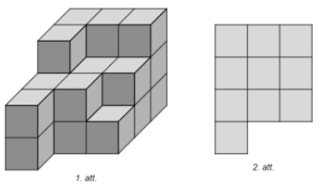
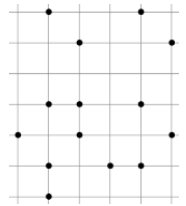
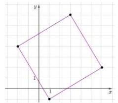
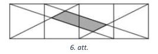

# <lo-sample/> LV.NOL.2021TEST.5.1

Mārtiņš uz papīra lapas uzrakstīja $10$ mazākos naturālos skaitļus, 
kas dalās ar $3$. Kāda ir uzrakstīto skaitļu summa?

<small>

* answer:165
* questionType:ShortAnswer
* domain:NT

</small>

## Atrisinājums

$$3 + 6 + 9 + 12 + 15 + 18 + 21 + 24 + 27 + 30 =$$
$$= (3 + 27) + (6 + 24) + (9 + 21) + (12 + 18) + +30 + 15 =$$ 
$$= 30 \cdot 4 + 15 = 165$$

# <lo-sample/> LV.NOL.2021TEST.5.2

Kāda ir divu mazāko pirmskaitļu summa?

<small>

* answer:5
* questionType:ShortAnswer
* domain:NT

</small>

## Atrisinājums

$2 + 3 = 5$

# <lo-sample/> LV.NOL.2021TEST.5.3

Uz galda atrodas vairākas kastes, kas sakārtotas rindā. Pirmajā kastē ir 
$1024$ konfektes, katrā nākamajā kastē ir divas reizes mazāk konfekšu 
nekā iepriekšējā kastē. Kāds lielākais skaits kastu var atrasties uz galda, 
ja katrā kastē ir vismaz $10$ konfektes?

<small>

* answer:7
* questionType:ShortAnswer
* domain:Alg

</small>

## Atrisinājums

Konfekšu skaits kastēs ir

$$1024; 512; 256; 128; 64; 32; 16,$$

ja būtu vēl viena kaste, tad tajā būtu $8$ konfektes, bet uzdevumā teikts, 
ka katrā kastē ir vismaz $10$.

# <lo-sample/> LV.NOL.2021TEST.5.4

Tirgus dienas rītā saimnieks vienādās kastēs rūpīgi sapakoja 
vistu olas. Braucot uz tirgu, nelaimīgi gadījās, ka puse no 
kastēm izkrita no mašīnas piekabes un olas saplīsa. Piekabē 
palika puse olu, kuru skaits bija $287$. Cik kastes olu saimnieks 
bija sapakojis no rīta, ja zināms, ka katrā kastē ir vismaz 
$2$ olas, bet nav vairāk kā $10$ olas, un visās kastēs ir 
vienāds olu skaits?

<small>

* answer:82
* questionType:ShortAnswer
* domain:NT

</small>

## Atrisinājums

Tā kā $287 = 7 \cdot 41$, tad varam secināt, ka vienā kastē ir 
$7$ olas un kopā piekabē palika $41$ kaste. Sākumā kastu bija 
divreiz vairāk, tātad sākumā bija $82$ kastes.

# <lo-sample/> LV.NOL.2021TEST.5.5

Figūra izveidota no simts 5-rūtiņu figūrām, kuras pakāpienveidā 
saliktas viena virs otras. Kāds ir šīs figūras perimetrs 
centimetros, ja rūtiņas malas garums ir $1$ cm? Piemēram, 
attēlā redzama figūra, kas sastāv no četrām 5-rūtiņu figūrām.

{ width=150px }

<small>

* answer:408
* questionType:ShortAnswer
* domain:Geom

</small>

## Atrisinājums

Var ievērot, ka, uzliekot jaunu 5-rūtiņu figūru, kopējais figūras 
perimetrs palielinās par $4~\mathrm{cm}$ (nāk klāt augšējās 5-rūtiņu figūras 
"treknā" līnija, kuras garums ir $8~\mathrm{cm}$, un nāk nost tās "raustītā" 
līnija, kuras garums ir $4~\mathrm{cm}$). Vienas 5-rūtiņu figūras perimetrs 
ir $12~\mathrm{cm}$, uzliekot virsū $99$ figūras, kopējais perimetrs būs

$$12 + 4 \cdot 99 = 408~\mathrm{cm}.$$

# <lo-sample/> LV.NOL.2021TEST.5.6

Divām kosmētikas salona darbiniecēm kopā ir septiņas klientes, 
un katra no tām vēlas, lai viņai veic manikīru. Četras klientes
vēlas arī sejas kopšanas procedūru. Katrai darbiniecei vajag $15$ 
minūtes, lai veiktu sejas kopšanas procedūru, un $5$ minūtes 
manikīram. Abas darbinieces var veikt gan manikīru, gan sejas 
procedūru, bet, apkalpojot kādu klienti, nevar iesākto procedūru
pārtraukt, lai to turpinātu otra darbiniece. Kāds ir īsākais laiks
(minūtēs), kurā viņas var apkalpot visas septiņas klientes? 

<small>

* answer:50
* questionType:ShortAnswer
* domain:Comb

</small>

## Atrisinājums

Lai pamatotu, ka $50$ minūtes ir īsākais laiks, mums jāparāda, 
ka $50$ minūtēs to var izdarīt, un jāpierāda, ka īsākā laikā to nevar.
Ja darbinieces klientes sadala gandrīz vienādi: 

* 1.darbiniece: $15+15+5+5+5+5$, 
* 2.darbiniece: $15+15+5+5+5$, 

tad redzams, ka ar $50$ minūtēm pietiek. 
Nākamais īsākais iespējamais laiks būtu $45$ min, bet redzams, ka ar to 
nepietiek, jo visu procedūru kopējais garums ir $95~\mathrm{min}$, 
kas ir vairāk nekā $2 \cdot 45~\mathrm{min}$.

# <lo-sample/> LV.NOL.2021TEST.5.7

Ciemata veikalā pudele piena maksā $55$ centus un maizes kukulis 
maksā $1.20$ eiro. Mārtiņš iztērēja $5.80$ eiro, nopērkot dažus 
maizes kukuļus un dažas pudeles piena. Cik maizes kukuļu 
nopirka Mārtiņš? 

<small>

* answer:3
* questionType:ShortAnswer
* domain:NT

</small>

## Atrisinājums

$$580=120 \cdot 3+55 \cdot 4$$

Atbildi var atrast, pārlasot variantus (pārbaudot, 
kurš no skaitliem: $580-120$, $580-2 \cdot 120$,
$580-3 \cdot 120$ utt. dalās ar $55$).

# <lo-sample/> LV.NOL.2021TEST.5.8

Cik krustpunktu ir trīs dotajām taisnēm (skat. att.)? 

{ width=150px }

<small>

* answer:3
* questionType:ShortAnswer
* domain:Geom

</small>

## Atrisinājums

Redzams, ka nekādas divas taisnes nav paralēlas, 
tātad tām ir visi $3$ krustpunkti.

*Atceries!* Taisne ir bezgalīga.

# <lo-sample/> LV.NOL.2021TEST.5.9

Robots kustas pa trijstūra ABC kontūru (skat. att.), kura katras 
malas garums ir $3~\mathrm{cm}$. Tas sāka kustību no virsotnes $A$ un $2021$
reizi apgāja trijstūra kontūru. Aprēkini robota veikto attālumu 
centimetros! 

{ width=100px }

<small>

* answer:18189
* questionType:ShortAnswer
* domain:Geom

</small>

## Atrisinājums

Trijstūra perimetrs ir $3 \cdot 3~\mathrm{cm}=9~\mathrm{cm}$, tātad 
robots nogāja $9 \cdot 2021=18189~\mathrm{cm}$. 

# <lo-sample/> LV.NOL.2021TEST.5.10

Cik skaitļi intervālā no $1$ līdz $200$ dalās ar $7$? 

<small>

* answer:28
* questionType:ShortAnswer
* domain:NT

</small>

## Atrisinājums

Skaitļi, kas dalās, ir $7$; $2 \cdot 7$; $3 \cdot 7$; $\ldots$; $28 \cdot 7=196$. 

# <lo-sample/> LV.NOL.2021TEST.5.11

Kāds atlikums rodas, ja $10003$ dala ar $4$?

<small>

* answer:3
* questionType:ShortAnswer
* domain:NT

</small>

## Atrisinājums

Var ievērot, ka $10000$ dalās ar $4$, tātad, 
$10003$ dalot ar $4$, atlikumā iegūs $3$.

# <lo-sample/> LV.NOL.2021TEST.5.12

Ilze uz galda no vairākiem vienādiem klucīšiem salika 
figūru (skat. 1.att.). No cik klucīšiem sastāv izveidotā 
figūra, ja zināms, ka no augšas tā izskatās, kā parādīts 2.att.?

{ width=200px }

<small>

* answer:23
* questionType:ShortAnswer
* domain:Geom

</small>

## Atrisinājums

Skaitīt var dažādi, piemēram šādi.
Pirmajā "stāvā" ir $10$ klucīši (kā 2. att.), otrajā "stāvā" 
ir $9$, trešajā "stāvā" ir $4$. Tātad kopējais klucīšu skaits ir
$10 + 9 + 4 = 23$.

# <lo-sample/> LV.NOL.2021TEST.5.13

Aprēķini un atbildi izsaki kilogramos!

$$25~\mathrm{t}~50~\mathrm{kg} + 13~\mathrm{t}~950~\mathrm{kg} – 
(24~\mathrm{t}~8~\mathrm{c}–18~\mathrm{t}~3~\mathrm{kg}).$$

<small>

* answer:32203
* questionType:ShortAnswer
* domain:Alg

</small>

## Atrisinājums

$25050~\mathrm{kg} + 13950~\mathrm{kg} – (24800~\mathrm{kg} – 18003~\mathrm{kg}) = 32203~\mathrm{kg}$.

# <lo-sample/> LV.NOL.2021TEST.5.14

Vai skaitlis $2021$ dalās ar $5$?

<small>

* answer:N
* questionType:ShortAnswer
* domain:NT

</small>

## Atrisinājums

Jo tā pēdējais cipars nav ne $0$, ne $5$.

*Atceries!* Skaitlis $a$ dalās ar skaitli $b$, 
ja, $a$ dalot ar $b$, atlikumā iegūst $0$.

# <lo-sample/> LV.NOL.2021TEST.5.15

Cik trijstūri redzami dotajā zīmējumā?

{ width=100px }

<small>

* answer:24
* questionType:ShortAnswer
* domain:Geom

</small>

## Atrisinājums

Mazākajā kvadrātā (atzīmēts ar raustīto līniju) redzami 
$8$ trijstūri (4 "mazie" un 4 "lielie"). 
Riņķī $A$ redzami $3$ trijstūri (divi "mazie" un viens "lielais"), 
tādi ir $4$ vietās. Ovālā $B$ redzams viens trijstūris,
tādi arī ir $4$ vietās. Līdz ar to kopējais trijstūru skaits ir

$$8 + 3 \cdot 4 + 4 = 24.$$

{ width=100px }

# <lo-sample/> LV.NOL.2021TEST.5.16

Flīzes raksts veidots no četriem pusriņķiem (skat.att. vienu flīzi). 
Kāds ir flīzes perimetrs centimetros, ja pusriņķa rādiuss ir $4~\mathrm{cm}$?

{ width=100px }

<small>

* answer:64
* questionType:ShortAnswer
* domain:Geom

</small>

## Atrisinājums

Flīzes malas garums sastāv no diviem pusriņku diametriem, tātad tas ir 
$4 \mathrm{~cm} \cdot 2 \cdot 2=16 \mathrm{~cm}$. Tātad tās perimetrs ir $16 \cdot 4=64 \mathrm{~cm}$.

# <lo-sample/> LV.NOL.2021TEST.5.17

Taisnstūra laukums ir $71 \mathrm{~cm}^{2}$ un tā malu garumi centimetros ir 
naturāli skaitļi. Kāds ir taisnstūra perimetrs centimetros? 

<small>

* answer:144
* questionType:ShortAnswer
* domain:Geom

</small>

## Atrisinājums

Tā kā $71$ ir pirmskaitlis, tad vienīgie iespējamie taisnstūra 
malu garumi ir $1~\mathrm{cm}$ un $71~\mathrm{cm}$ 
(lai to reizinājums būtu $71$). 

Tātad tā perimetrs ir $(1+71) \cdot 2=144~\mathrm{cm}$.

# <lo-sample/> LV.NOL.2021TEST.5.18

Kura no figūrām ir visvieglākā?

{ width=150px }

*Izvēlēties atbildi: (A) aplis, (B) trijstūris, (C) kvadrāts.*

<small>

* answer:C
* questionType:ShortAnswer
* domain:Alg

</small>

## Atrisinājums

Ievērosim, ka, ja no svaru kausa abām pusēm mēs noņemsim vienādus 
"komplektus", tad svari savu stāvokli nemainīs. 
No pirmo svaru abām pusēm varam noņemt riņķi un kvadrātu, smagākajā
(kreisajā) kausā mums paliks riņķis, vieglākajā (labajā) trijstūris. 
Tātad riņķis ir smagāks nekā trijstūris. 

Līdzīgi no otro svaru abām pusēm varam noņemt divus riņķus, 
divus trijstūrus un divus kvadrātus. Smagākajā (labajā) 
pusē paliks trijstūris, vieglākajā (kreisajā) kvadrāts. 
Tātad trijstūris ir smagāks nekā kvadrāts. 

Tā kā riņķis ir smagāks nekā trijstūris, kas savukārt ir smagāks nekā 
kvadrāts, tad secinām, ka kvadrāts ir visvieglākais.

# <lo-sample/> LV.NOL.2021TEST.5.19

Cik dažādos veidos pa zīmējumā attēlotajiem ceļiem var nokļūt no punkta $A$ 
uz punktu $B$? Pa ceļiem var pārvietoties tikai bultiņu norādītajā virzienā.

{ width=150px }

<small>

* answer:4
* questionType:ShortAnswer
* domain:Comb

</small>

## Atrisinājums

Iespējamie ceļi ir $ACDB$, $ACEB$, $AFEB$, $AFB$.

{ width=150px }

# <lo-sample/> LV.NOL.2021TEST.5.20

Visas grāmatas, ko var nopirkt, norēķinoties tikai ar 2 eiro monētām, 
atrodas taisnstūrī, bet visas grāmatas, ko var nopirkt, norēkinoties 
tikai ar $5$ eiro banknotēm, atrodas riņķī. Kurā plaknes daļā 
atrodas grāmata, kas maksā 7 eiro?

{ width=100px }

*Izvēlēties plaknes apgabalu: K, L, M vai N.* 

<small>

* answer:N
* questionType:ShortAnswer
* domain:Comb

</small>

## Atrisinājums

Tā kā $7$ eiro nevar samaksāt tikai ar $2$ eiro monētām, 
ne arī tikai ar $5$ eiro banknotēm, tad tas neatrodas 
ne taisnstūrī, ne riņķī.

# <lo-sample/> LV.NOL.2021TEST.5.21

Visi skaitļi, kas dalās ar $20$, atrodas taisnstūrī, bet visi skaitļa 
$20$ dalītāji atrodas aplī. Kurā plaknes dalā atrodas skaitlis $5$?

{ width=100px }

*Izvēlēties plaknes apgabalu: K, L, M vai N.* 

<small>

* answer:M
* questionType:ShortAnswer
* domain:Comb

</small>

## Atrisinājums

Skaitlis $5$ nedalās ar $20$, tātad tas neatrodas taisnstūrī. 
Bet $5$ ir skaitļa $20$ 
dalītājs, tātad tas atrodas aplī.

# <lo-sample/> LV.NOL.2021TEST.5.22

Telpā ir $3$ cilvēki. Cik dažādās secībās viņi var pamest šo telpu?

<small>

* answer:6
* questionType:ShortAnswer
* domain:Comb

</small>

## Atrisinājums

Apzīmēsim cilvēkus ar $A$, $B$ un $C$, 
tad ir iespējamas sešas dažādas secības: 
$ABC$, $ACB$, $BAC$, $BCA$, $CAB$, $CBA$.

# <lo-sample/> LV.NOL.2021TEST.6.1

Kāda ir pirmo $10$ pirmskaitļu summa? 

<small>

* answer:129
* questionType:ShortAnswer
* domain:NT

</small>

## Atrisinājums

$2+3+5+7+11+13+17+19+23+29=129$ 

# <lo-sample/> LV.NOL.2021TEST.6.2

Fasēšanas cehā ir novietotas vairākas kastes ar vitamīnu 
tabletēm. Pirmajā kastē ir 160 tūkstoši tablešu. Otrajā kastē ir par 
vienu piektdaļu mazāk tablešu nekā pirmajā kastē. Trešajā kastē 
ir par vienu piektdaļu mazāk nekā otrajā kastē, bet ceturtajā - 
par vienu piektdalu mazāk tablešu nekā trešajā kastē. Novērtē 
pirmās un ceturtās kastes tablešu skaita starpību! 

A. mazāk nekā $10000$ 
B. no $10000$ līdz $100000$
C. no $100000$ līdz $1000000$ 
D. vairāk nekā $1000000$ 

*Izvēlēties atbildi: A, B, C vai D.*

<small>

* answer:B
* questionType:ShortAnswer
* domain:Alg

</small>

## Atrisinājums

Tā kā katrā kastē ir par $\frac{1}{5}$ mazāk nekā iepriekšējā, 
tad katrā nākamajā kastē 
ir $\frac{4}{5}$ no iepriekšējās kastes tablešu skaita.

Tātad otrajā kastē ir $160000 \cdot \frac{4}{5} = 128000$ tablešu,   
trešajā kastē ir $128000 \cdot 4 = 102400$ tablešu, 
ceturtajā kastē ir $102400 \cdot 4 = 81920$ tablešu. 

Starpība tablešu skaitam 1. un 4. kastē ir $160000 − 81920 = 78080$. 

*Piezīme.*
Tā kā $\frac{4}{5} = \frac{8}{10}$, tad, 
lai skaitli reizinātu ar $4$, to var izdalīt ar $10$ un 
reizināt ar $8$. Piemēram,

$$160000 \cdot \frac{4}{5} = \frac{160000}{10} \cdot 8 = 16000 \cdot 8 = 128000.$$

# <lo-sample/> LV.NOL.2021TEST.6.3

Figūra izveidota no divdesmit piecām T-veida piecu rūtiņu 
figūrām, tās liekot rindā vienu aiz otras un katru otro T-veida 
figūru apgriežot otrādi. Kāds ir šīs figūras perimetrs centimetros, 
ja rūtinas malas garums ir 1 cm ? Piemēram, attēlā redzama 
figūra, kas sastāv no četrām šādi saliktām T-veida figūrām. 

{ width=150px }

<small>

* answer:156
* questionType:ShortAnswer
* domain:Geom

</small>

## Atrisinājums

Ievērosim, ka pie jau esošās figūras, pieliekot jaunu $T$ burtu, kopējais 
figūras perimetrs palielinās par 6 cm (nāk klāt malējā T burta "treknā 
līnija", kuras garums ir 9 cm , un nāk nost tā "raustītā" līnija, kuras garums 
ir $3~\mathrm{cm}$).
Viena $T$ burta perimetrs ir $12~\mathrm{cm}$, pieliekot klāt vēl $24$ 
citus $T$ burtus, kopējais perimetrs būs $12+24 \cdot 6=156~\mathrm{cm}$.

# <lo-sample/> LV.NOL.2021TEST.6.4

Aprēķini lauztās līnijas garumu centimetros, ja tai ir $6$ posmi, 
pirmā posma garums ir $5~\mathrm{cm}$, 
bet katra nākamā posma garums ir par $2~\mathrm{cm}$ 
garāks nekā iepriekšējais!

<small>

* answer:60
* questionType:ShortAnswer
* domain:Geom

</small>

## Atrisinājums

$5+7+9+11+13+15=60 \mathrm{~cm}$

# <lo-sample/> LV.NOL.2021TEST.6.5

Cik krustpunktu ir četrām dotajām taisnēm (skat. att.)?

{ width=150px }

<small>

* answer:6
* questionType:ShortAnswer
* domain:Geom

</small>

## Atrisinājums

Redzams, ka nekādas no $4$ taisnēm nav paralēlas, līdz ar to katra taisne 
krusto visas $3$ pārējās, tātad krustpunktu skaits ir $4 \cdot 3: 2=6$.

# <lo-sample/> LV.NOL.2021TEST.6.6

Ja skaitli $A$ kāpina trešajā pakāpē un pieskaita $2$, 
tad rezultātā iegūst skaitli $127$. Nosaki $A$ vērtību! 

<small>

* answer:5
* questionType:ShortAnswer
* domain:Alg

</small>

## Atrisinājums

$$5 \cdot 5 \cdot 5+2=127.$$ 

Atbildi var viegli atrast, 
ievērojot, ka $A$ trešajā pakāpē būs $127-2=125$, 
tātad skaitlis $A$ beigsies ar ciparu $5$.

# <lo-sample/> LV.NOL.2021TEST.6.7

Robots kustas pa trijstūra $ABC$ kontūru (skat.att.), 
kura visas malas ir vienāda garuma. Tas sāka kustību no 
virsotnes $A$ un $41$ reizi apgāja trijstūra kontūru, 
veicot $369~\mathrm{cm}$. Nosaki trijstūra malas garumu centimetros!

{ width=100px }

<small>

* answer:3
* questionType:ShortAnswer
* domain:Geom

</small>

## Atrisinājums

Robota noietais attālums ir $41$ reizi trijstūra perimetrs, 
tātad trijstūra $ABC$ 
perimetrs ir $369 \mathrm{~cm}: 41=9 \mathrm{~cm}$. 
Tātad trijstūra malas garums ir $9 \mathrm{~cm}: 3=3 \mathrm{~cm}$.

# <lo-sample/> LV.NOL.2021TEST.6.8

Divām kosmētikas salona darbiniecēm kopā ir septinas klientes, 
un katra no tām vēlas, lai viņai veic manikīru. Četras klientes vēlas 
arī sejas kopšanas procedūru. Katrai darbiniecei vajag $15$ minūtes, 
lai veiktu sejas kopšanas procedūru, un $5$ minūtes 
manikīram. Abas darbinieces var veikt gan manikīru, gan sejas 
procedūru, bet, apkalpojot kādu klienti, nevar iesākto procedūru 
pārtraukt, lai to turpinātu otra darbiniece. Kāds ir īsākais laiks 
minūtēs, kurā viņas var apkalpot visas septiņas klientes? 

<small>

* answer:50
* questionType:ShortAnswer
* domain:Comb

</small>

## Atrisinājums

Lai pamatotu, ka 50 minūtes ir īsākais laiks, mums jāparāda, ka 50 minūtēs 
to var izdarīt, un jāpierāda, ka īsākā laikā to nevar. 
Ja darbinieces klientes sadala gandrīz vienādi: 

* 1. darbiniece: $15+15+5+5+5+5$, 
* 2. darbiniece: $15+15+5+5+5$, 

tad redzams, ka ar 50 minūtēm pietiek. 
Nākamais īsākais iespējamais laiks būtu 45 min, bet redzams, ka ar to 
nepietiek, jo visu procedūru kopējais garums ir 95 min, kas ir vairāk nekā 
$2 \cdot 45$ min.

# <lo-sample/> LV.NOL.2021TEST.6.9

Cik skaitļu intervālā no $1$ līdz $600$ dalās ar $7$? 

<small>

* answer:85
* questionType:ShortAnswer
* domain:NT

</small>

## Atrisinājums

Dalās visi skaitļi $7$; $2 \cdot 7$; $3 \cdot 7$; $\ldots$; $84 \cdot 7$; $85 \cdot 7=595$.

# <lo-sample/> LV.NOL.2021TEST.6.10

Skolā $32$ skolēni piedalījās olimpiādē, bet $8$ skolēni nepiedalījās
olimpiādē. Cik procentu no skolas skolēniem nepiedalījās
olimpiādē? 

<small>

* answer:20
* questionType:ShortAnswer
* domain:Alg

</small>

## Atrisinājums

$\frac{8}{8+32}=\frac{1}{5}=20 \%$ 

# <lo-sample/> LV.NOL.2021TEST.6.11

Kurš no figūru komplektiem jānovieto uz svariem Nr.4., lai tie 
atrastos līdzsvarā?

{ width=150px }

*Izvēlēties variantu: A, B, C vai D.*

<small>

* answer:A
* questionType:ShortAnswer
* domain:Alg

</small>

## Atrisinājums

No svariem Nr.1 mēs varam secināt, 
ka riņķis sver tikpat, cik divi kvadrāti. 
Ja mēs uz svariem Nr.3 aizstāsim $3$ riņķus ar $6$ kvadrātiem, 
tad varēsim secināt, ka divi trijstūri sver tikpat, cik $6$ 
kvadrāti, jeb viens trijstūris sver 
tikpat, cik trīs kvadrāti. 
Tātad uz svariem Nr.4 labajā pusē esošo komplektu mēs varam aizstāt ar 
trijstūris + riņķis + kvadrāts = $3$ kvadrāti + $2$ kvadrāti + kvadrāts 
= $6$ kvadrāti = $3$ riņķi. 

*Piezīme.* Svari Nr.2 šajā spriedumā netika izmatoti, 
tie pēc būtības tikai atkārto to, kas dots ar svariem Nr.1.

# <lo-sample/> LV.NOL.2021TEST.6.12

Kāds atlikums rodas, ja $10035$ dala ar $6$? 

<small>

* answer:3
* questionType:ShortAnswer
* domain:NT

</small>

## Atrisinājums

Var ievērot, ka $10032$ dalās ar $6$ (tas ir pāra skaitlis un 
tā ciparu summa dalās ar $3$).

# <lo-sample/> LV.NOL.2021TEST.6.13

Baiba uz galda no vairākiem vienādiem klucīšiem salika figūru 
(skat. 1.att.). No cik klucīšiem sastāv izveidotā figūra, 
ja zināms, ka no augšas tā izskatās, kā parādīts 2.att.?

{ width=150px }

<small>

* answer:28
* questionType:ShortAnswer
* domain:Geom

</small>

## Atrisinājums

Skaitīt var dažādi, piemēram, šādi.
Pirmajā "stāvā" ir $13$ klucīši (kā 2. att.), otrajā "stāvā" ir $8$,
trešajā "stāvā" ir $4$, ceturtajā "stāvā" ir $3$. 
Kopā $13 + 8 + 4 + 3 = 28$ klucīši.

# <lo-sample/> LV.NOL.2021TEST.6.14

Aprēķini un atbildi izsaki minūtēs!

$$(2~\mathrm{h}~41~\mathrm{min} + 5~\mathrm{h}~59~\mathrm{min}) : 2 – 28~\mathrm{min}$$

<small>

* answer:232
* questionType:ShortAnswer
* domain:Alg

</small>

## Atrisinājums

$(161~\mathrm{min} + 359~\mathrm{min}) : 2 – 28~\mathrm{min} = 232~\mathrm{min}$.

# <lo-sample/> LV.NOL.2021TEST.6.15

Vai skaitlis $20212021$ dalās ar $5$?

*Izvēlēties atbildes variantu: Y (jā) vai N (nē).*

<small>

* answer:N
* questionType:ShortAnswer
* domain:NT

</small>

## Atrisinājums

Jo tas nebeidzas ne ar $0$, ne ar $5$.

# <lo-sample/> LV.NOL.2021TEST.6.16

Cik trijstūri redzami dotajā zīmējumā?

{ width=100px }

<small>

* answer:24
* questionType:ShortAnswer
* domain:Geom

</small>

## Atrisinājums

Mazākajā kvadrātā (atzīmēts ar raustīto līniju) redzami $8$ 
trijstūri (4 "mazie" un 4 "lielie"). Riņķī $A$ redzami $3$ 
trijstūri (divi "mazie" un viens "lielais"), tādi ir $4$ vietās. 
Ovālā $B$ redzams viens trijstūris, tādi arī ir $4$ vietās. 
Līdz ar to kopējais trijstūru skaits ir

$$8 + 3 \cdot 4 + 4 = 24.$$

{ width=100px }

# <lo-sample/> LV.NOL.2021TEST.6.17

Kāds ir taisnstūra perimetrs, ja riņķa līnijas rādiuss ir $4~\mathrm{cm}$?

{ width=120px }

<small>

* answer:112
* questionType:ShortAnswer
* domain:Geom

</small>

## Atrisinājums

Riņka līnijas diametrs ir $2 \cdot 4 \mathrm{~cm}=8 \mathrm{~cm}$. 
Taisnstūra platums ir vienāds ar rinķa līnijas diametru ($8 \mathrm{~cm}$), 
bet garums vienāds ar sešiem rinka līnijas diametriem 
$(6 \cdot 8 \mathrm{~cm}=48 \mathrm{~cm})$. Tātad tā perimetrs ir 
$(8+48) \cdot 2=112 \mathrm{~cm}$.

# <lo-sample/> LV.NOL.2021TEST.6.18

Varde vienā lēcienā var pārvietoties vienu rūtinu uz augšu vai vienu 
rūtiņu pa labi. Cik dažādos veidos varde no rūtiņas $A$ var nokļūt rūtiņā $B$ 
(skat. att.)? Iekrāsotajās rūtiņās ir šḳērslis, tajās varde neiet.

{ width=100px }

<small>

* answer:7
* questionType:ShortAnswer
* domain:Comb

</small>

## Atrisinājums

Atradīsim rezultātu pakāpeniski, atrodot, cik veidos varde var noklūt 
katrā rūtiņā. Katrā rūtiņā varde var nonākt vai nu no apakšas, 
vai no kreisās puses. Ja rūtiņā, kas atrodas zem aplūkojamās, varde 
var nonākt $m$ veidos, bet rūtiņā, kas ir pa kreisi no aplūkojamās, 
tā var nonākt $n$ veidos, tad aplūkojamajā rūtinā tā var nonākt $m+n$ 
veidos ($m$ veidos caur apakšējo rūtinu un $n$ veidos caur rūtiņu pa kreisi). 
Ierakstīsim katrā rūtiņā, cik veidos varde tajā var nonākt, 
sākot no kreisā apakšējā stūra. Katrā rūtinā mums jāraksta summa skaitļiem, 
kas atrodas zem un pa kreisi no aplūkojamās rūtiņas.

{ width=150px }

# <lo-sample/> LV.NOL.2021TEST.6.19

Kāds cipars jāievieto $y$ vietā, lai skaitlis $\overline{5783y1y0}$ 
dalītos ar $90$?

<small>

* answer:6
* questionType:ShortAnswer
* domain:NT

</small>

## Atrisinājums

Lai skaitlis dalītos ar $90$, tam jādalās ar $9$ un ar $10$. Ar $10$ dotais skaitlis noteikti dalās 
(jo tā pēdējais cipars ir $0$), ar $9$ tas dalīsies, ja tā ciparu summa dalīsies ar $9$. 
Tātad $5+7+8+3+y+1+y+0$ jādalās ar $9$ jeb $24+2 \cdot y$ jādalās ar $9$. 
Redzams, ka vienīgais, kas der, ir $y=6$. 

# <lo-sample/> LV.NOL.2021TEST.6.20

Maruta nokrāsoja $\frac{1}{3}$ no kubveida kastes virsmas laukuma 
dzeltenā krāsā. Cik kvadrātcentimetri no kastes virsmas laukuma palika 
nenokrāsoti, ja kastes škautnes garums ir $7~\mathrm{cm}$?

<small>

* answer:196
* questionType:ShortAnswer
* domain:Geom

</small>

## Atrisinājums

Kuba vienas skaldnes laukums ir $7 \cdot 7=49 \mathrm{~cm}^{2}$, 
tā kopējais virsmas laukums ir $49 \cdot 6=294 \mathrm{~cm}^{2}$. 
Maruta nenokrāsoja $\frac{2}{3}$ no tā, tas ir,

$$294 \cdot \frac{2}{3}=196 \mathrm{~cm}^{2}$$

# <lo-sample/> LV.NOL.2021TEST.6.21

Cik dažādās secībās $3$ skolēni var nostāties rindā pie kases?

<small>

* answer:6
* questionType:ShortAnswer
* domain:Comb

</small>

## Atrisinājums

Apzīmēsim skolēnus ar $A,B,C$, tad šīs secības ir 
$ABC$, $ACB$, $BAC$, $BCA$, $CAB$, $CBA$.

# <lo-sample/> LV.NOL.2021TEST.6.22

Visas grāmatas, ko var nopirkt, norēkinoties tikai ar $2$ eiro monētām, 
atrodas taisnstūrī, bet visas grāmatas, ko var nopirkt, norēķinoties 
tikai ar $5$ eiro banknotēm, atrodas riņķī. Kurā plaknes daļā atrodas 
grāmata, kas maksā $17$ eiro?

{ width=100px }

*Izvēlēties plaknes apgabalu: K,L,M vai N.*

<small>

* answer:N
* questionType:ShortAnswer
* domain:Comb

</small>

## Atrisinājums

Tā kā $17$ eiro nevar samaksāt tikai ar $2$ eiro monētām, ne arī 
tikai ar $5$ eiro banknotēm, tad grāmata neatrodas ne taisnstūrī, ne riņķī.

# <lo-sample/> LV.NOL.2021TEST.6.23

Visi skaitļi, kas dalās ar 10, atrodas taisnstūrī, bet visi skaitļa 10 dalītāji 
atrodas aplī. Kurā plaknes daļā atrodas skaitlis $10$?

{ width=100px }

*Izvēlēties plaknes apgabalu: K,L,M vai N.*

<small>

* answer:L
* questionType:ShortAnswer
* domain:Comb

</small>

## Atrisinājums

Tā kā skaitlis $10$ dalās ar $10$ un ir arī $10$ dalītājs, tad tas atrodas gan taisnstūrī, gan aplī.

# <lo-sample/> LV.NOL.2021TEST.7.1

Cik dažādos veidos $5$ skolēni var nostāties rindā?

<small>

* answer:120
* questionType:ShortAnswer
* domain:Comb

</small>

## Atrisinājums

Pirmo skolēnu var izvēlēties $5$ veidos, otro – $4$ veidos, 
trešo – $3$ veidos, ceturto – $2$ veidos. (Savukārt piektais ir nosakāms
viennozīmīgi, ja pirmie četri jau ir nostādīti.)
Tātad kopā ir $5 \cdot 4 \cdot 3 \cdot 2 = 120$ veidi.

# <lo-sample/> LV.NOL.2021TEST.7.2

Pa apli uzrakstīti skaitļi $1, 2, 3, 4, 5, 6, 7, 8$ 
(tieši šādā secībā). Jebkurus divus skaitļus, kas neatrodas blakus, 
drīkst mainīt vietām. Kāds mazākais maiņu skaits ir vajadzīgs, 
lai skaitļi pa apli būtu uzrakstīti pretējā secībā?

<small>

* answer:3
* questionType:ShortAnswer
* domain:Comb

</small>

## Atrisinājums

Jāsamaina $2$ ar $8$, $3$ ar $7$, $4$ ar $6$.

# <lo-sample/> LV.NOL.2021TEST.7.3

Zīmējumā (skat. zemāk) bija uzzīmēti vairāki kvadrāti, bet 
Jevgēnijs izdzēsa kvadrātu malas tā, ka palika redzamas 
tikai visas kvadrātu virsotnes. Cik kvadrāti ar dotajām 
virsotnēm bija attēloti sākotnējā zīmējumā?

{ width=100px }

<small>

* answer:5
* questionType:ShortAnswer
* domain:Geom

</small>

## Atrisinājums

{ width=100px }

# <lo-sample/> LV.NOL.2021TEST.7.4

Taisne iet caur punktiem $(-3; 2)$ un $(6; 5)$. 
Kurš punkts atrodas uz šīs taisnes?

$$A(1;3.5) \quad B(8;6) \quad C(-12;-1) \quad D(-5;1)$$

*Izvēlēties punktu: A, B, C vai D.*

<small>

* answer:C
* questionType:ShortAnswer
* domain:Comb

</small>

## Atrisinājums

Ja $x$ pieaug par $9$ vienībām (no $-3$ līdz $6$), 
tad $y$ pieaug par $3$ vienībām (no $2$ līdz $5$). 
Kamēr $x$ pieaug no $x=-3$ līdz $x=0$, 
$y$ būs pieaudzis tikai par $1$ vienību: no $y=2$ līdz $y=3$. 

Tāpēc punkti uz taisnes apmierina sakarību 
$y = \frac{1}{3}x + 3.$ (Šis vienādojums atspoguļo faktu, 
ka ātrums pa $y$ ir tikai trešdaļa no ātruma pa $x$; un arī 
to, ka pie $x=0$ tiek sasniegta vērtība $y=3$.)

Vienīgais punkts, kuru var ievietot šajā sakarībā ir $C(-12;-1)$. 
Jo $y = \frac{1}{3}(-12) + 3 = -4+3 = -1$.

*Piezīme.* Var arī uzzīmēt taisni uz rūtiņu papīra 
un no grafika nolasīt prasīto.

# <lo-sample/> LV.NOL.2021TEST.7.5

Kvadrāta trīs virsotņu koordinātas ir 
$(3; 7)$, $(6; 2)$, $(-2; 4)$. 
Nosaki ceturtās virsotnes koordinātu summu!

<small>

* answer:0
* questionType:ShortAnswer
* domain:Geom

</small>

## Atrisinājums

Ceturtās virsotnes koordinātas ir $(1; −1)$. 
Tātad koordinātu summa ir $1 − 1 = 0$.

{ width=100px }

# <lo-sample/> LV.NOL.2021TEST.7.6

Vienādmalu trijstūri ar malas garumu $7$ sagrieza mazākos 
vienādmalu trijstūrīšos, kuru malas garums ir $1$. 
Cik mazos trijstūrīšus ieguva?

<small>

* answer:49
* questionType:ShortAnswer
* domain:Geom

</small>

## Atrisinājums

Ievērojam, ka katrā nākamajā slānī ir par $2$ trijstūrīšiem 
vairāk nekā iepriekšējā slānī, tātad pavisam ir 
$1+3+5+7+9+11+13=49$ trijstūrīši.

{ width=150px }

# <lo-sample/> LV.NOL.2021TEST.7.7

Ja Dace nopirks $11$ klades, viņai vēl paliks $50$ centi. 
Savukārt, ja viņa pirktu $15$ klades, tad $70$ centu 
viņai pietrūktu. Cik centu ir Dacei?

<small>

* answer:380
* questionType:ShortAnswer
* domain:Alg

</small>

## Atrisinājums

Pieņemsim, ka 11 klades Dace jau ir nopirkusi. Tad viņai ir 
atlikuši $50$ centi. Iedosim viņai vēl $70$ centus, 
tagad viņa var nopirkt vēl tieši $4$ klades. Tātad $4$ 
klades maksā $120$ centus, tātad viena klade maksā $30$ centus.

Tātad $11$ klades maksā $11 \cdot 30 = 330$ centus un 
Dacei ir $330 + 50 = 380$ centu.

# <lo-sample/> LV.NOL.2021TEST.7.8

Ingrīda rūtinu plaknē zīmēja figūras - sākumā uzzīmēja krustu, katrai nākamai 
figūrai pievienoja stūrīti, kas sastāv no $3$ rūtiņām (skat. 1. att., 
kur redzamas pirmās trīs figūras). No cik divu posmu leņķīšiem 
(skat. 2. att.) var salikt Ingrīdas uzzīmētās figūras, kas sastāv no $35$ rūtiņām, kontūru?

{ width=200px }

<small>

* answer:26
* questionType:ShortAnswer
* domain:Geom

</small>

## Atrisinājums

Katru nākamo figūru var iegūt, iepriekšējai figūrai nonemot nost vienu 
leņķīti un pieliekot klāt trīs citus, tātad katrai nākamajai figūrai vajag par $2$ 
leņķīšiem vairāk.

Figūru, kas sastāv no 35 rūtinām, var iegūt krustam ($5$ rūtiņas) pievienojot 
$10$ stūrīšus (vēl $30$ rūtiņas). Tā kā krusta kontūru var salikt 
no $6$ leņķīšiem, tad tai būs vajadzīgi $6+10 \cdot 2=26$ leņķīši.

# <lo-sample/> LV.NOL.2021TEST.7.9

Cik krustpunktu ir trīs dotajām taisnēm un staram (skat.att.)

{ width=150px }

<small>

* answer:4
* questionType:ShortAnswer
* domain:Geom

</small>

## Atrisinājums

Trijām taisnēm kopā ir $3$ krustpunkti, stars krusto tikai vienu no tām.

# <lo-sample/> LV.NOL.2021TEST.7.10

Guna skaitli $123456789111111111198765432$ kāpināja trešajā 
pakāpē un pēc tam iegūtajam rezultātam pieskaitīja $2$. 
Kāds ir galarezultāta pēdējais cipars?

<small>

* answer:0
* questionType:ShortAnswer
* domain:NT

</small>

## Atrisinājums

Tā kā reizinājuma pēdējais cipars ir atkarīgs tikai no reizinātāju 
pēdējiem cipariem, tad Gunas skaitli, izkāpinot kubā, tā 
pēdējais cipars būs $2 \cdot 2 \cdot 2 = 8$. 
Pieskaitot tam divi, pēdējais cipars būs $0$.

# <lo-sample/> LV.NOL.2021TEST.7.11

Robots kustas pa trijstūra ABC kontūru (skat. att.). Tas sāka kustību 
no virsotnes $A$ un nogāja $2021~\mathrm{cm}$. 
Uz kuras trijstūra malas robots apstājās, ja katras trijstūra 
malas garums ir $4~\mathrm{cm}$? 

{ width=100px }

*Izvēlēties trijstūra malu: AB, AC vai BC.*

<small>

* answer:BC
* questionType:ShortAnswer
* domain:Geom

</small>

## Atrisinājums

Trijstūra perimetrs ir $4 \cdot 3=12 \mathrm{~cm}$. Ievērosim, ka skaitlis 
$2016$ dalās ar $12$ (jo tas dalās gan ar $4$, gan ar $3$). Tātad tad, kad 
robots būs nogājis $2016~\mathrm{cm}$, tas būs atgriezies punktā $A$. 
Tam jānoiet vēl tikai $5~\mathrm{cm}$ , pēc kuriem tas atradīsies 
uz malas $BC$ ($1~\mathrm{cm}$ no punkta $B$ un $3~\mathrm{cm}$ no punkta $C$).

# <lo-sample/> LV.NOL.2021TEST.7.12

Skolā $16$ skolēni piedalījās olimpiādē, bet $64$ skolēni nepiedalījās 
olimpiādē. Cik procentu no skolas skolēniem piedalījās olimpiādē? 

<small>

* answer:20
* questionType:ShortAnswer
* domain:Alg

</small>

## Atrisinājums

$\frac{16}{64+16}=\frac{16}{80}=\frac{1}{5}=20 \%$.

# <lo-sample/> LV.NOL.2021TEST.7.13

Kāda ir riņka un kvadrāta masa, ja trijstūra masa ir $5$ kg? 

{ width=150px }

*Ierakstīt divus skaitļus: riņķa un kvadrāta masu, atdalot tos ar semikolu(;).*
*Veselus skaitļus rakstīt bez cipariem aiz komata; daļskaitļus noapaļot līdz tuvākajai desmitdaļai.*

<small>

* answer:1;2
* questionType:ShortAnswer
* domain:Alg

</small>

## Atrisinājums

Pieliksim pirmajiem svariem abās pusēs vēl pa vienam kvadrātam (tad tie 
joprojām būs līdzsvarā). No tā secināsim, ka $2$ trijstūri un $2$ kvadrāti sver 
tikpat, cik $4$ riņḳi un $5$ kvadrāti. 
Uzliksim otrajiem svariem abās pusēs vēl tieši tik, cik tur jau ir (kreisajā 
pusē $7$ riņķus, labajā trijstūri un kvadrātu), tad tie joprojām būs līdzsvarā. 
Tātad $2$ trijstūri un $2$ kvadrāti sver tikpat, cik $14$ riņki. 
Salīdzinot iegūtos rezultātus, varam secināt, ka $4$ rinki, un $5$ kvadrāti sver 
tikpat, cik $14$ riņki. Tātad $5$ kvadrāti sver tikpat, cik $10$ riņki, jeb $1$ kvadrāts 
sver tikpat, cik $2$ riņķi. 

Atgriezīsimies pie pirmajiem svariem, nonemsim no abām pusēm nost 
vienu kvadrātu un aizstāsim $4$ rinkus ar $2$ kvadrātiem (svari joprojām būs 
līdzsvarā). legūsim, ka divi trijstūri sver tikpat, cik $5$ kvadrāti. 
Divi trijstūri sver $10~\mathrm{kg}$, tātad $5$ kvadrāti arī sver 
$10~\mathrm{kg}$, 
un viens kvadrāts sver $2~\mathrm{kg}$, bet riņkis sver $1~\mathrm{kg}$.

# <lo-sample/> LV.NOL.2021TEST.7.14

Kāds atlikums rodas, ja $2021$ dala ar $4$? 

<small>

* answer:1
* questionType:ShortAnswer
* domain:NT

</small>

## Atrisinājums

$2020$ dalās ar $4$.

# <lo-sample/> LV.NOL.2021TEST.7.15

Sākotnēji klucǐši bija sakārtoti kubā ar malas garumu $4$ klucīši, taču 
kāds dažus klucǐšus aiznesa prom. Cik klucǐši tika aiznesti prom, ja 
tagadējais klucǐšu izkārtojums redzams attēlā? 

{ width=120px }

<small>

* answer:36
* questionType:ShortAnswer
* domain:Geom

</small>

## Atrisinājums

Skaitīt var dažādi. No pirmā "stāva" ir aiznesti $3$ klucīši, 
no otrā "stāva" - $8$, no trešā - $12$, no ceturtā -- $13$, kopā ir 
aiznesti $3+8+12+13=36$ klucīši.

# <lo-sample/> LV.NOL.2021TEST.7.16

Kāds skaitlis jāieraksta $x$ vietā, lai vienādība 

$$\frac{1}{2}+\frac{1}{3}+\frac{1}{4}+\frac{5}{6}+\frac{1}{x}=2$$

būtu patiesa? 

<small>

* answer:12
* questionType:ShortAnswer
* domain:Alg

</small>

## Atrisinājums

$\frac{1}{x}=2-\frac{1}{2}-\frac{1}{3}-\frac{1}{4}-\frac{5}{6}=\frac{24-6-4-3-10}{12}=\frac{1}{12}$ 

# <lo-sample/> LV.NOL.2021TEST.7.17

Kāds cipars jāieraksta $m$ vietā, lai skaitlis $\overline{12345689m8}$ 
dalītos ar $36$? 

<small>

* answer:8
* questionType:ShortAnswer
* domain:NT

</small>

## Atrisinājums

Lai skaitlis dalītos ar $36$, tam jādalās ar $9$ un ar $4$. 
Lai tas dalītos ar $9$, tā 
ciparu summai jādalās ar $9$. 
Tātad $1+2+3+4+5+6+8+9+m+8$ dalās ar $9$ jeb $46+m$ dalās ar $9$. 
Tātad vienīgā iespējamā $m$ vērtība ir $8$. 
Tā kā skaitlis tagad beidzas ar $88$, tad tas noteikti dalās arī ar $4$.

# <lo-sample/> LV.NOL.2021TEST.7.18

Varde vienā lēcienā var pārvietoties vienu rūtiņu uz augšu, 
vienu rūtiņu pa labi vai arī vienu rūtiņu pa diagonāli 
(skat. attēlu pa kreisi). Cik dažādos veidos varde no 
rūtiņas "?" var noklūt rūtinā “!" (skat. att.)? 
Iekrāsotajās rūtiņās ir škēēslis, tajās varde neiet.

{ width=150px }

<small>

* answer:34
* questionType:ShortAnswer
* domain:Comb

</small>

## Atrisinājums

Katrā rūtinā varde var nonākt vai nu no kreisās puses, 
vai no apakšas, vai pa diagonāli no kreisās apakšējās puses. 
Pieņemsim, ka rūtinā pa kreisi varde var nonākt $k$ veidos, 
apakšējā rūtinā $-m$ veidos, bet rūtinā pa diagonāli kreisajā 
pusē apakšā - $n$ veidos. Tad aplūkojamajā rūtiņā varde var nonākt 
$k+m+n$ veidos. Līdz ar to, varam pakāpeniski aprēḳināt,
cik veidos varde var nonākt katrā rūtinā, sākot no jautājuma zīmes 
(kur tā var nonākt vienā veidā, jo tā jau tur ir).

{ width=150px }

# <lo-sample/> LV.NOL.2021TEST.7.19

Visas grāmatas, ko var nopirkt, norēķinoties tikai ar $2$ eiro monētām, 
atrodas taisnstūrī, bet visas grāmatas, ko var nopirkt, norēkinoties 
tikai ar $5$ eiro banknotēm, atrodas riņķī. Kurā plaknes dalā atrodas 
grāmata, kas maksā $27$ eiro?

{ width=100px }

*Izvēlēties plaknes apgabalu: K, L, M vai N.*

<small>

* answer:N
* questionType:ShortAnswer
* domain:Comb

</small>

## Atrisinājums

Tā kā $27$ eiro nevar samaksāt tikai ar $2$ eiro monētām, 
ne arī tikai ar $2$ eiro banknotēm, tad šī grāmata 
neatrodas ne taisnstūrī, ne riņķī.

# <lo-sample/> LV.NOL.2021TEST.7.20

Visi skaitli, kas dalās ar $15$ atrodas taisnstūrī, bet visi skaitļa 
$15$ dalītāji atrodas aplī. Kurā plaknes dalā atrodas skaitlis $45$?

{ width=100px }

*Izvēlēties plaknes apgabalu: K, L, M vai N.*

<small>

* answer:K
* questionType:ShortAnswer
* domain:Comb

</small>

## Atrisinājums

Tā kā $45$ dalās ar $15$, bet nav skaitļa $15$ dalītājs, tad tas atrodas 
taisnstūrī, bet neatrodas aplī.

# <lo-sample/> LV.NOL.2021TEST.7.21

Kāds ir nogriežņa $AB$ garums centimetros, ja punkti $A$ un $B$ atrodas rinķa 
līniju centros un taisnstūra $LMNO$ perimetrs ir $112~\mathrm{cm}$?

{ width=180px }

<small>

* answer:24
* questionType:ShortAnswer
* domain:Geom

</small>

## Atrisinājums

Ja riņķa līnijas diametrs ir $D$, tad taisnstūra platums ir $D$, 
garums ir $6D$ un perimetrs ir $(D + 6D) \cdot 2 = 14D$.
Tātad riņķa līnijas diametrs $D=112∶14=8~\mathrm{cm}$.
Attālums starp $A$ un $B$ ir $R+D+D+R=3D=24~\mathrm{cm}$, kur $R$ ir riņķa līnijas rādiuss.

# <lo-sample/> LV.NOL.2021TEST.7.22

Kādai jābūt punkta abscisai, lai punkts, kura ordināta ir $4$, 
atrastos uz funkcijas $y = 3x − 71$ grafika?

<small>

* answer:25
* questionType:ShortAnswer
* domain:Alg

</small>

## Atrisinājumss

Ievietojot $y=4$, iegūstam $3x=75$ jeb $x=25$.

# <lo-sample/> LV.NOL.2021TEST.7.23

Lineārās funkcijas $y=ax+b$ grafiks ir paralēls funkcijas 
$y=71x+2021$ grafikam un iet caur punktu $A(2;200)$. Nosaki $b$ vērtību!

<small>

* answer:58
* questionType:ShortAnswer
* domain:Alg

</small>

## Atrisinājums

Grafiki ir paralēli, ja to virziena koeficienti sakrīt, 
tātad $a=71$. levietojot $y=200$ un $x=2$ iegūstam, 
ka $200=71 \cdot 2+b$, no kurienes $b=58$.

# <lo-sample/> LV.NOL.2021TEST.8.1

Kāda ir pirmo $10$ pirmskaitļu summa?

<small>

* answer:129
* questionType:ShortAnswer
* domain:

</small>

## Atrisinājums

$$2 + 3 + 5 + 7 + 11 + 13 + 17 + 18 + 23 + 29 = 129.$$

# <lo-sample/> LV.NOL.2021TEST.8.2

Septiņi kasieri sēž ap apaļu galdu un gatavojas skaitīt naudu. 
Galvenajam kasierim Mārim ir $128$ pakas ar naudu, bet pārējiem 
nav nevienas pakas ar naudu. Pusi no savām pakām Māris atdod 
abiem saviem blakus sēdētājiem, sadalot to vienādās daļās. 
Kad katrs kasieris pārskaita (pirmā naudas skaitīšana) 
viņam piederošo naudu, tad katrs kasieris (arī Māris) 
pusi no savām naudas pakām vienādās daļās atdod abiem saviem 
blakus sēdētājiem. Un tā viņi turpina darbu. Cik naudas pakas 
bija Mārim trešajā naudas skaitīšanas reizē?

<small>

* answer:40
* questionType:ShortAnswer
* domain:

</small>

## Atrisinājums

Pieņemsim, ka Māris sēž vidū un virknes gali ir "savienoti riņķī". 
Paku skaits pēc pirmās pārdales (pirmā skaitīšana):

$$0, 0, 32, \mathbf{64}, 32, 0, 0$$ 

Paku skaits pēc otrās pārdales (otrā skaitīšana): 

$$0, 8, 32, \mathbf{48}, 32, 8, 0$.

Paku skaits pēc trešās pārdales (trešā skaitīšana): 

$$2, 12, 30, \mathbf{40}, 30, 12, 2.$$

# <lo-sample/> LV.NOL.2021TEST.8.3

Cik dažādos veidos $6$ skolēni var nostāties rindā?

<small>

* answer:720
* questionType:ShortAnswer
* domain:

</small>

## Atrisinājums

Pirmo skolēnu var izvēlēties $6$ veidos, otro – $5$, trešo – $4$, 
ceturto – $3$, piekto – $2$. Tātad kopējais veidu skaits ir 
$6 \cdot 5 \cdot 4 \cdot 3 \cdot 2 = 720$.

# <lo-sample/> LV.NOL.2021TEST.8.4

Pa apli uzrakstīti skaitļi $1, 2, 3, 4, 5, 6, 7, 8$ 
(tieši šādā secībā pulksteņa rādītāja kustības virzienā). Jebkurus divus skaitļus, kas neatrodas blakus, drīkst mainīt vietām. Kāds mazākais maiņu skaits ir vajadzīgs, lai skaitļi aplī būtu pierakstīti šādā secībā 
$1, 4, 3, 6, 5, 8, 7, 2$, skatoties pulksteņa rādītāja kustības virzienā?

<small>

* answer:3
* questionType:ShortAnswer
* domain:

</small>

## Atrisinājums

Var ievērot, ka skaitļi $1, 3, 5, 7$ atrodas savās vietās, 
jāsamaina tikai pāra cipari. To var izdarīt ar 3 maiņām

$$2\ ar\ 4, \quad 2\ ar\ 6, \quad 2\ ar\ 8.$$

# <lo-sample/> LV.NOL.2021TEST.8.5

Zīmējumā uz rūtiņu lapas (skat. zemāk) bija attēloti vairāki kvadrāti, 
bet laika gaitā kvadrātu malas izdzisa un palika redzamas 
tikai visas kvadrātu virsotnes. Cik kvadrāti ar dotajām virsotnēm bija attēloti sākotnējā zīmējumā?

{ width=100px }

<small>

* answer:5
* questionType:ShortAnswer
* domain:

</small>

## Atrisinājums

{ width=100px }

# <lo-sample/> LV.NOL.2021TEST.8.6

Taisne iet caur punktiem $(3;2)$ un $(-6;5)$. Kurš punkts atrodas uz 
šīs taisnes? 

$$A(-1;3.5) \quad B $(-8;6) \quad C(12;-1) \quad D(5;1).$$ 

<small>

* answer:C
* questionType:ShortAnswer
* domain:

</small>

## Atrisinājums

Pieņemsim, ka taisnes vienādojums ir $y=k x+b$. Ievietojot dotos 
punktus iegūstam, ka $2=-3 k+b$ un $5=6 k+b$. Izsakām nezināmo $b$ 
$b=2+3 k$ un $b=5-6 k$. 
Tātad $2+3 k=5-6 k$. Līdz ar to $k=\frac{1}{3}$ un $b=3$. 
Pārbaudot atbilžu variantus, redzam, ka $-1=-12 \cdot \frac{1}{3}+3$. 

*Piezīme.* Var arī atrisināt grafiski. 

# <lo-sample/> LV.NOL.2021TEST.8.7

Vienādmalu trijstūri ar malas garumu $15$ sagrieza mazākos 
vienādmalu trijstūrīšos, kuru malas garums ir $1$. Cik mazos
trijstūrīšus ieguva? 

<small>

* answer:225
* questionType:ShortAnswer
* domain:

</small>

## Atrisinājums

Ievērojam, ka katrā nākamajā slānī ir par $2$ trijstūrīšiem vairāk nekā 
iepriekšējā slānī (attēlā doti pirmie 7 slāņi), 
tātad mazo trijstūrīšu skaits ir 
sssssss$1+3+5++7+9+11+13+15+17+19+21+23+25+27+29=$ 
$=(1+29)+(3+27)+(5+25)+(7+23)+(9+21)+(11+19)+$ 
$+(13+17)+15=30 \cdot 7+15=225$ 

{ width=150px }

# <lo-sample/> LV.NOL.2021TEST.8.8

Cik trijstūrus ar laukumu $10 \mathrm{~cm}^{2}$ var uzzīmēt tā, lai to 
virsotnes atrastos atzīmētajos punktos (skat. att.)? Rūtiņas 
malas garums ir $1~\mathrm{cm}$. 

{ width=150px }

<small>

* answer:24
* questionType:ShortAnswer
* domain:

</small>

## Atrisinājums

Var ievērot, ka visa taisnstūra laukums ir $20 \mathrm{~cm}^{2}$, 
tātad trijstūrim jāaizņem tieši puse no taisnstūra laukuma. 
Der $11$ trijstūri ar virsotnēm punktos $B$ un $D$ un trešo virsotni 
uz augšējās malas, 11 trijstūri ar virsotnēm punktos $A$ un $C$ un 
trešo virsotni uz apakšējās malas, kā arī trijstūri $AFB$ un $CED$

{ width=150px }

# <lo-sample/> LV.NOL.2021TEST.8.9

Ja Inese nopirks $11$ klades, viņai vēl paliks $50$ centi. 
Savukārt, ja viņa pirktu $15$ klades, tad $70$ centu viņai pietrūktu. 
Cik centu ir Inese?

<small>

* answer:380
* questionType:ShortAnswer
* domain:

</small>

## Atrisinājums

Pieņemsim, ka $11$ klades Inese jau ir nopirkusi. Tad viņai 
ir atlikuši $50$ centi. Iedosim viņai vēl $70$ centus, tagad 
viņa var nopirkt vēl tieši $4$ klades. Tātad $4$ klades maksā 
$120$ centus, tātad viena klade maksā $30$ centus.
Tātad $11$ klades maksā $11 \cdot 30 = 330$ 
centus un Inesei ir $330 + 50 = 380$ centu.

# <lo-sample/> LV.NOL.2021TEST.8.10

Ingrīda rūtiņu plaknē zīmēja figūras – sākumā uzzīmēja 
krustu, katrai nākamai figūrai pievienoja stūrīti, kas 
sastāv no 3 rūtiņām (skat. 1. att., kur redzamas pirmās 
trīs figūras). No cik trīs posmu stieplītēm 
(skat. 2. att.) var salikt Ingrīdas uzzīmētās figūras kontūru, 
kas sastāv no 50 rūtiņām?

<small>

* answer:24
* questionType:ShortAnswer
* domain:

</small>

## Atrisinājums

Pieņemsim, ka rūtiņas malas garums ir 1. Katras nākamās figūras perimetrs ir par 4 lielāks nekā iepriekšējās (no pieliktā trijstūrīša nāk klāt 6 redzamās rūtiņu malas un nāk nost 2 neredzamās). Figūru, kas sastāv no 50 rūtiņām, var iegūt krustam (5 rūtiņas), pieliekot trijstūrīti (3 rūtiņas) 15 reizes. Sākumā krusta perimetrs ir 12, tātad šīs figūras perimetrs būs

$$12 + 15 \cdot 4 = 72.$$

Katra trīs posmu stieplīte noklāj $3$ rūtiņu malas, tāpēc vajadzīgas
$72 ∶ 3 = 24$ stieplītes.

# <lo-sample/> LV.NOL.2021TEST.8.11

Ilze skaitli $123456787777777777777765412$ kāpināja kubā un pēc tam 
iegūtajam rezultātam pieskaitīja $2$. Kāds ir galarezultāta desmitu
(pirmspēdējais) cipars?

<small>

* answer:3
* questionType:ShortAnswer
* domain:

</small>

## Atrisinājums

Tā kā reizinājuma pēdējie divi cipari ir atkarīgi tikai no 
reizinātāju diviem pēdējiem cipariem, tad rezultāts būs tāds 
pats kā, ja Ilze aprakstīto darītu ar skaitli $12$. 
Tā kā $123 + 2 = 1730$, tad desmitu cipars būs $3$.

# <lo-sample/> LV.NOL.2021TEST.8.12

Robots kustas pa trijstūra ABC kontūru (skat. att.). Tas sāka 
kustību no virsotnes A un nogāja 2031 cm$. Uz kuras trijstūra 
malas robots apstājās, ja katras trijstūra malas garums ir $7~\mathrm{cm}$? 

{ width=100px }

*Izvēlēties trijstūra malu: AB, AC vai BC.*

<small>

* answer:AC
* questionType:ShortAnswer
* domain:

</small>

## Atrisinājums

Trijstūra perimetrs ir $21~\mathrm{cm}$. Ievērosim, ka skaitlis 
$2016$ dalās ar $21$, tātad 
pēc tam, kad robots būs nogājis $2016$ centimetrus, tas būs atgriezies 
punktā A. Vēl tam atlicis noiet $15~\mathrm{cm}, pēc kuriem tas 
atradīsies uz malas 
$AC$ ($1~\mathrm{cm}$ no punkta $C$).

# <lo-sample/> LV.NOL.2021TEST.8.13

Kāds mazākais naturālais skaitlis jāieliek $x$ vietā, lai nevienādība 
$2 \sqrt{50}+x>20$ būtu patiesa? 

<small>

* answer:6
* questionType:ShortAnswer
* domain:

</small>

## Atrisinājums

Ja $x=6$, tad nevienādība ir spēkā, jo 

$$\sqrt{50}>\sqrt{49}=7$$ 

$x$ nevar būt mazāks, jo

$$\sqrt{50}<7,5=\sqrt{56,25}$$ 

tāpēc

$$2 \sqrt{50}+x < 2 \cdot 7.5+5 = 20.$$

# <lo-sample/> LV.NOL.2021TEST.8.14

Vienādsānu trijstūra divu malu attiecība ir $2: 4$ un tā perimetrs ir 
$60~\mathrm{cm}$. Cik gara ir trijstūra pamata mala centimetros? 

<small>

* answer:12
* questionType:ShortAnswer
* domain:

</small>

## Atrisinājums

Šajā gadījumā jāievēro, ka īsākā mala nevar būt sānu mala (ja tā būtu, tad 
neizpildītos trijstūra nevienādība $2 x+2 x>4 x$ ). Tātad $2:4$ ir pamata 
attiecība pret sānu malu. Tātad trijstūra pamats ir $2x$, sānu mala ir 
$4x$ un perimetrs ir $2x+4x+4x=10x$, no kurienes iegūstam, 
ka $x=6 \mathrm{~cm}$ un pamata mala ir $2 x=12 \mathrm{~cm}$.

# <lo-sample/> LV.NOL.2021TEST.8.15

Kāds skaitlis jāieraksta $x$ vietā, lai vienādība

$$\frac{2^{30} \cdot 8^{4}}{4^{20}}=2^{x}$$ 

būtu patiesa? 

<small>

* answer:2
* questionType:ShortAnswer
* domain:

</small>

## Atrisinājums

Ievērojam, ka $8^{4}=2^{12}$ un $4^{20}=2^{40}$. Tātad $\qquad x=30+12-40=2$

# <lo-sample/> LV.NOL.2021TEST.8.16

Cik skaitli intervālā no $1$ līdz $1000$ dalās ar $7$? 

<small>

* answer:142
* questionType:ShortAnswer
* domain:

</small>

## Atrisinājums

Tie ir $7$; $2 \cdot 7$; $3 \cdot 7$; $\ldots$; $142 \cdot 7=994$. 

# <lo-sample/> LV.NOL.2021TEST.8.17

Novembra pirmajās astoņpadsmit dienās Rihards katru dienu 
izlasīja $5$ lappuses no detektīvromāna, bet katrā no atlikušajām 
novembra dienām - $15$ lappuses. Cik lappuses novembrī vidēji 
vienā dienā izlasīja Rihards? 

<small>

* answer:9
* questionType:ShortAnswer
* domain:

</small>

## Atrisinājums

Kopā novembrī Rihards izlasīja $5 \cdot 18+15 \cdot 12=270$ lappuses. 
Tātad vienā dienā vidēji $270:30=9$ lappuses.

# <lo-sample/> LV.NOL.2021TEST.8.18

Nosaki leņķu $\alpha$ un $\beta$ summu (grādos)! 

{ width=150px }

<small>

* answer:120
* questionType:ShortAnswer
* domain:

</small>

## Atrisinājums

Ievērojam, ka $\beta=\alpha$ (krustleņki) un 
$\alpha=\gamma$ (kāpšļu leņki), 
kā arī $\gamma=180^{\circ}-2 \cdot 60^{\circ}=120^{\circ}$ 
(blakusleņķi). 
Tātad $\alpha+\beta=60^{\circ}+60^{\circ}=120^{\circ}$.

# <lo-sample/> LV.NOL.2021TEST.8.19

Vienādsānu trijstūra virsotnes leņkis ir par $20^{\circ}$ mazāks nekā 
abu pamata pieleņu summa. Cik grādus liels ir virsotnes leņkis? 

<small>

* answer:80
* questionType:ShortAnswer
* domain:

</small>

## Atrisinājums

Ja virsotnes lenkis ar $\alpha$, tad pamata pieleņķu summa ir 
$\alpha+20^{\circ}$ un visu   trijstūra leņķu summa ir 
$\alpha+\alpha+20^{\circ}=180^{\circ}$. Tātad $\alpha=80^{\circ}$.

# <lo-sample/> LV.NOL.2021TEST.8.20

Funkcija $\quad y=2020 x+2021 \quad$ un $\quad y=2021 x+2022$ 
krustojas vienā punktā. Kāda ir šī krustpunkta abscisas kvadrāta 
un ordinātas kvadrāta summa? 

<small>

* answer:2
* questionType:ShortAnswer
* domain:

</small>

## Atrisinājums

Funkciju krustpunkta koordinātas ir $(-1 ; 1)$ (to var uzminēt, vai arī 
atrisināt vienādojumu $2020 x+2021=2021 x+2022)$.

# <lo-sample/> LV.NOL.2021TEST.8.21

Skolā $16$ skolēni piedalījās olimpiādē, bet $64$ skolēni nepiedalījās 
olimpiādē. Cik procentu no skolas skolēniem nepiedalījās olimpiādē? 

<small>

* answer:80
* questionType:ShortAnswer
* domain:

</small>

## Atrisinājums

$\frac{64}{64+16}=\frac{4}{5}=80 \%$ 

# <lo-sample/> LV.NOL.2021TEST.8.22

Visas grāmatas, ko var nopirkt, norēkinoties tikai ar $2$ eiro 
monētām, atrodas taisnstūrī, bet visas grāmatas, ko var nopirkt, 
norēķinoties tikai ar $5$ eiro banknotēm, atrodas riņķī. 
Kurā plaknes daļā atrodas grāmata, kas maksā $37$ eiro? 

{ width=100px }

*Izvēlēties plaknes apgabalu: K, L, M vai N.*

<small>

* answer:N
* questionType:ShortAnswer
* domain:

</small>

## Atrisinājums

Tā kā $37$ eiro nevar samaksāt tikai ar $2$ eiro monētām, 
ne arī tikai ar $5$ eiro 
banknotēm, tad šī grāmata neatrodas ne taisnstūrī, ne riņkī.

# <lo-sample/> LV.NOL.2021TEST.8.23

Visi skaitļi, kas dalās ar $8$, atrodas taisnstūrī, bet visi skaitļa $64$ 
dalītāji atrodas aplī. Kurā plaknes daļā atrodas skaitlis $8$?

{ width=100px }

*Izvēlēties plaknes apgabalu: K, L, M vai N.*

<small>

* answer:L
* questionType:ShortAnswer
* domain:

</small>

## Atrisinājums

Tā kā $8$ dalās ar $8$ un ir arī skait!̣a $64$ dalītājs, 
tad tas atrodas gan taisnstūrī, gan aplī.

# <lo-sample/> LV.NOL.2021TEST.8.24

Kāds atlikums rodas, ja $10003$ dala ar $4$?

<small>

* answer:3
* questionType:ShortAnswer
* domain:

</small>

## Atrisinājums

Viegli ievērot, ka $10000$ dalās ar $4$. 

# <lo-sample/> LV.NOL.2021.5.1

Šogad uz Novadijas 5. klašu matemātikas olimpiādi ir reǵistrējušies 1270 skolēni, 
kuriem jautāja par mācību priekšmetiem (matemātika, sociālās zinības, latviešu valoda), kuri tiem patīk:

- $400$ dalībniekiem patīk matemātika un arī latviešu valoda, bet nepatīk sociālās zinības;
- $100$ dalībniekiem patīk matemātika un arī sociālās zinības, bet nepatīk latviešu valoda;
- $40$ dalībniekiem patīk latviešu valoda un arī sociālās zinības, bet nepatīk matemātika;
- $90$ dalībniekiem patīk tikai sociālās zinības;
- latviešu valoda patīk $531$ dalībniekam;
- visi trīs priekšmeti patīk $71$ dalībniekam.

Zināms, ka katram no skolēniem patīk vismaz viens no šiem priekšmetiem. 
Cik dalībniekiem patīk tikai matemātika?

<small>

* questionType:FindAll
* domain:

</small>

## Atrisinājums

Uzzīmējam trīs riņkus, tie ilustrēs attiecīgi skolēnu skaitu, kam patīk konkrētie 
priekšmeti (matemātika, latviešu valoda un sociālās zinības). Ievērojam, ka ir daļas, 
kurā pārklājas divi riņki, un ir arī daļa, kurā pārklājas visi trīs rinķi. 
Mums jānoskaidro, kas ierakstīts daļā $M$.

Uzmanīgi lasot uzdevumā doto, ierakstam Eilera diagrammā informāciju (skat. 1. att. skaitļus, 
kas ierakstīti ar melnu). Lai noskaidrotu, cik dalībniekiem patīk tikai latviešu valoda, 
no dalībnieku skaita, kam patīk latviešu valoda jāatņem to dalībnieku skaits, 
kam patīk latviešu valoda un vēl vismaz viens cits mācību priekšmets. 
Līdz ar to tikai latviešu valoda patīk $531-400-71-40=20$ dalībniekiem 
(skat. 1. att. zaļā krāsā).

{ width=200px }

Aprēḳināsim skaitli, kas jāieraksta daļā $M$ (dalībnieku skaits, kuriem patīk tikai matemātika). 
Lai to izdarītu, no kopējā dalībnieku skaita attiecīgi jāatņem dalībnieku skaits, kuriem

- patīk gan matemātika, gan latviešu valoda;
- patīk gan matemātika, gan sociālās zinības;
- patīk gan latviešu valoda, gan sociālās zinības;
- patīk tikai latviešu valoda;
- patīk tikai sociālās zinības;
- patīk visi trīs priekšmeti.

Tātad no $1270$ jāatņem visi 1. att. redzamie plaknes daļās ierakstītie skaitļi, tas ir,

$$M=1270-400-100-40-20-90-71=549$$

Līdz ar to esam ieguvuši, ka 549 skolēniem patīk tikai matemātika.

# <lo-sample/> LV.NOL.2021.5.2

Vai ar 2.att. figūrām, kas sastāv no $4$ rūtiņām, var noklāt rūtiņu laukumu, kura izmērs ir
**(A)** $6 \times 7$, **(B)** $3 \times 8$ rūtiņas? Figūras nedrīkst pārklāties un iziet 
ārpus laukuma robežām, tās drīkst pagriezt un "apmest otrādi".

{ width=100px }

<small>

* questionType:ProveDisprove
* domain:

</small>

## Atrisinājums

**(A)** Nē, nevar. Kopējais rūtiņu laukuma rūtiņu skaits ir $6 \cdot 7=42$, kas nedalās ar $4$, 
bet katra figūra aizņem $4$ rūtiņas; tātad kopējam noklāto rūtiņu skaitam ir jādalās 
ar $4$. legūta pretruna, tātad nevar pārklāt.

**(B)** Jā, var, piemēram, skat. 3.att.

{ width=200px }

# <lo-sample/> LV.NOL.2021.5.3

Ciemi $A,B,C,D,E$ savienoti ar ceļiem tā, kā tas parādīts 4.att. 
(mērogs nav ievērots). Blakus katram ceļam norādīts tā garums kilometros.

**(A)** Vai pa ceļiem var veikt maršrutu, kas sākas pilsētā $A$, 
beidzas pilsētā $A$ un kura kopgarums ir tieši $95~\mathrm{km}$?

**(B)** Vai pa ceļiem var veikt maršrutu, kas sākas pilsētā $A$, 
beidzas pilsētā A un kura kopgarums ir tieši $95~\mathrm{km}$, 
ja ceļš $CD$ ir slēgts (tas ir, pa ceļu $CD$ nedrīkst braukt)?

*Piezīme.* Sākot braukt pa kādu ceļu, pa to jābrauc līdz galam.

{ width=200px }

<small>

* questionType:ProveDisprove,ProveDisprove
* domain:

</small>

## Atrisinājums

**(A)** Var, piemēram, izbraucot maršrutu ABCDABCDABCDEA.

**(B)** Nē, nevar. levērosim, ka visu atlikušo ceļu garumi, kas iet 
"pa ārpusi" (AB, BC, AD) ir pāra skaitlli, bet visu ceļu garumi, 
kas iet uz ciemu E, ir nepāra skaitļi. Līdz ar to, braucot "pa ārpusi", 
nobrauktā ceļa garums palielināsies par pāra skaitli, un, iebraucot 
ciemā $E$ un izbraucot no tā, nobrauktā ceļa garums arī palielināsies 
par pāra skaitli (jo divu nepāra skaitlu summa ir pāra skaitlis). 
Tātad kopējais nobrauktā ceļa garums no ciema $A$ līdz ciemam $A$ 
vienmēr būs pāra skaitlis, tātad tas nevar būt $95~\mathrm{km}$.

# <lo-sample/> LV.NOL.2021.6.1

Šogad uz Olimpijas 6. klašu matemātikas olimpiādi ir reǵistrējušies 1243 skolēni, 
kuriem jautāja par mācību priekšmetiem (matemātika, dabas zinības, vizuālā māksla), 
kuri tiem patīk:

- dabas zinības patīk $700$ dalībniekam;
- 500 dalībniekiem patīk matemātika un arī dabas zinības, bet nepatīk vizuālā māksla;
- 150 dalībniekiem patīk matemātika un arī vizuālā māksla, bet nepatīk dabas zinības;
- 50 dalībniekiem patīk dabas zinības un arī vizuālā māksla, bet nepatīk matemātika;
- 20 dalībniekiem patīk tikai vizuālā māksla;
- 30 dalībniekiem patīk tikai dabas zinības.

Zināms, ka katram no skolēniem patīk vismaz viens no šiem priekšmetiem. Cik dalībniekiem patīk tikai matemātika?

<small>

* questionType:FindAll
* domain:

</small>

## Atrisinājums

Uzzīmējam trīs riņkus, tie ilustrēs attiecīgi skolēnu skaitu, kam patīk konkrētie priekšmeti (matemātika, dabas zinības un vizuālā māksla). levērojam, ka ir dalas, kurā pārklājas divi riņki, un ir arī daļa, kurā pārklājas visi trīs ringi. Mums jānoskaidro, kas ierakstīts daļā M.

Uzmanīgi lasot uzdevumā doto, ierakstam Eilera diagrammā informāciju (skat. 5. att. skait|us, kas ierakstīti ar melnu). Lai noskaidrotu, cik dalībniekiem patīk gan matemātika, gan dabas zinības, gan vizuālā māksla, no dalībnieku skaita, kam patīk dabas zinības jāatņem dalībnieku skaits, kam patīk tikai dabas zinības un dalībnieku skaits, kam patīk dabas zinības un vēl viens mācību priekšmets. Tātad gan matemātika, gan dabas zinības, gan vizuālā māksla patīk $700-30-500-50=120$ dalībniekiem (skat. 5. att. ierakstīts zaļā krāsā).

{ width=200px }

Aprēķināsim skaitli, kas jāieraksta daļā M (dalībnieku skaits, 
kuriem patīk tikai matemātika). Lai to izdarītu, no kopējā dalībnieku 
skaita attiecīgi jāatņem dalībnieku skaits, kuriem

- patīk gan matemātika, gan dabas zinības;
- patīk gan matemātika, gan vizuālā māksla;
- patīk gan dabas zinības, gan vizuālā māksla;
- patīk tikai dabas zinības;
- patīk tikai vizuālā māksla;
- patīk visi trīs priekšmeti.

Tātad no $1243$ jāatņem visi 5.att. redzamie plaknes daļās ierakstītie skaitļi:

$$M=1243-500-150-50-30-20-120=373$$

Līdz ar to esam ieguvuši, ka $373$ skolēniem patīk tikai matemātika.

# <lo-sample/> LV.NOL.2021.6.2

Ieraksti $5 \times 6$ rūtiņu laukumā $14$ plusus un $16$ mīnusus 
(katrā rūtiņā tieši vienu zīmi) tā, lai katram plusam blakus 
rūtiņās atrastos tieši divi mīnusi! Rūtiņas atrodas blakus, 
ja tām ir kopīga mala.

<small>

* questionType:FindExample
* domain:

</small>

## Atrisinājums

To var izdarīt, piemēram, kā parādīts attēlā:

| + | - | - | - | - | + |
| :---: | :---: | :---: | :---: | :---: | :---: |
| - | + | + | + | + | - |
| - | + | - | - | + | - |
| - | + | + | + | + | - |
| + | - | - | - | - | + |

# <lo-sample/> LV.NOL.2021.6.3

Dotas deviņas kārtis ar cipariem no $1$ līdz $9$, uz katras kārts uzrakstīts 
atšķirīgs cipars. Kāds mazākais skaits kāršu jāizvelk (nezinot to vērtības), 
lai no tām noteikti varētu izveidot divciparu skaitli, kurš dalās ar $7$ 
(veidojot divciparu skaitli, katru kārti drīkst izmantot ne vairāk kā vienu reizi)?

<small>

* questionType:FindOptimal
* domain:NT
* method:PigeonholePrincipleBasic

</small>

## Atrisinājums

Mazākais skaits kāršu, kas jāizvelk, ir $5$. Pierādīsim to. 
Sadalām visus ciparus četrās grupās:

- pirmā grupa $1$, $2$ un $4$;
- otrā grupa $3$, $5$ un $6$;
- trešā grupa $8$ un $9$;
- ceturtā grupa $7$.

Ievērojam, ka, panemot no kādas grupas divus ciparus 
(ja grupā ir vismaz divi cipari), 
tad no šiem cipariem var izveidot divciparu skaitli,
kas dalās ar $7$.

Līdz ar to, ja tiks izvilktas piecas kārtis, ss
tad pēc Dirihlē principa no 
kādas grupas būs izvilktas vismaz divas kārtis un no 
tām varēs izveidot uzdevumā prasīto skaitli.

Vēl jāpierāda, ka ir iespējams izvilkt četras kārtis, no kurām nevar izveidot 
divciparu skaitli, kas dalās ar $7$. Ja izvelk četras kārtis $1$, $3$, $7$ un $8$, 
tad no tām nevar izveidot divciparu skaitli, kas dalās ar $7$ 
(neviens no skaitliem $13,31,17,71,18,81,37,73,38,83,78,87$ nedalās ar $7$).

Tātad mazākais kāršu skaits, kas jāizvelk, ir $5$.

# <lo-sample/> LV.NOL.2021.7.1

Vai var gadīties, ka 7.att. dotās taisnes ir funkciju 
$y=ax+b$, $y=bx-c$ un $y=cx+a$ grafiki (grafiki nav doti mērogā)?

{ width=250px }

<small>

* questionType:ProveDisprove
* domain:

</small>

## Atrisinājums

Nē, nevar.

Tā kā divas funkcijas ir augošas un viena dilstoša, tad diviem no taišņu 
virziena koeficientiem $a, b, c$ ir jābūt pozitīiem un vienam negatīvam.

Tā kā divas taisnes krusto $y$ asi punktā, kura ordināta ir pozitīva, 
bet viena krusto $y$ asi punktā, kura ordināta ir negatīva, tad no skaitļiem 
$b,-c, a$ divi ir pozitīvi un viens ir negatīvs.

Apskatām iespējamos gadījumus.

Līdz ar to esam pamatojuši, ka dotās taisnes nevar atbilst 
uzdevumā dotajām formulām.

# <lo-sample/> LV.NOL.2021.7.2

Naturālu skaitli sauc par īpašu, ja tas ir vienāds ar četru savu dažādu dalītāju summu.

**(A)** Atrodi vienu īpašu skaitli!  
**(B)** Pierādi, ka īpašo skaitļu ir bezgalīgi daudz!  
**(C)** Pierādi, ka visi īpašie skaitļi ir pāra skaitli.

<small>

* questionType:FindExample,Prove,Prove
* domain:

</small>

## Atrisinājums 

**(A)** Īpašs skaitlis ir, piemēram, $12$, jo $12=1+2+3+6$.

**(B)** ITpaši ir visi skaitli, kas ir formā, piemēram, 
$12n$, kur $n$ ir naturāls skaitlis, jo $12n = n+2n+3n+6n$.

**(C)** Pieņemsim pretējo, ka ir kāds īpašs nepāra skaitlis. 
Nepāra skaitlim visi tā dalītāji ir nepāra skaitli, bet četru 
nepāra skaitļu summa ir pāra skaitlis - pretruna.

# <lo-sample/> LV.NOL.2021.7.3

Torte sagriezta $12$ gabaliņos (skat. 8. att.). Brālītis un Karlsons 
pēc kārtas izdara gājienus, Brālītis sāk pirmais. Vienā gājienā var 
apēst vai nu vienu tortes gabalinu, vai divus blakus esošus 
gabaliņus (blakus esoši gabaliņi ir gabaliņi, kam ir kopīga mala). 
Uzvar tas, kurš apēd pēdējo gabaliņu. Kurš uzvarēs, pareizi 
spēlējot, un kā vinam jārīkojas?

{ width=150px }

<small>

* questionType:ProveDisprove,Algorithm
* domain:

</small>

## Atrisinājums

Pareizi spēlējot, vienmēr var uzvarēt Karlsons. Viņš var izmantot 
simetriju. Ja Brālītis pirmajā gājienā apēd vienu gabalu, 
tad Karlsons arī apēd vienu gabalu, kas atrodas tieši pretējā 
pusē tā, ka atliek divi vienādi tortes gabalu "bloki" pa $5$ 
gabaliem (skat. 9. att.). Bet, ja brālītis pirmajā gājienā 
apēd divus tortes gabalus, tad arī Karlsons apēd divus pretējā 
pusē tā, ka atliek divi vienādi gabalu bloki pa $4$ gabaliem 
(skat. 10.att.).

{ width=250px }

Tālākajā spēlē, ja Brālītis apēd vienu gabalu vai divus gabalus 
no kāda bloka, tad Karlsonam jāapēd attiecīgi vienu vai divus 
gabalus, kas atrodas tajā pašā vietā otrā blokā, tā, lai pēc 
viņa gājiena abi bloki atkal būtu vienādi. Tādā veidā Karlsons 
var nodrošināt, ka tieši viņč apēdīs pēdējo tortes gabalu, jo, 
ja tortes gabalu varēs apēst Brālītis, tad arī Karlsons varēs 
apēst simetrisko gabalu, kas atrodas otrā blokā.

# <lo-sample/> LV.NOL.2021.8.1

Aplūkosim lineāras funkcijas $y=bx-71+m$, kur koeficientus $b$ 
un $m$ saista sakarība $b+2m=2021$. Pierādīt, ka visu šādu 
funkciju grafiki krustojas vienā punktā!

<small>

* questionType:Prove
* domain:

</small>

## Atrisinājums

Aplūkojam funkcijas $y=b x-71+m$ vērtību, ja argumenta vērtība 
$x=\frac{1}{2}$:

$$y=\frac{1}{2} b-71+m=\frac{1}{2}(b+2 m)-71=\frac{1}{2} \cdot 2021-71=1010 \frac{1}{2}-71=939 \frac{1}{2}.$$

Esam ieguvuši, ka argumenta vērtībai $\frac{1}{2}$ jebkuras dotās 
funkcijas vērtība būs $939 \frac{1}{2}$. 
Tātad visas dotās taisnes krustojas punktā 
$\left(\frac{1}{2}; 939\frac{1}{2}\right)$.

# <lo-sample/> LV.NOL.2021.8.2

Kādus pirmskaitļus var izteikt formā

$$|n-1|+|n-2|+|n-3|+|n-4|+|n-5|+|n-6|+|n-7|,$$

kur $n$ ir kāds vesels skaitlis?

<small>

* questionType:FindAll
* domain:

</small>

## Atrisinājums

Vienīgais pirmskaitlis, ko var izteikt šādā formā, ir 13.

Ja $n \geq 7$, tad dotajā izteiksmē visas zemmoduļu izteiksmes ir 
nenegatīvas, tāpēc to var pārrakstīt kā

$$\begin{gathered}
|n-1|+|n-2|+|n-3|+|n-4|+|n-5|+|n-6|+|n-7|= \\
=n-1+n-2+n-3+n-4+n-5+n-6+n-7=7 n-28=7 \cdot(n-1)
\end{gathered}$$

Visi skaitļi šādā formā nav pirmskaitlli, jo tos var sadalīt reizinātājos.

Ja $n \leq 1$, tad dotajā izteiksmē visas zemmoduļu izteiksmes 
ir negatīvas vai $0$, tāpēc to var pārrakstīt kā

$$\begin{gathered}
|n-1|+|n-2|+|n-3|+|n-4|+|n-5|+|n-6|+|n-7|= \\
=1-n+2-n+3-n+4-n+5-n+6-n+7-n=28-7 n=7 \cdot(4-n)
\end{gathered}$$

Visi skaitli šādā formā nav pirmskaitļi, jo tos var sadalīt reizinātājos.

Apskatīsim atlikušās $n$ vērtības.

- Ja $n=2$, dotajā izteiksmē $n$ vietā ievieto $2$ un iegūst

$$\begin{gathered}
|2-1|+|2-2|+|2-3|+|2-4|+|2-5|+|2-6|+|2-7|= \\
|1|+|0|+|-1|+|-2|+|-3|+|-4|+|-5|=1+0+1+2+3+4+5=15
\end{gathered}$$

Skaitlis $15$ nav pirmskaitlis.

- Ja $n=3$, dotajā izteiksmē $n$ vietā ievieto $3$ un iegūst

$$\begin{gathered}
|3-1|+|3-2|+|3-3|+|2-4|+|3-5|+|3-6|+|3-7|= \\
|2|+|1|+|0|+|-1|+|-2|+|-3|+|-4|=2+1+0+1+2+3+4=13
\end{gathered}$$

Skaitlis $13$ ir pirmskaitlis.

- Ja $n=4$, dotajā izteiksmē $n$ vietā ievieto $4$ un iegūst

$$\begin{gathered}
|4-1|+|4-2|+|4-3|+|4-4|+|4-5|+|4-6|+|4-7|= \\
|3|+|2|+|1|+|0|+|-1|+|-2|+|-3|=3+2+1+0+1+2+3=12
\end{gathered}$$

Skaitlis $12$ nav pirmskaitlis.

- Ja $n=5$, dotajā izteiksmē $n$ vietā ievieto $5$ un iegūst

$$\begin{gathered}
|5-1|+|5-2|+|5-3|+|5-4|+|5-5|+|5-6|+|5-7|= \\
|4|+|3|+|2|+|1|+|0|+|-1|+|-2|=4+3+2+1+0+1+2=13
\end{gathered}$$

Skaitlis $13$ ir pirmskaitlis.

- Ja $n=6$, dotajā izteiksmē $n$ vietā ievieto $6$ un iegūst

$$\begin{gathered}
|6-1|+|6-2|+|6-3|+|6-4|+|6-5|+|6-6|+|6-7|= \\
|5|+|4|+|3|+|2|+|1|+|0|+|-1|=5+4+3+2+1+0+1=16
\end{gathered}$$

Skaitlis $16$ nav pirmskaitlis.

Līdz ar to esam pierādījuši, ka tikai pirmskaitli $13$ 
var izteikt prasītajā formā.

# <lo-sample/> LV.NOL.2021.8.3

Trijstūrī $ABC$ novilkta bisektrise $AE$. 
Uz taisnes $AE$ atlikts punkts $D$, 
tā ka $AD=AB+AC$ un punkts $E$ atrodas starp punktiem $A$ un $D$. 
Pierādīt, ka $\triangle BCD$ ir vienādmalu trijstūris, 
ja zināms, ka $\Varangle BAC=120^{\circ}$.

<small>

* questionType:Prove
* domain:

</small>

## Atrisinājums

Pierādīsim, ka $BC=BD$.

Atliekam uz taisnes $AD$ tādu punktu $G$, ka $AG=AB$ un 
$GD=AC$ (skat. 11. att.). Aplūkojam trijstūri $GAB$. 
Tas ir vienādmalu trijstūris, jo pēc konstrukcijas $AG=AB$ 
un pēc bisektrises definīcijas $\Varangle GAB=60^{\circ}$. 
Tātad $GB=AB$ un $\Varangle AGB=60^{\circ}$.

Ievērojam, ka $\triangle CAB=\triangle DGB$ pēc pazīmes $m \ell m$:

- $DG=CA$ pēc konstrukcijas,
- $\Varangle DGB=180^{\circ}-\Varangle AGB=120=\Varangle CAB$,
- $GB=AB$ pēc iepriekš pierādītā.

Tā kā vienādos trijstūros attiecīgie lielumi ir vienādi, tad $BD=BC$.
Līdzīgi, atliekot uz $AD$ tādu punktu $M$, ka $AM=AC$ un 
$MD=AB$, pierāda, ka $BC=CD$.

Līdz ar to esam pierādījuši, ka $BC=BD=CD$. 
Tātad trijstūris $BCD$ ir vienādmalu.

{ width=200px }

# <lo-sample/> LV.NOL.2021.9.1

Neaizsalušas upes krastā $50~\mathrm{km}$ attālumā atrodas divas 
piestātnes Novadija un Olimpija, no kurām vienlaicīgi izbrauca Rihards 
un Kalvis. Rihards ar laivu izbrauca no Novadijas un brauca 
pret straumi, bet Kalvis ar laivu izbrauca no Olimpijas un brauca 
pa straumi. Pēc $3$ stundām abi sastapās. Aprēķināt abu braucēju 
laivu ātrumu stāvošā ūdenī, ja zināms, ka ātrumi 
stāvošā ūdenī ir vienādi un upes straumes ātrums ir $5~\mathrm{km}/\mathrm{h}$.

<small>

* questionType:FindAll
* domain:

</small>

## Atrisinājums

Riharda un Kalvja laivu kustības ātrumu stāvošā ūdenī apzīmējam ar $x$. 
Tad Rihards uz Olimpiju brauca ar ātrumu $(x-5) \mathrm{km} / \mathrm{h}$, 
savukārt Kalvis uz Novadiju brauca ar ātrumu $(x+5) \mathrm{km}/\mathrm{h}$. 
Līdz tikšanās momentam Rihards nobrauca $3(x-5) \mathrm{km}$ un Kalvis nobrauca 
$3(x+5)~\mathrm{km}$. Kopā abi braucēji nobrauca $3(x-5)+3(x+5)$ jeb 
$50~\mathrm{km}$. Sastādām vienādojumu un to atrisinām:

$$\begin{gathered}
3(x-5)+3(x+5)=50 \\
3x-15+3 x+15=50 \\
6x=50 \\
x=8 \frac{1}{3}
\end{gathered}$$

Esam ieguvuši, ka Riharda un Kalvja laivu kustības ātrums stāvošā ūdenī ir 
$8\frac{1}{3}~\mathrm{km}/\mathrm{h}$.

*Piezīme.* Uzdevumu var risināt arī ar darbībām (bez mainīgā ieviešanas), 
bet tādā gadījumā visas darbības ir jāpaskaidro.

# <lo-sample/> LV.NOL.2021.9.2

Vai var gadities, ka 1.att. ir doti funkciju $y=ax^{2}+bx+c$ un 
$y=bx^{2}+cx+a$ grafiki? Funkciju grafiki nav zīmēti mērogā.

{ width=150px }

<small>

* questionType:ProveDisprove
* domain:

</small>

## Atrisinājums

Nē, nevar gadīties. Tā kā parabolu zari vērsti uz augšu, 
tad $a>0$ un $b>0$. 
Abi grafiki krusto $y$ asi punktos, kuru ordinātas ir 
pozitīvas, tāpēc $a>0$ un $c>0$.

Tālāk risinājumu var turpināt trīs veidos.

**1. veids.** Apskatām abu parabolu virsotņu $x$ koordinātas:

- funkcijai $y=a x^{2}+b x+c$ virsotnes $x$ koordināta ir 
  $x_{v}=-\frac{b}{2 a}<0$, jo $a>0$ un $b>0$;
- funkcijai $y=b x^{2}+c x+a$ virsotnes $x$ koordināta ir 
  $x_{v}=-\frac{c}{2 b}<0$, jo $b>0$ un $c>0$.

Iegūta pretruna, jo 1. att. zalajai parabolai (tai, kura krusto $x$ asi) virsotnes koordināta $x_{v}>0$.

**2. veids.** Ievērosim, ka zalajaai parabolai (tai, 
kura krusto $x$ asi) ir divas pozitīvas saknes. 
Bet kvadrātvienādojumam, kam visi trīs koeficienti ir 
pozitīvi, nevar būt pozitīvas saknes 
(ja $A,B,C>0$, tad $Ax^{2}+Bx+C>0$ visiem pozitīviem $x$).

**3. veids.** Ievērosim, ka zaļajai parabolai (tai, kura krusto $x$ asi) ir 
divas pozitīvas saknes $x_{1}$ un $x_{2}$. Pienemsim, ka tās vienādojums 
ir $y=a x^{2}+b x+c$ (otrs gadījums līdzīgs). Saskaņā ar Vjeta teorēmu 
$x_{1}+x_{2}=-\frac{b}{a}<0$. Iegūta pretruna, jo divu pozitīvu skaitļu summa nevar būt negatīva.

# <lo-sample/> LV.NOL.2021.9.3

Uz kvadrāta $ABCD$ malas $AD$ izvēlēts punkts $E$ tā, ka $AB+AE=CE$. 
Aprēḳināt $S_{CED}$, ja $AB=1$.

<small>

* questionType:FindAll
* domain:

</small>

## Atrisinājums

Apzīmējam $AE=x$, tad $ED=1-x$ un $EC=1+x$ (skat. 2. att.). 
Pēc Pitagora teorēmas trijstūrī $EDC$ iegūstam, ka

$$\begin{gathered}
E C^{2}=E D^{2}+C D^{2} \\
(1+x)^{2}=(1-x)^{2}+1^{2} \\
1+2 x+x^{2}=1-2 x+x^{2}+1 \\
4 x=1 \\
x=\frac{1}{4}
\end{gathered}$$

Līdz ar to 
$S_{CED}=\frac{1}{2} ED \cdot CD=\frac{1}{2}(1-x) \cdot 1=\frac{1}{2} \cdot \frac{3}{4}=\frac{3}{8}$.

{ width=150px }

# <lo-sample/> LV.NOL.2021.9.4

Atrast mazāko naturālo skaitli $k$, kuram izpildās sekojoša īpašība: 
nevienam pirmskaitlim $p$ skaitlis $p+1$ nav naturāla skaitļa $k$-tā pakāpe.

<small>

* questionType:FindOptimal
* domain:

</small>

## Atrisinājums

Pamatosim, ka mazākā derīgā vērtība ir $k=4$.

* Vērtība $k=1$ neder, jo, piemēram, ja $p=2$, tad $p+1=3=3^{1}$.
* Vērtība $k=2$ neder, jo, piemēram, ja $p=3$, tad $p+1=4=2^{2}$.
* Vērtība $k=3$ neder, jo, piemēram, ja $p=7$, tad $p+1=8=2^{3}$.

Pamatosim, ka vērtība $k=4$ der.

Pieņemsim pretējo - ir tāds pirmskaitlis $p$, ka $p+1=n^{4}$, kur $n$ - 
naturāls skaitlis, kas lielāks nekā $1$. Tādā gadījumā 
$p=n^{4}-1=\left(n^{2}-1\right)\left(n^{2}+1\right)=(n-1)(n+1)\left(n^{2}+1\right)$. 
Bet jebkurai naturālai $n$ vērtībai, kas lielāka nekā $1$, šis skaitlis ir salikts 
un nevar būt pirmskaitlis. Tātad jebkurai pirmskaitļa $p$ vērtībai skaitlis 
$p+1$ nav naturāla skaitļa ceturtā pakāpe.

# <lo-sample/> LV.NOL.2021.9.5

Doti $120$ dažādi naturāli skaitļi, tie sadalīti pa pāriem tā, ka katrā pārī 
skaitļu summa ir lielāka nekā 1000. Pierādīt, ka, ja šos dotos $120$ skaitļus uzrakstītu 
rindā augošā secībā, tad 22. un 99. skaitļa summa arī būtu lielāka nekā $1000$.

<small>

* questionType:Prove
* domain:

</small>

## Atrisinājums

Apzīmēsim visus skaitlus augošā secībā ar $a_{1} ; a_{2} ; \ldots ; a_{120}$. 
Pieņemsim pretējo, ka $a_{22}+a_{99} \leq 1000$. Tas nozīmē, ka katrs no $22$ 
skaitliem $a_{1} ; a_{2} ; \ldots ; a_{22}$ sākumā varēja būt pārī tikai ar kādu 
no skaitļiem, kas ir lielāks nekā $a_{99}$. Bet tādu skaitļu ir tikai 
$21\left(a_{100} ; a_{101} ; \ldots ; a_{120}\right)$, iegūta pretruna. 
Tātad $a_{22}+a_{99}>1000$.

# <lo-sample/> LV.NOL.2021.10.1

Maruta un Elīna raksta olimpiādes uzdevuma atrisinājumu. Maruta sāka rakstīt atrisinājumu, 
pēc tam, kad viņa bija rakstījusi $1~\mathrm{h}$ un $12~\mathrm{min}$, 
Elīna turpināja rakstīt risinājumu un 
pēc $3~\marthrm{h}$ to pabeidza. Cik ilgā laikā uzdevuma atrisinājumu varētu 
uzrakstīt Maruta un Elīna, strādājot atsevišķi, ja zināms, ka Elīnai 
nepieciešams par $2~\mathrm{h}$ vairāk laika 
atrisinājuma uzrakstīšanai nekā Marutai?

<small>

* questionType:FindAll
* domain:

</small>

## Atrisinājums

Ar $x$ apzīmējam stundu skaitu, kas nepieciešams Marutai, lai uzrakstītu uzdevuma atrisinājumus. 
Tādā gadījumā Elīnai nepieciešamas $x+2$ stundas. Tā kā Maruta rakstīja atrisinājumu $1~\mathrm{h}~12~\mathrm{min}$ 
jeb $1.2~\mathrm{h}$, tad viņa izdarīja $\frac{1,2}{x}$ no visa darba, bet Elīna, strādājot $3~\mathrm{h}$, 
izdarīja $\frac{3}{x+2}$ no visa darba. Tā kā tika izdarīts viss darbs, tad iegūstam vienādojumu

$$\frac{1,2}{x}+\frac{3}{x+2}=1$$

Reizinot abas vienādojuma puses ar $5x(x+2) \neq 0$, iegūstam vienādojumu

$$\begin{gathered}
6(x+2)+15 x=5 x(x+2) \\
5 x^{2}-11 x-12=0
\end{gathered}$$

Līdz ar to $x_{1}=\frac{11+\sqrt{121+240}}{10}=\frac{11+19}{10}=3$ un $x_{2}=\frac{11-19}{10}=-0.8$ (neder).

Esam ieguvuši, ka, atseviški strādājot, Maruta var uzrakstīt atrisinājumu $3$ stundās, bet Elīna $-5$ stundās.

*Piezīme.* Uzdevumu var risināt, sastādot vienādojumu sistēmu.

# <lo-sample/> LV.NOL.2021.10.2

Aplūkosim funkcijas $y=ax^{2}+2x+2b$, kuru koeficienti $a$ un $b$ ir reāli skaitļi, 
kurus saista sakarība $a+18b=2021$. Pierādīt, ka visu šo funkciju grafikiem ir divi kopīgi punkti.

<small>

* questionType:Prove
* domain:

</small>

## Atrisinājums

Pamatosim, ka visu aplūkoto funkciju grafikiem ir divi kopīgi punkti:

* ja $x=\frac{1}{3}$, tad 
  $y=a \cdot\left(\frac{1}{3}\right)^{2}+\frac{2}{3}+2 b=\left(\frac{1}{9} a+2 b\right)+\frac{2}{3}=
  \frac{1}{9}(a+18 b)+\frac{2}{3}=\frac{2021}{9}+\frac{2}{3}=\frac{2027}{9}$;

* ja $x=-\frac{1}{3}$, tad 
  $y=a \cdot\left(-\frac{1}{3}\right)^{2}-\frac{2}{3}+2 b=\left(\frac{1}{9} a+2 b\right)-\frac{2}{3}=
  \frac{1}{9}(a+18 b)-\frac{2}{3}=\frac{2021}{9}-\frac{2}{3}=\frac{2015}{9}$.

Tātad punkti $\left(\frac{1}{3} ; \frac{2027}{9}\right)$ un $\left(-\frac{1}{3} ; \frac{2015}{9}\right)$ ir kopīgi visu doto funkciju grafikiem.

# <lo-sample/> LV.NOL.2021.10.3

Kvadrāta $ABCD$, kura malas garums ir $1$, malas $AB$ viduspunkts ir $E$ 
un malas $BC$ viduspunkts ir $F$. Nogrieznis $AF$ krusto $ED$ un $EC$ 
attiecīgi punktos $G$ un $H$, bet $FD$ un $EC$ krustojas punktā $I$. 
Aprēķināt četrstūra $DGHI$ laukumu.

<small>

* questionType:FindAll
* domain:

</small>

## Atrisinājums

Ievērojam, ka $S_{EHD}=S_{BDE}-S_{BHE}$ (skat. 3.att.). 
Aprēķinām atbilstošo trijstūru laukumus:

- $S_{BDE}=\frac{1}{2} \cdot BE \cdot AD=\frac{1}{2} \cdot \frac{1}{2} \cdot 1=\frac{1}{4}$;
- $\triangle BHE \sim \triangle DHC$ pēc pazīmes $\ell \ell$, jo 
  $\Varangle BHE=\Varangle DHC$ kā krustleņki un $\Varangle EBH=\Varangle HDC=45^{\circ}$. 
  Līdzīgu trijstūru atbilstošie elementi ir proporcionāli, tāpēc 
  $\frac{HH_{1}}{HH_{2}}=\frac{BE}{CD}=\frac{1}{2}$. Tātad 
  $HH_{1}=\frac{1}{3} \quad$ un $S_{BHE}=\frac{1}{2} \cdot BE \cdot HH_{1}=\frac{1}{12}$.

Līdz ar to $S_{EHD}=\frac{1}{4}-\frac{1}{12}=\frac{1}{6}$.

Tā kā $AB=AD=1, BF=EA=\frac{1}{2}$ un $\Varangle ABF=\Varangle EAD=90^{\circ}$, 
tad $\triangle ABF=\triangle DAE$ pēc pazīmes mem. Līdz ar to 
$\triangle EGA \sim \triangle EAD$ pēc pazīmes $\ell \ell$, jo 
$\Varangle EAG=\Varangle EDA$ kā vienādu trijstūru atbilstošie leņki un 
$\Varangle AED$ ir kopīgs. Tāpēc $\frac{EA}{AD}=\frac{EG}{AG}=\frac{1}{2}$, 
no kurienes izriet, ka $AG=2EG$.

Līdzīgi iegūstam, ka $\triangle AGD \sim \triangle EAD$ pēc pazīmes $\ell \ell$, 
jo $\Varangle AGD=\Varangle EAD=90^{\circ}$, jo $\triangle EGA \sim \triangle EAD$, 
un $\Varangle EDA$ ir kopīgs. Tāpēc $\frac{EA}{AD}=\frac{AG}{GD}=\frac{1}{2}$, 
no kurienes izriet, ka $GD=2AG$. Tātad $GD=2AG=2 \cdot 2EG=4EG$.

Trijstūriem $EHG$ un $GHD$ ir kopīgs augstums, tāpēc to laukumu 
attiecība ir $\frac{S_{EHG}}{S_{GHD}}=\frac{EG}{GD}=\frac{1}{4}$.

Līdz ar to $S_{GHD}=\frac{4}{5} S_{EHD}=\frac{4}{5} \cdot \frac{1}{6}=\frac{2}{15}$ 
un simetrijas dēļ $S_{DGHI}=2 \cdot \frac{2}{15}=\frac{4}{15}$.

{ width=150px }

## Atrisinājums

Izmantosim koordinātu metodi. Novietojam kvadrātu koordinātu sistēmas 
1.kvadrantā tā, lai kvadrāta virsotne $A$ sakrīt ar koordinātu sākumpunktu 
un malas $A B$ un $A D$ atrodas uz koordinātu asīm (skat. 4.att.). 
Nosakām punktu koordinātas $A(0;0)$, $C(1;1)$, $F\left( \frac{1}{2};1 \right)$;
$D(1;0)$, $E\left(0;\frac{1}{2}\right)$ un sastādām taišņu vienādojumus 
$(AF)$ $y=2x$, $(ED)$: $y=-\frac{1}{2} x+\frac{1}{2}$ un $(EC)$: $y=\frac{1}{2} x+\frac{1}{2}$.

Lai noteiktu punktu $G$ un $H$ koordinātas, pielīdzinām atbilstošo taišņu formulu labās puses:

- $G=AF \cap ED$, tad $2x=-\frac{1}{2} x+\frac{1}{2}$, tātad 
  $x=\frac{1}{5}$ un $G\left(\frac{1}{5};\frac{2}{5}\right)$;
- $H=A F \cap E C, \operatorname{tad} 2 x=\frac{1}{2} x+\frac{1}{2}$, tātad $x=\frac{1}{3}$ un $H\left(\frac{1}{3} ; \frac{2}{3}\right)$.

Aprēkinām trijstūra $H G D$ laukumu:

$$
S_{H G D}=S_{A H D}-S_{A G D}=\frac{1}{2} A D \cdot H H_{1}-\frac{1}{2} A D \cdot G G_{1}=\frac{1}{2}\left(1 \cdot \frac{2}{3}-1 \cdot \frac{2}{5}\right)=\frac{1}{2} \cdot \frac{4}{15}=\frac{2}{15}
$$

Simetrijas dēl $S_{D G H I}=2 \cdot \frac{2}{15}=\frac{4}{15}$.

*Piezīme.* Var pamatot un izmantot, ka $ED \perp AF$.

{ width=150px }

# <lo-sample/> LV.NOL.2021.10.4

Pierādīt, ka nevienai naturālai $n$ vērtībai izteiksmes $n^{2}-n+36$ vērtība nedalās ar
**(A)** $165$; **(B)** $169$.

<small>

* questionType:Prove
* domain:

</small>

## Atrisinājums

**(A)** Ievērojam, ka $165=3 \cdot 5 \cdot 11$. Pamatosim, ka dotā izteiksme nedalās ar $5$.

| $n \pmod 5$ | $n^2 \pmod 5$ | $n^2 - n + 36 \pmod 5$ |
| :---: | :---: | :---: |
| $\mathbf{0}$ | 0 | $0-0+36 \equiv 1$ |
| $\mathbf{1}$ | 1 | $1-1+36 \equiv 1$ |
| $\mathbf{2}$ | 4 | $4-2+36=38 \equiv 3$ |
| $\mathbf{3}$ | $9 \equiv 4$ | $4-3+36=37 \equiv 2$ |
| $\mathbf{4}$ | $16 \equiv 1$ | $1-4+36=33 \equiv 3$ |

Esam ieguvuši, ka izteiksme $n^{2}-n+36$ nedalās ar $5$ 
(jo tā ir kongruenta ar $1$, $2$ vai $3$ pēc moduļa $5$), 
tātad tā nedalās arī ar $165$.

Piezīme. Kongruenču vietā var apskatīt skaitlus $n$ formā 
$5k; 5k+1; 5k+2; 5k+3; 5k+4$, kur $k=0;1;2;\ldots$, un pierādīt, 
ka dotā izteiksme nedalās ar $5$.

Piemēram, ja $n=5k+1$, tad

$$n^{2}-n+36=(5 k+1)^{2}-(5 k+1)+36=25 k^{2}+10 k+1-5 k-1+36=5\left(5 k^{2}+k+7\right)+1$$

Līdzīgi apskata citus gadīumus.

## Atrisinājums

**(A)** Ievērojam, ka $165=3 \cdot 5 \cdot 11$ un ka visām $n$ vērtībām izteiksme 
$n^{2}-n=n(n-1)$ ir pāra skaitlis kā divu secīgu skaitļu reizinājums. Tā kā reizinājuma 
pēdējo ciparu nosaka katra reizinātāja pēdējais cipars, 
tad apskatām visas iespējas.

| $n-1 \pmod {10}$ | $n \pmod {10}$ | $n(n-1) \pmod {10}$ | $n^2 -n + 36 \pmod {10}$ |
| :---: | :---: | :---: | :---: |
| 0 | 1 | 0 | 6 |
| 1 | 2 | 2 | 8 |
| 2 | 3 | 6 | 2 |
| 3 | 4 | 2 | 8 |
| 4 | 5 | 0 | 6 |
| 5 | 6 | 0 | 6 |
| 6 | 7 | 2 | 8 |
| 7 | 8 | 6 | 2 |
| 8 | 9 | 2 | 8 |
| 9 | 0 | 0 | 6 |

Nevienā no gadījumiem izteiksmes $n^{2}-n+36$ pēdējais cipars nav ne $0$, 
ne $5$, tātad dotā izteiksme nedalās ar $5$, 
līdz ar to tā nedalās arī ar $165$.

b) Pārveidojam izteiksmi formā $n^{2}-n+36=(n-7)^{2}+13(n-1)$. 
Ja izteiksme dalītos ar 169, tad tā dalītos arī ar $13$, 
jo $169=13^{2}$. Tā kā pārveidotās izteiksmes otrais saskaitāmais 
jau dalās ar $13$, tad arī pirmajam saskaitāmajam $(n-7)^{2}$ 
jādalās ar $13$. Tā kā 13 ir pirmskaitlis, tad $n-7$ ir 
jādalās ar $13$. Bet tad $(n-7)^{2}$ dalās ar $169$. 
Lai ar $169$ dalītos visa sākotnējā izteiksme, 
tad arī $n-1$ ir jādalās ar $13$.

Esam ieguvuši, ka vienlaikus gan $n-7$, gan $n-1$ jādalās ar $13$. 
Bet tad arī šo skaitlu starpībai $(n-1)-(n-7)=6$ būtu jādalās ar $13$, 
kas nav iespējams. Esam ieguvuši pretrunu, tātad dotā 
izteiksme nevienai $n$ vērtībai ar 169 nedalās.

# <lo-sample/> LV.NOL.2021.10.5

Doti $500$ dažādi naturāli skaitļi, tie sadalīti pa pāriem tā, ka katrā pārī skaitļu 
summa ir lielāka nekā $2000$. Pierādīt, ka, ja šos 500 dotos skait|us uzrakstītu 
rindā augošā secībā, tad 146. un 376. skaitļu summa būtu lielāka nekā $2021$.

<small>

* questionType:Prove
* domain:

</small>

## Atrisinājums

Apzīmējam visus skait|us augošā secībā ar $a_{1} ; a_{2} ; \ldots ; a_{500}$. 
Vispirms pierādīsim, ka $a_{125}+a_{376}>2000$. Pieņemsim pretējo, ka 
$a_{125}+a_{376} \leq 2000$. Tas nozīmē, ka katrs no $125$ skaitļiem 
$a_{1} ; a_{2} ; \ldots ; a_{125}$ sākumā varēja būt pārī tikai ar kādu no skaitļiem, kas ir lielāks nekā $a_{376}$. Bet tādu skaitļu ir tikai 124 ($a_{377};a_{378};\ldots; a_{500}$) - pretruna.

Tā kā visi dotie skaitļi ir dažādi un naturāli, tad

$$a_{146} \geq a_{145}+1 \geq a_{144}+2 \geq a_{143}+3 \geq \ldots \geq a_{125}+21$$

Tātad $a_{146}+a_{376} \geq a_{125}+a_{376}+21>2000+21=2021$.

# <lo-sample/> LV.NOL.2021.11.1

Dota aritmētiskā progresija un ǵeometriskā progresija, 
kurām abām pirmais loceklis ir $2$. 
Aritmētiskās progresijas otrais loceklis ir par $0.25$ 
lielāks nekā ǵeometriskās progresijas 
otrais loceklis, bet trešais loceklis abām progresijām ir 
vienāds. Aprēķināt aritmētiskās 
progresijas pirmo piecu locekļu summu.

<small>

* questionType:FindAll
* domain:

</small>

## Atrisinājums

N̦emot vērā pienemtos apzīmējumus progresijām, uzdevumā dotos nosacījumus varam pierakstīt 
kā $a_{1}=b_{1}=2, a_{2}=b_{2}+0,25$ un $a_{3}=b_{3}$.

Pēc aritmētiskās progresijas un ǵeometriskās progresijas definīcijas iegūstam, ka

- $a_{2}=a_{1}+d=2+d$ un $a_{3}=a_{2}+d=2+2 d$;
- $b_{2}=b_{1} q=2 q$ un $b_{3}=b_{2} q=2 q^{2}$.

Līdz ar to iegūstam vienādojumu sistēmu (no vienādībām $a_{2}=b_{2}+0,25$ un $a_{3}=b_{3}$):

$$\left\{\begin{array}{l}
2+d=2 q+0,25 \\
2+2 d=2 q^{2}
\end{array}\right.$$

No pirmā vienādojuma izsakot $d=2q-1.75$ un ievietojot to otrajā vienādojumā, iegūstam

$$\begin{gathered}
2+2(2q-1.75)=2q^{2} \\
2q^{2}-4q+1.5=0 \\
4q^{2} - 8q + 3=0
\end{gathered}$$

Vienādojuma saknes ir $q_{1}=\frac{8+\sqrt{16}}{8}=\frac{12}{8}=1,5$ 
un $q_{1}=\frac{8-4}{8}=0,5$.

Attiecīgi $d_{1}=3-1,75=1,25$ un $d_{2}=1-1,75=-0,75$.

Apskatām abus gadijumus:

* ja $d=1.25$, tad aritmētiskās progresijas pirmo piecu locekļu 
  $(2; 3.25; 4.5; 5.75; 7)$ summa ir

  $$S_{5}=\frac{2 a_{1}+4 d}{2} \cdot 5=\frac{2 \cdot 2+4 \cdot 1.25}{2} \cdot 5=\frac{4+5}{2} \cdot 5=22.5$$

* ja $d=-0,75$, tad aritmētiskās progresijas pirmo piecu loceklu 
  $(2; 1.25; 0.5; -0.25;-1)$ summa ir

  $$S_{5}=\frac{2 a_{1}+4 d}{2} \cdot 5=\frac{2 \cdot 2+4 \cdot(-0.75)}{2} \cdot 5=\frac{4-3}{2} \cdot 5=2.5.$$

## Atrisinājums

Tā kā dota aritmētiskā progresija 2 ; $a_{2}$; $a_{3}$, tad 
$a_{2}-2=a_{3}-a_{2}$ un $a_{3}=2 a_{2}-2$.

No ǵeometriskās progresijas $2 ; b_{2} ; b_{3}$, iegūstam sakarības 
$\frac{b_{2}}{2}=\frac{b_{3}}{b_{2}}$ un $b_{3}=\frac{b_{2}^{2}}{2}$.

Sastādām vienādojumu $2 a_{2}-2=\frac{b_{2}^{2}}{2}$.

Ja $b_{2}=x$, tad $a_{2}=x+0.25$, līdz ar to esam ieguvuši vienādojumu

$$\begin{gathered}
2(x+0,25)-2=\frac{x^{2}}{2} \\
x^{2}-4 x+3=0
\end{gathered}$$

kura saknes ir $x_{1}=1$ un $x_{2}=3$. Tad $a_{2}=1.25$ un $a_{2}=3.5$. Līdz ar to diferences ir 
$d_{1}=-0.75$ un $d_{2}=1.5$. Apskatām abus gadījumus:

- ja $d=1.25$, tad aritmētiskās progresijas pirmo piecu locekļu 
  $(2; 3.25; 4.5; 5.75; 7)$ summa ir $S_{5}=2+3.25+4.5+5.75+7=22.5$
- ja $d=-0.75$, tad aritmētiskās progresijas pirmo piecu locekļu 
  $(2; 1.25; 0.5; -0.25; -1)$ summa ir $S_{5}=2+1.25+0.5-0.25-1=2.5$.

# <lo-sample/> LV.NOL.2021.11.2

Doti tādi skaitļi $a,b$ un $c$, ka $a+c=\frac{b}{2021}$, 
turklāt neviens no skaitļiem 
$a,b,c$ nav $0$. Pierādīt, ka vienādojumam $ax^{2}+bx+c=0$ ir sakne, 
kas atrodas intervālā $[-1;1]$.

<small>

* questionType:Prove
* domain:

</small>

## Atrisinājums

Apskatām funkciju $f(x)=a x^{2}+b x+c$. levērojam, ka funkcijas vērtībām $f(-1)$ un $f(1)$ ir pretējas zīmes:

- $f(-1)=a-b+c=\frac{b}{2021}-b=-\frac{2020}{2021} \cdot b ;$
- $f(1)=a+b+c=\frac{b}{2021}+b=\frac{2022}{2021} \cdot b$.

Tātad intervālā $[-1 ; 1]$ funkcijas grafiks krusto $x$ asi, līdz ar to dotajam vienādojumam 
ir sakne, kas atrodas intervālā $[-1;1]$.

*Piezīme.* Var uzreiz apskatīt reizinājumu:

$$f(-1)f(1) = (a+c-b)(a+c+b) = (a+c)^{2}-b^{2} = \frac{b^{2}}{2021^{2}}-b^{2} < 0$$

# <lo-sample/> LV.NOL.2021.11.3

Divi vienādi vienādsānu trijstūri $ABC$ un $DEF$ ($AB=AC=DE=DF$ un $BC=EF$) 
krustojoties veido četrstūri $PQRS$ (skat. 5. att.), 
kuram var apvilkt riņķa līniju. Pierādīt, ka divi no četrstūra $PQRS$ leņķiem ir taisni.

{ width=200px }

<small>

* questionType:Prove
* domain:

</small>

## Atrisinājums

No trijstūriem ASR un $D P S$ attiecīgi iegūstam, ka

* $\Varangle A R S=180^{\circ}-\Varangle P S R-\Varangle S A R$;
* $\Varangle D P S=180^{\circ}-\Varangle P S R-\Varangle P D S$.

Pēc dotā $\Varangle SAR=\Varangle PDS$ 
(jo trijstūri ir vienādi), tad arī $\Varangle ARS=\Varangle DPS$. 
Tā kā četrstūrim $PQRS$ var apvilkt riņka līiju, tad 
$\Varangle ARS+\Varangle DPS=180^{\circ}$, 
tātad $\Varangle ARS=\Varangle DP S=90^{\circ}$.

# <lo-sample/> LV.NOL.2021.11.4

Naturālu skaitli sauksim par *tīri jauku*, ja to iespējams izteikt formā 
$a \cdot b+c \cdot d$, kur $a, b, c, d$ - dažādi naturāli skaitli, kas lielāki 
nekā $1$. Piemēram, skaitlis $100$ ir *tīri jauks*, jo $100=7 \cdot 10+5 \cdot 6$. 
Pierādīt, ka jebkuru divu *tīri jauku* skaitļu summa arī ir *tīri jauks* skaitlis.

<small>

* questionType:Prove
* domain:

</small>

## Atrisinājums

Aplūkosim, kāds ir mazākais tīri jaukais skaitlis. Tā kā tīri jaukos skaitļus 
raksturo īpašība "jo lielāka sastāvdaļa, jo lielāks rezultāts", tad mazāko no 
šādiem skaitliem var veidot tikai mazākais iespējamais dažādo skaitļu komplekts, 
tie ir skaitļi $2,3,4,5$.

No šiem skaitļiem var izveidot tikai šādus skaitļus:

- $2 \cdot 3+4 \cdot 5=26$,
- $2 \cdot 4+3 \cdot 5=23$,
- $2 \cdot 5+3 \cdot 4=22$.

Tātad mazākais tīri jaukais skaitlis ir $22$, un divu tīri jauko skaitļu summa ir vismaz $44$.

Pierādīsim, ka visi skaitļi, kas lielāki vai vienādi ar $44$, ir tīri jauki.

- Visus pāra skaitļus, kas ir lielāki vai vienādi ar $22$, 
  var uzrakstīt formā $2 \cdot p+3 \cdot 4$, kur $p \geq 5$. 
  Tā kā visi četri skaitļi $2$, $3$, $4$ un $p$ ir dažādi, tad visi 
  pāra skaitli, kas ir vismaz $22$, ir tīri jauki.
- Visus nepāra skaitļus, kas ir lielāki vai vienādi ar $27$, 
  var uzrakstīt formā $2 \cdot p+3 \cdot 5$, kur $p \geq 6$. 
  Tā kā visi četri skaitļi $2$, $3$, $5$ un $p$ ir dažādi, 
  tad visi nepāra skaitli, kas ir vismaz $27$, ir tīri jauki.

Tātad visi skaitļi, kas lielāki vai vienādi ar $27$, 
ir tīri jauki. Līdz ar to arī visi skaitļi, kas lielāki 
vai vienādi ar $44$, ir tīri jauki un esam pierādijuši, 
ka jebkuru divu tīri jauku skaitlu summa arī ir tīri 
jauks skaitlis.

# <lo-sample/> LV.NOL.2021.11.5

Šaha turnīrā katrs dalībnieks ar katru izspēlēja tieši vienu partiju. Katrā partijā par uzvaru 
tiek piešķirts $1$ punkts, par neizšķirtu tiek piešķirti $0.5$ punkti, par zaudējumu - $0$ punkti. 
Turnīra beigās izrādījās, ka katra dalībnieka uzvaru skaits nepārsniedz tā neizšķirtu 
skaitu un nav divu dalībnieku, kuri kopsummā būtu ieguvuši vienādu punktu skaitu. 
Vai iespējams, ka turnīrā piedalījās **(A)** $15$ dalībnieki, **(B)** $16$ dalībnieki?

<small>

* questionType:ProveDisprove,ProveDisprove
* domain:

</small>

## Atrisinājums

**(A)** Jā, ir iespējams. Apzīmējam dalībniekus ar $d_{1}, d_{2}, \ldots, d_{15}$, 
tad iespējams, ka dalībnieks $d_{1}$ ir ieguvis $3.$ punktus, $d_{2}-4$ punktus, $\ldots$, $d_{15}$ 
ir ieguvis $10.5$ punktus. Tas iespējams, ja viņi ir spēlējuši, piemēram, šādi (skat. tabulu). 
Partijas, kurās spēlē dalībnieki ar dažādas paritātes numuriem, ir beigušās neizšķirti, 
bet partijās, kurās spēē dalībnieki ar vienādas paritātes numuriem, ir uzvarējis dalībnieks 
ar lielāko numuru. Redzams, ka katrs dalībnieks vismaz pusi partiju ir spēlējis neizšķirti, 
tātad tā uzvaru skaits nepārsniedz neizšķirtu skaitu.

{ width=400px }

**(B)** Nē, nav iespējams. Apzīmēsim dalībnieku iegūto punktu skaitu augošā secībā ar 
$a_{1}, a_{2}, \ldots, a_{16}$. levērojam, ka $a_{16} \leq 11$ ( 7 uzvaras un 8 neizškirti), 
jo pretējā gadīumā šī dalībnieka uzvaru skaits pārsniegtu neizškirtu skaitu. 
Attiecīgi $a_{15} \leq 10,5 ; a_{14} \leq 10 ; \ldots ; a_{1} \leq 3,5$. Tātad visu dalībnieku kopējais 
iegūtais punktu skaits nepārsniedz $11+10,5+10+9,5+\ldots+3,5=116$.

Bet kopā turnīrā tika izspēlētas $\frac{16 \cdot 15}{2}=120$ partijas un katrā partijā izcīnīts 
viens punkts, tātad kopējam punktu skaitam jābūt tieši $120$, iegūta pretruna.

# <lo-sample/> LV.NOL.2021.12.1

Pa $4.5~\mathrm{km}$ garu trasi, kurai ir riņka līnijas forma, 
ar sniega motocikliem brauc 
Māris un Mārtiņš. Māris sekundē nobrauc par $1$ metru vairāk 
nekā Mārtiņš, tāpēc visu 
trasi veic par $50$ sekundēm ātrāk nekā Mārtiņš. 
Ar kādu ātrumu brauc Māris un Mārtiņš?

<small>

* questionType:FindAll
* domain:

</small>

## Atrisinājums

Ar $x$ apzīmējam ātrumu, ar kādu brauc Māris, tad Mārtiņa 
braukšanas ātrums ir $x-1$. 
Māris trasi veica $\frac{4500}{x}$ sekundēs, bet Mārtiņš 
trasi veica $\frac{4500}{x-1}$ sekundēs. 
Tā kā Māris nobrauca trasi par $50$ sekundēm ātrāk 
nekā Mārtiņš, tad iegūstam vienādojumu

$$\frac{4500}{x-1}-\frac{4500}{x}=50$$

Reizinot abas vienādojuma puses ar 
$\frac{1}{50} x(x-1) \neq 0$, iegūstam vienādojumu

$$\begin{gathered}
90 x-90(x-1)=x(x-1) \\
x^{2}-x-90=0
\end{gathered}$$

kura saknes ir $x_{1}=10$ un $x_{2}=-9$ (neder). 
Esam ieguvuši, ka Māris brauca ar ātrumu 
$10~\mathrm{m}/\mathrm{s}$ un Mārtiņš brauca ar ātrumu 
$9~\mathrm{m}/\mathrm{s}$.

*Piezīmes*

1. Var apzīmēt arī laiku (cik ilgā katrs veic visu trasi) $y$ un $y-50$, tad iegūst vienādojumu

$$\frac{4500}{y-50}-\frac{4500}{y}=1$$

kura saknes ir $y_{1}=-450$ (neder) un $y_{2}=500$ sekundes. Pēc tam aprēķina braucēju ātrumus.

2. Ja ātrumu rēķina $\mathrm{km} / \mathrm{h}$, tad braucēju ātrumi attiecīgi ir 
$36~\mathrm{km}/\mathrm{h}$ un $32.4~\mathrm{km}/\mathrm{h}$.

# <lo-sample/> LV.NOL.2021.12.2

Dots, ka $8ac + 2bc + c^{2}<0$. Pierādīt, ka $b^{2}-8ac>0$.

<small>

* questionType:Prove
* domain:

</small>

## Atrisinājums

Aplūkojam kvadrātfunkciju $f(x)=2ax^{2}+bx+c$. Ievērojam, ka

$$8ac + 2bc + c^{2} = c(8a+2b+c) = f(0) \cdot f(2)$$

No dotā izriet, ka $f(0) \cdot f(2)<0$, tātad kvadrātfunkcija krusto $x$ asi. 
Līdz ar to kvadrātfunkcijai ir divas saknes un tās diskriminants ir pozitīvs, 
tas ir, $D=b^{2}-8ac>0$.

## Atrisinājums

Pārveidojam doto nevienādību:

$$\begin{gathered}
8 a c-b^{2}+b^{2}+2 b c+c^{2}<0 \\
(b+c)^{2}<b^{2}-8 a c
\end{gathered}$$

Tā kā $(b+c)^{2} \geq 0, \operatorname{tad} b^{2}-8 a c>0$.

# <lo-sample/> LV.NOL.2021.12.3

Taisnstūris salikts no četriem vienības kvadrātiem. Aprēḳināt iekrāsotā četrstūra (skat. 6. att.) laukumu un leņķus.

{ width=200px }

<small>

* questionType:FindAll
* domain:

</small>

## Atrisinājums

Ievērojam, ka iekrāsotais četrstūris ir paralelograms, jo tā pretējās malas 
ir pa pāriem paralēlas. Tā kā krustleņḳi ir vienādi un iekšējie šķērsleņķi 
pie paralēlām taisnēm ir vienādi, tad pēc pazīmes $\ell \ell$ 
iegūstam līdzīgus trijstūrus:

- $\triangle AEC \sim \triangle MEK$, to līdzības koeficients ir 
  $\frac{KM}{AC}=\frac{2}{3}$ (skat. 7. att.), tātad $\triangle AEC$ 
  augstums ir $\frac{3}{5} AK=\frac{3}{5}$, un simetrijas dēl 
  $\triangle BGD$ augstums ir $\frac{2}{5}$;
- $\triangle BFC \sim \triangle NFK$, to līdzības koeficients ir 
  $\frac{BC}{KN}=\frac{1}{4}$, tātad $\triangle BFC$ augstums ir $\frac{1}{5}$, 
  un simetrijas dē! $\triangle AHD$ augstums ir $\frac{4}{5}$.

Līdz ar to 
$S_{EFGH}=S_{AHD}-S_{AEC}-S_{BGD}+S_{BFC}=\frac{1}{2}\left(4 \cdot \frac{4}{5}-3 \cdot \frac{3}{5}-2 \cdot \frac{2}{5}+1 \cdot \frac{1}{5}\right)=\frac{1}{10}(16-9-4+1)=\frac{2}{5}$.

{ width=200px }

Pēc Pitagora teorēmas trijstūros $ABM$ un $LND$ ieugūstam, ka 
$AM=\sqrt{AB^{2}+MB^{2}}=\sqrt{5}$ un $LD=\sqrt{LN^{2}+ND^{2}}=\sqrt{10}$.

Ņemot vērā trijstūru līdzību, iegūstam, ka $AH=\frac{4}{5} AM=\frac{4 \sqrt{5}}{5}$ 
un $HD=\frac{4}{5} LD=\frac{4 \sqrt{10}}{5}$.

Izmantojot kosinusu teorēmu trijstūrī $AHD$, iegūstam

$$\begin{gathered}
AD^{2} = AH^{2}+H D^{2}-2 \cdot AH \cdot HD \cdot \cos \Varangle AHD \\
16=\frac{16}{5}+\frac{32}{5}-\frac{32 \sqrt{2}}{5} \cos \Varangle AHD \\
32 \sqrt{2} \cos \Varangle A H D=48-80 \\
\cos \Varangle A H D=-\frac{1}{\sqrt{2}}=-\frac{\sqrt{2}}{2}
\end{gathered}$$

Līdz ar to esam ieguvuši, ka $\Varangle AHD=135^{\circ}$ un $\Varangle HEF=45^{\circ}$.

## Atrisinājums

Papildinām doto zīmējum ar vēl 4 kvadrātiem un novelkam dotajām taisnēm paralēlas 
taisnes (skat. 8. att., kur paralēlās taisnes iekrāsotas zila un violetā krāsā). 
Aprēḳinām paralelograma $ABCD$ (jo tā pretējās malas ir pa pāriem paralēlas) 
laukumu $S_{ABCD}=1 \cdot 1=1$. Ievērojam, ka nogriezni $BC$ krusto 
paralēlas taisnes, kas atrodas vienādā attālumā viena no otras. Tātad tās 
sadala nogriezni $BC$ piecās vienādās daļās (Talesa teorēma). Līdz ar to 
iekrāsotā četrstūra laukums ir $\frac{2}{5} S_{ABCD}=\frac{2}{5}$.

Trijstūris $FBE$ ir vienādsānu taisnleņka, jo $\triangle FGB=\triangle BHE$ 
un tie ir taisnleņka trijstūri. Tātad $\Varangle BFE=45^{\circ}$. 
Līdz ar to iekrāsotā četrstūra (paralelograma) leņuu lielumi ir 
$45^{\circ}$ (jo lenki, kuru malas ir paralēlas, ir vienādi) un $135^{\circ}$.

{ width=300px }

# <lo-sample/> LV.NOL.2021.12.4

Doti naturāli skaitļj $a$ un $b$, kas lielāki nekā 1. Zināms, ka gan $a^{2}+b$, 
gan $b^{2}+a$ ir pirmskaitli. Pierādīt, ka $a+b$ un $a b+1$ ir savstarpēji pirmskaitļi.

<small>

* questionType:Prove
* domain:

</small>

## Atrisinājums

Pieņemsim pretējo, ka $a+b$ un $ab+1$ abi dalās ar kādu pirmskaitli $p$. 
Tādā gadījumā reizinājums 
$\left(a^{2}+b\right)\left(a+b^{2}\right)=a^{3}+b^{3}+a^{2} b^{2}+a b=(a+b)\left(a^{2}-a b+b^{2}\right)+a b(a b+1)$ arī dalās ar $p$. 
Tā kā tas ir divu pirmskaitļu reizinājums, tad vai nu $a^{2}+b=p$, 
vai arī $a+b^{2}=p$. Taču gan $a^{2}+b>a+b$, gan
$a+b^{2}>a+b$, bet tā kā $a+b$ dalās ar $p$, tad $a+b \geq p$ - pretruna.

## Atrisinājums

Tā kā $a^{2}+b$ ir pirmskaitlis, tad tas ir nepāra skaitlis 
(jo $a, b>1$), līdz ar to skaitliem $a$ un $b$ ir pretēja paritāte. 
Pienemsim pretējo, ka $a+b$ un $a b+1$ abi dalās ar kādu pirmskaitli 
$p$. Tā kā $a+b$ (un arī $a b+1$ ) ir nepāra skaitlis, tad $p$ ir 
nepāra pirmskaitlis ( $p \geq 3$ ). Tā kā abi skaittli dalās ar $p$, 
tad arī to summa un starpība dalās ar $p$:

- $ab+1+a+b=(a+1)(b+1)$ dalās ar $p$;
- $ab+1-(a+b)=(a-1)(b-1)$ dalās ar $p$.

Pieņemsim, ka $a+1$ dalās ar $p$ (otrs gadīums, kad $b+1$ dalās ar $p$, 
ir analoǵisks). Tad $a-1$ nedalās ar $p$, jo, ja dalītos, tad $(a+1)-(a-1)=2$ 
arī dalītos ar $p$. Tātad $b-1$ dalās ar $p$. Bet tādā gadījumā

$$b^{2}+a=(b-1)(b+1)+(a+1)=p \cdot\left((b+1) \frac{b-1}{p}+\frac{a+1}{p}\right)$$

nav pirmskaitlis - pretruna.

# <lo-sample/> LV.NOL.2021.12.5

Taisnstūrveida rūtiņu tabulā ar $n$ rindām un $m$ kolonnām ($n>1$, $m>1$) katrā 
rūtiņā ierakstīts atšķirīgs naturāls skaitlis. Sākumā rūtinās ierakstītie skaitļi 
pa rindām bija sakārtoti augošā secībā (katrā rindā visi skaitļi no katras 
rūtiņas pa labi ir lielāki, bet pa kreisi - mazāki nekā tajā esošais skaitlis). 
Pēc tam visas kolonnas sakārtoja augošā secībā (katrā kolonnā visi skaitli 
virs katras rūtinas ir mazāki, bet zem - lielāki nekā tajā esošais skaitlis). 
Pierādīt, ka pēc pārkārtošanas tabulā ierakstītie skaitlii pa rindām joprojām 
ir sakārtoti augošā secībā.

<small>

* questionType:Prove
* domain:

</small>

## Atrisinājums

Pieņemsim pretējo, ka kāda rinda vairs nav sakārtota augošā secībā. Aplūkosim 
pirmo nesakārtoto rindu, tās kārtas numuru apzīmēsim ar $i$. Tas nozīmē, 
ka visas rindas no pirmās līdz $(i-1)$-ajai ir sakārtotas, bet $i$-ā rinda nav sakārtota.

Tātad šajā rindā ir divi tādi elementi $x_{i}$ un $y_{i}$, ka $x_{i}$ 
atrodas pa kreisi no $y_{i}$, bet $x_{i}>y_{i}$. Aplūkosim kolonnas $X$ un $Y$, 
kurās atrodas attiecīgi $x_{i}$ un $y_{i}$, apzīmēsim to elementus attiecīgi 
ar $x_{k}$ un $y_{k}(1 \leq k \leq n)$.

Tā kā visas iepriekšējās rindas ir sakārtotas, tad 
$x_{1}<y_{1}, x_{2}<y_{2}, \ldots, x_{i-1}<y_{i-1}$ (bet $x_{i}>y_{i}$). 
Tā kā kolonnas ir sakārtotas, tad tas nozīmē, ka kolonnā $X$ ir tieši 
$(i-1)$ skaitlis $\left(x_{1}, x_{2}, \ldots, x_{i-1}\right)$, 
kas ir mazāks nekā $y_{i}$. Bet katrs no $i$ skaitliem 
$y_{1}, y_{2}, \ldots, y_{i}$ sākumā atradās vienā rindā ar kādu 
skaitli no kolonnas $X$, kas par to ir mazāks, tātad tādiem 
skaitļiem jābūt vismaz skaitā $i$ - pretruna.

Līdz ar to esam pierādījuši, ka arī pēc pārkārtošanas skaitļi pa rindām 
ir sakārtoti augošā secībā.

## Atrisinājums

Aplūkosim, kā iespējams veikt prasīto skaitļu sakārtošanu pa kolonnām, 
kārtošanas procesā nepazaudējot sakārtojumu pa rindām. Skaidrs, 
ka pēc visu kolonnu sakārtošanas pirmajā rindā katrā kolonnā 
jābūt šīs kolonnas vismazākajam skaitlim.

Aplūkojam sākotnējās tabulas pirmo kolonnu un atrodam tajā vismazāko skaitli.

Pienemsim, ka mazākais skaitlis atrodas $K$-tajā rindā.

Samainīsim vietām pirmo un $K$-to rindu (skat. 9. att.). Ja kolonnas 
mazākais skaitlis jau bija pirmajā rindā, tad šis solis ir jāizlaiž. 
Esam ieguvuši, ka pirmajā kolonnā mazākais skaitlis atrodas pirmajā 
rindā un visas rindas joprojām ir sakārtotas augoši (jo katras rindas 
saturs ir iepriekšējais - mainīta ir tikai to secība).

{ width=300px }

Tagad aplūkojam otro kolonnu. Pieņemsim, ka mazākais skaitlis atrodas 
$L$-tajā rindā. Paņemsim 1. un $L$-tās rindas fragmentus no otrās 
kolonnas līdz beigām ($M$-tajai kolonnai) un samainīsim vietām (skat. 10. att.).

{ width=300px }

Pārliecināsimies, ka arī pēc šādas maiņas gan pirmā, gan $L$-tā rinda 
joprojām ir sakārtotas augoši.

Neatbilstība var rasties tikai starp rindas pirmo un otro skaitli - 
tālāk nekas netika mainīts. Pienemsim, ka pirms maiņas pirmās rindas 
pirmajā un otrajā kolonnā bija skaitļi $p_{1}$ un $p_{2}$, bet $L$-tajā - 
skaitļi $l_{1}$ un $l_{2}$. Šiem skaitļiem ir spēkā sakarības: 
$p_{1}<p_{2}$ un $l_{1}<l_{2}$ (sakārtojums pa rindām) un 
$p_{1}<l_{1}$ un $l_{2}<p_{2}$ (pirmo divu kolonnu mazākie skaitļi). 
Tātad ir spēkā arī $p_{1}<l_{2}$ un $l_{1}<p_{2}$, kas nozīmē, 
ka šo divu fragmentu samainīšana vietām saglabā sakārtojumu pa rindām.

Analoǵiski panākam, ka pirmās rindas trešais, ceturtais, ..., 
$M$-tais skaitlis ir mazākie savā kolonnā, katru reizi samainot 
vietām rindu fragmentus no vajadzīgās kolonnas līdz rindas beigām, 
bet skaitļus kolonnās pa kreisi neaiztiekot.

Kad šādi pirmajā rindā augošā secībā esam izvietojuši kolonnu 
mazākos skaitļus, varam par šo rindu aizmirst un atkārtot tādu 
pašu sakārtošanas procesu par vienu rindu mazākai tabulai - tai, 
ko iegūstam paņemot tabulas rindas no otrās līdz $N$-tajai.

Kad šādi būsim tikuši līdz beigām (pēdējā posmā sakārtojot 
divas rindas), gan kolonnas, gan rindas būs sakārtotas augošā 
secībā. Tas nozīmē, ka arī pēc kolonnu sakārtošanas skaitļi 
tabulas rindās ir sakārtoti.

