# <lo-sample/> LV.NOL.2022.5.1

Kā sadalīt $10$ virtuļus $12$ bērniem vienādās daļās tā, lai katrs virtulis tiktu
sadalīts ne vairāk kā $3$ daļās?

<small>

* questionType:
* domain:

</small>

## Atrisinājums

Tā kā $10$ virtuļi jāsadala $12$ vienādās daļās, tad katram bērnam
būs $\frac{10}{12}$ no visiem virtuļiem. Pārveidojot
$\frac{10}{12}=\frac{6}{12}+\frac{4}{12}=\frac{1}{2}+\frac{1}{3}$,
iegūstam, ka katram bērnam jāiedod puse no kāda virtuļa un vēl
trešdaļa no cita virtuļa (tas ir, $6$ virtuļus jāgriež divās daļās
un $4$ virtuļus jāgriež trīs daļās).

# <lo-sample/> LV.NOL.2022.5.2

Vai var uzrakstīt rindā divus vieniniekus, divus divniekus un
divus trijniekus (citus ciparus izmantot nedrīkst) tā, lai starp abiem
vieniniekiem būtu uzrakstīts tieši viens cits cipars, starp abiem
divniekiem - tieši divi citi cipari, starp abiem trijniekiem - tieši
trīs citi cipari?

<small>

* questionType:
* domain:

</small>

## Atrisinājums

Jā, var, piemēram, $3 ; 1 ; 2 ; 1 ; 3 ; 2$.

# <lo-sample/> LV.NOL.2022.5.3

Rūtiņu lapā pa rūtiņu līnijām uzzīmēts taisnstūris ar izmēriem
$333 \times 555$ rūtiņas. Caur cik rūtiņām iet taisnstūra diagonāle?
(Diagonāle iet caur rūtiņu, ja tā satur šīs rūtiņas iekšējus punktus.)

$Piezīme.$ Taisnstūra diagonāle ir nogrieznis, kas savieno taisnstūra 
pretējās virsotnes.

<small>

* questionType:
* domain:

</small>

## Atrisinājums

Tā kā $\frac{333}{555}=\frac{3}{5}$ un $\frac{3}{5}$ ir nesaīsināma
daļa, tad novilktā diagonāle sastāv no $111$ taisnstūru
$3 \times 5$ diagonālēm. Taisnstūra, kura izmēri ir $3 \times 5$
rūtiņas, diagonāle iet caur $7$ rūtiņām (skat. 1.att.). Tātad
taisnstūra $333 \times 555$ diagonāle iet caur $7 \cdot 111=777$
rūtiņām.

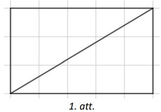

# <lo-sample/> LV.NOL.2022.5.4

Zināms, ka $x$ un $y$ ir dažādi cipari. Atrast visus tādus ciparus
$x$ un $y$, ja zināms, ka skaitlis $4x7yx3y31x$ dalās ar $45$.

<small>

* questionType:
* domain:

</small>

## Atrisinājums

Tā kā $45=5 \cdot 9$ un tie ir savstarpēji pirmskaitļi, tad dotajam
skaitlim ir jādalās gan ar $5$, gan ar $9$. Lai skaitlis dalītos ar
$9$, tā ciparu summai jādalās ar $9$ . Lai skaitlis dalītos ar $5$ ,
tā pēdējam ciparam ir jābūt vai nu $0$ , vai $5$ . Apskatām abus
gadījumus.

- Ja $x=0$, tad skaitļa ciparu summa ir $4+0+7+y+0+3+y+3+1+0=18+y+y$. 
  Tā kā $y$ ir cipars, kas atšķiras no $x$, tad mazākā summas $18+y+y$ 
  vērtība ir $18+1+1=20$, bet lielākā summas $18+y+y$ vērtība 
  ir $18+9+9=36$. Tā kā $18+y+y$ ir jādalās ar $9$ , tad derīgās vērtības
  ir $27$ un $36$. Summu $27$ nevar iegūt, jo, saskaitot divus vienādus
  ciparus, nevar iegūt $9$ . Summu $36$ var iegūt, ja $y=9$.
- Ja $x=5$, tad skaitļa ciparu summa ir $4+5+7+y+5+3+y+3+1+5=33+y+y$. 
  Tā kā $y$ ir cipars, tad mazākā summas $33+y+y$ vērtība ir $33+0+0=33$, 
  bet lielākā summas $33+y+y$ vērtība ir $33+9+9=51$. Tā kā $33+y+y$ ir
  jādalās ar $9$ , tad derīgās vērtības ir $36$ un $45$ . Summu $36$ 
  nevar iegūt, jo, saskaitot divus vienādus ciparus, nevar iegūt $3$ . 
  Summu $45$ var iegūt, ja $y=6$.

Tātad $x=0$ un $y=9$ vai arī $x=5$ un $y=6$.

# <lo-sample/> LV.NOL.2022.5.5

Dagnis savā telefonā no $10$ klases biedriem ir saņēmis $54$ jaunas
ziņas, no katra klases biedra vismaz vienu ziņu. Vai var gadīties, ka nekādi divi
klases biedri nav atsūtīujši vienādu skaitu jauno ziņu?

<small>

* questionType:
* domain:

</small>

## Atrisinājums

Pamatosim, ka prasītais nav iespējams. Ja katrs no $10$ klases biedriem būtu
atsūtijis dažādu skaitu jauno ziņu, tad pavisam kopā Dagnis būtu saņēmis vismaz
$1+2+3+4+5+6+7+8+9+$ $+10=55$ jaunas ziņas (ja tiek ņemts mazākais dažādo ziņu
skaits), taču Dagnis ir saņēmis tikai $54$ jaunas ziņas.

# <lo-sample/> LV.NOL.2022.6.1

Uzraksti vienu piemēru, kādus naturālus skaitļus var ierakstīt $a, b, c, d$ vietā,
lai dotās nevienādības būtu patiesas!

$$
\frac{2}{5}<\frac{a}{d}<\frac{b}{d}<\frac{c}{d}<\frac{1}{2}
$$

<small>

* questionType:
* domain:

</small>

## Atrisinājums

levērojam, ka $\frac{2}{5}=\frac{20}{50}$ un $\frac{1}{20}=\frac{25}{50}$. Tātad
jāatrod tādi naturāli skaitļi $a, b, c, d$, lai

$$
\frac{20}{50}<\frac{a}{d}<\frac{b}{d}<\frac{c}{d}<\frac{25}{50}
$$

Der, piemēram, $a=21, b=22, c=23, d=50$, tas ir,
$\frac{20}{50}=\frac{2}{5}<\frac{21}{50}<\frac{22}{50}<\frac{23}{50}<\frac{1}{2}=\frac{25}{50}$.

# <lo-sample/> LV.NOL.2022.6.2

Vai var uzrakstīt rindā divus vieniniekus, divus divniekus, divus trijniekus un
divus četriniekus (citus ciparus izmantot nedrīkst) tā, lai starp abiem vieniniekiem
būtu uzrakstīts tieši viens cits cipars, starp abiem divniekiem - tieši divi citi cipari,
starp abiem trijniekiem - tieši trīs citi cipari, starp abiem četriniekiem - tieši četri
citi cipari?

<small>

* questionType:
* domain:

</small>

## Atrisinājums

Jā, var, piemēram, $2, 3, 4, 2, 1, 3, 1, 4$.

# <lo-sample/> LV.NOL.2022.6.3

Rūtiņu lapā pa rūtiņu līnijām uzzīmēts taisnstūris ar izmēriem $444 \times 777$ rūtiņas.
Caur cik rūtiņām iet taisnstūra diagonāle? (Diagonāle iet caur rūtiņu, ja tā satur šīs
rūtiņas iekšējus punktus.)

$Piezīme.$ Taisnstūra diagonāle ir nogrieznis, kas savieno taisnstūra pretējās virsotnes.

<small>

* questionType:
* domain:

</small>

## Atrisinājums

Tā kā $\frac{444}{777}=\frac{4}{7}$ un $\frac{4}{7}$ ir nesaīsināma daļa, tad novilktā
diagonāle sastāv no $111$ taisnstūru $4 \times 7$ diagonālēm. Taisnstūra, kura izmēri
ir $4 \times 7$ rūtiņas, diagonāle iet caur $10$ rūtiņām (skat. 2.att.). Tātad
taisnstūra $444 \times 777$ diagonāle iet caur $10 \cdot 111=1110$ rūtiņām.

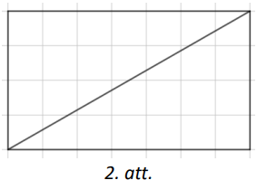

# <lo-sample/> LV.NOL.2022.6.4

Sākumā auzu pārslu batoniņš veikalā maksāja $50$ centus. Pēc atlaides piešķiršanas visus
šādus veikalā esošos auzu pārslu batoniņus pārdeva par $31$ eiro un $93$ centiem. Cik
procentu atlaidi piešķīra, ja zināms, ka tā nepārsniedz $50 \%$?

<small>

* questionType:
* domain:

</small>

## Atrisinājums

Visus veikalā esošos auzu pārslu batoniņus pārdeva par $3193$ centiem. Sadalot
šo skaitli reizinātājos, iegūstam $3193=31 \cdot 103$, kur skaitļi $31$ un $103$
ir pirmskaitļi. Tā kā piešķirtā atlaide nepārsniedz $50 \%$, tad jaunā batoniņa
cena nav mazāka kā $25$ centi, bet ir mazāka nekā $50$ centi. Vienīgais šāds
skaitļa $3193$ dalītājs ir skaitlis $31$. Tātad batoniņa jaunā cena ir $31$ cents
un batoniņa cena tika pazemināta par $50-31=19$ centiem. Tas nozīmē, ka cenas
samazinājums attiecībā pret sākotnējo cenu ir $19$ pret
$50=\frac{19}{50}=\frac{38}{100}=38 \%$. Līdz ar to esam ieguvuši, ka auzu
pārslu batoniņam pieškīra $38$ % atlaidi.

# <lo-sample/> LV.NOL.2022.6.5

Laboratorijā $64$ mēģenēs atrodas siekalu paraugi (siekalu daudzums paraugā ir
pietiekams vairākām pārbaudēm). Zināms, ka viens paraugs ir inficēts ar vīrusu.
Laborantam ir $6$ testa trauki, kuros var ieliet siekalas no mēģenēm, un $6$
reaģenti, ko pieliet testa traukā izveidotajam siekalu maisījumam (tiklīdz
reaģentu ielej testa traukā, tas uzrāda vai neuzrāda vīrusa klātbūtni, un
pēc tam kļūst neaktīvs). Kā, izmantojot $6$ testa traukus un $6$ reaģentus,
noskaidrot, kurā paraugā ir vīruss?

<small>

* questionType:
* domain:

</small>

## Atrisinājums

Pirmajā pārbaudē laborantam vienā traukā jāsajauc nedaudz siekalu no $32$ mēģenēm.
Ja reaģents uzrāda, ka šajā traukā ir vīruss, tad vīruss ir kādā no $32$ mēģenēm,
no kurām tika paņemts nedaudz siekalu, ja nē - tad vienā no $32$ pārējām mēģenēm.
Tālāk laborants darbosies tikai ar tām $32$ mēģenēm, no kurām vienā ir vīruss,
pārējās noliks prom. Laborants atkal vienā traukā sajauc nedaudz siekalu no $16$
mēģenēm. Tādā veidā pēc otrās pārbaudes ir noskaidrotas $16$ mēģenes, no kurām
vienā ir vīruss. Līdzīgi pēc trešās pārbaudes atrod $8$ mēģenes, pēc ceturtās- $4$
mēģenes, pēc piektās- $2$ mēģenes un pēc sestās - vienu meklēto mēģeni, kurā ir vīruss.

(Shematiski mēģeņu dalīšana divās grupās parādīta 3.att., iekrāsojums apzīmē tās
mēģenes, no kurām vienā ir vīruss.)

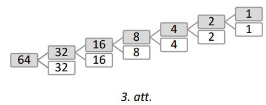

# <lo-sample/> LV.NOL.2022.7.1

Aprēķināt laukumu četrstūrim, kuru ierobežo taisnes
 $y=1, x=-2, x=3, y=\frac{3}{5} x+\frac{21}{5}$.

<small>

* questionType:
* domain:

</small>

## Atrisinājums

Koordinātu plaknē uzzīmējam dotās taisnes un iekrāsojam četrstūri $ABCD$, ko tās ierobežo
(skat. 4.att.). levērojam, ka četrstūra $ABCD$ laukumu var izteikt kā taisnstūra
$AECD$ un trijstūra $ABE$ laukumu summu. Tā kā $CD=5$ un $EC=2$, tad
$S(AECD)=CD \cdot E C=5 \cdot 2=10$ laukuma vienības. Trijstūris $AEB$ ir puse no
taisnstūra, tāpēc $S(AEB)=\frac{1}{2} AE \cdot B E=\frac{1}{2} \cdot 5 \cdot 3=7,5$
laukuma vienības. Līdz ar to $S(ABCD)=10+7,5=17,5$ laukuma vienības.

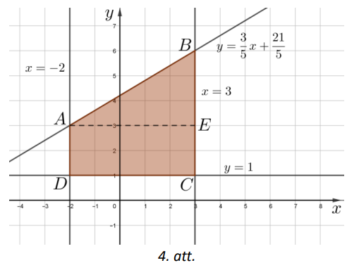

4.att.

# <lo-sample/> LV.NOL.2022.7.2

Vai visi naturāli skaitļi, kuru ciparu summa dalās ar $27$ , arī paši dalās ar $27$?

<small>

* questionType:
* domain:

</small>

## Atrisinājums

Nē, piemēram, skaitļa $9981$ ciparu summa ir $27$, tātad tā dalās ar $27$, bet pats
skaitlis ar $27$ nedalās, jo $9981: 27=369$, $atl.$ $18$ .

# <lo-sample/> LV.NOL.2022.7.3

Dots trijstūris $ABC$ un punkts $M$ trijstūra iekšpusē. Pierādīt, ka
$MA+MB+MC > \frac{1}{2} P_{ABC}$.

<small>

* questionType:
* domain:

</small>

## Atrisinājums

Izmantojot trijstūra nevienādību katrā trijstūrī (skat. 5.att.), iegūstam:

- $A M+MB > AB$ (no $\triangle AMB$)
- $B M+CM > BC$ (no $\triangle BMC$)
- $C M+MA > AC$ (no $\triangle AMC$)

Līdz ar to katru trijstūra $ABC$ malu varam aizstāt ar divu nogriežņu
summu, kas ir lielāka nekā attiecīgās malas garums:

$$P_{ABC}=AB+BC+AC < AM+MB+BM+CM+CM+MA=2MA+2MB+2MC$$

Dalot abas nevienādības puses ar $2$, iegūstam prasīto:

$$\frac{1}{2} P_{ABC} < MA+MB+MC$$

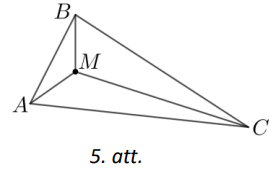

# <lo-sample/> LV.NOL.2022.7.4

Pansionātam ir astoņi stāvi un tajā ir trīs lifti. Katrs lifts apstājas
pirmajā stāvā, astotajā stāvā un vēl četros citos stāvos. Vai liftu
apstāšanos var izkārtot tā, lai pansionāta iemītnieki no katra stāva
var nokļūt jebkurā citā stāvā bez pārkāpšanas citā liftā?

<small>

* questionType:
* domain:

</small>

## Atrisinājums

Jā, var, piemēram, liftu apstāšanās var būt tāda kā 6.att., kur ar $"x"$
atzīmēti stāvi, kuros lifts apstājas.

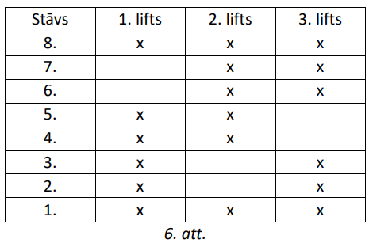

# <lo-sample/> LV.NOL.2022.7.5

Gustavs, Ernests un Miķelis spēlē badmintonu. Katrā spēlē piedalās divi
no viņiem, bet trešais stāv malā un vēro. Tas, kurš kādā spēlē zaudējis,
iet malā un dod vietu tam zēnam, kurš šīs spēles laikā skatījies. Zināms,
ka Gustavs piedalījies $7$ spēlēs, bet Ernests - $15$ spēlēs. Cik spēļu
pavisam tika izspēlētas? Kas uzvarēja un kas zaudēja septītajā spēlē?

<small>

* questionType:
* domain:

</small>

## Atrisinājums

No katrām divām pēc kārtas ņemtām spēlēm Gustavs vismaz vienā piedalījās.
Tāpēc spēļu skaits nepārsniedz $2 \cdot 7+1=15$ un var būt tikai tad,
ja Gustavs piedalījies $2., 4., 6., 8., 10., 12., 14.$ spēlē un visās
šajās spēlēs zaudējis. Tā kā Ernests ir piedalījies $15$ spēlēs, tad
pavisam notika $15$ spēles. Tātad spēļu skaits ir $15$, un Ernests
uzvarējis pirmajās četrpadsmit no tām (citādi viņš nebūtu piedalījies
visās spēlēs). Tātad septītajā spēlē noteikti uzvarēja Ernests, bet
zaudēja Miķelis.

# <lo-sample/> LV.NOL.2022.8.1

Kurš no reizinājumiem $2^{56} \cdot 7^{14}$ vai $3^{28} \cdot 5^{21}$ ir
lielāks?

<small>

* questionType:
* domain:

</small>

## Atrisinājums

Lielāks ir reizinājums $2^{56} \cdot 7^{14}$. Pārveidojam abus reizinājumus,
izmantojot pakāpju īpašības:

- $2^{56} \cdot 7^{14}=\left(2^{8}\right)^{7} \cdot\left(7^{2}\right)^{7}=\left(2^{8} \cdot 7^{2}\right)^{7}=(256 \cdot 49)^{7}=12544^{7}$;
- $3^{28} \cdot 5^{21}=\left(3^{4}\right)^{7} \cdot\left(5^{3}\right)^{7}=\left(3^{4} \cdot 5^{3}\right)^{7}=(81 \cdot 125)^{7}=10125^{7}$.

Tā kā pirmā skaitļa bāze ir lielāka $12544<10125$, bet kāpinātāji abiem
skaitļiem ir vienādi, tad lielāks ir pirmais reizinājums.

# <lo-sample/> LV.NOL.2022.8.2

Vai no taisnstūra ar izmēriem $6 \times 12$ rūtiņas var izgriezt astoņas
7.att. redzamās figūras?

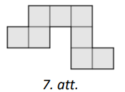

<small>

* questionType:
* domain:

</small>

## Atrisinājums

Jā, piemēram, skat. 8.att.

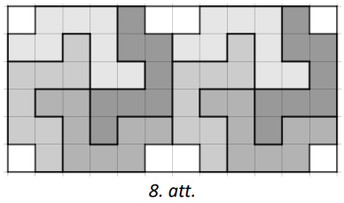

# <lo-sample/> LV.NOL.2022.8.3

Dots platleņķa vienādsānu trijstūris, kuram
$\sphericalangle ABC=20^{\circ}$. Pierādīt, ka $3AC>AB$.

<small>

* questionType:
* domain:

</small>

## Atrisinājums

Trijstūra virsotnes leņķis nevar būt $20^{\circ}$, jo tad leņķi pie pamata
būtu $\left(180^{\circ}-20^{\circ}\right): 2=80^{\circ}$ un trijstūris
nebūtu platleņķa. Apskatām abus iespējamos virsotņu izkārtojumus.

1. Ja $A B=A C$ (skat. 9.att.), tad $3 A C=3 A B>A B$.
2. Ja $B C=A C$ (skat. 10.att.), tad $3 A C>2 A C=B C+A C>A B$.

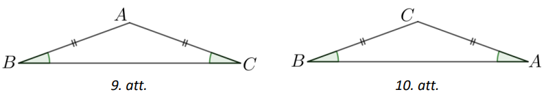

# <lo-sample/> LV.NOL.2022.8.4

Vai piecu secīgu veselu skaitļu summa var būt **a)** $2022$, **b)** $2025$?

<small>

* questionType:
* domain:

</small>

## Atrisinājums

**a)** Nē, nevar būt. Apzīmējam piecus secīgos skaitļus ar
$n-2 ; n-1 ; n ; n+1 ; n+2$. Šo skaitlu summa ir
$(n-2)+(n-1)+n+(n+1)+(n+2)=5n$. Tā kā $2022$ nedalās ar $5$,
tad piecu secīgu skaitļu summa nevar būt $2022$.

**b)**Jā, var, šie pieci skaitļi ir $403 ; 404 ; 405 ; 406 ; 407$.

# <lo-sample/> LV.NOL.2022.8.5

Rindā uzrakstīti skaitļi no $1$ līdz $2022$ (ieskaitot). Divi spēlētāji
pēc kārtas izsvītro pa vienam skaitlim no rindas tik ilgi, kamēr rindā
paliek tikai divi skaitļi (katrā gājienā var izsvītrot jebkuru no palikušajiem
skaitļiem). Pirmais spēlētājs (tas spēlētājs, kurš sāk spēli) uzvar, ja
divu beigās palikušo skaitļu lielākais kopīgais dalītājs ir lielāks nekā $1$,
bet otrais uzvar, ja divu beigās palikušo skaitļu lielākais kopīgais dalītājs
ir $1$. Pierādīt, ka, lai kā arī spēlētu pirmais spēlētājs, otrais spēlētājs
vienmēr var uzvarēt!

<small>

* questionType:
* domain:

</small>

## Atrisinājums

Aprakstīsim, kā jārīkojas otrajam spēlētājam. Otrais spēlētājs domās sadala
skaitļus pa pāriem:

$$(1; 2), \quad(3; 4), \quad \ldots, \quad(2021; 2022).$$

Ja pirmais spēlētājs izsvītro skaitli, tad otrais spēlētājs izsvītro to
skaitli, kas ir vienā pārī ar pirmā spēlētāja izsvītroto skaitli. Tā
spēlējot, otrais spēlētājs vienmēr izjauc pirmā spēlētāja nodomu, jo
beigās paliks divi skaitļi no viena pāra, kas atškiras par $1$, bet
šādu skaitļu lielākais kopīgais dalītājs ir $1$ .

# <lo-sample/> LV.NOL.2022.9.1

Kādām reālām $m$ vērtībām vienādojumam $2x^{2}+(2m+3)x+3m=0$ ir
vismaz viena vesela sakne?

<small>

* questionType:
* domain:

</small>

## Atrisinājums

Pamatosim, ka dotajam vienādojumam ir vesela sakne tikai tad, ja $m$
ir vesels skaitlis. Izmantojot formulu $D=b^{2}-4 a c$, iegūstam, ka
dotā vienādojuma diskriminants ir

$$D=(2m+3)^{2}-4 \cdot 2 \cdot 3m=4m^{2}+12m+9-24m=4m^{2}-12m+9=(2m-3)^{2}$$

Izmantojot formulu $x_{1; 2}=\frac{-b\pm \sqrt{D}}{2a}$, izsakām dotā
vienādojuma saknes: $x_{1; 2}=\frac{-2m-3\pm|2 m-3|}{2a}$.
legūstam, ka vienādojuma viena sakne ir
$x_{1}=\frac{-2m-3+2m-3}{4}=-\frac{6}{4}=-\frac{3}{2}$, bet otra sakne
$x_{2}=\frac{-2m-3-2m+3}{4}=\frac{-4m}{4}=-m$. Ja $m$ ir vesels skaitlis,
tad vismaz viena no dotā vienādojuma saknēm ir vesels skaitlis. Ja $m$ nav
vesels skaitlis, tad abas vienādojuma saknes nav veseli skaitļi.

$Piezīme.$ Vienādojuma saknes var atrast arī ekvivalenti pārveidojot
vienādojuma kreiso pusi:

$$2x^{2}+(2 m+3)x+3m=2x^{2}+2mx+3x+3m=(m+x)(2x+3)$$

# <lo-sample/> LV.NOL.2022.9.2

Vai rūtiņu lapā, kur katras rūtiņas malas garums ir viena vienība, var uzzīmēt
tādu sešstūri, kura malas sakrīt ar rūtiņu līnijām un kura perimetrs un
laukums ir $60$ ?

<small>

* questionType:
* domain:

</small>

## Atrisinājums

Jā, piemēram, skat. 1.att., kur sešstūra perimetrs $P=2+21+4+3+6+24=60$
un laukums $S=2 \cdot 24+3 \cdot 4=60$.

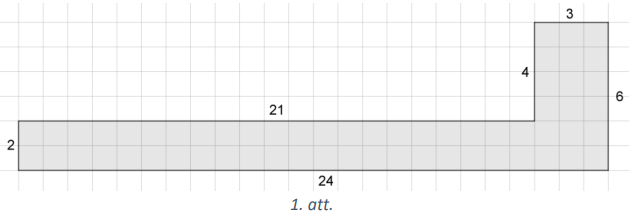

# <lo-sample/> LV.NOL.2022.9.3

Punkts $R$ ir nogriežņa $KO$ iekšējs punkts, punkts $P$ izvēlēts tā,
ka $\sphericalangle RPO=80^{\circ}$. Leņķu $KRP$ un $KOP$ bisektrises
krustojas punktā $A$. Aprēķināt $\sphericalangle RAO$.

<small>

* questionType:
* domain:

</small>

## Atrisinājums

Apzīmēsim $\sphericalangle AOP=x$ (skat. 2.att.), tad arī
$\sphericalangle AOR=x$, jo $AO$ ir leņķa $POR$ bisektrise.

Trijstūra ārējais leņķis ir vienāds ar to divu iekšējo leņķu summu,
kas nav tā blakusleņki, tāpēc $\sphericalangle KRP=2 x+80^{\circ}$.
Tā kā $AR$ ir leņka $KRP$ bisektrise,
tad $\sphericalangle KRA=\sphericalangle ARP=x+40^{\circ}$. levērojam,
ka $\sphericalangle KRA$ ir trijstūra $RAO$ ārējais leņķis, tāpēc
$\sphericalangle KRA=x+\sphericalangle RAO$. Līdz ar to
$\sphericalangle RAO=\sphericalangle KRA-x=x+40^{\circ}-x=40^{\circ}$.

# <lo-sample/> LV.NOL.2022.9.4

Pierādīt, ka katru $11$ pēc kārtas sekojošu naturālu skaitļu reizinājums
dalās ar $12^{4}$.

<small>

* questionType:
* domain:

</small>

## Atrisinājums

Skaitli $12^{4}$ varam izteikt kā $12^{4}=(4 \cdot 3)^{4}=2^{8} \cdot 3^{4}$.
Tātad jāpierāda, ka jebkuru $11$ pēc kārtas sekojošu naturālu skaitļu
reizinājums dalās ar $3^{4} \cdot 2^{8}$. levērojam, ka katrs otrais
no pēc kārtas sekojošiem naturāliem skaitļiem dalās ar $2$ (ir pāra skaitlis),
katrs trešais - dalās ar $3$, katrs ceturtais - dalās ar $4$ utt.

Tas nozīmē, ka no $11$ pēc kārtas sekojošiem naturāliem skaitļiem vismaz
$5$ ir pāra skaitļi, no kuriem vismaz divi dalās ar $4$ un no kuriem viens
dalās ar $8$ , tātad šo piecu pāra skaitļu reizinājums dalās ar
$8 \cdot 4 \cdot 4 \cdot 2 \cdot 2=2^{8}$. Tā kā no $11$ pēc kārtas
sekojošiem naturāliem skaitļiem vismaz trīs dalās ar $3$ , no kuriem
viens dalās ar $9$ , tad to reizinājums dalās ar
$9 \cdot 3 \cdot 3=3^{2} \cdot 3 \cdot 3=3^{4}$. Tātad šo $11$ skaitļu
reizinājums dalās ar $2^{8} \cdot 3^{4}=12^{4}$.

# <lo-sample/> LV.NOL.2022.9.5

Dota $3 \times 3$ rūtiņu tabula. Vai iespējams katrā rūtiņā ierakstīt
naturālu skaitli no $1$ līdz $9$ (katrā rūtiņā citu skaitli) tā, lai
rūtiņās, kurām ir kopīga mala, ierakstīto skaitļu starpība nepārsniedz
**a**) $2$, **b)** $3$ ?

<small>

* questionType:
* domain:

</small>

## Atrisinājums

**a)** Pamatosim, ka prasītais nav iespējams.

Ja prasītais būtu iespējams, tad skaitlim $1$ blakus rūtiņās (rūtiņās,
kurām ir kopīga mala) varētu atrasties tikai skaitļi $2$ un $3$. Tas
nozīmētu, ka skaitlim $1$ jāatrodas kādā no stūra rūtiņām (piemēram,
skat. 3.att.), jo visām citām rūtiņām ir vairāk nekā divas rūtiņas, ar
kurām tām ir kopīga mala. Vienīgie skaitļi, kas varētu atrasties skaitlim
$2$ blakus rūtiņās, ir $1$, $3$ un $4$. Taču tā kā skaitļi $1$ un $3$
jau ir ierakstīti tabulā, tad nevar aizpildīt abas 3.att. iekrāsotās
 rūtiņas. Līdz ar to esam pamatojuši, ka prasītais nav iespējams.

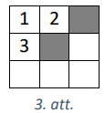

**b)** Jā, piemēram, skat. 4.att.

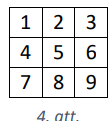

# <lo-sample/> LV.NOL.2022.10.1

Doti punkti $A(21; 1), B(20; 22)$ un $C(10; 2)$. Uzrakstīt vienādojumu
taisnei, kas iet caur punktu $C$ paralēli taisnei $AB$.

<small>

* questionType:
* domain:

</small>

## Atrisinājums

Taisnes $AB$ vienādojums ir formā $y=kx+b$. levietojot šajā
vienādojumā punktu $A$ un $B$ koordinātas, iegūstam vienādojumu
sistēmu

$$\left\{\begin{array}{c}
1=21k+b \\
22=20k+b
\end{array}\right.$$

Atņemot no pirmā vienādojuma otro, iegūstam, ka taisnes $AB$
virziena koeficients $k=-21$. Tātad šai taisnei paralēlas
taisnes vienādojumu var uzrakstīt formā $y=-21x+b$, jo paralēlām
taisnēm ir vienādi virziena koeficienti. levietojot punkta $C$
koordinātas, iegūstam, ka $b=2+21 \cdot 10=212$. Tātad vienādojums
taisnei, kas iet caur punktu $C$ paralēli taisnei $AB$, ir $y=-21x+212$.

## Atrisinājums

Uzrakstām taisnes $AB$ vienādojumu caur diviem tās punktiem:
$\frac{x-21}{20-21}=\frac{y-1}{22-1}$. legūstam
$21(x-21)=-1(y-1)$ jeb $y=-21x+442$. Šīs taisnes virziena koeficients
$k=-21$. Tātad šai taisnei paralēlas taisnes vienādojumu var uzrakstīt
formā $y=-21x+b$, jo paralēlām taisnēm ir vienādi virziena koeficienti.
levietojot punkta $C$ koordinātas, iegūstam, ka $b=2+21 \cdot 10=212$.
Tātad vienādojums taisnei, kas iet caur punktu $C$ paralēli taisnei
$AB$, ir $y=-21x+212$.

$Piezīme.$ Uzdevumā taisnes $AB$ vienādojums nav obligāti jāiegūst,
pietiek atrast taisnes $AB$ virziena koeficientu, piemēram,
$k_{A B}=\frac{y_{A}-y_{B}}{x_{A}-x_{B}}$.

# <lo-sample/> LV.NOL.2022.10.2

Atrisināt reālos skaitļos vienādojumu $x^{3}-4 x^{2}+8=0$.

<small>

* questionType:
* domain:

</small>

## Atrisinājums

Uzminam, ka $x=2$ ir dotā vienādojuma sakne, jo $8-16+8=0$. Izdalot
polinomus (skat. 5.att.), iegūstam $(x-2)\left(x^{2}-2x-4\right)=0$.

$$\begin{aligned}
& \left(x^{3}-4 x^{2}+8\right):(x-2)=x^{2}-2 x-4 \\
& \frac{x^{3}-2 x^{2}}{-2 x^{2}+8} \\
& -2 x^{2}+4 x \\
& -4 x+8 \\
& \frac{-4 x+8}{0}
\end{aligned}$$

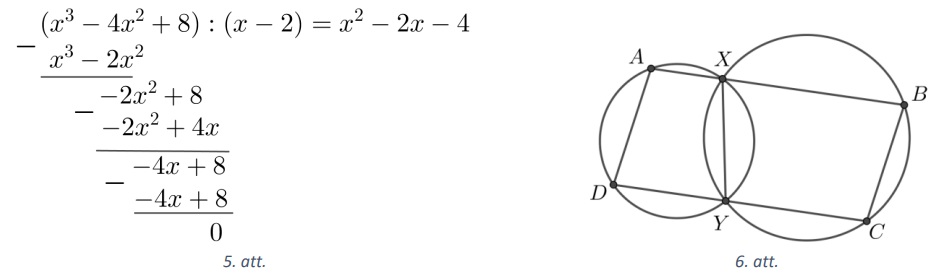

Katru reizinātāju pielīdzinot nullei, iegūstam, ka $x-2=0$ vai $x^{2}-2x-4=0$.
Vienādojumu $x^{2}-2x-4=0$ risinām, atrodot diskriminantu $D=4+16=20$,
tad $x_{2 ; 3}=\frac{2 \pm 2 \sqrt{5}}{2}=1 \pm \sqrt{5}$. Tātad esam ieguvuši,
ka dotā vienādojuma saknes ir $x_{1}=2$ un $x_{2 ; 3}=1 \pm \sqrt{5}$.

# <lo-sample/> LV.NOL.2022.10.3

Divas rinķa līnijas $\omega_{1}$ un $\omega_{2}$ krustojas punktos $X$ un $Y$.
Caur punktu $X$ novilkta taisne $t$, kas vēlreiz krusto rinķa līnijas
$\omega_{1}$ un $\omega_{2}$ attiecīgi punktos $A$ un $B$, caur punktu $Y$
paralēli $t$ novilkta taisne, kas vēlreiz krusto riņka līnijas
$\omega_{1}$ un $\omega_{2}$ attiecīgi punktos $D$ un $C$. Pierādīt, ka $ABCD$
ir paralelograms.

<small>

* questionType:
* domain:

</small>

## Atrisinājums

Tā kā hordas $AX$ un $DY$ ir paralēlas (skat. 6.att.), tad riņka
līnijas loki starp šīm hordām ir vienādi, tas ir,
$\overline{AD}=\overline{XY}$. Tas nozīmē, ka arī
$\overline{ADY}=\overline{XYD}$ un vienādi ir arī ievilktie leņķi,
kas balstās uz šiem lokiem, tas ir,
$\sphericalangle DAX=\sphericalangle AXY$. Tā kā
$\sphericalangle AXY=180^{\circ}-\sphericalangle YXB$ kā blakusleņķi
un arī $\sphericalangle BCY=180^{\circ}-\sphericalangle YXB$, jo ievilkta
četrstūra pretējo leņku summa ir $180^{\circ}$,
tad $\sphericalangle DAX=\sphericalangle BCY$.

Analoģiski iegūstam, ka
$\sphericalangle ADY=\sphericalangle DYX=180^{\circ}-\sphericalangle XYC=\sphericalangle XBC$.

Tā kā četrstūra $ABCD$ pretējie leņki ir pa pāriem vienāda lieluma, tad tas
ir paralelograms, kas arī bija jāpierāda.

# <lo-sample/> LV.NOL.2022.10.4

**a)** Pierādīt, ka katram pirmskaitlim $p>3$ eksistē tāds naturāls skaitlis
$n$, ka $p^{2}=24n+1$.

**b)** Atrast tādu saliktu skaitli $k$, kuram eksistē tāds naturāls skaitlis
$m$, ka izpildās $k^{2}=24m+1$.

<small>

* questionType:
* domain:

</small>

## Atrisinājums

**a)** Vienādību $p^{2}=24n+1$ pārveidojam formā $n=\frac{p^{2}-1}{24}$.
Pierādīsim, ka katram pirmskaitlim $p$, kas lielāks nekā $3$, skaitlis
$\left(p^{2}-1\right)$ dalās ar $24$ , tādā gadījumā $n$ vienmēr būs
naturāls skaitlis.

Tā kā $24=3 \cdot 8$ un abi šie skaitļi ir savstarpēji pirmskaitļ, tad
jāpierāda, ka $p^{2}-1=(p-1)(p+1)$ dalās ar $3$ un $8$.

No trīs pēc kārtas sekojošiem naturāliem skaitļiem $p-1; p; p+1$ viens
noteikti dalās ar $3$. Tā kā $p$ ir pirmskaitlis un $p>3$, tad $p$ ar $3$
nedalās. Līdz ar to ar $3$ dalās vai nu $(p-1)$, vai $(p+1)$. Tas nozīmē,
ka $\left(p^{2}-1\right)$ dalās ar $3$.

Tā kā gan $(p-1)$, gan $(p+1)$ ir pāra skaitļi, tad tie abi dalās ar $2$,
pie tam viens no tiem dalās ar $4$ (katrs otrais pāra skaitlis dalās ar $4$).
Tas nozīmē, ka reizinājums $(p-1)(p+1)$ dalās ar $8$.

Līdz ar to esam pierādījuši, ka $\left(p^{2}-1\right)$ dalās gan ar $3$, gan
ar $8$ , tas nozīmē, ka tā dalās arī ar $24$.

**b)** Der, piemēram, $k=25$, jo $25^{2}=24 \cdot 26+1$.

$Piezīme.$ b) gadījumā, lai atrastu skaitli $k$, var izmantot a) gadījumā
izmantotos spriedumus, tas ir, meklēt $k$ kā saliktu nepāra skaitli, kas
nedalās ar $3$.

# <lo-sample/> LV.NOL.2022.10.5

Vai izteiksmē $\pm 1 \pm 2 \pm 3 \ldots \pm 119 \pm 120$ katru " $\pm$ " zīmi
iespējams aizstāt vai nu ar " + ", vai "-" tā, lai izteiksmes vērtība būtu
**a)** 2023, **b)** 2022? Ja jā, tad kāds ir lielākais iespējamais "+" zīmju
skaits attiecīgajā izteiksmē?

<small>

* questionType:
* domain:

</small>

## Atrisinājums

Apzīmēsim ar $P$ - visu skaitļu summu, kuri ir ar " + " zīmi un ar $M-$ visu
to pozitīvo skaitļu summu, pirms kuriem ir "-" zīme. Tad iegūtās izteiksmes
vērtība ir vienāda ar $P-M$. levērojam, ka
$P+M=1+2+3+\cdots+120=\frac{(1+120) \cdot 120}{2}=7260$.

**a)** Pamatosim, ka iegūtās izteiksmes vērtība nevar būt $2023$.

Tā kā $P+M=7260$, tad abi skaitļi $P$ un $M$ ir ar vienādu paritāti, tas ir,
vai nu abi ir pāra skaitļi, vai arī abi ir nepāra skaitļi. Bet tādā gadījumā
to starpība $(P-M)$ ir pāra skaitlis, tātad tas nevar būt $2023$.

b) Jā, prasītais ir iespējams. Lielākais iespējamais "+" zīmju skaits ir $95$,
piemēram,

$$+1+2+\cdots+14-15+16+17+\cdots+96-97-98-\cdots-120=2022$$

tas ir,
$\frac{(1+96) \cdot 96}{2}-15-15-\frac{(97+120) \cdot 24}{2}=4656-30-2604=2022$.

Pamatosim, ka vairāk " + " zīmes nav iespējamas. Saskaitot vienādojumus

$$\left\{\begin{array}{l}
P-M=2022 \\
P+M=7260
\end{array}\right.$$

iegūstam $2P=9282$ jeb $P=4641$. Tad no sistēmas otrā vienādojuma iegūstam, ka
$M=7260-4641=2619$. Ja būtu $96$ (vai vairāk) "+" zīmes, tad $P$ būtu lielāks
vai vienāds ar mazāko $96$ naturālo skaitļu summu. Bet tā ir
$1+2+\cdots+95+96=\frac{(1+96) \cdot 96}{2}=4656$, kas ir lielāka nekā $P=4641$.
(Šāds novērtējums var palīdzēt atrast arī augstāk redzamo piemēru. Ja ar " + "
zīmi būtu pirmie $95$ skaitļi, tad $P=1+2+\cdots+95=\frac{(1+95) \cdot 95}{2}=4560$.
Tā kā nepieciešams, lai $P$ būtu $4641$, tātad šī summa jāpalielina par $81$.
Lai to izdarītu, pietiek šai summai pievienot $96$ un no tās izņemt $15$
(ir, protams, arī citi varianti).

# <lo-sample/> LV.NOL.2022.11.1

Punkts $P$ atrodas paralelograma $ABCD$ iekšpusē. Pierādīt, ka
$\overrightarrow{PA}+\overrightarrow{PC}=\overrightarrow{PB}+\overrightarrow{PD}$.

<small>

* questionType:
* domain:

</small>

## Atrisinājums

Apskatām patvaļīgu punktu $P$ (skat. 7.att.). Pierādāmā vienādība ir
ekvivalenta ar vienādību
$\overrightarrow{PA}+\overrightarrow{PC}-\overrightarrow{PB}-\overrightarrow{PD}=\overrightarrow{0}$.
Pārveidosim šīs vienādības kreisās puses izteiksmi:

$$\overrightarrow{PA}+\overrightarrow{PC}-\overrightarrow{PB}-\overrightarrow{PD}=\overrightarrow{PA}+\overrightarrow{PC}+\overrightarrow{BP}+\overrightarrow{DP}=(\overrightarrow{BP}+\overrightarrow{PA})+(\overrightarrow{DP}+\overrightarrow{PC})=\overrightarrow{BA}+\overrightarrow{DC}=\overrightarrow{BA}+\overrightarrow{AB}=\overrightarrow{0}$$

Līdz ar to esam pierādījuši prasīto.

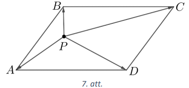

# <lo-sample/> LV.NOL.2022.11.2

Atrisināt reālos skaitļos vienādojumu $x^{4}-4=3\left(x^{3}+x^{2}+x\right)$.

<small>

* questionType:
* domain:

</small>

## Atrisinājums

Ekvivalenti pārveidojam doto vienādojumu $x^{4}-3x^{3}-3x^{2}-3x-4=0$.

Uzminam, ka $x=-1$ ir vienādojuma sakne, jo $1+3-3+3-4=0$. Izdalot polinomus
(skat. 8.att.), iegūstam $(x+1)\left(x^{3}-4 x^{2}+x-4\right)=0$.

Katru reizinātāju pielīdzinot nullei, iegūstam, ka $x+1=0$ vai
$x^{3}-4x^{2}+x-4=0$. Lineārā vienādojuma sakne ir $x=-1$, bet trešās pakāpes
vienādojumu risinām ar grupēšanas paņēmienu:

$$\begin{gathered}
x^{2}(x-4)+(x-4)=0 \\
(x-4)\left(x^{2}+1\right)=0
\end{gathered}$$

Tātad $x=4$, bet vienādojumam $x^{2}=-1$ reālu sakņu nav.

Līdz ar to dotā vienādojuma saknes ir $x_{1}=-1$ un $x_{2}=4$.

$$\begin{aligned}
& \left(x^{4}-3 x^{3}-3 x^{2}-3 x-4\right):(x+1)=x^{3}-4 x^{2}+x-4 \\
& \frac{x^{4}+x^{3}}{-4 x^{3}-3 x^{2}}-3 x-4 \\
& \frac{-4 x^{3}-4 x^{2}}{x^{2}-3 x-4}
\end{aligned}$$

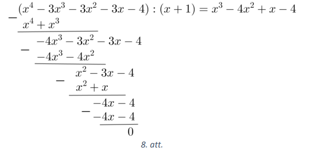

$Piezīme.$ Vienādojumu var risināt arī ekvivalenti to pārveidojot:

$$\begin{gathered}
x^{4}-1=3\left(x^{3}+x^{2}+x\right)+3 \\
x^{4}-1=3\left(x^{3}+x^{2}+x+1\right) \\
\left(x^{2}-1\right)\left(x^{2}+1\right)=3(x+1)\left(x^{2}+1\right)
\end{gathered}$$

# <lo-sample/> LV.NOL.2022.11.3

Trapeces $ABCD$ pamati ir $AB$ un $CD$. Diagonāles $AC$ un $BD$ krustojas
punktā E. Pierādīt, ka $S_{ABE} \cdot S_{ABCD}=S_{ABC}^{2}$ !

<small>

* questionType:
* domain:

</small>

## Atrisinājums

Vispirms pamatosim, ka $S_{AED}=S_{BEC}$ (skat. 9.att.). Tā kā trapeces pamati
ir paralēli, tad $S_{ACD}=S_{BCD}$, jo trijstūriem ir kopīga mala $CD$ un
augstumi pret šo malu ir vienāda garuma. No abām vienādības pusēm atņemot
trijstūra $DEC$ laukumu, iegūstam, ka $S_{ACD}-S_{DEC}=S_{BCD}-S_{DEC}$ no kā
izriet, ka $S_{AED}=S_{BEC}$.

Apzīmējam $S_{AED}=S_{BEC}=c, S_{ABE}=a$ un $S_{DEC}=b$. Tādā gadījumā
$S_{ABC}=a+c$ un $S_{ABCD}=a+b+2c$.

Apzīmējam attālumu no virsotnes $B$ līdz malai $AC$ ar $h$ un attālumu no
virsotnes $D$ līdz malai $AC$ ar $H$ un apskatām laukumu attiecību:

$\frac{S_{ABE}}{S_{AED}}=\frac{\frac{1}{2} AE \cdot h}{\frac{1}{2} AE \cdot H}=\frac{h}{H} \quad$
un
$\quad \frac{S_{EBC}}{S_{EDC}}=\frac{\frac{1}{2} EC \cdot h}{\frac{1}{2} EC \cdot H}=\frac{h}{H}$

Tātad $\frac{a}{c}=\frac{c}{b}$ no kā iegūstam, ka $ab=c^{2}$. Līdz ar to

$$S_{ABE} \cdot S_{ABCD}=a(a+b+2c)=a^{2}+ab+2ac=a^{2}+c^{2}+2ac=(a+c)^{2}=S_{ABC}^{2}$$

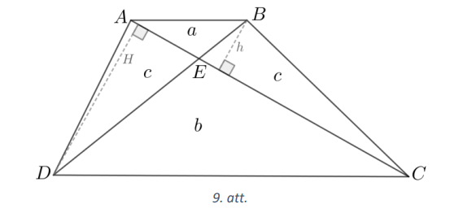

# <lo-sample/> LV.NOL.2022.11.4

Zināms, ka $x$ un $y$ ir naturāli skaitļi un $x+y$ dalās ar $5$. Pierādīt, ka
$x^{5}+y^{5}$ dalās ar $25$.

<small>

* questionType:
* domain:

</small>

## Atrisinājums

Apskatām izteiksmi $(x+y)^{5}$ un to ekvivalenti pārveidojam:

$(x+y)^{5}=x^{5}+5x^{4}y+10x^{3}y^{2}+10x^{2}y^{3}+5xy^{4}+y^{5}=\left(x^{5}+y^{5}\right)+5xy\left(x^{3}+y^{3}\right)+10x^{2}y^{2}(x+y)=$  
$=\left(x^{5}+y^{5}\right)+5xy(x+y)\left(x^{2}-xy+y^{2}\right)+10x^{2}y^{2}(x+y)=$  
$\quad=\left(x^{5}+y^{5}\right)+5xy(x+y)\left(x^{2}-x y+y^{2}+2xy\right)$  
Izsakot $x^{5}+y^{5}$, iegūstam  
$\quad x^{5}+y^{5}=(x+y)^{5}-5(x+y)xy\left(x^{2}+xy+y^{2}\right)$

Tā kā pēc dotā $x+y$ dalās ar $5$, tad izteiksmes labajā pusē abi saskaitāmie
dalās ar $25$, tātad izteiksmes labā puse dalās ar $25$. Līdz ar to arī
izteiksmes kreisajai pusei jādalās ar $25$.

# <lo-sample/> LV.NOL.2022.11.5

Pierādīt, ka visus naturālos skaitļus no $1$ līdz $2022$ iespējams sakārtot
rindā tā, ka katri divi blakus esoši skaitļi atšķiras vai nu par $6$, vai
par $11$ .

<small>

* questionType:
* domain:

</small>

## Atrisinājums

Vispirms parādīsim, ka prasītajā veidā ir iespējams sakārtot skaitļus no $1$
līdz $17$:

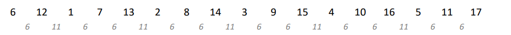

levērojam, ka, visiem šiem skaitļiem pieskaitot $17$, iegūsim derīgu skaitļu
grupu, kurā būs visi skaitļi no $18$ līdz $34$. Tā kā pirmais skaitlis šajā
grupā būs $6+17=23$, tad starpība starp pirmās grupas pēdējo un otrās grupas
pirmo skaitli ir $6$, kas nozīmē, ka, uzrakstot otro grupu tieši aiz pirmās,
esam ieguvuši korektu virkni, kurā ir visi skaitļi no $1$ līdz $34$. Līdzīgi
turpinot, iegūsim derīgas virknes, kuru pēdējais loceklis ir $17n$, kur
$n \in \mathbb{N}$.

Tā kā $2022:17=118$, $atl.$ $16$, tad $119.$ skaitļu grupa beidzas ar
$119 \cdot 17=2023$. Uzrakstot pēdējā skaitļu grupā visus skaitļus bez šī
pēdējā skaitļa $2023$, būsim ieguvuši visu skaitļu no $1$ līdz $2022$
sakārtojumu rindā ar nepieciešamajām īpašībām.

# <lo-sample/> LV.NOL.2022.12.1

Tiešsaistes testā ir četri jautājumi, kurus izpilda secīgi un uzreiz tiek
paziņots, vai iesniegtā atbilde ir pareiza. Uz katru jautājumu iespējamas
tikai divas atbildes, no kurām viena ir pareiza, bet otra nav pareiza.
Tiklīdz sniegtas nepareizas atbildes uz diviem jautājumiem, sistēma testa
izpildi pārtrauc un tests nav ieskaitīts. Ja ir vismaz trīs pareizas atbildes,
tests ir ieskaitīts. Kāda ir varbūtība, ka tests tiks ieskaitīts, atbildes minot?

<small>

* questionType:
* domain:

</small>

## Atrisinājums

Uzzīmējam koka diagrammu, kas ilustrē testa izpildi (skat. 10.att.).

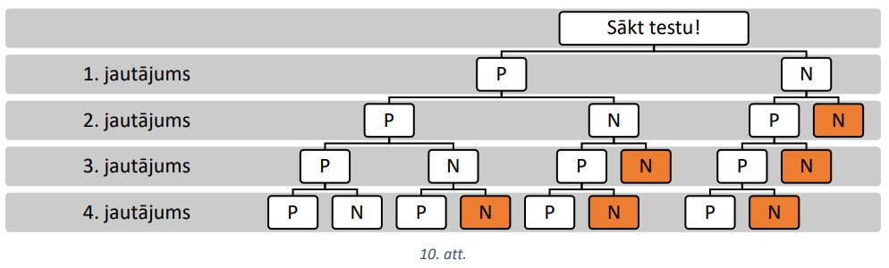

Redzam, ka testam ir $5$ labvēlīgi iznākumi. Kopējais iznākumu skaits ir
$2^{4}=16$, jo katram no četriem jautājumiem ir iespējami divi atbilžu
varianti. Tātad varbūtība, ka tests tiks ieskaitīts, atbildes minot, ir
$\frac{5}{16}$.

## Atrisinājums

Lai vienkāršotu situāciju, atmetam nosacījumu, ka pie divām nepareizām atbildēm
tests tiek pārtraukts. Šādā gadījumā (tā kā ir divas nepareizas atbildes) tests
tāpat nebūs ieskaitīts, tāpēc neko nemainīs tas, ja tests tiks izpildīts līdz
galam (tas ir, atbildēti visi $4$ jautājumi).

Tā kā ir $4$ jautājumi, tad kopā ir $2^{4}=16$ dažādi atbilžu komplekti (uz
katru jautājumu-divi varianti). No tiem derīgi ir tikai tie, kuros ir $1$
nepareiza atbilde ($4$ varianti) vai $0$ nepareizas atbildes ($1$ variants).
Tātad kopumā ir derīgi $5$ no $16$ atbilžu komplektiem, un varbūtība, ka tests
tiks ieskaitīts, ir $\frac{5}{16}$.

# <lo-sample/> LV.NOL.2022.12.2

Atrisināt reālos skaitļos vienādojumu $4x^{4}-11x^{2}+9x-2=0$.

<small>

* questionType:
* domain:

</small>

## Atrisinājums

Uzminam, ka $x=1$ ir dotā vienādojuma sakne, jo $4-11+9-2=0$. Izdalot polinomus
(skat. 11.att.), iegūstam $(x-1)\left(4x^{3}+4x^{2}-7x+2\right)=0$.

Uzminam, ka $x=-2$ ir vienādojuma $4x^{3}+4x^{2}-7x+2=0$ sakne. Izdalot
polinomus (skat. 12.att.), iegūstam $(x+2)\left(4x^{2}-4x+1\right)=0$.

$$-\left(4x^{4}-11x^{2}+9x-2\right):(x-1)=4x^{3}+4x^{2}-7x+2$$

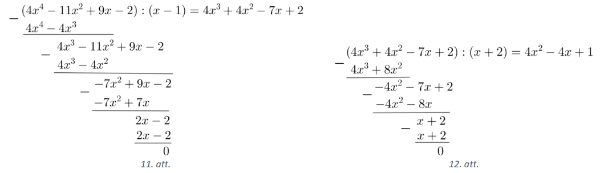

Līdz ar to dotais vienādojums ir pārveidojams formā $(x-1)(x+2)(2x-1)^{2}=0$.

Katru reizinātāju pielīdzinot nullei, iegūstam, ka dotā vienādojuma saknes ir
$x_{1}=1, x_{2}=-2, x_{3}=x_{4}=\frac{1}{2}$.

## Atrisinājums

Uzminam, ka $x=1$ ir vienādojuma sakne, jo $4-11+9-2=0$, un ka $x=-2$ ir sakne,
jo $4 \cdot 16-44-18-2=0$. Tātad vienādojuma kreisā puse dalās ar
$(x-1)(x+2)=x^{2}+x-2$. Izdalot polinomus (skat. 13.att.), iegūstam
$(x-1)(x+2)\left(4x^{2}-4 x+1\right)=0$ jeb $(x-1)(x+2)(2 x-1)^{2}=0$. Katru
reizinātāju pielīdzinot nullei, iegūstam, ka dotā vienādojuma saknes ir
$x_{1}=1, x_{2}=-2, x_{3}=x_{4}=\frac{1}{2}$.

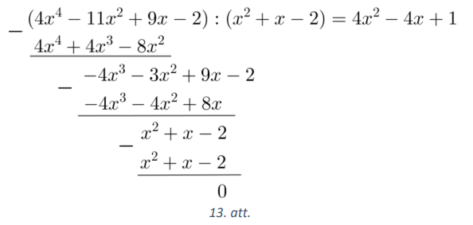

# <lo-sample/> LV.NOL.2022.12.3

Dots izliekts četrstūris $ABCD$, kuram $AB=BC=CD$. Četrstūra diagonāles
krustojas punktā $E$. Pierādīt, ka leņķu $BAD$ un $ADC$ bisektrišu
krustpunkts atrodas uz trijstūrim $ADE$ apvilktās riņķa līnijas.

<small>

* questionType:
* domain:

</small>

## Atrisinājums

Bisektrišu krustpunktu apzīmējam ar $F$ (skat. 14.att.). Apzīmējam
$\sphericalangle BAC=\sphericalangle ACB=\alpha$ un $\sphericalangle CBD=\sphericalangle CDB=\beta$ kā leņki pie pamata vienādsānu trijstūrī $BAC$ un $BCD$. Tad $\sphericalangle AED=\sphericalangle BEC=$ $=180^{\circ}-\sphericalangle ACB-\sphericalangle CBD=180^{\circ}-\alpha-\beta$.

No četrstūra $ABCD$ iekšējo leņķu summas iegūstam

$$\sphericalangle BAD+\sphericalangle CDA=360^{\circ}-\sphericalangle ABC-\sphericalangle BCD=360^{\circ}-\left(180^{\circ}-2 \alpha\right)-\left(180^{\circ}-2 \beta\right)=2(\alpha+\beta)$$

Tad pēc bisektrises definīcijas
$\sphericalangle FAD+\sphericalangle FDA=\frac{1}{2}(\sphericalangle BAD+\sphericalangle CDA)=\alpha+\beta$. No trijstūra $AFD$ iegūstam, ka $\sphericalangle AFD=180^{\circ}-(\sphericalangle FAD+\sphericalangle FDA)=180^{\circ}-\alpha-\beta$.

Tātad divi vienlieli leņi
$\sphericalangle AED$ un $\sphericalangle AFD$ balstās uz viena nogriežņa $AD$. Līdz ar to ap četrstūri $AFED$
var apvilkt riņka līniju, un esam pierādījuši, ka uz trijstūrim $ADE$ apvilktās
riņķa līnijas atrodas arī punkts $F$.

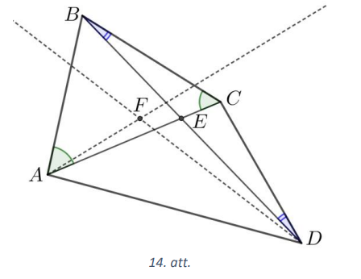

# <lo-sample/> LV.NOL.2022.12.4

Pierādīt, ka $p^{4}-1$ dalās ar $240$ katram pirmskaitlim $p \geq 7$.

<small>

* questionType:
* domain:

</small>

## Atrisinājums

levērojam, ka $240=3 \cdot 5 \cdot 16$. Pārveidojam doto izteiksmi:

$$p^{4}-1=\left(p^{2}-1\right)\left(p^{2}+1\right)=(p-1)(p+1)\left(p^{2}+1\right)$$

Tā kā visi pirmskaitļi, kas lielāki nekā $2$, ir nepāra skaitļi, tad visi trīs
reizinātāji ir pāra skaitļi, tātad katrs no tiem dalās ar $2$. Ņemot vērā, ka
$p-1$ un $p+1$ ir divi secīgi pāra skaitļi, tad viens no tiem dalās ar $4$.
Līdz ar to $p^{4}-1$ dalās ar $2 \cdot 4 \cdot 2=16$.

Pirmskaitlis $p \geq 7$ nedalās ar $3$, tātad vai nu $p-1$, vai $p+1$ dalās ar
$3$, jo $p-1$, $p$ un $p+1$ ir trīs secīgi skaitļi. Līdz ar to $p^{4}-1$ dalās
ar $3$.

Jebkurš pirmskaitlis, kas lielāks nekā $5$, dalot ar $5$, dod atlikumu atškirīgu
no $0$. Apskatām visus iespējamos gadijumus:

- ja $p$ atlikums, dalot ar $5$, ir $1$, tad pirmskaitlis $p$ ir uzrakstāms
  formā $p=5k+1$ un $p-1=5k+1-1=5k$, kas dalās ar $5$;

- ja $p$ atlikums, dalot ar $5$, ir $2$, tad pirmskaitlis $p$ ir uzrakstāms
  formā $p=5k+2$ un $p^{2}+1=(5k+2)^{2}+1=25k^{2}+20k+5=5\left(5k^{2}+4k+1\right)$,
  kas dalās ar $5$;

- ja $p$ atlikums, dalot ar $5$, ir $3$ , tad pirmskaitlis $p$ ir uzrakstāms
  formā $p=5k+3$ un
  $p^{2}+1=(5k+3)^{2}+1=25k^{2}+20k+10=5\left(5 k^{2}+4 k+2\right)$, kas dalās
  ar $5$;

- ja $p$ atlikums, dalot ar $5$, ir $4$, tad pirmskaitlis $p$ ir uzrakstāms
formā $p=5k+4$ un $p+1=5k+5$, kas dalās ar $5$ .

Tātad $p^{4}-1$ dalās ar $5$.

Esam ieguvušì, ka $p^{4}-1$ dalās ar $3$, $5$ un $16$. Tā kā šie skaitļi ir
savstarpēji pirmskaitļi, tad $p^{4}-1$ dalās ar $240$.

$Piezīmes$

1. Pierādīt, ka $p^{4}-1$ dalās ar $5$ , var izmantojot kongruences:

- ja $p \equiv 1(\bmod 5)$, tad $p^{4}-1 \equiv 1^{4}-1 \equiv 0(\bmod 5)$;

- ja $p \equiv 2(\bmod 5)$, tad
  $p^{4}-1 \equiv 2^{4}-1 \equiv 15 \equiv 0(\bmod 5)$;

- ja $p \equiv 3(\bmod 5)$, tad
  $p^{4}-1 \equiv 3^{4}-1 \equiv 80 \equiv 0(\bmod 5)$;

- ja $p \equiv 4(\bmod 5)$,
  tad $p^{4}-1 \equiv 4^{4}-1 \equiv 255 \equiv 0(\bmod 5)$.

2. Lai pierādītu, ka $n^{4}-1$ dalās ar $5$, var izmantot arī mazo Fermā
teorēmu: ja skaitlis $a$ nedalās ar pirmskaitli $n$, tad $a^{n-1}-1$ dalās
ar $n$.

# <lo-sample/> LV.NOL.2022.12.5

Sākumā turzā ir $89$ konfektes. Karlsons un Brālītis pēc kārtas ēd no turzas
konfektes. Pirmais sāk Karlsons un apēd vienu konfekti, bet katrā nākamajā
gājienā spēlētājs var apēst tikpat konfektes, cik savā iepriekšējā gājienā
apēda otrs, vai arī par vienu konfekti vairāk. Zaudē tas, kurš vairs nevar
izdarīt gājienu. Kurš spēlētājs - Karlsons vai Brālītis - vienmēr var uzvarēt?

<small>

* questionType:
* domain:

</small>

## Atrisinājums

Karlsons vienmēr var uzvarēt. Lai to izdarītu, viņam savā otrajā gājienā jāapēd
divas konfektes, trešajā - trīs, ceturtajā - četras, ..., devītajā - deviņas
konfektes. Tātad, ja Brālītis savā gājienā apēdamo konfekšu skaitu palielina
par viens, tad Karlsons apēdamo konfekšu skaitu nepalielina, un otrādi.

Novērtēsim, cik konfekšu būs apēstas pēc Karlsona devītā gājiena (kad Brālītis
būs izdarījis $8$ gājienus, bet Karlsons - $9$ gājienus). Karlsons būs apēdis
$1+2+3+\cdots+9=45$ konfektes. Brālītis savā pirmajā gājienā būs apēdis $1$ vai
$2$ konfektes, otrajā - $2$ vai $3$ , trešajā - $3$ vai $4, \ldots$, astotajā - $8$
vai $9$ konfektes. Tātad mazākais skaits konfekšu, ko viņš var apēst, ir
$1+2+3+\ldots+8=36$ konfektes, bet lielākais Brālīša apēsto konfekšu skaits var
būt $2+3+4+\ldots+9=44$ konfektes. Tātad abi kopā viņi būs apēduši $81$ līdz
$89$ konfektes un turzā būs atlikušas $0$ līdz $8$ konfektes. Tā kā gājiens ir
Brālītim un viņam ir jāņem $9$ vai $10$ konfektes, tad viņš savu gājienu izdarīt
vairs nevar, jo nepietiek konfekšu, un zaudē.

