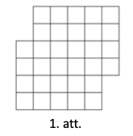
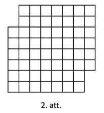
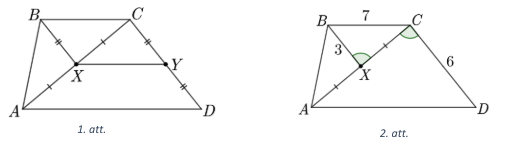

# <lo-sample/> LV.NOL.2023.5.1

<text lang="lv">
Ieraksti katrā tukšajā rūtiņā (skat. 1.att.) vienu skaitli (skaitļi 
var būt arī vienādi) tā, lai katrās trīs blakus rūtiņās skaitļu summa 
būtu viena un tā pati un visu rūtiņās ierakstīto skaitļu 
(ieskaitot abus dotos skaitļus) summa būtu $223$. Pietiek parādīt 
vienu veidu, kā to var izdarīt.

{ width=300px }
</text>

<text lang="en">
Write a number in each empty cell (see Figure 1) so that the sum of the 
numbers in any three consecutive cells is the same, and the total sum 
of all the numbers written in the cells (including the two given numbers) 
is $223$. It is sufficient to show one example of how to achieve this.

{ width=300px }
</text>

<small>

* questionType:FindExample
* domain:Alg

</small>

<text lang="lv">
## Atrisinājums

Prasīto var izdarīt, kā parādīts 2. att., kur katru trīs pēc kārtas esošu 
skaitļu summa ir $51$.

{ width=300px }

Paskaidrosim, kā šos skaitlus var atrast. Aplūkojam četras rūtiņas pēc kārtas, 
kurās ierakstīti skaitli $x ; a ; b$ un $y$ (skat. 3. att.).

{ width=150px }

Tā kā katrās trijās blakus rūtiņās skaitļu summa ir viena un tā pati, 
tad $x+a+b=a+b+y$, tātad $x=y$ un rūtiņās $x$ un $y$ jābūt ierakstītam 
vienam un tam pašam skaitlim. Tātad rūtiņās ierakstītie skaitḷi atkārtojas 
ar periodu $3$ (skat. 4.att.), kur $n$ ir kāds nezināms skaitlis 
(visur viens un tas pats).

{ width=300px }

Ja mēs noņemam nost pašu pēdējo skaitli $19$, tad mēs iegūstam, ka četros 
trīs rūtiņu blokos $(19;20;n)$ kopā skaitlu summa ir $223-19=204$, 
tātad vienā šādā blokā $(19;20;n)$ skaitļu summa ir $204:4=51$. 
Tātad skaitļa $n$ vietā jāraksta $51-19-21=12$.
</text>

<text lang="en">
## Solution

The required solution can be achieved as shown in Figure 2, where the sum 
of every three consecutive numbers is $51$.

{ width=300px }

Let's explain how these numbers can be found. Consider four consecutive 
cells that contain the numbers $x;a;b$ and $y$ (see Figure 3).

{ width=150px }

Since the sum of the numbers in any three consecutive cells is the same, 
we have $x+a+b=a+b+y$, which implies $x=y$, and thus the numbers $x$ and 
$y$ must be the same. Therefore, the numbers written in the cells repeat 
with a period of $3$ (see Figure 4), where $n$ is an unknown number 
(the same everywhere).

{ width=300px }

If we remove the very last number $19$, we find that in four blocks of 
three cells $(19;20;n)$, the total sum of the numbers is $223-19=204$. 
Hence, the sum of the numbers in one such block $(19;20;n)$ is $204:4=51$. 
Therefore, the number $n$ must be $51-19-20=12$.
</text>

# <lo-sample/> LV.NOL.2023.5.2

<text lang="lv">
Rūķīši mežā ir uzbūvējuši astoņas mājiņas un starp tām izveidojuši 
vairākas taciņas. Katra taciņa savieno divas mājiņas, 
taciņas var krustoties. Vai iespējams, ka no mājiņām iziet attiecīgi: 
**(A)** $2, 2, 2, 4, 4, 4, 4, 4$ taciņas;  
**(B)** $1,2,2,2,2,3,4,5$ taciņas?
</text>

<text lang="en">
In the forest, gnomes have built eight houses and created several paths 
between them. Each path connects two houses, and paths can intersect. 
Is it possible that the houses have the following number 
of paths coming out of them:  
**(A)** $2, 2, 2, 4, 4, 4, 4, 4$ paths respectively;  
**(B)** $1, 2, 2, 2, 2, 3, 4, 5$ paths respectively?
</text>

<small>

* questionType:ProveDisprove,ProveDisprove
* domain:Comb
* subdomain:FixedInvariant

</small>

<text lang="lv">
## Atrisinājums 

**(A)** Jā, piemēram, skat. 5. att., kur ar punktiem attēlotas mājiņas, 
bet ar līnijām attēlotas taciņas un pie katra punkta pierakstīts no tā 
izejošo līniju skaits.

**(B)** Pamatosim, ka tas nav iespējams. Tā kā katrai taciņai ir divi gali, 
tad kopējam taciņu galu skaitam ir jābūt pāra skaitlim, bet pēc 
dotā iegūstam, ka ir $1+2+2+2+2+3+4+5=21$ taciņu gali. Tā kā $21$ 
ir nepāra skaitlis, tad prasītais nav iespējams.

{ width=200px }
</text>

<text lang="en">
## Solution

**(A)** Yes, for example, see Fig. 5, where dots represent houses, lines 
represent paths, and the number of lines emanating from each point is 
noted next to each point.

**(B)** Let us show that this is not possible. Since each path has two 
endpoints, the total number of path ends must be an even number. 
From the given data, we get that there are $1+2+2+2+2+3+4+5=21$ 
endpoints. Since $21$ is an odd number, the required configuration 
is not possible.

{ width=200px }
</text>

# <lo-sample/> LV.NOL.2023.5.3

<text lang="lv">
Parādi, kā 2.att. figūru ($6 \times 8$ rūtiņu taisnstūris, 
no kura izgriezts $3 \times 4$ rūtiņu taisnstūris), griežot pa 
rūtiņu līnijām, var sagriezt trīs vienādās figūrās! Figūras ir vienādas, 
ja tās var uzlikt vienu uz otras tā, ka abas figūras sakrīt 
(figūras var pagriezt un apmest otrādi).

{ width=200px }
</text>

<small>

* questionType:FindExample
* domain:Geom

</small>

<text lang="lv">
## Atrisinājums

Skat. 7. att.

{ width=200px }
</text>

# <lo-sample/> LV.NOL.2023.5.4

<text lang="lv">
Parādi, kā skaitli $174$ var uzrakstīt kā $3$ dažādu naturālu skaitļu 
summu tā, lai katru divu šo skaitļu summa dalītos ar trešo skaitli!
</text>

<small>

* questionType:FindExample
* domain:NT

</small>

<text lang="lv">
## Atrisinājums

Prasīto var izdarīt šādi: $174=29+58+87$. Pārbaudām, ka katru divu 
šo skaitļu summa dalās ar trešo skaitli:

$$\begin{aligned}
& \circ \quad(29+58): 87=87: 87=1 \\
& \circ \quad(29+87): 58=116: 58=2 \\
& \circ \quad(58+87): 29=145: 29=5
\end{aligned}$$
</text>

# <lo-sample/> LV.NOL.2023.5.5

<text lang="lv">
Ja automātā ievieto sarkanu monētu, tad tas izdod $5$ zilas monētas, 
bet, ja automātā ievieto zilu monētu, tad tas izdod $3$ sarkanas monētas. 
Vai, atkārtoti izmantojot automātu, ir iespējams iegūt vienāda skaita 
sarkanās un zilās monētas, ja sākumā ir dota viena sarkana monēta?
</text>

<small>

* questionType:ProveDisprove
* domain:Comb
* subdomain:FixedInvariant

</small>

<text lang="lv">
## Atrisinājums

Nē, tas nav iespējams. Ievērosim, ka sākumā ir dota viena monēta 
un ar katru darbību monētu skaits palielinās par $4$ monētām 
(ja ievieto $1$ sarkanu monētu, tad izdod $5$ zilas monētas) 
vai $2$ monētām (ja ievieto $1$ zilu monētu, tad izdod $3$ sarkanas 
monētas), tātad kopējais monētu skaits vienmēr būs nepāra skaitlis. 
Bet, ja zilās un sarkanās monētas būtu vienādā skaitā, 
tad kopējais monētu skaits būtu pāra skaitlis. Tātad prasītais nav iespējams.
</text>

# <lo-sample/> LV.NOL.2023.6.1

<text lang="lv">
Atrodi vienu veidu, kādi naturāli skaitḷi jāievieto $x, y$ un $z$
vietā, lai vienādība

$$2+\frac{1}{x+\frac{1}{y+\frac{1}{z}}}=\frac{37}{13}$$

būtu patiesa!
</text>

<small>

* questionType:FindExample
* domain:Alg

</small>

<text lang="lv">
## Atrisinājums

Der vērtības $x=1$; $y=5$ un $z=2$. Ar šīm vērtībām vienādība ir patiesa, jo

$$2+\frac{1}{1+\frac{1}{5+\frac{1}{2}}}=2+\frac{1}{1+\frac{2}{11}}=2+\frac{1}{1 \frac{2}{11}}=2+\frac{11}{13}=2 \frac{11}{13}=\frac{37}{13}$$

*Piezīme.* Parādīsim, kā var iegūt prasītās vērtības. 
Ievērojam, ka $\frac{37}{13}=2 \frac{11}{13}$, tātad 
$\frac{1}{x+\frac{1}{y+\frac{1}{Z}}}=\frac{11}{13}$, no kā iegūstam, 
ka $x+\frac{1}{y+\frac{1}{z}}=\frac{13}{11}$. 
Tā kā $\frac{13}{11}=1 \frac{2}{11}$, tad $x=1$ un $\frac{1}{y+\frac{1}{z}}=\frac{2}{11}$, 
no kā iegūstam, ka $y+\frac{1}{z}=\frac{11}{2}$. 
Ievērojot, ka $\frac{11}{2} = 5\frac{1}{2}$, iegūstam, ka $y=5$ un $z=2$.
</text>

# <lo-sample/> LV.NOL.2023.6.2

<text lang="lv">
Rūķīši mežā ir uzbūvējuši desmit mājiņas un starp tām izveidojuši 
vairākas taciņas. Katra taciņa savieno divas mājiņas, taciņas var 
krustoties. Vai iespējams, ka no mājiņām iziet attiecīgi:  
**(A)** $2, 2, 2, 2, 2, 3, 3, 3, 3, 7$ taciņas; **(B)** $2, 2, 2, 2, 4, 4, 4, 4, 4, 4$ taciņas?
</text>

<small>

* questionType:ProveDisprove
* domain:Comb
* subdomain:FixedInvariant

</small>

<text lang="lv">
## Atrisinājums

**(A)** Pamatosim, ka tas nav iespējams. Tā kā katrai taciņai ir 
divi gali, tad kopējam taciņu galu skaitam ir jābūt pāra skaitlim, 
bet no dotā iegūstam, ka $2+2+2+2+2+3+3+3+3+7=29$ taciņu gali. 
Tā kā $29$ ir nepāra skaitlis, tad prasītais nav iespējams.

**(B)** Jā, piemēram, skat. 8. att., kur ar punktiem attēlotas mājiņas, 
bet ar līnijām attēlotas taciņas un pie katra punkta pierakstīts no 
tā izejošo līniju skaits.

{ width=200px }
</text>

# <lo-sample/> LV.NOL.2023.6.3

<text lang="lv">
Parādi, kā, griežot pa rūtiņu līnijām, 1.att. doto figūru var sagriezt 
$4$ vienādās figūrās! Figūras ir vienādas, ja tās var uzlikt vienu uz 
otras tā, ka abas figūras pilnīgi sakrīt (figūras var pagriezt un apmest otrādi).

{ width=200px }
</text>

<small>

* questionType:FindExample
* domain:Geom

</small>

<text lang="lv">
## Atrisinājums

Skat., piemēram, 10. att. vai 11. att.

{ width=250px }
</text>

# <lo-sample/> LV.NOL.2023.6.4

<text lang="lv">
Vai skaitli: **(A)** $72$, **(B)** $73$ var izteikt kā trīs dažādu 
naturālu skaitļu summu tā, lai katru divu šo skaitḷu summa dalītos 
ar atlikušo skaitli?
</text>

<small>

* questionType:ProveDisprove,ProveDisprove
* domain:NT

</small>

<text lang="lv">
## Atrisinājums

**(A)** Jā, var šādi $72=12+24+36$. Pārbaudām, vai katru divu šo 
skait|u summa dalās ar trešo skaitli:

$$\begin{aligned}
& \circ \quad(12+24): 36=36: 36=1 \\
& \circ \quad(12+36): 24=48: 24=2 \\
& \circ \quad(24+36): 12=60: 12=5
\end{aligned}$$

**(B)** Pamatosim, ka prasītais nav iespējams. Ja divu skaitļu 
$a$ un $b$ summa dalās ar kādu skaitli $n$, tad arī visu trīs 
šo skaitlu summa $a+b+n$ dalās ar skaitli $n$. Tātad visu trīs 
skaitļu summai jeb $73$ jādalās ar jebkuru no trīs saskaitāmajiem. 
Bet skaitlis $73$ ir pirmskaitlis, kas dalās tikai ar $1$ un $73$. 
Tātad šie trīs dažādie skaiți var pieņemt tikai vērtības $1$ vai 
$73$, kas nav iespējams.
</text>

# <lo-sample/> LV.NOL.2023.6.5

<text lang="lv">
Naturālu skaitli atļauts reizināt ar $2$, kā arī izsvītrot no tā 
pieraksta ciparus $0,3,6,9$ (varbūt tikai kādu no tiem). 
Vai, vairākkārt izpildot šādus gājienus, no skaitla $17$ var iegūt: 
**(A)** skaitli $1$; **(B)** skaitli $15$?
</text>

<small>

* questionType:ProveDisprove,ProveDisprove
* domain:NT
* subdomain:FixedInvariant

</small>

<text lang="lv">
## Atrisinājums

**(A)** Jā, var, piemēram, šādi:

$$17 \rightarrow 34 \rightarrow 4 \rightarrow 8 \rightarrow 
16 \rightarrow 1$$

**(B)** Nē, nevar. Sākotnējais skaitlis $17$ nedalās ar $3$. 
Ja skaitlis nedalās ar $3$, tad, izpildot dotās darbības, 
iegūtais skaitlis nedalīsies ar $3$:

- ja skaitli, kas nedalās ar $3$, reizina ar $2$, tad arī 
  iegūtais reizinājums nedalīsies ar $3$;
- ja skaitlim, kas nedalās ar $3$, izsvītro ciparu $0,3,6,9$, 
  tad arī iegūtais skaitlis nedalīsies ar $3$ (sākotnējā skaitla 
  ciparu summa nedalās ar $3$ (dalāmības pazīme ar $3$), ja 
  izsvītros $0,3,6,9$, tad arī iegūs ciparu summu, kas nedalās ar $3$).

Tātad arī pēc vairākām operācijām iegūtais skaitlis nedalīsies 
ar $3$. Tas nozīmē, ka skaitli $15$ iegūt nevar, jo tas dalās ar $3$.
</text>

# <lo-sample/> LV.NOL.2023.7.1

<text lang="lv">
Vai tukšajās rūtiņās (skat. 1.att.) var ierakstīt pa vienam 
naturālam skaitlim tā, lai rezultātā būtu ierakstīti visi naturālie 
skaitḷi no $1$ līdz $25$ un katri divi skaitļi, kuru starpība ir $1$, 
būtu ierakstīti rūtiņās ar kopīgu malu?

{ width=200px }
</text>

<small>

* questionType:ProveDisprove
* domain:Comb

</small>

<text lang="lv">
## Atrisinājums

Atrisinājums. Jā, var, skat. attēlu.

{ width=150px }
</text>

# <lo-sample/> LV.NOL.2023.7.2

<text lang="lv">
Vai **(A)** $90$ lampiņas, **(B)** $73$ lampiņas ar vadiem var 
savienot tā, lai katra no tām būtu savienota ar vadu ar tieši 
$5$ citām lampiņām?
</text>

<small>

* questionType:ProveDisprove,ProveDisprove
* domain:Comb
* subdomain:FixedInvariant

</small>

<text lang="lv">
## Atrisinājums

**(A)** Jā, var. Sadalām $90$ lampiņas $15$ grupās pa $6$ 
lampiņām katrā grupā. Katras grupas katras divas lampiņas 
savienojam ar vadu (skat. 14.att., kur lampiņas attēlotas 
ar punktiem un vadi ar nogriežņiem, kas šos punktus savieno). 
Šādā veidā katra no $90$ lampinām būs savienota ar tieši $5$ 
citām lampiņām.

{ width=150px }

**(B)** Tā kā no katras lampiņas iziet $5$ vadi, tad vadu galu 
skaits ir $73 \cdot 5=365$. Bet katram vadam ir $2$ gali, tāpēc 
kopējais galu skaits nevar būt nepāra skaitlis. Tāpēc $73$ 
lampiņas ar vadiem nevar savienot savā starpā tā, lai katra no 
tām būtu savienota tieši ar $5$ citām lampiņām.
</text>

# <lo-sample/> LV.NOL.2023.7.3

<text lang="lv">
Dots četrstūris $ABCD$, kuram visi leņķi ir mazāki nekā 
$180^{\circ}$, $\sphericalangle A=\sphericalangle B$, $BC=1$ 
un $AD=3$. Pierādīt, ka $CD>2$.
</text>

<small>

* questionType:Prove
* domain:Geom
* method:AugmentationWithNewElements

</small>

<text lang="lv">
## Atrisinājums

Novelkam nogriezni $BD$ (skat. 15.att.). No dotā izriet, ka 
$\sphericalangle DAB = \sphericalangle ABC > \sphericalangle ABD$. 
Tā kā trijstūrī $ABD$ pret lielāku lenki atrodas garāka mala, 
tad $BD > AD=3$.

No trijstūra nevienādības trijstūrī $BCD$ iegūstam, ka 
$DC>DB-BC>3-1=2$.

{ width=150px }
</text>

# <lo-sample/> LV.NOL.2023.7.4

<text lang="lv">
Cik ir tādu naturālu skaitļu $n$, kuriem skaitlim $n^{2}$ 
ir tikpat ciparu, cik skaitlim $n^{3}$?
</text>

<small>

* questionType:FindCount
* domain:NT

</small>

<text lang="lv">
## Atrisinājums

Ir trīs skaitli, kam izpildās uzdevuma nosacījumi, šie skaitḷi ir 
$1$; $2$ un $4$, jo $1^{2}=1^{3}=1$; $2^{2}=4$ un $2^{3}=8$ 
visi ir vienciparu skaitli, un $4^{2}=16$ un $4^{3}=64$ 
abi ir divciparu skaitļi. Pamatosim, ka citu derīgu $n$ 
vērtību nav.

Skaitlis $3$ neder, jo $3^{2}=9$, bet $3^{3}=27$.

Skaitļu no $5$ līdz $9$ kvadrāti ir divciparu skaitli, jo 
$5^{2}=25$ un $9^{2}=81$ abi ir divciparu, tātad arī skaitļu 
$6$; $7$; $8$ kvadrāti ir divciparu skaitli. Šo skaitļu kubi ir 
trīsciparu skaitļi, jo $5^{3}=125$ un $9^{3}=729$ abi ir 
trīsciparu, tātad pa vidu esošo skaitļu kubi arī ir trīsciparu skaitļi.

Skaitḷiem, kas lielāki nekā $9$, lai no skaitļa kvadrāta iegūtu skaitļa 
kubu, tie jāreizina ar pašu skaitli, tātad vismaz ar $10$. Tādā gadījumā
skaitḷa kuba ciparu skaits ir vismaz par $1$ lielāks nekā šī skaitļa 
kvadrāta ciparu skaits.
</text>

# <lo-sample/> LV.NOL.2023.7.5

<text lang="lv">
Kastē atrodas baltas, sarkanas un zaḷas lodītes. Ar vienu gājienu no 
kastes var izņemt divas dažādu krāsu lodītes un ielikt kastē vienu 
trešās krāsas lodīti (vienmēr pietiek jebkuras krāsas lodīšu, 
ko ielikt kastē). Vai var panākt, ka kastē paliek tikai viena lodīte, 
ja sākumā kastē atrodas:  
**(A)** $10$ baltas, $12$ sarkanas un $16$ zalas lodītes;  
**(B)** $10$ baltas, $12$ sarkanas un $15$ zaḷas lodītes?
</text>

<small>

* questionType:ProveDisprove,ProveDisprove
* domain:Comb
* subdomain:FixedInvariant

</small>

<text lang="lv">
## Atrisinājums

**(A)** Nē, nevar. Ar katru gājienu visu krāsu lodīšu skaita 
paritāte mainās (no pāra skaitļa uz nepāra skaitli un otrādi). 
Tāpēc nevaram iegūt situāciju, ka divi lodīšu skaiti ir $0$ 
(pāra skaitlis), bet viens skaits ir $1$ (nepāra skaitlis), 
jo sākumā visu krāsu lodīšu skaits ir pāra skaitlis.

**(B)** Jā, var. Ar trīs pēc kārtas sekojošiem gājieniem ņemot 
balta-sarkana (apzīmēsim ar *bs*), balta-zala (apzīmēsim ar *bz*), sarkana-zaḷa (apzīmēsim ar *sz*), katras krāsas lodīšu skaits 
samazinās par $1$. Atkārtojot $9$ reizes šādu gājienu trijniekus, 
iegūstam, ka kastē ir $1$ balta, $3$ sarkanas un $6$ zaḷas lodītes. 
Tālāk ar gājieniem *sz*, *sz*, *bz* izveidojam situāciju, ka 
kastē ir $2$ baltas, $2$ sarkanas un $3$ zaļas lodītes. To ar 
gājieniem *bs*, *sz*, *bz*, *sz*, *bz*, *bs* pārveidojam par 
situāciju, kad kastē ir $0$ baltas, $0$ sarkanas un $1$ zaļa lodīte.
</text>

# <lo-sample/> LV.NOL.2023.8.1

<text lang="lv">
Ieraksti katrā tukšajā rūtiņā (skat. 1.att.) vienu pirmskaitli 
(skaitḷi var būt arī vienādi) tā, lai katrās četrās blakus 
rūtiņās skaitļu summa būtu viena un tā pati un visu rūtiņās 
ierakstīto skaitļu (ieskaitot abus dotos skaitļus) summa būtu $127$. 
Pietiek parādīt vienu veidu, kā to var izdarīt.

{ width=400px }
</text>

<small>

* questionType:FindExample
* domain:NT

</small>

<text lang="lv">
## Atrisinājums

To var izdarīt, kā parādīts 17.att., kur katru četru pēc kārtas 
ierakstītu skait|u summa ir $36$.

{ width=400px }

*Piezīme.* Paskaidrosim, kā šos skait!us var atrast. 
Aplūkojam piecas rūtiņas pēc kārtas, kurās ierakstīti skaiți 
$x;a;b;c$ un $y$ (skat. 18. att.).

{ width=150px }

Tā kā katrās četrās blakus rūtiņās skaitļu summa ir viena 
un tā pati, tad $x+a+b+c=a+b+c+y$, tātad $x=y$ un rūtiņās 
$x$ un $y$ jābūt ierakstītam vienam un tam pašam skaitlim. 
Tātad rūtiņās ierakstītie skaitḷi atkārtojas ar periodu $4$ 
(skat. 19. att.), kur $m$ un $n$ ir kādi vēl nezināmi pirmskaitļi.

{ width=400px }

No tā, ka visu skaitļu summa ir $127$ iegūstam, ka 
$4m+3n=127-(3+11) \cdot 4=71$, no kā iegūstam, ka $n=(71-4 m):3$. 
Aplūkosim dažas iespējamās pirmskaitļa $m$ vērtības, 
līdz iegūsim derīgu $n$ vērtību:

- ja $m=2$, tad $n=(71-8): 3=21$ (nav pirmskaitlis);
- ja $m=3$, tad $n=(71-12): 3=19 \frac{2}{3}$ 
  (nav pirmskaitlis);
- ja $m=5$, tad $n=(71-20): 3=51: 3=17$ 
  (pirmskaitlis).
</text>

# <lo-sample/> LV.NOL.2023.8.2

<text lang="lv">
Pasākumā satikās $m$ cilvēki. Katrs no tiem draudzējas ar tieši $3$ 
citiem cilvēkiem (ja $A$ draudzējas ar $B$, tad $B$ draudzējas ar $A$). 
Zināms, ka no katriem trim cilvēkiem var atrast divus, kuri savā starpā 
nedraudzējas. Vai var gadīties, ka **(A)** $m=11$, **(B)** $m=10$?
</text>

<small>

* questionType:ProveDisprove,ProveDisprove
* domain:Comb
* subdomain:FixedInvariant

</small>

<text lang="lv">
## Atrisinājums

**(A)** Nē, nevar. Cilvēkus iedomāsimies kā punktus, 
bet draudzības kā nogriežņus, kas šos punktus savieno. 
Tā kā no katra punkta iziet tieši $3$ nogriežņi un katru 
nogriezni ieskaitām divas reizes (nogrieznis $AB$ un $BA$ 
ir viens un tas pats nogrieznis), tad kopējais nogriežņu 
skaits ir $11 \cdot 3: 2=16,5$. Iegūta pretruna, jo 
nogriežņu skaitam ir jābūt naturālam skaitlim.

*Piezīme.* Pretrunu var iegūt arī, ja skaita nogriežņu 
galus - tā kā no katra punkta iziet $3$ nogriežņi, tad 
kopā ir $11 \cdot 3=33$ nogriežņu gali, bet katram 
nogrieznim ir divi gali, tātad kopā jābūt pāra skaitam 
nogriežņu galu.

**(B)** Jā, var gadīties, piemēram, skat. 20. att. 
Dotajā piemērā dalībnieki sadalīti divās grupās pa 
pieciem dalībniekiem tā, ka katrs pirmās grupas 
dalībnieks draudzējas ar tieši trīs dalībniekiem 
no otrās grupas, bet nedraudzējas ar nevienu savas 
grupas dalībnieku. Tā kā starp jebkuriem trīs dalībniekiem 
vismaz divi atrodas vienā grupā, tad tie savā starpā 
nedraudzējas un uzdevuma nosacījumi izpildās.

{ width=120px }
</text>

# <lo-sample/> LV.NOL.2023.8.3

<text lang="lv">
Dots vienādsānu trijstūris $ABC$, kuram $AB = BC$. Uz malas $AB$ 
izvēlēts punkts $M$ un uz malas $BC$ izvēlēts punkts $K$ tā, 
ka $AM = AK = AC$. Zināms, ka $AK \perp MC$. Aprēḳināt trijstūra $ABC$ leņkus!
</text>

<small>

* questionType:FindAll
* domain:Geom
* method:AugmentationWithNewElements

</small>

<text lang="lv">
## Atrisinājums

Apzīmējam $AK$ un $MC$ krustpunktu ar $H$ (skat. 21.att.). 
Tā kā $\triangle KAC$ un $\triangle ABC$ ir vienādsānu 
trijstūri, tad $\sphericalangle AKC=\sphericalangle ACK=\sphericalangle BAC=\alpha$. 
Nogrieznis $AH$ ir vienādsānu trijstūra $MAC$ augstums 
pret pamatu, tātad arī bisektrise, tāpēc 
$\sphericalangle KAC=\sphericalangle BAC: 2=\frac{\alpha}{2}$. 
Tā kā trijstūra $KAC$ iekšējo leņku summa ir 
$180^{\circ}$, tad iegūstam, ka 
$\frac{\alpha}{2}+\alpha+\alpha=180^{\circ}$, 
no kurienes $\frac{5}{2} \alpha=180^{\circ}$ 
jeb $\alpha=72^{\circ}$.

Tātad $\sphericalangle B A C=\sphericalangle A C B=72^{\circ}$ un 
$\sphericalangle B=180^{\circ}-2 \cdot 72^{\circ}=36^{\circ}$.

{ width=120px }
</text>

# <lo-sample/> LV.NOL.2023.8.4

<text lang="lv">
Parādi, kā, griežot pa rūtiņu līnijām, 2.att. doto figūru var 
sagriezt $4$ vienādās figūrās! Figūras ir vienādas, ja tās var 
uzlikt vienu uz otras tā, ka abas figūras sakrīt (figūras var 
pagriezt un apmest otrādi).

{ width=200px }
</text>

<small>

* questionType:FindExample
* domain:Geom

</small>

<text lang="lv">
## Atrisinājums

Skat. 23.att. vai 24.att.

{ width=300px }
</text>

# <lo-sample/> LV.NOL.2023.8.5

<text lang="lv">
Pa apļveida trasi vienā virzienā Kārlis skrien ar kājām un Sandris 
brauc ar skrejriteni, bet pretējā virzienā Vilnis brauc ar velosipēdu 
un Mārtiņš ar mopēdu (katrs brauc ar savu, nemainīgu ātrumu). Zināms, 
ka Kārlis satiek Vilni ik pēc $12$ minūtēm, Sandris apdzen Kārli ik 
pēc $20$ minūtēm, bet Mārtiņš apdzen Vilni ik pēc $5$ minūtēm. 
Cik bieži Mārtiņš satiek Sandri?
</text>

<small>

* questionType:FindAll
* domain:Alg

</small>

<text lang="lv">
## Atrisinājums

Apzīmēsim Kārḷa ātrumu ar $k$, Sandra ātrumu ar $s$, Viḷna ātrumu 
ar $v$, Mārtiņa ātrumu ar $m$ un trases garumu ar $\ell$.

No tā, ka Kārlis satiek Vilni ik pa $12$ minūtēm, izriet, ka 
$k+v=\frac{\ell}{12}$.

No tā, ka Sandris apdzen Kārli ik pa 20 minūtēm, izriet, ka 
$s-k=\frac{\ell}{20}$.

No tā, ka Mārtiņš apdzen Vilni ik pa 5 minūtēm izriet, ka 
$m-v=\frac{\ell}{5}$.

Tā kā 
$m+s=(m-v)+(s-k)+(k+v)=\frac{\ell}{5}+\frac{\ell}{20}+\frac{\ell}{12}=\frac{\ell}{3}$, 
tad secinām, ka Mārtiņš Satiek Sandri ik pēc $3$ minūtēm.
</text>

<text lang="lv">
## Atrisinājums

Pieņemsim, ka Kārlis un Sandris pārvietojas pa labi, 
bet Vilnis un Kārlis - pa kreisi. Pieņemsim arī, ka 
viņi visi sāk pārvietoties vienā laikā no viena punkta 
un noskaidrosim, cik aplus un kurā virzienā $60$ minūtēs 
Kārli apdzen pārējie ($60$ izvēlēts, kā $5$, $12$ un $20$ 
minūšu mazākais kopīgais dalāmais). No tā, ka Kārlis 
satiek Vilni ik pa $12$ minūtēm izriet, ka Vilnis ir 
veicis $60: 12=5$ apļus pa kreisi attiecībā pret Kārli.

No tā, ka Mārtiņš apdzen Vilni ik pa $5$ minūtēm izriet, 
ka Mārtiņš ir veicis $60:5=12$ aplus pa kreisi attiecībā 
pret Vilni, tātad viņš veicis $12+5=17$ apļus pa 
kreisi attiecībā pret Kārli.

No tā, ka Sandris apdzen Kārli ik pa 20 minūtēm izriet, 
ka Sandris ir veicis $60: 20=3$ aplus pa labi 
attiecībā pret Kārli.

Tā kā Mārtiņš ir veicis attiecībā pret Kārli $17$ apļus 
pa kreisi, bet Sandris veicis 3 apļus pa labi, tad 
viņi šajās $60$ minūtēs ir satikušies $17+3=20$ 
reizes. Tātad viņi satiekas ik pēc $60: 20=3$ minūtēm.
</text>

# <lo-sample/> LV.NOL.2023.9.1

<text lang="lv">
Dots, ka $x$ ir naturāls skaitlis. Kāds lielākais skaits skaitļu 
$x$; $x+2$; $x+4$; $x+6$; $x+8$ vienlaicīgi var būt pirmskaitḷi?
</text>

<small>

* questionType:FindOptimal
* domain:NT

</small>

<text lang="lv">
## Atrisinājums

Ja $x=1$, tad ir $3$ pirmskaitli, un tie ir $3 ; 5 ; 7$ 
($1+8=9$ nav pirmskaitlis).

Ja $x$ ir pāra skaitlis, tad ir ne vairāk kā viens pirmskaitlis 
(pirmskaitlis $2$, pārējie ir pāra skaitli, tātad nav pirmskaitļi).

Ja $x=3$, tad pirmskaitļu skaits ir $4$, un tie ir 
$3;5;7;11$ ($3+6=9$ nav pirmskaitlis).

Ja $x=5$, tad pirmskaitļu skaits ir $4$, un tie ir 
$5;7;11;13$ ($5+4=9$ nav pirmskaitlis).

Ja $x$ ir nepāra skaitlis un $x>5$, tad skaitļa $x$ pēdējais cipars 
var būt $1;3;5;7;9$, bet tad vienam no skaitļiem pēdējais cipars būs 
$5$ (jo $1+4=5$; $3+2=5$, $7+8=15$, $9+6=15$), tātad tas nebūs 
pirmskaitlis, jo dalīsies ar $5$ un būs lielāks nekā $5$. Līdz ar to 
vismaz viens no skaitļiem nebūs pirmskaitlis, un pirmskaitļu skaits 
nebūs lielāks kā $4$.

Tātad lielākais pirmskaitļu skaits ir $4$.

*Piezīme.* Var pamatot, ka viens no skaitliem $x, x+2$ vai $x+4$ dalās ar 
$3$ (un ir lielāks nekā $3$).
</text>

# <lo-sample/> LV.NOL.2023.9.2

<text lang="lv">
Novadijā dzīvo $73$ rūḳi un daži no tiem savā starpā draudzējas 
(ja rūḳis $A$ draudzējas ar rūḳi $B$, tad arī $B$ draudzējas 
ar $A$, tas ir, draudzība ir abpusēja). Vai var būt tā, ka 
katram rūķim ir tieši $9$ draugi?
</text>

<small>

* questionType:ProveDisprove
* domain:Comb
* subdomain:FixedInvariant

</small>

<text lang="lv">
## Atrisinājums

Rūķus apzīmējam ar punktiem un divus punktus savienojam ar nogriezni, 
ja punktiem atbilstošie rūķi savā starpā draudzējas. Tā kā no katra 
punkta iziet $9$ nogriežņu gali, tad nogriežņu galu kopējais skaits ir 
$73 \cdot 9 = 657$, kas ir nepāra skaitlis. Bet katram nogrieznim ir 
divi gali, tāpēc nogriežņu galu skaitam ir jābūt pāra skaitlim. 
Esam ieguvuši pretrunu. Tāpēc nevar būt, ka katram rūķim ir tieši $9$ draugi.
</text>

# <lo-sample/> LV.NOL.2023.9.3

<text lang="lv">
Punkts $X$ ir izliekta četrstūra $ABCD$ diagonāles $AC$ viduspunkts. 
Zināms, ka $CD \| BX$. Aprēķināt $AD$ garumu, ja $BX=3, BC=7$ un $CD=6$.
</text>

<small>

* questionType:FindAll
* domain:Geom
* method:AugmentationWithNewElements

</small>

<text lang="lv">
## Atrisinājums

Apzīmēsim $CD$ viduspunktu ar punktu $Y$ un novilksim nogriezni 
$XY$ (skat. 1.att.). Tā kā $CD=6$, tad $CY=3$. Tā kā nogriežņi 
$BX=CY=3$ ir vienādi un paralēli, tad četrstūris $BCYX$ ir paralelograms. 
Tādā gadīumā $XY=BC=7$ kā paralelograma malas. Nogrieznis $XY$ 
ir trijstūra $ACD$ viduslīijia, tātad $AD=2XY=14$.

{ width=300px }
</text>

<text lang="lv">
## Atrisinājums

Tā kā $BX \| CD$, tad $\sphericalangle BXC = \sphericalangle ACD$ kā iekšējie 
šķērsleņķi pie paralēlām taisnēm (skat. 2.att.). No dotā izriet, 
ka $\frac{BX}{CD}=\frac{CX}{AC}=\frac{1}{2}$. Tātad 
$\triangle BXC \sim \triangle DCA$ pēc pazīmes $m \ell m$. 
Līdz ar to $AD=2BC=14$ kā atbilstošās malas līdzīgos trijstūros.
</text>

# <lo-sample/> LV.NOL.2023.9.4

<text lang="lv">
Atrast visus tādus reālu skaitļu pārus $(x;y)$, kuriem

$$\left(x^{4}+1\right)\left(y^{4}+1\right)=4 x^{2} y^{2}$$
</text>

<small>

* questionType:FindAll
* domain:Alg
* method:PolynomialTransformations

</small>

<text lang="lv">
## Atrisinājums

Atverot iekavas un abām vienādojuma pusēm atņemot 
$4x^{2}y^{2}$, iegūstam:

$$\begin{aligned}
& x^{4} y^{4}+x^{4}+y^{4}+1-4 x^{2} y^{2}=0 \\
& \left(x^{4} y^{4}-2 x^{2} y^{2}+1\right)+\left(x^{4}-2 x^{2} y^{2}+y^{4}\right)=0 \\
& \left(x^{2} y^{2}-1\right)^{2}+\left(x^{2}-y^{2}\right)^{2}=0
\end{aligned}$$

Divu kvadrātu summa ir nulle tikai tad, ja katrs saskaitāmais 
ir nulle, tātad

$$x^{2} y^{2}=1 \text { un } x^{2}=y^{2}$$

Tas nozīmē, ka $x^{2}=y^{2}=1$. Tātad vienādojumam ir četri atrisinājumi: 
$(-1 ;-1),(-1 ; 1),(1 ;-1)$ un $(1 ; 1)$.
</text>

<text lang="lv">
## Atrisinājums

Tā kā reāla skaitļa kvadrāts ir nenegatīvs, tad

$$\begin{aligned}
& \left(x^{2}-1\right)^{2} \geq 0 \\
& x^{4}-2 x^{2}+1 \geq 0 \\
& x^{4}+1 \geq 2 x^{2}
\end{aligned}$$

Analoğiski iegūstam, ka $y^{4}+1 \geq 2 y^{2}$. Sareizinot kopā 
pēdējās divas nevienādības (to drīkst darīt, jo abu nevienādību 
abas puses ir nenegatīvas), iegūstam, ka

$$\left(x^{4}+1\right)\left(y^{4}+1\right) \geq 4 x^{2} y^{2}$$

No iepriekš veiktajiem spriedumiem izriet, ka vienādība tiks sasniegta 
tad un tikai tad, ja $\left(x^{2}-1\right)^{2}=0$ un 
$\left(y^{2}-1\right)^{2}=0$, tas ir, $x^{2}=y^{2}=1$. 
Tātad vienādojumam ir četri atrisinājumi: 
$(-1 ;-1),(-1 ; 1),(1 ;-1)$ un $(1 ; 1)$.
</text>

# <lo-sample/> LV.NOL.2023.9.5

<text lang="lv">
Dabas rezervātā katra koka vecums gados izsakāms kā naturāls skaitlis. 
Koku vidējais vecums pirms vakardienas negaisa bija tieši $72$ gadi. Negaisa 
laikā Zibens spēriena dēļ gāja bojā viens $2023$ gadus vecs koks un tagad 
rezervāta koku vidējais vecums ir tieši $71$ gads. Kāds lielākais 
skaits $2023$ gadus vecu koku varēja atrasties rezervātā pirms vakardienas 
negaisa? 

*Piezīme.* Pa šīm divām dienām neviens koks nav kļuvis vecāks.
</text>

<small>

* questionType:FindOptimal
* domain:Alg

</small>

<text lang="lv">
## Atrisinājums

Koku skaitu pirms negaisa apzīmēsim ar $n$, bet koku gadu 
kopsummu apzīmēsim ar $s$.

Tad $s=72n$ un $s-2023=71(n-1)$. Tātad $72n-2023 = 71n-71$ 
un iegūstam, ka $n=1952$ un $s=72 \cdot 1952=140544$.

Noskaidrosim, kāds lielākais skaits 2023 gadus vecu koku var būt. 
Ievērojam, ka $s=2023 \cdot 69$ + 957. Tātad $2023$ gadus 
veco koku skaits nevar pārsniegt $69$. Pieņemot, ka atlikušo 
koku vecums ir mazākais iespējamais (1 gads), koku kopskaits 
ir mazāks nekā koku skaits parkā: $69+957=1026<1952$. 
Tātad $2023$ gadus veco koku skaits nevar būt $69$.

Nākamā iespējamā vērtība ir $68$. Izsakām $s=2023 \cdot 68+2980$. 
Pieņemsim, ka starp atlikušajiem kokiem ir $v$ viengadīgi koki 
un viens koks, kuram ir $x$ gadi ($x>1$).

Tad koku skaits $68+v+1=1952$, no kā iegūstam, ka $v=1883$ 
jeb parkā ir $1883$ viengadīgi koki. N̦emot vērā, ka $v+x=2980$, 
iegūstam, ka $x=1097$ jeb atlikušā koka vecums ir $1097$ gadi.

Tātad lielākais skaits $2023$ gadus vecu koku parkā pirms 
vakardienas negaisa ir $68$.
</text>

# <lo-sample/> LV.NOL.2023.10.1

<text lang="lv">
Noskaidrot, vai skaitlis $\sqrt{4+2 \sqrt{3}}-\sqrt{4-2 \sqrt{3}}$ 
ir racionāls vai iracionāls!
</text>

<small>

* questionType:ProveDisprove
* domain:Alg

</small>

<text lang="lv">
## Atrisinājums

Veicam ekvivalentus pārveidojumus:

$$\begin{aligned}
\sqrt{4+2 \sqrt{3}} & -\sqrt{4-2 \sqrt{3}}=\sqrt{(\sqrt{3})^{2}+2 \cdot \sqrt{3} \cdot 1+1^{2}}-\sqrt{(\sqrt{3})^{2}-2 \cdot \sqrt{3} \cdot 1+1^{2}}= \\
& =\sqrt{(\sqrt{3}+1)^{2}}-\sqrt{(\sqrt{3}-1)^{2}}=\sqrt{3}+1-(\sqrt{3}-1)=2
\end{aligned}$$

Līdz ar to esam ieguvuši, ka dotais skaitlis ir racionāls skaitlis.
</text>

<text lang="lv">
## Atrisinājums

Doto skaitli kāpinot kvadrātā, iegūstam

$$\left( \sqrt{4+2 \sqrt{3}}-\sqrt{4-2 \sqrt{3}} \right)^{2} = 
4 + 2\sqrt{3} - 2 \sqrt{ \left( 4+2 \sqrt{3} \right) \left( 4-2 \sqrt{3} \right)}
+ 4 - 2\sqrt{3}=8-2 \sqrt{16-12}=4.$$

Tā kā skaitḷa kvadrāts ir $4$, tad dotais skaitlis ir racionāls skaitlis.
</text>

# <lo-sample/> LV.NOL.2023.10.2

<text lang="lv">
Uz papīra lapas atzīmēti daži punkti tā, ka nekādi trīs punkti 
neatrodas uz vienas taisnes. Daži punkti ir savienoti ar 
nogriežņiem tā, ka no katra punkta iziet tieši $4$ nogriežņi. 
Zināms, ka nav uzzīmēts neviens tāds trijstūris, kuram visas 
virsotnes ir dotajos punktos. Kāds ir mazākais skaits punktu, 
kas var būt atzīmēti uz papīra lapas?
</text>

<small>

* questionType:FindOptimal
* domain:Comb

</small>

<text lang="lv">
## Atrisinājums

Mazākais iespējamais punktu skaits ir astoņi. Dotajā piemērā 
(skat. 3.att.) punkti sadalīti divās grupās (1. grupa un 2. grupa) 
pa četriem punktiem tā, ka katrs pirmās grupas punkts ir 
savienots ar katru otrās grupas punktu, bet nav savienots ar 
nevienu savas grupas punktu. Izvēloties jebkurus trīs punktus, 
vismaz divi būs vienā grupā, tātad attiecīgie punkti nebūs 
savienoti ar nogriezni, līdz ar to nebūs uzzīmēts neviens 
trijstūris, kura virsotnes ir dotajos punktos.

{ width=300px }

Pierādīsim, ka uz lapas nevar būt atzīmēts mazāks skaits punktu. 
Apskatām punktu $A$ (skat. 4.att.), kas savienots ar tieši $4$ 
citiem punktiem. Apskatām punktu $B$ (skat. 4.att.). Tā kā nav 
uzzīmēts neviens trijstūris, tad punkts $B$ nevar būt savienots 
ne ar vienu citu punktu, kas savienots ar $A$, bet tādā gadījumā 
nepieciešami vēl vismaz $3$ citi punkti, tas ir, kopā uz lapas 
ir atzīmēti vismaz $8$ punkti.
</text>

# <lo-sample/> LV.NOL.2023.10.3

<text lang="lv">
Šaurleņķu trijstūra $ABC$ augstumi krustojas punktā $H$. 
Aprēḳināt četrstūra $ABHC$ laukumu, ja $AH = BC = 8$.
</text>

<small>

* questionType:FindAll
* domain:Geom
* method:AugmentationWithNewElements

</small>

<text lang="lv">
## Atrisinājums

Pret malām $BC$ un $AC$ novilktos augstumus apzīmējam ar 
$A A_{1}$ un $B B_{1}$ (skat. 5.att.).

Ievērojam, ka $S_{ABHC}=S_{ABH}+S_{ACH}$.

Izmantojot trijstūra laukuma aprēḳināšanas formulu $S_{\triangle}=\frac{1}{2} a \cdot h_{a}$, iegūstam, ka

$$S_{ABHC}=S_{ABH}+S_{ACH}=\frac{1}{2} AH \cdot BA_{1}+\frac{1}{2} AH \cdot A_{1}C = \frac{1}{2} AH \left(BA_{1}+A_{1}C \right) = \frac{1}{2} AH \cdot BC=\frac{1}{2} \cdot 8 \cdot 8=32.$$

{ width=150px }
</text>

<text lang="lv">
## Atrisinājums

Pret malām $B C$ un $A C$ novilktos augstumus apzīmējam ar 
$AA_{1}$ un $BB_{1}$ (skat. 5.att.). 
Ievērojam, ka $S_{ABHC}=S_{ABC}-S_{HBC}$.

Izmantojot trijstūra laukuma aprēkināšanas formulu 
$S_{\triangle}=\frac{1}{2} a \cdot h_{a}$, iegūstam, ka

$$S_{ABHC} = S_{ABC}-S_{HBC} = 
\frac{1}{2} BC \cdot AA_{1}-\frac{1}{2} BC \cdot HA_{1} =
\frac{1}{2} BC \left(AA_{1}-HA_{1}\right) = 
\frac{1}{2} BC \cdot AH=\frac{1}{2} \cdot 8 \cdot 8=32.$$
</text>

# <lo-sample/> LV.NOL.2023.10.4

<text lang="lv">
Atrast lielāko naturālo skaitli $N$ ar īpašību - katram pirmskaitlim 
$p<N$ skaitlis $N+2p$ arī ir pirmskaitlis!
</text>

<small>

* questionType:FindOptimal
* domain:NT

</small>

<text lang="lv">
## Atrisinājums

Aplūkojam vērtību $N=7$ un pārbaudām, vai $N+2p$ ir pirmskaitlis 
visiem $p$, kas mazāki nekā $N$:

* ja $p=2$, tad $7+2 \cdot 2=11$ (pirmskaitlis);
* ja $p=3$, tad $7+2 \cdot 3=13$ (pirmskaitlis);
* ja $p=5$, tad $7+2 \cdot 5=17$ (pirmskaitlis).

Pamatosim, ka neder skaitḷi, kas lielāki nekā $7$. Ja $N>7$, 
tad kāds no trīs skaitļiem: $N+4, N+6, N+14$ nav pirmskaitlis, jo

* $N+6$ dalās ar $3$, ja $N=3k$,
* $N+14$ dalās ar $3$, ja $N = 3k+1$, 
* $N+14$ dalās ar $3$, ja $N=3k+1$,
* $N+4$ dalās ar $3$, ja $N=3k+2$.
</text>

# <lo-sample/> LV.NOL.2023.10.5

<text lang="lv">
Volejbola turnīrā katra komanda spēlēja ar katru tieši vienu reizi; 
neizšķirtu nav. Ir zināms: lai kuru komandu mēs izvēlētos 
(apzīmēsim to ar $K$), tā ir izcīnījusi tieši tikpat uzvaru, 
cik kopā izcīnījušas visas tās komandas, pret kurām $K$ uzvarēja. 
Kāds var būt komandu skaits, kas piedalījās šajā turnīrā? 
(Nevienā turnīrā nav mazāk kā $2$ komandas.)
</text>

<small>

* questionType:FindAll
* domain:Comb

</small>

<text lang="lv">
## Atrisinājums

Turnīrā varēja piedalīties $3$ vai $4$ komandas, piemēram, 
atbilstošu spēļu norisi skat. 6.att., kur skaitlis $1$ norāda 
rindā rakstītās komandas atbilstošās uzvaras pret komandām, 
kas rakstītas kolonnā, skaitlis $0$ norāda zaudējumu (piemēram,
trīs komandu gadījumā komanda $A$ ir uzvarējusi komandu $B$ un
zaudējusi komandai $C$). Pamatosim, ka cits komandu skaits nav
iespējams. Komandu skaits nevar būt $2$, jo tad ir tikai viena 
spēle, kurā ir uzvarētājs un zaudētājs.

{ width=250px }

Ievērosim, ka $x$ komandas savā starpā kopā izspēlē 
$(x-1)+(x-2)+\cdots+2+1=\frac{x(x-1)}{2}$ spēles un izcīna tikpat 
uzvaras. Tā kā vidēji uz vienu komandu ir $\frac{x-1}{2}$ uzvaras,
tad ir komanda ar vismaz $\frac{x-1}{2}$ uzvarām (ja šādas komandas 
nebūtu, tad kopējais uzvaru skaits būtu mazāks nekā $\frac{x(x-1)}{2}$).

Apzīmēsim turnīra komandu skaitu ar $x$ un pieņemsim, ka lielākais 
uzvaru skaits vienai komandai ir $y$; apzīmēsim šo komandu ar $A$. 
Tās $y$ komandas, kas zaudējušas pret $A$, savā starpā spēlējušas 
$\frac{y(y-1)}{2}$ spēles, kurās izcīnītas $\frac{y(y-1)}{2}$ 
uzvaras; bez tam viņām varbūt ir vēl kādas citas uzvaras. 
Tāpēc $y \geq \frac{y(y-1)}{2}$, no kurienes izriet, ka $y \leq 3$.

Apskatām visas iespējamās $y$ vērtības.

* Ja $y=3$, tad A izcīnījusi $3$ uzvaras pret $B$, $C$, $D$. 
  Tātad $C$ un $D$ savā starpā arī ir $3$ uzvaras. Ja būtu vēl 
  kāda komanda $E$, tad tā ir uzvarējusi gan pret $A$, gan pret 
  $B$, $C$, $D$ (citādi $B$, $C$, $D$ kopā būtu vairāk par $3$ 
  uzvarām), un tā ir pretruna ar to, ka $A$ ir vislielākais 
  uzvaru skaits. Tātad šajā gadījumā citu komandu nav, un turnīrā 
  piedalās $4$ komandas.
* Ja $y=2$, tad no iepriekš iegūtās nevienādības 
  $y \geq \frac{x-1}{2}$ izriet, ka $x \leq 5$. Mums tikai 
  jānoskaidro, vai var būt, ka $x=5$. Ja $x=5$, tad tiek izspēlētas 
  $10$ spēles un izcīnītas $10$ uzvaras. Ja lielākais uzvaru skaits 
  ir $2$, tad visām komandām ir pa $2$ uzvarām, un tā ir pretruna 
  ar uzdevuma nosacījumiem. Tāpēc $x \neq 5$.
* Ja $y=1$, tad no $y \geq \frac{x-1}{2}$ izriet, ka $x \leq 3$. 
  Tātad citu iespēju bez sākumā uzrādītajām nav.
</text>

# <lo-sample/> LV.NOL.2023.11.1

<text lang="lv">
Pierādīt, ka $x^{2}+y^{2}+\frac{1}{2} \geq x+y$ visiem reāliem $x$ un $y$.
</text>

<small>

* questionType:Prove
* domain:Alg
* method:PolynomialTransformations

</small>

<text lang="lv">
## Atrisinājums

Reizinām abas nevienādības puses ar $4$ un veicam ekvivalentus pārveidojumus:

$$\begin{gathered}
4 x^{2}-4 x+4 y^{2}-4 y+2 \geq 0 \\
\left(4 x^{2}-4 x+1\right)+\left(4 y^{2}-4 y+1\right) \geq 0 \\
(2 x-1)^{2}+(2 y-1)^{2} \geq 0
\end{gathered}$$

Tā kā divu kvadrātu summa ir nenegatīva, tad iegūtā nevienādība 
ir patiesa, tātad arī sākotnējā nevienādība ir patiesa.
</text>

<text lang="lv">
## Atrisinājums

Veicam ekvivalentus pārveidojumus:

$$\begin{gathered}
x^{2}-x+y^{2}-y+\frac{1}{2} \geq 0 \\
x^{2}-2 \cdot \frac{1}{2} x+\left(\frac{1}{2}\right)^{2}+y^{2}-2 \cdot \frac{1}{2} y+\left(\frac{1}{2}\right)^{2} \geq 0 \\
\left(x-\frac{1}{2}\right)^{2}+\left(y-\frac{1}{2}\right)^{2} \geq 0
\end{gathered}$$

Tā kā divu kvadrātu summa ir nenegatīva, tad iegūtā nevienādība 
ir patiesa, tātad arī sākotnējā nevienādība ir patiesa.
</text>

# <lo-sample/> LV.NOL.2023.11.2

<text lang="lv">
Kādā zemē dzīvo rūķi, katri divi no tiem vai nu draudzējas, 
vai viens otru ienīst. Zināms, ka nav tādu trīs rūḳu,
kas visi viens otru ienīst. Vai noteikti var atrast tādus 
trīs rūḳus, kas visi savā starpā draudzējas, ja šajā zemē ir 
**(A)** $5$ rūķi, **(B)** $6$ rūķi?
</text>

<small>

* questionType:ProveDisprove,ProveDisprove
* domain:Comb
* method:ContradictionForExistence
* method:PigeonholePrincipleBasic

</small>

<text lang="lv">
## Atrisinājums

Katru rūķi apzīmēsim ar punktu. Ja divi rūḳi draudzējas, tad 
tos savienosim ar zaḷu nogriezni (nepārtraukta līnija), ja 
tie viens otru ienīst, tad savienosim tos ar sarkanu nogriezni 
(pārtraukta līnija).

**(A)** Nē, var gadīties, ka nav tādu trīs rūḳu, kas visi savā 
starpā draudzējas, piemēram, skat. 7. att.

{ width=400px }

**(B)** Pamatosim, ka noteikti var atrast tādus trīs rūķus, kas visi 
savā starpā draudzējas.

Apskatām punktu $A$. No tā iziet vismaz $3$ vienas krāsas nogriežņi, 
jo katri divi rūķi vai nu draudzējas, vai ir ienaidnieki un no viena 
punkta iziet $5$ nogriežņi (pēc Dirihlē principa). Apskatām abus 
iespējamos gadījumus, kādā krāsā var būt nogriežņi $AB$, $AC$ un $AD$.

1. Ja nogriežņi $AB$, $AC$, $AD$ ir sarkanā krāsā (ienīst), tad nogriežņiem 
   $B C, C D, B D$ ir jābūt zaḷā krāsā (skat. 8.att.), lai neveidotos 
   sarkani trijstūri $ABC$, $ACD$ un $ABD$, jo pēc dotā nav tādu trīs 
   rūķu, kas visi ienīst viens otru. Tātad ir trīs rūki $B,C$ un $D$, 
   kas visi draudzējas savā starpā (veidojas zals̆ trijstūris $BCD$).
2. Nogriežņi $AB$, $AC$, $AD$ ir zalạ krāsā (draudzējas). Pieņemsim 
   pretējo, ka nav tādu trīs rūķu, kas visi savā starpā draudzējas 
   (nav zaḷa trijstūra). Tad punkti $B,C,D$ jāsavieno ar sarkaniem 
   nogriežņiem $BC$, $CD$, $BD$ (skat. 9.att.), lai neviens no trijstūriem 
   $ABC$, $ACD$ un $ABD$ nebūtu zaļš. Bet tādā gadījumā rūķi $B,C,D$ 
   visi viens otru ienīst, kas ir pretrunā ar doto. Tātad pieņēmums ir 
   aplams un ir tādi trīs rūķi, kas visi savā starpā draudzējas.
</text>

# <lo-sample/> LV.NOL.2023.11.3

<text lang="lv">
Dots vienādsānu trijstūris $ABC$, kuram $AB = AC$ un 
$\sphericalangle BAC<60^{\circ}$. Riņka līnija, kuras centrs ir punktā 
$B$ un rādiuss $BC$, krusto trijstūra malas $AC$ un $AB$ 
attiecīgi punktos $D$ un $E$. Aprēķināt $\frac{AD}{DC}$, 
ja $\frac{AE}{EB}=\frac{2}{5}$.
</text>

<small>

* questionType:FindAll
* domain:Geom
* method:AugmentationWithNewElements

</small>

<text lang="lv">
## Atrisinājums

Apzīmējam $AE=2x$ un $EB=BD=BC=5x$. Tad $AB=AC=7x$.

Trijstūri $ABC$ un $BCD$ ir vienādsānu trijstūri ($AB=AC$ pēc dotā 
un $BC=BD$ kā rādiusi), turklāt leņķi pie pamata abiem trijstūriem 
ir vienādi ( $\sphericalangle A C B$ ir kopīgs abiem trijstūriem, skat. 
10.att.). Tātad $\triangle B C D \sim \triangle A B C$ pēc pazīmes 
$\ell \ell$.

Līdzīgos trijstūros atbilstošo malu garumi ir proporcionāli, tāpēc 
$\frac{AB}{BC}=\frac{BC}{DC}$ un līdz ar to iegūstam, ka 
$DC=\frac{BC^{2}}{AB}=\frac{(5x)^{2}}{7x}=\frac{25x}{7}$. 
Tātad $AD=7x-\frac{25x}{7}=\frac{24x}{7}$ un 
$\frac{AD}{DC}=\frac{24}{25}$.

{ width=200px }
</text>

<text>
## Atrisinājums

Apzīmējam $AE=2x$ un $EB=BD=BC=5x$ (skat. 10.att.). Tad $AB=AC=7x$.

Pagarināsim $AB$ līdz otram krustpunktam ar rinķa līniju, 
apzīmēsim to ar $F$. Tādā gadījumā $BF=EB=5x$ kā rādiusi un 
$AF=AE+EB+BF=12x$. Izmantojot sekanšu īpašību, iegūstam, ka

$$AE \cdot AF = AD \cdot AC;\quad 2x \cdot 12x=AD \cdot 7x; \quad AD=\frac{24x^{2}}{7x}=\frac{24x}{7}$$

Tā kā $DC=AC-AD=7x-\frac{24x}{7}=\frac{25x}{7}$, 
tad $\frac{AD}{DC}=\frac{24}{25}$.
</text>

# <lo-sample/> LV.NOL.2023.11.4

<text lang="lv">
Pierādīt, ka nekādu divu secīgu naturālu skaitļu reizinājums 
nav izsakāms formā $36n+8$, kur $n$ ir naturāls skaitlis!
</text>

<small>

* questionType:Prove
* domain:NT
* method:ContradictionForExistence

</small>

<text lang="lv">
## Atrisinājums

Pieņemsim pretējo, ka šādi skaitļi eksistē un apzīmēsim tos 
attiecīgi ar $x$ un $x+1$, iegūstot vienādojumu $x(x+1)=36n+8$.

Pareizinot abas vienādojuma puses ar $4$ un pieskaitot $1$, 
iegūstam, ka

$$\begin{gathered}
4 x^{2}+4 x+1=144 n+33 \\
(2 x+1)^{2}=144 n+33
\end{gathered}$$

Ievērojam, ka $144$ dalās ar $9$, toties $33$ dalās ar $3$, 
bet nedalās ar $9$. Tātad $144 n+33$ dalās ar $3$, bet nedalās ar $9$, 
un tas nevar būt naturāla skaitḷa kvadrāts. Tātad esam ieguvuši pretrunu. 
Līdz ar to nekādu divu secīgu naturālu skaitļu reizinājums nav 
izsakāms formā $36n+8$, kur $n$ - naturāls skaitlis.
</text>

<text lang="lv">
## Atrisinājums

Pieņemsim, ka šāds secīgu naturālu skaitḷu pāris eksistē. Tad to 
reizinājums pēc moduḷa $9$ ir $8$, jo 
$36n+8 \equiv 8 \pmod 9$. Aplūkosim, kādus atlikumus pēc moduḷa $9$ 
var iegūt, reizinot secīgus skaitlus $x$ un $(x+1)$.

| $x \pmod {9}$ | $x+1 \pmod {9}$ | $x(x+1) \pmod {9}$ |
| :---: | :---: | :---: |
| 0 | 1 | 0 |
| 1 | 2 | 2 |
| 2 | 3 | 6 |
| 3 | 4 | 3 |
| 4 | 5 | 2 |
| 5 | 6 | 3 |
| 6 | 7 | 6 |
| 7 | 8 | 2 |
| 8 | 0 | 0 |

Visi iespējamie varianti ir aplūkoti un nevienā gadījumā 
reizinājuma atlikums pēc moduḷa $9$ nav $8$. Tātad esam ieguvuši 
pretrunu. Līdz ar to nekādu divu secīgu naturālu skaitḷu 
reizinājums nav izsakāms formā $36n+8$, kur $n$ ir naturāls skaitlis.
</text>

# <lo-sample/> LV.NOL.2023.11.5

<text lang="lv">
Skaitļu virkni, kurā ir $N$ elementi, sauksim par $N$ mazāko 
naturālo skaitļu permutāciju, ja tajā atrodami visi 
naturālie skaitļi no $1$ līdz $N$.

Zināms, ka virkne $\left\{ a_{i} \right\}$ ir $n$ ($n>3$) mazāko naturālo 
skaitļu permutācija.

Virknes $\left\{ b_{i} \right\}$ ($1 \leq i \leq n-1$) elementus aprēķina 
pēc formulas $b_{i}=\left|a_{i+1}-a_{i}\right|$.

Virknes $\left\{ c_{i} \right\}$ ($1 \leq i \leq n-2$) elementus aprēķina 
pēc formulas $c_{i}=\left|b_{i+1}-b_{i}\right|$.

Pierādīt, ka $\left\{ b_{i} \right\}$ un $\left\{ c_{i} \right\}$ 
vienlaikus abas nevar būt attiecīgi $n-1$ un $n-2$ mazāko 
naturālo skaitļu permutācijas!
</text>

<small>

* questionType:Prove
* domain:Comb

</small>

<text lang="lv">
## Atrisinājums

Pieņemsim pretējo, ka abas virknes $\left\{b_{i}\right\}$ un 
$\left\{c_{i}\right\}$ ir attiecīgi $n-1$ un $n-2$ mazāko skaitļu 
permutācijas. Tas nozīmē, ka virknē $\left\{c_{i}\right\}$ ir 
skaitlis $n-2$, bet virknē $\left\{b_{i}\right\}$ ir visi skaitļi 
no $1$ līdz $n-1$.

Uzskatāmības pēc rakstīsim virknes vienu zem otras tā, ka elements 
$b_{i}$ atrodas zem elementiem $a_{i}$ un $a_{i+1}$ pa vidu un arī 
elements $c_{i}$ atrodas zem elementiem $b_{i}$ un $b_{i+1}$ pa vidu. 
Tieši virs $n-2$ virknē $\left\{c_{i}\right\}$ jāatrodas virknes 
$\left\{b_{i}\right\}$ skaitliem 1 un $n-1$, jo nav cita veida, kā virknē $\left\{c_{i}\right\}$ iegūt $n-2$. Līdzīgi tieši virs $n-1$ virknē 
$\left\{b_{i}\right\}$ jāatrodas virknes $\left\{a_{i}\right\}$ skaitļiem 
$1$ un $n$, jo nav cita veida, kā virknē $\left\{b_{i}\right\}$ 
iegūt skaitli $n-1$. Tādējādi ir iespējami divi varianti, kādi skaitḷi 
atrodas virknē $\left\{a_{i}\right\}$ virs $1$ un $n-1$ 
(skat. 11. att. un 12. att.). Gadījumi, kad virknē 
$\left\{b_{i}\right\}$ skaitļi $1$ un $n-1$ atrodas pretējā secībā, 
ir šiem simetriski.

{ width=300px }

Virknē $\left\{b_{i}\right\}$ kaut kur jāatrodas arī skaitlim $n-2$, 
ko var iegūt tikai divos veidos: vai nu kā $n-2$, vai arī kā $(n-1)-1$. 
Tātad virknē $\left\{a_{i}\right\}$ vai nu skaitļu pārim $(1 ; n-1)$, 
vai arī $(2 ; n)$ jāatrodas blakus. Bet nevienā no gadījumiem tas nav
iespējams. Patiešām, 11.att. gadijumā $1$ un $n-1$ neatrodas blakus, 
bet skaitlim $n$ abi kaimiņi jau ir aizņemti, un līdzīgi 12.att. 
gadijumā skaitḷi $2$ un $n$ neatrodas blakus, bet skaitlim $1$ abi 
kaimiņi jau ir aizņemti. Tātad pieņēmums bija aplams un abas virknes 
$\left\{b_{i}\right\}$ un $\left\{c_{i}\right\}$ vienlaikus nevar 
būt attiecīgi $n-1$ un $n-2$ mazāko naturālo skaitļu permutācijas.
</text>

# <lo-sample/> LV.NOL.2023.12.1

<text lang="lv">
Atrast mazāko reālo skaitli $a$, ar kuru visiem reāliem 
skaitliem $x, y, z$ ir spēkā nevienādība:

$$x^{2}+y^{2}+z^{2}+a \geq x + 2y + 3z$$
</text>

<small>

* questionType:FindOptimal
* domain:Alg
* method:PolynomialTransformations

</small>

<text lang="lv">
## Atrisinājums

Mazākā iespējamā vērtība ir $a=\frac{7}{2}$. Ekvivalenti pārveidosim 
doto nevienādību, atdalot pilnos kvadrātus:

$$
\begin{gathered}
\left(x^{2}-x+\frac{1}{4}\right)+\left(y^{2}-2 y+1\right)+\left(z^{2}-3 z+\frac{9}{4}\right) \geq \frac{1}{4}+1+\frac{9}{4}-a \\
\left(x-\frac{1}{2}\right)^{2}+(y-1)^{2}+\left(z-\frac{3}{2}\right)^{2} \geq \frac{7}{2}-a
\end{gathered}
$$

Vispirms pamatosim, ka $a$ nevar būt mazāks kā $\frac{7}{2}$. 
Ievietosim nevienādībā $x=\frac{1}{2}, y=1, z=\frac{3}{2}$, iegūstot, 
ka nevienādības kreisā puse kļūst vienāda ar $0$, tātad 
$a \geq \frac{7}{2}$.

Ja $a=\frac{7}{2}$, tad nevienādība izpildās visiem reāliem $x, y$ un $z$, 
jo triju kvadrātu summa noteikt ir nenegatīvs skaitlis. Tātad 
$a=\frac{7}{2}$ ir mazākā iespējamā vērtība, ar kuru izpildās dotā 
nevienādība visiem reāliem skaitliem $x, y, z$.
</text>

# <lo-sample/> LV.NOL.2023.12.2

<text lang="lv">
Šaha turnīrā katri divi šahisti ir vai nu izspēlējuši tieši vienu 
šaha partiju, vai arī nav izspēlējuši nevienu partiju. Vai noteikti 
var atrast tādus trīs šahistus, kas savā starpā ir izspēlējuši vai nu 
visas $3$ partijas, vai nevienu partiju, ja turnīrā piedalās 
**(A)** $5$, **(B)** $6$ šahisti?
</text>

<small>

* questionType:ProveDisprove,ProveDisprove
* domain:Comb
* method:PigeonholePrincipleBasic

</small>

<text lang="lv">
## Atrisinājums

Šahistus apzīmējam ar punktiem. Divus šahistus savienosim ar nepārtrauktu līniju, ja tie ir izspēēejuši partiju, bet ar pārtrauktu līiiju, ja tie nav izspēlējuši partiju.

**(A)** Nē, var gadīties, ka nav tādu trīs šahistu, kas izspēlējuši vai nu 3, vai nevienu partiju, piemēram, skat. 13. att., kur nav neviena trijstūra, kuram visas malas ir viena veida līnijas.

**(B)** Pierādīsim, ka noteikti var atrast tādus trīs šahistus, 
kas kopā ir izspēlējuši vai nu 3 partijas, vai nevienu partiju, 
tas ir, ka var atrast tādu trijstūri, kuram visas malas ir viena 
veida līnijas.

Pieņemsim, ka nav neviena šāda trijstūra. Aplūkojam punktu $A$. 
Tā kā no tā iziet $5$ nogriežņi, tad vismaz trīs no tiem ir viena 
veida (pēc Dirihlē principa). Nezaudējot vispārīgumu, uzskatīsim, 
ka nogriežņi $AB, AC, AD$ ir nepārtrauktas līnijas. 
Tad $BC$ un $CD$ jābūt pārtrauktām līnijām, bet tādā gadījumā 
trijstūrim $ABD$ vai $BCD$ visas malas būs viena veida līnijas 
(skat. 14. att.). Iegūta pretruna ar pienēmumu.

</text>

# <lo-sample/> LV.NOL.2023.12.3

<text lang="lv">
Dots vienādsānu trijstūris $ABC$, kuram $AB=AC$ un $\sphericalangle BAC < 60^{\circ}$. 
Rinķa līnija, kuras centrs ir punktā $B$ un rādiuss $BC$, 
krusto trijstūra malas $AC$ un $AB$ attiecīgi punktos $D$ (kas nesakrīt ar $C$) 
un $E$. Pierādīt, ka $AD < 2AE$.
</text>

<small>

* questionType:Prove
* domain:Geom

</small>

<text lang="lv">
## Atrisinājums

Trijstūri $ABC$ un $BCD$ ir vienādsānu trijstūri ($AB=AC$ pēc dotā 
un $BC=BD$ kā rādiusi), turklāt leņķi pie pamata abiem trijstūriem 
ir vienādi ($\sphericalangle A C B$ ir kopīgs abiem trijstūriem, 
skat. 15. att.). Tātad $\triangle BCD \sim \triangle ABC$ 
pēc pazīmes $\ell \ell$.

Līdzīgos trijstūros atbilstošo malu garumi ir proporcionāli, tāpēc

$$\begin{aligned}
\frac{AB}{BC}= & \frac{BC}{DC} \quad \Rightarrow \quad 
\frac{AE+EB}{BC}=\frac{BC}{AE+EB-AD} \\
& (AE+EB)(AE+EB-AD)=BC^{2}
\end{aligned}$$

Tā kā $BC=EB$ kā rādiusi, tad

$$\begin{gathered}
AE^{2}+2AE \cdot BC + BC^{2} - AD \cdot AE - AD \cdot BC=BC^{2} \\
AE^{2}+2AE \cdot BC = AD(AE+BC) \\
2AE(AE+BC)-AE^{2}=AD(AE+BC)
\end{gathered}$$

Dalot abas vienādības puses ar $(AE+BC)$, iegūstam, ka

$$AD=2AE-\frac{AE^{2}}{AE+BC} \quad \Rightarrow \quad AD<2AE$$

</text>

# <lo-sample/> LV.NOL.2023.12.4

<text lang="lv">
Pierādīt, ka nekādu divu secīgu naturālu skaitļu reizinājums nav izsakāms 
formā $27n+11$, kur $n$ ir naturāls skaitlis.
</text>

<small>

* questionType:Prove
* domain:NT
* method:PolynomialTransformations

</small>

<text lang="lv">
## Atrisinājums

Pienemsim pretējo, ka šādi skaitḷi eksistē un apzīmēsim tos attiecīgi ar $x$ un $x+1$, iegūstot vienādojumu $x(x+1)=27 n+11$.

Pareizinot abas puses ar 4 un pieskaitot 1, iegūstam, ka

$$\begin{gathered}
4 x^{2}+4 x+1=108 n+45 \\
(2 x+1)^{2}=108 n+45
\end{gathered}$$

Vienādojuma labā puse dalās ar 9 , tātad $2 x+1$ dalās ar 3 . Izdalot abas vienādojuma puses ar 9, iegūstam, ka

$$\left(\frac{2 x+1}{3}\right)^{2}=12 n+5$$

levērojam, ka, dalot vienādojuma labo pusi ar 3, tiek iegūts atlikums 2. Toties, dalot skaitla kvadrātu ar 3, var iegūt tikai atlikumu 0 vai 1. Tātad šim vienādojumam nav atrisinājuma un esam ieguvuši pretrunu. Līdz ar to nekādu divu secīgu naturālu skait|u reizinājums nav izsakāms formā $27 n+11$, kur $n$ - naturāls skaitlis.
</text>

<text lang="lv">
## Atrisinājums

Pieņemsim pretējo, ka šādi skaitḷi eksistē un apzīmēsim 
tos attiecīgi ar $x$ un $x+1$, iegūstot vienādojumu $x(x+1)=27 n+11$.

Ja $x$ vai $x+1$ dalās ar $3$, tad vienādojuma kreisā puse dalās 
ar $3$, bet labā nedalās, tātad vienādojumam nav atrisinājuma. 
No tā iegūstam, ka, $x$ dalot ar $3$, nevar iegūt atlikumu $0$ vai $2$, 
tātad tiek iegūts atlikums $1$. Tātad $x$ var izeikt formā $x=3k+1$. 
Ievietojot doto vienādību vienādojumā, iegūstam

$$\begin{gathered}
(3 k+1)(3 k+2)=27 n+11 \\
9 k^{2}+9 k+2=27 n+11 \\
9 k^{2}+9 k=27 n+9
\end{gathered}$$

Abas vienādojuma puses izdalot ar $9$ un sadalot reizinātājos, iegūstam

$$k(k+1)=3n+1$$

Tā kā vienādojuma labā puse nedalās ar $3$, tad analogi iepriekš 
secinātajam, iegūstam, ka, $k$ dalot ar $3$, var iegūt tikai atlikumu 
$1$ (citādi vienādojuma kreisā puse dalīsies ar $3$). Līdz ar to, 
apzīmējot $k=3m+1$, iegūstam vienādojumu

$$\begin{gathered}
(3 m+1)(3 m+2)=3 n+1 \\
9 m^{2}+9 m=3 n-1
\end{gathered}$$

Ievērojam, ka vienādojuma kreisā puse dalās ar $3$, bet labā - 
nedalās. Tātad šim vienādojumam nav atrisinājuma un esam ieguvuši 
pretrunu. Līdz ar to nekādu divu secīgu naturālu skaitlu 
reizinājums nav izsakāms formā $27n+11$, kur $n$ - naturāls skaitlis.
</text>

# <lo-sample/> LV.NOL.2023.12.5

<text lang="lv">
Dotas $2023$ kastes, sākumā tajās ir attiecīgi $1, 2, 3, \ldots, 2023$ 
konfektes. Vienā gājienā var izvēlēties naturālu skaitli $n$ un no 
dažām kastēm (varbūt tikai no vienas) apēst $n$ konfektes. 
Kāds ir mazākais gājienu skaits, ar kuru var panākt, 
ka visas kastes ir tukšas?
</text>

<small>

* questionType:FindOptimal
* domain:Comb
* method:InductionWithStepOne

</small>

<text lang="lv">
## Atrisinājums

*Atbilde.* Mazākais gājienu skaits ir $11$.

Parādīsim, ka ar $11$ gājieniem pietiek. Pirmajā gājienā apēdam pa 
$1$ konfektei no kastēm, kurās ir nepāra skaits konfekšu. 
Rezultātā visās kastēs konfekšu skaits dalās ar $2$. Otrajā gājienā 
apēdam pa $2$ konfektēm no tām kastēm, kurās konfekšu skaits 
nedalās ar $4$. Rezultātā visās kastēs konfekšu skaits dalās ar $4$. 
Trešajā gājienā apēdam pa $4$ konfektēm no tām kastēm, kurās 
konfekšu skaits nedalās ar $8$. Rezultātā visās kastēs konfekšu 
skaits dalās ar $8$. Līdzīgi turpinot, pēc $11$ gājieniem konfekšu 
skaits visās kastēs dalās ar $2^{11}=2048$. Tā kā nevienā kastē 
konfekšu skaits nepārsniedz $2048$, tad šajā brīdī tas ir $0$.

Pamatosim, ka ar $10$ gājieniem nepietiek. Sākumā visās kastēs ir 
dažāds skaits konfekšu. Līdz ar to pēc pirmā gājiena vienāds 
konfekšu skaits var būt lielākais $2$ kastēs, pēc otrā gājiena - 
lielākais $2+2=4$ kastēs, pēc trešā gājiena lielākais $4+4=8$ 
kastēs, $\ldots$, pēc 10. gājiena - lielākais $2^{10}=1024$ kastēs. 
Tāpēc pēc 10.gājiena visas $2023$ kastes nevar būt tukšas.
</text>

