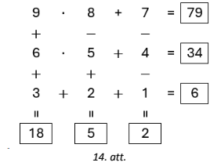
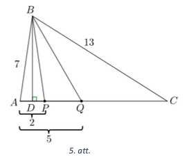

# <lo-sample/> LV.NOL.2024.5.1

Parādi vienu veidu, kādu ciparu var ierakstīt katrā aplītī, lai iegūtu patiesu vienādību, 
visi pieci ierakstītie cipari būtu dažādi un neviens no tiem nebūtu $2$.

<small>

* questionType:FindExample
* domain:NT

</small>

## Atrisinājums 

Der, piemēram, $23 \cdot 26=598$.  
*Piezīme.* Der arī $26 \cdot 29=754$.

# <lo-sample/> LV.NOL.2024.5.2

Uz rūtiņu lapas rūtinu krustpunktos atzīmēti $16$ punkti (skat. 1. att.). 
Kāds mazākais skaits punktu jānodzēš, lai nekādi trīs no atlikušajiem punktiem neatrastos uz vienas taisnes?

<small>

* questionType:FindOptimal
* domain:Geom
* method:PigeonholePrincipleBasic

</small>

## Atrisinājums 

Mazākais punktu, ko jānodzēš, skaits ir $8$, piemēram, skat. 2. att.

Pamatosim, ka mazāk punktu nodzēst nav iespējams. Katrā rindā ir jānodzēš vismaz divi punkti 
(citādi būs taisne, uz kuras atrodas trīs punkti), tātad kopā ir jānodzēš vismaz $8$ punkti.

# <lo-sample/> LV.NOL.2024.5.3

Dots kvadrāts ar izmēriem $6 \times 6$ rūtiṇas, kurā dažas rūtiṇas atzīmētas ar 
"$o$" un "$x$ " (skat. 3. att.). Parādi, kā šo kvadrātu sagriezt pa rūtiṇu līnijām 
četrās vienādās daļās tā, lai katra dạla saturētu vienu rūtiṇu, kurā ierakstīts "$o$", 
un vienu rūtiṇu, kurā ierakstīts "$x$"!

*Piezīme.* Figūras ir vienādas, ja tās var uzlikt vienu uz otras tā, ka abas figūras 
sakrīt (figūras var pagriezt un apmest otrādi).

<small>

* questionType:FindExample
* domain:Geom

</small>

## Atrisinājums 

Skat. 4. att.

# <lo-sample/> LV.NOL.2024.5.4

Rindā uzrakstīti $2024$ skaitli. Zināms, ka pirmais uzrakstītais skaitlis ir 
$41$ un katru nākamo var iegūt, iepriekšējā skaitļa visu ciparu reizinājumam 
pieskaitot $23$ (piemēram, otrais uzrakstītais skaitlis ir $27$, jo 
$4 \cdot 1+23=27$). Kāds ir pēdējais uzrakstītais skaitlis?

<small>

* questionType:FindExample
* domain:NT

</small>

## Atrisinājums 

Pēdējais skaitlis ir $29$. Aprēķinām pirmos dotās virknes skaitļus:

$$\underbrace{41 ; 27 ; 37 ; 44 ; 39 ; 50 ; 23 ; 29}; 41 ; 27 ; 37 ; \ldots$$

levērojam, ka, sākot ar 9. virknes locekli, skaitli sāk periodiski atkārtoties, perioda garums ir 8 skaitli. 
Tã kā $2024$ dalās ar $8$ ($2024: 8=253$), tad 2024. skaitlis būs tāds pats, kā 8. skaitlis, tātad $29$.

# <lo-sample/> LV.NOL.2024.5.5

Ja automātā iemet divus vienādus žetonus, tad tas izdod vienu zaļu žetonu, 
bet, ja iemet divus dažādus žetonus, tad tas izdod vienu dzeltenu žetonu. 
Sākumā Dagmārai bija $20$ dzelteni un $15$ zaḷi žetoni.
Vai iespējams, ka pēc atkārtotas automāta izmantošanas viṇai palika:   
**(A)** divi zaļi un viens dzeltens žetons,  
**(B)** divi dzelteni un viens zaļš žetons?

<small>

* questionType:ProveDisprove
* domain:Comb
* subdomain:FixedInvariant

</small>

## Atrisinājums 

**(A)** Nē, tas nav iespējams. levērosim, ka pēc katras darbības dzelteno žetonu skaits 
vai nu nemainās (tas notiek gadījumos, kad automātā iemet divus zalus žetonus 
vai vienu zalu un vienu dzeltenu žetonu) vai arī samazinās par $2$ 
(tas notiek, ja automātā iemet divus dzeltenus žetonus). 
Tā kā sākumā dzelteno žetonu skaits bija pāra skaitlis, 
tad arī pēc jebkuras darbības tas būs pāra skaitlis. 
Tātad nav iespējams, ka dzelteno žetonu skaits ir $1$ (kas ir nepāra skaitlis).

**(B)** Jā, ir iespējams. Dagmāra varēja rīkoties šādi: vispirms 9 reizes 
iemest automātā 2 dzeltenus žetonus (un saṇemt vienu zaļu), pēc 9 
šādām darbībām vinai paliktu $24$ zaļi žetoni un 2 dzelteni žetoni. 
Pēc tam 23 reizes jāiemet automātā 2 zaļus žetonus, katru reizi automāts atdotu 
$1$ zaļu žetonu, kā rezultātā zaļo žetonu skaits katrā reizē samazinātos par $1$. 
Tātad beigās viņai paliktu 2 dzelteni žetoni un 1 zaļš žetons.

# <lo-sample/> LV.NOL.2024.6.1

Parādi vienu veidu, kādu ciparu var ierakstīt katrā aplītī, lai iegūtu patiesu vienādību, 
visi seši ierakstītie cipari būtu dažādi un neviens no tiem nebūtu $3$.

<small>

* questionType:FindExample
* domain:NT

</small>

## Atrisinājums 

Der, piemēram, $34 \cdot 37=1258$.  
*Piezīme.* Der arī $37 \cdot 38=1406$.

# <lo-sample/> LV.NOL.2024.6.2

Kāds ir lielākais skaits 7. att. doto figūru, ko var izgriezt no 5.att. dotās figūras, 
ja jābūt izgrieztām arī tieši divām 6.att. figūrām?

<small>

* questionType:FindOptimal
* domain:Geom

</small>

## Atrisinājums 

Lielākais skaits figūru ir $14$, piemēram, skat. 8. att. Pamatosim, ka vairāk 7. att. figūru nevar izgriezt.

lekrāsojot 5. att. figūru šaha galdiṇa veidā, iegūstam $33$ pelēkas rūtiṇas un $36$ 
baltas rūtinas (skat. 9. att.). Lai kā izgrieztu 6. att. un 7. att. dotās figūras, 
tās vienmēr noklāj tieši 2 pelēkas rūtiṇas (skat. 10. att.). Tas nozīmē, ka no 
5. att. dotās figūras var izgriezt ne vairāk kā 16 figūras, jo 17 figūras noklātu 
jau $17 \cdot 2=34$ pelēkās rūtiṇas. Tā kā jāizgriež divas 6. att. figūras, 
tad 7. att. figūras var izgriezt ne vairāk kā $14$.

# <lo-sample/> LV.NOL.2024.6.3

Dots kvadrāts ar izmēriem $6 \times 6$ rūtiṇas, kurā dažas rūtinas atzīmētas ar 
"$o$" un " $x$ " (skat. 11. att.). Parādi, kā šo kvadrātu sagriezt pa rūtiṇu 
līnijām četrās vienādās dalās tā, lai katra daḷa saturētu vienu rūtiṇu, 
kurā ierakstīts "$o$", un vienu rūtinu, kurā ierakstīts "$x$"!

*Piezīme.* Figūras ir vienādas, ja tās var uzlikt vienu uz otras tā, 
ka abas figūras sakrīt (figūras var pagriezt un apmest otrādi).

<small>

* questionType:FindExample
* domain:Geom

</small>

## Atrisinājums 

Skat. 12. att.

# <lo-sample/> LV.NOL.2024.6.4

Rindā uzrakstīti $2024$ skaitli. Zināms, ka pirmais uzrakstītais skaitlis ir $49$ 
un katru nākamo var iegūt, iepriekšējā skaiț̣a visu ciparu reizinājumam pieskaitot 
$19$ (piemēram, otrais uzrakstītais skaitlis ir $55$, jo $4 \cdot 9+19=55$). 
Kāds ir pēdējais uzrakstītais skaitlis?

<small>

* questionType:FindExample
* domain:NT

</small>

## Atrisinājums 

Pēdējais uzrakstītais skaitlis ir $37$. Aprēkinām pirmos dotās virknes skaitļus:

$$49; 55; 44; \underbrace{35; 34; 31; 22; 23; 25; 29; 37; 40; 19; 28}; 35; 34; 31; \ldots$$

Ievērojam, ka, sākot ar 15. virknes locekli, skaitļi sāk periodiski atkārtoties, perioda garums ir $11$. 
Tā kā $2024$ dalās ar $11$ ($2024=11 \cdot 184$), tad 2024. skaitlis būs tāds pats, kā 11. skaitlis, tātad $37$.

*Piezīme.* Var arī spriest, ka meklē virknes, kas sākas ar skaitli 
$35$ (noņemot dotās virknes pirmos trīs skait|us), pēdējo skaitli. 
Tādā gadījumā $2021:11=183$, atlikums $8$, tāpēc meklētais skaitlis ir perioda 8. skaitlis un tas ir $37$.

# <lo-sample/> LV.NOL.2024.6.5

Vai var uzzīmēt tādu slēgtu lauztu līniju no **(A)** $6$ posmiem, **(B)** $7$ posmiem, 
kas katru savu posmu krusto tieši vienu reizi?

*Piezīme.* Par lauztu līniju sauc līniju, kas sastāv no galīga skaita taisnes nogriežṇiem, 
ko sauc par posmiem. Lauztu līniju, kuras galapunkti sakrīt, sauc par slēgtu lauztu līniju.

<small>

* questionType:ProveDisprove
* domain:Geom
* subdomain:FixedInvariant

</small>

## Atrisinājums 

**(A)** Jā, var, piemēram, skat. 13. att.

**(B)** Nē, nevar. levērosim, ka šādas lauztās līnijas posmus var sadalīt pa pāriem, 
katrā pāri saliekot divus posmus, kas krustojas. Tātad šādas lauztas līnijas posmu skaitam 
jābūt pāra skaitlim, bet $7$ ir nepāra skaitlis.

# <lo-sample/> LV.NOL.2024.7.1

Katrā tukšajā aplîtī ierakstīt vienu darbību zīmi ($+$,$-$,$\cdot$,$:$) tā, 
lai taisnstūros iegūtās izteiksmju vērtības būtu naturāli skaiți 
un visas sešas kopā saturētu visus ciparus no $1$ līdz $9$, 
katru ciparu tieši vienu reizi! (Iekavas lietot nedrīkst un jāievēro darbību secība.)

<small>

* questionType:FindExample
* domain:NT

</small>

## Atrisinājums 

Skat. 14. att.

# <lo-sample/> LV.NOL.2024.7.2

Kāda lielākā ciparu summa var būt desmitciparu skaitlim, kas dalās ar $18$?

<small>

* questionType:FindOptimal
* domain:NT

</small>

## Atrisinājums 

Lielākā iespējamā ciparu summa ir $81$. Tāda ir, piemēram, skaitlim $9999999990$, tas dalās, 
gan ar $9$, gan ar $2$, tātad tas dalās arī ar $9 \cdot 2=18$.

Pamatosim, ka lielāka ciparu summa nav iespējama. Lai skaitlis dalītos ar $18$, 
tam jādalās arī ar $9$, tātad tā ciparu summai jādalās ar $9$. 
Lielākā iespējamā desmitciparu skaitla ciparu summa ir $9 \cdot 10=90$. 
Tāda ciparu summa ir tikai skaitlim $9999999999$, tomēr tas nedalās ar $18$. 
Nākamā lielākā iespējamā ciparu summa ir $90-9=81$ (kas dalās ar $9$), 
tātad tā ir meklētā ciparu summa.

# <lo-sample/> LV.NOL.2024.7.3

Plaknē atlikti četri punkti $A, B, C, D$. Zināms, ka $AB=4$, $BC=7$, $CD=10$ un $DA=3$. 
Kāds var būt nogriežņa $AC$ garums, ja zināms, ka tas ir naturāls skaitlis?

<small>

* questionType:FindAll
* domain:Geom

</small>

## Atrisinājums 

No trijstūra nevienādības $\triangle ABC$ un $\triangle ADC$ 
(pieļaujot, ka punkti atrodas arī uz vienas taisnes) attiecīgi iegūstam:

\begin{itemize}
\item $AC \leq AB+BC=4+7=11$ un $AC \geq BC-AB=7-4=3$;
\item $AC \leq AD+DC=3+10=13$ un $AC \geq CD-AD=10-3=7$.
\end{itemize}

Tātad $AC \geq 7$ un $AC \leq 11$. 
Šiem nosacijumiem atbilst naturālie skaiț̣i $7$; $8$; $9$; $10$ un $11$.

Tã kā dotajiem nogriežṇu garumiem un nogriežṇu garumiem $8$; $9$; $10$ 
izpildās trijstūra nevienādības nosacījumi, tad šādas $AC$ vērtības ir iespējamas. 
Nogriežṇa $A C$ garums var būt $11$, 
tad punkti $A, B, C$ atrodas uz vienas taisnes (tieši šādā secībā),
bet punkts $D$ neatrodas uz šīs taisnes ($\triangle ADC$ eksistē, jo tā malu garumiem 
izpildās trijstūra nevienādība). Nogriežṇa $AC$ garums var būt $7$, 
tad punkti $C,A,D$ atrodas uz vienas taisnes (tieši šādā secībā), 
bet punkts $B$ neatrodas uz šîs taisnes ($\triangle ABC$ eksistē, jo tā malu garumiem 
izpildās trijstūra nevienādība).

# <lo-sample/> LV.NOL.2024.7.4

No 15. att. un 16. att. figūrām, katru izmantojot vismaz vienu reizi, 
salikt taisnstūri, kurā 16. att. figūras nesaskaras ne ar malu, ne ar stūri! Figūras drīkst pagriezt.

<small>

* questionType:FindExample
* domain:Geom

</small>

## Atrisinājums 

Skat., piemēram, 17. att.

# <lo-sample/> LV.NOL.2024.7.5

Konditorejā nopērkamas $10$ tortes, to cena ir attiecīgi 
$20$; $21$; $22$; $23$; $24$; $25$; $26$; $27$; $28$; $29$ eiro 
(katra torte ir tieši vienā eksemplārā). Konditorejā viens pēc otra iegriezās $3$ gardēži, 
katrs no tiem nopirka sev dažas tortes, turklāt katrs iztērēja ne vairāk kā $85$ eiro. 
Pierādīt, ka pēc gardēžu apmeklējuma vismaz viena torte vēl palika nenopirkta!

<small>

* questionType:Prove
* domain:Comb
* topic:LinearOptimization
* method:ExtremeElements
* method:PigeonholePrincipleBasic

</small>

## Atrisinājums 

levērosim, ka katrs gardēdis varēja nopirkt ne vairāk kā 3 tortes, jo pat 
$4$ vislētākās tortes kopā maksā 86 eiro $(20+21+22+23=86)$. Tātad visi trīs gardēži 
kopā varēja nopirkt ne vairāk kā $3 \cdot 3 = 9$ tortes, tātad vismaz viena torte palika nenopirkta.

## Atrisinājums 

Pienemsim pretējo, ka trīs gardēži kopā nopirkuši visas tortes. 
Tad pēc Dirihlē principa var atrast gardēdi, kurš ir nopircis vismaz $4$ tortes. 
Bet pat 4 vislētākās tortes kopā maksā $20+21+22+23=86$, kas ir vairāk nekā 
katrs gardēdis ir iztērējis ($85$ eiro). Tātad kopā nopirka ne vairāk kā $3 \cdot 3=9$ tortes, 
līdz ar to vismaz viena torte palika nenopirkta.

# <lo-sample/> LV.NOL.2024.8.1

Vai iespējams, sareizinot sešus dažādus pirmskaiț̣us, iegūt sešciparu skaitli, kam visi cipari ir vienādi?

<small>

* questionType:ProveDisprove
* domain:NT

</small>

## Atrisinājums 

Jā, var, piemēram, der sešciparu skaitlis $222222=2 \cdot 3 \cdot 37 \cdot 7 \cdot 11 \cdot 13$.

*Piezīme.* Der arī skaitlis $555555=5 \cdot 3 \cdot 37 \cdot 7 \cdot 11 \cdot 13$.

# <lo-sample/> LV.NOL.2024.8.2

Vienādsānu trijstūrī $ABC$ ($AB=AC$) uz malām $BC$ un $AC$ atlikti attiecīgi punkti 
$D$ un $E$ tā, lai $AE=AD$ un $\sphericalangle BAD=30^{\circ}$. Aprēk̄ināt leṇki $CDE$.

<small>

* questionType:FindExample
* domain:Geom

</small>

## Atrisinājums 

Tā kā $AB=AC$, tad $\sphericalangle B=\sphericalangle C=\alpha$ (skat. 18. att.). 
No trijstūra $ABC$ iekšējo leṇku summas iegūstam, ka 
$\sphericalangle BAC=180^{\circ}-2 \cdot \sphericalangle B=180^{\circ}-2 \alpha$. 
Tātad 
$$\sphericalangle DAE=\sphericalangle BAC-\sphericalangle BAD=180^{\circ}-2 \alpha-30^{\circ}=150^{\circ}-2 \alpha.$$ 

Tā kā $AD=AE$, tad trijstūris $ADE$ ir vienādsānu un 
$$\sphericalangle ADE = \sphericalangle AED=\left(180^{\circ}-\sphericalangle DAE \right): 2=\left(180^{\circ}-\left(150^{\circ}-2 \alpha\right)\right): 2=15^{\circ}+\alpha.$$ 

Ievērojam, ka 
$$\sphericalangle DEC=180^{\circ}-\sphericalangle AED=180^{\circ}-\left(15^{\circ}+\alpha\right)=165^{\circ}-\alpha.$$ 
Izmantojot trijstūra iekšējo leņķu summu $\triangle DEC$, iegūstam, ka 
$$\sphericalangle CDE=180^{\circ}-\sphericalangle DEC-\sphericalangle ECD=180^{\circ}-\left(165^{\circ}-\alpha\right)-\alpha=15^{\circ}.$$

# <lo-sample/> LV.NOL.2024.8.3

Uz rūtiṇu lapas rūtịnu krustpunktos atzīmēti $25$ punkti (skat. 19. att.). 
Kāds mazākais skaits punktu jānodzēš, lai nekādi trīs no atlikušajiem punktiem neatrastos uz vienas taisnes?

*Piezīme.* Ievēro, ka uz vienas taisnes atrodas ne tikai punkti, kas atrodas vienā rindā, 
kolonnā vai diagonālē, bet arī, piemēram, punkti $A, B, C$ (skat. 20. att.)!

<small>

* questionType:FindOptimal
* domain:Comb
* method:PigeonholePrincipleBasic

</small>

## Atrisinājums 

Mazākais punktu, ko jānodzēš, skaits ir $15$, piemēram, skat. 21. att.

Pamatosim, ka mazāk punktu nodzēst nav iespējams. Katrā rindā ir jānodzēš vismaz 
trīs punkti (citādi būs taisne, uz kuras atrodas trīs punkti), tātad kopā ir jānodzēš vismaz $15$ punkti.

# <lo-sample/> LV.NOL.2024.8.4

Konditorejā nopērkamas $16$ tortes, to cena ir attiecīgi $30; 31; 32; \ldots; 45$ eiro 
(katra torte ir tieši vienā eksemplārā). Konditorejā viens pēc otra iegriezās $5$ gardēži, 
katrs no tiem nopirka sev dažas tortes, turklāt katrs iztērēja ne vairāk kā $125$ eiro. 
Pierādīt, ka pēc gardēžu apmeklējuma vismaz viena torte vēl palika nenopirkta!

<small>

* questionType:Prove
* domain:Comb
* method:ExtremeElements
* method:PigeonholePrincipleBasic

</small>

## Atrisinājums 

Ievērosim, ka katrs gardēdis varēja nopirkt ne vairāk kā $3$ tortes, 
jo pat $4$ vislētākās tortes kopā maksā $126$ eiro $(30+31+32+33=126)$. 
Tātad visi trīs gardēži kopā varēja nopirkt ne vairāk kā $3 \cdot 5 = 15$ tortes, 
tātad vismaz viena torte palika nenopirkta.

## Atrisinājums 

Pien̦msim pretējo, ka trīs gardēži kopā nopirkuši visas tortes. 
Tā kā $16=5 \cdot 3+1$, tad pēc Dirihlē principa var atrast gardēdi, 
kurš ir nopircis vismaz $4$ tortes. Bet pat 4 vislētākās tortes kopā maksā 
$30+31+32+33=126$, kas ir vairāk nekā katrs gardēdis ir iztērējis ($125$ eiro). 
Tātad kopā nopirka ne vairāk kā $3 \cdot 5=15$ tortes, lî̀z ar to vismaz viena torte palika nenopirkta.

# <lo-sample/> LV.NOL.2024.8.5

Vai **(A)** 22. att., **(B)** 23. att. dotā kvadrāta rūtiṇās var ierakstīt 
deviṇus dažādus naturālus skaitlus tā, lai katrā rūtiņā būtu ierakstīts 
viens skaitlis un katrā rindā un katrā kolonnā skaitli pieaugtu bultiņas norādītajā virzienā?

<small>

* questionType:ProveDisprove
* domain:Comb
* method:ContradictionForExistence

</small>

## Atrisinājums 

**(A)** Jā, var, piemēram, skat. 24. att.

**(B)**  Nē, nevar. Aplūkosim rūtiṇas $B1$, $B2$, $B3$, $B4$ (skat. 25. att.). 
Ņemot vērā bultiņu virzienu, skaițliem jābūt sakārtotiem šādi: 
$B1 < B2 < B3 < B4 < B1$. Tā kā skaitlis nevar būt mazāks pats par sevi, 
tad šāds skaitļu izvietojums nav iespējams.

# <lo-sample/> LV.NOL.2024.9.1

Dots izliekts četrstūris $K L M N$. Zināms, ka $\sphericalangle LKN = \sphericalangle MNK$ 
un malu $K L$ un $M N$ vidusperpendikulu krustpunkts $X$ atrodas uz malas $K N$. Pierādīt, ka $K M=L N$!

<small>

* questionType:Prove
* domain:Geom

</small>

## Atrisinājums

Pēc vidusperpendikula īpašības iegūstam, ka $XK=XL$ un $XN=XM$, 
tātad $\triangle KXL$ un $\triangle MXN$ ir vienādsānu trijstūri un to pamata pieleṇịi ir vienādi, tas ir, $\sphericalangle X K L=\sphericalangle X L K$ un $\sphericalangle X M N=\sphericalangle X N M$ (skat. 1. att.).

Ievērojam, $\quad$ ka $\quad \sphericalangle K X L=180^{\circ}-2 \sphericalangle X K L=180^{\circ}-2 \sphericalangle X N M=\sphericalangle M X N$. Tātad $\quad \sphericalangle K X M=\sphericalangle K X L+\sphericalangle L X M=$ $=\sphericalangle M X N+\sphericalangle L X M=\sphericalangle L X N$ un $\Delta K X M=\Delta L X N$ pēc pazīmes $m l m:$

* $KX=LX$;
* $\sphericalangle KXM=\sphericalangle LXN$;
* $XM=XN$.

Tātad $KM=LN$ kā atbilstošās malas vienādos trijstūros.

# <lo-sample/> LV.NOL.2024.9.2

Pierādīt, ka $\sqrt{17-12 \sqrt{2}}+\sqrt{3-2 \sqrt{2}}+\sqrt{3+2 \sqrt{2}}=3$.

<small>

* questionType:Prove
* domain:Alg
* method:PolynomialTransformations

</small>

## Atrisinājums

Katru zemsaknes izteiksmi izteiksim kā summas vai starpības kvadrātu un veiksim ekvivalentus pārveidojumus:

$$\begin{gathered}
\sqrt{17-12 \sqrt{2}}+\sqrt{3-2 \sqrt{2}}+\sqrt{3+2 \sqrt{2}}= \\
=\sqrt{3^{2}-2 \cdot 3 \cdot 2 \sqrt{2}+(2 \sqrt{2})^{2}}+\sqrt{(\sqrt{2})^{2}-2 \cdot \sqrt{2} \cdot 1+1^{2}}+\sqrt{(\sqrt{2})^{2}+2 \cdot \sqrt{2} \cdot 1+1^{2}}= \\
=\sqrt{(3-2 \sqrt{2})^{2}}+\sqrt{(\sqrt{2}-1)^{2}}+\sqrt{(\sqrt{2}+1)^{2}}=|3-2 \sqrt{2}|+|\sqrt{2}-1|+|\sqrt{2}+1|= \\
=3-2 \sqrt{2}+\sqrt{2}-1+\sqrt{2}+1=3 .
\end{gathered}$$

## Atrisinājums

Veicam ekvivalentus pārveidojumus:

$$\begin{aligned}
& \sqrt{17-12 \sqrt{2}}+\sqrt{3-2 \sqrt{2}}+\sqrt{3+2 \sqrt{2}}=3 \\
& \sqrt{3-2 \sqrt{2}}+\sqrt{3+2 \sqrt{2}}=3-\sqrt{17-12 \sqrt{2}}
\end{aligned}$$

levērojam, ka $\sqrt{17-12 \sqrt{2}}<\sqrt{9}$, tāpēc vienādības labās puses izteiksmes vērtība ir pozitīva, un varam kāpināt kvadrātā abas vienādības puses, pēc tam veicam ekvivalentus pārveidojumus:

$$\begin{gathered}
(\sqrt{3-2 \sqrt{2}}+\sqrt{3+2 \sqrt{2}})^{2}=(3-\sqrt{17-12 \sqrt{2}})^{2} ; \\
3-2 \sqrt{2}+2 \sqrt{(3-2 \sqrt{2})(3+2 \sqrt{2})}+3+2 \sqrt{2}=9-6 \sqrt{17-12 \sqrt{2}}+17-12 \sqrt{2} ; \\
3-2 \sqrt{2}+2 \sqrt{9-8}+3+2 \sqrt{2}=9-6 \sqrt{17-12 \sqrt{2}}+17-12 \sqrt{2} ; \\
6 \sqrt{17-12 \sqrt{2}}=18-12 \sqrt{2} .
\end{gathered}$$

Ievērojam, ka $12 \sqrt{2}<18$, tāpēc abas vienādības puses ir pozitīvas un varam tās kāpināt kvadrātā, pēc tam veicam ekvivalentus pārveidojumus:

$$\begin{gathered}
(6 \sqrt{17-12 \sqrt{2}})^{2}=(18-12 \sqrt{2})^{2} ; \\
36 \cdot(17-12 \sqrt{2})=324-18 \cdot 24 \sqrt{2}+288 ; \\
612-36 \cdot 12 \sqrt{2}=612-18 \cdot 24 \sqrt{2} ; \\
3 \cdot 12 \cdot 12 \sqrt{2}=3 \cdot 6 \cdot 2 \cdot 12 \sqrt{2} .
\end{gathered}$$

Tā kā tika veikti ekvivalenti pārveidojumi un iegūta patiesa vienādība, tad arī dotā vienādība ir patiesa.

# <lo-sample/> LV.NOL.2024.9.3

Uz kvadrāta $ABCD$ diagonāles $BD$ atlikts punkts $E$. Pierādīt, ka $ED \cdot EB + EA \cdot EC = AB^{2}$!

<small>

* questionType:Prove
* domain:Geom
* method:AugmentationWithNewElements

</small>

## Atrisinājums

Apzīmējam diagonālu krustpunktu ar $O$; apzīmējam $BD=d$ un $OE=x$. 
Diagonāle $B D$ ir kvadrāta simetrijas ass, tāpēc $EA = EC$ (skat. 2. att.).

Kvadrāta diagonāles ir perpendikulāras un krustpunktā dalās uz pusēm, tāpēc trijstūris $A O E$ ir taisnleṇķa trijstūris, kurā pēc Pitagora teorēmas iegūstam, ka $E A^{2}=A O^{2}+O E^{2}=\left(\frac{d}{2}\right)^{2}+x^{2}$. Tādā gadījumā iegūstam:

$$\begin{gathered}
E D \cdot E B+E A \cdot E C=(O D-O E)(O B+O E)+E A^{2}= \\
=\left(\frac{d}{2}-x\right)\left(\frac{d}{2}+x\right)+\left(\frac{d}{2}\right)^{2}+x^{2}=\left(\frac{d}{2}\right)^{2}-x^{2}+\left(\frac{d}{2}\right)^{2}+x^{2}=2 \cdot \frac{d^{2}}{4}=\frac{d^{2}}{2} .
\end{gathered}$$

Izmantojot Pitagora teorēmu vienādsānu taisnleṇķa trijstūrī $ABD$, iegūstam, ka $A B^{2}+A D^{2}=B D^{2}$. Tā kā 
$AB=AD$, tad $2AB^{2}=d^{2}$ jeb $AB^{2}=\frac{d^{2}}{2}$.

Līdz ar to esam ieguvuši, ka $ED \cdot EB+EA \cdot EC=\frac{d^{2}}{2}=AB^{2}$.

# <lo-sample/> LV.NOL.2024.9.4

Taisnstūrī ar izmēriem $4 \times 6$ rūtinas sākotnēji katrā rūtịnā atradās tieši viens kaķis. 
Vienā brīdī katrs kaķis pārlēca uz kādu no blakus rūtiṇām (katrs kaķis pārlēca tieši vienu reizi). 
Vai var gadīties, ka tagad visi kaķi atrodas tieši: **(A)** $8$ rūtiņās; **(B)** $7$ rūtiṇās?

*Piezīme.* Divas rūtiņas sauc par blakus rūtiņām, ja tām ir kopīga mala.

<small>

* questionType:ProveDisprove
* domain:Comb

</small>

## Atrisinājums

**(A)** Jā, var, piemēram, skat. 3. att., kur visi kaķi atrodas pelēkajās rūtiṇās 
(katrs kaķis no baltās rūtiṇas varēja pārlēkt uz kādu pelēko rūtịnu, 
un kaķi, kas sākumā atradās kādā no pelēkajām rūtiṇām, pārlēca uz blakus esošo pelēko rūtiņu).

*Piezīme.* Der arī piemērs, kur kaķi pārlec uz otrās un piektās kolonnas rūtiṇām.

**(B)** Nē, nevar. Pierādīsim, ka kaķi tagad atrodas vismaz $8$ rūtiṇās.

Aplūkojam tos $8$ kaķus, kas sākumā atradās 3. att. 
iekrāsotajās rūtiṇās, un ievērosim, ka nekādi divi no tiem pēc pārlēkšanas 
nevar atrasties vienā un tajā pašā rūtiņā. Lai divi kaķi 
no pelēkajām rūtiṇām varētu nonākt vienā un tajā pašā rūtiņā, būtu jābūt 
tādai rūtiṇai, kurai divas blakus rūtiṇas ir pelēkā krāsā, bet tādas rūtiṇas nav. 
Tātad pēc pārlēkšanas kaķi atradīsies vismaz $8$ rūtiņās.

# <lo-sample/> LV.NOL.2024.9.5

Dots naturāls skaitlis, kura cipari ir sakārtoti augošā secībā (katrs cipars, 
izṇemot pirmo, ir lielāks nekā tā kaimiṇš kreisajā pusē). 
Pierādīt, ka $9$ reizes lielāka skaitļa ciparu summa ir $9$.

<small>

* questionType:Prove
* domain:NT

</small>

## Atrisinājums

Ievērojam, ka $9 x=10 x-x=\overline{x 0}-x$. Apzīmējam $x=\overline{a_{1} a_{2} \cdots a_{n-1} a_{n}}$ un aplūkojam skait!a $9 x=\overline{x 0}-x$ ciparus, ievērojot, ka ciparu virkne ir augoša:

Aplūkojot skaiț̣a $9x$ ciparu summu, iegūstam prasīto:

$$a_{1}+\left(a_{2}-a_{1}\right)+\left(a_{3}-a_{2}\right)+\cdots+\left(a_{n-1}-a_{n-2}\right)+\left(a_{n}-a_{n-1}-1\right)+10-a_{n}=9.$$

# <lo-sample/> LV.NOL.2024.10.1

Dotas divas riṇka līnijas $\omega_{1}$ un $\omega_{2}$, kas krustojas punktos 
$X$ un $Y$. Taisne $t_{1}$, kas vilkta caur $X$, krusto $\omega_{1}$ un $\omega_{2}$ 
attiecīgi punktos $A$ un $B$ (punkts $X$ atrodas starp $A$ un $B$), 
savukārt taisne $t_{2}$, kas vilkta caur $Y$, krusto $\omega_{1}$ un $\omega_{2}$ 
attiecīgi punktos $C$ un $D$ (punkts $Y$ atrodas starp $C$ un $D$). 
Pierādīt, ka $AC$ ir paralēla ar $BD$!

<small>

* questionType:Prove
* domain:Geom
* subdomain:

</small>

## Atrisinājums

Apzīmējam $\sphericalangle ACY = \alpha$ (skat. 4. att.). 
Tā kā četrstūris $CAXY$ ir ievilkts četrstūris, tad tā pretējo lenku summa ir 
$180^{\circ}$, tātad $\sphericalangle A X Y=180^{\circ}-\alpha$. 
Ievērojam, ka $\sphericalangle B X Y=180^{\circ}-\sphericalangle A X Y=\alpha$ (blakusleṇku īpašība). 
Tā kā četrstūris $BDYX$ ir ievilkts četrstūris, tad tā pretējo leṇ̂u summa ir $180^{\circ}$. 
Tātad $\sphericalangle BDY=180^{\circ}-\sphericalangle BXY=180^{\circ}-\alpha$. Tā kā $\sphericalangle ACY+\sphericalangle BDY=\alpha+180^{\circ}-\alpha=180^{\circ}$ un tie ir iekšējie vienpusleṇki pie taisnēm $A C$ un $B D$, kuras krusto taisne $t_{2}$, tad $AC \| BD$.

# <lo-sample/> LV.NOL.2024.10.2

Doti reāli skaiții $x$ un $y$, kuriem $xy^{3}+1=x+y^{3}$. Pierādīt, ka $y x^{3}+1=y+x^{3}$.

<small>

* questionType:Prove
* domain:Alg
* method:PolynomialTransformations

</small>

## Atrisinājums

Veicam ekvivalentus pārveidojumus un sadalām vienādības kreiso pusi reizinātājos:

$$
\begin{gathered}
x y^{3}+1-x-y^{3}=0 \\
x\left(y^{3}-1\right)-\left(y^{3}-1\right)=0 ; \\
\left(y^{3}-1\right)(x-1)=0 .
\end{gathered}
$$

Tā kā reizinājums ir vienāds ar 0 , tad $y^{3}-1=0$ vai $x-1=0$ jeb $y=1$ vai $x=1$. Apskatām abus gadījumus:

* Ja $y=1$, tad vienādība $y x^{3}+1=y+x^{3}$ ir patiesa, jo $x^{3}+1=1+x^{3}$; 
* Ja $x=1$, tad vienādība $y x^{3}+1=y+x^{3}$ ir patiesa, jo $y+1=y+1$.

# <lo-sample/> LV.NOL.2024.10.3

Šaurleņķu trijstūra $ABC$ malu garumi ir $AB=7 \mathrm{~cm}$, $AC=12 \mathrm{~cm}$ 
un $BC=13 \mathrm{~cm}$. Pierādīt, ka uz malas $AC$ var atrast tādus divus 
iekšējus punktus $P$ un $Q$, ka nogriežnu $AP, AQ, BP$ un $BQ$ garumi ir izsakāmi veselā skaitā centimetru! 

<small>

* questionType:Prove
* domain:Geom
* method:AugmentationWithNewElements

</small>

## Atrisinājums

Punkti $P$ un $Q$ jāatliek tā, ka $A P=2 \mathrm{~cm}$ un $A Q=5 \mathrm{~cm}$ (skat. 5. att.). 
Parādīsim, ka šādā gadījumā $BP=7 \mathrm{~cm}$ un $B Q=8 \mathrm{~cm}$.

Pret malu $AC$ novelkam augstumu $BD$. Izmantojot Pitagora teorēmu trijstūros 
$BDA$ un $BDC$, iegūstam, ka $AB^{2}-AD^{2}=BD^{2}=BC^{2}-DC^{2}$. 
Tā kā $AC=12 \mathrm{~cm}$, tad varam izteikt, ka $CD=12-AD$. Lîdz ar to iegūstam, ka

$$\begin{gathered}
7^{2}-A D^{2}=13^{2}-(12-A D)^{2} \\
49-A D^{2}=169-\left(144-24 A D+A D^{2}\right) \\
24 A D=24 \quad \Rightarrow \quad A D=1 \mathrm{~cm}
\end{gathered}$$

Izmantojot Pitagora teorēmu trijstūrī $ADB$, iegūstam, ka $BD^{2}=AB^{2}-AD^{2}=48$.

Tā kā $D P=A P-A D=2-1=1 \mathrm{~cm}$, tad pēc Pitagora teorēmas $\triangle BDP$ 
iegūstam, ka $BP=\sqrt{BD^{2} + DP^{2}} = \sqrt{48+1}=7 \mathrm{~cm}$.

Tā kā $D Q=A Q-A D=5-1=4 \mathrm{~cm}$, tad pēc Pitagora teorēmas $\triangle BDQ$ iegūstam, ka 
$BQ = \sqrt{BD^{2}+DQ^{2}} = \sqrt{48+16} = 8 \mathrm{~cm}$.

*Piezīmes*

1. Augstumu $B D$ var aprēkināt arī, izmantojot trijstūra laukumu (pēc Hērona formulas).
2. Vajadzīgos punktus var iegūt, mēǵinot kombinēt dažādus malu garumus, lai iegūtu, ka hipotenūzas garums ir vesels skaitlis.

# <lo-sample/> LV.NOL.2024.10.4

Atrast visus tādus veselu skaitlu pārus $(a ; b)$, kuriem izpildās vienādība $(a+b)^{2}=a^{3}+b^{3}$.

<small>

* questionType:FindAll
* domain:NT
* method:PolynomialTransformations

</small>

## Atrisinājums

Sadalām vienādības labo pusi reizinātājos:

$$(a+b)^{2}=(a+b)\left(a^{2}-a b+b^{2}\right)$$

Ievērojam, ka jebkuram skaitlu pārim $(a ; b)$, kuram $a+b=0$, dotā vienādība ir identitāte, 
jo tad abas puses ir vienādas ar $0$. Tātad der skait!u pāri $(k ;-k)$, kur $k$ ir vesels skaitlis.

Apskatām gadījumu, kad $a+b \neq 0$. Dotās vienādības abas puses dalām ar izteiksmi $a+b \neq 0$ un iegūstam:

$$a+b=a^{2}-a b+b^{2}$$

Veicot ekvivalentus pārveidojumus, iegūstam:

$$\begin{gathered}
a^{2}-a-a b+b^{2}-b=0 \\
2 a^{2}-2 a-2 a b+2 b^{2}-2 b=0 \\
\left(a^{2}-2 a b+b^{2}\right)+a^{2}-2 a+b^{2}-2 b=0 \\
(a-b)^{2}+\left(a^{2}-2 a+1\right)+\left(b^{2}-2 b+1\right)-2=0 \\
(a-b)^{2}+(a-1)^{2}+(b-1)^{2}=2
\end{gathered}$$

Tā kā $a$ un $b$ ir veseli skaiț̣i, tad vienīgais veids, kā trīs veselu skaitlu kvadrātu summai iegūt vērtību 2, ir, ja viens saskaitāmais ir 0 , bet atlikušie divi ir 1 . Apskatām visus gadījumus.

* Ja $a-b=0$ jeb $a=b$, tad pārējiem saskaitāmajiem jābūt vienādiem ar $1$, 
  tātad $a-1=b-1=1$ vai arī $a-1=b-1=-1$ (šis gadījums neder, jo $a+b \neq 0$ ). 
  Tātad $a=b=2$ jeb der skaitlu pāris $(2;2)$.
* Ja $a-1=0$ jeb $a=1$, tad $(1-b)^{2}+(b-1)^{2}=2(b-1)^{2}=2$ jeb $b=0$ vai $b=2$, 
  līdz ar to iegūstam divus atrisinājumus $(1 ; 0)$ un $(1 ; 2)$.
* Gadījums, kad $b-1=0$, ir simetrisks iepriekšējam, tad secinām, ka der arī 
  skait|u pāri $(2 ; 1)$ un $(0 ; 1)$. 

Līdz ar to esam ieguvuši, ka derīgie skaitlu pāri ir: 
$(1 ; 0),(1 ; 2),(0 ; 1),(2 ; 1),(2 ; 2)$ un $(k ;-k)$, kur $k$ ir vesels skaitlis. 
Piezīme. Vienādojumu $a+b=a^{2}-a b+b^{2}$ var risināt arī kā kvadrātvienādojumu 
$a^{2}-(b+1) a+b^{2}-b=0$ attiecībā pret nezināmo $a$, tad $D=-3 b^{2}+6 b+1$, 
kuram ir reālas saknes, ja $D \geq 0$ jeb $b \in\left[\frac{3-2 \sqrt{3}}{3} ; \frac{3+2 \sqrt{3}}{3}\right]$. Pārbauda veselās $b$ vērtības, kas atrodas atbilstošajā intervālā, tās ir $0 ; 1 ; 2$.

# <lo-sample/> LV.NOL.2024.10.5

Taisnstūrī ar izmēriem $8 \times 10$ rūtiṇas sākotnēji katrā rūtināa atradās tieši viena varde. 
Vienā brīdī katra varde pārlēca uz kādu no blakus rūtinām (katra varde pārlēca tieši vienu reizi). 
Vai var gadīties, ka tagad visas vardes atrodas tieši: **(A)** $24$ rūtiņās; **(B)** $23$ rūtiṇās?  
*Piezīme.* Divas rūtiṇas sauc par blakus rūtiṇām, ja tām ir kopīga mala.

<small>

* questionType:ProveDisprove
* domain:Comb

</small>

## Atrisinājums

**(A)** Jā, var, piemēram, skat. 6. att., kur visas vardes ir nonākušas pelēkajās rūtiṇās (katra varde no baltās rūtiṇas varēja pārlēkt uz kādu pelēko rūtiṇu, un vardes, kas sākumā atradās kādā no pelēkajām rūtinām, pārlēca uz blakus esošo pelēko rūtinu).

**(B)** Nē, nevar. Pierādīsim, ka vardes atrodas vismaz 24 rūtiṇās.

Aplūkosim tās 24 vardes, kas sākumā atradās 6. att. iekrāsotajās rūtiṇās, un ievērosim, ka nekādas divas no tām pēc pārlēkšanas nevar atrasties vienā un tajā pašā rūtinā. Lai divas vardes no pelēkajām rūtiṇām varētu nonākt vienā un tajā pašā rūtiṇā, būtu jābūt tādai rūtịnai, kurai divas blakus rūtị̣as ir pelēkā krāsā, bet tādas rūtinas nav. Tātad pēc pārlēkšanas vardes atradīsies vismaz 24 rūtiṇās.

# <lo-sample/> LV.NOL.2024.11.1

No punkta $A$, kas atrodas ārpus riṇķa līnijas ar centru $O$, novilktas divas pieskares, 
kas pieskaras riṇka līnijai punktos $D$ un $E$. Uz taisnēm $AD$ un $AE$ atlikti attiecīgi 
punkti $B$ un $C$ tā, ka punkts $D$ atrodas starp $A$ un $B$, punkts $C$ atrodas starp 
$A$ un $E$ un $OB = OC$. Pierādīt, ka punkti $O$, $A$, $B$ un $C$ atrodas uz vienas rinkta līnijas!

<small>

* questionType:Prove
* domain:Geom

</small>

## Atrisinājums

Tā kā $OD=OE$ (rādiusi) un $OB=OC$ (dots), tad abi taisnleṇķa trijstūri $OBD$ un $OCE$ 
ir vienādi pēc pazīmes $hk$, tātad to atbilstošie leṇķi ir vienādi: 
$\sphericalangle OBD=\sphericalangle OCE$ (skat. 7. att.). 
Ievērosim, ka pēc blakusleṇku īpašības 
$\sphericalangle OCA=180^{\circ}-\sphericalangle OCE=180^{\circ}-\sphericalangle OBD$, 
tātad $\sphericalangle OBA+\sphericalangle OCA=\sphericalangle OBD+\left(180^{\circ}-\sphericalangle OBD\right)=180^{\circ}$. 
Tātad ap četrstūri $OCAB$ var apvilkt riṇķa līniju un punkti 
$O$, $A$, $B$ un $C$ atrodas uz vienas riṇķa līnijas.

# <lo-sample/> LV.NOL.2024.11.2

Reāliem skaitliem $x$ un $y$ ir spēkā vienādība: $\frac{x+y}{x-y}+\frac{x-y}{x+y}=5$. 
Pierādīt, ka $\frac{x^{2}+y^{2}}{x^{2}-y^{2}}+\frac{x^{2}-y^{2}}{x^{2}+y^{2}}<3$.

<small>

* questionType:Prove
* domain:Alg
* method:PolynomialTransformations

</small>

## Atrisinājums

Reizinot dotās vienādības abas puses ar $\left(x^{2}-y^{2}\right) \neq 0$, iegūstam:

$$\begin{aligned}
(x+y)^{2}+(x-y)^{2}= & 5\left(x^{2}-y^{2}\right) \\
2 x^{2}+2 y^{2}=5 x^{2}-5 y^{2} & \Rightarrow \quad y^{2}=\frac{3}{7} x^{2}
\end{aligned}$$

levietojam iegūto sakarību pierādāmās nevienādības kreisās puses izteiksmē:

$$\frac{x^{2}+y^{2}}{x^{2}-y^{2}}+\frac{x^{2}-y^{2}}{x^{2}+y^{2}}=\frac{\frac{10}{7} x^{2}}{\frac{4}{7} x^{2}}+\frac{\frac{4}{7} x^{2}}{\frac{10}{7} x^{2}}=\frac{5}{2}+\frac{2}{5}=\frac{29}{10}<3$$

## Atrisinājums

Vienādojot saucējus izteiksmē $\frac{x+y}{x-y}+\frac{x-y}{x+y}$, iegūstam, ka

$$
\frac{x+y}{x-y}+\frac{x-y}{x+y}=\frac{(x+y)^{2}+(x-y)^{2}}{(x+y)(x-y)}=\frac{x^{2}+2 x y+y^{2}+x^{2}-2 x y+y^{2}}{x^{2}-y^{2}}=2 \cdot \frac{x^{2}+y^{2}}{x^{2}-y^{2}}
$$

Tātad, ja $\frac{x+y}{x-y}+\frac{x-y}{x+y}=5$, tad $\frac{x^{2}+y^{2}}{x^{2}-y^{2}}=\frac{5}{2}$ un

$$
\frac{x^{2}+y^{2}}{x^{2}-y^{2}}+\frac{x^{2}-y^{2}}{x^{2}+y^{2}}=\frac{5}{2}+\frac{2}{5}=\frac{29}{10}<3
$$

# <lo-sample/> LV.NOL.2024.11.3

Taisnlen̦ķa trijstūrī $ABC\left(\sphericalangle ABC=90^{\circ}\right)$ uz malas 
$BC$ atlikti punkti $D$ un $E$ tā, ka 
$\sphericalangle BAD=\sphericalangle DAE, \sphericalangle EAC=2 \sphericalangle BAD$, $BD=3$, $DE=4$. 
Aprēķināt $EC$ garumu!

<small>

* questionType:FindExample
* domain:Geom
* method:AugmentationWithNewElements

</small>

## Atrisinājums

Izmantojot bisektrises īpašību trijstūrī $A B E$ (skat. 8. att.), iegūstam, ka $\frac{A B}{A E}=\frac{B D}{D E}=\frac{3}{4}$. Apzīmējam $A B=3 x$ un $A E=4 x$. Pēc Pitagora teorēmas $\triangle A B E$ iegūstam:

$$AE^{2}=A B^{2}+B E^{2} \quad \Rightarrow \quad 16 x^{2}=9 x^{2}+49 \quad \Rightarrow \quad x=\sqrt{7} \quad \Rightarrow \quad A B=3 \sqrt{7} ; A E=4 \sqrt{7}.$$

Izmantojot bisektrises īpašību $\triangle A B E$, iegūstam, ka $\frac{A C}{E C}=\frac{A B}{B E}=\frac{3 \sqrt{7}}{7}$. Apzīmējot $A C=3 \sqrt{7} a$ un $E C=7 a$ un lietojot Pitagora teorēmu $\triangle A B C$, iegūstam:

$$\begin{aligned}
& A B^{2}+B C^{2}=A C^{2} \Rightarrow(3 \sqrt{7})^{2}+(7+7 a)^{2}=(3 \sqrt{7} a)^{2} \Rightarrow \Rightarrow 9 \cdot 7+7^{2}+2 \cdot 7^{2} a+7^{2} a^{2}=9 \cdot 7 a^{2} \\
& 9+7+14 a+7 a^{2}=9 a^{2} \Rightarrow a^{2}-7 a-8=0 \Rightarrow a=8 \text { vai } a=-1 \text { (neder). }
\end{aligned}
$$

Lídz ar to esam ieguvuši, ka $EC=7a=56$.

## Atrisinājums

Apzīmējam $E C=x, \sphericalangle B A D=\sphericalangle D A E=\alpha, \sphericalangle E A C=2 \alpha$ un atliekam punktiem $D$ un $E$ attiecīgi simetriskus punktus $D_{1}$ un $E_{1}$ pret taisni $A B$ (skat. 9. att.). Tātad $B D_{1}=B D=3$ un $D E=D_{1} E_{1}=4$. Izmantosim bisektrises īpašību un nogriežṇu garumu vienādību $A E_{1}=A E$ (simetrijas dēļ):  
**(1)** $\triangle B A C$ bisektrise $A E: \quad \frac{A B}{A C}=\frac{B E}{E C}=\frac{7}{x}$;
**(2)** $\triangle B A E$ bisektrise $A D: \quad \frac{A B}{A E}=\frac{B D}{D E}=\frac{3}{4}$;
**(3)** $\triangle E_{1} A C$ bisektrise $A D: \frac{A E_{1}}{A C}=\frac{E_{1} D}{D C} \Rightarrow \frac{A E}{A C}=\frac{10}{4+x}$.

No **(2)** un **(3)** iegūstam, ka

$$\frac{A B}{A C}=\frac{A B}{A E} \cdot \frac{A E}{A C}=\frac{3}{4} \cdot \frac{10}{4+x}=\frac{30}{4(4+x)} .$$

Izmantojot **(1)**, iegūstam:

$$\frac{30}{4(4+x)}=\frac{7}{x} \quad \Rightarrow \quad 30 x=112+28 x \quad \Rightarrow \quad x=56$$

Tātad $EC=x=56$.

# <lo-sample/> LV.NOL.2024.11.4

Pierādīt: ja $a, b, c$ ir naturāli skaitli un 
$a+\operatorname{LKD}(a, b)=b+\operatorname{LKD}(b, c)=c+\operatorname{LKD}(c, a)$, tad $a=b=c$.

*Piezîme.* $\operatorname{Ar} \operatorname{LKD}(a, b)$ ir apzīmēts skaitlu $a$ un $b$ lielākais kopīgais dalītājs.

<small>

* questionType:Prove
* domain:NT

</small>

## Atrisinājums

Pierādīsim, $\operatorname{kaKD}(a, b)=\operatorname{LKD}(a, c)=\operatorname{LKD}(b, c)$.

Apzīmējam $\operatorname{LKD}(a, b)=x$. Tātad gan $a$, gan $b$ dalās ar $x$. Tā kā $\operatorname{LKD}(b, c)=a+\operatorname{LKD}(a, b)-b$ un vienādības labajā pusē visi locekli dalās ar $x$, tad arī $\operatorname{LKD}(b, c)$ dalās ar $x$. Tas nozīmē, ka arī $c$ dalās ar $x$, lîdz ar to arī $\operatorname{LKD}(a, c)$ dalās ar $x$.

Tātad esam pierādījuši, ka $\operatorname{LKD}(a, c)$ dalās ar $\operatorname{LKD}(a, b)$. Līdzīgi varam pierādīt arī, ka $\operatorname{LKD}(a, b)$ dalās ar $\operatorname{LKD}(a, c)$. No tā secinām, $\operatorname{ka} \operatorname{LKD}(a, b)=\operatorname{LKD}(a, c)$ un simetrijas dēl $\operatorname{LKD}(b, c)=\operatorname{LKD}(a, b)=x$.

levietojot to dotajā vienādībā, iegūstam, ka $a+x=b+x=c+x$ jeb $a=b=c$.

## Atrisinājums

Pien̦msim, ka visi trīs skaiț̣i $a, b, c$ dalās ar kādu naturālu skaitli $y$. Tādā gadījumā varam ievērot, ka arī skaitli $a_{1}=\frac{a}{y}, b_{1}=\frac{b}{y}$ un $c_{1}=\frac{c}{y}$ ir doto vienādojumu atrisinājums (tas izriet no tā, $\operatorname{ka} \operatorname{LKD}\left(\frac{a}{y}, \frac{b}{y}\right)=\frac{\operatorname{LKD}(a, b)}{y}$ ). Par $y$ var izvēlēties visu trīs doto skaiț̣u lielāko kopīgo dalītāju un tālāk aplūkot skaitlus $a_{1}, b_{1}$ un $c_{1}$, kam izpildās uzdevuma nosacījumi un kuru lielākais kopīgais dalītājs ir 1.

Līdzīgi kā 1. atrisinājumā varam iegūt, ka, ja $\operatorname{LKD}\left(a_{1}, b_{1}\right)=x$, tad arī $c_{1}$ dalās ar $x$. Bet tā kā visu skaitlu lielākais kopīgais dalītājs ir 1 , tad secinām, $\operatorname{ka} \operatorname{LKD}\left(a_{1}, b_{1}\right)=1$.

Līdzīgi iegūstam, $\operatorname{kaKD}\left(b_{1}, c_{1}\right)=1$ un $\operatorname{LKD}\left(c_{1}, a_{1}\right)=1$. Tātad $a_{1}+1=b_{1}+1=c_{1}+1$ jeb $a_{1}=b_{1}=c_{1}=1$.

# <lo-sample/> LV.NOL.2024.11.5

Uz galda stāv $n$ kastes, kurās ir āboli un bumbieri, katrā kastē ir vismaz viens ābols un vismaz viens bumbieris. 
Zināms, ka kastes var sakārtot rindā gan tā, ka katrā nākamajā kastē ir par vienu ābolu vairāk nekā iepriekšējā, 
gan tā, ka katrā nākamajā kastē ir par vienu bumbieri vairāk nekā iepriekšējā, gan tā, 
ka katrā nākamajā kastē ir par vienu augli vairāk nekā iepriekšējā. 
Vai iespējams, ka: **(A)** $n=2024$; **(B)** $n=2025$?

<small>

* questionType:ProveDisprove
* domain:Comb
* method:ContradictionForExistence

</small>

## Atrisinājums

**(A)** Pamatosim, ka $n=2024$ nav iespējams. Izmantosim pierādījumu no pretējā. 
Pienemsim, ka mums ir tādas 2024 kastes ar augliem, kas atbilst uzdevuma nosacijumiem. 
Tā kā kastes var pārkārtot tā, ka katrā nākamajā kastē ir par vienu ābolu vairāk 
nekā iepriekšējā, tad varam secināt, ka ābolu skaits šajā sakārtojumā ir $2024$ 
pēc kārtas esoši naturāli skaiț̣i. Ja ar $a$ apzīmējam mazāko ābolu skaitu kādā kastē, 
tad lielākais skaits būs $a+2023$. Pie tam varam secināt, ka ābolu kopā ir 
$\frac{a+(a+2023)}{2} \cdot 2024=1012(2 a+2023)$. Līdzīgi varam spriest par bumbieriem, 
tas ir, ja mazāko bumbieru skaitu apzīmējam ar $b$, tad kopējais bumbieru skaits ir 1012 $(2 b+2023)$. Vēl ir dots, ka šīs kastes var sakārtot tā, lai kopējais auglu skaits veidotu pēc kārtas esošu naturālu skaitlu virkni. Ja apzīmējam mazāko auglu skaitu ar $k$, tad kopējais auglu skaits visās kastēs ir $1012(2 k+2023)$, jo auglu skaits kastēs ir pēc kārtas esoši naturāli skaiț̣i. levērojam, ka kopējais auglu skaits būs arī 1012 $(2 a+2023)+1012(2 b+2023)=$ $=1012(2 a+2023+2 b+2023)$. Tātad jābūt, ka

$$
\begin{aligned}
1012(2 a+2023+2 b+2023) & =1012(2 k+2023) \\
2(a+b+2023) & =2 k+2023
\end{aligned}
$$

Iegūstam pretrunu. Vienādības kreisās puses vērtība ir pāra skaitlis, bet labās puses izteiksmes vērtība ir nepāra skaitlis. Tātad pienēmums ir aplams un nav iespējams, ka uz galda ir 2024 kastes.

**(B)** Parādīsim, kā izveidot kastes ar augliem tā, lai izpildītos uzdevuma nosacijumi, 
ja $n=2025$. Saliksim auglus tā, ka gan ābolu, gan bumbieru skaits kastēs būs visi 
naturālie skaiț̣i no 1 līdz 2025, bet kopējās auglu skaits kastēs būs visi naturālie 
skaiți no $1014$ līdz $3038$. 
Sakārtosim kastes vienā rindā. Kā salikt ābolus un bumbierus kastēs parādīts tabulā.

| Kastes nr. | 1. | 2. | 3. | $\ldots$ | 1013. | 1014 | 1015. | $\ldots$ | 2024. | 2025. |
| :--- | :---: | :---: | :---: | :---: | :---: | :---: | :---: | :---: | :---: | :---: |
| Ābolu skaits | 1 | 2 | 3 | $\ldots$ | 1013 | 1014 | 1015 | $\ldots$ | 2024 | 2025 |
| Bumbieru skaits | 2025 | 2023 | 2021 | $\ldots$ | 1 | 2024 | 2022 | $\ldots$ | 4 | 2 |
| Kopā | 2026 | 2025 | 2024 | $\ldots$ | 1014 | 3038 | 3037 | $\ldots$ | 2028 | 2027 |

Vispirms katrā kastē saliekam ābolus tā, ka pirmajā kastē ir 1 ābols un katrā nākamajā kastē ir par 1 ābolu vairāk nekā iepriekšējā (tātad pēdējā kastē ir 2025 āboli). Tad pirmajā kastē ieliksim 2025 bumbierus, bet katrā nākamajā par 2 bumbieriem mazāk līdz pat 1013. kastei, kurā ielieksim 1 bumbieri. Tālāk 1014. kastē ieliksim 2024 bumbierus
un atkal katrā nākamajā kastē ieliksim par 2 bumbieriem mazāk nekā iepriekšējā līdz nonāksim pie 2025. kastes, kurā ieliksim 2 bumbierus.

Redzams, ka pirmajās 1013 kastēs auglu skaits ir attiecīgi no $2026$ līdz $1014$ 
(katrā nākamajā kastē par vienu mazāk), bet atlikušajās $1012$ kastēs tas ir attiecīgi 
no $3038$ līdz $2027$ (katrā nākamajā kastē par vienu mazāk).

# <lo-sample/> LV.NOL.2024.12.1

Šaurlen̦ķu trijstūrī $ABC$ novilkti augstumi $AD, BE$ un $CF$, kas krustojas punktā $H$. 
Pierādīt, ka $DH$ ir leṇka $EDF$ bisektrise!

<small>

* questionType:Prove
* domain:Geom

</small>

## Atrisinājums

Tā kā $\sphericalangle HEC+\sphericalangle HDC=180^{\circ}$, tad ap četrstūri 
$EHDC$ var apvilkt riṇ̦̣a līniju un $\sphericalangle E C H=\sphericalangle E D H=\alpha$ kā ievilktie leṇki, kas balstās uz vienu un to pašu loku $E H$ (skat. 10. att.). Taisnleṇka trijstūros $A F C$ un $A E B$ izmantojam iekšējo leṇku summu. Tātad $\sphericalangle CAF=180^{\circ}-\sphericalangle AFC-\sphericalangle FCA=90^{\circ}-\alpha$ un 
$$\sphericalangle ABE=180^{\circ}-\sphericalangle BEA- \sphericalangle BAE=180^{\circ}-90^{\circ}-\left(90^{\circ}-\alpha\right)=\alpha.$$ 

Ievērojam, ka $\sphericalangle HFB+\sphericalangle HDB=180^{\circ}$, tad ap četrstūri 
$FBDH$ var apvilkt riṇka līniju un $\sphericalangle FDH=\sphericalangle FBH=\alpha$ 
kā ievilktie leṇki, kas balstās uz vienu un to pašu loku $F H$. Tātad 
$\sphericalangle HDE=\alpha=\sphericalangle FDH$ un $DH$ ir leṇka $EDF$ bisektrise.

# <lo-sample/> LV.NOL.2024.12.2

Reāliem skaitliem $x$ un $y$ ir spēkā vienādība $\frac{x+y}{x-y}+\frac{x-y}{x+y}=7$. 
Pierādīt, ka $\frac{x^{2}+y^{2}}{x^{2}-y^{2}}+\frac{x^{2}-y^{2}}{x^{2}+y^{2}}>\sqrt{14}$.

<small>

* questionType:Prove
* domain:Alg
* method:PolynomialTransformations

</small>

## Atrisinājums

Reizinot dotās vienādības abas puses $\operatorname{ar}\left(x^{2}-y^{2}\right) \neq 0$, iegūstam:

$$\begin{gathered}
(x+y)^{2}+(x-y)^{2}=7\left(x^{2}-y^{2}\right) \\
2 x^{2}+2 y^{2}=7 x^{2}-7 y^{2} \quad \Rightarrow \quad y^{2}=\frac{5}{9} x^{2}
\end{gathered}$$

levietojam iegūto sakarību pierādāmās nevienādības kreisās puses izteiksmē:

$$\begin{aligned}
\frac{x^{2}+y^{2}}{x^{2}-y^{2}}+\frac{x^{2}-y^{2}}{x^{2}+y^{2}}=\frac{\frac{14}{9} x^{2}}{\frac{4}{9} x^{2}}+\frac{\frac{4}{9} x^{2}}{\frac{14}{9} x^{2}} & =\frac{7}{2}+\frac{2}{7}=\frac{53}{14}=\sqrt{\left(3 \frac{11}{14}\right)^{2}}=\sqrt{\left(4-\frac{3}{14}\right)^{2}}=\sqrt{16-\frac{24}{14}+\frac{9}{196}}= \\
& =\sqrt{14 \frac{2}{7}+\frac{9}{196}}>\sqrt{14}.
\end{aligned}$$

## Atrisinājums

Vienādojot saucējus izteiksmē $\frac{x+y}{x-y}+\frac{x-y}{x+y}$, iegūstam, ka

$$\frac{x+y}{x-y}+\frac{x-y}{x+y}=\frac{(x+y)^{2}+(x-y)^{2}}{(x+y)(x-y)}=\frac{x^{2}+2 x y+y^{2}+x^{2}-2 x y+y^{2}}{x^{2}-y^{2}}=2 \cdot \frac{x^{2}+y^{2}}{x^{2}-y^{2}}$$

Tātad, ja $\frac{x+y}{x-y}+\frac{x-y}{x+y}=7$, tad $\frac{x^{2}+y^{2}}{x^{2}-y^{2}}=\frac{7}{2}$ un

$$\frac{x^{2}+y^{2}}{x^{2}-y^{2}}+\frac{x^{2}-y^{2}}{x^{2}+y^{2}}=\frac{7}{2}+\frac{2}{7}=\frac{53}{14}=\sqrt{\frac{53^{2}}{14^{2}}}=\sqrt{\frac{2809}{196}}=\sqrt{14 \frac{65}{196}}>\sqrt{14}.$$

# <lo-sample/> LV.NOL.2024.12.3

Taisnleṇķa trijstūrī $ABC\left(\sphericalangle ABC=90^{\circ}\right)$ uz malas 
$BC$ atlikti punkti $D$ un $E$ tā, ka $\sphericalangle EAC=\sphericalangle DAE=2 \sphericalangle BAD$, 
$BD=1, DE=3$. Aprēķināt $EC$ garumu!

<small>

* questionType:FindAll
* domain:Geom
* method:AugmentationWithNewElements

</small>

## Atrisinājums

Apzīmēsim $E C=x, \sphericalangle B A D=\alpha, \sphericalangle D A E=\sphericalangle E A C=2 \alpha$ un punktiem $D$ un $E$ atliksim attiecīgi simetriskus punktus $D_{1}$ un $E_{1}$ pret taisni $A B$ (skat. 11. att.). Tātad $B D_{1}=B D=1$ un $D E=D_{1} E_{1}=3$. Izmantosim bisektrises īpašību vairākos trijstūros un nogriežṇu garumu vienādību $A D_{1}=A D ; A E_{1}=A E$ (simetrijas dēl):

**(1)** $\triangle D A C$ bisektrise $A E: \quad \frac{A D}{A C}=\frac{D E}{E C}=\frac{3}{x}$;  
**(2)** $\triangle D_{1} A E$ bisektrise $A D: \frac{A D_{1}}{A E}=\frac{D_{1} D}{D E} \Rightarrow \frac{A D}{A E}=\frac{2}{3}$;  
**(3)** $\triangle E_{1} AC$ bisektrise $A D: \quad \frac{A E_{1}}{A C}=\frac{E_{1} D}{D C} \Rightarrow \frac{A E}{A C}=\frac{5}{3+x}$.

No **(2)** un **(3)** iegūstam, ka
$$\frac{A D}{A C}=\frac{A D}{A E} \cdot \frac{A E}{A C}=\frac{2}{3} \cdot \frac{5}{3+x}=\frac{10}{3(3+x)}.$$
Izmantojot **(1)**, iegūstam:
$$\frac{10}{3(3+x)}=\frac{3}{x} \quad \Rightarrow \quad 10 x=27+9 x \quad \Rightarrow \quad x=27.$$
Tātad $EC=x=27$.

# <lo-sample/> LV.NOL.2024.12.4

Pie lielas konfekšu kastes pienāk Māris un Kims. Viṇi abi pamǐšus ṇem no kastes konfektes, 
Māris sāk pirmais. Katrā gājienā spēlētājs var izvēlēties patvaļīgu pirmskaitli 
$p$ un patvaļīgu veselu nenegatīvu skaitli $n$ un paņemt no kastes $p^{n}$ konfektes. 
Uzvar tas spēlētājs, pēc kura gājiena kaste paliek tukša. Spēli sāk Māris. 
Kurš spēlētājs, pareizi spēlējot, vienmēr var uzvarēt, 
ja sākumā kastē ir: **(A)** $20$; **(B)** $2024$ konfektes?

<small>

* questionType:Algorithm,Algorithm
* domain:NT
* subdomain:FixedInvariant

</small>

## Atrisinājums

Pamatosim, ka Māris abos gadījumos var uzvarēt. levērosim, ka vienā gājienā drīkst paṇemt 
$1$; $2$; $3$; $4$ vai $5$ konfektes, bet nedrīkst paņemt 6 konfektes, 
tāpat nedrīkst pan̦emt konfekšu skaitu, kas ir $6$ daudzkārtnis. 
Tātad Māris var spēlēt tā, lai pēc viṇa gājiena atlikušo konfekšu 
skaits dalās ar $6$. Tā kā nav iespējams paṇemt konfekšu skaitu, 
kas sakrīt ar kādu skaitla 6 daudzkārtni, tad Kims vienmēr pēc 
sava gājiena konfekšu kaudzē atstās tādu skaitu, kas nedalīsies ar $6$. 
Ņemot vērā, ka ir iespējams paņemt $1$; $2$; $3$; $4$ vai $5$ konfektes, 
tad Māris vienmēr varēs panākt, ka pēc viņa gājiena kastē atlikušais 
konfekšu skaits dalīsies ar $6$. Tā kā $0$ dalās ar $6$ 
(situācija, kad panemtas visas konfektes), 
tad Māris ar šādu stratēǵiju vienmēr uzvarēs.

Pirmajā gājienā **(A)** gadījumā Mārim jāpaṇem $2$ (vai $8$) konfektes, 
lai pāri paliktu $18$ (vai $12$) konfektes. 
Arī **(B)** gadījumā pirmajā gājienā Māris var paṇemt $2$ konfektes, 
lai pāri paliktu $2022$ konfektes, kas dalās ar $6$ (Māris pirmajā gājienā var n̦emt arī citu 
konfekšu skaitu, piemēram, $8 ; 32 ; 128 ; \ldots$ ).

# <lo-sample/> LV.NOL.2024.12.5

Atrast visus pirmskaitlu pārus $(p;q)$, kuriem izpildās vienādība $p^{q}=q^{p}+7$.

<small>

* questionType:FindAll
* domain:NT
* method:InductionWithStepOne

</small>

## Atrisinājums

Vispirms ievērosim, ka abi pirmskaiț̣i $p$ un $q$ vienlaicīgi nevar būt pāra skaitļi vai nepāra skaitl̦i. 
Ja $p=q=2$, tad $2^{2} \neq 2^{2}+7$. Ja gan $p$, gan $q$ būtu nepāra skaitli, 
tad $p^{q}$ būtu nepāra skaitlis, bet $q^{p}+7$ būtu pāra skaitlis, 
tāpēc vienādība nebūtu patiesa. Tādẹl tieši viens no abiem skaitliem ir 2, 
bet otrs ir kāds nepāra pirmskaitlis. Apskatīsim gadījumu, ja $p=2$. 
Tātad mums jāatrod visi nepāra pirmskaiți $q$, lai izpildītos vienādība 
$2^{q}=q^{2}+7$. Apskatām divas mazākās $q$ vērtības:

* ja $q=3$, tad $2^{3}=9 \neq 16=3^{2}+7$;
* ja $q=5$, tad $2^{5}=32=5^{2}+7$, tātad $(2 ; 5)$ ir derīgs skaitlu pāris.

Lai pamatotu, ka citu atrisinājumu nav, parādīsim, ka lielākām $q$ vērtībām vienādības kreisās puses izteiksme vienmēr ir lielāka nekā labās puses izteiksme, tas ir, ka visiem naturāliem $q \geq 7$ izpildās $2^{q}>q^{2}+7$. Izmantosim matemātiskās indukcijas metodi.

*Indukcijas bāze.* Ja $q=7, \operatorname{tad} 2^{7}=128>56=7^{2}+7$.  
*Induktīvais pieņēmums.* Pien̦emsim, ka nevienādība izpildās, ja $q=k \geq 7$, tas ir, $2^{k}>k^{2}+7$.  
*Induktīvā pāreja.* Pierādīsim, ka nevienādība ir spēkā arī tad, ja $q=k+1$, tas ir,  
$$2^{k+1}>(k+1)^{2}+7=k^{2}+2k+8$$

Izmantojam induktīvo pieņēmumu, ka $2^{k}>k^{2}+7$, un izteiksmju novērtēšanu, ievērojot, ka $k \geq 7$:
$$2^{k+1}=2 \cdot 2^{k}>2\left(k^{2}+7\right)=k^{2}+k^{2}+14 \geq k^{2}+7 k+14>k^{2}+2 k+8.$$

Secinājums. Tā kā nevienādība ir patiesa, ja $q=7$, un no tā, ka nevienādība ir spēkā, ja $q=k$, izriet, ka nevienādība ir spēkā arī $q=k+1$, secinām, ka nevienādība ir spēkā visiem naturāliem skaitliem $q \geq 7$.

Tātad vienādojumam $2^{q}=q^{2}+7$ nav atrisinājuma, ja $q \geq 7$.

Aplūkosim gadījumu, ja $q=2$. Tātad mums jāatrod visi nepāra pirmskaitli $p$, lai izpildītos vienādība $p^{2}=2^{p}+7$ jeb $2^{p}=p^{2}-7$. No iepriekš pierādītā jau zināms, ka visiem $p \geq 7$ šî vienādība nav spēkā, jo tādā gadījumā $2^{p}>p^{2}+7>p^{2}-7$. Atliek pārbaudīt gadījumus $p=3$ un $p=5$. Tie abi neder kā vienādojuma $2^{p}=p^{2}-7$ atrisinājumi, jo $2^{3} \neq 3^{2}-7$ un $2^{5} \neq 5^{2}-7$.

Līdz ar to vienīgais derīgais skaitļu pāris ir $(2;5)$.

*Piezīme.* Gadījumu, ja $q=2$, var pamatot, apskatot šo vienādojumu pēc moduļa 4.
Tā kā $p \geq 3$, tad $2^{p}+7 \equiv 0+$ $3 \equiv 3 \pmod 4$. Tā kā $p$ ir nepāra skaitlis, 
tas ir, $p=2n+1$ kādam naturālam skaitlim $n$, tad 
$$p^{2} \equiv(2 n+1)^{2} \equiv 4 n^{2}+4 n+1 \equiv 1 \pmod {4}$. 
Tā kā $1 \not \equiv 3 \pmod {4}$, tad vienādojumam nav atrisinājuma, ja $q=2$.

