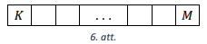

# <lo-sample/> LV.NOL.2025.5.1

Sešstūra virsotnēs ieraksti 6 dažādus naturālus skaitļus tā, lai 
vienlaicīgi izpildās nosacījumi:

- jebkuriem diviem blakus virsotnēs ierakstītiem skaitļiem 
  lielākais kopīgais dalītājs būtu 1;
- katra ar raustītu līniju uzzīmētā nogriežṇa galapunktos 
  (skat. 1. att.) ierakstīto skaitlu reizinājums dalītos ar 3;
- visu sešu ierakstīto skaitḷu summa būtu vismazākā iespējamā!

Pietiek tikai ar piemēru, kā ierakstīt skaitlus. Nav jāpamato, 
ka iegūtā summa ir vismazākā iespējamā.

<small>

* questionType:
* domain:

</small>

## Atrisinājums

Skat., piemēram, 2. att., kur ierakstīto skaitlu summa ir 26.

# <lo-sample/> LV.NOL.2025.5.2

Vai naturāla skaitḷa ciparu reizinājums var būt **(A)** $2520$; **(B)** $5460$?

<small>

* questionType:
* domain:

</small>

## Atrisinājums

**(A)** Jā, var būt, piemēram, skaitla 8975 ciparu reizinājums ir 
$8 \cdot 9 \cdot 7 \cdot 5=72 \cdot 35=2520$.

**(B)** Nē, nevar būt. Ja skaitlis ir kāda skaitḷa ciparu reizinājums, 
tad visi tā pirmreizinātāji ir mazāki nekā $10$ (tātad tie var būt tikai 
$2$, $3$, $5$ vai $7$). Bet skaitlim 5460 viens no pirmreizinātājiem 
ir $13$ ($5460 = 2 \cdot 2 \cdot 3 \cdot 5 \cdot 7 \cdot 13$), 
tātad tas nav neviena skaitla ciparu reizinājums.

# <lo-sample/> LV.NOL.2025.5.3

Dots kvadrāts ar izmēriem $8 \times 8$ rūtiṇas. Iekrāso 9 taisnstūrus 
ar izmēriem $1 \times 2$ rūtinas tā, lai no dotā kvadrāta nevarētu 
izgriezt nevienu kvadrātu ar izmēriem $2 \times 2$ rūtiṇas, 
kam visas rūtiṇas ir neiekrāsotas! 

<small>

* questionType:
* domain:

</small>

## Atrisinājums

Skat., piemēram, 3. att.

# <lo-sample/> LV.NOL.2025.5.4

Alise un Kate spēlē spēli. Pirmajā gājienā Kate nosauc skaitli nulle, 
pēc tam viṇas pamīšus izdara gājienus. Katra meitene savā gājienā 
izvēlas vienu naturālu skaitli no $1$ līdz $10$, pieskaita to 
pēdējam nosauktajam skaitlim un nosauc rezultātu. (Piemēram, 
ja Alise savā gājienā ir nosaukusi skaitli $18$, tad Kate 
var nosaukt jebkuru naturālu skaitli no $19$ līdz $28$). 
Uzvar tā meitene, kas nosauc skaitli 56. Pamato, ka Alise 
vienmēr var uzvarēt, neatkarīgi no Kates nosauktajiem skaitļiem!

<small>

* questionType:
* domain:

</small>

## Atrisinājums

Savā pirmajā gājienā Alisei jānosauc skaitlis 1. Pēc tam pēc katra 
Kates gājiena Alise izvēlas pieskaitīt tādu skaitli, kas kopā ar 
Kates iepriekšējā gājienā izvēlēto skaitli summā dod 11 (šādu 
gājienu Alise vienmēr var veikt, jo var izvēlēties skaitlus no 
$1$ līdz $10$). Līdz ar to pēc katra Alises gājiena skaitlis 
palielināsies par $11$. Alises nosauktie skaitḷi būs $1; 12; 23; 34; 45; 56$.

# <lo-sample/> LV.NOL.2025.5.5

Dotas sešas bumbiṇas, uz kurām ir uzraksti $1~\text{g}$, $2~\text{g}$, 
$3~\text{g}$, $4~\text{g}$, $5~\text{g}$, $6~\text{g}$, 
kas atbilst bumbiṇas masai gramos. Zināms, ka pieci no šiem 
uzrakstiem ir pareizi, bet viens ir nepareizs - attiecīgās bumbiṇas 
masa ir mazāka nekā norādīts uzrakstā. Kā ar divām svēršanām 
uz sviru svariem var noskaidrot, kurš uzraksts ir nepareizs? 

*Piezīme.* Sviru svari ir svari, kuriem svirai abos galos piestiprina 
vienādus svaru kausus. Ja abos kausos ievieto priekšmetus ar 
vienādu masu, tad svaru kausi ir līdzsvarā. Ja vienā kausā ieliktais 
priekšmets ir smagāks, tad atbilstošais kauss nosveras uz leju.

<small>

* questionType:
* domain:

</small>

## Atrisinājums

Pirmajā svēršanā vienā kausā liekam $1~\text{g}$ un $2~\text{g}$ 
bumbiṇas, bet otrā liekam $3~\text{g}$ bumbiṇu. Iespējami trīs gadījumi.

1. Ja $1 \mathrm{~g}+2 \mathrm{~g}>3 \mathrm{~g}$, tad nepareizais uzraksts ir 3 g .
2. Ja $1 \mathrm{~g}+2 \mathrm{~g}<3 \mathrm{~g}$, tad nepareizais uzraksts ir 1 g vai 2 g . Otrajā svēršanā vienā kausā liekam 1 g un 5 g , bet otrā kausā liekam 2 g un 4 g :

- ja $1 \mathrm{~g}+5 \mathrm{~g}<2 \mathrm{~g}+4 \mathrm{~g}$, tad nepareizais uzraksts ir 1 g ;
- ja $1 \mathrm{~g}+5 \mathrm{~g}>2 \mathrm{~g}+4 \mathrm{~g}$, tad nepareizais uzraksts ir 2 g .

3. Ja $1 \mathrm{~g}+2 \mathrm{~g}=3 \mathrm{~g}$, tad nepareizais uzraksts ir $4 \mathrm{~g}, 5 \mathrm{~g}$ vai 6 g . Otrajā svēršanā vienā kausā liekam 1 g un 5 g , bet otrā kausā liekam 2 g un 4 g :

- ja $1 \mathrm{~g}+5 \mathrm{~g}<2 \mathrm{~g}+4 \mathrm{~g}$, tad nepareizais uzraksts ir 5 g ;
- ja $1 \mathrm{~g}+5 \mathrm{~g}>2 \mathrm{~g}+4 \mathrm{~g}$, tad nepareizais uzraksts ir 4 g ;
- ja $1 \mathrm{~g}+5 \mathrm{~g}=2 \mathrm{~g}+4 \mathrm{~g}$, tad nepareizais uzraksts ir 6 g .

*Piezīme.* Ir arī citi varianti, kā noskaidrot prasīto.

# <lo-sample/> LV.NOL.2025.6.1

Desmitstūra virsotnēs ieraksti 10 dažādus naturālus skaitlus tā, 
lai vienlaicīgi izpildās nosacījumi:

- jebkuriem diviem blakus virsotnēs ierakstītiem skaitlliem lielākais 
  kopīgais dalītājs būtu $1$;
- katra ar raustītu līniju uzzīmētā nogriežņa galapunktos (skat. 4. att.) 
  ierakstīto skaitḷu reizinājums dalītos ar $3$;
- visu desmit ierakstīto skaitḷu summa būtu vismazākā iespējamā!

Pietiek tikai ar piemēru, kā ierakstīt skaitļus. Nav jāpamato, 
ka iegūtā summa ir mazākā iespējamā.

<small>

* questionType:
* domain:

</small>

## Atrisinājums

Skat., piemēram, 5. att., kur ierakstīto skaitlu summa ir 64.

# <lo-sample/> LV.NOL.2025.6.2

Vai skaitli 299 var izteikt kā vairāku (vismaz divu) naturālu skaitļu 
summu tā, lai arī šo skaitḷu reizinājums būtu 299?

<small>

* questionType:
* domain:

</small>

## Atrisinājums

Skaitlis 299 ir izsakāms kā $299=13 \cdot 23$, bet reizinātāju 
summa ir $13+23=36<299$. Tātad reizinājumam $13 \cdot 23$ vēl 
jāpiereizina vajadzīgais skaits vieninieku (reizinājums no tā 
nemainās). Ievērojam, ka $299-36=263$, tātad skaitli 299 atbilstoši 
uzdevuma prasībām varam izteikt šādi:

$299=13 \cdot 23 \cdot \underbrace{1 \cdot 1 \cdot \ldots \cdot 1}_{263~\text{vieninieki}}$ un $299=13+23+\underbrace{1+1+\ldots+1}_{263~\text{vieninieki}}$.

*Piezīme.* Šis ir vienīgais atrisinājums, neṇemot vērā reizinātāju secību.

# <lo-sample/> LV.NOL.2025.6.3

Dots kvadrāts ar izmēriem $6 \times 6$ rūtiṇas. lekrāso 6 rūtiṇas tā, 
lai no dotā kvadrāta nevarētu izgriezt nevienu 6. att. doto figūru, 
kam visas rūtiņas ir neiekrāsotas!

<small>

* questionType:
* domain:

</small>

## Atrisinājums

Skat., piemēram, 7. att.

# <lo-sample/> LV.NOL.2025.6.4

Kādā pilsētā ir kvadrātveida ielu plānojums, attālums starp diviem blakus krustojumiem ir 1 km. Dažos ielu krustojumos atrodas piemineklis, kas apzīmēts ar melnu punktu (skat. 8. att.). Ziṇkārīgs tūrists kādā dienā (ejot pa ielām) apmeklēja visus šīs pilsētas pieminekḷus. Vai var gadīties, ka viṇa maršruta garums bija tieši 25 km, ja tas  
**(A)** sākās pie pieminekḷa $A$ un beidzās pie pieminekla $B$;  
**(B)** sākās pie pieminekl!a $C$ un beidzās pie pieminekla $D$?

*Piezīme.* Pa vienu ielas posmu starp diviem blakus krustojumiem 
drīkst iet arī vairāk nekā vienu reizi.

<small>

* questionType:
* domain:

</small>

## Atrisinājums

**(A)** Var, piemēram, skat. 9. att.

**(B)** Nē, nevar. Nokrāsojam punktus (piemineklus) melnā un baltā krāsā, 
kā parādīts 10. att. Ievērojam, ka ik pēc 1 km punkta krāsa mainās 
uz pretējo. Tā kā attālums starp diviem vienas krāsas posmiem ir 
pāra skaitlis, tad kopējam maršruta garumam no pilsētas $C$ 
līdz pilsētai $D$ jābūt pāra skaitlim. Tātad maršruta garums nevar 
būt $25~\text{km}$.

# <lo-sample/> LV.NOL.2025.6.5

Doti seši atsvari, uz kuriem ir uzraksti $1~\text{g}$, $2~\text{g}$, 
$3~\text{g}$, $4~\text{g}$, $5~\text{g}$, $6~\text{g}$, 
kas atbilst atsvara masai gramos. Zināms, ka pieci no šiem 
uzrakstiem ir pareizi, bet viens ir nepareizs - attiecīgā atsvara 
masa ir lielāka nekā norādīts uzrakstā. Kā ar divām svēršanām 
uz sviru svariem var noskaidrot, kurš uzraksts ir nepareizs?

*Piezīme.* Sviru svari ir svari, kuriem svirai abos galos 
piestiprina vienādus svaru kausus. Ja abos kausos ievieto 
priekšmetus ar vienādu masu, tad svaru kausi ir līdzsvarā. 
Ja vienā kausā ieliktais priekšmets ir smagāks, tad atbilstošais 
kauss nosveras uz leju.

<small>

* questionType:
* domain:

</small>

## Atrisinājums

Pirmajā svēršanā vienā kausā liekam 1 g un 2 g atsvarus, bet otrā liekam 3 g atsvaru. Iespējami trīs gadījumi.

1. Ja $1 \mathrm{~g}+2 \mathrm{~g}<3 \mathrm{~g}$, tad nepareizais uzraksts ir 3 g .
2. Ja $1 \mathrm{~g}+2 \mathrm{~g}>3 \mathrm{~g}$, tad nepareizais uzraksts ir 1 g vai 2 g . Otrajā svēršanā vienā kausā liekam 1 g un 5 g , bet otrā kausā liekam 2 g un 4 g :

- ja $1 \mathrm{~g}+5 \mathrm{~g}<2 \mathrm{~g}+4 \mathrm{~g}$, tad nepareizais uzraksts ir 2 g ;
- ja $1 \mathrm{~g}+5 \mathrm{~g}>2 \mathrm{~g}+4 \mathrm{~g}$, tad nepareizais uzraksts ir 1 g .

3. Ja $1 \mathrm{~g}+2 \mathrm{~g}=3 \mathrm{~g}$, tad nepareizais uzraksts ir $4 \mathrm{~g}, 5 \mathrm{~g}$ vai 6 g . Otrajā svēršanā vienā kausā liekam 1 g un 5 g , bet otrā kausā liekam 2 g un 4 g :

- ja $1 \mathrm{~g}+5 \mathrm{~g}<2 \mathrm{~g}+4 \mathrm{~g}$, tad nepareizais uzraksts ir 4 g ;
- ja $1 \mathrm{~g}+5 \mathrm{~g}>2 \mathrm{~g}+4 \mathrm{~g}$, tad nepareizais uzraksts ir 5 g ;
- ja $1 \mathrm{~g}+5 \mathrm{~g}=2 \mathrm{~g}+4 \mathrm{~g}$, tad nepareizais uzraksts ir 6 g .

# <lo-sample/> LV.NOL.2025.7.1

Dots kvadrāts ar izmēriem $5 \times 5$ rūtiņas. 
Vai var iekrāsot **(A)** $8$ rūtinas, **(B)** $7$ rūtiṇas tā, 
lai no dotā kvadrāta nevarētu izgriezt nevienu 11. att. 
redzamo figūru, kurai visas rūtiṇas ir neiekrāsotas?

<small>

* questionType:
* domain:

</small>

## Atrisinājums

Abos gadījumos prasītais ir izdarāms, piemēram, skat. 12. att., 
kur iekrāsotas $7$ rūtiṇas.

# <lo-sample/> LV.NOL.2025.7.2

Kādu četru dažādu naturālu skaitlu reizinājums ir $414$?
Atrodi visus iespējamos variantus un pamato, ka citu nav!

<small>

* questionType:
* domain:

</small>

## Atrisinājums

Skaitli $414$ kā četru dažādu skaitḷu reizinājumu var iegūt trīs veidos:

$$414=1 \cdot 6 \cdot 3 \cdot 23=1 \cdot 2 \cdot 9 \cdot 23 = 
1 \cdot 2 \cdot 3 \cdot 69$$

Sadalīsim doto skaitli $414$ pirmreizinātājos: 
$414=2 \cdot 3 \cdot 3 \cdot 23$. Apskatām divus iespējamos 
gadījumus. Ja neviens no reizinātājiem nav 1 , tad šis ir arī 
vienīgais veids, kā sadalīt 414 četros reizinātājos. Bet tas 
neatbilst uzdevuma nosacījumiem, jo divi no reizinātājiem ir vienādi.
Ja viens no reizinātājiem ir 1, tad ir 3 atrisinājumi. Tā kā 
divi reizinātāji ir 3, tad viens no tiem ir jāpiereizina kādam 
no pārējiem skaitḷiem. Tā kā, reizinot 3 ar 1, iegūsim to pašu 
sadalījumu pirmreizinātājos, tad šis gadījums neder. Atliek vēl 3 iespējas:

- $3$ reizina ar $2$, iegūst $414=1 \cdot 6 \cdot 3 \cdot 23$;
- $3$ reizina ar $3$, iegūst $414=1 \cdot 2 \cdot 9 \cdot 23$;
- $3$ reizina ar $23$, iegūst $414=1 \cdot 2 \cdot 3 \cdot 69$.

Esam apskatījuši visas iespējas, tātad nav citu veidu, kā skaitli 
$414$ sadalīt četros dažādos naturālos reizinātājos.

# <lo-sample/> LV.NOL.2025.7.3

Uz trijstūra $ABC$ malas $AC$ atzīmēts punkts $M$, bet uz 
malas $AB$ atzīmēts punkts $N$ tā, ka $\sphericalangle BNC = 4x$, 
$\sphericalangle BCN = 6x$ un $\sphericalangle BMC = \sphericalangle CBM = 5x$. 
Pierādīt, ka trijstūra $ABC$ divi leņk̦i ir vienādi!

<small>

* questionType:
* domain:

</small>

## Atrisinājums

Izmantojot trijstūra iekšējo leṇḳu summu divos trijstūros (skat. 13. att.), iegūstam:
○ $\sphericalangle N B C=180^{\circ}-\sphericalangle B N C-\sphericalangle N C B=180^{\circ}-4 x-6 x=180^{\circ}-10 x(\triangle N B C)$;
$\bigcirc \sphericalangle M C B=180^{\circ}-\sphericalangle M B C-\sphericalangle B M C=180^{\circ}-5 x-5 x=180^{\circ}-10 x(\triangle M B C)$.
Tātad $\sphericalangle A B C=\sphericalangle N B C=180^{\circ}-10 x=\sphericalangle M C B=\sphericalangle A C B$ un divi trijstūra $A B C$ leṇki ir vienādi.

# <lo-sample/> LV.NOL.2025.7.4

Pirmklasnieki un otrklasnieki, kopā $30$ bērni, sastājās aplī 
un sadevās rokās. Izrādījās, ka $20$ bērni aiz rokas turēja vismaz 
vienu pirmklasnieku, bet $24$ bērni aiz rokas turēja vismaz vienu 
otrklasnieku. Cik varēja būt otrklasnieku?

<small>

* questionType:
* domain:

</small>

## Atrisinājums

Ja 20 bērni turēja aiz rokas vismaz vienu pirmklasnieku, tad atlikušie $30-20=10$ katrs turēja pie rokas divus otrklasniekus.
Tā kā kopā bija 24 bērni, kas turēja pie rokas vismaz vienu otrklasnieku, un 10 no tiem turēja divus otrklasniekus, tad atlikušie 24-10=14 katrs turēja tieši vienu otrklasnieku.
Saskaitīsim, cik roku kopā ir otrklasniekiem. Kopā ir 10 bērni, kas katrs tur divas otrklasnieku rokas, un 14 bērni, kas katrs tur vienu otrklasnieka roku, kopā tātad ir $10 \cdot 2+14=34$ otrklasnieku rokas.
Tātad kopā ir $34: 2=17$ otrklasnieki.

Piemēram, bērni varēja stāvēt aplī šādi:

$$O_{1} O_{2} O_{3} O_{4} O_{5} O_{6} O_{7} O_{8} O_{9} O_{10} P_{1} P_{2} P_{3} P_{4} P_{5} P_{6} P_{7} P_{8} O_{11} O_{12} P_{9} P_{10} O_{13} O_{14} P_{11} P_{12} O_{15} O_{16} P_{13} O_{17},$$

$O_{1}-O_{9}$ un $P_{13}$ katrs tur divus otrklasniekus (attiecīgi 
pārējie 20 tur vismaz vienu pirmklasnieku), un $P_{2}$ līdz $P_{7}$ 
katrs tur divus pirmklasniekus (attiecīgi pārējie 24 tur katrs 
vismaz vienu otrklasnieku).

# <lo-sample/> LV.NOL.2025.7.5

Trīs naturālus skaitlus $A, B$ un $C$ saista sakarības: $A<B<C$ un 
$C-B=B-A$. Skaitḷu $A, B$ un $C$ pierakstā kopā ir izmantoti tieši 
astoņi cipari, kas visi ir savā starpā atškirīgi. Vai ir iespējams, 
ka skaitlis $A$ ir **(A)** divciparu skaitlis; **(B)** viencipara skaitlis?

<small>

* questionType:
* domain:

</small>

## Atrisinājums

**(A)** Jā, ir iespējams, piemēram, $A=21$, $B=354$, $C=687$ ($687-354 = 333=354-21$).

**(B)** Jā, ir iespējams, piemēram, $A=3$, $B=546$, $C=1089$ ($1089-546 = 543 = 546-3$).

# <lo-sample/> LV.NOL.2025.8.1

Ieraksti 14. att. redzamās figūras katrā tukšajā taisnstūrī veselu skaitli tā, 
lai katrā taisnstūrī, izṇemot apakšējo rindu, ierakstītais skaitlis 
ir divu skaitl!u, kas atrodas divos taisnstūros tieši zem tā, summa!

<small>

* questionType:
* domain:

</small>

## Atrisinājums

Skat. 15. att.

*Piezīme.* Apzīmējot taisnstūrī ierakstīto skaitli ar $x$ un izsakot 
pārējos nezināmos skaitlus, iegūst 16. att. doto skaitlu izkārtojumu. 
Iegūstam vienādojumu $11-x = 3x-20+7$, kura atrisinājums $x=6$.

# <lo-sample/> LV.NOL.2025.8.2

Cik starp pirmajiem 2025 naturālajiem skaitlliem ir tādu skaitļu $x$, 
ka skaitlis $x(x+1)$ dalās ar $74$?

<small>

* questionType:
* domain:

</small>

## Atrisinājums

Ievērojam, ka $74=37 \cdot 2$. Tā kā 37 ir pirmskaitlis, tad vienam 
no skaitlliem $x$ vai $x+1$ jādalās ar 37. No diviem pēc kārtas 
esošiem naturāliem skaitliem viens noteikti dalās ar 2, tāpēc 
dotais reizinājums vienmēr dalās ar 2.
No $1$ līdz $2026$ ($2026$ ir lielākā iespējamā $x+1$ vērtība) ir 
$54$ skaitļi, kas dalās ar 37 (lielākais no tiem ir 
$1998=54 \cdot 37$). Līdz ar to:

- $54$ veidos var izvēlēties tādu $x$, kas dalās ar $37$ 
  (tas ir, $1 \cdot 37$; $2 \cdot 37$; $3 \cdot 37$; $\ldots$; $54 \cdot 37$);
- $54$ veidos var izvēlēties tādu $x$, ka $x+1$ dalās ar $37$ 
  (tas ir, $1 \cdot 37-1$; $2 \cdot 37-1$; $\ldots$; $54 \cdot 37-1$).

Tātad pavisam starp pirmajiem $2025$ naturālajiem skaitlliem ir 
$54+54=108$ tādi skaitļi $x$, ka $x(x+1)$ dalās ar $74$.

# <lo-sample/> LV.NOL.2025.8.3

Šaurleṇḳu trijstūrī $ABC$ visi augstumi krustojas punktā $M$. 
Aprēḳināt $\sphericalangle ACB$, ja $AB=CM$!

<small>

* questionType:
* domain:

</small>

## Atrisinājums

Ar $H$ un $G$ apzīmēsim augstumu, kas vilkti attiecīgi no virsotnēm 
$A$ un $C$, galapunktus (skat. 17. att.). Apzīmējot $\sphericalangle ABC=\alpha$ 
un izmantojot trijstūra iekšējo leņḳu summu, iegūstam:

* $\bigcirc \sphericalangle HAB=180^{\circ}-\sphericalangle AHB - \sphericalangle ABH=90^{\circ}-\alpha(\triangle ABH)$;
* $\sphericalangle GCB=180^{\circ}-\sphericalangle CGB-\sphericalangle GBC=90^{\circ}-\alpha(\triangle CGB)$.

Tātad $\triangle A B H=\triangle C M H$ pēc pazīmes lml :

* $\sphericalangle HAB=90^{\circ}-\alpha=\sphericalangle MCH$;
* $AB=CM$ pēc dotā;
* $\sphericalangle CMH=180^{\circ}-\sphericalangle MHC-\sphericalangle MCH=180^{\circ}-90^{\circ}-\left(90^{\circ}-\alpha\right)=\alpha=\sphericalangle ABH$ ($\triangle C M H$).

Tā kā $AH=CH$ kā vienādo trijstūru atbilstošās malas, tad 
$\triangle CAH$ pret vienādiem leņkiem atrodas vienādas malas un 
$\sphericalangle ACH=\sphericalangle CAH=\left(180^{\circ}-\sphericalangle AHC\right):2=90^{\circ}:2=45^{\circ}$. Tātad $\sphericalangle ACB=45^{\circ}$.

# <lo-sample/> LV.NOL.2025.8.4

Alise un Kate spēlē spēli. Pirmajā gājienā Kate nosauc skaitli nulle, 
pēc tam viņas pamīšus izdara gājienus. Katra meitene savā gājienā 
izvēlas vienu naturālu skaitli no $1$ līdz $10$, pieskaita to pēdējam 
nosauktajam skaitlim un nosauc rezultātu. (Piemēram, ja Alise 
savā gājienā ir nosaukusi skaitli $18$, tad Kate var nosaukt jebkuru 
naturālu skaitli no $19$ līdz $28$). Uzvar tā meitene, kas nosauc 
skaitli $100$. Kura meitene vienmēr var uzvarēt, neatkarīgi no otras 
spēlētājas gājieniem?

<small>

* questionType:
* domain:

</small>

## Atrisinājums

Vienmēr var uzvarēt Alise. Savā pirmajā gājienā Alisei jānosauc 
skaitlis $1$. Pēc tam pēc katra Kates gājiena Alise izvēlas 
pieskaitīt tādu skaitli, kas kopā ar Kates iepriekšējā gājienā 
izvēlēto skaitli summā dod 11 (šādu gājienu Alise vienmēr 
var veikt, jo var izvēlēties skaitlus no $1$ līdz $10$). 
Līdz ar to pēc katra Alises gājiena skaitlis palielināsies 
par $11$. Alises nosauktie skaitḷi būs 
$1; 12; 23; 34; 45; 56; 67; 78; 89; 100$.

# <lo-sample/> LV.NOL.2025.8.5

Trīs naturālus skaitlus $A, B$ un $C$ saista sakarības: $A<B<C$ un 
$C-B=B-A$. Skaitḷu $A, B$ un $C$ pierakstā kopā ir izmantoti tieši 
desmit cipari, kas visi ir savā starpā atškirīgi. Vai ir iespējams, 
ka skaitlis $A$ ir **(A)** divciparu skaitlis; **(B)** viencipara skaitlis?

<small>

* questionType:
* domain:

</small>

## Atrisinājums

**(A)** Jā, ir iespējams, piemēram, $A=27$, $B=1548$, $C=3069$ 
($3069-1548 = 1521 = 1548-27$).

**(B)** Jā, ir iespējams, piemēram, $A=3$, $B=8526$, $C=17049$ 
($17049-8526=8523=8526-3$).

# <lo-sample/> LV.NOL.2025.9.1

Aprēḳināt izteiksmes $\frac{20252024^{2}}{20252023^{2}+20252025^{2}-2}$ vērtību!

<small>

* questionType:
* domain:

</small>

## Atrisinājums

Apzīmējam $20252024=a$, tad iegūstam, ka

$$\frac{20252024^{2}}{20252023^{2}+20252025^{2}-2} = \frac{a^{2}}{(a-1)^{2}+(a+1)^{2}-2},$$

$$\frac{a^{2}}{(a-1)^{2}+(a+1)^{2}-2} = \frac{a^{2}}{a^{2}-2 a+1+a^{2}+2 a+1-2} = \frac{1}{2}.$$

# <lo-sample/> LV.NOL.2025.9.2

Atrast vismazāko naturālo skaitli $N$, kam reizinājums $1 \cdot 2 \cdot 3 \cdot 4 \cdot \ldots \cdot N$ dalās ar **(A)** 434; **(B)** 2025.

<small>

* questionType:
* domain:

</small>

## Atrisinājums

**(A)** Vismazākais skaitlis $N=31$. Sadalot pirmreizinātājos, iegūstam, 
ka $434=2 \cdot 7 \cdot 31$. Lai reizinājums 
$1 \cdot 2 \cdot 3 \cdot 4 \cdot \ldots \cdot N$ dalītos ar $434$, 
tad reizinājumam $1 \cdot 2 \cdot 3 \cdot 4 \cdot \ldots \cdot N$ ir 
noteikti jāsatur reizinātājs $31$. Tā kā 31 ir pirmskaitlis, 
tad pirmo reizi tas parādīsies kā reizinātājs $31$, reizinātāji 
$2$ un $7$ atbilstošajā reizinājumā noteikti būs. Līdz ar to mazākā 
iespējamā vērtība ir $N=31$.

**(B)** Vismazākais skaitlis $N=10$. levērojam, ka $2025=3^{4} \cdot 5^{2}$. 
Lai reizinājums $1 \cdot 2 \cdot 3 \cdot 4 \cdot \ldots \cdot N$ dalītos 
ar 2025, tad reizinājumam $1 \cdot 2 \cdot 3 \cdot 4 \cdot \ldots \cdot N$ 
ir jāsatur vismaz četri reizinātāji 3 un vismaz divi reizinātāji $5$. Līdz ar to:

- lai reizinājums saturētu vismaz divus reizinātājus $5$, tad $N$ vērtībai 
  jābūt vismaz 10 (atbilstošie reizinātāji ir $5$ un $10$);
- lai reizinājums saturētu vismaz četrus reizinātājus $3$, tad $N$ vērtībai
  jābūt vismaz $9$ (atbilstošie reizinātāji ir $3 ; 6 ; 9=3^{2}$).
  Tātad mazākā $N$ vērtība ir $10$.

# <lo-sample/> LV.NOL.2025.9.3

Šaurleņku trijstūrī $ABC$ novilkti augstumi $AK$ un $BL$. 
Zināms, ka $BK=KL$. Pierādīt, ka trijstūris $ABC$ ir vienādsānu!

<small>

* questionType:
* domain:

</small>

## Atrisinājums

Tā kā $BK=KL$, tad $\sphericalangle BLK = \sphericalangle KBL=\alpha$ 
(skat. 1.att.) kā leṇki pret vienādām malām trijstūrī $LKB$.
No $\triangle CLB$ iegūstam, ka 
$\sphericalangle BCL=180^{\circ}-\sphericalangle CBL-\sphericalangle CLB = 
180^{\circ}-\alpha-90^{\circ}=90^{\circ}-\alpha$.
Tā kā $\sphericalangle KLC = 90^{\circ}-\sphericalangle BLK = 90^{\circ}-\alpha=\sphericalangle KCL$, 
tad $\triangle CKL$ ir vienādsānu trijstūris un $KL=KC$. Līdz ar to 
$KC=KB$ un esam ieguvuši, ka $AK$ ir arī trijstūra $ABC$ mediāna. 
Tā kā $AK$ ir gan augstums, gan mediāna, tad trijstūris $ABC$ ir vienādsānu.

*Piezīme.* Uzdevumu var risināt arī, ap četrstūri $ALKB$ apvelkot riṇḳa līniju.

# <lo-sample/> LV.NOL.2025.9.4

Dots regulārs piecstūris, kurā novilktas visas diagonāles, kas to 
sadala $11$ daḷās (skat. 2. att.). Katrā dalā ierakstīt vienu 
naturālu skaitli no $1$ līdz $11$ (katrā daḷā citu) tā, lai visos 
trijstūros, kam visas virsotnes ir arī dotā piecstūra virsotnes, 
ierakstīto skaitlu summa ir viena un tā pati!

<small>

* questionType:
* domain:

</small>

## Atrisinājums

Piemēram, skat. 3. att., kur katrā trijstūrī ierakstīto skaitlu summa ir $22$.
*Piezīme.* Ir tikai viens derīgs skaitlu izkārtojums ar precizitāti 
līdz pagriešanai un apmešanai otrādi.

# <lo-sample/> LV.NOL.2025.9.5

Rindā novietotas $n$ bumbiņas. Katra bumbiṇa nokrāsotā kādā no $100$ krāsām. 
Bumbiņas saliktas tā, ka katrai krāsai $A$ un katrai krāsai $B$ ir tāda 
bumbiṇa krāsā $A$, kas atrodas pa kreisi no kādas bumbiṇas krāsā $B$ 
(ne obligāti blakus). Kāda ir mazākā iespējamā $n$ vērtība?

<small>

* questionType:
* domain:

</small>

## Atrisinājums

Mazākais bumbiņu skaits ir 199. No dotā secinām, ka katrā krāsā ir 
vismaz viena bumbiṇa. Ja būtu divas krāsas $K_{1}$ un $K_{2}$, 
kurās katrā būtu nokrāsota tieši viena bumbina, tad, piemēram, 
būtu bumbiṇa krāsā $K_{1}$, kas atrodas pa kreisi no bumbiṇas 
krāsā $K_{2}$, bet tad nebūtu bumbiṇas krāsā $K_{2}$, kas atrodas 
pa kreisi no bumbiṇas krāsā $K_{1}$. Tātad maksimums vienā krāsā 
var būt tikai viena bumbiņa, bet pārējās $99$ krāsās jābūt vismaz 
$2$ bumbiņām. Tātad mazākais bumbiṇu skaits ir $1+2 \cdot 99=199$.
Atbilstošu bumbiṇu krāsojumu skat. 4. att.

# <lo-sample/> LV.NOL.2025.10.1

Atrast visus naturālos trīsciparu skaitḷus, kuri ir tieši $5$ reizes 
lielāki par savu ciparu reizinājumu!

<small>

* questionType:
* domain:

</small>

## Atrisinājums

Apzīmējam meklējamo skaitli $\overline{abc}=100 a+10 b+c$. 
Tad iegūstam, ka $100a + 10b + c = 5 a b c$. 
Ievērojam, ka neviens no cipariem nedrīkst būt $0$, jo tad arī skaitlim 
būtu jābūt $0$. Tā kā labās puses izteiksme dalās ar $5$, 
tad arī labās puses izteiksmei (meklējamam skaitlim) jādalās ar $5$, 
no kā secinām, ka $c=0$ (neder) vai $c=5$. Līdz ar to iegūstam:

$$
\begin{gathered}
100 a+10 b+5=25 a b \\
20 a+2 b+1=5 a b
\end{gathered}
$$

Tā kā $20$ un $5$ dalās ar $5$, tad $2b+1$ arī jādalās ar $5$. 
N̦emot vērā, ka $b$ ir nenulles cipars, apskatām iespējamās $2b+1$ vērtības:

- ja $2b+1=5$ jeb $b=2$, tad $20 a+5=10 a$ jeb $a=-0,5$ (neder);
- ja $2b+1=10$ jeb $b=4,5$ (neder)
- ja $2b+1=15$ jeb $b=7$, tad $20 a+15=35 a$ jeb $a=1$, un iegūstam skaitli $175$;
- citas vērtības neder, jo lielākā $b$ vērtība ir $9$, kam $2b+1$ 
  atbilstošā vērtība ir $19$.

Līdz ar to esam ieguvuši, ka uzdevuma nosacījumiem atbilst tikai skaitlis $175$.

# <lo-sample/> LV.NOL.2025.10.2

Kāds ir vismazākais naturālais skaitlis, kuram ir tieši $18$ dažādi naturāli 
dalītāji un kas dalās ar $7$?

<small>

* questionType:
* domain:

</small>

## Atrisinājums

Ievērojam, ka $18=18 \cdot 1=9 \cdot 2=6 \cdot 3=3 \cdot 3 \cdot 2$. 
Ja skaitlis $n$ sadalās pirmreizinātājos kā 
$n=p_{1}^{k_{1}} p_{2}^{k_{2}} \ldots p_{m}^{k_{m}}$, tad tā dalītāju 
skaits ir $d(n)=\left(k_{1}+1\right) \cdot\left(k_{2}+1\right) \cdot \ldots \cdot\left(k_{m}+1\right)$. 
No tā izriet, ka skaitli, kuram ir tieši 18 dalītāji, var uzrakstīt vienā no formām:

$$p_{1}^{17}, \quad p_{1}^{8} \cdot p_{2}, \quad p_{1}^{5} \cdot p_{2}^{2}, \quad p_{1}^{2} \cdot p_{2}^{2} \cdot p_{3}$$

Skaitlim jādalās ar $7$, tāpēc kādam no pirmreizinātājiem ir jābūt $7$, 
un tā kā meklējam mazāko skaitli, tad kā citi reizinātāji jāaplūko 
mazākie pirmskaitļi ar vislielāko pakāpi. Apskatām visus gadījumus:

- $p_{1}=7$, tad iegūstam skaitli $7^{17}>252$;
- $p_{1}=2$ un $p_{2}=7$, tad iegūstam skaiti $2^{8} \cdot 7=256 \cdot 7=1792$;
- $p_{1}=2$ un $p_{2}=7$, tad iegūstam skaiti $2^{5} \cdot 7^{2}=32 \cdot 49=1568$;
- $p_{1}=2, p_{2}=3$ un $p_{3}=7$, tad iegūstam skaiti 
  $2^{2} \cdot 3^{2} \cdot 7=36 \cdot 7=252$.

Tātad vismazākais naturālais skaitlis, kuram ir tieši 18 dažādi 
naturāli dalītāji un kas dalās ar $7$, ir $252$.

# <lo-sample/> LV.NOL.2025.10.3

Uz trijstūra $ABC$ malām $AC$ un $BC$ ir atlikti attiecīgi 
punkti $F$ un $E$ tā, ka $2CF = FA$ un $2CE = EB$. Ārpus trijstūra 
$ABC$ uz stariem $AE$ un $BF$ ir atlikti attiecīgi punkti $K$ un 
$L$ tā, ka $2KE = EA$ un $2LF=FB$. Pierādīt, ka $ABKL$ ir paralelograms!

<small>

* questionType:
* domain:

</small>

## Atrisinājums

Ievērojam divu trijstūru pāru līdzību pēc pazīmes $m \ell m$ (skat.
5. att.).

- $\triangle AEB \sim \triangle KEC$, jo
  ${\displaystyle \frac{AE}{KE}=\frac{EB}{EC}=2}$, 
  $\sphericalangle AEB=\sphericalangle KEC$. 
  Tātad $AB = 2KC$ un $\sphericalangle EAB = \sphericalangle EKC$. 
  Līdz ar to $AB \| KC$, jo iekšējie šķērsleṇki ir vienādi.
- $\triangle BFA \sim \triangle LFC$, jo  
  ${\displaystyle \frac{BF}{LF}=\frac{FA}{FC}=2}$, 
  $\sphericalangle BFA=\sphericalangle LFC$. 
  Tātad $AB = 2CL$ un $\sphericalangle FBA=\sphericalangle FLC$. 
  Līdz ar to $AB \| CL$, jo iekšējie šķērsleṇķi ir vienādi.

Tā kā $AB \| KC$ un $AB \| CL$, tad $C \in KL$ un $AB \| KL$, 
turklāt $2KC = AB = 2CL = KL$. Esam ieguvuši, ka četrstūra 
$ABKL$ divas pretējās malas ir vienādas un paralēlas, tātad 
$ABKL$ ir paralelograms.

# <lo-sample/> LV.NOL.2025.10.4

Dots taisnstūris ar izmēriem $1 \times n$ rūtiṇas, kur $n \geq 3$, uz kura Kims un Māris spēlē spēli. Sākumā Kima kauliņš $K$ atrodas taisnstūra kreisajā rūtiņā un Māra kaulinš̌ $M$ atrodas taisnstūra labajā rūtiṇā (skat. 6. att.). Vienā gājienā spēlētājs var pārvietot savu kauliņu 1 vai 2 rūtiṇas otra spēlētāja virzienā, ja atbilstošā rūtina (rūtiņas) ir tukša (nedrīkst uzkāpt uz vai veikt "lēcienu" pāri otra spēlētāja kauliṇam). Spēli sāk Kims un spēlētāji gājienus veic pamīšus. Ja spēlētājs nevar veikt gājienu, tad viņš zaudē. Kādām $n$ vērtībām, pareizi spēlējot, vienmēr var uzvarēt Kims, un kādām $n$ vērtībām, pareizi spēlējot, vienmēr var uzvarēt Māris?

<small>

* questionType:
* domain:

</small>

## Atrisinājums

Māris vienmēr var uzvarēt, ja $n=3 k+2$, kur $k \in \mathbb{N}$, bet Kims vienmēr var uzvarēt visām atlikušajām $n$ vērtībām.
Apskatām mazākās $n$ vērtības.
Ja $n=3$, tad uzvar Kims, jo viņš var veikt vienu gājienu, bet Māris gājienu nevar veikt.

Ja $n=4$, tad uzvar Kims, jo viņš var veikt vienu gājienu, bet Māris gājienu nevar veikt.

Ja $n=5$, tad uzvar Māris, jo Kims var veikt pirmo gājienu un Māris veic otro gājienu, pēc kura Kims vairāk nevar veikt gājienu.

Pamatosim, ka Māris vienmēr var uzvarēt, ja $n=5;8;11;14;\ldots$ 
jeb $n = 3k+2$, kur $k \in \mathbb{N}$. Ievērojam, ka katrā 
savā gājienā Māris var panākt, ka taisnstūra garums samazinās 
par $3$ rūtiṇām (iegūst gadījumu $n=3 k+2-3=$ $=3 k-1$ utt.) - 
ja Kims savā gājienā kauliṇu pārvieto par vienu (divām) rūtiṇu, 
tad attiecīgi Māris savā gājienā kauliṇu pārvieto par divām (vienu) 
rūtiṇu. Šādi rīkojoties, kādā brīdī būs situācija, kad $n=5$, 
un Māris uzvar. Pamatosim, ka Kims vienmēr var uzvarēt atlikušajām $n$ vērtībām:

- ja $n=3 ; 6 ; 9 ; \ldots$ jeb $n=3 k$, tad savā pirmajā gājienā 
  Kims kauliṇu pārvieto par 1 rūtiṇu un paliek taisnstūris ar garumu 
  $3k-1$, un gājiens ir Mārim. Pēc katra Māra gājiena Kims panāk situāciju, 
  ka taisnstūra garums šo divu gājienu samazinās par 3 rūtiṇām 
  (Kims rīkojas pēc tādas pašas stratēǵijas kā Māris). Šādi rīkojoties,
  kādā brīdī būs situācija, kad $n=5$ un Mārim jāveic gājiens (un tā ir zaudējoša pozīcija), un Kims uzvar.
- ja $n=4 ; 7 ; 10 ; \ldots$ jeb $n=3k+1$, tad savā pirmajā gājienā 
  Kims kauliṇu pārvieto par 2 rūtiṇām un paliek taisnstūris ar garumu 
  $3k-1$, un gājiens ir Mārim, rīkojoties tāpat kā iepriekš, Kims uzvar.

# <lo-sample/> LV.NOL.2025.10.5

Atrisināt naturālos skaitlos vienādojumu $(a+1)(b+1)(c+1)=3 a b c$.

<small>

* questionType:
* domain:

</small>

## Atrisinājums

Ievērojam, ka vienādojums ir simetrisks attiecībā pret $a, b, c$ vērtībām, tāpēc, nezaudējot vispārīgumu, var pieṇemt, ka $a \leq b \leq c$. Abas vienādojuma puses dalot ar $a b c>0$, iegūstam $\left(1+\frac{1}{a}\right)\left(1+\frac{1}{b}\right)\left(1+\frac{1}{c}\right)=3$. Ja $a \geq 3$, tad

$$
\left(1+\frac{1}{a}\right)\left(1+\frac{1}{b}\right)\left(1+\frac{1}{c}\right)<\left(1+\frac{1}{3}\right)\left(1+\frac{1}{3}\right)\left(1+\frac{1}{3}\right)=\frac{64}{27}<3
$$

Tātad, ja $a \geq 3$, tad vienādojumam atrisinājuma nav. Aplūkosim atlikušos gadījumus, kad $a=1$ vai $a=2$. Ja $a=1$, tad iegūstam:

$$
\begin{gathered}
2(b+1)(c+1)=3 b c \\
2 b c+2 b+2 c+2=3 b c \\
b c-2 b-2 c+4=6 \\
(b-2)(c-2)=6
\end{gathered}
$$

Iespējamie atrisinājumi (nemot vērā, ka $b \leq c$ ) ir $b=3, c=8$ un $b=4, c=5$.
Ja $a=2$, tad iegūstam

$$
\begin{gathered}
3(b+1)(c+1)=6 b c \\
b c+b+c+1=2 b c \\
b c-b-c+1=2 \\
(b-1)(c-1)=2
\end{gathered}
$$

Iespējamais atrisinājums (ṇemot vērā, ka $b \leq c$ ) ir $b=2$ un $c=3$.
Līdz ar to esam aplūkojuši visus iespējamos gadījumus un ieguvuši atrisinājumus $(1 ; 3 ; 8),(1 ; 4 ; 5)$ un $(2 ; 2 ; 3)$. Sākotnēji pieņēmām, ka $a \leq b \leq c$. Tātad der jebkura iepriekšminēto atrisinājumu skaitlu permutācija un pavisam ir 15 atrisinājumi:

| $(1;3;8)$ | $(1;8;3)$ | $(3;1;8)$ | $(3;8;1)$ | $(8;1;3)$ | $(8;3;1)$ |
| :--- | :--- | :--- | :--- | :--- | :--- |
| $(1;4;5)$ | $(1;5;4)$ | $(4;1;5)$ | $(4;5;1)$ | $(5;1;4)$ | $(5;4;1)$ |
| $(2;2;3)$ | $(2;3;2)$ | $(3;2;2)$ |  |  |  |

# <lo-sample/> LV.NOL.2025.11.1

Atrast divas tādas reālas pozitīvas $x$ vērtības, ka $2 x^{x}=\sqrt{2}$.

<small>

* questionType:
* domain:

</small>

## Atrisinājums

Der $x=\frac{1}{2}$ un $x=\frac{1}{4}$. Pārbaudām, ka iegūta patiesa vienādība:

- $2 \cdot\left(\frac{1}{2}\right)^{\frac{1}{2}}=2 \cdot \frac{1}{\sqrt{2}}=\sqrt{2}$;
- $2 \cdot\left(\frac{1}{4}\right)^{\frac{1}{4}}=2 \cdot \frac{1}{\sqrt[4]{4}}=2 \cdot \frac{1}{\sqrt{2}}=\sqrt{2}$.

Piezīme. Citu derīgu reālu pozitīvu vērtību nav.

# <lo-sample/> LV.NOL.2025.11.2

Zināms, ka naturālam skaitlim $A$ ir tieši 111 dažādi naturāli dalītāji. Pierādīt, ka $A$ nedalās ar 216 .

<small>

* questionType:
* domain:

</small>

## Atrisinājums

Pieņemsim pretējo, ka $A$ dalās ar 216. Tā kā $216=2^{3} \cdot 3^{3}$, 
tad skaitli $A$ var uzrakstīt formā 
$A=2^{k} \cdot 3^{m} \cdot p_{1}^{s_{1}} \ldots p_{r}^{s_{r}}$, 
kur $k \geq 3$ un $m \geq 3$. Skaitlim $A$ ir 
$(k+1)(m+1)\left(s_{1}+1\right)\left(s_{2}+1\right) \ldots\left(s_{r}+1\right)$ 
dažādi dalītāji; turklāt $k+1 \geq 4$ un $m+1 \geq 4$. 
Taču skaitli $111=37 \cdot 3$ nevar sadalīt reizinājumā, kurā divi 
reizinātāji ir lielāki vai vienādi ar $4$. Tātad pien̦ēmums ir aplams. 
Līdz ar to esam pierādījuši, ka skaitlis $A$ nedalās ar $216$.

# <lo-sample/> LV.NOL.2025.11.3

Dots taisnstūris $ABCD$, kuram $AB<BC$. Uz malas $BC$ ir izvēlēts 
tāds punkts $E$, ka $AE=AD$. Leņka $DAE$ bisektrise krusto malu 
$CD$ punktā $F$. Trijstūrī $ADE$ novilkts augstums $EH$. 
Pierādīt, ka punkti $A,H,F,C$ atrodas uz vienas riṇķa līnijas!

<small>

* questionType:
* domain:

</small>

## Atrisinājums

Vienādsānu trijstūrī $DAE$ ir novilkta bisektrise $AK$, tātad tā ir 
arī augstums un mediāna, no kā izriet, ka $AK \perp ED$ un $K$ ir 
taisnstūra $ECDH$ diagonāḷu krustpunkts (skat. 7. att.). 
Pamatosim, ka $\sphericalangle AHC = \sphericalangle AFC$, tad ap četrstūri 
$AHFC$ varēs apvilkt riṇḳa līniju, līdz ar to punkti $A,H,F,C$ 
atradīsies uz vienas riṇḳa līnijas.

Apzīmējam $\sphericalangle ADK=\alpha$. Tādā gadījumā 
$\sphericalangle KHD=\sphericalangle ADK=\alpha$ (jo $ECDH$ ir taisnstūris, 
tā diagonāles krustpunktā dalās uz pusēm un $\triangle DKH$ 
ir vienādsānu) un 
$\sphericalangle AHC=180^{\circ}-\sphericalangle KHD=180^{\circ}-\alpha$. 
Aplūkojam $\Delta KFD$. Tā kā $\sphericalangle KDF=90^{\circ}-\alpha$, 
tad $\sphericalangle DFK=\alpha$. Līdz ar to 
$\sphericalangle AFC=180^{\circ}-\sphericalangle DFK=180^{\circ}-\alpha$ 
un esam ieguvuši, ka $\sphericalangle AHC=\sphericalangle AFC=180^{\circ}-\alpha$.

## Atrisinājums

Ar $K$ apzīmējam $AF$ un $DE$ krustpunktu. Trijstūris $DAE$ 
ir vienādsānu trijstūris, tāpēc bisektrise $AK$ ir arī augstums 
jeb $AK \perp ED$. Tad ap četrstūri $ECFK$ var apvilkt riṇḳa līniju, 
jo $\sphericalangle ECF + \sphericalangle EKF = 90^{\circ}+90^{\circ} = 180^{\circ}$, 
un ap četrstūri $AEKH$ var apvilkt riṇka līniju, jo 
$\sphericalangle AHE=\sphericalangle AKE=90^{\circ}$ (skat. 8. att.). 
Tādā gadījumā pēc sekanšu īpašības iegūstam, ka 
$DH \cdot DA = DK \cdot DE$ (attiecībā pret riṇka līniju, kas apvilkta 
ap $AEKH$) un $DK \cdot DE = DF \cdot DC$ (attiecībā pret riņḳa līniju, 
kas apvilkta ap $ECFK$). Tas nozīmē, ka $DH \cdot DA = DF \cdot DC$, 
kas nozīmē, ka ap četrstūri $HACF$ var apvilkt riṇḳa līniju 
(no apgrieztās teorēmas) jeb punkti $A,H,F,C$ atrodas uz vienas riṇka līnijas.

# <lo-sample/> LV.NOL.2025.11.4

Dots regulārs piecstūris, kurā novilktas visas diagonāles, 
kas to sadala $11$ daḷās (skat. 9. att.).  
**(A)** Katrā daḷā ierakstīt vienu naturālu skaitli no $1$ līdz $11$ 
(katrā daḷā citu) tā, lai visos trijstūros, kam visas virsotnes ir 
arī dotā piecstūra virsotnes, ierakstīto skaitlu summa ir viena un tā pati!  
**(B)** Kāds skaitlis var būt ierakstīts daļā, kas apzīmēta ar $X$?

<small>

* questionType:
* domain:

</small>

## Atrisinājums

**(A)** Piemēram, skat. 10. att.
**(B)** Pamatosim, ka daḷā, kas apzīmēta ar $X$, var būt ierakstīts tikai skaitlis 1. Vispirms noskaidrosim, kāda ir vienā trijstūrī ierakstīto skaitļu summa. Visu ierakstīto skaitḷu summa ir visu skaitḷu no 1 līdz 11 summa, tātad 66. Doto piecstūri var sadalīt trīs trijstūros no vienas piecstūra virsotnes novelkot divas diagonāles. Tātad vienā trijstūrī ierakstīto skaitḷu summa ir $M=66: 3=22$.
Apzīmējam $a=a_{1}+a_{2}+a_{3}+a_{4}+a_{5}$ un $b=b_{1}+b_{2}+b_{3}+b_{4}+b_{5}$ (skat. 11. att.).
Saskaitot piecos platleṇķa trijstūros ierakstīto skaitlu summas, iegūstam:

$$\begin{gathered}
5 M=2 a+b=(a+b+X)+a-X=3 M+a-X \\
2 M=a-X \leq 11+10+9+8+7-X=45-X \\
44 \leq 45-X
\end{gathered}$$

Tātad der tikai $X=1$.

## Atrisinājums

**(A)** Līdzīgi kā iepriekšējā atrisinājumā.

**(B)** Pamatosim, ka daḷā, kas apzīmēta ar X, var būt ierakstīts 
tikai skaitlis 1. Vispirms noskaidrosim, kāda ir vienā trijstūrī 
ierakstīto skaitlu summa. Visu ierakstīto skaitḷu summa ir visu 
skaitḷu no 1 līdz 11 summa, tātad 66. Doto piecstūri var sadalīt 
trīs trijstūros, piemēram, $\triangle A B C, \triangle A C E$ un 
$\triangle C D E$ (skat. 12. att.). Tātad vienā trijstūrī ierakstīto 
skaitlu summa ir $66: 3=22$.

Ja saskaita $\triangle ACE$ un $\triangle BDE$, bet atṇem 
$\triangle ADE$ ierakstītos skaitlus, tad ir saskaitīti visi skaitļi, 
kas ierakstīti iekrāsotajos apgabalos, un divas reizes pieskaitīts 
skaitlis, kas ierakstīts centrālajā daḷā (skat. 13. att.).
Skaitļu summa, kas ierakstīta atbilstošajās daḷās, ir $22+22-22=22$.
Mazākā iespējamā iekrāsotajās daḷās ierakstīto skaitḷu summa ir 
$1+2+3+4+5=15$. Tātad centrālajā daļā ierakstītais skaitlis 
nevar būt lielāks kā $(22-15):2=3,5$ jeb centrā var būt ierakstīts 
skaitlis $1$,$2$ vai $3$.

Ja centrā ir $2$, tad iekrāsotajās daḷās skaitḷu summa ir $18$, 
kas ir mazāka nekā piecu mazāko skaitḷu no atlikušajiem summa $1+3+4+5+6=19$.

Ja centrā ir $3$, tad iekrāsotajās daḷās ierakstīto skaitļu summa ir 
$16$, kas ir mazāka nekā piecu mazāko skaitļu no atlikušajiem 
summa $1+2+4+5+6=18$. Tātad esam pierādījuši, ka vidū var būt 
ierakstīts tikai $1$, bet skaitḷi no $7$ līdz $11$ izvietoti dal̦ās 
gar piecstūra malām.

# <lo-sample/> LV.NOL.2025.11.5

Doti tādi reāli skaitļi $a, b$ un $c$, ka 
$a^{2}+c-bc = b^{2}+a-ac = c^{2}+b-ab$. Vai noteikti $a=b=c$ ?

<small>

* questionType:
* domain:

</small>

## Atrisinājums

No pirmās vienādības iegūstam:

$$\begin{aligned}
& a^{2}+c-b c=b^{2}+a-a c \\
& a^{2}-b^{2}+a c-b c=a-c \\
& (a-b)(a+b+c)=a-c
\end{aligned}$$

Ja $a=b$, tad no iegūtās vienādības izriet, ka $a=c$, 
tātad $a=b=c$. Tāpēc pieṇemsim, ka $a \neq b$.
Līdzīgi no pārējām divām vienādībām iegūstam:

$$\begin{aligned}
& (b-c)(a+b+c)=b-a \\
& (a-c)(a+b+c)=b-c
\end{aligned}$$

Reizinot iegūtās vienādības, iegūstam

$$\begin{gathered}
(a-b)(b-c)(a-c)(a+b+c)^{3}=(a-c)(b-a)(b-c) \\
(a-b)(b-c)(a-c)(a+b+c)^{3}=-(a-c)(a-b)(b-c)
\end{gathered}$$

N̦emot vērā, ka nekādi divi no skaitliem $a, b$ un $c$ nav vienādi, iegūstam, ka

$$(a+b+c)^{3}=-1 \quad \Rightarrow \quad a+b+c=-1$$

Tādā gadījumā

$$\begin{gathered}
(a-b)(a+b+c)=a-c \\
\frac{(a-b)(-1)=a-c}{} b \\
b+c-2 a=0 \\
b+c+a-3 a=0 \Rightarrow a=-\frac{1}{3}
\end{gathered}$$

Līdzīgi iegūst, ka $b=-\frac{1}{3}$, bet tā ir pretruna ar pieṇ̄mumu, 
ka $a \neq b$. Tātad noteikti $a=b=c$.

# <lo-sample/> LV.NOL.2025.12.1

Doti tādi naturāli skaitļi $a, b$ un $c$, ka skaitlis 
$\frac{a \sqrt{2}+b}{b \sqrt{2}+c}$ ir racionāls. 
Pierādīt, ka $ab + bc + ac$ dalās ar $a+b+c$.

<small>

* questionType:
* domain:

</small>

## Atrisinājums

Dotās daḷas skaitītāju un saucēju reizinām ar saucēja saistīto izteiksmi

$$\frac{a \sqrt{2}+b}{b \sqrt{2}+c} = \frac{(a \sqrt{2}+b)(b \sqrt{2}-c)}{(b \sqrt{2}+c)(b \sqrt{2}-c)}=\frac{2 a b-b c+\sqrt{2}\left(b^{2}-a c\right)}{2 b^{2}-c^{2}}$$

Tā kā skaitlis ir racionāls, tad skaitītājā jābūt veselam skaitlim 
(jo saucējā ir vesels skaitlis), tāpēc $b^{2} - ac=0$ jeb $b^{2} = ac$.
Tādā gadījumā $ab+bc+ca=ab+bc+b^{2}=b(a+b+c)$ un tas dalās ar $a+b+c$.

# <lo-sample/> LV.NOL.2025.12.2

Atrast divus tādu veselu skaitlu $a, b$ un $c$ trijniekus 
$(a ; b ; c)$, ka $972^{a} \cdot 32^{b} \cdot 9^{c}=1$.

<small>

* questionType:
* domain:

</small>

## Atrisinājums

Der, piemēram, $(0 ; 0 ; 0)$ un $(10 ;-4 ;-25)$. Pārbaudām, ka šie skaitlu trijnieki atbilst nosacījumiem:

- $972^{0} \cdot 32^{0} \cdot 9^{0}=1 \cdot 1 \cdot 1=1$;
- $972^{10} \cdot 32^{-4} \cdot 9^{-25}=\left(2^{2} \cdot 3^{5}\right)^{10} \cdot\left(2^{5}\right)^{-4} \cdot\left(3^{2}\right)^{-25}=2^{20} \cdot 3^{50} \cdot 2^{-20} \cdot 3^{-50}=2^{0} \cdot 3^{0}=1 \cdot 1=1$.

*Piezīme.* Ir bezgalīgi daudz veselu skaitlu trijnieku, kas atbilst 
uzdevuma nosacījumiem. Vispārīgo atrisinājumu var atrast, sadalot skaitlus 
$972=2^{2} \cdot 3^{5} ; 32=2^{5}$ un $9=3^{2}$ pirmreizinātājos 
un ievietojot tos dotajā vienādībā: 
$2^{2a+5b} \cdot 3^{5a+2c}=2^{0} \cdot 3^{0}$.
No tā iegūstam lineāru vienādojumu sistēmu (kāpinātājiem pie vienādām 
bāzēm jābūt vienādiem):

$$\left\{\begin{array} { l } 
{ 2 a + 5 b = 0 } \\
{ 5 a + 2 c = 0 }
\end{array} \text { jeb } \left\{\begin{array}{l}
5 b=-2 a \\
2 c=-5 a
\end{array}\right.\right.$$

No iegūtās sistēmas pirmā vienādojuma redzams, ka $-2 a$ dalās ar $5$, 
tātad $a$ dalās ar 5; no trešā vienādojuma redzams, ka $-5a$ dalās ar $2$,
tātad $a$ dalās ar 2 . Tātad $a=10k$, kur $k$ ir vesels skaitlis, $b=-4k$ 
un $c=-25k$. Tātad der visi skaitlu trijnieki ($10k; -4k; -25k$),
kur $k$ ir jebkurš vesels skaitlis.

# <lo-sample/> LV.NOL.2025.12.3

Izliektā piecstūrī četras no diagonālēm ir paralēlas kādai no piecstūra 
malām. Pierādīt, ka arī piektā diagonāle ir paralēla kādai piecstūra malai!

<small>

* questionType:
* domain:

</small>

## Atrisinājums

Apzīmējam piecstūri ar $ABCDE$ un pieṇemam, ka 
$AB \| CE$, $BC \| AD$, $CD \| BE$ un $DE \| AC$. 
Pamatosim, ka arī $AE \| BD$.
Tā kā $AB \| CE$, tad augstumi, kas novilkti no punktiem $C$ un $E$ 
pret malu $A B$ ir vienādi kā attālumi starp paralēlām taisnēm 
(skat. 14. att.). No šī varam secināt, ka $S_{ABE}=S_{ABC}$, 
jo novilktie augstumi pret vienu un to pašu malu $A B$ ir vienāda garuma.

Līdzīgi var pamatot, ka $S_{ABC}=S_{BCD}$, jo augstumi, kas 
novilkti no punktiem $A$ un $D$ pret malu $BC$, ir vienāda garuma, 
jo $BC \| AD$. Šādi turpinot, iegūstam, ka $S_{BCD}=S_{CDE}$, 
jo $CD \| BE$, un $S_{CDE}=S_{ADE}$, jo $DE \| AC$.
Tātad esam ieguvuši, ka $S_{ABE}=S_{ABC}=S_{BCD}=S_{CDE}=S_{ADE}$ 
jeb $S_{ABE} = S_{ADE}$. Trijstūriem $ABE$ un $ADE$ ir 
kopīga mala $AE$. Tā kā šo trijstūru laukumi ir vienādi, tad augstumiem, 
kas novilkti pret šo malu, arī jābūt vienādiem. Tātad attālumi 
starp nogriežņiem $AE$ un $BD$ ir vienādi. Secinām, ka šie nogriežṇi 
ir paralēli, tas ir, $AE \| BD$.

# <lo-sample/> LV.NOL.2025.12.4

Pie apaḷa galda apsēdušies daži rūkīši un katram no viṇiem 
sākumā ir pāra skaits konfekšu. Ik pēc brīza burvju feja pamāj 
ar nūjiṇu un tad visi rūk̦īši reizē dalās ar savām konfektēm - 
katrs rūḳītis atdod pusi no savām konfektēm blakus pa labi 
sēdošajam rūķītim. Pēc tam katram rūḳītim, kam atlicis nepāra 
skaits konfekšu, feja iedod vienu papildu konfekti. Pierādīt, 
ka pēc galīga šādu gājienu skaita visiem rūḳīšiem būs vienāds skaits konfekšu!

<small>

* questionType:
* domain:

</small>

## Atrisinājums

Vispirms pamatosim, ka lielākais iespējamais skaits konfekšu, kas var būt 
katram rūḳītim pēc gājiena, nepalielinās. Ievērosim, ka kādam rūḳītim 
esošo konfekšu skaits var kḷūt lielāks tikai tad, ja viņš gājienā iegūst 
vairāk konfekšu nekā atdod, tas ir, pa kreisi sēdošajam rūḳītim ir 
lielāks konfekšu skaits. Pieņemsim, ka mums ir kāds rūḳītis $M$ ar $m$ 
konfektēm, un viṇam pa kreisi sēž rūḳītis ar $n$ konfektēm, turklāt $m<n$. 
Pēc gājiena rūḳītim $M$ būs ne vairāk kā 
$\frac{m}{2}+\frac{n}{2}+1=\frac{m+n}{2}+1$ konfekšu. Tā kā $m<n$, 
tad $m<\frac{m+n}{2}<n$. Tā kā visi šie skaitḷi ir naturāli, tad, 
pieskaitot $1$ pie šīs vidējās vērtības, iegūstam, ka 
$\frac{m+n}{2}+1 \leq n$. Tātad rūķīša $M$ konfekšu skaits pēc katra 
gājiena nepārsniedz tam kreisi sēdošā rūķǐša konfekšu skaitu $n$ 
jeb tā lielākais iespējamais konfekšu skaits nepalielinās. Ja $n$ 
ir lielākais iespējamais konfekšu skaits, tad pēc katra gājiena 
rūķīšu skaits ar šādu konfekšu skaitu, nepalielinās.

Līdzīgi varam pierādīt, ka mazākais iespējamais konfekšu skaits, 
kas var būt katram rūḳītim katrā gājienā, nesamazinās. Ja rūķītim 
$M$ ir $m$ konfektes, un rūḳītim, kas sēž pa kreisi no viṇa, 
ir $n$ konfektes, turklāt $m>n$, tad pēc gājiena rūķītim $M$ būs 
ne mazāk kā $\frac{m+n}{2}$ konfekšu $\left(\frac{m+n}{2}>n\right)$. 
Tātad, ja $n$ ir mazākais iespējamais konfekšu skaits, tad pēc 
katra gājiena rūḳīšu skaits ar šādu konfekšu skaitu, nepalielinās. 
Turklāt šādu rūḳīšu skaits samazinās vai arī mazākais iespējamais 
konfekšu skaits palielinās.

Apskatīsim rūķīti ar vismazāko konfekšu skaitu $x$ (vai vienu 
no tādiem), kam pa kreisi sēž rūķītis ar vairāk konfektēm (ja 
šādu rūķīšu nav, tad visiem ir vienāds konfekšu skaits). Pēc 
gājiena šī rūķīša konfekšu skaits pieaugs, tāpēc rūķīsu skaits, 
kam bija tieši $x$ konfektes, samazinās par 1. Ja šis bija 
vienīgais rūķītis ar $x$ konfektēm, tad mazākais konfekšu,
kas var būt kādam rūḳītim, skaits ir pieaudzis.

Tā kā lielākais konfekšu skaits nepalielinās, un katru gājienu 
vai nu palielinās mazākais konfekšu skaits, vai arī samazinās 
rūķīšu skaits ar mazāko konfekšu skaitu, tad pēc galīga skaita 
gājienu mazākais konfekšu skaits sakritīs ar lielāko konfekšu 
skaitu, tas ir, visiem rūḳīšiem būs vienāds skaits konfekšu.

# <lo-sample/> LV.NOL.2025.12.5

Dota tabula ar izmēriem $n \times n$ rūtiṇas. Katrā tabulas 
rūtiṇā ierakstīts kāds naturāls skaitlis no $1$ līdz $n^{2}$, 
katrā rūtiṇā atškirīgs skaitlis. Tabulu sauksim par sakarīgu, 
ja katrā kvadrātā ar izmēriem $2 \times 2$ rūtiṇas ierakstīto 
skaitlu reizinājums dalās ar $5$.  
**(A)** Pierādīt, ka tabula nav sakarīga, ja $n$ ir pāra skaitlis.  
**(B)** Kāds ir lielākais nepāra skaitlis $n$, kuram tabula var būt sakarīga?

<small>

* questionType:
* domain:

</small>

## Atrisinājums

**(A)** Tā kā $n$ ir pāra skaitlis, tad $n=2 k, k \in \mathbb{N}$, 
un kopā tabulā ir $n^{2}=(2 k)^{2}=4 k^{2}$ rūtiņu. Tādā gadījumā 
tabulu var sadalīt ar $k^{2}$ kvadrātos, kuru izmēri ir $2 \times 2$ 
rūtiṇas. Lai katra šāda kvadrāta skaitlu reizinājums dalītos ar $5$, 
tad kādā no rūtiṇām ir jāatrodas skaitla $5$ daudzkārtnim. Tātad kopā 
nepieciešami $k^{2}$ atškirīgi skaitļi, kas dalās ar $5$, tas ir, 
$5;10;15;\ldots;5k^{2}$. Lielākais tabulā ierakstītais skaitlis 
ir $4 k^{2}<5 k^{2}$, tāpēc nepietiek skaitla $5$ daudzkārtṇu, 
ko ierakstīt katrā no kvadrātiem ar izmēriem $2 \times 2$. 
Līdz ar to tabula nav sakarīga.

**(B)** Pamatosim, ka lielākā $n$ vērtība ir $9$. Ja $n=2 k+1$ ir 
nepāra skaitlis, tad tabulu, neieskaitot pēdējo rindu un pēdējo 
kolonnu, var sadalīt $k^{2}$ kvadrātos, kuru izmēri ir $2 \times 2$ 
rūtiṇas. Tādā gadījumā nepieciešami vismaz $k^{2}$ skaitḷa $5$ 
daudzkārtṇi, lai iegūtu sakarīgu tabulu. Pavisam tabulā ierakstīti 
$n^{2}=(2 k+1)^{2}=4 k^{2}+4 k+1$ skaitḷi, tāpēc nepieciešams, 
lai $4 k^{2}+4 k+1 \geq 5 k^{2}$ (lai pietiktu skaitlaa $5$ 
daudzkārtṇu). Līdz ar to iegūstam nevienādību $k^{2} \leq 4 k+1$, 
kas ir patiesa naturāliem skaitlliem $k \leq 4$, tāpēc lielākā 
$k$ vērtība ir $4$ un attiecīgi lielākā $n$ vērtība ir $9$. 
Skaitļus kvadrātā ar izmēriem $9 \times 9$ rūtinas var sarakstīt, 
piemēram, kā redzams 15. att., kurā atlikušos skaitļus var ierakstīt 
patvaļīgi.

