# <lo-sample/> LV.SOL.2020.5.1

**(A)** Vai uz rūtinu lapas var uzzīmēt $12$-stūri, kura laukums ir 
$20$ rūtiṇas un kura malas iet pa rūtinu līnijām?

**(B)** Vai uz rūtiṇu lapas var uzzīmēt $12$-stūri, kura laukums ir 
$4500$ rūtiņas un kura malas iet pa rūtiṇu līnijām? 

## Atrisinājums

**(A)** Jā, var (skat., piemēram, 1.att.).

**(B)** Jā, var (skat., piemēram, 2.att., kur katras daudzstūra malas 
garums ir $30$ rūtiņas).

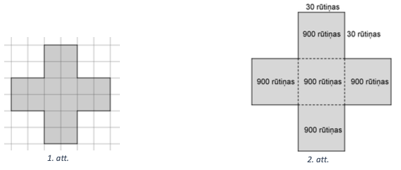{ width=400px }

# <lo-sample/> LV.SOL.2020.5.2

Vai eksistē tādi dažādi trīsciparu naturāli skaitli $A$ un $B$, 
ka trim skaitļiem $A, B$ un $A+B$ ciparu summas visas savā starpā vienādas?

## Atrisinājums

Jā; piemēram, var izvēlēties $A=117, B=225$ un $A+B=117+225=342$, 
kuru ciparu summas ir $9$.

# <lo-sample/> LV.SOL.2020.5.3

Katrā no mazajiem trijstūrīšiem (skat. 3.att.) ierakstīts viencipara 
naturāls skaitlis; dažādos trijstūrīšos ierakstīti dažādi skaitļi. 
Aplūkojam visas tādas divu skaitļu summas, kuri ierakstīti 
trijstūrīšos ar kopīgu malu.

**(A)** Vai var gadīties, ka neviena no šīm summām nepārsniedz $10$?

**(B)** Kāds mazākais skaits no šīm summām var būt pāra skaitļi?

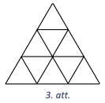{ width=150px }

3. att.

## Atrisinājums

**(A)** Jā, var, piemēram, skat. 4. att.

**(B)** Mazākais var būt viena pāra summa, piemēram, skat. 5. att. 
Visas summas nevar būt pāra, jo tādā gadījumā visos pelēkajos trijstūrīšos 
(skat. 6.att.) ierakstīto skait|u paritātei jābūt vienai un visos 
neiesvītrotajos - otrai, bet ir tikai $4$ pāra skaitli $(2,4,6,8)$ un 
tikai $5$ nepāra skaitļi $(1,3,5,7,9)$.

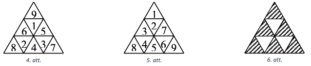{ width=400px }

# <lo-sample/> LV.SOL.2020.6.1

**(A)** Vai kvadrātu var sagriezt 10 kvadrātos?

**(B)** Vai kvadrātu var sagriezt 103 kvadrātos?

## Atrisinājums

**(A)** Jā, var, skat., piemēram, 7. att.

**(B)** Jā, var. levērojam, ka kvadrātu var sadalīt $4$ kvadrātos, ja 
katrai malai atrod viduspunktu un savieno pretējo malu viduspunktus 
(skat. 8.att.). Ja vienu no 7.att. dotajiem kvadrātiem sadala 
$4$ kvadrātos, tad kvadrātu skaits palielinās par $3$. 
Šādi turpinot, iegūsim, ka kvadrātu var sadalīt $13, 16, 19, \ldots$ 
kvadrātos. Tā kā $103=10+3 \cdot 31$, tad kvadrātu var sagriezt $103$ kvadrātos.

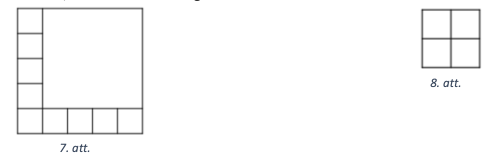{ width=300px }

# <lo-sample/> LV.SOL.2020.6.2

Volejbola turnīrā katra komanda ar katru citu spēlēja tieši vienu reizi. 
Volejbolā neizškirtu nav. Turnīru beigās izrādījās, ka astotdaļai 
visu komandu nav nevienas uzvaras. Cik spēlu izspēlēja turnīrā?

## Atrisinājums

Bez uzvarām var palikt augstākais viena komanda. Ja tādas komandas 
būtu vismaz divas, tad kas uzvarēja to savstarpējās spēlēs 
(jo neizšķirtu nav)? Tātad turnīrā piedalījās $8$ komandas un 
tika izspēēētas $7+6+5+4+3+2+1=28$ spēles.

# <lo-sample/> LV.SOL.2020.6.3

Vai eksistē tādi trīs dažādi naturāli skaitli, ka katru divu 
skait|u reizinājums dalās ar to summu?

## Atrisinājums

Jā, eksistē, piemēram, uzdevuma nosacījumus apmierina skaitli 
$120$, $240$ un $360$, jo

- $120 \cdot 240=28800$ un $28800: 360=80$;
- $120 \cdot 360=43200$ un $43200: 480=90$;
- $240 \cdot 360=86400$ un $86400: 600=144$.

# <lo-sample/> LV.SOL.2020.7.1

**(A)** Vai kvadrātu var sagriezt $11$ kvadrātos?

**(B)** Vai kvadrātu var sagriezt $113$ kvadrātos?

## Atrisinājums

**(A)** Jā, var, skat., piemēram, 9.att.

**(B)** Jā, var. levērojam, ka kvadrātu var sadalīt $4$ kvadrātos, 
ja katrai malai atrod viduspunktu un savieno pretējo malu viduspunktus 
(skat. 10.att.). Ja vienu no 9.att. dotajiem kvadrātiem sadala $4$ kvadrātos, 
tad kvadrātu skaits palielinās par $3$. Šādi turpinot, iegūsim, 
ka kvadrātu var sadalīt $14,17,20,\ldots$ kvadrātos. 
Tā kā $113=11+3 \cdot 34$, tad kvadrātu var sagriezt 113 kvadrātos.

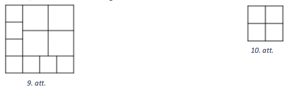{ width=300px }

# <lo-sample/> LV.SOL.2020.7.2

Vai plaknē var atlikt četrus punktus tā, lai trīs attālumi starp 
punktiem būtu $5 \mathrm{~cm}, 6 \mathrm{~cm}$ un $10 \mathrm{~cm}$, 
bet katrs atlikušais attālums nepārsniegtu $4 \mathrm{~cm}$ ?

## Atrisinājums

Nē, nevar. Apzīmēsim punktus ar $A,B,C,D$. Ja, piemēram, $AD=10$, 
tad trijstūrī $ABD$ un $ACD$ jāizpildās trijstūra nevienādībai, 
tas ir, $AB + BD \geq 10$ un $AC + CD \geq 10$ (skat. 11.att.). 
Līdz ar to $AB+BD+AC+CD \geq 20$, bet pat četru lielāko atlikušo 
attālumu summa nepārsniedz $5+6+4+4=19$. Iegūta pretruna, 
tātad plaknē nevar atlikt punktus atbilstoši uzdevuma nosacījumiem.

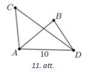{ width=150px }

# <lo-sample/> LV.SOL.2020.7.3

Kādu lielāko skaitu skaitļu var uzrakstīt rindā tā, lai katru trīs 
pēc kārtas uzrakstītu skaitļu summa būtu pozitīva, bet katru piecu
pēc kārtas uzrakstītu skaitļu summa būtu negatīva?

## Atrisinājums

Lielākais skait|u skaits ir 6, piemēram, 10; $-18 ; 10 ; 10 ;-18 ; 10$. 
Pamatosim, ka vairāk skaitļus nevar uzrakstīt, lai izpildītos uzdevumā 
prasītais. Pieṇemsim, ka rindā uzrakstīti 7 skaitli $a ; b ; c ; d ; e ; f ; g$. 
No $(a+b+c)+(d+e+f)>0$ un $a+b+c+d+e<0$ secinām, ka $f>0$. 
No $(b+c+d)+(e+f+g)>0$ un $c+d+e+f+g<0$ secinām, ka $b>0$. 
Taču tādā gadīumā $b+(c+d+e)+f>0$ - pretruna. 
Tātad vairāk kā $6$ skaitļi nevar būt uzrakstīti rindā.

# <lo-sample/> LV.SOL.2020.8.1

Aprēķināt izteiksmes vērtību!

$$
\left(1+\frac{1}{2}\right) \cdot\left(1+\frac{1}{3}\right) \cdot\left(1+\frac{1}{4}\right) \cdot \ldots \cdot\left(1+\frac{1}{70}\right)
$$

## Atrisinājums

Vienkāršojam doto izteiksmi

$$
\left(1+\frac{1}{2}\right) \cdot\left(1+\frac{1}{3}\right) \cdot\left(1+\frac{1}{4}\right) \cdot \ldots\left(1+\frac{1}{70}\right)=\frac{3}{2} \cdot \frac{4}{3} \cdot \frac{5}{4} \cdot \frac{6}{5} \cdot \ldots \cdot \frac{70}{69} \cdot \frac{71}{70}
$$

Ievērojam, ka katru divu daļu reizinājumā saīsinās vienas daļas 
saucējs un otras daļas skaitītājs. Pēc visām saīsināšanām, 
skaitītājā paliek tikai $71$, bet saucējā $2$. Tātad iegūstam, ka dotās 
izteiksmes vērtība vienāda $\operatorname{ar} \frac{71}{2}$ jeb $35 \frac{1}{2}$.

# <lo-sample/> LV.SOL.2020.8.2

Punkti $A, B$ un $C$ atrodas uz vienas taisnes; $B$ atrodas starp 
$A$ un $C$. Trijstūri $AMB$ un $BNC$ ir vienādmalu. 
Pierādīt, ka $AN=CM$.

## Atrisinājums

Šķirojam divus gadijumus.

1. Punkti $M$ un $N$ atrodas vienā pusē no taisnes $AC$ 
(skat. 12.att.). Ievērojam, ka $\triangle MBC = \triangle ABN$ 
pēc pazīmes $\mathrm{mlm}$, jo

- $MB=AB$ kā vienādmalu trijstūra malas;
- $BC=BN$ kā vienādmalu trijstūra malas;
- $\sphericalangle MBC=\sphericalangle MBN+\sphericalangle NBC=\sphericalangle MBN+60^{\circ}=\sphericalangle MBN+\sphericalangle MBA=\sphericalangle ABN$.

Līdz ar to $C M=A N$ kā atbilstošās malas vienādos trijstūros.

2. Punkti $M$ un $N$ atrodas dažādās pusēs no taisnes $AC$ 
   (skat. 13.att.). Ievērojam, ka $\triangle MBC=\triangle ABN$ 
   pēc pazīmes $\mathrm{mlm}$, jo

- $MB=AB$ kā vienādmalu trijstūra malas;
- $BC=BN$ kā vienādmalu trijstūra malas;
- $\sphericalangle MBC=\sphericalangle ABN$ kā krustleņki.

Līdz ar to $CM=AN$ kā atbilstošās malas vienādos trijstūros.

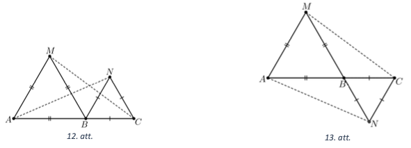{ width=300px }

# <lo-sample/> LV.SOL.2020.8.3

Atrast tādu divpadsmitciparu skaitli (kas nesatur ciparu $0$) tā, lai katri 
divi blakus uzrakstīti cipari veidotu pirmskaitli un visi šie pirmskaitļi būtu dažādi!

## Atrisinājums

Meklētais skaitlis ir $619737131179$, jo $61$, $19$, $97$, $73$, $37$, $71$, $13$, 
$31$, $11$, $17$, $79$ visi ir pirmskaitļi.

# <lo-sample/> LV.SOL.2020.9.1

**(A)** Vai var atrast tādus trīs dažādus naturālus skaitļus 
$a,b,c$, ka $\frac{1}{a}+\frac{1}{b}+\frac{1}{c}=1$?

**(B)** Vai var atrast tādus desmit dažādus naturālus skaitļus
$a_{1}, a_{2}, \ldots, a_{10}$, ka 
$\frac{1}{a_{1}}+\frac{1}{a_{2}}+\cdots+\frac{1}{a_{10}}=1$?

## Atrisinājums

**(A)** Jā, var, piemēram, $\frac{1}{2}+\frac{1}{3}+\frac{1}{6}=1$.

**(B)** Jā, var. Parādīsim paṇēmienu, kā no trīs saskaitāmajiem 
var iegūt četrus saskaitāmos. Izdalām vienādības 
$\frac{1}{2}+\frac{1}{3}+\frac{1}{6}=1$ abas puses ar $2$

$$\frac{1}{4}+\frac{1}{6}+\frac{1}{12}=\frac{1}{2}$$

Abām vienādības pusēm pieskaitām $\frac{1}{2}$:

$$\frac{1}{4}+\frac{1}{6}+\frac{1}{12}+\frac{1}{2}=1$$

Līdzīgi var iegūt piecus saskaitāmos 
$\frac{1}{8}+\frac{1}{12}+\frac{1}{24}+\frac{1}{4}+\frac{1}{2}=1$.

Procesu turpinot, katru reizi saskaitāmo skaitu palielinām par $1$. 
Šādā veidā tiks iegūti desmit saskaitāmie un tie visi būs dažādi.

# <lo-sample/> LV.SOL.2020.9.2

Vai šaurleṇku trijstūrī mediānas garums var būt vienāds ar viduslīnijas garumu?

## Atrisinājums

Nē, nevar. Pieṇemsim, ka mediānas garums var būt vienāds ar viduslīnijas garumu. 
Šķirojam divus gadijumus.

1. Mediānai un viduslīnijai ir kopīgs galapunkts $D$ (skat. 14.att.). 
   Pēc pienēmuma $ED=BD$, tad $\sphericalangle BED=\sphericalangle EBD$ kā leṇki pie 
   pamata vienādsānu trijstūrī $BDE$. Šie leṇki ir šauri kā leṇki pie 
   vienādsānu trijstūra pamata, tāpēc $\sphericalangle AED$ ir plats. 
   Tā kā $ED \| BC$ (jo $ED$ ir viduslīnija), tad $\sphericalangle ABC=\sphericalangle AED$ 
   kā kāpšļu leṇki un tie abi ir šauri, jo pēc dotā $\triangle ABC$ 
   ir šaurleṇku. legūta pretruna, tātad šajā gadīumā $ED \neq BD$.
2. Mediāna krusto viduslīniju (skat. 15. att.), pēc pieņēmuma $MN=BD$. 
   Tā kā $B M \| N D$ un $M D \| B N$, tad četrstūris $MBND$ ir paralelograms. 
   Ņemot vērā, ka $MN=BD$, secinām, ka $MBND$ ir taisnstūris un 
   $\sphericalangle A B C=90^{\circ}$. legūta pretruna, tātad arī šajā gadījumā 
   $MN \neq BD$.

Līdz ar to esam pierādījuši, ka šaurlenkku trijstūrī mediānas garums 
nevar būt vienāds ar viduslīnijas garumu.

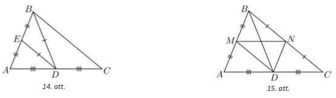{ width=300px }

# <lo-sample/> LV.SOL.2020.9.3

Dotas 25 pēc ārējā izskata vienādas monētas. Zināms, ka 24 monētu masas 
ir vienādas savā starpā, bet vienas monētas masa ir citāda. Kā ar divām 
svēršanām uz sviru svariem bez atsvariem noskaidrot, vai atšķirīgā monēta 
ir vieglāka vai smagāka nekā pārējās?

## Atrisinājums

Uzliekam uz katra svaru kausa $8$ monētas. Iespējami divi gadījumi.

* Ja kausi ir līdzsvarā, tad atškirīgā monēta nav ne uz viena no 
  svaru kausiem. Otrajā svēršanā salīdzinām 9 nesvērtās monētas ar 
  jebkurām 9 jau svērtajām. Ja 9 nesvērtās monētas ir smagākas nekā 
  9 svērtās, tad atškirīgā monēta ir smagāka nekā pārējās, savukārt, 
  ja 9 nesvērtās monētas ir vieglākas nekā 9 svērtās, tad atšķirīgā 
  monēta ir vieglāka nekā pārējās.
* Ja pirmajā svēršanā viens kauss nosveras uz leju, tad 
  atšķirīgā monēta ir vienā no svaru kausiem. 
  Otrajā svēršanā ṇemam monētas no svaru kausa, kas nosvērās uz 
  leju un salīdzinām ar 8 vēl nesvērtām monētām. Iespējami divi gadījumi:

  - ja svaru kausi ir līdzsvarā, tad atšḳirīgā monēta ir vieglāka nekā pārējās monētas;
  - ja nesvērto monētu kaudzīte vieglāka, tad atškirīgā monēta ir smagāka nekā pārējās.

# <lo-sample/> LV.SOL.2020.10.1

Pierādīt, ka katram naturālam $n$ ir patiesa vienādība

$$1^{2}+3^{2}+5^{2}+\cdots+(2 n-1)^{2}=\frac{n(2 n-1)(2 n+1)}{3}$$

## Atrisinājums

Izmantosim matemātiskās indukcijas metodi.

Indukcijas bāze. Ja $n=1$, tad $1^{2}=\frac{1 \cdot 1 \cdot 3}{3}$ jeb $1=1$.

Induktīvais pieñēmums. Pieṇemsim, ka vienādība izpildās, ja $n=k$, tas ir,

$$1^{2}+3^{2}+5^{2}+\cdots+(2 k-1)^{2}=\frac{k(2 k-1)(2 k+1)}{3}$$

Induktīvā pāreja. Pierādīsim, ka vienādība ir spēkā arī tad, ja $n=k+1$, tas ir,

$$1^{2}+3^{2}+5^{2}+\cdots+(2 k+1)^{2}=\frac{(k+1)(2 k+1)(2 k+3)}{3}$$

Pārveidojam vienādības kreisās puses izteiksmi:

$\underbrace{1^{2}+3^{2}+5^{2}+\cdots+(2 k-1)^{2}}_{\text{induktīvais pieņēmums}}+(2 k+1)^{2}=\frac{k(2 k-1)(2 k+1)}{3}+(2 k+1)^{2}=$

$=\frac{(2 k+1)}{3}(k(2 k-1)+3(2 k+1))=\frac{(2 k+1)}{3}\left(2 k^{2}+5 k+3\right)=\frac{(2 k+1)(k+1)(2 k+3)}{3}$.

*Secinājums.* Tā kā vienādība ir patiesa, ja $n=1$, un no tā, ka 
vienādība ir spēkā, ja $n=k$, izriet, ka vienādība ir spēkā arī $n=k+1$, 
secinām, ka vienādība ir spēkā visām naturālām $n$ vērtībām.

# <lo-sample/> LV.SOL.2020.10.2

Uz leṇḳa $MON$ malām $OM$ un $ON$ atlikti attiecīgi nogriežṇi 
$OA=AB=BC$ un $OD=DE=EF$. Pierādīt, ka trijstūru $AEC$ un $DBF$ 
laukumi ir vienādi!

## Atrisinājums

Ievērojam, ka $S(AEC)=S(COE)-S(AOE)$ un $S(DBF)=S(BOF)-S(BOD)$ 
(skat. 16.att.). Izmantojot trijstūra $COF$ laukumus, izsakām visus laukumus:

- $S(COE)=\frac{1}{2} \cdot O C \cdot \frac{2}{3} OF \cdot \sin \sphericalangle O=\frac{2}{3} S(COF)$;
- $S(AOE)=\frac{1}{2} \cdot \frac{1}{3} OC \cdot \frac{2}{3} OF \cdot \sin \sphericalangle O=\frac{2}{9} S(COF)$;
- $S(BOF)=\frac{1}{2} \cdot \frac{2}{3} OC \cdot OF \cdot \sin \sphericalangle O=\frac{2}{3} S(COF)$;
- $S(BOD)=\frac{1}{2} \cdot \frac{2}{3} OC \cdot \frac{1}{3} OF \cdot \sin \sphericalangle O=\frac{2}{9} S(COF)$.

Līdz ar to $S(AEC)=S(DBF)$.

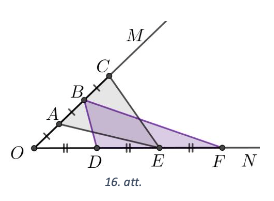{ width=200px }

# <lo-sample/> LV.SOL.2020.10.3

Uz šaha galdina novietotas dažas figūras, katrā lauciṇā ne vairāk kā viena. 
Gan katrā rindā, gan katrā kolonnā atrodas nepāra skaits figūru. 
Pierādīt, ka uz melnajiem lauciṇiem kopā ir pāra skaits figūru!

## Atrisinājums

Apzīmējam pāra un nepāra kolonnās kopējo figūru skaitu attiecīgi ar 
$PK$ un $NK$; līdzīgi ieviešam apzīmējumus rindām $PR$ un $NR$. 
No dotā secinām, ka $PK, NK, PR, NR$ ir pāra skaitli. Uz melnajiem 
lauciņiem esošo figūru skaits ir $NK+PR-2 \cdot S$, kur $S$ - to 
figūru skaits, kas atrodas vienlaicīgi kolonnās ar nepāra numuru 
un rindās ar pāra numuru.

# <lo-sample/> LV.SOL.2020.11.1

Pierādīt, ka $10^{n}-9n-1$ dalās ar $81$ visām naturālām $n$ vērtībām!

## Atrisinājums

Izmantosim matemātiskās indukcijas metodi.

Indukcijas bāze. Ja $n=1$, tad $10-9-1=0$ dalās ar $81$.

Induktīvais pieņēmums. Pieņemsim, ka prasītais izpildās, ja $n=k$, 
tas ir, $10^{k}-9 k-1$ dalās ar $81$.

Induktīvā pāreja. Pierādīsim, ka prasītais izpildās arī tad, ja 
$n=k+1$, tas ir, $10^{k+1}-9(k+1)-1$ dalās ar $81$.

Pārveidojam izteiksmi:

$$10^{k+1}-9(k+1)-1=10 \cdot 10^{k}-9 k-10=10 \cdot \underbrace{\left(10^{k}-9 k-1\right)}_{\begin{array}{c}
\text{ dalās ar } 81 \\
\text{ pēc pieņēmuma }
\end{array}}+\underbrace{81 k}_{\text{dalās ar } 81}$$

Tā kā katrs saskaitāmais dalās ar $81$, tad arī summa dalās ar $81$.

Secinājums. Tā kā vienādība ir patiesa, ja $n=1$, un no tā, ka 
vienādība ir spēkā, ja $n=k$, izriet, ka vienādība ir spēkā arī 
$n=k+1$, secinām, ka apgalvojums ir spēkā visām naturālām $n$ vērtībām.

# <lo-sample/> LV.SOL.2020.11.2

Punkti $A,B,C$ atrodas uz vienas taisnes; $B$ atrodas starp 
$A$ un $C$. Trijstūri $AMB$ un $BNC$ ir vienādmalu, pie tam 
$M$ un $N$ atrodas vienā pusē no taisnes $AC$. Pierādīt, ka leņķis 
starp taisnēm $AN$ un $CM$ ir $60^{\circ}$.

## Atrisinājums

Ievērojam, ka $\triangle MBC=\triangle ABN$ pēc pazīmes 
$\mathrm{mlm}$ (skat. 17.att.), jo

- $MB=AB$ kā vienādmalu trijstūra malas;
- $BC=BN$ kā vienādmalu trijstūra malas;

$\sphericalangle MBC=\sphericalangle MBN+\sphericalangle NBC=\sphericalangle MBN+60^{\circ}=\sphericalangle MBN+\sphericalangle MBA=\sphericalangle ABN$.

Līdz ar to $CM=AN$ kā atbilstošās malas vienādos trijstūros.

Tā kā $BC$ un $BN$ veido $60^{\circ}$ lenki, tad šie trijstūri 
iegūstami viens no otra ar pagriezienu par $60^{\circ}$. Tad arī atbilstošās 
malas $AN$ un $CM$ iegūstamas viena no otras ar pagriezienu par 
$60^{\circ}$, tas ir, leṇkis starp taisnēm $AN$ un $CM$ ir $60^{\circ}$.

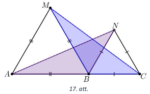{ width=200px }

# <lo-sample/> LV.SOL.2020.11.3

Dots, ka $a$ un $b$ ir naturāli skaitli, $a>b$. Zināms, ka $a$ dalās 
ar $b$ un $a+1$ dalās ar $b+1$. Pierādīt, ka $a>b^{2}$.

## Atrisinājums

Apzīmējam $a=nb$, kur $n \in N$ un $n>1$. Tad 
$\frac{n b+1}{b+1}=\frac{n b+n+1-n}{b+1}=\frac{n(b+1)-(n-1)}{b+1}=n-\frac{n-1}{b+1}$ 
ir vesels skaitlis. Tā kā $n>1$, tad jābūt $n-1 \geq b+1$ jeb $n \geq b+2$. 
Līdz ar to $a=nb \geq (b+2)b > b^{2}$.

# <lo-sample/> LV.SOL.2020.12.1

Virkne uzdota rekurenti ar formulu $x_{n+2}=3 x_{n+1}-2 x_{n}-1$, 
kur $x_{1}=3$ un $x_{2}=6$. Pierādīt, ka virkni var definēt ar formulu $x_{n}=2^{n}+n$.

## Atrisinājums

Izmantosim matemātiskās indukcijas metodi.

*Indukcijas bāze.* Ja $n=1$, tad $x_{1}=2^{1}+1=3$. Ja $n=2$, tad $x_{2}=2^{2}+2=6$. 

*Induktīvais pieņēmums.* Pieṇemsim, ka vienādība izpildās, ja $n=k$ un $n=k+1$, tas ir,

$$\begin{gathered}
x_{k}=2^{k}+k \\
x_{k+1}=2^{k+1}+k+1
\end{gathered}$$

*Induktīvā pāreja.* Pierādīsim, ka vienādība ir spēkā arī tad, 
ja $n=k+2$, tas ir, $x_{k+2}=2^{k+2}+k+2$. Pārveidojam doto rekurences formulu

$$\begin{gathered}
x_{k+2}=3 x_{n+1}-2 x_{n}-1=3\left(2^{k+1}+k+1\right)-2\left(2^{k}+k\right)-1= \\
=3 \cdot 2 \cdot 2^{k}+3 k+3-2 \cdot 2^{k}-2 k-1=4 \cdot 2^{k}+k+2=2^{k+2}+k+2
\end{gathered}$$

*Secinājums.* Tā kā vienādība ir patiesa, ja $n=1$ un $n=2$, 
un no tā, ka vienādība ir spēkā, ja $n=k$ un $n=k+1$, izriet, 
ka vienādība ir spēkā arī $n=k+2$, secinām, ka formula ir spēkā 
visām naturālām $n$ vērtībām.

# <lo-sample/> LV.SOL.2020.12.2

Uz riṇka līnijas diametra $A B$ atlikts punkts $C$, bet $X$ un $Y$ 
ir punkti uz rinka līnijas, kas nesakrīt ne ar $A$, ne ar $B$. 
Pierādīt, ka $\frac{\operatorname{tg} \sphericalangle AXC}{\operatorname{tg} \sphericalangle XAC}=\frac{\operatorname{tg} \sphericalangle AYC}{\operatorname{tg} \sphericalangle YAC}$.

## Atrisinājums

Novelkam $CZ \perp AX$ (skat. 18.att.). Tā kā $AB$ ir diametrs, 
tad $\sphericalangle AXB=90^{\circ}$ un $BX \| CZ$. No $\triangle XZC$ 
un $\triangle AZC$ iegūstam, ka 
$\operatorname{tg} \sphericalangle AXC=\frac{CZ}{XZ}$ un 
$\operatorname{tg} \sphericalangle XAC=\frac{CZ}{AZ}$, tad 
$\frac{\operatorname{tg} \sphericalangle \mathrm{AXC}}{\operatorname{tg} \sphericalangle \mathrm{XAC}}=\frac{AZ}{ZX}=\frac{AC}{CB}$ (pēdējā vienādība izriet no Talesa teorēmas).

Līdzīgi iegūstam, ka 
$\frac{\operatorname{tg} \sphericalangle AYC}{\operatorname{tg} \sphericalangle \mathrm{YAC}}=\frac{A C}{C B}$. Tātad esam pierādījuši, ka 
$\frac{\operatorname{tg} \sphericalangle AXC}{\operatorname{tg} \sphericalangle XAC}=\frac{\operatorname{tg} \sphericalangle AYC}{\operatorname{tg} \sphericalangle YAC}$.

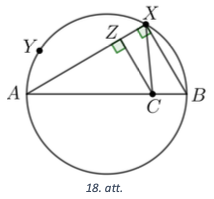{ width=150px }

# <lo-sample/> LV.SOL.2020.12.3

Turnīrā piedalās $n$ šahisti $(n \geq 2)$, katrs ar katru citu spēlē 
vienu reizi. Par uzvaru spēēētājs iegūst 1 punktu, par neizškirtu 
$\frac{1}{2}$ punkta, par zaudējumu 0 punktus. Pēc turnīra beigām 
katrs spēlētājs aprēkināja divus skait|lus: $Z$ - visu to spēlētāju 
punktu summu, kam viṇš zaudējis, un $U-$ visu to spēlētāju punktu summu, 
kurus viṇš uzvarējis. Vai var gadīties, ka katram spēlētājam pastāv 
nevienādība $Z>U$ ?

## Atrisinājums

Nē, nevar. Apzīmējam $i$-tā šahista iegūto punktu skaitu ar $P_{i}$, 
bet atbilstošās summas $i$-jam šahistam ar $Z_{i}$ un $U_{i}$. Apskatām 
izteiksmi $P_{1}\left(Z_{1}-U_{1}\right)+P_{2}\left(Z_{2}-U_{2}\right)+\ldots+P_{n}\left(Z_{n}-U_{p}\right)$. 
Tās vērtība ir 0 , jo šī izteiksme katrai rezultatīvai 
partijai starp $i$-to un $j$-to šahistu satur vienu locekli 
$+P_{i} P_{j}$ un vienu locekli $-P_{i} P_{j}$. Tā kā skaitļi 
$P_{i} \geq 0$ (visi $P_{i}$ vienlaicīgi nevar būt $0$), 
tad visas starpības $\left(Z_{i}-U_{i}\right)$ nevar būt vienlaicīgi pozitīvas.

