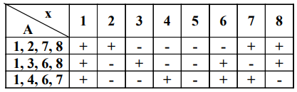

# <lo-sample/> LV.VOL.2004.9.1

Dots, ka $a,\ b,\ c$ - pozitīvi skaitļi un $a^{2}+b^{2}=2c^{2}$.

Pierādīt, ka $\frac{1}{a+c}+\frac{1}{b+c}=\frac{2}{a+b}$

<small>

* questionType:
* domain:

</small>

## Atrisinājums

Pierādāmo vienādību **ekvivalenti** pārveidojot, pakāpeniski iegūstam

$$\begin{aligned}
\frac{a+b+2c}{(a+c)(b+c)} & =\frac{2}{a+b} \\
(a+b)(a+b+2c) & =2(a+c)(b+c) \\
a^{2}+2ab+b^{2}+2ac+2bc & =2ab+2ac+2bc+2c^{2} \\
a^{2}+b^{2} & =2c^{2}
\end{aligned}$$

# <lo-sample/> LV.VOL.2004.9.2

Dots, ka $ABCD$ - paralelograms un $AM=CN$ (skat. 1.zīm). Pierādīt, ka $D$ 
atrodas uz $\sphericalangle ASC$ bisektrises.

<small>

* questionType:
* domain:

</small>

## Atrisinājums

Trijstūriem $AMD$ un $CND$ katram laukums vienāds ar pusi no paralelograma 
laukuma. Tāpēc šajos vienlielajos trijstūros augstumi pret vienādām malām $AM$ 
un $CN$ ir vienādi savā starpā. Tāpēc $D$ atrodas vienādos attālumos no 
$\sphericalangle ASC$ malām.

# <lo-sample/> LV.VOL.2004.9.3

Jānītis grib uzrakstīt $n$ dažādus naturālus skaitļus tā, lai nekādu sešu 
uzrakstīto skaitļu summa nedalītos ar $6$.

Vai tas ir iespējams, ja **(A)** $n=10$, **(B)** $n=11$?

<small>

* questionType:ProveDisprove,ProveDisprove
* domain:NT

</small>

## Atrisinājums

**(A)** jā; var uzrakstīt piecus skaitļus, kas dalās ar $6$, un piecus 
skaitļus, kas dod atlikumu $1$, dalot ar $6$.

**(B)** nē. Varam starp $11$ skaitļiem atrast divus skaitļus ar vienādu 
paritāti; to summa dalās ar $2$. Līdzīgi turpinot, varam atrast $5$ dažādu 
skaitļu pārus, katram no kuriem summa dalās ar $2$. Apskatām šīs $5$ summas un 
aprēķinām to atlikumus, dalot ar $3$. Ja sastopami visi atlikumi $0;\ 1;\ 2$, 
tad atbilstošo skaitļu summa dalās ar $3$. Ja kāds atlikums nav sastopams, tad 
kāds no atlikumiem sastopams vismaz $3$ reizes; atkal atbilstošo skaitļu summa 
dalās ar $3$.

Atliek ievērot, ka summa, kas dalās gan ar $2$, gan ar $3$, dalās ar $6$.

# <lo-sample/> LV.VOL.2004.9.4

Kvadrāts sastāv no $4 \times 4$ vienādām kvadrātiskām rūtiņām Andris pēc kārtas
novieto pa vienam tomim kādā vēl neaizņemtā rūtiņā saskaņā ar šādiem 
noteikumiem: pirmo torni viņš drīkst novietot patvaļīgā rūtiņā pēc savas 
izvēles, bet katru nākošo torni jānovieto tādā rūtiņā, kur to uzlikšanas brīdī 
apdraud nepāra skaits jau novietoto (divi torņi apdraud viens otru, ja tie abi 
atrodas vienā horizontālē vai vienā vertikālē un starp tiem nav citu torņu).

Kādu lielāko torņu daudzumu Andrim var izdoties novietot?

<small>

* questionType:
* domain:

</small>

## Atrisinājums

**(A)** var uzlikt $15$ torņus; skat., piem., 2.zīm.

**(B)** ja uzliktu $16$ torņus, tad tie būtu jānovieto arī visās stūra rūtiņās.
Bet to torni, kuru ievieto **pēdējā stūra rūtiņā**, uzlikšanas brīdī apdraud 
divi citi - pretruna.

# <lo-sample/> LV.VOL.2004.9.5

Pa apli uzrakstīti $5$ skaitļi. To summa ir $1$, un neviens skaitlis pēc moduļa
(absolūtās vērtības) nepārsniedz $1$.

Pierādīt, ka var atrast trīs tādus skaitļus $x,\ y$ un $z$, ka $x+y \geq 0$, 
$y+z \geq 0$ un $x+y+z \geq 0$, pie tam skaitļi $x;\ y;\ z$ tieši šādā secībā 
viens aiz otra uzrakstīti pa apli.

<small>

* questionType:
* domain:

</small>

## Atrisinājums

Vispirms pierādīsim, ka no summām $a+b,\ b+c,\ c+d,\ d+e,\ e+a$ ne vairāk kā 
divas ir negatīvas (skat. 3.zīm.).

Ja tā nebūtu, tad atrastos divi blakus esoši skaitļu pāri, kuru summas ir 
negatīvas, piemēram, $a+b<0$ un $c+d<0$. Tad $e=1-(a+b)-(c+d)>1$ - pretruna. No
minētā izriet: ja virknē

$$(*)\ a+b,\ b+c,\ c+d,\ d+e,\ e+a$$

ir divas negatīvas summas, tad tās šajā virknē atrodas blakus (uzskatām, ka 
$a+b$ un $e+a$ arī ir blakus). Tāpēc (*) noteikti ir $3$ pēc kārtas ņemtas 
nenegatīvas summas. Varam pieņemt, ka $a+b \geq 0,\ b+c \geq 0$, $c+d \geq 0$. 
Ja $d+e<0$, tad $a+b+c=1-(d+e)>0$, un varam ņemt $x=a,\ y=b,\ z=c$. Līdzīgi 
analizē gadījumu, ja $e+a<0$. Ja turpretī visas summas no (*) ir nenegatīvas, 
tad arī $(a+b)+\ldots+(e+a) \geq 0$ jeb $2(a+b+c+d+e) \geq 0$, tātad 
$a+b+c+d+e \geq 0$. Tad nevar būt, ka visas summas 
$a+b+c,\ b+c+d,\ \ldots,\ e+a+b$ ir negatīvas, jo to summa ir $3(a+b+c+d+e)$. 
Ja, piemēram, $a+b+c \geq 0$, varam ņemt $x=a,\ y=b,\ z=c$.

# <lo-sample/> LV.VOL.2004.10.1

Dots, ka $a,\ b,\ c$ - nenegatīvi skaitļi, no kuriem neviens nav lielāks par 
$1$.

Pierādīt, ka $a+b+c-abc \leq 2$.

<small>

* questionType:
* domain:

</small>

## Atrisinājums

Ievērojam, ka $a+b+c-abc=a(1-bc)+b+c \leq 1-bc+b+c$. Mums pietiek pierādīt, ka 
$1-bc+b+c \leq$. Bet šī nevienādība ekvivalenta ar $1-b-c+bc \geq 0$ jeb 
$(1-b)(1-c) \geq 0$, kas ir acīmredzams.

# <lo-sample/> LV.VOL.2004.10.2

Kvadrāta $OABC$ virsotne $O$ atrodas riņķa centrā, bet virsotne $B$ - uz riņķa 
līnijas. Taisne, kas caur $A$ novilkta paralēli $OB$, krusto riņķa līniju 
punktā $E$.

Aprēķināt $\sphericalangle AOE$.

<small>

* questionType:
* domain:

</small>

## Atrisinājums

Novelkam $OM \perp AE_{1}$. Tad $OM=\frac{1}{2} OB=\frac{1}{2} OE_{1}$, tāpēc 
$\sphericalangle ME_{1}O=30^{\circ}$ un $\sphericalangle E_{1}OM=60^{\circ}$. 
Tāpēc $\sphericalangle AOE_{1}=60^{\circ}-45^{\circ}=15^{\circ}$. Skaidrs, ka 
$\sphericalangle E_{2}OM=\sphericalangle E_{1}OM=60^{\circ}$, tāpēc 
$\sphericalangle AOE_{2}=60^{\circ}+45^{\circ}=105^{\circ}$.

# <lo-sample/> LV.VOL.2004.10.3

Uz tāfeles uzrakstīti dažādi pirmskaitļi, to vidējais aritmētiskais ir $27$.

Kāds vislielākais pirmskaitlis var būt uzrakstīts uz tāfeles?

<small>

* questionType:FindOptimal
* domain:NT

</small>

## Atrisinājums

Ja viens no uzrakstītajiem pirmskaitļiem būtu $2$, tad citi būtu nepāra; tāpēc 
v.a. nebūtu vesels skaitlis. Tāpēc $2$ uz tāfeles nav.

Apzīmēsim maksimālo uz tāfeles esošo pirmskaitli ar $p$. Skaidrs, ka $p>27$. 
Uzrakstīsim uz tāfeles visus trūkstošos pirmskaitļus, kas mazāki par $27$, un 
nodzēsīsim visus uz tās esošos pirmskaitļus, kas lielāki par $27$, izņemot $p$.
No tā uz tāfeles esošo skaitļu v.a. samazināsies. Tāpēc rezultātā

$$\frac{3+5+7+11+13+17+19+23+p}{9} \leq 27$$

No šejienes $p \leq 145$. Lielākais pirmskaitlis, kas nepārsniedz $145$, ir 
$139$; tātad $p \leq 139$.

Pirmskaitlis $139$ var būt uzrakstīts uz tāfeles, uzrakstot tur, piemēram, 
skaitļus $3;\ 5;\ 7;\ 11;\ 13;\ 17;\ 19;\ 29;\ 139$; šo skaitļu v.a. ir $27$.

# <lo-sample/> LV.VOL.2004.10.4

Kvadrāts sastāv no $8 \times 8$ vienādām kvadrātiskām rūtiņām. Kādam mazākajam 
naturālajam $n$ piemīt īpašība: lai kuras $n$ rūtiņas nokrāsotu, noteikti 
atradīsies tādas $3$ nokrāsotas rūtiņas, kuru centri ir taisnleņķa trijstūra 
virsotnes, pie tam šī trijstūra katetes paralēlas kvadrāta malām?

<small>

* questionType:
* domain:

</small>

## Atrisinājums

Kā redzams 5.zīm., $n=14$ vēl neder.

Pierādīsim, ka $n=15$ der. Pieņemsim, ka triju nokrāsoto rūtiņu ar uzdevumā 
minēto īpašību nav. Sauksim rindu/kolonnu par bagātu, ja tajā ir vismaz $2$ 
nokrāsotas rūtiņas, un par nabagu pretējā gadījumā.

Ja vai nu nav bagātu kolonnu, vai arī nav bagātu rindu, tad nokrāsoto rūtiņu 
nav vairāk par $8$. Pieņemsim, ka ir gan bagāta kolonna, gan bagāta rinda; tad 
ne nabago kolonnu, ne nabago rindu nav vairāk par $7$. Skaidrs, ka katra 
nokrāsotā rūtiņa ir vai nu nabagā rindā, vai nabagā kolonnā, tātad to nav 
vairāk par $7+7=14$.

# <lo-sample/> LV.VOL.2004.10.5

Doti sviras svari bez atsvariem un $98$ pēc ārējā izskata vienādas monētas. 
Dažas (vismaz $1$) no tām ir īstas (visas sver vienādi), bet dažas (vismaz $1$)
ir viltotas (arī visas sver vienādi), pie tam īstās monētas masa ir lielāka par
viltotās monētas masu.

Vai ar $50$ svēršanām var noskaidrot, cik ir īsto monētu? (Ja kaut uz viena 
svaru kausa kaut kas tiek mainīts, tā jau skaitās cita svēršana)

<small>

* questionType:
* domain:

</small>

## Atrisinājums

Jā, var. Sadalām visas monētas $49$ pāros. Pirmajā svēršanā salīdzinām savā 
starpā $1.$ pāra monētas.

**A** Svari nav līdzsvarā. Tad viena monēta ir viltota, viena īsta. Turpmāk 
salīdzinām šo pāri ar $2.,\ 3.,\ \ldots,\ 49.$ pāri. Katras svēršanas rezultātā
uzzinām, vai kārtējā pārī ir $0,\ 1$ vai $2$ viltotas monētas. Kopā patērējām 
$49$ svēršanas.

**B** Svari ir līdzsvarā. Turpmāk salīdzinām $1.$ pāri pēc kārtas ar 
$2.,\ 3.,\ \ldots$. Jāatrodas tādam $n$, ka $1.$ pāra masa vienāda ar 
$2.,\ 3.,\ \ldots,\ (n-1)$-ā pāra masu, bet atšķiras no $n$-tā pāra masas. Tad 
ar nākošo svēršanu salīdzinām $n$-tā pāra monētas savā starpā. Abu pēdējo 
svēršanu rezultātā zinām, cik viltoto un cik īsto monētu ir pirmajos $n$ pāros.
Ievērojam, ka mūsu rīcībā ir arī vismaz viena garantēti īsta un vismaz viena 
garantēti viltota monēta no jau svērtajām. Izveidojam no tām jaunu pāri un 
tālāk salīdzinām to ar $(n+1)$-o, $(n+2)$-o, $\ldots,\ 49.$ pāri (ja 
$n \neq 49$). Kopā patērētas $1+(n-1)+1+(49-n)=50$ svēršanas.

# <lo-sample/> LV.VOL.2004.11.1

Pierādīt, ka pozitīviem $x$ un $y$ pastāv nevienādība

$$(x+y)(1+xy) \geq 4xy$$

<small>

* questionType:
* domain:

</small>

## Atrisinājums

$(x+y)(1+xy) \geq 2 \sqrt{xy} \cdot 2 \sqrt{1 \cdot xy}=4xy$ saskaņā ar 
nevienādību starp vidējo aritmētisko un vidējo ģeometrisko.

# <lo-sample/> LV.VOL.2004.11.2

Kādiem pirmskaitļiem $a$ un $b$ skaitlis $a^{2}+3ab+b^{2}$ ir naturāla skaitļa 
kvadrāts?

<small>

* questionType:FindAll
* domain:NT

</small>

## Atrisinājums

Pieņemsim, ka $a^{2}+3ab+b^{2}=n^{2}$. Tā kā $(3k+1)^{2}=9k^{2}+6k+1$ un 
$(3k+2)^{2}=9k^{2}+12k+4$, secinām: ja ne $a$, ne $b$ nedalās ar $3$, tad 
kreisā puse dod atlikumu $2$, dalot ar $3$. Bet $n^{2}$ vai nu dalās ar $3$, 
vai dod atlikumu $1$, dalot ar $3$; tāpēc vai nu $a$, vai $b$ dalās ar $3$. 
Varam pieņemt, ka $a=3$. Iegūstam $b^{2}+9b+9=n^{2}$, ko pārveidojam par 
$4b^{2}+36b+36=4n^{2},\ (2b+9)^{2}-45=(2n)^{2}$ un $(2b-2n+9)(2b+2n+9)=45$. Tā 
kā $b$ un $n$ - naturāli skaitļi, tad vai nu $2b-2n+9=1$ un $2b+2n+9=45$ (tad 
$b=7$, $n=11$), vai $2b-2n+9=3$ un $2b+2n+9=15$ (tad $b=0$ - neder), vai arī 
$2b-2n+9=5$ un $2b+2n+9=9$ (tad $b<0$ - neder). Tātad $a=3,\ b=7$. Simetrijas 
pēc der arī atbilde $a=7,\ b=3$.

# <lo-sample/> LV.VOL.2004.11.3

Šaurleņķu trijstūrī $ABC$ punkts $O$ ir apvilktās riņķa līnijas centrs, bet $BE$
un $CF$ - augstumi. Pierādīt, ka $OA \perp EF$.

<small>

* questionType:
* domain:

</small>

## Atrisinājums

Punkts $O$ atrodas $ABC$ iekšpusē. No ievilktu/centra leņķu īpašībām 
$\sphericalangle AOB=2 \sphericalangle C$, tāpēc no vienādsānu 
$\triangle AOB\ \sphericalangle OAB=90^{\circ}-\sphericalangle C$. Ap $CEFB$ 
var apvilkt riņķa līniju (jo 
$\sphericalangle CEB=\sphericalangle CFB=90^{\circ}$), tāpēc 
$\sphericalangle AFE=180^{\circ}-\sphericalangle EFB=\sphericalangle C$. No tā 
seko, ka $\sphericalangle AZF=90^{\circ}$.

# <lo-sample/> LV.VOL.2004.11.4

Kādām reālām parametra $a$ vērtībām vienādojumu sistēmai

$$\left\{\begin{array}{l}
x^{2}+1+z=(a+1)x+ay \\
y^{2}+1+x=(a+1)y+az \\
z^{2}+1+y=(a+1)z+ax
\end{array}\right.$$

ir tieši viens atrisinājums reālos skaitļos $(x,\ y,\ z)$?

<small>

* questionType:
* domain:

</small>

## Atrisinājums

Ja mainīgos $x,\ y,\ z$ cikliski maina vietām, sistēma nemainās. Tātad: ja 
$(p,\ q,\ r)$ ir tās atrisinājums, tad arī $(r,\ p,\ q)$ un $(q,\ r,\ p)$ ir 
atrisinājumi. Tātad, lai sistēmai būtu tikai viens atrisinājums, jābūt $p=q=r$,
t.i., mēs varam risināt vienādojumu $x^{2}-2ax+1=0$. Tam ir viens atrisinājums,
ja $a= \pm 1$.

Tagad jāpārbauda, vai šīs vērtības tiešām der. Apskatām $a=1$. Saskaitot visus 
vienādojumus, iegūstam

$$(x-1)^{2}+(y-1)^{2}+(z-1)^{2}=0$$

no kurienes $x=y=z=1$; pārbaude parāda, ka tas tiešām ir atrisinājums. Tātad 
$a=1$ der. Līdzīgi pierāda, ka der $a=1$.

# <lo-sample/> LV.VOL.2004.11.5

Uz $n$ šķīvjiem atrodas konfektes; konfekšu pavisam ir $k$, pie tam $n \geq 4$ 
un $k \geq 4$. Ar vienu gājienu atļauts izvēlēties divus šķīvjus, uz katra no 
kuriem ir vismaz viena konfekte, paņemt no katra izvēlētā šķīvja vienu konfekti
un tās abas uzlikt uz kāda cita škīvja. Citas darbības nav atļautas.

Vai noteikti var panākt, ka visas konfektes atrodas uz viena šķīvja?

<small>

* questionType:
* domain:

</small>

## Atrisinājums

Jā, var. Izmantosim matemātisko indukciju pēc $k$.

$\underline {Bāze\ k=4}$. Apskatām $4$ šķīvjus, uz kuriem kopā atrodas visas 
konfektes. Pārveidojumu virkne

$$(1,\ 1,\ 1,\ 1) \rightarrow(3,\ 1,\ 0,\ 0) \rightarrow(2,\ 0,\ 2,\ 0) \rightarrow(1,\ 0,\ 1,\ 2) \rightarrow(0,\ 0,\ 0,\ 4)$$

ietver sevī visus principiāli dažādos konfekšu sadalījumus un parāda, ka mērķis
ir sasniedzams.

Pieņemsim, ka apgalvojums pierādīts patvaļīgam $n \geq 4$ un kopējam konfekšu 
skaitam $4,\ 5,\ \ldots,\ m$. Apskatām $m+1$ konfekti. Vispirms ignorējam vienu
konfekti un savācam pārējās uz šķīvja $S$. Ja ignorētā konfekte arī ir uz $S$, 
viss kārtībā. Pretējā gadījumā mums ir šķīvis ar $m$ konfektēm, šķīvis ar $1$ 
konfekti un vēl vismaz $2$ tukši šķīvji. Mērķis sasniedzams šādi:

$$(1,\ m,\ 0,\ 0) \rightarrow(0,\ m-1,\ 2,\ 0) \rightarrow(0,\ m-2,\ 1,\ 2) \rightarrow(2,\ m-3,\ 0,\ 2) \rightarrow(1,\ m-1,\ 0,\ 1) \rightarrow(0,\ m+1,\ 0,\ 0)$$

# <lo-sample/> LV.VOL.2004.12.1

Uz vienības riņķa līnijas loka pimajā kvadrantā ņemti divi punkti $A$ un $B$; 
to projekcijas uz koordinātu asīm ir $A_{1},\ B_{1},\ A_{2}$ un $B_{2}$ (skat. 
1.zīm).

Pierādīt, ka trapeču $B_{2}A_{2}AB$ un $A_{1}ABB_{1}$ laukumu summa atkarīga 
tikai no hordas $AB$ garuma, bet ne no tās novietojuma.

<small>

* questionType:
* domain:

</small>

## Atrisinājums

Apzīmēsim leņķus, ko $OA$ un $OB$ veido ar $Ox$ ass pozitīvo virzienu, 
attiecīgi ar $\alpha$ un $\beta$. Apskatāmo trapeču laukumu summa ir

$\frac{\cos \alpha+\cos \beta}{2} \cdot(\sin \alpha-\sin \beta)+\frac{\sin \alpha+\sin \beta}{2} \cdot(\cos \beta-\cos \alpha)=\cos \beta \sin \alpha-\cos \alpha \sin \beta=\sin (\alpha-\beta)$

Leņķis $\alpha - \beta$ ir centra leņķis lokam, ko savelk horda $AB$. Hordas 
garumam nemainoties, nemainās arī loka leņķiskais lielums. No šejienes seko 
uzdevuma apgalvojums.

# <lo-sample/> LV.VOL.2004.12.2

Juris iedomājies naturālu skaitli $x$ no $1$ līdz $n$ ieskaitot. Andris drīkst 
viņam uzdot jautājumus "vai $x$ ir no kopas $A$?", kur $A$ - jebkura tādu 
dažādu naturālu skaitļu kopa, kuru summa ir $18$. Vai Andris var noskaidrot 
iedomāto skaitli ar $3$ jautājumiem, ja

**(A)** $n=8$, **(B)** $n=9$?

<small>

* questionType:
* domain:

</small>

## Atrisinājums

Ievērojam, ka uz $3$ jautājumiem ir $8$ dažādas atbilžu "jā" un "nē" 
kombinācijas. Tā kā pie $n=9$ jāšķiro $9$ situācijas, prasītais nav panākams. 
Pie $n=8$ Andris **var** noskaidrot iedomāto skaitli, kā tas redzams sekojošā 
tabulā.

# <lo-sample/> LV.VOL.2004.12.3

Izliektam daudzskaldnim $M$ nav triju skaldņu ar vienādu malu skaitu. Kāds ir 
mazākais iespējamais $M$ virsotņu skaits?

<small>

* questionType:
* domain:

</small>

## Atrisinājums

Vienīgais daudzskaldnis ar $4$ skaldnēm (tetraedrs) neapmierina uzdevuma 
prasības. Apskatām daudzskaldņus ar $\geq 5$ skaldnēm. Vienai skaldnei jābūt 
$\geq 5$ malām, tātad šai skaldnei ir vismaz $5$ kaimiņu skaldnes, un kopā 
skaldņu ir $\geq 6$. Tāpēc ir vismaz $2$ skaldnes, katra ar $\geq 5$ malām. Šīm
skaldnēm ir ne vairāk kā $2$ kopīgas virsotnes; tāpēc virsotņu vispār ir 
$\geq 8$. Daudzskaldni ar $8$ virsotnēm skat. 7.Zīm.

# <lo-sample/> LV.VOL.2004.12.4

Uz tāfeles uzrakstīti $n$ dažādi reāli skaitļi. Ir zināms: katriem diviem 
dažādiem uzrakstītiem skaitļiem $x$ un $y$ var atrast trešo uzrakstīto skaitli 
$z$ tā, ka $x,\ y,\ z$ veido aritmētisku progresiju (varbūt citā secībā). Kāda 
ir lielākā iespējamā $n$ vērtība?

<small>

* questionType:
* domain:

</small>

## Atrisinājums

Piemērs $0;\ 2;\ 3;\ 4;\ 6$ parāda, ka var būt $n=5$. Pierādīsim, ka $n \geq 6$
nav iespējams.

Apskatāmās skaitļu kopas īpašības saglabājas, ja tiem visiem pieskaita vienu un
to pašu konstanti vai visus reizina ar vienu un to pašu nenulles skaitli. Tāpēc
varam pieņemt, ka mazākais skaitlis ir $0$, bet lielākais $1$. Tad viens no 
skaitļiem noteikti ir $\frac{1}{2}$. Apzīmēsim ar $A$ to uzrakstīto skaitļu 
kopu, kas ir starp $\frac{1}{2}$ un $1$. Pieņemsim no pretējā, ka $A$ satur 
kādu skaitli, kas atšķiras no $\frac{2}{3}$. Apzīmēsim ar $a$ to no šādiem $A$ 
elementiem, kas ir vistuvākais skaitlim $\frac{2}{3}$.

Tā kā $a>\frac{1}{2}$, tad no skaitļiem $0$ un $a$ iegūstam, ka jābūt 
uzrakstītam arī $\frac{a}{2}$, un $\frac{a}{2}<\frac{1}{2}$. No skaitļiem 
$\frac{a}{2}$ un $1$ iegūstam, ka jābūt uzrakstītam arī 
$b=\frac{1}{2}\left(\frac{a}{2}+1\right)=\frac{a+2}{4}$. Ievērojam, ka 
$b>\frac{1}{2}$ un 
$\left|b-\frac{2}{3}\right|=\left|\frac{a+2}{4}-\frac{2}{3}\right|=\frac{1}{4}\left|a-\frac{2}{3}\right|$,
kas ir pretrunā ar $a$ izvēli. Tātad kopa $A$ satur augstākais vienu skaitli. 
Līdzīgi pierāda, ka uzrakstīts augstākais viens skaitlis starp $0$ un 
$\frac{1}{2}$. Vajadzīgais pierādīts.

# <lo-sample/> LV.VOL.2004.12.5

Dots, ka $x_{1}=3,\ y_{1}=4$ un katram naturālam $n$ pastāv sakarība

$$x_{n+1}=3x_{n}+2y_{n},\ y_{n+1}=4x_{n}+3y_{n}$$

Pierādīt, ka neviens no skaitļiem $y_{1},\ y_{2},\ y_{3}, \ldots$ nav naturāla 
skaitļa kubs.

<small>

* questionType:Prove
* domain:NT

</small>

## Atrisinājums

Tā kā $2 \cdot(3a+2b)^{2}-(4a+3b)^{2}=2a^{2}-b^{2}$, tad katram naturālam $n$ 
pastāv vienādība

$$2 \cdot x_{n}^{2}-y_{n}^{2}=2 \cdot 3^{2}-4^{2}=2$$

Lai uzdevums būtu atrisināts, jāpierāda, ka vienādojumam $2x^{2}-z^{6}=2$ nav 
atrisinājuma naturālos skaitļos (te $y=z^{3}$).

Ja $2x^{2}-z^{6}=2$, tad $z=2t$ un $2x^{2}-64t^{6}=2,\ x^{2}-32t^{6}=1$, no 
kurienes $\frac{x-1}{2} \cdot \frac{x+1}{2}=(2t)^{3}$. Skaidrs, ka $x$ jābūt 
nepāra skaitlim. Apzīmējot $\frac{x-1}{2}=u$, iegūstam $u(u+1)=(2t)^{3}$. Tā kā
$LKD(u, u+1)=1$, gan $u$, gan $u+1$ jābūt naturālu skaitļu kubiem. Bet nav tādu
divu naturālu skaitļu kubu, kuru starpība ir $1$.

