# <lo-sample/> LV.VOL.2005.9.1

Uz trapeces $ABCD$ garākā pamata $AD$ ņemti tādi divi iekšēji punkti $M$ un 
$N$, ka $BM \parallel CN$. Pierādīt, ka daļu $1,\ 2$ un $3$ laukumu summa 
vienāda ar daļas $4$ laukumu (skat. 1.zīm.).

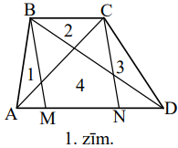

<small>

* questionType:
* domain:

</small>

## Atrisinājums

Pieskaitot pierādāmās vienādības $L(1)+L(2)+L(3)=L(4)$ abām pusēm 
$L(5)+L(6)+L(2)$, iegūstam ekvivalentu vienādību $L(ABC)+L(DBC)=L(BCNM)$, kas 
acīmredzami izriet no trijstūra un paralelograma laukumu formulām 
$L=\frac{1}{2} ah$ un $L=ah$.

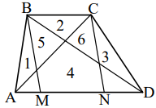

# <lo-sample/> LV.VOL.2005.9.2

Dots, ka $B$ - naturāls skaitlis, $A=7 \cdot B$ un $A$ ciparu summa divas 
reizes lielāka par $B$ ciparu summu. Skaitli $C$ iegūst, pierakstot skaitlim 
$A$ galā skaitli $B$.

**(A)** atrast kaut vienu šādu $C$,

**(B)** pierādīt, ka šādu $C$ ir bezgalīgi daudz,

**(C)** pierādīt, ka katrs šāds $C$ dalās ar $9$,

**(D)** vai $C$ noteikti dalās ar $27$?

<small>

* questionType:
* domain:

</small>

## Atrisinājums

**(A)** $B=27,\ A=7 \cdot 27=189,\ C=18927$.

**(B)** Var ņemt $B=\underbrace{270027002700 \ldots 270027}_{n\ reizes\ 27}$.

**(C)** Apzīmēsim patvaļīga naturāla skaitļa $X$ ciparu summu ar $S(X)$. Tā kā 
$A=\underbrace{B+B+B}_{7\ reies}$, tad, reizinot skaitli $B$ ar $7$, rodas 
pārnesumi (citādi būtu $S(A)=7 \cdot S(B)$ ). Tāpēc 
$2 \cdot S(B)=S(A)=7 \cdot S(B)-9 \cdot k$ ($k$ - pārnesumu skaits). Iegūstam 
$5 \cdot S(B)=9 \cdot k$, tātad $S(B)$ dalās ar $9$. Tāpēc 
$S(C)=S(A)+S(B)=2S(B)+S(B)=3S(B)$ arī dalās ar $9$; tāpēc $C$ dalās ar $9$.

**(D)** nē. Piemēram, var ņemt $B=117,\ A=819,\ C=819117$.

# <lo-sample/> LV.VOL.2005.9.3

Ap galdu sēž $8$ bērni. Katriem trīs pēc kārtas sēdošiem bērniem kopā ir nepāra
skaits konfekšu. Pierādīt, ka katram bērnam ir vismaz viena konfekte.

<small>

* questionType:
* domain:

</small>

## Atrisinājums

Uzdevuma apgalvojums būs pierādīts, ja pierādīsim: katram bērnam ir nepāra 
skaits konfekšu. Apzīmēsim bērniem esošo konfekšu skaitus, kā parādīts 
zīmējumā.

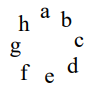

Pēc dotā $a+b+c,\ d+e+f,\ g+h+a$ ir nepāra skaitļi. Tad arī 
$(a+b+c)+(d+e+f)+(g+h+a)$ ir $h^{a}b$ nepāra skaitlis; tas nozīmē, ka 
$2a+(b+c+d+e+f+g+h)$ ir nepāra skaitlis. Tātad $(b+c+d)+(e+f+g)+h$ ir nepāra; 
tātad $h$ ir nepāra. Līdzīgi pierāda, ka $a;\ b;\ \ldots;\ g$ ir nepāra.

# <lo-sample/> LV.VOL.2005.9.4

Dots, ka $a$ un $b$ - tādi reāli skaitļi, ka $a+b$ ir vesels skaitlis un 
$a^{2}+b^{2}=2$. Atrast visus šādus $a$ un $b$ pārus un pierādīt, ka citu bez 
Jūsu atrastajiem nav.

<small>

* questionType:
* domain:

</small>

## Atrisinājums

Apzīmēsim $a+b=n$. Tad $2\left(a^{2}+b^{2}\right)=(a+b)^{2}+(a-b)^{2} \geq^{2}$,
tāpēc $n^{2} \leq 2 \cdot 2=4$ un $n=0;\ \pm 1;\ \pm 2$. Risinot vienādojumu 
sistēmas 
$\left\{\begin{array}{c}a+b= \pm 2 \\ a^{2}+b^{2}=2\end{array},\ \left\{\begin{array}{c}a+b= \pm 1 \\ a^{2}+b^{2}=2\end{array},\ \left\{\begin{array}{c}a+b=0 \\ a^{2}+b^{2}=2\end{array}\right.\right.\right.$,
iegūstam meklētos pārus 
$(1;\ 1),\ (-1;\ -1),\ (1;\ -1),\ (-1;\ 1)$, 
$\left(\frac{1+\sqrt{3}}{2}; \frac{1-\sqrt{3}}{2}\right),\ \left(\frac{1-\sqrt{3}}{2}; \frac{1+\sqrt{3}}{2}\right),\ \left(\frac{-1+\sqrt{3}}{2}; \frac{-1-\sqrt{3}}{2}\right)$,
$\left(\frac{-1-\sqrt{3}}{2}; \frac{-1+\sqrt{3}}{2}\right)$

# <lo-sample/> LV.VOL.2005.9.5

Katrs naturāls skaitlis no $1$ līdz $2005$ ieskaitot nokrāsots vienā no $n$ 
krāsām. Ir zināms: ja $a,\ b$ un $c$ ir dažādi skaitļi, $a$ dalās ar $b$ un $b$
dalās ar $c$, tad $a,\ b$ un $c$ nav visi nokrāsoti vienā un tai pašā krāsā. 
Atrast mazāko iespējamo $n$ vērtību.

<small>

* questionType:
* domain:

</small>

## Atrisinājums

**Atbilde:** $6$ krāsas.

**Risinājums.** Nekādi $3$ no $11$ skaitļiem 
$1;\ 2;\ 4;\ 8;\ 16;\ 32;\ 64;\ 128;\ 256;\ 512;\ 1024$ nevar būt nokrāsoti 
vienā krāsā. Tātad krāsu skaits ir vismaz $11:2=5,5$, tātad vismaz $6$.

Ar $6$ krāsām var iztikt. Ievērosim, ka neviens no apskatāmajiem skaitļiem 
nesatur vairāk par $10$ pirmreizinātājiem, jo $2^{11}=2048>2005$. Krāsojam $1.$
krāsā vieninieku un pirmskaitļus; otrajā krāsā divu un triju pirmskaitļu 
reizinājumus (varbūt reizinājumā pirmskaitļi atkārtojas), trešajā krāsā četru 
un piecu pirmskaitļu reizinājumus, utt.

# <lo-sample/> LV.VOL.2005.10.1

Dots, ka $ABCD$ un $CEFG$ ir kvadrāti, $M$ ir $BG$ viduspunkts un $N$ ir $DE$ 
viduspunkts (skat. 2.zīm.). Pierādīt, ka nogriežņi $CM$ un $CN$ ir savā starpā 
vienādi un perpendikulāri.

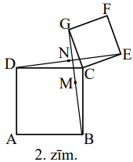

<small>

* questionType:
* domain:

</small>

## Atrisinājums

Viegli ievērot, ka $\triangle BCG$ iegūstams no $\triangle DCE$, pagriežot to 
par $90^{\circ}$ pretēji pulksteņa rādītāja kustības virzienam. Tāpēc arī $1.$ 
trijstūra mediāna $CM$ iegūstama no $2.$ trijstūra mediānas šajā pagriezienā. 
No tā seko vajadzīgais.

# <lo-sample/> LV.VOL.2005.10.2

Dots, ka $x,\ y,\ z$ un $t$ ir reāli skaitļi, no kuriem neviens nav $0$. 
Zināms, ka $x+y+z=t$, $\frac{1}{x}+\frac{1}{y}+\frac{1}{z}=\frac{1}{t}$ un 
$x^{3}+y^{3}+z^{3}=1000^{3}$.

**(A)** atrast kaut vienu šādu $x,\ y,\ z,\ t$ komplektu,

**(B)** aprēķināt $x+y+z+t$.

<small>

* questionType:
* domain:

</small>

## Atrisinājums

**(A)** $x=1;\ y=-1;\ z=1000;\ t=1000$.

**(B)** No dotā seko, ka 
$(x+y+z)\left(\frac{1}{x}+\frac{1}{y}+\frac{1}{z}\right)=1$. Šī vienādība 
ekvivalenti pārveidojas par $(x+y)(x+z)(y+z)=0$. Ja $x=-y$, tad 
$x^{3}+y^{3}+z^{3}=z^{3}=1000^{3},\ z=1000,\ t=(x+y)+z=1000$ un $x+y+z+t=2000$.
Citas iespējas, kad $x+z=0$ vai $y+z=0$, apskata līdzīgi.

# <lo-sample/> LV.VOL.2005.10.3

Kādām funkcijām $f$ vienlaicīgi piemīt sekojošas īpašības:

**(A)** $f$ definīcijas apgabals ir $\{1;\ 2;\ 3;\ 4;\ 5;\ 6;\ 7;\ 8;\ 9;\ 10\}$,

**(B)** $f$ vērtības ir naturāli skaitļi, kas nepārsniedz $100$,

**(C)** $f$ ir augoša funkcija,

**(D)** visiem $x$ un $y$ no definīcijas apgabala skaitlis 
$x \cdot f(x)+y \cdot f(y)$ dalās ar $x+y$?

<small>

* questionType:
* domain:

</small>

## Atrisinājums

Tā kā $xf(x)+yf(y)$ un $xf(y)+yf(y)$ dalās ar $x+y$, tad arī starpība 
$x(f(y)-f(x))$ dalās ar $x+y$. Pie $y=x+1$ iegūstam, ka $x(f(x+1)-f(x))$ dalās 
ar $2x+1(x=1;\ 2;\ \ldots;\ 9)$. Tā kā $LKD(x,\ 2x+1)=1$, tad $f(x+1)-f(x)$ 
dalās ar $2x+1$. Tā kā $f(t)$ ir augoša funkcija, tad $f(x+1)-f(x) \geq 2 x+1$.
Summējot šīs nevienādības pie $x=1;\ 2;\ \ldots;\ 9$, iegūstam

$$f(10)-f(1) \geq 3+5+\ldots+19=99$$

Tā kā $f(10) \leq 100$ un $f(1) \geq 1$, tad $f(1)=1$ un $f(10)=100$. Bez tam 
$f(x+1)-f(x)=2x+1(x=1;\ \ldots;\ 9)$, no kurienes seko, ka 
$\mathbf{f(x)=x^{2}}$. Pārbaude parāda, ka šī funkcija der.

# <lo-sample/> LV.VOL.2005.10.4

Uz riņķa līnijas $w$ ar centru $O$ izvēlēti divi punkti $A$ un $B$ tā, ka $AB$ 
nav diametrs. Uz trijstūrim $OAB$ apvilktās riņķa līnijas izvēlēts punkts $C$, 
kas nesakrīt ne ar $A$, ne ar $B$. Taisne $AC$ krusto $w$ punktos $A$ un $D$. 
Pierādiet, ka $DCB$ ir vienādsānu trijstūris.

<small>

* questionType:
* domain:

</small>

## Atrisinājums

Šķirojam divus gadījumus atkarībā no tā, vai $C$ un $O$ pieder vienam un tam 
pašam vai dažādiem $\triangle AOB$ apvilktās riņķa līnijas lokiem.

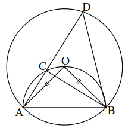

$\sphericalangle AOB=\sphericalangle ACB=\sphericalangle CDB+\sphericalangle DBC$
(ārējs leņķis). Bet 
$\sphericalangle CDB=\frac{1}{2} \sphericalangle AOB=\frac{1}{2} \sphericalangle ACB$,
tāpēc arī $\sphericalangle DBC=\frac{1}{2} \sphericalangle ACB$. No tā seko 
$CD=CB$.

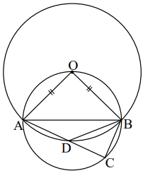

Tagad 
$\sphericalangle BDA=180^{\circ}-\frac{1}{2} \sphericalangle AOB=\sphericalangle DBC+\sphericalangle BCD$.
Bet $\sphericalangle BCD=180^{\circ}-\sphericalangle AOB$, tāpēc 
$180^{\circ}-\frac{1}{2} \sphericalangle AOB=180^{\circ}-\sphericalangle AOB+\sphericalangle DBC$,
no kurienes $\sphericalangle DBC=\frac{1}{2} \sphericalangle AOB$. Savukārt
$\sphericalangle BDC=180^{\circ}-\sphericalangle BDA=180^{\circ}-\left(180^{\circ}-\frac{1}{2} \sphericalangle AOB\right)=\frac{1}{2} \sphericalangle AOB$.
Tātad $\sphericalangle DBC=\sphericalangle BDC$ un $CB=CD$.

# <lo-sample/> LV.VOL.2005.10.5

Kādā universitātē strādā $n$ profesori, $n \geq 2$. Katrs profesors lasa 
lekcijas. Daži no viņiem klausās citu profesoru lekcijas. Ir zināms, ka

- neviens neklausās savas lekcijas,
- ja $A$ klausās $B$ lekcijas, tad $B$ neklausās $A$ lekcijas,
- ja $A$ ir profesors un $B$ ir profesors, tad var atrast tādu profesoru $C$, 
  kas klausās gan $A$ lekcijas, gan $B$ lekcijas.

**(A)** Pierādiet: var gadīties, ka $n=7$.

**(B)** Kādas vēl var būt $n$ vērtības?

<small>

* questionType:
* domain:

</small>

## Atrisinājums

Apzīmējam profesorus ar $P_{1}, P_{2}, \ldots, P_{7}$. Klausītāju kopas var būt
šādas:

$$\begin{array}{lll}
P_{1}:\ P_{2},\ P_{3},\ P_{4} & P_{4}:\ P_{2},\ P_{6},\ P_{7} & P_{6}:\ P_{1},\ P_{3},\ P_{7} \\
P_{2}:\ P_{3},\ P_{5},\ P_{6} & P_{5}:\ P_{1},\ P_{4},\ P_{6} & P_{7}:\ P_{1},\ P_{2},\ P_{5} \\
P_{3}:\ P_{4},\ P_{5},\ P_{7} & &
\end{array}$$

Ja $n$ profesoriem prasītās kopas ir konstruētas, tad, pievienojot vēl vienu 
profesoru, kuru klausās visi iepriekšējie $n$, iegūstam "klausīšanās sistēmu" 
$n+1$ profesoriem. Tātad var būt $n=8;\ 9;\ 10;\ \ldots$.

Pierādīsim, ka noteikti jābūt $n \geq 7$.

Vispirms pamatosim, ka katru klausās vismaz $3$ citi profesori. Tiešām, ja 
profesoru $A$ klausītos tikai $B$, tad neviens profesors neklausītos $A$ un 
$B$; ja profesoru $A$ klausītos tikai $B$ un $C$, tad $A$ un $B$ varētu 
klausīties tikai $C$, bet $A$ un $C$ - tikai $B$, tātad $B$ un $C$ klausītos 
viens otru - pretruna.

Tātad ir vismaz $n \cdot 3$ pāri $(A,\ B)$ ar īpašību " $A$ klausās $B$ 
lekcijas". No otras puses, šādu pāru nav vairāk par $\frac{n(n-1)}{2}$, jo nav 
divu profesoru, kas klausītos viens otru. Tāpēc $3 n \leq \frac{1}{2} n(n-1)$, 
no kurienes $n-1 \geq 6$ un $n \geq 7$.

# <lo-sample/> LV.VOL.2005.11.1

Ar $\{x\}$ apzīmē starpību starp $x$ un lielāko veselo skaitli, kas nepārsniedz
$x$. Piemēram, $\{1,6\}=0,6;\ \{3\}=0,\ \{-0,8\}=0,2$.

**(A)** atrast kaut vienu tādu racionālu skaitli $x$, ka 
$\left\{x^{2}\right\}+\{x\}=0,99$,

**(B)** pierādīt, ka šādu racionālu $x$ ir bezgalīgi daudz.

<small>

* questionType:
* domain:

</small>

## Atrisinājums

Viegli pārbaudīt, ka der visi skaitļi 
$10n+\frac{13}{10},\ n=0;\ 1;\ 2;\ \ldots$.

Tiešām, $\left(10n+\frac{13}{10}\right)^{2}=100n^{2}+26 n+1,69$, tāpēc 
$\left\{\left(10n+\frac{13}{10}\right)^{2}\right\}=0,69$ un 
$\left\{10n+\frac{13}{10}\right\}=0,3$.

# <lo-sample/> LV.VOL.2005.11.2

Dots, ka $ABC$ ir vienādsānu taisnleņķa trijstūris, $AB=AC$. Uz $AB$ ņemti 
tādi iekšēji punkti $P$ un $M$, ka $AM=BP$. Ar $D$ apzīmējam $BC$ viduspunktu. 
Punkts $R$ atrodas uz $CM$ un punkts $Q$ atrodas uz $BC$. Ir zināms, ka 
$A,\ R,\ Q$ ir uz vienas taisnes un $AQ \perp CM$ (skat. 3.zīm.).

Pierādīt, ka
**(A)** $\sphericalangle AQC=\sphericalangle PQB$;
**(B)** $\sphericalangle DRQ=45^{\circ}$.

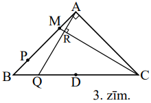

<small>

* questionType:
* domain:

</small>

## Atrisinājums

Papildinām $\triangle ABC$ līdz kvadrātam $ABEC$. Apzīmējam $AQ$ krustpunktu ar
$BE$ ar $N$.

**(A)** Tā kā $\sphericalangle ACM=\sphericalangle BAN$, tad 
$\triangle ACM=\triangle BAN \quad (h \ell)$. Tāpēc $BN=AM=BP$. Tāpēc 
$\triangle PBQ=\triangle NBQ \quad (m \ell m)$. Tāpēc 
$\sphericalangle PQB=\sphericalangle NQB=\sphericalangle AQC$.

**(B)** Tā kā $\triangle ADQ \sim \triangle CRQ$, tad 
$\frac{DQ}{RQ}=\frac{AQ}{CQ}$. No šejienes seko, ka 
$\triangle DRQ \sim \triangle ACQ$. Tāpēc 
$\sphericalangle DRQ=\sphericalangle ACQ=45^{\circ}$.

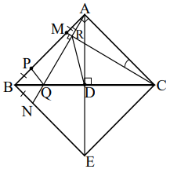

# <lo-sample/> LV.VOL.2005.11.3

Kādām $a$ vērtībām vienādojumam

$$4^{x}-\left(a^{2}+3a-2\right) \cdot 2^{x}+3a^{3}-2a^{2}=0$$

ir viens vienīgs atrisinājums reālos skaitļos?

<small>

* questionType:
* domain:

</small>

## Atrisinājums

Apzīmējam $2^{x}=y$ un iegūstam

$$y^{2}-\left(a^{2}+3a-2\right)y+3a^{3}-2a^{2}=0,\ y>0.$$

Vienādojumu tālāk pārveido par $\left(y-a^{2}\right)(y-3a+2)=0$.

Pie $a=0$ pozitīvu sakņu nav. Pie $a \neq 0$ ir pozitīva sakne $y_{1}=a^{2}$. 
Otrā sakne $y_{2}=3a-2$. Mūs apmierina nosacījumi $y_{2} \leq 0$ vai 
$y_{2}=y_{1}$. Iegūstam, ka meklējamās $a$ vērtības ir 
$(-\infty; 0) \cup\left(0; \frac{2}{3}\right) \cup\{1; 2\}$.

# <lo-sample/> LV.VOL.2005.11.4

Dots, ka $p$ - pirmskaitlis. Pierādīt, ka apgalvojumi "eksistē tāds vesels $x$,
ka $x^{2}+x+3$ dalās ar $p$ " un "eksistē tāds vesels $y$, ka $y^{2}+y+25$ 
dalās ar $p$ " vai nu abi ir pareizi, vai abi - nepareizi.

<small>

* questionType:
* domain:

</small>

## Atrisinājums

Ja $p=2$, tad ievērojam: $x^{2}+x=x(x+1)$ ir pāra skaitlis, tāpēc abi 
apgalvojumi ir aplami.

Ja $p=3$, ievērojam, ka $2^{2}+2+3$ dalās ar $3$ un $1^{2}+1+25$ dalās ar $3$, 
tātad abi apgalvojumi ir patiesi.

Pieņemam, ka $p>3$.

Ja $a^{2}+a+3 \vdots p$, tad arī $9a^{2}+9a+27 \vdots p$. Bet 
$9a^{2}+9a+27=(3a+1)^{2}+(3a+1)+25$. Tātad, ja patiess ir pirmais apgalvojums, 
tad patiess ir arī otrais.

Ja $b^{2}+b+25 \vdots p$, tad arī $(b+p)^{2}+(b+p)+25 \vdots p$ un 
$(b+2p)^{2}+(b+2p)+25:p$. Ievērojam, ka skaitļi $b,\ b+p$ un $b+2p$ dod dažādus
atlikumus, dalot ar $3$, jo $p>3$. Tātad viens no tiem ir formā $3c+1$, 
$c \in Z$. Iegūstam, ka $(3c+1)^{2}+(3c+1)+25 \vdots p$ jeb 
$9\left(c^{2}+c+3\right) \vdots p$. Tā kā $p>3$, no šejienes seko, ka 
$c^{2}+c+3:p$. Tātad, ja patiess ir otrais apgalvojums, tad patiess ir arī 
pirmais.

# <lo-sample/> LV.VOL.2005.11.5

Apskatām kubu, kura divās virsotnēs ierakstīts $1$, bet citās virsotnēs 
ierakstītas nulles. Ar vienu gājienu var izvēlēties vienu virsotni $X$ un 
pieskaitīt vieniniekus skaitļiem tajās $3$ virsotnēs, ko ar $X$ savieno 
šķautne. Atkārtojot šādus gājienus, jāpanāk, lai skaitļi visās kuba virsotnēs 
kļūtu vienādi. Kuriem sākotnējiem vieninieku izvietojumiem to var izdarīt?

<small>

* questionType:
* domain:

</small>

## Atrisinājums

**Atbilde:** to var izdarīt tad un tikai tad, ja vieninieki nav kuba vienas 
skaldnes pretējās virsotnēs.

- Ja vieninieki ir kuba diagonāles galapunktos, izdarām divus gājienus, 
  izvēloties par $X$ vispirms vienu, bet pēc tam otru no šiem galapunktiem.
- Ja vieninieki ir kuba šķautnes galapunktos, izdarām divus gājienus, 
  izvēloties par $X$ šiem galapunktiem pretējās kuba virsotnes.
- Ja vieninieki sākotnēji atrodas kuba skaldnes diagonāles pretējos galos, tad 
  sākumā starpība starp melnajās un baltajās virsotnēs ierakstīto skaitļu 
  summām ir $2$. Tā kā ar katru gājienu viena no šīm summām palielinās par $3$,
  bet otra nemainās, tad tās nekad nevar kļūt vienādas.

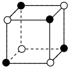

# <lo-sample/> LV.VOL.2005.12.1

Dots, ka $x$ un $y$ ir reāli skaitļi, $3^{x}+13^{y}=17^{x}$ un 
$5^{x}+7^{y}=11^{y}$. Pierādīt, ka $x<y$.

<small>

* questionType:
* domain:

</small>

## Atrisinājums

Pieņemsim no pretējā, ka $x \geqslant y$. Tad $13^{x} \geq 13^{y}$ un 
$5^{x} \geq^{y}$. No $3^{x}+13^{y}=17^{x}$ seko, ka $3^{x}+13^{x} \geq 7^{x}$ 
jeb $\left(\frac{3}{17}\right)^{x}+\left(\frac{13}{17}\right)^{x} \geq 1$. No 
eksponentfunkcijas īpašībām seko, ka $x<1$. Savukārt no $5^{x}+7^{y}=11^{y}$ 
līdzīgi iegūstam, ka 
$5^{y}+7^{y} \leq 1^{y},\left(\frac{5}{11}\right)^{y}+\left(\frac{7}{11}\right)^{y} \leq 1$
un $y>1$. Nevienādības $x<1<y$ ir pretrunā ar sākotnējo pieņēmumu.

# <lo-sample/> LV.VOL.2005.12.2

No punkta regulāra trijstūra $ABC$ iekšpusē vilkti perpendikuli pret tā malām. 
Šis punkts savienots arī ar trijstūra virsotnēm. Iegūtajos $6$ taisnleņķa 
trijstūros ievilktas riņķa līnijas. Apzīmēsim $i$-tajā trijstūrī ievilktās 
riņķa līnijas rādiusu ar $r_{i}$ (skat. 4.zīm.).

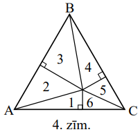 

Pierādīt, ka $r_{1}+r_{3}+r_{5}=r_{2}+r_{4}+r_{6}$.

<small>

* questionType:
* domain:

</small>

## Atrisinājums

No labi zināmas taisnleņķa trijstūrī ievilktās riņķa līnijas rādiusa garuma 
formulas $r=\frac{a+b-c}{2}$ (skat. 1.zīm.) iegūstam, ka pierādāmā vienādība 
ekvivalenta ar 

$AC_{1}+BA_{1}+CB_{1}=C_{1}B+A_{1}C+B_{1}A$ (2.zīm.).

Savukārt šīs vienādības pareizība kļūst acīmredzama, ja caur $P$ novelk taisnes
paralēli $ABC$ malām.

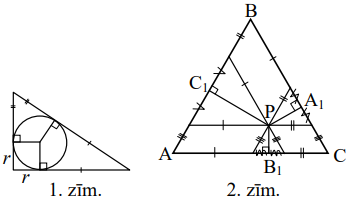

# <lo-sample/> LV.VOL.2005.12.3

Pa riņķa līniju izrakstīti naturāli skaitļi no $1$ līdz $n$ ieskaitot, katrs 
vienu reizi. Katriem diviem blakus uzrakstītiem skaitļiem atrodam to starpības 
absolūto vērtību. Atrast šo absolūto vērtību summas mazāko un lielāko iespējamo
vērtību.

<small>

* questionType:
* domain:

</small>

## Atrisinājums

**(A)** Kaut kur uz riņķa līnijas ir $1$, kaut kur $n$. Apskatām vienu no 
lokiem, kas "savieno" šos skaitļus. Ja uz tā atrodas vēl skaitļi 
$x_{1}; x_{2}; \ldots; x_{k}$, tad summa uz šī loka ir

$$\left|x_{1}-1\right|+\left|x_{2}-x_{1}\right|+\ldots+\left|n-x_{k}\right| \geq |x_{1}-1+x_{2}-x_{1}+\ldots+n-x_{k}|=n-1.$$

Līdzīgi spriežam par otru loku. Tātad visa apskatāmā summa nav mazāka par 
$2(n-1)$. Summu $2(n-1)$ iegūstam, izrakstot skaitļus pa riņķa līniju pēc 
kārtas.

**(B)** ja pēc kārtas uzrakstītie skaitļi ir $x_{1}, x_{2}, \ldots, x_{n}$, tad
apskatāmā summa ir

$$S=\left|x_{1}-x_{2}\right|+\left|x_{2}-x_{3}\right|+\ldots+\left|x_{n-1}-x_{n}\right|+\left|x_{n}-x_{1}\right|$$

Tā kā $|a|= \pm a$, tad $S$ sastāv no $2n$ saskaitāmajiem, no kuriem $n$ ir ar 
" $+$ " zīmi un $n$ ar " $-$ " zīmi.

Ja $n$ - pāra skaitlis, tad $S$ būs vislielākā, ja tā saturēs 
$\frac{n}{2}+1;\ \frac{n}{2}+2;\ \ldots;\ n$ katru divas reizes ar " $+$ " 
zīmi, bet $1;\ 2;\ \ldots;\ \frac{n}{2}$ katru divas reizes ar " $-$ " zīmi. 
Tad summa būtu $\frac{n^{2}}{2}$. Šādu summu var sasniegt, izrakstot skaitļus 
secībā $1;\ n;\ 2;\ n-1;\ \ldots;\ \frac{n}{2};\ \frac{n}{2}+1$.

Ja $n$ - nepāra skaitlis, tad $S$ būs vislielākā, ja 
$n;\ n-1;\ n-2;\ \ldots;\ \frac{n+3}{2}$ katrs būs divas reizes ar " $+$ " 
zīmi, $1;\ 2;\ 3;\ \ldots;\ \frac{n-1}{2}$ katrs būs divas reizes ar " $-$ " 
zīmi, bet $\frac{n+1}{2}$ būs vienu reizi ar " $+$ " zīmi, bet otru reizi ar 
" $-$ " zīmi. Tad summa būtu $\frac{n^{2}-1}{2}$. Šādu summu var sasniegt, 
izvēloties secību $1;\ n;\ 2;\ n-1;\ \ldots;\ \frac{n+3}{2};\ \frac{n+1}{2}$.

# <lo-sample/> LV.VOL.2005.12.4

Par skaitļu virkni $x_{1}, x_{2}, x_{3}, \ldots$ zināms, ka

- $x_{1}=1$
- $x_{2n}=1+x_{n}$ visiem naturāliem $n$
- $x_{2n+1}=\frac{1}{x_{2n}}$ visiem naturāliem $n$.

**(A)** Pierādiet, ka visi virknes locekļi ir dažādi.

**(B)** Kuri skaitļi ir šīs virknes locekļi?

<small>

* questionType:
* domain:

</small>

## Atrisinājums

Acīmredzami, visi virknes locekļi ir pozitīvi. Tāpēc $x_{2n}>1$, bet 
$x_{2n+1}<1(n \in N,\ n \geq 1)$. No šejienes seko, ka vienādi varētu būt tikai
divi locekļi ar vienādas paritātes indeksiem, kas pie tam lielāki par $1$. 
Viegli saprast, ka no $x_{k}=x_{m}$ seko $x_{k-1}=x_{m-1}$ pie nepāra indeksiem
$k$ un $m$ vai $x_{\frac{k}{2}}=x_{\frac{m}{2}}$ pie pāra indeksiem $k$ un $m$ 
utt., kas galu galā noved pie pretrunas (kad viens no locekļiem šajā vienādībā 
kļūst $x_{1}$).

**Tagad pierādīsim, ka katrs pozitīvs racionāls skaitlis sastopams šajā 
virknē.**

Pierādīsim to ar matemātisko indukciju pēc $k,\ k \geq$, tādiem pozitīviem 
nesaīsināmiem racionāliem skaitļiem $r$, ka $r=\frac{a}{b}$, un $a+b=k$. Pie 
$k=2$ ir tikai viens tāds skaitlis $r=\frac{1}{1}=1$, un $x_{1}=1$. Pieņemsim, 
ka apgalvojums pareizs pie $k=2;\ 3;\ \ldots;\ t$, un apskatīsim 
$r=\frac{a}{b},\ LKD(a,\ b)=1,\ a+b=t+1$. Skaidrs, ka $r \neq 1$. Šķirojam 
divus gadījumus:

- $r>1$. Apskatām skaitli $r_{1}=\frac{a-b}{b}$. Tā kā 
  $LKD(a-b,\ b)=LKD(a,\ b)=1$ un $a-b+b=a \leq t$, tad eksistē tāds $n$, ka 
  $x_{n}=\frac{a-b}{b}$. Bet tad $x_{2n}=1+x_{n}=\frac{a}{b}$, k.b.j.
- $0<r<1$. Apskatām skaitli $r_{2}=\frac{b-a}{a}$. Tā kā 
  $LKD(b-a,\ a)=LKD(b,\ a)=1$ un $b-a+a=b \leq t$, tad eksistē tāds $n$, ka 
  $x_{n}=\frac{b-a}{a}$. Tad $x_{2n}=1+x_{n}=\frac{b}{a}$ un 
  $x_{2n+1}=\frac{1}{x_{2n}}=\frac{a}{b}$, k.b.j.

# <lo-sample/> LV.VOL.2005.12.5

Katra no regulāra $1000$-stūra virsotnēm nokrāsota balta, sarkana vai zaļa. Ar 
vienu gājienu atļauts izvēlēties divas blakus esošas virsotnes, kas nokrāsotas 
dažādās krāsās, un pārkrāsot tās abas trešajā krāsā. Pierādiet, ka

- var panākt, lai visas virsotnes būtu nokrāsotas vienā un tai pašā krāsā,
- šī "beigu krāsa" viennozīmīgi atkarīga no sākotnējā krāsojuma.

<small>

* questionType:
* domain:

</small>

## Atrisinājums

Apzīmēsim krāsas ar $0;\ 1;\ 2$. Pierādīsim vispirms divas lemmas.

**Lemma 1.** Ja trīs no četrām sekojošām virsotnēm ir vienā krāsā, tad var 
panākt, lai tās visas būtu ceturtās virsotnes krāsā, nemainot citu virsotņu 
krāsojumu.

Pietiek apskatīt divus gadījumus:

$1110 \rightarrow 1122 \rightarrow 1002 \rightarrow 2202 \rightarrow 2112 \rightarrow 0012 \rightarrow 0000$;

$1011 \rightarrow 1221 \rightarrow 0021 \rightarrow 0000$

**Lemma 2.** Jebkuras četras sekojošas virsotnes var nokrāsot vienā krāsā.

Sadalām virsotnes divos blakus virsotņu pāros un panākam, lai katrā pārī krāsas
būtu vienādas. Ja tās visas vienādas, viss OK. Pretējā gadījumā rīkojamies pēc 
shēmas 
$1122 \rightarrow 1002 \rightarrow 2202 \rightarrow 2112 \rightarrow 0012 \rightarrow 0000$.

Saskaņā ar 2.lemmu var panākt, lai $A_{1}A_{2}A_{3}A_{4}$ būtu vienā krāsā, 
pieņemsim $0$, un arī $A_{5}A_{6}A_{7}A_{8}$ būtu vienā krāsā. Ja arī 
$A_{5}A_{6}A_{7}A_{8}$ ir krāsā $0$, nogaidām. Ja nē, apskatām 
$A_{4}A_{5}~A_{6}A_{7}$. Pēc 1.lemmas varam panākt, ka $A_{4}A_{5}A_{6}A_{7}$ 
ir krāsā $0$. Līdzīgi pievienojot pa $3$ virsotnēm, iegūstam, ka 
$A_{1}A_{2} \ldots A_{997}$ ir krāsā $0$. Apskatām 
$A_{998}A_{999}A_{1000}A_{1}$. Pārkrāsojam tās vienā krāsā (2. lemma). Ja tā 
ir krāsa $0$, viss kārtībā. Pieņemsim, ka tā ir krāsa $1$. Apskatām 
$A_{997}A_{998}A_{999}A_{1000}$ un saskaņā ar 1. lemmu pārkrāsojam tās krāsā 
$0$. Tagad $A_{1}$ ir krāsā $1$, citas virsotnes krāsā $0$. Tagad pakāpeniski 
pārkrāsojam krāsā $1$ virsotnes 
$A_{2}A_{3}A_{4};\ A_{5}A_{6}A_{7};\ \ldots;\ A_{998}A_{999}A_{1000}$, lietojot
1.lemmu.

Ievērosim, ka pieļautie gājieni 
$01 \rightarrow 22;\ 10 \rightarrow 22;\ 02 \rightarrow 11;\ 20 \rightarrow 11;\ 12 \rightarrow 00;\ 21 \rightarrow 00$
saglabā visu numuru summas atlikumu, dalot ar $3$. Bet šis atlikums vienāds ar 
galā iegūtās krāsas numuru, jo $1000x \equiv(\bmod 3)$. No šejienes seko otrais
apgalvojums.

