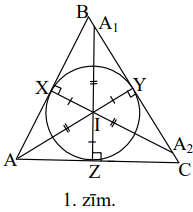
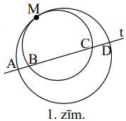
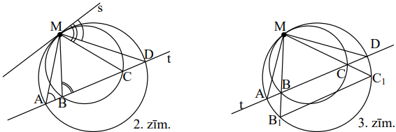
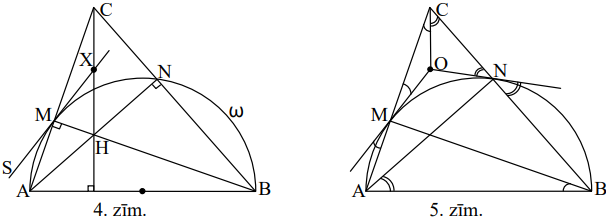
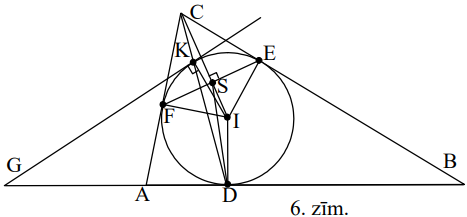
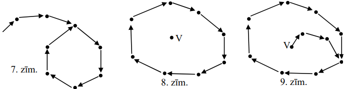

# <lo-sample/> LV.VOL.2006.9.1

Atrisināt vienādojumu $x+y=1025$, ja $x$ un $y$ ir naturāli skaitļi - skaitļa 
$640000$ dalītāji.

<small>

* questionType:
* domain:

</small>

## Atrisinājums

Viens no skaitļiem $x$ un $y$ ir pāra, otrs - nepāra. Skaitļa $640000$ nepāra 
dalītāji ir $1;\ 5;\ 25;\ 125;\ 625$. Ievērojam, ka 
$640000=5^{4} \cdot 2^{10}$. Tāpēc $1025-1=1024=2^{10},\ 1025-25=1000$ un 
$1025-625=400$ ir skaitļa $640000$ dalītāji, bet 
$1025-5=520=13 \cdot 5 \cdot 8$ un $1025-125=900$ nav.

**Atbilde.** 
$(1;\ 1024),\ (25;\ 1000),\ (400;\ 625),\ (625;\ 400),\ (1000;\ 25),\ (1024;\ 1)$.

# <lo-sample/> LV.VOL.2006.9.2

Apzīmējam $f(x)=x^{2}+px+q$. Zināms, ka vienādojumam $f(x)=0$ ir divas saknes, 
no kurām viena atrodas starp $0$ un $1$, bet otra - nē. Pierādīt, ka 
$f(q) \leq 0$.

<small>

* questionType:
* domain:

</small>

## Atrisinājums

Tā kā intervālā $(0;\ 1)$ atrodas tikai viena no kvadrātvienādojuma $f(x)=0$ 
saknēm, tad abas vērtības $f(0)$ un $f(1)$ reizē nevar būt pozitīvas. Tāpēc 
$f(0) \cdot f(1) \leq 0$. Iegūstam $q(p+q+1) \leq 0$ jeb $q^{2}+pq+q \leq 0$, 
jeb $f(q) \leq 0$.

## Atrisinājums

Pieņemsim, ka vienādojuma $f(x)=0$ saknes ir $x_{1}$ un $x_{2}$. Saskaņā ar 
Vjeta teorēmu

$$\begin{aligned}
& f(q)=q^{2}+pq+q=x_{1}^{2}x_{2}^{2}-x_{1}x_{2}\left(x_{1}+x_{2}\right)+x_{1}x_{2}=x_{1}x_{2}\left(x_{1}x_{2}-x_{1}-x_{2}+1\right)= \\
& =\left[x_{1}\left(1-x_{1}\right)\right] \cdot\left[x_{2}\left(1-x_{2}\right)\right] .
\end{aligned}$$

Saskaņā ar uzdevumā doto tieši viena no kvadrātiekavām ir negatīva, tāpēc to 
reizinājums ir $\leq 0$.

# <lo-sample/> LV.VOL.2006.9.3

Trijstūra $ABC$ ievilktās riņķa līnijas centrs ir $I$. Uz taisnes $AB$ atrasti 
tādi divi dažādi punkti $C_{1}$ un $C_{2}$, ka $IC_{1}=IC_{2}=IC$; uz taisnes 
$AC$ atrasti tādi divi dažādi punkti $B_{1}$ un $B_{2}$, ka $IB_{1}=IB_{2}=IB$;
uz taisnes $BC$ atrasti tādi divi dažādi punkti $A_{1}$ un $A_{2}$, ka 
$IA_{1}=IA_{2}=IA$.

Pierādīt, ka $A_{1}A_{2}+B_{1}B_{2}+C_{1}C_{2}=AB+BC+CA$.

<small>

* questionType:
* domain:

</small>

## Atrisinājums

Apzīmējam ievilktās riņķa līnijas pieskaršanās punktus $\triangle ABC$ malām ar
$X;\ Y;\ Z$ (skat. 1.zīm.) Taisnleņķa trijstūri $AXI,\ AZI,\ A_{1}YI$ un 
$A_{2}YI$ ir vienādi savā starpā $(hk)$, tāpēc $A_{1}A_{2}=AX+AZ$. Līdzīgi 
$B_{1}B_{2}=BX+BY$ un $C_{1}C_{2}=CY+CZ$. Saskaitot šīs vienādības, iegūstam 
vajadzīgo.

# <lo-sample/> LV.VOL.2006.9.4

Eksāmenam tika sagatavoti $8$ uzdevumi. Katram skolēnam iedeva $3$ no tiem. Nav
tādu divu skolēnu, kas būtu saņēmuši vairāk nekā vienu kopīgu uzdevumu. Kāds ir
lielākais iespējamais skolēnu skaits?

<small>

* questionType:
* domain:

</small>

## Atrisinājums

Ja uzdevumus apzīmējam ar $A;\ B;\ C;\ D;\ E;\ F;\ G;\ H$, tad $8$ skolēniem 
var iedot komplektus $ABC;\ ADE;\ AFG;\ BDG;\ BFH,\ CDH,\ CEF,\ EGH$. Tātad var
būt $8$ skolēni.

Ja kādu uzdevumu iedalītu $\geq 4$ skolēniem, tad katram no tiem jāsaņem vēl 
$2$ citi uzdevumi, un pavisam būtu vismaz $1+4 \cdot 2=9$ uzdevumi pretruna. 
Tātad katru uzdevumu iedeva augstākais $3$ skolēniem, un pavisam tika iedoti 
augstākais $8 \cdot 3=24$ uzdevumu teksti. Tā kā katrs skolēns saņēma trīs 
tekstus, tad skolēnu nav vairāk par $24:3=8$.

# <lo-sample/> LV.VOL.2006.9.5

Deviņos traukos pavisam kopā ir $36$ litri ūdens. Ūdeni, kas ir $1.$ traukā, 
sadalīja $8$ vienādās daļās un šīs daļas ielēja pārējos $8$ traukos (pa vienai 
daļai katrā traukā). Pēc tam to pašu izdarīja ar ūdeni, kas bija $2.$ traukā, 
$3.$ traukā, $\ldots$, $8.$ traukā, $9.$ traukā. Izrādījās, ka tagad katrā 
traukā ir tikpat ūdens, cik tur bija sākumā. Cik litru ūdens sākumā bija katrā 
traukā?

<small>

* questionType:
* domain:

</small>

## Atrisinājums

**Atbilde:** $8l;\ 7l;\ 6l;\ 5l;\ 4l;\ 3l;\ 2l;\ 1l;\ 01$.

**Risinājums.** To, ka minētā atbilde apmierina uzdevuma nosacījumus, pārbauda 
tieši. Pierādīsim, ka tā ir vienīgā. Tā kā pēc viena "cikla" ūdens sadalījums 
ir sākotnējais, mēs varam iztēloties, ka process notiek bezgalīgi un ir 
periodisks. Apskatīsim šajā bezgalīgajā periodiskajā procesā deviņu vienu otrai
sekojošu pārliešanu virkni, kas sākas ar ūdens izliešanu no tā trauka $T$, kurā
ir **vismazākais** procesa gaitā no trauka izlejamais ūdens daudzums; apzīmēsim
šo daudzumu ar $8x$. Saskaņā ar šo izvēli traukā $T$ astoņās nākošajās liešanās
tiks ieliets vismaz ūdens daudzums $x$ katrā reizē.

Tā kā traukā $T$ astoņās nākošajās liešanās kopā ielies ūdens daudzumu $8x$, 
tad **katrā** no šīm $8$ liešanām traukā $T$ ielies ūdens daudzumu $x$. Tātad 
**katrā** traukā tai brīdī, kad no tā izlej ūdeni, ir ūdens daudzums $8x$. No 
tā iegūstam, ka ūdens daudzums sākotnēji ir 
$8x;\ 7x;\ 6x;\ 5x;\ 4x;\ 3x;\ 2x;\ x;\ 0$. Tā kā $8x+7x+\ldots+x+0=36$, 
iegūstam $x=1$, no kā seko uzdevuma atbilde.

# <lo-sample/> LV.VOL.2006.10.1

Kādā valstī ir $100$ pilsētas. Starp dažām no tām noorganizēti avioreisi. Starp
katrām divām pilsētām ir augstākais viens reiss. Katrs reiss savieno tikai $2$ 
pilsētas, pa ceļam nenolaižoties citās. Katrs reiss "darbojas" abos virzienos. 
Reisus organizē $90$ aviokompānijas. Katra aviokompānija organizē tieši $30$ 
reisus. Ja kompānija organizē reisu starp kādām divām pilsētām (apzīmēsim tās 
ar $A$ un $B$), tad tai ir biroji gan pilsētā $A$, gan pilsētā $B$. Pierādīt, 
ka ir tāda pilsēta, kurā ir vismaz $9$ biroji.

<small>

* questionType:
* domain:

</small>

## Atrisinājums

Ja kādai kompānijai būtu mazāk par $9$ birojiem, tad tā nevarētu noorganizēt 
vairāk par $28$ reisiem, jo no $8$ elementiem var izveidot ne vairāk kā $28$ 
pārus. Tātad katrai kompānijai ir vismaz $9$ biroji, un biroju kopskaits ir 
vismaz $9 \cdot 90=810$. Tā kā $810>8 \cdot 100$, tad starp $100$ pilsētām ir 
jābūt tādai, kurā ir vairāk nekā $8$, tātad vismaz $9$ biroji.

# <lo-sample/> LV.VOL.2006.10.2

Kādiem pirmskaitļiem $p$ un $q$, kas nepārsniedz $100$, visi skaitļi 
$p+6,\ p+10,\ q+4,\ q+10$ un $p+q+1$ arī ir pirmskaitļi?

<small>

* questionType:
* domain:

</small>

## Atrisinājums

Skaidrs, ka $p \neq 2,\ q \neq 2,\ p \neq 3$. Ja $p=3k+2,\ k \in N$, tad $p+10$
nav pirmskaitlis. Tāpēc $p=3k+1,\ k \in N$. Ja $q=3m+1,\ m \in N$, tad 
$p+q+1=3(k+m+1)$ nav pirmskaitlis. Ja $q=3m+2,\ m \in N$, tad $q+10$ nav 
pirmskaitlis. Tāpēc $\mathbf{q=3}$. Tad $q+4$ un $q+10$ tiešām ir pirmskaitļi, 
un jāmeklē tādi pirmskaitļi $p$ formā $p=3k+1,\ k \in N$, ka $p+4,\ p+6,\ p+10$
arī ir pirmskaitļi. Tieša pārbaude parāda, ka der tikai 
$p=7,\ p=13,\ p=37,\ p=97$.

# <lo-sample/> LV.VOL.2006.10.3

Divas riņķa līnijas iekšēji pieskaras punktā $M$. Taisne $t$ krusto tās punktos
$A,\ B,\ C,\ D$ (skat. 1.zīm.) Pierādīt, ka 
$\sphericalangle AMB=\sphericalangle CMD$.

<small>

* questionType:
* domain:

</small>

## Atrisinājums

Speciālā gadījumā, ja $M$ ir loka $AMD$ viduspunkts, apskatām taisni $l$, kas 
iet caur $M$ un abu riņķu centriem. Tā ir perpendikulāra taisnei $t$, tātad 
krusto gan nogriezni $AD$, gan nogriezni $BC$ to viduspunktos. Tādā gadījumā 
$\sphericalangle AMB=\sphericalangle DMC$, jo šie leņķi ir viens otram 
simetriski attiecībā pret $l$.

Vispārīgā gadījumā (kas ietver arī speciālo), novelkam punktā $M$ abu riņķa 
līniju kopējo pieskari $s$ (skat. 2.zīm.) No ievilktu leņķu un hordas - 
pieskares leņķu īpašībām seko 2.zīm. atzīmētās leņķu vienādības. Redzams, ka 
$\sphericalangle CMD=$  un 
$\sphericalangle AMB=\sphericalangle MBC-\sphericalangle MAB$ (ārējā leņķa 
īpašība) $=$ , tātad 
$\sphericalangle CMD=\sphericalangle AMB$.

## Atrisinājums

Pagarinām $MB$ un $MC$ līdz krustpunktiem $B_{1}$ un $C_{1}$ ar ārējo riņķa 
līniju (skat. 3.zīm.) Tā kā abas riņķa līnijas ir homotētiskas ar centru $M$, 
tad $B_{1}$ un $C_{1}$ ir atbilstoši punktu $B$ un $C$ attēli šajā homotētijā; 
tātad taisne $B_{1}C_{1}$ ir taisnes $BC$ attēls, tāpēc 
$B_{1}C_{1} \parallel BC$. Tāpēc loki $AB_{1}$ un $C_{1}D$ ir vienādi, no kā 
seko uz tiem balstošos ievilkto leņķu vienādība.

# <lo-sample/> LV.VOL.2006.10.4

Pierādīt, ka 
$\frac{1}{\sqrt{1}+\sqrt{2}}+\frac{1}{\sqrt{3}+\sqrt{4}}+\frac{1}{\sqrt{5}+\sqrt{6}}+\ldots+\frac{1}{\sqrt{2005}+\sqrt{2006}}>21,8$

<small>

* questionType:
* domain:

</small>

## Atrisinājums

Ievērojam, ka

$$\begin{aligned}
& S=\frac{1}{\sqrt{1}+\sqrt{2}}+\frac{1}{\sqrt{2}+\sqrt{3}}+\frac{1}{\sqrt{3}+\sqrt{4}}+\ldots+\frac{1}{\sqrt{2004}+\sqrt{2005}}+\frac{1}{\sqrt{2005}+\sqrt{2006}}= \\
& =(\sqrt{2}-\sqrt{1})+(\sqrt{3}-\sqrt{2})+(\sqrt{4}-\sqrt{3})+\ldots+(\sqrt{2005}-\sqrt{2004})+(\sqrt{2006}-\sqrt{2005})=
\end{aligned}$$

$=\sqrt{2006}-1 \geq 43,7$. Tā kā **šajā** summā katrs nākošais saskaitāmais 
mazāks par iepriekšējo, tad uzdevuma formulējumā minēto saskaitāmo summa ir 
lielāka par $\frac{1}{2} S$, tātad lielāka par $21,85$.

# <lo-sample/> LV.VOL.2006.10.5

Kādam mazākajam naturālajam skaitlim $n$ piemīt šāda īpašība: vienalga kādā 
veidā nokrāsojot dažus no naturālajiem skaitļiem $1;\ 2;\ 3;\ \ldots;\ n$ 
baltus, bet pārējos - sarkanus, vienādojumam $x+y+z=t$ eksistē atrisinājums, 
kurā visu četru mainīgo vērtības ir vienā un tai pašā krāsā (starp šīm vērtībām
var būt arī savā starpā vienādas)?

<small>

* questionType:
* domain:

</small>

## Atrisinājums

**Atbilde:** $n=11$.

Vispirms parādīsim, ka pie $n=10$ skaitļus var nokrāsot tā, lai minētā tipa 
atrisinājums neeksistētu. Piemēram, nokrāsojam $1;\ 2;\ 9;\ 10$ baltus, bet 
$3;\ 4;\ 5;\ 6;\ 7;\ 8$ - sarkanus. Katru trīs sarkano saskaitāmo summa ir 
vismaz $3 \cdot 3=9$, tātad nav sarkana. Savukārt katru trīs baltu saskaitāmo 
summa ir vismaz $11$ (ja kāds no tiem ir $9$ vai $10$), vai no $3$ līdz $6$ (ja
neviens no tiem nav ne $9$, ne $10$), tātad nav balta.

Tagad parādīsim, ka pie $n=11$ minētā tipa atrisinājums noteikti eksistē. To, 
ka skaitlis $x$ ir balts resp. sarkans, pierakstīsim kā $x \sim b$ resp. 
$x \sim s$. Pieņemsim pretējo tam, kas jāpierāda. Šķirojam divus gadīumus.

- Skaitļi $1$ un $2$ ir vienā un tai pašā krāsā; varam pieņemt, ka $1 \sim s$ 
  un $2 \sim s$. Tā kā $1+1+1=3$ un $1+1+2=4$, tad $3 \sim b$ un $4 \sim b$.  
  Tad $3+3+3=9$, tāpēc $9 \sim s$; tā kā $3+4+4=11$, tad $11 \sim s$. Bet 
  $1+1+9=11$ pretruna.

- Skaitļi $1$ un $2$ ir dažādās krāsās; varam pieņemt, ka $1 \sim s$ un 
  $2 \sim b$. Tā kā $1+1+1=3$, tad $3 \sim b$. Tā kā $2+2+2=6$, tad $6 \sim s$;
  tā kā $2+3+3=8$, tad $8 \sim s$. Bet $1+1+6=8$ - pretruna.

# <lo-sample/> LV.VOL.2006.11.1

Skolā ir $n$ skolnieki un $m$ skolotāji. Ir zināms, ka katrs skolotājs māca 
tieši $a$ skolniekus, $a>1$, un katriem diviem dažādiem skolniekiem var atrast 
tieši $b$ skolotājus, kuri māca abus šos skolniekus. Pierādīt, ka

$$\frac{m}{b}=\frac{n(n-1)}{a(a-1)}$$

<small>

* questionType:
* domain:

</small>

## Atrisinājums

Attēlosim skolotājus ar $m$ sarkaniem punktiem, bet skolnieku pārus - ar 
$\frac{n(n-1)}{2}$ zaļiem punktiem. Ja kāds skolotājs māca abus kādā pārī 
ietilpstošos skolniekus, novilksim starp atbilstošajiem punktiem līniju. No 
katra sarkanā punkta iziet tieši $\frac{a(a-1)}{2}$ līnijas, tāpēc līniju 
kopskaits ir $\frac{1}{2} \cdot m \cdot a \cdot(a-1)$. No katra zaļā punkta 
iziet tieši $b$ līnijas, tāpēc līniju kopskaits ir 
$\frac{1}{2} \cdot b \cdot n \cdot(n-1)$. No vienādības 
$\frac{1}{2} \cdot m \cdot a \cdot(a-1)=\frac{1}{2} \cdot b \cdot n \cdot(n-1)$
seko vajadzīgais.

# <lo-sample/> LV.VOL.2006.11.2

Reālu skaitļu virknē $(a_{n})$, $n=1;\ 2;\ 3;\ \ldots$, pirmo locekli $a_{1}$ 
izvēlas patvaļīgi, bet katru nākošo aprēķina pēc formulas 
$a_{n+1}=a_{n}\left(a_{n}+2\right)$, $n=1;\ 2;\ 3;\ \ldots$. Kādas vērtības var
pieņemt $a_{2006}$?

<small>

* questionType:
* domain:

</small>

## Atrisinājums

Pieskaitot abām dotās vienādības pusēm $1$, iegūstam 
$a_{n+1}+1=\left(a_{n}+1\right)^{2}$. Tāpēc 
$a_{2006}+1=\left(a_{1}+1\right)^{2^{2005}}$. Tāpēc $a_{2006}+1 \geq 0$ un 
$a_{2006} \geq-1$. No otras puses, ja $\alpha \geq-1$, tad, izvēloties 
$a_{1}=\sqrt[22^{2005}]{\alpha+1}-1$, iegūsim $a_{2006}=\alpha$. Tāpēc 
$a_{2006}$ iespējamo vērtību kopa ir $[-1; \infty)$.

# <lo-sample/> LV.VOL.2006.11.3

Atrisināt naturālos skaitļos vienādojumu $(x+y)(xy+1)=2^{z}$.

<small>

* questionType:
* domain:

</small>

## Atrisinājums

Vispirms atzīmēsim, ka naturāliem $x$ un $y$ pastāv nevienādība 
$xy+1 \geq x+y$; tiešām, tā ir ekvivalenta ar $(x-1)(y-1) \geq 0$, kas ir 
patiesība. Lai izpildītos $(x+y)(xy+1)=2^{2}$, jābūt $x+y=2^{a},\ xy+1=2^{b}$, 
kur $a$ un $b$ - naturāli skaitļi; saskaņā ar iepriekšējo $b \geq a$. No tā, ka
$xy+1$ dalās ar $2^{a}$ un $x+y$ dalās ar $2^{a}$, seko, ka arī $x(x+y)$ dalās 
ar $2^{a};\left(x^{2}+xy\right)-(xy+1)$ dalās ar $2^{a}$; $x^{2}-1$ dalās ar 
$2^{a};\ (x+1)(x-1)$ dalās ar $2^{a}$

Ievērosim, ka $LKD(x+1;\ x-1)$ ir vai nu $1$, vai $2$. Tāpēc vai nu viens no 
skaitļiem $x+1$ un $x-1$ dalās ar $2^{a}$, vai arī viens no tiem dalās ar 
$2^{a-1}$, bet otrs ar $2$. Jebkurā gadījumā viens no skaitļiem $x+1$ un $x-1$ 
dalās ar $2^{a-1}$. Tā kā no nosacījuma $x+y=2^{a}$ seko, ka 
$1 \leq x \leq 2^{a}-1$, tad $x$ **var būt** tikai šādas vērtības: 
$x_{1}=1;\ x_{2}=2^{a-1}-1;\ x_{3}=2^{a-1}+1;\ x_{4}=2^{a}-1$, kur $a$ - 
naturāls skaitlis $\left(x=2^{a-1}-1\right.$ der tikai pie $a \geq 2$). 
Atbilstošās $y$ vērtības iegūst kā $y=2^{a}-x$, un $y_{1}=2^{a}-1$; 
$y_{2}=2^{a-1}+1;\ y_{3}=2^{a-1}-1;\ y_{4}=1$ (vērtība $y_{3}$ un tātad arī 
$x_{3}$ der tikai pie $a \geq 2$). Apkopojot redzam, ka **varbūt** der 
$(x; y)=\left(1; 2^{a}-1\right); \quad (x; y)=\left(2^{a}-1; 2^{a}+1\right); \quad (x; y)=\left(2^{a}+1; 2^{a}-1\right);$
$(x; y)=\left(2^{a}-1; 1\right),\ a$ - naturāls. Pārbaude parāda, ka šīs 
vērtības tiešām der; $z=2a$ vai $z=3a+1$.

# <lo-sample/> LV.VOL.2006.11.4

Dots, ka $\triangle ABC$ ir šaurleņķu trijstūris. Riņķa līnija $a$ iet caur $A$
un $B$ un krusto malas $AC$ un $BC$ attiecīgi punktos $M$ un $N$. Pieskares, 
kas $a$ novilktas punktos $M$ un $N$, krustojas punktā $O$. Pierādīt: $O$ ir 
$\Delta CMN$ apvilktās riņķa līnijas centrs tad un tikai tad, ja $AB$ ir $a$ 
diametrs.

<small>

* questionType:
* domain:

</small>

## Atrisinājums

**A.** Pieņemsim, ka $AB$ ir $a$ diametrs. Tad $AN$ un $BM$ ir $\triangle ABC$ 
augstumi; apzīmēsim $\triangle ABC$ augstumu krustpunktu ar $H$. Pieņemsim, ka 
pieskare, kas $a$ novilkta punktā $M$, krusto augstumu $CH$ punktā $X$. Tad 
$\sphericalangle MCX=90^{\circ}-\sphericalangle A=\sphericalangle ABM=\sphericalangle SMA$
(ievilkts un hordas - pieskares leņķis) $=\sphericalangle CMX$, tātad 
$\triangle MXC$ ir vienādsānu. Tātad $X$ atrodas uz $MC$ vidusperpendikula, 
tātad (pēc Talesa teorēmas) $CH$ viduspunktā. Līdzīgi arī $a$ pieskare, kas 
novilkta punktā $N$, krusto $CH$ tā viduspunktā, tātad punktā $X$, un $CX=NX$. 
No $MX=CX=NX$ seko, ka $X$ ir $\Delta CMN$ apvilktās riņķa līnijas centrs.

**B.** Pieņemsim, ka $O$ ir $\triangle CMN$ apvilktās riņķa līnijas centrs. Tad
(skat. 5.zīm.) $OC=OM=ON$, tāpēc 
$\sphericalangle CMO=\sphericalangle MCO=\sphericalangle ABM$ un 
$\sphericalangle CNO=\sphericalangle NCO=\sphericalangle NAB$. Tāpēc
$\sphericalangle ACB=\sphericalangle ABM+\sphericalangle BAN$ un 
$2 \sphericalangle ANB=\sphericalangle ANB+\sphericalangle AMB=180^{\circ}-\sphericalangle B-  +180^{\circ}-\sphericalangle A-\sphericalangle=  
=360^{\circ}-(\sphericalangle A+\sphericalangle B+\sphericalangle C)=180^{\circ}$,
tāpēc $\sphericalangle ANB=90^{\circ}$ un $AB$ ir $a$ diametrs.

# <lo-sample/> LV.VOL.2006.11.5

Regulāra $n$ - stūra $A$ virsotnēs ierakstīti skaitļi: $n-1$ virsotnē nulles, 
bet vienā virsotnē - vieninieks. Ar vienu gājienu atļauts izvēlēties jebkuru 
tādu regulāru daudzstūri $D$, kura visas virsotnes ir $n$-stūra $A$ virsotnēs, 
un visiem skaitļiem daudzstūra $D$ virsotnēs pieskaitīt $1$. Kādiem $n$, 
atkārtojot šādus gājienus, iespējams panākt, lai visās $n$-stūra $A$ virsotnēs 
būtu ierakstīti vienādi skaitļi?

<small>

* questionType:
* domain:

</small>

## Atrisinājums

To nevar panākt nevienam $n$. Apzīmēsim $n$-stūra $A$ virsotnes ar 
$A_{1}, A_{2}, \ldots, A_{n}$, bet centru - ar $O$. Apskatīsim lielumu 
$\vec{S}=a_{1} \cdot \overrightarrow{OA}_{1}+a_{2} \cdot \overrightarrow{OA}_{2}+\ldots+a_{n} \cdot \overrightarrow{OA}_{n}$,
kur $a_{i}$ ir virsotnē $A_{i}$ ierakstitais skaitlis $(i=1;\ 2;\ \ldots;\ n)$.
Sākotnēji $\vec{S}$ nav nulles vektors. Izdarot pieļauto gājienu, $\vec{S}$, 
"izmainās" par $\overrightarrow{0}$ (jo to vektoru summa, kas savieno $O$ ar 
regulārā $k$-stūra virsotnēm, noteikti ir $\overrightarrow{0}$), tāpēc 
$\vec{S}$ **nekad** nav $\overrightarrow{0}$. Bet, ja visās $n$-stūra $A$ 
virsotnēs atrastos vienādi skaitļi, tad būtu $\vec{S}=\overrightarrow{0}$.

# <lo-sample/> LV.VOL.2006.12.1

Pierādīt, ka 
$\left(1+\mbox{tg}\ 1^{\circ}\right)\left(1+\mbox{tg}\ 2^{\circ}\right)\left(1+\mbox{tg}\ 3^{\circ}\right) \ldots\left(1+\mbox{tg}\ 44^{\circ}\right)\left(1+\mbox{tg}\ 45^{\circ}\right)=2^{23}$

<small>

* questionType:
* domain:

</small>

## Atrisinājums

Ievērosim, ka 
$(1+\mbox{tg}\ x)\left(1+\mbox{tg}\ \left(45^{\circ}-x\right)\right)=(1+\mbox{tg}\ x)\left(1+\frac{1-\mbox{tg}\ x}{1+\mbox{tg}\ x}\right)=(1+\mbox{tg}\ x) \cdot \frac{2}{1+\mbox{tg}\ x}=2$
visām pieļaujamām $x$ vērtībām. Grupējot reizinātājus 
$\left(1+\mbox{tg}\ 1^{\circ}\right)$ un 
$\left(1+\mbox{tg}\ 44^{\circ}\right),\left(1+\mbox{tg}\ 2^{\circ}\right)$ un 
$\left(1+\mbox{tg}\ 43^{\circ}\right)$ utt., iegūstam vajadzīgo.

# <lo-sample/> LV.VOL.2006.12.2

Funkcija $f(x)$ definēta pie $0 \leq x \leq 1$. Zināms, ka $f(0)=f(1)=0$ un 
visiem $x$ un $y$ no intervāla $[0;\ 1]$ pastāv nevienādība

$$f\left(\frac{x+y}{2}\right) \leq f(x)+f(y)$$

**(A)** Pierādīt: vienādojumam $f(x)=0$ ir bezgalīgi daudz atrisinājumu,

**(B)** vai eksistē tāda funkcija, kas apmierina uzdevuma nosacījumus un starp 
kuras vērtībām ir tādas, kas atšķiras no $0$?

<small>

* questionType:
* domain:

</small>

## Atrisinājums

**(A)** Ievietojot $x=y=a$, iegūstam $f(a) \leq 2f(a)$, tāpēc $f(a) \geq 0$. 
Ņemot $x=0;\ y=1$, iegūstam

$0 \leq f\left(\frac{1}{2}\right) \leq f(0)+f(1)=0$ tāpēc 
$f\left(\frac{1}{2}\right)=0$.

Pieņemsim, ka ir jau pierādīts, ka kādam naturālam $k$ pastāv vienādība 
$f\left(\frac{1}{2^{k}}\right)=0$. Tad, ņemot $x=0$ un $y=\frac{1}{2^{k}}$, 
iegūstam 
$0 \leq f\left(\frac{1}{2^{k+1}}\right) \leq f(0)+f\left(\frac{1}{2^{k}}\right)=0$,
tāpēc $f\left(\frac{1}{2^{k+1}}\right)=0$. Tātad katram naturālam $n$ pastāv 
vienādība $f\left(\frac{1}{2^{n}}\right)=0$.

**(B)** funkcija

$$f(x)=\left\{\begin{array}{l}
0, \text {ja} x - \text {racionāls skaitlis} \\
1, \text {ja} x - \text {iracionāls skaitlis}
\end{array}\right.$$

apmierina visas uzdevuma prasības.

# <lo-sample/> LV.VOL.2006.12.3

Trijstūrī $ABC$ visas malas ir dažāda garuma un tajā ievilktās riņķa līnijas 
centrs ir $I$. Ievilktā riņķa līnija pieskaras malām $AB,\ BC,\ CA$ attiecīgi 
punktos $D,\ E,\ F$.

**(A)** Pierādīt, ka $\triangle CDI$ un $\Delta DSI$ ir līdzīgi, ja $S$ ir $CI$
un $EF$ krustpunkts,

**(B)** pieņemsim, ka $K$ ir nogriežņa $CD$ un ievilktās riņķa līnijas kopējais
punkts, kas atšķiras no $D$. Taisne, kas punktā $K$ pieskaras ievilktajai riņķa
līnijai, krusto taisni $AB$ punktā $G$. Pierādīt, ka $GS \perp CI$.

<small>

* questionType:
* domain:

</small>

## Atrisinājums

**(A)** Tā kā $CF=CE$, tad $\triangle ECF$ ir vienādsānu un tā bisektrise $CS$ 
ir arī augstums. Tāpēc $ES$ ir augstums pret hipotenūzu taisnleņķa trijstūrī 
$CEI$. Tāpēc $EI^{2}=IS \cdot IC$. Tā kā $EI=DI$, tad $DI^{2}=IS \cdot IC$, no 
kurienes $DI:IC=IS:ID$. Tāpēc $\Delta SID \sim \Delta DIC$ (kopējs leņķis $I$ 
un proporcionālas to ietverošās malas).

**(B)** Tā kā $\sphericalangle GKI=\sphericalangle GDI=90^{\circ}$, tad ap 
četrstūri $GKID$ var apvilkt riņķa līniju $\boldsymbol{\omega}$. No (A) punkta 
seko, ka 
$\sphericalangle ISD=\sphericalangle IDC=\sphericalangle IDK=\sphericalangle IKD$.
Tāpēc $S$ arī atrodas uz $\boldsymbol{\omega}$. Tāpēc 
$\sphericalangle GSI=\sphericalangleGKI=90^{\circ}$.

# <lo-sample/> LV.VOL.2006.12.4

Naturāli skaitļi $m$ un $n$ apmierina sekojošu īpašību: $m$ dalās ar jebkuru no
skaitļiem $1;\ 2;\ 3;\ \ldots;\ n$, bet nedalās ne ar $n+1$, ne ar $n+2$, ne ar
$n+3$. Kādas ir iespējamās $n$ vērtības?

<small>

* questionType:
* domain:

</small>

## Atrisinājums

Vispirms pierādīsim, ka $n+1;\ n+2;\ n+3$ ir kaut kādu pirmskaitļu pakāpes ar 
naturāliem kāpinātājiem. Pretējā gadījumā kāds no šiem skaitļiem būtu izsakāms 
kā reizinājums $a \cdot b$, kur $a \geq 2,\ b \geq 2,\ LKD(a,\ b)=1$. Tā kā $m$
nedalās ar $a \cdot b$, tad vai nu $m$ nedalās ar $a$, vai arī $m$ nedalās ar 
$b$; pieņemsim, ka $m$ nedalās ar $a$. Tad $a \geq n+1$. Tā kā 
$a \cdot b \leq n+3$, tad $a \cdot b-a \leq 2$ jeb $a(b-1) \leq 2$. Tas 
iespējams tikai, ja $a=2$ un $b=2$; tad $a \cdot b=4$. Ja $n+1=4$, tad $n=3$; 
ja $n+2=4$, tad $n=2$; ja $n+3=4$, tad $n=1$. Vērtība $n=3$ neapmierina 
uzdevuma nosacījumus (ja $m$ dalās ar $2$ un ar $3$, tad $m$ dalās arī ar $6$);
pie $n=1$ un $n=2$ visi skaitļi $n+1;\ n+2;\ n+3$ ir pirmskaitļu pakāpes.

Tātad $n+1;\ n+2;\ n+3$ ir pirmskaitļu pakāpes.

Vismaz viens no šiem skaitļiem ir pāra skaitlis, tātad ir $2^{x}$; tieši viens 
dalās ar $3$, tātad ir $3^{y}$. Tāpēc $2^{x}=3^{y} \pm 1$. Šķirojam abus 
gadījumus:

**(A)** $2^{x}=3^{y}+1$. Tā kā $2^{2t+1}=2 \cdot 4^{t}=2 \cdot(3+1)^{t}$, tad 
pie nepāra $x$ pakāpe $2^{x}$ dod atlikumu $2$, dalot ar $3$; tāpēc $x$ ir pāra
skaitlis, $x=2z$. Iegūstam $2^{2z}-1=3^{y}$ un 
$\left(2^{z}-1\right)\left(2^{z}+1\right)=3^{y}$. Tātad $2^{z}-1$ un $2^{z}+1$ 
ir trijnieka pakāpes vai $1$; tās savā starpā atšķiras par $2$, tāpēc ir $1$ un
$3$. Tāpēc $z=1,\ x=2$ un mūsu apskatāmā divnieka pakāpe ir $4$.

Ja $n+1=4$, tad $n=3$; jau iepriekš redzējām, ka tas neder. Ja $n+2=4$, tad 
$\mathbf{n=2}$; varam ņemt $m=2$. Ja $n+3=4$, tad $\mathbf{n=1}$; varam ņemt 
$m=1$.

**(B)** $2^{x}=3^{y}-1$. Pie $x=1$ nonākam pie $n=1$; pieņemam, ka $x \geq 2$. 
Ja $y$ - nepāra skaitlis, tad $y=2t+1$ un 
$3^{y}-1=3^{2t+1}-1=3 \cdot 9^{t}-1=3 \cdot(8+1)^{t}-1$ dalās ar $2$, bet 
nedalās ar $4$; tā nevar būt. Tāpēc $y=2z$ un 
$2^{x}=\left(3^{z}-1\right)\left(3^{z}+1\right)$. Tāpēc skaitļi $3^{z}-1$ un 
$3^{z}+1$ ir divnieka pakāpes vai $1$, kas savā starpā atšķiras par $2$; tie 
var būt tikai $2$ un $4$. Tad $2^{x}=8$. Ja $n+1=8$, tad $n=7$; tā kā $n+3=10$ 
nav pirmskaitļa pakāpe, šī atbilde neder. Ja $n+2=8$, tad $\mathbf{n=6}$; var 
ņemt $m=60$. Ja $n+3=8$, tad $n=5$; tā kā $n+1=6$ nav pirmskaitļa pakāpe, šī 
atbilde neder.

**Atbilde:** $n=1;\ n=2;\ n=6$.

# <lo-sample/> LV.VOL.2006.12.5

Uz katras daudzskaldņa šķautnes atzīmēta bultiņa. Zināms, ka katrā virsotnē 
ieiet vismaz viena bultiņa un no katras virsotnes iziet vismaz viena bultiņa.

**(A)** Pierādīt: ja daudzskaldnis ir izliekts, tad noteikti eksistē tāda 
skaldne, kuras kontūru var apiet, ejot pa malām bultiņu norādītajos virzienos,

**(B)** vai šī īpašība noteikti izpildās, ja daudzskaldnis nav izliekts?

<small>

* questionType:
* domain:

</small>

## Atrisinājums

Apskatīsim vispirms izliekta daudzskaldņa gadījumu.

Sākam iet no patvaļīgas virsotnes bultiņu virzienos pa šķautnēm. Tas ir 
iespējams, jo no katras virsotnes iziet kāda šķautne. Tā kā virsotņu ir galīgs 
skaits, tad kādreiz mēs atgriezīsimies virsotnē, kurā jau esam bijuši. Šai 
brīdī būs izveidojies cikls, kas apejams bultiņu virzienos (skat. 7.zīm.) Šis 
cikls sadala daudzskaldņa virsmu divās daļās. Apskatām $D$ - vienu no tām. Ja 
tajā iekšpusē nav ne citu virsotņu, ne citu šķautņu, tad tā ir skaldne, kāda 
mums nepieciešama. Pieņemsim, ka šīs daļas $D$ iekšpusē atrodas virsotne $V$ 
(skat. 8.zīm.)

Sākam iet no virsotnes $V$ pa šķautnēm bultiņu virzienos, kamēr

**(A)** vai nu nonākam uz jau esošā kontūra,

**(B)** vai arī mūsu jaunveidojamais ceļš izveido ciklu (kā iepriekš).

Otrajā gadījumā atrastais cikls ierobežo **mazāku** daļu nekā $D$. Pirmajā 
gadījumā (skat. 8.zīm.) sākam iet no virsotnes $V$ pa šķautnēm **pretēji** 
bultiņu virzieniem, kamēr nonākam kādā virsotnē, kas jau redzama 9.zīm.

Ja turpretī $D$ iekšpusē nav citu virsotņu, bet ir šķautne, tad apskatām šo 
šķautni kopā ar katru no $D$ kontūra daļām, kurās šī šķautne sadala $D$ 
kontūru.

Katrā gadījumā izveidosies daļa, kas **mazāka** par $D$ un apejama pa kontūru 
bultiņu virzienos.

Ar šo daļu rīkojamies tāpat kā iepriekš ar daļu $D$ utt. Tā kā nevaram atrast 
bezgalīgi daudzas arvien mazākas daļas, kuras norobežo pa šķautnēm ejošas 
kontūras, tad kādreiz iegūsim daļu, kas apejama pa kontūru bultiņu virzienā un 
kuras iekšpusē nav ne citu virsotņu, ne citu šķautņu, t.i., iegūsim mums 
vajadzīgo skaldni.

**Piezīme.** Viegli pamanīt, ka šādas skaldnes ir vismaz divas (pa vienai katrā
no tām daļām, kurās daudzskaldņa virsmu sadala pirmais atrastais cikls).

Ieliekta daudzskaldņa gadījumā šādu skaldni varbūt arī nevar atrast. Piemērs 
redzams 10.zīm. (Daudzskaldnis ir kubs ar prizmveidīgu "caurumu".)

**Piezīme.** Spriedumu, kas derīgs izliektam daudzskaldnim, šoreiz nevar 
atkārtot, jo sākotnējais (un arī katrs nākošais) cikls var **nesadalīt** virsmu
divās daļās, un tāpēc nav pamata apgalvot, ka katrs nākošais atrastais cikls 
ierobežo **mazāku** apgabalu nekā iepriekšējais, tāpēc mūsu aprakstītais 
meklēšanas process var nekad nebeigties.

