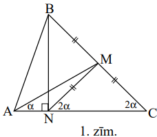
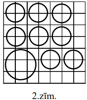
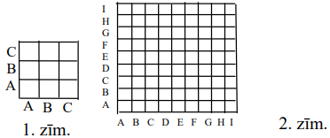
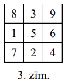
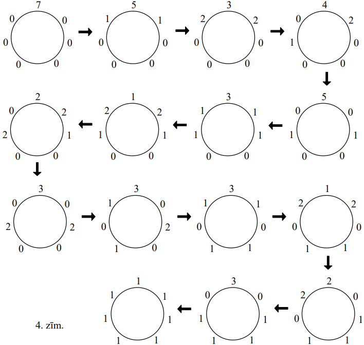
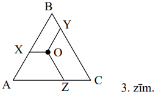
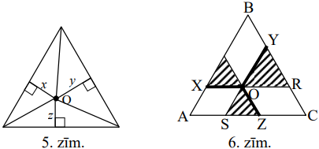
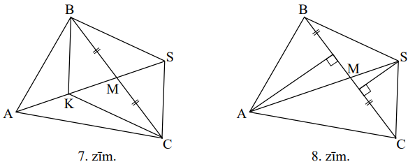
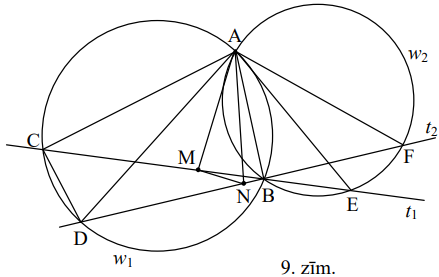

# <lo-sample/> LV.VOL.2007.9.1

Dots, ka $x \neq y$ un $x^{2}-2007x=y^{2}-2007y$. Aprēķiniet $x+y$ vērtību.

<small>

* questionType:
* domain:

</small>

## Atrisinājums

Doto vienādību pārveido par $x^{2}-y^{2}=2007(x-y)$ un tālāk par 
$(x-y)(x+y)=2007(x-y)$. Tā kā $x \neq y$, tad no šejienes seko $x+y=2007$.

# <lo-sample/> LV.VOL.2007.9.2

**(A)** Vai var gadīties, ka katram no kvadrātvienādojumiem $x^{2}+px+q=0$, 
$x^{2}+(p+1)x+(q+1)=0$ un $x^{2}+(p+2)x+(q+2)=0$ abas saknes ir veseli skaitļi?

**(B)** Vai var gadīties, ka bez tam arī vēl katram no kvadrātvienādojumiem 
$x^{2}+(p-1)x+(q-1)=0$ un $x^{2}+(p-2)x+(q-2)=0$ abas saknes ir veseli skaitļi?
(Saknes var būt arī vienādas.)

<small>

* questionType:
* domain:

</small>

## Atrisinājums

Var ņemt $p=1,\ q=-2$. Patvaļīgam veselam skaitlim $a$ apskatām vienādojumu 
$x^{2}+(a-1)x+(a-2)=0$. Tam ir saknes $x_{1}=-1$ un $x_{2}=2-a$.

# <lo-sample/> LV.VOL.2007.9.3

Šaurleņķu trijstūrī $ABC$ nogrieznis $AM$ ir mediāna, bet nogrieznis $BN$ - 
augstums. Dots, ka $\sphericalangle MCA=2 \cdot \sphericalangle MAC$. Pierādīt,
ka $BC=2 \cdot AN$.

<small>

* questionType:
* domain:

</small>

## Atrisinājums

Tā kā $\triangle BNC$ ir taisnleņķa, tad tajā mediāna pret hipotenūzu vienāda 
ar pusi no hipotenūzas, t.i., $NM=MC$. Tāpēc 
$\sphericalangle MNC=2 \alpha$. No $\triangle ANM$ ārējā leņķa seko, ka 
$\sphericalangle AMN=2 \alpha-\alpha=\alpha$, tātad $\triangle ANM$ - 
vienādsānu. Tāpēc $AN=NM=MC$, no kurienes seko vajadzīgais.

# <lo-sample/> LV.VOL.2007.9.4

Kvadrāts sastāv no $7 \times 7$ vienādām kvadrātiskām rūtiņām. Dažas no tām 
nokrāsotas melnas tā, ka katrā kolonnā un katrā rindā ir pāra skaits melnu 
rūtiņu (varbūt neviena). Kāds var būt kopējais melno rūtiņu skaits?

<small>

* questionType:
* domain:

</small>

## Atrisinājums

**Atbilde:** $0;\ 4;\ 6;\ 8;\ 10;\ \ldots;\ 38;\ 40;\ 42$.

**Risinājums.** Tā kā katrā rindā ir pāra skaits melno rūtiņu, tad (A) tas 
nepārsniedz $6$, un tādēļ kopējais melno rūtiņu skaits nepārsniedz 
$6 \cdot 7=42$, (B) kopējais melno rūtiņu skaits ir pāra skaitlis. Viegli 
saprast, ka $0$ melno rūtiņu var būt, bet $2$ melnas rūtiņas - nē (tas tomēr 
skolēna darbā jāpaskaidro!). Atliek parādīt, kā iegūt 
$4;\ 6;\ 8;\ \ldots;\ 40;\ 42$ melnas rūtiņas. Mēs to panāksim, izvietojot 
melnās rūtiņas divu veidu blokos: kvadrātos ar izmēriem $2k \times 2k$ rūtiņas,
kur **katra** rūtiņa ir melna, un kvadrātos ar izmēriem $(2k+1) \times(2k+1)$ 
rūtiņas, kur melnas ir visas rūtiņas, izņemot vienu diagonāli.

1) Vērtības $4;\ 8;\ 12;\ \ldots;\ 32;\ 36$ tiek iegūtas, izmantojot 
   $1;\ 2;\ 3;\ \ldots;\ 9$ kvadrātus ar izmēriem $2 \times 2$.
2) Vērtība $6$ tiek iegūta, izmantojot kvadrātu $3 \times 3$ (ievietojam to 
   lielā kvadrāta stūrī); vērtības $10;\ 14;\ 18;\ \ldots;\ 38$ tiek iegūtas, 
   pievienojot tam $1; 2; 3; \ldots; 8$ kvadrātus ar izmēriem $2 \times 2$ 
   (skat. 2.zīm.).
3) Vērtība $40$ tiek iegūta ar vienu $5 \times 5$ rūtiņu kvadrātu un pieciem 
   $2 \times 2$ rūtiņu kvadrātiem.
4) Vērtība $42$ tiek iegūta, izmantojot visu $7 \times 7$ rūtiņu kvadrātu.

# <lo-sample/> LV.VOL.2007.9.5

**(A)** Vai var 1.zīm. parādītās tabulas rūtiņās ierakstīt naturālus skaitļus 
no $1$ līdz $9$ (katrā rūtiņā - citu skaitli) tā, lai izpildītos īpašība: ja 
rinda un kolonna apzīmētas ar vienādiem burtiem, tad tajās ierakstīto skaitļu 
reizinājumi ir vienādi?

**(B)** Vai var 2.zīm. parādītās tabulas rūtiņās ierakstīt naturālus skaitļus 
no $1$ līdz $81$ (katrā rūtiņā - citu skaitli) tā, lai izpildītos tāda pati 
īpašība?

<small>

* questionType:
* domain:

</small>

## Atrisinājums

**(A)** jā, skat., piem., 3.zīm.

**(B)** nē. Apskatīsim pirmskaitļus 
$41;\ 43;\ 47;\ 53;\ 59;\ 61;\ 67;\ 71;\ 73;\ 79$. Tā kā tie visi lielāki par 
$\frac{1}{2} \cdot 81$, tad neviens cits ierakstāmais skaitlis ne ar vienu no 
tiem nedalās. Tāpēc šiem skaitļiem jābūt uz diagonāles (ja kāds pirmskaitlis 
sastopams rindiņas elementu reizinājumā, tad aritmētikas pamatteorēmas dēļ tam 
jābūt sastopamam arī atbilstošās kolonnas elementu reizinājumā). Bet šo 
pirmskaitļu pavisam ir $10$, un tie jāizvieto $9$ vietās - pretruna.

# <lo-sample/> LV.VOL.2007.10.1

Vai eksistē tādi naturāli skaitļi $x$ un $y$, ka izteiksmes $x^{2}-y^{2}-x+y$ 
vērtība ir

**(A)** $10$,

**(B)** $2007$?

<small>

* questionType:
* domain:

</small>

## Atrisinājums

**(A)** jā; piemēram, $x=4$ un $y=2$.
**(B)** nē; izteiksmi var pārveidot par $x(x-1)-y(y-1)$, no kurienes redzams, 
ka tā kā divu pāra skaitļu starpība ir pāra skaitlis.

# <lo-sample/> LV.VOL.2007.10.2

Pa apli izvietoti $n$ trauciņi, $n \geq 3$; dažos no tiem atrodas monētas 
(varbūt tikai viena vai neviena monēta). Monētu pavisam ir tieši $n$. Ja ir 
vismaz viens trauciņš, kurā atrodas ne mazāk par $2$ monētām, tad ar vienu 
gājienu atļauts izvēlēties vienu no šādiem trauciņiem, izņemt no tā $2$ monētas
un ielikt tās pa vienai abos blakus esošajos trauciņos. Ar iegūto situāciju 
drīkst izpildīt tādu pašu gājienu, utt.

Sākotnēji visas monētas atrodas vienā trauciņā. Vai var panākt, lai katrā 
trauciņā būtu tieši viena monēta, ja **(A)** $n=7$, **(B)** $n=10$?

<small>

* questionType:
* domain:

</small>

## Atrisinājums

**(A)** jā. Skat., piem., 4.zīm.

**(B)** nē. Sanumurēsim trauciņus pēc kārtas ar numuriem 
$1;\ 2;\ 3;\ \ldots;\ 10$. Monētu kopējais skaits $1.,\ 3.,\ 5.,\ 7.,\ 9.$ 
trauciņā sākumā ir pāra skaitlis un ar katru gājienu mainās par $2$. Tāpēc tas 
vienmēr paliek pāra skaitlis. Bet, sasniedzot uzdevuma mērķi, šajos trauciņos 
kopā būtu $5$ monētas - pretruna.

# <lo-sample/> LV.VOL.2007.10.3

Ja $n$ - naturāls skaitlis, kas lielāks par $1$, tad ar $x(n)$ apzīmējam 
lielāko pirmskaitli, kas nepārsniedz $n$, bet ar $y(n)$ - mazāko pirmskaitli, 
kas pārsniedz $n$. Piemēram, $x(6)=5$; $x(5)=5;\ y(5)=7$. Pierādīt, ka

$$\frac{1}{x(2) \cdot y(2)}+\frac{1}{x(3) \cdot y(3)}+\frac{1}{x(4) \cdot y(4)}+\ldots+\frac{1}{x(600) \cdot y(600)}=\frac{1}{2}-\frac{1}{601}$$

<small>

* questionType:
* domain:

</small>

## Atrisinājums

Ja $a$ un $b$ ir viens otram sekojoši pirmskaitļi un $a \leq n<b$, tad $x(n)=a$
un $y(n)=b$. Tāpēc katram šādam $n$ atbilstošais saskaitāmais summā ir 
$\frac{1}{a \cdot b}$. Ja visiem šādiem $n$ atbilstošie saskaitāmie summā ir, 
tad to daudzums ir tieši $b-a$.

Atliek ievērot, ka $601$ ir pirmskaitlis. Apzīmējot pirmskaitļus no $2$ līdz 
$601$ augošā kārtībā ar $p_{1}, p_{2}, \ldots, p_{n}$, iegūstam, ka apskatāmā 
summa ir
$\frac{p_{2}-p_{1}}{p_{1} p_{2}}+\frac{p_{3}-p_{2}}{p_{2} p_{3}}+\ldots+\frac{p_{n}-p_{n-1}}{p_{n-1}p_{n}}=\frac{1}{p_{1}}-\frac{1}{p_{2}}+\frac{1}{p_{2}}-\frac{1}{p_{3}}+\ldots+\frac{1}{p_{n-1}}-\frac{1}{p_{n}}=\frac{1}{p_{1}}-\frac{1}{p_{n}}=\frac{1}{2}-\frac{1}{601}$,
k.b.j.

# <lo-sample/> LV.VOL.2007.10.4

Regulāra trijstūra $ABC$ iekšpusē izvēlas patvaļīgu punktu $O$. Uz trijstūra 
malām $AB,\ BC,\ CA$ attiecīgi atrod tādus punktus $X,\ Y,\ Z$, ka 
$OX \parallel CA,\ OY \parallel AB,\ OZ \parallel BC$ (skat. 3.zīm.).

Pierādīt, ka nogriežņu $OX,\ OY,\ OZ$ vidusperpendikulu veidotā trijstūra 
laukums nav atkarīgs no $O$ izvēles.

<small>

* questionType:
* domain:

</small>

## Atrisinājums

Tā kā $OX,\ OY,\ OZ$ pa pāriem veido $120^{\circ}$ lielus leņķus, tad to 
vidusperpendikuli pa pāriem veido $60^{\circ}$ lielus leņķus, tāpēc to 
veidotais trijstūris $\Delta$ ir regulārs. Punkts $O$ atrodas $\Delta$ 
iekšpusē, un tā attālumu summa $\Sigma$ līdz $\Delta$ malām ir 
$\frac{1}{2}(OX+OY+OZ)$. Mēs pierādīsim divus faktus:

**A.** $\Sigma$ vienāda ar $\Delta$ augstumu,

**B.** $OX+OY+OZ=AC$.

No tā sekos, ka visiem $\Delta$ ir vienādi augstumi, tātad tie ir vienādi savā 
starpā; tātad visiem $\Delta$ ir vienādi laukumi.

Atliek pierādīt minētos faktus.

**A.** Apzīmējot $\Delta$ laukumu ar $L$, malas garumu ar $a$, bet augstumu ar 
$h$, iegūstam, ka $L=\frac{1}{2} ah$ un 
$L=\frac{1}{2} ax+\frac{1}{2} ay+\frac{1}{2} az$ (skat. 5.zīm.); no tā seko 
vajadzīgais.

**B.** Iesvītrotie trijstūri ir regulāri (skat. 6.zīm.). Tāpēc 
$OX+OY+OZ=OX+OR+SZ=AS+ZC+SZ=AC$, k.b.j.

# <lo-sample/> LV.VOL.2007.10.5

Uz papīra lapas uzrakstīti $n$ dažādi naturāli skaitļi, kas nepārsniedz $14$. 
Ir zināms: katru no naturāliem skaitļiem $1;2;3;...;27$ var izsacīt vai nu kā 
$x$, vai kā $2x$, vai kā $x+y$, kur $x$ un $y$ - kaut kādi uzrakstītie skaitļi.

Pierādīt, ka

**(A)** $n \geq 6$,

**(B)** $n \geq 7$.

<small>

* questionType:
* domain:

</small>

## Atrisinājums

No $n$ dažādiem skaitļiem var izveidot $\frac{n(n-1)}{2}$ summas $x+y$, kur 
$x \neq y; n$ summas $x+x=2x$; bez tam $n$ veidos var ņemt vienu pašu skaitli 
$x$. Tāpēc jābūt 

$$\begin{equation*}
\frac{n(n-1)}{2}+2n \geq 27 \tag{*}
\end{equation*}$$

no kurienes seko $n \geq 6$.

Apzīmēsim uzrakstīto skaitļu kopu ar $K$. Pie $n=6$ nevienādībā (*) pastāv 
vienādība. Tātad katram skaitlim no $1$ līdz $27$ jābūt izsakāmam vienā vienīgā
veidā. No tā pakāpeniski seko, ka $1 \in K;\ 2 \notin K$; 
$3 \in K;\ 4 \notin K;\ 5 \in$ K. Tagad redzam, ka $6$ var izsacīt gan kā 
$1+5$, gan kā $2 \cdot 3$ - pretruna.

# <lo-sample/> LV.VOL.2007.11.1

Dots, ka $n$ - naturāls skaitlis.

**(A)** vai skaitļiem $n$ un $n+2007$ ciparu summas var būt vienādas?

**(B)** vai skaitļiem $n$ un $n+199$ ciparu summas var būt vienādas?

<small>

* questionType:
* domain:

</small>

## Atrisinājums

**(A)** jā; piemēram, var ņemt $n=9$.

**(B)** nē. Skaitlis, dalot ar $9$, dod tādu pašu atlikumu kā tā ciparu summa. 
Ja uzdevumā minētais skaitlis $n$ eksistētu, tad $n$ un $n+199$ dotu vienādus 
atlikumus, dalot ar $9$. Tad to starpība $(n+199)-n=199$ dalītos ar $9$ - 
pretruna.

# <lo-sample/> LV.VOL.2007.11.2

Vai eksistē tādi trīs kvadrāttrinomi, ka katram no tiem ir vismaz viena sakne, 
bet nekādu divu kvadrāttrinomu summai sakņu nav?

<small>

* questionType:
* domain:

</small>

## Atrisinājums

Jā, eksistē. Piemēram, var ņemt trinomus $x^{2},\ (x-1)^{2}$ un $(x+1)^{2}$.

# <lo-sample/> LV.VOL.2007.11.3

Katra papīra lapas puse sadalīta $3$ daudzstūros. Vienā pusē viens daudzstūris 
nokrāsots balts, otrs - sarkans, trešais - zaļš.

Pierādīt: daudzstūrus lapas otrā pusē arī var nokrāsot vienu baltu, vienu 
sarkanu un vienu zaļu tā, lai vismaz trešā daļa no lapas laukuma būtu nokrāsota
vienādi no abām pusēm.

<small>

* questionType:
* domain:

</small>

## Atrisinājums

Sanumurēsim katrā lapas pusē esošos daudzstūrus ar skaitļiem $1;\ 2;\ 3$. Tās 
daļas laukumu, pa kuru "pārklājas" daudzstūris ar numuru $i$ lapas pirmajā pusē
un daudzstūris ar numuru $j$ lapas otrajā pusē, apzīmēsim ar $L_{ij}$; lapas 
kopējo laukumu apzīmēsim ar $L$. Skaidrs, ka

$$\left(L_{11}+L_{22}+L_{33}\right)+\left(L_{12}+L_{23}+L_{31}\right)+\left(L_{13}+L_{21}+L_{32}\right)=L$$

Tāpēc vismaz viena no iekavām nav mazāka par $\frac{L}{3}$. Pieņemsim, ka tā ir
iekava $L_{i_{1}j_{1}}+L_{i_{2}j_{2}}+L_{i_{3}j_{3}}$. Nokrāsojot vienādās 
krāsās daudzstūrus ar numuriem $i_{1}$ un $j_{1}$; $i_{2}$ un $j_{2}$; $i_{3}$ 
un $j_{3}$ (attiecīgi lapas pirmajā un otrajā pusē), iegūstam vajadzīgo.

# <lo-sample/> LV.VOL.2007.11.4

Uz trijstūra $ABC$ mediānas $AM$ ņemts tāds punkts $K$, ka 
$\sphericalangle BAC+\sphericalangle BKC=180^{\circ}$. Pierādīt, ka 
$AB \cdot KC=AC \cdot KB$.

<small>

* questionType:
* domain:

</small>

## Atrisinājums

Izvēlamies tādu punktu $S$, ka $BSCK$ ir paralelograms (skat. 7.zīm.); 
$A,\ K,\ M,\ S$ atrodas uz vienas taisnes.

Tad 
$\sphericalangle BAC+\sphericalangle BSC=\sphericalangle BAC+\sphericalangle BKC=180^{\circ}$.
Tāpēc arī $\sphericalangle ABS+\sphericalangle ACS=180^{\circ}$; no tā seko, ka
$\sin \sphericalangle ABS=\sin \sphericalangle ACS$.

Ievērojam, ka $L(ABM)=L(ACM)$ un $L(SBM)=L(SCM)$ (trijstūri ar vienādiem 
pamatiem un kopīgiem augstumiem). Tāpēc $L(ABS)=L(ACS)$.

Iegūstam 
$\frac{1}{2} AB \cdot BS \cdot \sin \sphericalangle ABS=\frac{1}{2} AC \cdot CS \cdot \sin \sphericalangle ACS$,
no kurienes seko $AB \cdot BS=AC \cdot CS$. Bet $BS=KC$ un $CS=KB$, no kurienes
seko vajadzīgais.

# <lo-sample/> LV.VOL.2007.11.5

Reālu skaitļu virknē $a_{1}, a_{2}, a_{3}, \ldots$ dots, ka 
$a_{11}=4,\ a_{22}=2$ un $a_{33}=1$. Bez tam visiem naturāliem $n$ pastāv 
vienādība 
$\frac{a_{n+3}-a_{n+2}}{a_{n}-a_{n+1}}=\frac{a_{n+3}+a_{n+2}}{a_{n}+a_{n+1}}$.

Pierādīt, ka

**(A)** neviens virknes loceklis nav $0$,

**(B)** virkne ir periodiska,

**(C)** $a_{1}^{k}+a_{2}^{k}+\ldots+a_{100}^{k}$ ir naturāla skaitļa kvadrāts, 
ja $k$ - patvaļīgs naturāls skaitlis.

<small>

* questionType:
* domain:

</small>

## Atrisinājums

Vispirms pierādīsim īpašību: katram naturālam 
$na_{n}=0 \Leftrightarrow a_{n+3}=0$. Tiešām, ja $a_{n}=0$, tad no dotās 
vienādības seko, ka saucēji un tātad arī skaitītāji ir pretēji skaitļi; no tā 
seko $a_{n+3}=0$. Ja $a_{n+3}=0$, no dotās vienādības seko, ka skaitītāji un 
tātad arī saucēji ir pretēji skaitļi; no tā seko $a_{n}=0$.

Izmantojot šo īpašību, iegūstam:

ja $n \geq 1$, tad $a_{3n} \neq 0$ (jo $a_{33} \neq 0$)

ja $n \geq 0$, tad $a_{3n+1} \neq 0$ (jo $a_{22} \neq 0$)

ja $n \geq 0$, tad $a_{3n+2} \neq 0$ (jo $a_{11} \neq 0$).

**Līdz ar to (A) daļa pierādīta.**

No dotās vienādības seko, ka

$$\left(a_{n+3}-a_{n+2}\right)\left(a_{n}+a_{n+1}\right)=\left(a_{n}-a_{n+1}\right)\left(a_{n+3}+a_{n+2}\right)$$

pēc vienkāršošanas iegūstam

$$\begin{equation*}
a_{n+1}a_{n+3}=a_{n}a_{n+2} \tag{1}
\end{equation*}$$

N̦emot $n$ vietā $n+1$ ， iegūstam

$$\begin{equation*}
a_{n+2}a_{n+4}=a_{n+1}a_{n+3} \tag{2}
\end{equation*}$$

Sareizinot (1) un (2), iegūstam

$$\begin{equation*}
a_{n+1}a_{n+2}a_{n+3}a_{n+4}=a_{n}a_{n+1}a_{n+2}a_{n+3} \tag{3}
\end{equation*}$$

Tā kā $a_{n+1}a_{n+2}a_{n+3} \neq 0$, no šejienes seko $a_{n+4}=a_{n}$.

**Tātad virkne ir periodiska ar periodu, ne lielāku kā $\mathbf{4}$.**

Tāpēc 
$a_{1}=a_{33}=1;\ a_{2}=a_{22}=2;\ a_{3}=a_{11}=4;\ a_{4}=\frac{a_{1} \cdot a_{3}}{a_{2}}=2$.
No šejienes 
$a_{1}^{k}+a_{2}^{k}+\ldots+a_{100}^{k}=25\left(1^{k}+2^{k}+4^{k}+2^{k}\right)=25\left(1+2^{k}\right)^{2}=\left(5\left(1+2^{k}\right)\right)^{2}$,
no kā seko vajadzīgais.

# <lo-sample/> LV.VOL.2007.12.1

Kādi var būt nenegatīvi reāli skaitļi $a$ un $b$, ja vienādojumiem 
$x^{2}+a^{2}x+b^{3}=0$ un $x^{2}+b^{2}x+a^{3}=0$ ir kopīga reāla sakne?

<small>

* questionType:
* domain:

</small>

## Atrisinājums

Ja $x$ - kopējā sakne, tad $x^{2}+a^{2}x+b^{3}=x^{2}+b^{2}x+a^{3}$, no kurienes
$\left(a^{2}-b^{2}\right) \cdot x=a^{3}-b^{3}$. Ja $a \neq b$, tad 
$x=\frac{a^{3}-b^{3}}{a^{2}-b^{2}}=\frac{a^{2}+ab+b^{2}}{a+b}=\frac{\left(a+\frac{b}{2}\right)^{2}+\frac{3b^{2}}{4}}{a+b}>0$.
Bet skaidrs, ka dotajiem vienādojumiem nav pozitīvu sakņu.

Ja turpretī $a=b$, tad abi vienādojumi ir identiski viens otram. Vienādojumam 
$x^{2}+a^{2}x+a^{3}=0$ ir reāla sakne tad un tikai tad, ja 
$a^{4}-4a^{3} \geq 0 \Leftrightarrow a^{3}(a-4) \geq 0$. Tā kā $a \geq 0$, tad 
tas ir gadījumos, ja $\mathbf{a=b=0}$ vai $\mathbf{a=b \geq 4}$.

# <lo-sample/> LV.VOL.2007.12.2

Katrī $n$-stūra prizmas virsotnē ierakstīts vai nu " $+1$ ", vai " $-1$ ". 
Zināms, ka katras skaldnes virsotnēs ierakstīto skaitļu reizinājums ir 
" $-1$ ".

Vai var būt, ka

**(A)** $n=4$,

**(B)** $n=10$?

<small>

* questionType:
* domain:

</small>

## Atrisinājums

**(A)** jā; piemēram, divās pretējās kuba virsotnēs ieraksta " $-1$ ", bet 
citās ieraksta " $+1$ ".

**(B)** nē. Pieņemsim, ka to izdevies izdarīt. Tad **visu** ierakstīto skaitļu 
reizinājums vienāds ar prizmas pamatu reizinājumu reizinājumu; tāpēc tas ir 
$(-1) \cdot(-1)=1$. No otras puses, tas ir piecu sānu skaldņu reizinājumu 
reizinājums (ņemot ik otro skaldni); tāpēc tas ir $(-1)^{5}=1$ - pretruna.

# <lo-sample/> LV.VOL.2007.12.3

Atrisināt vienādojumu sistēmu

$$\left\{\begin{array}{l}
\sin ^{2} x+\cos ^{2} y=y^{2} \\ \sin ^{2} y+\cos ^{2} x=x^{2}
\end{array}\right.$$

<small>

* questionType:
* domain:

</small>

## Atrisinājums

Ja $(x; y)$ ir sistēmas atrisinājums, tad atrisinājumi ir arī 
$(-x;y),\ (x;-y),\ (-x;-y)$; tāpēc meklēsim atrisinājumu pie 
$x \geq 0, y \geq 0$. Ja $(x; y)$ ir sistēmas atrisinājums, tad atrisinājums ir
arī $(y; x)$; tāpēc meklēsim atrisinājumu pie $x \leq y$.

Saskaitot abus vienādojumus, iegūstam

$$\begin{equation*}
x^{2}+y^{2}=2 \tag{1}
\end{equation*}$$

Atņemot abus vienādojumus, pēc pārveidojumiem iegūstam

$$\begin{equation*}
2 \sin ^{2} x-2 \sin ^{2} y=y^{2}-x^{2} \tag{2}
\end{equation*}$$

No (1) seko, ka $0 \leq x \leq y \leq \sqrt{2}<\frac{\pi}{2}$. Tā kā šajā 
apgabalā funkcijas $f(t)=\sin ^{2} t$ un $g(t)=t^{2}$ abas ir augošas, tad 
$\sin ^{2} x \leq \sin ^{2} y$ un $y^{2} \geq x^{2}$; tāpēc no (2) seko, ka 
$x=y$. No (1) iegūstam $x=y=1$. Pārbaude parāda, ka tas tiešām ir sistēmas 
atrisinājums.

Tātad sistēmai ir $4$ atrisinājumi 
$(x;y):\ (1;1),\ (1 ;-1),\ (-1 ; 1),\ (-1 ;-1)$.

# <lo-sample/> LV.VOL.2007.12.4

Divas riņķa līnijas $w_{1}$ un $w_{2}$ krustojas divos punktos $A$ un $B$. 
Taisne $t_{1}$ iet caur $B$ un krusto $w_{1}$ vēl punktā $C$, bet $w_{2}$ - vēl
punktā $E$. Taisne $t_{2}$ iet caur $B$ un krusto $w_{1}$ vēl punktā $D$, bet 
$w_{2}$ - vēl punktā $F$. Punkts $B$ atrodas gan starp $C$ un $E$, gan starp 
$D$ un $F$. Nogriežņu $CE$ un $DF$ viduspunktus apzīmējam attiecīgi ar $M$ un 
$N$.

Pierādīt, ka trijstūri $ACD,\ AEF$ un $AMN$ ir līdzīgi viens otram.

<small>

* questionType:
* domain:

</small>

## Atrisinājums

No ievilktu leņķu un krustleņķu īpašībām

$$\begin{equation*}
\sphericalangle \mathbf{CAD}=\sphericalangle CBD=\sphericalangle EBF=\sphericalangle \mathbf{EAF} \tag{1}
\end{equation*}$$

No ievilktu četrstūru un ievilktu leņķu īpašībām

$$\begin{equation*}
\sphericalangle \mathbf{ACD}=180^{\circ}-\sphericalangle ABD=\sphericalangle ABF=\sphericalangle \mathbf{AEF} \tag{2}
\end{equation*}$$

No (1) un (2) seko, ka $\triangle ACD \sim \triangle AEF$.

No $\sphericalangle ACB=\sphericalangle ADB$ un 
$\sphericalangle AEB=\sphericalangle AFB$ seko, ka 
$\triangle ACE \sim \triangle ADF$. Tāpēc $AC:AM=AD:AN$ (malas un mediānas 
attiecības līdzīgos trijstūros, tātad

$$\begin{equation*}
AC:AD=AM:AN \tag{3}
\end{equation*}$$

Bez tam $\sphericalangle CAM=\sphericalangle DAN$ (leņķi starp atbilstošajām 
malām un mediānām līdzīgos trijstūros). Atņemot no šīs vienādības abām pusēm 
$\sphericalangle DAM$, iegūstam

$$\begin{equation*}
\sphericalangle CAD=\sphericalangle MAN \tag{4}
\end{equation*}$$

No (3) un (4) seko $\triangle CAD \sim \triangle MAN$, k.b.j.

# <lo-sample/> LV.VOL.2007.12.5

Naturālo skaitļu kopa sadalīta daļās tā, ka katrs naturāls skaitlis nonācis 
tieši vienā daļā un katrā daļā ir bezgalīgi daudz skaitļu. Vai noteikti starp 
daļām atradīsies tāda, kas satur jebkura naturāla skaitļa daudzkārtņi?

Atbildēt uz šo jautājumu, ja

**(A)** daļu ir galīgs daudzums,

**(B)** daļu ir bezgalīgi daudz.

<small>

* questionType:
* domain:

</small>

## Atrisinājums

**Atbilde:** **(A)** jā, **(B)** nē.

**Risinājums.** Apskatām vispirms gadījumu ar galīgu daudzumu daļu. Pieņemsim, 
ka šīs daļas ir $A_{1},\ A_{2},\ \ldots,\ A_{n}$ un daļa $A_{i}$ nesatur 
nevienu skaitļa $x_{i}$ daudzkārtni, $i=1;\ 2;\ \ldots;\ n$. Skaitlis 
$x=x_{1} \cdot x_{2} \cdot x_{3} \cdot \ldots \cdot x_{n}$ pieder vienai no šīm
daļām; pieņemsim, ka $x \in A_{i}$. Tad no vienādības

$$x=x_{i} \cdot\left(x_{1}x_{2} \ldots x_{i-1}x_{i+1} \ldots x_{n}\right)$$

seko pretruna ar pieņēmumu.

Tagad parādīsim, ka bezgalīga daļu daudzuma gadījumā uzdevumā minētā situācija 
ir iespējama. Kopā $A_{1}$ ieskaitīsim vieninieku un visus pirmskaitļus. Katram
$i, i \geq 2$, kopā $A_{i}$ ieskaitīsim tos skaitļus, kas dalās ar tieši $i$ 
dažādiem pirmskaitļiem.

Katram naturālam $i$ daļa $A_{i}$ nesatur nevienu daudzkārtni skaitlim 
$p_{1} \cdot p_{2} \cdot \ldots \cdot p_{i} \cdot p_{i+1}$, kur 
$p_{1}, p_{2}, \ldots$, $p_{i}, p_{i+1}$ - dažādi pirmskaitļi (izmantojam 
aritmētikas pamatteorēmu).

