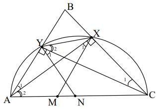

# <lo-sample/> LV.VOL.2008.9.1

Dots, ka $x$ un $y$ - naturāli skaitļi. Pierādīt, ka mazākais naturālais 
skaitlis, kas dalās gan ar $x$, gan ar, nav $x+y$

<small>

* questionType:
* domain:

</small>

## Atrisinājums

Pieņemsim pretējo. Tā kā $\frac{x+y}{x}=1+\frac{y}{x}$ un 
$\frac{x+y}{y}=1+\frac{x}{y}$, tad $x$ dalās ar $y$ un $y$ dalās ar $x$; tāpēc 
$x=y$. Bet tad $MKD(x, y)=MKD(x, x)=x \neq x+y$.

# <lo-sample/> LV.VOL.2008.9.2

Dots, ka $a,\ b$ un $c$ - pozitīvi skaitļi, pie tam pastāv vienādibas 
$ab=\frac{c-a+1}{b}=\frac{c+1}{2}$. Pierādīt, ka

- $b=1$,
- viens no skaitļiem, $b,\ c$ ir divu pārējo summas puse.

<small>

* questionType:
* domain:

</small>

## Atrisinājums

No dotā seko $ab^{2}+a=c+1$ un $2ab=c+1$, tātad $ab^{2}+a=2ab$ un 
$a(b-1)^{2}=0$. Tāpēc $b=1$. Tagad no vienādības $ab=\frac{c+1}{2}$ seko 
$a=\frac{c+b}{2}$.

# <lo-sample/> LV.VOL.2008.9.3

Katrs riņķa līnijas punkts nokrāsots vai nu balts, vai sarkans. Ir zināms: ja 
kāds vienādmalu trijstūris ievilkts šajā riņķa līnijā, tad vismaz $2$ no tā 
virsotnēm ir baltas.

Pierādīt: eksistē tāds šajā riņķa līnijā ievilkts kvadrāts, kuram vismaz 3$$ 
virsotnes ir baltas.

<small>

* questionType:
* domain:

</small>

## Atrisinājums

Apskatīsim $r.l.$ ievilktu regulāru $12$-stūri: $A_{1}A_{2} \ldots A_{12}$. 
Katrā no trijstūriem $A_{1}A_{5}A_{9},\ A_{2}A_{6}A_{10}$, 
$A_{3}A_{7}A_{11},\ A_{4}A_{8}A_{12}$ ir vismaz divas baltas virsotnes, tātad 
pavisam balto virsotņu ir vismaz astoņas. Tās sadalās pa trīs kvadrātiem 
$A_{1}A_{4}A_{7}A_{10},\ A_{2}A_{5}A_{8}A_{11},\ A_{3}A_{6}A_{9}A_{12}$. Ja 
katrā kvadrātā būtu augstākais divas baltas virsotnes, tad kopā to nebūtu 
vairāk par $6$ - pretruna.

# <lo-sample/> LV.VOL.2008.9.4

Dots, ka $ABC$ - trijstūris, bet $X$ un $Y$ - tādi punkti, ka 
$\sphericalangle AXB=\sphericalangle BYC=90^{\circ}$. Pierādīt, ka nogrieznis 
$XY$ nav garāks par $\triangle ABC$ pusperimetru.

<small>

* questionType:
* domain:

</small>

## Atrisinājums

Apzīmēsim ar $M$ un $N$ malu $AB$ un $BC$ viduspunktus. Tad 
$XM=\frac{1}{2} AB, \quad YN=\frac{1}{2} BC$ (mediāna pret hipotenūzu) un 
$MN=\frac{1}{2} AC$ (viduslīnija). Tāpēc 
$XY \leq XM+MN+NY \leq \frac{1}{2} AB+\frac{1}{2} CA+\frac{1}{2} BC=\frac{1}{2}(AB+BC+CA)$,
k.b.j.

# <lo-sample/> LV.VOL.2008.9.5

Dotas $27$ lodītes. Uz tām uzrakstīti numuri - naturālie skaitļi no $1$ līdz 
$27$ (uz katras lodītes - cits skaitlis). Lodītes kaut kā saliktas baltā, 
sarkanā un melnā kastē (katra lodīte ir vienā kastē). Zināms, ka baltajā kastē 
esošo lodīšu numuru vidējais aritmētiskais ir $15$; sarkanajā kastē esošo 
lodīšu numuru vidējais aritmētiskais ir $3$; melnajā kastē esošo lodīšu numuru 
vidējais aritmētiskais ir $18$. Cik lodīšu var būt baltajā kastē?

<small>

* questionType:
* domain:

</small>

## Atrisinājums

Apzīmēsim lodīšu daudzumu kastēs attiecīgi ar $b,s,m$. No nosacījuma par 
sarkano kasti seko, ka $s \leq 5$ (pat sešu **vismazāko** numuru vidējais 
aritmētiskais ir $(1+2+3+4+5+6):6=3 \frac{1}{2}>3$, un, pievienojot lielākus 
numurus, tas augs). Skaidrs, ka pastāv vienādības

$$b+s+m=27$$

$$15b+3s+18m=1+2+\ldots+27=378$$

No šejienes $(15b+3s+18m)-3(b+s+m)=378-3 \cdot 27=297$, tāpēc $12b+15m=297$ un 
$\mathbf{4b}+\mathbf{5m}=\mathbf{99}$.

Tiešas pārbaudes ceļā pārliecināsimies, ka $(b;m)$ var būt 
$(21;3),\ (16;7),\ (11;11),\ (6;15),\ (1;19)$; atbilstošās $s$ vērtības ir 
attiecīgi $3; 4; 5; 6; 7$, Tā kā $s \leq 5$, divas pēdējās iespējas atkrīt. 
Pierādīsim, ka trīs pirmās tiešām pastāv:

| baltajā kastē | $5;\ 6;\ \ldots;\ 25$ | $7;\ 8;\ \ldots; 14;\ 16;\ 17;\ \ldots;\ 23$ | $10;\ 11;\ \ldots;\ 20$ |
| :--- | :---: | :---: | :---: |
| sarkanajā kastē | $2;\ 3;\ 4$ | $1;\ 2;\ 4;\ 5$ | $1;\ 2;\ 3;\ 4;\ 5$ |
| melnajā kastē | $1;\ 26;\ 27$ | $3;\ 6;\ 15;\ 24;\ 25;\ 26;\ 27$ | $6;\ 7;\ 8;\ 9;\ 21;\ \ldots;\ 27$ |

# <lo-sample/> LV.VOL.2008.10.1

Dots, ka $a,\ b$ un $c$ ir pozitīvi skaitļi. Pierādīt, ka 
$(1+ab)(1+ac)(1+bc) \geq 8abc$.

<small>

* questionType:
* domain:

</small>

## Atrisinājums

No $VA$ - $VĢ$ nevienādības $1+ab \geq 2 \sqrt{ab}$; līdzīgi 
$1+ac \geq 2 \sqrt{ac}$ un $1+bc \geq 2 \sqrt{bc}$. Sareizinot šīs 
nevienādības, iegūstam vajadzīgo.

# <lo-sample/> LV.VOL.2008.10.2

Kuriem naturāliem skaitļiem $x$ piemīt īpašība: nosvītrojot $x$ trīs pēdējos 
ciparus, iegūst $\sqrt[3]{x}$?

<small>

* questionType:
* domain:

</small>

## Atrisinājums

Apzīmējam $3$ pēdējo ciparu veidoto skaitli ar $y$, bet pēc nosvītrošanas 
palikušo skaitli ar $a$. Tad $0 \leq y<1000$ un $a^{3}=1000a+y$. Tāpēc

1) $a^{3} \geq 1000a,\ a^{2} \geq 1000$ un $a \geq 32$,
2) $a^{3}<1000a+1000$ un $a(a^{2}-1000)<1000$.

Pie $a \geq 32$ šīs nevienādības kreisā puse ir pozitīva un augoša argumenta 
$a$ funkcija; viegli pārbaudīt, ka jau 
$33\left(33^{2}-1000\right)=33 \cdot 89>1000$, tātad $a<33$. Tātad 
$32 \leq a<33$; tā kā $a$ - naturāls skaitlis, tad varētu būt vienīgi $a=32$. 
Pārbaude (tā nepieciešama) parāda, ka $a=32$ der, jo $32^{3}=32768$.

# <lo-sample/> LV.VOL.2008.10.3

Ja $x$ un $y$ - naturāli skaitļi (vanbūt vienādi), tad ar $[x, y]$ apzīmējam to
mazāko kopīgo dalāmo. Kādus naturālus skaitļus $n$ var izteikt formā 
$n=[x, y]+[y, z]+[z, x]$?

<small>

* questionType:
* domain:

</small>

## Atrisinājums

**(A)** skaidrs, ka skaitli $1$ prasītajā veidā izteikt nevar, jo izteiksmes 
vērtība nav mazāka par $3$.

**(B)** ņemot $x=k,\ y=1,\ z=1$, iegūstam 
$[x, y]+[y, z]+[z, x]=k+1+k=2k+1, \quad k \in N$.

Tātad var izteikt visus nepāra skaitļus, kas lielāki par $1$.

**(C)** ja $n=[x, y]+[y, z]+[z, x]$, tad 
$[2x, 2y]+[2y, 2z]+[2z, 2x]=2([x, y]+[y, z]+[z, x])=2n$.

Tātad, ja var izteikt skaitli $n$, tad var izteikt arī skaitli $2n$. No 
šejienes un no (B) seko: var izteikt visus pāra skaitļus, kas nav divnieka 
pakāpes.

**(D)** pierādīsim, ka divnieka pakāpes $2^{k}, k \in N$, tā izsacīt nevar. Tas
ir acīmredzami pie $k=1$ (skat. (A) punktu). Pieņemsim, ka $k \geq 2$, un no 
pretējā pieņemsim, ka 
$2^{k}=[2^{a} \cdot x_{1}, 2^{b} \cdot y_{1}]+[2^{b} \cdot y_{1}, 2^{c} \cdot z_{1}]+[2^{c} \cdot z_{1}, 2^{a} \cdot x_{1}]$,
kur $a \geq b \geq c, x_{1}, y_{1}, z_{1}$ - nepāra skaitļi. Skaidrs, ka $k>a$ 
un $k>b$. Tad 
$2^{k}=2^{a}\left[x_{1}, y_{1}\right]+2^{b}\left[y_{1}, z_{1}\right]+2^{a}\left[z_{1}, x_{1}\right]$
un $2^{k-b}=2^{a-b}\left[x_{1}, y_{1}\right]+\left[y_{1}, z_{1}\right]+2^{a-b}\left[z_{1}, x_{1}\right]$.
Tā ir pretruna, jo kreisajā vienādības pusē ir pāra skaitlis, bet labajā - 
nepāra.

# <lo-sample/> LV.VOL.2008.10.4

Šaurleņķu trijstūrī $ABC$ novilkti augstumi $AX$ un $CY$. Uz malas $AC$ 
atzīmēti $M$ un $N$ tā, ka $XM \parallel AB$ un $YN \parallel BC$ (skat. 
1.zīm). Pierādīt, ka punkti $X,\ Y,\ M$ un $N$ atrodas uz vienas riņķa līnijas.

<small>

* questionType:
* domain:

</small>

## Atrisinājums

Tā kā $\sphericalangle AYC=\sphericalangle AXC$, tad $A,\ Y,\ X,\ C$ ir uz 
vienas riņķa līnijas. Tāpēc $\sphericalangle YAX=\sphericalangle YCX$ un 
$\sphericalangle XAC=\sphericalangle XYC$; 
$\sphericalangle CYN=\sphericalangle YCX$ un 
$\sphericalangle AXM=\sphericalangle YAX$ (iekšējie škērsleņķi). Tāpēc 
$\sphericalangle NYX=\sphericalangle_{1}+\sphericalangle_{2}$ un arī 
$\sphericalangle NMX=L_{1}+\sphericalangle_{2}$ ($\triangle AMX$ ārējais 
leņķis). No $\sphericalangle NYX=\sphericalangle NMX$ seko vajadzīgais.

# <lo-sample/> LV.VOL.2008.10.5

Universitātē strādā $12$ profesori. No tiem sastādītas $2008$ padomes. Nekādas 
divas padomes nesastāv no vieniem un tiem pašiem profesoriem, bet katrām divām 
padomēm var atrast vismaz vienu profesoru, kas piedāās tajās abās.

Pierādīt, ka var nodibināt vismaz vēl vienu padomi tā, lai abi minētie 
nosacījumi joprojām izpildītos.

<small>

* questionType:
* domain:

</small>

## Atrisinājums

Ir pavisam $2^{12}=4096$ profesoru kopas; tās var apvienot pa $2048$ pāriem 
$(A, Ā)$ (kopa un tās papildinājums). Tā kā $2048-1>2008$, tad eksistē tāda 
profesoru kopa $S$, ka ne $S$, ne $\overline{S}$ nav tukša kopa un ne $S$, ne 
$\overline{S}$ vēl nav padome.

Pieņemsim, ka $S$ nevar kalpot par jaundibināmo padomi. Tad $S$ nav kopīga 
locekļa ar kādu jau esošu padomi $P$. Tad $\overline{S}$ satur padomi $P$ kā 
apakškopu, tātad $\overline{S}$ ir kopīgs loceklis ar katru jau esošu padomi; 
tātad par jauno padomi var kalpot $\overline{S}$.

# <lo-sample/> LV.VOL.2008.11.1

Ar kādu mazāko gājienu skaitu šaha zirdziņš var nonākt no šaha galdiņa kreisā 
apakšějā stūra uz labo augšējo stūri?

<small>

* questionType:
* domain:

</small>

## Atrisinājums

Kā redzams zīmējumā, pietiek ar $6$ gājieniem. Ar $5$ gājieniem tas nav 
izdarāms, jo pēc $5.$ gājiena zirdziņš būs uz balta lauciņa; ar $\leq 4$ 
gājieniem nepietiek, jo tajos kopā zirdziņš būs pārvietojies pa labi un uz 
augšu par $\leq 4 \cdot 3=12$ vienībām, bet kopējam pārvietojumam jābūt vismaz 
$7+7=14$.

# <lo-sample/> LV.VOL.2008.11.2

Atrisināt vienādojumu

$$|\ldots|||x-1|-10|-10^{2}\left|-\ldots-10^{2007}\right|=10^{2008}$$

<small>

* questionType:
* domain:

</small>

## Atrisinājums

Apzīmējam $a_{n}=|\ldots||| x-1|-10|-10^{2}\left|-\ldots-10^{n-1}\right|-10^{n}$.
Tad $a_{2007}=\mp 10^{2008}$. No $a_{2007}=\left|a_{2006}\right|-10^{2007}$ 
seko, ka $\left|a_{2006}\right|=\mp 10^{2008}+10^{2007}$. Tā kā 
$-10^{2008}+10^{2007}<0$, tad $\left|a_{2006}\right|=10^{2008}+10^{2007}$ un 
$a_{2006}=\mp\left(10^{2007}+10^{2008}\right)$. Līdzīgi turpinot (precīzs 
pierādījums ar indukciju), iegūstam, ka $|x-1|=10^{1}+10^{2}+\ldots+10^{2008}$,
no kurienes $x_{1}=\underbrace{11 \ldots 1}_{2009}$ un 
$x_{2}=\underbrace{-11 \ldots 109}_{2007}$.

# <lo-sample/> LV.VOL.2008.11.3

Dots, ka $n$ - naturāls skaitlis un skaitļa $n^{2}$ decimālajāa pierakstā viens
cipars ir " $2$ ", bet pārējie cipari ir " $1$ ". Pierādit, ka $n$ dalās ar 
$11$.

<small>

* questionType:
* domain:

</small>

## Atrisinājums

Kvadrāts nebeidzas ar " $2$ ", tātad $n^{2}$ beidzas ar " $1$ ". Ja 
priekšpēdējais cipars būtu $1$, tad $n^{2}=\ldots 11=\ldots 00+11$ dotu 
atlikumu $3$, dalot ar $4$; tā nevar būt, jo $(2k)^{2}=4 \cdot k^{2}$ un 
$(2k+1)^{2}=4 \cdot\left(k^{2}+k\right)+1$. Tāpēc priekšpēdējais cipars ir $2$.
Ja $n^{2}=\underbrace{11 \ldots 121}_{nep.skaits}$, tad $n^{2}$ dalās ar $11$ 
saskaņā ar dalāmības pazīmi. Ja 
$n^{2}=\underbrace{11 \ldots 121}_{pāra\ skaits}$, tad $n^{2}$, dalot ar $11$, 
dod tādu pašu atlikumu kā $1-2+(1-1+1-1+\ldots+1-1)$, t.i., atlikumu $10$. Bet 
tas nevar būt:

$$\begin{array}{ll}
(11k)^{2}=121 \mathrm{k}^{2} & \text {atl.} 0 \\
(11k \mp 1)^{2}=121k^{2} \mp 22k+1 & \text {atl.} 1 \\
(11k \mp 2)^{2}=121k^{2} \mp 44k+4 & \text {atl.} 4 \\
(11k \mp 3)^{2}=121k^{2} \mp 66k+9 & \text {atl.} 9 \\
(11k \mp 4)^{2}=121k^{2} \mp 88k+16 & \text {atl.} 5 \\
(11k \mp 5)^{2}=121k^{2} \mp 110k+25 & \text {atl.} 3
\end{array}$$

# <lo-sample/> LV.VOL.2008.11.4

Stars $t$ ir $\sphericalangle AOB$ bisektrise, $CA \perp OA$ un $DB \perp OB$ 
(skat. 2.zīm.). Punkts $M$ ir $CD$ viduspunkts. Pierādit, ka $MA=MB$.

<small>

* questionType:
* domain:

</small>

## Atrisinājums

Novelkam vēl perpendikulus $CE$ un $MF$. Tad $M$ ir taisnleņķa trapeces $DBEC$ 
sānu malas $DC$ viduspunkts, tātad atrodas uz viduslīnijas; tāpēc $EF=FB$. 
Tātad $\triangle EMB$ ir vienādsānu (augstums sakrīt ar mediānu), tātad 
$ME=MB$. Atliek ievērot, ka "simetrijas pēc" $ME=MA$.

# <lo-sample/> LV.VOL.2008.11.5

Kvadrāts sastāv no $10 \times 10$ vienādām kvadrātiskām rūtiņām. Katra rūtiņa 
nokrāsota vienā no $10$ krāsām; katrā krāsā nokrāsotas tieši $10$ rūtiņas. 
Pierādīt: var atrast vai nu tādu rindu, vai tādu kolonnu, kurā sastopamas 
vismaz $4$ krāsas.

<small>

* questionType:
* domain:

</small>

## Atrisinājums

Pieņemsim, ka $i$-tā krāsa sastopama $x_{i}$ rindiņās un $y_{i}$ kolonnās. Tad 
$x_{i} \cdot y_{i} \geq 10$. Tāpēc 
$x_{i}+y_{i} \geq 2 \sqrt{x_{i} y_{i}} \geq 2 \sqrt{10} \geq 2 \cdot 3, \ldots>6$,
tātad $x_{i}+y_{i} \geq 7$. Tāpēc 
$\left(x_{1}+y_{1}\right)+\left(x_{2}+y_{2}\right)+\ldots+\left(x_{10}+y_{10}\right) \geq 70$.
Ja katra rinda un katra kolonna saturētu ne vairāk par $3$ krāsām, tad būtu ne 
vairāk kā $3 \cdot(10+10)=60$ "gadījumu", kad kāda krāsa sastopama kādā rindā 
vai kolonnā - pretruna.

# <lo-sample/> LV.VOL.2008.12.1

Vai eksistē tādi reāli skaitļi $a,\ b$ un $c$, ka 
$a+b+c=\frac{1}{a}+\frac{1}{b}+\frac{1}{c}=0$?

<small>

* questionType:
* domain:

</small>

## Atrisinājums

Pieņemsim, ka tādi skaitļi eksistē.

Ievērosim, ka 
$\frac{1}{a}=-\left(\frac{1}{b}+\frac{1}{c}\right)=-\frac{b+c}{bc}=-\frac{-a}{bc}=\frac{a}{bc}$,
tātad $a^{2}=bc$. Tātad $bc>0$, tātad $b$ un $c$ ir vai nu abi pozitīvi, vai 
abi negatīvi. Tas pats attiecas uz $a$ un $b$. Tātad $a,\ b,\ c$ vai nu visi 
pozitīvi, vai visi negatīvi. Bet tad nevar būt $a+b+c=0$ - pretruna.

# <lo-sample/> LV.VOL.2008.12.2

Vienā un tai pašā koordinātu sistēmā $0xy$ uzzīmēti funkciju $y=x^{2}+x+a$ un 
$x=y^{2}+y+b$ grafiki ($a$ un $b$ - konstantes). Zināms, ka tie krustojas $4$ 
punktos. Pierādīt, ka šie $4$ punkti atrodas uz vienas riņķalīnijas.

<small>

* questionType:
* domain:

</small>

## Atrisinājums

Visu $4$ krustpunktu koordinātes $(x, y)$ apmierina **gan** nosacījumu 
$x=y^{2}+y+b$, **gan** $y=x^{2}+x+a$, tātad arī nosacījumu 
$x+y=\left(x^{2}+y^{2}\right)+(x+y)+(a+b)$ jeb $x^{2}+y^{2}=-(a+b)$. Tātad visi
$4$ punkti atrodas attālumā $\sqrt{-(a+b)}$ no koordinātu sākumpunkta, kas 
tātad ir meklētās riņķa līnijas centrs.

# <lo-sample/> LV.VOL.2008.12.3

Atrisināt naturālos skaitļos vienādojumu

$$x^{2}+(x+1)^{2}=y^{2}$, ja $x \leq 200$

<small>

* questionType:
* domain:

</small>

## Atrisinājums

Risinām vienādojumu $x^{2}+(x+1)^{2}=(x+a)^{2},\ a \geq 2,\ a \in N$.

Tas pārveidojas par $x^{2}+(2-2a)x+\left(1-a^{2}\right)=0$, no kurienes 
$x=a-1+\sqrt{2a(a-1)}>2(a-1)$.

Tā kā jābūt $x \leq 200$, tad $2 \leq a \leq 101$; bez tam $2a(a-1)$ jābūt 
vesela skaitļa kvadrātam. Šķirojam divus gadījumus:

1) $a$ - nepāra skaitlis. Tad skaitļiem $a$ un $2(a-1)$ nav kopīgu 
   pirmreizinātāju (jo $a$ un $a-1$ nekad nav kopīgu pirmreizinātāju); tāpēc 
   tiem abiem jābūt kvadrātiem. Kā kandidāti der tikai $a=9;\ 25;\ 49;\ 81$. 
   Pārbaude rāda, ka der tikai $a=9$; tad $\mathbf{x}=\mathbf{20}$ un 
   $\mathbf{y}=\mathbf{29}$.
2) $a$ - pāra skaitlis. Tad skaitļiem $2a$ un $a-1$ nav kopīgu pirmreizinātāju;
   tāpēc gan $2a$, gan $a-1$ jābūt kvadrātam. Kā kandidāti der tikai 
   $a=2;\ 8;\ 18;\ 32;\ 50;\ 72;\ 98$. Pārbaude rāda, ka der tikai $a=2$ un 
   $a=50$. Iegūstam $\mathbf{x}=\mathbf{3};\ \mathbf{y=4}$ un 
   $\mathbf{x}=119;\ \mathbf{y}=169$.

# <lo-sample/> LV.VOL.2008.12.4

Dots, ka $ABC$ ir šaurleņķu trijstūris, $AB>AC$ un 
$\sphericalangle BAC=60^{\circ}$. Apvilktās riņķa līnijas centrs ir $O$, bet 
augstumu krustpunkts ir $H$. Taisne $OH$ krusto malas $AB$ un $AC$ attiecīgi 
punktos $P$ un $Q$. Pierādīt, ka $PO=HQ$.

<small>

* questionType:
* domain:

</small>

## Atrisinājums

Punkti $O$ un $H$ atrodas $\triangle ABC$ iekšpusē, jo tas ir šaurleņķu. Ja $N$
ir $AB$ viduspunkts, tad $ON \perp AB$. Saskaņā ar doto 
$AE=\frac{1}{2} AB=AN$. No ievilkta un centra leņķa īpašībām 
$\sphericalangle NOA=\sphericalangle BCA$, tāpēC 
$\sphericalangle NAO=90^{\circ}-\sphericalangle BCA$; arī 
$\sphericalangle EAH=90^{\circ}-\sphericalangle BCA$, tātad 
$\sphericalangle NAO=\sphericalangle EAH$. Tāpēc $\triangle AON=\triangle AHE$ 
$(\ell m \ell)$. Tātad $AO=AH$ un $\triangle OAH$ ir vienādsānu; tātad 
$\sphericalangle AOH=\sphericalangle AHO$. No tā un no 
$\sphericalangle NOA=\sphericalangle EHA$ seko 
$\sphericalangle PON=\sphericalangle QHE$. Tāpēc 
$\triangle OPN=\triangle HQE\ (\ell m \ell)$; tāpēc arī $OP=HQ$, k.b.j.

# <lo-sample/> LV.VOL.2008.12.5

Uz taisnes atrodas figūriņa. Andris un Maija spēlē spēli. Viņi izdara gājienus 
pamīšus; sāk Andris. Andris ar savu kārtējo gājienu nosauc pozitīvu skaitli, 
kas nepārsniedz $1$; pēc tam Maija pārbīda figūriņu pa taisni par Andra 
nosaukto attālumu uz to pusi, uz kuru viņa vēlas. Maija nedrīkst $12$ reizes 
pēc kārtas bīdīt figūriņu vienā virzienā. Vai Andris var panākt, lai figūriņa 
nonāk tālāk nekā attālumā $2008$ pa labi no sākotnējās atrašanās vietas, pat ja
Maija cenšas to nepieļaut?

<small>

* questionType:
* domain:

</small>

## Atrisinājums

Jā, Andris to var panākt. Vispirms parādīsim kā Andris var panākt, lai figūriņa
pārbīdītos par attālumu $\frac{1}{2^{12}}$ pa labi, sākot ar sākotnējo 
pozīciju. Vispirms Andris nosauc skaitli $\frac{1}{2^{12}}$. Ja Maija bīda 
figūriņu pa labi, mērķis sasniegts. Ja Maija bīda figūriņu pa kreisi, Andris 
nosauc skaitli $\frac{1}{2^{11}}$. Ja Maija bīda figūriņu pa labi, mērķis 
sasniegts, jo 
$\left(-\frac{1}{2^{12}}\right)+\frac{1}{2^{11}}=\frac{1}{2^{12}}$. Ja Maija 
bīda figūriņu pa kreisi, Andris nosauc skaitli $\frac{1}{2^{10}}$, utt. Ja 
Maija $n$ reizes bīdījusi figūriņu pa kreisi $(n \leq 11)$, bet $(n+1)$-ā reizē
bīda to pa labi, tad kopējā pārbīde pa labi ir 
$\left(-\frac{1}{2^{12}}\right)+\left(-\frac{1}{2^{11}}\right)+\ldots\left(-\frac{1}{2^{13}-n}\right)+\frac{1}{2^{12-n}}=\frac{1}{2^{12}}$
Ja Andris sasniedz šo mērķi vairāk nekā $2008 \cdot 2^{12}$ reizes, figūriņa 
pārbīdījusies par attālumu vairāk nekā $2008$ pa labi.

