# <lo-sample/> LV.VOL.2009.9.1

Dots, ka $a$ ir tāds reāls skaitlis, ka kvadrātvienādojumam $x^{2}-x+a=0$ ir 
divas dažādas reālas saknes $x_{1}$ un $x_{2}$. Pierādīt: 
$\left|x_{1}^{2}-x_{2}^{2}\right|=1$ tad un tikai tad, ja 
$\left|x_{1}^{3}-x_{2}^{3}\right|=1$.

<small>

* questionType:
* domain:

</small>

## Atrisinājums

Saskaņā ar Vjeta teorēmu $\left|x_{1}^{2}-x_{2}^{2}\right|=1 \Leftrightarrow\left|\left(x_{1}-x_{2}\right)\left(x_{1}+x_{2}\right)\right|=1 \Leftrightarrow\left|x_{1}-x_{2}\right|=1 \Leftrightarrow 2 \sqrt{\frac{1}{4}-a}=1 \Leftrightarrow a=0$, kā arī $\left|x_{1}^{3}-x_{2}^{3}\right|=1 \Leftrightarrow\left|\left(x_{1}-x_{2}\right)\left(x_{1}^{2}+x_{1} x_{2}+x_{2}^{2}\right)\right|=1 \Leftrightarrow \mid \sqrt{1-4 a}\left(\left(x_{1}+x_{2}\right)^{2}-x_{1} x_{2}\right)=1 \Leftrightarrow$ $\Leftrightarrow \sqrt{1-4 a}|1-a|=1 \Leftrightarrow 4 a^{3}-9 a^{2}+6 a=0 \Leftrightarrow a=0$.

# <lo-sample/> LV.VOL.2009.9.2

Naturālu skaitli sauc par vienkāršu, ja tas ir divu (vienādu vai dažādu) 
pirmskaitļu reizinājums. Piemēram, $9=3 \cdot 3$ ir vienkāršs, bet 
$18=2 \cdot 3 \cdot 3-$ nav. Kāds lielākais daudzums pēc kārtas sekojošu 
naturālu skaitļu var visi būt vienkārši?

<small>

* questionType:
* domain:

</small>

## Atrisinājums

**Atbilde:** trīs skaitļi.

**Risinājums:** triju skaitļu piemērs ir 
$33=3 \cdot 11,\ 34=2 \cdot 17,\ 35=5 \cdot 7$. No četriem pēc kārtas ņemtiem 
naturāliem skaitļiem viens dalās ar $4$; ja tas pats nav $4$, tad tas nav 
vienkāršs. Tieši pārbaudot četru pēc kārtas ņemtu skaitļu komplektus, kas satur
" $4$ ", redzam, ka neviens no tiem neder.

# <lo-sample/> LV.VOL.2009.9.3

Plakne sadalīta vienādos kvadrātiņos kā rūtiņu lapa. Katrs kvadrātiņš nokrāsots
vienā no $k$ krāsām. Ir zināms: katrā tādā figūrā, kāda redzama 1.zīm. (šī 
figūra var būt arī pagriezta vai apgriezta "uz mutes"), visas rūtiņas 
nokrāsotas dažādās krāsās. Kāda ir mazākā iespējamā $k$ vērtība?

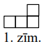

<small>

* questionType:
* domain:

</small>

## Atrisinājums

**Atbilde:** $k=8$. 

Krāsojumu ar $8$ krāsām skat. 1.zīm.
Parādīsim, ka ar $7$ krāsām nepietiek.
Viegli saprast, ka 2.zīm. rūtiņās $1 \div 7$ visām krāsām jābūt dažādām, un 
izvairīties no $8.$ krāsas var tikai, krāsojot $A$ krāsā $3$ un $B$ - krāsā 
$1$. Cenšoties tālāk izvairīties no $8.$ krāsas, pakāpeniski iegūstam $C=2$ un 
$D=4$. Bet tad rūtiņai $E$ nav piemērotas krāsas.

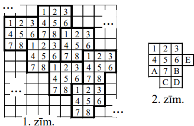

# <lo-sample/> LV.VOL.2009.9.4

Šaurleņķu trijstūrī $ABC$ nogriežņi $AA_{1}$ un $BB_{1}$ ir augstumi, $H$ ir 
augstumu krustpunkts, punkti $M, N$ un $K$ ir attiecīgi nogriežņu $AB$, $AH$ un
$BH$ viduspunkti. Pierādīt, ka $\Delta MKA_{1}=\Delta B_{1}NM$.

<small>

* questionType:
* domain:

</small>

## Atrisinājums

No viduslīniju īpašībām trijstūrī $AHB$ iegūstam $NM=\frac{1}{2} HB$ un 
$KM=\frac{1}{2} AH$; tā kā mediāna pret hipotenūzu ir puse no hipotenūzas, tad 
$B_{1}N=\frac{1}{2} AH=MK$ un $A_{1}K=\frac{1}{2} HB=MN$, kā arī 
$A_{1}M=\frac{1}{2} AB=B_{1}M$. Pielietojam pazīmi $mmm$.

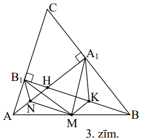

# <lo-sample/> LV.VOL.2009.9.5

Turnīrā piedalās $12$ tenisisti. Katrs ar katru citu spēlē tieši vienu reizi; 
katrā spēlē viens no tās dalībniekiem uzvar, bet otrs - zaudē. Teiksim, ka 
tenisists $A$ ir spēcīgāks par tenisistu $B$, ja vai nu $A$ uzvarējis pret $B$,
vai arī var atrast tādu trešo tenisistu $C$, ka $A$ uzvarējis pret $C$, bet $C$
uzvarējis pret $B$. Par čempionu sauc jebkuru tādu tenisistu, kurš turnīra 
noslēgumā izrādās spēcīgāks par jebkuru citu. Pierādīt:

**(A)** katrs tenisists, kam turnīra noslēgumā ir vislielākais uzvaru skaits, 
ir čempions,

**(B)** nevar būt, ka turnīra noslēgumā ir tieši divi (ne vairāk un ne mazāk) 
čempioni.

<small>

* questionType:
* domain:

</small>

## Atrisinājums

**(A)** pieņemsim, ka $A$ noslēgumā ir visvairāk uzvaru. Ņemsim jebkuru citu 
tenisistu $B$. Ja $A$ uzvarējis $B$, tad $A$ ir spēcīgāks par $B$. Ja $A$ 
zaudējis pret $B$, tad nevar būt, ka nav tāda $C$, ka 
$A \rightarrow C \rightarrow B$; ja tāda $C$ nebūtu, tad $B$ būtu vairāk uzvaru
nekā $A$ (uzvaras pret visiem tiem, pret ko uzvarējis $A$, un vēl uzvara 
savstarpējā spēlē ar $A$.)

**(B)** pieņemsim, ka turnīra noslēgumā ir $2$ čempioni $A$ un $B$, un to 
savstarpējā spēlē uzvarējis $A$. Aplūkosim visus tos spēlētājus, pret kuriem 
$A$ ir zaudējis (tādiem jābūt, jo citādi $B$ nevar būt čempions). Šo spēlētāju 
"apakšturnīra" čempions ir arī visa turnīra čempions (tieša pārbaude). Tātad, 
ja turnīrā ir $2$ čempioni, tad ir arī trešais.

# <lo-sample/> LV.VOL.2009.10.1

Trīs vienādas riņķa līnijas krustojas punktā $P$. Apzīmējam riņķa līniju 
centrus un divus no pārējiem krustpunktiem, kā parādīts 2.zīm. Pierādīt, ka 
$MNCB$ ir paralelograms.

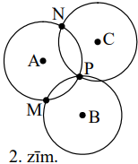

<small>

* questionType:
* domain:

</small>

## Atrisinājums

Viegli redzēt, ka $ANCP$ un $BMAP$ ir rombi, tāpēc nogriežņi $NC$ un $MB$ ir 
vienādi un paralēli. No tā seko vajadzīgais.

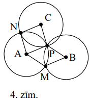

# <lo-sample/> LV.VOL.2009.10.2

Apskatām virkni, kas augošā secībā satur visus naturālos skaitļus, kuri nedalās
ar $3$. Virknes sākums tātad ir

$$1;\ 2;\ 4;\ 5;\ 7;\ 8;\ 10;\ 11;\ \ldots$$

Dots, ka $2n$ pēc kārtas ņemtu virknes locekļu summa ir $300$ ( $n$ - kaut kāds
naturāls skaitlis). Kādas ir iespējamās $n$ vērtības?

<small>

* questionType:
* domain:

</small>

## Atrisinājums

Pastāv divas iespējas:

**(A)** apskatāmie skaitļi ir 
$3k+1;\ 3k+2;\ 3k+4;\ 3k+5;\ \ldots;\ 3k+3n-2;\ 3k+3n-1$. To summa ir 
$(6k+3)+(6k+9)+\ldots+(6k+6n-3)=\frac{n}{2}(6k+3+6k+6n-3)=3n(2k+n)$, tātad 
$n(2k+n)=100$. Abi reizinātāji ir ar vienādu paritāti, tātad pāra skaitļi. 
Apskatot, kā $100$ var sadalīt reizinātājos, iegūstam $n=2$ vai $n=10$; 
attiecīgi $k=24$ vai $k=0$.

**(B)** apskatāmie skaitļi ir 
$3k+2;\ 3k+4;\ 3k+5;\ 3k+5;\ \ldots;\ 3k+3n-2;\ 3k+3n-1; 3k+3n+1$. To summa 
pārsniedz (A) summu par $(3k+3n+1)-(3k+1)=3n$, tātad ir 
$3n(2k+n)+3n=3n(2k+n+1)$. Iegūstam $n(n+2k+1)=100$. Šoreiz $n$ un $(n+2k+1)$ ir
dažādas paritātes, un otrais reizinātājs ir lielāks. Iegūstam iespējas 
$n=1,\ k=49; \quad n=4,\ k=10; \quad n=5,\ k=7$.

# <lo-sample/> LV.VOL.2009.10.3

Maija uz katras no $16$ kartītēm uzrakstījusi " $+1$ " vai " $-1$ ". Kartītes 
novietotas uz galda tā, ka Andris pašas kartītes gan redz, bet uz tām 
uzrakstītos skaitļus neredz. Andris ar vienu jautājumu var norādīt uz jebkurām 
trim kartītēm un uzzināt no Maijas uz tām uzrakstīto skaitļu reizinājumu. Ar 
kādu mazāko jautājumu skaitu Andrim pietiek, lai noskaidrotu visu $16$ skaitļu 
reizinājumu? Vai $17$ kartǐšu gadījumā Andrim pietiek ar $7$ jautājumiem?

<small>

* questionType:
* domain:

</small>

## Atrisinājums

Sešpadsmit skaitļu gadījumā Andris ar $5$ jautājumiem tos visus nevar aptvert. 
Ar $6$ jautājumiem 
$a_{1}a_{2}a_{3}; a_{1}a_{4}a_{5}; a_{1}a_{6}a_{7}; a_{8}a_{9}a_{10}; a_{11}a_{12}a_{13}; a_{14}a_{15}a_{16}$,
sareizinot iegūtās atbildes, Andris sasniedz mērķi.
Septiņpadsmit skaitļu gadījumā Andris sasniedz mērķi ar $7$ jautājumiem 
$a_{1}a_{2}a_{3}; a_{1}a_{2}a_{4}; a_{1}a_{2}a_{5}; a_{6}a_{7}a_{8}; a_{9}a_{10}a_{11}; a_{12}a_{13}a_{14}; a_{15}a_{16}a_{17}$.

# <lo-sample/> LV.VOL.2009.10.4

Kādas vērtības var pieņemt izteiksme 
$S=\frac{|x+y|}{|x|+|y|}+\frac{|x+z|}{|x|+|z|}+\frac{|y+z|}{|y|+|z|}$, ja 
$x, y, z$ - no nulles atšķirīgi reāli skaitļi?

<small>

* questionType:
* domain:

</small>

## Atrisinājums

Tā kā $|a+b| \leq |a|+|b|$, tad neviens saskaitāmais nepārsniedz $1$, un 
$S \leq 3$. Divi no skaitļiem $x;\ y;\ z$ ir ar vienādu zīmi; attiecīgais 
saskaitāmais ir $1$, tātad $S \geqq 1$. Ja $x=y=z=1$, tad $S=3$; ja 
$x=y=1,\ z=-1$, tad $S=1$. Pieņemsim, ka $1<a<3$. Viegli pārbaudīt, ka pie 
$x=1$ un $y=z=\frac{a-3}{a+1}$ iegūstam $S=a$. Tātad $S$ vērtību apgabals ir 
$[1; 3]$.

# <lo-sample/> LV.VOL.2009.10.5

Dots, ka $ABCD$ - kvadrāts un $\sphericalangle MBN=45^{\circ}$ (skat. 3.zīm.). 
Pierādīt, ka $BO \perp MN$.

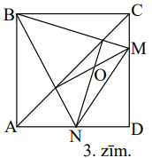

<small>

* questionType:
* domain:

</small>

## Atrisinājums

Tā kā $\sphericalangle MBX=45^{\circ}=\sphericalangle MCX$, tad punkti $B$; 
$C$; $M$; $X$ atrodas uz vienas riņķa līnijas. Tā kā 
$\sphericalangle BCM=90^{\circ}$, tad 
$\sphericalangle BXM=180^{\circ}-90^{\circ}=90^{\circ}$. Tātad $MX$ ir 
$\triangle NBM$ augstums. Līdzīgi pierāda, ka $NY$ arī ir $\triangle NBM$ 
augstums. Tātad $O$ ir $\Delta NBM$ augstumu krustpunkts, no kā seko 
vajadzīgais.

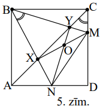

# <lo-sample/> LV.VOL.2009.11.1

Apskatām skaitļu virkni $F_{1}=1;\ F_{2}=2;\ F_{n+2}=F_{n+1}+F_{n}$ pie 
$n \geq 1$. Kāds lielākais šīs virknes elementu daudzums var veidot vienu 
aritmētisku progresiju?

<small>

* questionType:
* domain:

</small>

## Atrisinājums

**Atbilde:** $3$.

**Atrisinājums:** progresijas ar $3$ locekļiem ir, piemēram, $1;\ 2;\ 3$ vai 
$2;\ 5;\ 8$. Pieņemsim, ka progresijas pirmie divi locekļi ir $f_{k}=a$ un 
$f_{m}=f_{k}+d=a+d>d$. Ievērosim, ka $f_{m+1}>f_{m}$ un 
$f_{m+2}=f_{m}+f_{m+1}>f_{m}+d$. Tātad trešais progresijas loceklis var būt 
tikai $f_{m+1}$; tad jau nākošais Fibonači skaitlis 
$f_{m+2}=f_{m+1}+f_{m}>f_{m+1}+d$ ir pārāk liels, lai ietilptu mūsu progresijā.
Tātad vairāk par $3$ locekļiem nevar būt.

# <lo-sample/> LV.VOL.2009.11.2

Atrast skaitļu $3^{3}-3; \quad 5^{5}-5; \quad 7^{7}-7; \ldots; 2009^{2009}-2009$
lielāko kopīgo dalītāju.

<small>

* questionType:
* domain:

</small>

## Atrisinājums

Tā kā $3^{3}-3=24$, tad meklējamais $d$ nevar būt lielāks par $24$. Pierādīsim,
ka visi apskatāmie skaitļi dalās ar $24$; tad būs pierādīts, ka $d=24$. Pie 
nepāra 
$n=2k+1\ n^{n}-n=n\left(n^{2k}-1\right)=n\left(n^{2}-1\right)\left(n^{2k-2}+\ldots+n^{2}+1\right)=(n-1)n(n+1) \cdot Q,\ Q$ -
vesels skaitlis. Skaitļi $n-1$ un $n+1$ ir viens otram sekojoši pāra skaitļi; 
tāpēc to reizinājums dalās ar $8$. Viens no skaitļiem $n-1;\ n;\ n+1$; dalās ar
$3$. Tā kā $LKD(3; 8)=1$, tad $(n-1)n(n+1)$ dalās ar $24$.

# <lo-sample/> LV.VOL.2009.11.3

Atrisināt vienādojumu sistēmu

$$\left\{\begin{array}{l}
x+y^{2}=y^{3} \\
y+x^{2}=x^{3}
\end{array}\right.$$

reālos skaitļos.

<small>

* questionType:
* domain:

</small>

## Atrisinājums

Atņemot pirmo vienādojumu no otrā, iegūstam

$\left(x^{3}-y^{3}\right)=\left(x^{2}-y^{2}\right)-(x-y)$  
$(x-y)\left(x^{2}+xy+y^{2}-x-y+1\right)=0$  
$\frac{1}{2}(x-y)\left[(x+y)^{2}+(x-1)^{2}+(y-1)^{2}\right]=0$

Acīmredzami kvadrātiekava nav $0$, tāpēc iegūstam $x=y$. Tālāk seko vienādojums
$x^{3}-x^{2}-x=0$, no kurienes 
$x_{1}=y_{1}=0; x_{2,3}=y_{2,3}=\frac{1}{2} \pm \frac{\sqrt{5}}{2}$.

# <lo-sample/> LV.VOL.2009.11.4

Andris uzrakstījis $10$ dažādus veselus pozitīvus skaitļus; neviens no tiem 
nepārsniedz $37$. Pierādīt, ka Maija var izvēlēties četrus no Andra 
uzrakstītajiem skaitļiem tā, ka divu Maijas izvēlēto skaitļu summa vienāda ar 
abu pārējo Maijas izvēlēto skaitļu summu.

<small>

* questionType:
* domain:

</small>

## Atrisinājums

Apskatīsim visas Andra izvēlēto skaitļu starpības, no lielāka skaitļa atņemot 
mazāku. Šādu starpību pavisam ir $45$. Tā kā tās ir robežās no $1$ līdz $36$, 
starp tām ir divas vienādas. Pieņemsim, ka tās ir $ab$ un $c-d$, kur $a>c$. Ja 
visi skaitļi $a; b; c; d$ ir dažādi, tad no $a-b=c-d$ seko $a+d=b+c$, un Maija 
var izvēlēties $a; b; c; d$. Atliek gadījums, kad $b=c$. Analizēsim sīkāk 
apskatāmo $45$ starpību sistēmu. Pastāv divas iespējas.

**A.** Starp tām ir $3$ vienādas; varam pieņemt, ka $a-b=c-d=e-f$, kur $a>c>e$.
Ja $b \neq c$ vai $d \neq e$, rīkojamies kā iepriekš. Ja būtu $b=c$ un $d=e$, 
tad nevar būt $b=e$; tādā gadījumā iznāktu $c=b=e=d$ un $c-d=0$ pretruna. Tāpēc
vajadzīgos skaitļus iegūstam no vienādības $a-b=e-f \Leftrightarrow a+f=b+e$.

**B.** Starp $45$ starpībām nav triju vienādu; tad ir $9$ pāri vienādu 
starpību. Ja divi no šiem pāriem ir $a-b=b-c$ un $e-b=b-f$ (ar vienu un to pašu
$b$), tad

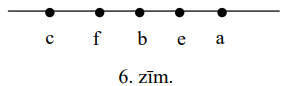

$a-e=f-c$, un mēs iegūstam $a+c=e+f$. Ja katram vienādo starpību pārim ir cits 
$b$, tad iznāk $9$ dažādi $b$, bet tas nevar būt, jo $b$ nav ne mazākais, ne 
lielākais no Andra izvēlētajiem $10$ skaitļiem.

Visas iespējas izanalizētas.

# <lo-sample/> LV.VOL.2009.11.5

Dots, ka četrstūris $ABCD$ ievilkts riņķa līnijā. Pierādīt: trijstūros 
$ABC,\ BCD,\ CDA,\ DAB$ ievilkto riņķa līniju centri ir taisnstūra virsotnes.

<small>

* questionType:
* domain:

</small>

## Atrisinājums

Ja $X$ un $Y$ ir attiecīgi $\triangle ABD$ un $\triangle ABC$ iecentri, tad 
$\sphericalangle AYB=180^{\circ}-\frac{1}{2}(\sphericalangle BAC+\sphericalangle \mathrm{ABC})=90^{\circ}+\frac{1}{2} \sphericalangle ACB$
un līdzīgi $\sphericalangle AXB=90^{\circ}+\frac{1}{2} \sphericalangle ADB$. Tā
kā $\sphericalangle ACB=\sphericalangle ADB$, tad 
$\sphericalangle AYB=\sphericalangle AXB$. Tātad punkti $A,\ X,\ Y,\ B$ atrodas
uz vienas riņķa līnijas, tātad 
$\sphericalangle XYB=180^{\circ}-\frac{1}{2} \sphericalangle DAB$. Ja $Z$ ir 
$\triangle BCD$ iecentrs, tad līdzīgi iegūstam 
$\sphericalangle ZYB=180^{\circ}-\frac{1}{2} \sphericalangle DCB$ Tāpēc 
$\sphericalangle XYZ=360^{\circ}-\sphericalangle XYB-\sphericalangle ZYB=\frac{1}{2}(\sphericalangle DAB+\sphericalangle DCB)=\frac{1}{2} \cdot 180^{\circ}=90^{\circ}$.
Līdzīgi pierāda, ka arī citi vajadzīgie leņķi ir taisni.

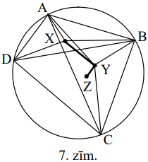

# <lo-sample/> LV.VOL.2009.12.1

Turnīrā piedalījās $12$ tenisisti. Katrs ar katru citu spēlēja tieši vienu 
reizi; katrā spēlē viens no tās dalībniekiem uzvarēja, bet otrs zaudēja. 
Dalībnieku uzvaru un zaudējumu daudzumus apzīmēsim attiecīgi ar $x_{1}$ un 
$y_{1};\ x_{2}$ un $y_{2};\ \ldots;\ x_{12}$ un $y_{12}$. Pierādīt, ka

$$x_{1}^{2}+x_{2}^{2}+\ldots+x_{12}^{2}=y_{1}^{2}+y_{2}^{2}+\ldots+y_{12}^{2}$$

<small>

* questionType:
* domain:

</small>

## Atrisinājums

Skaidrs, ka $x_{1}+y_{1}=x_{2}+y_{2}=\ldots=x_{12}+y_{12}=11$ un 
$x_{1}+\ldots+x_{12}=y_{1}+\ldots+y_{12}$ (katrā spēlē viens uzvar un viens 
zaudē). Tāpēc $y_{1}+\ldots+y_{12}=12 \cdot 11 \cdot \frac{1}{2}$ un 
$x_{1}^{2}+\ldots+x_{12}^{2}=\left(11-y_{1}\right)^{2}+\ldots+\left(11-y_{12}\right)^{2}=121 \cdot 12-22\left(y_{1}+y_{2}+\ldots+y_{12}\right)+\left(y_{1}^{2}+\ldots+y_{12}^{2}\right)=$  
$=121 \cdot 12-22 \cdot 12 \cdot 11 \cdot \frac{1}{2}+\left(y_{1}^{2}+\ldots+y_{12}^{2}\right)=y_{1}^{2}+\ldots+y_{12}^{2}$,
k.b.j.

# <lo-sample/> LV.VOL.2009.12.2

Katrīna uzrakstīja trīsciparu skaitli $n$, kura visi cipari ir dažādi un visi 
atšķiras no $0$. Maija uzrakstīja visus piecus citus trīsciparu skaitļus, kas 
izveidoti no tiem pašiem cipariem, no kā sastāv $n$. Maijas uzrakstīto skaitļu 
summa ir $3434$. Kāds var būt skaitlis $n$?

<small>

* questionType:
* domain:

</small>

## Atrisinājums

Ja Katrīnas uzrakstītais skaitlis ir $\overline{abc}=100a+10b+c$, tad visu sešu
no cipariem $a; b; c$ izveidojamo skaitļu summa ir $222(a+b+c)$, bet Maijas 
uzrakstīto skaitļu summa ir $122a+212b+221c=5(a+b+c)+9(13a+23b+24c)$. Tā kā 
$3434 \equiv 5(\bmod 9)$, tad arī $5(a+b+c) \equiv 5(\bmod 9)$. No šejienes 
seko, ka $a+b+c \equiv 1(\bmod 9)$. Tā kā $6 \leq a+b+c \leq 24$, tad 
$a+b+c=10$ vai $a+b+c=19$.

Ja $a+b+c=10$, tad $n=222 \cdot 10-3434<0$ - pretruna. Ja $a+b+c=19$, tad 
$n=222 \cdot 19-3434=784$. Tas arī apmierina visas uzdevuma prasības.

# <lo-sample/> LV.VOL.2009.12.3

Dots, ka $ABCD$ ir kvadrāts un $E$ ir malas $AB$ iekšējs punkts. Nogriežņi $AC$
un $DE$ krustojas punktā $P$. Perpendikuls, kas no $P$ vilkts pret $DE$, krusto
malu $BC$ punktā $F$. Pierādīt, ka $EF=AE+FC$.

<small>

* questionType:
* domain:

</small>

## Atrisinājums

Atliekam uz $BC$ pagarinājuma $CG=AE$. Tad $\triangle DAE=\triangle DCG$, tāpēc
$\sphericalangle ADE=\sphericalangle CDG$; tātad 
$\sphericalangle EDG=90^{\circ}$. Ap $DPFC$ var apvilkt riņķa līniju 
$\left(\sphericalangle P+\sphericalangle C=180^{\circ}\right)$, tāpēc 
$\sphericalangle PDF=\sphericalangle PCF=45^{\circ}$. Tāpēc 
$\sphericalangle FDG=90^{\circ}-45^{\circ}=45^{\circ}$. Iegūstam, ka 
$\triangle EDF=\triangle GDF$ $(m \ell m)$, tātad $EF=GF=GC+CF=AE+CF$, k.b.j.

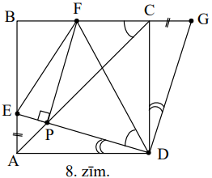

# <lo-sample/> LV.VOL.2009.12.4

Uz kādas planētas izmanto $2009$ valodas. Vai var izveidot vārdnīcu sistēmu tā,
lai vienlaicīgi izpildītos $3$ īpašības:

**(A)** katra vārdnīca ļauj tulkot no vienas valodas uz kādu citu, bet ne 
pretējā virzienā,

**(B)** ja ir vārdnīca, kas ļauj tulkot no kādas valodas $A$ uz kādu citu 
valodu $B$, tad nav vārdnīcas, kas ļauj tulkot no $B$ uz $A$,

**(C)** no katras valodas uz katru citu var pārtulkot, izmantojot vai nu vienu,
vai divas vārdnīcas? (Pieļaujamas vairākkārtīgas tulkošanas, piemēram, no $A$ 
un $B$ un tālāk no $B$ uz $C$.)

<small>

* questionType:
* domain:

</small>

## Atrisinājums

Pierādīsim, ka tāda vārdnīcu sistēma iespējama jebkuram nepāra skaitam valodu 
$n,\ n \geq 3$.

**Bāze.** Pie $n=3$ rīkojamies, kā redzams 9.zīm.

**Induktīvā pāreja.** Pieņemsim, ka $k$ valodām vārdnīcu shēma ietverta 
apgabalā $Q$ (10.zīm.)

Pievienojot vēl $2$ valodas $A$ un $B$, izveidojam shēmu, kas redzama 11.zīm.:

- ieviešam vārdnīcas, kas ļauj tulkot no $A$ uz katru no iepriekšējām $k$ 
  valodām;
- ieviešam vārdnīcas, kas ļauj tulkot no katras no iepriekšējām $k$ valodām uz 
  $B$;
- ieviešam vārdnīcu, kas ļauj tulkot no $B$ uz $A$.

To, ka papildinātā vārdnīcu sistēma apmierina uzdevuma prasības $k+2$ valodām, 
pārbauda tieši, apskatot visas iespējas. Uzdevums atrisināts.

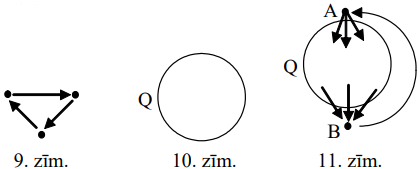

# <lo-sample/> LV.VOL.2009.12.5

Atrisināt vienādojumu

$$x^{3}(x+1)=2(x+a)(x+2a)$$

reālos skaitļos, kur $a$ - reāla konstante.

<small>

* questionType:
* domain:

</small>

## Atrisinājums

Vienādojums pārveidojas par $x^{4}+x^{3}-2x^{2}-6ax-4a^{2}=0$.

Pārrakstīsim to formā $4a^{2}+6xa-x^{4}-x^{3}+2x^{2}=0$ un apskatīsim kā 
vienādojumu attiecībā uz $a$ ar parametru $x$. Viegli iegūstam 
$a_{1}=-\frac{1}{2} x^{2}-x$ un $a_{2}=\frac{1}{2} x^{2}-\frac{1}{2} x$. Tāpēc 
sākotnējais vienādojums pārveidojas par 
$\left(x^{2}+2x+2a\right)\left(x^{2}-x-2a\right)=0$. No šejienes 
$x=-1 \mp \sqrt{1-2a}$, ja $a<-\frac{1}{8}; x=-1 \mp \sqrt{1-2a}$ un 
$x=\frac{1}{2} \mp \sqrt{\frac{1}{4}+2a}$, ja 
$-\frac{1}{8} \leq a \leq \frac{1}{2}; x=\frac{1}{2} \mp \sqrt{\frac{1}{4}+2a}$,
ja $a>\frac{1}{2}$.

